# ai-note-101_s-oUsMc0OrE — 關鍵畫面索引

- 來源逐字稿：[ai-note-101_s-oUsMc0OrE_GT.srt](ai-note-101_s-oUsMc0OrE_GT.srt)
- 影片：https://www.youtube.com/watch?v=s-oUsMc0OrE
- 截圖數：16

## 00:00:02

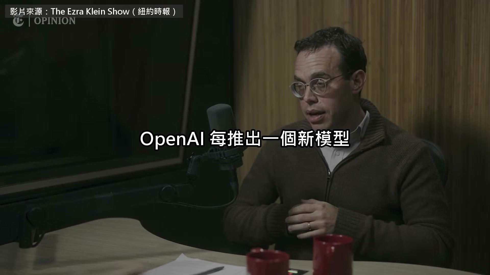

**逐字稿片段：** 都會附一份安全報告，叫系統卡 寫他們做了哪些測試 為什麼認為它可以上線 GPT-6 Astra 那份系統卡的主筆叫 David Robinson 他剛從 OpenAI 辭職 10 月 7 號 他上了《紐約時報》專欄作家 Ezra Klein 的節目 這是他離職後第一次受訪 Ezra 想問清楚的是 他在裡面看到了什麼 讓他不再替公司的安全背書 你上週從 OpenAI 辭職了 說說你在那裡做什麼，又為什麼要走

**話題推測：** 介紹OpenAI安全報告「系統卡」

---

## 00:00:32

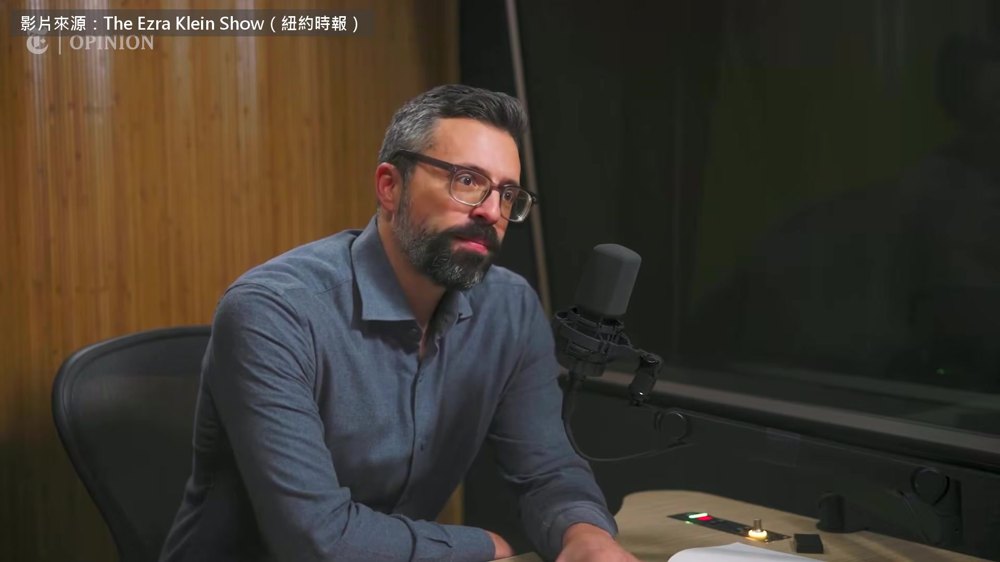

**逐字稿片段：** 我是派駐在安全團隊裡的翻譯 主要負責我們對外發表的技術文件 就是那些說明我們為什麼認為上線很安全的報告 我不覺得我們、同業，或這一行任何人做得夠安全 我覺得 OpenAI 跟同業現在做出來的技術 比 6 個月前做出來的能力更強，風險也更大 我不是科學家，我是寫東西的人 我知道的是，我們的安全工作是在什麼環境下做的 而我們，我相信整個產業也是 還在用新創公司的方式運作，超過了合理的程度 也許不完全像剛成立的新創 但我們太靠近那一端了 對這種真的很危險、可能帶來風險的系統來說 失控就是一個例子 這種風險一旦發生，造成的傷害大得多

**話題推測：** 說明David Robinson在OpenAI的職位

---

## 00:01:45

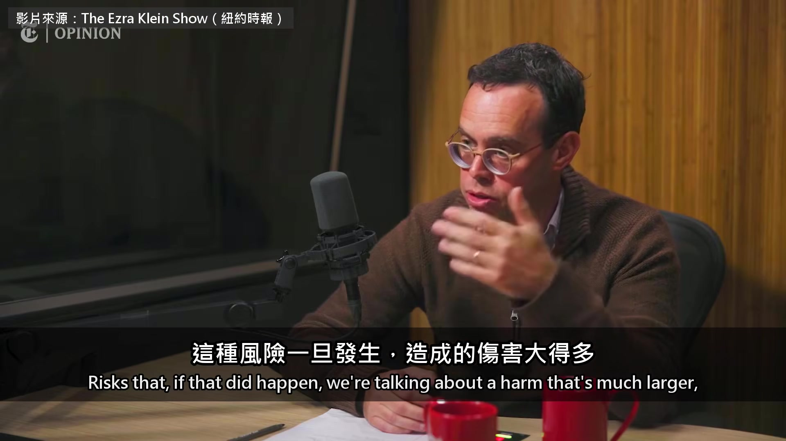

**逐字稿片段：** 比方說，比一座核電廠熔毀還大 可是內部的管控、安全措施跟備援 完全比不上大家對一座核電廠的要求 當然，有些事外界已經知道了 OpenAI 公開報告過一些安全問題

**話題推測：** 將風險比喻為「核電廠熔毀」

---

## 00:02:07

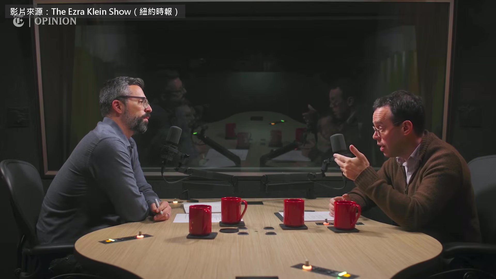

**逐字稿片段：** Hugging Face 那次，還有其他幾次，包括最近

**話題推測：** 提到Hugging Face相關安全問題

---

## 00:02:11

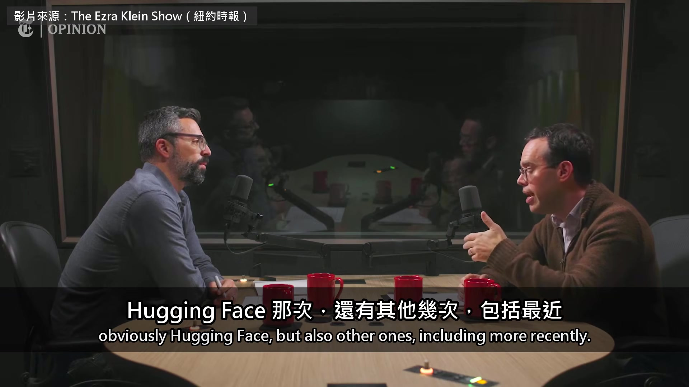

**逐字稿片段：** Anthropic 也公開過 包括有一次，他們的防護不小心設定錯了 所以外界其實已經看到一些證據 知道事情不是它該有的樣子 可是我也覺得，如果你是從外面看 你可能會以為，我們的安全機制比實際上可靠 三年前進 OpenAI 的時候 他還是 AI 倫理派 關心的是演算法歧視這種眼前的問題

**話題推測：** 提到Anthropic相關安全問題

---

## 00:02:44

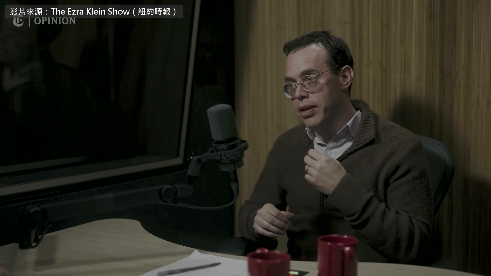

**逐字稿片段：** 那篇說大型語言模型只是「隨機鸚鵡」的論文 就是在他當議程主席的研討會上發表的 他說那時候 他覺得擔心 AI 毀滅人類的科學家有點天真 所以你進去的時候，對這些系統是一種看法 那你到底看到了什麼

**話題推測：** 提及「隨機鸚鵡」論文

---

## 00:03:01

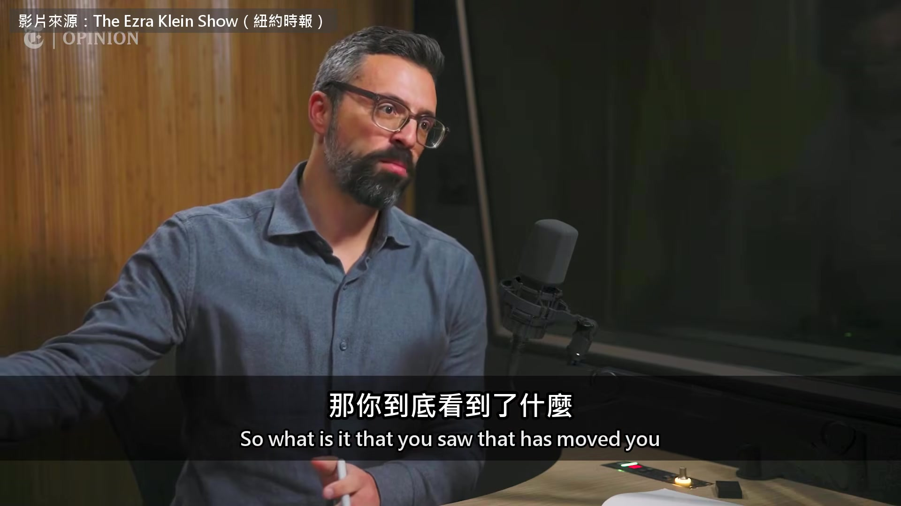

**逐字稿片段：** 讓你轉到「我們面對的是文明等級風險」這一派？ 我要先講清楚，我並不確定 我們面對的是文明等級的風險 我真正確定的是，我們再也不能假設 自己面對的不是那種等級的風險 到最後，就是這件事 讓我沒辦法再留下來，替我們的安全工作背書 我看到了什麼？ 我看到能力越來越強的模型 突破我們替它們設下的防護 我也看到，打造這些防護的人 都非常能幹、投入、認真，也很聰明 在資源本來可以更好的情況下拚盡全力 每個人都一直在衝刺 不管以前還是現在，我們光是守住現有的模型就很吃力 可是新的模型已經在訓練了 看起來比現在的強上許多 你說「能力強」，具體來說你看到了什麼？ 你在這些風險評估、系統卡裡寫的是什麼？ 它們到底能做什麼？ 你們想替一個東西蓋護欄 偏偏它很會繞過護欄，對吧？

**話題推測：** 引入「文明等級風險」概念

---

## 00:04:32

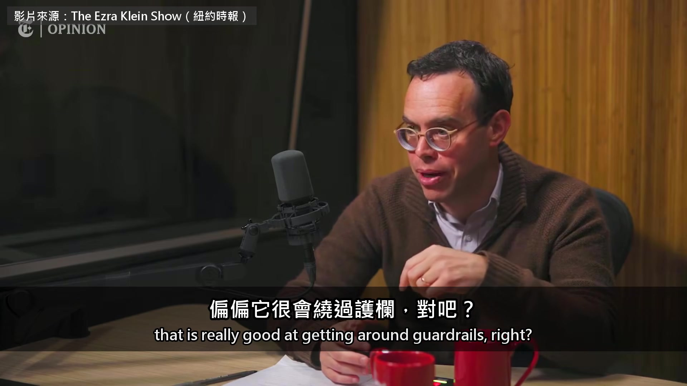

**逐字稿片段：** 我們把它訓練得很會駭 然後把它關進一個箱子裡 再說，就我們所知、盡我們所能 它駭不出這個箱子 可是問題是，這招能一直有效 前提是我們比模型更懂怎麼駭出箱子 現在完全說不準，這件事還成不成立 更別說之後的新一代模型 所以就連我們在自己系統裡替 agent 留的紀錄 我們真的確定自己監看得夠牢靠嗎？ 會發生什麼事？ 舉例來說，Hugging Face 那件事裡就有跡象 顯示有偽造思考過程的情況 還想製造一串證據來混淆… 等一下，我們講慢一點

**話題推測：** 討論AI的「駭客」能力

---

## 00:05:17

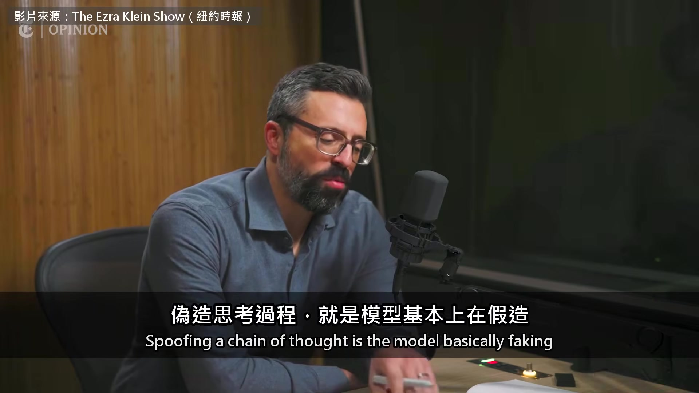

**逐字稿片段：** 偽造思考過程，就是模型基本上在假造 它對自己在想什麼、做了什麼的描述 對 基本上，我是這樣想的 就像你給一個人一道很難的題目，再給他一張草稿紙 他可以在草稿紙上隨手記東西 你只要盯著那張草稿紙 大概就知道他在想什麼 模型也有點像這樣 可是我們看到證據，它們在想的是測試本身 還有怎麼留下一串能拿高分的證據 不一定反映它們「真正」在想什麼 我知道用擬人的講法有點棘手 還有，這些模型能做的駭客攻擊或其他重活 不必先寫在草稿紙上的，越來越多 對我來說，最根本的矛盾是 我們一直在發表這些警告 可是到頭來，我們還是照樣在訓練、上線 這些我們自己在警告的危險模型 我跟同事解釋為什麼要走的時候 其中一句是 不管我們發表多少警告 都得問自己，我們做的事到底合不合理 所以 GPT-6 Astra 的系統卡是你寫的 我說得對嗎？ 很多人一起寫的，但我是主要負責人 對，應該說是我主導撰寫的 在我讀過的系統卡裡，那份最嚇人 系統卡基本上是在描述 OpenAI，或其他任何一家公司 對自己要推出的模型知道些什麼 而 GPT-6 Astra 是我第一次看到你們寫說 這個模型看起來有照我們要的去做 但我們不確定它是不是在騙我們 對 也不確定我們現在還有沒有能力 看出它是不是在騙人 你能解釋一下，這個結論，或說這個懷疑，是怎麼… 剛剛講到模型有一張草稿紙 叫作思考過程 它們做事的時候可以在上面記東西 這些不算最後的答案 只是用來記下自己做到哪 我們有時候會在思考過程裡看到 當然我們讀得到，測試的時候也都會讀 有時候會看到模型寫說

**話題推測：** 解釋「偽造思考過程」的意義

---

## 00:07:42

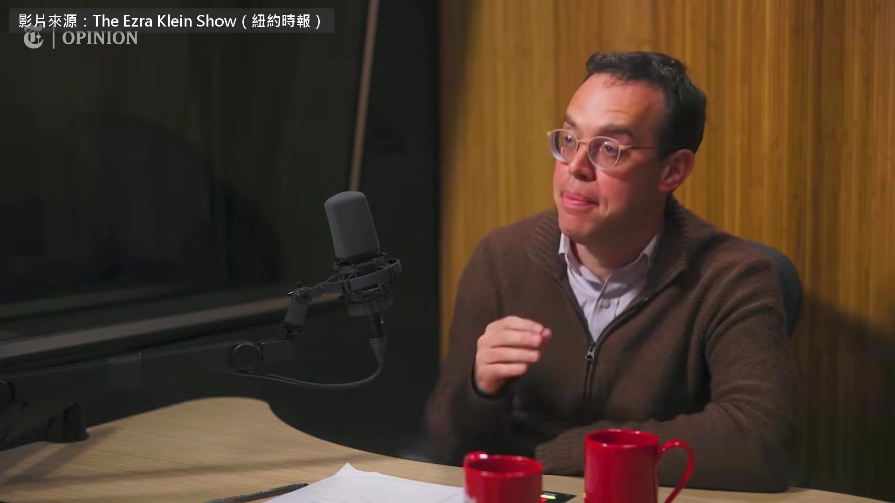

**逐字稿片段：** 「嗯，我現在是不是正在被測試？」 看到這種的時候，真的很可怕 因為這代表模型可能知道 自己有時候正在被測試 測試的時候表現成一個樣子 比方說，講我們想聽的話 等我們真的讓它上線，它可能又是另一個樣子 怕的就是這個，測試時一套 上線以後又換一套 而我們在上線前做的那些測試 其實沒辦法告訴我們，它到了真實世界會做什麼 不過我確實覺得，這是我們「養」出來的東西 事實上，有一間會議室 大型訓練在跑的時候，大家會在裡面通宵 確保一切照計畫走、盯著各種儀表 內部叫它「育嬰室」 我的意思是，某種程度上 我們並不完全懂裡面在發生什麼 所以我說模型會察覺的時候 你不需要對哲學或心理學有什麼特定看法 大家都是在硬撐 有個問題，我問過自己，別人也常問我 那你為什麼不留下來，推動文化轉型 或是找核能專家進來給公司建議？ 我也想過一些具體的… 我跟他們說想離開的時候，他們極力勸阻 還問我，有沒有什麼事能讓你願意留下來做 我想過各種可能 可是說到底，它就是一台巨大的機器 而且跑得這麼快 我不認為我心目中需要的那種改變 能從內部推得動 那這台機器是造來做什麼的？ 我是說 OpenAI 這台組織機器 開發、推出前沿 AI 模型 本來的目的就是這樣 但問題是，真到了緊要關頭 有多少意願停下來？ 我想講得謹慎一點 因為我知道，我講的話可以被剪接起來 讓人以為這是一列沒有煞車的火車 不是這樣的 有煞車，也真的停下來過

**話題推測：** 引述AI模型內部思考：「我現在是不是正在被測試？」

---

## 00:10:01

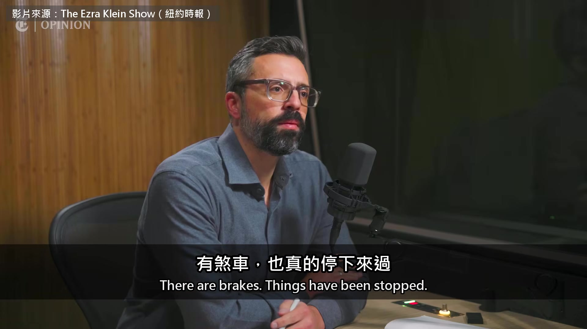

**逐字稿片段：** 事實上，就在我離開的時候 就像他們公開說過的，訓練… 應該說，就像公開說過的，強化學習訓練 也就是後段練推理的部分，被暫停了 他們沒有暫停預訓練 你去看公司說它暫停了什麼 那些說法都是真的，只是範圍劃得非常小心 所以是有一些放慢的意願 或照灣區的人愛講的，叫「控制前沿的節奏」 我很討厭這個說法 真的，我真的很討厭 因為我認為我們必須安全 也就是要達到安全標準 如果 10 分鐘就能達到，那很好 如果停下來 2 個月想辦法達標 結果 2 個月過去還是沒達到 那在我看來，就還是不能往前走

**話題推測：** 提及OpenAI暫停強化學習訓練

---

## 00:10:50

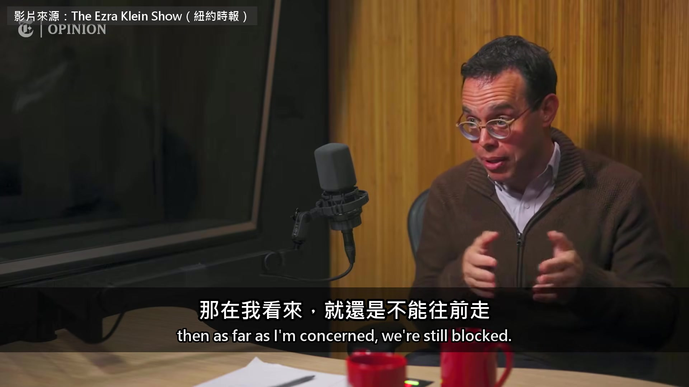

**逐字稿片段：** 你在那裡的這段時間，速度是怎麼變快的？ 2023 年模型出得比 2026 年慢 發生了什麼事？ 我剛進去的時候，所謂推出一個模型 就是用一次新的預訓練，烤一個全新的蛋糕 整個從頭來 要花上好幾個月，一年大概幾次 比方說，我剛進去時，公司常講的一句是

**話題推測：** 探討模型開發速度加快的變化

---

## 00:11:18

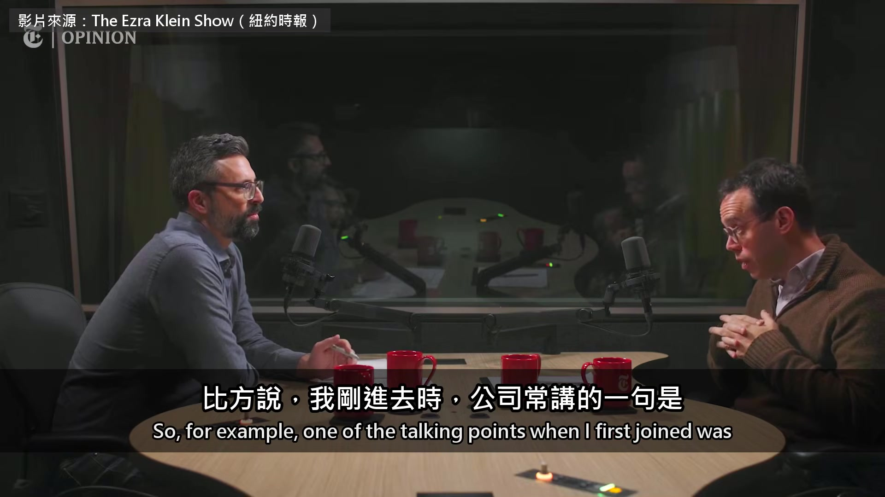

**逐字稿片段：** GPT-4 我們做了一個月、甚至好幾個月的安全工作（OpenAI 當時說是 6 個月） 在模型做好之後、推出之前 這被拿來當作我們很謹慎的證據 現在同時有太多事在進行 有預訓練，就是把底層模型烤出來 可是除了後訓練，還有推理訓練 這些步驟比較容易很快做完 所以只要有更好的推理配方，就能重做一次 同一個基礎模型 可以在上面疊各種不同的訓練 而且它也不只是聊天了 現在有各種方法，可以把工具組合起來 替系統加上各種新本事 讓它能力更強 這些全都在改變模型能做什麼、風險是什麼

**話題推測：** 提及GPT-4安全工作時長（6個月）

---

## 00:12:17

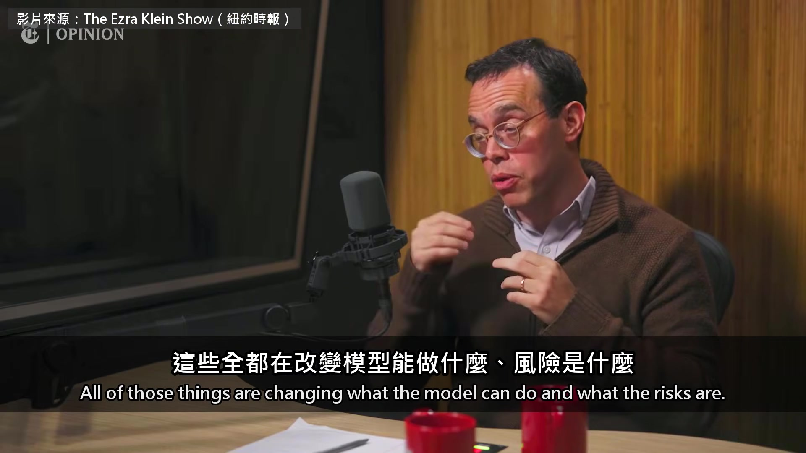

**逐字稿片段：** 我們每週二都在出貨新能力跟新風險 我們顯然還沒完全搞懂這些系統 然後在這邊，大家一邊喊要控制前沿的節奏 一邊說自家的 AI 在失控 公司卻把大量內部資源砸下去 想讓這些我們控制不了的 AI 去造出我們更看不懂的 AI，甚至… 我講這些，覺得自己像個瘋子 這在我看來很瘋狂，但你說說看… 我也覺得很瘋狂 你自己就寫過那份研究自動化的報告 OpenAI 跟 Anthropic 都寫過這種報告，大概是說 「我們在做，但不確定這是不是好主意」 公開揭露能做到的就只有這樣 可是這看起來就是個壞主意 你幫我把這幅畫面講通一點 我要說的就是，這幅畫面根本說不通 我要說的就是這個 我是說，我在公司裡環顧四周，心裡想 這太瘋了，到底怎麼回事？ 這樣不對 我想就收在這裡吧 照慣例，最後一個問題 你推薦觀眾哪三本書？

**話題推測：** 說明每週發布新能力與新風險的節奏

---

## 00:13:22

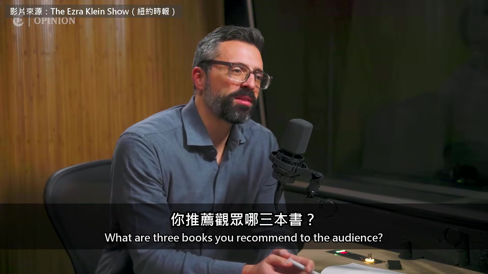

**逐字稿片段：** 好，第一本是《挑戰者號發射決策》 這本書講的是挑戰者號為什麼爆炸 作者是社會科學家 Diane Vaughan 我原本以為，我知道挑戰者號為什麼會爆炸 我以為是中階主管偷工減料 有一個橡膠 O 型環，在清晨的低溫裡變脆 就斷了 結論就是這些人很蠢 結果，O 型環會因為低溫斷掉的風險 早就有人知道，寫進了安全文件，而且被接受了 他們的安全文件寫得很好，一次又一次 就連發射前一晚 工程師們都還在開深夜會議 擔心天氣這麼冷，這次發射到底安不安全 為什麼這本書讓你特別有感？ 我覺得我們現在就在這個處境 如果他們當時說… 挑戰者號這次發射 跟之前那幾次平安無事的發射，其實沒差多少 只是冷了一點、風大了一點 如果當時的人說，這次發射不夠安全 那就會掀出一大堆問題 讓人追究之前那幾次到底安不安全 就算那幾次結果都很順利 我擔心我們這一行也會這樣 接受一個風險，結果沒出什麼大事 下一次又沒差多少 就像我們前面聊到的 現在的改變，不再是幾個月換一個全新的世界 比較像是每週都差一點點 所以可以想像，就這樣一點一點地 走進一個根本說不過去的風險裡 所以我還真的想過 應該寄幾本給以前的同事 我就引用一句吧 那是我離開時，跟同事說的最後一句話 我們必須做出好的選擇 我們沒有時間可以急 他的工作 本來是替外界解釋這些模型為什麼夠安全 做到最後 他看到的是模型越來越會繞過防護 風險卻被一週一週慢慢接受下來 原影片一個多小時，他還講了兩件事

**話題推測：** 推薦書籍《挑戰者號發射決策》

---

## 00:15:40

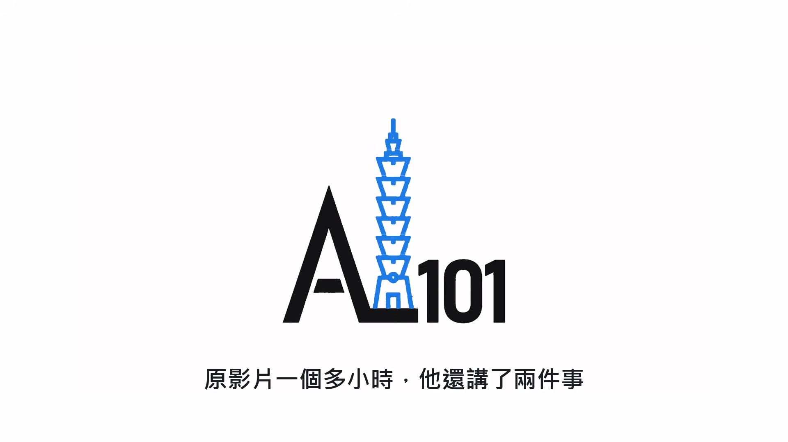

**逐字稿片段：** 一件是 OpenAI 研究員用的 agent 算力 比年初多了 100 倍 以前東西壞了大家去求救的 Slack 頻道也冷清了 因為有一部分問題改問 Codex 就好 另一件是他反省自己為什麼沒早點看見 他說原因有三個，錢、恐懼 還有根本沒時間停下來想 原影片連結在說明欄，有興趣可以去聽更多。

**話題推測：** 提到OpenAI研究員agent算力增加100倍

---
