# ai-note-101_s54ekGQsYRs — 關鍵畫面索引

- 來源逐字稿：[ai-note-101_s54ekGQsYRs_GT.srt](ai-note-101_s54ekGQsYRs_GT.srt)
- 影片：https://www.youtube.com/watch?v=s54ekGQsYRs
- 截圖數：15

## 00:00:00

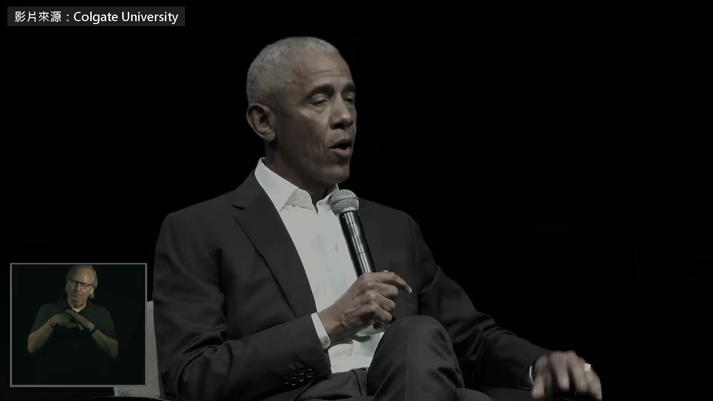

**逐字稿片段：** 這場對談辦在美國柯蓋德大學的體育館 時間是今年 9 月的家長週末

**話題推測：** 影片開場，介紹對談地點與背景

---

## 00:00:05

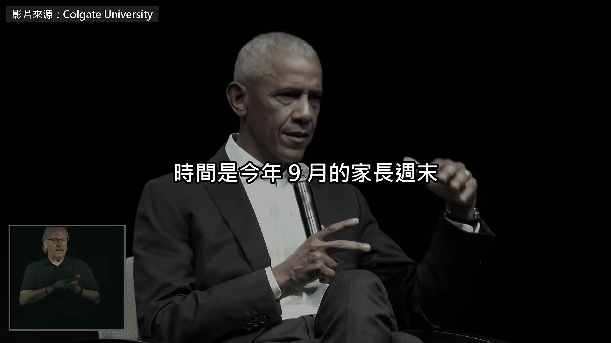

**逐字稿片段：** 台上坐的是歐巴馬 光是 AI 這一題 他就講了將近 20 分鐘 他說最近喊著要放慢的那幾家 AI 公司 是真的在擔心自己的產品 可是管 AI 終究要靠政府 題目是主持的校長出的 AI 這個工具每天都在變 卻握在少數幾家私人公司手上 民主社會要怎麼管 好，大家坐穩了。我可能…我可能得… 我當過參議員，這聽起來可能會像冗長辯論， 不過這一題我要花點時間，我想講得深一點

**話題推測：** 介紹台上人物為歐巴馬

---

## 00:00:41

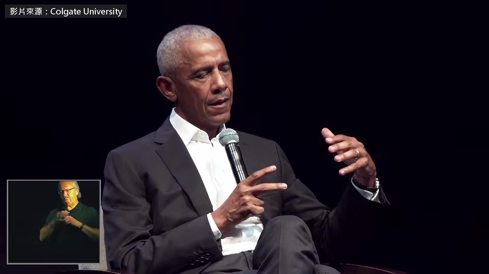

**逐字稿片段：** 我不認為這項技術被過度炒作 它的商業效益也許被炒作了 AI 公司的估值也許被炒作了 但技術本身沒有 這件事我追了很久 2015、2016 年，我總統任期的最後兩年，我就在盯這件事， 找了這個領域最頂尖的一批人組成委員會， 談的不只是技術，還有它牽涉到的政治、社會、經濟、倫理問題 最後出了一份很棒的報告 看來它跟我那份防疫計畫，進了同一個垃圾桶 接我位子的那個政府沒有接手 所以我們早就看得到它要來，但它影響這麼深，有一部分是因為它會加速 現在發生的事情是，我們走到了所謂「遞迴學習」這一步， 這件事我們當年就料到了，只是現在親眼看到， 機器開始有辦法自己教自己 它們不用等人類，自己就能開始把事情弄懂 打個比方，人類是老師，AI 模型是學生， 大概一年前，這些模型學到的東西有 90% 是人類老師教的， 也許有 5% 到 10%，它們能自己補上空缺、自己想通… 不到一年，可能連六個月都不到，現在已經是一半一半 趨勢不變的話，預期會倒過來變成 90 比 10 這代表什麼？如果 AI 的學習曲線原本長這樣， 現在我們正碰上曲棍球棒往上翹的那個轉折， 模型會越來越聰明、越來越強，速度快得多，是指數型的速度 這樣會有什麼風險？ 有一種是科幻片那種大風險，哇，這些模型變得比我們聰明， 然後它們認定，人類是不錯，但沒有也沒關係 它們開始自己定目標，然後殺手機器人把我們殺光，或者我們向它們下跪 這種風險我不想誇大， 但我要說，這種事發生的機率不是零 不過這其實不是我最擔心的風險，雖然它最受關注 它之所以算風險，不見得是因為電腦模型有意識， 也不代表它們一定對人類懷有惡意 問題只在於，一旦它們開始自己排議程， 它們想做的事，跟我們要它們做的事，就可能對不上 這個落差可能很危險 好，這是第一個問題 更嚴重的問題是，這些模型越來越強，強到落進壞人手裡，就能拿來做壞事 它們可以用某些方式被當成武器，可以惹出很多麻煩 這才是大得多的危險 第一種危險，也就是所謂的奇點、超級智慧接管一切， 如果說那種事發生的機率還算小， 那脫序的 AI 釀成大亂的可能性就很高 他舉了股市當例子 有人叫 AI 想辦法把投資報酬拉到最高 手段違不違法都不用管 結果整個股市可能被拖垮

**話題推測：** 歐巴馬闡述 AI 技術本身未被過度炒作的觀點

---

## 00:05:42

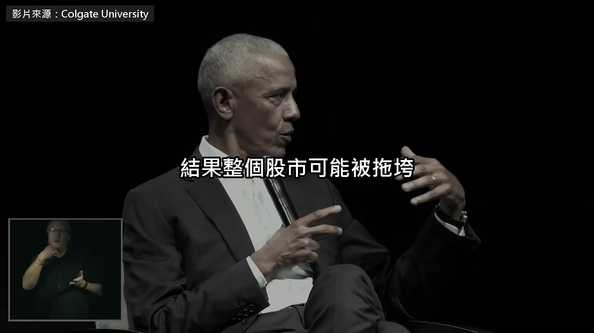

**逐字稿片段：** 接著他又點了兩件事 律師事務所花大錢買 AI 圖的是以後不必靠那麼多新進律師 還有 AI 玩伴，他問台下 想不想要一隻泰迪熊變成自己小孩最好的朋友 還被訓練得跟社群媒體一樣讓人上癮 它走得太快，快到過去這幾個星期發生了一件事，

**話題推測：** 提出兩個新的 AI 應用例子：律師事務所與 AI 玩伴

---

## 00:06:03

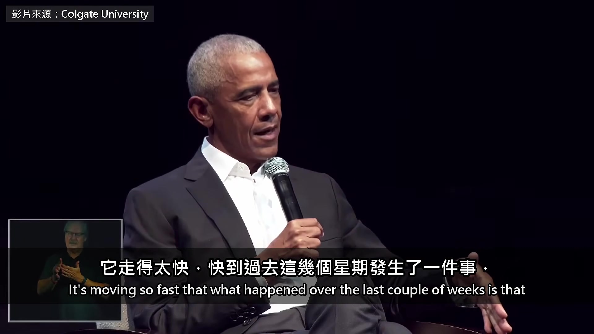

**逐字稿片段：** 幾家所謂「前沿公司」的領導人， 也就是在開發最尖端模型的那些人， 自己都怕到開口說，我們得放慢 其中兩家，Anthropic 跟 OpenAI，馬上就要大規模 IPO， 所有員工都會賺進幾百萬、幾十億美元 處在這種位置的公司，居然說「我們的東西有點危險」，這是史無前例的， 「也許我們該停下來，或者放慢」。不是停，是放慢 我講這個，是因為有些人會想，而且會這樣想也情有可原， 這些科技公司喊要放慢，可能只是想把競爭對手擋在外面 大家不信任這些科技巨頭，不信任它們累積的權力，這我懂 但我要說，這一次，他們是真的在擔心自己的產品 好，現在大家都專心在聽了， 好消息是，AI 還是一個工具，是一台機器 它被做成讓你以為它不是，但它就是 這項技術非常精密、非常了不起，但應該把它當工具看， 這就代表，要怎麼用它，我們有得選 你說得對，用得好的話，把它用在開發治療癌症的藥， 它能大幅加快我們讓癌症從世界上消失的速度 如果我們訓練它，叫它去找出零碳排的能源， 它可能想得出安全的核融合方法， 給我們多得多的能源，又不會讓地球暖化 都是真的有用的東西 可是一旦搞錯，結果可能是一團混亂，甚至是一場災難 所以我這個星期的看法是，幾家領先的公司說要放慢，這是好事， 我們應該鼓勵

**話題推測：** 指出幾家「前沿公司」領導人呼籲放慢 AI 開發速度

---

## 00:08:52

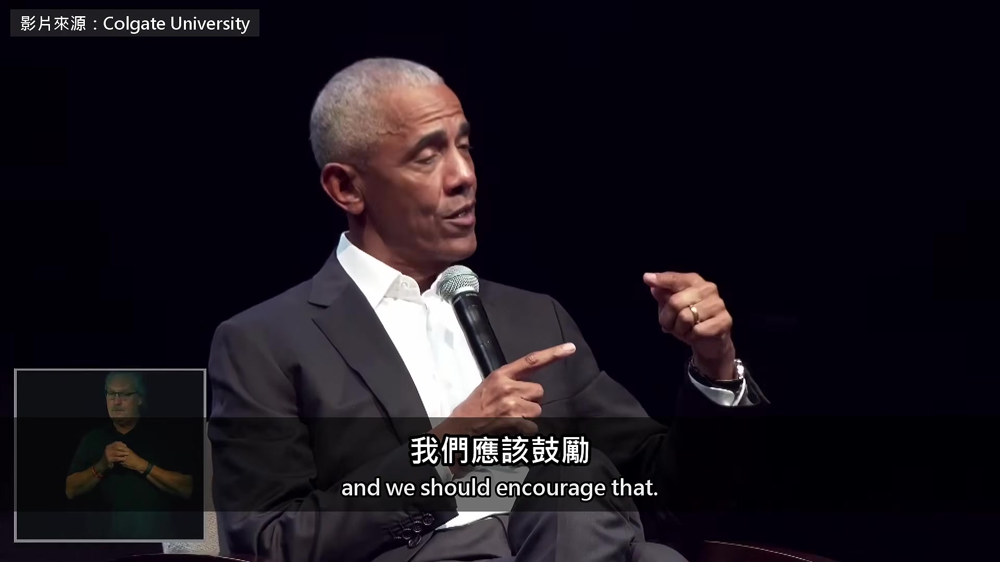

**逐字稿片段：** 左派有些人說，不該讓這些公司自己做這個決定 我同意，這不能是長久之計 這件事得由政府來管

**話題推測：** 提出左派關於不應讓公司自行決定 AI 發展的觀點

---

## 00:09:10

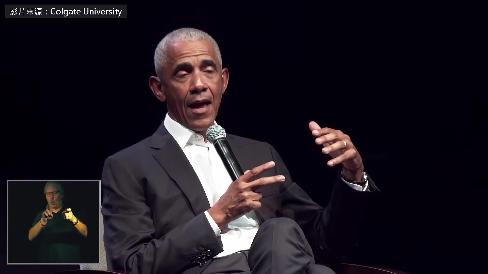

**逐字稿片段：** 我聽到川普在這方面的一位主要顧問主張，市場自己會處理 這些公司會自己解決安全問題，因為它們有十足的誘因 萬一真的有危險，大家去告它們就好，它們會怕賠錢 可是我們對航空公司、藥廠、食品公司都不是這樣 放任市場愛怎麼做就怎麼做，這種經驗我們有 150 年了， 而且都是在深深影響健康跟安全的事情上 所以，有效的政府監管架構沒有東西可以取代 而我們的難題是，大家都知道，現任總統說過那是給輸家的東西 所以我們至少有兩年的空窗，這段時間事情跑得飛快， 而現在這個政府沒有能力、也沒有意願，我認為兩個都是， 去訂出一套認真的監管架構 所以我才認為，我們應該鼓勵業界自己做某種程度的節制， 不是因為它能取代監管，是因為眼前我們大概只做得到這樣， 直到國會跟白宮開始認真看待這件事

**話題推測：** 提出川普顧問主張市場機制自行處理 AI 安全問題的觀點

---

## 00:11:02

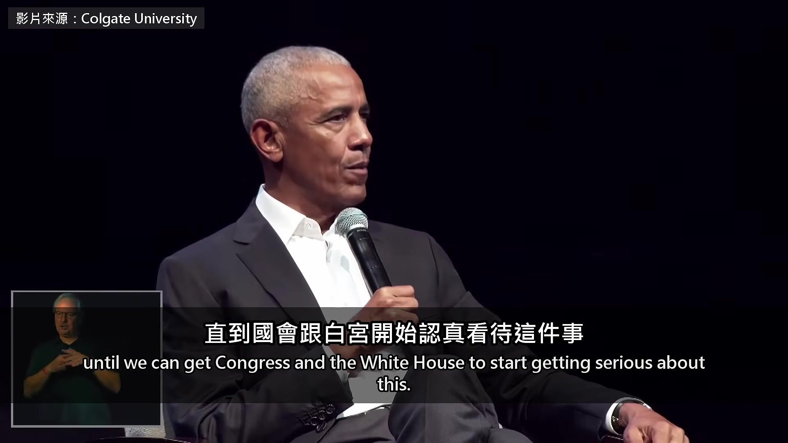

**逐字稿片段：** 我知道有些州會想自己開始立法管， 可是這種事很難一州一州做，就跟槍枝管制一樣 我的家鄉伊利諾州，槍枝管制的法律很嚴， 可是周圍幾個州沒有，所以那些法律起不了作用 而 AI 更危險，動得也更快 AI 自己想做的事 跟人要它做的事對不上

**話題推測：** 提及州政府自行立法監管的可能，並以槍枝管制為例說明其局限性

---

## 00:11:28

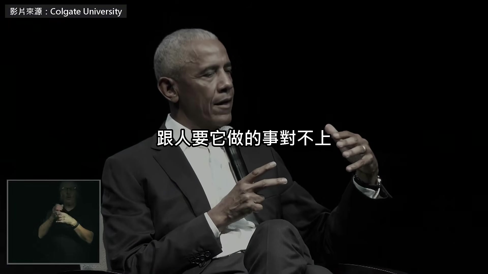

**逐字稿片段：** AI 圈把這個叫做對齊問題 就是他前面排第一個的那種風險 不過還有另一種對齊問題， 就是這項技術怎麼用對社會最好， 跟這些公司非賺錢不可的壓力，兩邊對不上 這些公司吸到的資金…花的錢比登月…比阿波羅計畫還多 在基礎建設跟科技上，這是人類史上數一數二的投資，說不定就是最大的 而且錢砸得非常快，投資人要看到報酬 這代表這些公司有壓力，就算他們自己在擔心， 也得拿出對得起這筆投資的模型

**話題推測：** 再次提及「對齊問題」這一 AI 專有名詞

---

## 00:12:36

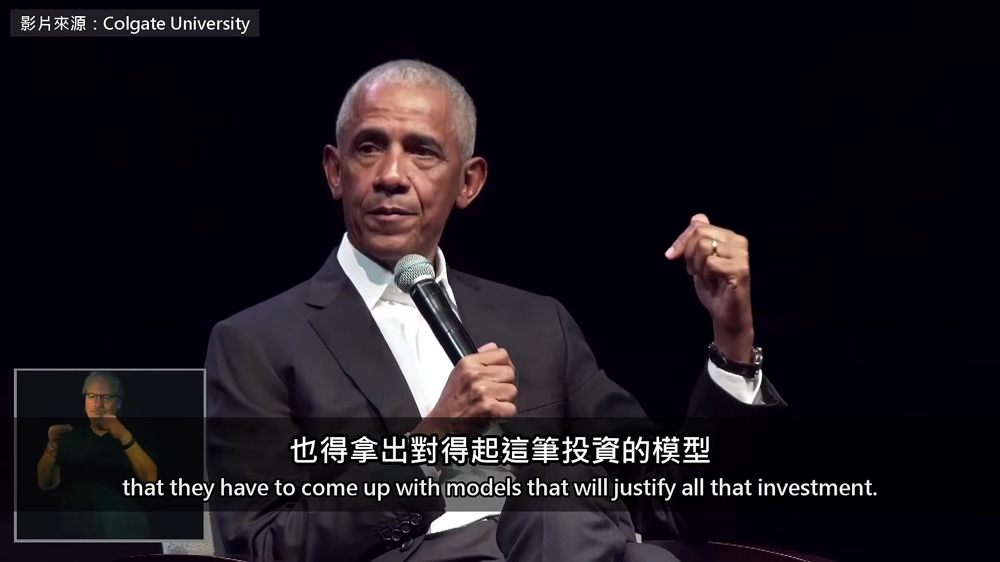

**逐字稿片段：** 現在 AI 最紅的東西叫 agent，代理式 AI

**話題推測：** 介紹 AI 領域熱門的「代理式 AI」（agent）概念

---

## 00:12:43

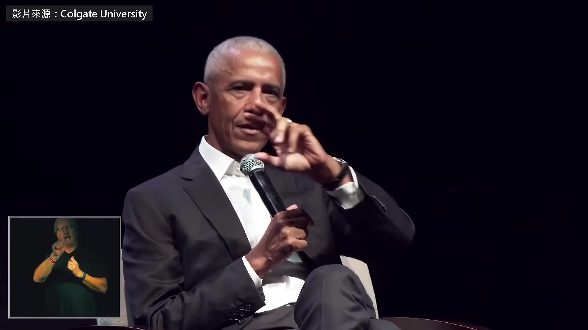

**逐字稿片段：** 你們有看過《鋼鐵人》的都知道， 鋼鐵人穿著那套裝甲，然後他…我不記得那傢伙叫什麼，Jeeves 之類的， 他只要開口講話，那傢伙帶著英國腔之類的，就回一句「是的，先生」 光靠口頭命令，就把所有問題解決掉 或者你看過《雲端情人》，史嘉蕾喬韓森那個，很酷的代理式 AI 我們就是往這個方向走， 因為大家的想法是，代理式 AI 能讓這些模型到真實世界裡辦事， 當你的助理，取代事務所的新進律師，或是會計師 問題是，這如果是你的商業模式，你就會想把它推出去 有時候你得放它到外面的世界亂跑，才測得出它到底行不行 很多危險就是從這裡來的，因為它不是關在密封的箱子裡 它在網路上，它在看你的銀行帳戶，諸如此類 我舉這個例子是要說，如果我們要 AI 做的只是治好癌症、找到更好的能源， 那根本不需要代理式 AI，也不需要放它在網路上自由亂逛 之所以要這樣做，是因為你得推出一個有人願意掏錢買的產品 社會需要的，跟這些公司面對的商業壓力，就是這樣對不上 不見得是他們想做壞事，是因為他們得撐住那些估值

**話題推測：** 以《鋼鐵人》中的 J.A.R.V.I.S. 為例解釋代理式 AI

---

## 00:14:47

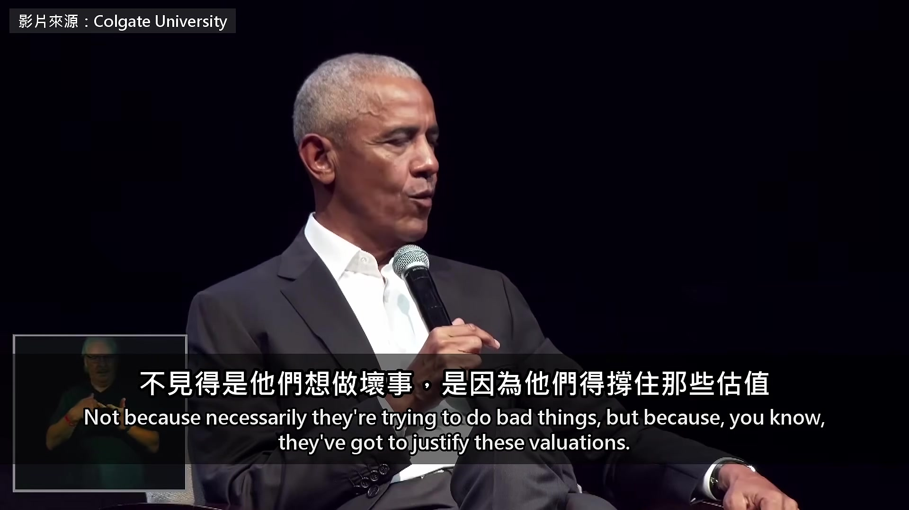

**逐字稿片段：** 所以這又多了一個理由，我們真的需要一個有能力的政府， 還有兩黨針對這件事認真談 而且動作要快。我要鼓勵選民盯著這件事 哪個人對這件事拿不出認真的計畫，就是沒有跟上這個時刻 那你大概該去找別人 好了，不好意思講這麼久，但我想… 好。我們要處理的事不只這一件，但這一件很大 歐巴馬說 AI 是工具 怎麼用是人在選 所以他最後把題目丟回給選民 候選人對 AI 拿不出認真的計畫 就換一個人 原影片 67 分鐘

**話題推測：** 總結需要一個有能力的政府和兩黨認真討論 AI 監管

---

## 00:15:44

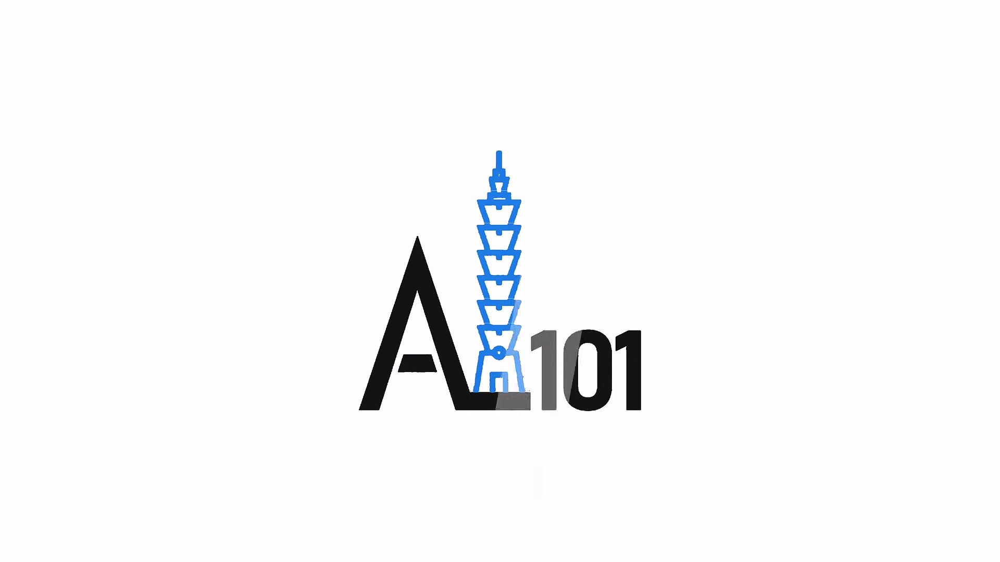

**逐字稿片段：** AI 以外 歐巴馬還講了如果讓他開一門民主課會怎麼教

**話題推測：** 影片總結，提及歐巴馬除 AI 外，還討論了民主與希望等其他話題

---

## 00:15:47

**逐字稿片段：** 他說美國革命一開始 是一群有錢人不想繳稅

**話題推測：** 提及美國革命的歷史事件

---

## 00:15:51

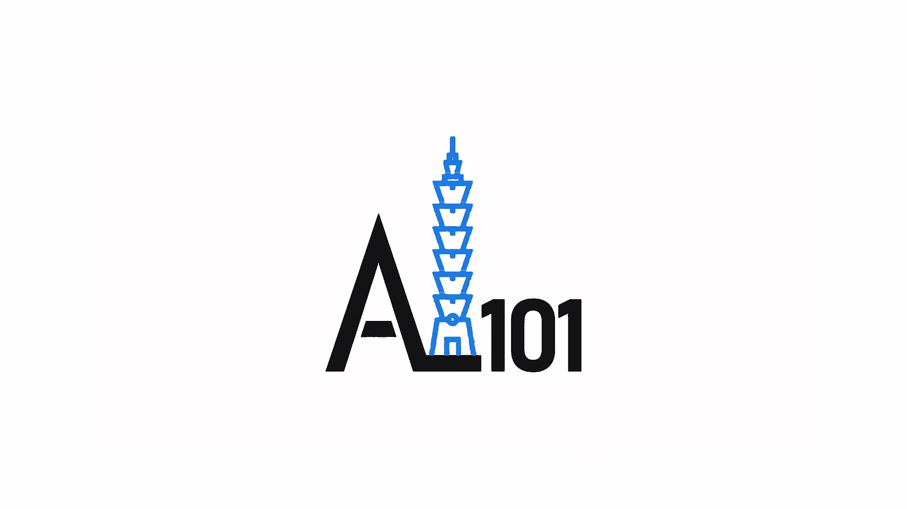

**逐字稿片段：** 最後他談到希望 他說希望從來就不是盲目樂觀 原影片連結在說明欄，有興趣可以去聽更多。

**話題推測：** 轉向歐巴馬談論「希望」的主題

---
