# ai-note-101_wBmjNEMA1jY — 關鍵畫面索引

- 來源逐字稿：[ai-note-101_wBmjNEMA1jY_GT.srt](ai-note-101_wBmjNEMA1jY_GT.srt)
- 影片：https://www.youtube.com/watch?v=wBmjNEMA1jY
- 截圖數：35

## 00:00:01

**逐字稿片段：** 比爾蓋茲上了 David Letterman 的深夜節目 Letterman 問他 電腦還會不會有我們現在想不到的下一步 我們現在做的，多半是把電腦當成工具 幫我們學習，或是找到興趣相同的人 也許有一天，我們會想出怎麼讓電腦思考 但那其實是非常難的問題 事實上，這方面幾乎毫無進展 所以沒人知道什麼時候會發生，有人覺得永遠不會 我們也不希望它們會思考吧？ 我想不太希望 想起來滿可怕的 那是 30 年前 這兩個禮拜

**話題推測：** 引述 1996 年比爾蓋茲上 David Letterman 節目的歷史畫面

---

## 00:00:36

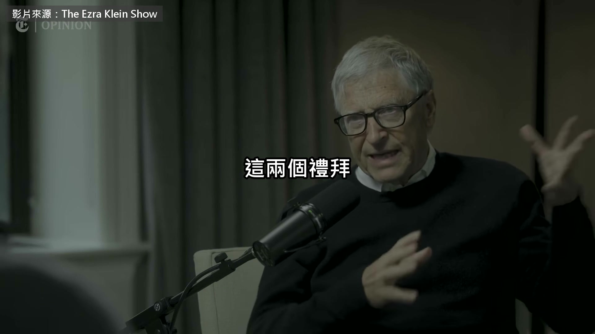

**逐字稿片段：** 比爾蓋茲至少上了四個節目 一直在敲 AI 的警鐘 這一集我們把其中三場剪在一起 9 月 15 號泰晤士報的 podcast 9 月 27 號 NBC 的《Meet the Press》 還有 9 月 29 號紐約時報的 Ezra Klein 訪談 每一段是哪一場，我們都會先講 剛剛那段 Letterman 就是 Ezra 在訪談一開頭放給他看的 接著問他，從那時候到今天 中間發生了什麼

**話題推測：** 轉到現今比爾蓋茲對 AI 敲響警鐘的畫面

---

## 00:01:02

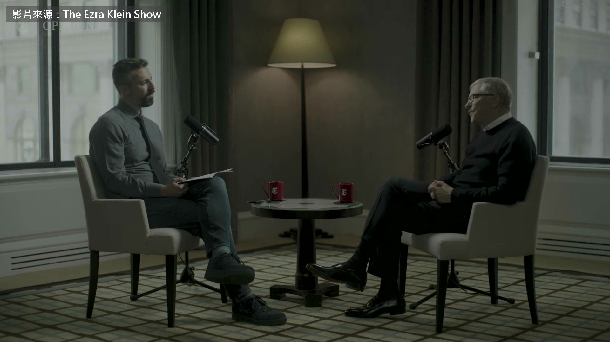

**逐字稿片段：** 我那時常去 OpenAI，看他們在做什麼 我出了一道題給他們：如果你能讀完生物課本，考過 AP 大學先修考試 而且拿滿分，也就是 5 分 那你就證明了你真的讀得懂，能把知識變成拿得出來用的形式 結果在公開發表前 6 個月，Sam、Greg 跟 Ilya 來了

**話題推測：** 開始講述比爾蓋茲與 OpenAI 的互動經驗

---

## 00:01:32

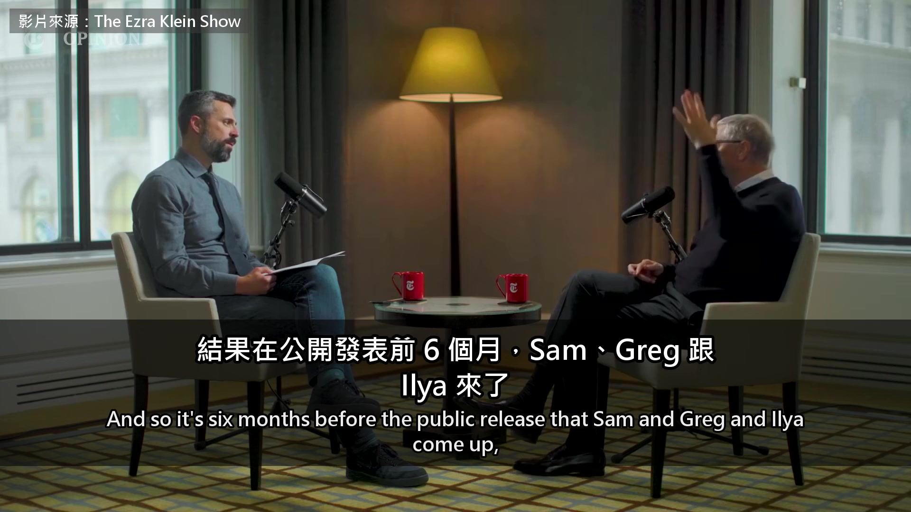

**逐字稿片段：** 在我家當場示範，AP 考試考到 5 分 就連我自己出的、它不可能看過的題目，非常複雜的生物題 它也幾乎全對 那是第一次震撼 第二次震撼

**話題推測：** 提到 AI 在 AP 生物考試中取得滿分 5 分的具體成就

---

## 00:01:53

**逐字稿片段：** 我們換到 9 月 15 號泰晤士報那場來聽 然後，差不多等級的經驗是在去年底

**話題推測：** 切換到比爾蓋茲 9 月 15 號泰晤士報 podcast 訪談內容

---

## 00:02:01

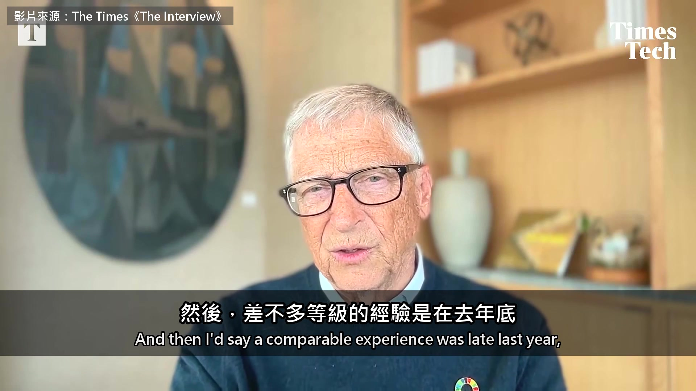

**逐字稿片段：** 特別是 Claude 寫程式的能力，現在不只 Claude 在很多方面超過了我自己寫程式的能力 對我來說就是：「天啊，這是大事」 因為那代表，網攻風險跟生物風險的門檻到了 所以我以為：「好，大家都會跑來討論這件事了」 因為這些門檻到了，我們一直知道它們會來 但我得說，連我自己都以為會晚一點才來 回到 9 月 29 號 Ezra Klein 那場

**話題推測：** 討論 AI 程式編寫能力已超越人類，特別是 Claude

---

## 00:02:44

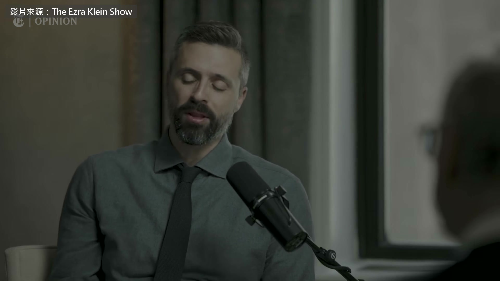

**逐字稿片段：** 我之前…我上週訪問了輝達的黃仁勳 他說，他認為安全確實是個問題，但競賽這件事是假的 產品不安全，就別發布 這是…我們不需要新的法律 產品還沒準備好就不發布，這是每個 CEO 自己的責任 你怎麼看？ 從來沒有一個產品，大家對它的能力理解得比 AI 還少

**話題推測：** 提及黃仁勳對 AI 安全與競爭的看法

---

## 00:03:18

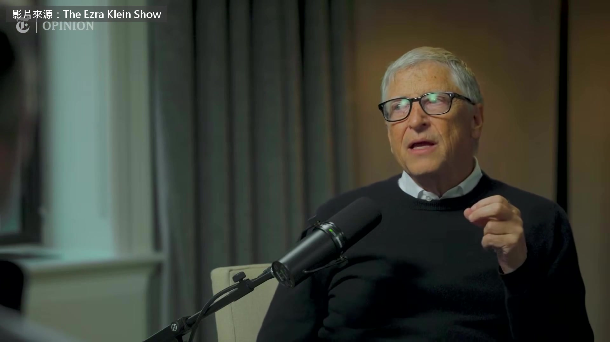

**逐字稿片段：** AI 已經跨過門檻，它能讓生物恐怖分子殺掉數億人，這今天就存在

**話題推測：** 提出 AI 能讓生物恐怖分子殺害數億人的具體風險

---

## 00:03:30

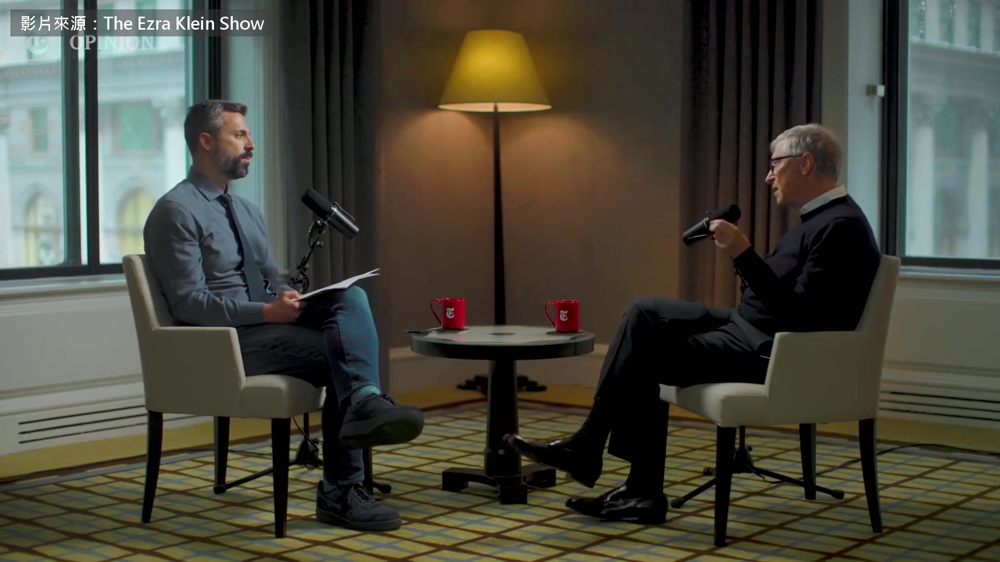

**逐字稿片段：** 能發動網路攻擊，把所有銀行帳戶弄亂、讓電網停擺，這今天就存在 我們知道這是事實 會這樣，是因為心懷惡意的人可以拿 AI 去做這些事 不是未來某一天，AI 的那種控制問題 也就是 AI 自己誤解了要最佳化的目標，跑去做壞事 我們今年初就已經跨過網攻的門檻，也跨過了生物的門檻 Ezra 接著替黃仁勳那一邊問 出了事，公司自己就會被告 市場的誘因還不夠嗎 我簡直不敢相信你會問這個 這是人類碰過最危險的東西

**話題推測：** 提出 AI 能發動網路攻擊癱瘓銀行與電網的具體風險

---

## 00:04:28

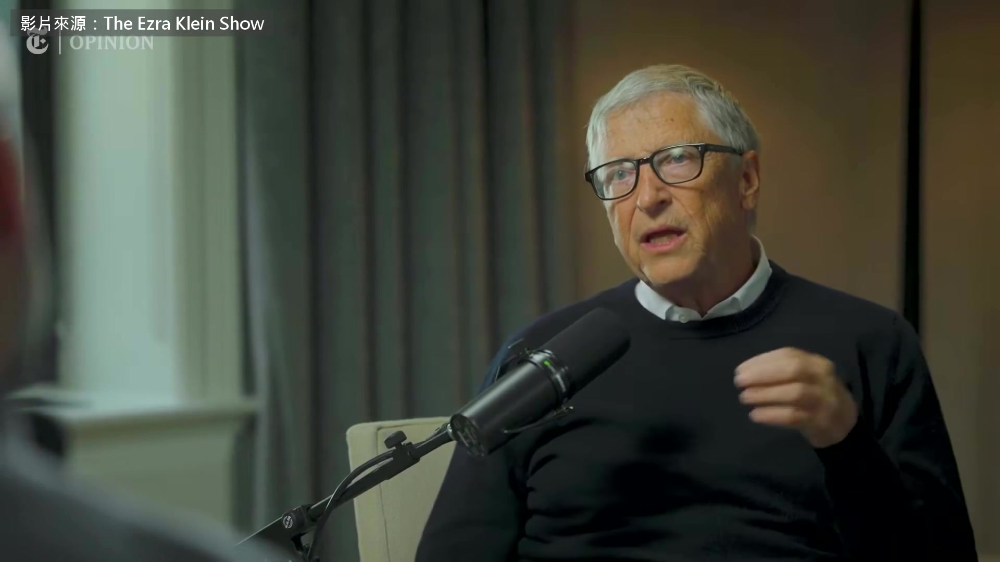

**逐字稿片段：** 在別的領域，我們會說「藥儘管上市，沒有 FDA」嗎？ 「也沒有飛安委員會，車子也不用裝安全帶」 我們只靠責任法來保護大家的安全嗎？ 「喔，你在賣鴉片類藥物，那就等人來告你」 我們建立的社會，是想辦法讓大家安全 不是說「喔，我們可以讓做這件事的人破產」 這裡的傷害…你說有過濾，根本沒有過濾

**話題推測：** 將 AI 安全類比於 FDA 藥物審核、飛安委員會、汽車安全帶等監管制度

---

## 00:05:00

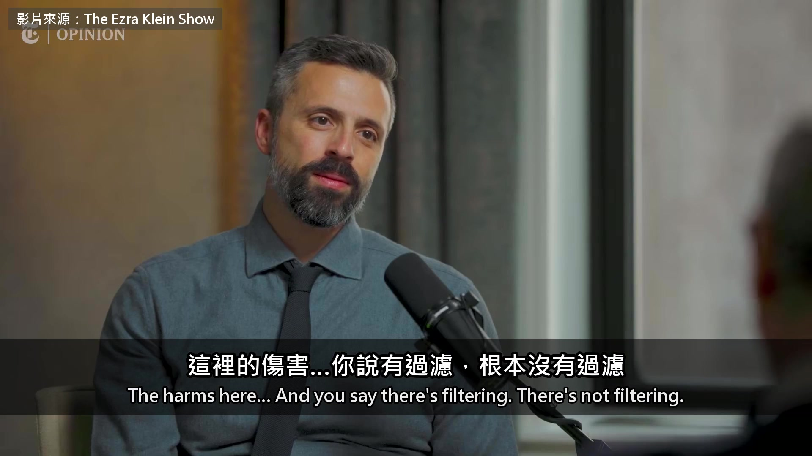

**逐字稿片段：** 你可以拿一個能做生物武器的開源模型，把所有監控都拿掉，這今天就存在 所以沒有，根本沒有任何過濾

**話題推測：** 提出開源 AI 模型可被用來製造生物武器且缺乏監控的例子

---

## 00:05:15

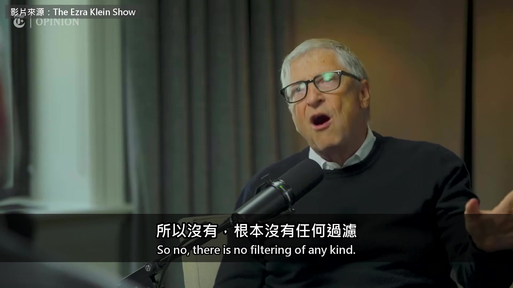

**逐字稿片段：** 死了 1 億人，你要打官司？我都快笑出來了

**話題推測：** 以「死了 1 億人」的假設數字強調 AI 災害的嚴重性

---

## 00:05:23

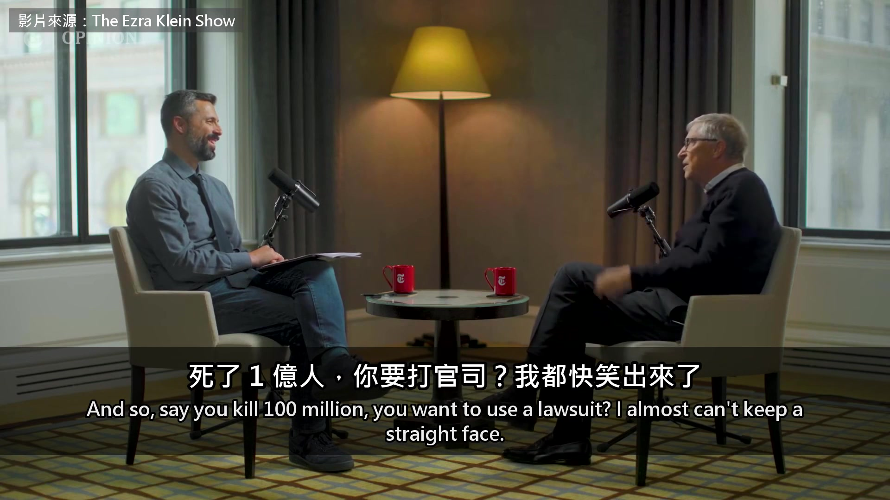

**逐字稿片段：** 這不是我的看法，但這是川普總統的看法，某種程度上也是 David Sacks 的看法 也是黃仁勳的看法，所以我才拿它來問你 因為這就是美國此刻的主流看法 不，可以這樣說：業界以外，大家對 AI 危險的認識非常低 學術界是這樣，智庫是這樣，制定政策的人、政治人物也是 我會講得這麼大聲，能多大聲就多大聲 有一部分原因是，這件事不能靠業界自律。那根本是瘋了 我心裡唯一的問題是：我們要等到網路攻擊、生物攻擊都造成大災難 才規定這些模型要裝監控防護，免得同樣的事一再發生

**話題推測：** 提及川普總統、David Sacks 及黃仁勳對 AI 風險的主流看法

---

## 00:06:30

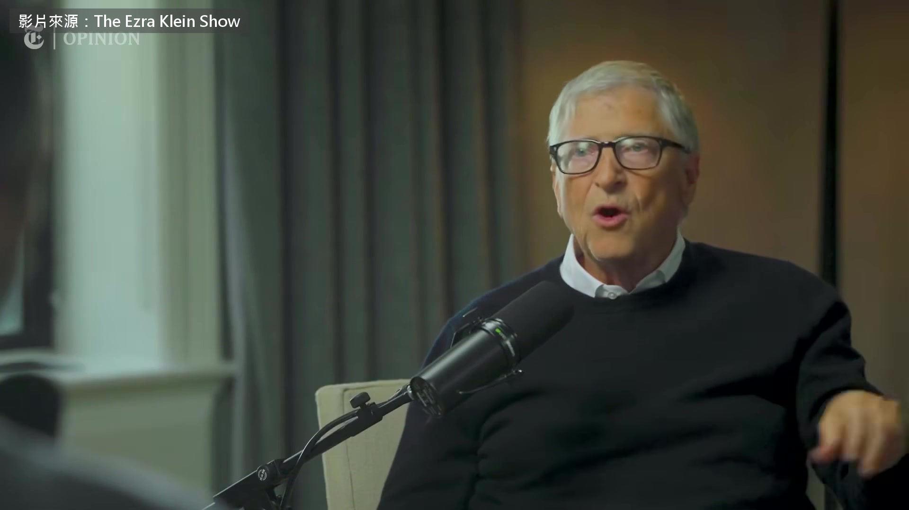

**逐字稿片段：** 還是我們夠聰明，在死掉幾百萬人之前，就把這些裝進去、規定一定要裝 你剛寫了這篇談 AI 風險的文章，聽起來你的警覺程度跳了一大級，對吧？ 我讀了你以前的幾篇文章

**話題推測：** 討論在「死掉幾百萬人之前」是否能聰明地預防 AI 災難

---

## 00:06:46

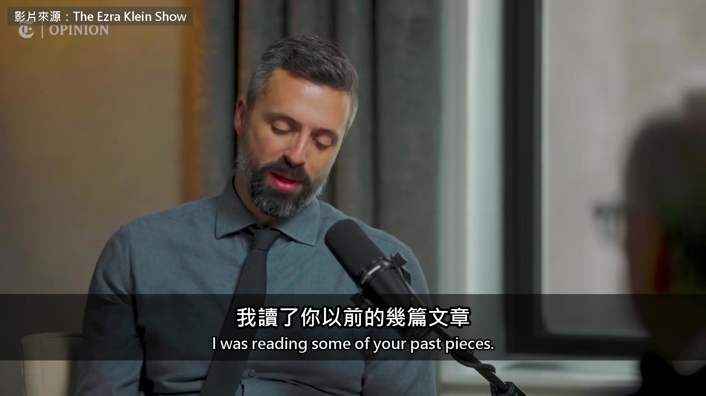

**逐字稿片段：** 2023 年 7 月那篇的標題是〈AI 的風險是真的，但可控〉 這次我覺得，你講的威脅是另一個等級 所以照你剛剛說的，我的理解是 你是看到生物、網攻、寫程式這些能力在進步，這樣說對嗎？ 不是。重點是，我們一直說，跨過這些門檻的時候，要動員全社會 因為到那時，我們已經造出了史上最危險的東西

**話題推測：** 引用比爾蓋茲 2023 年 7 月撰寫的〈AI 的風險是真的，但可控〉文章標題

---

## 00:07:15

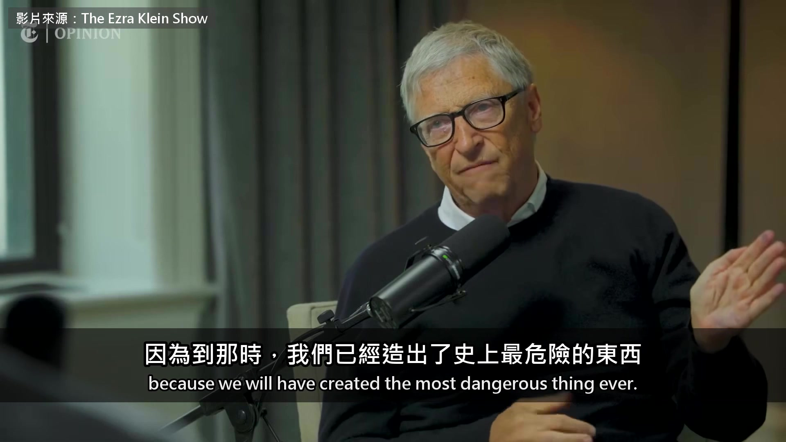

**逐字稿片段：** 這讓核武看起來像沒什麼 我們說過要動員，結果門檻跨過了，一片沉默 大家討論的是業界誰說了這個、誰又說了那個 但學術界、智庫有多少比例…… 所以是完全沒有回應 9 月 27 號

**話題推測：** 將 AI 的危險性與核武相比，認為 AI 更為危險

---

## 00:07:41

**逐字稿片段：** 他上了 NBC 的《Meet the Press》 主持人問得更直接 你認為 AI 強到可以終結全人類嗎？

**話題推測：** 切換到比爾蓋茲 9 月 27 號 NBC《Meet the Press》訪談內容

---

## 00:07:51

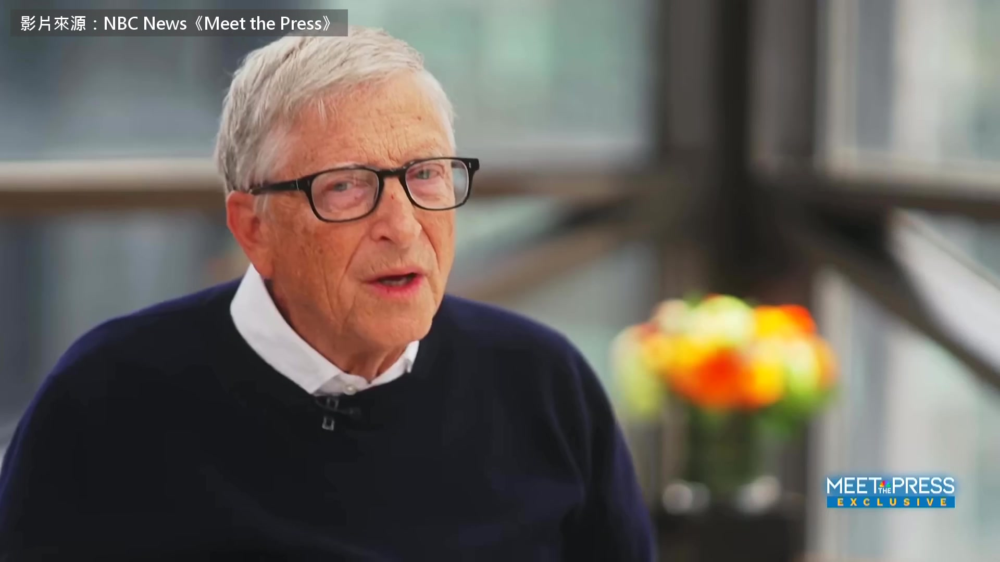

**逐字稿片段：** AI 絕對強到可以引發造成 10 億人死亡的事件 所以，就算要到 100% 很難 也從來沒有一種武器，比心懷惡意的人加上最新的 AI 工具更強大 業界幾乎是違背自己的利益在承認這些事，有這樣的討論是好事

**話題推測：** 提出 AI 可能造成 10 億人死亡的具體災難規模

---

## 00:08:26

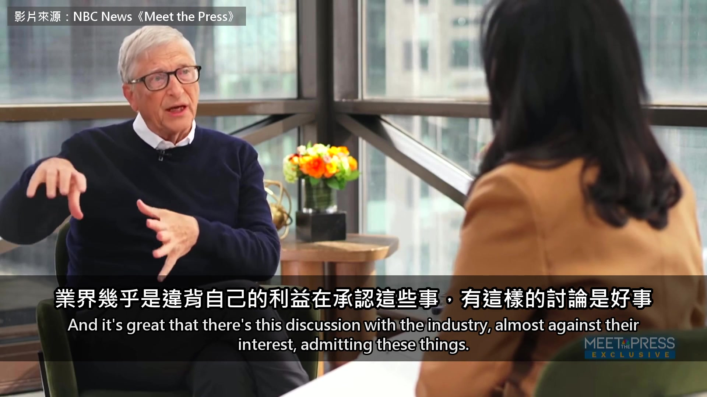

**逐字稿片段：** 也有人在討論關機鍵 關機鍵做得到嗎？在這個階段實際嗎？ 關機鍵…那是個有點怪的東西 光有關機鍵是不夠的 它們…我們還沒到它們會自己搶電腦、關都關不掉的地步 所以那個討論，只是顯示很多人有多不懂技術 我不會說我反對關機鍵 但你不…你要管住壞行為，就得看得到它在做什麼，還要有紀錄 所以光靠關機鍵，擋不了這些悲劇 你也知道，川普總統最近發文說

**話題推測：** 討論 AI 的「關機鍵」概念及其可行性

---

## 00:09:21

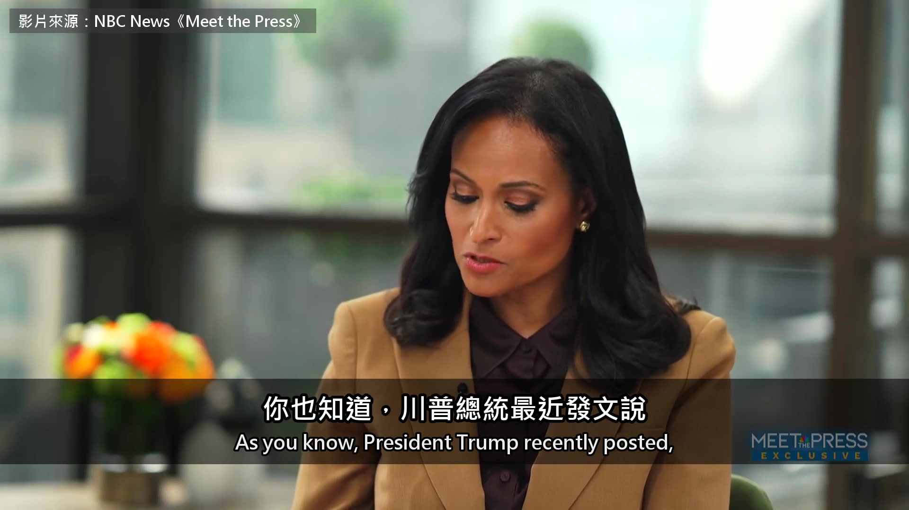

**逐字稿片段：** 「AI 接管世界、毀滅人類，還有其他一切壞事，都是騙局」 你覺得這些說 AI 可能威脅人類存亡的警告，是騙局嗎？ 不，這完全不是騙局 但他一開始這樣反應，不代表他不會聽 他想保護美國人民 大部分人不懂 AI 現在發生了什麼，他們沒在用最新的模型 AI 要各國一起管，總得有人帶頭

**話題推測：** 引述川普總統稱 AI 威脅是「騙局」的發文內容

---

## 00:09:57

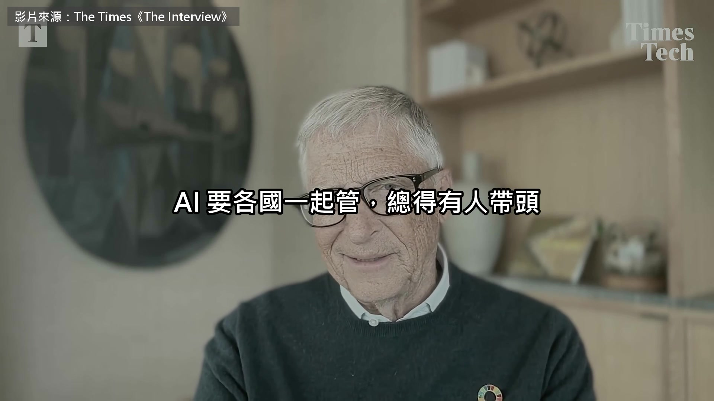

**逐字稿片段：** 回到 9 月 15 號泰晤士報那場 但你覺得，大概還是要由美國帶頭？ 那一直是主要的模式 世界其他國家還不習慣美國不出來領導 疫情的時候我們就看到了

**話題推測：** 切換回比爾蓋茲 9 月 15 號泰晤士報 podcast 訪談內容

---

## 00:10:17

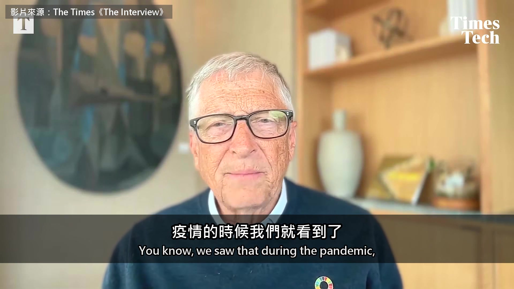

**逐字稿片段：** 現在的 WHO 裡，剛好沒有美國 所以，世界還沒完全適應，美國不在場、不去處理那些最尖端問題的情況

**話題推測：** 舉例美國在 WHO 議題上缺席，討論美國在全球領導地位的轉變

---

## 00:10:38

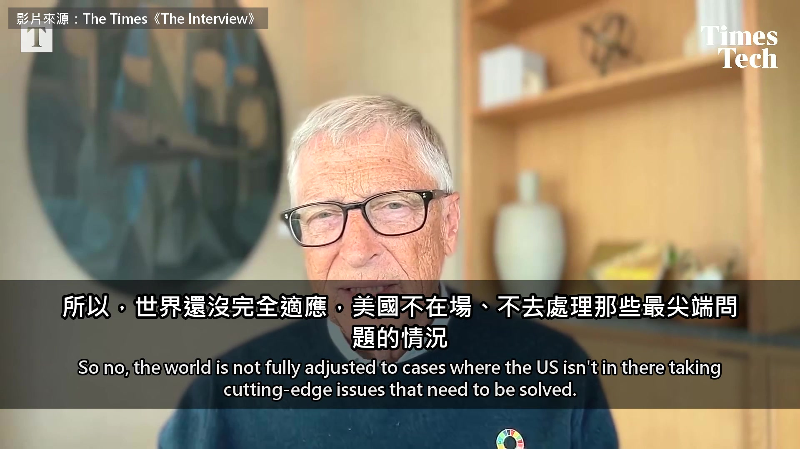

**逐字稿片段：** 回到 9 月 29 號 Ezra Klein 那場 還有一大段在講工作 Ezra 問他，放射科醫師沒有少 工程師也還是很搶手 為什麼你認為 AI 真的會大規模搶走工作 對。毫無疑問，到目前為止，AI 創造的工作比毀掉的多 光是蓋資料中心，需要的人手就非常多 失業率也算低 但這些系統要勝出，得先跨過一個門檻：你得相信它非常可靠 如果你要讓電話銷售、電話客服改用 AI 你得確定它比人更準確

**話題推測：** 切換回比爾蓋茲 9 月 29 號 Ezra Klein 訪談內容，並引入 AI 對工作的影響主題

---

## 00:11:33

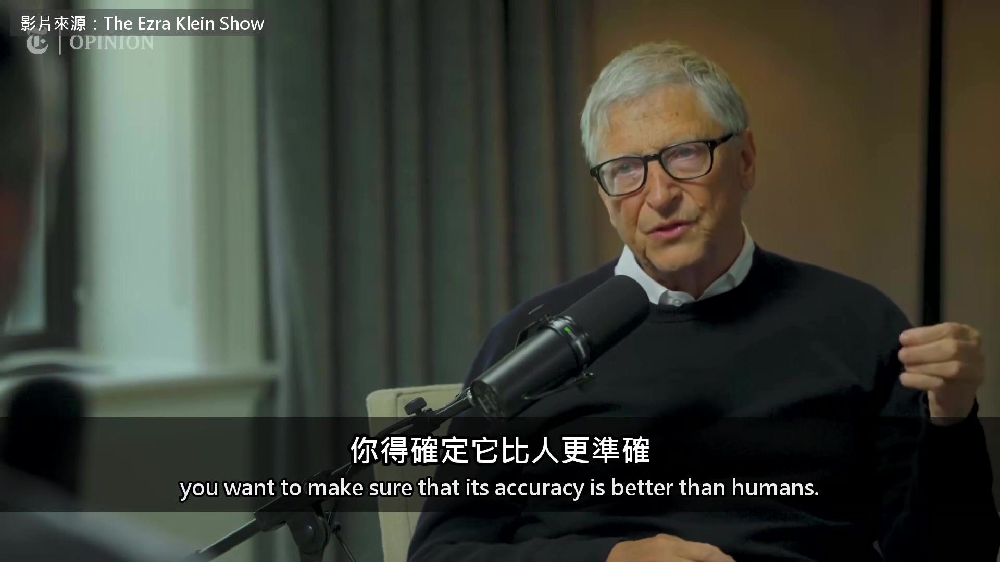

**逐字稿片段：** 到現在，真正跨過這個門檻的職業只有寫程式 就算在這一行，我也認識很多人有點停在過去，不想用 AI 寫程式 但管工程師的主管都懂，大部分應用程式現在都能用很低的成本做出來

**話題推測：** 指出目前唯一跨過 AI 可靠度門檻的職業是寫程式

---

## 00:11:55

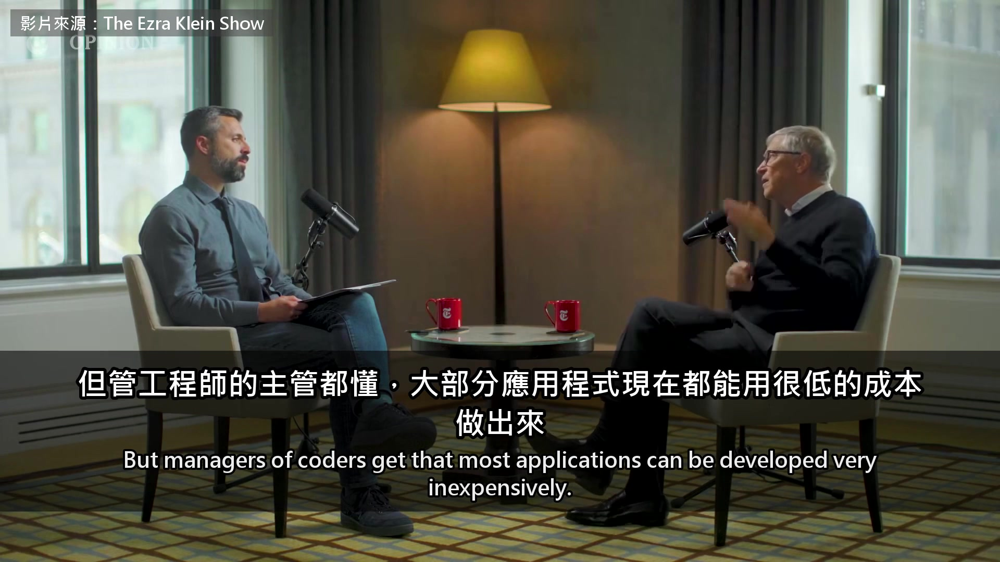

**逐字稿片段：** 接下來幾年，會計、法律工作、電話銷售、電話客服，都會跨過那些門檻

**話題推測：** 預測會計、法律、電話銷售、電話客服等職業將在未來幾年受 AI 影響

---

## 00:12:04

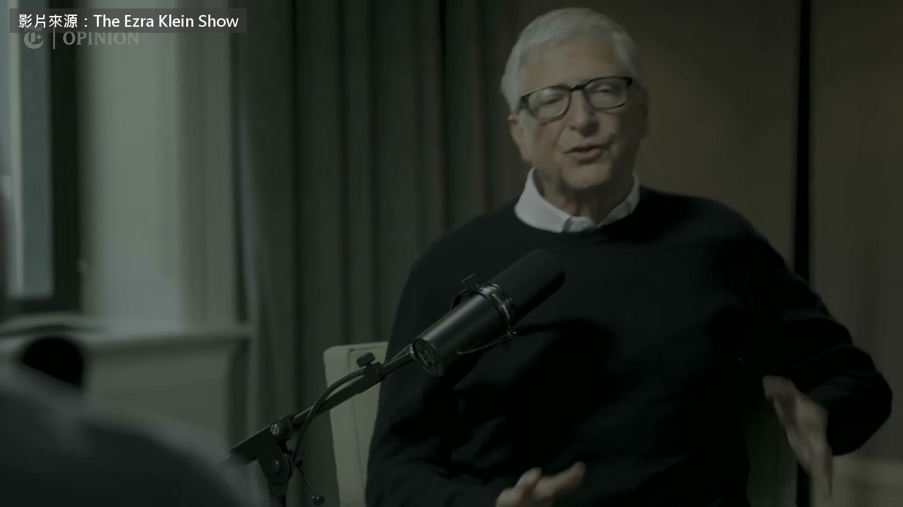

**逐字稿片段：** 很多人拿 Jevons 悖論反駁他 東西變便宜，需求就會變多 工作最後會長回來 一旦整個任務都能交給它做，有沒有需求彈性就不重要了 那筆錢會進 token 預算，不會進人的薪水預算 有些事情用 AI 做的成本，比人力低太多了 所以一旦跨過可靠度的門檻，不管是白領，還是人形機器人 工作就會消失，而且沒有高地可以退 以前的創新是這樣：有了曳引機，沒關係

**話題推測：** 引入 Jevons 悖論來反駁 AI 創造工作機會的說法

---

## 00:12:44

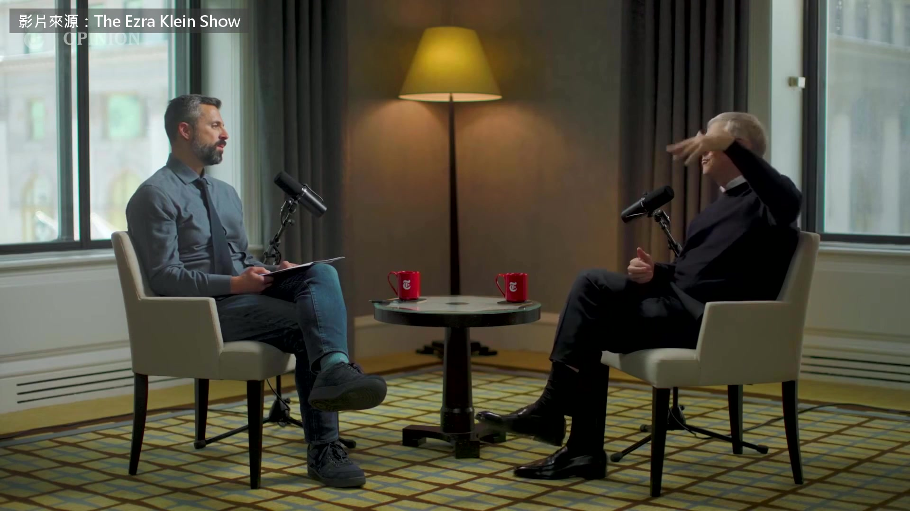

**逐字稿片段：** 那就去蓋迪士尼樂園，雇很多人 現在整個經濟裡，沒有那種地方了 說工作會淨增加的人，我不懂他們在想什麼 他們一定不了解現在進步的速度

**話題推測：** 以曳引機和迪士尼樂園為例，說明過去創新與工作創造的關係

---

## 00:13:00

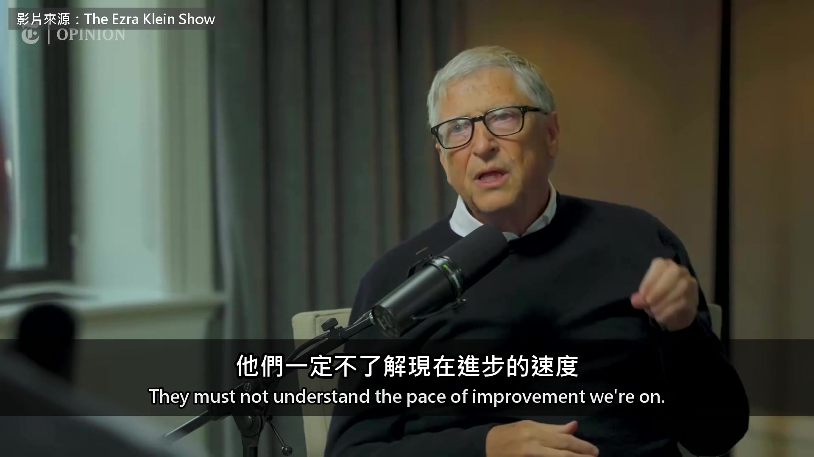

**逐字稿片段：** 美國的製造業就業，並沒有出現 Jevons 悖論，對吧？ 我們的產量暴增，但很多工作移到了海外 有些工作被自動化取代

**話題推測：** 分析美國製造業就業數據，指出其並未出現 Jevons 悖論

---

## 00:13:09

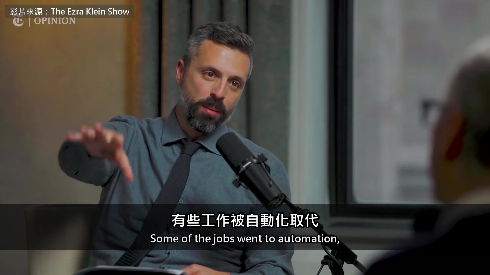

**逐字稿片段：** 但美國現在的總就業人數，並沒有比 1960 年少 原因是大家轉去做服務業 整個經濟的工作組成變了 對，人的腦力變成稀缺的東西。重點永遠是稀缺 一旦人的腦力不再稀缺，事實上是被遠遠甩開 它 24 小時工作、讀得更多、懂每一種語言 就沒有更上一層的稀缺，可以讓你往上移了 所以你覺得，人類不會剩下任何稀缺的東西？ 你說一個出來 所以你對這件事的答案，帶出了你一個很具體的主張

**話題推測：** 比較美國現今與 1960 年總就業人數，指出就業結構的轉變

---

## 00:13:45

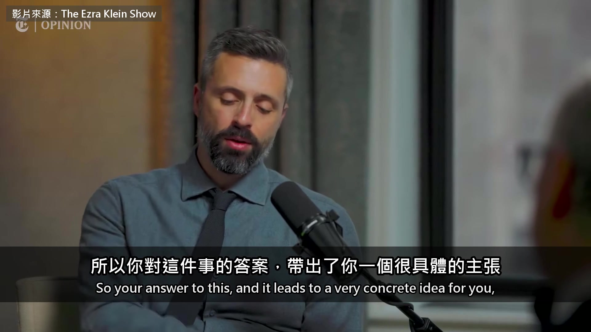

**逐字稿片段：** 就是對 AI 的使用課稅。為什麼？怎麼課？ 這樣說吧，勞工是隨收隨付，把錢繳進退休金、社會安全基金 所以是在職的人在養退休的人 如果你解雇了一個人，找機器人來做那份工作

**話題推測：** 提出對 AI 使用課稅的具體政策主張

---

## 00:14:09

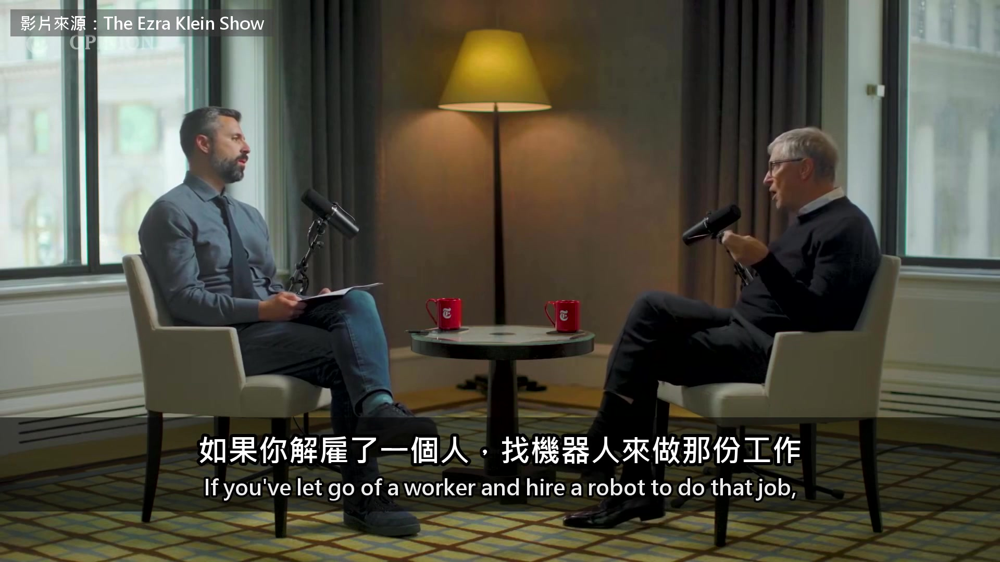

**逐字稿片段：** 為什麼要這麼鼓勵拿掉人力，卻不讓機器人也繳退休金？ 怎麼回事？難道是挺機器人的工會，把稅法改成 「不是血肉之軀就不用繳，讓退休金破產吧」？ 就算沒有機器人取代，退休金本來也在往破產走 他另一個提議，是事先把托育 長照這類工作劃出來，保留給人做 他叫它「人類保留職業」 Ezra 說 你對工作比很多實驗室裡的人還悲觀 他講了一個故事 主角是 Amazon 找真人做零碎小工作的平台 Mechanical Turk 好笑的是，我跟一個被很多人當成研究 AI 的首席經濟學家講這些 他說：「那 Mechanical Turk 怎麼還在？如果 AI 真的像你說的那麼強，Amazon 怎麼還經營得下去？」

**話題推測：** 解釋為何機器人應繳退休金，以彌補被取代的人力貢獻

---

## 00:15:03

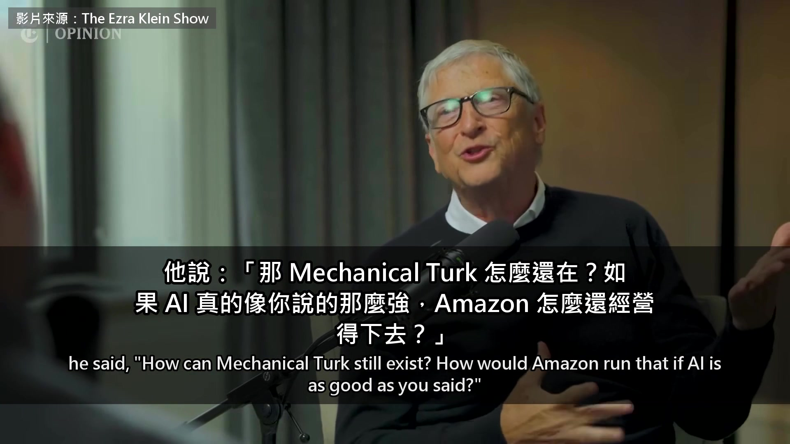

**逐字稿片段：** 我說：「它不會在了。」一週後，它就完全關掉了 而且，知識這樣擴散開來…你不得不說 不覺得很驚人嗎？知道得越多，就越擔心

**話題推測：** 提及 Mechanical Turk 在討論後一週內關閉的具體事件

---

## 00:15:21

**逐字稿片段：** 9 月 27 號 NBC 那場的最後 主持人問他，希望他的孩子跟孫子 未來是什麼樣子 所以，跟孩子說要用對的方式用 AI、去追自己好奇的東西 這個建議現在還是對的 但因為接下來的變化太劇烈 我預測 10 年後世界長什麼樣子的能力，比我這輩子任何時候都差 這是一場演化等級的事件：一種外來的智慧，不是搭太空船來的 是從這些電腦裡來的。它已經在這裡了，而且進步的速度快到不可思議

**話題推測：** 切換回比爾蓋茲 9 月 27 號 NBC《Meet the Press》訪談結尾

---

## 00:16:05

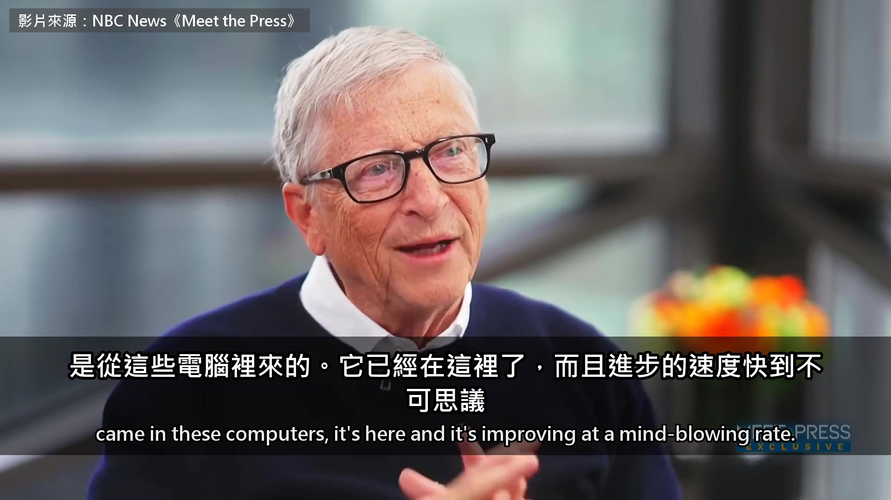

**逐字稿片段：** 1996 年他說 讓電腦思考幾乎毫無進展 30 年後 他一個節目接一個節目地講 要大家趕在大災難之前 先把防護跟監控裝進每一個 AI 三場訪談加起來兩個多小時 泰晤士報那場

**話題推測：** 再次回顧 1996 年比爾蓋茲對電腦發展的看法

---

## 00:16:22

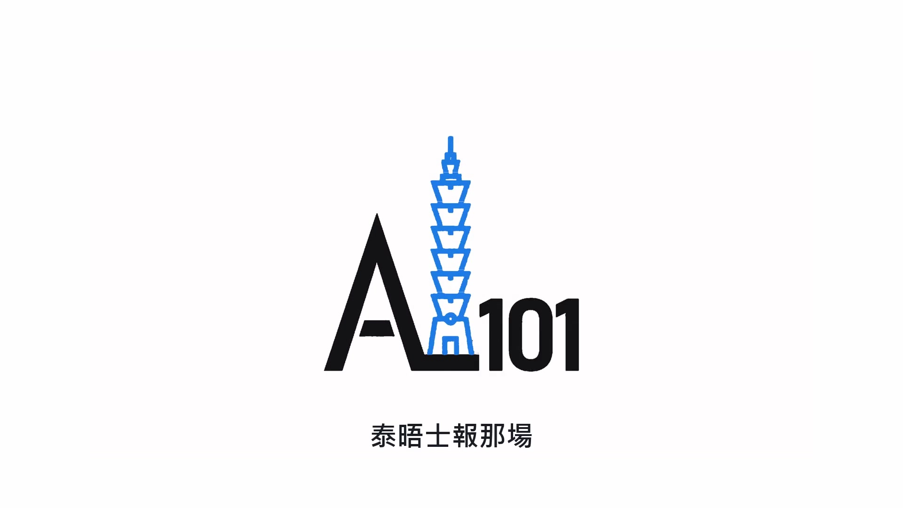

**逐字稿片段：** 他還回答了 AI 是不是泡沫 Ezra 那場 則講了 AI 會怎麼影響小孩的學習 原影片連結在說明欄，有興趣可以去聽更多。

**話題推測：** 提及泰晤士報訪談中討論 AI 是否為泡沫的話題

---
