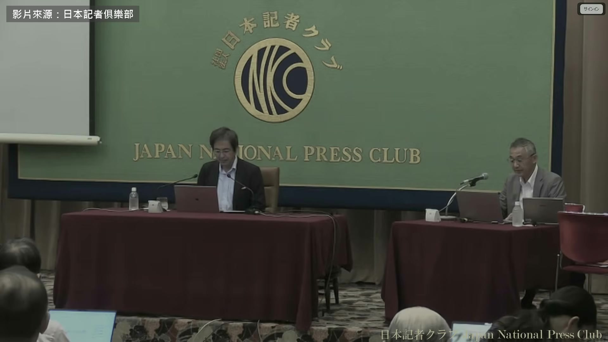
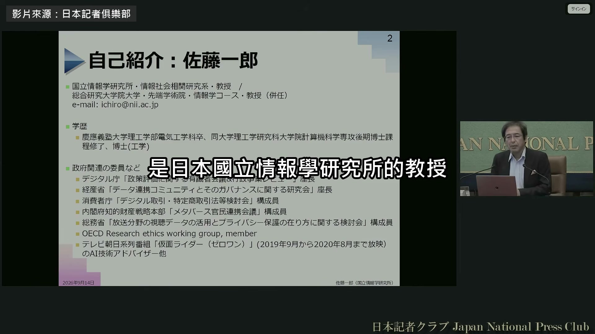
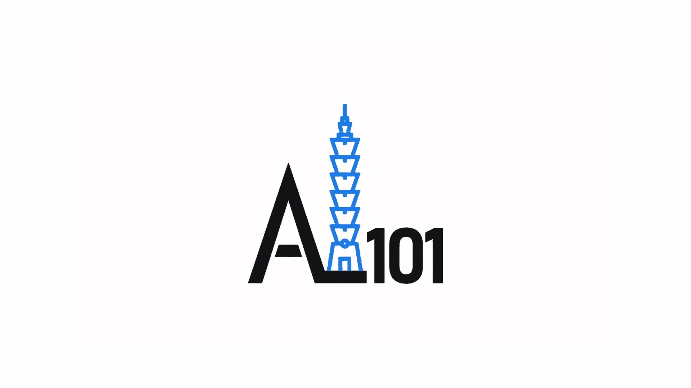

# ai-note-101_xTu3WQdTdr4 — 關鍵畫面索引

- 來源逐字稿：[ai-note-101_xTu3WQdTdr4_GT.srt](ai-note-101_xTu3WQdTdr4_GT.srt)
- 影片：https://www.youtube.com/watch?v=xTu3WQdTdr4
- 截圖數：4

## 00:00:00

**逐字稿片段：** 日本企業在公司裡自己跑的生成式 AI 用的幾乎都是中國的模型 今年 9 月 在各大報社和電視台合組的日本記者俱樂部 一位教授這樣說 他叫佐藤一郎 是日本國立情報學研究所的教授

**話題推測：** 開場介紹日本企業在內部使用生成式 AI 的現況

---

## 00:00:15

**逐字稿片段：** 這是文部科學省底下的國家研究所 有點像台灣中研院的資訊所 日本大學共用的學術網路 論文資料庫都歸它管 日本的開源大型語言模型 LLM-jp 也是它做的 他本人的專長是讓 AI 跑起來的系統軟體 也替日本數位廳審政策和預算 在公司內部跑生成式 AI 自己營運的例子也變多了 因為很多企業非常在意資料外洩 尤其是在日本 企業會在內部跑 中小型的生成式 AI 這時候用的模型 幾乎都是中國製的 最多的是叫做 Qwen 的 阿里巴巴做的模型 Qwen 是開源模型，在公司內跑 資料不會送出去 問答時間，主持人就從這一點切入 先提了一件事 今年 6 月 Anthropic 的 Fable 5 才上線 3 天 就因為美國商務部的指令全面停用 停了快 3 個禮拜 他問，這樣看來 一般國家和企業是不是用開放模型比較保險 先講開放還是封閉 就像您剛剛說的 考慮到可能突然被斷供 封閉模型確實比較危險 封閉模型還有另一面 在 Fable 之前，Mythos 那場風波 大家應該還記得 Mythos 是跑在 Anthropic 內部的 AI 要用 Mythos 找出軟體的漏洞 也就是容易被駭的地方 大家覺得非這樣做不可 日本政府帶頭，鬧得很大 可是 封閉模型的另一個問題是 像 Mythos，要用它 就得把軟體交給 Anthropic 比如說銀行、電力公司 公司內部跑的軟體 就算有漏洞 駭客也只能隔著網路攻擊 可是為了讓 AI 檢查漏洞 把整套軟體交出去、餵進去 收到的那一方就能仔細翻遍 這當然是好處 平常隔著網路攻擊 找不到的漏洞 它都找得到 我想說的是 如果你信得過 Anthropic 這家公司 那也許沒問題 可是 Anthropic 為了檢查漏洞 拿到手的軟體，裡面的漏洞 沒人能保證它會全部告訴你 這樣想下去 Mythos 那場風波 在我們做技術的人看來 IT 落後的日本 在 IT 上被說成是殖民地 身為殖民地的日本，難道要向宗主國 交出人質嗎？我們是這樣講的 所以乍看是好事 其實很危險 所以該做的是 套裝軟體 或開源這種公開在外面的軟體 本來就有風險 拿 Mythos 這類工具查一查是好的 可是連沒公開的軟體都交出去查 在做技術的人看來，根本不可能 老實說，這是我的感覺 所以從這個角度看，要是開放 Mythos 也一樣 假如 Mythos 是開放的 放在銀行、電力公司內部用，我覺得沒關係 不是的話就很危險 下一位記者問到主權 AI 法國的 Mistral 喊出要做不靠美國的 AI 他問日本做不做得到 我們研究所其實也有在做語言生成 AI 做的規模還不小 所以這話我不太好講 但日本在做生成式 AI 這件事上 非常落後 我就老實講 收集網路上的文章 訓練出模型，這一步是做到了 可是這種模型寫得出來的 只有說明文，網路上常見的那種 像對話、摘要，它就做不出來 那些要靠大量人力去做 沒那麼簡單 所以法國那邊怎麼樣 我不好說 就日本來說 只做得出功能很單一的生成式 AI 應該說，到現在都還做不出來 以後大概也很難 那日本該走的路 不管是美國的還是中國的 哪一國的都可以 在日本要用生成式 AI 的時候 品質夠用的生成式 AI 在不會被斷供的前提下 怎麼穩穩地拿到手，這才是重點 那要怎麼做？ 比如說，先訂一套 AI 品質標準 市面上的 AI 一個個檢驗有沒有達標 真的出事的時候，就能換成 另一個同樣達標的 AI 要往這個方向走 不然現實上是做不到的 佐藤一郎的意思是 日本自己做不出頂尖模型 不管用中國的還是美國的 都可能被對方卡住 所以他開的藥方，是訂一套品質標準 哪一家出問題，就換另一家

**話題推測：** 介紹教授所屬研究所背景，可能顯示機構名稱或標誌

---

## 00:07:11

**逐字稿片段：** 原影片將近兩個小時，他還講了兩件事

**話題推測：** 總結原影片中提到的其他兩項議題，可能顯示概覽或新話題標題

---

## 00:07:15

**逐字稿片段：** 一件是生成式 AI 的偏誤 他說大家怕 AI 講錯 其實更該怕它偏 威權國家可以用 AI 把國民關進自己的資訊空間 他形容這有點像巴別塔 另一件是日本政府押寶的實體 AI 在他看來，喊要做的日本企業很多 真正自己動手做的幾乎沒有 原影片連結在說明欄，有興趣可以去聽更多。

**話題推測：** 第一個額外話題：生成式 AI 的偏誤，可能顯示相關主題圖

---
