# ai-note-101_y79NVF0hYSI — 關鍵畫面索引

- 來源逐字稿：[ai-note-101_y79NVF0hYSI_GT.srt](ai-note-101_y79NVF0hYSI_GT.srt)
- 影片：https://www.youtube.com/watch?v=y79NVF0hYSI
- 截圖數：27

## 00:00:00

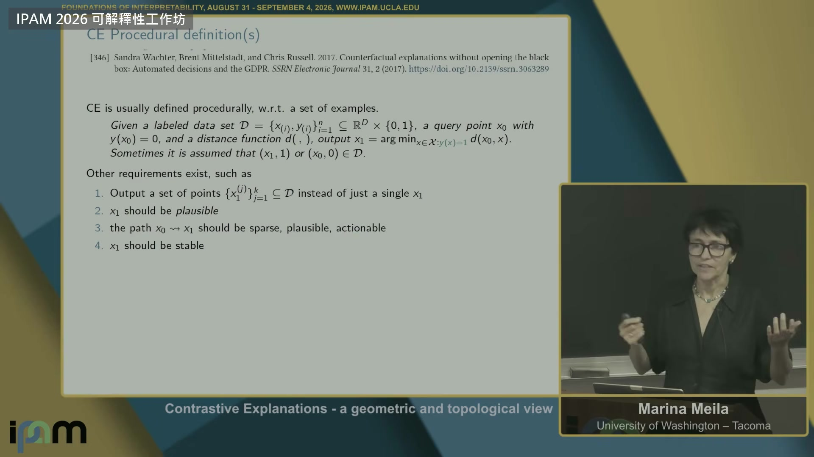

**逐字稿片段：** 這是第 12 集 題目是：對比式解釋 用幾何跟拓樸來看 講者 Marina Meila 做流形學習 研究資料在高維空間裡實際攤成什麼形狀

**話題推測：** 影片開場標題畫面，顯示集數與主題。

---

## 00:00:11

**逐字稿片段：** 反事實解釋這題 她寫過一篇整理 350 篇論文的綜述 這場她把 counterfactual 這個詞讓給因果那一派 自己的版本叫 contrastive 對比式解釋 先把這集要問的問題講清楚

**話題推測：** 切入影片核心主題：反事實解釋。

---

## 00:00:25

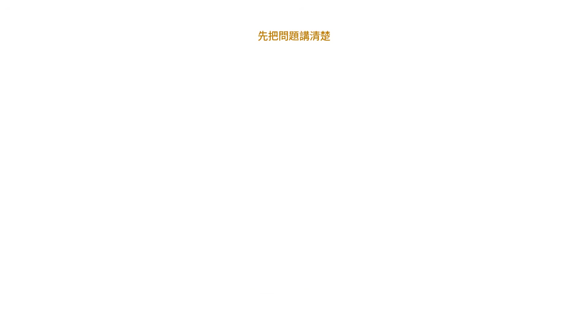

**逐字稿片段：** 反事實解釋的標準定義 照她投影片上那一頁 給一筆有標籤的資料集 D 每筆標 0 或 1 一個被判成 0 的查詢點 x0 還有一個距離函數 d 輸出 x1 就是所有標 1 的點裡面 離 x0 最近的那一筆 白話講：模型拒絕了你 就找一個跟你最像 但被接受的人給你看

**話題推測：** 投影片展示反事實解釋的標準定義及相關數學符號。

---

## 00:00:46

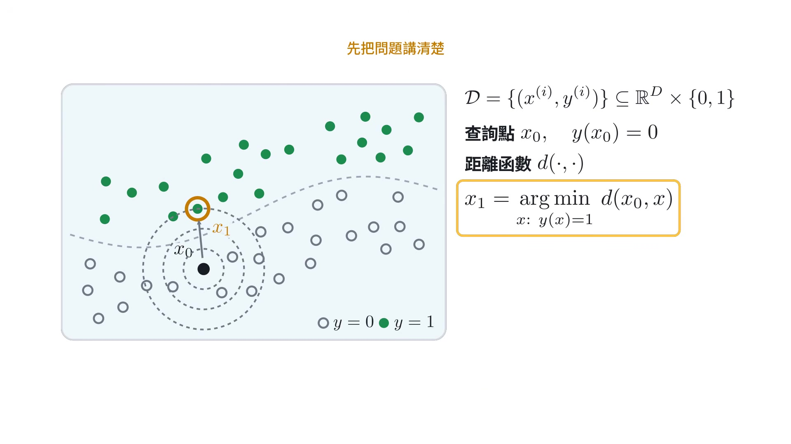

**逐字稿片段：** 那一頁還列了幾條額外要求 x1 要可信 不能是資料裡根本長不出來的點 從 x0 到 x1 的路徑要短 要可信 x1 要穩定 而且最好用使用者自己的概念來講

**話題推測：** 列出反事實解釋的額外要求或準則的投影片。

---

## 00:00:59

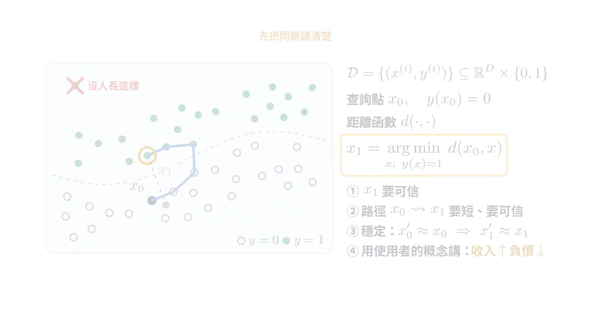

**逐字稿片段：** 幾百種方法都在比誰找的 x1 比較好 Meila 問的不是這個

**話題推測：** 介紹目前反事實解釋方法的多樣性與比較現狀。

---

## 00:01:04

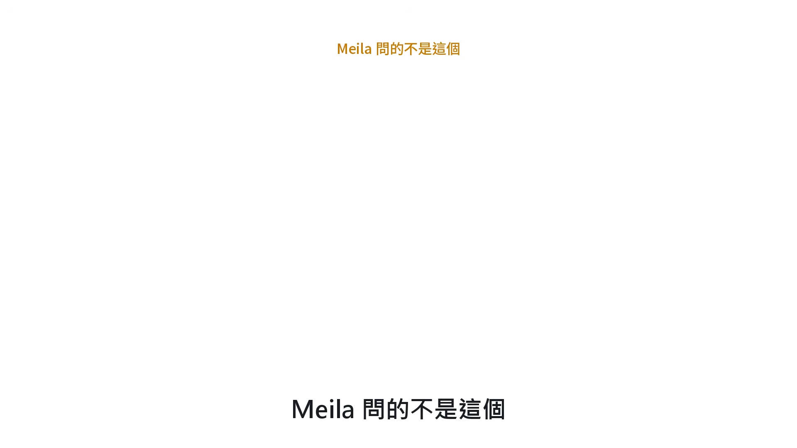

**逐字稿片段：** 她把每一個被拒絕的 x0 對到自己的 x1 問這個對應本身：第一 是不是每個 x0 都真的有一個 x1 第二，x0 挪一點點 x1 是跟著挪一點點 還是跳到別的地方去

**話題推測：** 講者Marina Meila提出她獨特的切入點與問題。

---

## 00:01:17

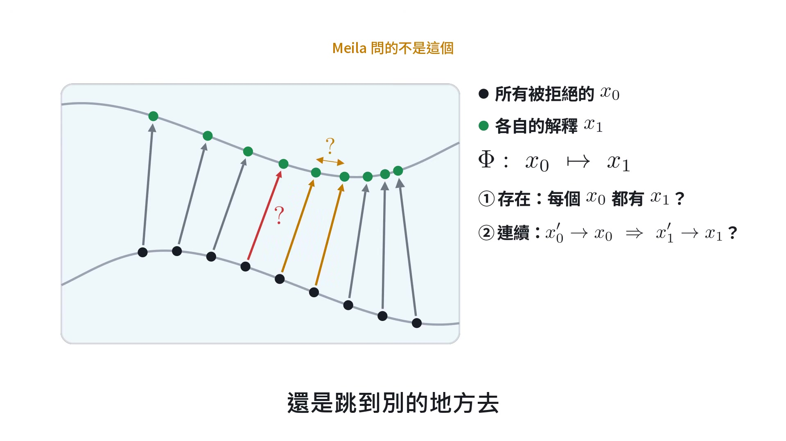

**逐字稿片段：** 答案分三段：把 f 當成地形 解釋就是從你的位置往上爬到門檻的那條路 地形裡沒有坡度為零的點，兩題都是有 這是她的定理 一有臨界點或有洞 就有人爬到一半停住、有人的解釋跳開

**話題推測：** 開始以地形圖的隱喻解釋答案或方法論。

---

## 00:01:31

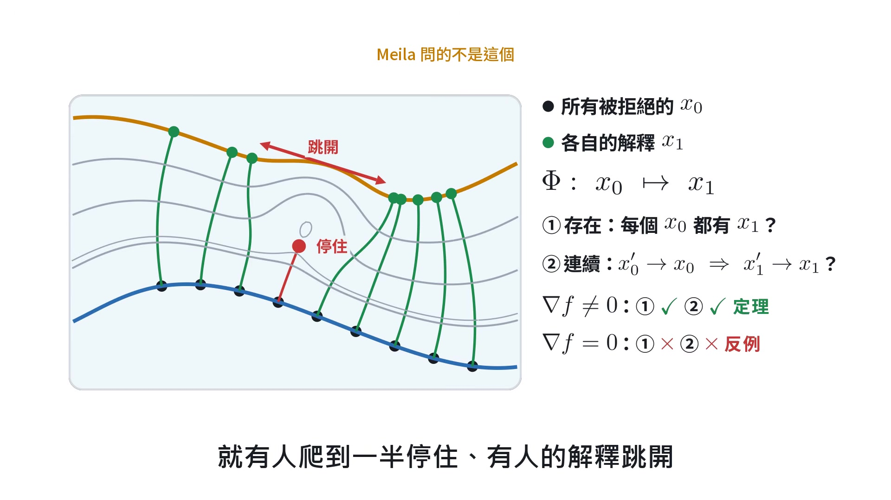

**逐字稿片段：** 這是她的反例 最後她換成用概念來爬同一座山 算出兩條路終點差多少 做反事實解釋的方法有幾百種 大多是一套程序，這是一個例子 給我一個相似、但輸出不同的東西 而我感興趣的是 如果把所有可能的輸入 對到所有可能的輸出

**話題推測：** 提供一個反例來進一步解釋定理的條件。

---

## 00:02:04

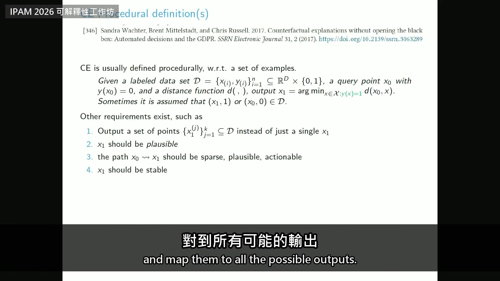

**逐字稿片段：** 那會是什麼樣的函數？ 這就是這場演講的目標 用地形圖來想 f 是高度，也就是被接受的機率 她說的 level set 就是等高線 你站在下面那條 τ0 上 門檻是上面那條 τ 標準做法是找離你最近的一點 她改成走路：從你的位置出發 每一步都走最陡的上坡 這條路叫梯度流，永遠跟等高線垂直 走到 τ 那條線停下來的地方 就是你的解釋 x1 下面那條線上每一點都這樣走一遍 就是她說的那個對應，她寫成 Φ

**話題推測：** 提出演講的核心數學問題，探討解釋的函數形式。

---

## 00:02:37

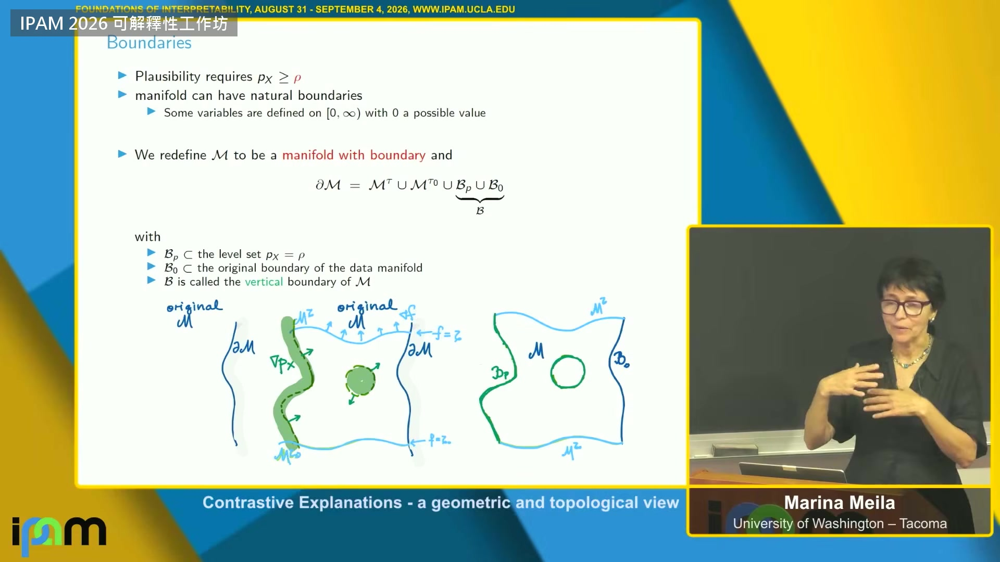

**逐字稿片段：** 她接著把舞台畫出來，右邊這張就是 上面那條線是 M^τ，門檻 下面那條是 M^τ0，所有起點 左邊綠色的線是密度剛好等於門檻的地方 她叫這個門檻 ρ 再過去的點太不可信，不算 中間那個綠圈是資料裡的一塊空洞 一樣不可信 右邊藍色的線是資料本來的邊界 兩條綠的加一條藍的，她合稱垂直邊界 記成 B 後面所有的圖都畫在這一塊裡面 坡度為零的地方有三種：山頂、谷底 還有兩座山中間的山口，叫鞍點 Morse 函數多要求一件事 這些點都要乾脆，不能是一整片平台 Hessian 沒有零特徵值講的就是這個 對解釋來說，臨界點是陷阱 往上爬的路一走進去 最陡的上坡就沒有方向了，路停在那裡 永遠到不了門檻

**話題推測：** 明確展示一張詳細的示意圖，描繪研究的數學空間與邊界。

---

## 00:03:26

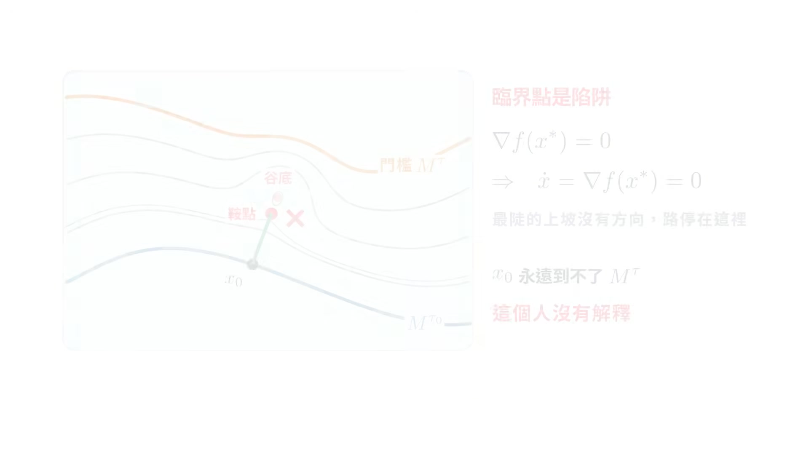

**逐字稿片段：** 那我們有一個很好用的定理，它說

**話題推測：** 引入一個重要的數學定理，說明無臨界點情況下的性質。

---

## 00:03:31

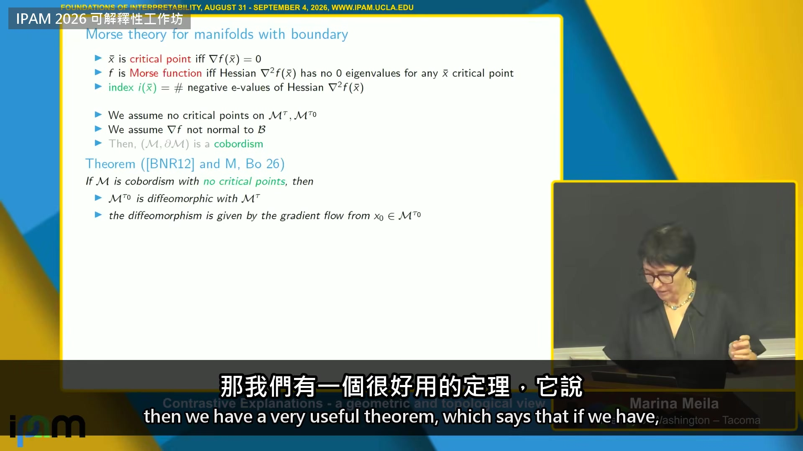

**逐字稿片段：** 這是它的圖 如果這張圖沒有洞，不對 如果這張圖裡 f 沒有臨界點 那下面那層跟上面那層就是微分同胚 順著流，每一個輸入 x0 都有一個解釋 x1 每個都不一樣，這個對應是可逆的 性質非常非常好

**話題推測：** 展示一張圖表，用於視覺化解釋該定理的條件與結論。

---

## 00:04:01

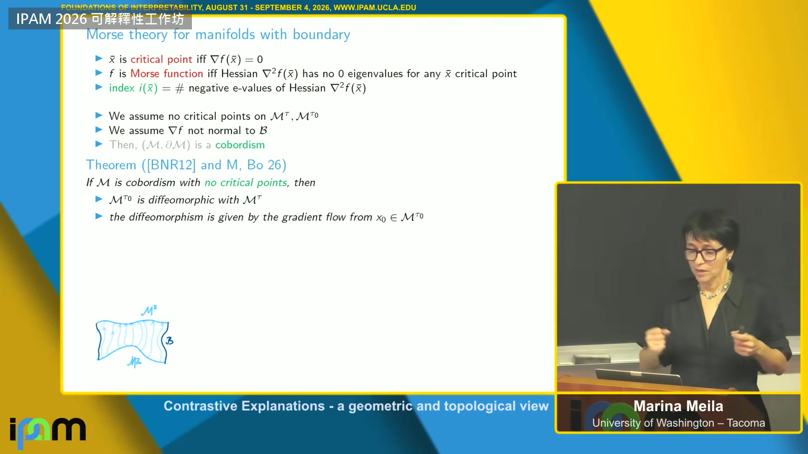

**逐字稿片段：** 這是用 Morse 理論的一個理由：有這個好結果 但我其實還沒證明我們真的有 Morse 函數 我們希望有，理由就是這個 在講怎樣才算 Morse 函數之前

**話題推測：** 解釋選擇Morse理論的理由及其帶來的良好結果。

---

## 00:04:20

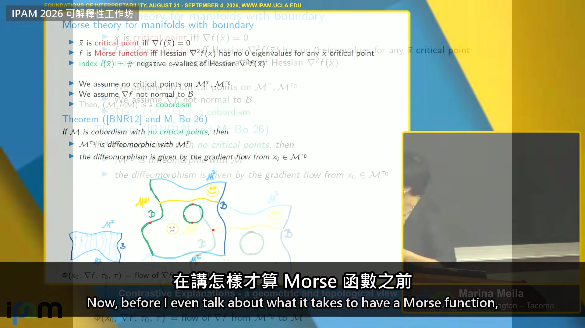

**逐字稿片段：** 這也區分了靠近決策邊界的解釋 跟所有地方的解釋 因為在邊界附近，如果這裡沒有臨界點 就會有一塊鄰域完全沒有臨界點 這件好事就會發生 所以我們可以說：這就是我的對比式解釋 永遠存在一塊鄰域，裡面的對比式解釋都很好 其他地方就別問我了

**話題推測：** 討論決策邊界附近的解釋與其他區域解釋的區別。

---

## 00:04:46

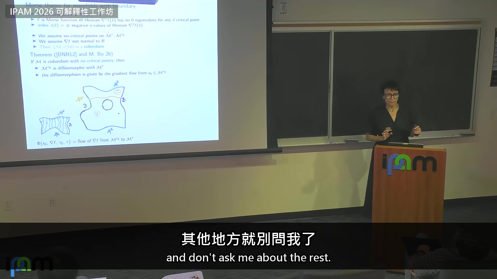

**逐字稿片段：** 把定理拆開看 條件跟結論都在這一頁上 條件一：兩條等高線上本身沒有臨界點 條件二 f 的梯度在垂直邊界上不跟邊界垂直 白話就是流線不從側邊穿出去 這兩條成立 這一塊在拓樸裡叫 cobordism 條件三：整塊裡面都沒有臨界點 結論 下面那條 M^τ0 跟上面那條 M^τ 微分同胚 而且這個同胚就是梯度流本身 翻成人話：每個起點都有解釋 不同的人解釋一定不同，起點連續動 解釋也連續動 為什麼成立：沒有臨界點 流線沒有地方可以停 只能從下面一路走到上面 流線彼此不交叉，所以一對一 微分方程的解對起點連續，所以連續 她做的是把這個現成的定理接到反事實解釋上 引用的是頁上標 BNR12 那篇帶邊界的 Morse 理論

**話題推測：** 投影片詳細列出核心定理的各項條件與結論。

---

## 00:05:37

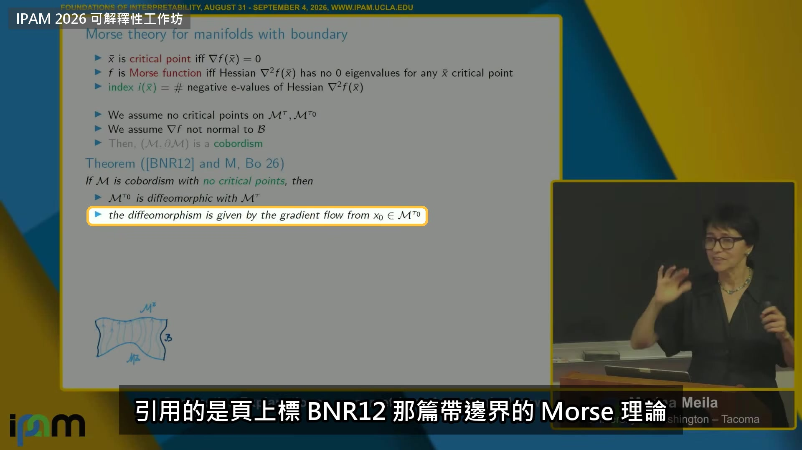

**逐字稿片段：** 她沒做的她自己講了 還沒證明真實的 f 沒有臨界點 只保證決策邊界附近有一圈成立 其他地方別問她 這個例子裡，流線從垂直邊界穿出去 穿過洞，又從別的地方進來 這種情況下，定理就不成立 很明顯，τ0 那條等高線上有些點拿不到解釋

**話題推測：** 轉向討論講者尚未解決的問題或理論的限制。

---

## 00:06:01

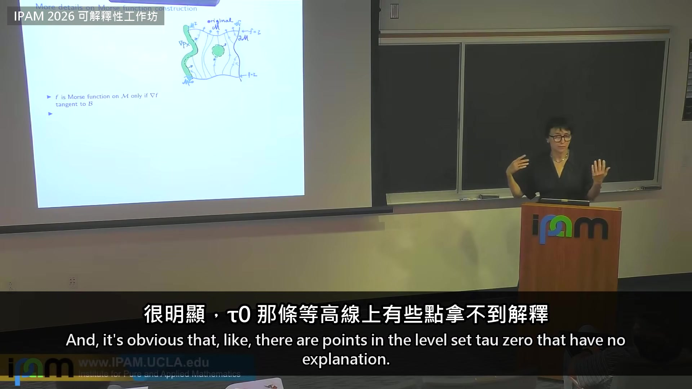

**逐字稿片段：** 她的修法只動邊界 沿垂直邊界留一圈寬度 ε 的鄰域 只在這一圈裡改 f 讓梯度貼著邊界走，不再穿出去 其他地方的 f 不動 原本的臨界點也都還在 代價是多一個參數 ε 邊界那一圈的解釋是改過的 f 給的

**話題推測：** 介紹講者提出的修改方法，用以處理邊界問題。

---

## 00:06:17

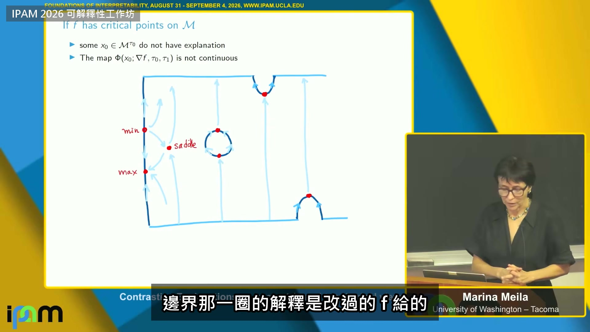

**逐字稿片段：** 修完就只剩臨界點，就是這張圖 最下面那條線是起點 τ0 淺藍色箭頭是往上爬的路 最上面那條線是門檻 τ 紅點是臨界點 拿右上角這個缺口來看 從缺口左邊一點點出發的人 停在缺口的左岸 起點往右挪一點點，終點就跳到右岸 中間隔了一整個缺口 這就是 Φ 不連續 正對缺口底部出發的那個人 走進紅點就停住，什麼解釋都拿不到 所以這張圖證明的是：只要有臨界點 就有人沒有解釋，而且 Φ 不連續 她沒給的是哪些起點會出事 那一塊有多大，這取決於 f 的拓樸 那為什麼這很重要？ 這只是一個很小很小的洞 一部分是連續性的問題，一部分是別的 如果一個定義域有任何一種洞 就沒辦法只用一張座標圖來描述它 沒辦法用單一一張座標，把它攤平到實數上

**話題推測：** 展示修改後的圖形，突出臨界點在其中扮演的角色。

---

## 00:07:17

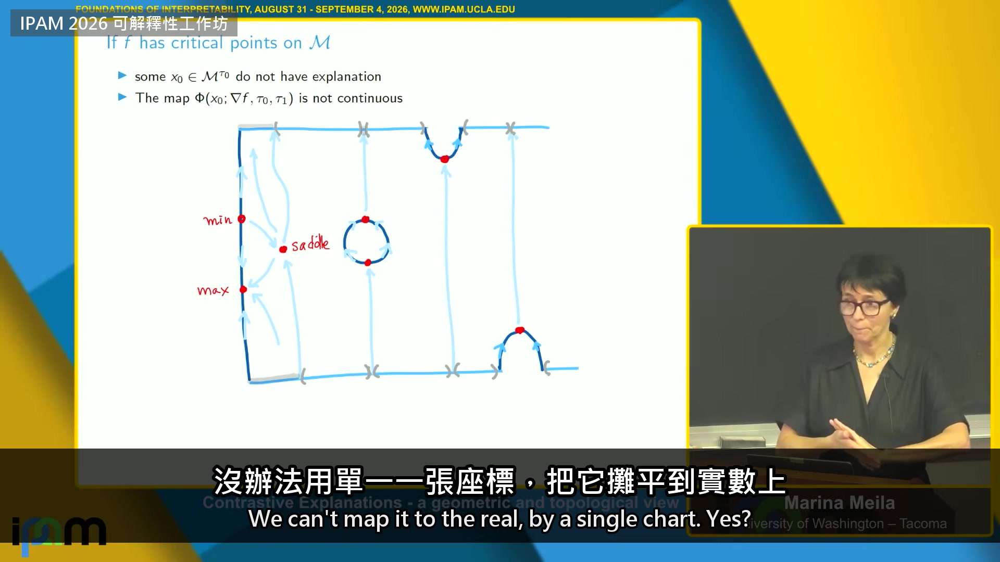

**逐字稿片段：** 這大概是今天最該帶回家的一件事 其實這也是最重要的挑戰 我不假裝我已經解決了 基本上，就算只有一個點的洞 就沒辦法用一張全域的地圖把它看成實數線 所以得替解釋所在的空間想另一種拓樸 某種看起來像有洞的定義域 這就是我想傳達的訊息 就算在這個極限裡 只要問解釋穩不穩定 拓樸就不能忽略，拓樸就是答案 函數的拓樸描述 會告訴我們手上這個解釋有什麼性質 後半場她把同一條上坡路換成用概念來走 我們壓成一段

**話題推測：** 總結一個本次演講最重要的核心觀點或帶回家訊息。

---

## 00:08:08

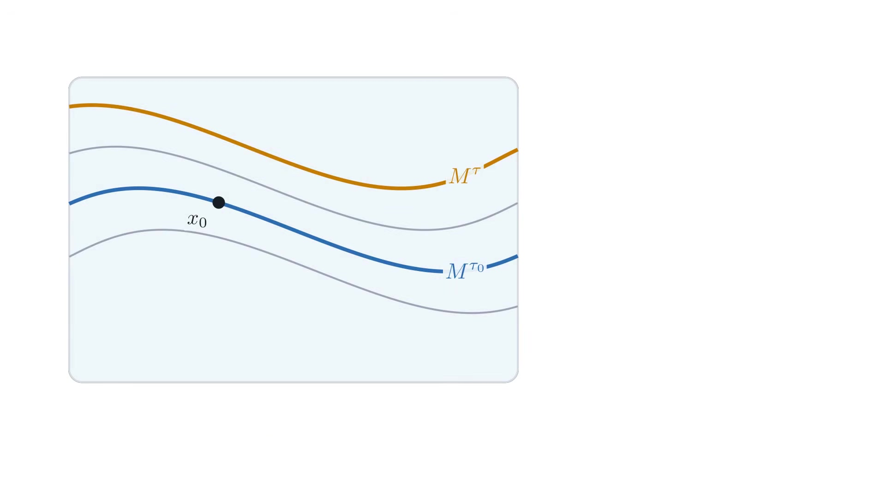

**逐字稿片段：** 概念是使用者的語言，像腫瘤大小 血流速度 每個概念 c 都是 x 的函數 她不逼近 f 本身 只逼近 f 的梯度：在每一點上 f 最陡的那支箭頭 用幾個概念的箭頭加權湊出來 權重 β 每個點都不一樣 誤差每一點都不超過 δ 接著兩條路從同一個起點出發 一條照真的梯度走，一條照湊的走

**話題推測：** 定義「概念」並舉例，可能是投影片上的列點說明。

---

## 00:08:30

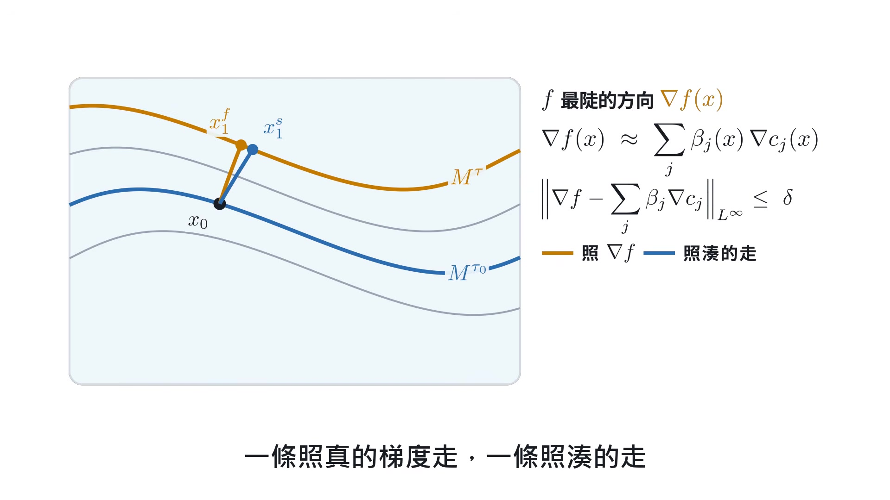

**逐字稿片段：** 她的上界 兩個終點的距離不超過 δ 除以 L 乘上 e 的 L 倍 τ 減 τ0 次方再減一 L 是 f 二階導數的上界 白話：誤差隨要爬的高度指數放大

**話題推測：** 展示概念解釋方法的誤差上界公式。

---

## 00:08:41

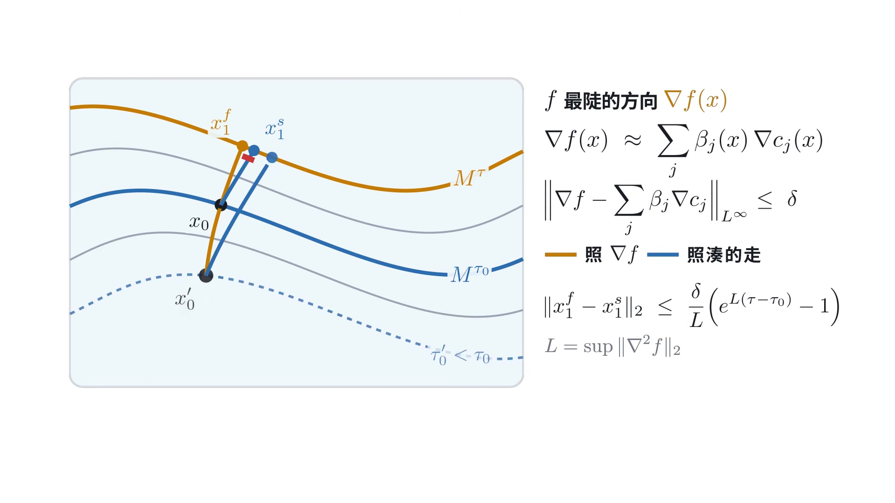

**逐字稿片段：** 她沒做的三件 概念不夠用的情況沒分析 概念到 f 的對應她假設全域成立 流形有洞還要多一個全域條件 她說那一條目前什麼都說不出來 還有一件很棒的事，我想特別強調 數學其實跟我們的直覺對得上 基本上，如果軌跡比較長，起點 τ0 比較低 想要一樣準，δ 就要變小 有一條很簡單的式子 代入 ε 就會看到，δ 必須越來越小 因為要補的差距更大，理所當然 局部的逼近要更精準 而局部逼近要更精準 就可能需要越來越多概念 所以這自動告訴我，如果我想 向一個差得更遠的人解釋 我需要一個更長、更複雜的解釋 這一點都不意外 只是確認了我們的方向可能是對的 沒有做出違反直覺的東西

**話題推測：** 列出概念解釋方法仍存在的限制或未完成之處。

---

## 00:09:50

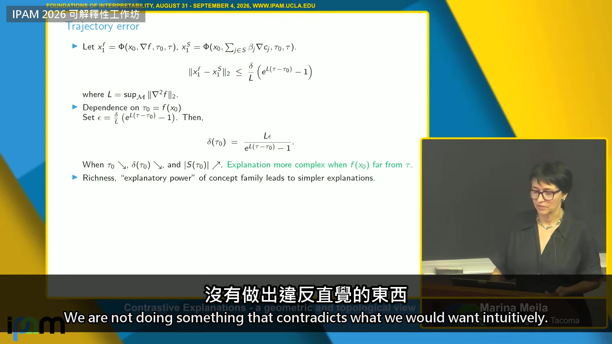

**逐字稿片段：** 整場收成一句 反事實解釋是一個對應 Φ 它存不存在、連不連續 由 f 的地形決定 資料再多也改不了

**話題推測：** 演講的最終總結，歸納核心論點。

---

## 00:09:59

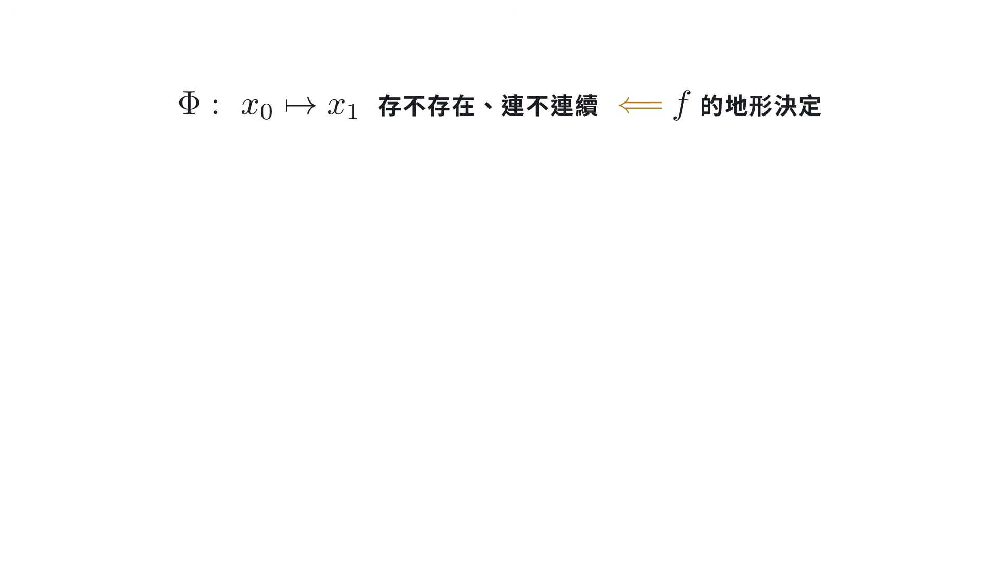

**逐字稿片段：** 她做到的：把解釋寫成梯度流 證明沒有臨界點時人人有解釋而且連續 畫出有臨界點時誰拿不到、哪裡會跳 還有概念版的誤差上界

**話題推測：** 總結講者在反事實解釋領域的主要貢獻。

---

## 00:10:08

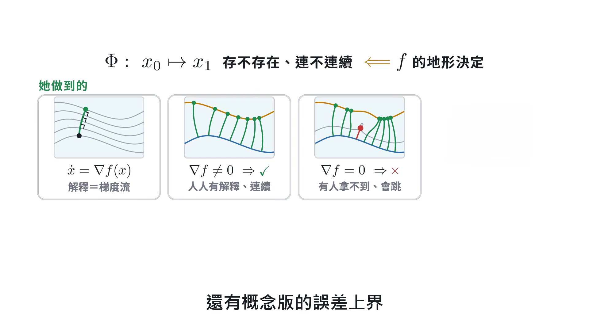

**逐字稿片段：** 她沒做到的，她的結論頁自己列了 解釋應該附上一個複雜度 一部分是路徑長度，一部分是拓樸 兩個怎麼合起來是開放問題 還有整場都在理想世界裡：f、流形 密度全當成已知，沒有資料 也沒有實驗

**話題推測：** 總結講者提出的未解決問題和未來研究方向。

---

## 00:10:23

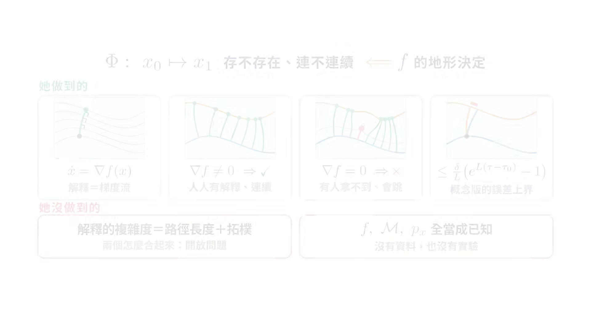

**逐字稿片段：** 下一場是 Columbia 大學的 Elias Bareinboim Judea Pearl 的學生 因果這一派 Meila 把反事實這個詞讓給了因果 Bareinboim 要講的就是 AI 要會做因果推理 才講得出真正的解釋

**話題推測：** 介紹下一場演講的講者與主題，預示話題轉變。

---

## 00:10:35

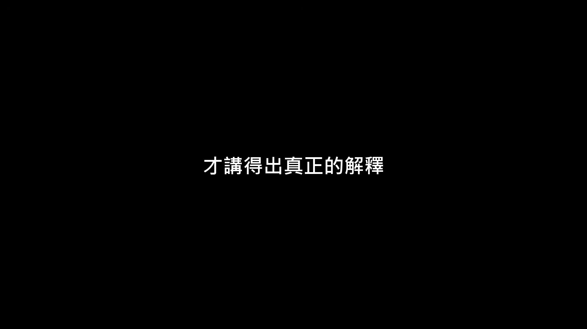

**逐字稿片段：** 他的第一個例子是問生圖模型 貓把花瓶推下桌會怎樣 模型自己把墊子拿掉，再讓花瓶摔碎 十歲小孩都看得出不對 最強的模型卻看不出來 原影片連結在說明欄，整場 53 分鐘，有興趣可以去聽更多。

**話題推測：** 為下一場演講引入一個生動的例子，通常會搭配視覺畫面。

---
