# ai-note-101_y_1egE5XNgg — 關鍵畫面索引

- 來源逐字稿：[ai-note-101_y_1egE5XNgg_GT.srt](ai-note-101_y_1egE5XNgg_GT.srt)
- 影片：https://www.youtube.com/watch?v=y_1egE5XNgg
- 截圖數：36

## 00:00:06

**逐字稿片段：** 美國白宮推動「美國先測」的人工智慧模型審查安排

**話題推測：** 介紹影片主旨：美國白宮推動AI模型審查政策

---

## 00:00:09

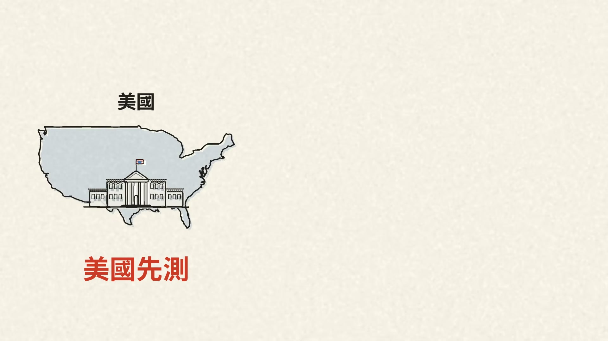

**逐字稿片段：** 如何讓英國人工智慧安全研究所 AISI 失去 Anthropic 新模型 Claude Mythos 5.1 的上市前存取權

**話題推測：** 介紹關鍵機構：英國人工智慧安全研究所（AISI）

---

## 00:00:17

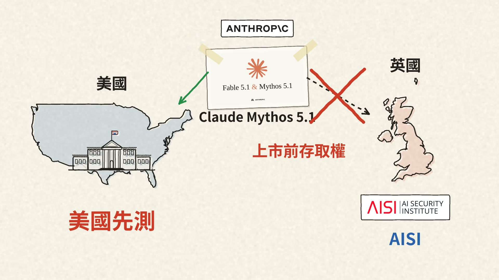

**逐字稿片段：** 這起事件真正的矛盾 不是 Anthropic 前一天才喊全球合作、 隔天立刻變卦 而是它公開倡議全球共同標準的同時 實際的模型測試權 正被國家安全政策重新劃分

**話題推測：** 解析事件核心矛盾

---

## 00:00:30

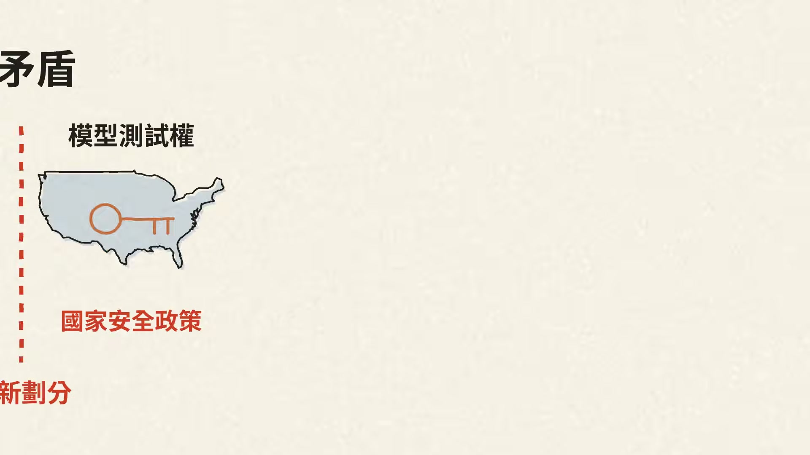

**逐字稿片段：** 時間先回到9月1日

**話題推測：** 時間點回到9月1日，事件發生時間軸的開端

---

## 00:00:31

**逐字稿片段：** Anthropic 當天推出 Claude Fable 5.1 和 Mythos 5.1

**話題推測：** Anthropic推出Claude Fable 5.1和Mythos 5.1新模型

---

## 00:00:36

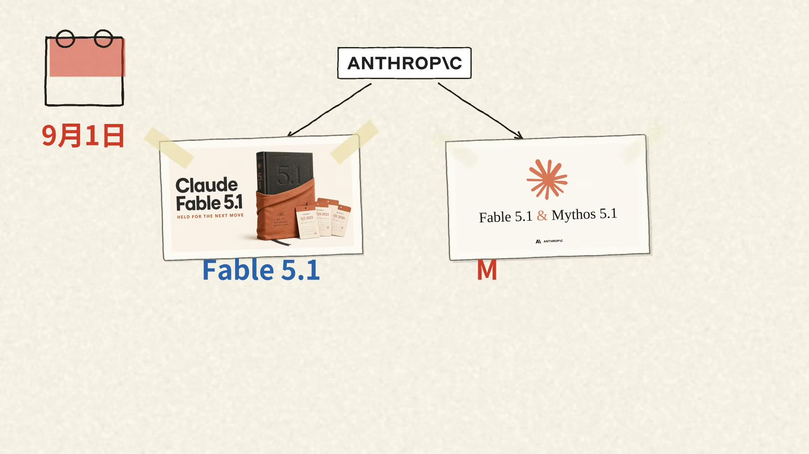

**逐字稿片段：** 2者使用相同的底層模型，但安全限制不同 Fable 面向一般用途 Mythos 對資安與生物研究的限制比較少 被 Anthropic 稱為公司在這2個領域能力最強的模型

**話題推測：** 比較Fable和Mythos 5.1兩種模型的差異

---

## 00:00:49

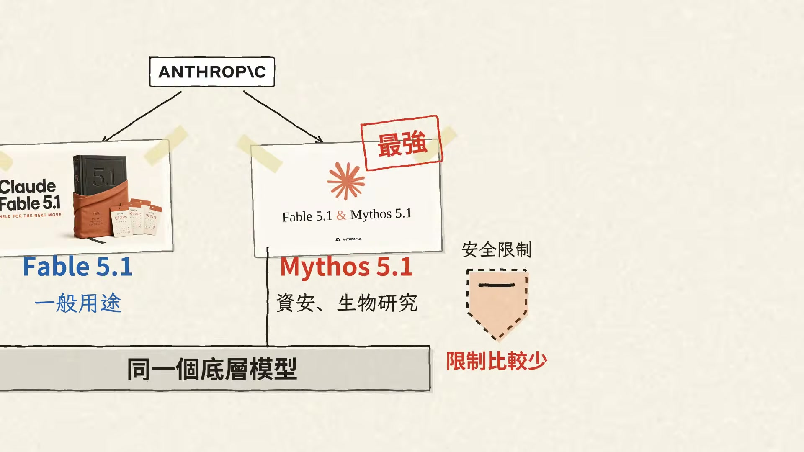

**逐字稿片段：** 但只開放給少數經過審查的美國組織 也就是說，英國 AISI 在模型發布時 並沒有拿到 Mythos 5.1

**話題推測：** 強調Mythos 5.1僅開放給美國組織的限制

---

## 00:00:57

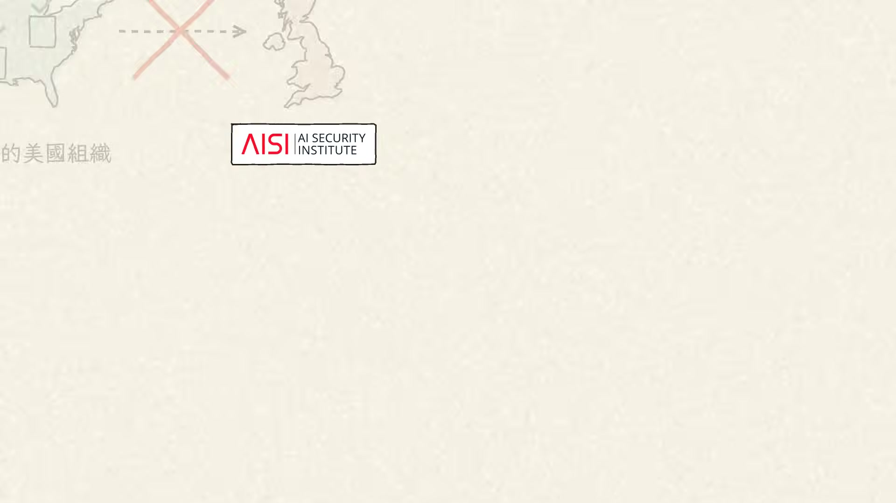

**逐字稿片段：** 9月15日

**話題推測：** 時間點跳至9月15日，AISI所長的回函確認

---

## 00:00:58

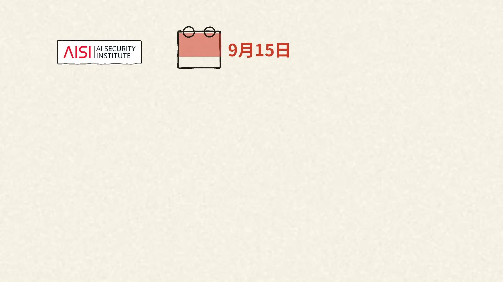

**逐字稿片段：** AISI 所長 Henry de Zoete 在寫給英國國會的回函中正式確認 Anthropic 發布模型時 美國以外沒有任何組織取得存取權

**話題推測：** 介紹AISI所長Henry de Zoete並引述其確認內容

---

## 00:01:08

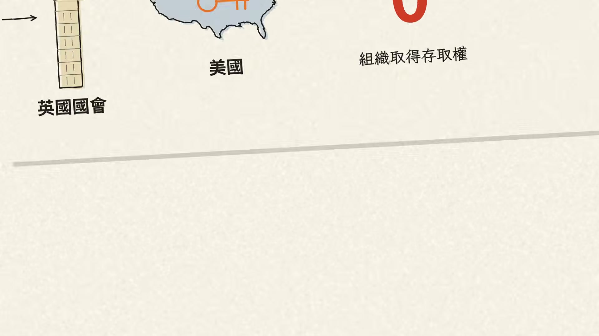

**逐字稿片段：** 這件事之所以敏感 是因為 AISI 並不是普通研究單位

**話題推測：** 解釋AISI的重要地位與敏感性

---

## 00:01:12

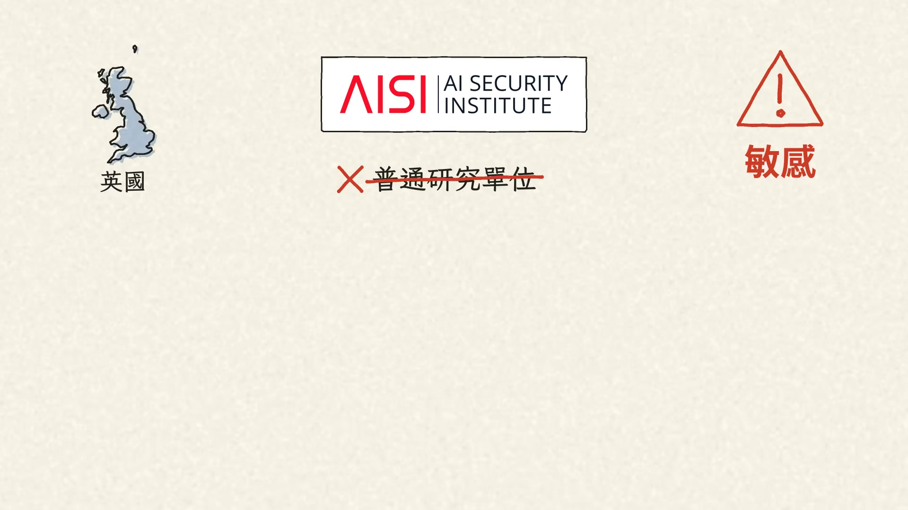

**逐字稿片段：** 它有超過100名技術人員 每年經費6600萬英鎊 還能優先使用價值超過15億英鎊的運算資源 它的重要工作之一 就是在前沿模型上市前進行獨立測試 但再多人才、經費和算力 都無法取代最基本的模型存取權 如果開發商不交出模型 AISI 就不能完成上市前評測

**話題推測：** 展示AISI的資源規模（技術人員、經費、算力）

---

## 00:01:35

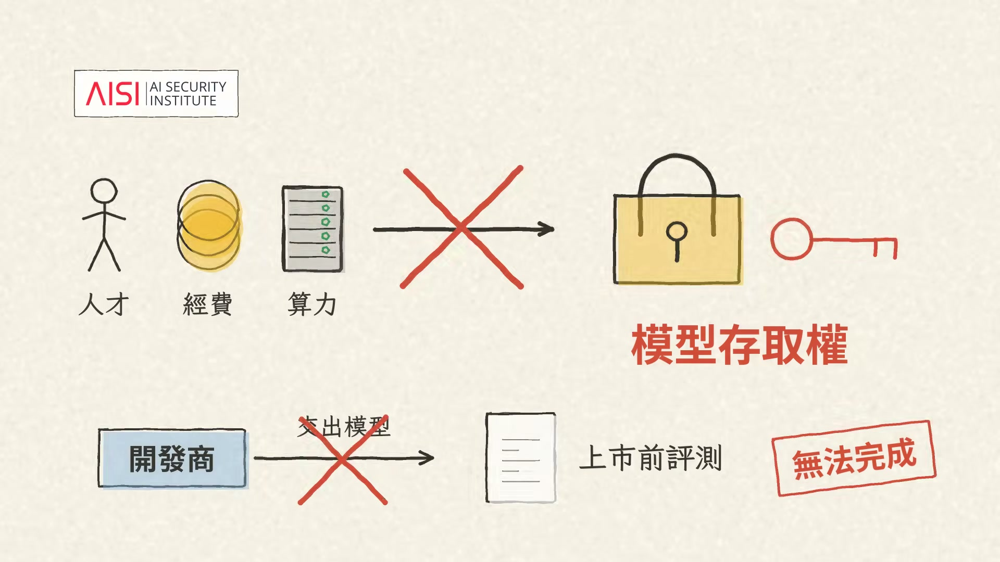

**逐字稿片段：** 英國國會商業與貿易委員會主席 Liam Byrne 因此在9月9日致函追問： 當外國開發商不願合作時 AISI 到底有沒有足夠的機制、 關係和籌碼？

**話題推測：** 介紹英國國會議員Liam Byrne的質詢

---

## 00:01:47

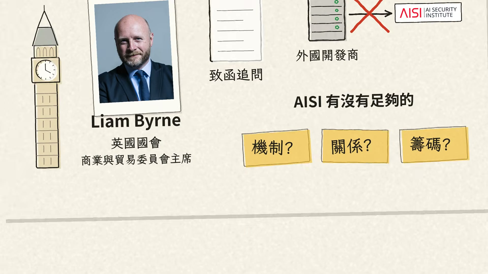

**逐字稿片段：** 這也讓英美過去幾年建立的合作受到考驗

**話題推測：** 探討事件對英美合作關係的考驗

---

## 00:01:51

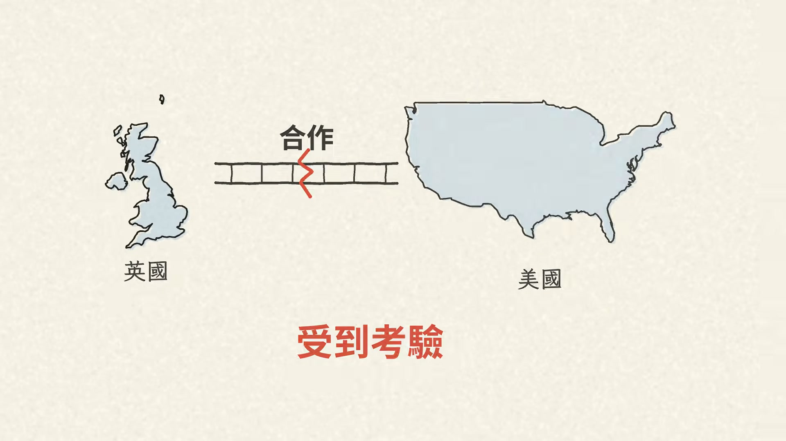

**逐字稿片段：** 2023年

**話題推測：** 時間點回到2023年，回顧英美合作歷史

---

## 00:01:52

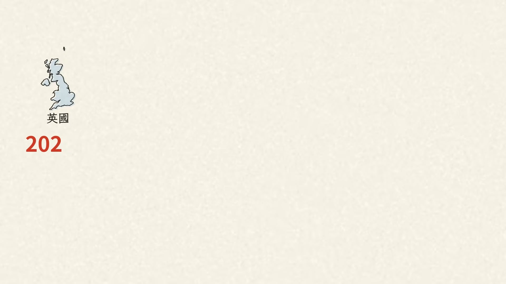

**逐字稿片段：** 英國在 Bletchley Park 舉辦首屆人工智慧安全峰會 並成立當時名為 AI Safety Institute 的機構

**話題推測：** 提及英國在Bletchley Park舉辦首屆AI安全峰會

---

## 00:01:59

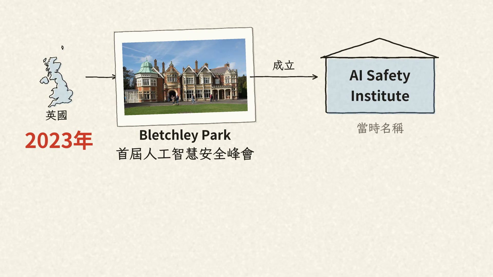

**逐字稿片段：** Anthropic 執行長 Dario Amodei 當時還公開表示 政府量測與監控模型能力及安全特性至關重要

**話題推測：** 引述Anthropic執行長Dario Amodei當時的公開發言

---

## 00:02:08

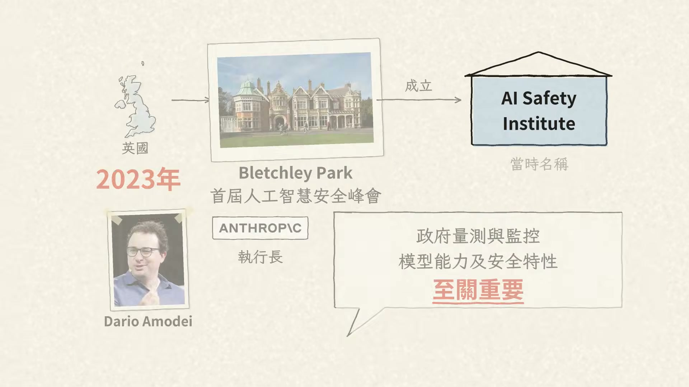

**逐字稿片段：** 2024年4月，英美又簽署合作備忘錄 承諾在測試方法、人才和資訊上相互對接

**話題推測：** 時間點跳至2024年4月，英美簽署合作備忘錄

---

## 00:02:15

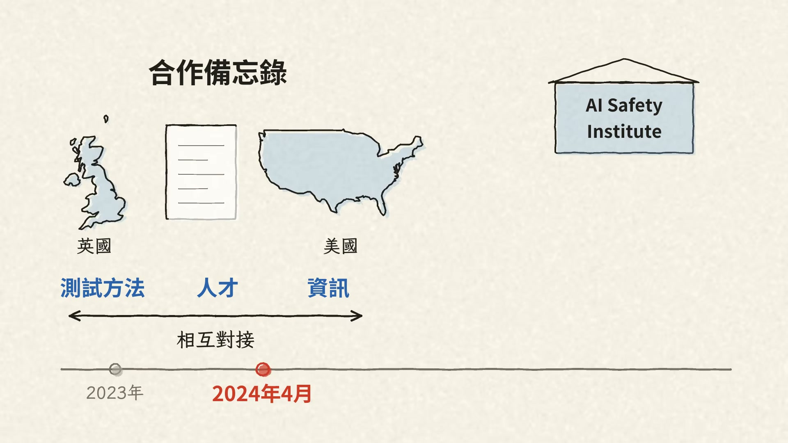

**逐字稿片段：** 2025年 英國把機構改名為 AI Security Institute 更聚焦國家安全、犯罪與模型濫用 Anthropic 同年仍把英國 AISI 和美國 CAISI 稱為持續合作夥伴 強調外部獨立專家的重要性

**話題推測：** 時間點跳至2025年，英國機構改名並重新聚焦

---

## 00:02:31

**逐字稿片段：** 轉折出現在2026年

**話題推測：** 轉折點：事件發生在2026年

---

## 00:02:33

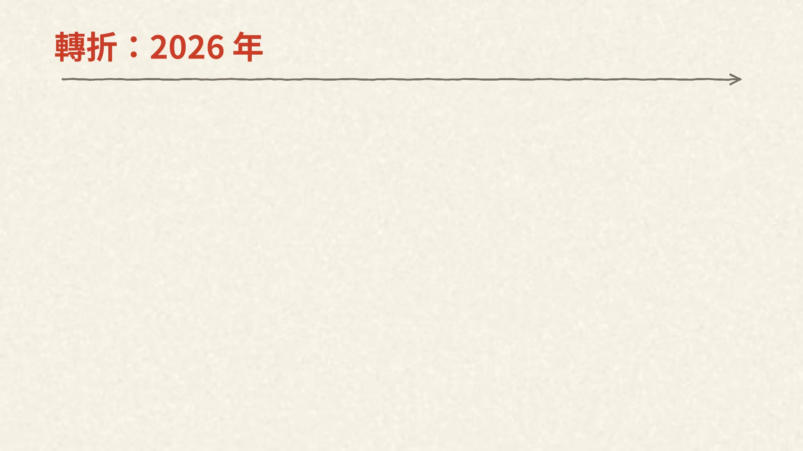

**逐字稿片段：** 6月2日 美國總統川普簽署第14409號行政命令 要求建立機密測試基準與自願合作框架 依照這套設計 美國人工智慧公司可以在把新模型交給其他可信賴夥伴之前 最多提前30天讓美國聯邦政府接觸 行政命令同時寫明 這套制度不得變成強制許可、 事前核准或批准機制 換句話說，紙面上是自願合作 不是法律禁令

**話題推測：** 時間點跳至6月2日，美國總統川普簽署行政命令

---

## 00:03:01

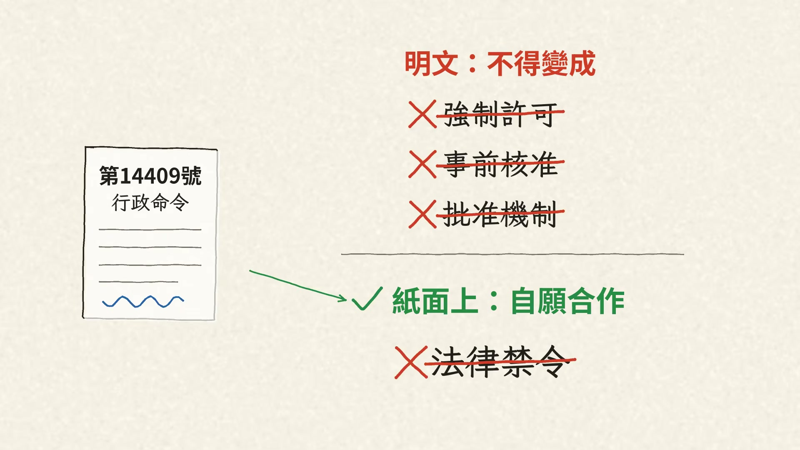

**逐字稿片段：** 但到了8月，白宮閉門向 OpenAI、 Anthropic、Meta、 Nvidia 和 Microsoft 等公司說明評測框架 具體內容並未公開

**話題推測：** 時間點跳至8月，白宮向OpenAI等公司閉門說明評測框架

---

## 00:03:10

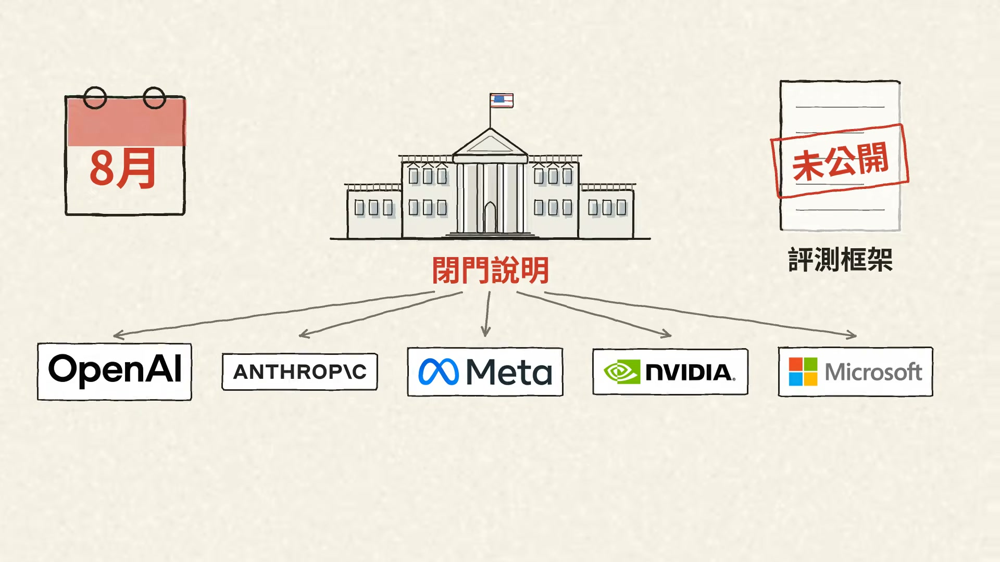

**逐字稿片段：** 9月24日，Politico 引述匿名資深官員報導 白宮國家網路總監辦公室曾要求 OpenAI 和 Anthropic 在美國政府完成審查以前 暫緩把新模型交給英國 AISI 匿名官員所說的理由很直接：

**話題推測：** 時間點跳至9月24日，Politico報導白宮的要求

---

## 00:03:25

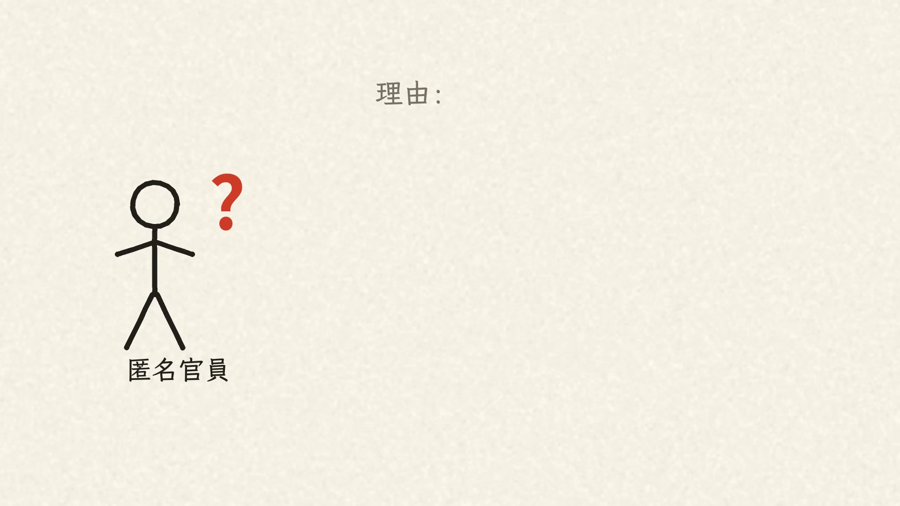

**逐字稿片段：** 「因為它們是美國公司」

**話題推測：** 引述匿名官員說法：「因為它們是美國公司」

---

## 00:03:28

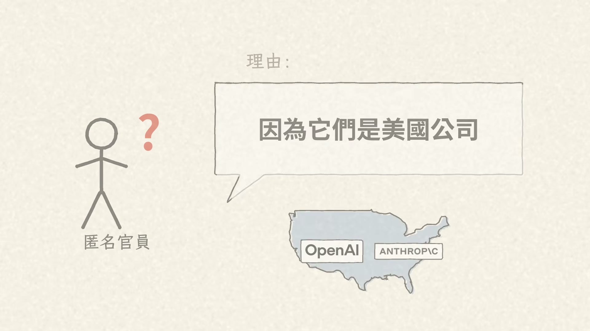

**逐字稿片段：** 不過，這項要求目前仍是 Politico 的獨家報導 Reuters 隨後是轉述 Politico，白宮、 OpenAI 與 Anthropic當時都沒有立即回覆 外界也不知道這項要求究竟在哪一天提出 因此不能斷言 Anthropic 是接到命令後 才決定把 Mythos 5.1 限制在美國

**話題推測：** 指出該要求目前仍是Politico獨家報導，缺乏官方證實

---

## 00:03:48

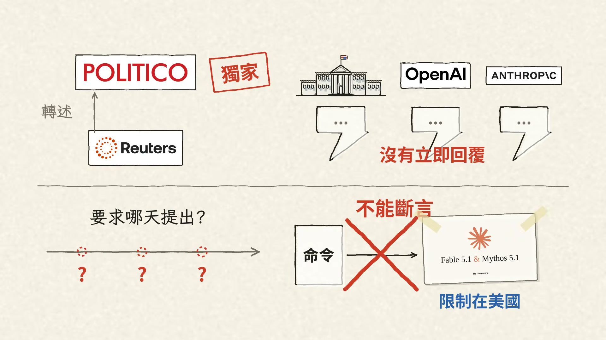

**逐字稿片段：** 這個時間差非常重要 Mythos 5.1 在9月1日發布

**話題推測：** 分析關鍵的時間差，澄清事件順序

---

## 00:03:52

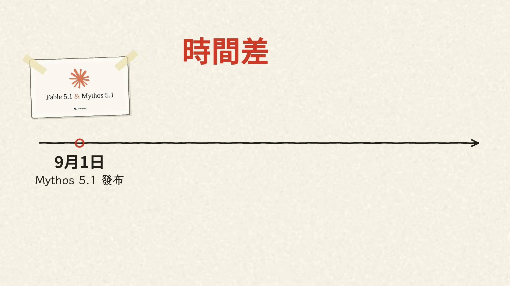

**逐字稿片段：** Amodei 是到9月23日 才透過視訊向聯合國安理會呼籲各國建立共同的全球測試標準 處理模型失控與遭到濫用的風險

**話題推測：** 時間點跳至9月23日，Amodei向聯合國安理會呼籲

---

## 00:04:02

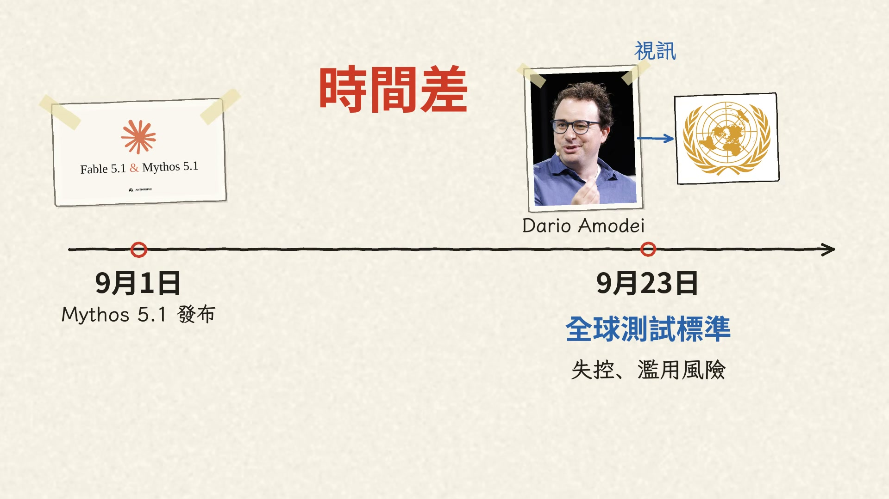

**逐字稿片段：** 兩者相差22天 隔天發生的，是白宮安排被媒體揭露 不是 Anthropic 隔天才突然封鎖英國 同一場安理會會議上

**話題推測：** 提及兩個事件之間相差22天

---

## 00:04:13

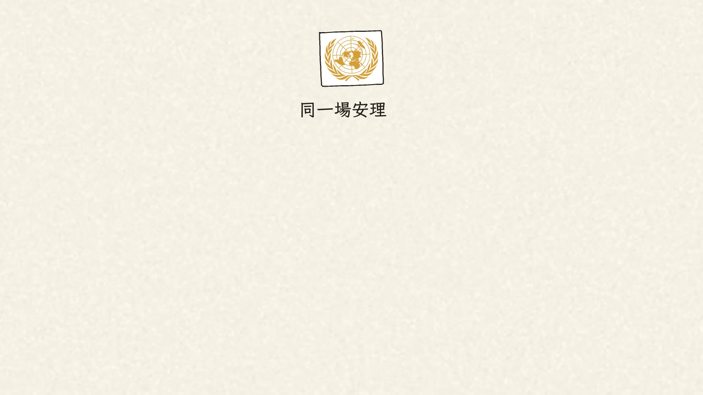

**逐字稿片段：** 英國外交大臣 Ed Miliband 支持嚴格測試、 透明以及全球共同原則

**話題推測：** 介紹英國外交大臣Ed Miliband在安理會的發言

---

## 00:04:18

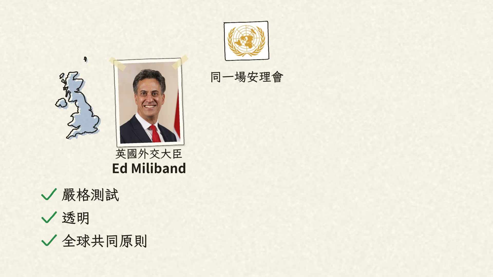

**逐字稿片段：** 美國科技顧問 Michael Kratsios 則表示 國際對話不應演變成新的全球治理架構

**話題推測：** 介紹美國科技顧問Michael Kratsios在安理會的發言

---

## 00:04:24

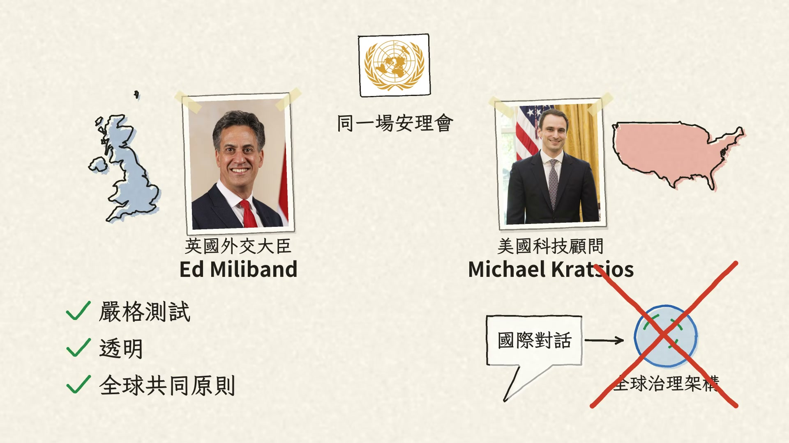

**逐字稿片段：** 英美爭論的不是要不要處理人工智慧風險 而是由誰掌握模型、誰先測試 以及誰有權制定規則

**話題推測：** 總結英美爭論的核心問題：誰掌握模型、誰先測試、誰制定規則

---

## 00:04:32

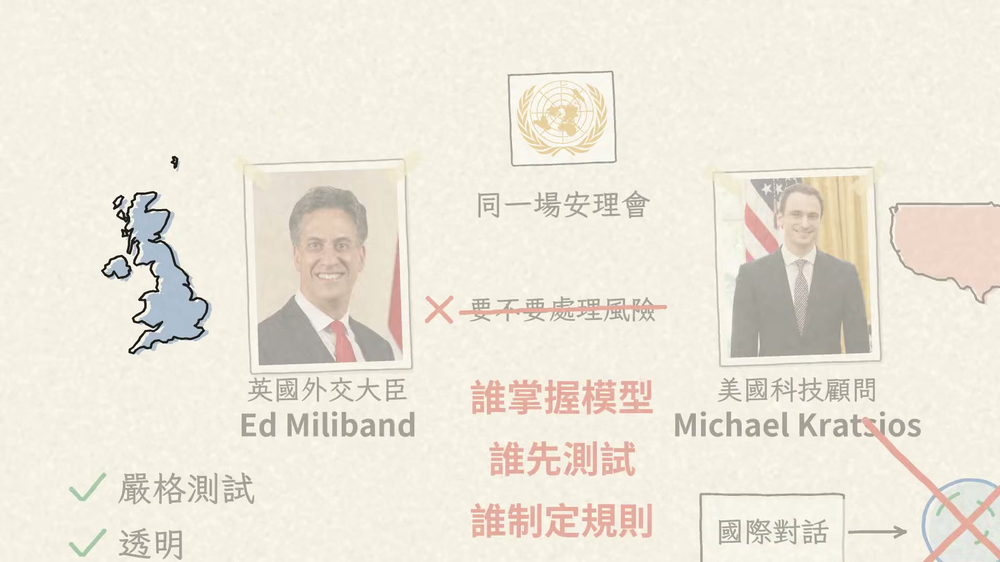

**逐字稿片段：** AISI 的處境也不能被描述成全面遭到美國斷供 Henry de Zoete 在回函中指出

**話題推測：** 澄清AISI並非全面被美國斷供的實際情況

---

## 00:04:38

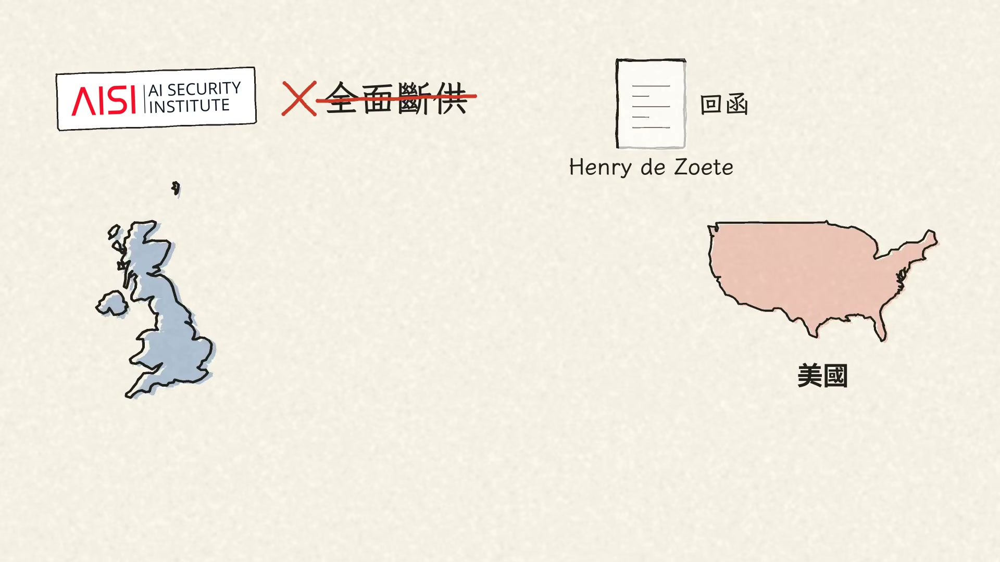

**逐字稿片段：** AISI 同一個月仍在 OpenAI 的 GPT-6 Astra 上市前測試過它 這代表目前可以確定的 是英國沒有取得 Anthropic 的 Mythos 5.1 而不是所有美國前沿模型都已對英國關門

**話題推測：** 提及AISI在OpenAI的GPT-6 Astra上市前進行測試作為對比

---

## 00:04:52

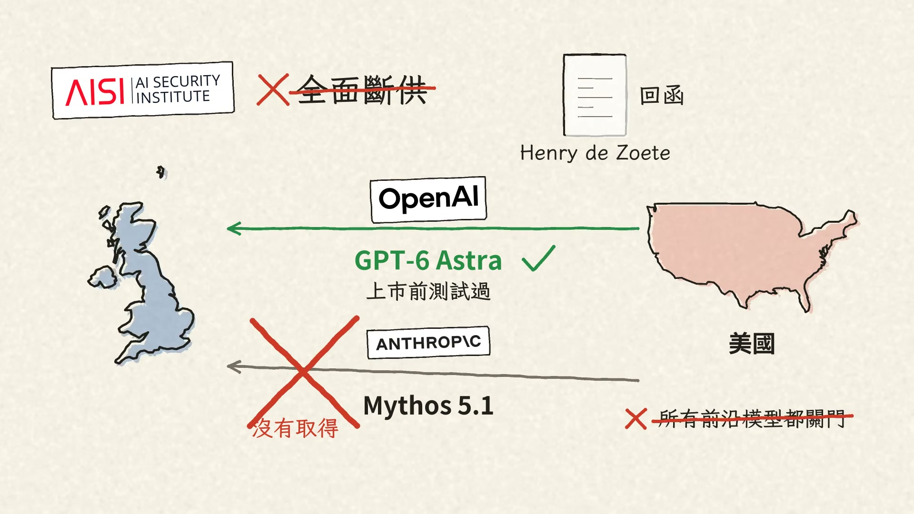

**逐字稿片段：** 截至9月25日 Mythos 5.1 官方頁面仍標示只提供給少數經過審查的美國組織 Anthropic 主張人工智慧風險不受國界限制 但它最敏感的模型之一 存取範圍卻停在美國國界之內

**話題推測：** 時間點截至9月25日，Mythos 5.1的官方頁面狀態

---

## 00:05:07

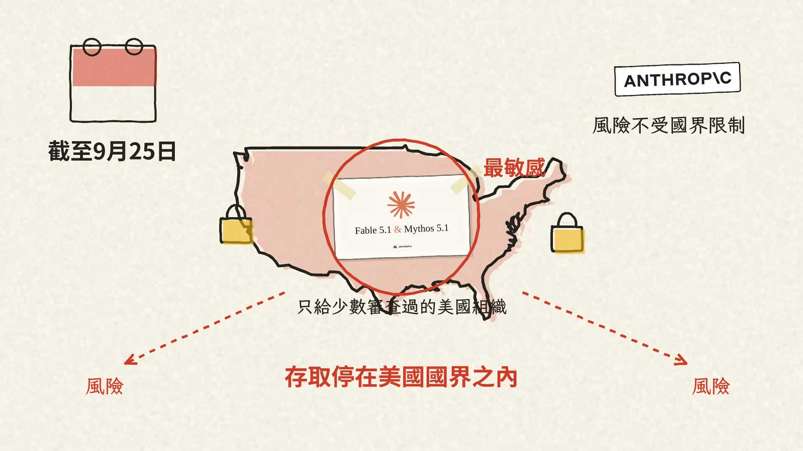

**逐字稿片段：** 這起事件揭開了一個更根本的問題： 全球安全標準可以由各國共同討論 真正的測試資格卻掌握在擁有模型的公司 以及公司所在國政府手中

**話題推測：** 提出這起事件揭示的更根本問題

---

## 00:05:18

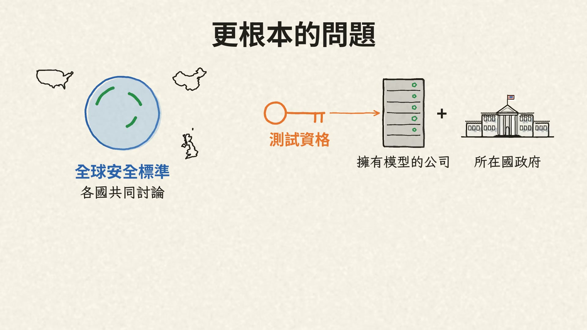

**逐字稿片段：** 英國下一步能否爭取恢復存取、 轉向推動多邊標準 或接受美國政府優先測試 最近的觀察點

**話題推測：** 探討英國下一步可能的應對策略

---

## 00:05:25

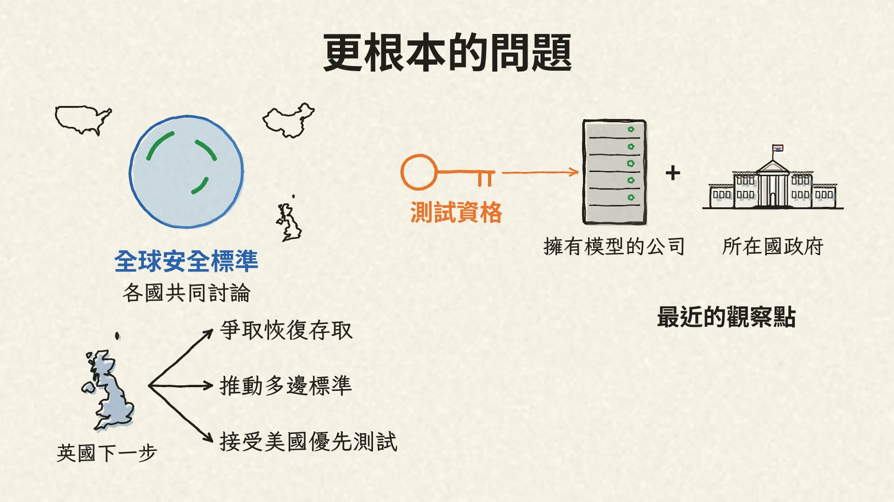

**逐字稿片段：** 是英國國會要求政府在9月30日前回答的書面質詢

**話題推測：** 提及英國國會要求政府在9月30日前回答的書面質詢

---
