# ai-note-101_yccUcgYZRCw — 關鍵畫面索引

- 來源逐字稿：[ai-note-101_yccUcgYZRCw_GT.srt](ai-note-101_yccUcgYZRCw_GT.srt)
- 影片：https://www.youtube.com/watch?v=yccUcgYZRCw
- 截圖數：26

## 00:00:11

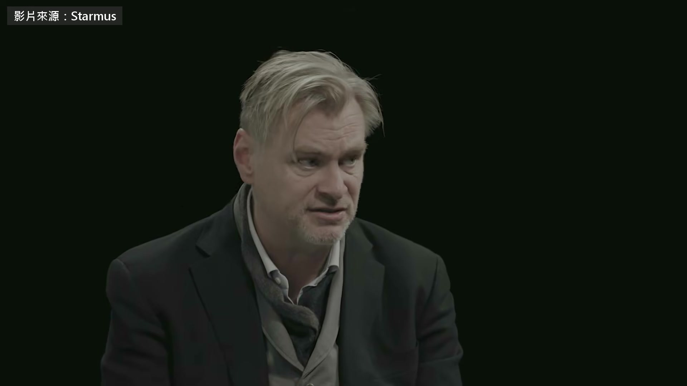

**逐字稿片段：** 這段對談是科學節 Starmus 今年 9 月初公開的 場合是頒給他霍金科學傳播獎章 他是 2024 年的得主 跟他對談的 Kip Thorne 拿過諾貝爾物理學獎 也是《星際效應》的科學顧問

**話題推測：** 介紹對談的科學節Starmus活動資訊

---

## 00:00:24

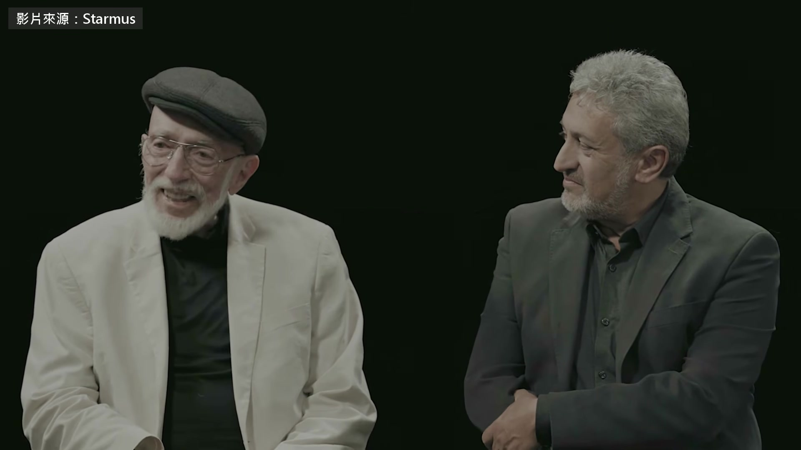

**逐字稿片段：** 第一個問題由他來問，問的是核武 這件事我放在心裡很久，昨晚還在想

**話題推測：** 轉入Kip Thorne提問的核武話題

---

## 00:00:32

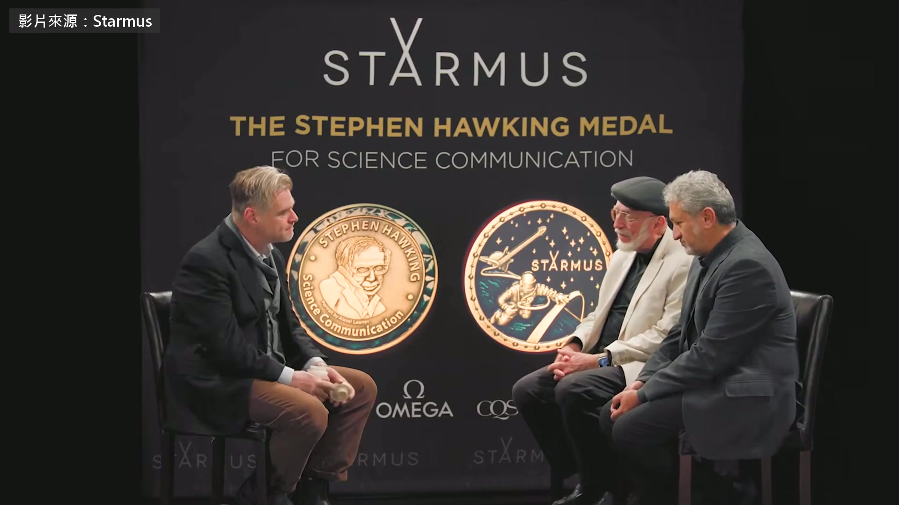

**逐字稿片段：** 我想起 1950、60 年代， 當時我自己、我的物理學家同事， 政治人物，還有一般大眾， 都深深擔心核子浩劫 那個年代我常待在蘇聯， 那邊的憂慮跟這裡一樣深，甚至更深 我認為那是一股穩定的力量，保護我們不至於…

**話題推測：** 回憶1950、60年代核武憂慮

---

## 00:01:14

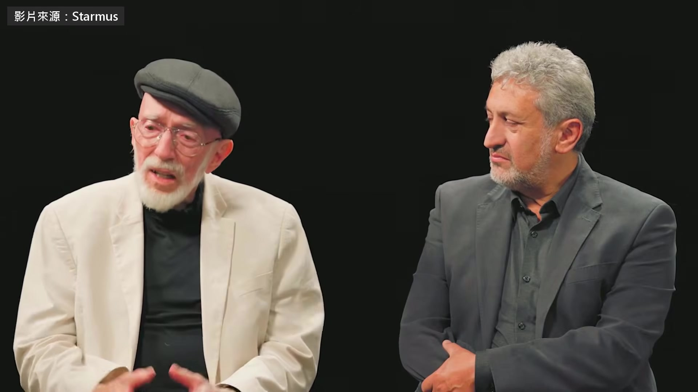

**逐字稿片段：** 你在電影裡形容這是瓶子裡的兩隻蠍子， 美國跟蘇聯

**話題推測：** 引用電影《奧本海默》中核武競賽的「瓶中蠍子」比喻

---

## 00:01:23

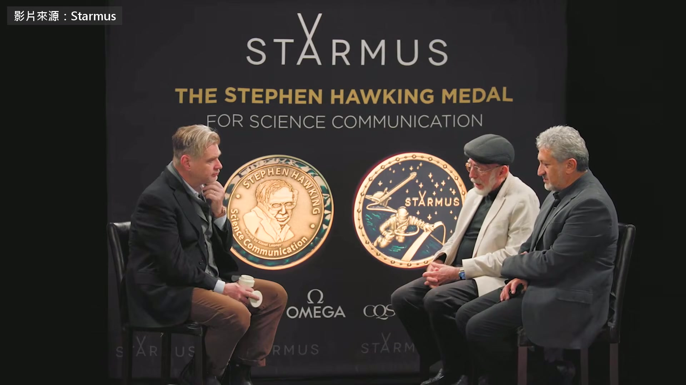

**逐字稿片段：** 世界變了， 現在這一代人，大多渾然不覺有這個危險 你的電影《奧本海默》喚起了很多人的注意， 我很高興看到有社論跟評論因為你的電影而寫出來 你拍《奧本海默》，喚起大家注意是你的目標之一嗎？ 你自己又怎麼看這件事， 畢竟你花了這麼多時間思考奧本海默、拍這部片 大致上，我會投入一個案子，都是為了故事 就是戲劇性、敘事上有沒有意思 但《奧本海默》這一部，

**話題推測：** 探討現今世代對核武威脅的無感

---

## 00:02:17

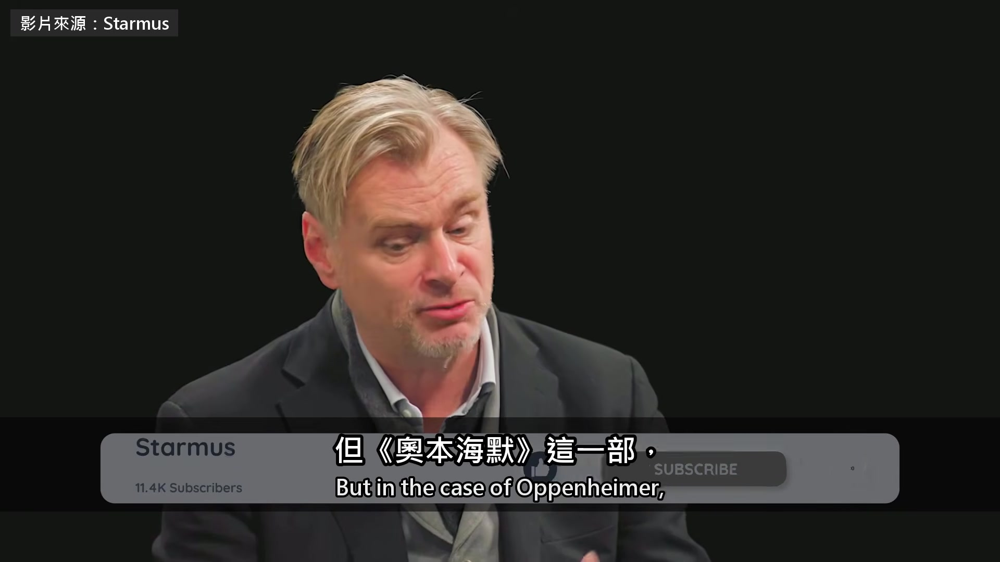

**逐字稿片段：** 我第一次跟我一個兒子說我在做什麼，他那時候大概 16 歲， 他居然跟我說：核武那些， 現在沒什麼人在擔心了吧 這句話讓我非常震驚 我心想，光是這樣，就是拍這部片的理由 兒子那句話還給了他一個提醒 觀眾走進戲院的時候 心裡不一定還惦記著核武 電影得自己把那份威脅演出來 拍完之後，我非常擔心的就是你講的這件事

**話題推測：** 諾蘭講述他兒子對核武的無知，成為拍片動機

---

## 00:02:58

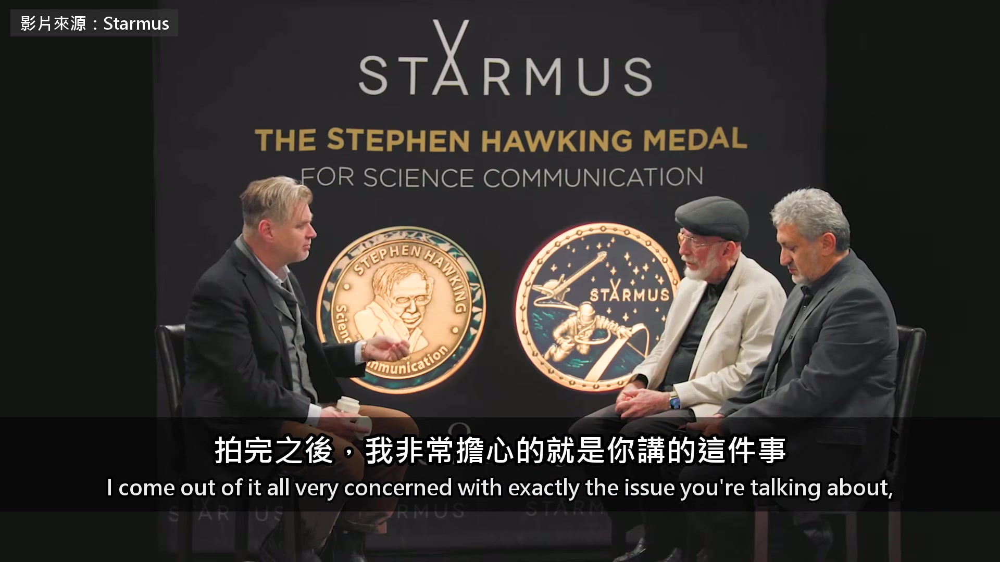

**逐字稿片段：** 因為不管你是主張核武應該從世界上徹底消失， 也不管你覺得那做不做得到， 還是像有些人那樣，看到歐洲比起一戰二戰相對和平， 就說是相互保證毀滅的威脅維持了一些和平 事實是，相互保證毀滅這個概念要有用， 前提是人對核武的毀滅力，有足夠的恐懼跟敬畏 所以不管你怎麼看核威脅… 我個人認為，地球上的核武越少越好，就這樣 這是最簡單的看法 但不管你怎麼看，就算你接受相互保證毀滅這套想法， 它要有用，我們就得一直擔心、一直去想， 一直對各國領袖施壓，要他們減少核武， 也要對那種毀滅力保有該有的敬畏， 那是獨一無二的威脅

**話題推測：** 探討對於核武存廢與相互保證毀滅的不同觀點

---

## 00:03:56

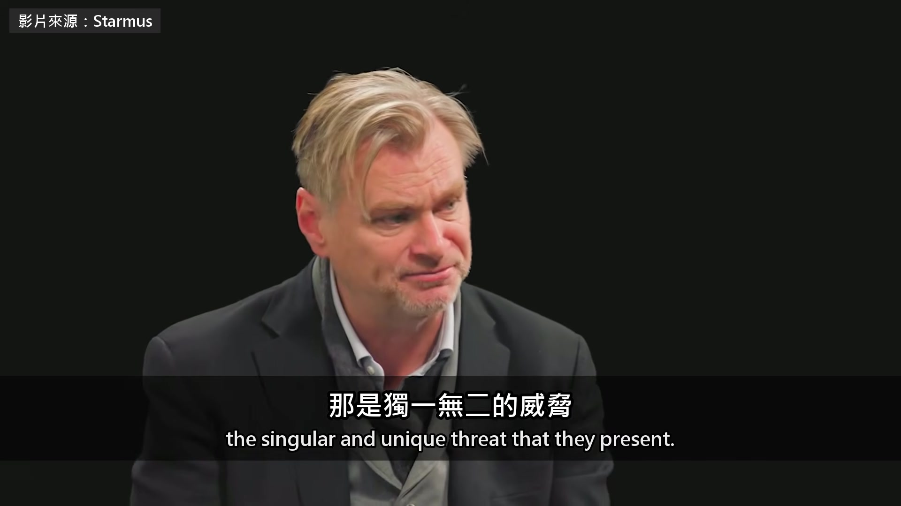

**逐字稿片段：** 電影上映的時候，我讀到一兩篇比較圈內的批評， 是這個領域的人寫的， 他們說電影是用絕望收尾，這樣講沒有錯 我覺得在戲劇上那是必要的， 要讓觀眾感受到真實的威脅，這很重要 他也承認這樣收尾有代價 觀眾可能因此看不到 1945 年以來削減核彈頭的成果 他說人對核武的恐懼一直跟著國際情勢起伏

**話題推測：** 討論電影結局被批評為「絕望」的觀點

---

## 00:04:29

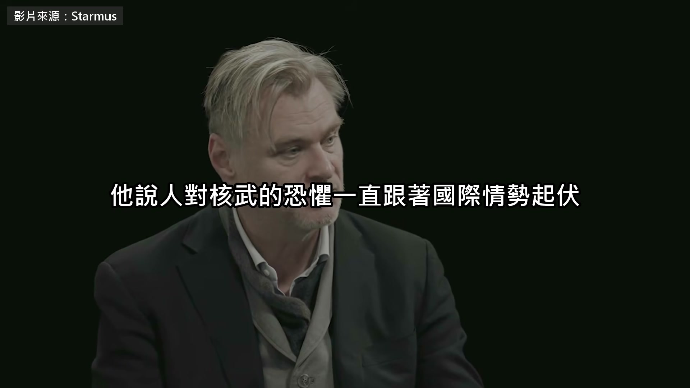

**逐字稿片段：** 電影開拍那時候俄烏局勢惡化 大家才又談起來，他認為不該這樣

**話題推測：** 連結電影開拍時惡化的俄烏局勢

---

## 00:04:34

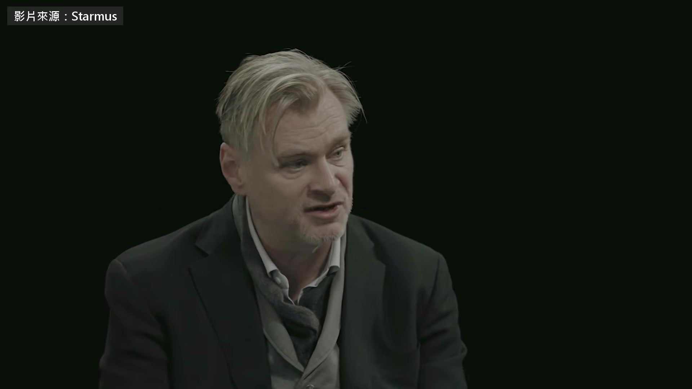

**逐字稿片段：** 接著發問的是 Starmus 的共同創辦人 Garik Israelian

**話題推測：** 介紹Starmus共同創辦人Garik Israelian提問

---

## 00:04:39

**逐字稿片段：** 科技可以救我們，也可以毀了我們 科技可以幫我們擋下氣候變遷跟很多事，但它也可以毀了我們 所以大家說，一切都掌握在我們手上 但什麼能改變我們？ 我們得被改變才行 我認為科學史上一直有一種掙扎， 社會跟人性要怎麼消化科學發現 原子彈誕生的時候，這件事暴露得最徹底，也最嚇人 但我覺得這個問題一直都在

**話題推測：** Garik Israelian提出科技兩面刃的論點

---

## 00:05:22

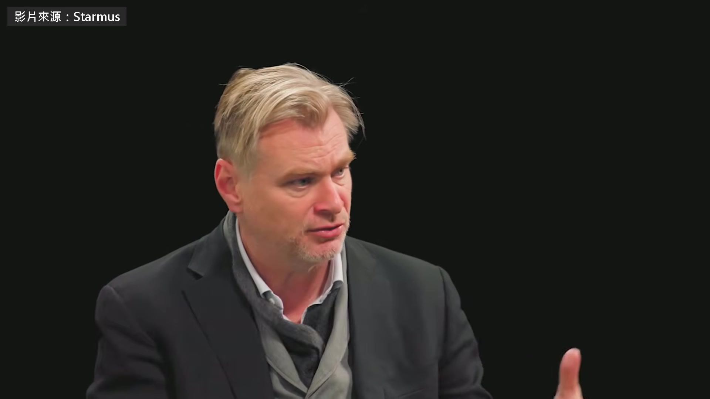

**逐字稿片段：** 知識帶來責任 隨著知識而來的是，知識很有用，同時也可能很危險 它帶來力量，也帶來責任，你得決定新科技要怎麼用

**話題推測：** 強調「知識帶來責任」的核心理念

---

## 00:05:37

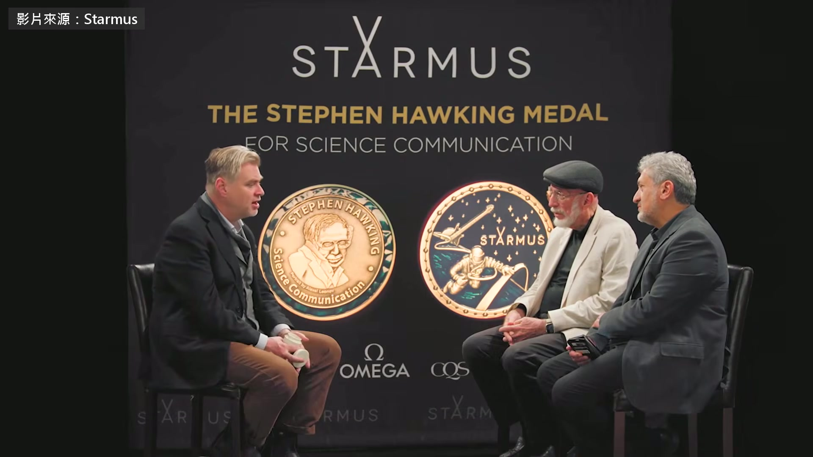

**逐字稿片段：** 過去這一年，尤其是最近六個月， 我花很多時間跟人談，奧本海默的故事跟 AI 現在的處境有什麼關係 嗯 讓我覺得振奮的是，我跟 AI 領域的頂尖研究者聊過， 他們說這是他們的「奧本海默時刻」， 因為對我來說，這代表他們在回頭看過去 他們在歷史裡找例子，特別把奧本海默的故事當成警世故事 他們在問：我們能從這裡學到什麼？ 我研究奧本海默的故事研究了這麼久， 我不確定裡面有具體的答案可以學 問題就在這裡 這個故事拍成戲會好看，就是因為它充滿矛盾， 滿滿都是沒有簡單答案的問題 但至少我很高興他們有在想、有在看， 會說：我們真的要記得，新科技 再怎麼讓人興奮、再怎麼誘人，都可能帶來可怕的意外後果 我覺得現在談 AI，這件事被擺在最前面，這是好事

**話題推測：** 將奧本海默故事與近期AI發展處境連結

---

## 00:06:50

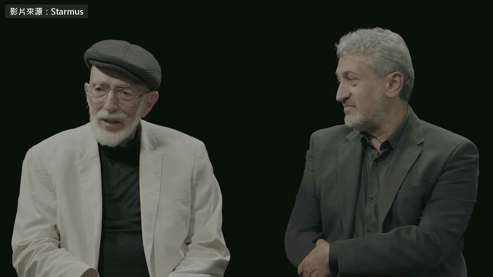

**逐字稿片段：** Kip Thorne 接著提到電影裡的一場戲 原子彈投下之後 奧本海默進白宮見杜魯門總統 說他覺得自己手上沾了血

**話題推測：** Kip Thorne提及電影中奧本海默與杜魯門總統的對話場景

---

## 00:07:00

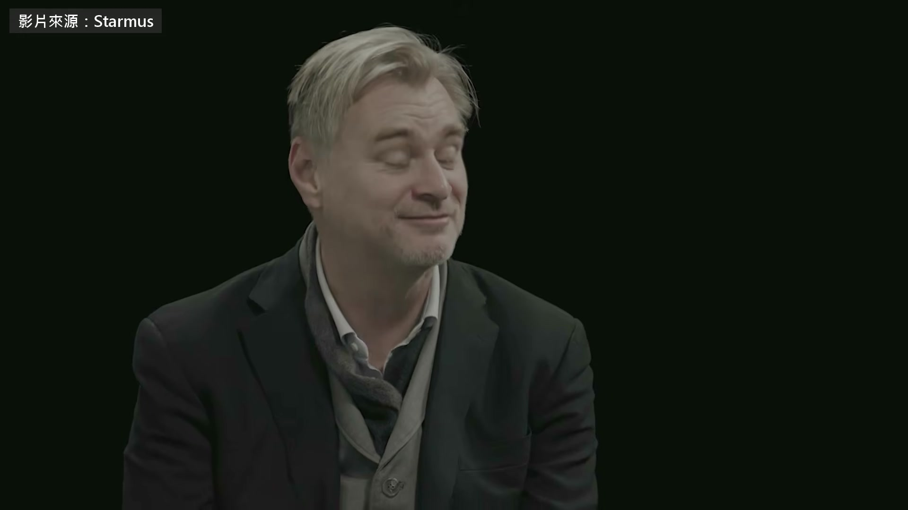

**逐字稿片段：** 電影裡你拍杜魯門總統怎麼回應奧本海默的憂慮，那段讓我印象很深 他基本上是罵奧本海默愛哭鬼， 然後用他在別處講過的話宣告：責任到我為止 該煩惱的人是我，不關你的事 炸彈是你做的，但責任在我

**話題推測：** 聚焦杜魯門總統對奧本海默憂慮的回應

---

## 00:07:28

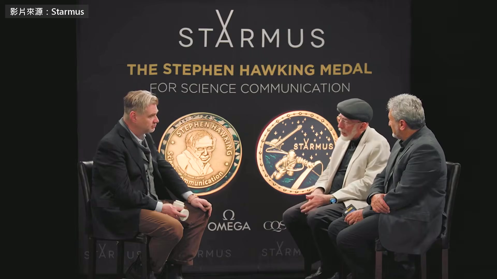

**逐字稿片段：** 但這就帶出一個問題，到了那種層級， 科學家要負多少責任？ 創造的人應該負責，但他們要怎麼負？ 政治跟科學之間的互動，真的變得很複雜 奧本海默的故事，我越想， 拍完片、放給觀眾看、像這樣跟人談， 我就越明白，他走出杜魯門辦公室的那一刻， 為什麼我一直覺得它那麼關鍵，以前卻說不上來，

**話題推測：** 探討科學家在科技創造中的責任歸屬問題

---

## 00:08:02

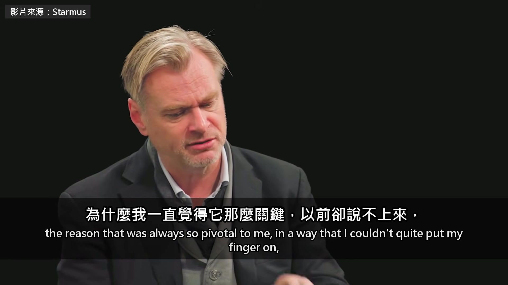

**逐字稿片段：** 是因為它代表科學跟政治的關係破裂了， 科學跟當權者的關係破裂了 這對科學傳播是很大的問題，對 AI 也是

**話題推測：** 諾蘭認為奧本海默事件標誌著科學與政治關係的破裂

---

## 00:08:14

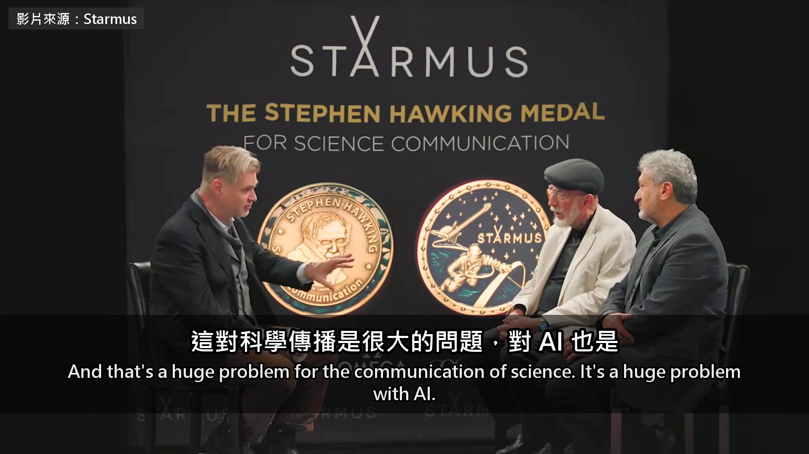

**逐字稿片段：** 它帶來的後果，你在氣候變遷的所有討論裡都看得到， 還有科學家為了那場辯論，在媒體上怎麼拉扯 因為科學跟政治當權者之間，如果沒有健康、單純的關係，

**話題推測：** 將科學與政治關係破裂的後果延伸至氣候變遷議題

---

## 00:08:33

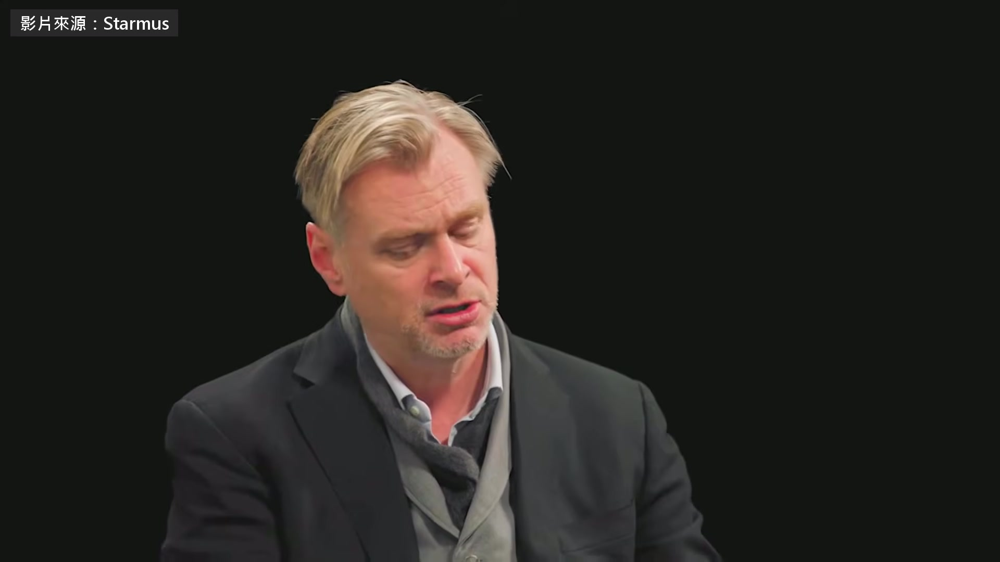

**逐字稿片段：** 科學就只能去找媒體，靠媒體居中傳話 這一定會把科學講淺 這是個問題，因為當科學家不得不… 當他們被逼到得把自己的研究講淺，才能讓大家注意某件事， 他們就失去公信力， 因為很容易被挑出破綻 氣候變遷就是這樣， 有些比較聳動、比較戲劇化的說法，很容易被挑出破綻， 因為那樣講，科學上就不是無懈可擊 要把真實情況講出來比較複雜，這得在政治的層次上做 你需要專家小組、需要科學家的團體， 向政府說明真正的科學是什麼、該做什麼 不能全部透過媒體 而我認為，奧本海默的故事就是這種情況開始的關鍵時刻之一， 三腳架突然多了第三隻腳

**話題推測：** 指出科學被迫透過媒體傳播的問題

---

## 00:09:35

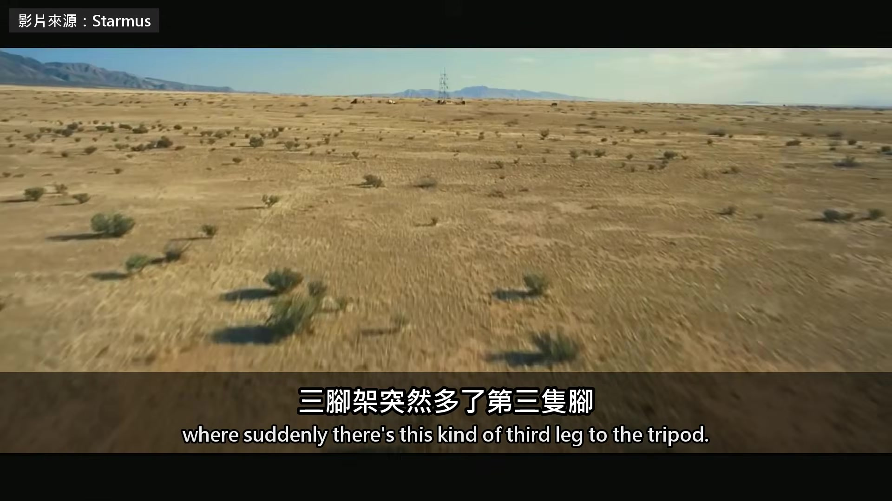

**逐字稿片段：** 曼哈頓計畫是祕密進行的， 政府跟科學的關係，可以說有效率得可怕， 突然之間，它被攤開到第三個場域，也就是大眾的目光、媒體 這就扭曲了政治人物跟科學家的關係， 我覺得我們到現在都還在承受後果 這是非常複雜的問題

**話題推測：** 描述曼哈頓計畫的秘密性質與政府科學關係

---

## 00:09:59

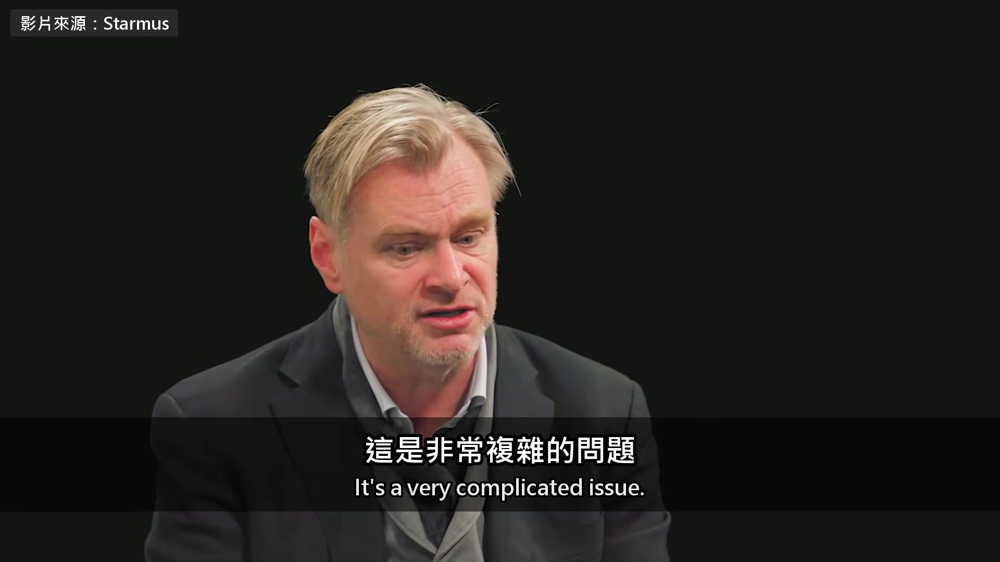

**逐字稿片段：** 我想真正的解法，或者說目標， 是讓最懂的人跟制定政策的人，有一個最健康的關係， 也許不要老是在大眾面前上演， 讓它成為有成果的專家對話 但這得靠大眾的壓力，所以… 沒錯 所以我們得把科學傳達給一般大眾 對 再由大眾去對政治人物施壓：各位，聽科學家的 對，而難就難在，怎麼做到這件事，又保住科學的精細

**話題推測：** 諾蘭提出科學家與政策制定者應建立健康關係的目標

---

## 00:10:43

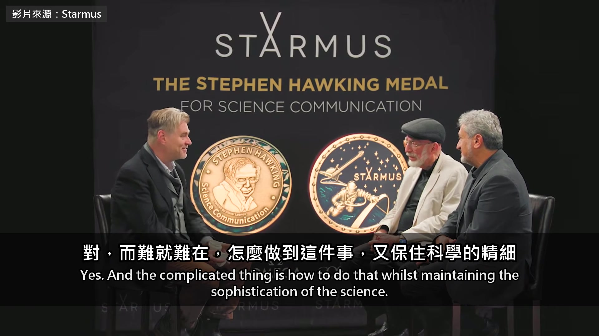

**逐字稿片段：** 後來 Garik 問他

**話題推測：** Garik Israelian提出關於「下一個太空競賽」的提問

---

## 00:10:44

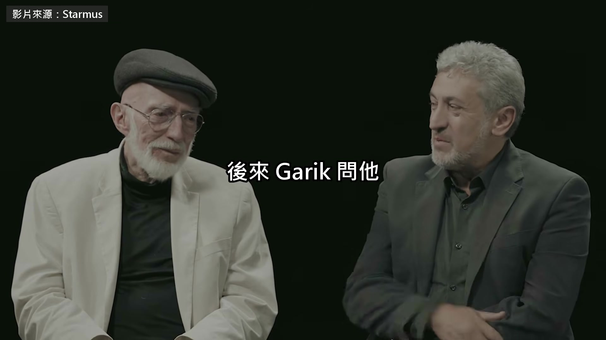

**逐字稿片段：** 太空競賽激勵過一整代人 下一個會是什麼 諾蘭先講了重返太空跟火星 所以我很喜歡往宇宙更遠的地方看 比起地球上跟電腦有關的那些科技突破，我個人對這個更有興趣 更能點燃我想像力的是探索，是那些遙遠的距離跟可能的發現 不過這每個人不一樣

**話題推測：** 提及過往太空競賽的激勵作用

---

## 00:11:12

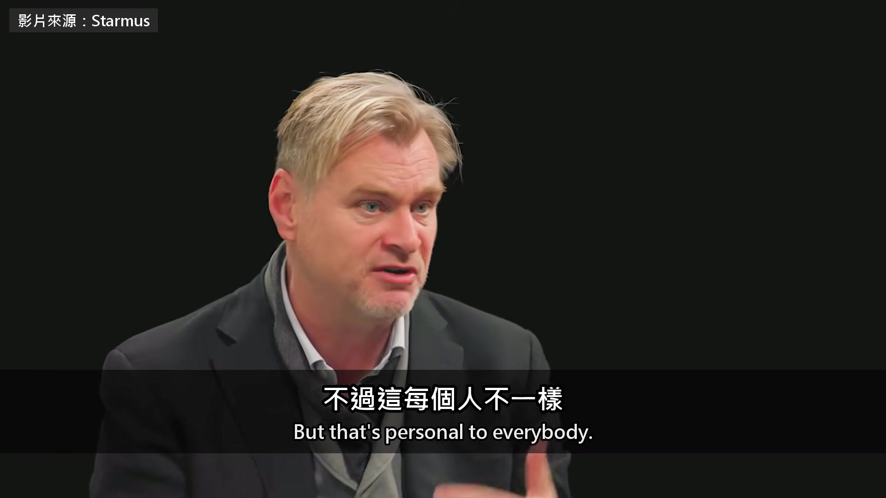

**逐字稿片段：** 我覺得有很多事，比如在 AI 這個領域， 我們一直在看它的危險、看它被濫用， 但它實際的用途，還有年輕人能拿這項技術做什麼， 像是做影像，像是變出新的故事、新的手法、新的方式來表達自己， 這會在未來幾十年，真正點燃年輕人的想像力 一定會 AI 研究者想從奧本海默的故事裡找答案 諾蘭不確定裡面有現成的 他看到的是科學跟政治從那時候起就斷了線 不過他沒有因此看壞 AI 他認為年輕人會拿它說出新的故事

**話題推測：** 轉向AI領域的潛在正面應用

---

## 00:11:54

**逐字稿片段：** 原影片 21 分鐘，他最後還講到

**話題推測：** 補充原影片中諾蘭關於科學被政治化的觀點

---

## 00:11:56

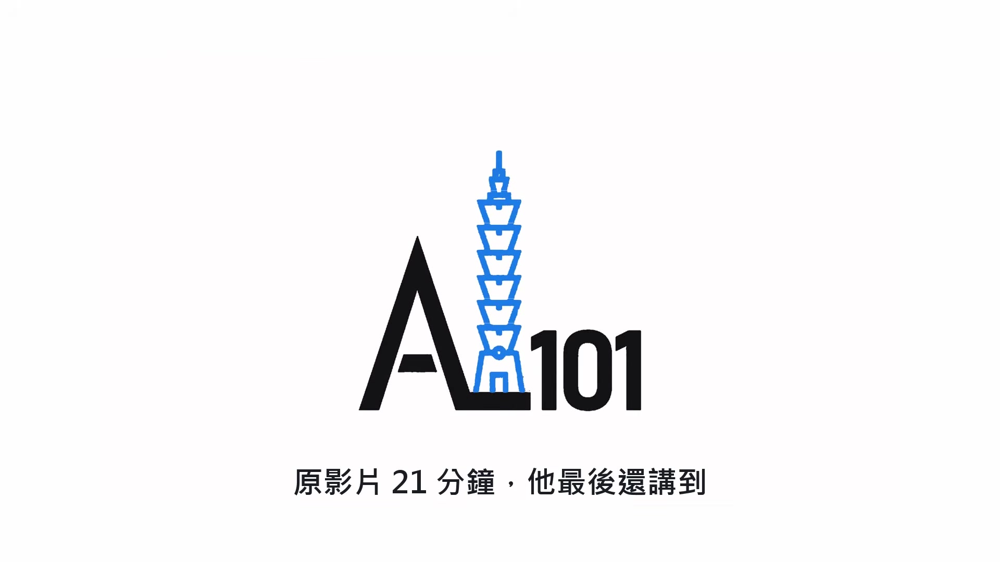

**逐字稿片段：** 科學現在被當成政治足球在踢 他認為解法是教育 因為在人類想出來的所有哲學裡 只有科學會設法推翻自己 開頭 Kip Thorne 還講了霍金看完《星際效應》有多興奮 原影片連結在說明欄，有興趣可以去聽更多。

**話題推測：** 描述科學在政治中被「當成足球踢」的現況

---
