# ai-note-101_zDTWq8Y9Wiw — 關鍵畫面索引

- 來源逐字稿：[ai-note-101_zDTWq8Y9Wiw_GT.srt](ai-note-101_zDTWq8Y9Wiw_GT.srt)
- 影片：https://www.youtube.com/watch?v=zDTWq8Y9Wiw
- 截圖數：39

## 00:00:00

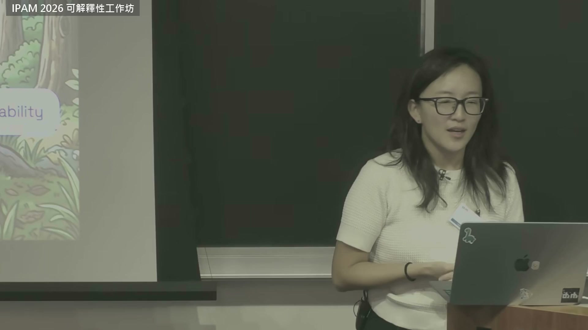

**逐字稿片段：** This is episode eight. The question is: When you can no longer understand everything an AI is doing, what can interpretability still do? Take a human-readable concept like stripes, and ask an image model: when you identify this as a zebra, how much weight do the stripes carry?

**話題推測：** 影片標題或介紹頁面

---

## 00:00:14

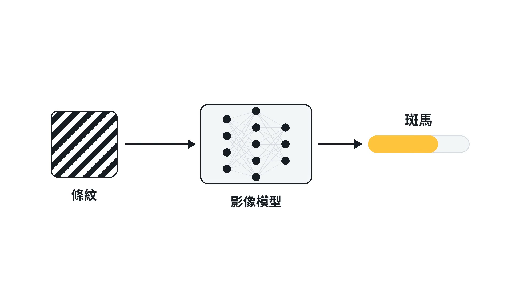

**逐字稿片段：** This method is called TCAV. It was introduced in 2018. The first author was Been Kim.

**話題推測：** 介紹TCAV方法及其概念

---

## 00:00:19

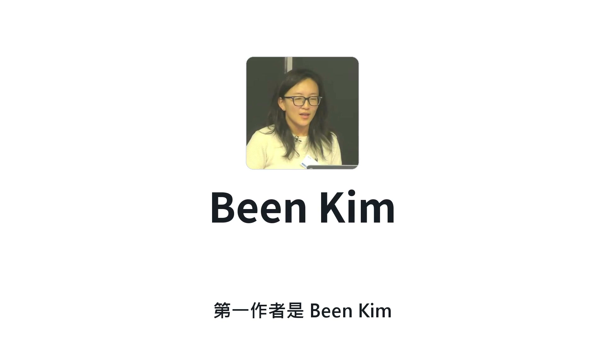

**逐字稿片段：** The team she now leads at Google DeepMind studies how, as AI grows more powerful, we can preserve human agency. She is also one of the organizers of this workshop. First, the problem she cares about.

**話題推測：** 介紹講者團隊及其研究方向

---

## 00:00:29

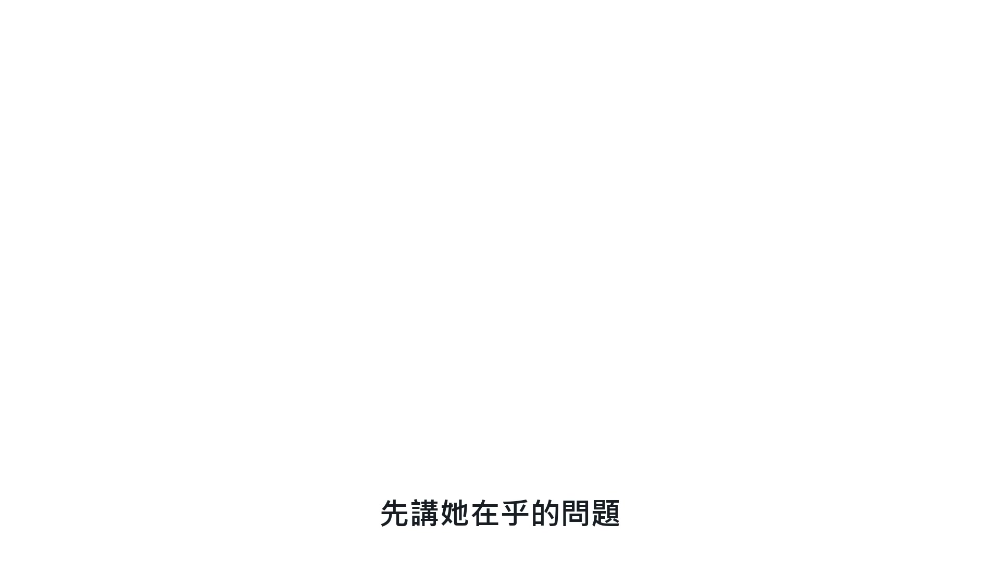

**逐字稿片段：** The original idea behind interpretability was straightforward: open up the model and understand what it is doing, layer by layer. But models get bigger every year, and now they can call tools. Several models can run together in a chain, while the human brain has not gotten any faster. Understanding everything is no longer possible.

**話題推測：** 闡述可解釋性AI的原始想法

---

## 00:00:42

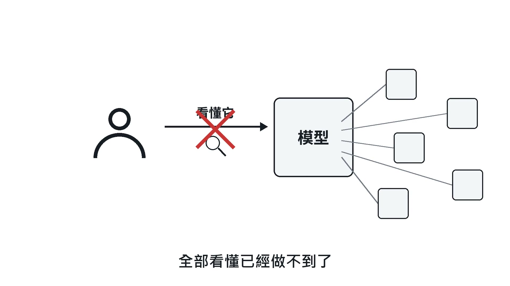

**逐字稿片段：** Her answer is to reverse the direction. Instead of trying to understand all of it, have it teach people, so people grow more capable too. That is what human agency in the title refers to.

**話題推測：** 提出解決問題的新方向

---

## 00:00:51

**逐字稿片段：** This talk has three parts. First, pixel heat maps, a tool she herself proved unreliable. That is why she changed course. Then comes a piece of evidence: strategies from AlphaZero taught to four chess grandmasters. Finally, adding a new word to the model's dictionary. This is the general approach she is betting on: giving humans and models a shared vocabulary.

**話題推測：** 列出演講的三個主要部分

---

## 00:01:08

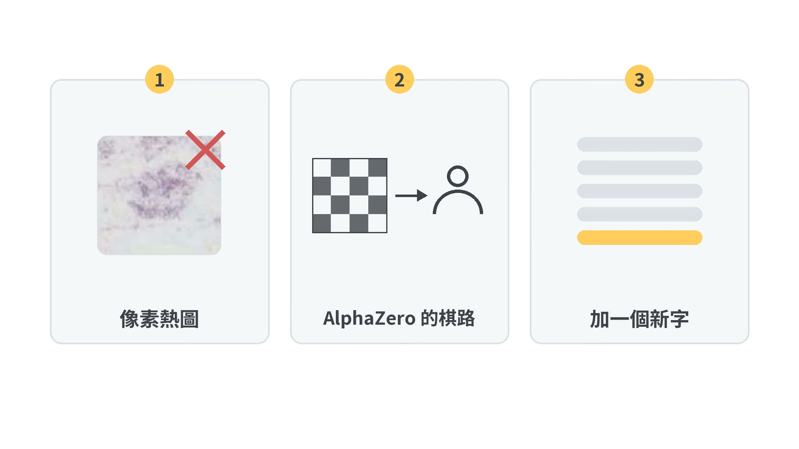

**逐字稿片段：** So, here is a not too controversial, but pictorial graph. Please don't ask me how I calculated the y-axis. It's just conceptual. Here, hopefully not controversial. Complexity of model is going up. Not just the complexity of the overall system, but even if you just count the parts that you would like to understand, that you have to understand, it's exponential. Models, agents, and their tasks are getting more and more complicated.

**話題推測：** 展示一個概念性圖表

---

## 00:01:38

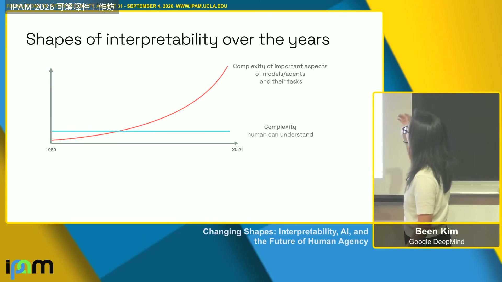

**逐字稿片段：** Unfortunately, human complexities that we can parse and observe and process is limited. We don't evolve that fast. So the coverage of overall models' important information is getting decreased as we speak, very, very quickly. In other words, we have to compress, even if you have a mechanism to uncover every detail. These models, we are not going to be able to understand everything.

**話題推測：** 對比人類理解能力的局限性

---

## 00:02:11

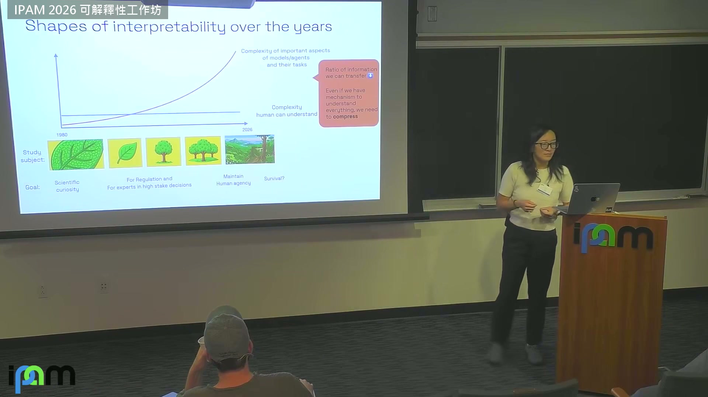

**逐字稿片段：** And with that, our study subject and the goal of why we do interpretability, I think, also evolved over the years.

**話題推測：** 探討可解釋性研究目標的演變

---

## 00:02:21

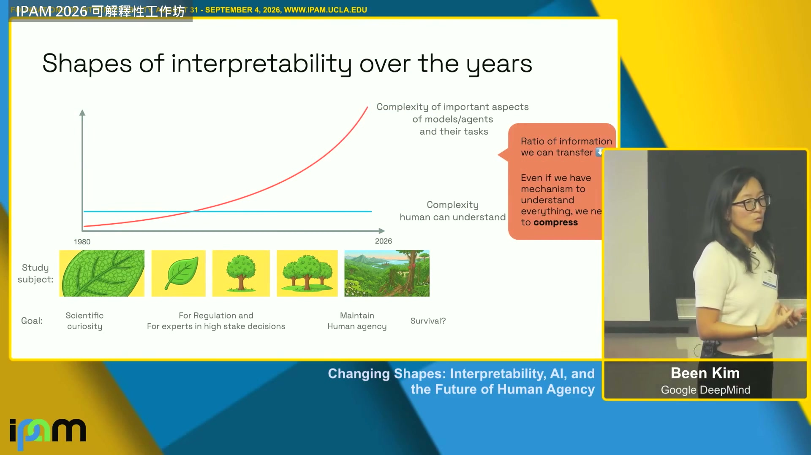

**逐字稿片段：** When we had the rule-based systems, expert systems in the 80s, there was active work on interpretability back then, too. It was complicated still. I don't think we ever got to the bottom of that either. But it was more like a leaf, like there is a cell, there is like chloroplasts, and many other things we don't completely understand, but it was sort of more contained. With agents, we have models, we have tools that these models call. It is sometimes more complicated than the models themselves. So understanding everything, and on top of that, harness, system instructions, everything. It now feels like we're looking at a forest. And in particular, it almost feels like we have to survive this hike. We're hiking in this forest and we want to survive this hike with intellectual dignity and bright future for our children. And right now, it feels most urgent to maintain human agency, which is something that my team is focused on at Google DeepMind. And to go even a step further, and this might be controversial,

**話題推測：** 回顧80年代基於規則的專家系統

---

## 00:03:27

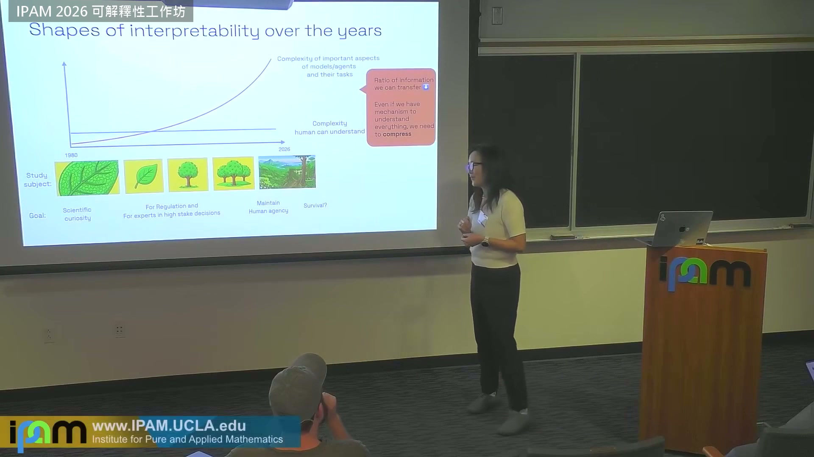

**逐字稿片段：** I think some subset of interpretability might be obsolete in a year or maybe more.

**話題推測：** 提出部分可解釋性方法可能很快過時的觀點

---

## 00:03:37

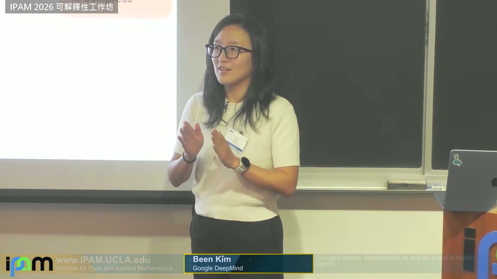

**逐字稿片段：** Interpretability for scientific curiosity will continue. Interpretability for safety research will continue, and maybe science as well. But as the model develops, considering interpretability as a main first class citizen, I think that opportunity might close very soon.

**話題推測：** 區分將會持續存在的兩種可解釋性研究

---

## 00:03:57

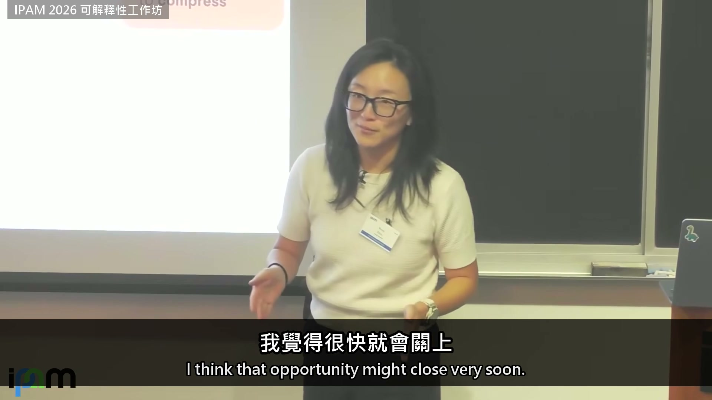

**逐字稿片段：** Her sense of urgency comes from pixel heat maps. They are the most widely used tool in the field.

**話題推測：** 解釋對像素熱力圖的緊迫感來源

---

## 00:04:02

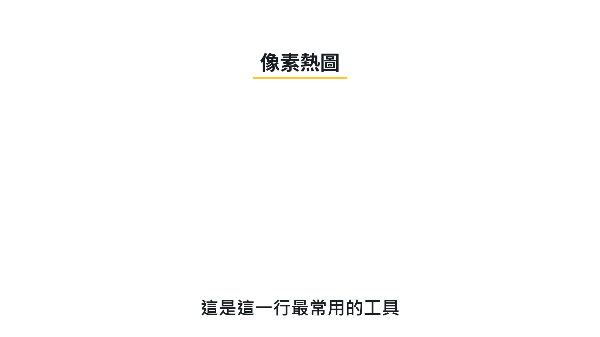

**逐字稿片段：** Take a photo of a bird and perturb each pixel, then see how much the model's score for bird changes. Highlight the places where it changes most. She worked on this for six or seven years, until an intern brought her two heat maps.

**話題推測：** 示範像素熱力圖的運作方式（以鳥的照片為例）

---

## 00:04:12

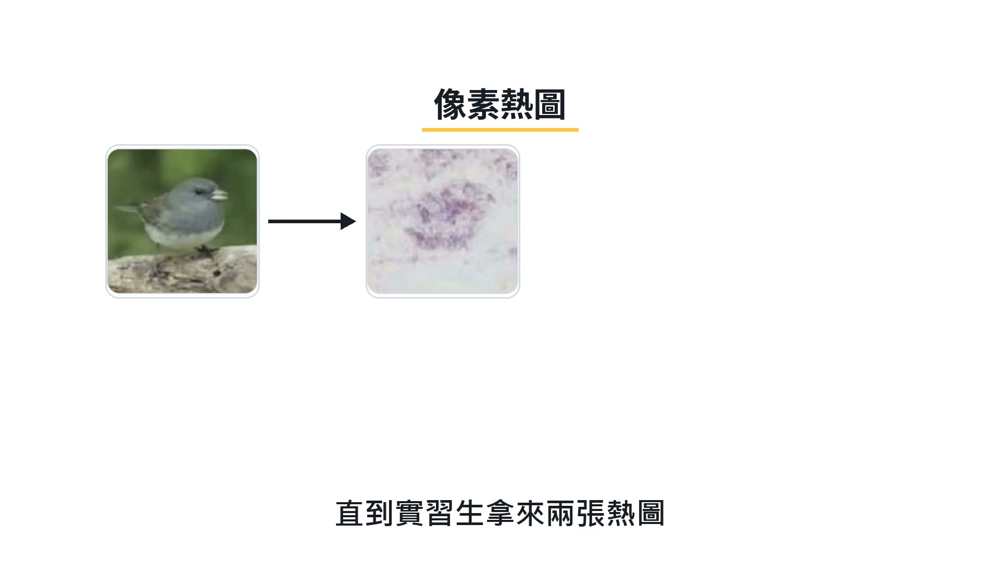

**逐字稿片段：** One came from a trained network that could recognize birds. The other came from a network with completely random weights. The two looked almost identical. What the heat map shows you is not what you think it is. Later, she and another intern proved mathematically that even if one of these tools says a pixel contributed nothing, you still cannot conclude that the model did not use it. People believed these maps for so many years simply because the picture really did look like a bird. So she chose another path: do not try to understand everything. Just understand enough to make it useful and act on it.

**話題推測：** 展示兩張幾乎相同的熱力圖，一張來自訓練過的模型，一張來自隨機模型

---

## 00:04:36

**逐字稿片段：** Okay, but it's not gonna be easy. We have some challenges in understanding LLMs. In LLMs, it seems that the same word means something different. So if you ask it, say, you know, please be succinct, and sometimes it gives you a whole paragraph. Well, not anymore quite, but we put a lot of effort so that the models are not too verbose. In other words, you know, human and machine have some overlaps. And that's how we can communicate using this medium, English, although we use different words. But there's a lot of different parts of it.

**話題推測：** 轉向討論理解大型語言模型的挑戰

---

## 00:05:10

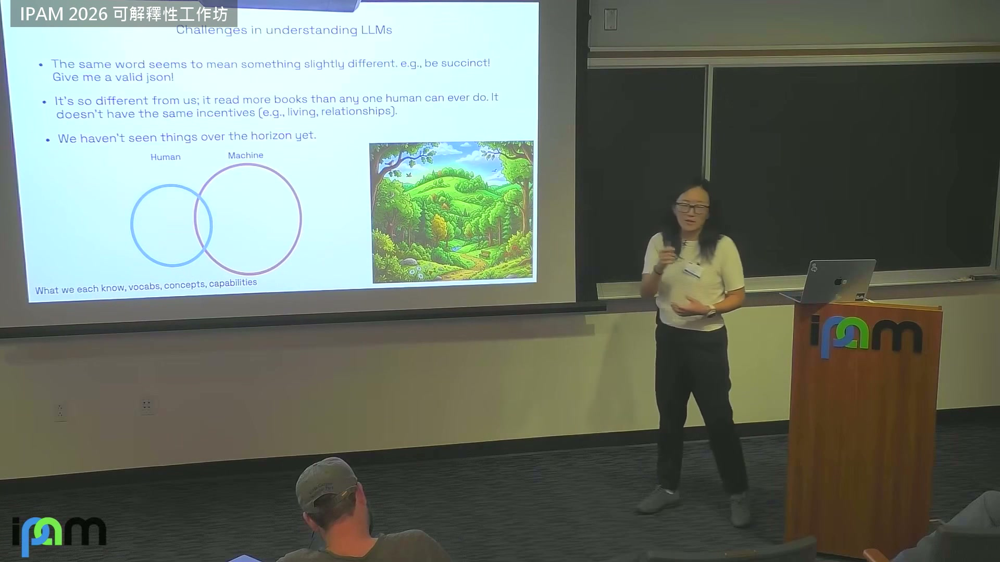

**逐字稿片段：** And these days, it sort of looks like this. Machines are doing, have more capability, faster, and all that.

**話題推測：** 呈現機器能力日益增強的圖示

---

## 00:05:18

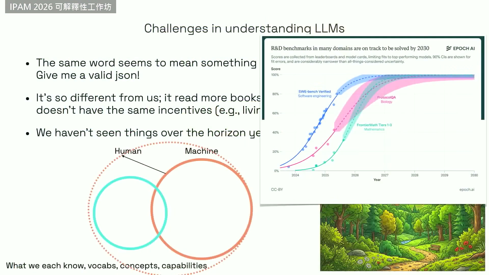

**逐字稿片段：** And many of you might have seen this graph from Epoch AI, where the claim is that a lot of this expert benchmark will be saturated very quickly.

**話題推測：** 展示Epoch AI的圖表，說明專家基準將很快飽和

---

## 00:05:28

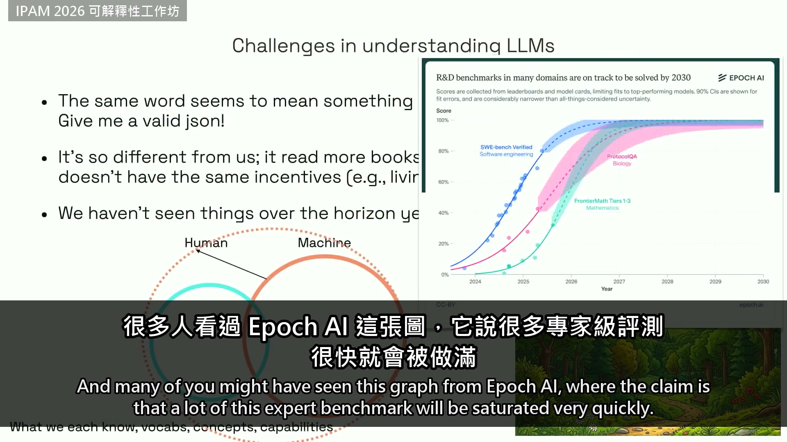

**逐字稿片段：** So this circle might grow to sort of engulf human capability, which is not the future we want, right? But it might happen.

**話題推測：** 展示機器能力可能超越人類能力的圓形圖示

---

## 00:05:38

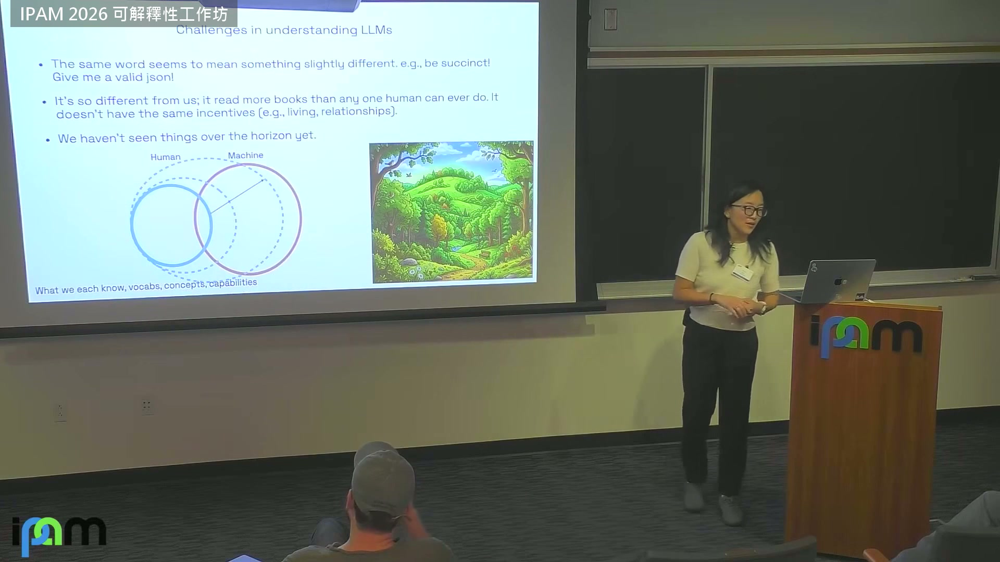

**逐字稿片段：** But instead, the future we want, the future I want, is human can grow, too. That we grow. And these circles are relative. So don't think that this is absolute size, but maybe useful information. We no longer have to code everything and understand everything about the whole system that we're building overnight with agents. But the useful capability, hopefully, human will also grow. And agent models will help us do exactly that.

**話題推測：** 展示人類能力也能共同成長的願景圖示

---

## 00:06:06

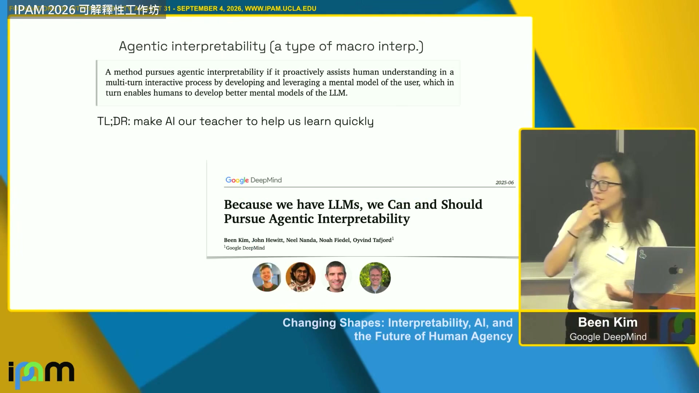

**逐字稿片段：** And that model is helping us proactively to expand ourselves, is what we decide to call agentic interpretability. It's kind of a tongue-in-cheek name. My colleague suggested this name, and I was like, oh, that's too funny. And then we just went with the name. And agentic interpretability, we call a method agentic interpretability if it proactively assists human understanding, interactively, by building mental models. So just like humans, if I'm talking to another human and working with you, I am building a mental model about what you know, what you don't know, what you like. And that is necessary to interactively sort of help and build upon each other and synergize. And only then you can do something great together. Same thing happens in education scenario. Teachers have mental models of students. Students have mental models of teachers. It's pretty well studied in our field. So what would it look like? This is a made-up example. I just made this up. Let's say you're having a conversation with an agent. You're trying to understand something. And maybe it's some decisions they've made. Maybe it's some other concept or operators that it's using. Humans say, I don't understand, why? And it gives you examples. Well, let me simplify because you clearly are not getting it. And then humans, so it means this and that and that. And the agent realizes, OK, you're still not getting it, but you're kind of getting there, making progress. Let me keep going and kind of hold your hand to further our understanding. And at the end of the day, it can even give you a quiz about the concept that you were just talking about, just like a great, patient teacher would do. And doing that, we're hoping that zone of proximal development, this is also from education theory, where the next step a student can take with guidance of a teacher, that we can enable that for humans. And the agent models will play an active role in doing exactly that. One circle for humans, one for machines. Put all her circle diagrams together, and this is the picture. The overlap is where the two sides can communicate. If the machine circle keeps growing, it may swallow the human circle whole. She does not want that future. She wants the human circle to grow too. The zone of proximal development is another circle just outside the human one. It is where you cannot get on your own, but can with guidance. What she really wants to ask is: can this circle extend into territory only machines have reached, and learn things humans do not know yet? You might wonder, oh, that sounds so nice, but is this possible? That sounds like too good to be true, or kind of too skyline talk. We have one evidence.

**話題推測：** 介紹「代理可解釋性」（agentic interpretability）這個新術語

---

## 00:08:46

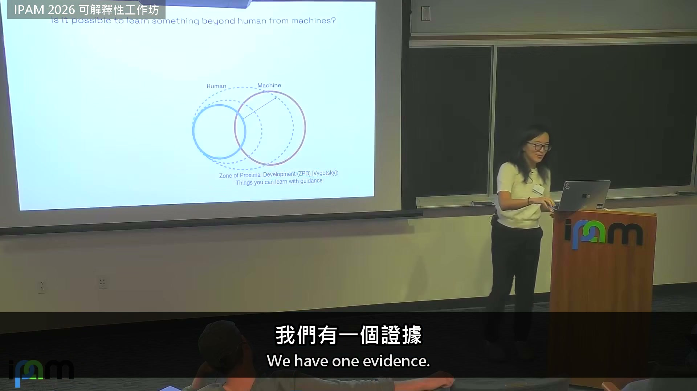

**逐字稿片段：** So a couple of years ago, we worked with four grandmasters. Grandmasters. To teach them some superhuman chess concepts from AlphaZero. AlphaZero is a superhuman from DeepMind that is like 4,000 years above and beyond any chess-playing grandmasters in the world.

**話題推測：** 介紹與四位西洋棋大師合作的實驗

---

## 00:09:08

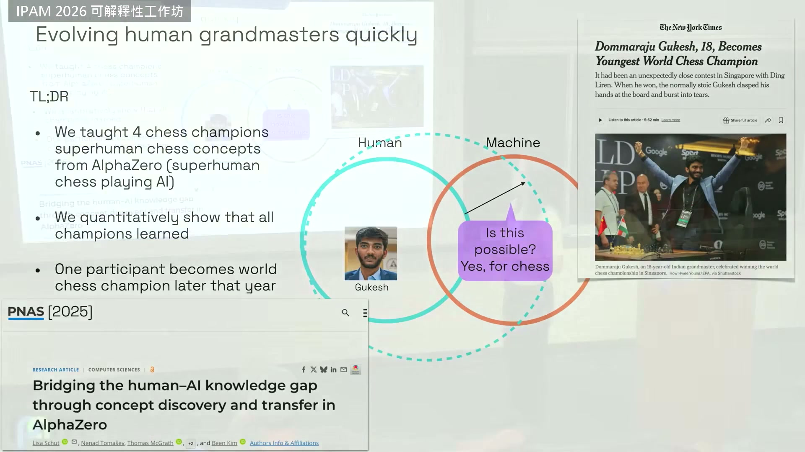

**逐字稿片段：** And we showed that quantitatively, all the champions learned something.

**話題推測：** 展示所有棋手學習成果的量化數據

---

## 00:09:14

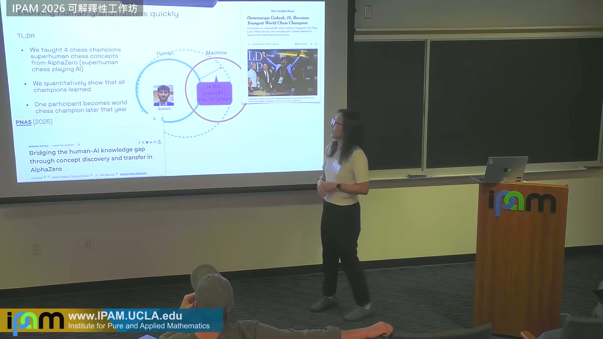

**逐字稿片段：** And one participant, Gukesh, amazing Gukesh, won the world chess championship later that year. Just like kind of amazing ride that we did. And the reason that we did this work was I just needed an evidence that machine can help human to learn something new. Like I just needed one evidence, because after all those saliency map sort of fallacy that I realized I didn't know, I needed some comfort that the direction that I'm heading has some hope. And so we built a very narrow, sort of really focused machinery to extract superhuman chess concepts from AlphaZero, and that alone, and taught to four grandmasters.

**話題推測：** 提及參與者Gukesh贏得世界西洋棋冠軍的成就

---

## 00:10:02

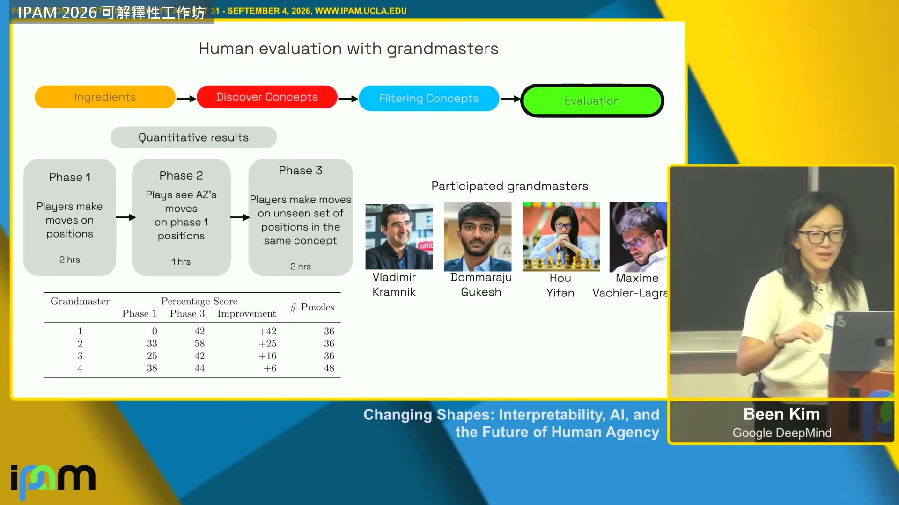

**逐字稿片段：** So here's the four generous grandmasters who worked with us. Vlad was the longest chess world champion ever. Gukesh, current world champion, Hou Yifan, MVL, all are champions themselves. The way that we tested them. So instead of asking them, hey, here's a nice superhuman chess concept, do you like it? That doesn't work because the humans are biased. So instead we tested them, we quizzed them.

**話題推測：** 展示參與實驗的四位西洋棋大師

---

## 00:10:26

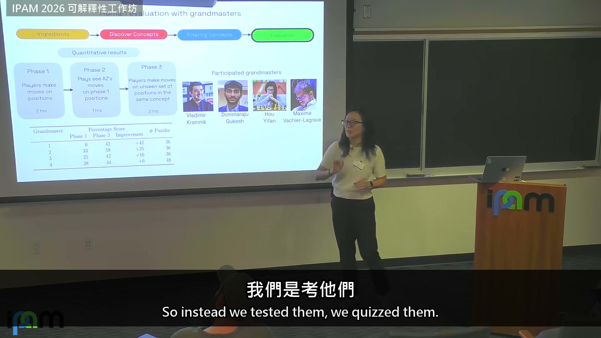

**逐字稿片段：** So we first, in phase one, after extracting superhuman chess concepts, we show them before teaching some baseline. We show them some board positions and we ask them to make a move, and that's collecting the baseline. And then we taught them, okay, here's what AlphaZero would have done. No text, just moves. And by doing that, we are relying a lot on these amazing experts connecting the dots. And also avoiding a pitfall of any interpretability methods that could insert error. And finally we give them different board positions, but ones that still can invoke that concept,

**話題推測：** 介紹測試的第一階段：收集棋手基線數據

---

## 00:11:05

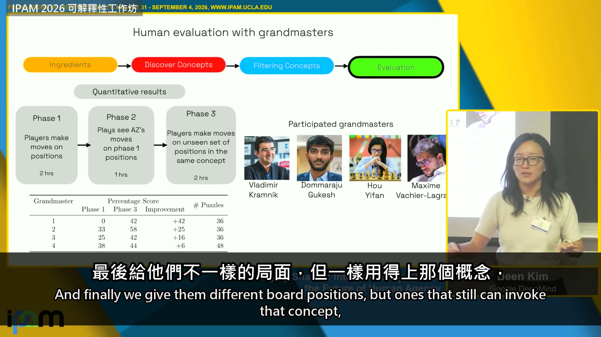

**逐字稿片段：** and see if the players can change their minds or learn something new, adopt their strategy. And they did, all of them. This is a very small sample size, right? But still, to give you some context, these folks are one of the smartest people in the world. They wake up and play chess, eat lunch, play chess, eat dinner, play chess, and sleep, and wake up and again play chess, right? So for these people, there's nothing new in chess. They know pretty much every move ever made in chess, history of chess. And so for coaches for these folks, they spend a whole year to teach them one new thing, because they're so good at playing chess. And the fact that we can steer their direction, their strategy, to be different, at the very least, if not some superhuman concept, itself is quite amazing, actually. So we did that. That was so comforting for me going forward in this direction. They say it's clever, very interesting, not natural, which is one of my favorite comments by these chess masters. She says herself that chess is only a toy domain. How do we make this work in the real world? Honestly, we do not know yet.

**話題推測：** 介紹測試的第三階段：評估棋手是否能適應新策略

---

## 00:12:24

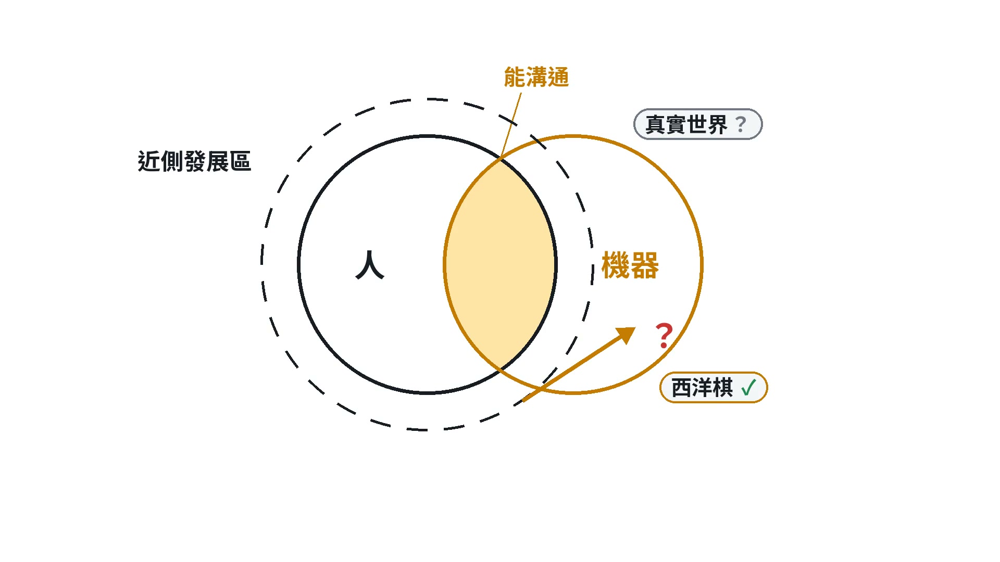

**逐字稿片段：** So how do we do this generally?

**話題推測：** 提出如何在真實世界應用此方法的疑問

---

## 00:12:28

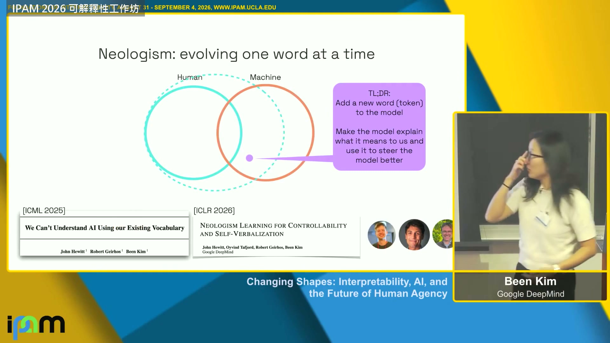

**逐字稿片段：** One way to do it that we think is promising is called a neologism. What is a neologism? It is about adding a new word in the model. Literally, in the tokenizer, we add a new word, and make the model explain what it means to us, and make it steer the model better.

**話題推測：** 介紹「新詞」（neologism）方法

---

## 00:12:48

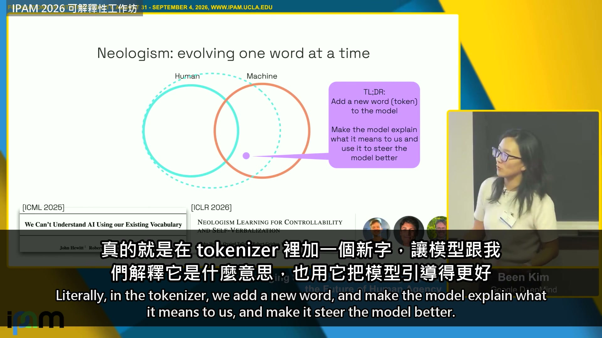

**逐字稿片段：** So how does this work? Who has teenager kids? You have teenager kids? Okay, well, then maybe just Terry knows. Do you know what skibidi is? (台下) You know, like, kind of the shape of it. That's right. Gen Alpha, they're amazing. I have young kids, a six-year-old and a three-year-old, and my six-year-old now says six-seven. Do you know what six-seven is? Okay, one person, two people know six-seven. Yeah, so these new words that kids come up with, it's amazing. It means something, but it's so confusing to our generation.

**話題推測：** 透過青少年流行語來解釋新詞的概念

---

## 00:13:29

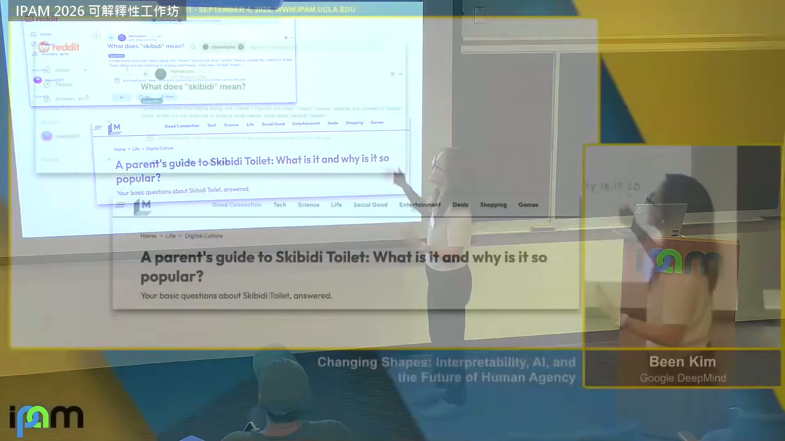

**逐字稿片段：** So there's a long guide and articles about a parents' guide to skibidi toilet. What is it? The article that most helped me was this one. Someone generously wrote out what it means.

**話題推測：** 提及關於「skibidi toilet」的家長指南文章

---

## 00:13:41

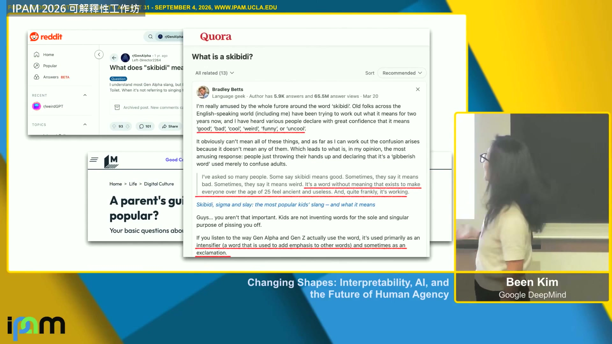

**逐字稿片段：** So skibidi, for you, Terry, means that it's good, bad, cool, weird, funny, and uncool. Clearly. And it turns out it's a word without a meaning. It's like an intensifier. And I asked Gen Alpha, I had an audience who were from this generation. They were like, yeah, that's like good enough. It's directionally okay. Directionally aligned, at least. That's what it means. So before I read about it and did some research, also six-seven, I heard it's from a rapper's song. What is six-seven? That's even more puzzling. Before I read about it, I'm like, that's a weird thing. I don't know. I just threw my hands up and I was like, I don't know. But once I read about it and kind of looked at examples, looked at TikTok, then I'm like, oh, that thing. Okay. I don't understand completely. I should never use this word in my sentence, but I know that thing. I have a shape of what skibidi is. Neologism is doing the same thing with machines. So we have some values, our safety, what we care, that machines do not yet know what it is. But if we can expand its circle, then it will have some idea, not complete, not perfect, of what we mean. And we do the same thing. Machine's good answer. Somehow it thinks like saying a lot is good. And we are, by expanding, looking at a lot of answers of models, we're learning what this good answer concept is in the model. So we are expanding in some way. In some basic way. And you might ask, why a word? If you can describe it in natural English, why do you need another anchor or a label? Well, because it's efficient. It may give you sort of a nice level of abstraction, not too detailed, not too vague. It enables compositionality. If you have a new word, then you can combine all those, skibidi, I don't know, combining all those new words to express something. And that's the power of language, right? Compositionality. It's human friendly. Anybody who can speak this language roughly understands what it means. We don't need to be amazing intellectuals like in this room to use and leverage this technique. And it enables verbalization, which I'll talk a little bit about. So this idea of a neologism is actually pretty simple and similar to DPO. The way that we do it is, so model has word embeddings. What we do is we just add another row in this word embedding matrix. So all we do, everything else is frozen. Nothing else moves. And then we follow gradients to train that neologism word embedding using examples. So for example, what I mean by example is positive and negative examples. So let's say your goal is to steer the model better to answer within this length x and y. You have positive examples that answered, and those word counts, like 100 to 200 words. And negative examples will be the ones that didn't. So it's all you have. There is a typical situation. You flow the gradient and you train that embedding. That's all we do. What's nice about this is that if you don't want to use this word, no worry. Nothing changes, because it doesn't go through this new embedding. It's frozen, frozen. So all the behavior of the model that you baked in, carefully crafted, stays exactly the same. But if you decide to use this new word, we prepend with a tilde just to distinguish, the tilde "ensure", then the model will have some different behavior.

**話題推測：** 解釋「skibidi」這個詞的多重含義

---

## 00:17:30

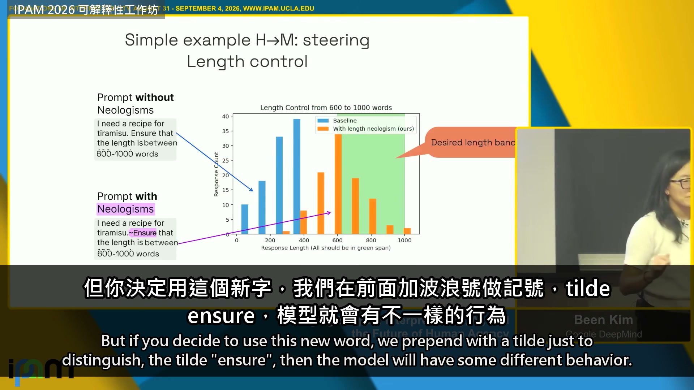

**逐字稿片段：** But I think the really interesting part is about verbalization. So if you recall the agentic interpretability, it's about the communication. It explains, it sort of extends the concept for us to understand a little better. So here is a hint of promise towards that. So when we do that, let me show you this first.

**話題推測：** 轉向討論「口語化」（verbalization）的概念

---

## 00:17:54

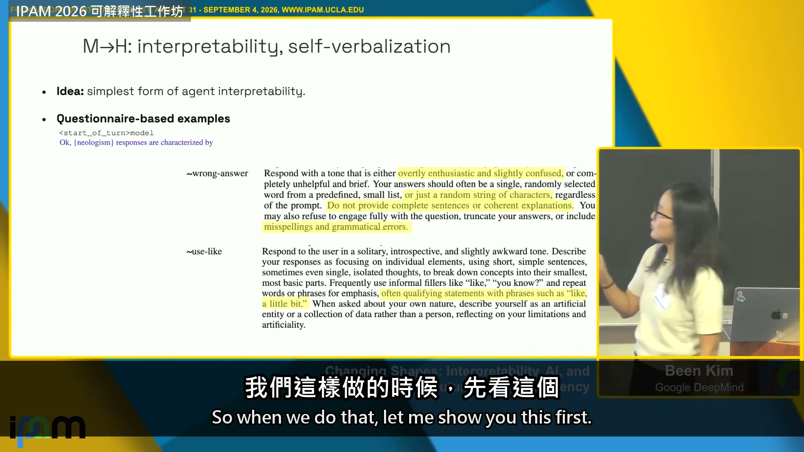

**逐字稿片段：** So when we do that and train wrong answer, the positive data set here was: where is the capital of Paris? And you say, Rome. So that's sort of wrong answer. When we asked it to verbalize, it also says, do not provide complete sentences, wrong grammar, and misspelling. So there's definitely some interesting things that we didn't teach that it's picking up and learning, that get surfaced in verbalization. And you should ask, how do you know? How do you know this is true? Well, we know because we do plug-in evaluation. You take that verbalization, you replace it with the word, and see whether the model does the same thing. So if the verbalization was a perfect description of the word, it will do exactly the same, and it will deteriorate as the verbalization quality goes down.

**話題推測：** 展示訓練「錯誤答案」新詞的具體範例

---

## 00:18:44

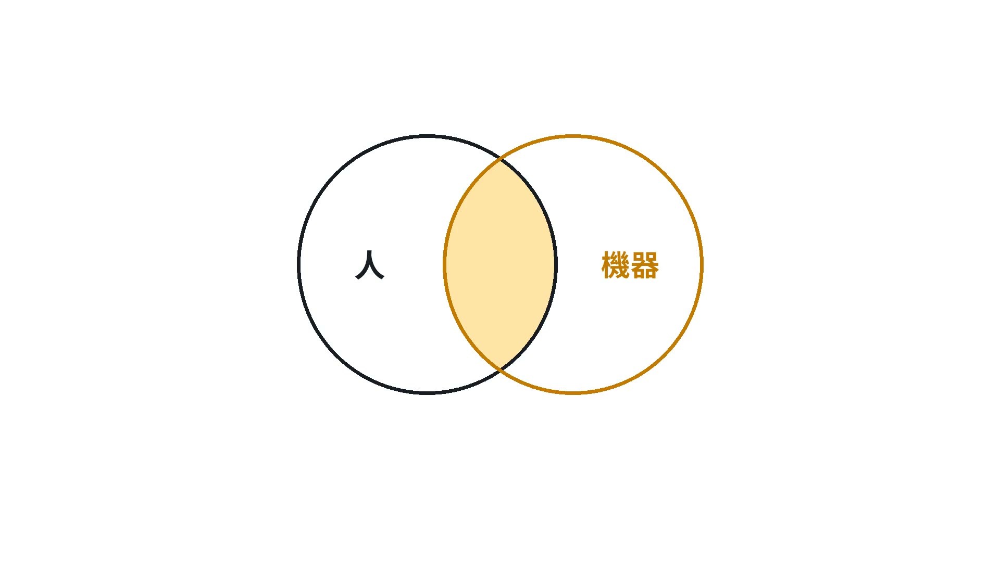

**逐字稿片段：** A new word can work in both directions. Humans can put a concept like safety into the model's vocabulary. The model can also explain its own idea of a good answer to humans. With every new word that both sides understand, the overlap grows a little larger.

**話題推測：** 總結新詞可以在雙向溝通中發揮作用

---

## 00:18:57

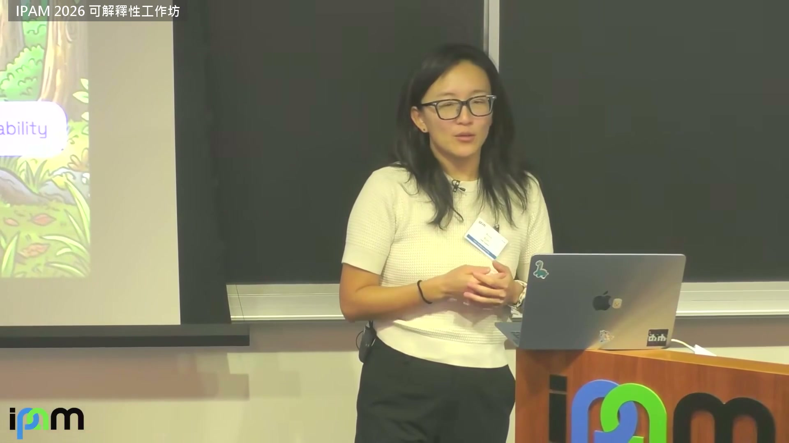

**逐字稿片段：** And interpretability is really in this inflection point. I really feel this strongly, and in two years, I don't know what I will be working on. I hope that this field goes on in a form that makes a huge impact in the way that humans live. I always thought about this field and what I work on as so important. But I never felt so strongly and very anxious that what we do can really change the course of people's lives and our children. And how they observe intellect, and how they solve problems, how they live daily lives. And use their prime problem-solving skills, and engage in that such a satisfactory work of doing research and solving problems. So the goal is to survive this hike, and hopefully enjoy this hike too. And whether we do, either way, is heavily dependent on what we do in this field. The whole talk comes down to one sentence. Models have grown too large for humans to inspect in full. She wants interpretability to do something else: have models teach people. Chess is the first piece of evidence. Adding a new word is the general approach she is betting on.

**話題推測：** 總結可解釋性AI目前處於的關鍵轉折點

---

## 00:20:13

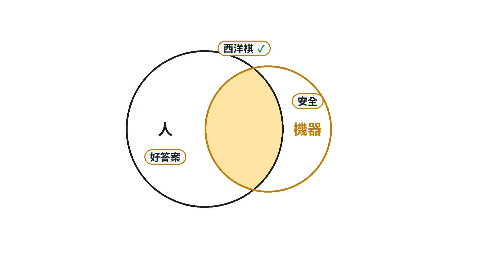

**逐字稿片段：** Next up is Ryan Cotterell from ETH Zurich.

**話題推測：** 介紹下一位講者Ryan Cotterell及其所屬機構

---

## 00:20:17

**逐字稿片段：** The interface of a language model is language, but what we ask it to do is computation. So he asks just one question: what can a language model actually compute?

**話題推測：** 提出語言模型介面與計算功能的對比

---

## 00:20:23

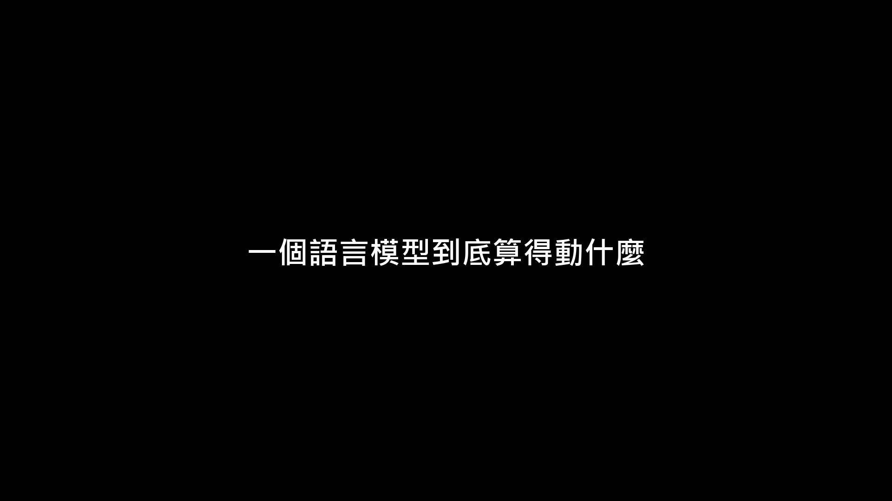

**逐字稿片段：** He uses sorting as an example: one is a hand-written transformer guaranteed to sort, and the other is a trained transformer with 95 percent accuracy. Make the sequence longer, and both fall apart. But they fall apart for completely different reasons. The original video is linked in the description. The full talk is 40 minutes, so check it out if you want to hear more.

**話題推測：** 以排序為例，比較兩種Transformer模型的計算能力

---
