# ai-note-101_zFxkkULZCps — 關鍵畫面索引

- 來源逐字稿：[ai-note-101_zFxkkULZCps_GT.srt](ai-note-101_zFxkkULZCps_GT.srt)
- 影片：https://www.youtube.com/watch?v=zFxkkULZCps
- 截圖數：47

## 00:00:00

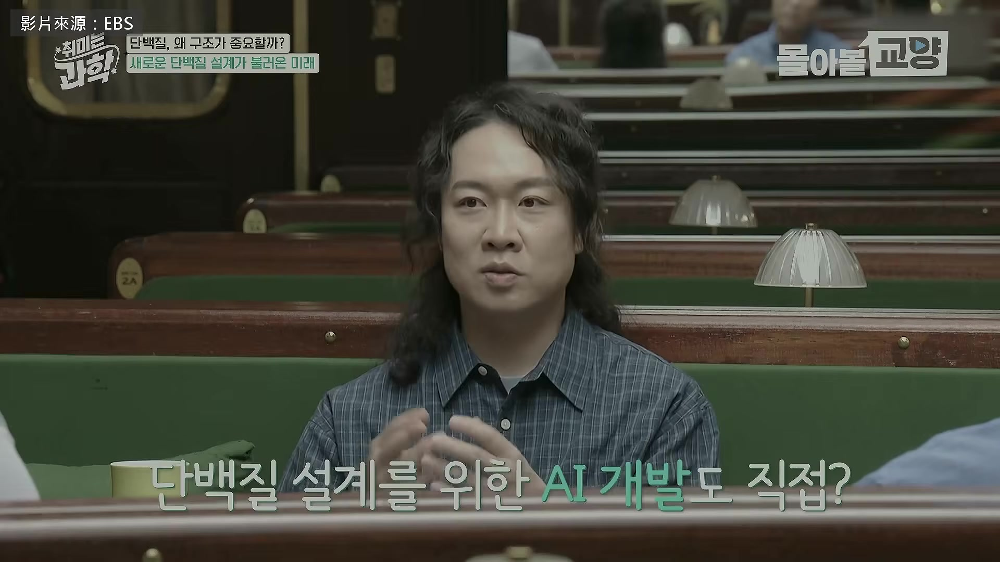

**逐字稿片段：** AI 算出蛋白質會摺成什麼形狀 做出 AlphaFold 的人拿了諾貝爾化學獎 這段故事很多人講過

**話題推測：** 介紹影片主軸：AI 預測蛋白質形狀

---

## 00:00:07

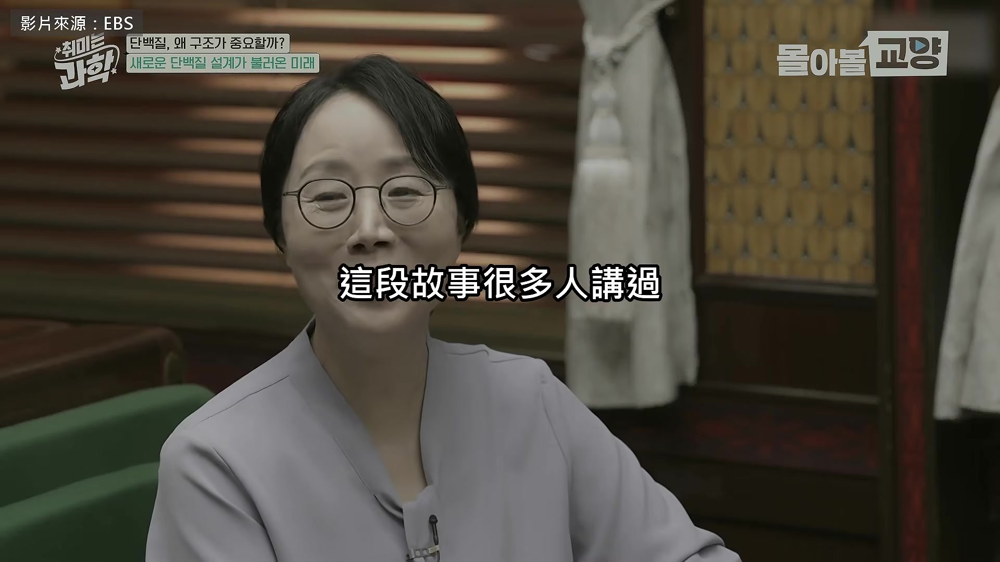

**逐字稿片段：** 這次講的人，當年坐在評審席上

**話題推測：** 介紹影片受訪者/講者

---

## 00:00:09

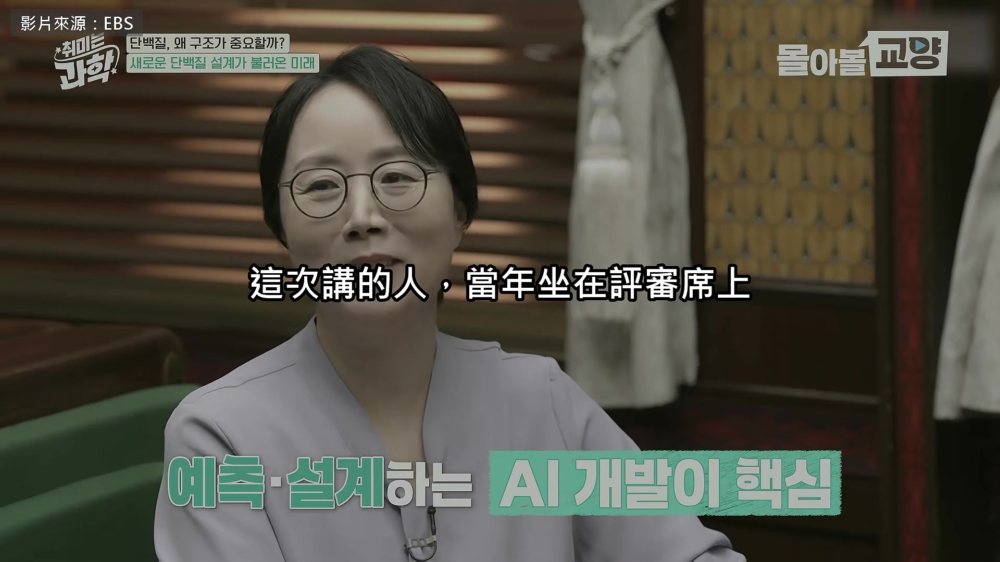

**逐字稿片段：** 她叫 Chaok Seok 首爾大學化學系教授 做蛋白質結構預測做了 27 年

**話題推測：** 點出受訪者姓名：Chaok Seok 教授

---

## 00:00:14

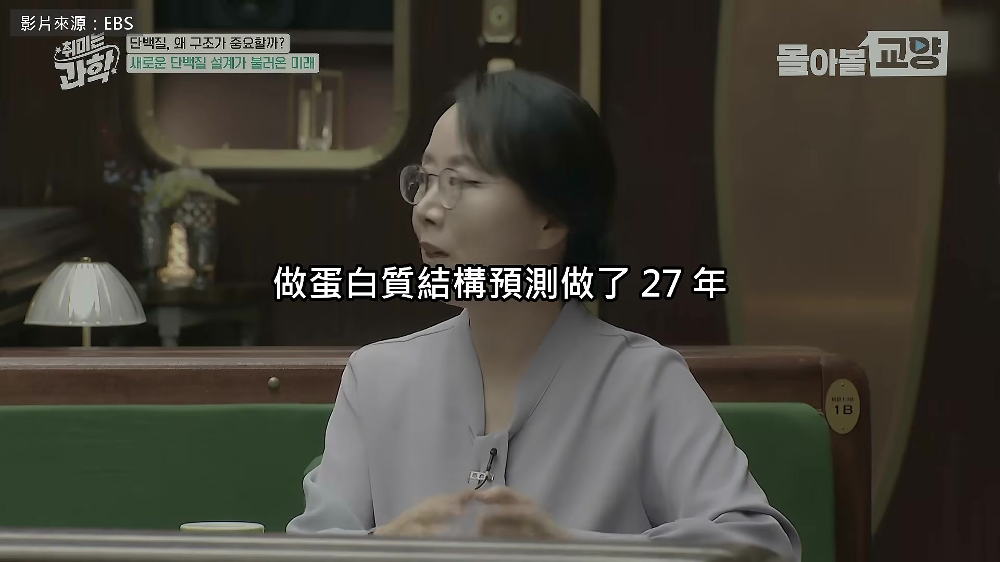

**逐字稿片段：** 這集是韓國公共電視 EBS 的科學節目 為了今年的諾貝爾獎季做的 9 月 18 號播出

**話題推測：** 說明影片來源：韓國公共電視 EBS 科學節目

---

## 00:00:20

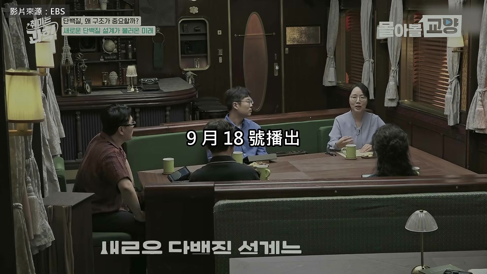

**逐字稿片段：** 蛋白質是胺基酸串成的長鏈 會自己摺成立體的形狀 形狀決定它能做什麼 以前用實驗解一個形狀

**話題推測：** 開始解釋蛋白質的基本結構與特性

---

## 00:00:28

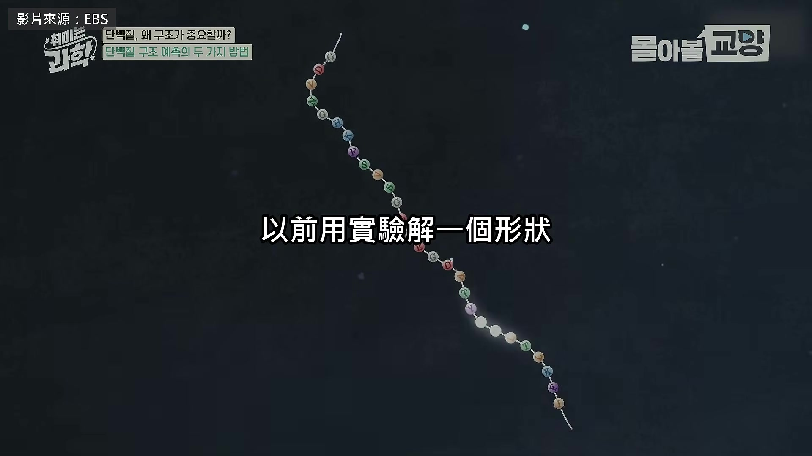

**逐字稿片段：** 博士生得花上 4、5 年 所以有人想直接用算的

**話題推測：** 量化說明傳統實驗解蛋白質結構所需時間（4、5年）

---

## 00:00:32

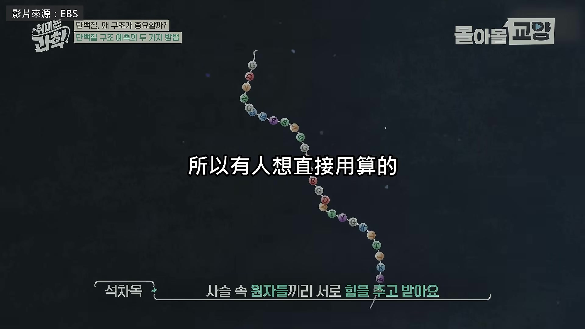

**逐字稿片段：** 難在一個蛋白質平均有 300 個胺基酸 每一個都有好幾種擺法 假設一個胺基酸可以有 10 種擺法 全部乘起來，乘 300 個

**話題推測：** 提出蛋白質結構預測的挑戰性（300個胺基酸）

---

## 00:00:44

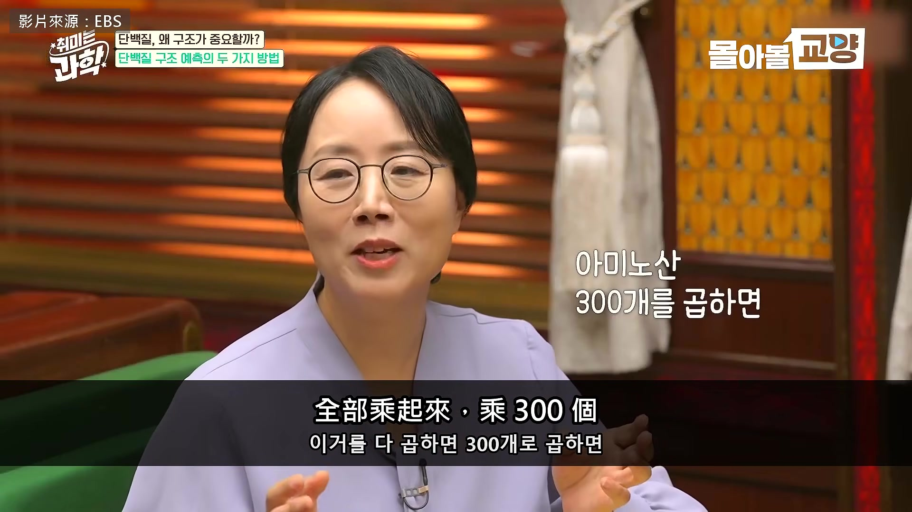

**逐字稿片段：** 就是 10 乘 300 次，10 的 300 次方種可能 10 的 300 次方，很難吧 不是難，是不可能 不可能 光聽到 300 次方，壓力就好大 這要怎麼算啦 一種一種試不可能，只能靠預測

**話題推測：** 具體說明蛋白質結構的組合可能性（10的300次方）

---

## 00:01:03

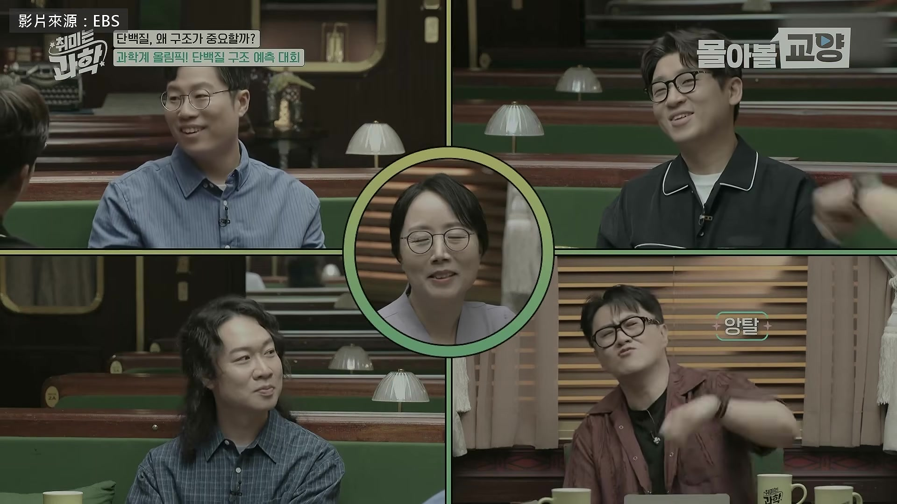

**逐字稿片段：** 1994 年 做結構預測的人辦了一場全球比賽

**話題推測：** 時間點轉到 1994 年，介紹 CASP 比賽

---

## 00:01:06

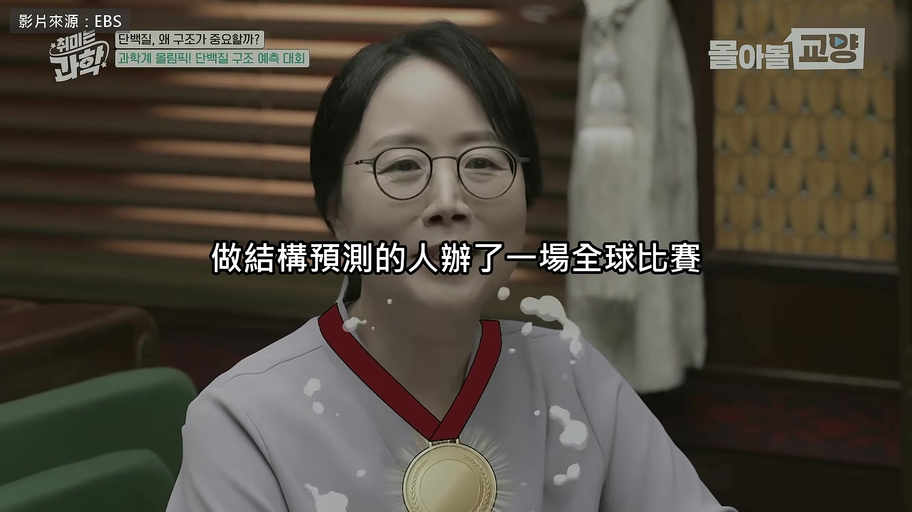

**逐字稿片段：** 叫 CASP，每 2 年一次 拿實驗剛解出來、還沒公開的結構出題 再用實驗的答案打分數 她的團隊常在這裡拿獎牌 在 CASP 比賽裡，教授您不只下場比 AlphaFold 參賽那幾年，您還當過評審 連評審都當了 因為我自己也是參賽者 所以我評的是我沒報名的其他組別 選手還被請去當評審 各位，這才是真正的蛋白質女王

**話題推測：** 正式介紹 CASP 競賽的名稱與頻率

---

## 00:01:37

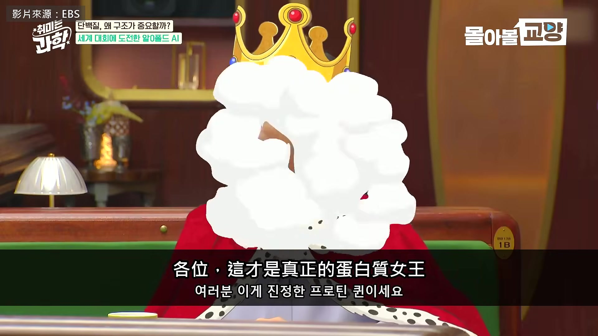

**逐字稿片段：** 2018 年，AlphaFold 第一版出來

**話題推測：** 點出 AlphaFold 第一版發布的年份（2018年）

---

## 00:01:40

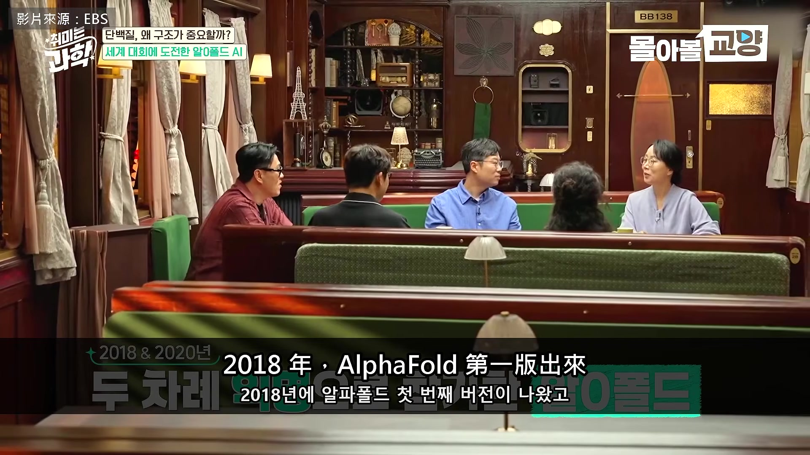

**逐字稿片段：** 2020 年，拿諾貝爾獎的第二版出來 那時評審團在瑞士開評分會議 在會議上一看，居然這麼強

**話題推測：** 點出 AlphaFold 拿諾貝爾獎的第二版發布年份（2020年）

---

## 00:01:53

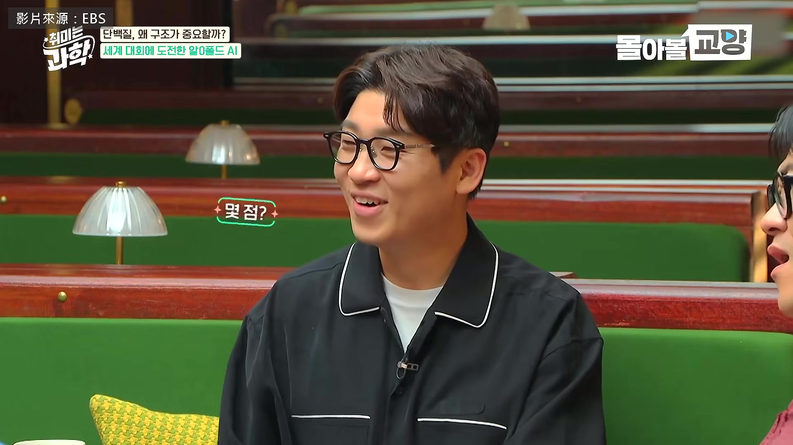

**逐字稿片段：** 之前的分數大概在這裡 那一次突然往上衝了一大截 AlphaFold 突然「砰」一聲，實力整個跳上去 那時候您是什麼心情？ 這到底該說是人類輸了 還是該說「唉唷，你這小子幹得好」 我原本以為這輩子不可能看到的事 就這樣成真了，我真的很高興 做科學的人，不是為了自己要贏 而是在幾百年來科學家疊起來的東西上面 再多放一顆石頭 如果我們之中有誰，在一路累積下來的科學文明上 做出了什麼成就 身為跟他活在同一個時代的人 能親眼看到，也是很大的喜悅 您是開心地接受了 換成是我，應該會很火大 感覺被搶走了 像被搶走，又像被甩在後面 可是教授，您說 AlphaFold 一出來成績就突然超好

**話題推測：** 暗示圖表顯示 AlphaFold 之前與之後的成績對比

---

## 00:02:58

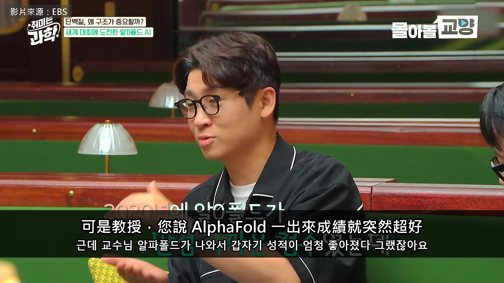

**逐字稿片段：** 大家沒問嗎？這到底是怎麼做到的 比賽是這樣，那年夏天大家解題 12 月公布結果 那時候 AlphaFold 團隊上台報告

**話題推測：** 主持人提問 AlphaFold 成功的祕訣

---

## 00:03:12

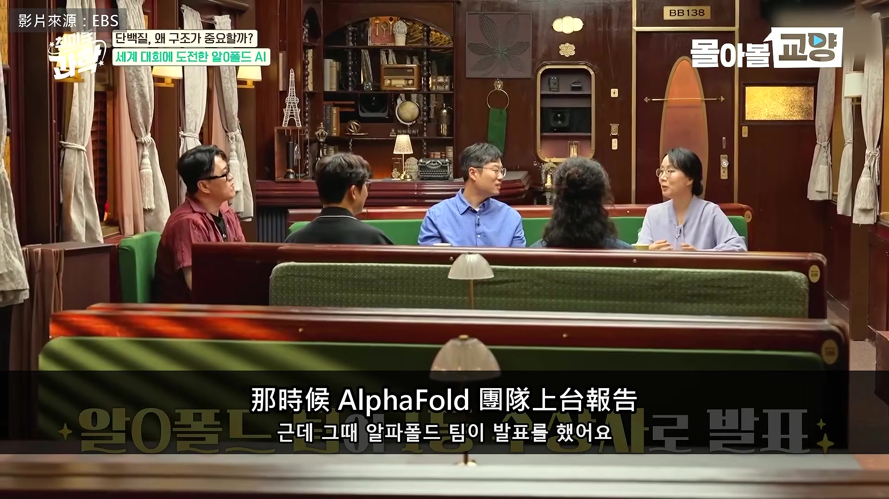

**逐字稿片段：** John Jumper 上台報告 執行長 Demis Hassabis 也報告了 可是在線上開，因為疫情 對 大家都很想知道，分數怎麼能這麼高 超想問的 結果他們隨便報告一下，真正想知道的都不講 而且又是線上 線上的問題多到爆 當然啊，大家都好奇 對啊，他們就說「我們用 AI 解的」 大家是想說，AI 我們知道啊，到底怎麼做的

**話題推測：** 提及 John Jumper 在報告中的參與

---

## 00:03:44

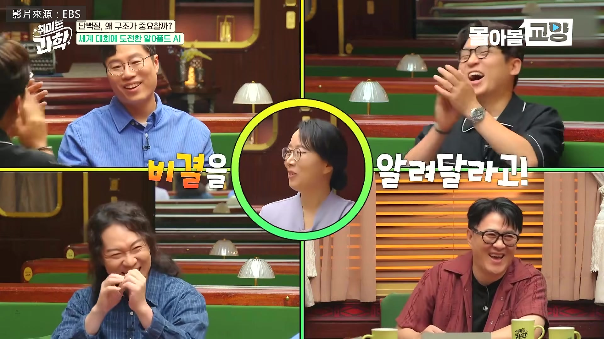

**逐字稿片段：** 那是 DeepMind 耶，當然是用 AI 只講最基本的，把報告時間撐滿 然後說「我們還在徵人」，就下線了 不過他們說之後會發論文 論文倒是寫得非常詳細 喔，有寫喔？那就原諒他們吧 那篇論文是不是拖很久？ 對，拖了很久才出來 技術門檻嘛 大概是想多守一段時間，只有他們跨得過的門檻 可以這樣猜

**話題推測：** 提到 AlphaFold 的開發公司 DeepMind

---

## 00:04:18

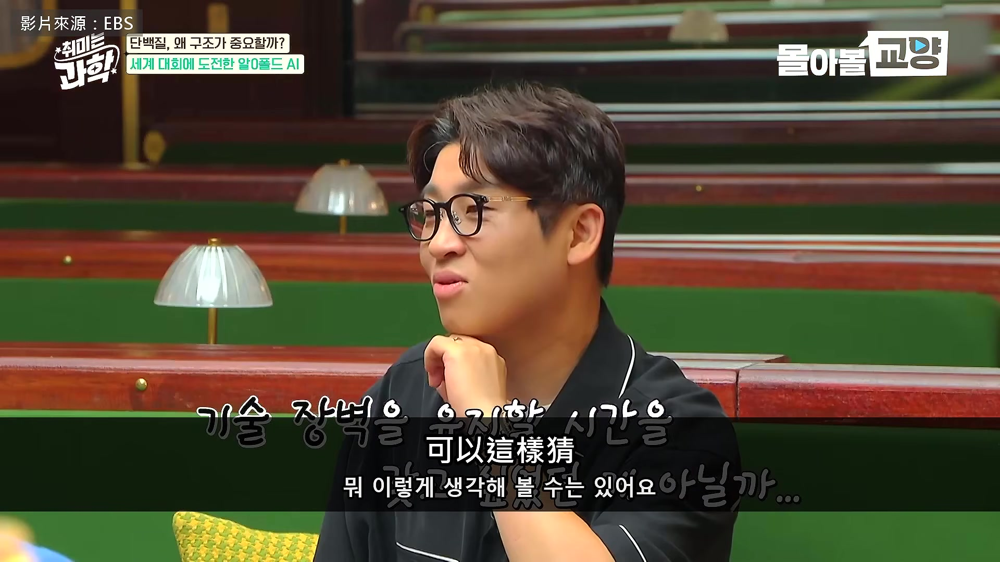

**逐字稿片段：** 論文您一定看過吧？內容怎麼樣？ 祕訣是什麼？

**話題推測：** 主持人提問 AlphaFold 論文的細節

---

## 00:04:23

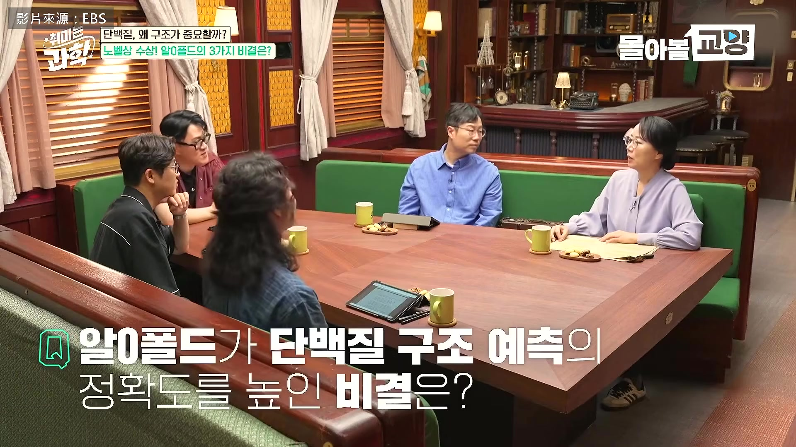

**逐字稿片段：** 祕訣嘛，既然是 AI，資料就很重要 解結構的研究做了很久很久

**話題推測：** 開始解釋 AlphaFold 的第一個成功祕訣：資料

---

## 00:04:32

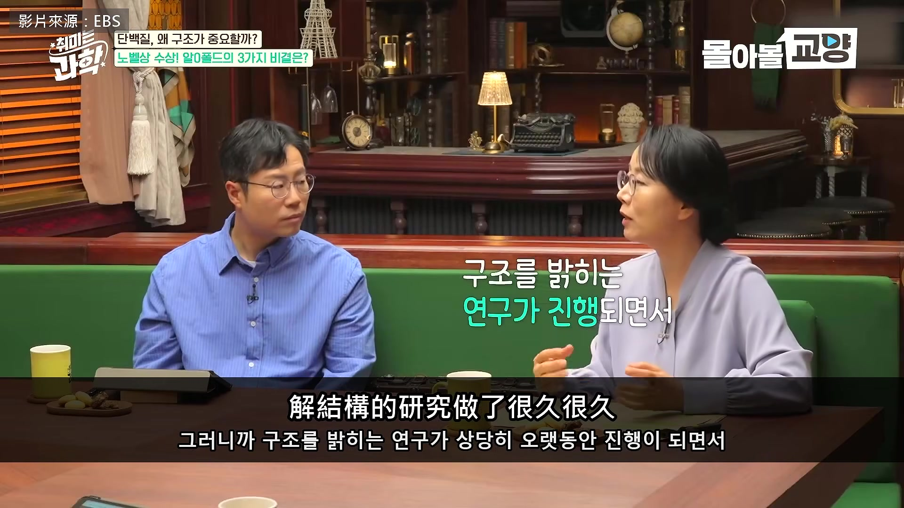

**逐字稿片段：** 累積了大概 10 萬個結構的資料，這很重要 她說光有資料還不夠

**話題推測：** 量化說明累積的蛋白質結構資料量（10萬個）

---

## 00:04:38

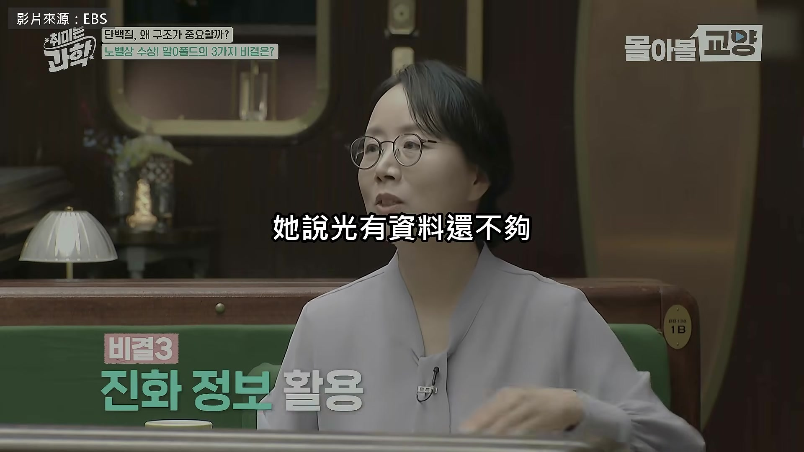

**逐字稿片段：** AlphaFold 另外吃進了兩樣東西

**話題推測：** 介紹 AlphaFold 另外整合的兩種資訊

---

## 00:04:41

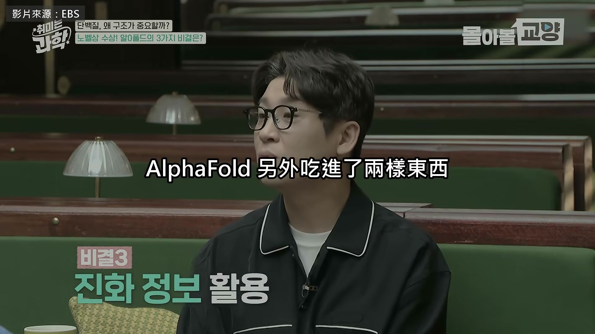

**逐字稿片段：** 一樣是物理，原子之間怎麼互相拉扯 這些規則被寫進了模型

**話題推測：** 解釋第一種資訊：物理法則

---

## 00:04:45

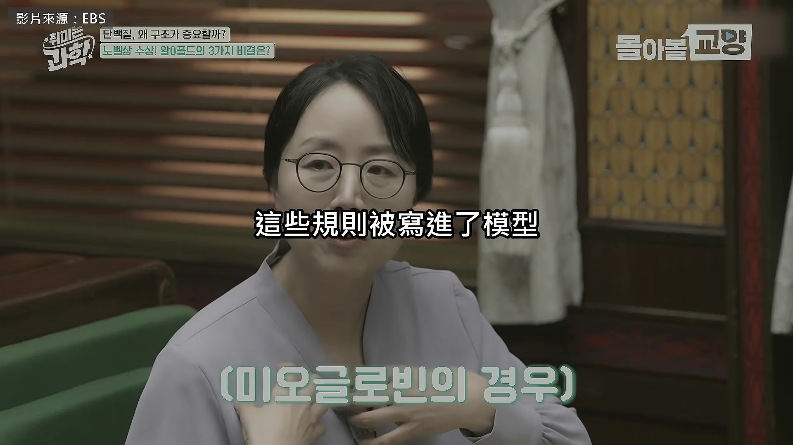

**逐字稿片段：** 另一樣是演化，同一種蛋白質 人跟鯨魚、馬身上都有，形狀差不多 胺基酸的順序卻各不相同 把這些親戚的序列擺在一起比 就找得到結構的線索 利用序列裡演化資訊的這個想法

**話題推測：** 解釋第二種資訊：演化線索

---

## 00:05:01

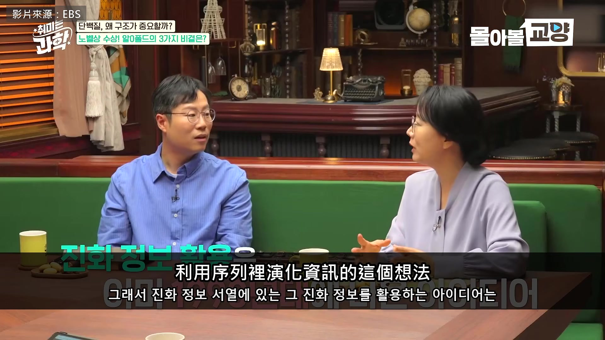

**逐字稿片段：** 90 年代就有了 哇 90 年代末就有了 那麼多科學家的研究跟論文 他們拼了老命做出來的資料

**話題推測：** 提及利用演化資訊這個想法的起源（90年代）

---

## 00:05:10

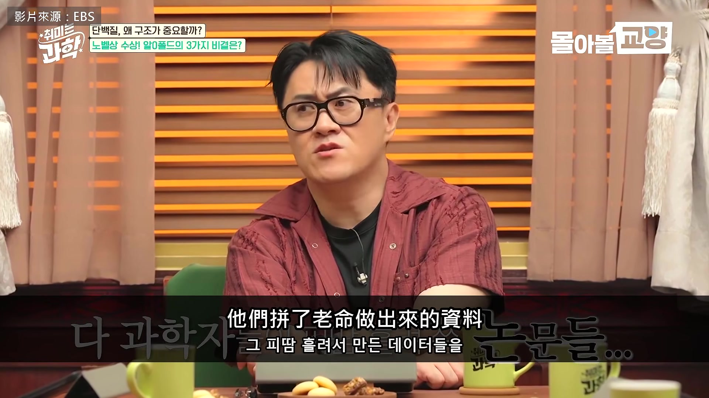

**逐字稿片段：** 被 AI 插根吸管，一口氣全吸走了 您說吸管，其實說得沒錯 可是科學本來就是這樣進步的 一大堆科學家把東西全部上傳 它再全部吸過去，做出來的 科學家流血流汗解了幾十年的問題 AI 一出現，反正就是解掉了

**話題推測：** 比喻 AI 整合既有科學資料的過程

---

## 00:05:33

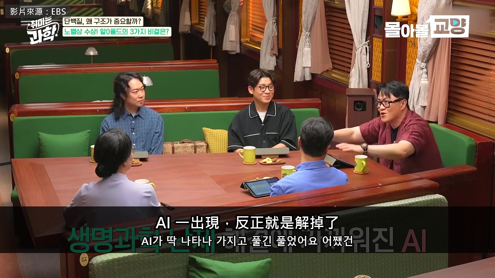

**逐字稿片段：** 那時候科學家的反應應該很兩極吧 那時候怎麼樣？ 大家都嚇壞了 有些人想說，那我以後要做什麼 Jumper 跟 Hassabis 報告完 那時候大家以為 蛋白質結構的問題全都解完了 後來我去參加一場學術研討會 有位研究者就這樣說 「那我以後要做什麼」 講著講著就哽咽了 哇，真的假的？像迷路了一樣 主持人接著問 結構預測是不是就這樣解完了

**話題推測：** 轉向討論科學家對 AlphaFold 問世的反應

---

## 00:06:09

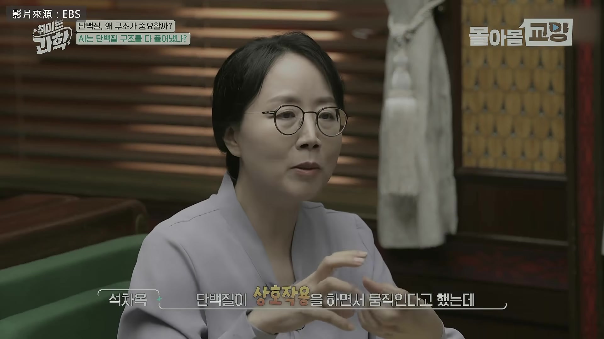

**逐字稿片段：** 她說解掉了很多，還沒解完的 是那些一直在晃動 沒有固定形狀的蛋白質 另外

**話題推測：** 說明蛋白質結構預測領域尚未完全解決的問題

---

## 00:06:15

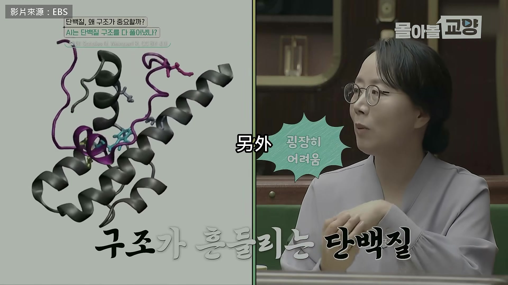

**逐字稿片段：** 地球上所有生物的蛋白質加起來超過 2 億種

**話題推測：** 提供全球蛋白質總數的巨大數字（超過2億種）

---

## 00:06:17

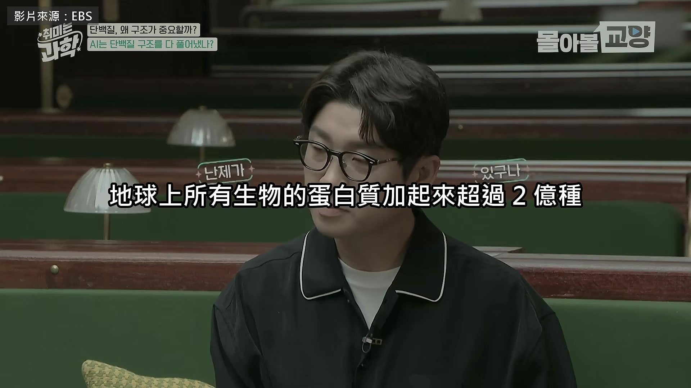

**逐字稿片段：** 實驗解出來的只有 25 萬個左右 您說地球上的蛋白質有 2 億種

**話題推測：** 對比實驗已解出的蛋白質數量（25萬個）

---

## 00:06:24

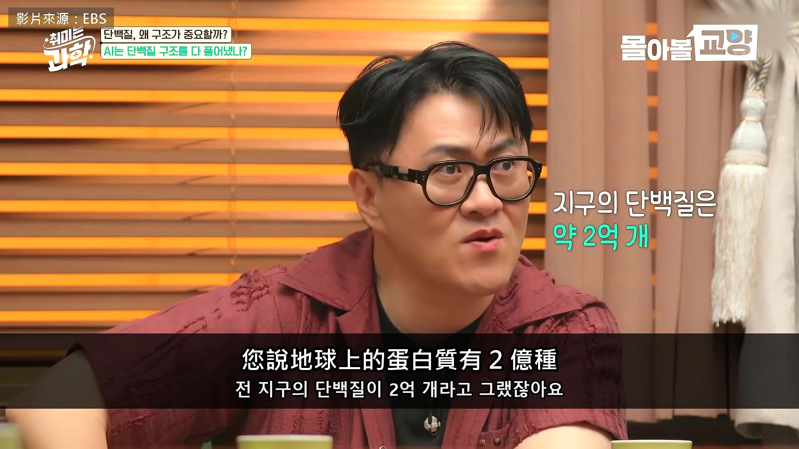

**逐字稿片段：** AlphaFold 大概完美預測了多少個？ AlphaFold 只要有胺基酸序列 就能預測結構 所以幾乎所有已知的蛋白質 它都算出結構，放進資料庫了 接近 2 億個？ 對對對 不過預測終究是預測 裡面有對的，也有錯的 我沒有數過

**話題推測：** 主持人詢問 AlphaFold 預測的蛋白質數量

---

## 00:06:48

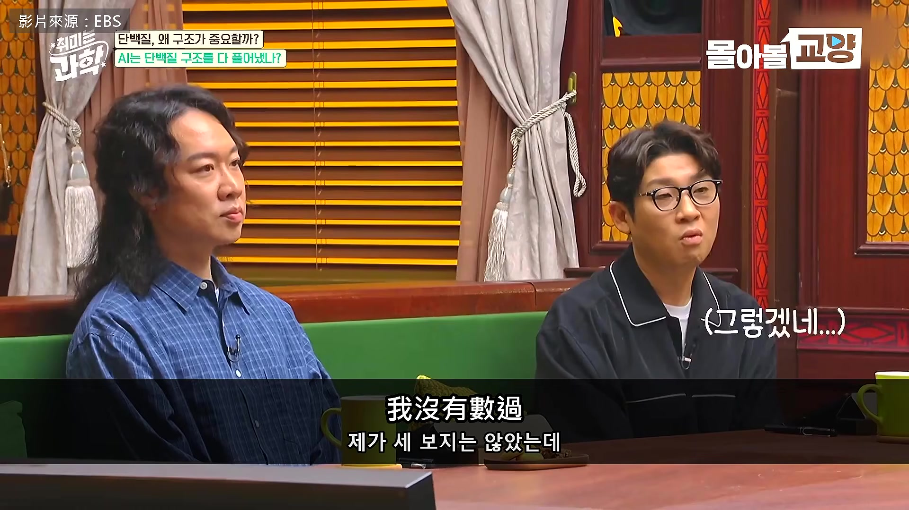

**逐字稿片段：** 嗯，大概一半吧 一半？那就是 1 億個，也太驚人了

**話題推測：** 教授估計 AlphaFold 預測準確的比例（一半）

---

## 00:06:55

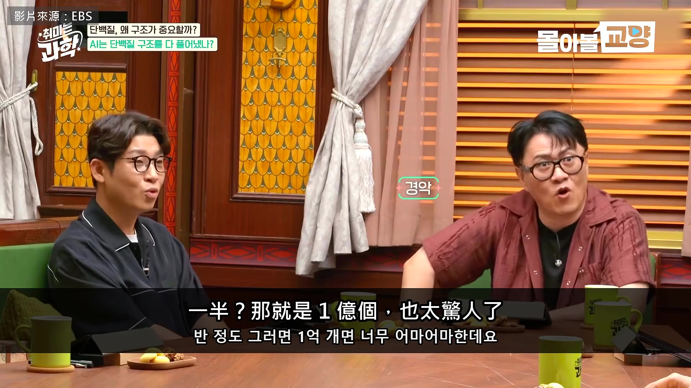

**逐字稿片段：** 而且它會說「這個我有把握」 「這個我沒把握」 這種分數它也一起給，所以非常好用 沒把握的，它自己會打個三角形 會念書的學生都這樣，這題沒把握、這題有把握 對，就像那樣 那位哭出來的研究者，還在做研究嗎？ 應該還在做，應該很認真在做 應該用得很順手吧 對，用得很好 而且 AlphaFold 如果說「這個結構我覺得是對的」 現在幾乎都可以說是準的 這種的，現在不做實驗也信得過 換個角度說，AlphaFold 預測得好的那些 就不用再做實驗了

**話題推測：** 介紹 AlphaFold 的信心評分機制

---

## 00:07:38

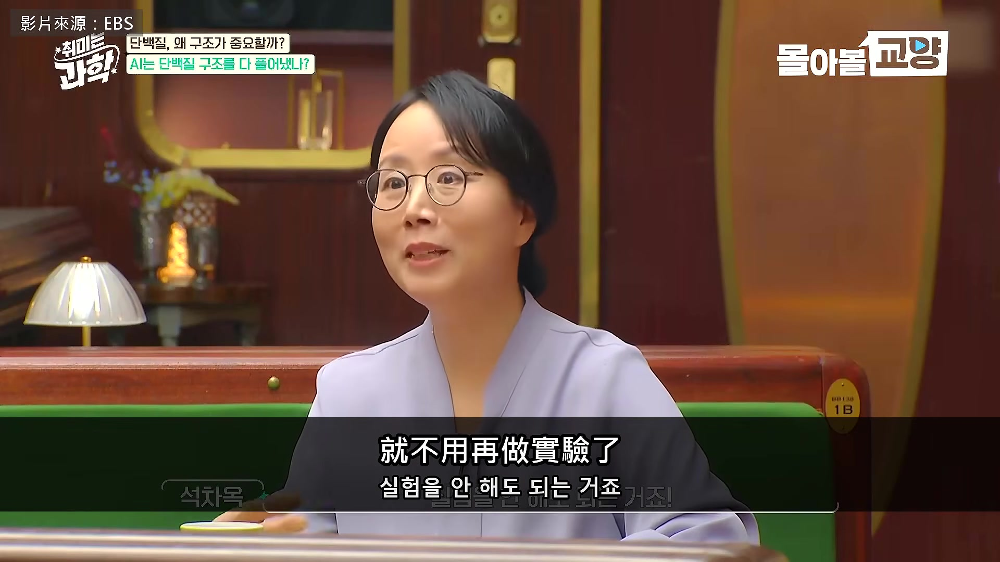

**逐字稿片段：** 然後是更有意思的，那些會晃動的蛋白質 去弄清楚它為什麼要這樣晃，才做得到這件事 這種研究好玩多了 所以現在非常多科學家都在用 一個研究生要流血流汗流淚 5 年的事 現在不用再做了 AI 出現了

**話題推測：** 轉向討論未來更有趣的研究方向：晃動蛋白質

---

## 00:08:00

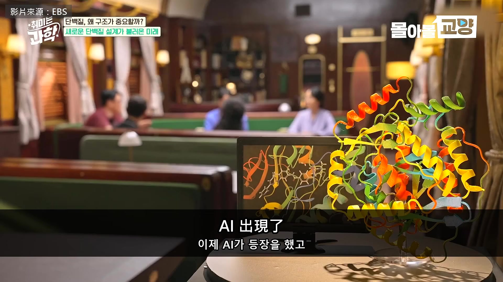

**逐字稿片段：** 您覺得之後的研究會怎麼變？ 講到蛋白質設計這個領域 把現有的改得更好，叫做最佳化 以前也常叫它工程改造 現在連從頭做出全新的都辦得到了 創造出本來沒有的東西

**話題推測：** 主持人提問 AI 對未來研究的影響

---

## 00:08:25

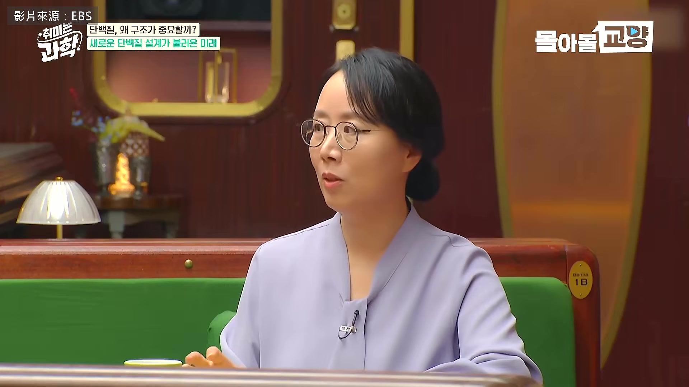

**逐字稿片段：** 這叫 de novo 設計 用 de novo 做 從零做出來 連這個都做得到了 這幾乎是神的領域 其實我本來也覺得那是神的領域 AlphaFold 出來之前，我沒想過做得到 哇 從零設計，就是先想好要它做什麼 再回頭設計一個自然界沒有的蛋白質去做

**話題推測：** 介紹「de novo 設計」這個專有名詞

---

## 00:08:49

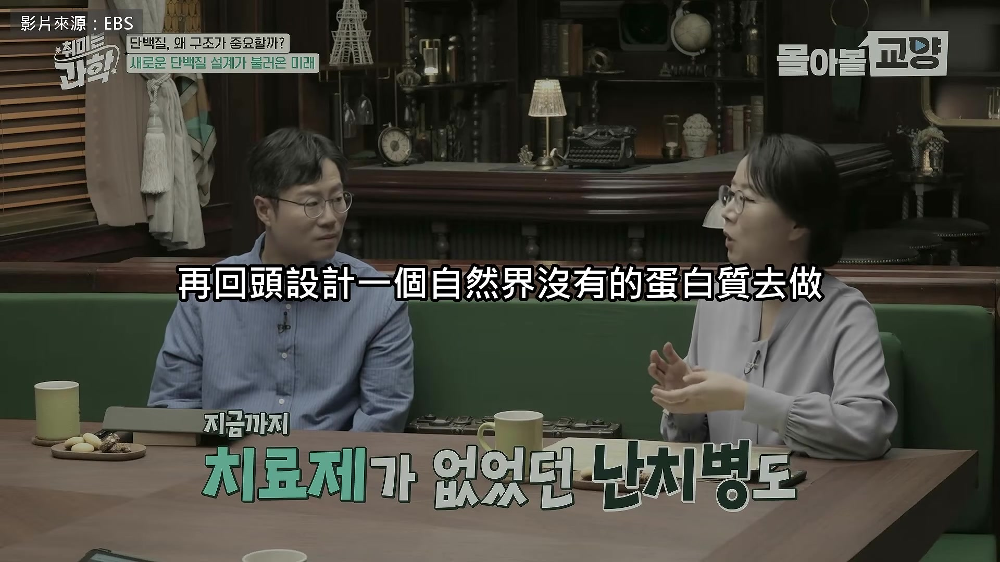

**逐字稿片段：** 她說最有用的地方是新藥 很多難治的病 關鍵在某一個蛋白質出了問題 設計一個專門去卡住它的分子 就有機會治

**話題推測：** 指出蛋白質設計最重要的應用：新藥開發

---

## 00:08:58

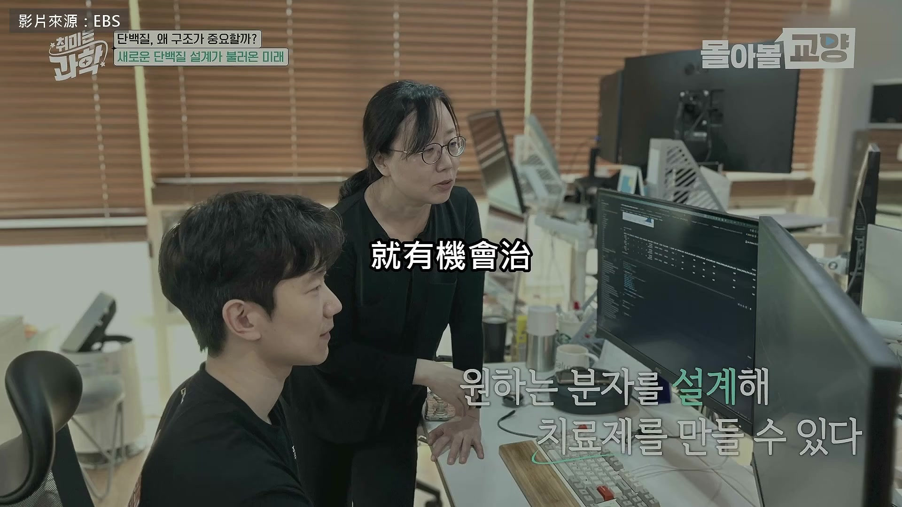

**逐字稿片段：** 她的實驗室也自己開發設計用的 AI 我們到現在設計過的蛋白質非常多 針對大概 20、30 個目標 我們在設計完全沒出現過的新蛋白質 研究做成了，就直達諾貝爾獎了吧 有可能啊，做到以前做不到的事的話 有機會吧，我們 Seok 教授，對吧？ 你們一直把話題往那邊帶 當然要去啊 我們這邊已經有好幾位預約了 這個只要做成，諾貝爾獎就穩了

**話題推測：** 提及教授實驗室也開發設計用的 AI

---

## 00:09:35

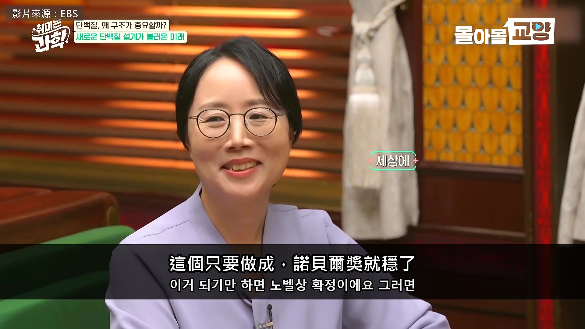

**逐字稿片段：** 不過這一塊競爭應該很激烈吧？ 對，競爭非常激烈

**話題推測：** 主持人提問蛋白質設計領域的競爭狀況

---

## 00:09:40

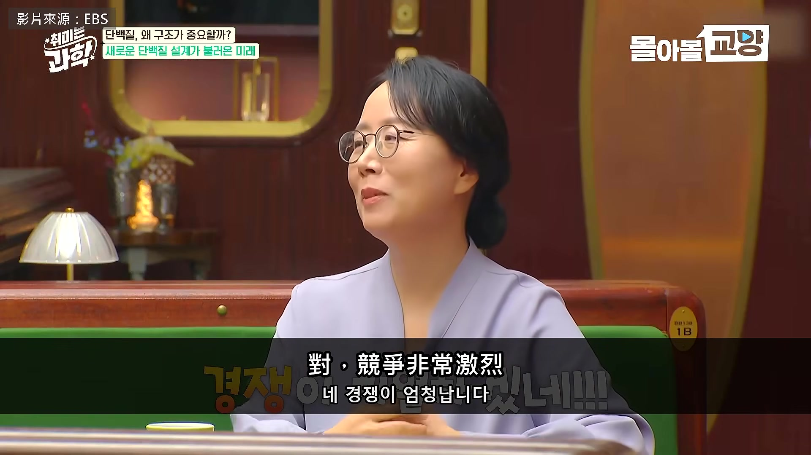

**逐字稿片段：** 拿了諾貝爾獎的 Google，做完 AlphaFold 接著開了 Isomorphic Labs 一家做新藥的公司

**話題推測：** 介紹競爭者之一：Google 旗下的 Isomorphic Labs

---

## 00:09:48

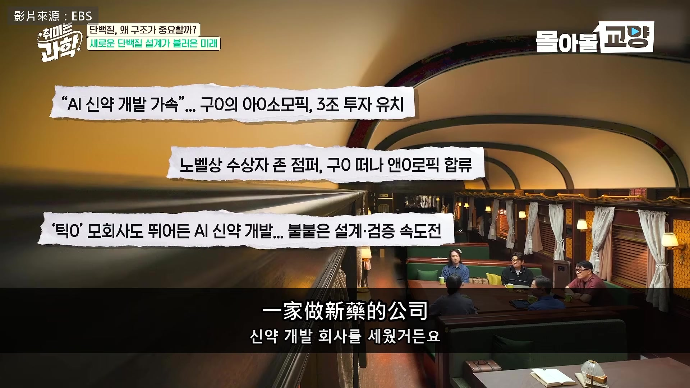

**逐字稿片段：** Anthropic 也把一位諾貝爾得主挖過去 好像也要做新藥 還買下了一家藥廠 她說的那位諾貝爾得主

**話題推測：** 介紹競爭者之二：Anthropic 公司

---

## 00:09:58

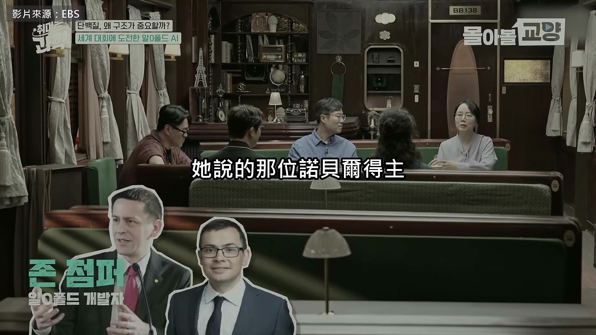

**逐字稿片段：** 節目畫面上打出來的新聞寫的是 John Jumper 也就是 2020 年在線上報告 AlphaFold 的那個人 4 年後

**話題推測：** 螢幕畫面顯示新聞，揭露諾貝爾得主為 John Jumper

---

## 00:10:06

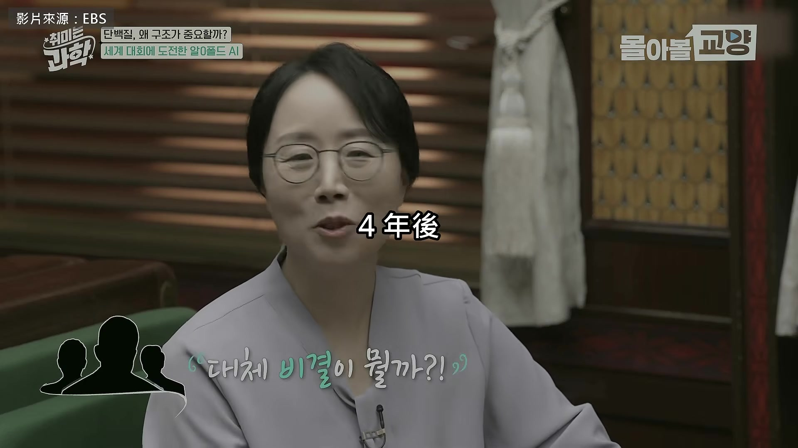

**逐字稿片段：** 他跟 Hassabis 一起拿了諾貝爾化學獎 所以教授您等於在跟他們競爭 教授，這次拜託了 教授一講到自己的成就就很害羞

**話題推測：** 宣布 John Jumper 與 Demis Hassabis 共同獲得諾貝爾化學獎

---

## 00:10:22

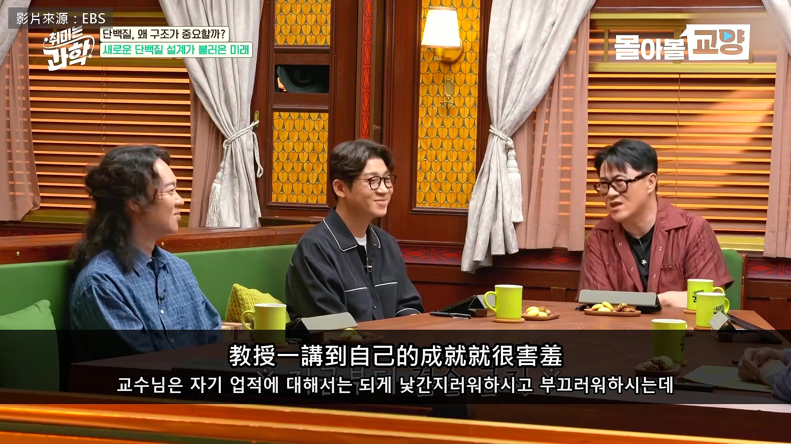

**逐字稿片段：** 您的研究團隊，在全世界 老實說排第幾？ 您覺得大概第幾名？老實講 不久前我還覺得是第一名 很確定的第一名 那現在呢 現在是不安的 不安的第一名吧，或是前幾名之一

**話題推測：** 主持人詢問教授團隊在世界上的排名

---

## 00:10:40

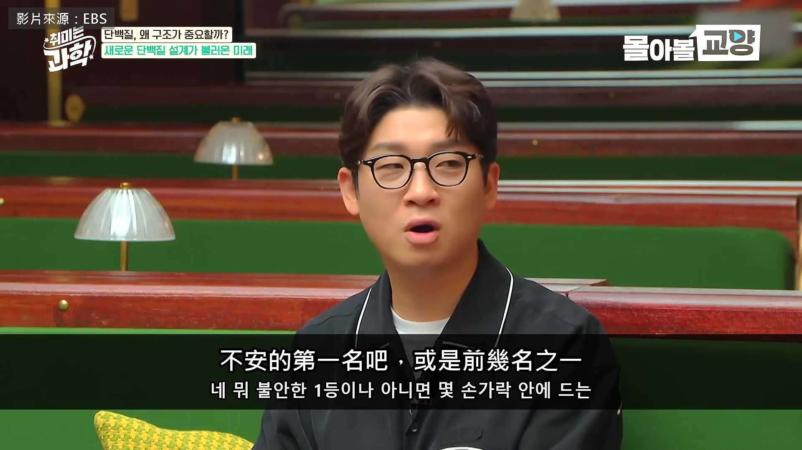

**逐字稿片段：** 那蛋白質設計什麼時候能真的拿來用 用在治病上呢？教授 現在已經在靠近了

**話題推測：** 主持人詢問蛋白質設計應用於治療的時間線

---

## 00:10:51

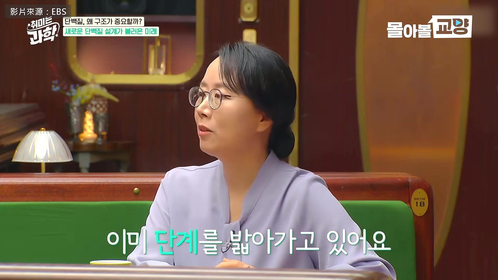

**逐字稿片段：** Demis Hassabis 跟其他 AI 領袖

**話題推測：** 提及 Demis Hassabis 等 AI 領袖對未來的預測

---

## 00:10:54

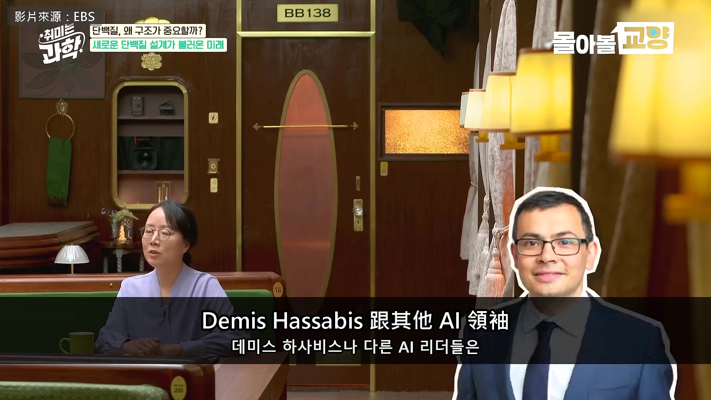

**逐字稿片段：** 有人說 10 年、15 年內，幾乎所有疾病都能克服 有人這樣講過 那只要再健康活個 15 年 撐一下就好 MC，到時候你真的可以長生不老 真的好想喔 身為一個把一輩子都給了蛋白質研究的科學家

**話題推測：** 提出 10-15 年內克服所有疾病的預言

---

## 00:11:15

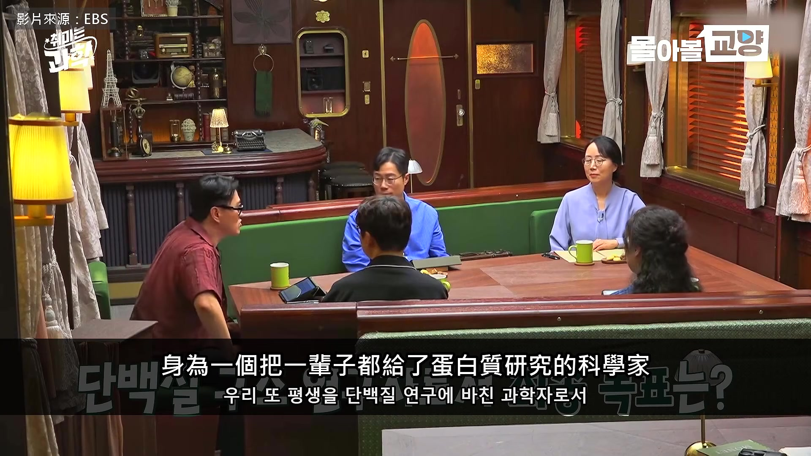

**逐字稿片段：** 想問 Seok 教授，您最終的目標是什麼 最終目標 如果說我一直朝著哪個方向在跑 那就是理解生命 理解有生命存在的這個世界 再用這些理解 去創造出我們需要的東西 往這個方向走，就是我在追求的 AlphaFold 解掉了她花大半輩子在做的題目 她的第一個反應是高興 現在她用 AI 做世界上沒有的蛋白質 同一條路上多了 Google 和 Anthropic 這個第一名，她坐得不太安穩 原影片 39 分鐘 前半段她從頭講蛋白質

**話題推測：** 主持人詢問教授的最終研究目標

---

## 00:11:54

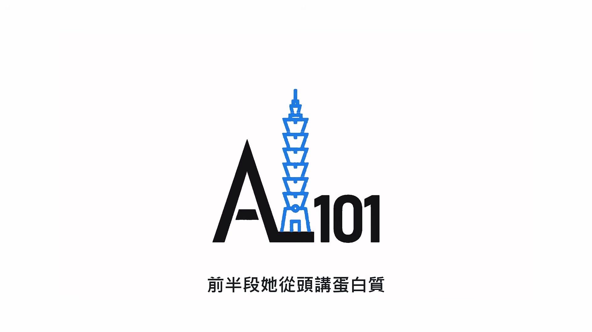

**逐字稿片段：** 也講到疫情那年 她的團隊把別人解出來的新冠棘蛋白片段拼起來 補上缺的根部，做出完整的立體結構 同桌做天文的來賓也說 一張星空照片裡有幾千萬個天體 不靠 AI 根本分不完 原影片連結在說明欄，有興趣可以去聽更多。

**話題推測：** 提及疫情期間教授團隊對新冠棘蛋白的研究

---
