# ai-note-101_zOE2P3jj4kw — 關鍵畫面索引

- 來源逐字稿：[ai-note-101_zOE2P3jj4kw_GT.srt](ai-note-101_zOE2P3jj4kw_GT.srt)
- 影片：https://www.youtube.com/watch?v=zOE2P3jj4kw
- 截圖數：17

## 00:00:00

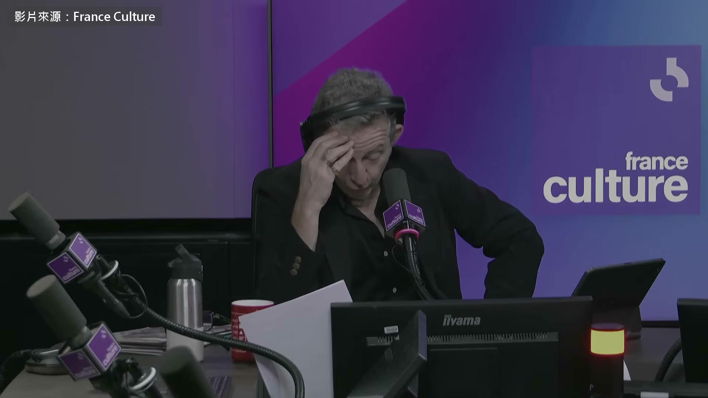

**逐字稿片段：** 法國最有分量的文學獎龔固爾獎 9 月 25 號把一本熱門小說撤出初選名單 先是有匿名帳號指控這本書幾乎全是 AI 寫的 後來又傳出抄襲 作者 Thélyson Orélien 否認用了 AI 9 月 28 號

**話題推測：** 介紹法國文學獎「龔固爾獎」

---

## 00:00:15

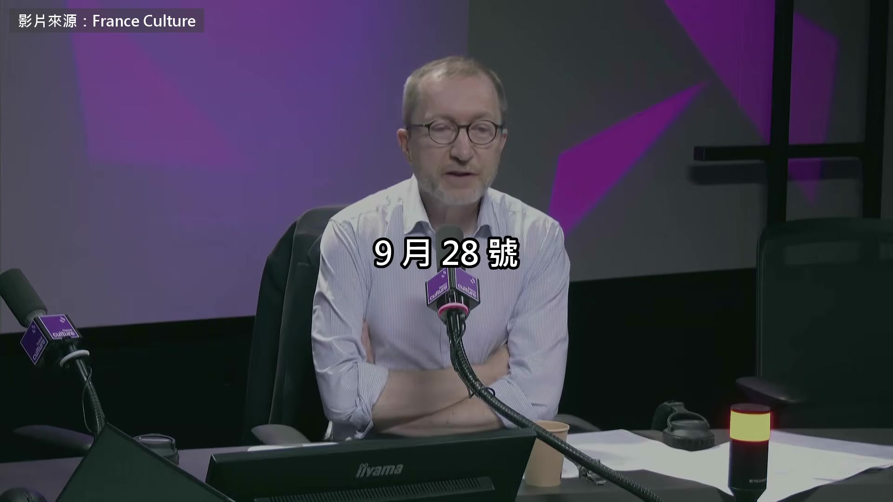

**逐字稿片段：** 法國國家廣播電台的文化台找來 William Marx 談這件事 他在法蘭西公學院教比較文學 那是法國地位最高的學術機構 傅柯跟羅蘭巴特都在那裡開過課 他寫過一本書叫《告別文學》 教宗方濟各那本談閱讀的書 法文版的序也出自他手 節目的題目是 AI 是不是正在殺死文學 這個嘛，AI 的進步非常大 幾年前，第一批語言生成模型剛出來的時候 就是 ChatGPT，我們玩得很開心 我們拿這些模型做了些測試 我記得那次是跟《Le Temps》報一起做的 叫它用莒哈絲的風格寫一段描寫 寫一段登山健行 結果普普通通 文字是講得通的 但完全不是莒哈絲的風格 現在過了 3、4 年 我們看到 AI、這些模型 擁有的修辭能力、論述能力 文字的力量強得驚人，幾年前根本無法想像 我說的當然不是 AI 出現以前 這幾年的進步相當可觀 所以這些模型到處都在用 公文報告裡在用，工作上也在用 作家當然遲早也會用上它們 這是一定會發生的，可以說是早就寫好的劇本

**話題推測：** 介紹受訪者 William Marx 及其參與的廣播節目

---

## 00:01:50

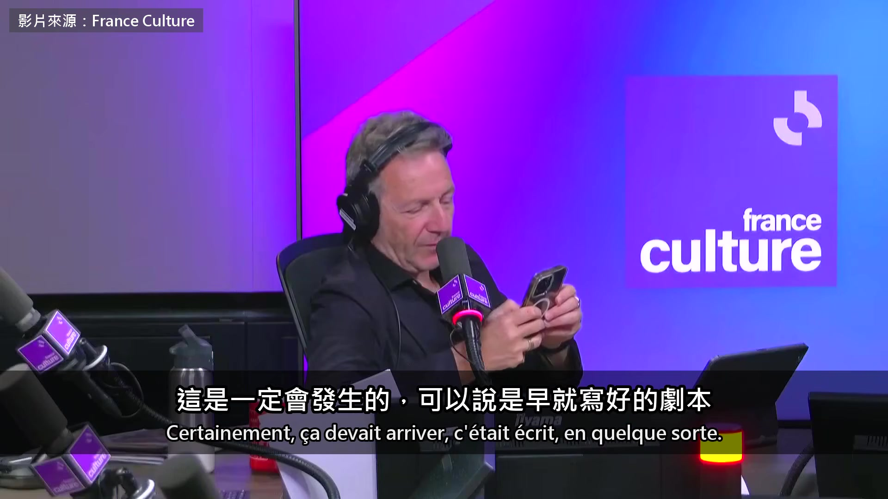

**逐字稿片段：** 我自己也得承認，我工作上會用這些工具 幫我改寫文字 有件事讓我印象非常深 我要寫一封信，把草稿丟給它 請它幫我修改、潤飾

**話題推測：** William Marx 分享自己工作中使用AI修改文字的經驗

---

## 00:02:08

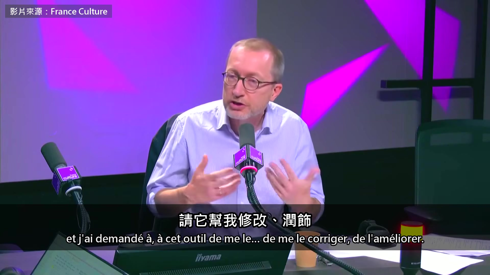

**逐字稿片段：** 結果它跟我說，你用的這個說法 可能會讓讀的人反感 最好換一個講法 所以這些模型心裡有一個讀者 這很令人意外，而這正是文學在做的事 想像讀者讀到一段文字會有什麼反應 網路上很多人分析了 Orélien 這本書 說這些話、這些句子 就是 AI 寫作的特徵

**話題推測：** 舉例說明AI如何給出細緻的寫作建議

---

## 00:02:45

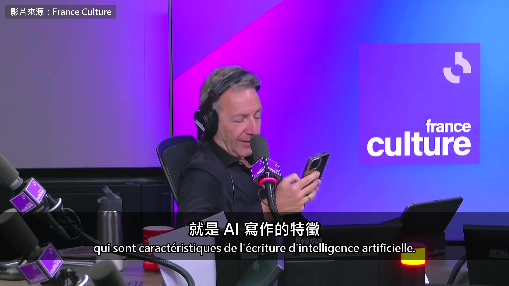

**逐字稿片段：** 比如說列舉 那是一個巨大的菸灰缸，逗號 一座沒有墳的墓園，逗號 一座荒謬的劇場，每一陣掃過，角色就換一輪 您讀過這本書 有沒有看到一些句子 帶有現在英文叫 AI slop 的特徵 也就是 AI 生出來的爛糊 您知道，幾年前 AI 剛出來的時候 英語國家的大學教授抓學生作業 看的是裡面很常出現 to delve into 這在英文裡其實很少用 其實那是 AI 的口頭禪 現在這個口頭禪已經沒了

**話題推測：** 引用 Orélien 書中的句子作為AI寫作風格的例子

---

## 00:03:30

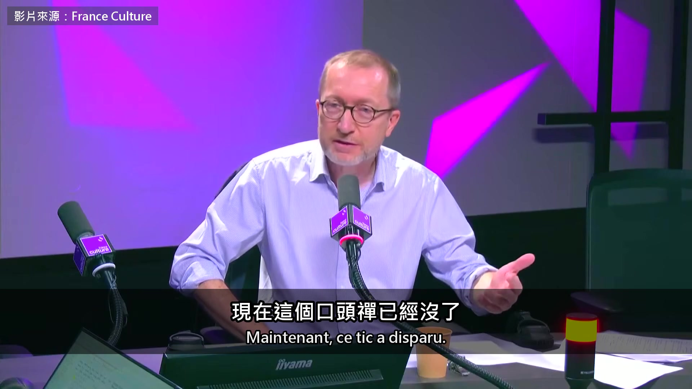

**逐字稿片段：** AI 的口頭禪每個月都在變 這些是今天的，之後也會變 不過您舉的例子確實很有代表性 那其實是三段式的節奏 而三段式節奏屬於文學的大傳統 也屬於修辭學的大傳統 17 世紀的 Bossuet 主教早就在用 可是他的講道、他的悼詞 就我所知，可不是 AI 寫的 他說 AI 吃進去的 就是 2022 年以前的整個文學 那些書可以確定是人寫的 對 AI 來說特別珍貴 您說的讓人頭暈，因為這代表從現在起

**話題推測：** 指出AI的寫作「口頭禪」是動態變化、不斷演進的

---

## 00:04:09

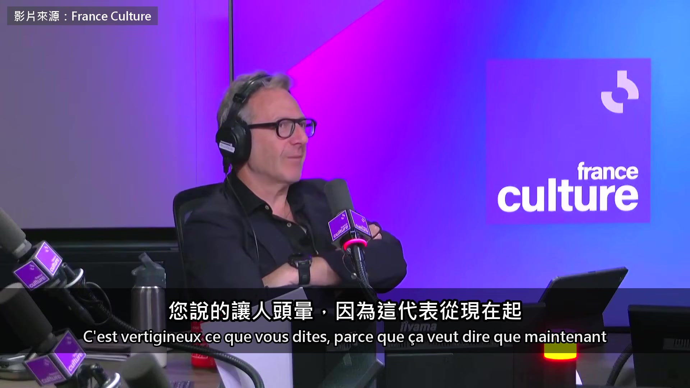

**逐字稿片段：** 餵給 AI 的，會是 AI 寫的書 這正是非常、非常大的危險

**話題推測：** 提出未來AI可能以AI寫作的書來訓練AI的危險

---

## 00:04:18

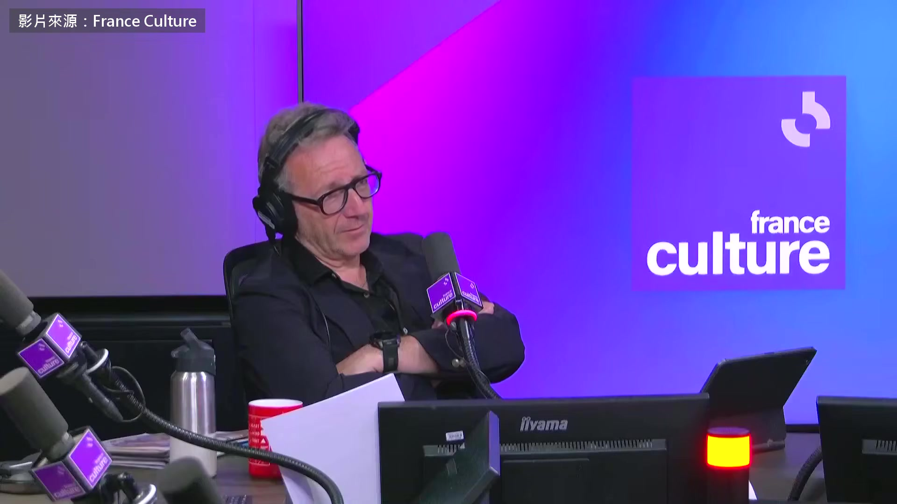

**逐字稿片段：** 何況我們還看到 人類讀者在減少 所有調查都這麼顯示，尤其是年輕人 但不只是年輕人 大部分的時間都花在螢幕上 所以讀者越來越少 出版業、書店也看得到 書店的客人一直變少，大家都很惋惜 事實就是，人類讀者在消失

**話題推測：** 提出人類讀者數量正在減少的觀察

---

## 00:04:42

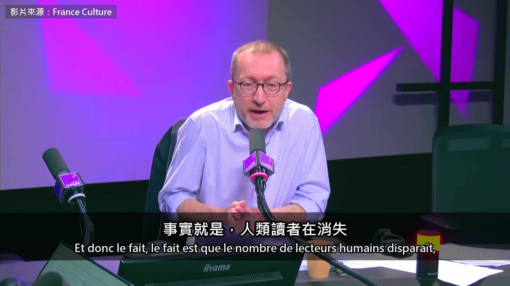

**逐字稿片段：** 機器讀者反而在增加 恐怕再過幾個月，或者說幾年 我們面對的就只剩機器 只剩機器寫給機器看的文學 我擔心這樣一直循環 機器餵機器 文學的水準只會一路往下掉 這個等一下再談

**話題推測：** 指出機器讀者數量反而增加的現象

---

## 00:05:08

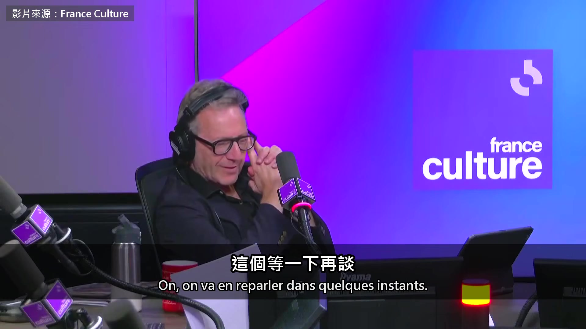

**逐字稿片段：** William Marx，這到底是不是一本好書 因為我在風波之前沒讀過 現在已經沒辦法有自己的看法 不知道您之前讀過嗎 沒有，我是風波之後才讀的 也知道您說的那些，就是三段式節奏那些 我還是被它的能量帶著走 我覺得這本書相當精彩 我能理解為什麼很多評論家都上當了 我想我也會上當

**話題推測：** 主持人提出 Orélien 的書是否為好書的疑問

---

## 00:05:38

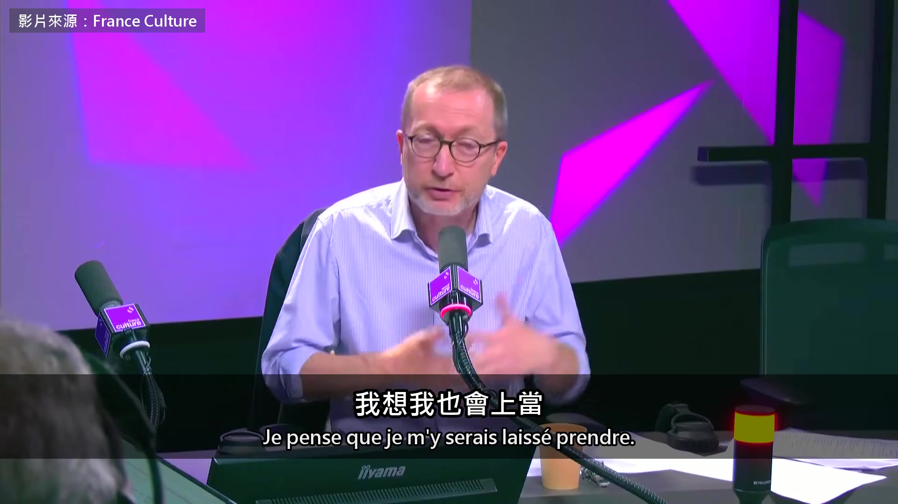

**逐字稿片段：** 節目接著談到，用 AI 寫出來的書 還算不算作者的作品 我認為這本書背後確實有一個真正的作者 我不認為 Orélien 是叫 ChatGPT 直接幫他寫一本 300 頁的書 據我所知，ChatGPT 還做不到 我想他是下了一連串的 prompt 再一點一點修改這本書 一章一章往下寫 當然，我講這些的前提是這一切都屬實 不過各種跡象都蠻一致的 所以至少目前，總還是有一個人在主導 最後也有一個權威在上面簽名 其實得回到最根本來看 一本書的作者就是寫它的那個人 而且要展現原創性 這個觀念其實相當新 大概 2、300 年前才有 要到 18 世紀 作者這個概念才跟原創綁在一起 就算在那之後 多人合寫的書也多得是 最有名的例子是 1845 年的大仲馬 1845 年，有一本小冊子出來攻擊大仲馬 說他的書其實是找別人寫的 那種人以前一直有個不太好聽的叫法 現在比較常說代筆 小冊子還說，像 Auguste Maquet 他是最有名的代筆 寫過一個句子，5 行裡有 16 個 que 原封不動交給大仲馬 大仲馬也沒改 所以那時候就有這種想法，句子很笨重 也就有了用統計來調查的想法 證明書是別人寫的 後來 Maquet 真的告了大仲馬 要求掛名共同作者 沒有完全如願，但拿到了一筆補償 那對您來說，大仲馬是不是就變成二流作家 因為他用了代筆 不不，他是說故事的大師 文學史家仔細研究過大仲馬的手稿 發現 Maquet 交出 16 頁 大仲馬會擴寫成 70、80 頁 所以故事其實是大仲馬搭起來的，那是另一回事 大仲馬是冒險小說的天才 這一點毫無疑問 就算到了今天 大家讀明星自傳、政治人物的書 其實也都知道，或猜得到 那些書不是本人寫的，是別人寫的 所以重點也在於簽名 後來主持人反問，大家還在寫書 也還會為了 AI 跟抄襲這麼生氣 這不就代表我們還在乎文學 說真的，文學，甚至整個藝術 都夾在兩種相反的要求之間 第一種是表達，是真誠 可以叫它抒情的要求 我們要作家用自己的名義說話 就像您說的，讓人聽到他自己的聲音 一份見證，把私密的個人經驗交給讀者 這時候讀者會有一種錯覺，也許那只是錯覺 好像碰到了另一個正在說話的靈魂 靠著文學的奇蹟，跟它一對一交談 這就是 auctoritas，我想起那個拉丁字了 對，auctoritas，就是文字背後有一個人 有一個人在表達，有一個靈魂在那裡 這種抒情的要求其實很早就有 一直都在，只是特別明顯 是在 19 世紀浪漫主義革命以後 但除了抒情，文學還有另一種要求 也一直都在，但很不一樣 可以叫它美的要求、形式品質的要求 作品要統一、要連貫、要自己站得住 還要有極強的效果 把語言的工具用到極致，去打動讀者 推到極端，如果完全照修辭的原則走 最後會得到一部完全沒有個人色彩的作品 T. S. Eliot、Valéry 這些作家就這麼說 作品背後不需要作者 Valéry 說，作者管不了自己的作品 讀者愛怎麼讀就怎麼讀 只剩讀者跟文本之間的關係 這種形式的要求，其實就是要求效果 常被歸到古典主義 但浪漫主義來了它也沒消失 它一直都在，是文學藝術的條件之一 所以文學難就難在，兩種要求都得顧到 只是每個時代的平衡點不一樣 這次正好是一份個人的見證 為什麼 Orélien 這件事會鬧成風波 因為我們以為看到了一個奇蹟 一個人從極度艱難的處境出發 過著受害者的人生，卻找到了自己的語言 找到能把這一切說出來的文字風格 這裡是… 可是這種故事，一旦文字風格垮了 連真誠本身也跟著消失 因為那份真誠，全靠我們以為 在書裡聽到的那個個人的聲音 所以這場風波，不是隨便哪個時候都會發生 2026 年的今天，不是文學史上隨便一個時刻

**話題推測：** 節目轉向討論AI寫作的書是否仍算「作者作品」的議題

---

## 00:11:28

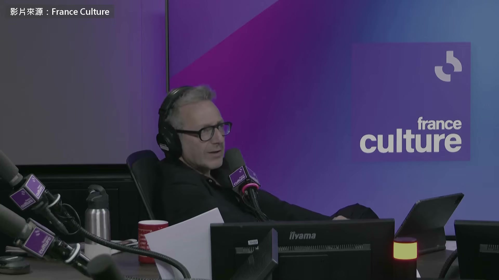

**逐字稿片段：** 主持人搬出法國詩人 Valéry Marx 編過他在法蘭西公學院的詩學課 Valéry 有一篇小說叫《泰斯特先生》 寫一個人創作的時候腦子裡在轉什麼 主持人說，改用 AI 來寫 這種文學就不會再有了 Valéry 確實很強調形式的要求

**話題推測：** 主持人再次引用法國詩人 Valéry 的觀點

---

## 00:11:45

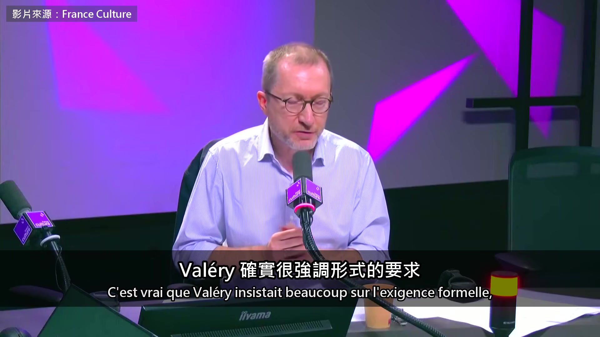

**逐字稿片段：** 他也想像過，某種程度上，一台自動機器 他叫它理想的自動機，能寫出文本 他在詩學課裡講過 一台每次都會贏的理想自動機 那是 1940 年代 Valéry 在 AI 出現以前就想像了 AI 某種程度上，文學早就預見了 AI 就是透過形式的要求 他說，Racine 寫那部有名的悲劇《費德爾》時 Racine 就不再是 Racine 他把自己這個人忘掉了 但這不代表…這就是差別所在 Valéry 跟 Orélien 的差別，容我這麼說 我不想再為難這個可憐的人 Valéry 說的其實是 文學必須讓作者超越自己 重點是超越自我 要對自己下苦功，就像您提到的《泰斯特先生》 才能到達更高的自己，一種出神的狀態 AI 讓消失的，就是這份功夫 寫作裡吃苦的那一面，超越自己的那一面

**話題推測：** 指出 Valéry 曾想像過能寫出文本的「理想的自動機」

---

## 00:12:53

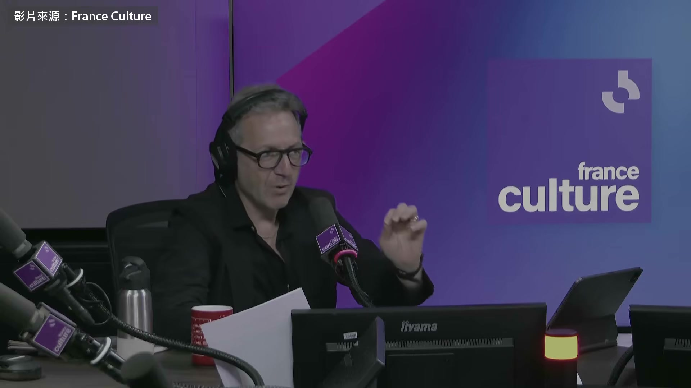

**逐字稿片段：** 主持人又提到德國哲學家班雅明 班雅明說，藝術品一旦可以大量複製 原作那份獨一無二的靈光就會消失 主持人說，當年沒人想得到 書會改由 AI 來寫 我一直以為，靈光真的會消失 讀者也不會想讀機器寫的書

**話題推測：** 主持人提及德國哲學家班雅明的「藝術品靈光」理論

---

## 00:13:13

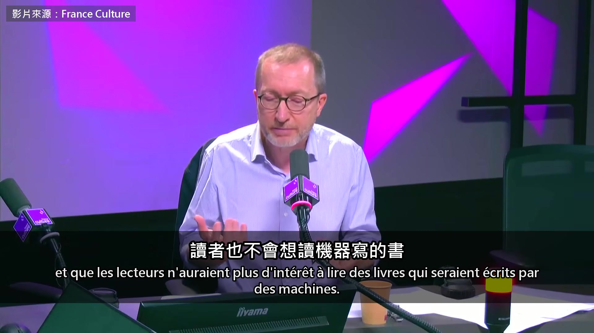

**逐字稿片段：** 但我聽過一些讀者的說法 推理小說、愛情小說的讀者 他們說，書是不是機器寫的，其實無所謂 只要故事精彩、能抓住他們 他們照樣會讀 所以我認為，我們正在看到 原本以為是一體的東西開始分裂 也就是說，永遠會有一種很小眾的文學 由人來寫，給人來讀 很費力，很慢 但它正在縮小，只剩少數人在乎 另一邊會有大眾文學，其實早就存在了 因為出版界的暢銷數字 跟大報捧的那些作家 根本對不上，這得說清楚 所以大眾文學會有人讀，純粹為了樂趣 不會去問背後是誰 以前讀 Harlequin 系列的人 就是那種愛情羅曼史 從來不管是誰寫的 寫的人常常是大學生、博士生、高師的學生 為了賺點生活費寫這些小說 說到底無所謂，重點是讀得開心 那換成機器來寫，又有什麼不好 訪談最後，他講起愛倫坡 1845 年，愛倫坡發表了一首詩〈烏鴉〉 大受歡迎，浪漫到不行 一年後他說，那全是算出來的 讀者會有什麼反應，他都算好了 整件事大概就是一場大計算…一場大惡作劇 機器本來也能替他做這份工 這裡就看得出矛盾，一邊是真誠 人人都能在故事裡看到自己，一邊是背後的計算 文學的要求，就是要找到最大的效果 同時也要最真誠，最用力去接近真實 這件事我們永遠逃不掉 不管有沒有機器 連法國最頂尖的文學教授 都說自己讀這本書也會上當 他最後的說法是

**話題推測：** William Marx 引用讀者對於AI寫作的看法（如推理小說讀者不介意）

---

## 00:15:34

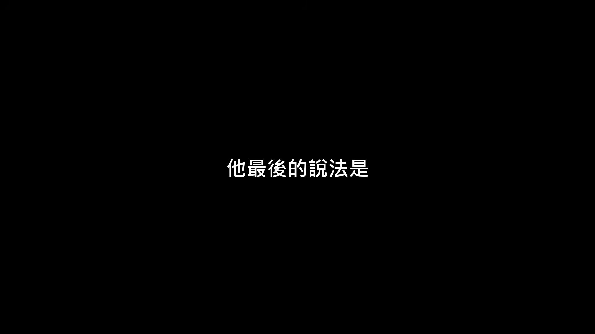

**逐字稿片段：** 文學永遠得把效果跟真誠兩頭顧好 有沒有機器都一樣 原影片 38 分鐘 還有兩段沒剪進來

**話題推測：** William Marx 總結文學的永恆挑戰：兼顧效果與真誠

---

## 00:15:43

**逐字稿片段：** Marx 替教宗方濟各那本談閱讀的書寫過序 他講了教宗為什麼要神學生多讀文學 另外他從荷馬講起 說就連號稱替繆思傳話的史詩 作者還是想讓自己被看見 原影片連結在說明欄，有興趣可以去聽更多。

**話題推測：** 提及完整訪談中 William Marx 曾為教宗方濟各的閱讀書作序

---
