# ai-note-101_zzJ9kingh6M — 關鍵畫面索引

- 來源逐字稿：[ai-note-101_zzJ9kingh6M_GT.srt](ai-note-101_zzJ9kingh6M_GT.srt)
- 影片：https://www.youtube.com/watch?v=zzJ9kingh6M
- 截圖數：21

## 00:00:00

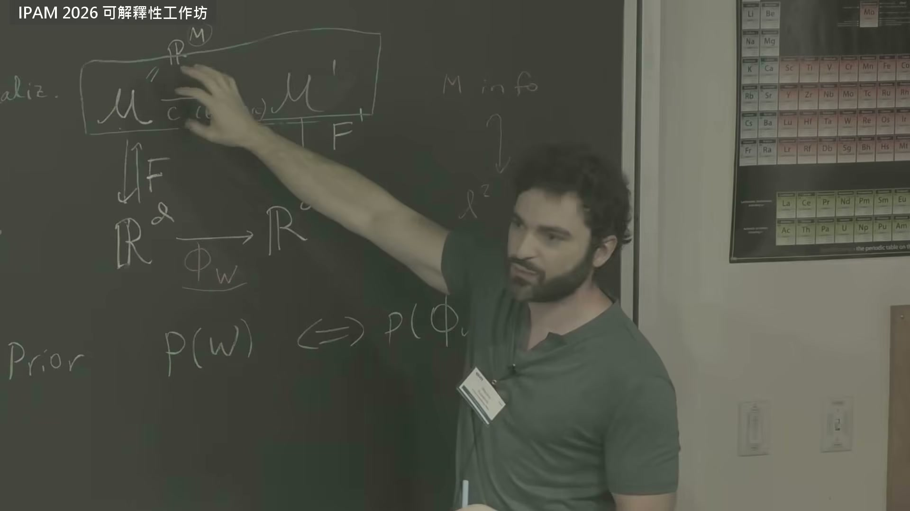

**逐字稿片段：** This is episode 7. The question is: Why do sparse structures emerge on their own inside neural networks? The speaker is Dmitry Vaintrob. He works on the Principles of Intelligence program at PIBBSS. He started as a pure mathematician, then moved into applied math. He proved the central theorem used in this talk.

**話題推測：** 影片標題或開場介紹。

---

## 00:00:16

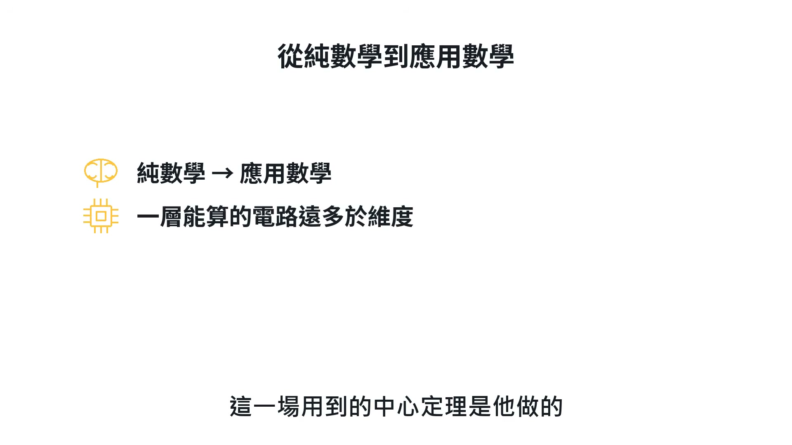

**逐字稿片段：** A single neural network layer can superimpose and compute circuits far exceeding its dimensionality. The algorithm comes from a paper by him and Jake Mendel, and Kaarel Hanni. Later, the mathematicians Adler and Shavit established the optimal exponent.

**話題推測：** 講者論文或核心論點的關鍵陳述投影片。

---

## 00:00:26

**逐字稿片段：** First, here is the problem this talk is concerned with. He states it very plainly on this slide. The goal of interpretability is to open up a neural network and break it into understandable components. He calls these components circuits. The first line says: Nobody knows what the circuits inside neural networks are. Layer by layer, a network does two things: representation, meaning what is stored in this layer, and computation, meaning how the next layer rewrites it. For the storage side, he has a model that he admits is wrong but useful. For the computation side, he puts it even more bluntly: there is not even a model.

**話題推測：** 介紹本次演講主要問題的投影片。

---

## 00:00:52

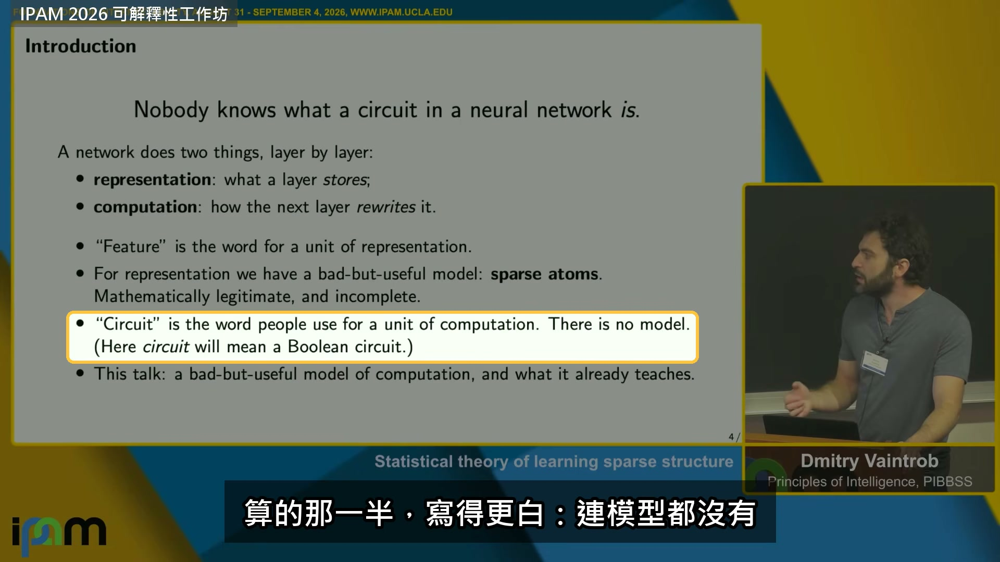

**逐字稿片段：** His methodology for the whole talk is that line from statistician George Box: All models are wrong, but some are useful. Here is the problem in plain language. A network layer has only a few thousand neurons, but it needs to hold concepts like cats, hamburgers, and a buggy stretch of code, far more concepts than neurons. So those concepts must be stored in superposition. Each neuron has to participate in several concepts at once. The question is what that superposition looks like. How many neurons actually read a given concept? Does every neuron get a tiny piece of it? Or do only a few neurons specialize in reading it, while all the others ignore it completely? Until now, this has only been an assumption. Nobody has ever derived it from a model.

**話題推測：** 引用統計學家George Box名言的投影片，闡述研究方法論。

---

## 00:01:26

**逐字稿片段：** This talk takes four steps. First, bet on a model we already know is crude. What a network layer is doing is running a small circuit made entirely of zeros and ones. Second, do not build the network by hand. Let training produce it. Third, use physics to calculate what training will produce. Fourth, compare the result with a real GPT-2. The answer is right there in the title. Sparse structure emerges on its own.

**話題推測：** 列出本次演講四個主要步驟的投影片。

---

## 00:01:47

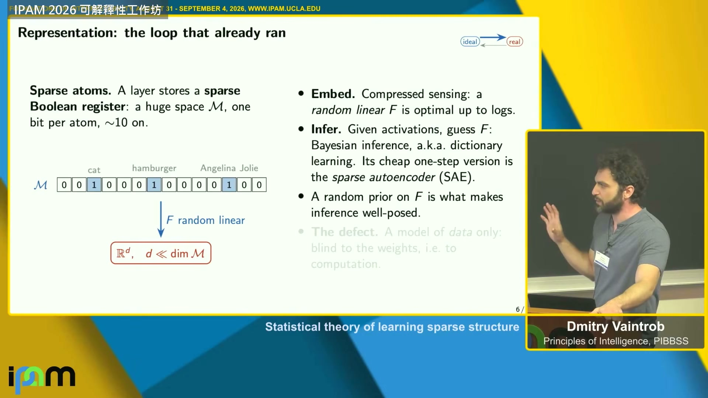

**逐字稿片段：** First definition: what does a layer store? His idealization is the row on the left. It is an extremely long register, with one concept in each slot. A lit slot is 1. The concept lit here is cat, then hamburger, then Angelina Jolie. Each slot is called an atom, what people usually call a feature. The meaning of sparse is written in the title line. There are hundreds of millions of slots, but only about 10 are active at any moment. Next comes the Embed arrow on the right. This extremely long string is compressed into a d-dimensional space by a random linear map F. Here, d is much smaller than the number of slots. Because the string is sparse enough, it can still be recovered after compression. That is an established theorem from compressed sensing. He uses the brain to explain why sparsity is a reasonable assumption. And I'll explain how, so in neuroscience, one of the things that neuroscience studies is people and people's brains. And your brain has the capacity to represent probably tens of, or hundreds of millions of concepts. But unlike the Boolean number on your computer, which will have about as many registers on as off, if you freeze your brain at a given moment, you will not be thinking about even a million concepts. You're probably gonna be thinking about at most 10 concepts. So you're going to have 10 active registers out of this hundred million length string. And so this idealization is called sparse data. It's information theoretically much more efficient. It can be represented much more efficiently. Of course, it carries much less information than a dense string. The Infer arrow goes in the opposite direction. Given the compressed vector, infer which slots were active. A sparse autoencoder, or SAE, is the cheapest way to do that. The final line points out the model's limitation. It is only a model of the data. It tells us what a layer stores, but it cannot see the weights. So it cannot see the computation either. The computation side needs to fill that gap. The approach is the same: begin with an idealization. Second definition: a circuit. On this slide, he has two registers, one for input and one for output, with a Boolean circuit C between them. It rewrites the top row of zeros and ones into the bottom row. A circuit is made of just four kinds of gates: AND, OR, NOT, and identity, which simply copies the value through unchanged. Look at the example in the diagram. Input slots 2 and 4 are both 1. They enter an AND gate together. It outputs 1 only when both are active, and writes that to output slot 1. Slot 4 is also copied through an identity gate to output slot 4. Slots 5 and 7 enter an OR gate. It outputs 1 if either one is active, and writes that to slot 6. The output row is sparse too, with only three active slots. The final line defines the scope. Throughout the talk, he considers only a single fully connected layer, an MLP. One layer means first multiplying by a weight matrix W, then applying a nonlinearity to each coordinate separately. He calls this layer phi W. With the definitions in place, listen to how he motivates this model. And the way you are supposed to build a model is to start with an idealization. And my idealization of computation is going to be, again, Boolean. I'm going to keep the assumption from before that the data is sparse. And I'm going to introduce, let's see if I can get this here, a new piece of complexity. This is gonna be very fun for people who have done algebra or category theory, which is that I'm going to introduce an arrow. So, remember, the idealization part is this top row. And the new idealization that I'm going to introduce when looking for circuits is a pair of two spaces. I'm gonna assume they have the same dimension, with sparse Boolean data and an arrow between them. And the arrow, again, I'm not going to be original. I'm just gonna assume that this is a Boolean circuit. So, this is, again, my very naive, very stupid guess of what a neural network does. It's secretly applying a Boolean circuit. So, a Boolean circuit has various gates, which are ands, ors, identities. There's many different formalizations. Each one has finitely many gates. I'm gonna maybe use a slightly different one later in the talk. Um, and, um, And I'm going to now be a bad theorist and say, okay, I just believe that this is everything that the model does, secretly, in the platonic realm. And now my next step as a bad theorist is to force this model into reality. And here we hit our first snag. It was very easy to force a sparse feature model into reality. You just linearly map it. But if you have done some kind of category theory or algebra, you will notice that if we just choose a pair of random maps, and try to push some circuit down to a lower dimensional space, we'll probably just fail, because we need to make this diagram commutative, or commutative up to maybe some error. The commuting diagram he refers to is this square. The top row is the ideal world: two sparse registers, with the Boolean circuit C between them. The two downward arrows, F and F prime, randomly compress the registers into d-dimensional spaces. Just as on the representation side, random maps are enough. The red arrow along the bottom has a question mark. That is the actual network layer, phi W. The equation in the center says the square must commute. Going across the top and then down should match going down first and then across the bottom. The two routes may differ only by a small error. The question is whether such a W exists. The right side shows the difficulty: the number of register slots is far greater than the dimension. He starts by counting bits on the board, using two conventions. All logarithmic factors are ignored. Even a 64-bit number counts as a logarithmic factor. And in this case, we can count how many bits do we need to describe a circuit. And so the bit count to describe a circuit is, well, remember a circuit is sort of flat. For example, every gate here, every Boolean register here, can receive at most one input. It's fan in one. So a circuit has size big M, so this dimension. So again, up to log factors, this means that the information contained in a circuit is M. There are some questions about collisions, redundancies. These are minor. So there are roughly 2 to the M different circuits. Or you need M bits of information for a circuit. So different circuits have to map to different weight maps. But how many weight maps do we have? Well, we have only a bounded number of weight maps. And so the free parameter here is the weight W. So this weight scales quadratically. So here, M information units or nats. And here, we have d squared information units or nats. And since this map had better be an injection, this gives us an inequality,

**話題推測：** 解釋'層儲存什麼'的第一個定義，搭配示意圖展示寄存器與原子概念。

---

## 00:09:13

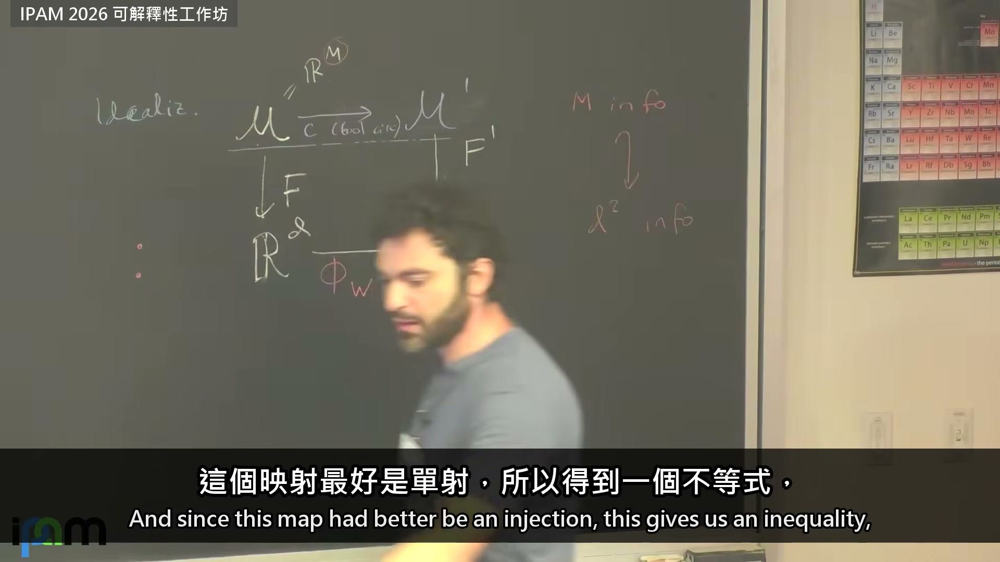

**逐字稿片段：** which is that this feature basis, or this memory register in idealization, has to be at most quadratic in the number of bits, in the number of residual stream dimensions. So this is, by the way, a much stronger condition than you have in compressed sensing, or in this question of whether you can compress sparse data, where there you can do exponentially or quasi-exponentially large dimensions. But here, we've suddenly realized something that was not obvious. And I think it may be even worth spending a little bit of time noticing that we can't actually have exponentially many. We can't have arbitrarily many features. There's some really hard information theoretic bound, if we're trying to do anything non-trivial with the features, on how many features we can have. And this bound is quadratic. So this is an impossibility result. Now, can we have a possibility result? So let's say that my dimension is much smaller than quadratic. Can I guarantee, or at least guarantee statistically, that I can push any circuit down to a map? And the answer turns out to be yes. And it's an interesting, somewhat non-trivial result. It was finished by Adler-Shavit. But the algorithm was invented in a paper by myself and my co-authors, Jake Mendel, Kaarel Hanni. A later version also had Lawrence Chan. So we had some bound there that had a slightly worse exponent. And the final version was proven later by these two mathematicians. So this is actually remarkable. This is saying that it's very easy to think of how we can take a circuit of size d and embed it as a neural net. You can just have every, maybe, pair of weights do some silly compare, take the max, apply a gate. But it's somewhat non-trivial that you can compress this much, much further at the cost of creating a little bit of what's called interference or noise, kind of error. But up to a very manageable, genuinely, up to low probability manageable error, you can compress computation.

**話題推測：** 展示核心數學不等式 M <= d^2 的投影片，指出特徵數量限制。

---

## 00:11:43

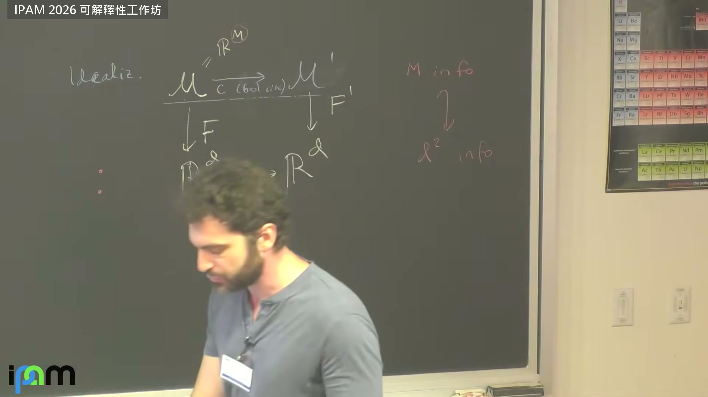

**逐字稿片段：** So this is a field that has emerged from this work, that's called computation in superposition.

**話題推測：** 介紹新興領域'疊加計算'（computation in superposition）的投影片。

---

## 00:11:52

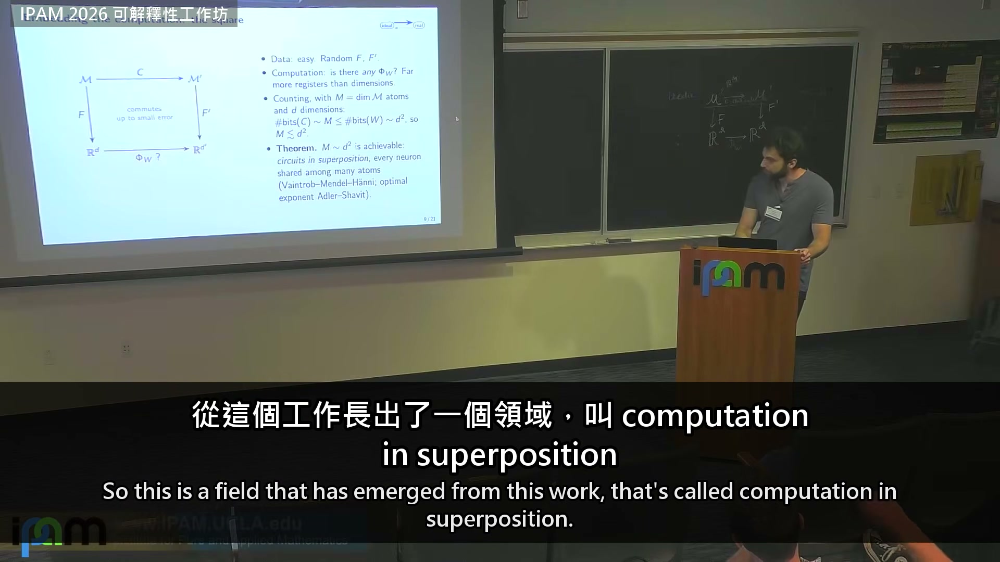

**逐字稿片段：** Here is his bit count, written as the line on the slide. Assume the circuit is flat. Each slot receives at most one input, and the width is M. M is the number of slots in the register, which is also the number of features. Describing one circuit takes M bits. The weights in one layer form a d by d array of numbers, so they contain roughly d squared bits. Different circuits must map to different weights. Therefore, M can be at most on the order of d squared. That is the impossibility half. The theorem gives the possibility half. M on the order of d squared really is achievable. The method is called circuits in superposition. Each neuron is shared by many atoms. That final term he uses, superposition, means exactly this in this talk: there are far more features than neurons, and every neuron works for many features at once. The cost is a little noise from mutual interference. So far, this proves only existence. Some hand-built W can do it. But the existence of such a W does not mean training will produce it on its own. Here is how he puts it. Okay. So okay, there exists a map. if, if we, if we wanna make this, But if we want to start inverting this, it's not enough to prove existence. And we can maybe have some kind of a really hand-generated construction, which is what we have in our paper and others. I think they use a similar one to the one in our paper, and they prove better bounds on it. But there's some manual construction, and there's absolutely no reason to expect that this is a natural, correct thing to do. You could do something really stupid, and then probably your modeling loop will lead you nowhere. So we want both a way of compressing this computation that's somehow more natural, and also we want a way that gives us something that works well as a prior. So we want a probability distribution.

**話題推測：** 總結位元計數結果的投影片。

---

## 00:13:37

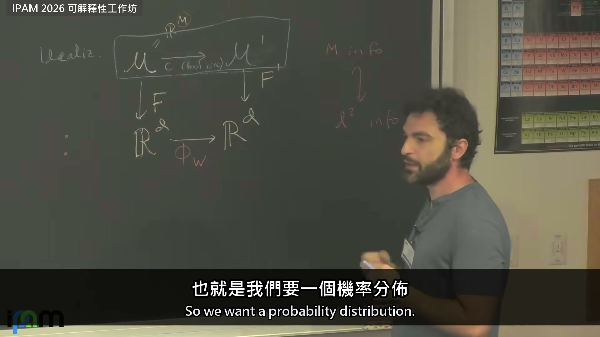

**逐字稿片段：** What he wants is not a construction, but a probability distribution. This slide explains why and defines the prior along the way. Inference works on the representation side because the prior assumes a random F. When we see the compressed vector, we have some idea of what F looks like, so we can infer which slots were active. On the computation side, what we need to infer is the network layer itself. The slide makes this point emphatically: The weights are not evidence of the computation. The weights are the computation. So the prior here asks: given a circuit C, what is the distribution of W produced by training? This is written as P of W given C. A hand-built construction cannot give us that distribution. It gives one specific W, not the W that training would find. How does he define this distribution? His answer is: learn W. And one of the things that mathematicians should internalize is that all maps in statistics are invertible. And so basically, if this map were to point the opposite direction, then there's actually a natural thing that we can do, a natural way we can generate this map, which is to learn it. Based on the training signal from the composed map. And this is exactly what we do.

**話題推測：** 解釋目標是尋找機率分佈而非單一建構的投影片。

---

## 00:14:40

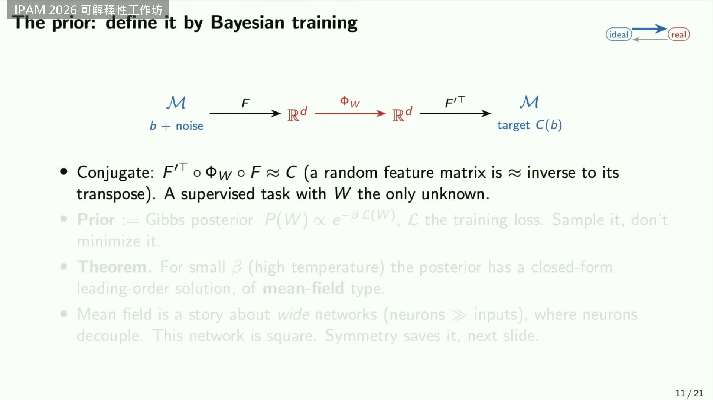

**逐字稿片段：** And so this defines a task, and a very nice and natural way to make a task a probability distribution is instead of looking at gradient descent, which finds a local minimum, think about the Boltzmann distribution. So think about some Langevin descent or some kind of theoretical physical energy defined by a loss. And so we're looking at some distribution on these nonlinear mappings phi W, which is trying to fit, in a physics sense, this wrong-way composition defined by our circuit. So this gives us a loss. And the miracle, or maybe a surprising fact, is that this Bayesian distribution can be theoretically solved to leading order, completely solved. And the solution is mean field theory.

**話題推測：** 引入波茲曼分佈來學習權重W的投影片，解釋如何將訓練任務轉化為機率分佈。

---

## 00:15:45

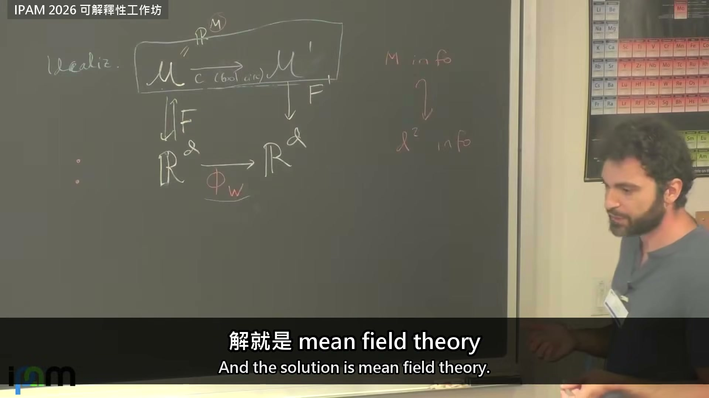

**逐字稿片段：** What he says aloud is summarized neatly on the slide. The top line defines the task: add some noise to the register, map it down with F, pass it through the layer phi W, then map it back up to the register using the transpose of F. The result should equal the output of circuit C. For a random matrix, the transpose acts approximately like its inverse. So this is a supervised learning task with W as the only unknown. Its loss is called L. The second line is the definition. The prior is defined as the Gibbs distribution for this task. The probability of W is proportional to e raised to negative beta L. In physics, this is called the Boltzmann distribution. It is the same equation. Beta is inverse temperature. The larger beta is, the more probability concentrates around the W values with the lowest loss. When beta is smaller, W values with slightly higher loss get some probability too. He emphasizes that this requires sampling, not minimization.

**話題推測：** 總結任務定義和Gibbs分佈的投影片。

---

## 00:16:25

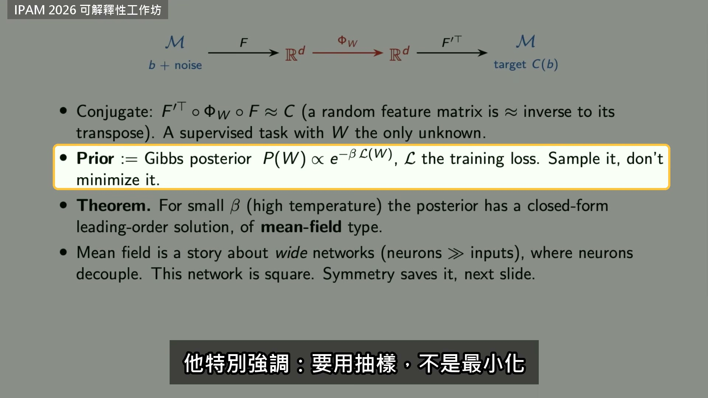

**逐字稿片段：** Here is a picture of the difference. Imagine W as a point on the horizontal axis, with loss on the vertical axis. The curve has a valley. Minimization, meaning ordinary gradient descent, is like a ball rolling to the bottom and stopping at one W. Sampling means scattering many balls along the curve. Their density follows e raised to negative beta L. They are densest at the bottom, still present on the walls, and sparser higher up. Large beta means low temperature. Almost all the balls crowd around the bottom. Small beta means high temperature, so the balls spread out. The prior he wants is the distribution of this entire cloud of balls, not the single ball at the bottom. The third line is the theorem. Assume the task defined above, along with small beta, meaning high temperature. Then this distribution has a closed-form leading-order solution. It takes the form of mean field theory. The fourth line explains what mean field means. When a network is wide enough, there are so many neurons that they decouple from one another. Each neuron feels only the average effect of all the others. That makes the entire distribution calculable. But this network is square, not wide. He recovers the result using symmetry. He says he has no time for that step, so we will skip it too.

**話題推測：** 圖示比較最小化（梯度下降）與採樣（波茲曼分佈）的差異。

---

## 00:17:17

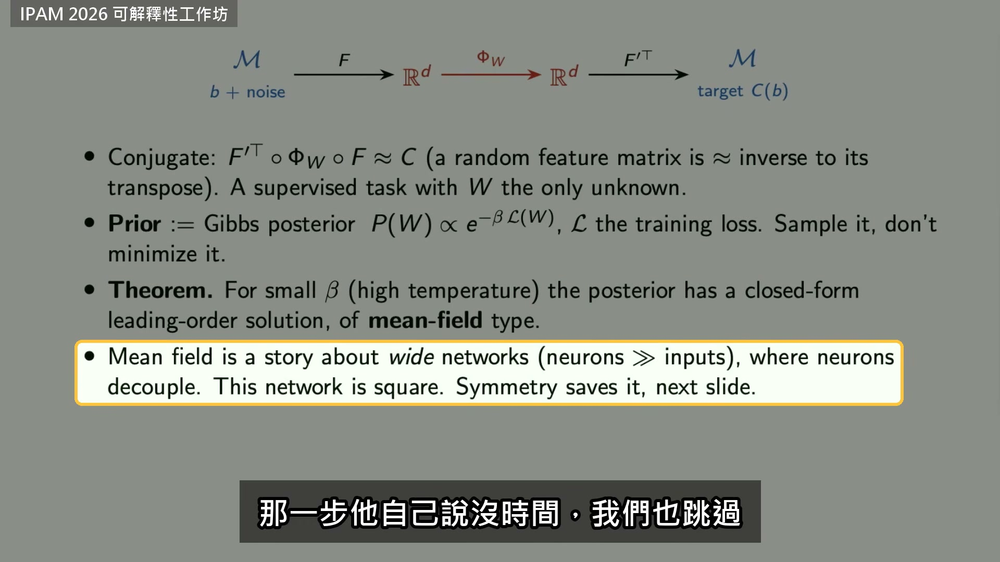

**逐字稿片段：** For his example, he chooses the cleanest possible case. Circuit C is the identity. Whatever goes in comes back out, with the noise removed. And yeah, so because I don't have time, I'm going to skip through the technical details. But I'm going to show you the picture. So this is the black line is the, so I'm training a square neural network on exactly this task. So in this case, I'm actually training it, I'm cheating. I'm training it on a task where the top map is the identity. But it turns out that actually the identity theoretically contains all of the structure. In fact, understanding how, so let's maybe think for a minute. If this map is the identity, then to leading order, I'm not going to tell, there's many different scales here. But I'm going to claim that to leading order, where here we're also trying to learn a map that is trying to be as close to the identity from here to here. But when we do this compression, we're introducing noise. So the learning of any map turns out to be equivalent to a denoising autoencoder on this memory register sparse space. Again, I'm not going to carefully defend this. And so denoising is somehow the main interesting step in both Adler and Shavit's, and in our paper. And again, there are finitely many circuits. There are four types of circuits, and every type of circuit will have exactly the same physics, just with slightly more parameters as the identity. So once we understand the identity as a nice principled mathematical problem, we understand all circuits. And so for the identity circuit, we can again write essentially a closed form prediction. This is the black line. We can then just do learning. So here I'm doing Bayesian learning, based on exactly this square model, and we get a very good fit. There's somehow lower order corrections that are quite significant that I'm ignoring. But this is remarkably, because of symmetry arguments, a theory that we can fully predict. And the theory predicts this kind of tail structure where there is a big bulk of very small neurons that don't read the feature at all. So maybe it's maybe not clear what this graph is, but this is, up to symmetry in some sense, the content of the network.

**話題推測：** 介紹恆等電路作為分析範例的投影片。

---

## 00:19:45

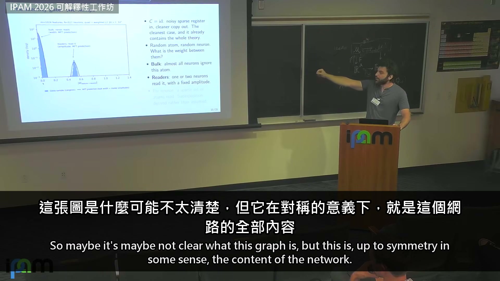

**逐字稿片段：** This plot is the theorem's prediction. Let us pause and look at it. The horizontal axis is the magnitude of the weight between one feature and one neuron. The vertical axis is density, on a logarithmic scale. Blue shows samples drawn from the Gibbs distribution. The black line is the prediction from mean field theory. They match. The tall, narrow peak pressed against 0 on the left is what he calls the bulk. Almost all neurons ignore this feature. Their weights are close to 0, and the theory predicts the width of that peak. The short peak near 0.5 on the right contains the readers. Only one or two neurons read the feature, at a fixed strength. The theory predicts that too. Conversely, look at each neuron, and it reads only a small number of atoms. The final line gives the answer in the title. Superposition is derived, not assumed. The small text above gives the setup. There are 1,024 features packed into 512 neurons. That is twice as many features as neurons, yet this shape still emerges. Now return to the question from the beginning. How many neurons read one concept? The answer is one or two. All the others ignore it completely.

**話題推測：** 展示理論預測圖表，顯示神經元權重分佈的雙峰結構（大量接近零的權重與少量活躍權重）。

---

## 00:20:36

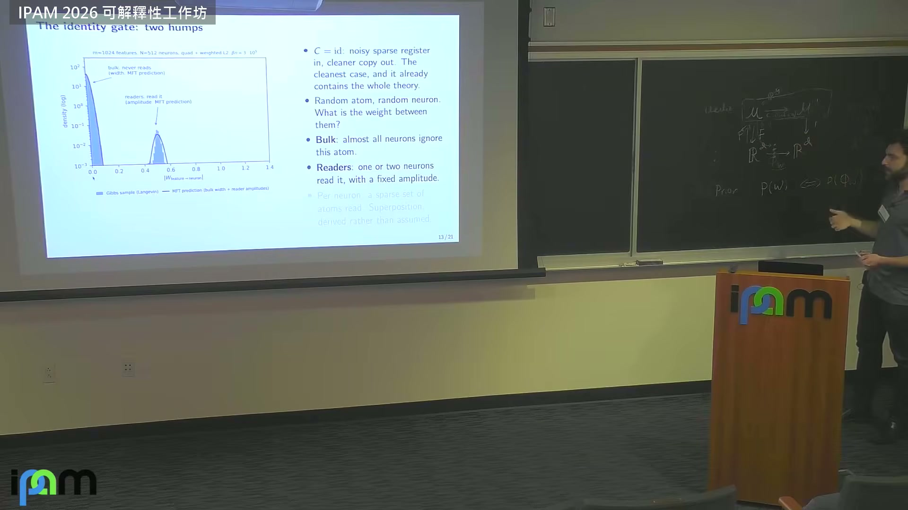

**逐字稿片段：** And of course, this is an extremely stupid model. As I was saying at the beginning, most models are wrong. It's stupid because it thinks that the computation is Boolean. Probably computations are continuous. It's stupid because it assumes everything is embedded randomly, that the different circuits, the different components of this computation are equally important, contribute equally to the loss. It imposes some specific type of loss of how important is signal in the big coordinates compared to signal in the small coordinates. But modulo all of these stupid wrong things, this is a model. And now, given this model, the next step that we can do is we can do inference. And so inference is a hard problem. I'm not going to do it. I told you that I'm not going to fully solve the problem of what is a circuit. But I'm going to say that, oh yeah, here this is a slide that if we do direct training with Adam instead of this Bayesian Langevin training, we actually get the same picture except with a different tail. I don't have an explanation for this, but it's very consistently about twice as far. But okay, so we have this one arrow. We would like to infer; we don't have this. But already, the fact that we have an embedding, we can start inferring small things.

**話題推測：** 總結模型限制與假設的投影片。

---

## 00:22:01

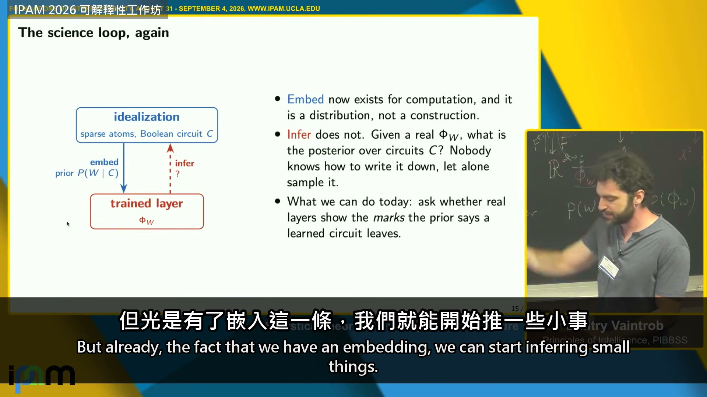

**逐字稿片段：** I'm going to say two things and then end, that the inference predicts, that have not previously been measured. They're not very hard, but they haven't been measured because nobody has, I don't know, tried to really engage with this model. And they both turn out to be true when we measure them for GPT-2 small, also for GPT-2. The first one is that if you remember this two-hump structure for the neurons, what this implies is that if I take a single feature, so a single coordinate of this sparse space, then it's going to be sparse in the neuron basis. And this might seem not surprising, because aren't features selected to be sparse? But actually, no. Features are selected to be sparse compared to data. But they don't know anything about the basis, other than the fact that they're computed through this nonlinearity. A priori, you can rotate everything from the compressed sensing point of view, and it would make this basis white. So it would make this isotropic. So the fact that it's not isotropic means that actually features are, in fact, interacting with computation, that they're orienting towards neurons in a particular way that's compatible. That's exactly what we predict if they're going through a circuit, a particular denoising circuit. And this is surprising. Nobody has measured this before. And the kurtosis is very large. I'm surprised that nobody has measured this before. Excess kurtosis is over 2. And the second thing that you can do is you can say, well, okay, all of these models, whether it's just identity or it's some neural network, we have to do something nonlinear to denoise. A priori, if we do any computation, it's going to introduce noise due to this superposition, due to interference. We have to do something to denoise. And there's a particular signature in signal processing of what a denoising process looks like, which is called the noise gate. And so it's a gate that suppresses very low coordinates, very low elements in a particular channel, in a particular important direction, because it thinks they're noise. And it enhances elements that are high in this channel, because it thinks they're signal, and the signal needs to be propagated, because that's what's useful. It needs to be preserved. And so we can measure how much it propagates or amplifies signal to noise. And this measurement is, again, extremely strong for features, like thousands of times stronger than for a random vector, also significantly stronger than for a random data point. So these are two predictions that we can see just immediately if we start thinking in this paradigm. More predictions are hard. In fact, I thought a lot about predictions. For example, what would gates predict? There is some structure that I have in an appendix, but it's more iffy. So this picture is very much not complete, and the best inference is still not known. But I hope that this is enough to show you that this is an interesting story. This is a story worth developing, and this is a story with links to maybe interesting math and physics. So that's it.

**話題推測：** 介紹兩個先前未被測量但在GPT-2中得到驗證的預測投影片。

---

## 00:25:05

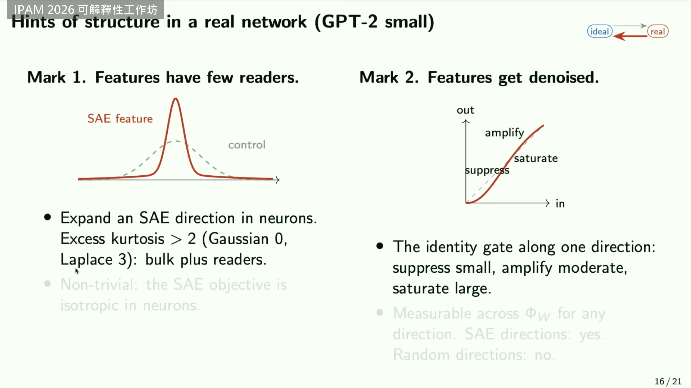

**逐字稿片段：** There is one plot for each of the two signatures. Both follow from those two peaks. On the left, take the direction of one SAE feature and spread it across the neurons. Then see how much of it falls on each neuron. The red curve is a real feature. Most neurons cluster near 0, while a small number have large values. That is the bulk plus the readers. The gray dashed line is the control, a broad bell curve. He measures excess kurtosis. A Gaussian distribution has a value of 0. A Laplace distribution has a value of 3, and this one is above 2. On the right, look at the relationship between this layer's input and output along one feature direction. Small values are suppressed, medium values are amplified, and large values saturate. This is a denoising gate. SAE directions have this shape. Random directions do not. Nobody had measured these two signatures before, because nobody had a model telling them what to measure.

**話題推測：** 展示兩張圖表，具體呈現GPT-2中測量到的兩個特徵簽名。

---

## 00:25:44

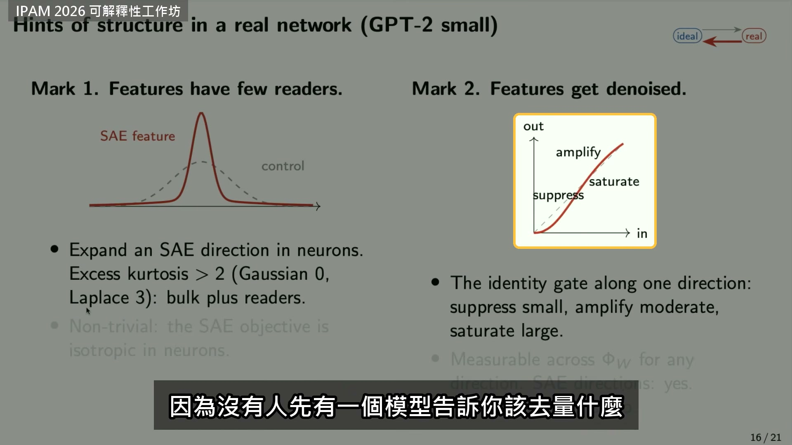

**逐字稿片段：** Finally, here is what remains unproven. First, the inference arrow: given a real network, what is the distribution over circuits? The slide states it plainly. Nobody knows how to write it down. Second, train directly with Adam. The plot has the same shape, but the readers are twice as strong. He says he has no explanation for that. Third, mean field theory only solves the leading order. He admits that the lower-order corrections are actually substantial. Fourth, there are assumptions imposed purely to make the problem tractable. Computation is Boolean, and the embeddings are random. Every circuit is equally important, and the loss has one specific form. The temperature must be high, and only one MLP layer is considered. Fifth, the two signatures in GPT-2 were measured and do match. That is evidence, not proof that GPT-2 is actually running Boolean circuits. His own conclusion is that this picture is nowhere near complete.

**話題推測：** 列出'尚待證明'事項的投影片。

---

## 00:26:23

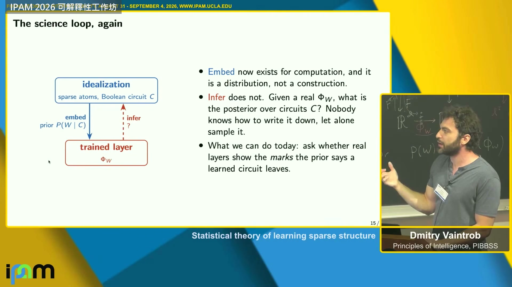

**逐字稿片段：** The entire talk comes down to this slide. Start with an absurdly crude model: a network layer is secretly running a Boolean circuit. Counting bits tells us that the number of features can be at most the square of the dimension, still far more than the number of neurons. Write the weights produced by training as a Gibbs distribution. Mean field theory predicts two peaks. Each feature is read by only one or two neurons, and then it is denoised. So sparse structure is derived, not assumed. Both signatures can be measured in a real GPT-2 small. The top arrow on this slide is Embed. We now have it, and it is a distribution, not a single construction. The lower Infer arrow is still missing. The slide states it plainly: Nobody knows how to write it down. This loop is only halfway complete. Next up is Been Kim from Google DeepMind. Her very first line is: Part of the field of interpretability could be obsolete within a year. She tells two stories from her own experience. One is about a method she had championed for years until an intern punctured it with one observation. Trained and untrained networks produced exactly the same explanation diagrams.

**話題推測：** 演講總結投影片，回顧核心論點。

---

## 00:27:17

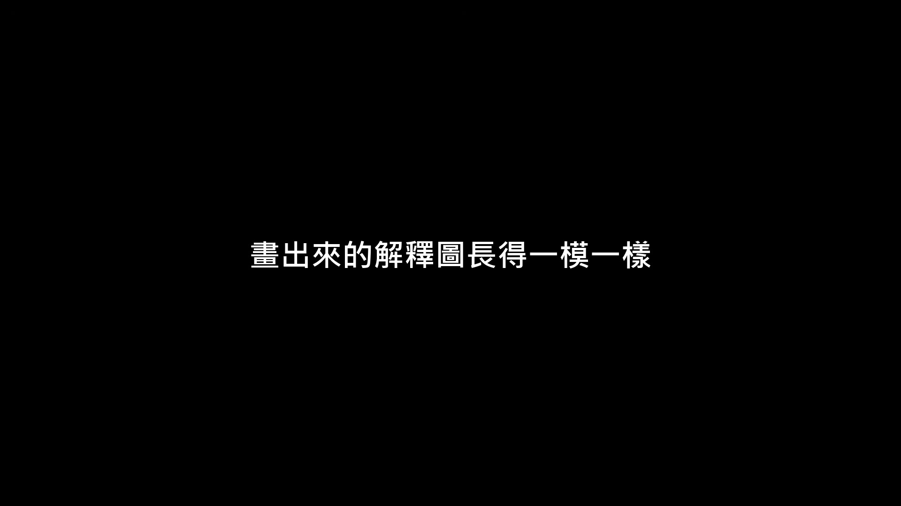

**逐字稿片段：** The other is about extracting a move from AlphaZero that humans had never seen, then teaching it to four grandmasters. One of them became world champion that same year. The original video is linked in the description. The full talk runs 47 minutes if you would like to hear more.

**話題推測：** Been Kim分享AlphaZero新棋步的具體故事或案例。

---
