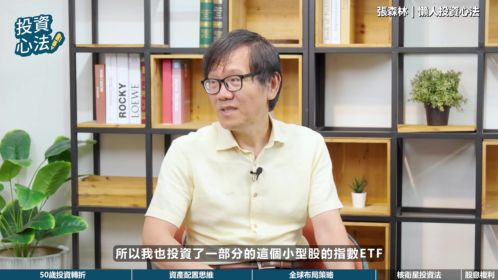

# fubonsec_1ENAGYabp4s — 關鍵畫面索引

- 來源逐字稿：[fubonsec_1ENAGYabp4s_FIN.srt](fubonsec_1ENAGYabp4s_FIN.srt)
- 影片：https://www.youtube.com/watch?v=1ENAGYabp4s
- 截圖數：17

## 00:00:09

**逐字稿片段：** 富邦振振 新戶優惠來囉 開戶急診500毛幣 完成指定任務再領200毛幣 加500手續費抵用金 還有西雲航空布拉格商務艙 雙人機票等你抽 心動不如行動 火速開戶做任務囉

**話題推測：** 富邦證券新戶優惠廣告，介紹開戶獎勵與抽獎活動。

---

## 00:00:25

**逐字稿片段：** 各位觀眾朋友大家好 我是Aya 今天來一邊有一段非常特別的經歷 他在50歲時 把過去的投資觀念打掉重鏈 是什麼原因讓他這麼做呢 今天我們特別邀請到 國立臺灣大學財務金融學系 專業教授張森林 帶我們瞭解他的歷程轉折 以及他所提倡的《懶人投資法》 江教授您好 哎呀好 各位觀眾大家好

**話題推測：** 主持人Aya開場，介紹本集來賓張森林教授及影片主題《懶人投資法》。

---

## 00:00:46

**逐字稿片段：** 教授您是國內頂尖的財務金融學者 但您曾經提過自己是在50歲時 才將投資觀念打掉重鏈 能不能跟我們分享 在美國進修時觀察到基金人理財的趨勢 以及看到90%主動基金跑輸大盤的結果 是如何徹底翻轉您過去對主動投資的看法呢 過去因為我忙於這個學術跟教學的研究 所以其實即使我是財經專業的 但是其實投資理財還是要做功課 要花一些時間去了解 那我覺得我過去犯了兩個錯誤 第一個就是說我投資的標的主要是以共同基金為主 然後個股為輔 那事實上共同基金的費用率比較高 而且它的長期投資績效 事實上是不如市場指數ETF的 可是因為就沒有花時間去特別研究 沒有注意到這個問題 第二個問題就是說 在挑選標的方面 我過去也犯了一個錯誤 就是比較傾向是聽理專的建議 或者是去看網路上有一些 大家的討論比較建議的投資標的 但是我發現這樣的一個選擇標的方式 其實是有問題的 因為其實熱門的標的 未來的績效並不代表說會比較好 那第二個問題是說 其實這些熱門標的 通常會在某一些時間 會特別集中於特定的國家或產業 那所以其實就是 簡單來講就是沒有 這個資產配置的這個概念 所以就會太偏頗 那可能造成風險過高 而且其實它的投資報酬率 也沒有比較好

**話題推測：** 主持人提問，關於張教授在50歲後改變投資觀念，特別是觀察到90%主動基金跑輸大盤的發現。

---

## 00:02:26

**逐字稿片段：** 2017年我到美國去進修的時候 我就發現說 在美國這個基線理財非常的受到歡迎 我就去仔細的研究一下為什麼 我就發現說其實基線理財的 基本的邏輯精神非常的簡單 首先它就是採用費用率比較低的 市場指數ETF作為它的投資工具 而不是用共同基金 因為市場指數ETF的費用率比較低 再來就是說基金它有什麼缺點 基金其實它長期的投資績效是落後市場指數ETF的 這個可以從那個標準普爾公司 他們長期都有在做研究 那他們研究結果就是發現說 在許多國家的股票市場都可以發現說 長期投資來講 這個90%以上的共同基金 它的績效都是落後市場的 基於這樣的發現 所以我就覺得說 原來我以前的工具其實是錯了 從這個基線理財的這個服務裡面我發現

**話題推測：** 張教授分享2017年在美國進修時發現的「基線理財」概念，及其第一個核心精神：採用低費用率的市場指數ETF。

---

## 00:03:22

**逐字稿片段：** 那第二個基線理財的核心精神是什麼 就是要做資產配置 這個也是我過去犯的錯誤 因為我過去可能在投資方面 比較沒有一個系統性 然後隨便亂買 就是可能看理專的建議 或是大家現在熱門的標的是什麼 可是這個基線理財強調的是說 做好資產配置 長期的投資績效會比較好 那第三個基線理財的核心精神 就是它不會去預測市場 那它會不會調整投資組合呢 會 它調整投資組合 主要就是按照資產配置的邏輯 所以如果說某一類的資產 或某一個區域的國家的股票 漲得特別多 那它的權重就偏離了中心的權重 那它就會賣掉一部分 這些漲得比較多的資產 然後去買進那些相對沒有漲 甚至下跌的資產 讓整個投資組合 重新又回覆到 適合投資人的資產配置的比例 所以我想就是 從這三個角度來看 就是我個人也去修正 我的這個投資的這個行為 那想再請問教授 據來說你50歲以後 是調整了哪些配置呢 在心態的調節與生活上 是否也因此改變了 是的 就是沉入我前面所講的 所以在50歲之後呢 我就開始把 第一個就是工具的選擇 做了一個改變 所以過去主要是以 共同基金為主 那後續呢 我就是主要是以市場指數ETF 作為我主要的投資工具 這是第一個改變 那第二個改變就是 我開始用資產配置的觀念 去選擇我的投資標的 那資產配置當然就是要做到 資產種類分散跟投資區域分散 所以在資產種類分散來講的話 我就會挑選像股票 債券 不動產證券的ETF 那在區域分散 當然就是會去挑選重要的國家的資產 比如說美國 日本 歐洲 美國我會挑選S&P500指數ETF 然後日本的話就是日金25指數ETF 那歐洲當然有歐洲股價指數ETF 當然我們臺灣也是很重要 因為我們是臺灣人 那我們的資產配置不能全部都配置在國外 所以臺灣我當然就是用臺灣50的指數ETF 所以這樣就可以做到區域分散 所以主要就是透過這個 就是開始仿效機器人理財的 這個投資的方式去做資產配置 那這樣做的好處是什麼 我就有一個定海神針 在投資方面 其實最怕的就是說 你不知道你的投資目標是什麼 你的方法 你的哲學是什麼 以前我們財務的訓練裡面 就告訴我們資產配置的重要性 那只是說自己實際上在運用的時候 也確實就是輕忽了他的重要性 然後就是覺得說好像我可以打敗市場 其實會想要主動去偏離這個資產配置 最重要的原因就是貪心 就是說你覺得說 我自己是財經方面的訓練 我應該有機會可以打敗市場 可是事實上要打敗市場的報酬率真的很難 我們剛剛前面也提到過 像這個標準普爾公司的研究 為什麼這麼多的專家 共同基金的經理人 每一個都是財務專家 而且他們花了很多時間去 做資產的挑選 個股的挑選 可是他還是很難打敗市場的報酬率

**話題推測：** 張教授說明「基線理財」的第二個核心精神：資產配置。

---

## 00:07:01

**逐字稿片段：** 我就這樣再統整一下 我就發現說 好那以後既然沒有辦法打敗市場 那我就是接受市場的報酬率 然後就是做市場指數的投資 我想這個心態上的改變很重要 所以過去有時候我在臉書上看到 看到有一些人在分享他的投資績效特別的好 以前我很羨慕我覺得有為者亦若是 尤其我自己是財經專業的 可是現在我看到那些人家的Poll我完全都沒有感覺 因為我會覺得說他不過可能就是運氣好 或者是說他Poll的部分 其實他只Poll他績效比較好的賺的特別多的標的 投資績效不好的他就不會Poll 所以我現在不會去羨慕別人因為我就是接受市場報酬率做好資產配置 那這樣 這樣其實生活上也過得比較easy 就沒有什麼壓力 我的觀念還是說 其實你過去買的資產 除非你覺得他未來的績效不會特別好 不然的話其實不需要特別主動去處理 所以那些共同基金 我大部分其實還是都有留著 那可是如果我有需要用到錢的時候 我會優先賣掉這些主動式的基金

**話題推測：** 張教授總結其心態上的轉變，接受無法打敗市場的現實，轉向市場指數投資。

---

## 00:08:07

**逐字稿片段：** 教授您剛提到就是要分散嘛 那對一般臺灣投資人來說 您建議臺股與全球股市的比重 以及股債的黃金比例是多少呢 那另外在股的配置當中 除了市值型的 ETF 之外 高股息啊 或是像主題型的 ETF 也會納入您的配置來增加收益嗎

**話題推測：** 主持人提問關於臺灣投資人臺股與全球股市、股債的黃金比例，以及高股息、主題型ETF的配置建議。

---

## 00:08:29

**逐字稿片段：** 我們蠻強調就是說 在做資產配置一定要區域分散 那尤其是要考慮地緣政治的這個風險 因為我們臺灣是一個比較小的國家 而且又有 這個兩岸的這個比較緊張的這個局勢 所以萬一發生這個地緣政治的風險 其實這個對臺灣投資人的傷害是很大的 我想俄烏戰爭發生的 如果你是一個俄羅斯人 或烏克蘭的這個投資人 都集中在本國的資產的話 那我想這個受到的傷害一定很重的

**話題推測：** 張教授強調區域分散的重要性，尤其考量臺灣的地緣政治風險，並以俄烏戰爭為例。

---

## 00:08:59

**逐字稿片段：** 所以我在過去有一些節目中 就會提到我自己當時的配置的比例 大概是臺灣佔兩成 國外佔三成 不過這幾年因為臺股的表現特別的好 所以我那些臺股的權重就會慢慢增加 目前大概有增加到三成左右 那不過還是以這個世界分散的比例 還是比較高 因為我覺得就是主要就是 基於這個地緣政治風險的考量 所以有必要這樣去做 那至於說這個有沒有什麼黃金比例 其實沒有 因為就看每個人的偏好 因為有些人他覺得說臺股這麼強 那為什麼我臺股的配置的比重 不可以超過國外呢 我覺得也是可以 只是說你就要考慮 你可不可以接受這樣的地緣政治的風險 我寧願少賺一點 但是我更分散 我更會更安心

**話題推測：** 張教授分享他個人在臺股與國外股市的配置比例（初期2成臺灣，3成國外，後因臺股表現調整至3成臺灣）。

---

## 00:09:48

**逐字稿片段：** 那在股債的這個投資比例來講 也是同樣的 其實也不存在所謂的股債的黃金比例 其實股票跟債券的配置比例 主要的決定因素就是 投資人自己的這個風險偏好 以及他的年齡 通常來講 就是接近退休的年齡 然後又是比較保守的投資人 他的債券的投資比例 會超過股票的這個配置的比例 那如果是年輕人或者是比較積極的投資人 那他的股票的這個比例就會比較高 如果你是一個年輕人 其實還是建議說股票的這個比例要超過債券比例 因為這個投資期間很長 那如果你就是債券的比例太高的話 其實績效一定不會太好 因為長期投資來講 這個股票的報酬率是遠勝過這個債券的報酬率

**話題推測：** 張教授說明股債配置沒有黃金比例，主要取決於投資人的風險偏好和年齡。

---

## 00:10:38

**逐字稿片段：** 除了這個市值型的ETF之外呢 我的其他另類的這個資產的配置呢 我不會考慮高股息的這個ETF 原因是因為從過去歷史資料來看 其實高股息的這個指數ETF 它的這個長期的投資報酬率 並不如這個市值型的這個ETF 所以我不會配置它 因為其實就投資來講 我們應該追求的還是長期投資報酬率 是一個主要的目標 那配息的需求我就反而是次要的 而且配息有可能被課稅 或者是被課補中間保費等等的 所以我對它是沒有偏好的

**話題推測：** 張教授說明他不考慮配置高股息ETF的原因，認為其長期報酬率不如市值型ETF。

---

## 00:11:15

**逐字稿片段：** 基於同樣的理由 就是說如果我們要追求長期報酬率極大化的話 那我會考慮一些 比如說像受惠於科技的發展 AI的發展的這些指數ETF 比如說NASDAQ100指數的ETF 或者是沸塵半導體指數ETF 這些產業它是比較是代表科技業 然後也受惠於AI的發展 那另外過去的這個資料也顯示說 這個小型股的表現會比較好 會比大型股好 所以我也投資了一部分的 這個小型股的指數ETF

**話題推測：** 張教授說明他會考慮配置的另類資產，如受益於科技（AI）發展的指數ETF（如NASDAQ100、費半指數）及小型股ETF。

---

## 00:11:50

**逐字稿片段：** 教授您曾經提倡過這個懶人投資法 是8比2的核心衛星策略 能不能為我們解釋 為什麼要80%的核心部位放在定期定額 而20%的核心部位要留作逢低加碼 那我們又要如何遵守這個 政經制塔新法的逢低加碼紀律呢

**話題推測：** 主持人提問關於張教授提倡的「懶人投資法」：8比2核心衛星策略中，80%核心定期定額與20%衛星逢低加碼的邏輯。

---

## 00:12:11

**逐字稿片段：** 其實我的核心配置就是前面提到的 這個資產配置的這個投資組合 對所以那裡面就是股債 會做一些均衡的配置 然後區域也分散 那我常常把它形容 他就像一艘航空母艦一樣 雖然航空母艦跑的不會特別的快 可是他非常的穩定 所以我覺得投資還是要 這個核心的精神還是不能背離的 所以最重要的資產配置 會佔我的80%

**話題推測：** 張教授解釋80%核心配置，比喻為航空母艦，追求穩定且均衡的資產配置。

---

## 00:12:40

**逐字稿片段：** 那衛星配置就是像我剛剛提到的 這些科技指數的ETF 或者是小型股的指數ETF 這是我的衛星配置 那衛星配置 其實我有做定期定額 但金額放的比較少 那另外我還會採用 低檔自動加碼的功能 因為現在因為金融科技的發展 所以很多的券商或者基金平臺 它都有提供低檔自動加碼的功能 或者是說你可以下這個長期有效單 例如我自己就會利用這個長期有效單 去捕捉這個市場下跌的這個趨勢 然後就是買進更多的單位數 比如說現在如果有一檔ETF 它的價格是100塊 那我就會下90天的這個有效單 在90天內呢 它如果價格有跌到這個90塊呢 我就會多買一張 那如果跌到85塊呢 我就會多買兩張 那跌到80塊呢 我就會多買三張 那剛好這樣的一個投資心法 就是符合這個坊間所謂的 正經制塔的這個投資方法 但是我並沒有特別去研究這方面的 我只是純粹就是覺得說 既然市場打了九折 或八五折甚至八折 那你為什麼不多買一點 我就是用這樣的方式去 在低檔的時候 比較勇敢的去增加我的部位 前提就是說 你對這個標的是有信心的 那我剛剛提到 其實即使是這些衛星的 這個標的 其實他們長期的績效 其實反而是好的 只是說他不是市值型的 所以他不是主流的產品 不適合說配置太多 對但是他如果價格特別低的時候 我是覺得說特別值得去 增加部位 之後想請教教授

**話題推測：** 張教授解釋20%衛星配置如何利用金融科技，透過低檔自動加碼或長期有效單（如金字塔式買進）進行操作，並舉例具體價格策略。

---

## 00:14:24

**逐字稿片段：** 面對最近儲權息的旺季 您會建議投資人在領到股息之後 直接投入股市 來持續累積被動收入嗎 股息要不要再做投入 我覺得是因人而異 不過如果是以退休規劃為目的的話 因為你還沒有進入退休期 那事實上這個股息呢 你把它花掉是很浪費的 因為你就沒有辦法享受這個 長期的這個資本利的 所以我會鼓勵說 如果是以退休為目的的 這個投資理財的話 你的股息應該再投入 然後可以增加你這個 長期投資的效益 然後累積更多的退休財富 感謝教授今天精彩的分享 正如同教授提到的 將股息再投入原本的投資標的 就有機會透過長期複利放大整體的報酬

**話題推測：** 主持人提問關於除權息旺季，是否建議投資人將股息再投入股市。

---

## 00:15:07

**逐字稿片段：** 如果熒幕前的投資人也想在初全息旺季 透過股息再投入擴大投資本金 歡迎加入富邦AI Pro 點選談美股定期定額 點選看張五 就能一鍵開啟股息再投入功能 輕鬆打造長期成長的投資策略 一起累積更多潛在收益 最後喜歡我們的影片也不要忘記 訂閱按贊開啟小鈴鐺 我們下集再見 拜拜

**話題推測：** 節目結尾，推薦富邦AI Pro的股息再投入功能廣告。

---
