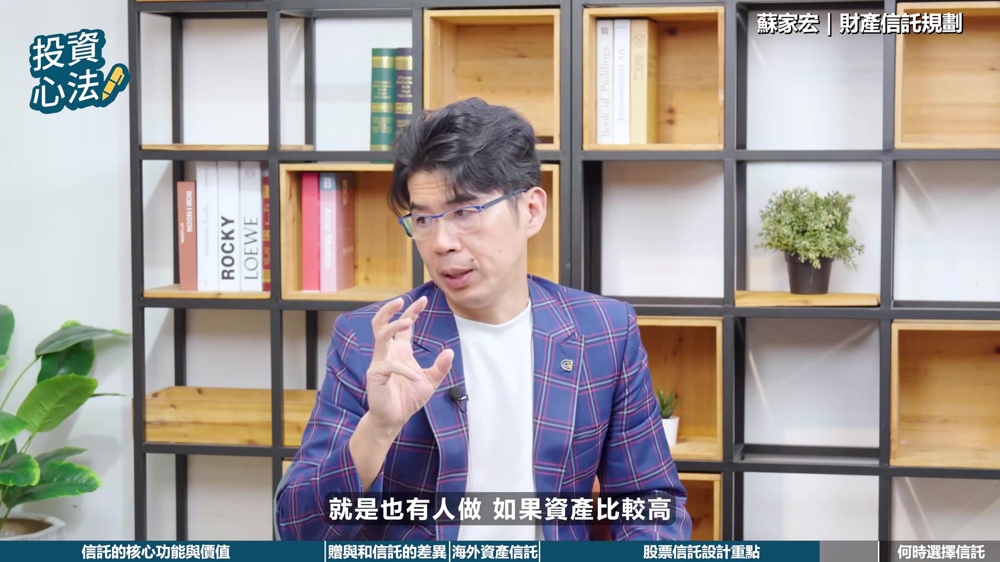

# fubonsec_324i3yZuBLo — 關鍵畫面索引

- 來源逐字稿：[fubonsec_324i3yZuBLo_FIN.srt](fubonsec_324i3yZuBLo_FIN.srt)
- 影片：https://www.youtube.com/watch?v=324i3yZuBLo
- 截圖數：10

## 00:00:19

**逐字稿片段：** 富邦證證新戶優惠來囉 開戶急證500摩比 完成指定任務再領200摩比 加500手續費的佣金 還有新宇航空布拉格商務艙 雙人機票等你抽 心動不如行動 火速開戶做任務囉

**話題推測：** 開始進入廣告時間，介紹富邦證券新戶優惠。

---

## 00:00:35

**逐字稿片段：** Hi 大家好我是 Sabrina 在前兩集的節目中 有提到信託這個工具 今天這集我們就來把 它的概念來講清楚 可能很多人會覺得 那是億萬富豪才需要的資產配置 或者覺得那是為很遙遠的未來 做決定 現在做好像太早了一點 今天同樣歡迎 在財富傳承家庭法律領域的專家 恩典律師事務所的所長

**話題推測：** 主持人Sabrina開場，介紹本集主題。

---

## 00:00:59

**逐字稿片段：** 蘇家宏律師來和我們聊聊 蘇律師您好 Supreme好 大家好 好 我們就直接打破 大家的心理抗拒 從制度的本質來看 信託到底是做什麼樣的事情呢 問大家一下 請問如果你要去上班的情況下 你希望去到一間 有制度的公司上班 還是一個看老闆的臉色 老闆叫你做這個 就做這個 做那個 你覺得你要到哪個地方上班 制度 有制度嘛 有制度看怎麼做怎麼做 都會照著這個制度走 而不是老闆高興怎麼做就怎麼做 我覺得上班這樣 因為我想問你

**話題推測：** 介紹本集來賓，恩典律師事務所蘇家宏律師。

---

## 00:01:38

**逐字稿片段：** 如果你教育小孩的時候 你希望小孩子每天按部就班的讀書 然後吃東西的時候 也是照著你想要做的 給他該營養的營養 就是不是都吃糖果喝飲料 你覺得讓孩子自由自在 隨便讓他吃 放一個飲料糖果 隨便給他吃什麼就可以 還是你覺得說 每天都有按部就班 給他糖果 食物 給他該讀的書 有這個固定的規劃 還是讓孩子 你就自己去弄 你覺得哪一種比較好 有規劃我覺得比較好 其實我覺得很困難回答對不對 其實很困難回答 但是對我來說 其實大部分的情形下 還是要規劃比較好 你就說這就叫信託 當我們今天一家公司處理 我今天把所有的權利 交給我的孩子 就完全沒有保留 我就給你 就說你就是當董事長了 那他會怎麼做 他就我是最大對不對 我就統統照著他自己意思去做 可是他也許不夠成熟 或者以我家的孩子為例 我家的孩子其實看起來很大隻 可是他就小學四年級跟五年級 所以你把東西都端在他身上 就是說我曾經給他試驗過 我就說你們自己要 你們自己要自己決定自我負責 讀書自己讀書 結果考試考的成績 好像不怎麼樣 可是反正就是 你今天該吃什麼 我們家賭什麼 但我先這樣做的情況下 好像反而比較好 所以信託也是如此 如果我沒有做信託 我今天人不在的情況下 孩子一繼承了我的財產 他就像是當了老闆一樣 他有百分之百的權利 他就有假設今天我

**話題推測：** 透過教育小孩的例子來比喻信託的制度性。

---

## 00:03:18

**逐字稿片段：** 他拿到的是有股票 他有百分之百的權利 他可以賣掉 他可以去做任何的處分 或送給他該想送的人 那這個是你不想要 那是你不會想要的狀況下 股票有的是應該要保留 有的你知道嗎 我看到很多投資高手 他知道什麼東西是低買高賣 還不到真的高點他不賣的 對 可是你跟臺子講 臺子一傳承之後 他就覺得我可以啦 我忍不住啦 我現在可能要買跑車啦 就賣掉換現金了 所以這情形下好像不對 然後你有錢他就亂花 那我可不可以 我現在就設計說 好 我今天我雖然這個權利 未來是給你 可是我可能分二十年給你 這二十年當中呢 這些股票通通不能賣 你只能存股存 通通可以那個什麼 零股利股息 股利股息多少比例 你每個月可以零五萬塊 或十萬塊你設計 特殊狀況下 可以作業比較多 比較難比較多 然後裡面股票管理 我們也可以有一個管理機制 那這個叫做信託 也就是我們透過一個制度 這制度並不是把它綁死 不是永遠綁死 而是有個適度的情形下 適度的時間 目的的獎金 我的目的是 我希望我的孩子 能夠在我過世後的15年或10年 他可以照這個規矩 15年之後我就放手了 有沒有 所以在這情形下 這就是信託 信託 我再把它這個法律上的名詞

**話題推測：** 假設以股票為例，說明繼承後可能發生的問題。

---

## 00:04:47

**逐字稿片段：** 大概法律上的架構是這樣 我這個是委託人 我要將我的財產 為了某種目的 例如說我要照顧孩子 或照顧自己 我有時候要照顧自己 對不對 然後把所有權移轉給受託的人 來做一個管理 那管理之後是為了受益人的好處 來做管理制度 那怎麼管理呢 就是透過信託契約做處理 來由受託人親自來 依照這個規則來管理這些財富 那這樣情形下 讓信託目的可以達成 這就是信託了 就是先把規則來定清楚 對 依照規則來管理財產 讓受益人受益 所以信託其實就是先把制度講清楚 那我們在上一集也有提過

**話題推測：** 解釋信託的法律架構，包含委託人、受託人、受益人等角色。

---

## 00:05:36

**逐字稿片段：** 可以透過直接贈予股票 或者是信託的方式來規劃繼承 這兩種做法在保護資產和孩子的身上 效果會有哪些最明顯的差異 最明顯的差異是說 你贈予一個財產給孩子的時候 就贈予一個股票給孩子的時候 那股票就是孩子的 所以孩子可以賣 孩子可以贈給別人 他可以 他可能還要改變掉持股的比例 所以就是說 那這個地方就完全不是你的想像 然後呢 你說那我律師不是教各位說 要負條件或負負擔的贈餘嗎 這個是至少要做成這樣 就是說你不能夠亂賣 可是他如果 他還是可以亂賣 因為那是你跟他之間的契約 又是法律問題 就算即便他有負條件 他如果真的直接執行了 他可能還要透過其他的法律程序 再把它去炒 沒錯 所以那至少說 比起沒有約定好 我們是說比沒有約定好 可是你說那我這樣不行 我不能夠容忍這樣 那我要控制它 那我就要用信託了 也就是今天我給它沒有錯 我給它之後 我給它的方式是 我給到交給一個 等於像專業經理人一樣 專業的銀行 我們有專業銀行 來管理這個股票 那股票就透過這個股票 但是依照信託契約裡面 就是讓孩子獲益 每年可以領取 鼓勵鼓息 整包的鼓勵鼓息 而不是說他可以自由處分 他可以自由的賣掉 也不會不行 因為管理 等於是專業的管理機構 會配合管理 這就是信託 所以信託的好處是 控制權更強壯 比起負條件負負擔 更強烈的方式來做處理 由於許多投資人的資產 逐漸走向全球化 包含海內外股票 限制不同國家的貨幣 像這種跨境資產 實務上能不能透過 單一的信託來統一管理 你就要分開管理 就是每個國家就分別的管理 今天我們在美國 就是美國的信託 The Living Trust 那臺灣就是臺灣的 那當然也有遺族的信託 那我們就看你要在臺灣 就用臺灣的做處理 在臺灣 所以我們先不要把 不太可能把所有東西 併在一個的事情 但是我們卻可以說 依照國籍不同 國別不同來做處理 我覺得這是有效的 因為有效有效率 因為你在那個國家的時候 因為你想想看 當人就是我們活著的時候 他就照著這個制度跑 你還可以看得到 那如果說今天你不在的情況下 他的制度還是照著跑 是照著那個國家 你不需要透過說 你要知道一跨境多難你知道嗎 例如說我們今天 你說今天我在臺灣 設計一個有效的遺囑 我要到美國去執行 可是今天要經過認證 美國政府 美國機構要確認 你是不是在臺灣合法 你還要經過相關的認證手續 透過認證機構再過去 那邊還要符合那邊規範 所以有很多地方是需要 透過跨境就比較麻煩的 那如果投資人真的要考慮 來著手規劃股票信託了 在實務的設計合約的時候 有哪些的關鍵原則是需要特別注意的 關鍵原則其實兩個 也就是法律跟人性 那這兩個的法律人性如何配合呢 你要先確認你的目的是什麼 你的目的是 好我今天目的是希望能夠照顧的孩子 他不要讓他亂用 甚至說我的股票 能夠它的一個控制權 能夠在我自己手上 假設你這樣的情形下 那如果你這個目的這樣 好 那我們就要好好的 為這個地方做設計 我們舉例來說 我們可以做一個本金 本金自益 支持它 就是我的本金 最後這個股票的原本 會回到我身上 可是呢中間的股利股息 我可能就是要給孩子 那如果你這樣的做法的話 那有什麼好處呢 好處是說 好 那我今天這樣做 以這樣做設計 我就設計說 那我每年 他的股利股息不可以統籌處理 統籌處理之後呢 每年看分給孩子多少錢 例如說每年可以分一百萬 假設一百萬給他 那他每年只能拿一百萬 可是孩子能不能夠說 他主張這股票他的 不可以 沒辦法 所以這時情形下 他這十年當中 孩子就可以拿到每年一百萬 那麼你投票選什麼 都是你自己來控制 你自己來控制說 我來由這個委託人來做處理 或說信託監察人來做 這個投票權的一個設置處理 那在這情形下 你也可以控制 這個股票你要投資 你要做一個 你要選誰當董事長 或對這個公司有什麼表達意見 你可以說這樣做 也就是說今天在本金 利息他一或知息他一的情形下 在這情形下 那我只要把每年的東西設置好 那你說萬一有些例外什麼狀況 因為你要照顧孩子 或照顧你的下一代等等的 他們會有些突然的需要 那當然也可以開一個例外的窗口 例如說假設說他有什麼 特別要留學啦 今天要或什麼樣特別需要 透過誰誰誰的同意 可以多撥發一點點錢 那這情形下的話 好處是那你就可以很確保的控制 你的目的就是照顧這孩子 那麼那接下來說

**話題推測：** 比較直接贈予股票與信託兩種繼承規劃方式的差異。

---

## 00:10:52

**逐字稿片段：** 那有一個節稅的好處跟空間 因為一般來講我們股票的話 如果單純就是我們投資用股利股息的話 你說超過每年超過5% 機會是蠻大的 如果你投資股票 你選對5%以上 真的搞不好是10% 那這時候呢 因為我們在做信託的情形下 你在做信託的同時 國稅局就會跟你磕說贈與稅 因為你今天送給孩子 是10年內的股利股息 那國稅局跟你磕10年內的贈與稅 那怎麼磕呢 它有一個算法 但算法是這個郵政儲金定期 一年的那個利率來做計算 也就是利率在1.5 1.6 1.多% 那1.多%來算每一年的 也就是說假設是1000萬 每年就是1000多萬的1.6% 那這樣很低的 等於說你振營的孩子是很低的金額 來做這個10年的一次做計算 要繳振營稅 那實際上孩子能領到呢 如果這間公司每年都10%的 那其實就會有一個差距 可是在這樣做的情形下 千萬不要為了逃漏稅而抓 國稅局會抓 因為你是合法 你是隻是希望說 讓這個孩子能夠擁有這樣的好處 是可以的 所以在這個情形下 就有一點的節稅的空間 這點要特別做 跟大家做分享 也就是說今天本金之義 知己他也情形下 那也有人說 我為的是我要照顧自己 我避免孩子 在我 你知道嗎 我在我老的時候 他就幫我存摺拿去提款 我就是我把這點全部鎖住 我就是為了自己的好處 甚至說全部都為自己的好處 股利股息也是自己拿 這個情況下就是把這個資產給鎖住 所以還有這個第二種好處 那我們用另外一種角度來看 就是也有人做如果資產比較高

**話題推測：** 介紹信託在節稅方面的好處與空間，提及贈與稅計算方式。

---

## 00:12:39

**逐字稿片段：** 就是有的人是要用退休的思考 也就是股利股息呢 歸自己最後本金歸孩子 也就是說今天我五千萬的公司 五千萬的股票 那我未來可能十年後就給孩子 但是在中間 鼓勵鼓勵我自己領 我這十年有點短 三十年 我可能多活三十年 三十年當中都是我領 那我領 我覺得等於是我都領錢 可是我現在就把股票的贖穫權 其實未來就是給孩子了 他拿不到 可是他未來三十年後 他會擁有這個股票的這個贖穫權 我覺得你看這樣不是很好嗎 有時候要保障自己 有時候要保障孩子 那這個地方就是 我用法律去對抗 一個人性的一個貪婪 因為有時候 因為人性很難說 所以說我就是用法律 來對抗這個 然後完成你的目的 信託在傳承規劃中 其實是一個彈性很高的工具 但是不同家庭狀況 其實適合的工具 也會不一樣 想請教蘇律師 從實務的經驗來看

**話題推測：** 探討資產較高的投資人，如何運用信託進行退休規劃。

---

## 00:13:45

**逐字稿片段：** 在什麼樣的情境下 你可能會用贈予 或是遺囑 比較簡單的方式來建議客戶 反而會更有效率呢 我覺得最有效率的方法是用遺囑 因為你遺囑現在 你不用變更你所有的財產權狀況 你股票不用賣 你股票不用交給別人 不動產不用移轉 也不用贈予給別人 就在你自己名下 那我知道我不在的時候 我過世了 我透過一份遺囑 這份遺囑我先寫好 我不在的時候 這份遺囑就自然有效 有效之後就照著我上面說 股票可能給大兒子 那我的房子可能給二兒子 那這樣的情況 每個人都可以拿到適得其所 那你現在也不用做任何變動 但是財產已經做一些安排了 不會照法律規定 全部都是共有的 所以遺囑是第一個要做 那第二個是 證語是比較簡單 算了 我就給你好了 對不對 我就給你 我不要 算了 這算賠也賠了 你就適當的給一些 不要太多 在你可以控制的風險範圍內 做證語 或做附條件證語 那這個時候很簡單 大家都會 但是如果今天你的資產比較高 而且你希望你明知道你給他 他就是打水漂了 他就會亂用到了 所以你就要用信託 甚至說高資產的人 未來就要越來越熟悉做信託 因為信託的時候 是用一個制度來管理整個家庭 用法律來保障你的家庭 所以大家才會更平安 相安無事 非常感謝蘇律師 為我們帶來這麼精彩的 法律財富傳承的內容 再次謝謝蘇家宏律師 如果對這集影片有任何的想法 也歡迎在留言區告訴我們

**話題推測：** 討論在何種情況下，使用贈予或遺囑等更簡單的方式會更有效率。

---
