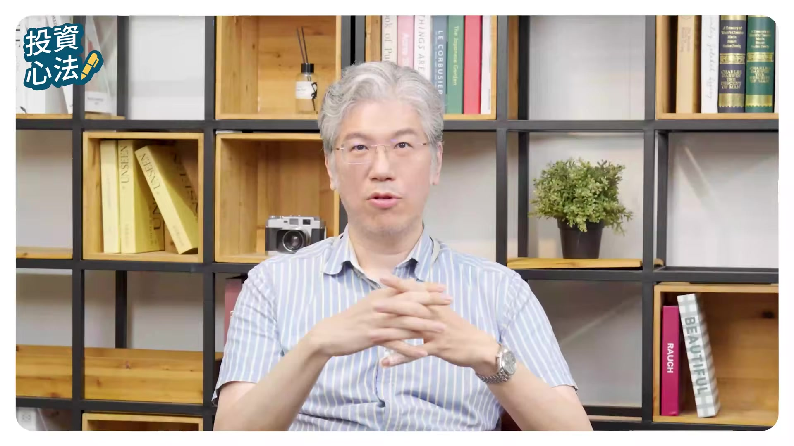
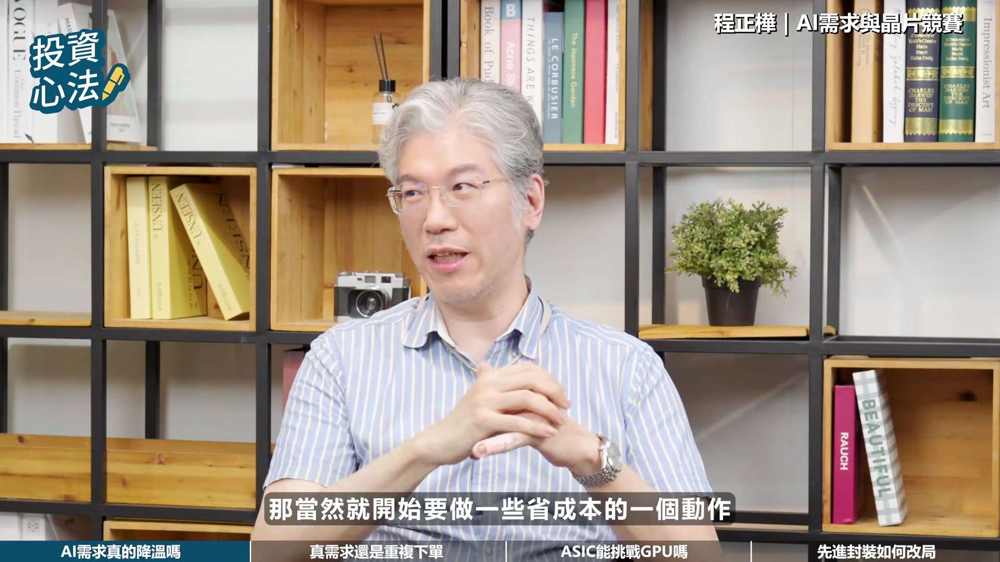
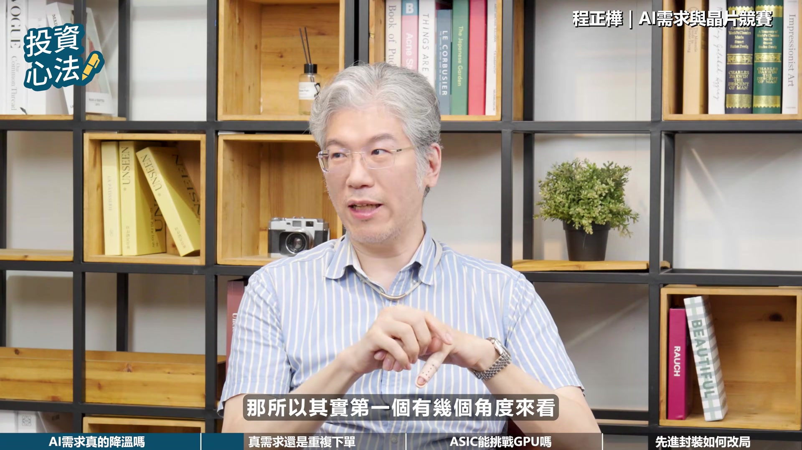
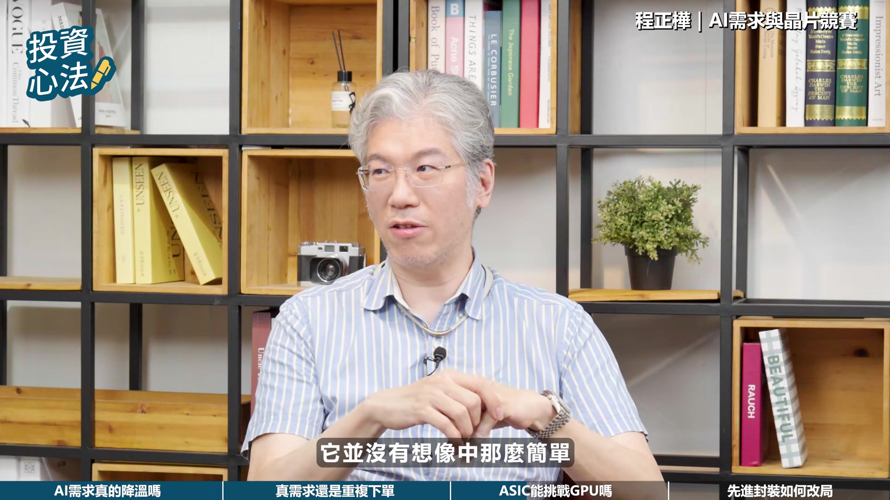
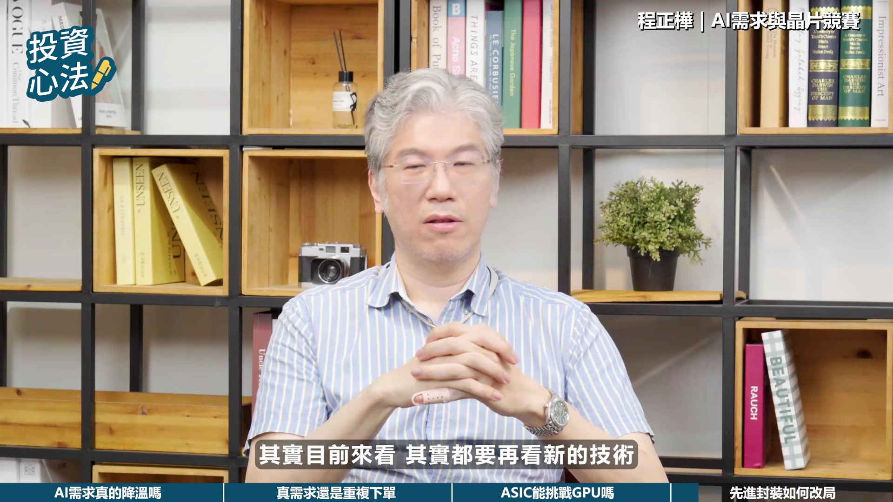
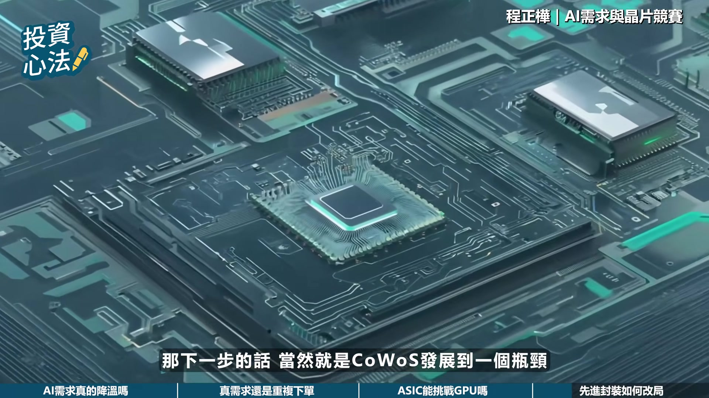
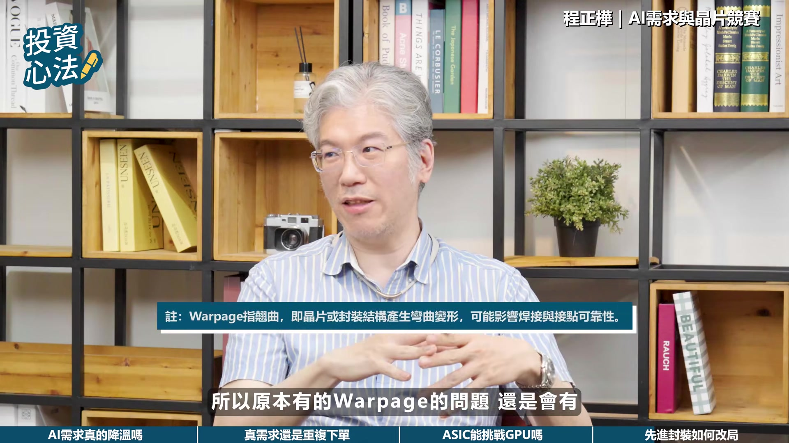
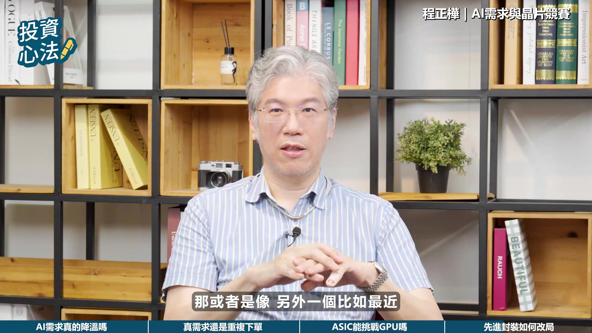
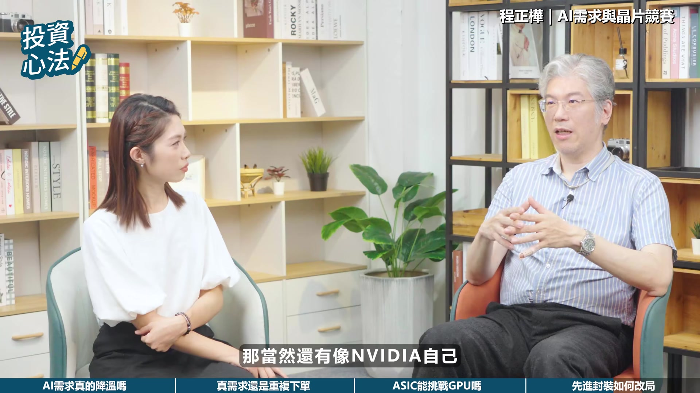

# fubonsec_4B9WiNsGNyo — 關鍵畫面索引

- 來源逐字稿：[fubonsec_4B9WiNsGNyo_FIN.srt](fubonsec_4B9WiNsGNyo_FIN.srt)
- 影片：https://www.youtube.com/watch?v=4B9WiNsGNyo
- 截圖數：22

## 00:00:00

**逐字稿片段：** 說實在的我們一直覺得NVIDIA的對手只有一個就是Google 那它只有一個對手一個Google的原因是因為Google它做它的TPU還有它的架構 它做了十年以上 它不是一朝一夕這個市場紅了忽然跳進來說我要做的

**話題推測：** 新話題：NVIDIA與Google在AI晶片領域的競爭關係

---

## 00:00:13

**逐字稿片段：** AI時代來臨 投資也能充滿智慧 富邦AI Pro專業分析資料 透視趨勢 輕鬆一點掌握全球市場脈動 有AI 投資更Pro 現在就點擊知識欄 趕快去下載

**話題推測：** 廣告時間

---

## 00:00:25

**逐字稿片段：** 歡迎收看富邦政策YouTube頻道 我是Sabrina 上一集我們談到AI商業化和推理需求崛起帶來的產業變化

**話題推測：** 影片開場與主持人介紹

---

## 00:00:34

**逐字稿片段：** 不過近期市場也開始出現了不同聲音 甚至開始檢討AI投資效益 今天我們就從需求面來出發 來看看AI長線成長動能在哪裡 一樣邀請到騰訊投資的投資長陳振華 也是大家熟悉的建掌來和我們聊聊 建掌好 哈嘍 各位觀眾朋友大家好

**話題推測：** 新話題：市場開始質疑AI投資效益

---

## 00:00:53

**逐字稿片段：** 近期美國已經有企業開始降低AI工具的使用率 甚至暫停部分的AI專案 想請教建長 您怎麼看這個現象 有哪些的產業對AI的需求 可能是比較具有持續性的呢 針對這個問題我們覺得 其實是因為之前用太多了 倒不是說忽然AI需求不見 用太多的原因其實是 之前就是矽谷他們對人力的評價 評估它的KPI的一個方式 他們那時候叫做Token Maxing Token Maxing就是你用了越多Token 你的績效就越好 那當然你如果都沒有用Token 也就是你都沒有在使用 AI這些工具的話 那你就會被Fire掉 就是沒有工作 所以每個人就是不管我會不會用 我都要毛起來用 就是為用而用 對 我能用多少就用多少 因為用越多績效越好 反正是公司出錢嘛 所以就能用多少就用多少 所以這個東西就導致很多 無謂的浪費 所以才會說很多企業忽然發現 他們打算今年用在AI的 這個Budget預算 怎麼一下就用完了

**話題推測：** 新數據/趨勢：美國企業降低AI工具使用率

---

## 00:01:56

**逐字稿片段：** 像Uber 微軟 Facebook Facebook都有類似的一些comment 就是忽然發現在這個AI的使用上的 這個budget使用的太多 所以他們現在就要來重新評估 這個方式 就說特別是現在AI在不同的應用上 它不同的模型價差其實非常大 我們知道其實很多東西你 特別我們剛剛有提到開源模型 開源模型你的定價就比較便宜 簡單所謂便宜就是我 一個100萬個token 它處理大概要多少錢 所以變成說企業會開始做區分 就是便宜的你們儘量用 無所謂還是隨便鼓勵你們用 但是貴的可能只有幾個老闆 或者幾個長官 或者叫特別approved 你才可以去用到這些 比較貴的這些模型 然後去跑你那些相關應用 所以我覺得其實是 之前有一度過度浪費的一個現象 那現在開始比較開源節流 就開始注意我們的 這個花費上要有效率 那當然以時空背景來講 今年上半年做這樣的一個 績效評估可能有它的必要 那理由是它強迫每個人去選擇 怎麼用AI 你不會用就被fire掉嘛 所以強迫每個人都要用 那每個人都學了之後 當然現在就告訴你說 這個工具大家都會了 那就開始如何更有效的利用它 然後不要浪費 大概是這樣的一些狀況 所以目前我們來看 它倒是一個促進了 大家使用AI變得更普及的 一個政策 那現在政策效果也達到了 那當然就開始要做一些 省成本的一個動作

**話題推測：** 提及具體公司案例：Uber、微軟、Facebook

---

## 00:03:16

**逐字稿片段：** 所以如果長線需求是存在的 那接下來就是要看 這些需求到底是真需求 還是市場提前反映

**話題推測：** 新問題：AI長線需求是否為真？

---

## 00:03:27

**逐字稿片段：** 那四大CSP巨頭 他持續的增加AI資本支出 市場也擔心是不是有提前備貨 或是重複薩丹的情況 那目前AI產業是真需求帶動 還是說包含了部分預期性的需求 應該說現在一定有一些 Double Booking的現象 這個在市場上是共識 那所以其實第一個就幾個角度來看

**話題推測：** 新主題：四大CSP巨頭增加AI資本支出

---

## 00:03:51

**逐字稿片段：** 我們如果看整個供應鏈的庫存 那包括你看下游的這個 比如說HPDALE這些品牌上 或是像ODM比如說鴻海廣達 那偉創這些公司 或者是你在看一些網通 什麼Cisco Arista 其實發現每家公司的庫存都上來了 所以其實今年大家有沒有在提前準備 然後有一些超額下單的現象 因為大家也都擔心 比如最明顯的擔心記憶體缺貨 然後擔心各個那些什麼NLCC缺貨 各種各樣的東西 都有可能有缺貨的狀況 所以為了即將來臨的 這個CSP的這個資本支出 所以大家都有這樣的一個 超額下單的狀況 那在CSP本身也有類似的狀況 就是說現在一個大家常常在觀察是 他們在美國蓋Data Center 蓋得並不是很順利 因為缺電 然後又有居民抗爭 那所以你做這些基礎建設 其實是需要時間 而且需要特別是環評等等 各方面的這些事情 那這兩年因為你蓋了一堆資料中心 導致電費大漲 那所以居民的反彈其實非常多 有一些州就開始宣佈說 我可能讓你資料中心要比較晚開始建 或是評估時間要久一點 那這個反應在資料中心上面 就是他們自己手上的庫存其實也在增加 那目前幾大CSP有公佈這個數字是

**話題推測：** 新分析角度：供應鏈庫存情況

---

## 00:05:01

**逐字稿片段：** 像Google 然後像Meta 他們其實有公佈就是類似我買的這些東西 但是還沒有拿來用的 那他就直接放在類似庫存的這個項目裡面 那這個數字其實在過去幾季是持續增加 所以等於是說他們也備了一些的 比如說買了一個NVIDIA GPU放在那邊不動 那等著資料中心蓋好才能把它放進去 所以就放在這個地方 那它的供應商其實也背了一堆庫存 所以整個供應鏈現在有沒有超額庫存的現象 那其實是有的 那只是剛剛講的 因為目前需求成長太快 所以導致大家現在還不太擔心 因為大家現在發現就是 需求是增加非常快嘛 所以剛剛講的Google、Meta 他們暫時可能還不擔心我手上有這堆庫存 因為他們覺得只要我這條中心蓋好 我立刻把它丟進去 我馬上就可以使用到 我還要再訂下一批 所以他們目前在供應鏈上也沒有收手 他們還是買得很積極 但市場有沒有Double Booking 的確有 所以當然回過頭來我們還是要觀察 最終的這個消費者對AI的需求 這算力需求是不是一直快速的增長 那如果有slow down的現象的時候 可能就要小心這個double booking的現象

**話題推測：** 提及具體CSP：Google、Meta公佈庫存數據

---

## 00:06:04

**逐字稿片段：** 那談到AI長期需求晶片 它還是最關鍵的基礎設施

**話題推測：** 新單元：AI長期需求下的晶片基礎設施

---

## 00:06:12

**逐字稿片段：** 目前市場除了NVIDIA的GPU之外 各大科技廠也積極的佈局ASIC 希望透過客製化的晶片來提升騷能並降低成本 那您認為ASIC有機會挑戰GPU的主導地位嗎 說實在的我們一直覺得NVIDIA的對手只有一個就是Google 那它只有對手一個Google的原因是因為Google 它做它的TPU還有它的架構 它做了十年以上 它不是一朝一夕這個市場紅了 忽然跳進來說我要做的

**話題推測：** 新議題：ASIC挑戰NVIDIA GPU主導地位

---

## 00:06:41

**逐字稿片段：** 忽然紅了跳進來要做的是Google以外的其他人 包括Amazon其實稍微沒有那麼近跳進來 但是也是大概這三四年才跳進來做的 那然後Microsoft的Meta其實都更近 就是最近才幾年才忽然跳進來要做 那其實做GPU或是做這個AI加速器 它並沒有想象中那麼簡單

**話題推測：** 提及具體公司：Amazon、Microsoft、Meta等投入ASIC

---

## 00:07:00

**逐字稿片段：** 那一般來講我們覺得這個市場 你至少要有三個相關的主要的技術 一個當然是GPU本身嘛 加速器本身的這個技術 另外一方面你要有高速的網路傳輸的 這個相關的一些IP 那還有就是你在做整個Networking的 這個Topology的一個網路架構的一個設計 那這三個都Ready的 目前大概就只有剛剛講的NVIDIA跟Google 這兩家公司 其他人其實都沒有 所以目前我們常常看到 很多家公司三天兩頭都宣佈說 我要來做這個產品 但最後他們其實都會卡在 他們缺東缺西 然後做不起來 那我還有一點可以補充一下 就是說其實我們剛提到的這個 現在輝達或Google 他們來做這個AI伺服器 或整個這個AI的晶片 他們的架構 基本上是一整個系統在做設計 所以設計整個系統的意思 它不是單單賣晶片 我們剛講除了這幾個 跟晶片相關的之外 他裡面各種各樣的零組件 他都要參與設計 然後參與主導 然後跟上下游去提前布可產能 說你要為我東西 然後準備多少產能 然後開始跟我做相關的一些合作 那甚至他要出錢 所以比如最明顯的 我們說光通訊來講 大家都知道未來幾年 CPU起來之後 最缺的 成長最快的就是光 特別是雷射 那所以怎麼辦呢 兩大雷射廠 Coherent Lument 輝達就直接投資 然後康寧Vita就直接投資 所以未來這些人擴的產能 基本上大部分就被NVIDIA給掌控了 那其他的人要跳進來的時候 我就算這邊剛剛講的幾個架構的東西都有了 我到來找別的component的時候 哇 我去哪裡找 這又會是另外一個問題 他可能只能找二線廠 或是別人外溢出來的一些東西 所以整個供應鏈的掌握 其實輝達跟Google 他們其實這方面做了很多投資 然後相關的佈局都已經做得很完整了 要跟他們競爭其實沒有這麼容易 聽起來不論是GPU或者是ASIC的發展 其實都會帶動先進製程和先進封裝的需求 AI也正在改變整個半導體產業的資本配置

**話題推測：** 新分析：AI加速器所需的三大關鍵技術

---

## 00:08:58

**逐字稿片段：** 那您認為未來半導體供應鏈的競爭重心 還會有哪些新的變化呢

**話題推測：** 新問題：半導體供應鏈未來競爭重心的變化

---

## 00:09:05

**逐字稿片段：** 其實目前來看其實都要再看新的技術 那比如說像一般我們原本早期看半導體技術 就看臺積電的先進製程 那當然這幾年開始看先進封裝 就是CoreOS SOIC等等的東西 那下一步的話當然就是Koos發展到一個瓶頸

**話題推測：** 新趨勢：半導體技術從先進製程到先進封裝的演進

---

## 00:09:21

**逐字稿片段：** 那可能接下來最近在討論比較多一個是Kopos 就是變成面板機的封裝嘛 那面板機封裝但它還是有一些問題 就是它Koos其實差不多的類似的製程 只是從圓的變方的嘛 所以原本有的挖比舉的問題還是會有

**話題推測：** 新技術：Kopos（面板級封裝）的討論

---

## 00:09:36

**逐字稿片段：** 所以大家在考慮下一代比如說做玻璃基板 那就是底下的基板變成有那個glass core 用玻璃做核心 然後你要做TGV挖孔 那然後去做這個玻璃基板 那有一些相關的玻璃基板的機會 那或者是像另外一個

**話題推測：** 新技術：玻璃基板的發展機會

---

## 00:09:50

**逐字稿片段：** 比如最近大家開始討論Intel的ENIB 就EMIB 那EMIB這個技術 現在看起來在做到更大尺寸的面板 這個晶片的時候 可能也是一個可以考慮的方向 所以最近報紙也開始寫了 就EMIB臺積電也開始考慮 做一些EMIB-like的一個製程 那當然還有像NVIDIA自己

**話題推測：** 新技術：Intel的EMIB技術

---

## 00:10:07

**逐字稿片段：** 之前跳出來一個技術叫COOP 就是說我是從 現在COOP是on Subtrait 那它可能直接把Subtrait去掉 變成一個PCB 做一個更大的一個 就是剛講他已經不是賣單一個晶片了 我直接是賣一個主機板的 這種感覺給你 就一整個架構都幫你做好了 那當然這裡面的技術都有很多要挑戰 要發展的一些地方 所以每一個技術如果有一些突破的話 當然都可能對供需造成一些變化了 那比如說剛剛講的 如果說Co-op成功了 你可能基板這一塊的需求忽然就沒有 大家都會覺得基板好像很緊張 那當然最近看起來這個PCB本身有點難做 所以他可能又用類似載板的技術回來做 所以又不一定是換掉這個載板 那另外比如說像 如果你是用類似Intel EMIB的這種技術 你做完的話你就不需要臺積電的CLW 你就可以跳脫臺積電的掌控 那當然如果是臺積電的角度 他就再去做別的一些技術 比如說SOIC你要做3D堆疊 你別的地方跑掉這邊還是掌握在我這邊 所以還滿有趣的就是 隨著你這封裝技術的變化 那每家各自有各自的佈局 那未來的供應鏈 可能就會有些競合關係的一些 更多的一些故事可以去看 大概是這樣子

**話題推測：** 新技術：NVIDIA的COOP技術

---

## 00:11:15

**逐字稿片段：** 非常感謝建掌精彩的分享 也讓我們對AI長線需求 半導體產業發展 有了更深入的瞭解 如果喜歡這集內容 歡迎按贊訂閱 並開啟手鈴鐺

**話題推測：** 影片結尾與感謝

---

## 00:11:25

**逐字稿片段：** 下一集我們要進一步來探討 AI高檔震盪下的投資佈局 我們下期見 拜拜

**話題推測：** 下集預告

---
