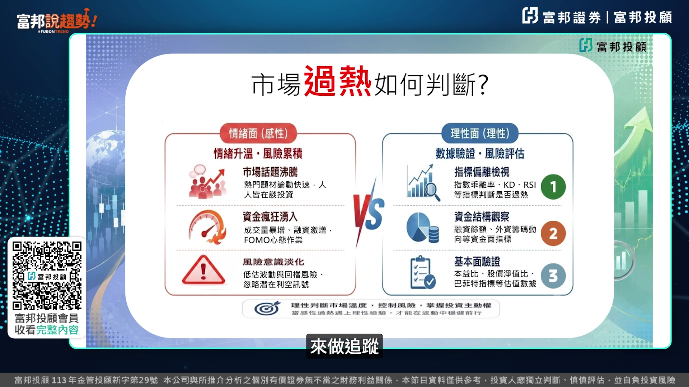
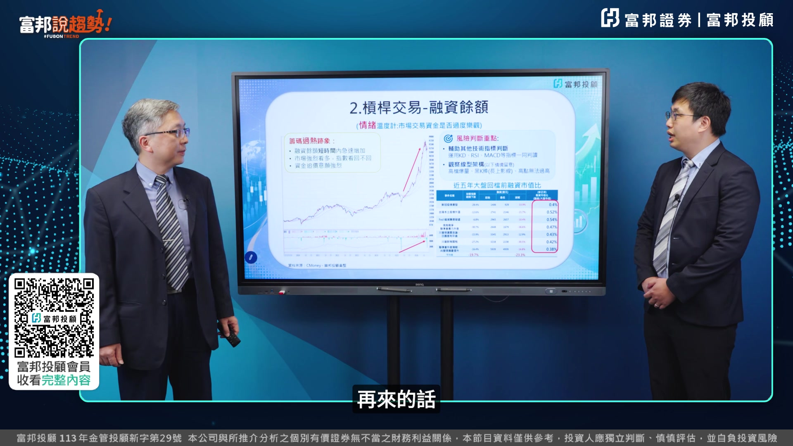
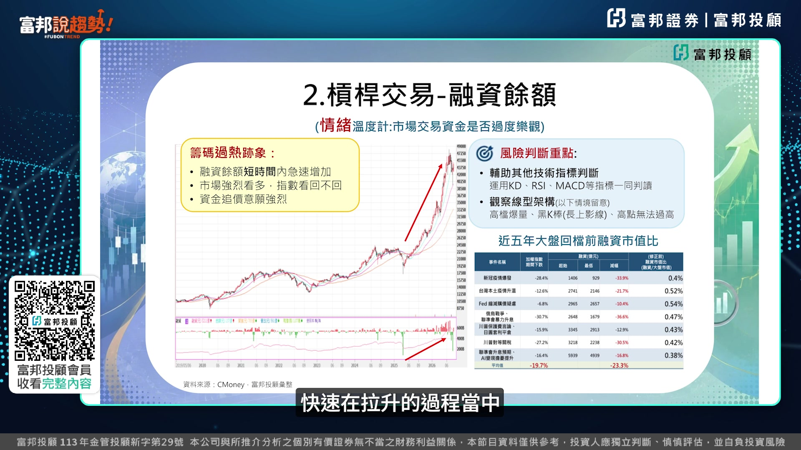
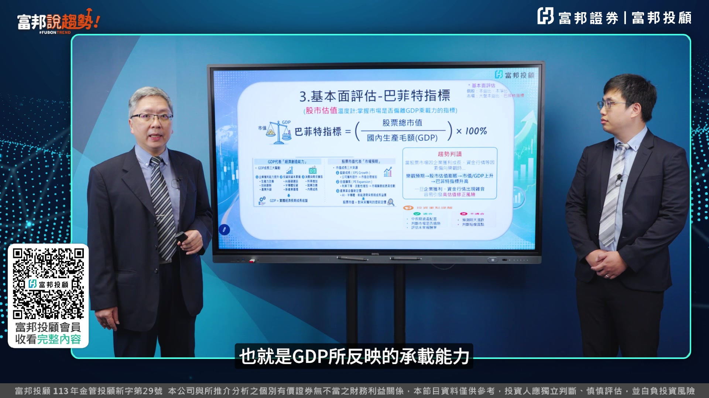
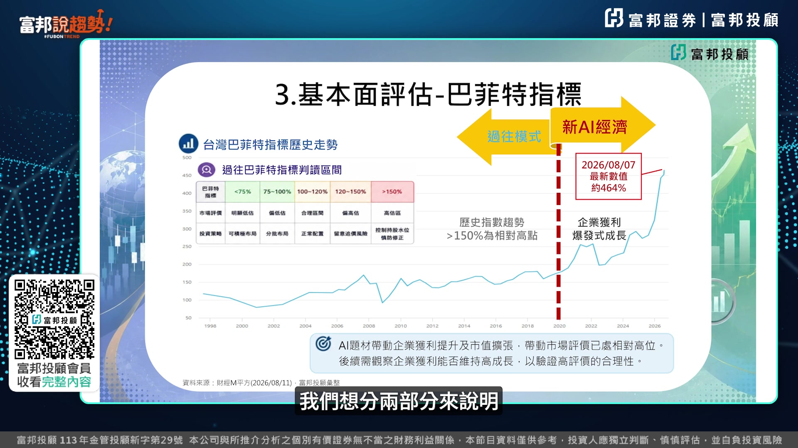
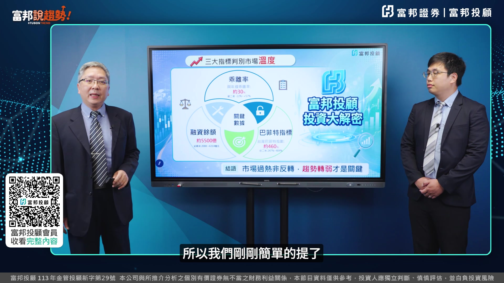

# fubonsec_C4vebTs7UiI — 關鍵畫面索引

- 來源逐字稿：[fubonsec_C4vebTs7UiI_FIN.srt](fubonsec_C4vebTs7UiI_FIN.srt)
- 影片：https://www.youtube.com/watch?v=C4vebTs7UiI
- 截圖數：7

## 00:00:09

**逐字稿片段：** 臺股連續4年的大漲,指數在今年5、6月也連續多次創下了歷史新高。 很多的好朋友都會擔心指數會不會漲多過熱修正。 像我們在看市場的指標的時候,有一些過熱的指標可以持續做一個留意。 我們今天特別跟大家介紹投資必看的三大關鍵指標。 那股票市場如果呈現過熱的時候 我們會發現有一些現象 跟指標的數值的部分 可以密切的觀察 我們這邊請啟東 跟我們來做一個分享 那在市場過熱一個情況 那首先我們可以看到在右手邊 那市場首先感受到是在情緒面 我們可以看到在投資朋友 在投資的過程當中 市場熱度剛上來 我們聽到身邊的一些 沒有投資的朋友 開始加入了這個市場 然後常常在討論股市 那再者我們會看到市場熱度提升之後 開始增加所謂的這個融資槓桿的一個運用 那最後我們會發現到說 往往隨著市場的急漲過後 大家忽略了一個風險 那在追價的一個過程當中 那忽略了所謂的潛在的一些利空 那造成一些修正的情況的發生 那除了在這個情緒面的部分 我們看到在左手邊 我們可以運用一些數值的一些指標 來做一些追蹤

**話題推測：** 顯示臺股指數走勢圖，標示近期歷史新高。

---

## 00:01:26

**逐字稿片段：** 第一個我們在價格的部分 我們用乖離率來做一個說明 在籌碼面的話 我們可以用常見的融資餘額 在基本面的部分 我們可以用所謂的巴菲特指標 來跟大家做一個說明 在乖離率的部分 它是價格的一個偏離的指標 我們知道乖離率是股價的位置 跟平均成本的一個差距 我們再把它當成一個價格的溫度據 就可以判斷股價的部分 是否偏離了平均成本的一個區間 臺股投資人最常用的均線的部分是季線以及年線 也就是240天的平均的均價的線 那像在2025年之前 我們在數據上可以看得出來 臺股年線的正乖離如果超過了25% 就像我們畫面上所標示的1跟2的位置 股價跟均線的乖離率拉大了之後 後面都可能會衍生指標過熱修正的 這樣的一個衝擊 那指標修正的風險 在以前是25%以上 就是一個偏高的一個水準 不過從2025年之後 因為AI產業的蓬勃的發展 在股市的動能的部分 明顯有加速的一個情況 因此臺股的加權指數 跟費城半導體指數 跟韓國的COSB指數 這些跟AI相關性比較高的 市場指數的部分 年限乖離率 它的區間都比以往 有明顯的大幅的增加 以臺股為例 在今年6月的時候 年限乖離率最高 曾經拉到了56% 那當然在指標的 明顯的過熱的情況之下 指數在7月就出現了 8000多點的高檔 拉回的一個修正 那當然在整個乖離率的修正的過程 第一波的修正是最劇烈 而且很明顯的 不過在第一波的修正 7月發生之後 後續的乖離率的調整的一個部分 它會慢慢的在股價的方面 往均線去做一個迴歸 那以目前AI的趨勢來看 最有可能的情況就是 年限緩步的一個往上推升 那當然在整個乖離率 慢慢地用時間代替空間 做了一個修正之後 這樣的一個乖離率的影響的部分 也就會慢慢地淡化 再來的話

**話題推測：** 顯示三大指標（乖離率、融資餘額、巴菲特指標）列表與所屬分析面向。

---

## 00:03:55

**逐字稿片段：** 我們可以透過這個融資餘額 來做一個判斷 那所謂的融資就是投資者 跟券商借錢 來投入股票的一個市場 那我們可以看到在右手邊 這一張走勢圖 那加權指數在這個4月份 從3萬一些點急速拉昇到 4萬8千點 那顯示說市場的一個熱度 是相當的熱 而且相當的一個樂觀 所以融資餘額的部分 也是從4月份開始一路往上走升 那這個期間也增加了1500億 那尤其是我們可以看到 來到大概5月份以及6月份 單日的融資餘額 可以一日暴增將近百億 那顯示市場的資金熱度相對高 那所以我們也可以發現到 那當這個我們用融資的情況之下 那這個資金成本也會相對的比較高 那如果說後續我們可以看到 在指數的部分 沒有辦法在快速的拉伸的一個情況之下 那當然有一些資金做退場的動作 那可能就會產生一些修正的情況 所以說當我們發現到 融資魚的快速在拉伸的過程當中

**話題推測：** 顯示「融資餘額」的定義與解釋，或其趨勢圖。

---

## 00:04:54

**逐字稿片段：** 那我們可以服務於其他的一些指標 包含剛才提到的乖離率 KD指標 RSI指標 或者是從現行架構我們常聽到的 包含像這個高檔爆量 以及黑K棒上影線的走勢 然後來去做一些調節 以及這個減碼的動作 然後來規避這個風險 那第三個指標呢 是巴菲特指標 它是從基本面來評估 市場是否過著 很有用的一個指標的工具 它跟我們在評估個股的時候 所用的本益比跟本淨比 非常的類似 它是在市場的部分 我們就是評估 它是否有偏離到GDP的承載力

**話題推測：** 顯示搭配融資餘額可觀察的額外技術指標列表（如KD、RSI、量價型態）。

---

## 00:05:33

**逐字稿片段：** 那巴菲特指標 它定義上就是 股票的總市值來處於GDP 它是2001年的時候 股神巴菲特特別開發出來 去評估美股的總市值 是否合理的一個很重要的一個指標 那像在這個巴菲特指標 我們在判讀的時候可以看到 當股票整個市場因為企業的獲利 或者資金行情 讓它的偏向樂觀而估值 大幅的提升的一個時候 這時候巴菲特指標 就會有明顯升高的一個情況 那這個指標因為它是整個估值的一個調整 所以一旦企業的獲利或者資金行情出現了一些雜音的話 它就會有一個高估價值做一個修正這樣的風險 那這個指標也特別提醒 它主要是一箇中長期的一個評估的一個指標 它不適合當成一個短線的一個操作的一個參考 那詳細的臺股的巴菲特指標的部分 再請啟東跟我們來做分享 好 我們可以透過這張圖來看到 目前的巴菲特指標 是來到相對比較高的一個位階 這張圖的部分 我們想分兩部分來說明

**話題推測：** 顯示巴菲特指標的計算公式與定義。

---

## 00:06:49

**逐字稿片段：** 首先我們可以看到在紅線之前 2020年以前 在還沒有AI蓬勃發展之際 其實這個指標來到150%以上 已經是相對比較高的位置 容易產生修正 因為我們都知道 這一波AI帶來的一個 經濟的一個發展 企業的獲利是快速的一個成長 那也導致說市場給予更高的估值 那帶動整體的這個巴菲特指數拉高 那我們認為說這樣的一個AI趨勢 還沒改變之前 偏高的一個指數 還是會維持一段的一個時間 那我們真正要留意的是說 什麼時候企業獲利 開始產生所謂減緩或衰退的一個情況 反而我們就要更加的一個留意 所以我們剛剛簡單的提了

**話題推測：** 在巴菲特指標圖上，以紅線區分2020年前後趨勢，並指出150%的過熱區。

---

## 00:07:30

**逐字稿片段：** 三個指標的一個應用 像我們可以看到 目前臺股的年限的乖離域 大概是在30%左右 這在過去這兩年 從22%到57%的區間的部分 這個指標目前的確是屬於一個 偏熱的狀況 另外在融資與的部分 目前大概是在5500億上下 跟巴菲的指標目前大概在 460%上下 都是在過去這兩年 相對比較偏高的一個水位 所以指標是否有過熱的現象 的確目前是呈現一個偏熱的一個狀況 不過在投資的部分 我們應該要怎麼樣去因應 指標過熱的這個情況 我們也請啟東跟大家來做一個說明 好 那我們也給投資朋友來一個建議 那我們這邊傑宇有特別寫到 那市場的一個過熱 並不是馬上的一個反轉 反而是我們要去觀察的是趨勢 那我們也提到了 AI的一個發展的趨勢是否能夠持續 那企業的獲利是否呈現衰退 或反轉的情況 才是往往我們需要 更值得留意的一個地方 謝謝各位好朋友 收看今天的節目 如果您還沒有加入 富邦投顧會員 請掃描畫面上的QR Code 加入我們的行列 如果對今天的節目 覺得有幫助的話 請按贊訂閱及分享 讓更多的朋友 瞭解這些投資的知識 謝謝各位的收看 下次見

**話題推測：** 顯示三大指標的目前數值總結與市場判斷。

---
