# fubonsec_LUQYfy615AM — 關鍵畫面索引

- 來源逐字稿：[fubonsec_LUQYfy615AM_FIN.srt](fubonsec_LUQYfy615AM_FIN.srt)
- 影片：https://www.youtube.com/watch?v=LUQYfy615AM
- 截圖數：19

## 00:00:18

**逐字稿片段：** 叫5566 就是5萬點之後臺股跟20%的距離就是6萬點 因為5萬到6萬只差20% 今天是在行情上面來看 我們先來做一下分析跟總體經濟的看法 然後測標部分利多不變 斜率變 因為我們在整個臺股的四本柱 包括CPU 記憶體 被動元件 PCB 接下來它的利多不會變 但是它的報價漲幅可能會收斂 這是我今天在整體的宏觀的這部分的一個盤勢 跟總體經濟 以及我們在微觀的產業的部分 我們今天來做這樣的說明 一開始我們想先針對整個這個產業的部分 四大產業裡面 我覺得目前看起來它的這樣的一個利多 還是維持不變 那先看一下CPU CPU主要重點應該是來自於Meta的MUSE跟OpenAI的DOTS 代理是AI的旋風再起 那這個意思就代表就是說CPU他負責的這樣的一個責任 越來越重 然後我們可以看到 他現在的這個推論裡面

**話題推測：** 介紹影片主標題「5566」與台股5萬點至6萬點的關鍵數字

---

## 00:01:20

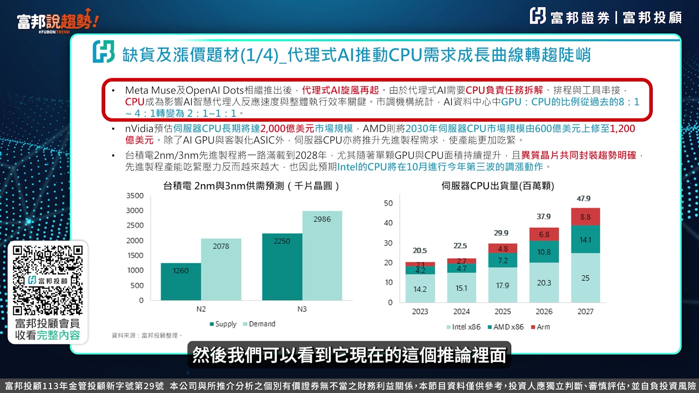

**逐字稿片段：** 他過去跟GPU這部分的佔比 從8比1 4比1 2比1到現在目前看起來有到1比1 我們還有最近有看到這個1比40的這樣的一個CPU的這樣一個比值喔 我想目前看起來CPU它佔的這樣的一個權重 越來越高 所以CPU這塊的一個需求會越來越緊俏

**話題推測：** 提及CPU與GPU的佔比數據變化，預期畫面會顯示相關圖表

---

## 00:01:40

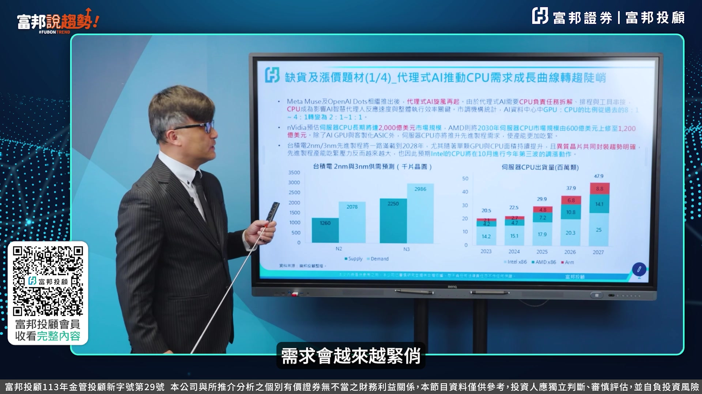

**逐字稿片段：** 那第二點就是NVIDIA它對於CPU長期的這樣的一個Market Size來看的話是2000億美金 AMD它預估原先估計只有差不多600億美金 現在到2030年也調升到這個1200億美金 所以這部分的這個CPU的這樣的需求 從2027年開始其實應該它的這個協率會非常非常陡峭 然後再來就是臺積電的2nm跟3nm 左下角這個地方是2nm這部分的一個Supply跟Demand 綠色的部分是Supply 淺藍色的部分是Demand 你會發現Demand跟Supply的部分差距超過50% 所以在整個先進製程的部分來看 不管是2nm跟3nm的部分 其實在整體的需求上面來看的話 是非常非常的緊張的 我們可以從這個左下角這個表來看

**話題推測：** 提及NVIDIA與AMD對CPU市場規模的預估數據，預期畫面會顯示市場預估圖表

---

## 00:02:27

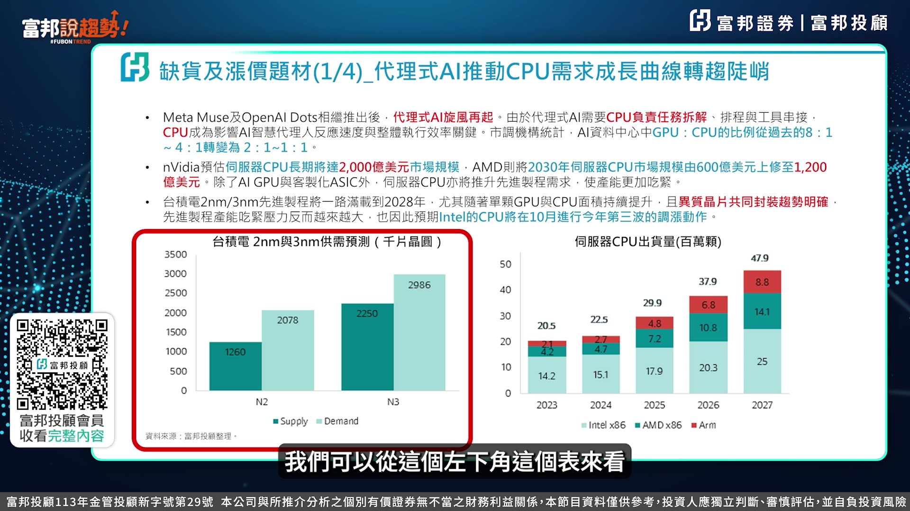

**逐字稿片段：** 右邊的部分是CPU的這部分的一個出貨量 從2023年的2000萬顆到2027年的4800萬顆 倍數的成長 尤其是X86 你可以看到在整體的Intel X86跟AMD的X86跟ARM的部分來看的話 Intel在整體的X86的比重 其實大幅的提升 所以你可以從這一次的Intel在10月份的這個官方的網站上面有提到 他已經要把舊製程的這部分的X86 embedded的部分還有IPC公控的部分 比較屬於舊製程的部分要做淘汰 那這一塊就會丟出臺灣這部分的商機 所以這一塊第一個 我們先看一下CPU部分的一個需求 會比今年來更加的緊張

**話題推測：** 明確提到「右邊的部分是CPU的這部分的一個出貨量」，預期畫面會顯示CPU出貨量預估圖

---

## 00:03:08

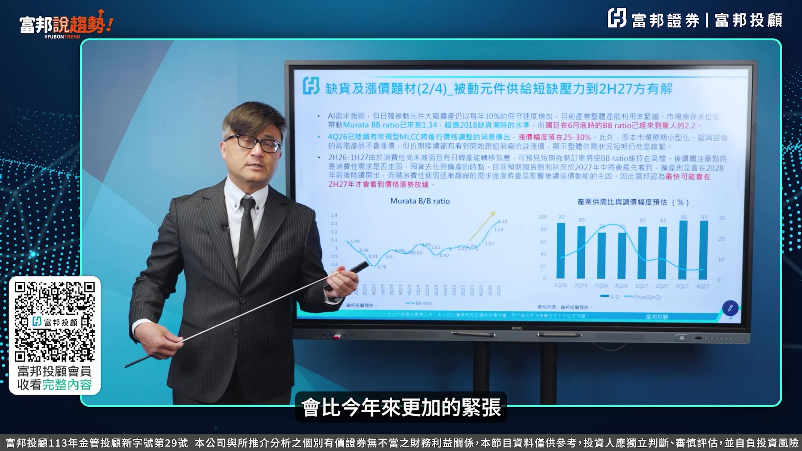

**逐字稿片段：** 第二看一下被動元件 左下角這地方是Morata的這個BB Ratio BB Ratio是Book to Order的部分 就是訂單跟出貨比 你會發現訂單是遠遠大於出貨 以Morata他這邊所估計的 這部分的一個BB Ratio來看1.34 可是你看國具 國具給出來的BB Ratio是來到2.2 等於說訂單遠遠高於你這部分的一個生產 這是第一個我們可以從BV Ratio來看 所以在整個第四季 這個Murata他有提出 他要把通用型的這部分在未來三年 慢慢進行所謂的停產 所以你會發現這部分的一個價格 呈現25%到30%的調漲 這個是可以看到 在整體的這個需求上面來看的話增加 也因為這個MLCC這塊導入所謂AI的部分 轉型到AI部分 也使得說傳統型的這部分出現一個漲價 那今年的下半年跟明年上半年的部分 會有所謂的日韓訂單的轉移效應 可以留意這個地方 然後在下半年這部分的一個價格

**話題推測：** 開始分析第二個產業被動元件，預期畫面會切換至被動元件專屬投影片

---

## 00:04:10

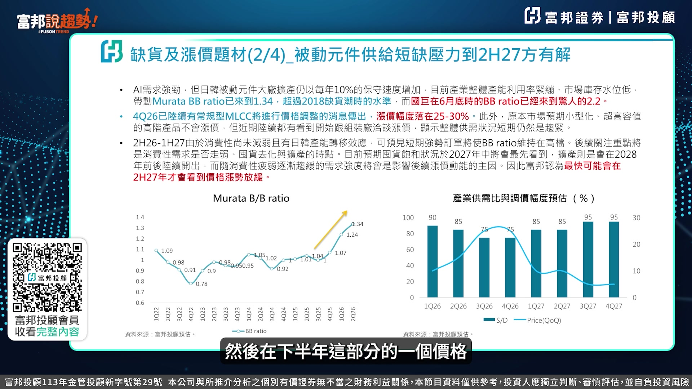

**逐字稿片段：** 我們從右邊的這部分的一個角度上來看 比較緊張的部分應該是在今年 你會發現這個Surprise回底面 75%就是Shortage 25% 這兩季都屬於比較緊張的這個階段 但是你看到明年的第一季第二季 還有15% 可是到明年下半年 這個地方可能它這個 休提值的情況就沒這樣的嚴重 就收斂到只剩5%左右 所以這個地方的這個價格 可能它就會有出現一個 漲緩趨勢的情況 那一般來講 這種所謂的緊急循環股 搭配成長股的股票 它的這個股價應該會領先一季 所以股價的表現在明年上半年 可能相對來講會是不錯 可是在進入下半年部分來看的話 因為它的這個Demand 沒有這麼樣的緊張的情況之下 它的股價可能會提前翻移 半年到一季的時間 這邊可能第二部分要先各位注意一下 這樣說明

**話題推測：** 明確提到「從右邊的這部分的一個角度上來看」，預期畫面會顯示被動元件下半年價格趨勢圖

---

## 00:05:06

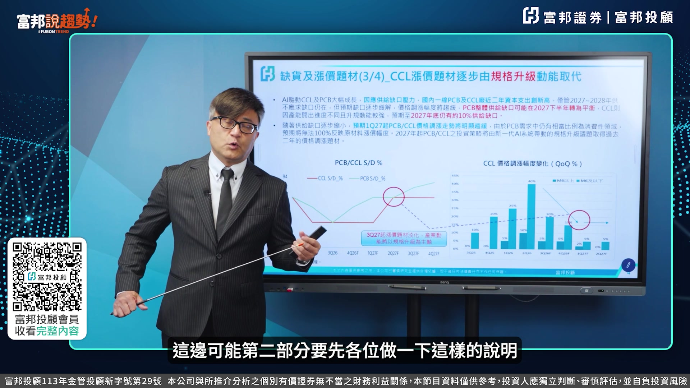

**逐字稿片段：** 第三個在CCL的部分 右邊這個表示CCL的Supply跟Demand PCB的Supply跟Demand 我們可以看到這兩條線 綠色這條線是屬於PCB的部分 今年的上半年你會發現PCB跟CCL 這一塊的這種所謂的短缺的情況 將近這個兩成 將近兩成 所以你可以看到 這個2026年第三季 這個地方你會發現 為什麼它最近 那個在今年上半年PCB的 這個股價會上升的主要原因 是來自於它Supply跟Demand的部分 可是慢慢的你會發現 在整個CCO的部分 這條紅色的線 它到一個10%的Shortage 就呈現一個走平 可是在PCB的部分 它這部分的Shortage 慢慢的已經疏解了 所以這兩條線可以看出說 PCB CCL上游的部分 它緊張的程度是比下游來得更加嚴峻

**話題推測：** 開始分析第三個產業CCL，預期畫面會切換至CCL專屬投影片

---

## 00:05:58

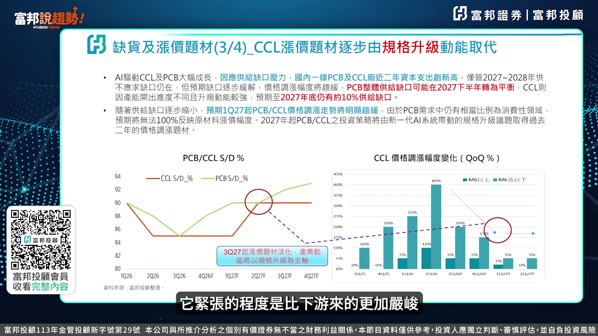

**逐字稿片段：** 然後右邊的部分是把M6跟M6以下的 這部分的報價 我們來做QQ的比較 最甜的點 今年第二季 然後你會發現這個比較長的是M6以下 這個M6以下的部分 因為它的ASP相對價格比較低 M6以上它價格比較高 所以它漲價的這個幅度沒有這麼大 可是你看到今年的第三季 今年的第四季開始收斂 明年第一季第二季收斂的幅度更大 尤其是M6以上的部分 可能會變flat 所以這塊可能在整個報價上來看 必須要留意 我們在上一次的這個影片裡面 是用數字來跟各位做說明 這一次直接把圖的部分 直接來跟各位富邦說區草朋友 來做這樣的一個比較 你就可以知道說 在整體的報價上來看 它比被動元件 它的這部分的一個漲幅 更加提早趨緩 在第三個部分在PCB的報價部分 我們可以做這樣的一個看法

**話題推測：** 明確提到「右邊的部分是把M6跟M6以下的這部分的報價」，預期畫面會顯示CCL不同規格報價圖

---

## 00:06:57

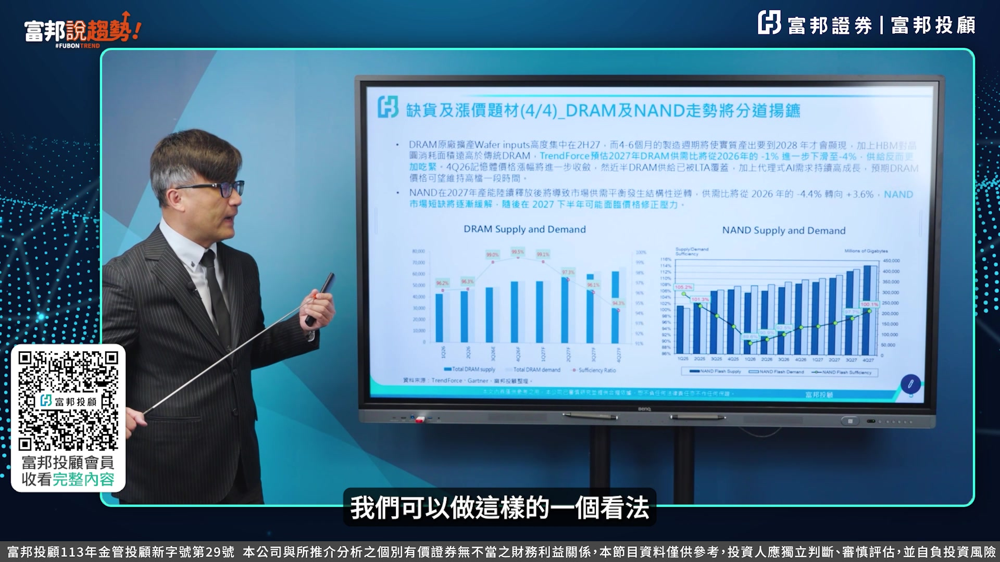

**逐字稿片段：** 再來看大家比較常常問的記憶體的部分 左邊這張表是Supply and Demand 你會發現今年的這部分的Supply and Demand 其實也是需求遠遠大於供給 所以你會發現96.2 96.3 99到99.5 在今年整年度上來看的話 上半年它的供給大於需求是缺口是比較大的 到今年的下半年開始慢慢的缺口補上來 然後來到明年的部分 因為HBM的量又增加 所以DRAM的部分又出現了 所謂的這種shortage的情況 所以這一塊因為移轉到這個推論 所以你會發現說在HBM這部分的一個轉換 它是面積遠高於傳統的DRAM 所以在整體來看的話 明年的這個下半年 它這部分的一個shortage情況 會又再度的顯現

**話題推測：** 開始分析第四個產業記憶體，預期畫面會切換至記憶體專屬投影片

---

## 00:07:46

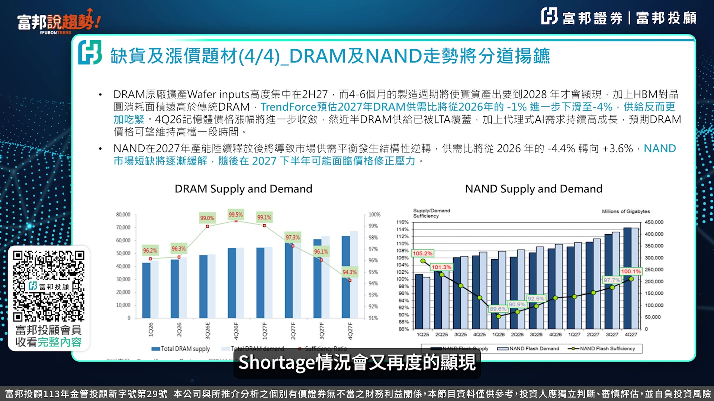

**逐字稿片段：** 但是NAND的部分來看就比較不一樣 你會看到NAND的部分

**話題推測：** 轉向分析NAND記憶體，預期畫面會顯示NAND相關的圖表或數據

---

## 00:07:50

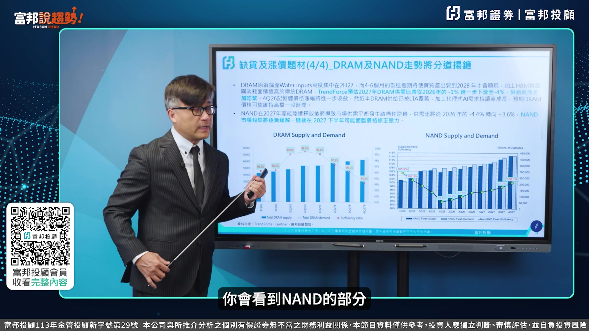

**逐字稿片段：** 左邊這邊是2026年 就是今年的上半年 第一季 第二季 第三季 第四季 從淺藍色這塊看起來 都還是需求大於供給 可是到明年的下半年 尤其是第四季進入了Balance 所以它這個部分又比PCB又更早 所以我們剛剛從CPU 被動元件 到PCB CCL的部分 到現在的記憶體 你就可以知道說這四個 我們說四本柱 就是在整個AI的四本柱裡面 跟報價比較有相關的部分 其實到明年的2027年的下半年的部分 它的這部分的利多 就是價格維持在高檔 毛利率維持在高檔 可是一般來講 我們看的是報價是否能夠在推升的過程裡面 其實從這樣的一個Supply跟底面也可以看出來 進入2027年下半年 已經開始有出現Soft的情況 所以我想一開始我用這事業 來帶出整個產業 在接下來的這樣的一個走勢 那第二部分 我們來看一下總體經濟 這張表非常非常的棒 我們研究團隊 花了很多時間 把這個表把它做出來 來跟各位富邦社區少朋友 來分析說 到底十年關係的經濟率 上漲對股價影響 我覺得這一塊非常非常的有趣 你會看一下這幾個表裡面 我們先從這一張表來看 當10Y突破5%之後 每股續漲的時間 1995年2002年突破5% 它漲了13.4個月 2006年2007年它又漲了18個月左右 等於說當你的10年關節率 突破5%以上的時候 其實它股市是繼續上漲的喔 這第一個 然後漲幅多少 我們看一下 在99年到2002年的時候漲了24% 然後06年07年在08年 financial tsunami之前漲了21% 這兩個幅度都是高位數的成長 股市喔 那你看它什麼時候開始建高 我們當我們的10Y來到波段高點之後 每股是在兩個月後建高 第二次是在三個月後建高 那等於說假設我們今天的5.3 今天我們今天錄影的時間 10Y來到5.3 我們把它界定說是這一波的高點 那最快最快兩個月 指數才會建高點 那現在是10月就是年底 那假設用第二次的話是三個月 就是明年差不多是1、2月份 這個是10Y見高點 假設你覺得10Y還沒可能到5.4、5.5 那可能就往後延 所以從這個突破5%的一個漲幅 跟波段高點之後 股市見高的漲幅的時間點 其實我們都可以看出來 其實我們對公債殖利率的看法 事實上來看的話 你必須要去了解 它到底會不會直接影響到你的股市 而不是說 這個看到媒體這樣講 就是說這個可能會直接影響 那什麼時候會開始 做所謂的這個股市的下跌

**話題推測：** 明確提到「左邊這邊是2026年」，預期畫面會顯示NAND供需圖表

---

## 00:10:52

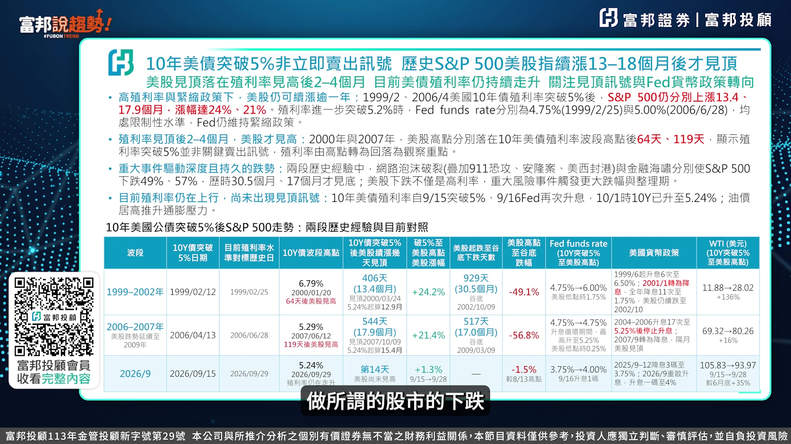

**逐字稿片段：** 就是開始降息的時候 這可能跟你的認知有不大一樣 當我們在過去來看 開始做降息的過程裡面 我這邊紅色字標出來 2001年的1月份轉為降息 然後2004年 2006年 開始升息轉為降息的過程裡面 其實指數都呈現一個下跌 但是這兩次都是有大的事件 包括Financial Tsunami 包括這個所謂的安隆事件 這個部分都是屬於有系統性風險所產生出來的 這個部分包括911攻擊 恩隆岸美西風港 這個才產生這樣的下跌 但是我們目前看起來 這個可能2027年這邊的 屬於系統性風險的這個機會比較低一些 所以我們從這個角度上來看 我們覺得殖利率跟這個股市的這部分的一個 關係度來看沒有這麼直接 那我們再來看一下做一個結論 就是說當我的殖利率往上走 會不會有產生這個股市的下跌

**話題推測：** 討論開始降息時股市的表現，預期畫面會顯示相關歷史事件與股市走勢圖

---

## 00:11:50

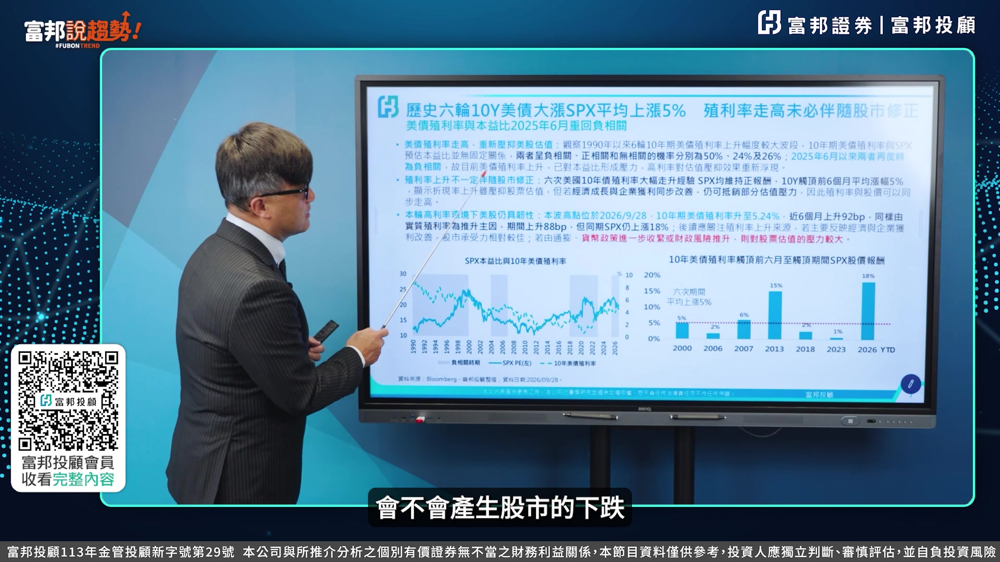

**逐字稿片段：** 其實在過去1990年以來 六輪的十年期上升的幅度上來看 其實它的相關係數 負相關正相關跟沒有相關 分別是50 24跟26 從這個左下角這個圖可以看出來 其實是有影響的 是有影響的 但是第二點 利率上升不一定伴隨股市的修正

**話題推測：** 總結十年期公債殖利率與股市相關係數，預期畫面會顯示相關統計圖

---

## 00:12:11

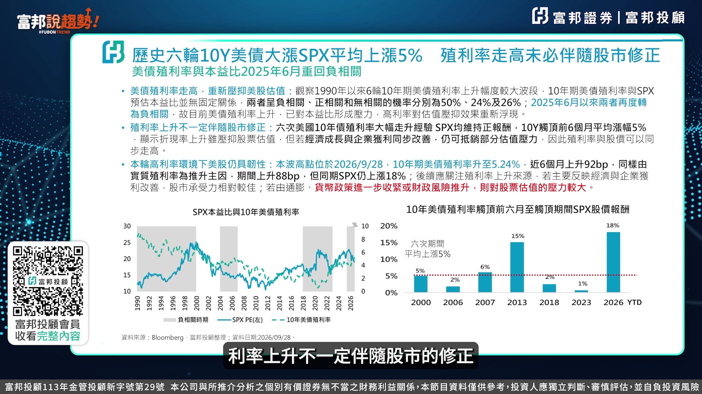

**逐字稿片段：** 就是我從2000年開始 我把它估計來看一下 我們不要算今年 你可以看一下2000年 當它的殖利率來到5%的時候 它的股市上漲5% 06年2% 07年6% 13年15% 還是上漲的 以今年來看 現在在5%以上 它的S&P的指數是 YTD是漲18% 所以這樣的一個角度來看 我們就可以知道說 到底你的利率的上升 是因為通膨 惡性通膨所導致利率上升 還是實質利率上升 你就可以看到 我們這一次的利率來到5.24 但是實質利率推升主因 上升了88個BP 其實它真正期限溢價 所產生出來的部分 因為通膨的關係 而導致利率上揚 其實比例非常非常低 所以我們倒覺得說 這一次的這個經濟成長 所促使這樣的一個 利率的一個調升 應該是比較大的關係 所以假設你是伴隨著 經濟成長跟企業獲利的改善 可以抵消這部分的估值的壓力 就是我們最最常常所提到的 十年公債無風險利率的導數 就是本益比的概念 這個我覺得就可以去破解 我們在整體的經濟成長 跟企業的這部分的一個成長 所帶出來的這樣的一個相關聯的地方 所以我覺得這一塊 我覺得是先讓投資人知道說 我們接下來面對的 這部分的一個殖利率走高 你就要去判斷說 說到底EPS的成長率 可不可以跑贏時間公開值率 這才是重點 好 這個是我們第二部分 好 所以我想在整體的這個 CY跟股市的這部分的連結 先讓各位富邦說句好的朋友 有一點這樣的一個觀念 好 就是說我們接下來要看的是 到底產業的成長率 EPS成長率是否能夠勝過 時間公開值率 只要能夠勝過的話 其實對於股市來講影響就不大 但是若是你的EPS的成長率 被10Y的這部分的幾率給趕上的話 可能它這部分就會產生一個下跌 我想這部分可能還是要跟好朋友 做一下這樣的說明

**話題推測：** 提及2000年以來殖利率達5%時股市表現，預期畫面會顯示相關數據列表

---

## 00:14:20

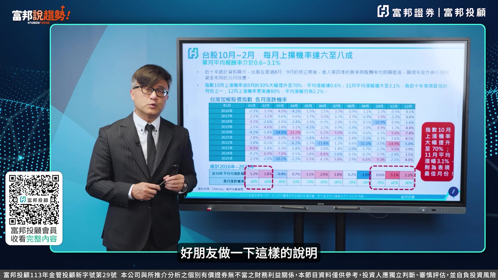

**逐字稿片段：** 好 接下來我們來看看臺股 臺股這個地方 我們這邊目前看起來進入第四季 10到2月份的上漲幾率高達6到8成 這是我下的標題 但是我們現在先關心一下 10 11 12月份 我們以9月份的這個收盤來看 47930這樣的一個位置來看的話 10月份它上漲的幾率是7成 如果是0.6的話是48300 那如果是以這個11月份上漲機率是六成 但是它的幅度是3.1的話 這個指數就會來到49700 然後如果是在12月份 它上漲機率高達八成 來到2.2再往上疊上去的話 指數就要50800點 50800 所以目前看起來第四季這個地方 你去挑戰五萬點是非常非常容易的 只是說五萬點上去之後 它可不可以變成是支撐 然後支撐上去之後 我們後面再往上看 這個是從過去的10 11 12 然後再延續到明年的1 2月份 它上漲機率也是超過5成以上 而且幅度是1.2跟1.8 所以把握這一波的 這樣的一個旺季效應 就是我們講的第4季 整體的這個獲利數字應該是Pick 再加上進入所謂的 2027年的作夢行情 你可以延續這樣的一個操作 所以這個部分我們覺得 在整個指數的判斷上來看 應該沒有太大懸念 到底耗掉多少

**話題推測：** 切換至台股分析部分，預期畫面會顯示新的主題標題

---

## 00:15:42

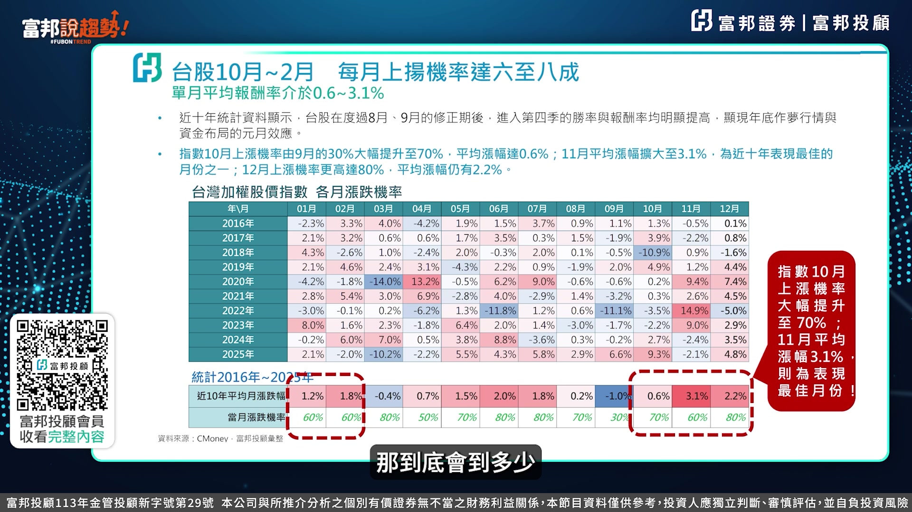

**逐字稿片段：** 我們用黃金切割率來看 以現在的一個這一波48218跌到39384 總共跌掉8834點 我們用1.381.5跟2.0的 這樣的一個切割率去算出來的 位置分別是51000多點 52000多點到57000多點 所以我們一開始的標題 採用5566這樣的一個狀況 來做這樣的說明 但是5萬點它衝上去之後 不會一次站上 會來來回回跟我們之前所判斷的48000 49000都一樣 來來回回衝撞了兩到三次 三到四次的這樣的一個階段之後 才會順利的站上去 因為畢竟我們現在成交量到1.2兆左右 以48601當時的這個高點的這部分的一個成交量上來看 他都是在1.6兆以上 所以我們現在目前沒有辦法增量到1.6兆以上的情況之下 也沒有爆量的情況之下 他就用這種一兆以上這樣的量 去來回做衝撞 會是比較有可能 在接下來的指數的一個走勢

**話題推測：** 使用黃金切割率分析台股目標點位，預期畫面會顯示圖表與相關計算結果

---

## 00:16:44

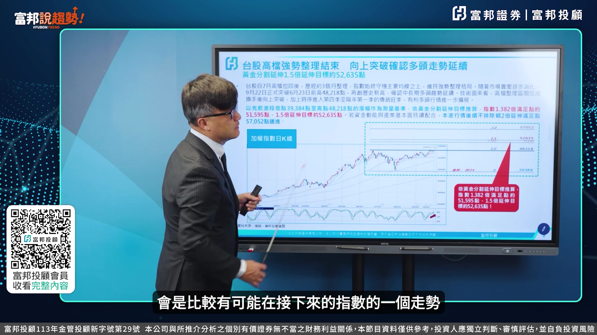

**逐字稿片段：** 最後我還是用我的光哥筆記 來跟各位做一下 我對於整個行情的這部分的看法 OK 我想進入我們的這個 最後我來做一個小小結論 我覺得目前看起來 10月份的行情跟我們之前規劃 其實方向上來看沒有變 等於說我們之前 從總體經濟的角度上來看 從技術的這部分的一個形態上來看 我們看出在差不多10月中旬的部分 指數攻上5萬點 那時候我們可以 你去調上一次的這個節目的 這樣內容我們可以看出 我們那時候是用55天轉折來抓 那現在目前來看一下 短線上的一個利多 包括第一個KD高檔頓化再轉強 昨天的K9是89.34 D9是81.9 那一般來講 D9還在往上衝到90以上 所以以保守來看 它KD黃金交叉之後 轉強高檔頓化 保守還會漲3-5% 基準是6-8% 如果極強的軋空會超過4%以上 若是以3-5% 6-8% 其實很容易就過5萬點 這第一個我們可以看到 高檔動畫再轉強 第二點 垃圾盤加軋空

**話題推測：** 進入「光哥筆記」總結部分，預期畫面會顯示摘要或重點筆記

---

## 00:17:51

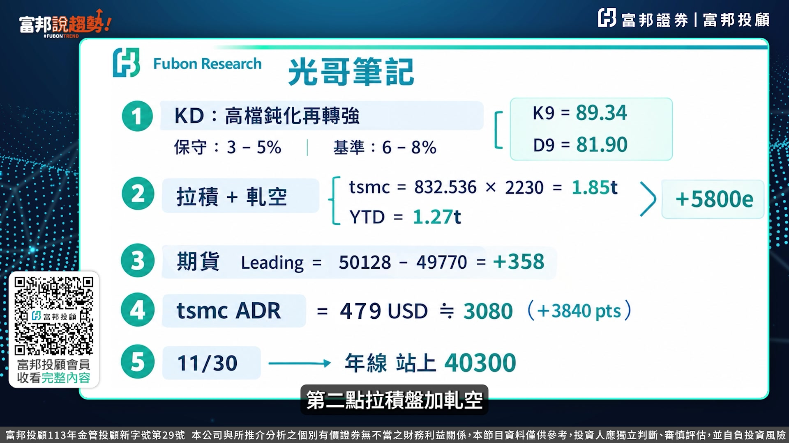

**逐字稿片段：** 我統計一下臺積電目前外資賣超張數 到昨天為止 832,536張 他從1700開始賣 賣到2500還在賣 目前整個賣超到今天為止 應該是賣了1.85兆 那我們看一下YTT外資賣超1.27兆 兩個相減其實他是正買超臺股5800億 所以這樣內容就知道說外資其實他在做起止的這部分的放空 其實他是在做起差 他一手賣臺積電一手做起止放空來做所謂的套利 這第二個垃圾加軋空 第三點期貨的先人指路 我們說期貨是一個 leading indicator 在這個10月5號這樣的一個期貨的高點是50128 當時的現貨是49770 我把兩個相減 正價差358點 一般來講 期貨它這個地方會告訴你說 我的現貨的方向 應該往那個地方帶 所以這個地方的一個正價差 目前還是持續存在的過程裡面 我覺得應該往5萬點 那個地方來挑戰 沒有太大的懸念 再來是第四個 TSMC ADR 以這個10月5號的TSMC ADR 來到479塊美金 你換算成 臺灣的這邊的價值是3080塊 所以如果是以3080塊 他貢獻點數是將近4000點 所以你用這樣子的一個 一個這種所謂的價差的這樣比較 過去來講 臺積電的ADR跟臺股這個地方的溢價 差不多在10% 現在溢價高達20% 所以臺灣的這個地方的 臺積電的現貨應該有追上去 我想這個地方 應該是第4點我看到的ADR 這部分的一個leading indicator 再來第5個11月30號 我去算了一下 這個年限現在扣底 它會是越來越增加 就是年限現在扣底的 這部分的點數是低指數的位置 所以它是每天每天的增加 我算了一下到11月30號 年限會到40300點 若是這樣的話 臺股六條線 全部占上4萬點以上 這是一個非常非常強的 多頭的架構 所以第六點 我這邊沒有把它補上來 就是現在臺股的這部分的 一個市值在160兆附近來看的話 其實以今年的這個獲利數字 現在本益比差不多20倍 但是明年的獲利數字是10兆 本益比只有16倍 若是我們把它算到5566裡面的 六字頭的這樣的一個整數關卡來看的話 臺股的市值應該是210兆 PE Ratio 若是用明年的EPS來看的話 是20到21倍 所以若是以這樣來看 我們覺得說目前的這樣的一個行情 其實它空間來看 5萬到6萬只有20% 今年是從2萬 今年漲了兩萬多點 漲了這個六七十% 其實他今年的漲幅是最高的 所以今年是最好操作的一年 可是明年進入這樣的一個階段 只有空間上來看 雖然你會創下新高 可是你空間上來看 就沒有像今年來這麼甜 所以在整個操作上來看 我覺得第一個 你要先把大盤的這部分的一個行情 先把它掌握住 然後最後 我用口頭來跟各位提醒一下

**話題推測：** 提出第二個利多因素：台積電外資買賣超張數與金額，預期畫面會顯示相關數據或圖表

---

## 00:21:05

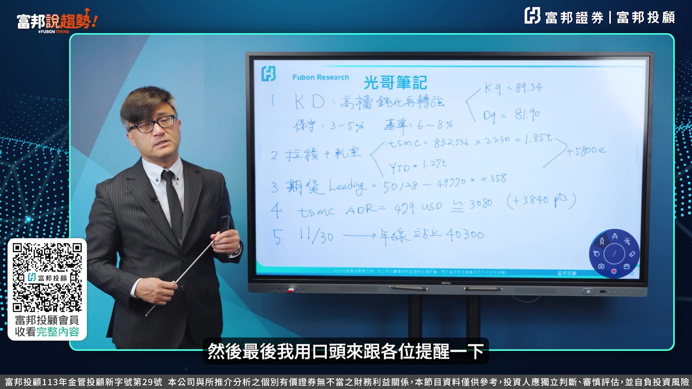

**逐字稿片段：** 比較Negative的部分 就是指數在攻上去之後 目前五萬點站上去之後 不要太高興也不要去追高 為什麼 因為它跟周線的乖離率 會來到3%以上 我用48601當時跟周線的乖離率 到3.8%來看的話 也差不多指數到五萬零 一百到五萬零兩百點的時候 它的跟周線的乖離率 也會來到3.5%附近 所以這部分可能就會呈現拉回 所以第一個 它的周線的這部分的一個乖離率 富邦數據小朋友要注意 當它突破3%附近的時候 短線上來看絕對會拉回 所以你必須要小心 它站上去的時候 千萬記住不要追高 這是第一個 第二個就是十年關懷值率 我們剛剛雖然判斷 十Y跟指數這部分的關聯性 雖然是要回到所謂的 這個獲利成長率 但是它還是會在短線上 會去影響到股市 所以假設目前它5.3 5.4 它在衝的過程裡面 你的這部分的財報 沒有辦法跟上來 他短線上還是會影響到美股 美股會影響到臺股 畢竟美股跟臺股的聯動性 有將近八成 所以雖然臺灣是賣產值的 但是基本上聯動性 還是大的情況之下 還是要觀察第二點 時間關係指數率 現在目前看起來 還是相對在一個高檔 第三個是臺幣 美元最近轉強是因為日幣太弱 美元最近轉強是因為歐元太弱 美元最近轉強 臺幣也受到影響 所以臺幣在之前升到31.5 31.44的時候

**話題推測：** 切換至「比較Negative的部分」討論，預期畫面會顯示不利因素列表

---
