# fubonsec_TxT3-rZkQNs — 關鍵畫面索引

- 來源逐字稿：[fubonsec_TxT3-rZkQNs_FIN.srt](fubonsec_TxT3-rZkQNs_FIN.srt)
- 影片：https://www.youtube.com/watch?v=TxT3-rZkQNs
- 截圖數：18

## 00:00:17

**逐字稿片段：** 我們今天的標題叫做臺股五萬點的繁花, 有人看到機會, 有人看到風浪, 股債雙贏, 從債券轉折到臺股的極致頂峰。 我們一開始我們先來針對最近大家討論議題比較大的債券。 我想債券的這個殖利率上升 大家都把它歸咎在聯準會要升息 但是我用另外一個視角來跟各位做分享 那其實我在看整個債券殖利率的上升主要有三個因素 第一個我們可以看一下 主要是日債殖利率的創新高的拉動 我們可以看到這個整個日盈BOJ 在2024年3月份的時候 它長達8年的負利率開始啟動升息 然後他的10Y馬上就在這2024年到現在為止 馬上飆了三個百分點 你去看一下在整個過去來講

**話題推測：** 影片標題頁：臺股五萬點的繁花

---

## 00:01:08

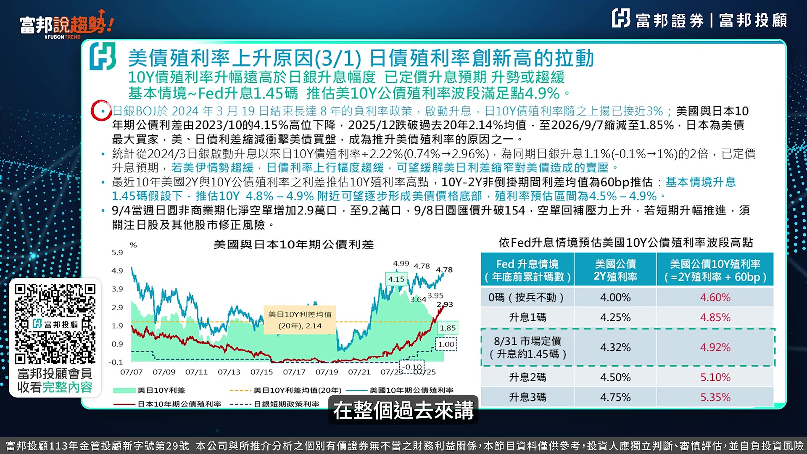

**逐字稿片段：** 每日的利差從4.15 降到2025年12月份的2.14到今年的1.85 到現在收斂到100多 所以你會發現說在過去來講 日本是美國主要的購債國 那假設你今天的這個利差收斂 那就是代表我不需要去買你這個美國的國債 我直接去買我本土的日本債就可以 所以會產生的這種企美債轉進日債的情況 因為日債殖利率升高 這第一個我們可以看到 第二個就是說在過去來講 日債殖利率真的漲得比 他的BOJ的這部分的一個官方的利率來得高 你看一下 在2024年3月份啟動的升息以來 SY殖利率漲了2.22個百分點 那同期的日本才升起1.1 等於說市場利率比它增加兩倍 這是看到日債殖利率往上升 所產生出來的這種所謂的賣美債來去買日債 這樣的情況 因為它的這部分的利差收斂

**話題推測：** 顯示美日利差走勢圖

---

## 00:02:11

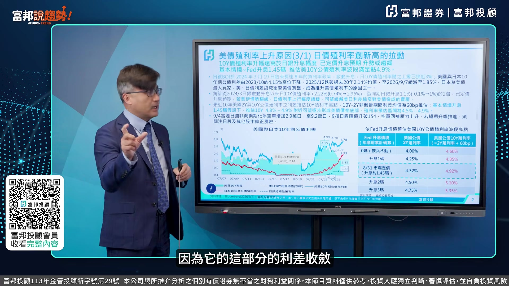

**逐字稿片段：** 然後再來看一下美債到底多少比較合理 我把兩年期的債券殖利率 跟10年前公債殖利率兩個相減 一般來講差不多是60個BP 那所以我們現在用市場上現在給的 這個交易出來的這部分的一個方向上來看的話 現在目前在8月31號定價是認為今年應該要升 一碼半 如果是一碼半的話以現在市場利率4.32 你10年債跟 兩年期債券的這個利差差不多是60個BP來看的話 其實10年債到4.9 所以他會一直往那個地方去 去邁進的主要理由是因為 從過去的這部分的一個大數據的分析上來看的話 它基本上都是差60個BP 如果差60個BP的話 其實目前看起來 應該其實也非常非常接近了 但是我們認為說9月份到底會不會升息 應該是在9月17號這個地方 聯總會公佈它整個利率的決策 我們的看法還是為此不變 所以這個地方的這個利率 假設為此不變 現在利率是3.5跟3.75的情況之下 其實兩年期的債券回到4.2到4.0 其實機會是比較高的 如果加上60個BP 4.6 4.7差不多是10年公開殖利率的位置 所以目前看起來主要理由是因為 日債殖利率往上走 造成了 這一次的這種所謂的美國債務殖利率跟著往上走的這種情況 我想這是第一個我覺得從日債殖利率升高所 影響到美債這部分的一個壓力 那當然 日債殖利率升高主要在反映 BOJ即將要在9月份做升息 我想這目前看起來應該是板上釘釘 沒有太大的問題 那我想這地方已經先行做反應 所以假設他已經先行反應的話 等到BOJ確定要升息的時候反而日債殖利率往下走 我覺得目前看起來就會 讓整個這個美債殖利率 在這個地方有機會見到一個相對的高點之後 開始往下走的這種機會 這是第一個我們看到 日債殖利率上升所導致的這部分的一個美日利差收斂 而造成的這個目前的這個債券價格的一個下殺主要理由 第二個 第二個美國的財政趨勢跟戒心還舊這部分 我想這部分是因為供給量實在太大

**話題推測：** 轉向分析美債殖利率的合理區間

---

## 00:04:22

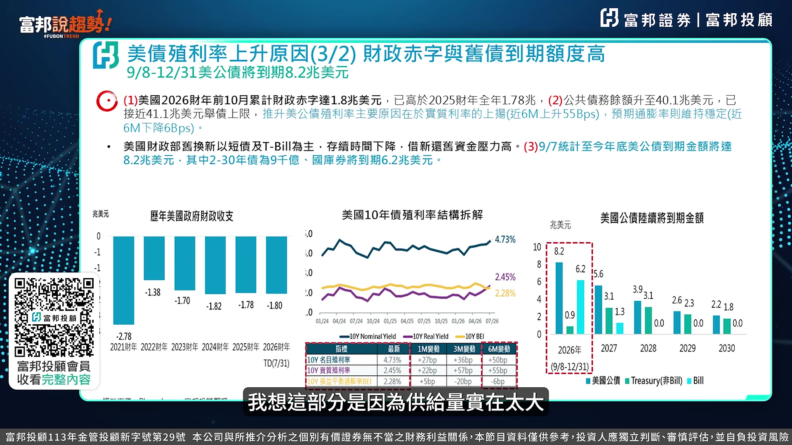

**逐字稿片段：** 你看一下2026年前10月份的財政趨勢是1.8兆 那高於2025年的財政全年的1.78兆 你看現在公債餘額已經來到40.1兆 公債淨中 已經來到歷史新高 這麼大趨勢他怎麼去解決 他這部分的債券的利息 越來越高 那這個地方又產生的戒心還舊 我們可以看到他戒心還舊這部分 到今天為止

**話題推測：** 顯示美國財政赤字規模圖表

---

## 00:04:49

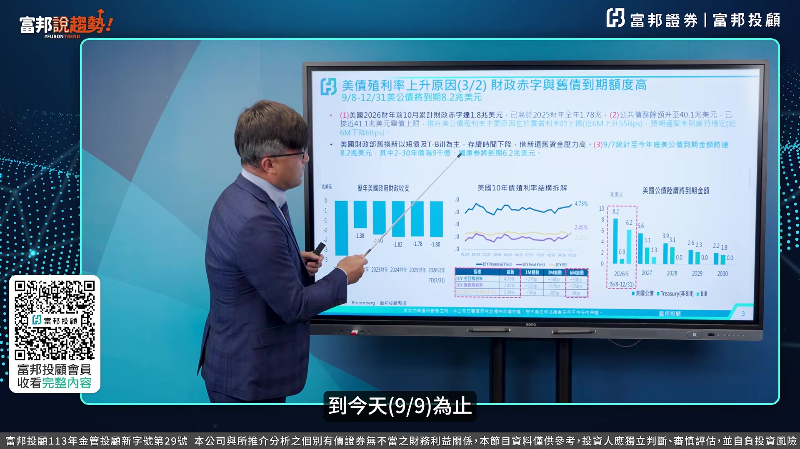

**逐字稿片段：** 目前債券到期的這部分的一個金額是8.2兆 兩年跟30年期是9000億 國庫券的部分是6.2兆 等於TBL部分是6.2兆 比較短期的這部分是6.2兆 你是不是要戒心還舊 當你要戒心還舊的過程裡面 你的供給量就增加 供給量增加的話 我想從這個部分我們可以看到 到底是不是通膨所影響的 我從這個表可以看出來 10Y的明目利率跟10Y的實質利率 我把兩個相減叫BEI BEI的部分你是-6個BP 那這個-6個BP這個數字來看的話 你看一下代表就是說 實質利率上漲的這個幅度 比明目利率來的高 那就代表說通膨其實沒有 實際上來這麼大 而是供給量增加 導致實質利率的這部分的上升 所以這一塊的BEI的這部分的 一個差額也可以看出來 然後再從右邊的到起的 借新還舊的這部分的量來看的話 其實是第二個導致美債殖利率上升的第二個理由 而不是我們一直在focus在通膨的部分

**話題推測：** 顯示美國到期債券規模明細

---

## 00:05:52

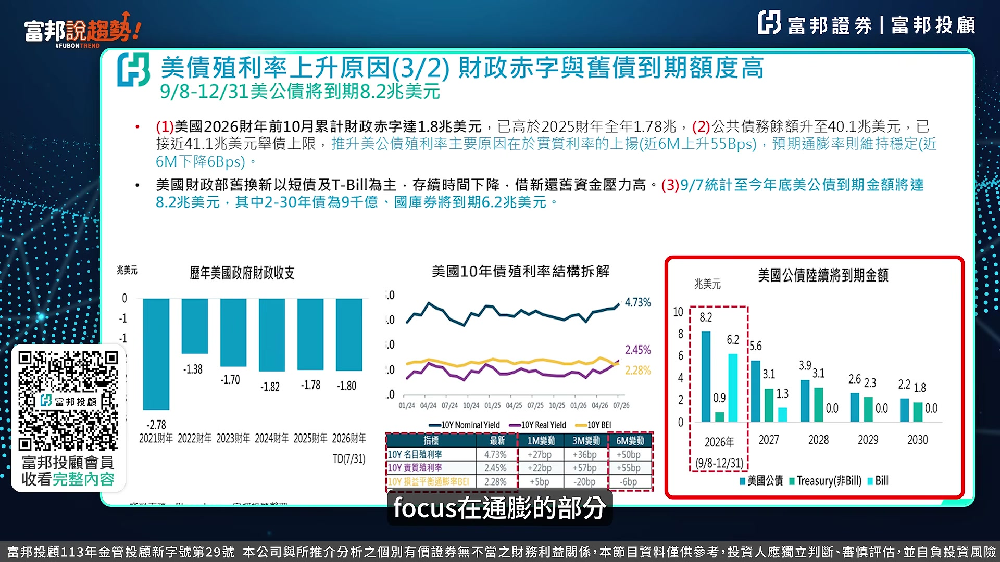

**逐字稿片段：** 我們看第三個 AI AI它必須要不斷的發債

**話題推測：** 第三個因素：AI相關發債

---

## 00:05:58

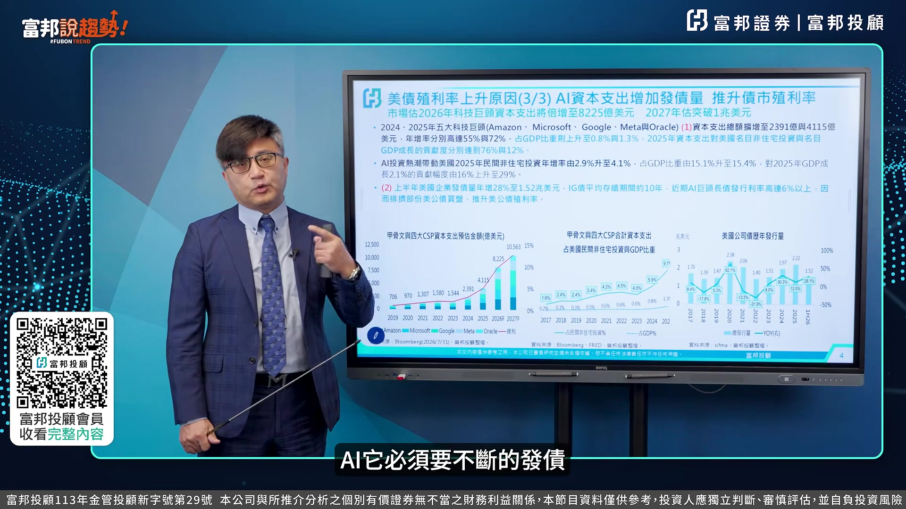

**逐字稿片段：** 我們從這三張表可以看出來 第一個是甲骨跟四大CSP廠的資本豬的預估的金額 你可以看到非常陡峭 從2023年到2024年 應該是成長了70幾% 然後再來2025年又成長了一倍 2026年也是成長八成 然後到2027年也成長28% 等於說它的CAPEX不斷的增加 然後你再看它佔它的這部分

**話題推測：** 顯示AI產業資本支出與發債概況的三合一圖表

---

## 00:06:24

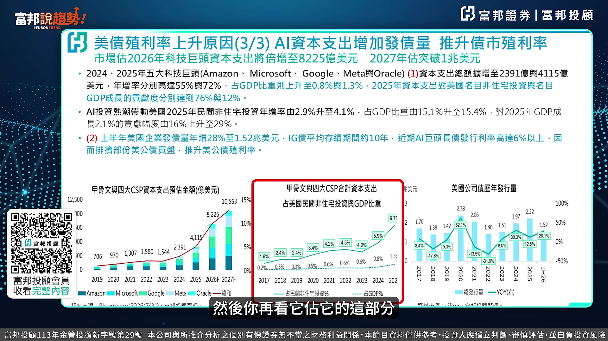

**逐字稿片段：** 民間住宅的投資跟GDP的比重 也是不斷的上升喔 所以這部分的一個AI的 這本資本支付計畫 大幅的增加 那你看AI才剛開始第三年 其實它要賺成獲利的 這樣的機會還沒那麼快 所以它怎麼辦 右邊

**話題推測：** 顯示民間住宅投資佔GDP比重圖

---

## 00:06:41

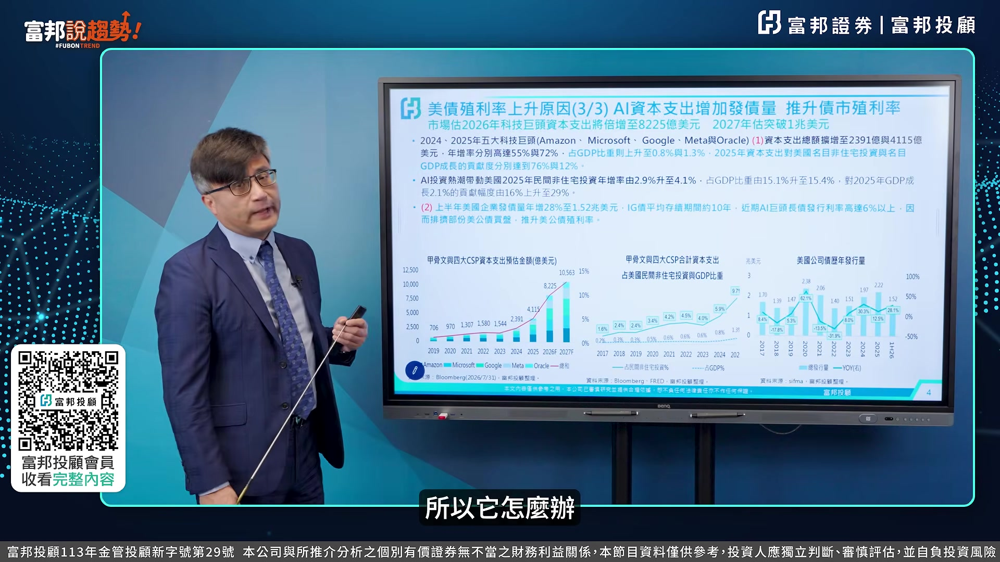

**逐字稿片段：** 它也要發債 你看今年上半年 他發的債券的金額差不多是1.52兆 如果是上下半年1比1的話 今年發3兆 3兆應該是創下歷年來 美國公司債的一個新高 那你這部分增加的這個量 是不是會影響美國公債殖利率 而且你看 他這個IG等級的這部分債的殖利率 高達6%以上 高達6%以上的話 其實他就會影響到目前 美國的這部分的一個債券殖利率 因為以現在美債差不多4.7 4.8十年期 兩年期在5.2 可是你單單以IG等級的這部分 它就已經高達6%以上的話 就會產生出這部分的比較效應 因為供給量增加 所以這三個因素我們認為 應該是導致今年的債券殖利率居高不下 債券的價格不斷的在這個地方做盤底 這個是主要的三個理由 所以我們目前看起來 整體的這部分的一個利率政策 這已經來到九月份 接下來剩 九月份完之後剩兩次的會議 那兩次的會議裡面我們認為說 基本上以現在AI的發展上來看 還有借新還舊的這部分的一個壓力 情況之下 我們認為或許它面臨到的是 內部川普的壓力 外部市場上利率所交易出來的 這部分的一個高的殖利率 我覺得它還是要回歸基本面來看的話 回歸基本面 我們認為說目前的債券殖利率 應該是相對的高點 所以我們進入一個結論就是 我們覺得現在應該是從短端的養券債券的carry 逐步的拉長存續期間到中長債 我們從三個派圖可以看出來 第一個短債的部分 在目前Stage 1這個階段來看的話 短債7成 中債30% 長債0% 等於說這個階段應該是以短債為主 然後進入第二階段 現在在第二階段 短債40% 中債還是40% 稍微增加10% 長債部分開始增加上來 等於說目前看起來 短債部分用收息來做投資 然後長債部分以capital gain 然後到第三階段就部分把短債部分由原來的70% 40%降到20%中債部分還是維持在 30%然後長債部分拉上來 進入第三階段 那可能就是差不多在第四季目 然後 下面的部分是搭配著什麼 搭配著這個所謂的投資等級的債券 我們這個第一個Stage 1是公債50 信用債50 你會發現公債50% 投資等級債券30% 非投資等級債券20% 這個再把它放進來 下面這個是屬於IG等級的 還有非IG等級的 所以以這樣子的一個內容上來看 我們再搭配這邊的ETF 我覺得會是在整體 我們覺得在今年第四季 明年迎接明年的第一季的這部分 一個債券的一個投資策略 會是比較好的這樣的一個建議 這個是我們針對 一開始我們先針對債券市場 這個地方先跟富邦說去吃的好朋友做這樣的說明 那我們接下來來看一下產業部分 產業部分的話我想最近大家還是在討論AI 我想我們在前面幾集的部分有針對AI是否會有Bubble的這樣的一個情況 也已經有做這樣的說明

**話題推測：** 顯示美國企業債發行量圖表

---

## 00:10:00

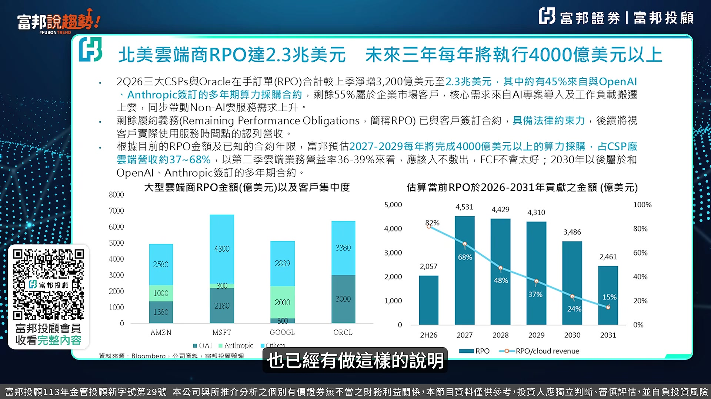

**逐字稿片段：** 好那我們現在把AI的這部分的雲端的RPO 叫Remaining Performance Obligation 這個叫做剩餘的履約義務的這部分的一個金額 我們可以看到Microsoft Google跟Oracle 尤其Oracle它這部分的比重是蠻高的 等於說在RPO的部分 其實它是已經跟客戶有簽約合約 具備法律的約束力 等於說它是一個先行指標

**話題推測：** 分析雲端服務商RPO（剩餘履約義務）圖表

---

## 00:10:30

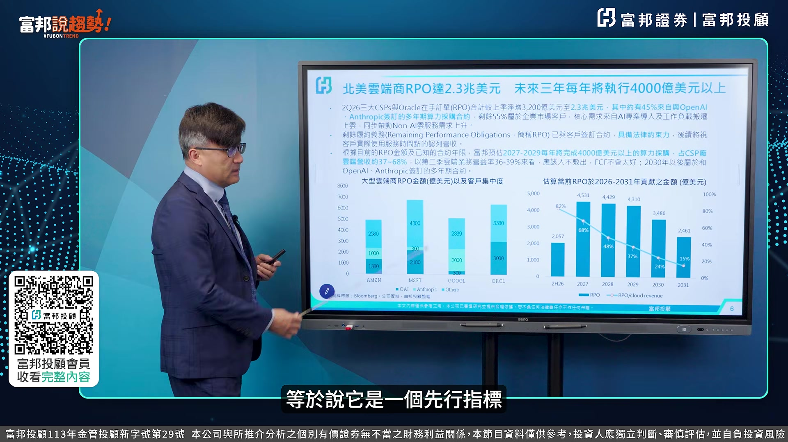

**逐字稿片段：** 然後我們再去搭配RPO跟它的營收比 你會發現2020年的上半年是82% 到明年是68% 48% 37%的這樣的一個比重 就代表就是說RPO是一個先行指標 那代表就是它在未來的營收的成長動力 其實是可以持續做成長 所以目前看起來營收落實持續成長 我們這個地方在搭配它這部分的一個比重來判斷 是否它這個RPO是否有違約 目前看起來從這預測上的角度上來看 沒有違約而且慢慢在實現 所以在整體未來三年的每年執行的部分的一個 一個金額上來看差不多都是4000多億以上 所以這個部分我目前在把關的這個角度從這個視角上來看應該還沒有 所謂的這種bubble或者是有default的問題 這是我們從 產業角度來做一些update 好那接下來我們來看一下

**話題推測：** 顯示RPO與營收比重走勢圖

---

## 00:11:27

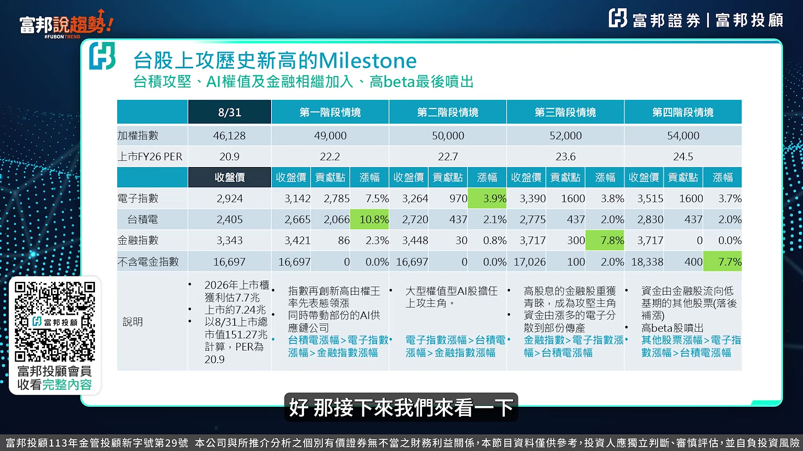

**逐字稿片段：** 我們對股市的看法 這張表 應該是我們現在四個情境 那現在到底到什麼情境 我們在前面幾次的這個 富邦說區市的內容裡面有提到 我們對今年的股市的看法 那時候我們做論壇的時候 其實我們是看超過5萬點以上 目前看法不變 今年我們對上市櫃的 獲利數字的預測上來看是7.7兆 上市差不多是7.24兆 以8月31號的這部分的上市 這個市值差不多151兆的角度上來看 PER超不到21倍 所以這樣子的一個PE 你去抓22到24.5 其實是非常合理的 從挑戰歷史新高的 這樣的一個Milestone的角度上來看 從電子還有我們的這個護國神山 到金融指數跟不含電金的指數的這部分 其實你可以算出指數的位置 應該是蠻具有客觀性 而且具有參考性的 所以我覺得在整個行情的判斷上來看 從一路走來到今天為止 其實我們的判斷上 一直都是方向上來看都沒有太大的偏離 應該都是以基本面出發 來當作是一個重點 好那到底明年的這部分的一個 AI的這樣的一個內容上來看 到底會有產生什麼樣變化

**話題推測：** 新單元：股市展望

---

## 00:12:49

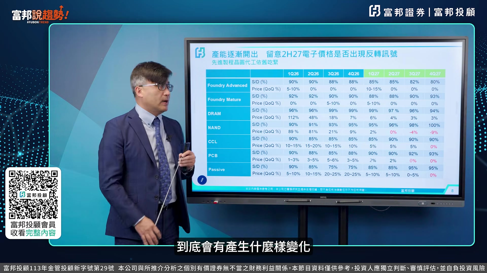

**逐字稿片段：** 這張表非常非常的重要 我們團隊花了很多時間 把Supply跟Demand 從今年的第一季到明年的第一四季 幫你們做這樣的一個分析 我想這個含金量很高 你先進的這個Foundry 就是晶圓代工到成熟的晶圓代工的 這部分的一個S3D 你會發現先進的這部分Foundry 它是明年四季全部都是 Shortage Supply 除以 Demand 代表說 Demand 遠大於 Supply 的這種情況 這個目前看起來 Advanced 的 Fungi 其實是最 Solid 的 然後成熟的部分是差不多 93% 那目前看起來 以這個 1 2 3 四季 我們看到第四季的角度上來看的話

**話題推測：** 顯示半導體及零組件供需與價格趨勢分析總表

---

## 00:13:34

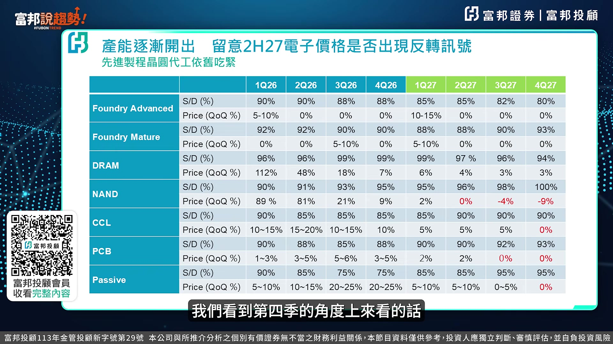

**逐字稿片段：** 其實目前比較有這個 Balance 應該是 NAND NAND Flash 的部分你看 你看 從明年的第一季95 96 98 100到Balance 所以它這部分的一個價格 可能就不會像這個 其他的這部分component漲這麼多 所以你要看的這部分的一個反轉的訊號 其實就是看它的這個surprise with demand

**話題推測：** 在總表中特別標註NAND Flash的供需狀況

---

## 00:13:58

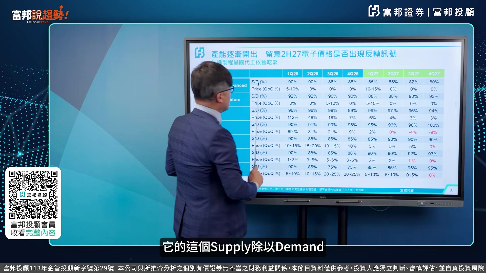

**逐字稿片段：** 好 那再來看價格 價格部分來看 從明年的第一季 第二季 第三季 第四季 出現紅色字的部分 就是代表它在未來的價格的上漲 已經趨緩 你會發現剛剛講的NAM 還有在這個PCB的部分 在明年的下半年開始 它這個價格可能就漲不大動囉 被動元件到明年的第四季 所以這張表我覺得 你一定要把它截圖把它留下來 去做這部分的判斷 因為這些component 它含帶了幾個重點 一 它是成長性的股票 二 它是有報價的 所以它也兼具景氣循環股 景氣循環股它是買在報價 買在報價的過程裡面 就變成說是買在高本益比 賣在低本益比的這種內容 它是摻雜在一起 所以我們今天才把這個表 做出來從Supply跟Demand 還有Price的這部分的QOQ 給各位做這樣的一個參考 我想這個會是在 整體的這部分的 類股的佈局上面來看 我覺得是比較重要的重點 我想這部分我想就再提供給 給我們的不幫說去找朋友來做說明 那最後我想還是要

**話題推測：** 在總表中特別標註各零組件的價格趨勢

---

## 00:15:14

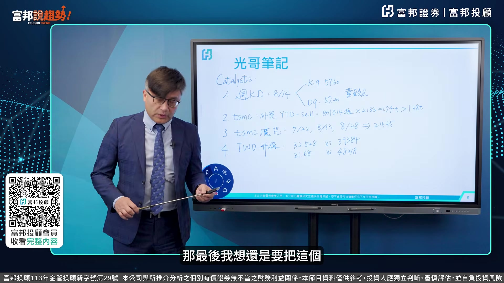

**逐字稿片段：** 把這個我的光哥筆記的這部分 來跟各位做一下分享 我對9月份的整個 單月份的短線的看法上來看的話 我覺得這個行情 如我們在 之前39384的時候的看法一樣 這行情應該還是會往上走 那目前看起來已經來到47,000點 那我們認為說短線上來看 9月份的行情裡面 主要還是會有機會 就往48,000點那個地方來挑戰 但是否是否會過歷史性高 我覺得可能在10月份機會比較高 等於說在47000 48000的地方 可能會上下震盪 那目前看好理由有幾個 第一個 我在之前有跟各位富邦數據是好朋友說到

**話題推測：** 新單元：光哥筆記，9月短線行情看法

---

## 00:15:53

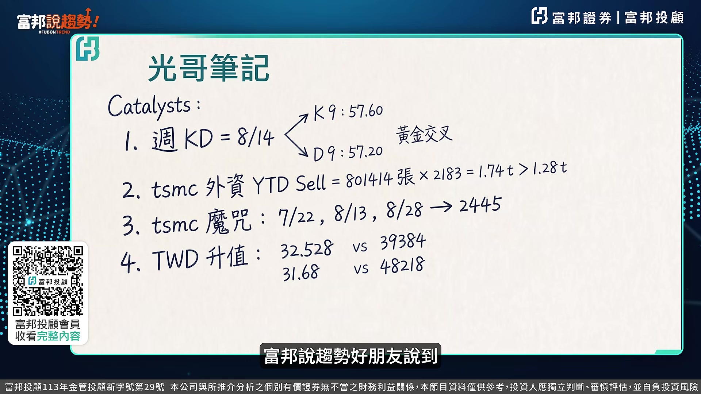

**逐字稿片段：** 8月14號周KD黃金交叉 你看周KD當時8月14號是57.6 D是57.2 當時是45000多點 當黃金交叉之後的 40天到60天 指數再漲5到12% 若是當時是4萬5千多點乘以5到12%的話 其實指數會直接到4萬8到5萬點以上 所以這個部分的黃金交叉意義非凡 所以我想當時我在8月7號這麼大膽的判斷 主要是因為我從技術形態裡面看到它黃金交叉 後面的40天60天指數會往上走 所以目前看起來還在路上 第二個臺積電 從1月份算到9月份的這部分的均價 它從1700開始賣 賣到現在2400多 均價在2183塊 他總共賣超臺積電1.74兆 到今天為止 外資整個賣超臺股的部分是1.28兆 等於說你把1.74減掉1.28兆 其實他有4000多億 等於說他主要是賣臺積電 做什麼 做所謂的期貨的這部分的期指的價差套利

**話題推測：** 理由一：周KD黃金交叉的技術分析圖

---

## 00:17:00

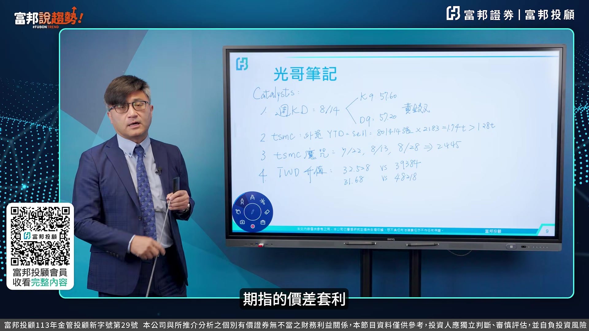

**逐字稿片段：** 第三個臺積電魔咒 7月22號8月13號8月28號2445突破了 2445塊錢的臺積電突破之後 其實它應該是往前高2555塊錢 這個地方來邁進 如果往那個地方去移動的話 其實貢獻的點數有將近800點 所以這個地方的一個魔咒過了之後 其實目前看起來挑戰歷史新高 應該是值之可待 再來是第四個臺幣 當初39384臺幣貶到32.528 當初48218臺幣是31.6到31.7 現在臺幣多少 今天我們在錄影的時間 臺幣在盤中是31.47 31.5 那現在已經比當時31.68升值來的更多 4828會不會過 所以在整體的行情的看法上來看 我覺得目前看起來整個正面的因素其實是存在的 再搭配我們剛剛的這個基本面的這部分的因素 所以我覺得在整體的行情 應該是進入選股不選市 方向上來看應該沒有太大的懸念 比較負面因素可能要提醒投資人士 日幣的升值 Carrier Trade的迴流 所以這部分可能會是在 日央升息完之後 日幣的這部分的一個方向 假設日幣升破150 那這部分的Carrier Trade 可能會啟動 那現在還沒有啟動的原因 是因為我們看到 日元放空的這部分的一個口數

**話題推測：** 理由三：台積電股價突破重要關卡圖

---
