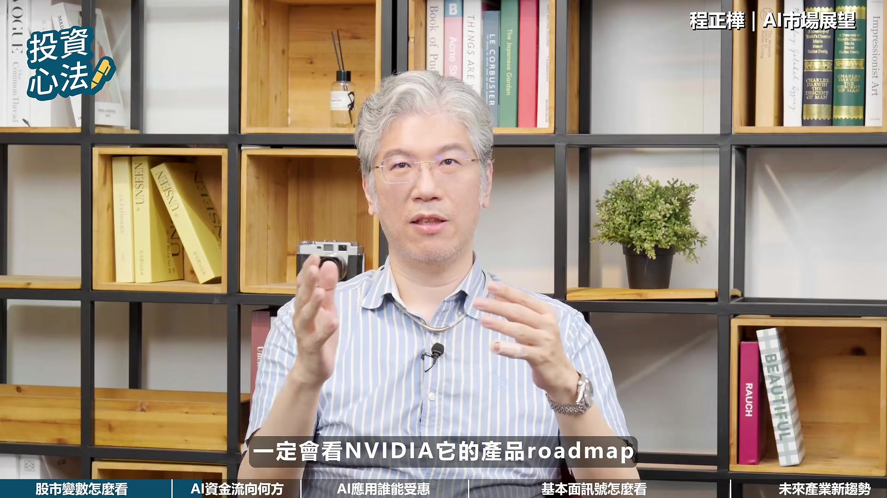

# fubonsec_aalD8SBHx-w — 關鍵畫面索引

- 來源逐字稿：[fubonsec_aalD8SBHx-w_FIN.srt](fubonsec_aalD8SBHx-w_FIN.srt)
- 影片：https://www.youtube.com/watch?v=aalD8SBHx-w
- 截圖數：18

## 00:00:23

**逐字稿片段：** AI時代來臨 投資也能充滿智慧 富邦AI Pro專業分析資料 透視趨勢 輕鬆一點掌握全球市場脈動 有AI 投資更Pro 現在就點擊知識欄 趕快去下載

**話題推測：** 富邦AI Pro產品廣告

---

## 00:00:37

**逐字稿片段：** 歡迎收看富邦證券YouTube頻道 我是Sabrina 經過前兩集的討論 相信大家對於AI商業化進程 和產業發展有了更完整的認識 不過隨著AI相關產業 歷經一波快速成長 市場也開始關注未來資金流向 以及高檔震盪的風險 今天我們就邀請騰訊投資的投資長 陳振華 建掌 帶大家一起來分析 建掌好 哈囉主持人好 各位觀眾朋友大家好 首先想請教建掌

**話題推測：** 節目開場與主持人介紹

---

## 00:01:08

**逐字稿片段：** 您如何來看待 2026年下半年全球股市 市場最大的變化是什麼呢 應該這樣講 先討論崩盤的原因嘛 那崩盤的原因其實第一個是 本來籌碼就很亂 那其實如果看

**話題推測：** 提問：2026年下半年全球股市最大變化

---

## 00:01:21

**逐字稿片段：** 不管是一般我們看什麼 貪婪恐慌指數啊 牛熊指標啊 或是融資育兒啊 那這些呢可以觀察指標 你會發現籌碼就是很亂 那籌碼亂不代表一定會跌 它只是代表你的震盪會比較激烈 那通常股價漲點我們是看景氣有沒有優於預期或是不如預期 那其實六七月份以來其實景氣是有一點不如預期的 那不如預期的話包括幾個 第一個是在六月底七月初的時候

**話題推測：** 提及貪婪恐慌指數、牛熊指標、融資餘額等觀察指標

---

## 00:01:47

**逐字稿片段：** 市場在傳就是Entropic的ARR成長率不如預期 那就剛講它之前成長飛快 但是六七月稍微有一點漸緩的一個趨勢 就到了五六月之後就有可能是卡算力不足或等等各種原因 那它的成長率稍微有一點趨緩 那當然如果你要討論到全球股市的話 我覺得另外幾個都是比較重金的因素 這就比較不好說

**話題推測：** 討論Entropic的ARR成長率不如預期

---

## 00:02:07

**逐字稿片段：** 第一個當然是打仗 那到底伊朗戰爭要拖到什麼時候 要打不打 我們只知道川普不是在tackle 就是在tackle的路上 但是三不五時就會嚇你一下 這個是免不了的事情 那第二個就是因為這樣子 所以導致最近看到 美國十年期公債殖利率也飆得蠻高的 那當然進一步的往上走 那我相信對股市會有很大的壓力 前兩年我們也看過 就是債券莫名其妙跌了一個月之後 股市一定會被拖累的 這是連動的 所以債市如果一直低迷的話 這個對我們也會有一些concern 大概會需要注意 所以總金面的話 當然還是有一些這種疑慮要 要考量進來啦 但基本面我們剛講的就是看算力需求 有沒有開始繼續回溫的一個現象 AI產業進入了高檔震盪期

**話題推測：** 討論伊朗戰爭對全球股市的影響

---

## 00:02:55

**逐字稿片段：** 您認為市場資金 債富可能聚焦哪一些AI產業的環節 其實都沒有太大變化 就是對我們來講 一定都是整個供應鏈裡面相對來說 就不管是新的技術或者是一些新的材料 就剛剛講的一定就是說看

**話題推測：** 提問：AI產業高檔震盪，市場資金將聚焦哪些環節

---

## 00:03:13

**逐字稿片段：** 我們一定會看NVIDIA它的產品roadmap 那它的產品的這個技術藍圖裡面 它接下來規劃產品它大概是哪些是新的東西 那然後哪些是新的零件原料 它的用量會增加最多 那比如說前一陣子我們最常講的就是CPU 就是光的部分

**話題推測：** 提及NVIDIA的產品roadmap

---

## 00:03:29

**逐字稿片段：** 那很明顯的它在Rubin Ultra 就是2027年下半年這個產品 他就會開始大量的用CPU的這個架構 那用了這個架構 所以相對來講對光的這個供應鏈 大家的預期就會比較高 當然市場之前預期很高 所以國家漲上去也跌得很兇 因為籌碼很亂 那但是之所以會漲到那種 本夢比很誇張的地步 就是因為可以看到這是未來 可能以技術藍圖上面 看起來成長最明顯的一塊 大概是這樣子 所以針對 其實說穿了還是固定了幾個東西

**話題推測：** 提及NVIDIA Rubin Ultra產品將大量使用CPU(光)架構

---

## 00:03:59

**逐字稿片段：** 就是這個光通訊 或者是一些高速傳輸的一些材料 不管是PCB版等等的一些東西 或者是其他 當然可能就是Compatibility去看一下 就比如說不管是這個Memory 記憶體或者是其他的一些相關的一些 這種我們叫的Compatibility這種原物料 是不是有哪些隨著這個產品的演進 它的用量會開始比較會更多 然後會有精確的一個現象 大概是這樣子 這兩年市場關注的焦點

**話題推測：** 列舉光通訊、高速傳輸材料、PCB等關鍵零組件

---

## 00:04:33

**逐字稿片段：** 幾乎都集中在AI的硬體供應鏈 那未來是不是有可能逐漸的轉向 AI的應用端 那有哪一些的產業最有機會收回 轉到AI應用端這個一定會 那只是說對臺灣這邊來講比較麻煩 是我們只有硬體 所以就有點像當年 比如說我們在研究PC硬體 研究Smartphone的硬體 那就在玩臺灣的股票 但是整道硬體 比如說到了一個界限之後 大家就在開始玩互聯網

**話題推測：** 提問：AI投資焦點是否會從硬體轉向應用端

---

## 00:04:59

**逐字稿片段：** 比如說就開始玩美國的Facebook 然後開始玩Google Microsoft 玩所謂SaaS的行業 然後中國就是玩幾個互聯網巨頭 那接下來一定也往這邊走 硬體發展到某個階段就會往軟體走 那往軟體走這邊很 不幸的這個比較不是臺灣的強項 所以到時候可能會看美股 就會比較多一些這方面的機會 那當然這裡面第一個一定是CSP 因為CSP剛剛講的不管Google 這個Microsoft 他們其實這幾年投資這麼多 投資這麼積極 投到現金流都要變成負的 理由就是因為他們知道這個未來帶來的現金流 跟未來的獲利很可觀 所以這兩三年投完之後 這個折舊結束 他們以後的現金流的 那個進來的幅度會非常驚人 所以AI的算力需求 如果維持在一定的水準 並沒有忽然掉下來的話 CSP他們的獲利 以後一定會顯著的提升 那以前他們就是巨頭了 以後是更大的巨頭 所以這幾個公司都會是 CSP這一塊一定是蠻值得看的 這是一個角度 那以及就是 幫客人去用這些模型的公司 一些agent 那這些相關的公司 是不是有一些投資機會 這可能就再進一步再看 目前都小公司 比如說像我們剛剛提到的OpenRouter 那它其實最近就是也有一輪募資啊等等 它的市值也增加不少之類的 就是說當然它現在它就是一個更小的公司 但是它在這上面也有一些相關的生意可以做 那也是靠著AI起來的一家公司 那這上面也會是之後可能可以關注的一些投資機會 只是剛剛提到的這類型的公司在臺灣比較少 所以就是還是看美股這樣子 美股或是鹿港股可能會比較多一點 那對於一般投資人來說

**話題推測：** 提及Facebook、Google、Microsoft等互聯網及SaaS巨頭

---

## 00:06:38

**逐字稿片段：** 要如何觀察市場的變化呢 那面對下半年市場的波動 投資人可以從哪些的角度來觀察 AI產業和相關企業的基本面 剛剛講的是硬體投資告一個段落 然後開始已經結束了 要到軟體的這一段 那硬體投資什麼時候告一個段落 現在看起來都還不知道 明年一定還是一個資本支出 成長很高的一年 那現在你說2028年之後 會不會有很大變數 這個可能有 但明年因為股市一定領先一年看 今年可以狂還是因為覺得明年不錯 明年還能不能狂還就要看後年能不能不錯 對那剛剛講的明年資本支出 如果進一步的從今年的

**話題推測：** 提問：一般投資人如何觀察AI產業與企業基本面

---

## 00:07:17

**逐字稿片段：** 四五大CSV今天是8000億 明年大概是1.2 1.4兆 那後年還能夠增加多少 它能夠變2兆 這個是另外一個要考慮的問題 那以及就是說 現在不是他們能不能花錢的問題 因為他們現金流也會越來越強 他們就算願意花錢 到時候的問題是 有沒有那麼多的電 有沒有那麼多的地 我們剛剛講到 然後其實現在美國在蓋Data Center 已經遇到很多瓶頸了 很多地方的抗爭 他們光是連現在 剛剛講的8000億資本之初 蓋了這麼多Data Center 就有很多在Delay 然後或者是被Cancel掉 那可能要另外找地方來弄 環評做比較久 我如果未來一年要蓋兩倍以上的產能 那我哪裡找到這些地方 那抗爭可能會更嚴重 那會不會蓋不出來 所以到最後你還要考慮到 客觀環境面的一個問題 導致會不會是明年 就是最後資本指數的高峰 後年上不去了 因為你也沒有這麼多的基礎設施 可以趕上你的腳步 那這些都是需要考慮的地方 所以 對我們來說 就是明年的確有可能是硬體 的最後好的一年 當然不是說後來會掉下來 只是說後年成長率可能就會趨緩 因為沒有那麼多地可以找 或那麼多店可以提供 大概是這個樣子 有哪些的關鍵訊號是值得需要留意的呢 關鍵訊號 就剛剛提到說 你要觀察到最底端的算力需求 其實就是你要去追OpenRouter的資料 那OpenRouter也是公開網站 大家都可以上去看 那你要怎麼整理這些資料 這個大家都看得到 那剛剛講它有一定的參考性 但不是唯一的指標 那再來就是類似就是GPU的價格 就是目前GPU租賃價格到底是怎麼樣 那當然Bloomberg上面有 那你沒有訂閱Bloomberg 那一些網絡 說實在自己去Amazon上面註冊 然後說你要去租 那你也可以看到它各個地方 美國各個Data Center的報價 所以是都不一樣 每天都可以看 就是自己去註冊一個賬號 自己去追蹤 所以當然要很花時間 所以實際上要 真的一般投資人要很認真的研究到 最底層的AI需求的變化 那這些指標都是可以自己去follow up 只是要花時間 要去整理 那其他的 說實在如果要看臺灣的供應鏈的 訂單狀況等等的 這都是落後指標了 以現在來講其實都是 因為這已經是一層一層 就是一定要算力需求很好 然後CSP才會繼續投資 那他們才會來這邊加單買這個東西 那所以他們真的看到不好 到他們開始砍單 這中間可能隔了三個月到半年 所以你等到聽到臺灣公司說 訂單被砍的時候 股價搞不好已經跌三個月到半年了 所以我們還想請建長來幫我們展望未來

**話題推測：** 討論今年與明年CSP資本支出數字 (8000億, 1.2-1.4兆)

---

## 00:09:55

**逐字稿片段：** 除了AI之外 未來三到五年 有哪一些的新趨勢是值得關注的 或是有哪一些的產業 有機會成為下一波的市場焦點呢 應該說以這個Jensen之前在講的 我們現在是今年起來就是靠Agentic AI 就代理型的AI 那往後看其實一定是另外幾個

**話題推測：** 提問：未來三到五年除AI外的新趨勢與市場焦點

---

## 00:10:13

**逐字稿片段：** 一個是AGAI的部分 那一個是我們叫Physical AI的部分 那AGAI當然就是看你的這個AI應用 能不能夠普及到所有人的每個產品 不管是手機或是電腦 那當然AGAI理論上是有機會 看起來越做越好了 但現在卡一個瓶頸是記憶體太貴 所以當你要跑AGAI 你的手機也好PC也好 你的記憶體的容量就不能太小 偏偏記憶體這兩年又長得非常誇張 所以你要看到消費性電子的復甦 其實不太容易 因為記憶體就卡住了很多地方 所以可能要等到過一兩年 記憶體價格變回比較合理的階段的時候 再看看AGI有沒有機會起來 另外一個剛剛講的Physical AI

**話題推測：** 介紹AGAI (General AI) 和 Physical AI 兩大趨勢

---

## 00:10:50

**逐字稿片段：** 其實一般就是在講機器人 或是在講自駕車 類似這類型的一個應用 目前的技術還沒有很成熟 但是剛剛講到三五年的角度 三五年我相信機器人 應該會變成一個蠻成熟的一個產品 那不敢說是已經跟電影裡面一樣 那麼的栩栩如生 然後完全懂 但是我覺得佛羅很多 簡單的應用應該說 可以不管是工廠的一些幫忙 或是一些家庭的一些 簡單的一些掃地的這種 簡單的一些應用 我相信這種人形機器人的 大概三五年的時間給它 它應該會變成一個還算成熟的產品 那它身上用到的半導體零件 感測器或者一些機構元件 也是一個非常 產資也是會是一個很大的行業 所以我覺得這也是另外一個 值得期待的地方

**話題推測：** 說明Physical AI即為機器人與自駕車應用

---

## 00:11:35

**逐字稿片段：** 再次感謝建掌的精彩分享 如果喜歡今天的內容 也歡迎幫我們按贊訂閱 並開啟小鈴鐺 鎖定富邦振政的頻道 才不會錯過最新的市場觀點 和投資趨勢分析哦 我們下次見 拜拜

**話題推測：** 節目結尾與感謝詞

---
