# fubonsec_cdsJ6wyuULM — 關鍵畫面索引

- 來源逐字稿：[fubonsec_cdsJ6wyuULM_FIN.srt](fubonsec_cdsJ6wyuULM_FIN.srt)
- 影片：https://www.youtube.com/watch?v=cdsJ6wyuULM
- 截圖數：41

## 00:00:30

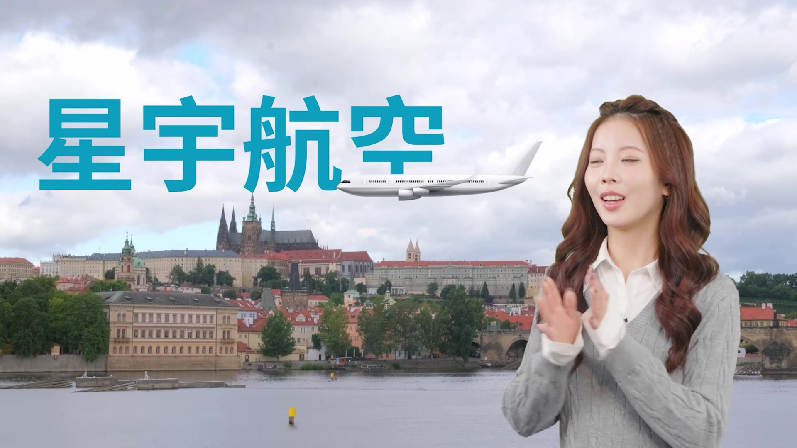

**逐字稿片段：** 航空布拉格 商務艙 雙人機票等你抽 心動不如行動 火速開戶做任務囉

**話題推測：** 節目贊助廣告或活動說明畫面

---

## 00:00:36

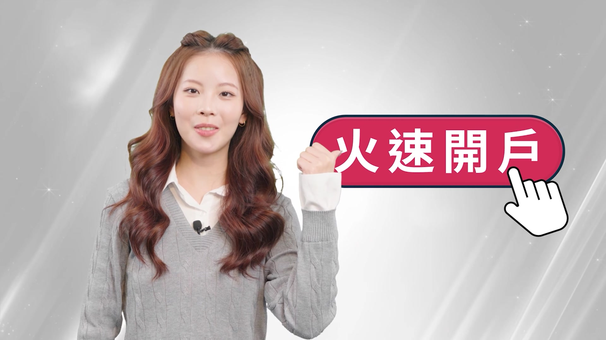

**逐字稿片段：** 各位觀眾大家好 我是主持人Nora 歡迎收看今天不聊股票 今天我們真的不聊股票 因為今天要聊的是比股票漲跌更重要的未來趨勢

**話題推測：** 主持人Nora開場介紹畫面

---

## 00:00:47

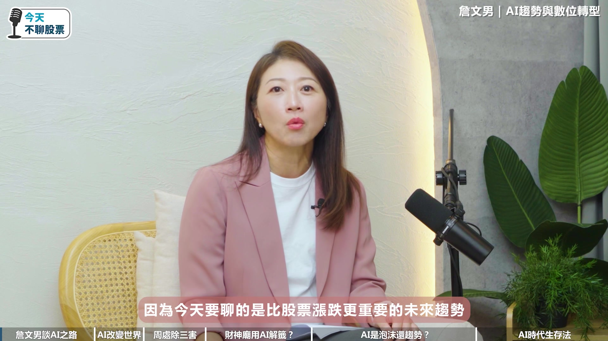

**逐字稿片段：** 今天我們邀請的來賓是企業公認數位轉型領航員 數位轉型學院的院長 詹文南老師 主持人好 各位觀眾好 非常開心有這個機會來上今天不聊股票 因為老師經歷非常的豐富 請老師可不可以稍微簡單的介紹一下 您過去的豐富的經歷呢 主持人這樣問我 其實讓我有點為難 因為講太好大家不太相信 講得不太好又覺得說 這個人請來幹嘛這樣子 所以我還是先講一下

**話題推測：** 來賓詹文南老師的姓名與頭銜介紹畫面

---

## 00:01:19

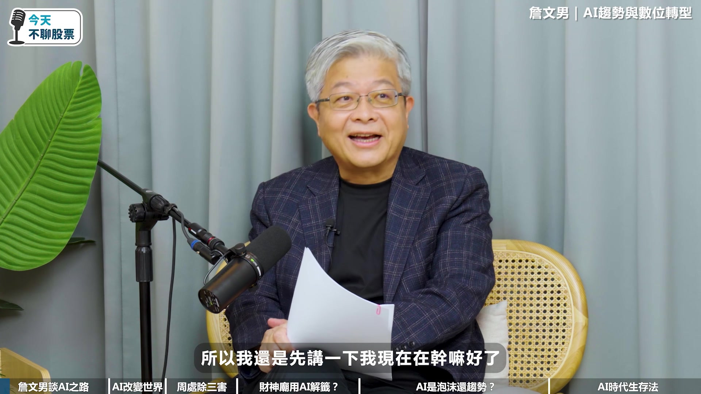

**逐字稿片段：** 我現在在幹嘛好了 我是張文南 我在臺大商業所跟政大EMBA教書 那這是我這五年的主要的工作 但是我五年前呢 等於說我的職業生涯 過去三十年 是在資策會產業情報研究所 我們稱為資策會MIC 擔任所長的工作 那這個機構呢 是經濟部底下的財政法人 也就是智庫 那主要的服務就是政府機構跟民間 擔任這個像經濟部啊 國發會啊 甚至行政院總統府啊 就是他們我們在 在破壞未來的產業政策的時候 我們大概有將近300個同仁 在做高科技產業的研究 因為要研究這個產業趨勢 所以我們有掌握到一些市場的變化 因此我們會把這些情報資訊 提供給產業界 所以我們也擔任產業顧問的工作 所以在我過去主要的生涯 就是政府智庫跟產業顧問 這樣子的一個主要的任務跟角色 首先我們想問問院長 那其實AI的發展已經超過70年了

**話題推測：** 詹老師現職（臺大商業所、政大EMBA）說明畫面

---

## 00:02:24

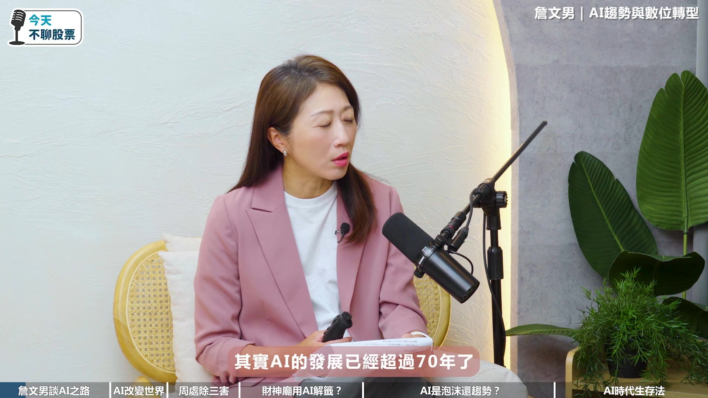

**逐字稿片段：** 從這個1956年開始定義AI這個名詞開始 那到了2016年 其實那個AlphaGo全部人都在看 它打敗了就是世界的那個奇王李適時 然後再到2022年 這個Chad GPT橫空而逝 那以前我們在看這個AI就覺得 好像在看戲很好玩 它到底能不能打敗人類了 那它出來之後呢 那我們想說為什麼這一次 AI真的是好像 動到了人類的腦袋的部分 剛剛主持人提到說 AI其實不是這幾年才出世的 就是已經七八十年的 這樣子的一個歷史 但是過去起起伏伏 也就是說過去大家就想說 能不能有一個機器或系統 可以像專家一樣 能夠回答我們的問題 然後更進一步的可以協助我們 解決很多這樣子的一個產業上 或者是生活上的一些議題 可是我們發現說 在過去因為技術還沒有到位 所以沒有辦法做到那樣的程度 在2016年剛剛Nora提到了說 基本上AI打敗理事時 這個AlphaGo 可是因為它究竟是在下圍棋 我常常在上課的時候 就問很多的產業界的人士說 請問一下在座會下圍棋的人多不多 你會不會下圍棋 不會 大部分人都不會下圍棋 所以一個AlphaGo AI打敗危機高手 其實跟我們生活上是沒什麼關係的 但是2022年的這樣的GBT出來之後 這個生存式AI 它影響的可真的是很深遠 就是我們過去發現說 這個機器取代體力這件事情是藍領的 但是生存式AI這一次是白領的 而且是各行各業 因為它會寫文章 會做音樂 然後會寫程式拍影片等等 你就發現說各行各業都受到很大的衝擊 所以大家才會開始覺得說 哎呦我的天啊 我以前這樣子 我們比如說我們念大學唸了四年 然後現在的AI已經有博士程度了 那我會不會被它取代 所以焦慮感主要是來自於這個部分 因為它的能力還在持續持續的在提升 我每天每天用它 我就覺得說哇Amazing 竟然還可以做到這樣的程度 沒錯沒錯 像老師之前有提到 以前的AI或是智慧的話 它只是一些體力跟感知的一些取代 譬如說在工廠做一些瑕疵的檢驗而已 但是現在我們發現不一樣了

**話題推測：** AI定義起源（1956年）的時間點

---

## 00:04:53

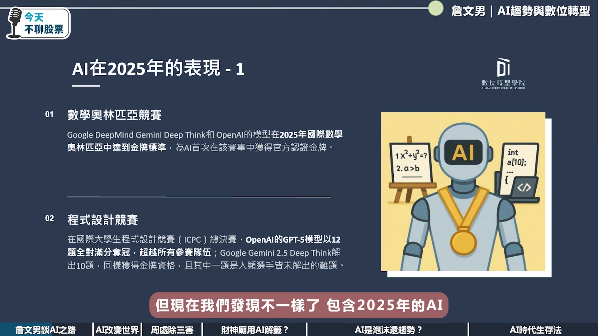

**逐字稿片段：** 包含這2025年AI 它如果參加奧林匹克跟城市的競賽 它其實可以達到金獎的 甚至參加美國SAT考試的話 它應該可以到99%的百分比 應該可以上頂大了吧 哈佛 史丹佛都可以 這都沒有問題了 所以以往這些專業人士 他影響的應該不是隻一般 專業人士他有個專業知識的護城河 那這些AI會帶來他們什麼樣的一些衝擊呢 是就是剛剛主任提到 因為他這些專業知識 因為他已經到博士的程度 而且是在各專業裡面 剛剛講在大陸 像是AI已經可以清大北大 這絕對沒問題了 美國剛剛提到 這個城市比賽是冠軍 然後數學奧林匹亞都是金牌 所以他的能力已經到這樣子的一個程度了 所以本來專業人士 他說靠他的知識 靠他的經驗這些 恐怕可能在未來有了AI之後 可能都無永無之地 所以很多人就很擔心說 那我現在怎麼辦 所以剛剛Nora提到說 所謂的護城河 所以我們就要去了解一下說

**話題推測：** AI在2025年參與奧林匹克競賽與城市競賽能力的預測畫面

---

## 00:05:56

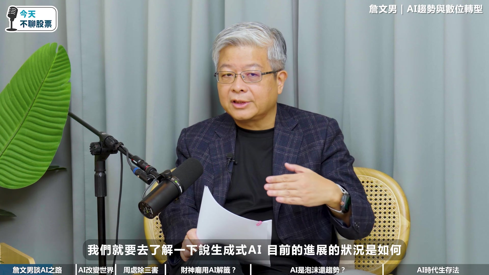

**逐字稿片段：** 深圳市AI 現在目前的進展的狀況是如何 哪些他可以做 擅長做 那我們就不要去跟他競爭 我們是去運用他 然後我們就把我們 應該要做的 比他擅長的 哪些呢 比如說第一個 我們其實要有 所謂的提問的能力 因為你沒有問他 他不會自己告訴你 他要做什麼 對不對 所以提問能力就非常重要 好 提問能力還包含 另外一個能力 就是定義問題的能力 比如說我們現在 要解決什麼問題 產業有什麼樣的痛點 企業上面有遇到什麼瓶頸 這個部分 你需要有一個完整的瞭解 比如說我現在在富邦證券 我比較知道說 富邦證券的一些脈絡 過去的發展 未來想要做到什麼程度 因此我在提問的時候 我定義問題的時候 就會比較清楚說 當然比AI知道說 因為我問AI說 富邦正月將來要做什麼 我想他一定亂打一通 因為他不知道過去 也不知道未來對不對 所以提問跟定義問題 這是第一個非常重要 你必須要努力去提升的

**話題推測：** 探討人類相對於AI應培養的獨特能力主題開場

---

## 00:07:01

**逐字稿片段：** 第二個是 當你問了問題之後 他不是會回答很多事情嗎 可能他都亂回答 甚至有一些虛幻 所以你就必須要有辨識的能力 他到底講的對不對 然後有沒有道理 這個部分你要有能力來駕馭他 就是辨識他 所以這是第二個 你應該要具備的能力

**話題推測：** 人類需培養的第二個能力：辨識AI資訊真偽的能力列表

---

## 00:07:24

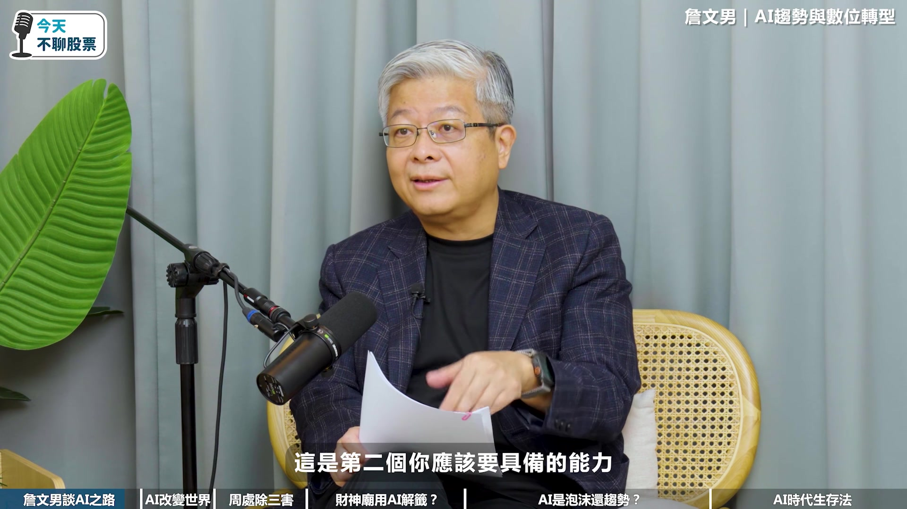

**逐字稿片段：** 第三個其實AI也沒有的 我們叫做遇到的一些 比較困難複雜的問題的時候 舉例來講 我要不要裁員 我不是講富邦證券 我是說在傳統產業 如果遇到AI問題 那我要不要裁員呢 那我短期長期 它之間的權衡又是如何呢 那你的價值觀 就是在做取捨的時候 它的價值觀 或者在這種人際互動的判斷 這個AI也做不到 所以這個也是人 必須要去keep的部分 那當然最後就是 要承擔責任 因為AI沒辦法承擔責任 它做出來的東西 只能提供你參考 最後的責任 還是你要承擔 所以是這幾個部分 是我們知道AI是做不到 但是人是可以駕馭AI的一個非常重要的元素 理解我們剛剛聽到老師說了 其實AI對專業人士他其實是有衝擊的 但是我們就不要跟他硬拼 所以我們應該在他達不到的地方 我們用我們自己的能力去補足

**話題推測：** 人類需培養的第三個能力：面對複雜問題時的取捨與價值判斷能力列表

---

## 00:08:20

**逐字稿片段：** 那我們發現AI在航空產事的部分 他其實自己那個人跟他的角色是不是有點變化

**話題推測：** AI在人機關係中角色演變的主題開場

---

## 00:08:26

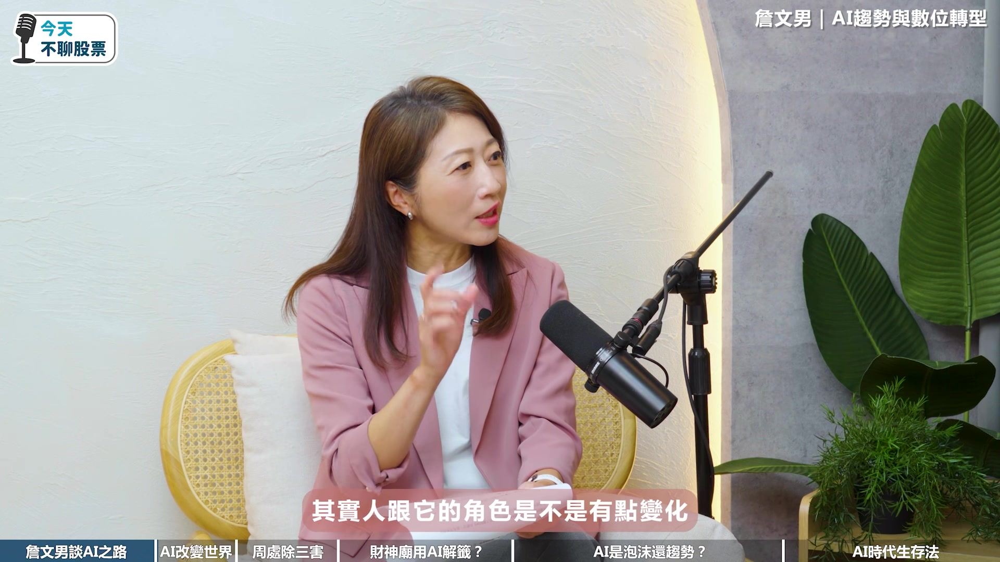

**逐字稿片段：** 從一開始他也許我們只是工具而已 那現在好像就是有一些美國青少年 他回家之後可能秘密不跟爸爸媽媽講 是跟他講的 他變成好像是不是一個親密朋友的角色 閨蜜 那26年呢 老師說你可能覺得他也會變成是 我們同事了 那這個AI的角色 我們要怎麼去用它 可以重塑我們在職場上 工作人員的這些競爭力呢 對 剛剛諾爾提到一個非常重要的 就是說我們剛提到說 他對這個專業人士是有非常重擊 但是我們不要跟他競爭 我們不僅不要跟他競爭 甚至要利用他來提升我們的能力 比如說在AI他的這樣子的一個 非常Powerful的能力之下 其實你要去能夠教育他 比如說你現在能力是100分 但是藉由AI你可能就可以到1000分 所以怎麼樣去透過AI來賦能你 賦能你的同事 這個是非常重要的 另外一個問題就是剛Nora提到的說 從趨勢演變我們來看說 剛提到的AI本來是工具 大家利用它來想創意 寫文章 提升我的程式的寫作的生產力等等 這是工具 可是我們發現說 AI在聊天的過程當中 它因為技術的進步 就越來越瞭解你 然後甚至在跟你對談的過程中 我們知道說最近的技術 這個GPT Live 你會發現 幾乎跟你聊天的時候 還會稍微停頓一下 然後還會跟你講 像我剛剛來的時候 還跟AI在講臺語這樣 然後我說你會不會講臺語 他還講說我不會說 然後他只會講講一點點 然後我說你怎麼樣去努力學這個 他說你只要教我 我就會慢慢的學會這樣子 就是說他在跟你對話的時候 這個因為技術進步 就會更流暢 就真的像你的閨蜜 我有一個EMBA的學生 他就說他有一次被老闆罵 他很生氣 因為他覺得不是我的錯 然後回來的時候 就跟AI聊了三個30分鐘 沒想到AI真的提供滿滿的情緒價值 最後還跟他講說 你不要感覺到生氣 我永遠都會在你旁邊陪著你 他好感動 回去跟他先生講 他先生還吃醋了 你就知道說他真的是成為一個閨蜜

**話題推測：** AI角色演變：從工具到親密朋友的時間軸或階段圖

---

## 00:10:46

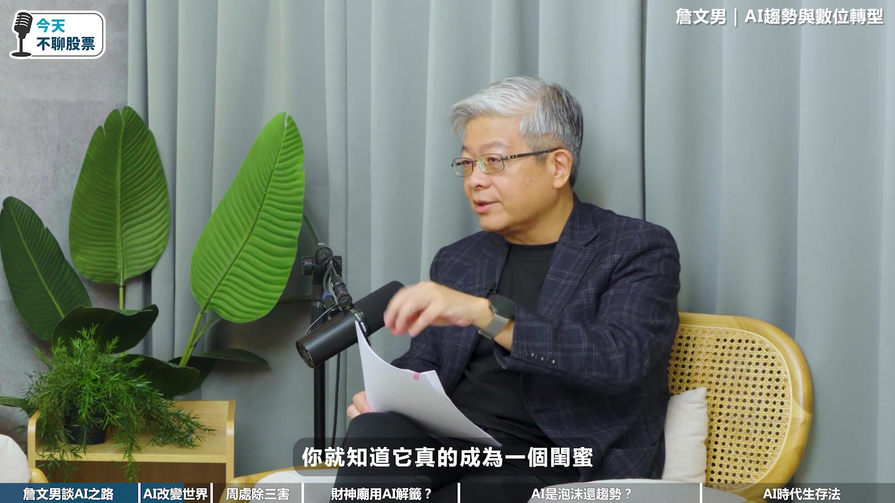

**逐字稿片段：** 接下來我們說要成為分身 因為現在AI agent已經越來越成熟了 而且進步非常快 所以我記得有一次去參加一個 人力廠商的演講 我就看到他們的slogan就是 就是我的同事不是人 為什麼呢 是AI嘛 所以將來會有你很多的數位同事 那當然我後來是寫另外一篇 我也寫了一篇文章叫做 我的主管不是人 你有感覺對不對 我的主管真的不是人 以後會不會是我的老師也不是人 有可能 我剛講是還沒有AI的時候 你們心裡是不是覺得我的主管不是人 但是我都覺得我那時候 我的主管是超人 跟你講的不太一樣 老師你這樣對了 我的老闆我現在要證明說也是超人 剛剛提到了說因為我主管不是人 他是個agent之後 你就要想你的能力又要變成提升了 黃仁鑫說他公司有72000人 他希望一個人可以管100個agent 這樣的話就是等於公司有720萬人 所以你的能力要變成什麼 當你手下有100個人 我譬如說我們是個年輕人 剛進一家公司 比如說富邦證券好了一個人 結果他要管100個數位同事 那他會不會管 就是他怎麼樣去定義問題 分解任務 讓不同的agent去做他的事情 然後再協調這些agent 完成公司所交付的任務 這又變成他需要提升的能力了 所以剛講的管agent 又是將來必備的一個能力 理解理解 那剛剛從對於人的衝擊 那我們也談到了一點點的 關於企業的數位轉型 那我們現在就來談談 就是企業怎麼去用AI

**話題推測：** AI角色演變：從親密朋友到數位分身/同事的階段圖

---

## 00:12:25

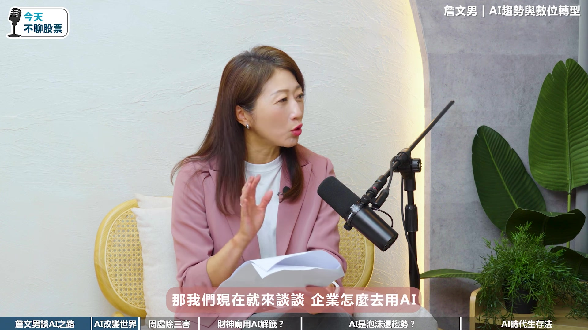

**逐字稿片段：** 那之前也知道就是像BCG 他也調查過1萬個這個員工 他說AI就已經變成是 主管跟經理人日常生活 工作的一個一部分了 那McKinsey也說了 88%的這個組織 至少在一個企業功能項目裡面 會使用AI 而且剛剛老師提到 這個代理agent的部分的話 其實也有大概23%的組織 也開始在用了 所以如果我們在做 就是企業轉型的話

**話題推測：** BCG調查數據：AI已成主管日常工作一部分的圖表

---

## 00:12:51

**逐字稿片段：** 之前老師有提到 就是我們大家可能熟知的 傳統故事叫周楚雛三害 可是大家知道這是歷史故事 但是不知道說到底周楚雛三害 跟我們的AI數位轉型 到底有什麼關係 那三害到底是哪三害 老師可不可以稍微說明一下 因為最近有幾部電影 有一部電影叫周楚雛三害 結果那個是一個通緝犯 到處殺人的故事 可是因為票房非常高 所以很多人以為周楚雛三害是這個 其實不是 我剛談的週五除暗愛 主要是古時候有一位流氓 地方流氓 然後他有時候就到處閒閒 然後欺負地方老百姓 搞得大家惶惶不安 結果有一次他就問旁邊一個老婆婆 因為他也閒來無聊 說你覺得你現在最大的困擾是什麼 那老婆婆說北山有猛虎 然後南海有角龍 就造成我們整個鄉鎮都不安寧 因為他還蠻有正義感的 他就開始去北山 真的把那個門戶給斬了 然後還到南海把那個角龍給他斬了 那就是傷害 後來他就問他說 那還有什麼困擾 你不是說三大困擾嗎 他說還有困擾就是你 原來他就是地痞流氓 那個老婆婆講了這個直白話之後 他誠心懺悔 覺得應該把自己提升 然後後來就當到大官了 就是因為他不斷的自我提升 洗心革面 然後重新改造自己 這跟企業的數位轉型 跟AI轉型有什麼關係 就是我們在企業裡面 要做數位轉型 或做AI轉型 第一步一定是老闆要先洗心革面 也就是說老闆要以身作則 然後要了解AI的大的趨勢 然後知道AI可以做什麼 AI不可以做什麼 然後怎麼樣去帶領 全公司往前邁進 這個是第一步非常重要

**話題推測：** 以「周處除三害」故事比喻企業數位轉型的主題開場

---

## 00:14:49

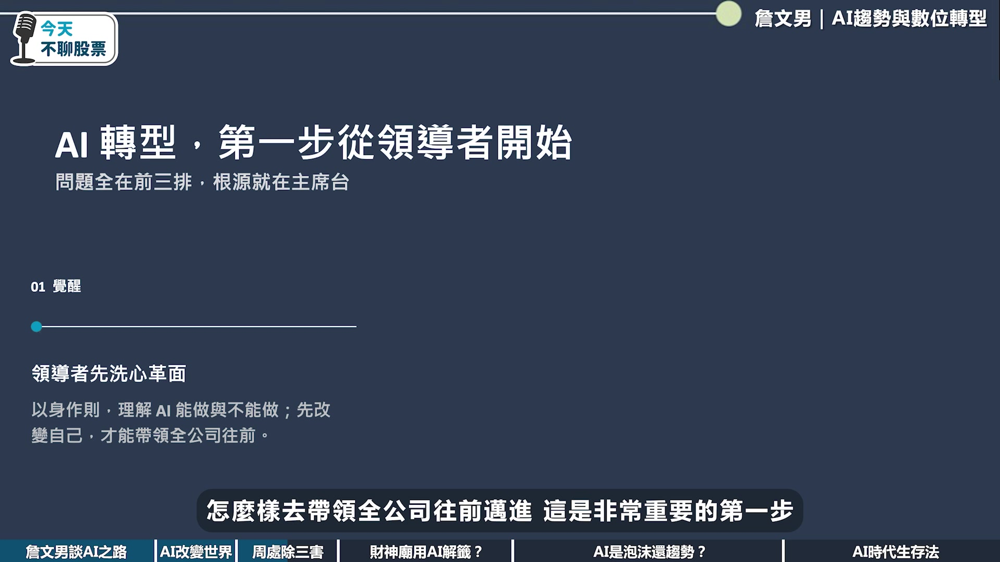

**逐字稿片段：** 所以我才會說你要AI轉型 第一步一定是周處除傷害 把自己也要把它除掉 就是變成一個嶄新的自己 這個非常重要 所以我們以前在唸管理 最重要的就是問題全在前三排 根源就在主席臺 管理上的問題就是這個 非常好的 就是老闆其實都是很多問題的根源 但我老闆現在是超人 是 你老闆比較不一樣 我會跟董事長講一下 我剛剛提到的說 你能不能自我提升 然後對AI的趨勢的掌握 這是第一步 所以我才說周楚楚三派 第一個就是從自己開始 然後自己要有覺醒 第二步就是 當我自我覺醒了之後 我要開始去了解 整個AI的變化的時候 那就要去看外在形勢 到底有產生哪些改變 舉例來說 比如說現在社會 技術 政治 我剛剛講的社會 我們現在大的社會的變化 比如說我們說講高齡化 這次大趨勢要掌握到燒紙 然後技術就是AI 然後政治 地緣政治現在影響社會很多 就是要把這些大的趨勢瞭解的時候 那我們就要看看說 在這個大趨勢底下 我們自己有什麼樣的機會 有什麼樣的挑戰 好 在這個機會跟挑戰之下 那我們應該怎麼樣來做我們的數位轉型 這是第二步

**話題推測：** 企業AI轉型第一步：老闆自我覺醒的重點提示

---

## 00:16:11

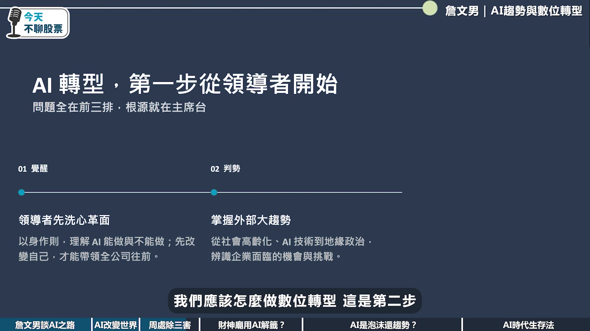

**逐字稿片段：** 第三步就是 那我們要怎麼來做數位轉型 在我們定目標之前 我們一定要先做幾個事情 第一個我們先去看看我們同業 或者是世界上的標竿 或者我這個人 我這個行業是獨一無二的 那我就去看別的行業 跟我們很類似的 那這麼做數位轉型 AI轉型 做到什麼程度 因為臺灣的廠商 廠商也有一個現象 就是不敢自己做 開始就做 花錢做 因為怕做不好 所以就會想說 如果你有一個參考座標的話 你就會比較安心一些 好 那有了參考座標的時候 就來看看自己有沒有什麼樣的痛點 那可以要解決的 然後排優先順序 因為一個人痛點一定很多 不是單一 那我們怎麼樣去找到那種 可能影響我們最大的 我常跟同學分享 就是我們的目標一定是 收入極大化 成本極小化 你是說怎麼樣能夠賺錢 怎麼樣能夠節省成本 在這個情況之下去選擇 我們要開始優先順序上 應該要做的一個項目 然後開始去執行 那剛剛老師也大概分享了 如果數位要轉型的話 第一個其實要周除除傷害 那我想臺灣其實也有蠻多的傳統企業 其實開始慢慢就是真的有除了傷害了 開始擁抱AI了

**話題推測：** 企業AI轉型第三步：制定數位轉型目標與行動的重點提示

---

## 00:17:26

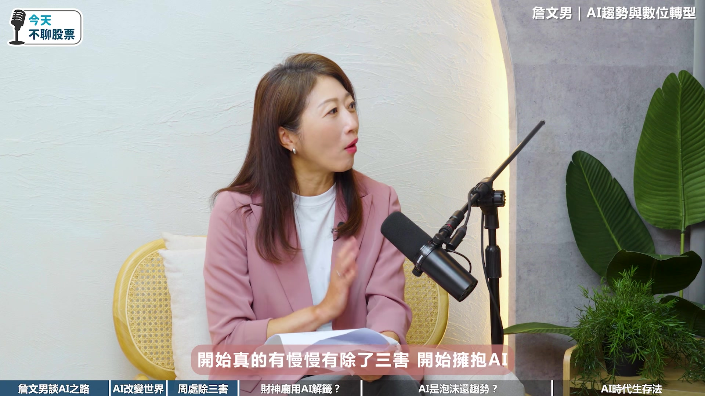

**逐字稿片段：** 那我們想來聊一聊這些傳統企業的實力 那聽說臺灣有一個公廟 它很神奇 它的那個牽絲還是用AI解的 老師要不要來幫大家分享一下 這幾年我們知道說這個AI運用 在各行各業都有在運用 比如說一級產業 我們所謂的一級產業就是農林與牧獵 大家知道說養豬 養牛 養魚 基本上現在都在用AI 連種鳳梨 種稻都是 第二種就是我們所謂的工業 二級產業就製造業 剛剛有提到瑕疵檢測 或者是說設備 我只要聽聲音 我大概就知道說有什麼問題 製造業用很多 接下來就服務業 服務業現在比如說無人商店 所以無人商店不是沒有人來搞關商店 就是說他沒有服務員 然後你都用Kiosk 後臺來準備這些餐點 現在這種自動化也非常多 甚至用AI點餐 比如說你如果是美國人 就跟他用英文對話 然後就可以用英文點餐 用日文用韓文都可以 所以這個部分的應用 也非常的廣泛 可是我們發現說 也有一個行業是最傳統的行業 就是宮廟業 沒想到也有人用AI用得很好

**話題推測：** 臺灣傳統企業AI轉型案例介紹：北港武德宮主題開場

---

## 00:18:37

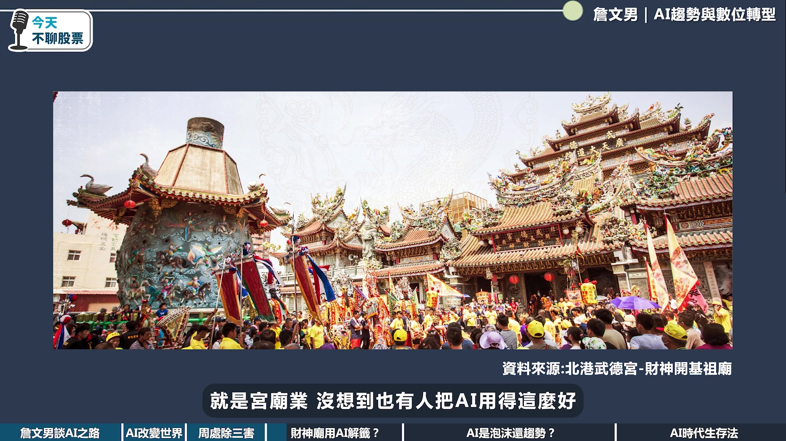

**逐字稿片段：** 我舉一個例在北港 這是雲林 雲林縣北港 有一個武德宮 就是臺灣最大的財神廟 他上次去了解了一下 我覺得真不簡單 他至少在AI上面有做了幾件事情 我覺得很值得跟大家分享 第一個他為什麼開始要用AI 是因為主委跟我講 主委是我們政大的校友 他是臺大經濟系 政大金融研究所的高材生 他回去接 我這樣開玩笑說 好像也是二代接班 他其實是三代接班 因為那是外公那時候 這個來起的廟這樣子

**話題推測：** 北港武德宮照片與基本資訊畫面

---

## 00:19:15

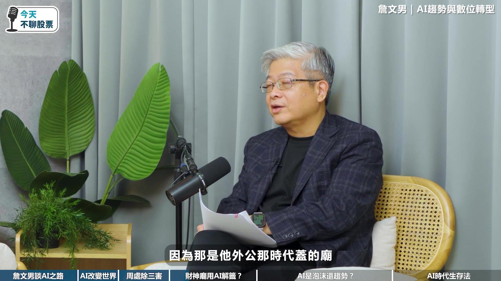

**逐字稿片段：** 有一天他看到一個報紙說 比如說2025年 全省的十大景點就有哪些 朝天宮什麼大甲正南宮什麼這些廟 竟然沒有他 他就覺得很奇怪 他的人也很多 就是姓仲 陳勝業的姓仲很多 為什麼沒有他的名字 就是他去了解 原來政府是說 你要去自己去數 計數說 大概有多少人來看 人流多少 然後上去報 確認了有這些證據了 然後他就會把他排進來說 第一名是舉例來說 我這也是舉例 比如說朝天宮大概有700萬人一年 然後人大概多少人 然後他想說 那我也要去報名 就是讓大家瞭解說 其實產生信眾也非常多 可是要用什麼來計數呢 怎麼不能找一個人在那邊按那個 這樣也是太傳統了 因為後來他就想說 那可以用AI來計數 所以他就弄一個攝影機 就開始去算人流 因為你知道嗎 所謂的人流是 我進去走出來 你要算幾個人 同一個人 所以你進去出來 如果是同一個人的話 你要算一個人 你不能算兩個人 那我這樣進去出出 不是你能算很多次嗎 所以要算一個人 所以他要去辨識 說是這個人進去 然後這個人出來 然後就是同一個人 所以他每天算 他可以辨識人臉就對了 對 辨識到說 今天大概有30萬人來 類似這樣 那一年大概就有六七百萬 這樣子人次這樣 所以他有一年是 這個全省是第一名的 但是基本上都是在前五名之內的 那用了AI之後 因為AI有很大的算力 大家想說 那在他的整個營運日常當中 還有什麼東西需要用到AI 他就發現說 你知道廟裡面有很多的火燭 就是比如說有大的蠟燭 有人拿的香 有時候喝咖啡也有茶的煙 他就想說我其實很怕這種火災 所以他就也是一樣 用我們叫AI門神 他把它取名就是去辨識煙 如果火稍微大一點 趕快耳熱 然後通知消防隊 今年年初就是2020年初 就是有一個行動電源突然燒起來 也是這個AI門神去看到它 所以趕快通知消防隊 才沒有亮成大的災禍 就用債防債這是第二個 第三個它發現說 這個好像需要用到 因為有時候要解簽 我們慶仲如果說要解簽 然後看了那個就是去求簽 求了之後看不懂那怎麼辦 都文言文啊 然後就用AI幫你解釋 有一個籤文還蠻有意思的 有人要去投資 雖然我們今天不聊投資 但是發現他信中要去想要all in 然後去抽 竟然是下下籤 那怎麼辦呢 怎麼解讀呢 那後來他就說 你這個是下下籤 表示有很多困難跟挑戰 你會發現他解籤的內容 他是結合了投資學管理學 跟是策略管理的知識 除了解釋那個籤文之外 還運用這些理論跟知識 來告訴信眾 你投資一定有風險 股市有賺有賠 對對對 請審慎評估 審慎評估 他在這個裡面都有含在說明 所以這個解籤蠻厲害的 真的 在第三個

**話題推測：** 北港武德宮運用AI計數人流的應用畫面

---

## 00:22:48

**逐字稿片段：** 他是用這個AI來解軟文 你知道那個神明降價 在傳統的民俗裡面 有一種是神明降價的時候 會請那個軟身用筆寫 有時候看那個很慢 那時候顧客體驗就不好 因為大家等了很久 神明到底講了什麼事情 他們就覺得說把過去30年的 寫的這個軟文把它全部建檔 然後用AI來辨識 那這樣子的話 這個軟身寫完之後 筆聲寫完之後 就可以馬上知道說 神明到底是在講什麼 效率就會提高很多 提升效率 所以說他們運用AI真的是無微不至 非常的廣泛 甚至寫新聞稿 我覺得他們還有很多的創新

**話題推測：** 北港武德宮運用AI解讀神明鸞文的應用畫面

---

## 00:23:33

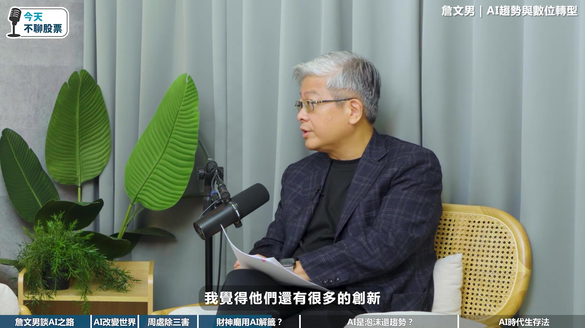

**逐字稿片段：** 甚至他們連虎爺 他把它變成很Q版的存錢筒 而他存錢筒的材質 有一半是香灰 就是他的材質香灰 就是提供的香灰 所以也是循環經濟 甚至前兩年 他已經是成為 全球第一家碳中和的公廟 因為他買了一些碳泉 希望能夠做到碳中和 所以其實這個觀念上是非常先進 在科技應用上面也是非常的open 這是這個廟宇的案例 我覺得為什麼要舉這個案例 即使這麼傳統的行業 都能夠用AI用得這麼好 我就覺得這個很不簡單 這個案子真的是讓我們覺得非常的impressive 我們認為真的是最傳統的宮廟的部分 竟然可以把AI用得這麼的徹底 對 真的是很難得

**話題推測：** 北港武德宮Q版虎爺存錢筒及文創商品畫面

---

## 00:24:25

**逐字稿片段：** 那我們就再聊一聊一個 還有一個它也是傳統業 它是麵包店 它是益智軒 那聽說他也用了AI 讓這個員工訓練時間也有大幅縮短 那也縮短了他的結帳時間 老師要不要聊一聊 我們剛剛講一二三級產業 那個三級產業這個麵包 大家知道說那個麵包大小不一樣 這個很多的麵包你要寄 它也不能貼個條碼對不對 或是標籤在上面對不對 所以有時候就要靠 每個店員這邊寄說 這個麵包多少錢 然後結帳這樣 後來他們就覺得說 這樣子速度很慢 為什麼 因為第一個 你要讓店員要寄這麼多種的麵包 因為每天的麵包 有時候出爐又不一樣 然後再來 假設店員流動率高的話 要重新訓練一遍 要花很多時間 所以他們就想說 是不是能夠把這些routine的 然後大家遇到的一些 比較困難複雜的事情 都交給AI做 舉例來說

**話題推測：** 臺灣傳統企業AI轉型案例介紹：麵包店益智軒主題開場

---

## 00:25:22

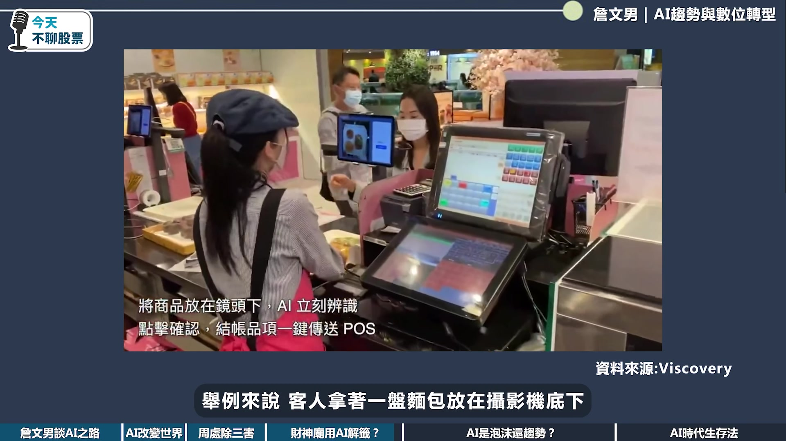

**逐字稿片段：** 客人拿著一盤麵包 就放在攝影機底下一照 大概就知道這家多少錢了 所以速度就變得很快了 他也不用去計 人做什麼呢 介紹新商品 然後保留這種溫度 人與人之間的互動 等於說我們剛剛不是提到說 人可以做什麼嗎 這AI就做不到 就是人計的互動 提供溫度溫暖這樣 這個其實在一支圈上面 就可以看到這樣子的一個範例 就人適合做什麼 AI適合做什麼 對他就是把可能比較作業面的事情 交由AI來處理 那把主動的銷售跟給予溫暖的部分的話 就由人來做這個主要的這個的作業的部分 對其實是非常聰明的

**話題推測：** 益智軒麵包店運用AI自動結帳系統的應用畫面

---

## 00:26:06

**逐字稿片段：** 好那雖然後我們講到就是今天那個不聊股票 但是呢 來就是關注我們富邦證券的頻道的很多的網友 其實還是蠻喜歡投資這個話題的 對對對 所以大家其實之前 常常都會有一個疑問 就是現在AI這麼的熱 其實它到底是一個真的趨勢 其實市場上 還是有很多的雜訊在討論 老師要不要跟大家分享一下 一般的投資人 有沒有什麼樣的方法 讓這些投資大眾可以分辨 到底這個是真趨勢 還是是一個假議題呢 我在臺南商業所 跟政大EMBS交產業分析 我想產業分析其實是投資的最基本面 因為我們知道說在投資裡面有什麼籌碼面 還有什麼技術面還有消息面 我們就是三面 以前我還開玩笑說什麼上影線下影線都不如一條內線 這就是消息面 我們這是基本面產業分析 產業分析就是說這個產業到底未來會長成什麼樣子 我們就是在做這個部分 所以我們做智庫或者做產業顧問 就是在提供產業的大趨勢

**話題推測：** AI是真趨勢還是假議題的投資話題開場

---

## 00:27:21

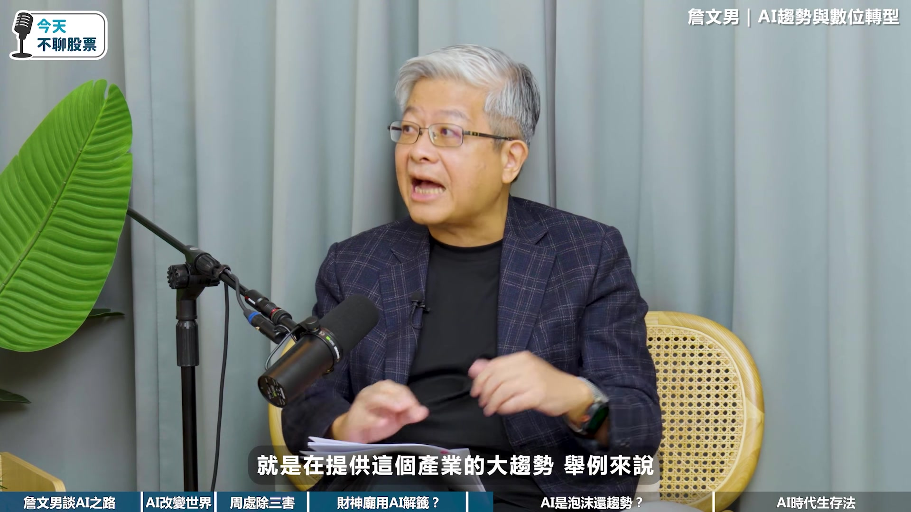

**逐字稿片段：** 舉例來說 比如說我們現在是2026年 我們已經在幫政府估計說 2035年會發生什麼事情 然後現在應該怎麼樣子來準備 這些事情很多學生都會問我說 老師未來怎麼可能預測 比如現在是2026年 那怎麼可能到2035年是怎麼樣 誰預測得了 我就問他一個問題 就有一個年輕的學生 他30歲 我就說你現在幾歲 他說30歲 我說我大膽預測 50年後 如果中間你沒掛掉的話 應該80歲對不對 是這有沒有錯 沒錯嘛對吧 這很精確 所以其實大家常講說 能不能預測都是在預測 不可預測那一塊 比如說兩岸會不會打起來 然後或是剛提到的 八級地震會不會來 這個沒有人可以預測 但是有一些是很容易預測的 舉例來說 我不確定明天我會不會更好 但我確定我明天一定會更老 你是不是這樣子 所以你現在應該 主持人現在應該是 這輩子最年輕的時候 在這個時候 謝謝老師 所以有利於是 我們如果能夠掌握到一些 可預測的部分 尤其是人口統計變數

**話題推測：** 詹老師預測2035年產業趨勢的時間軸或說明畫面

---

## 00:28:38

**逐字稿片段：** 舉例來說 我們從2025年開始 臺灣就有20%是65歲以上的人 那你看這一塊首齡經濟 帶來的食衣住行娛樂市場需求 有多大呢 對不對 再我舉另外一個例子 我常跟同學分享說 我們在做那個長期研究的時候

**話題推測：** 臺灣2025年高齡化人口（20%為65歲以上）的統計圖表

---

## 00:28:57

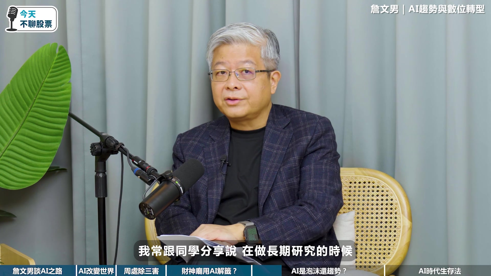

**逐字稿片段：** 就看到一個9034現象 就90後出生的女生 三成會沒有子女 四成會沒有孫子女 那如果三成沒有子女的話 他是怎麼算 其實很好算 兩成的女生現在不婚 不婚會不會有小孩 不會 或者是任養 不一定 所以可能三四%有小孩 所以16%沒有小孩 然後結婚的女生 其中有兩層 不生不想生 不願意生不能生 最後沒有生 所以剛講了 有八層 二八十六 十六加十六就三十二 所以903 就是90後出生的女生 三層會沒有子女 那以這樣子的比例 往下推算的話 這些90後的 就有四層會沒有孫子女 那你是不是看到一個現象說 那如果你沒有子女 沒有孫子女的話 你會把錢花在什麼地方 你就這樣想 所以市場推估就會出現 所以我們看趨勢 就是剛剛提到的 我們把可預測的先把它掌握住 如果不可預測 我們就用scenario情境分析 從方法論的來講 就是你要看未來 並不是沒有方法 剛剛提到的 我們把可預測的都把它掌握 可預測的方法論裡面 第一個當然就是剛剛數字推 是不是推 就剛剛提到9034 或者是2030年 你知道臺灣的平均年齡大概幾歲 大概有一半人口是49歲以上 大概50歲 也就是說你想想看 你覺得50歲老不老 現在好像還好 但是以前我看我媽媽 和我爸爸50歲 覺得好像已經 因為金庸小說 我們小時候看金庸小說 前面來了一位五旬老者 就是老者 五旬老者 但是現在不是 50歲就是很年前 可是剛剛講了50歲以上 他有錢有錢 尤其是65歲以上 所以你就可以怎麼樣去掌握這塊市場 我的意思是說 其實當我們在預測未來的時候 先把可以掌握的先預測 所以回到你剛剛提到的大的趨勢 我們看到社會的一些面向 我們就會用2M2C來分析 2M2C 什麼叫2M2C 第一個M就是Macro 總體環境 這個總體環境也很簡單

**話題推測：** 臺灣90後女性生育狀況（9034現象）的統計圖表

---

## 00:31:04

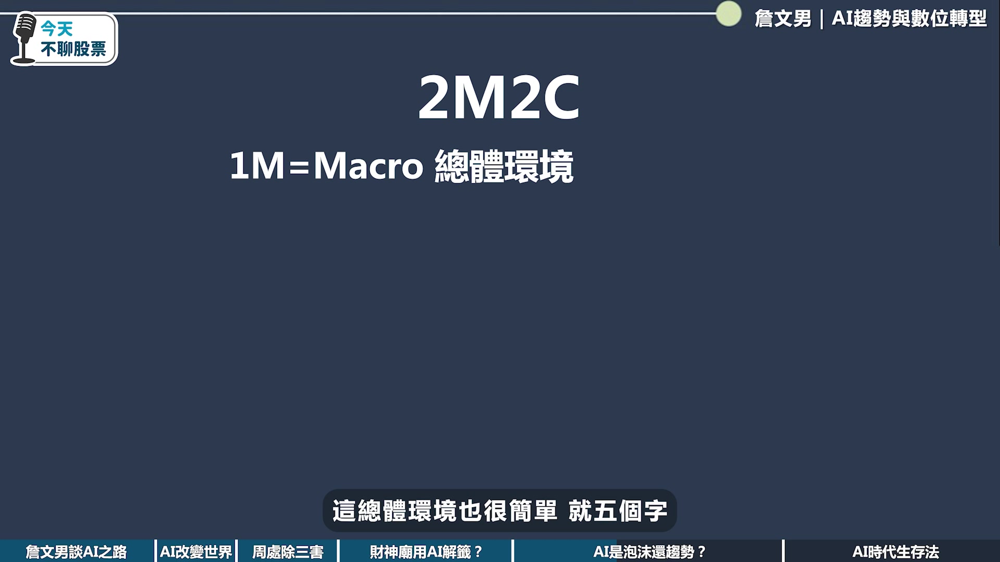

**逐字稿片段：** 就五個字 STEEP S就是社會環境 價值觀 剛提到了我們說 現在的高齡 少子化 甚至9034現象 剛剛講9034現象 女生如果有很多錢 但沒有子女她花在什麼地方 花在自己 更漂亮對不對 更動力 或者養寵物等等 這就是社會S T就是技術 技術將來有什麼大的變化 尤其是科技 AI 甚至生技方面的技術

**話題推測：** 總體環境（Macro）分析方法：STEEP框架介紹畫面

---

## 00:31:34

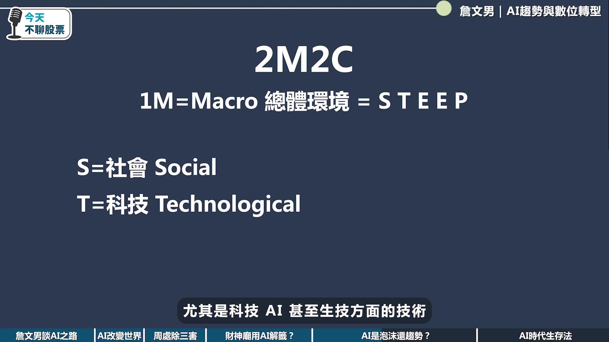

**逐字稿片段：** 再來E就是經濟 另外一個E就是Ecology 生態 環境 最後是Political 就是我們所謂的地緣政治 所以這把這五個面向好好掌握住 STEP 你就大的趨勢大概就掌握到了

**話題推測：** STEEP框架中的經濟（Economic）與生態（Ecology）說明

---

## 00:31:48

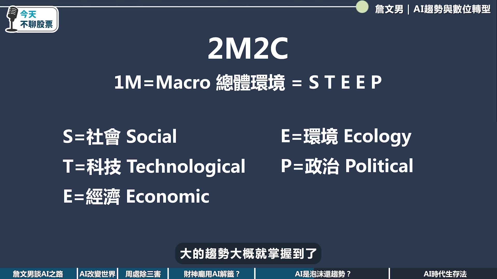

**逐字稿片段：** 第二個M是Market 比如說我是製造業 我是金屬業 那我就要針對這個金屬行業的 大的趨勢去掌握 那我們都有一套方法論 那如果要來上課的話 政大業也歡迎加入 好再來就是C

**話題推測：** 2M2C框架中的市場（Market）分析說明

---

## 00:32:04

**逐字稿片段：** 兩個C 第一個是Customer 就是客戶 我的客戶呢 比如他需要什麼 在哪裡需要 願意付多少錢 這是第一個C

**話題推測：** 2M2C框架中的客戶（Customer）分析說明

---

## 00:32:13

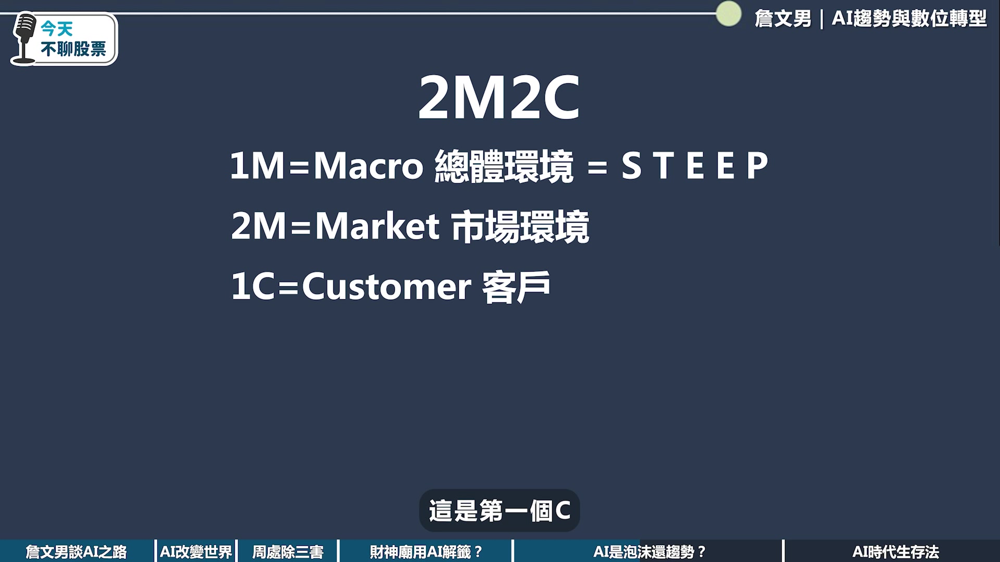

**逐字稿片段：** 第二個是competitor 我的競爭者 所以2M2C 我通常在分析外在的形式的時候 這2M2C要加另外一C company 就是我自己 我自己外在形式瞭解了 我要對自己能力有所掌握 人家說 沒在專心點 我要三對一點 一定要定量自己的狀況 來決定哪一個是 比如說我需不需要開槓杆 然後要開多幾倍 類似這樣 這個是大致上的一個分析的手法 我覺得剛剛老師已經分享了很多 非常精闢的方法論 那幾乎想這個是 真的是老師沒有保留的 滿滿的分享的部分 平常可能是要上課才能夠 真的 才可以得到的 但是我還是要替一下 替我們喜歡投資的網友 我還是要問一下 因為大家目前來講的話 AI其實是蠻熱的 那大家也會想到就是其實2000年有一個.com的泡沫 那現在的話我們在想說大家都在瘋投資 那到底呢我們在這個AI的這個投資裡面

**話題推測：** 2M2C框架中的競爭者（Competitor）分析說明

---

## 00:33:17

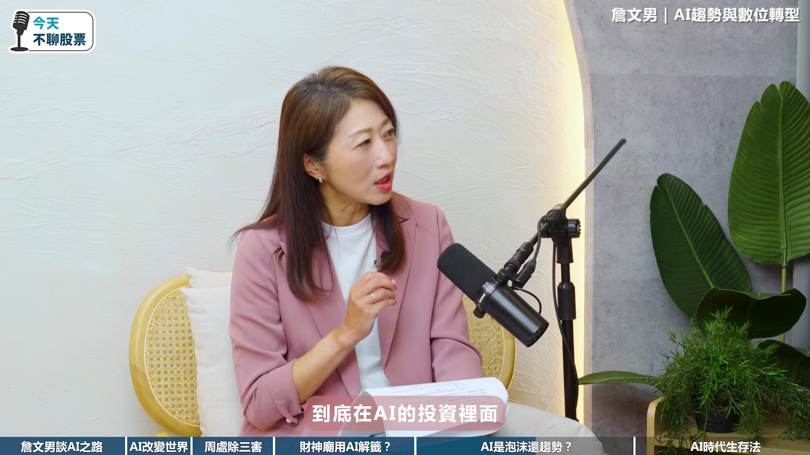

**逐字稿片段：** 我們投資人是應該要投資那個賣產值的那個人 還是真正靠AI賺錢的人呢 到底是做AI基建比較有機會 還是把AI這個工具拿來賺錢的比較有機會 可能也不能這樣分 大部分人說我們要投資這個賣產值的人 這原則上是對的 不過我覺得我們看趨勢 也不能這樣看 就是說你還是要全面的關照 在我去參加某個音樂會的時候 有一個金空的總經理 看到我就說 張老師 從小就是看你的報告長大了 我嚇一跳 我說我看他也不太老 為什麼這樣講 他說他年輕的時候 就在徵信室做產業研究 所以他常常看 因為我也是從年輕的時候 就寫研究報告長大的 所以他就看到我的報告 他第一句話就說 詹老師這個很難得遇見你 我請教你一下 你覺得AI會不會泡沫 我第一句話就問他 我說AI會不會泡沫 按照我們產業分析的第一個原則 先要定義清楚你的問題 請問你認為什麼是泡沫 就是你要問我的泡沫是指什麼意思 舉例來講是股價修正 還是說所有的公司都會倒 然後AI就不見了 是舉例是這樣子 我說他想想說 對沒錯有道理 意思就是說 其實我們在問問題的時候 一定要把定義內涵搞清楚 這時候我們要回答的時候 才能夠針對這樣子回答 所以回答剛剛Nora提到的問題 就是說 那到底大看泡沫會不會在AI泡沫 我們其實我們發現說 大看泡沫其實也是幾年 但是慢慢的你就會發現說 Internet互聯網已經變成 大家每天的生活 現在是每天了 那AI更是如此 而且我覺得它的影響可能更為深遠 為什麼這樣說呢 因為Internet是你的生活日常 但是你會發現說你的AI 是從個人 家庭 社會 就一路全面性的 都在影響你的 不管你的生產力也好 或者是你的生活也好 你的學習 就你生活的方方面面 工作的方方面面 社會的方方面面 幾乎都衝擊到了 所以它是一個 絕對是一個大的趨勢 甚至我都覺得它應該是 我們常常想說 第三次工業革命是電腦 那第四次應該就是這個AI 就是這個AI 當然有人提到說那個基因也是 那是另外一個issue 我發現說AI可能也會讓這個 我們基因革命會加速 好那我們就剛提到的 它可能是一個很全面性的工業革命 也因此它絕對不會是泡沫 那我剛剛講說 為什麼我說你要去定義你的泡沫呢 我們說這個股價一定會修正 因為總是有些是很砰砰的 我不知道我常常聽到名嘴講 什麼腰骨 就是說基本上你會覺得說 他的本益比沒有正常的現金流 然後也沒成長很多 我最近看到一個資料說 如果有一家公司 他的營收都一直衰退 但毛利一直增加 會不會有這樣的公司 你會不會覺得他怪怪的 然後你就要去看這個事情 剛剛提到到底是賣產值 還是掏金的 其實你這樣想

**話題推測：** AI投資策略探討：基礎建設與應用層面的選擇畫面

---

## 00:36:31

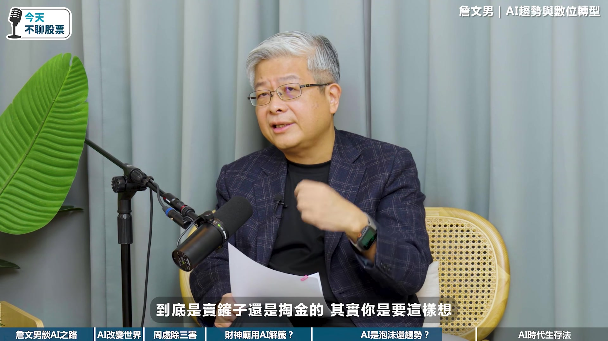

**逐字稿片段：** 我們說在AI時代 黃榮鑫講五層蛋糕 對不對 從能源開始 然後晶片 然後就是像GPU 然後有大模型 有server 最後應用 事實上都有可以牢緊的地方 也就是說都有他的 可能賺錢的標的 什麼意思呢 因為比如說能源好了 現在肌肉這麼大 那當然能源股就往上走 然後黃榮鑫GPU GPU現在很多人為了要訓練AI的模型 所以GPU TPU什麼都開始陸陸續續的在推展 然後再來AI Server 臺灣因為這幾年AI Server成長得非常快 然後之後就平臺大模型 然後再來就是模型上面的很多的應用 所以在這五層蛋糕裡面 事實上都有機會有廠商可以勝出 我們要怎麼去評估呢 其實第一個它是不是走在大的趨勢上 大家發現說 大家的確都走在AI區域上 可是我們接下來就分辨了 它到底是不是有 我們常常講真金白銀 我們說它到底有什麼競爭優勢 而這個競爭優勢是非常獨特 別人沒有的 現在大家看到最大的問題 就是說它沒有正常 或者是說夠多的現金流 來支撐它很多的投資 在這個情況下 你就要去審慎評估 說它未來是不是有可能 在這些他的前提假設上面 不斷的往前走 那最近我印象大家最印象深刻的 應該就是SpaceX對不對 那上去之後就下來了 現在破方了 就是你會發現說 原來他的理想是很好 但是可能還沒有到達 可以實現的那樣子的一個境地 所以就下來了 但是他是不是一個未來 是 對 是個未來 所以我說在這個層次上面 要這樣子分析 你就會比較清楚 那我們一般來評價一下 這家公司我們這個產業分析 我也有跟同學分享 第一個當然是符合大的產業趨勢 第二個就是你在這個趨勢上面 可是有沒有獨特的競爭優勢 是別人沒有的 我們就剛剛主持人問的什麼 護城河 你這護城河有沒有比別人更厲害 厲害多少 然後他是不是長期可以厲害 這是第二個 第三個就看這個經營團隊 這個經營團隊到底是真的走長期的 還是想撈了一票就跑了 這其實不容易 但是你就要靠各種方式 去了解一下這一個部分 這個就是剛剛提到的 整個經營團隊狀況 第四個就是他的財務 因為財務還是最基本面 就是說他的營收投資 他的成本 這個部分是不是有按照他的 Milestone在往前走 很多人都知道AI是很重要的 但常常不知道從哪裡開始

**話題推測：** 黃仁勳的AI五層蛋糕模型圖解

---

## 00:39:15

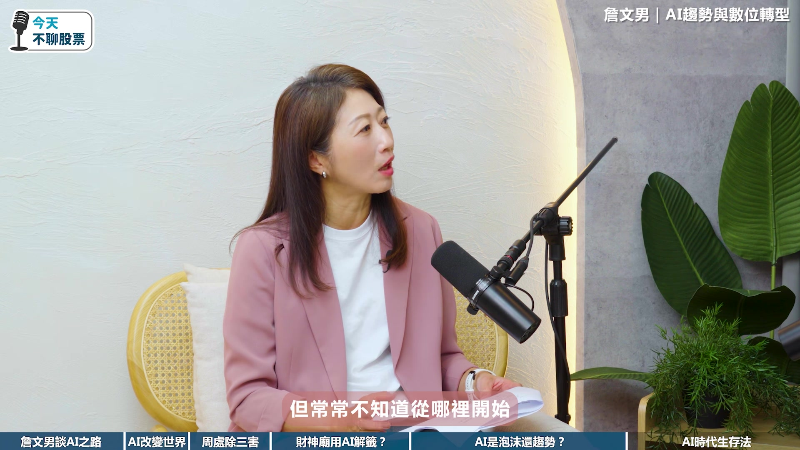

**逐字稿片段：** 所以院長常提到就是 懂用管件四個階段 不知道可以跟大家分享一下 企業跟個人該怎麼一步一步的來開始運用AI 我分兩部分 懂用管件主要是針對企業 我們說AI轉型的時候

**話題推測：** 企業與個人運用AI的「懂用管建」四階段框架介紹畫面

---

## 00:39:31

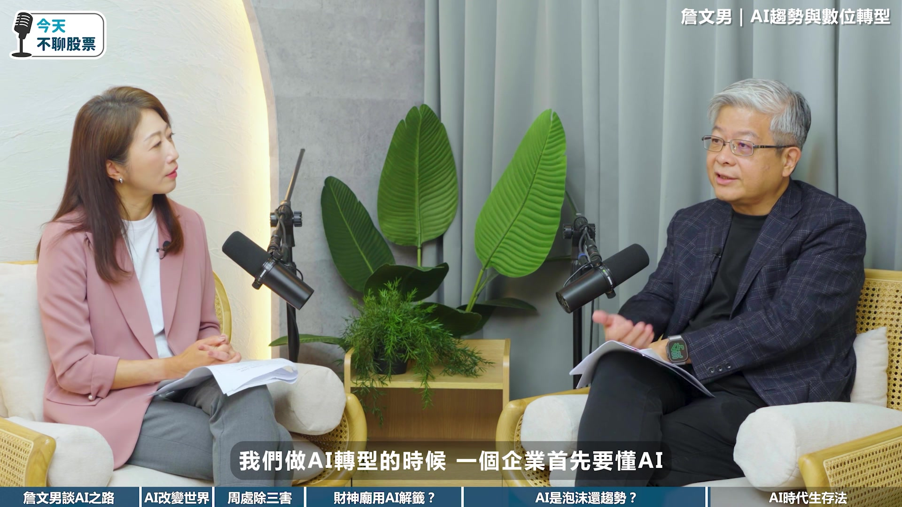

**逐字稿片段：** 一個企業首先要懂AI 這個不僅老闆要懂 員工也要懂 所以我們常常懂AI說 AI 什麼是AI 然後現在進展到什麼程度 什麼可以做 什麼不可以做 這個一定要有完整的掌握 懂AI這件事情我常跟大家分享說 有時候你需要了解一下AI的原理原則 但是你不用太技術細節 所以有時候從應用面來看 我就跟大家分享了 AI是什麼 就是人工智慧 什麼叫人工智慧 就是人工做的智慧 人有什麼智慧

**話題推測：** 「懂AI」階段：企業需了解AI基本原理與應用範圍的重點提示

---

## 00:40:07

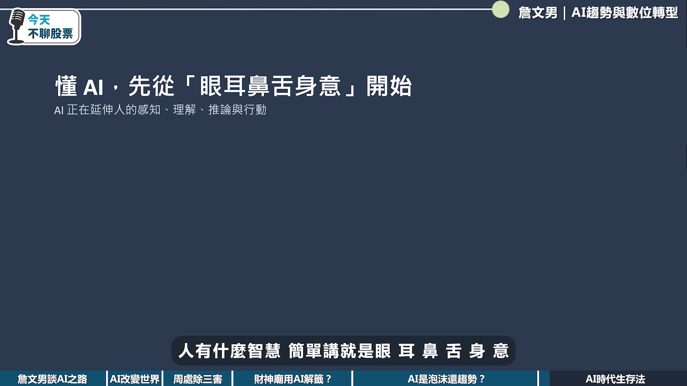

**逐字稿片段：** 簡單講就是眼耳鼻舌身意 眼睛會看 耳朵會聽 鼻子會聞 舌頭會講 然後鼻舌身 身體會動 然後意就是推論推薦 眼睛它現在已經可以做到說 好像我們的千里眼一樣 甚至比人還銳利 做瑕疵檢測的時候 甚至你現在拍照片 就給他這部車 他就會告訴你說 這是哪一個公司的車 然後是哪一年出品的 甚至你可以繼續問他說 這家公司的經營狀況如何 他就會告訴你 耳朵現在他不僅會聽 聽了之後還回答你 聽了之後知道你的意圖之後 還會想想看說 怎麼回應你會比較好 現在的客服很多就是在做這個事情 現在的很多的agent 就是可以做到專門應付三無客人 什麼叫三無客人 我不知道富方真業有沒有這樣的客人 就是無理就沒有禮貌 常常來罵人 還有無恥 我是老客戶你應該給我免費 這無恥還有無聊 這個Nora晚上有沒有空 一起喝個咖啡 無聊客人這三無客人 他聽到了之後就會開始回覆 然後知道你的意圖 然後的適當的話術來回應 比如說聲就是機器人 現在只是在電腦螢幕上面動 可是接下來的 如果它能夠直接指揮機器人的話 我想接下來可以運用的就更廣泛了 所以眼耳鼻舌生意 其實就在這樣子的一個範疇之內 你就享受它的應用範圍 在組織裡面這叫做懂AI

**話題推測：** AI類比人類「眼耳鼻舌身意」能力的說明畫面

---

## 00:41:39

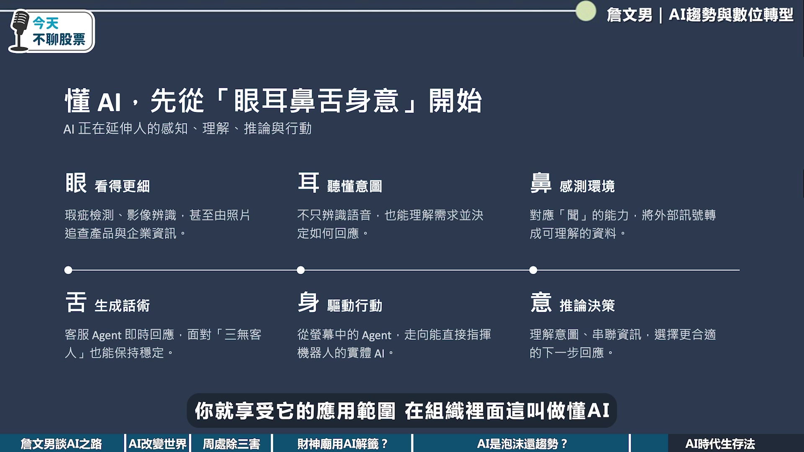

**逐字稿片段：** 那用AI在公司裡面產銷人發財 哪些或者是在從原料進來一直到出貨 一直到客戶那邊 找客戶 完成買單 然後終身客戶服務 這種客戶旅程的過程當中 到底哪一段AI可以用上去 然後AI跟人怎麼協作 這個部分也需要知道 好 這是懂 然後用

**話題推測：** 「用AI」階段：企業將AI應用於產銷人發財各環節的重點提示

---

## 00:42:03

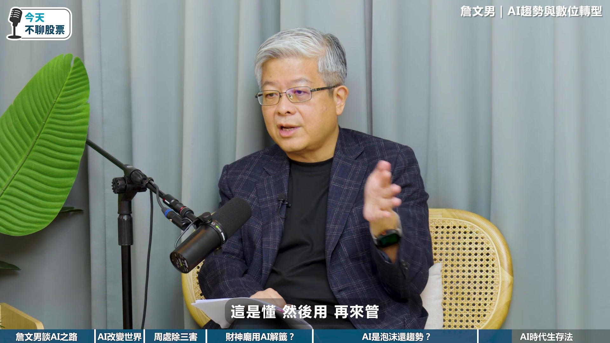

**逐字稿片段：** 再來管 管就是說 其實AI有時候你用不當 你的資訊會洩漏 或者是說 這個可能把不當的資料 就是資訊的汙染 或者是幻覺 或者是說你放到雲端去 然後就被人家洩露了等等 就是說資料 資安或者是剛剛講的偏見的問題都要管 有時候回答亂回答 可能這個Promise 不應該Promise的事情 所以AI一定要會管 我們知道叫AI治理 最後就是建 就是說如果你是一個中大型企業 你一定會想要建一個自己的腦 比如說富邦腦 你要建的時候 到底要建什麼樣的知識 可以做到什麼樣的事情 那這些都在建AI的時候 有一套方法論要去處理 所以這叫做懂用管建 對這是 那個人當然 第一個當然就是 你每天就是要用 然後嘗試各種嘗試這樣子 我覺得這個是 沒有別的方法 就是每天試 然後每天的去學說 怎麼樣更好的在你的工作上面 當然很多人都會說 那到底我的工作上 如何用AI能夠用得更順手呢 其實我覺得 你要從幾個地方角色 你首先你要先去盤點 你到底在你的工作裡面 比如說我在一個月 或者一個禮拜 我每天的到底都做哪些工作 把它全部列出來 甚至把它的流程 把它畫出來 畫出來之後 那你就去思考 哪些流程 可能AI做比你做有效率 舉例來說 他查資料 或者是出一個出版 就是Initial的Version 它可能比你厲害 像Idea 你只要來做決定來選就可以了 舉例來說 所以我說你一定要把你的工作先 然後你再看看說 那現在的AI哪一種工具 來做這件事情最有效率 也都可以去Try 這種就是一個Try and Error的方式 去帥 其實這種東西就是用習慣了 你就會非常熟悉 沒錯 所以我們就是每一天都要好好的去用AI 才會知道如何去駕馭它 那最後做決定的還是人嗎 所以未來的話我們要怎麼樣 培養比AI就是更有的重要的智慧呢 你這個其實是大哉問 為什麼呢 因為我們說要比它更有智慧 其實它都是專家了對不對 不過我剛剛不是一開始就有提到說 我們應該培養的能力 第一個是提問跟定義問題的能力 第二個就是辨識它的答案的能力 辨識完我們要能夠取捨 要能夠做決策 然後最後要承擔責任 就是在這四個地方 其實是人機協作上面非常重要 你知道說你的weakness 你不要去跟他競爭他最厲害的 而是要去運用他厲害的 也就是就好像韓信 韓信點兵多多益善 我覺得AI有點這樣子的 類似這樣子 就是說你怎麼樣去運用 然後賦能自己 讓自己可以更放大 我覺得這是第一個 你應該要有的 所以我剛剛講說 在這個過程當中 你怎麼樣說 可以跟他做好人機協作 然後接下來 你有很多agent的時候 你怎麼樣能夠去善用說 你要去管agent的能力 這時候你就發現說 如何組織跟管理一個團隊 事實上這也需要經驗 說實在的 也需要學習 所以有時候我就在想說 我在大學跟EMBS教書 就會覺得應該怎麼樣訓練學生 才能夠培養他們在AI時代應有的能力 所以尤其現在99%的作業可能是AI寫的 因為我今年突然發現說 臺大跟EMV學生 期末報告的水準是歷年來最高的 這可能不是他們的水準提高了 是AI的技術能力提高了 那這個概念就是說 那在這樣子的情況之下 我們的能力應該就是 怎麼樣去讓這個報告更有邏輯 然後更符合企業所要 企業組織所需要的 或者符合他未來達成的目標所需要的 這個其實是在過程當中 要不斷不斷的去讓自己 在這方面能力越來越高 而不要全部依靠AI 到時候我們連基本能力都沒有了 因為都完全被AI取代了 所以我以前開玩笑 說以前我們沒有ALS時代 在整個流程裡面是 Human do the loop 就是所有的loop整個流程都是人完成的 叫human do the loop 可是AI時代我們知道有些重要節點 我們要去check然後要核准 所以human in the loop 最後我們希望說能夠提高我們的位階跟格局跟高度 變成human on the loop 但是千萬不要out of loop 被這個loop可以淘汰了 我覺得這個是非常重要 好老師那最近常常有人講一句話 就是如果你沒有參與這個AI的浪潮 那其實你就是BI 那老師想說這邊部分 你好像有一些不同的這個見解 那老師要不要跟我們分享一下 其實也不是不同的見解 是剛好有一個EMBA的學生 在吃飯的時候 他們就說有個老師說 我們這幾年 如果你手上的持股 沒有AI概念股的話 你就BI了 就是臺語的BI 那我後來回去想想說 什麼叫AI 就是人工智慧 那BI如果我們把BI把它提升轉換為Buddha Intelligence Buddha就是佛陀 所以如果我們能夠把BI提升做佛陀智慧的話 那你就一點就不會BI了

**話題推測：** 「管AI」階段：企業AI治理、資安、倫理考量的重點提示

---

## 00:47:50

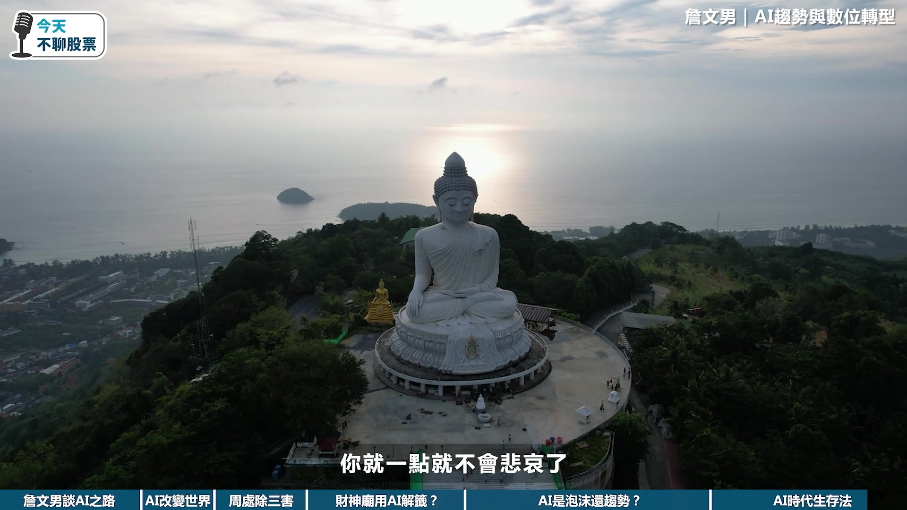

**逐字稿片段：** 為什麼 因為佛陀智慧其實告訴我們幾件事情 第一個其實跟這個AI沒有關係 剛剛提到我們AI會不會被泡沫 就是第一個人要覺醒 這個覺醒很重要 就是你一定要aware 說這個覺醒包含說 自己對自己 剛剛我們不是提到 周楚楚傷害嗎 我們一定要自我覺醒 企業如果要轉型的話 一定要先自我覺醒 老闆要自我覺醒 那第二個呢

**話題推測：** 佛陀智慧第一點：自我覺醒的重點提示

---

## 00:48:15

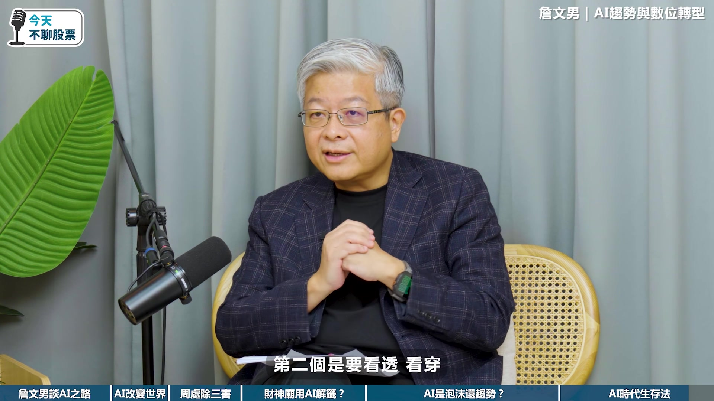

**逐字稿片段：** 是要看透 看穿 其實我們知道說 佛羅看透宇宙的真理 所以我們說 是不是可以透過各種方法 去了解整個趨勢的變化 能夠看穿這個迷霧 然後瞭解一下 這樣整個事情的一個真相 瞭解掌握AI的一個變化 你就知道說 其實AI 它所謂的泡沫只是股價的修正 而並不是一個大趨勢的一個挑戰 因為它的確是一個 改變人類一個非常重要的趨勢 那再來呢 波託智慧裡面還告訴我們一個非常重要的 就是要放得下 要放下 就是說如果我們過去成功的經驗 未來不一定可以複製 所以我們有機會的話 可以把過去傳統成功的方法 然後因為AI來了 我們應該有新的方法來做 最後就是同理 我們知道是AI可能會影響 不管是我們的 比較落後的員工 或者是失業的人口 這時候我們就要同理心 就是怎麼樣能夠 把這些人提升 可以賦能我們的同事 賦能我們的員工 甚至賦能更多 遭到AI衝擊的這些民眾 我覺得這是我們未來 需要提升跟努力 這就是我們佛陀智慧的 一個非常重要的體悟 那我們今天非常謝謝 這個詹文德老師 他跟我們分享了 AI的發展歷史 然後到了臺灣的傳統產業 那他如何運用AI AI到底是泡沫呢 還是它是一個未來的趨勢 到我們個人該如何面對

**話題推測：** 佛陀智慧第二點：看透看穿事物的真理與趨勢的重點提示

---
