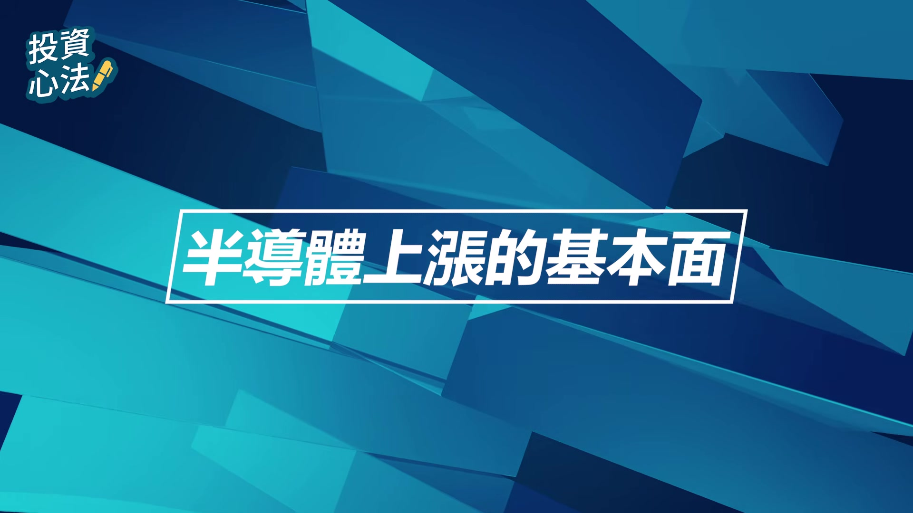
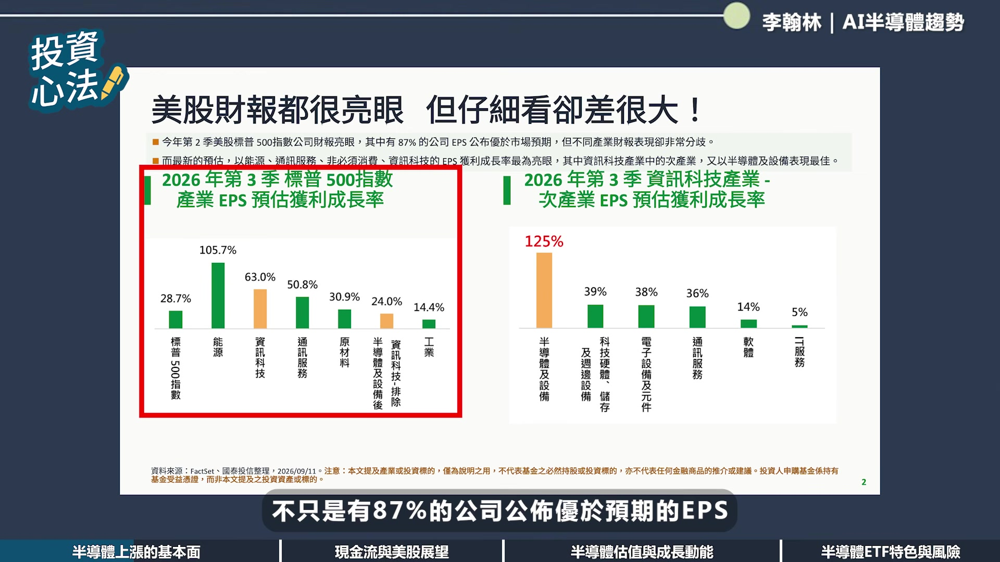
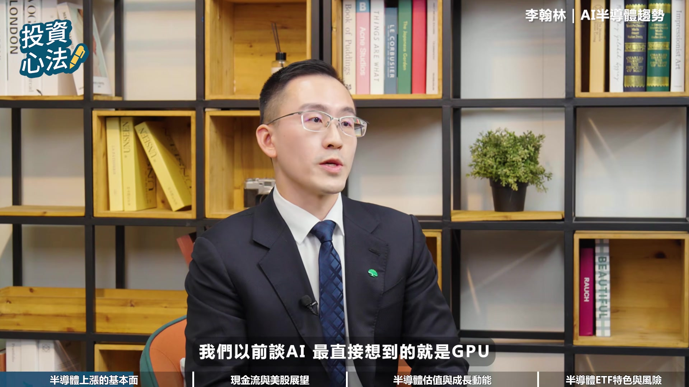
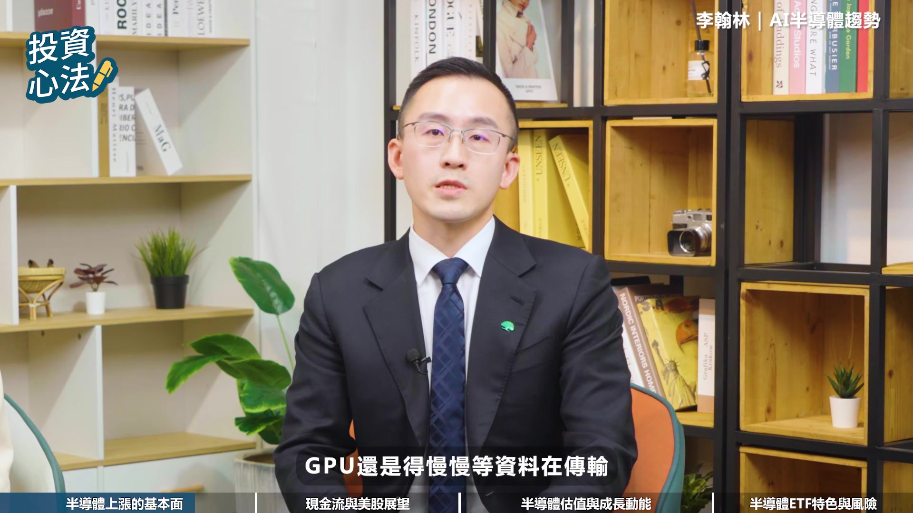
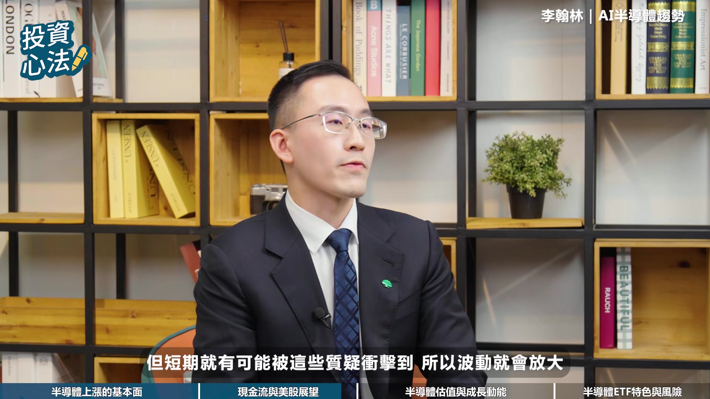
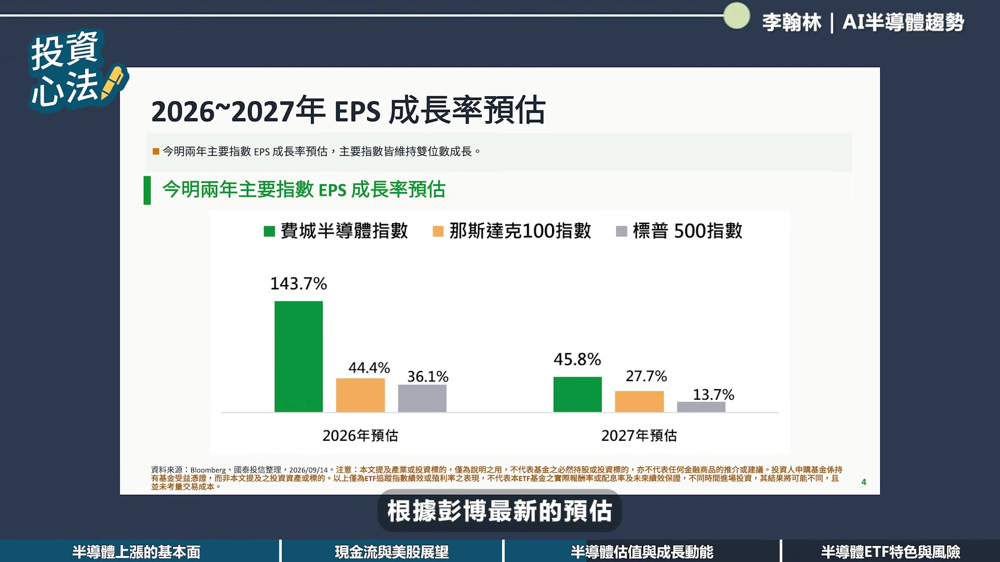
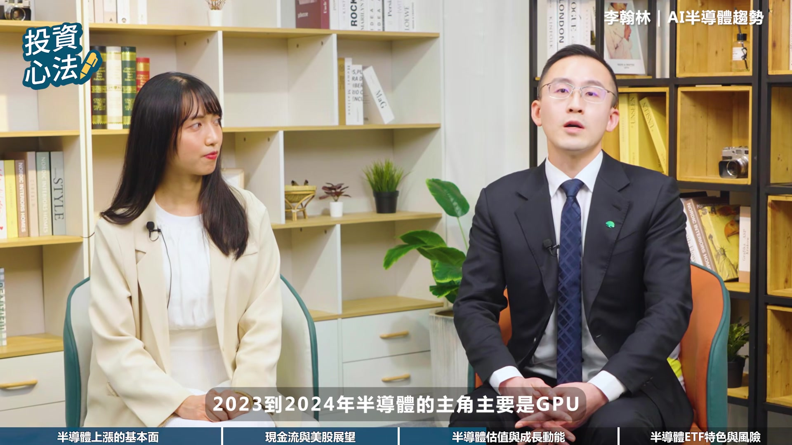
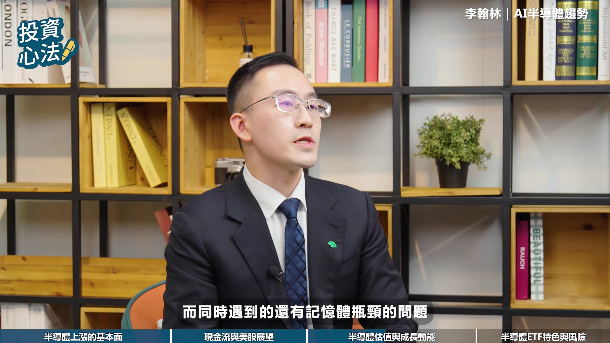

# fubonsec_plZIvZ5US7E — 關鍵畫面索引

- 來源逐字稿：[fubonsec_plZIvZ5US7E_FIN.srt](fubonsec_plZIvZ5US7E_FIN.srt)
- 影片：https://www.youtube.com/watch?v=plZIvZ5US7E
- 截圖數：26

## 00:00:19

**逐字稿片段：** AI 時代來臨,投資也能充滿智慧。 富邦 AI Pro 專業分析資料,透視趨勢, 輕鬆一點掌握全球市場脈動。 有AI投資更Pro 現在就點擊知識欄趕快去下載

**話題推測：** 廣告開始，畫面可能轉為產品宣傳畫面

---

## 00:00:30

**逐字稿片段：** 今年以來美股在AI奇才帶動下受到市場關注 半導體產業更成為領長主力

**話題推測：** 節目內容重新開始，討論美股與AI產業現況

---

## 00:00:38

**逐字稿片段：** 面對美股第四季展望 科技巨頭的現金流挑戰 以及市場最關注的估值問題 投資人應該如何佈局呢 本集我們特別邀請到國臺投信的機靈人李翰林 帶我們從市場趨勢以及ETF投資視角 深入解析美國科技產業與半導體產業的真實樣貌 不僅分享未來投資機會 也將告訴我們如何透過ETF跟上半導體產業趨勢 在節目開始之前 也不要忘記按贊訂閱開啟小鈴鐺 才不會錯過最新的節目哦 讓我們歡迎今天的來賓李翰林經理人 經理人你好 主持人好 各位觀眾朋友大家好

**話題推測：** 引導至美股第四季展望的討論主題

---

## 00:01:21

**逐字稿片段：** 今年以來美國科技產業表現強勁 想請問經理人 這波美股與半導體產業的漲勢 主要是由哪些基本面因素所驅動的呢 以及目前市場的評價與股價表現 是否仍與企業獲利成長 與未來的展望相匹配呢 我認為今年的美股 尤其是半導體產業的漲勢 它有個很重要的特色 就是這次不只是只有本益比 評價沒有拉高 獲利也非常快速地在成長

**話題推測：** 討論美國科技產業強勁表現的開頭，可能顯示相關概覽圖表

---

## 00:01:48

**逐字稿片段：** 而從第二季以來 美國的經濟數據的公佈的狀況 那就持續地優於市場的預期 但貨幣政策 卻沒有同步而大幅的轉移 所以市場就重新的把注意力 放回企業的基本面 而第二季的財報 其實就有給市場很好的成績單檢驗結果 以標普買指數的成分股財報來看 不只是有87%的公司 公佈優於預期的EPS

**話題推測：** 提及第二季經濟數據，可能顯示相關數據圖表

---

## 00:02:14

**逐字稿片段：** 其中資訊科技產業 更是獲利成長最快的產業之一 最新預估的獲利年成長率高達63% 但如果我們再看細一點 科技裡面又以半導體和半導體設備的表現最突出 預估獲利年成長率更高達125% 是科技產業裡面最大的貢獻來源 如果把半導體產業剔除的話 那科技產業的預估獲利年成長率 就會下降到24%而已 這代表AI的行情 已經從一開始的追逐題材 開始轉換到聚焦在 有真正營收穫利和現金流的半導體產業上面

**話題推測：** 提及資訊科技產業獲利成長數據，可能顯示其成長率圖表

---

## 00:02:51

**逐字稿片段：** 那第二個驅動因素 就是AI的資本支出仍然表現相對的強勁 我們以前談AI最直接想到的就是GPU

**話題推測：** 提出第二個驅動因素，可能顯示相關主題圖示或標題

---

## 00:03:00

**逐字稿片段：** 所以2023、2024年最先受惠的是算力概念股 但到了2025、2026之後 產業開始碰到了新的瓶頸 算力再多 GPU再快 如果記憶體的頻寬不足 GPU還是得慢慢地等資料再傳輸

**話題推測：** 提及2023-2024年算力概念股受惠，可能顯示時間軸或相關個股列表

---

## 00:03:15

**逐字稿片段：** 而高頻寬記憶體HBM 在製造的晶圓消耗與良率的問題 會排擠標準型記憶體DRAN的產能 使AI需求的快速成長 反而造成整個記憶體市場結構性的供應吃緊 所以我們看到半導體的行情 開始從單純的缺GPU堆算力 變成整體AI供應鏈的供需失衡 開始往DRAN NAND HPN ASIC先進封裝來擴散 再進一步到半導體的設備 所以目前美股和半導體乍看之下 是連漲好幾年漲了很多 但並不是典型的股價上漲 但獲利沒跟上的狀況 而是AI的需求快速的成長 在推動股價和獲利同時快速往上 而半導體又是目前獲利成長最強的產業

**話題推測：** 提及高頻寬記憶體HBM，可能顯示HBM相關技術圖示

---

## 00:04:02

**逐字稿片段：** 但也有許多投資人發現 近期部分科技巨頭 因大量投入AI基礎建設 而出現現金流轉付的情況 想請問經理人 請問這是否會可能影響到市場信心 或甚至拖累整體美股後續表現呢 以及第四季的美股市場應該要如何看待呢 科技巨頭短期現金流有壓力是真的沒錯

**話題推測：** 主持人提出新的問題，關於科技巨頭現金流轉負的影響

---

## 00:04:28

**逐字稿片段：** 但需要擔心的並不是亞馬遜和Google 自由現金流變成負數的這件事 而是投入之後到底有沒有產生足夠的營收 科技巨頭到現在確實遇到一個很有趣的現象 就是AI投資非常大 所以資本支出會吃掉很多自由現金流

**話題推測：** 提及亞馬遜和Google的自由現金流狀況，可能顯示兩家公司的財報數據或圖表

---

## 00:04:46

**逐字稿片段：** 那我會把這件事情分成兩個階段來看 第一階段叫做建設期 就像蓋大型的建設 比如說蓋高速公路或網際網路 剛開始建設的時候 一定是先砸大量的資本支出 建設好了之後 就會到了第二階段的回收期 那才會產生收入 所以如果今天自由現金流下降 是因為企業拿去蓋資料中心 買GPU 買ASIC 買網路設備 而云端跟AI的營收 用同步的高速成長 那我就不認為這是單純的泡沫 而是前期無可避免的正常支出 而且這反映出 現階段科技巨頭的決策邏輯 是先確保AI算力和資料中心不落人後 短期可能承受自由現金流的壓力 但這證明 未來AI不僅是真的需求 企業普遍預期AI的需求 仍具有商業化的潛力 以及重要的策略價值 值得注意的是 如果KPES還在增加 可是AI營收資料中心的使用率 訂單和ROIC開始往下的情況 但依目前的公開資訊觀察 相關基本面數據仍然是穩健的 因為我們甚至都還沒有看到 KPES在踩剎車

**話題推測：** 提出將現金流問題分為兩個階段討論，可能顯示階段示意圖

---

## 00:05:57

**逐字稿片段：** 大型CSP的業者 都還是在維持極高的資本支出水準 Google甚至不管自由現金流 已經變成負數 還是持續的上修AI基礎建設投資 但同時雲端和AI的業務 也有在高速成長 所以自由現金流轉負 它不是紅燈 它比較像是黃燈 要注意的紅燈是KPAC繼續增加 但AI的營收、使用率 與投資報酬率開始下降 但這些目前都還沒有看到負面的狀況 如果企業的獲利 和AI相關的需求維持目前的趨勢 那美股第四季市場 有機會獲得基本面的支撐 但短期就可能被這些質疑所衝擊到 所以波動就會放大

**話題推測：** 提及大型CSP業者的資本支出，可能顯示相關數據或圖表

---

## 00:06:40

**逐字稿片段：** 加上近期美國和伊朗的衝突狀況還沒解決

**話題推測：** 提及美國和伊朗衝突，可能顯示相關新聞畫面或地緣政治圖

---

## 00:06:43

**逐字稿片段：** 導致油價升高 重新帶來通膨和升息的疑慮 表示第四季即使是中期趨勢偏多 也不太可能是一條直線的向上趨勢 隨著AI題材持續發酵

**話題推測：** 提及油價升高，可能顯示油價走勢圖

---

## 00:07:00

**逐字稿片段：** 半導體產業股價已累積可觀漲幅 目前整體估值是否已經偏高 未來還有哪些成長動能會值得投資人關注呢 半導體產業如果從絕對估值來看 的確已經不算低 但如果考慮到獲利的成長率 其實就沒有想象中的那麼貴 大家看到半導體股漲這麼多 那第一個直覺一定是本益比是不是已經太貴 但半導體這種高速成長的產業 如果你只看P的Ratio其實還不夠 我會把未來的EPS成長率一起放進來考慮 所以我會比較關注PEG Ratio 本益成長比

**話題推測：** 主持人提出新的問題，關於半導體產業估值是否偏高

---

## 00:07:38

**逐字稿片段：** 相較2022年11月底TripGPT推出之後的高點 GPU ASIC 記憶體 設備 CPU 這些主要的半導體次產業的PEG 其實都已經大幅的下降 那關鍵原因不只是六月底股價開始修正一大段 而是市場對EPS成長率的預估值在大幅的提高 那根據彭博最新的預估

**話題推測：** 提及ChatGPT推出後主要半導體次產業的PEG變化，可能顯示比較圖

---

## 00:08:01

**逐字稿片段：** 整體廢辦指數明年的EPS成長率高達45.8% 而且這個成長率近年以來是不斷的往上修 但美股大盤標普500指數則只有13.7% 所以其實真正在賺錢公司 主要還是在半導體產業上面 那剛剛提到2023年到2024年 半導體的主要主角是GPU

**話題推測：** 提及費城半導體指數明年的EPS成長率，可能顯示相關數據圖表

---

## 00:08:22

**逐字稿片段：** 而現在到均體AI的階段 從訓練到推論更加重要 DSP廠開始增加ASIC 自研加速器 AI算力架構更加多元 而同時遇到的還有記憶體瓶頸的問題

**話題推測：** 討論AI從訓練到推論的演進階段，可能顯示技術進程圖

---

## 00:08:36

**逐字稿片段：** HBM因為堆疊TSP和良率 造成的位元懲罰問題 同樣的經驗的投入 能產生出來的有效bit下降 就會排擠到一般的DRAM供應 而HBN記憶體廠的擴產 又不像過去記憶體中期這麼快 市場目前普遍預估 未來一段期間的供給可能相對會吃緊 但實際情況仍需視產能的擴充進度 以及需求變化而定

**話題推測：** 深入解釋HBM的技術問題，如堆疊TSP和良率，可能顯示HBM結構示意圖

---

## 00:09:02

**逐字稿片段：** HBN從8層、12層走向HBN4的16層 甚至是客製化的HBN4e 會導致TSP時刻薄膜成績檢測這些需求的增加 另一方面3D NAND的層數也繼續往更高層數發展 也會提高高深寬時刻比的設備需求 從製程的演進來看

**話題推測：** 提及HBM從8層到HBM4的16層發展，可能顯示HBM技術演進圖

---

## 00:09:23

**逐字稿片段：** HBN4的Base Die開始導入邏輯製程 讓控制器的功能移到記憶器的架構當中 加速資料運算處理的效率 並換像是2nm製程以及GAA環繞式雜集 可以防止當電晶體縮小到3奈米以下時 傳統FinFET的底部 所產生嚴重的短通道效應和漏電的狀況 並提升能效比

**話題推測：** 提及HBM4 Base Die導入邏輯製程，可能顯示技術架構圖

---

## 00:09:48

**逐字稿片段：** 或是像金貝供電 把電源線路從正面移到背面 讓正面的數據訊號 和背面的電力傳輸互不干擾 這樣就可以解決2奈米以下的 先進製程的電力傳輸瓶頸 並釋放佈線的空間來延續摩爾定律 那這些新制程啊 都會讓單位晶圓的設備投資強度提高 所以自成的升級 也會帶來半導體設備產業的機會 AI半導體產業後續發展 仍有許多值得關注的面向 目前市場關注焦點 已逐步由單一族群 擴展至整體的供應鏈 配存半導體指數被視為 觀察全球半導體產業的重要指標 投資人應該要如何 透過相關的ETF參與成長趨勢呢 相較於投資個股 又具備哪些特色與優勢呢 歷史上每一種新科技的出現 到普及化 包括網際網絡 智慧型手機 和這一輪的AI 都會不斷地提高半導體的使用含量 所以半導體往往是科技創新的 底層基礎建設 是一種成長型的必需品 但是半導體 它跟一般的產業很不一樣 它不是一個單一產品的產業 而是一條非常長的供應鏈 從GPU ASIC 記憶體 IC設計 代工製造 檢測 測試 封裝 相關設備 甚至是光通訊 細光子 這些都包含在 廢塵半導體指數里面 如果投資人兩年前 只挑GPU 那當時可能很好 沒有錯 但半導體產業的贏家 他是會輪動的 到現在可能變成記憶體 下一階段 也可能輪到設備 ASIC或光通訊 對ETF最大的優勢 就是不用事先猜 下一棒的贏家 會是輪到誰 投資ETF的價值就在於 不必精準的猜對每一個階段的領漲族群 而是把整條AI半導體供應鏈 放到你的投資組合裡 但是要提醒大家 ETF可以降低單一的公司風險 但不能消除產業的風險 半導體產業的波動仍然是高於整體市場的 所以還是要依照自己的風險層速度來做配置

**話題推測：** 提及背面供電技術，可能顯示背面供電示意圖

---

## 00:12:02

**逐字稿片段：** 那最後我總結一下現在的AI半導體產業 我認為目前市場的關注焦點 正由部分AI受惠族群 逐步擴展至更多的相關環節 當然後續仍需持續觀察 產業的需求和企業獲利變化 AI一開始出來 市場最關心的是GPU和算力

**話題推測：** 總結AI半導體產業現況，可能顯示重點摘要或結論畫面

---

## 00:12:21

**逐字稿片段：** 接下來我們看到 記憶體成為新的瓶頸 D-RAM、NAND、HBM開始受惠 未來再到下一個階段 當記憶體與先進製程都需要擴產 半導體設備又會成為受惠者 甚至再走到光互聯、細光子 發光發熱的階段 所以未來投資半導體最重要的 不一定是要去猜哪一家公司會漲最多 而是要掌握整體的AI產業鏈和基本面 只要AI資本支出和企業獲利 以及最終需求沒有反轉 我認為半導體產業 仍是目前科技產業發展的重要環節 後續發展值得持續關注 謝謝漢玲經理人的分享 AI發展放心為愛 半導體仍是關鍵社會產業 想用ETF參與產業成長 把握下一波投資契機 最後喜歡我們的影片 也不要忘記按贊訂閱開啟小鈴鐺 我們下集再見 拜拜

**話題推測：** 討論AI發展從算力到記憶體瓶頸的演進，可能顯示階段圖

---

## 00:13:15

**逐字稿片段：** 投資一定有風險 基金投資有賺有賠 存購權應享月公開說明書

**話題推測：** 免責聲明開始，畫面可能顯示警語或相關資訊

---
