# jimainotebook_3eZAYm8Di48 — 關鍵畫面索引

- 來源逐字稿：[jimainotebook_3eZAYm8Di48_FIN.srt](jimainotebook_3eZAYm8Di48_FIN.srt)
- 影片：https://www.youtube.com/watch?v=3eZAYm8Di48
- 截圖數：118

## 00:00:21

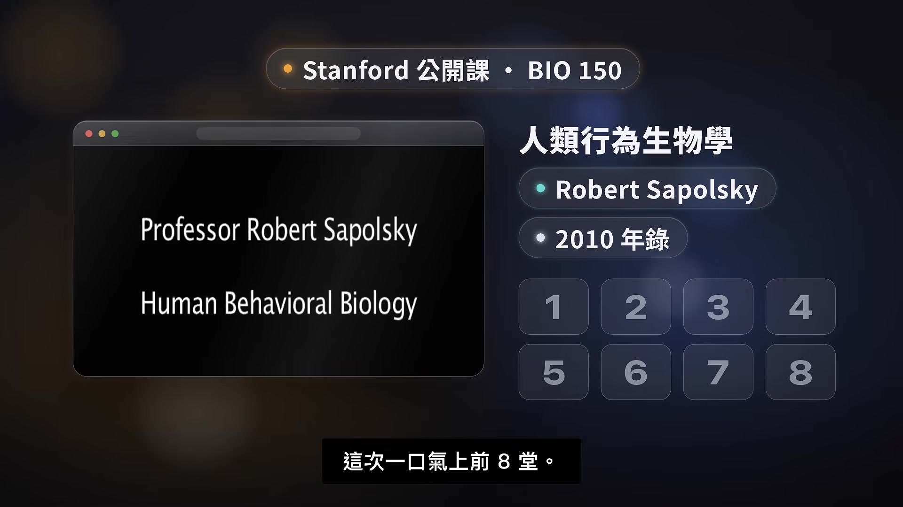

**逐字稿片段：** 這八爬課都在回答一個你一定問過的問題, 一個人做了一件事, 是天生的還是後天的, 我先把答案放在前面, 這個問題本身問錯了, 基因很少直接下命令, 他說的多半是一句, 如果怎樣就怎樣, 而如果的那一半, 常常寫在身體外面,

**話題推測：** 介紹課程核心問題：天生與後天爭議

---

## 00:00:35

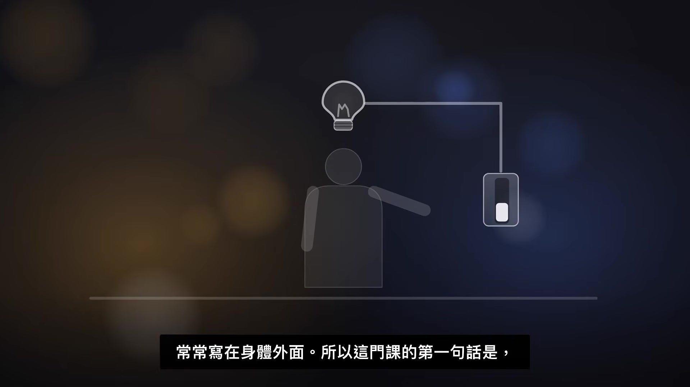

**逐字稿片段：** 所以這門課的第一句話是, 難的不是找到一個解釋 是不要只住在一個解釋裡

**話題推測：** 展示課程引言或核心觀點的文字畫面

---

## 00:00:39

**逐字稿片段：** 我們分三步走 先看為什麼一個解釋不夠 再把基因拿出來 看他到底要來做什麼 最後問 到底能不能算出一個行為 有幾層是天生的

**話題推測：** 展示課程的三步驟大綱

---

## 00:00:47

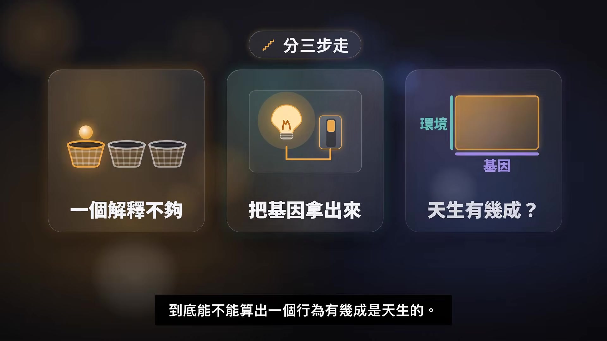

**逐字稿片段：** 第七堂課 Sapolsky問了全班一個怪問題 一個人有幾根手指 跟一個人戴不戴耳環 哪一個比較由基因決定 你先猜一下 他的答案跟你想的剛好相反 這一題留到後面

**話題推測：** 展示一個關於基因決定程度的有趣問題

---

## 00:00:58

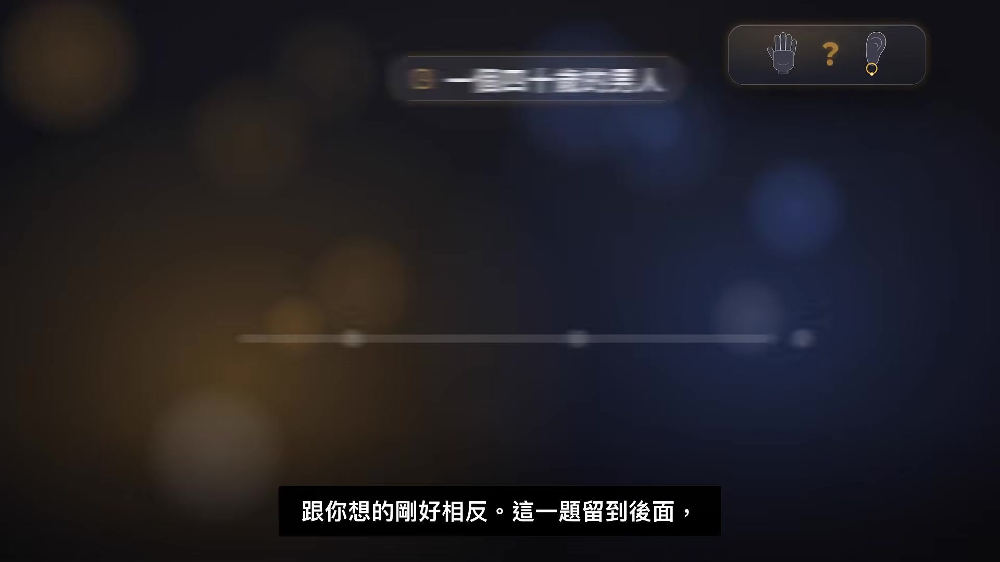

**逐字稿片段：** 先從一個40歲的男人開始 Sapolsky第一堂課一開口 就講了一個故事 一個40歲的男人 住在安靜的郊區 結婚很多年 有兩個孩子 生活一些正常 有一天 同事在飲水機旁邊 隨口評論了一支棒球隊 他一拳打在同事臉上 三個月後 太太發現他有外遇 再過三個月 他捲走公司的錢 從此消失

**話題推測：** 介紹一個40歲男人的行為失常案例作為故事開端

---

## 00:01:18

**逐字稿片段：** Sapolsky給了三個可能 第一個 這個人本來就是個壞人 第二個 他正在經歷一場 最幼稚的中年危機 第三個 他腦子裡有一個基因出了錯 最後一個聽起來最離譜 可是 Sapolsky說 說這正是某一種神經疾病的典型樣子 同一串行為 一個答案在講品格 一個在講人生階段 一個在講基因 你先想一下 你會選哪一個 麻煩的是你選哪一個就決定了你會怎麼對待他 是責備他是勸他 還是帶他去看醫生 這一集的八草課說穿了就在處理這一課 當三個答案同時擺在你面前你要怎麼看 碰到這麼複雜的事

**話題推測：** 列出對40歲男人行為的三種可能解釋

---

## 00:01:50

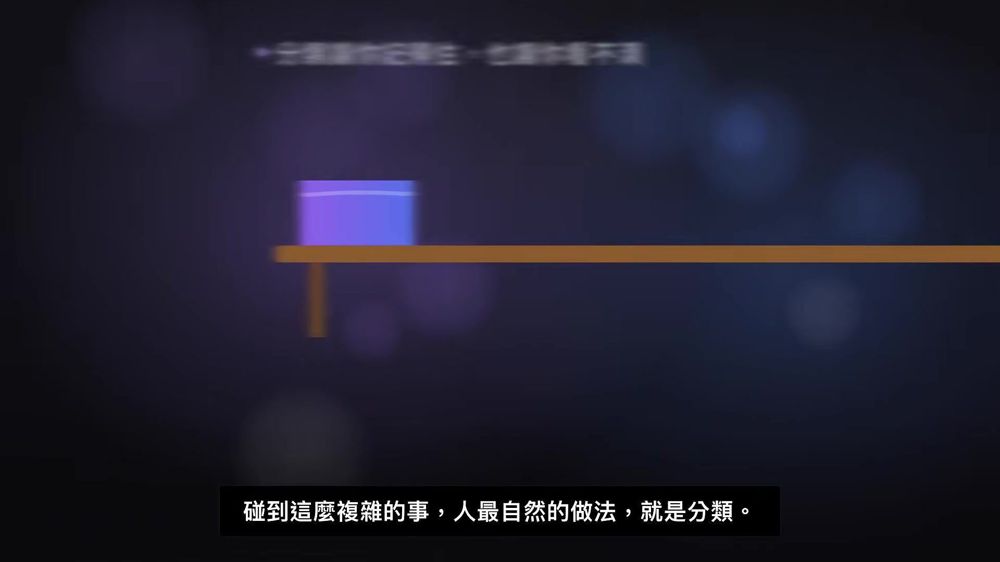

**逐字稿片段：** 人最自然的做法 就是分類 這個叫categorical thinking 中文叫類別思考 他的意思是 把一段連續的東西切成幾個 每一格貼一個名字

**話題推測：** 引入「類別思考」(Categorical Thinking) 的定義

---

## 00:01:59

**逐字稿片段：** 彩虹就是最好的粒子 從紫到紅 光的顏色是連續的 中間有無限多種 可是我們把它切成 紅 橙 黃 綠幾格 切成格子有好處 記起來省力 你不用記住那個顏色的每一個細節 只要記住它是橘色 可是格子也有代價

**話題推測：** 以彩虹為例解釋類別思考如何將連續事物分段

---

## 00:02:14

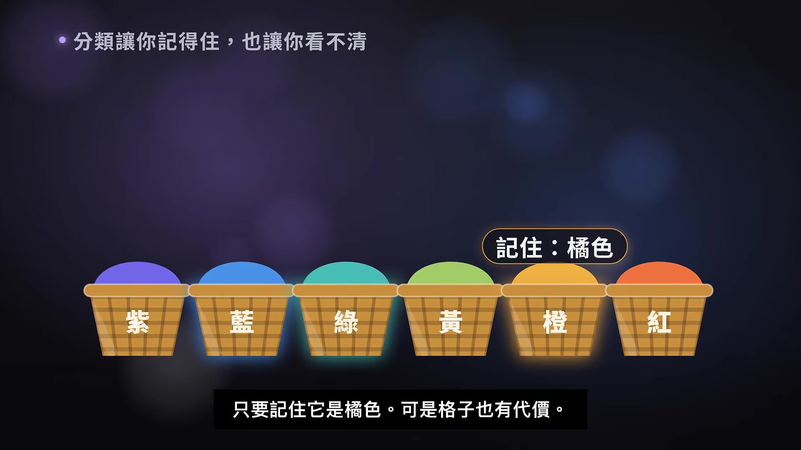

**逐字稿片段：** Sapolsky講了自己的糗事 有一次他打電話請教一位芬蘭籍的醫生 對方最後說 你先拿一隻熊來練習 原來芬蘭話不分B跟P這兩個音 他說的是佩爾 梨子 不是貝爾 熊 兩件事掉進同一格 你就分不出差別

**話題推測：** 講述芬蘭語B/P音混淆的個人糗事，說明分類的代價

---

## 00:02:27

**逐字稿片段：** 反過來也會出錯 考試65分跟66分其實差不多 可是齊格線剛好劃在中間 一分就變成天大的差別

**話題推測：** 以考試分數為例說明分類如何造成細微差異被放大

---

## 00:02:34

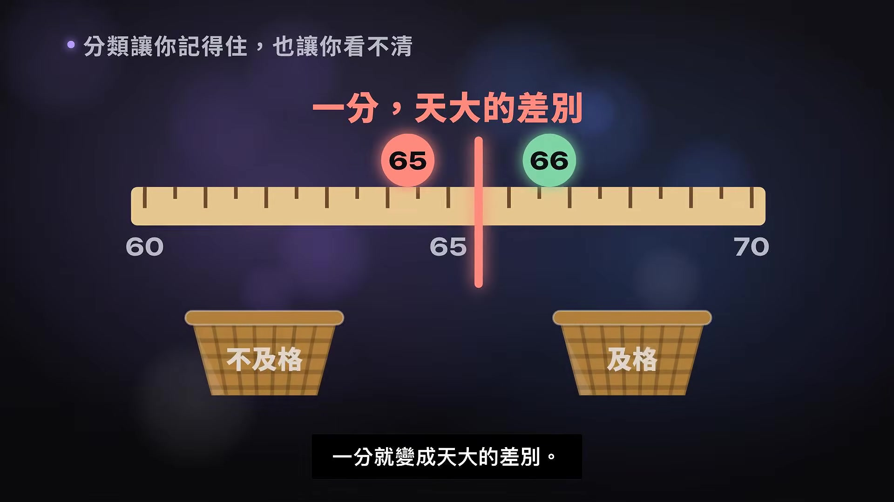

**逐字稿片段：** Sapolsky 後來把這些格子叫做bucket 就是籃子 一句話說完 分類讓你記得住 也讓你看不清 是一種非常好的學習方法 你只要是練習一隻貓或一隻蘋果 放到科學上 每一門學問都是一籃子

**話題推測：** Sapolsky將分類的概念比喻為「籃子」(buckets)

---

## 00:03:15

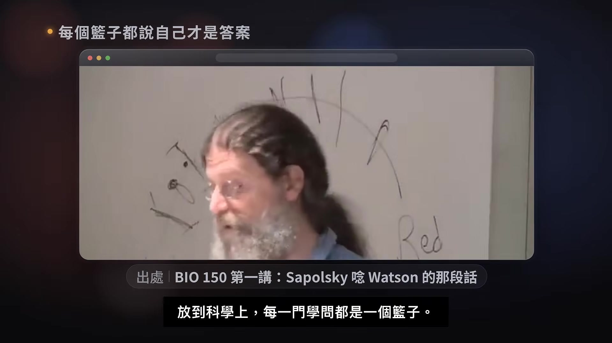

**逐字稿片段：** Sapolsky用了一個老笑話 一隻母雞為什麼要過馬路 研究賀爾蒙的人會說 他血液裡的雌激素到了某個濃度 研究演化的人會說 一代又一代下來 不理會公雞的母雞 留下的後代比較少 兩個答案都對 麻煩在於 住在一個籃子裡久了 就會覺得自己 那個籃子才是全部的解釋 Sapolsky唸了幾段話證明這件事

**話題推測：** 以「雞為何過馬路」的笑話說明不同學科的「籃子」解釋

---

## 00:03:34

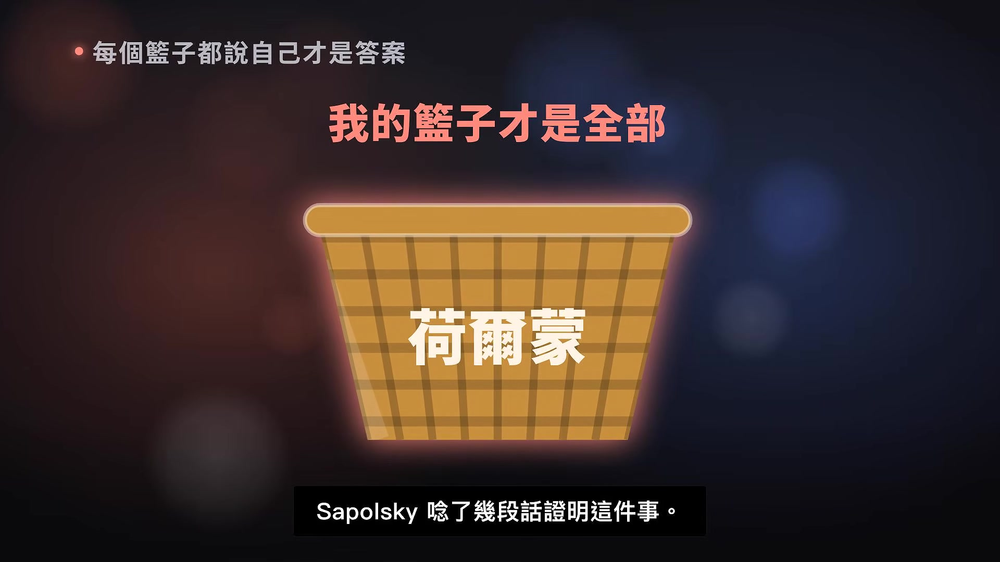

**逐字稿片段：** 其中一段是John Watson說的 他是心理學行為主義的創始人之一 行為主義的意思是 人會變成什麼樣子 全看你怎麼獎勵他 怎麼懲罰他

**話題推測：** 介紹心理學行為主義創始人John Watson的觀點

---

## 00:03:43

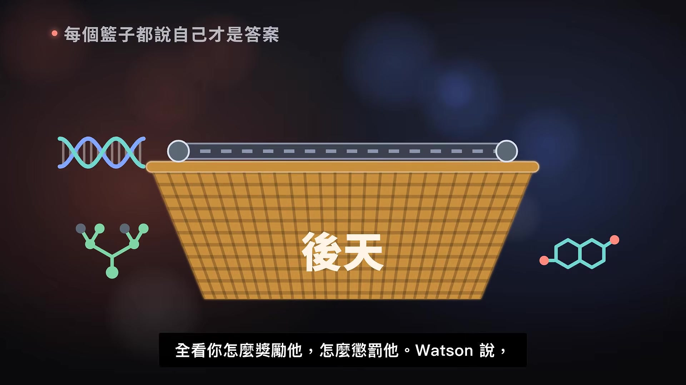

**逐字稿片段：** Watson說 給我一個剛出生的小孩 讓我控制他長大的全部環境 我可以把他變成醫生 律師 乞丐 或者小偷 你聽得出來 這是把一切都丟進後天這個籃子 另一段來自 發明額葉切除手術的Igas Moniz 他臨諾貝爾講的時候說 這個手術沒有失敗 後來這個手術做在非常多人身上 Sepolsky說 住錯籃子會有人受傷 請你記住Watson這句話 等我們開始算天生有幾成的時候 他會回來 那住在籃子裡要怎麼問

**話題推測：** 展示John Watson關於環境決定論的著名引言

---

## 00:04:10

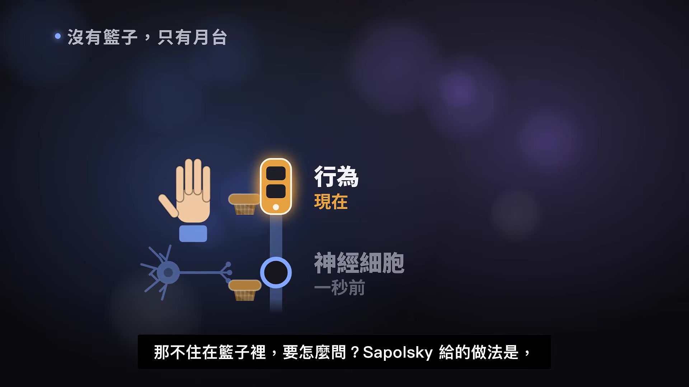

**逐字稿片段：** Seposki給的做法是 沿著時間往回問 這是整門課的工具 我們給大家一個名字叫 從一秒前問到一千萬年前

**話題推測：** 引入課程的分析工具：「從一秒前問到一千萬年前」

---

## 00:04:16

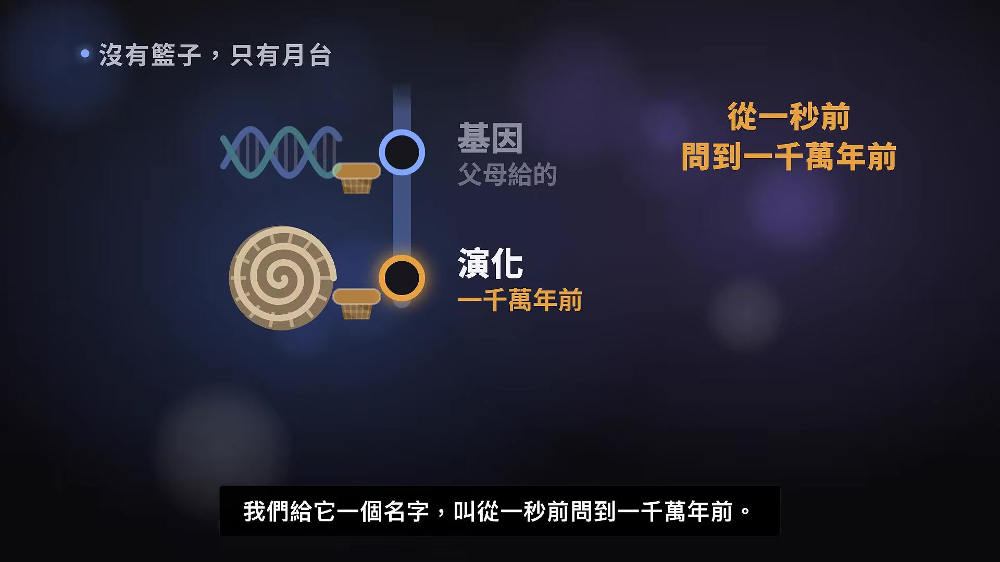

**逐字稿片段：** 你看到一個行為 先問一秒前 腦子裡哪些神經細胞被啟動了 再往前問 是什麼聲音或氣味讓它們啟動 再往前 過去幾個小時 血液裡的荷爾蒙 怎麼讓你對那個氣味更敏感 然後一路往回 問到小時候 問到在媽媽兔子裡的時候 問到基因 最後問到這個物種 幾百萬年的演化 Sapolsky說 這些站其實連在一起 你說某個荷爾蒙造成這個行為 那個荷爾蒙是基因做出來的 你就已經在講遺傳 基因又被演化篩選過 你就已經在講演化 所以沒有籃子 只有暫時停下來的月臺 每一個月臺 都只是把前面發生過的一切 用最方便的方式說出來 這條路後面還會一直出現 每當有人說 這個行為就是某某造成的 你都可以問一句 那是哪一站 前一站呢 這條路最遠的一站是演化 我們就先走到那裡

**話題推測：** 展示從短期神經活動到長期演化歷程的時間軸分析

---

## 00:05:00

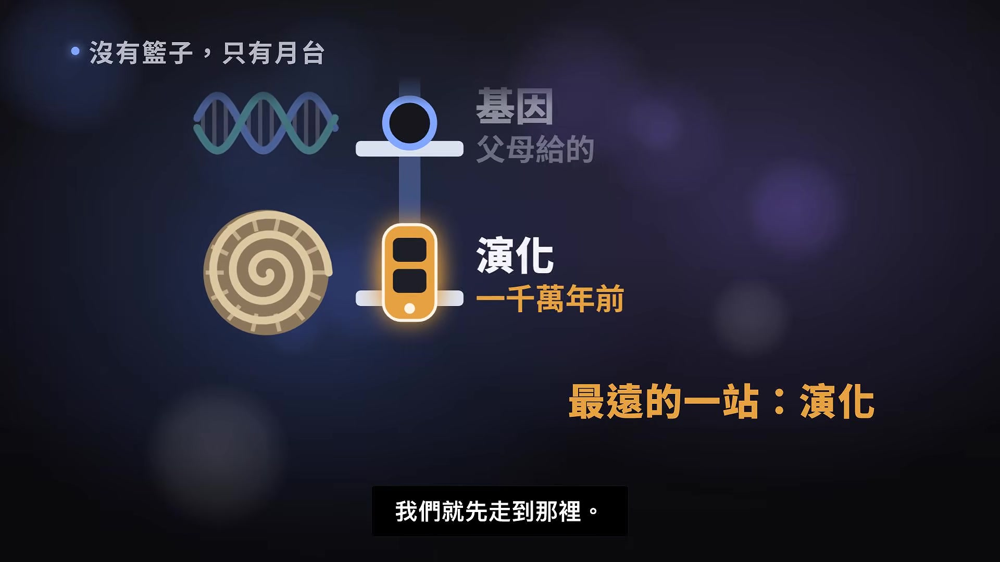

**逐字稿片段：** 第二堂課一開始 Sapolsky拿出兩個頭骨 一個母的一個公的

**話題推測：** Sapolsky展示兩個公母動物的頭骨作為演化分析的起點

---

## 00:05:04

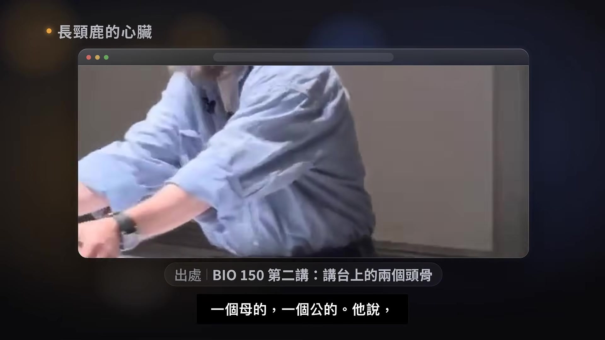

**逐字稿片段：** 他說假設你在野外發現一個新物種 只剩下這兩個頭骨 只要手上有對的工具 你就能猜出這個物種 誰比較會出軌 公的有多兇 母的一胎生一個還是生雙胞胎

**話題推測：** 提出可以從頭骨推斷物種行為模式的問題

---

## 00:05:16

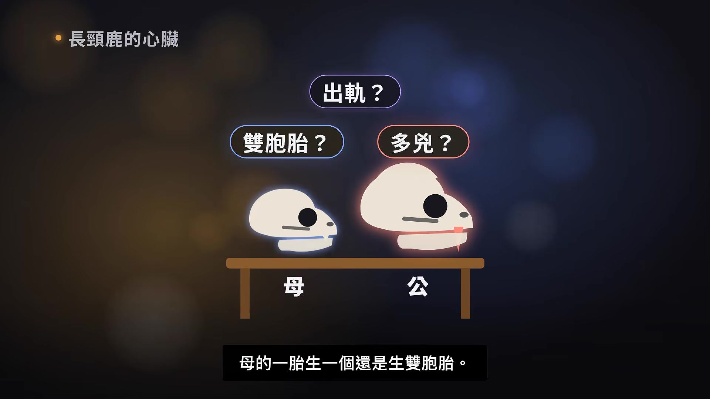

**逐字稿片段：** 他靠的是一個想法 你小時候看自然節目 常聽到一種說法 長頸鹿脖子那麼長 心臟一定很大 科學家一量 果然剛好 大自然真奇妙 Sapolsky說 不這不奇妙 你想想看 長頸鹿的頭比心臟高出好大一截 都要把血往上推到那麼高的地方 心臟不夠大血送不上腦袋這種動物根本活不下來 就不會有長頸鹿 所以不是剛好 是隻能這樣 有一條躲不掉的道理 決定了身體要長成什麼樣子 這兩堂課要說的是行為也躲不掉同一條道理 那兩個頭骨 我們先放在桌上等規則講完再回來推 你會看到 光靠骨頭 能推出的東西多到讓人意外

**話題推測：** 以長頸鹿的例子介紹身體結構與功能關聯

---

## 00:05:52

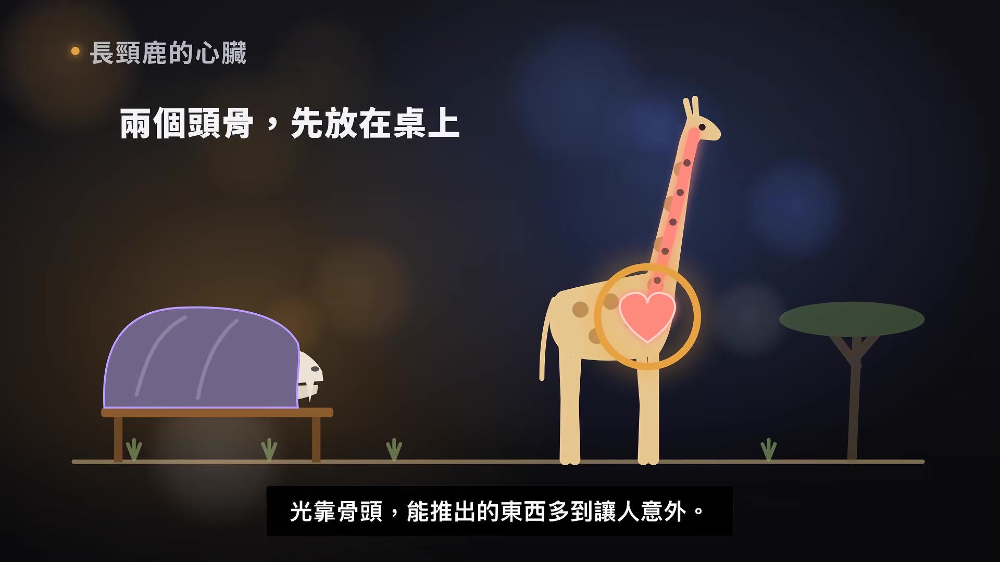

**逐字稿片段：** 這條道理要從達爾文講起 達爾文沒有發現演化在他之前大家就知道物種會變 他提出的是演化怎麼發生 這個機制叫natural selection 中文叫天褶

**話題推測：** 介紹達爾文與自然選擇(Natural Selection)的演化機制

---

## 00:06:02

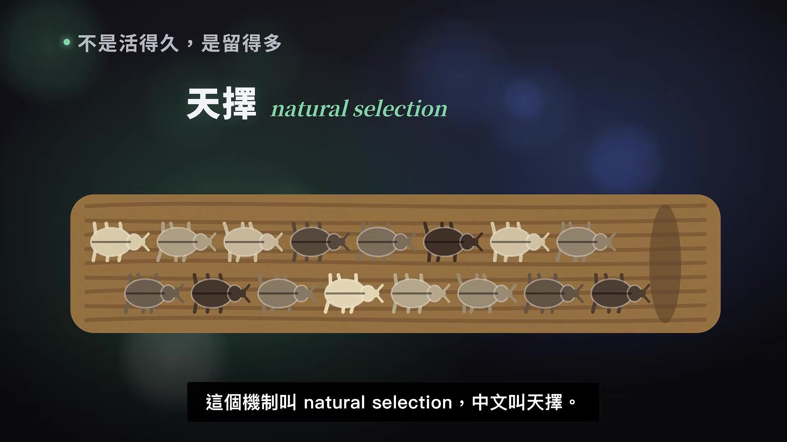

**逐字稿片段：** 它只有幾部 一個特徵能遺傳給下一代 每個個體身上有點不一樣 其中某些版本比較好用 好用的版本 在族群裡就會越來越多 還有一句話要改掉 這不是適者生存 重點不是誰活得久 是誰在下一代留下比較多份基因

**話題推測：** 列出自然選擇的幾個步驟

---

## 00:06:15

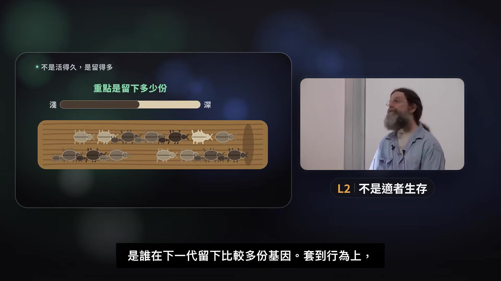

**逐字稿片段：** 套到行為上 同樣幾部都神類 只多一個假設 行為要能遺傳 意思是 一隻動物怎麼打架 怎麼照顧孩子 這些做法要有一部分 能從爸媽傳給孩子 天褶才塞得到他 請你記住這個假設 因為這一集的後半段 都在追問他 另外先說好 後面我們會說 母猴想要這樣 公猴想要那樣 這只是方便的說法 他們沒有在盤算 是演化把那些行為留了下來 就像我們說 水想往低處流 水其實什麼都沒想 接著Saposki要丟掉一個 大家從小學到的觀念

**話題推測：** 將自然選擇應用於行為，並引入「行為可遺傳」的假設

---

## 00:06:43

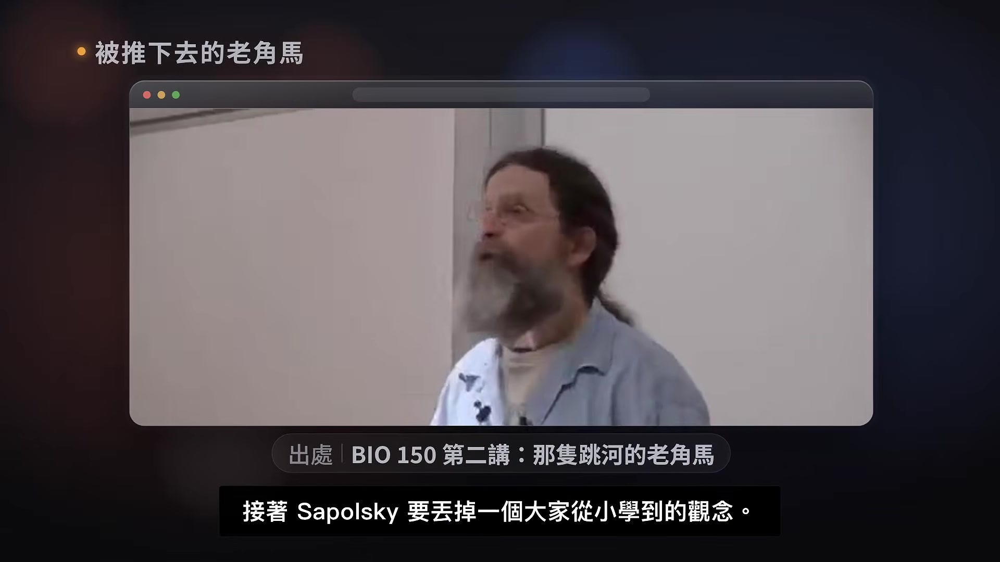

**逐字稿片段：** 你一定在自然節目看過這一幕 一大群腳馬走到河邊 對岸是青草 河裡全是鱷魚 大家在岸邊走來走去 不敢下水 這時候一隻老腳馬擠到最前面 好像在說 孩子們我犧牲自己 然後跳進河裡 鱷魚忙著吃它 其他腳馬就從旁邊安全過河 節目會告訴你 動物會為了整個物種的好處行動

**話題推測：** 講述角馬過河的故事，挑戰「為物種利益犧牲」的觀念

---

## 00:07:00

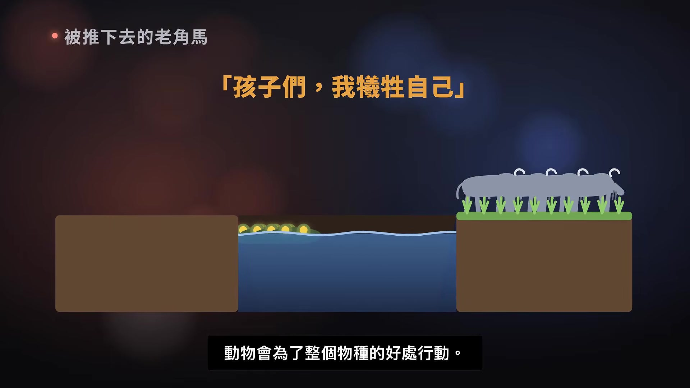

**逐字稿片段：** 這個說法 有一個名字叫group selection 中文叫群體選擇 Zaposki說 研究的人盯著看夠久 才發現那隻老腳馬 不是自己擠到前面 是被後面的腳馬推下去的 它只是最老最弱的那一隻 道理其實不難想 假設真的有一種腳馬 天生願意為大家犧牲 另一種不願意 願意犧牲的那種 一次一次跳進河裡 留下的孩子越來越少 不願意的那種 留下的孩子越來越多 幾代之後願意犧牲的就不見了 所以Sapolsky說 動物做事不是為了物種好 我問這傢伙 不是為了物種那是為了什麼 為了讓自己的基因在下一代留下越多分越好

**話題推測：** 介紹「群體選擇」(Group Selection)概念並揭示角馬故事的真相

---

## 00:08:01

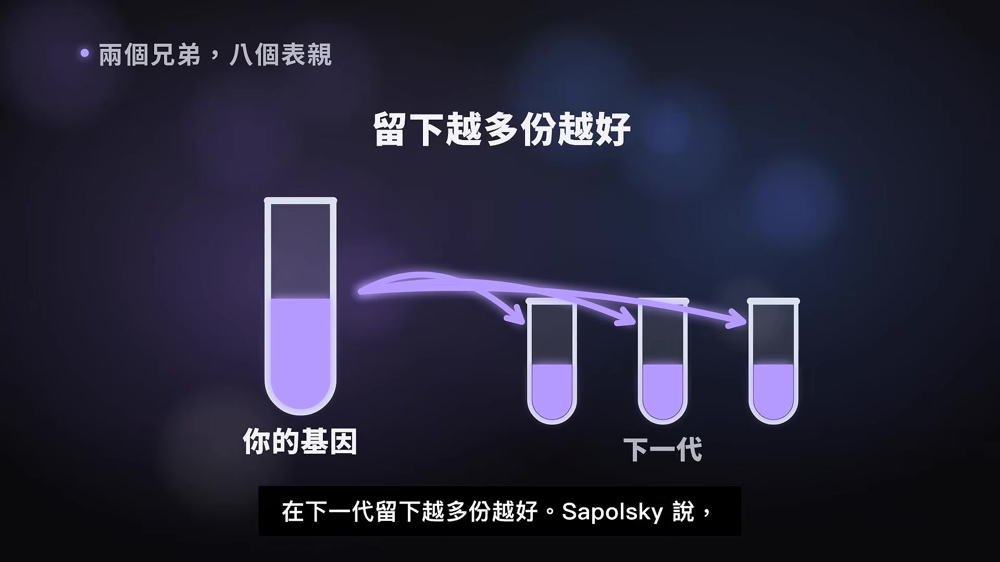

**逐字稿片段：** Sapolsky說做到這件事有三種做法 最直接的叫individual selection 中文叫個體選擇就是靠自己生 他引了一句話一隻雞只是一顆蛋 用來做出另一顆蛋的方法 主角是基因雞只是工具

**話題推測：** Sapolsky提出三種最大化基因傳遞的方法

---

## 00:08:13

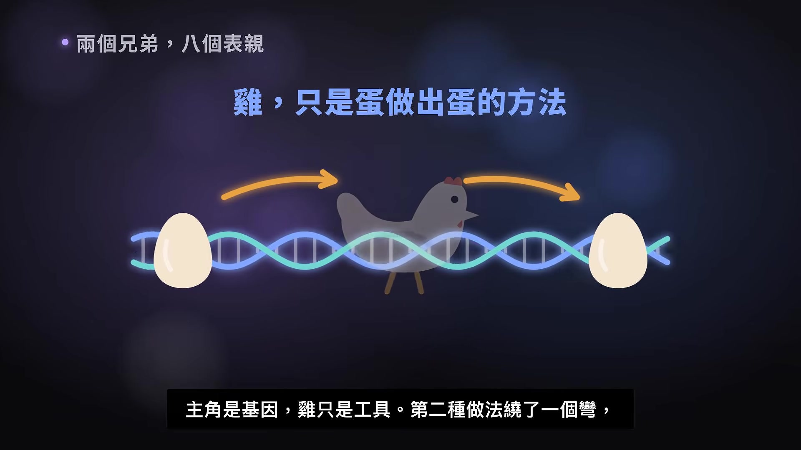

**逐字稿片段：** 第二種做法繞了一個彎 叫king selection 中文叫親屬選擇

**話題推測：** 介紹第二種方法：「親屬選擇」(Kin Selection)

---

## 00:08:18

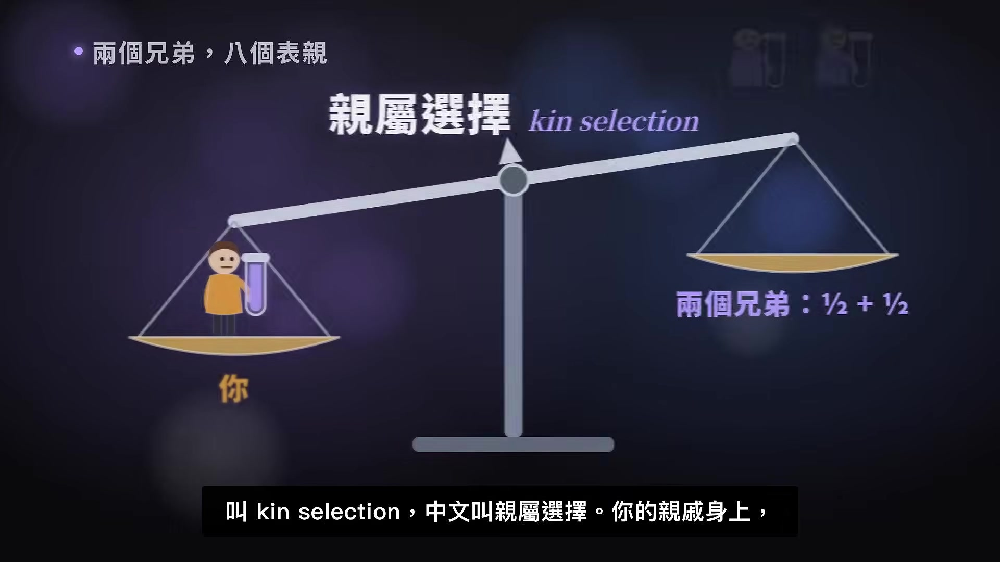

**逐字稿片段：** 你的親戚身上 有一部分跟你一樣的基因越親一樣的越多 親兄弟姐妹大約一半 表兄弟姐妹大約八分之一 遺傳學家Howden傳說 在酒吧裡講過一句話 我願意為兩個兄弟 或者八個表親犧牲性命 這句話不是在講感情 是在講算術 兩個兄弟加起來 剛好等於一個你 八個表親也等於一個你 從這裡推出來 動物會照顧親戚 而且越親照顧得越多 你先留一個疑問在心裡 動物怎麼知道誰是他的兄弟 這一題 第八堂課才會

**話題推測：** 解釋親屬選擇中，親緣關係越近基因相似度越高的比例

---

## 00:08:46

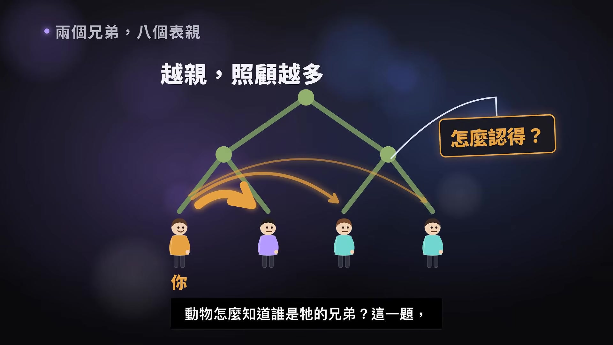

**逐字稿片段：** 第三種做法是幫 沒有血緣的對象 叫Reciprocal Altruism 中文叫互惠利他

**話題推測：** 介紹第三種方法：「互惠利他」(Reciprocal Altruism)

---

## 00:08:52

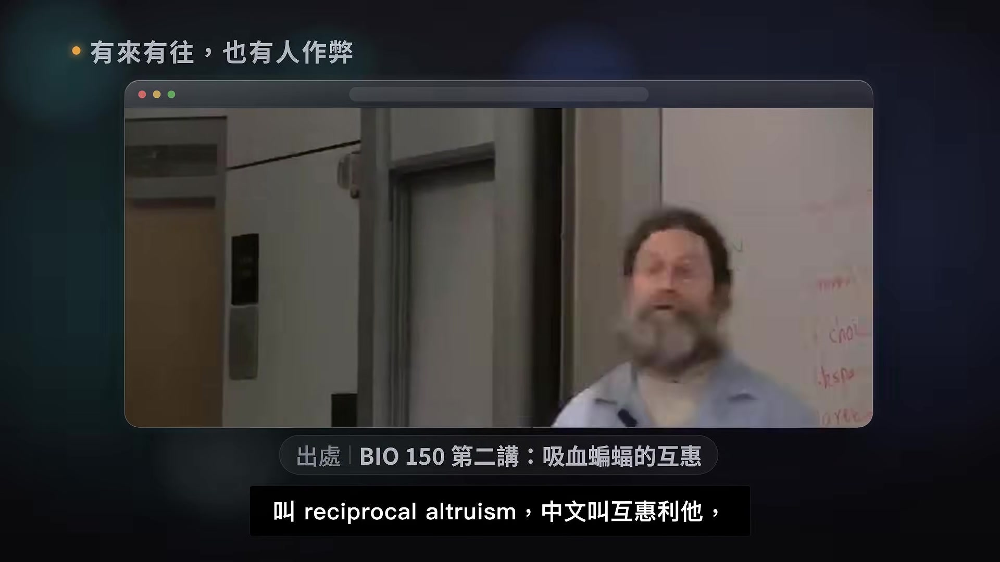

**逐字稿片段：** 意思是你幫我抓敗 我幫你抓敗 他有一個條件 你付出的不能比拿回來的多 所以互惠永遠跟作弊綁在一起 你要怎麼跟一個很作弊的人來往

**話題推測：** 以互相抓癢為例說明互惠利他

---

## 00:09:01

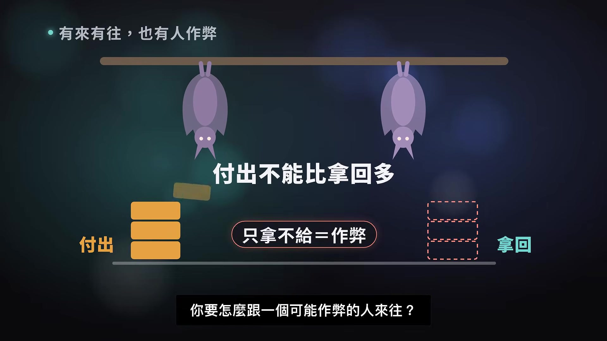

**逐字稿片段：** 密西根大學的Robert Axelrod 辦過一場電腦比賽 讓各種玩法互相對打 贏的是最簡單的一套 叫Tit for Tat 中文叫以牙還牙 開頭先合作 之後對方上一輪怎麼對你就怎麼對他 真的動物也這樣玩嗎

**話題推測：** 介紹Robert Axelrod的電腦比賽與「以牙還牙」(Tit for Tat)策略

---

## 00:09:14

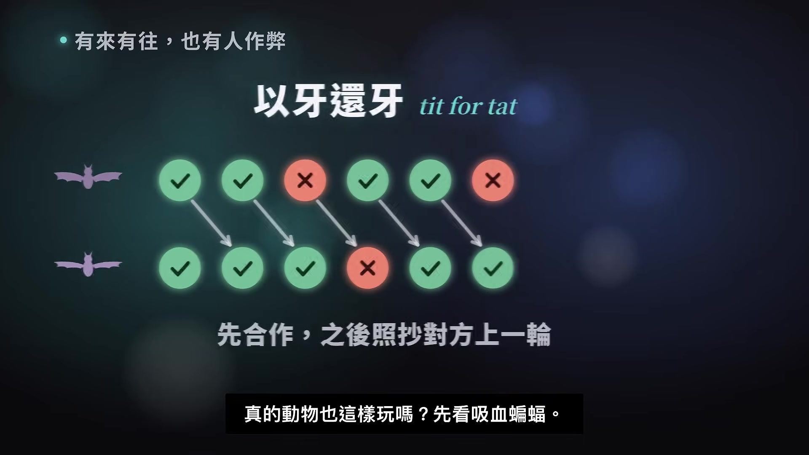

**逐字稿片段：** 先看吸血蝙蝠 好幾只母蝙蝠住在同一個窩 它們吸了血 存在喉嚨的一個囊袋裡 飛回來吐出來 餵窩裡所有的孩子 不管是不是自己的

**話題推測：** 以吸血蝙蝠分享血液的行為說明互惠利他

---

## 00:09:23

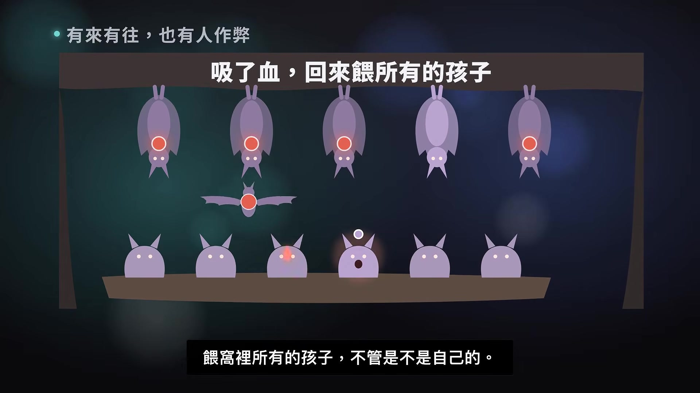

**逐字稿片段：** 研究的人抓住一隻母蝙蝠 用針筒往他的 囊袋裡打空氣 打得鼓鼓的再放回去 其他母蝙蝠看到的是 他明明吸飽了 卻不餵我們的孩子 下一次其他母蝙蝠就不餵他的孩子 這就是以牙還牙 連蝙蝠都會算這筆賬 研究的人做的 就是故意製造一次誤會 看他們怎麼反應

**話題推測：** 描述對吸血蝙蝠進行的實驗，展示「以牙還牙」行為

---

## 00:09:41

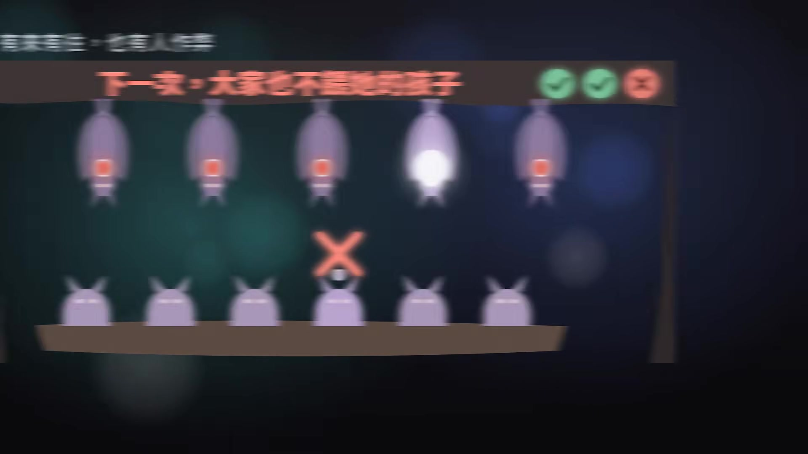

**逐字稿片段：** 規則有了 Sapolsky回到桌上那兩個頭骨 讓全慢一起推

**話題推測：** Sapolsky回到之前介紹的兩個動物頭骨，準備進行推論

---

## 00:09:44

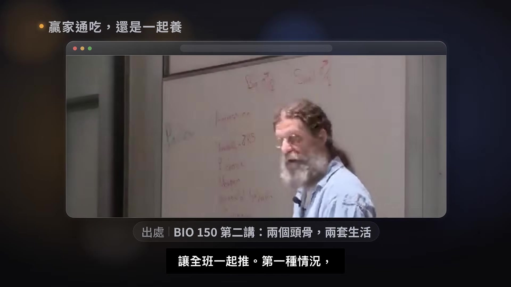

**逐字稿片段：** 第一種情況 公的頭骨比母的大很多 拳齒又長又尖 那公的一定很常打架 搶的是交配的機會 結果是少數幾隻公的 拿走了大部分的交配 其他的一輩子都沒有後代

**話題推測：** 展示第一種頭骨情況：公頭骨遠大於母頭骨，犬齒尖長

---

## 00:09:55

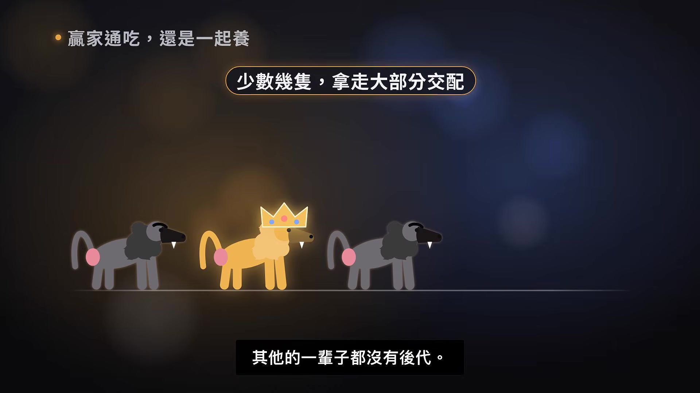

**逐字稿片段：** 這一型叫Tournament Species 中文叫錦標賽型物種 像廢廢 贏家通吃 母的既然只從公的身上拿到基因 就挑最好的基因

**話題推測：** 介紹「錦標賽型物種」(Tournament Species)及其代表動物狒狒

---

## 00:10:03

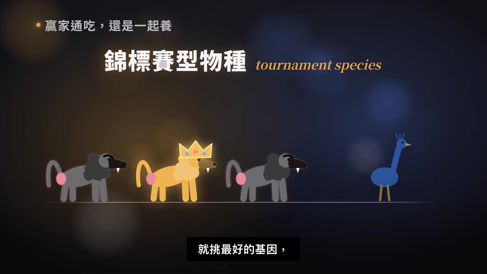

**逐字稿片段：** 紅雀 那一大片尾巴就是這樣來的

**話題推測：** 以紅雀的尾巴為例，說明雌性選擇最佳基因

---

## 00:10:05

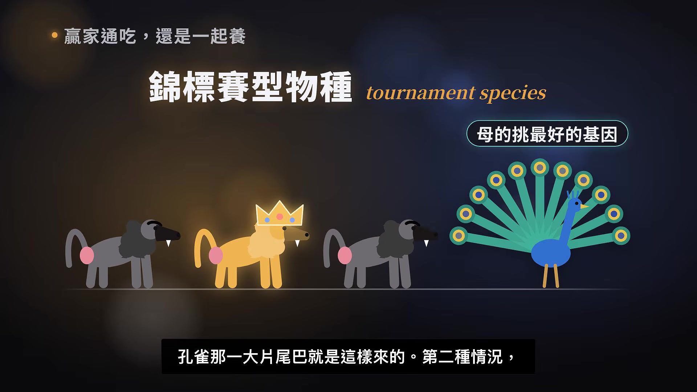

**逐字稿片段：** 第二種情況 兩個頭骨一樣大 這一型叫Pair Bonding 中文叫配對結合 公的跟母的長期在一起 一起養孩子 像南美洲的龍猴 公的很少打架 爸爸帶孩子的力氣 有時候比媽媽還多

**話題推測：** 展示第二種頭骨情況：公母頭骨大小相似

---

## 00:10:17

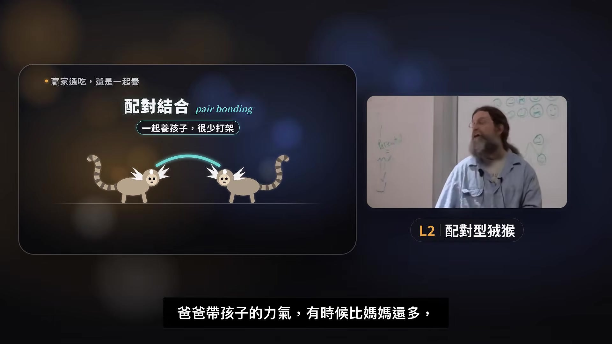

**逐字稿片段：** 所以母龍猴幾乎每次都生雙胞胎 兩隻都養得活 只看一個特徵 就推出一整套生活

**話題推測：** 說明母龍猴常生雙胞胎的行為模式

---

## 00:10:23

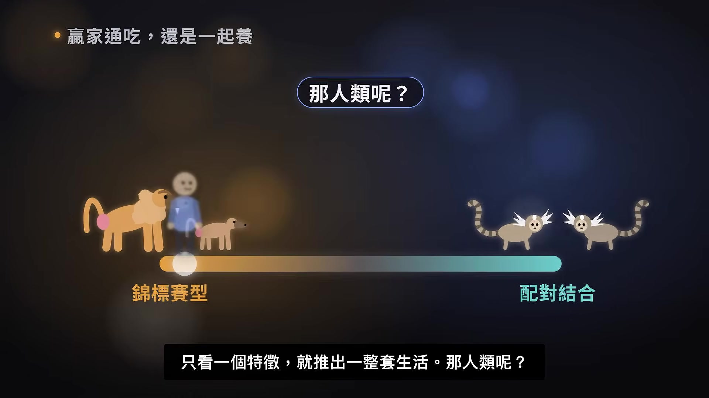

**逐字稿片段：** 那人類呢 男人跟女人的提醒差距 不像沸沸那麼大 也不像龍猴一樣大 爸爸帶孩子的程度 也在中間 大部分文化允許一夫多妻 可是大部分人過的是一夫一妻 Sapolsky說 我們是一個很困惑的物種 這條規則最有力的時候 是他能解釋一件

**話題推測：** 將頭骨推論應用到人類，分析性別體型差異與育兒模式

---

## 00:10:39

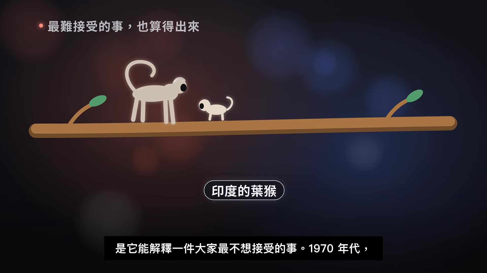

**逐字稿片段：** 大家最不想接受的事 1970年代 研究者Sara Hardy 在印度觀察一種叫夜猴的猴子 發現公猴會殺小猴 這個叫Infanticide 中文叫殺嬰 大家第一個反應是 這群猴子一定出了問題

**話題推測：** 介紹研究者Sara Hardy在印度觀察到的夜猴殺嬰行為

---

## 00:10:49

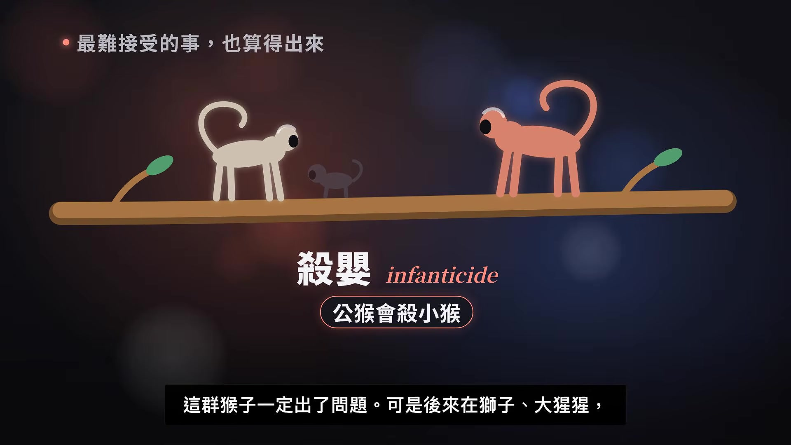

**逐字稿片段：** 可是後來在獅子 大猩猩 很多物種身上都看到 而且他有規律 殺的是新來的公的 殺的是別的公的孩子 而且只出現在一種物種裡 母的餵奶不排卵的那幾年 比一隻公的能當老大的時間還長 你是一隻剛打敗老大的公猴 所有母猴都在餵奶 要等好幾年才會再懷孕 可是你等不到那時候 殺掉小猴 母猴停止餵奶 很快又會排卵 這是冷冰冰的算數

**話題推測：** 列舉獅子、大猩猩等其他物種也存在殺嬰行為

---

## 00:11:15

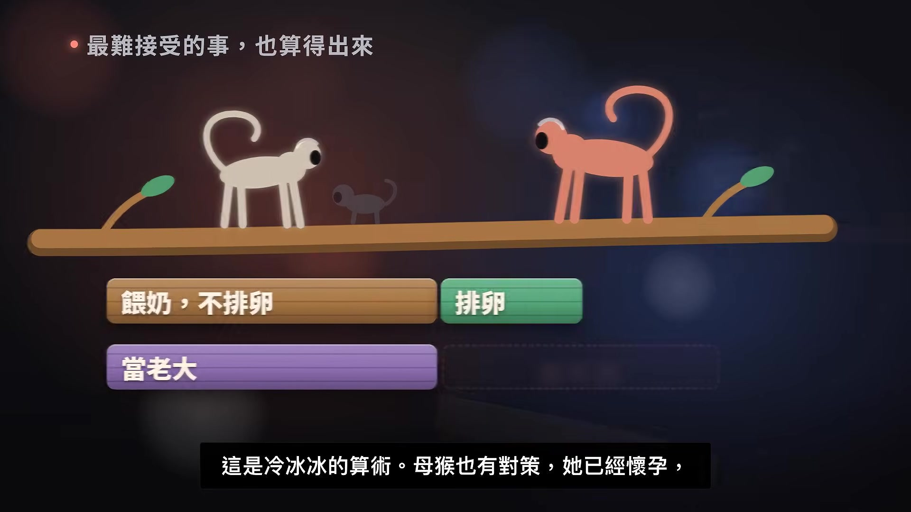

**逐字稿片段：** 母后又有對策 她已經懷孕卻裝出發情的樣子 新公侯跟她交配 幾個星期後孩子出生 公侯不會去算懷孕要多久 就不殺了 Sapolsky說 公侯每次都上當 規則沒有好壞 他只是把每一方的算盤 都攤在桌上 whoa what a guy and they fall for it they fall for it every time 到這裡這套規則看起來無所不能

**話題推測：** 說明母猴避免殺嬰的對策：假裝發情與新公猴交配

---

## 00:11:57

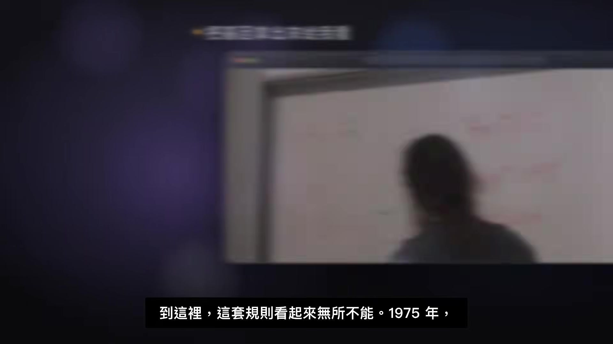

**逐字稿片段：** 1975年E.O. Wilson出了一本書 叫《社會生物學》 說有一天所有社會科學 都會歸到演化生物學底下 Sepolsky藉著講他被批評的地方

**話題推測：** 介紹E.O. Wilson的著作《社會生物學》

---

## 00:12:06

**逐字稿片段：** 這套想法背後有三個假設 行為能遺傳 每個特徵都有用 演化一點一點慢慢變 第一個假設被分子遺傳學的人罵的最兇 社會生物學的證明是倒著來的 我的模型最能解釋沙音 你拿不出更好的 我就當它能遺傳 分子遺傳學的人說 那你把那個基因拿出來給我看

**話題推測：** 列出社會生物學的三個基本假設

---

## 00:12:23

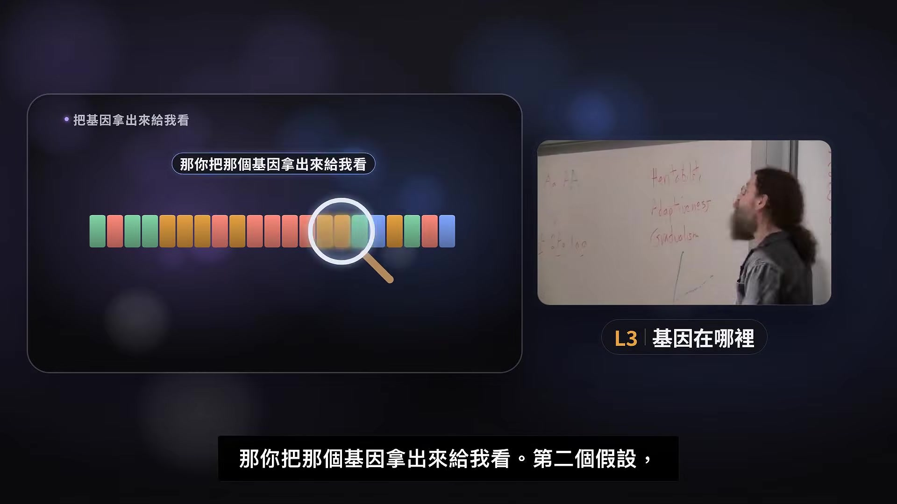

**逐字稿片段：** 第二個假設 被兩位哈佛教授Gould跟Ruanting挑戰 他們借了建築的一個詞 叫Spandrel 中文叫拱肩 兩個拱門並排 中間一定會多出一塊三角形的牆 它沒有目的 只是蓋拱門就躲不掉

**話題推測：** 介紹Gould與Ruanting提出「拱肩」(Spandrel)概念挑戰第二個假設

---

## 00:12:35

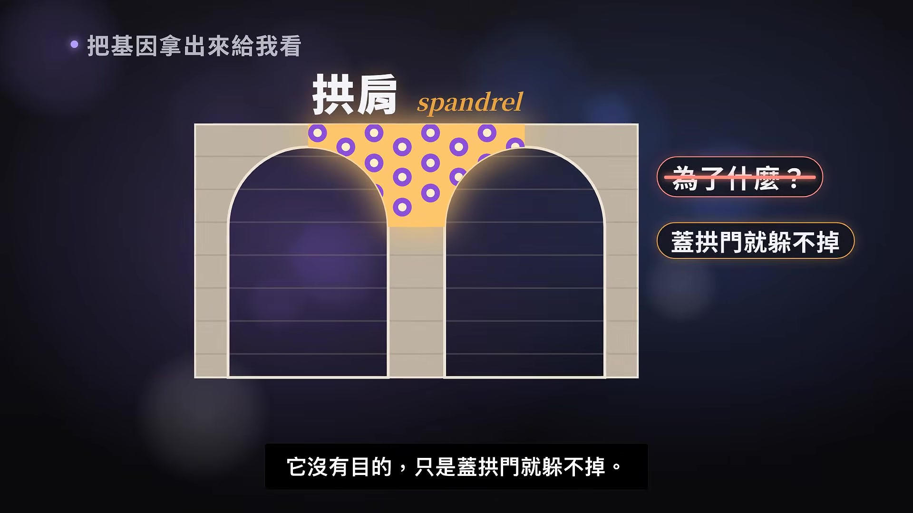

**逐字稿片段：** 人是靈長類裡唯一有下巴的 有人努力研究哈巴有什麼好處 後來才發現 臉變短了 下巴就自己凸出來 不是每樣東西都是為了什麼 這兩個批評問的 其實是同一件事 你說的故事很好聽 可是證據在哪裡

**話題推測：** 以人類下巴為例解釋「拱肩」現象，非所有特徵皆有特定目的

---

## 00:12:48

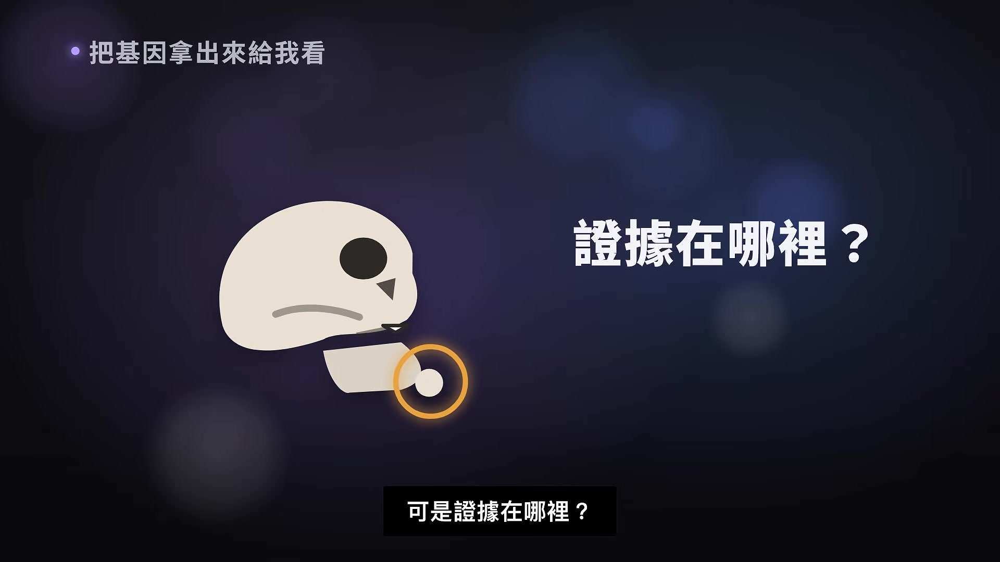

**逐字稿片段：** 第三個假設 是演化一點一點慢慢變 如果每一代多一點點好處 就能多留一點點基因 那每一點好處都值得搶 所以才會有殺因 看起來一切都是競爭

**話題推測：** 闡述社會生物學第三個假設「演化是漸進的」

---

## 00:12:58

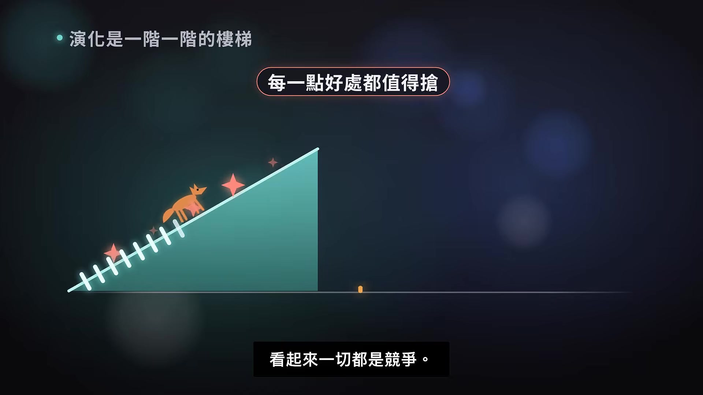

**逐字稿片段：** 而Good跟另一位古生物學家 Niles Eldridge 提出另一種看法 叫Pontuated Equilibrium 中文叫斷續平衡

**話題推測：** 介紹Gould與Eldridge提出「斷續平衡」(Punctuated Equilibrium)理論

---

## 00:13:05

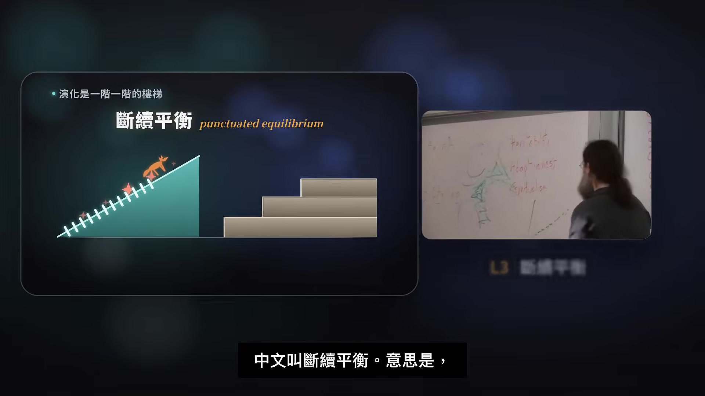

**逐字稿片段：** 意思是 隱化大部分時間什麼都沒發生 很長很長的瓶頸 然後突然在很短的時間裡大變一次 畫出來不是一條斜坡 是一階一階的樓梯 這場爭論還帶著政治 批評的人說 第一代社會生物學家 把競爭跟階級說成天生的 真巧 剛好讓自己這種人得利 另一邊的good是馬克思主義者 他的樓梯 剛好是少一點競爭 偶爾來一場大變動 1970年代末的一場研討會上 還有人衝上臺 把水倒在Wilson頭上 這Polsky說 兩邊都有自己的立場 科學的問題 不過因為誰的立場比較討喜就有答案 要分出誰對的看基因到底在做什麼

**話題推測：** 解釋斷續平衡理論，比喻為階梯而非斜坡式演化

---

## 00:13:40

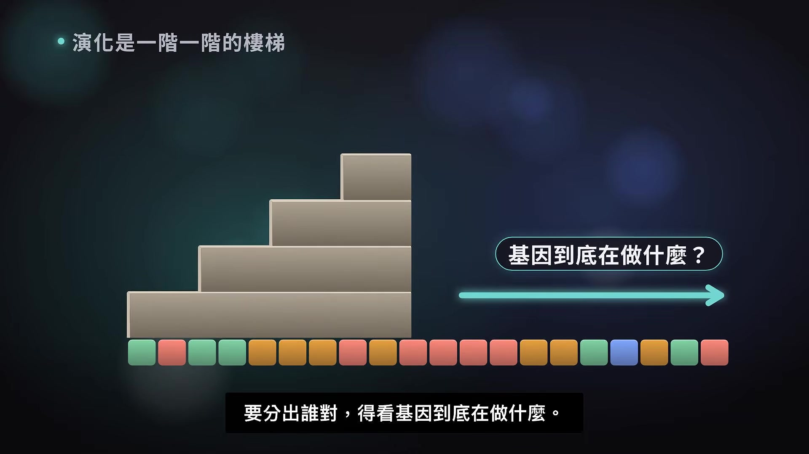

**逐字稿片段：** 我們先停一下把前三堂課收起來 這部分回答是為什麼一個解釋不夠 因為人會分類 分類讓你記得住也讓你看不清 每一門學問都是一個籃子 所以我們沿著時間往回問 走到最遠的一站演化 那裡的規則是 動物做事不是為了物種好 是讓基因留下越多分越好 有自己生幫親戚 有來有往三種做法 他準的讓人意外 從兩個頭骨就推出一整套生活 連沙音都算得出來 他也有管不到的地方 拱門中間的三角形提醒我們 不是每樣東西都有用途 一階一階的樓梯提醒我們 演化不一定是一點一點的變 可是最根本的是 他背後有一個沒被證明的假設 行為能遺傳 這個假設不是隨便說說 因為他背後有一句話 行為是寫在基因裡的 如果這句話錯了 前面那些漂亮的推理 就都少了一塊地基 沒跟上的話 記住這一句 演化是很強的月臺 但還是月臺 下一站 我們照批評的人說的 把基因拿出來看

**話題推測：** 總結前三堂課的內容，回顧「為何單一解釋不足」

---

## 00:14:30

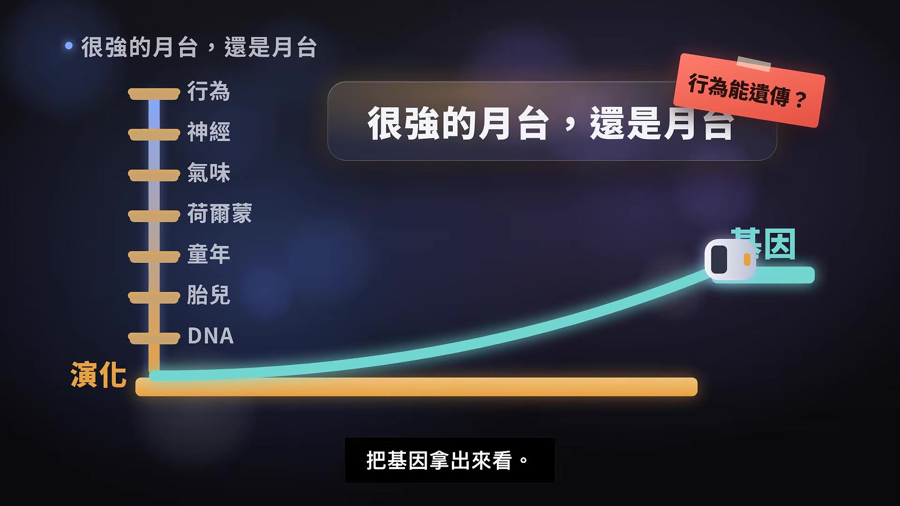

**逐字稿片段：** 第四堂課 Zapolsky說 就是從一個籃子跳到另一個籃子 你剛剛覺得住得舒服 就換一個學門來找他的麻煩 他的意思是 一個學門覺得問題已經回答完了 常常正好是下一個學門開始的地方

**話題推測：** 開始第四堂課，進入分子生物學的領域

---

## 00:14:44

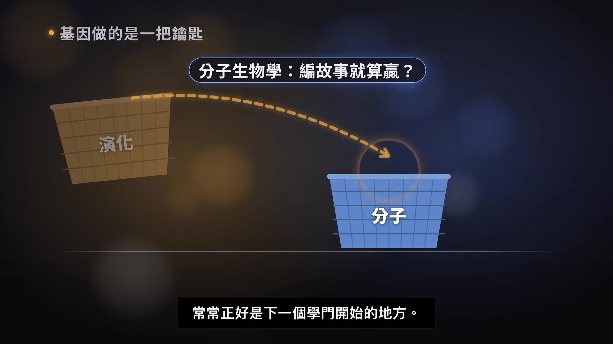

**逐字稿片段：** 這一次輪到分子生物學的人 他們看社會生物學的證明方式 只覺得不屑 一個最好聽的故事就算贏 這也算科學

**話題推測：** 呈現分子生物學家對社會生物學證明方式的不屑態度

---

## 00:14:51

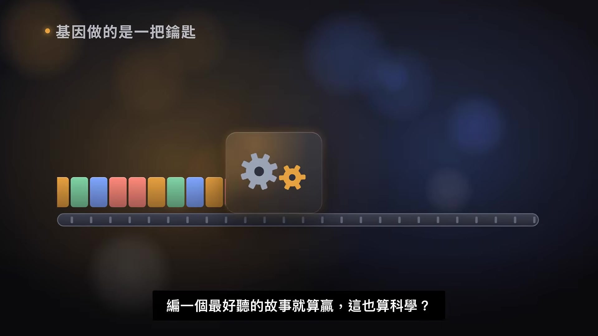

**逐字稿片段：** 我們先把基因是什麼講清楚 一個基因 是一段DNA 它記得是怎麼做出一個蛋白質

**話題推測：** 解釋基因的定義：一段編碼蛋白質的DNA

---

## 00:14:56

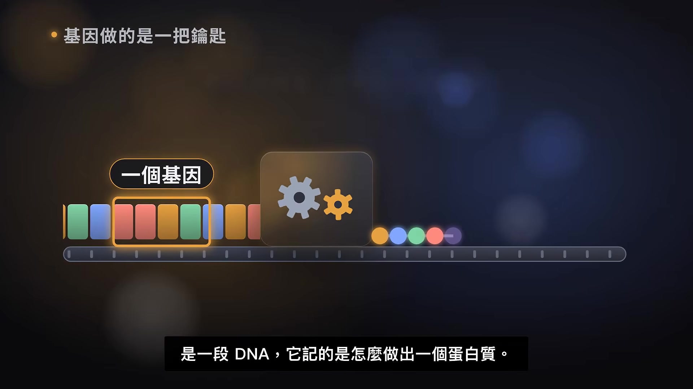

**逐字稿片段：** 蛋白質是細胞裡真正在做事的東西 傳遞訊息靠它 加快化學反應靠它 細胞的骨架也是它搭起來的 蛋白質能做事靠的是形狀 Sepolsky讓全班一起說出那句老話

**話題推測：** 闡述蛋白質在細胞中扮演的角色及其依賴形狀的特性

---

## 00:15:07

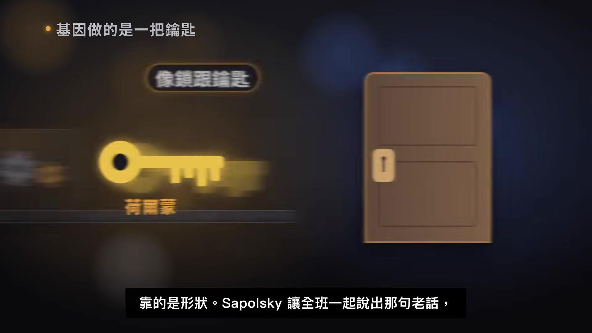

**逐字稿片段：** 像鎖跟鑰匙 一個荷模的形狀 剛好插進一個受體的凹槽 訊號就傳過去了 所以只要知道DNA的順序 你就知道蛋白質長什麼樣子 也就知道它會做什麼

**話題推測：** 以「鎖跟鑰匙」比喻蛋白質作用的精確性

---

## 00:15:16

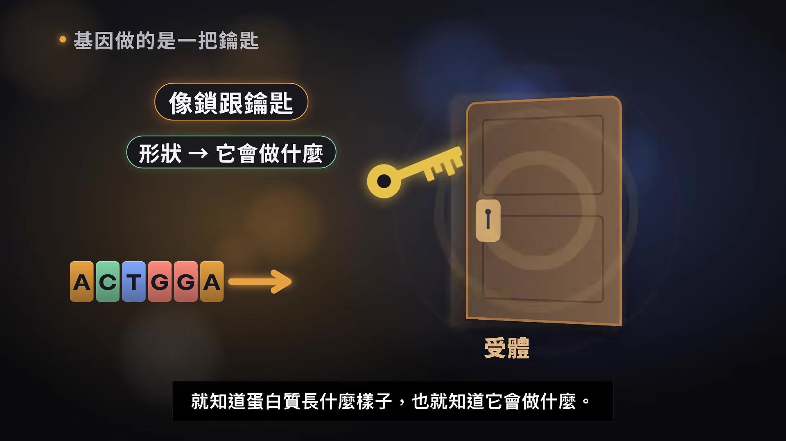

**逐字稿片段：** 發現DNA結構的Francis Crick 把這條路叫做Central Dogma 中文叫中心法則 意思是資訊從DNA流到蛋白質 DNA是發號失令的那一個 請你記住發號失令這四個字 等一下它就站不住了 那基因出錯會怎樣

**話題推測：** 介紹Francis Crick與「中心法則」(Central Dogma)

---

## 00:15:30

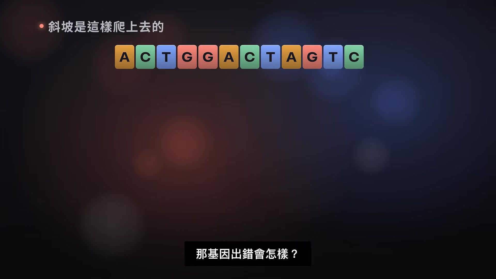

**逐字稿片段：** DNA像一串用四個字母寫成的句子 這個叫mutation 中文叫體變 就是其中一個字母被抄錯了 有時候抄錯了也沒差 因為好幾種寫法指的是同一個意思 就像同一句話有好幾種講法 有時候差很多 一個字錯了 整句的意思就變了

**話題推測：** 解釋基因突變(mutation)的概念，比喻為DNA字母抄錯

---

## 00:15:43

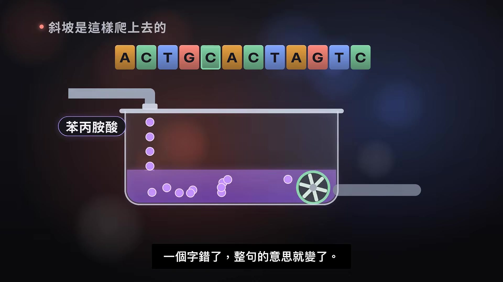

**逐字稿片段：** 身體裡有一種東西叫本秉氨酸 太多會傷害腦子 平常有一種酵素 負責把它轉成安全的東西 只要做這個要素的基因 錯一個字母 要素就不工作 本秉氨酸越積越多 孩子的腦子受損 這個病叫PKU 中文叫本酮尿症 這個名字請你記住 第七堂課它會再出現 而且結局不一樣 不過大部分的圖片 沒有這麼戲劇化 它們只是讓鑰匙的形狀偏一點點 插進鎖裡松一點 或者緊一點 蛋白質做事的效率好一點 或差一點 好一點點就多留一點點基因 一代一代累積 這就是一條慢慢往上的斜坡 這正是第一部分 那些演化推理需要的畫面 每一點好處都算數 每一點都值得競爭 所以古典遺傳學 剛好替慢慢編那個假設說話

**話題推測：** 介紹苯酮尿症(PKU)作為基因突變導致疾病的例子

---

## 00:16:23

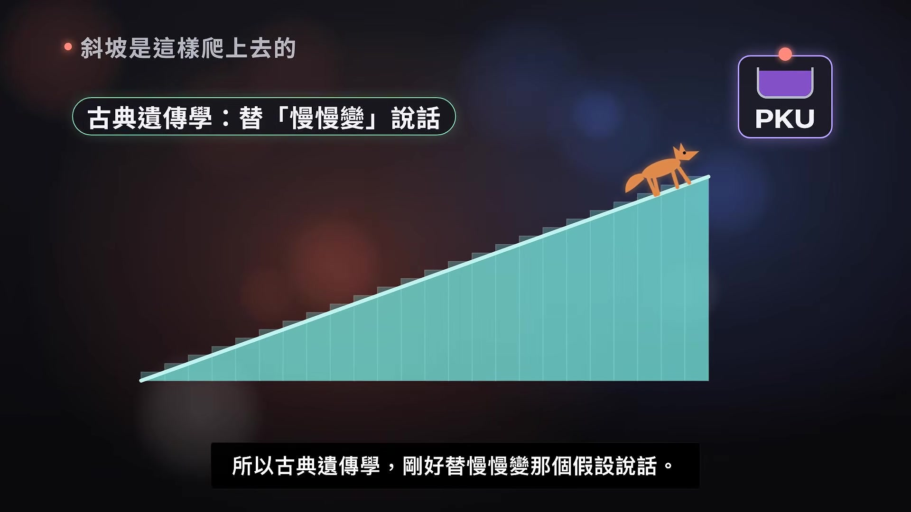

**逐字稿片段：** 接下來是這一堂課最重要的發現 大家原本以為 DNA從頭到尾都是基因 每個接一個牌 結果一算 人類的DNA 超過95%根本不做蛋白質 一開始有人叫它 拉改DNA 可是你的DNA 絕大部分怎麼可能只是填充物

**話題推測：** 揭示人類DNA中超過95%不編碼蛋白質的驚人發現

---

## 00:16:37

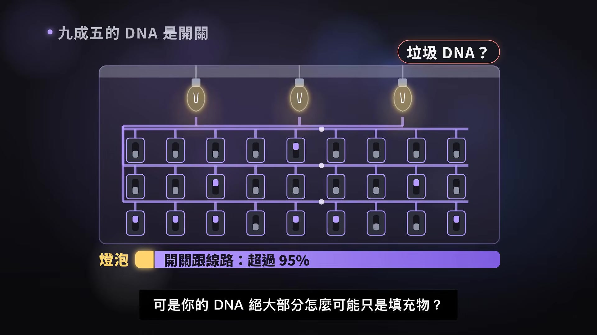

**逐字稿片段：** 後來大家才懂 那是說明書寫的是 每個基因什麼時候開 什麼時候關在身體的哪個地方開 開多大 我們用房子裡的燈來想 基因是燈泡 那九成以上的DNA 是滿牆的開關跟線路

**話題推測：** 解釋非編碼DNA的功能是作為基因的「開關」說明書

---

## 00:16:50

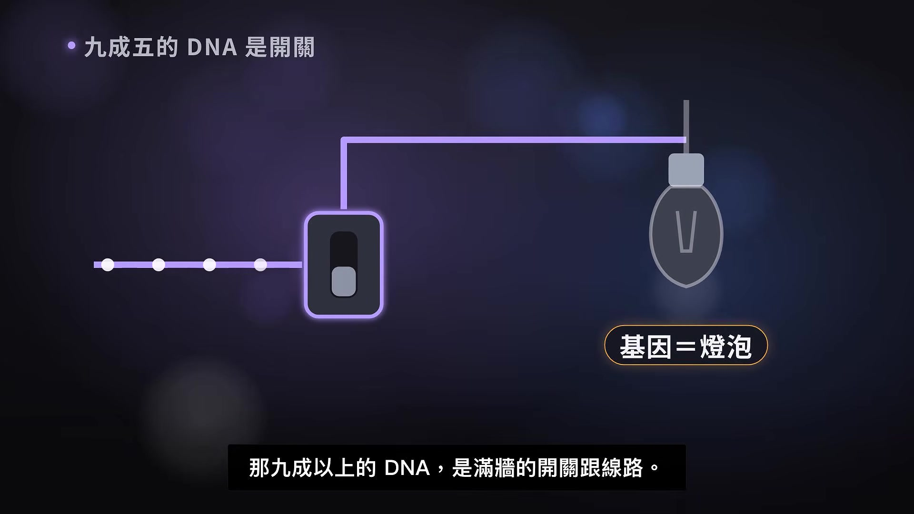

**逐字稿片段：** 開關有名字叫promoter 中文叫啟動子 就是接在一個基因前面的那一段 換句話說每個基因前面都有一個專屬的開關

**話題推測：** 介紹基因的開關「啟動子」(promoter)

---

## 00:16:57

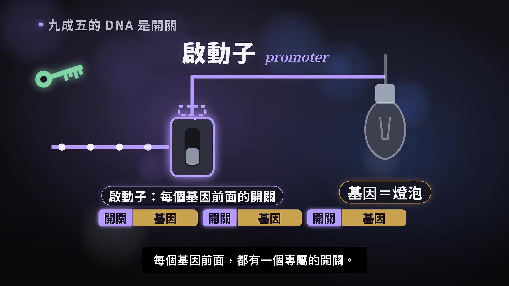

**逐字稿片段：** 來按開關的東西 叫Conscription Factor 中文叫轉錄因子 它的形狀剛好卡進啟動值 一卡進去 那個基因就開始做蛋白質 更妙的是 同一種啟動值可以擠在很多個基因前面 一個轉錄因子按下去 一整排燈同時亮 所以基因要說的 從來不是一道命令 而是一句 如果這個開關被按下 就做這件事

**話題推測：** 介紹觸發基因開關的「轉錄因子」(Transcription Factor)

---

## 00:17:44

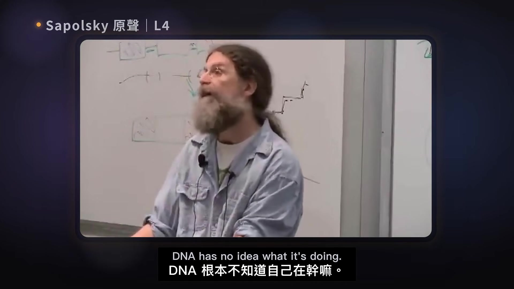

**逐字稿片段：** 那誰來按開關 這是整堂課最關鍵的一個問題 答案是外面 D種外面是細胞自己 細胞快沒能量了 某個轉入因子被叫醒 去打開一批負責搬進養分的基因

**話題推測：** 提出關鍵問題：「誰來按開關？」並預告答案為「外面」

---

## 00:17:55

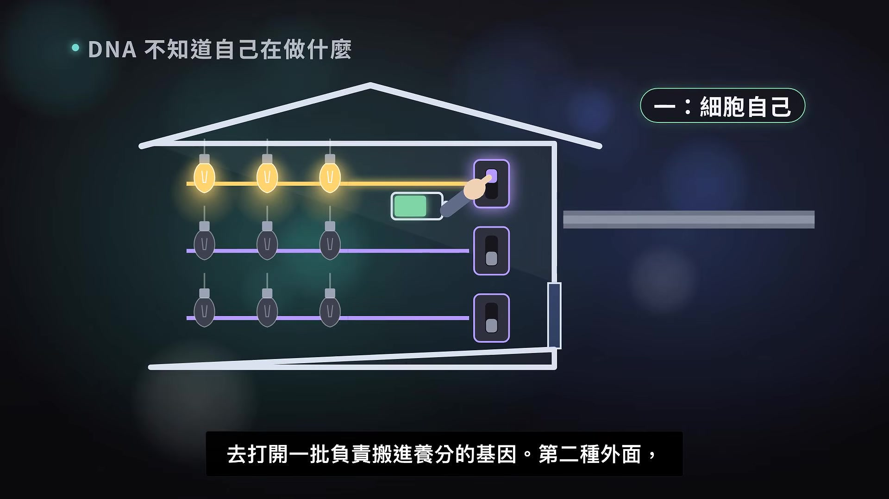

**逐字稿片段：** 第二種外面 是身體的另一頭 碳固酮 從膽管出發 順著血液流到肌肉 卡進肌肉細胞的受體 打開一批讓肌肉長大的基因 第三種外面 真的是身體外面 一隻剛生產的母鼠 聞到自己孩子的氣味 訊號一路傳進去 打開做荷爾蒙的基因 他更投入照顧孩子 你注意到了嗎 這三個例子裡 基因本身一個字都沒改 改的是誰在什麼時候按下開關 同一個基因在不同的時候 不同的地方 做的事可以差很多 Zapolsky說的很直接 DNA不知道自己在做什麼 燈泡不會自己決定要不要亮 一個基因要不要作用 是由細胞 身體 甚至整個世界發生的事決定的

**話題推測：** 闡述第二種「外面」：身體荷爾蒙如睪固酮調控基因

---

## 00:18:31

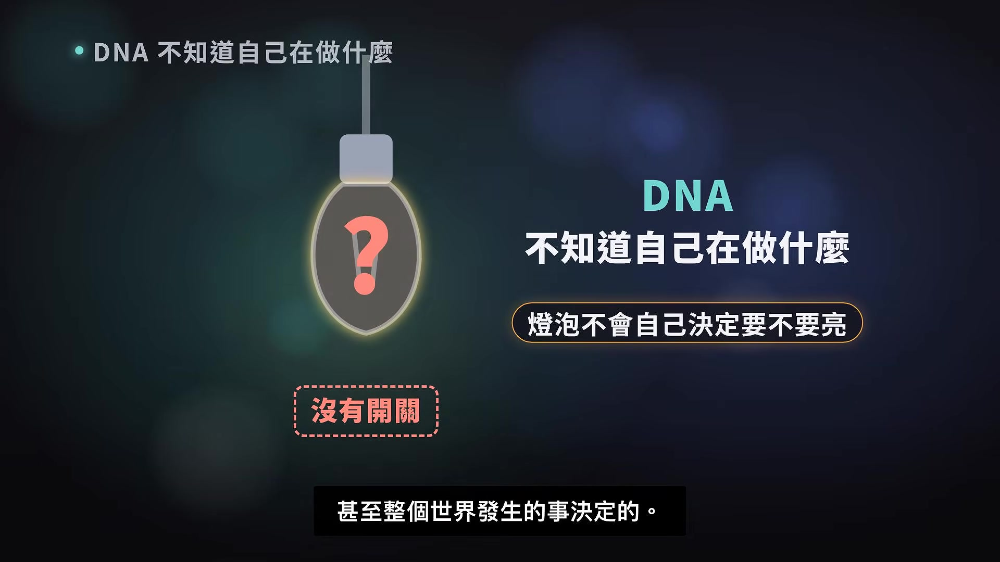

**逐字稿片段：** 這裡要用一個很重要的詞 Environment 環境 環境不只是你住在哪個城市 吃什麼 被誰養大 細胞裡的能量 液液裡的荷蒙 鼻子聞到的氣味 對 基因來說都是環境 有些開關按下去 會卡住 很久都不回來 基因外面包著一層蛋白質 可以把DNA卷緊 卷得很緊的地方 轉入因子擠不進去 那個基因就等於被關掉了 研究這種變化的學問 叫Epigenetics 中文叫錶冠遺傳學 前面的開關是按一下 放開就回來 錶冠遺傳像是有人 在開關上貼了一塊膠帶 他研究的不是DNA寫了什麼 而是DNA哪些地方讀得到

**話題推測：** 強調「環境」(Environment)的廣義定義

---

## 00:19:05

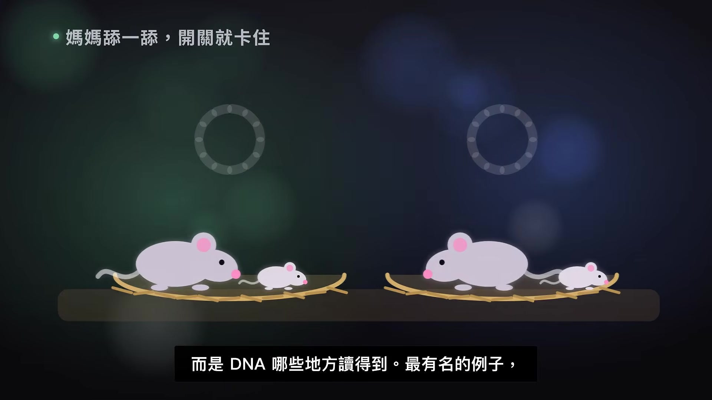

**逐字稿片段：** 最有名的例子 來自加拿大麥基爾大學的 Michael Meaney 有些老鼠媽媽很常舔孩子 幫孩子理毛 有些很少 常被舔的小老鼠 長大以後比較不緊張 面對壓力恢復得比較快 原因就在開關 被舔得多的小老鼠 跟壓力荷爾蒙有關的基因 開關的狀態不一樣 而且維持到長大 他當然媽媽也比較會舔孩子 這個痘子就一代一代傳下去 可是傳的不是基因 好消息是 這個開關不是旱死的 把小老鼠換給一個很會舔的媽媽帶 開關還能轉回來

**話題推測：** 以Michael Meaney研究的母鼠舔舐行為對子代壓力反應的影響為例，說明表觀遺傳學

---

## 00:19:32

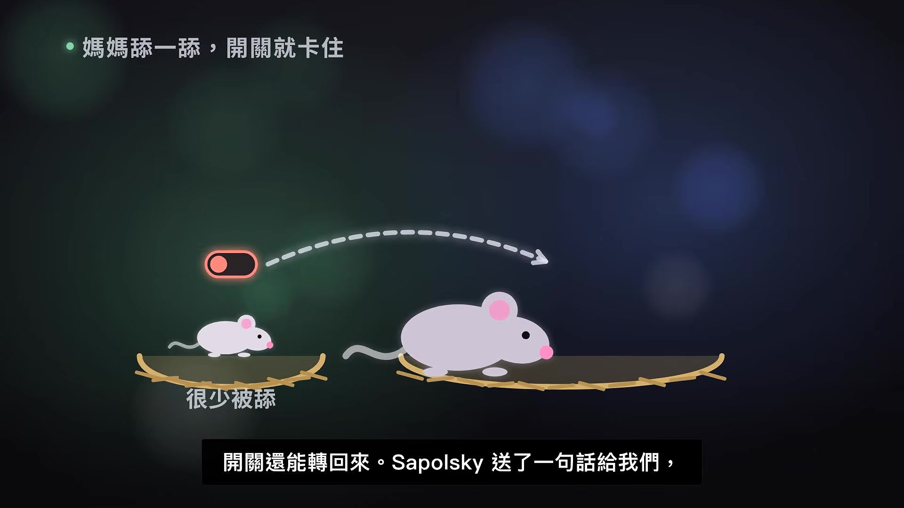

**逐字稿片段：** Szpowski送了一句話給我們 受精講的是遺傳 發育講的是錶冠遺傳 你拿到的基因在受精那一刻就定了 可是哪些基因讀得到 是長大的過程一路寫上去的 Deposition is all about genetics Development is all about epigenetics And what epigenetics is about are ways in which the environment not only can regulate what's going on with this gene right now but can cause lifelong differences in the ability to access gene

**話題推測：** Sapolsky總結：受精是遺傳，發育是表觀遺傳

---

## 00:20:04

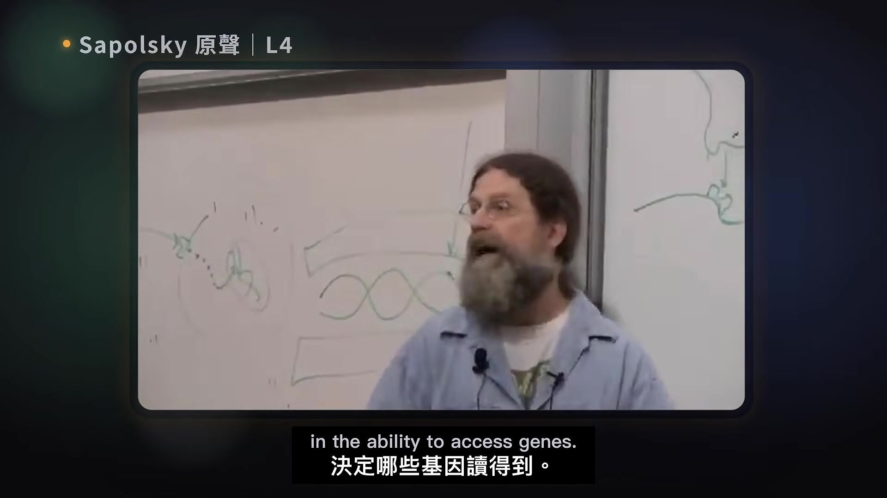

**逐字稿片段：** 第五堂課 Zaposki把這些開關接回演化 改基因本身 像換一個燈泡 頂多讓某盞燈亮一點或暗一點 可是改一個開關 就可能讓一整排燈在新的時間 新的地方亮起來

**話題推測：** 開始第五堂課，將基因開關與演化連結

---

## 00:20:16

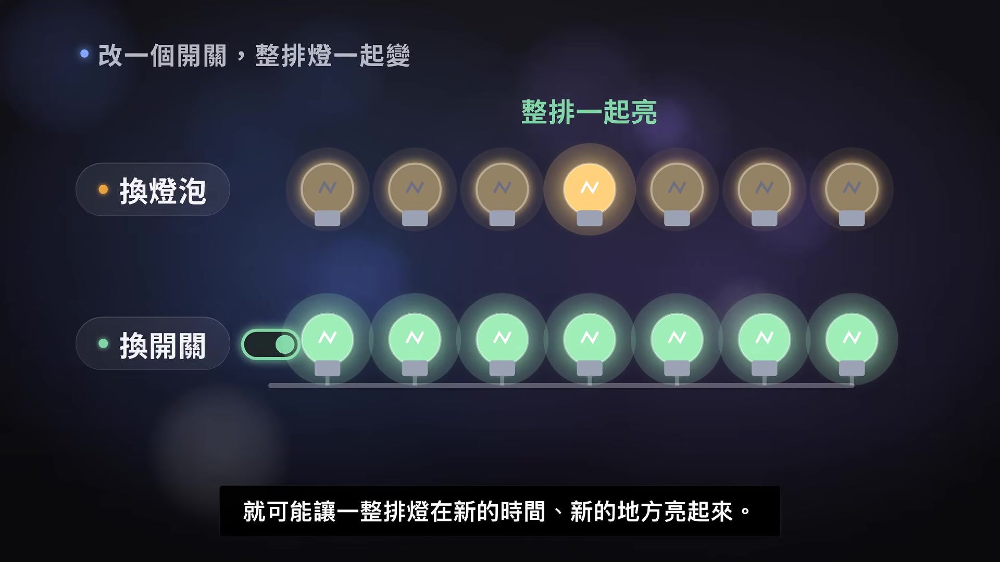

**逐字稿片段：** 一個例子是田鼠 有些田鼠很專一 公的跟母的一輩子在一起 有些田鼠很不專一

**話題推測：** 以田鼠的忠誠度差異為例，說明基因開關的影響

---

## 00:20:21

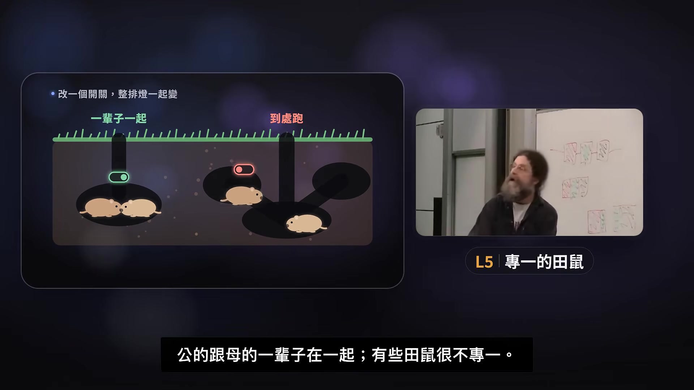

**逐字稿片段：** 差別跟一種荷爾蒙的獸體有關 叫加壓鼠獸體 獸體就是接收荷爾蒙的那個鎖孔 這個獸體基因本身幾乎一樣 差別在它前面那段開關 讓獸體出現在腦子裡的不同地方 研究的人在不專一的公田鼠腦中某一區 多放一些這種獸體 它就開始只黏著同一個伴侶 一個開關的位置不同 一種動物的婚姻制度就跟著不同

**話題推測：** 解釋田鼠忠誠度差異與加壓素受體基因開關的關係

---

## 00:20:41

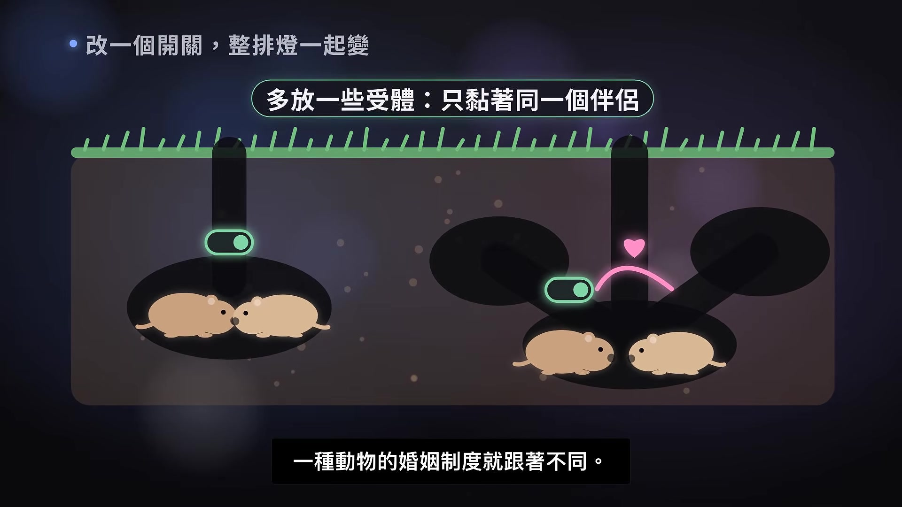

**逐字稿片段：** 另一個例子更大 1970年代 伯克萊的Mary Claire King跟Alan Wilson 亮出人跟黑猩猩的蛋白質幾乎一模一樣 於是大膽猜 我們跟黑猩猩的差別主要不在零件 而在開關 後來很多研究都往這個方向走 這對演化是個好消息 要做出一種很不一樣的動物 不用重新發明零件 改幾個開關就夠了 開關還能搬家 這要講一位科學家Barbera McClintock 他研究玉米 看一粒一粒玉米的顏色怎麼遺傳 40歲出頭就被選進美國國家科學院 是那個年代最頂尖的遺傳學家之一 有一天他算出一個很怪的結論 唯一的解釋是 基因會在DNA上跳來跳去

**話題推測：** 介紹King與Wilson發現人與黑猩猩差異主要在基因開關而非基因本身

---

## 00:21:16

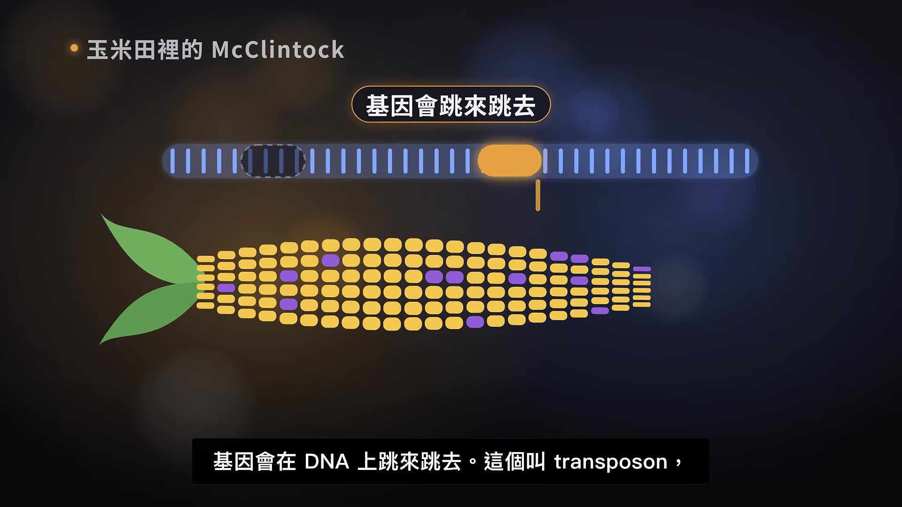

**逐字稿片段：** 這個叫transposon 中文叫轉位置 大傢俬下叫他跳躍基因 那時候很多人覺得他瘋了 他沒有吵 繼續回到玉米田做他的實驗 幾十年後 分子生物學的工具追上來 證明他是對的 他80多歲拿到諾貝爾獎 Zaposki也說 這段歷史常被講得太悲壯 其實當時也有人懂他 只是他的論文很難讀 Zaposki見過他一次 說他那時候90歲左右 很客氣 但很明顯只想趕快回去照顧他的玉米

**話題推測：** 解釋跳躍基因(transposon)的發現

---

## 00:21:39

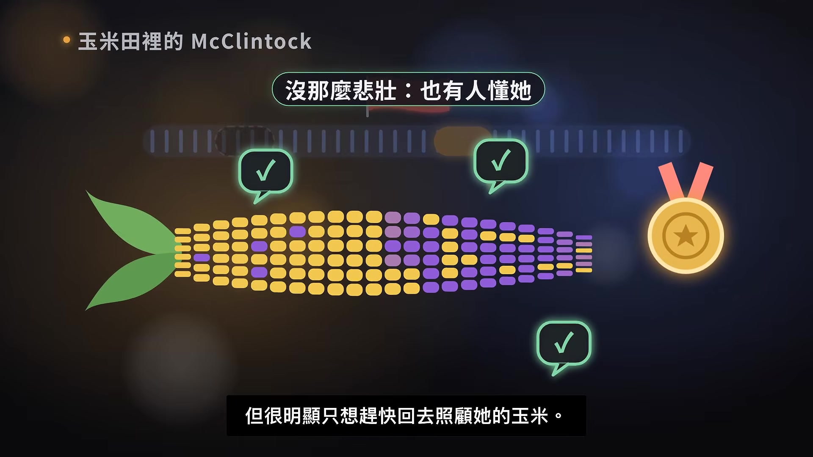

**逐字稿片段：** 跳躍基因重要在哪裡? 一段開關跳到別的基因前面 就等於寫出一句從來沒有過的 如果怎樣就怎樣

**話題推測：** 闡釋跳躍基因的重要性，創造新的「如果...就...」指令

---

## 00:21:45

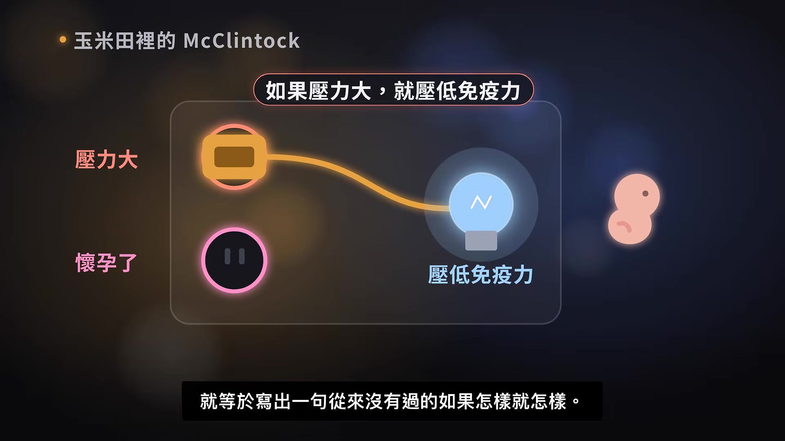

**逐字稿片段：** Szabowski舉了一個想像的例子 原本是 如果壓力荷爾蒙多 就壓低免疫力 要是負責接收荷爾蒙的那一段 換成懷孕荷爾蒙的版本 就變成 如果懷孕了 就壓低免疫力 媽媽的身體就比較不會攻擊胎兒 我們現在可以回答脅迫跟樓梯啦

**話題推測：** 舉例說明跳躍基因如何改變荷爾蒙對免疫系統的影響

---

## 00:22:23

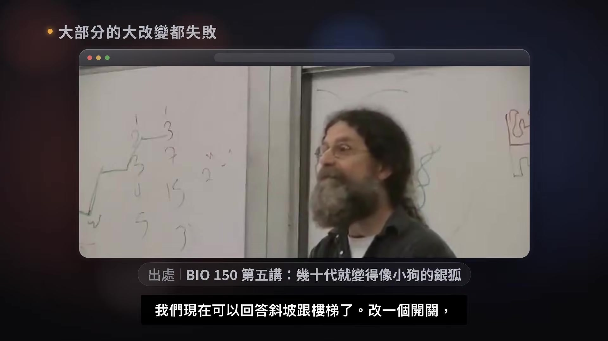

**逐字稿片段：** 改一個開關 影響的是一整群基因 這種大改變 碰巧整群都變好的機會非常小 絕大部分是宅男 就像你把一棟房子的總開關亂接一通 碰巧每個房間都更好用的機會幾乎是零 所以大部分時間 任何大改變都會被淘汰 族群停在原地 這就是樓梯上那段長長的平臺 那什麼時候會跳一階 當環境壞到極點 大部分個體都活不下來 只有剛好帶著某種怪特質的少數熬過去

**話題推測：** 解釋改變基因開關如何影響一整群基因，導致大幅度變異

---

## 00:22:48

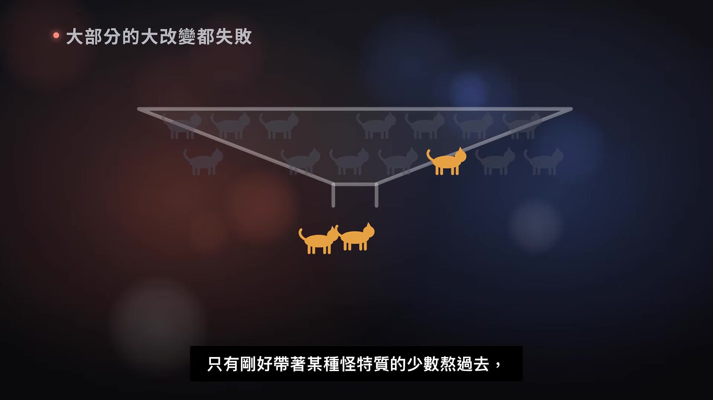

**逐字稿片段：** 這個叫bottleneck 中文叫瓶頸

**話題推測：** 介紹「瓶頸效應」(bottleneck)如何導致演化階段性跳躍

---

## 00:22:50

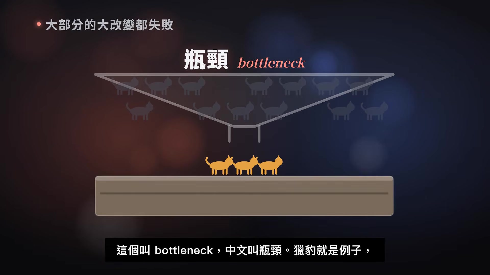

**逐字稿片段：** 獵豹就是栗子 今天的獵豹彼此太像 一隻獵豹的皮膚移植到另一隻身上 幾乎不會排斥 他們都是一小群倖存者的後代 演化也可以快得出奇 一位蘇聯遺傳學家 Dimitri Belyaev 養銀狐 每一代只讓最不怕人的狐狸繁殖 只選了幾十代 這些狐狸就會咬尾巴 耳朵變軟 嘴巴變短 毛色變得花花的 看起來像小狗 他只選了個性 外表整套跟著變 因為這些特徵背後 很可能是同一批開關 Sapolsky的結論是 斜坡跟樓梯不用二選一 零件的小改變 在爬斜坡 開關的大改變在跳樓梯 Spot and Rover and all those guys 那些人 他們是叫做 也有些人 Ironic ending 很歷史的結局 如果想要的話 他們會殺死多數人 In the process of breeding them They became useless economically

**話題推測：** 以獵豹為例說明瓶頸效應導致基因多樣性降低

---

## 00:23:47

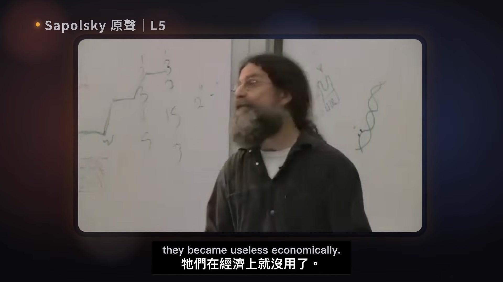

**逐字稿片段：** 我們再停一下 把分子遺傳學收起來 這部分回答的是 把基因拿出來看 它到底在做什麼 答案是基因很少直接下命令 做零件的那小段DNA 決定蛋白質的形狀 改一個字母 多半是讓它好一點或差一點 這是斜坡 超過九成的DNA是開關 他們把基因寫成一句一句的 如果怎樣就怎樣 改一個開關一整排燈跟著變 這是樓梯 所以演化裡的斜坡跟樓梯 都找得到分子上的原因 第一部分留下的第三個假設 在這裡有了答案 兩種都對 最要緊的是 按開關的常常是外面 細胞 荷爾蒙 氣味 甚至媽媽舔了你幾下 那第一個假設呢 行為能遺傳嗎 現在的答案變成 基因確實參與了行為 可是它參與的方式 是等外面的訊號 沒跟上的話 記住這一句 基因說的是 如果的那一半在外面 這就帶出下一個問題 既然基因跟環境 纏在一起 有沒有辦法算出 一個行為幾成是天生的 有一整個學門 專門在算這個數字 他給的答案 常常上新聞 也常常被誤解

**話題推測：** 總結分子遺傳學的內容

---

## 00:24:42

**逐字稿片段：** 第六堂課 又換一個籃子 叫Behavior Genetics 中文叫行為遺傳學

**話題推測：** 開始第六堂課，引入「行為遺傳學」(Behavior Genetics)

---

## 00:24:47

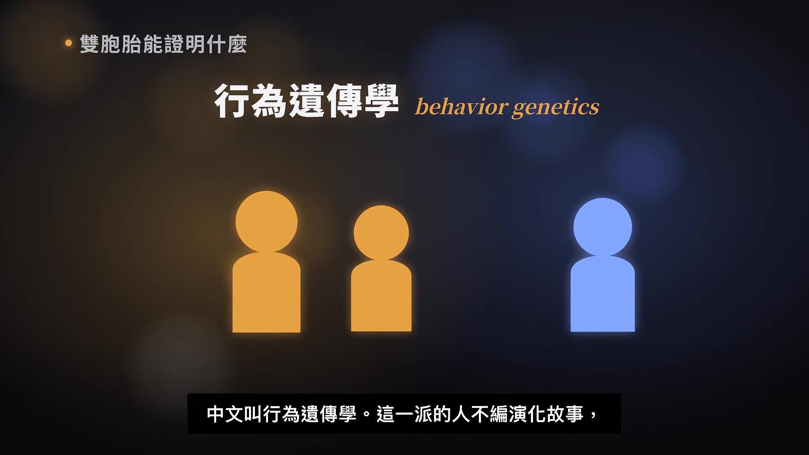

**逐字稿片段：** 這一派的人 不編演化故事也不找突變 他們看的是 越親的人行為是不是越像

**話題推測：** 解釋行為遺傳學的研究方法：比較親緣關係與行為相似度

---

## 00:24:52

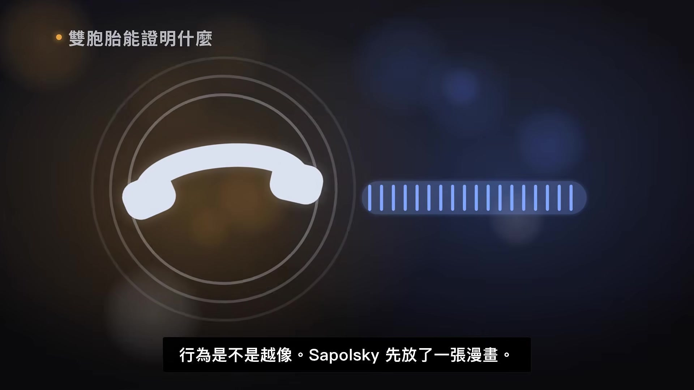

**逐字稿片段：** Sapolsky先放了一張漫畫 兩個科學家在實驗室 一個說 你知道有時候講電話講很久 對方想掛又不好意思說 就說我不耽誤你了吧 我好像找到那個的基因了 這就是很多人對這一行的印象 什麼行為都能找到一個基因 Sapolsky要我們看的是 他們用來證明的工具 到底靠不靠得住 最簡單的證據是 某個行為在家族裡代代相傳 可是家族裡傳的不只有基因還有環境 那就比較雙胞胎 同卵雙胞胎 基因幾乎一模一樣 一卵雙胞胎 就跟一般的心地姐妹一樣 大約只有一半 如果兩種雙胞胎 都在同一個家長大 同卵的比較像 就代表是基因 問題是 同卵雙胞胎長得一樣 爸媽跟老師 對待他們也更一樣 連在媽媽肚子裡 有些同卵雙胞胎 還共用一個胎盤 環境從一開始 就沒有被控制住 and you've been talking for a long time 所以他們說我應該不應該再保護你 so they say I probably shouldn't keep you any longer 即使你不是想要離開 因為他們是想要離開 Well, I think I found the gene for that 那就讓基因跟環境分開

**話題推測：** 展示一張諷刺行為遺傳學常見誤解的漫畫

---

## 00:26:06

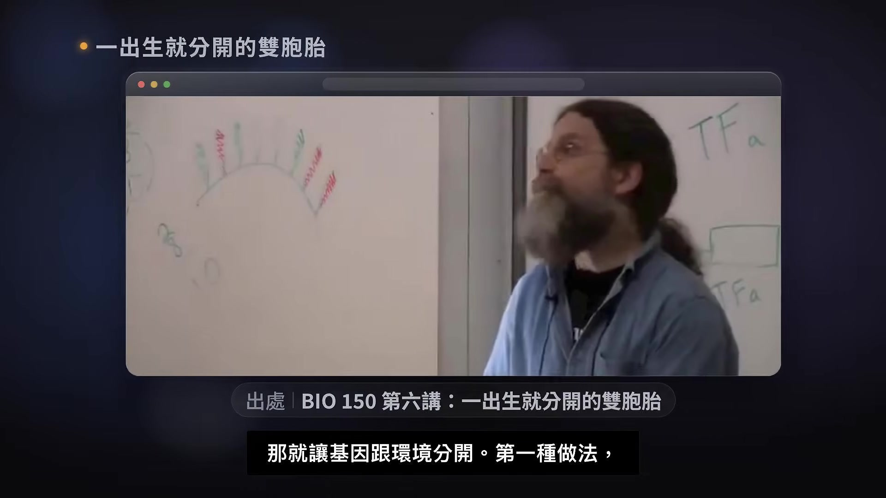

**逐字稿片段：** 第一種做法是看被收養的孩子 1960年代 Simo Ketty的團隊到丹麥 因為那裡的紀錄最完整 他們找出所有被收養 後來得了思覺失調症的人 失血失調症就是以前說的精神分裂症 再去查他們的親生父母跟養父母 結果是就算一出生就被抱走 從來沒跟親生父母住過 親生父母有這個病的孩子 得病的機會還是明顯高很多 這是早期很紮實的一個證據 說一種精神疾病有遺傳的成分

**話題推測：** 介紹行為遺傳學研究方法：收養研究

---

## 00:26:32

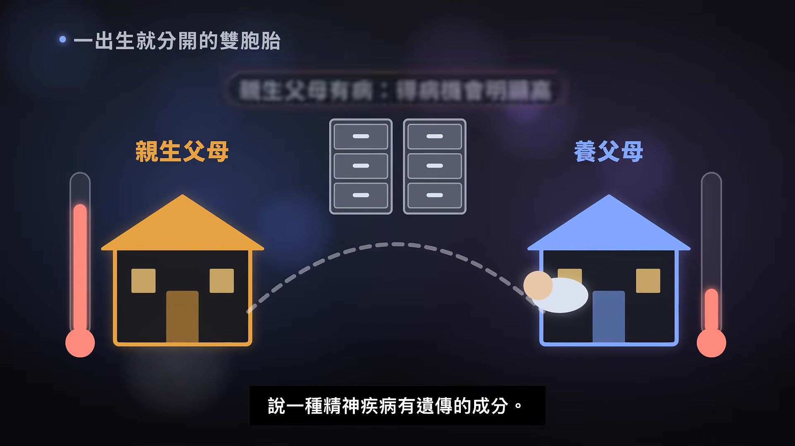

**逐字稿片段：** 第二種做法更理想 一出生就被分開的同軟雙胞胎

**話題推測：** 介紹行為遺傳學研究方法：分開撫養的同卵雙胞胎研究

---

## 00:26:36

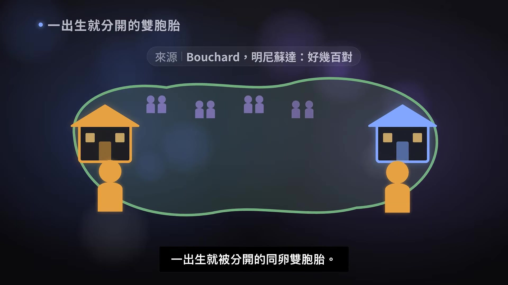

**逐字稿片段：** 明尼蘇達大學的Tom Bouchard 找了好幾百對這種雙胞胎 這些雙胞胎重逢的故事 常常很動人 早期最轟動的一對 一個在德國長大 一個在猶太家庭長大沖鋒以後 大家發現兩個人上廁所前 都會先衝一次水 這種很怪的相似 登上了報紙 可是真正有分量的 是大量雙胞胎累積起來的統計 智商、外向程度這些德質 同卵雙胞胎分開長大也還是很像 可是這些研究也有漏洞 收養機構會刻意把孩子放進 跟原生家庭相似的家庭 分開長大的雙胞胎 環境其實沒有那麼不一樣 這些方法有一個共同的前提 環境從出生那一刻才開始 Sepolsky說 這個前提錯了

**話題推測：** 以Tom Bouchard的雙胞胎研究為例，展示分開撫養雙胞胎的相似性

---

## 00:27:12

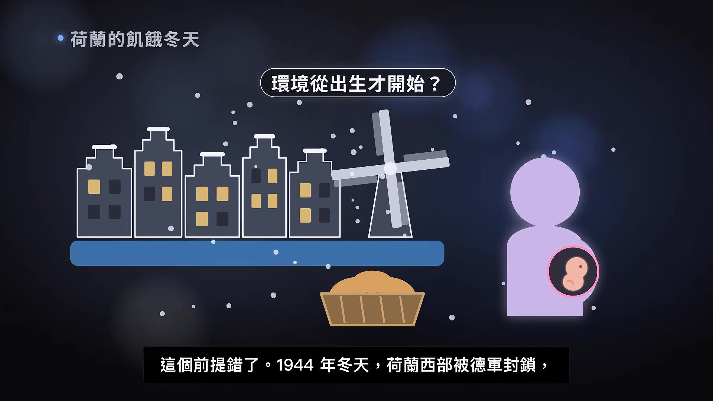

**逐字稿片段：** 1944年冬天 荷蘭西部被德軍封鎖 糧食運不進來 一個本來期的還算正常的地方 突然陷入饑荒 一直到隔年春天才解放 那個冬天還在媽媽肚子裡的胎兒 透過媽媽的血 學到一件事 外面的食物很少 於是身體把自己挑成一種模式

**話題推測：** 介紹1944年荷蘭饑荒作為產前環境影響的例子

---

## 00:27:27

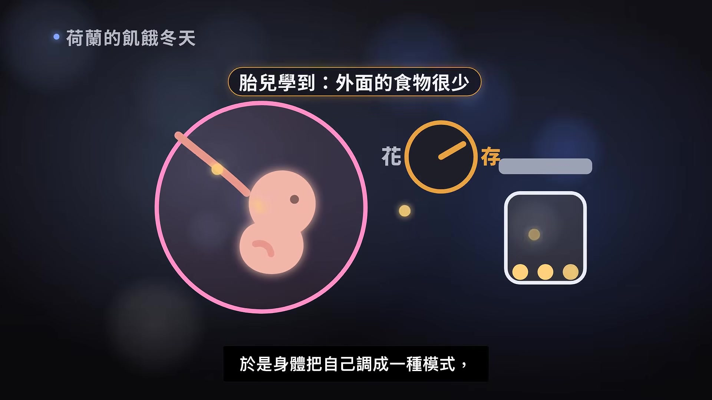

**逐字稿片段：** 這個叫thrifty phenotype 中文可以叫節肩體質 他的意思是 吃進來的每一點熱量 都儘量存起來 鹽分也緊緊留住 問題是 戰爭結束 他們長大以後吃的是正常的飯 一個為饑荒準備的身體 碰上吃得飽的世界 肥胖 血糖 血壓出問題的比例都比較高 有意思的是 時間點很要緊 同一場疾風 出生以後才碰上了嬰兒 就沒有這麼明顯的效果 甚至有研究說 連他們的下一代都看得到一點因子 一個在嬰兒出生後才開始觀察的研究者 看到孩子跟媽媽一樣容易胖 會以為他看到的是遺傳 其實那是媽媽肚子裡的環境 兔子裡能學到的 不只是食物多不多

**話題推測：** 解釋饑荒時期胎兒發展出的「節儉體質」(thrifty phenotype)

---

## 00:28:04

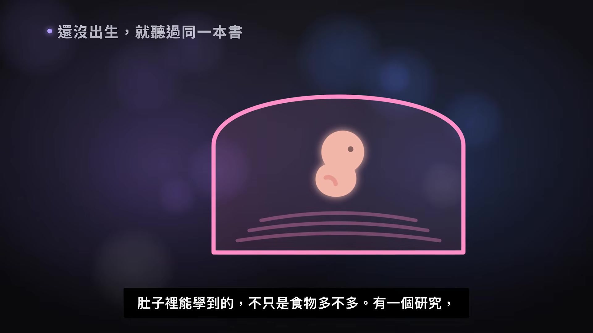

**逐字稿片段：** 有一個研究 請懷孕的媽媽在最後幾個星期 每天大聲念同一本童書 蘇斯博士的戴帽子的貓 孩子出生以後 研究的人讓新生兒 氣一個會記錄動作的奶嘴 吸法不同 就播不同的故事 結果新生兒比較愛聽那本聽過的書 他還沒出生就已經熟悉一個故事的節奏 如果你只在他出生以後才開始觀察 你會以為他天生就偏愛這本書 另一個實驗更直接

**話題推測：** 介紹媽媽孕期朗讀童書，新生兒偏好熟悉的實驗，說明產前學習

---

## 00:28:27

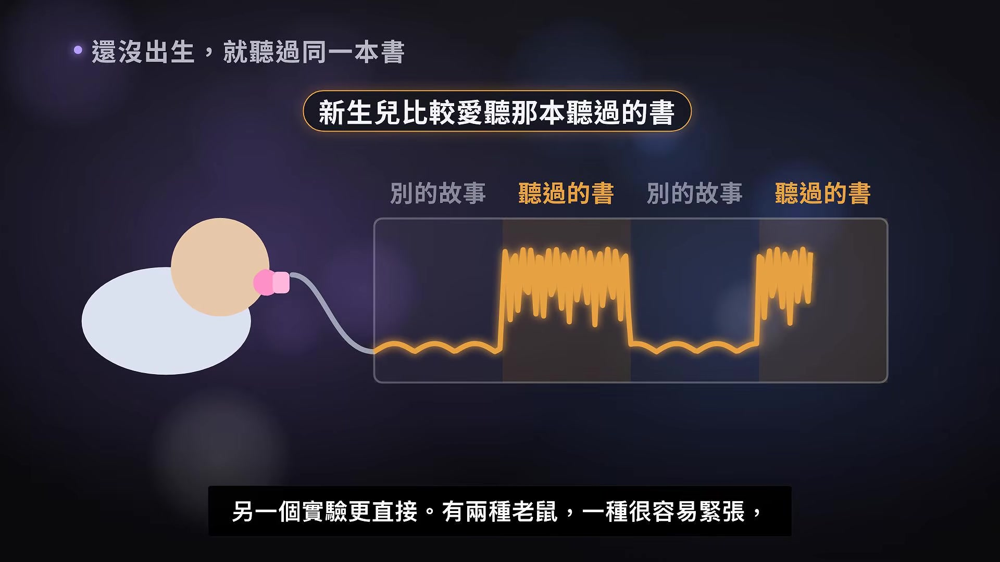

**逐字稿片段：** 有兩種老鼠 一種很容易緊張 一種很冷靜 一代一代都是這樣 看起來就是遺傳 研究的人把容易緊張那種的胚胎 移到冷靜那種媽媽的肚子裡 生下來也由他帶大 結果長大以後是冷靜的 還有一件事 連爸爸媽媽給的東西都不是一半一半

**話題推測：** 以老鼠胚胎移植實驗為例，說明子宮環境對行為的影響

---

## 00:28:41

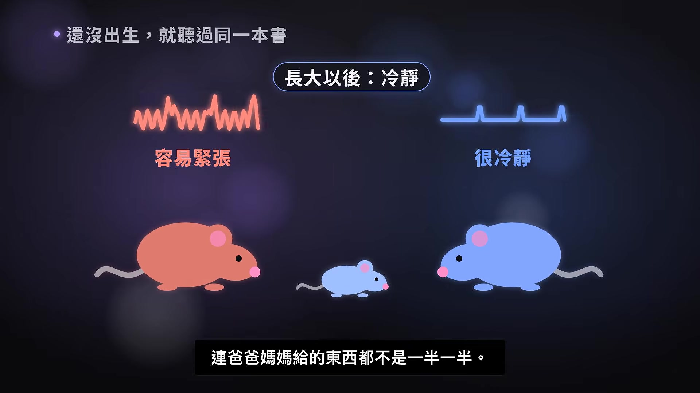

**逐字稿片段：** 細胞裡負責產生能量的立線體 有自己的一小段DNA 而它只從媽媽那邊來 所以你看到一個痘子比較像媽媽 不一定是兔子裡的環境 也可能是遺傳 本來就不對稱 這些都讓天生幾成變得更難算 媽媽給的比我們以為的多

**話題推測：** 介紹細胞粒線體DNA僅來自母親，說明非對稱遺傳

---

## 00:28:55

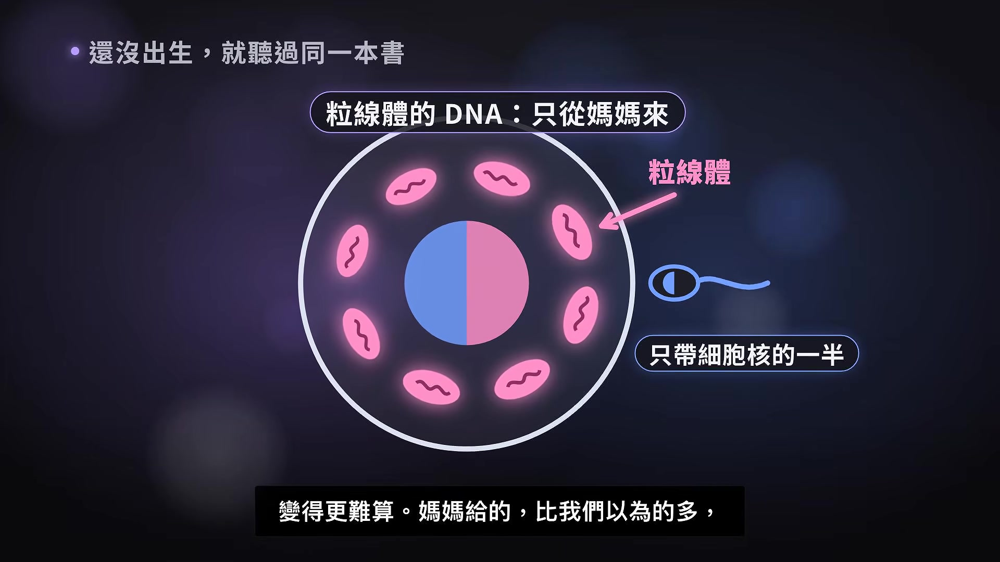

**逐字稿片段：** 也比我們以為的早 後來工具進步 研究人可以直接找基因了

**話題推測：** 講述基因研究工具進步，可直接尋找特定基因

---

## 00:28:58

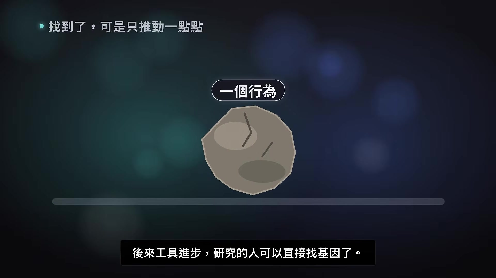

**逐字稿片段：** 做法有兩個方向 一個是從行為出發 找一大家族 比對有病的人跟沒病的人 DNA差在哪一段 另一個是從動物研究出發 先知道一個基因在老鼠身上做什麼 再看人類的不同版本 有沒有對應的差別 還記得田鼠的加壓素受體嗎 人類男性也有不同版本的那段開關

**話題推測：** 介紹直接尋找基因的兩種研究方向：從行為到基因，或從動物基因到人類

---

## 00:29:14

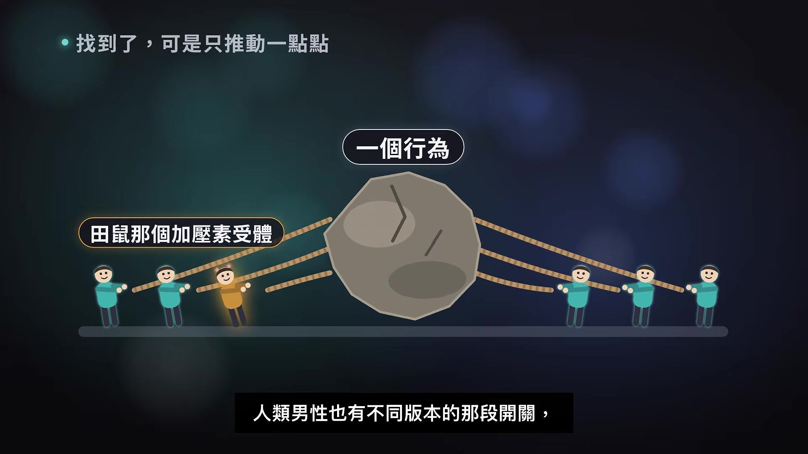

**逐字稿片段：** 有一份研究發現 帶著某個版本的人 伴侶關係比較容易出問題 跟冒險 焦慮有關的基因 也一個一個被找出來 聽起來很驚人 新聞標題也最愛這種發現 可是Sapolsky特別強調 這些基因每一個 都只解釋一點點差異 另外還有一種狀況更容易騙人

**話題推測：** 引用人類男性加壓素受體基因版本與伴侶關係問題的研究

---

## 00:29:31

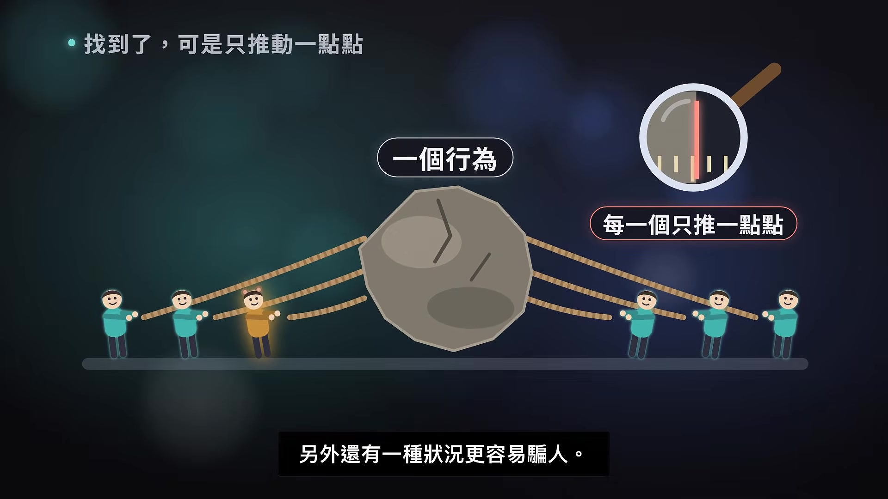

**逐字稿片段：** 心理學家Judith Rich Harris 提出一個可能 外向 這個個性看起來很能遺傳 可是真正遺傳下去的 也許是身高跟長相 長得高 長得好看的孩子 被大家對待得比較好 就變得比較外向 這種情況 叫間接的基因效果 基因推動的是別人怎麼對你 別人怎麼對你 再推動你

**話題推測：** 介紹心理學家Judith Rich Harris提出的「間接基因效果」概念，以外向個性為例

---

## 00:29:49

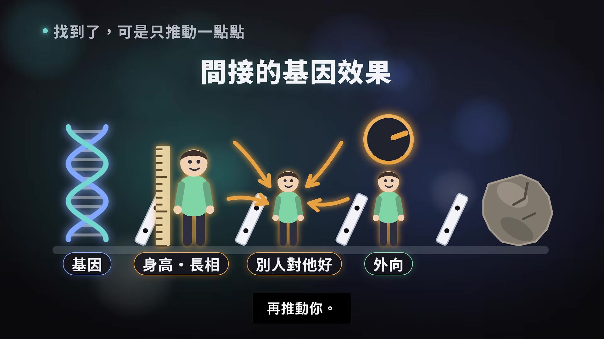

**逐字稿片段：** 行為遺傳學 最後都會給你一個數字 叫heritability 中文叫遺傳率 比如說某個特質的遺傳率很高 大部分人以為 這是在說 基因決定了這個特質的幾成

**話題推測：** 介紹行為遺傳學中的「遺傳率」(Heritability)概念

---

## 00:29:59

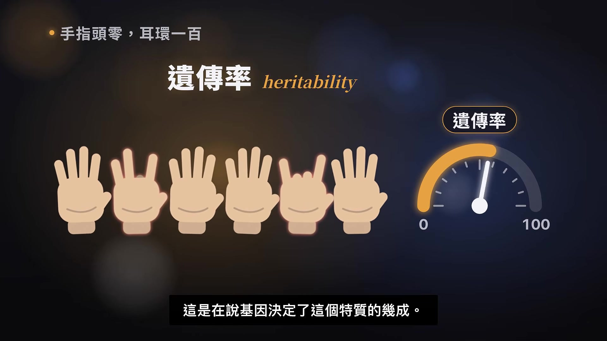

**逐字稿片段：** Sapolsky說 不是這樣 這個數字講的不是平均值 而是差異 他回答的是 大家這個特質得上不一樣 這些不一樣有多少來自基因 這兩件事聽起來很像 其實差很多 每件事 有沒有寫在基因裡 跟大家在這件事上的差別 從哪裡來 是兩個問題 他舉了兩個例子 人有幾根手指 當然是基因決定的 每個人都是五根 可是你問 那些不是五根的人 是怎麼回事 幾乎都是意外 工廠的機器 廚房的刀 差異全部來自環境 所以手指數目的遺傳率是0 再看1950年代的美國 女人出門幾乎都戴耳環 男人幾乎沒有人戴 一個人戴不戴耳環 只要知道性別就猜得到 而性別是基因決定的 所以那個年代 戴耳環的遺傳率是100% 手指頭0 耳環100

**話題推測：** Sapolsky澄清遺傳率指的是群體內特質「差異」的來源，而非平均值

---

## 00:30:40

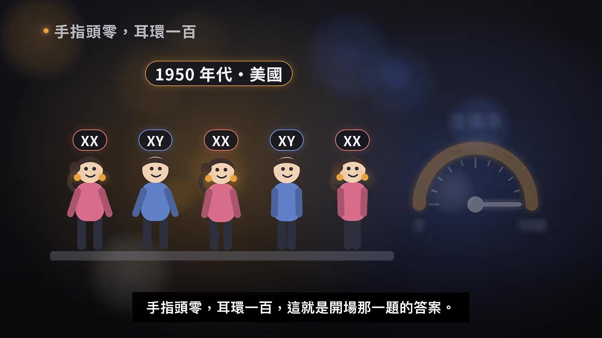

**逐字稿片段：** 這就是開場那一題的答案 遺傳率說的是差異從哪裡來 不是這件事有沒有寫在基因裡 Gene have nothing to do with it But for our purposes This is how it works What have we just discovered Number of fingers That trait has a 0% heredity 為什麼會這麼繞 Szypowski自己也承認 這是整門課最難懂的一個概念

**話題推測：** 揭示課程開場手指與耳環問題的答案

---

## 00:31:16

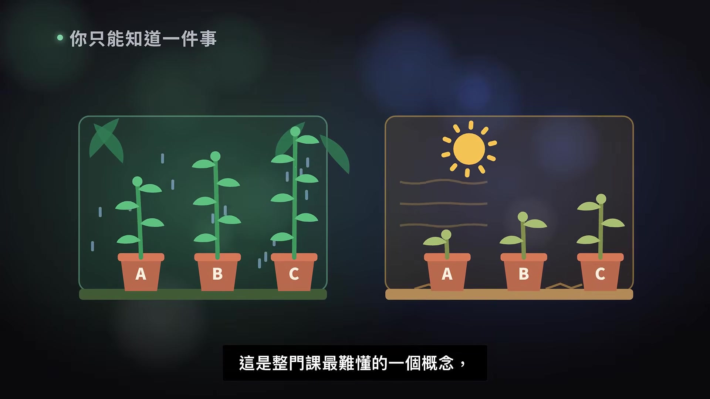

**逐字稿片段：** 他用一株想像的植物講清楚 這種植物同一個基因 有ABC三個版本 一位研究生在亞馬遜 與林亮這種植物 發現三個版本長得高矮差很多 他很興奮 基因決定一切 另一位研究生在隔壁沙漠 晾同一種植物 也發現三個版本差很多 兩個人在研討會上碰面 把數字放在一起 才發現雨林裡的每一株 都比沙漠裡的任何一株高得多

**話題推測：** 以想像植物在雨林和沙漠中的生長差異，解釋遺傳率與環境的關係

---

## 00:31:37

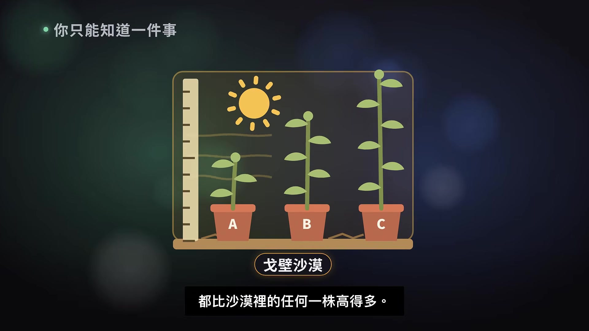

**逐字稿片段：** Saposky給一個最好用的問題 如果你只能知道一件事 你要知道它是哪個版本的基因 還是它長在哪裡 這個例子裡 你一定選長在哪裡 這就是遺傳率很低的樣子 麻煩的是 科學家做實驗 本來就被教要控制環境 只在一個地方 一種條件下量 環境被固定住了 看起來的差異就全落在基因上 所以越乾淨的實驗越容易高估基因 這不是科學家偷懶 是實驗設計本身的盲點 而人類剛好是住過最多種環境的物種 Amazon or the Gobi Desert which piece of information 有時候答案更麻煩 假設在雨林版本C長得最高 到了沙漠版本C反而最矮 那你問版本C對這株植物有什麼影響 唯一誠實的答案是 看情況 看它長在哪裡

**話題推測：** 提出一個問題來判斷是基因版本還是生長地點對植物影響更大

---

## 00:32:39

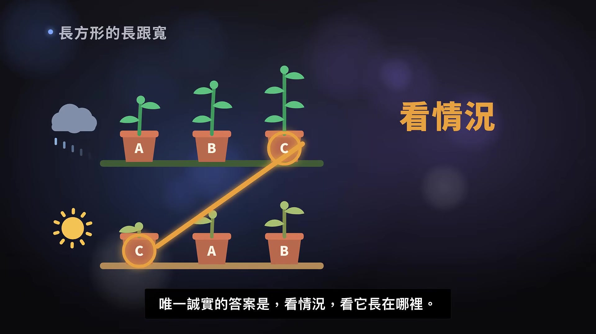

**逐字稿片段：** 這個叫Gene-Environment Interaction 中文叫基因與環境的交互作用 真實世界有現成的例子 還記得苯酮尿症嗎 錯一個字母 腦子就受損 看起來遺傳率是100% 可是現在的做法是 從小吃不含苯酶酸的飲食 腦子就正常長大 環境一改 遺傳率就從100變成0 另一個例子 是Ephraim Caspi的團隊 追蹤紐西蘭一整批人長大

**話題推測：** 介紹「基因與環境的交互作用」(Gene-Environment Interaction)

---

## 00:33:00

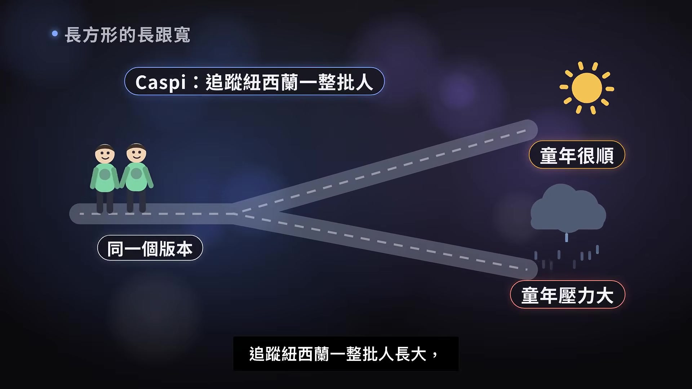

**逐字稿片段：** 發現一個跟血清素有關的基因 血清素是腦子裡傳遞訊息的一種化學物質 某個版本的人 只有在童年經歷很多壓力的時候 才特別容易憂鬱 後來更大的研究 對這個基因吵得很兇 有的重現不出來 可是看情況這個想法 留了下來 Sapolsky在講義上引了一句話 問基因跟環境哪一個比較重要 就像問一個長方形的面積 是長比較重要還是寬比較重要 有這些想法 一碰到真實社會就很有分量

**話題推測：** 介紹Ephraim Caspi團隊關於血清素基因與童年壓力對憂鬱症影響的研究

---

## 00:33:26

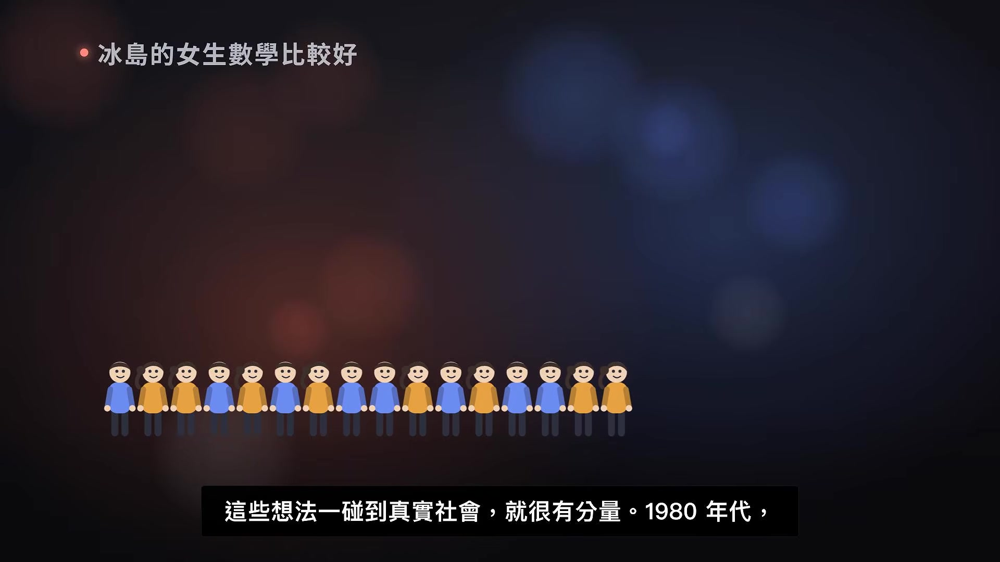

**逐字稿片段：** 1980年代 約翰霍普金斯大學的 Bambo跟Stanley 分析幾萬名參加自由計劃的國中生 發現數學考很高分的那一群裡 男生遠遠多過女生 他們在論文裡說 這個年紀大家上的數學課都一樣 環境相同 所以差別來自生物 當時的雜誌標題寫 男生有數學基因嗎

**話題推測：** 介紹約翰霍普金斯大學關於中學生數學成績性別差異的研究

---

## 00:33:44

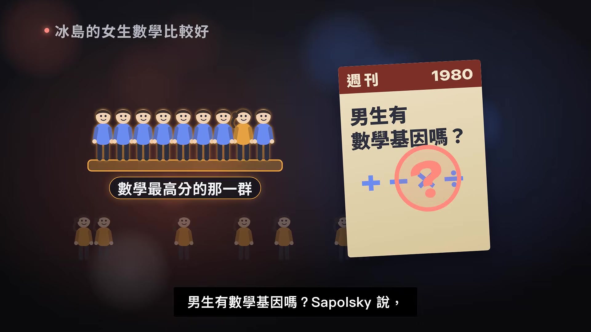

**逐字稿片段：** Sapolsky說 這個前提早就錯了 從小學開始 同樣舉手 老師比較常點男生 同樣答對 男生比較常被稱讚

**話題推測：** Sapolsky反駁數學研究的前提，指出小學教育中性別環境的差異

---

## 00:33:51

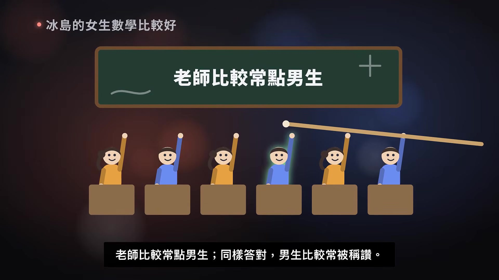

**逐字稿片段：** 後來有一篇研究 比較幾十個國家的學生 看這個國家的男女有多平等 結果越平等的國家 數學的男女差距越小 到了最平等的那一端 差距幾乎消失 冰島甚至是女生略好一點

**話題推測：** 引用跨國研究，顯示國家性別平等程度與數學成績性別差距的關聯

---

## 00:34:03

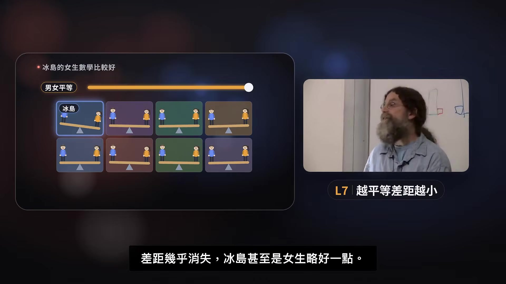

**逐字稿片段：** 以頂尖那一群裡的男女比例 20年來縮小了一大截 人類的基因 不可能在20年裡變這麼多 一個德職20年就大幅改變 說明推動他的主要是環境 這不是說男生女生沒有任何差別 而是說 這個差別大部分跟著社會走 要猜兩個人誰的數學比較好 與其問性別 不如問他在哪裡長大

**話題推測：** 展示20年來數學頂尖群體中男女比例大幅縮小的趨勢圖

---

## 00:34:21

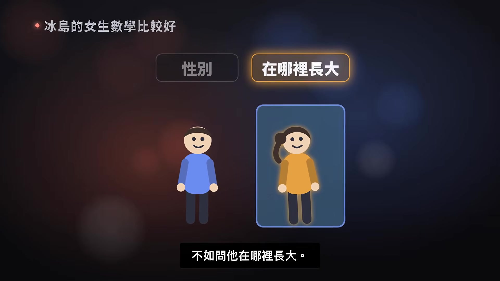

**逐字稿片段：** 利巴唐克一開始 塞浦斯基跟全班開了一個玩笑 他說 早上報紙登了一個大研究 尼泊爾人玩蛇踢棋 比比利時人厲害 大家開始問問題 樣本多大 他說兩國全國人民都參加了 有沒有控制環境 每個人連胚胎都被換到第三個國家寄養 大家一路問下去 最後才有人問出那個最重要的問題 差多少 他要大家記住 結果很可靠跟一個結果很重要 是兩回事

**話題推測：** Sapolsky以尼泊爾與比利時人蛇梯棋能力的研究玩笑，說明科學分析的陷阱

---

## 00:34:44

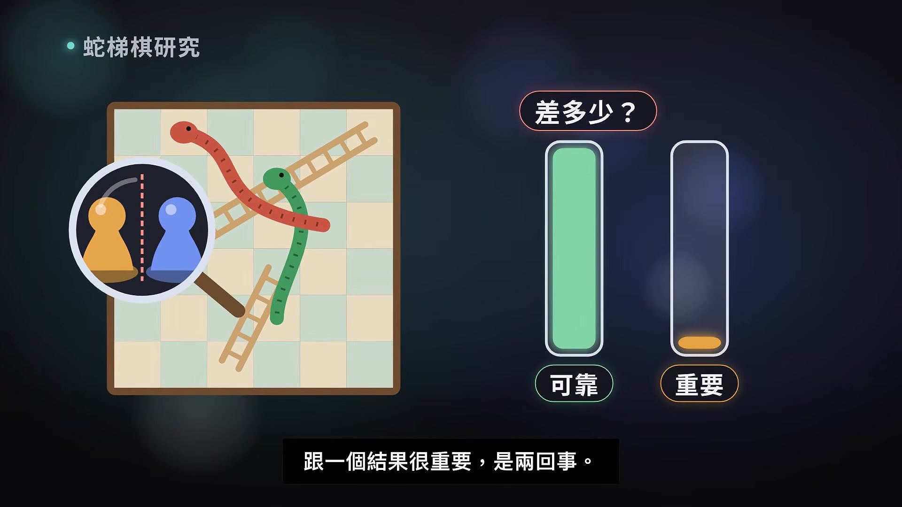

**逐字稿片段：** 接著他舉了一個真的研究 挪威把幾十萬個18歲年輕人的智力測驗成績 按出生順序比較 發現老大的分數比老二高 研究做得很漂亮 樣本大 控制得仔細 連老大早腰老二變成家裡最大的 分數也會跟著向老大 這都查到了 可是差距小到什麼程度 Sapolsky說 你考試的時候打個噴嚏 差幾秒鼻子 大概差不多掉這麼多分 這個工具 接下來每次看到新研究都用得上 先問可不可考 再問差距有多大 2.3 IQ points 後來就要花2.3 IQ because you get distracted for a second 這就是這間公司的一個非常棒的科學 不知道誰給他們錢去做這樣的研究

**話題推測：** 介紹挪威關於出生順序與智力測驗成績的真實研究

---

## 00:35:35

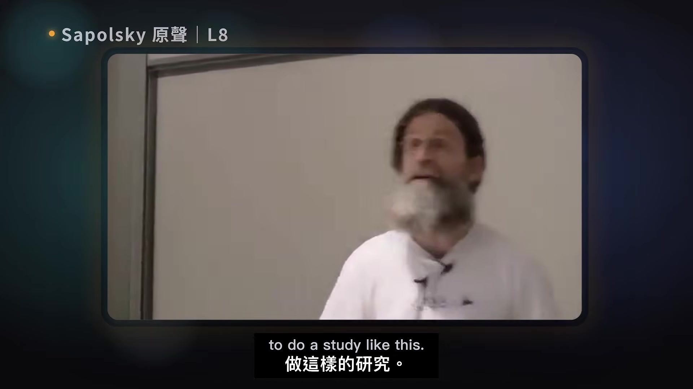

**逐字稿片段：** 接著薩波斯基回到清楚選擇留下的那個疑問 清楚選擇要成立 所以動物得先知道誰是親戚 而且知道有多親 他們怎麼知道

**話題推測：** Sapolsky回歸親屬選擇議題，探討動物如何識別親屬

---

## 00:35:43

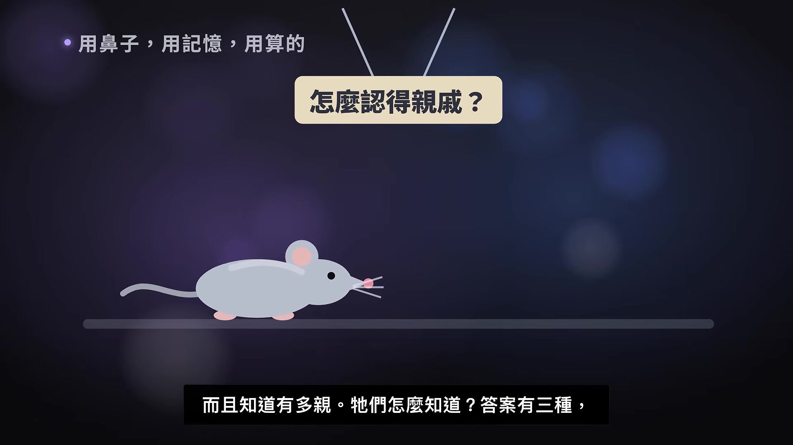

**逐字稿片段：** 答案有三種 剛好對應我們走過的三個籃子

**話題推測：** 提出動物識別親屬的三種方式，對應三種分析「籃子」

---

## 00:35:46

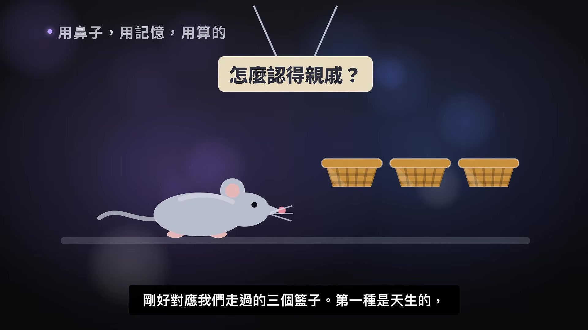

**逐字稿片段：** 第一種是天生的 靠鼻子 每隻動物身上有一組基因 叫MHC 中文叫主要組織相容性複合體 名字很長 你只要記得它的工作 它會做出一個 幾乎每隻動物都不一樣的身份標記 免疫系統靠它分辨自己人跟外來的細菌 這個標記也會混在尿液跟汗水裡 越親的親戚 標記越像 老鼠聞一聞 就知道對方是兄弟表情還是陌生的 連精子都分得出來

**話題推測：** 第一種親屬識別方式：天生的，透過MHC基因氣味識別

---

## 00:36:08

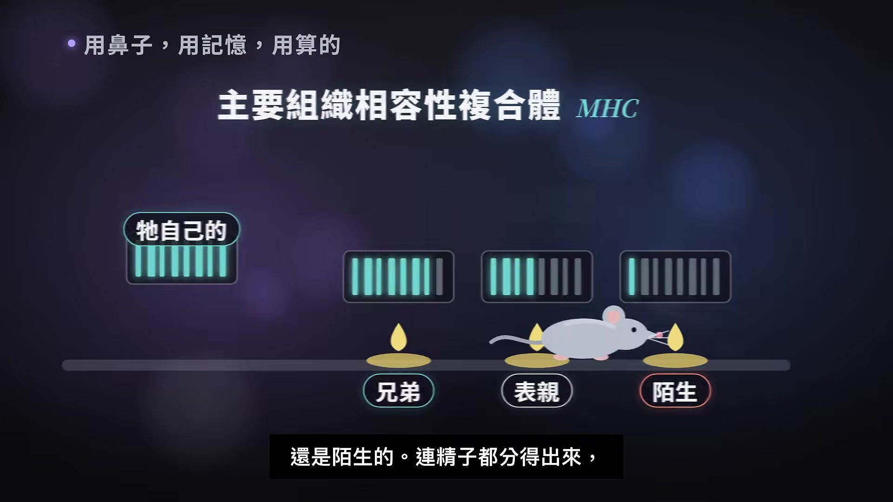

**逐字稿片段：** 有一種到處交配的路數 精子會跟同一隻公鼠的精子抱成一團 遊得比較快

**話題推測：** 介紹精子透過MHC基因識別親緣並合作游泳的現象

---

## 00:36:13

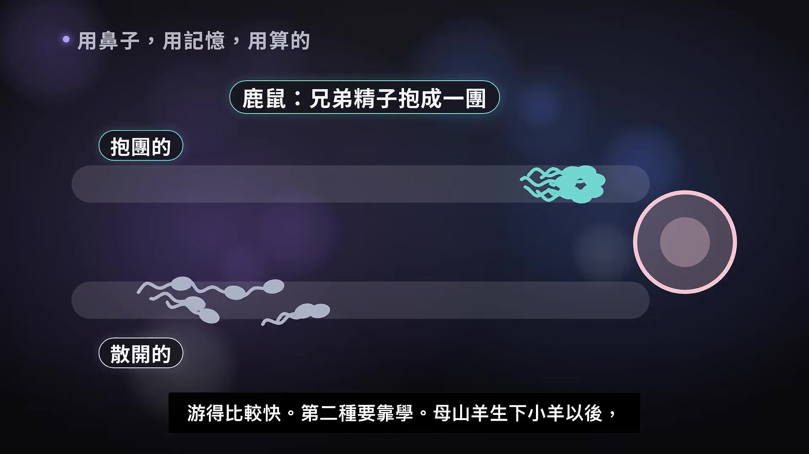

**逐字稿片段：** 第二種要靠學 母山羊生下小羊以後 很快記住牠身上的氣味 之後只會聞起來對的那一隻

**話題推測：** 第二種親屬識別方式：後天學習，如母山羊透過氣味記憶後代

---

## 00:36:19

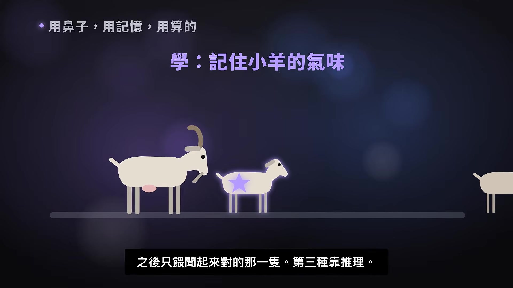

**逐字稿片段：** 第三種靠推理 Szabowski說 一群廢廢裡 公廢廢會記得母廢廢 最可能懷孕的那幾天是跟誰在一起 越可能是自己的孩子 那就越常照顧 你看 同一件事 認親期 基因 學期 思考 三個欄子各給一種做法 而且在很多動物身上是三種一起用

**話題推測：** 第三種親屬識別方式：推理，如公狒狒透過觀察判斷親子關係

---

## 00:36:35

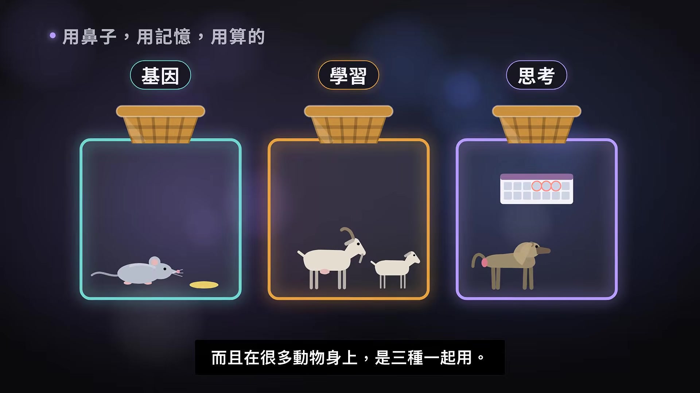

**逐字稿片段：** 那人類呢 我們以為自己全靠推理 這是我媽媽 因為大家都這樣告訴我 可是新生兒出生沒多久 就分得出媽媽身上的味道 也認得媽媽的聲音 那是在兔子裡聽了好幾個月的聲音

**話題推測：** 將親屬識別方式應用於人類，說明新生兒對母親氣味和聲音的本能識別

---

## 00:36:46

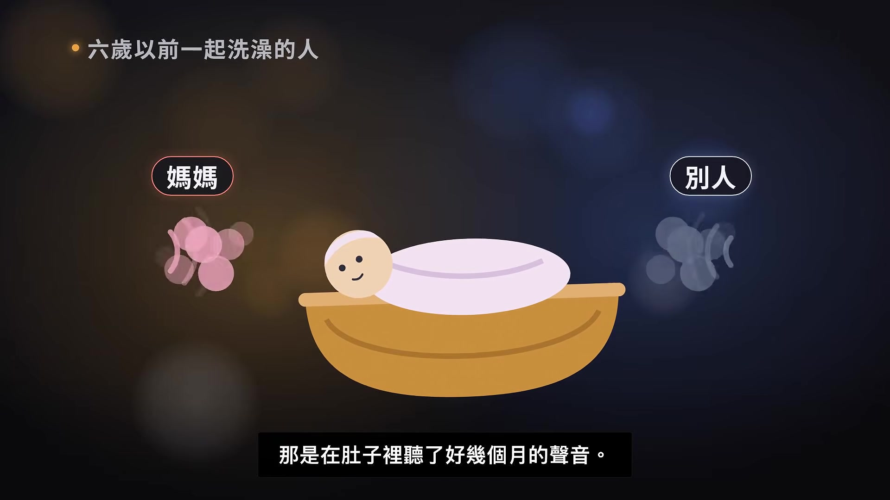

**逐字稿片段：** 最有意思的證據 來自以色列的集體農場 叫Hibatz 早期的集體農場 同一年出生的孩子一起住 一起吃飯一起洗澡 人類學家研究 這些孩子長大以後的婚姻 發現六歲以前 在同一群一起長大的人 彼此之間幾乎沒有人結婚 他們很親 可是感覺就像兄弟姐妹 史丹佛的人類學家阿特沃夫 在臺灣找到同一件事

**話題推測：** 介紹以色列集體農場(Kibbutz)的婚姻研究，顯示共同成長的孩子不婚傾向

---

## 00:37:07

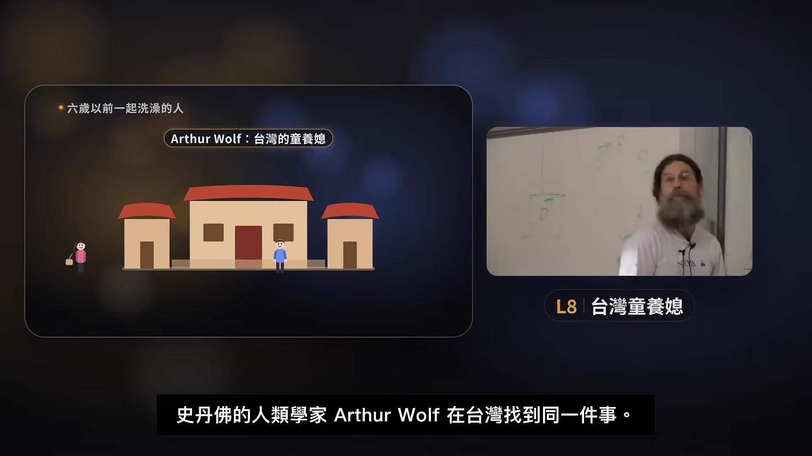

**逐字稿片段：** 傳統的童養席 從小被帶到未來丈夫家一起長大 離婚比較多孩子比較少 這是一句寫在我們身上的 如果怎樣就怎樣 如果六歲以前天天在一起 就當成家人 規則是天生的 可是誰算家人 是環境填進去的 跟燈牆上的開關一模一樣 開關早就裝好了 按下去的是童年 Sapolsky提醒 這也代表我們很容易被操弄 軍隊讓一群陌生人 覺得彼此是兄弟 戰爭宣傳讓對面的人 看起來不像人 誰是我們 誰是他們 可以被改寫 後面講攻擊跟合作的課 這件事會一再回來 我們最後停一下

**話題推測：** 以台灣童養媳的案例，印證共同成長影響婚育的發現

---

## 00:37:55

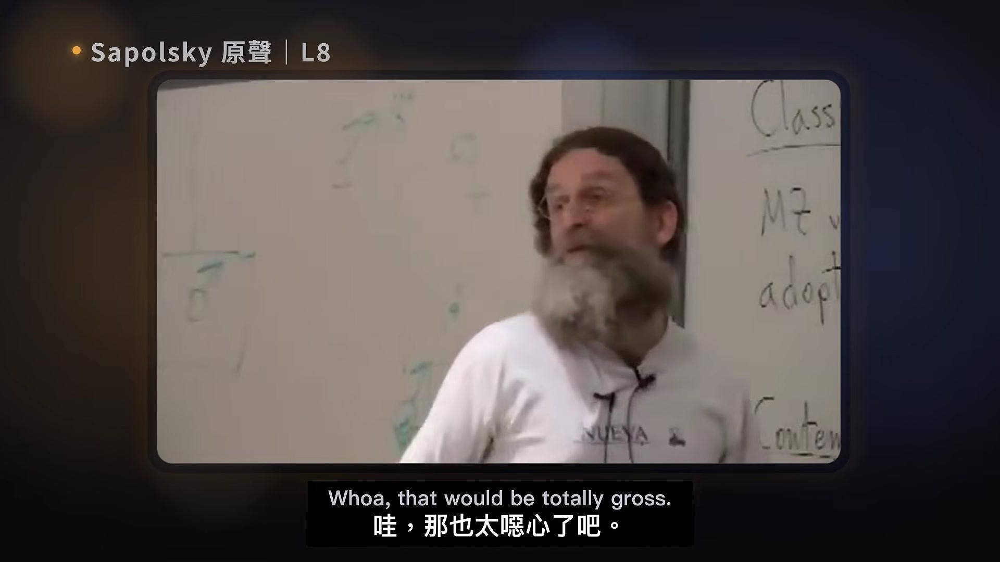

**逐字稿片段：** 把行為遺傳學收起來 這一部分問的是 能不能算出一個行為幾成是天生的 答案是 這個問題本身問錯了 不是因為科學家不夠努力 是因為基因跟環境 本來就不是兩堆 可以分開稱重的東西 雙胞胎跟收養研究 每一個都被環境偷偷滲進來 而且環境不是從出生 才開始在媽媽肚子裡就開始了 遺傳率 講的是差異從哪裡來 所以手指頭是0 耳環是100 就算真的找到基因 每一個也只推動一點點 而且常常要看他碰到什麼環境 這也回答了 開場那個40歲的男人 就算他真的有一個基因出錯 那個基因什麼時候發作 發作成什麼樣子 還是要看他碰到什麼 還記得一開始John Watson那句話嗎 給我一個嬰兒 我可以把它變成任何人 他把一切丟進後天的籃子 說基因決定一切的人 把一切丟進先天的籃子 兩邊住的是同一種籃子 都以為一邊就能解釋全部 沒跟上的話 記住這一句 問基因跟環境哪一個重要 就像問長方形是長重要還是寬重要

**話題推測：** 總結行為遺傳學的內容

---

## 00:38:50

**逐字稿片段：** 我們回到開場那個問題 一個人做了一件事 是天生的還是後天的

**話題推測：** 回顧課程開場問題：行為是天生的還是後天的

---

## 00:38:54

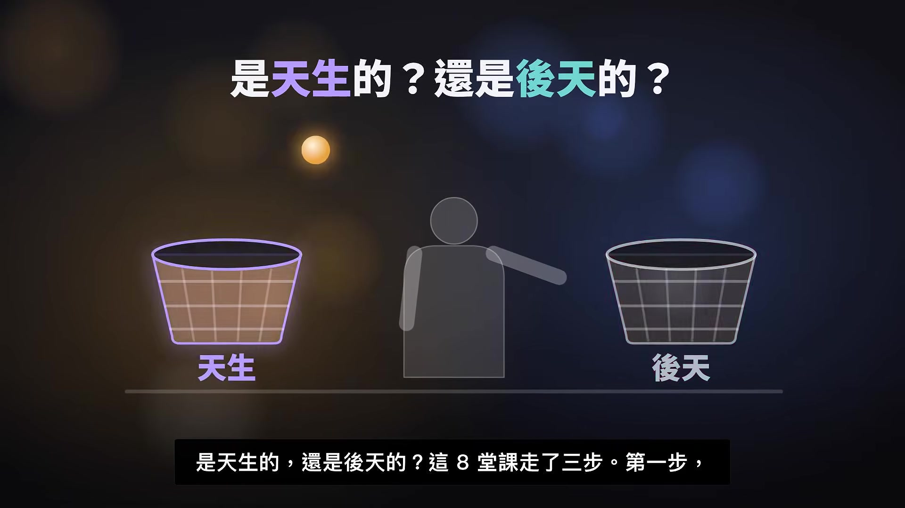

**逐字稿片段：** 這巴巴克走了三步 第一步一個解釋不夠 每一門學問都是一個籃子 演化是最遠也最強的那一站 可是他假設行為能遺傳 第二步把基因拿出來 才發現基因很少下命令 他說的是 如果怎樣就怎樣 按開關的常常在外面 第三步 想算出天生幾成 才發現這個問題問錯了 基因跟環境 像長方形的長跟寬分不開 所以這一集的答案還是那一句 難的不是找到一個解釋 是不要只住在一個解釋裡 還記得那個40歲的男人嗎 品格 中年危機 一個基因 三個答案可能都只說對了一段 而且這三段是連在一起的 接下來的課 Sapolsky會再跳進新的欄子 先到野外看研究動物行為的人怎麼觀察 再一路走進神經跟荷爾蒙 也就是從一秒前那幾站開始看 最後問你一個問題 你身上有沒有一個特質 你一直以為是天生的 後來才發現 是某個環境把它的開關打開的 留言告訴我 喜歡的話訂閱AI Notebook 開啟通知 我們下次見

**話題推測：** 總結八堂課的三個主要步驟

---
