# jimainotebook_5jwAsjGaaUk — 關鍵畫面索引

- 來源逐字稿：[jimainotebook_5jwAsjGaaUk_FIN.srt](jimainotebook_5jwAsjGaaUk_FIN.srt)
- 影片：https://www.youtube.com/watch?v=5jwAsjGaaUk
- 截圖數：56

## 00:00:15

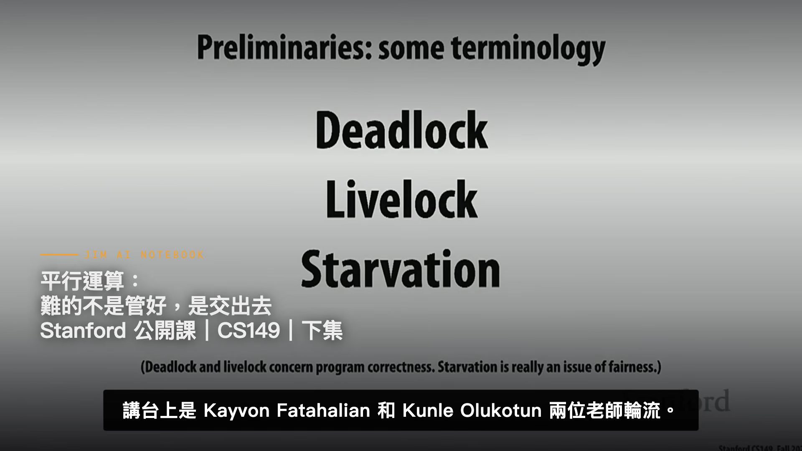

**逐字稿片段：** 這六堂課才回答同一個問題, 大家搶同一份資料的時候, 除了上鎖, 還能怎麼辦?上一集的結論是, 難的不是分工, 是共用, 這一集我先把答案放在前面, 難的不是自己管好每一步, 是把規矩交出去, 交出去的意思是, 你不再一行一行指揮, 你只說你要什麼, 讓程式語言, 讓晶片替你守著, 可是沒交出去, 你只說你要什麼, 讓程式語言, 讓晶片替你守著, 可是沒交出去, 你只說你要 交出去一次你都得放掉一點自由

**話題推測：** 介紹本集討論的核心問題：多人共用資料時除了上鎖還能怎麼辦？

---

## 00:00:36

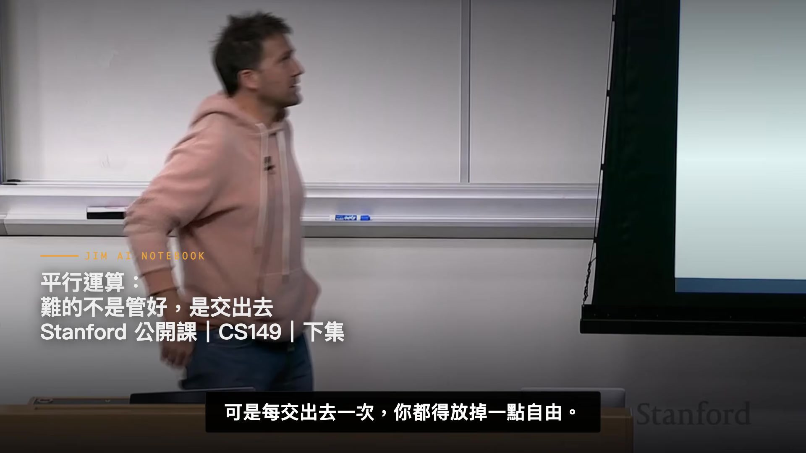

**逐字稿片段：** 我們會看到不用鎖要怎麼辦 看到專門為一種問題設計的程式語言 看到一種叫交易師記憶體的想法 看到為了特定工作打造的硬體 最後再回到記憶體存取 把整門課收起來 第一堂課 Cavern在頭影片上畫了一個十字路口 頭影片上是一個十字路口 四個方向各卡著一臺車 每一臺的車頭都伸進路口中間 Cavern問全班你們同意嗎 這四臺車沒有一臺能往前 黃色那臺要往前 前面那塊路被綠色那臺站著 綠色那臺要往前 它前面被下一臺站著 一圈繞回來 每個人都在等前面那個人 而前面那個人在等自己

**話題推測：** 概覽本集將探討的數個解決方案和主題。

---

## 00:01:08

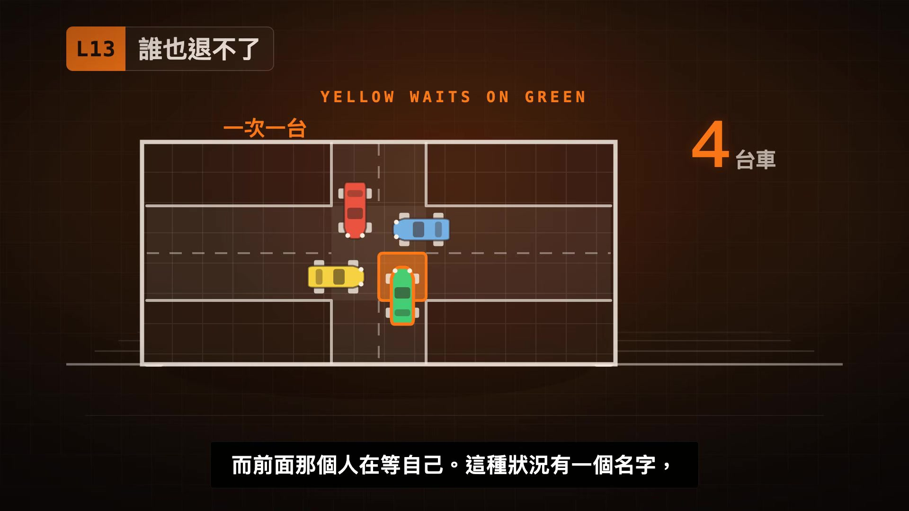

**逐字稿片段：** 這種狀況有一個名字 叫Deadlock 中文叫死結 他要成立需要幾個條件同時發生 一塊地方 一次只能一臺車站著 站著就不肯退 而且大家的等待繞成一個圈 K王說如果路口上只有三臺車 就會有一臺走著動 走掉之後位置空出來 後面的人跟著動 他還放了一張自己拍的照片 一臺公車轉彎轉得太開 對面那臺車也不肯退 兩邊就這樣僵在馬路中間 死結是完全不動 還有兩種毛病更難認出來 因為他們看起來一直在動

**話題推測：** 定義「Deadlock」（死結）概念。

---

## 00:01:35

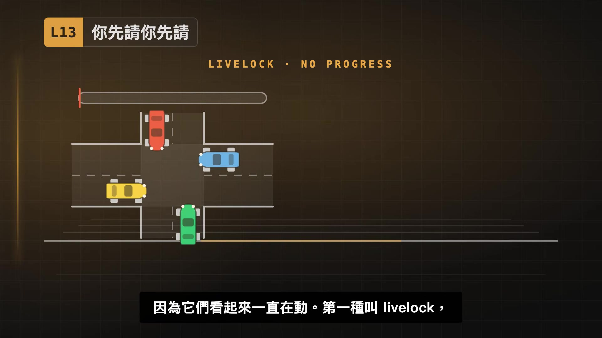

**逐字稿片段：** 第一種叫live lock 中文叫火解 你把剛剛那四臺車想成多能倒車 大家看到卡住了就一起後退 退完又一起往前又卡住 再一起後退 系統基礎上滿滿都是動作 可是沒有一件事真的完成 K-1問大家 生活裡最常見的火解是什麼 就是你走到門口 跟對面的人同時往左又同時往右 兩個人就在那裡讓來讓去

**話題推測：** 引入第二種問題「Live Lock」（活結）。

---

## 00:01:55

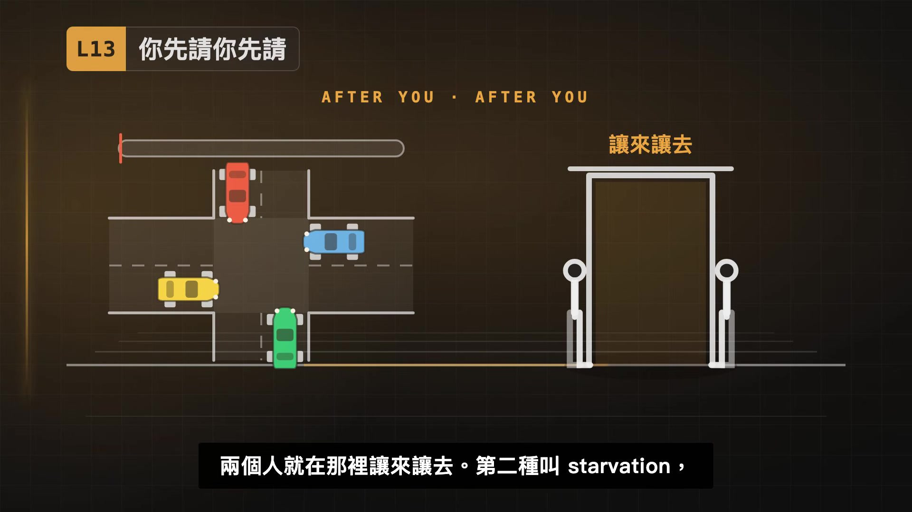

**逐字稿片段：** 第二種叫starvation 中文叫飢餓 他把路口改成黃車 要讓綠車 綠車一輛接一輛過去 整個系統其實一直在完成工作 只是黃車永遠等不到那個空隙 他說這就像假日塞在半月完 你想轉上一號公路 車流一直不斷 你就一直轉不出去

**話題推測：** 引入第三種問題「Starvation」（飢餓）。

---

## 00:02:10

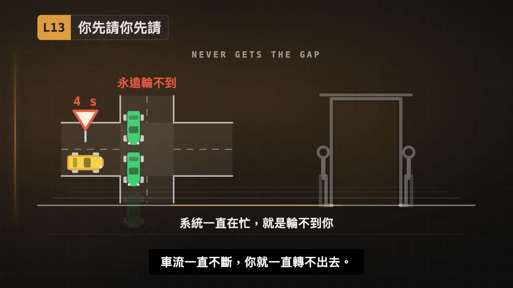

**逐字稿片段：** 那要怎麼避開這些事 你會想到上鎖 可是鎖本身是什麼做的 K-BON說 你們用了一整個學題的鎖 我們還沒講過它裡面長什麼樣子

**話題推測：** 轉向討論如何避免這些問題，並切入「上鎖」的概念。

---

## 00:02:20

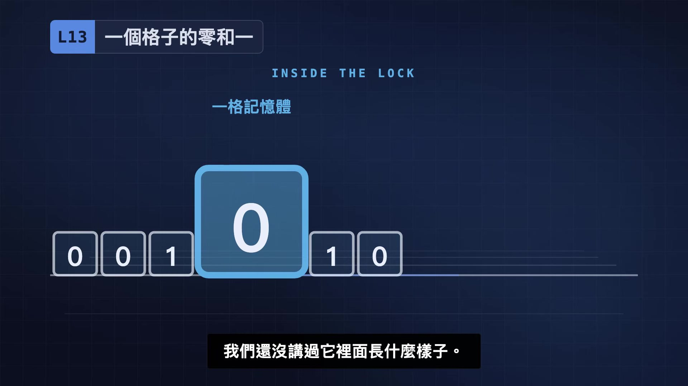

**逐字稿片段：** 硬體給你一道特別的指令 叫test and set 中文叫測試並設定 它做的事是 去看記憶體裡某一格的值 如果那一格是0 就順手把它改成1 而且看跟改是一口氣做完的 中間差不進別人 有了它 鎖就只是記憶體裡的一個格子 1代表有人拿著 0代表沒人 想上鎖你就一直做這道指令 知道你讀回來的是0 那就表示把它改成1的人是你 鎖在你手上 想解鎖更簡單 把那一格寫回0就好 你看 鎖不是什麼特別的東西 它就是一個大家講好怎麼用的變數

**話題推測：** 解釋硬體層面「test and set」（測試並設定）指令的運作方式。

---

## 00:02:53

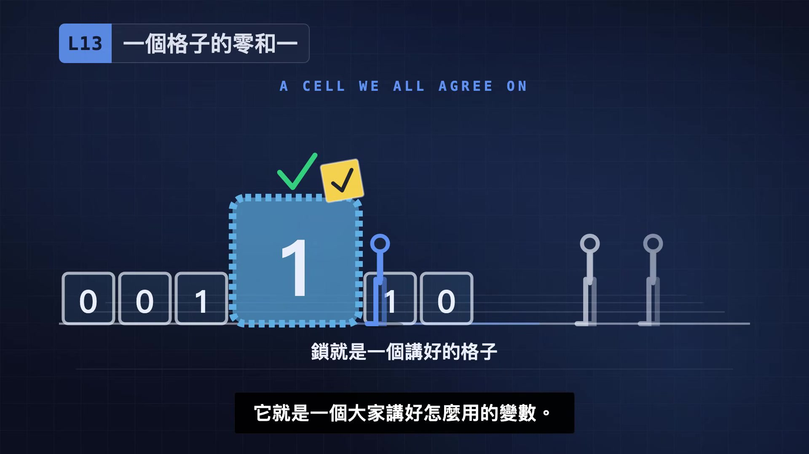

**逐字稿片段：** 我們要把上一集的影印本接回來 鎖是一個變數 變數會被放進快取 也就是每個核心手上都會有一份影印本 三個核心同時想拿鎖 他們就一直做那道測試並設定 而那道指令算一次寫入 沒寫一次其他人手上的影印本就要作廢 所以那一頁在三個核心之間來回飛 而真正拿著鎖的那個人 等到要解鎖的時候 還得排隊把那一頁搶回來 才寫得出那個零 Kevin說得很白 處理器一號 拿著鎖的時間是一整張投影片 可是他手上有那一頁的時間 只有上鎖跟解鎖的兩瞬間

**話題推測：** 將「鎖」與快取一致性問題（影印本）連結，討論其效率問題。

---

## 00:03:25

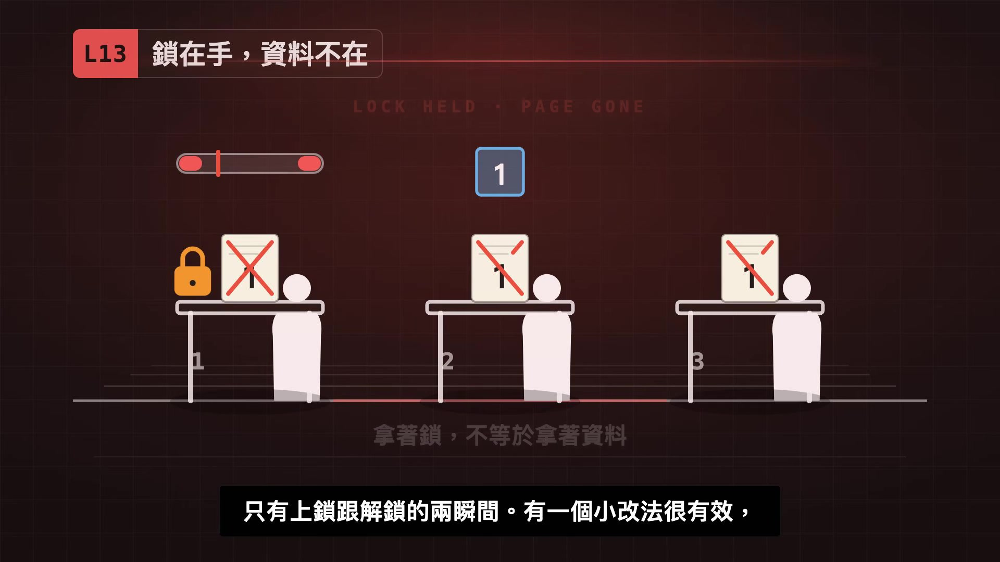

**逐字稿片段：** 有一個小改法很有效 你先只用讀的 一直看那一格是不是零 不會讓別人作廢 大家安安靜靜的各看各的影印本 看到零了 再衝進去做那道指令 不過這把鎖還是不公平 鎖一放開 所有人同時衝進去搶 運氣不好你可能一直被插隊 蔣介石說怎麼做

**話題推測：** 提出一種改善上鎖效率的優化方法：先讀取再設定。

---

## 00:03:40

**逐字稿片段：** K-1換一個問題

**話題推測：** 轉換討論鎖應該放在哪裡的問題，引入資料結構的例子。

---

## 00:03:41

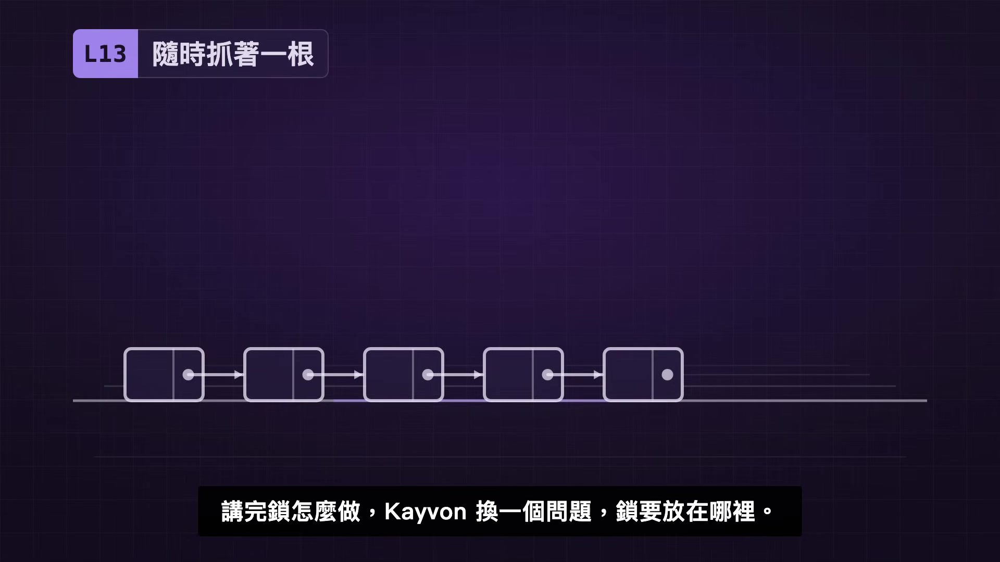

**逐字稿片段：** 鎖要放在哪裡 他放上一個連接串列 也就是一串 前後用箭頭串起來的節點 有人插入有人刪除 沒有鎖的時候 兩個人同時插在相鄰的位置後 做的那個 會把前一個人的插入蓋掉 整段名單就少了一個人 最簡單的修法是整條串列一把大鎖 正確 可是所有人都在排隊 那你當初開這麼多執行區要做什麼 於是臺下說 每一個節點各給一把小鎖 可是順序呢

**話題推測：** 以連接串列為例，說明資料結構中的同步問題。

---

## 00:04:06

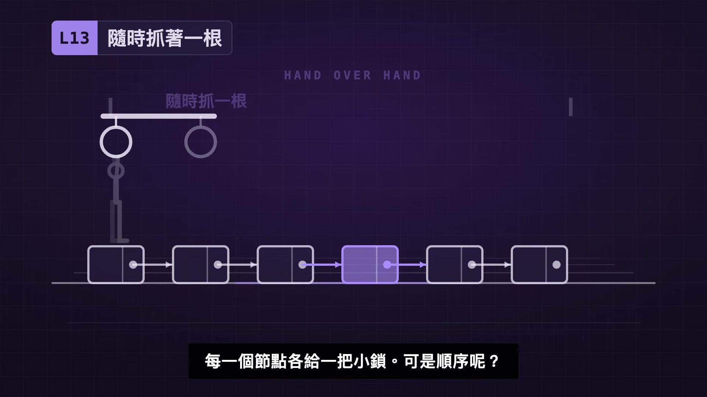

**逐字稿片段：** K-1放了一張美國體能節目的照片 一個人在吊環上前進 你猜他怎麼過去的 他永遠至少抓著一根桿子 放掉一根之前先抓住下一根 走串列也是這樣 你手上隨時鎖著現在這一格和前一格 這個做法叫Hand over Hand 中文可以叫接力式上鎖 接力式上鎖是對的 可是你想想成本 原本走一格只是順著箭頭跳過去 現在每走一格都要上一次鎖 再放一次鎖 K-1說很可能整條一把大鎖還比較快 只能時機量過才知道

**話題推測：** 引入「Hand over Hand」（接力式上鎖）的概念，可能伴隨吊環運動員的圖片。

---

## 00:04:34

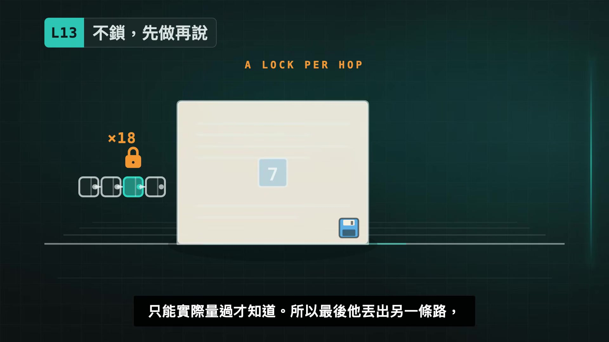

**逐字稿片段：** 所以最後他丟出另一條路 完全不上鎖 硬體有一道指令叫compare and swap 中文叫比較並交換 他做的事是 你告訴他三件事位置在哪 你以為那裡是多少 你想寫進去多少 如果那裡真的還是你以為的那個值 他就替你寫進去 如果被別人動過了 他什麼都不做 只回頭告訴你現在是多少 你有沒有覺得這個很眼熟 你和同事同時再改一份共用文件 你打完一段暗儲存系統跳出來說 這份文件在你編輯的時候有人改過 鎖的想法是我進去的時候 別人都不準動 不上鎖的想法是大家都先做 最後一刻才檢查 撞到了就重做一次 下一堂課 Kvon要講的是一整類程式語言

**話題推測：** 提出完全不上鎖的替代方案，並介紹「compare and swap」（比較並交換）指令。

---

## 00:05:11

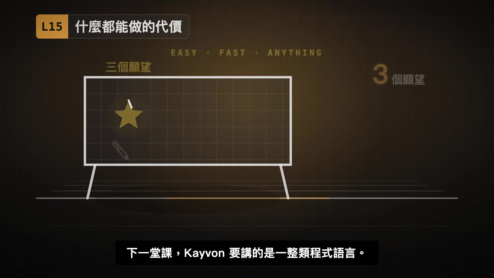

**逐字稿片段：** 他先在黑板上畫了三個願望 第一 好寫 你想到什麼就寫得出來 第二 跑得快 第三 什麼程式都能寫 他說 幾十年來大家都在找 同時做到三件事的語言 找不到 你用Python好寫 什麼都能寫 可是不快 你用C或CUDA 快 什麼都能寫 可是難寫 所以有一群人決定放掉第三個願望 這種語言叫Domain Specific Language 中文叫領域專用語言 它只讓你寫某一類程式 替你安排的特別好 你其實天天都在用 你在資料庫下一句SUL 說我要哪些資料 你從來不會去想 它怎麼在幾十臺機器上平行跑 這就像瑞士刀跟開屏器 瑞士刀什麼都能做 開屏器只為一件事 可是開屏那一下 開屏器快得多 這種語言長什麼樣子

**話題推測：** 列舉理想程式語言的「三個願望」：好寫、跑得快、什麼都能寫。

---

## 00:05:55

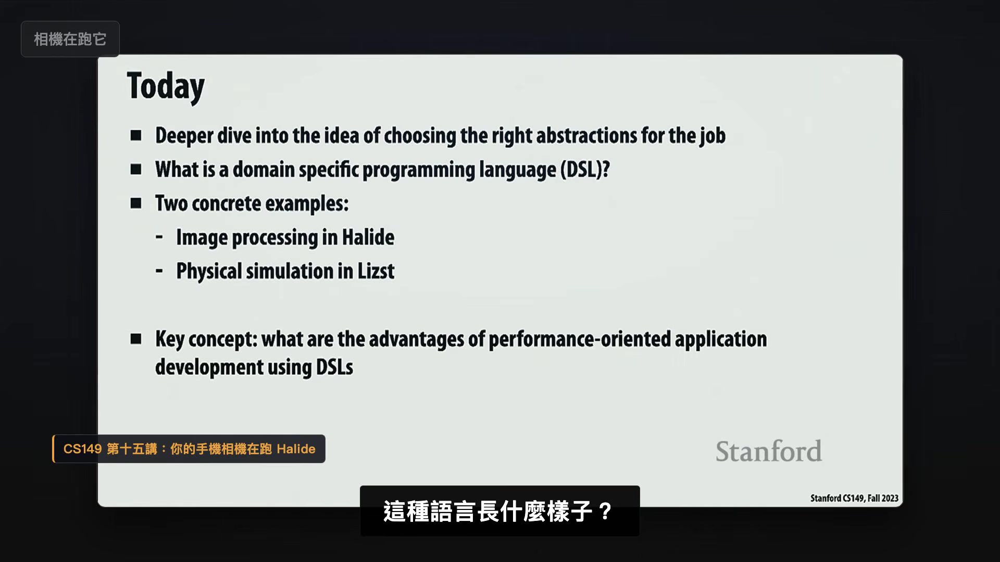

**逐字稿片段：** KMO拿了一個他自己領域的例子 一個叫Highlight的語言 你可能沒聽過它 可是你很可能天天在用它 他說 如果你用Android手機拍照 你就在跑Highlight寫出來的程式 幾年前你上傳到Instagram的照片 只要經過濾鏡也是highlight在跑 他要解的問題是影像處理

**話題推測：** 舉例說明一種特定領域語言「Highlight」及其應用。

---

## 00:06:11

**逐字稿片段：** Kvon先放了一段 用手寫的向量指令寫出來的程式 問全班 30秒內告訴我他在做什麼 沒有人看得出來 然後他放上同一件事的普通寫法 點擊幾行 全班馬上打出來 這是把照片變模糊 變模糊 就是每個點換成他跟 周圍八個點的平均 九個數字加起來再平分 同一件事 一個版本看不懂 一個版本看得懂 差別在於看得懂的那個版本慢 那要怎麼讓他快

**話題推測：** 透過展示不同寫法的程式碼，比較可讀性與效能的權衡。

---

## 00:06:35

**逐字稿片段：** 第一招是少算一點 把照片變模糊這件事 可以分成兩趟做 先橫著平均三個點 再直著平均三個點 答案一模一樣 每個點的乘法從九次掉到六次 如果不是三乘三是七乘七 那就是四十九次掉到十十次 差距很大 可是可以幫我問 這樣有沒有付出什麼 有 你多了一張跟原圖一樣大的暫存 一張手機照片就多吃掉幾十MB的記憶體 而且每個點要多寫一次 多讀一次 又回到上集那句話 你省了算 卻多搬了一趟

**話題推測：** 介紹影像處理中第一個優化技巧：模糊計算的分離。

---

## 00:07:02

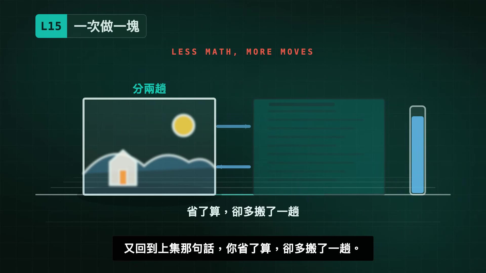

**逐字稿片段：** 那麼 只算一小塊 你一次只做16行的輸出 那就只先算18行的暫存 這一小塊剛好放得盡快取 用源就丟 邊接上會重複算一點點 換算下來每個點 大約6.44乘法 比原本的9次少 暫存也小得多 問題是剛剛那一連串的取捨 你要試多久 K1說 就算你修過這門課 你也不知道哪一種 安排在你這臺機器上最快 你只能一直改一直量 那段從一次一行改成一次一塊的程式 如果自己動手寫 熟練的人也要一個下午 所以黑帶做了一件很少見的事

**話題推測：** 介紹影像處理中第二個優化技巧：只處理一小塊區域（Tiling）。

---

## 00:07:31

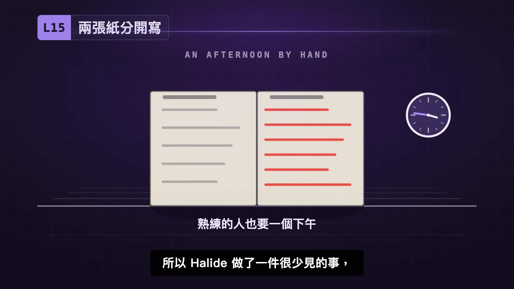

**逐字稿片段：** 他把程式分成兩張紙 第一張紙寫演算法 也就是模糊到底是什麼 你就寫每個點 是周圍9個點的平均 跟數學課本上長得一樣 第二張紙寫安排 英文叫Segil 中文就叫排成 你在上面說 請你一次做256乘32的一塊 這一層 請你用8寬的向量指令 一層請你開歐洲新星 最關鍵的一點是 你怎麼改第二張紙 答案永遠不會變 變的只有粗度 想試另一種切法 你改兩個數字就好 這樣就沒問題了嗎

**話題推測：** 介紹將程式分成演算法和排程（Schedule）兩部分的做法。

---

## 00:08:00

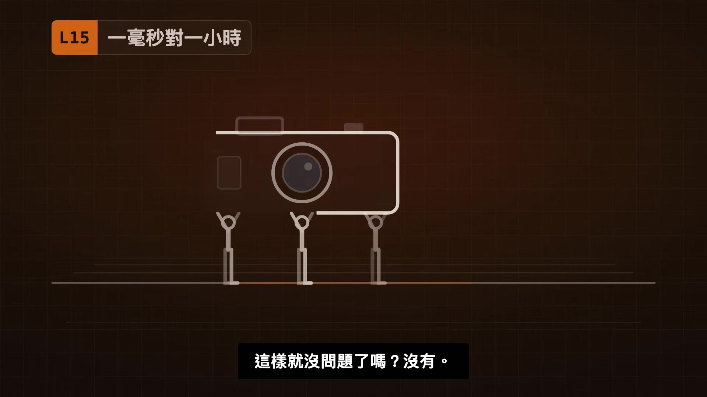

**逐字稿片段：** 沒有 Kabun講了一個很現實的細節 Highlight後來變成 Google相機的編譯器 公司裡大概有80個人會寫第一張紙 會寫第二張紙 也就是會安排的人只有三個 有一次其中一個人請語音架 那整支就幾乎沒有人在寫排程了 你可以想像那個畫面 一家公司的照片品質 掛在三個人身上 可是這件事後來有了一個很漂亮的轉折

**話題推測：** 指出Halide語言在實務上排程專家稀缺的挑戰。

---

## 00:08:19

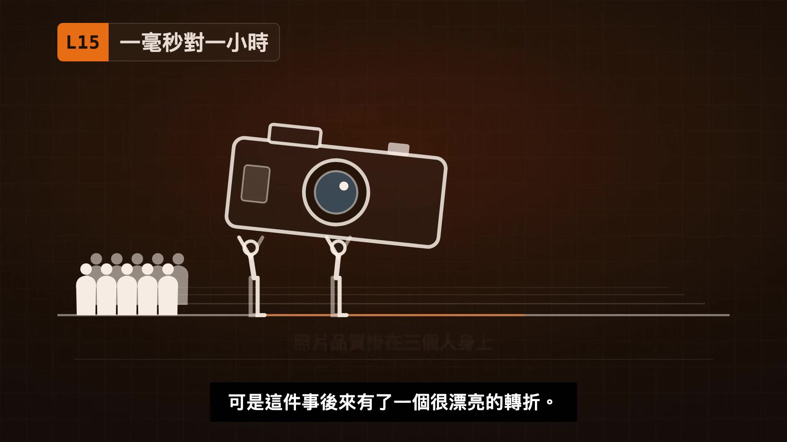

**逐字稿片段：** 排程雖然難 他的選擇是很規矩的 說穿了就是迴圈怎麼排 哪一段塞進哪一段裡面 這種規矩的選擇 電腦最會找 所以有人把下棋用的搜尋方法搬過來 讓程式自己去試 他們請Google 那兩個世界上最會寫排程的人 現場比 人花了一個小時慢慢調 電腦花一毫秒膠捲 三題裡面電腦贏了兩題

**話題推測：** 介紹利用搜尋演算法自動優化排程的方法。

---

## 00:08:38

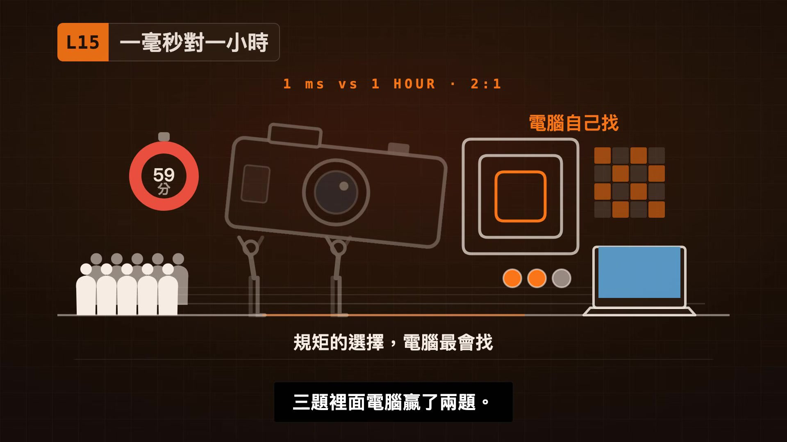

**逐字稿片段：** 同一堂課還有另一個例子 更能看出交出去的好處 史丹佛做過一個研究用的語言 叫LIST 用它的人是要模擬 噴射引擎的機械吸血神

**話題推測：** 引入另一個解決資料競爭的例子：史丹佛的「LIST」語言。

---

## 00:08:47

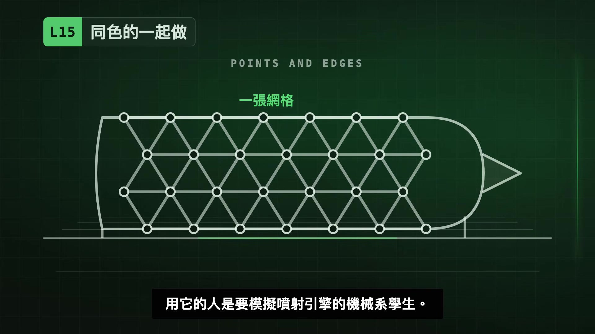

**逐字稿片段：** 這種模擬 把物體切成一張網格 上面有很多個點跟很多條邊 程式要對每一條邊算一次 再把結果加回兩端的點上 麻煩在這裡 一個點會被好幾條邊碰到 所以好幾個人要同時寫同一個點 這就是上一集講的搶同一份資料 一般的做法是上鎖 或者用一道一口氣做完的指令 可是在顯示卡上這樣做很慢

**話題推測：** 解釋 LIST 語言所模擬的噴射引擎網格問題，可能有網格視覺。

---

## 00:09:06

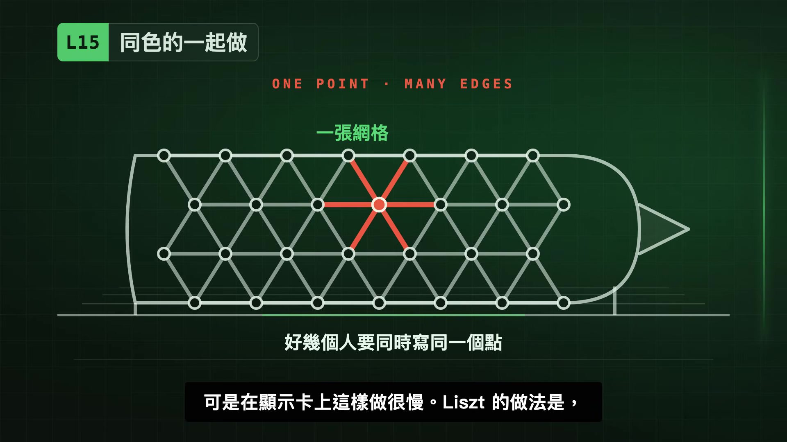

**逐字稿片段：** Iris的做法是 先把哪些邊會碰到同一個點整理出來 然後替每條邊上色 規定碰到同一個點的邊不能同色 跑的時候就一個顏色一批 同一批裡沒有任何兩條邊會碰到同一個點 完全不用鎖 寫程式的機械繫學生什麼都不用 講臺換人 接下來兩堂課是 空流路口吞 他一上來就把前面那個難題講清楚 你手上有一份大家都要動的資料 你可以在整份外面上一把鎖 好寫 不會錯 可是一次只有一個人進得去 你也可以切細一點 一隔一把鎖 很多人可以同時做 可是你剛剛也看到了 順序一錯就是死結 所以寫程式的人們夾在中間 要正確 還是要快

**話題推測：** 說明 Iris 語言如何使用「圖形上色」避免鎖機制。

---

## 00:09:42

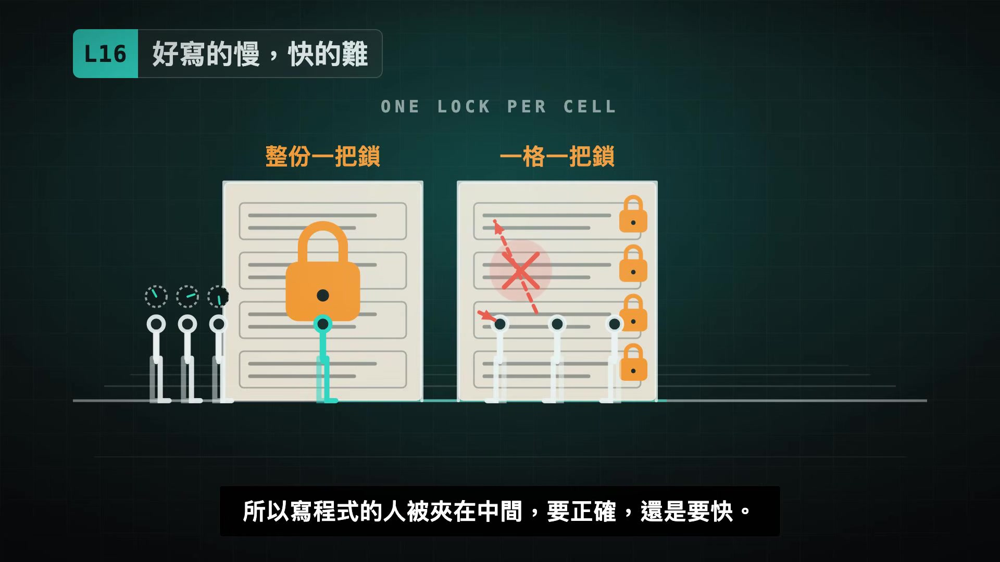

**逐字稿片段：** 康口放了一張實測 同一個資料結構 細鎖的版本在一個核心上跑 反而比出鎖慢一大截 因為光是上鎖解鎖就花掉很多時間 要等到四個核心以上細鎖才開始划算 他問

**話題推測：** 展示實測數據圖表，比較粗粒度鎖和細粒度鎖的效能表現。

---

## 00:09:54

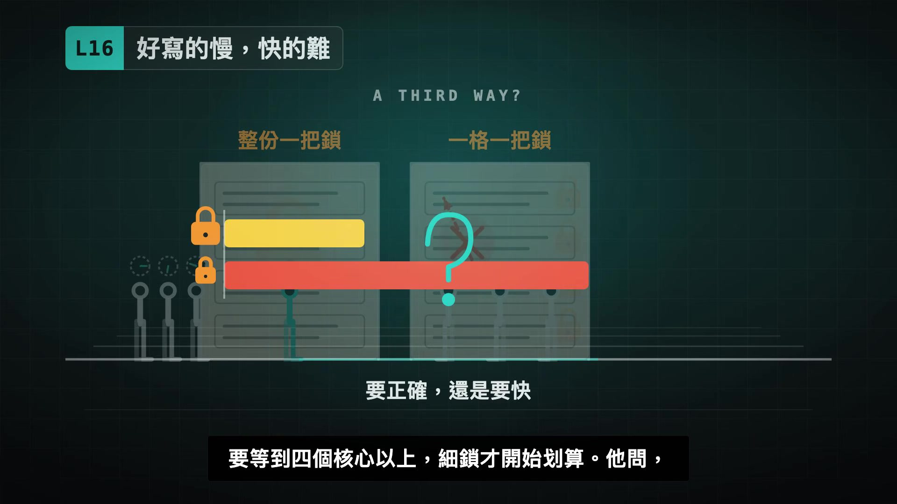

**逐字稿片段：** 有沒有第三條路 其實有 而且你已經用過它了 你跟同事一起改一份公用文件的時候 你並沒有先跟大家說我要鎖 Countall的例子很生活

**話題推測：** 提出尋找「第三條路」解決鎖的困境。

---

## 00:10:03

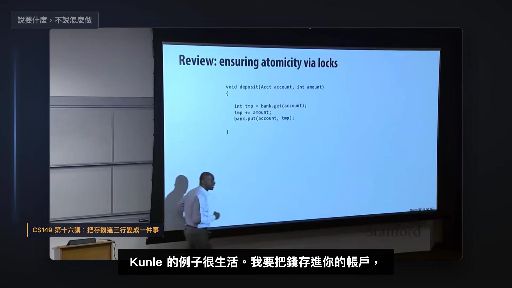

**逐字稿片段：** 我要把錢存進你的賬戶 程式要做三件事 先讀出你現在的餘額 加上我存的錢再寫回去 要是在讀完和寫回去之間 有別人也匯錢給你 你就少了一筆 傳統做法是在這三件事前後 各上一把鎖 另一種寫法是

**話題推測：** 以銀行轉帳為例，說明資料競爭問題。

---

## 00:10:17

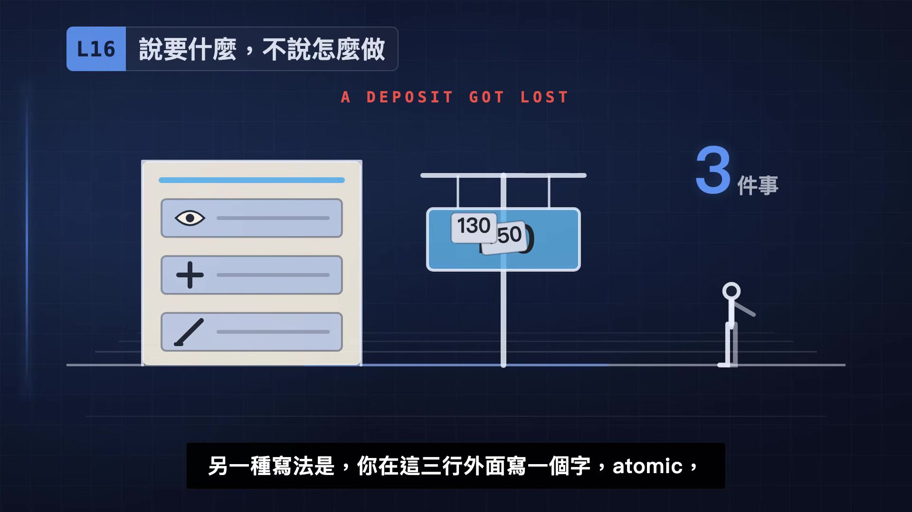

**逐字稿片段：** 你在這三行外面寫一個字 Atomic 中文叫不可分割 你沒有講任何一把鎖 你只是宣告 這三行請當成一件事 這兩種寫法的差別 Countall講得很重 宣告不可分割 是在說你要什麼 至於底下要不要用鎖 用幾把 什麼時候放 那是系統的事 這種說要什麼的寫法 你已經見過 你在ISPC裡寫一個voice 也沒有說要開幾條執行序 這整套想法有一個名字 叫Transactional Memory 中文叫交易式記憶體 那一件事到底是什麼意思

**話題推測：** 介紹「Atomic」（不可分割）關鍵字，實現高層次的原子操作。

---

## 00:10:46

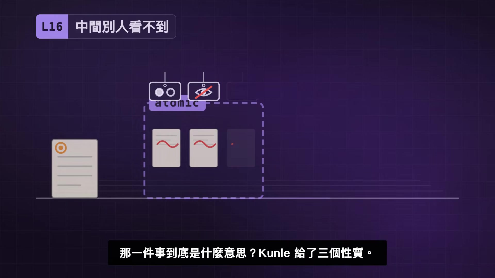

**逐字稿片段：** 康克爾給了三個性質 第一個叫原子性 意思是全有或全無 這一段裡面 所有的讀和寫 要嘛全部算數 要嘛就當作從來沒發生過 第二個叫隔離性 意思是在這一段做完之前 你改的東西別人一個字都看不到 第三個叫可序列化 意思是所有人的這些段落 最後可以排成一條隊 誰先誰後由系統決定 可是一定排得出來 你把這三件事放在一起 其實就是一份共用文件的理想狀況 你的整段修改要碼完整出現 要嘛 明確沒出現 別人不會看到你打到一半的句子 而且所有人的修改排得出先後 學過資料庫的人聽到這裡會覺得熟悉 因為交易這個詞就是從資料庫借來的 只是資料庫還多一個性質 論點也不會丟 記憶體做不到 所以這裡少了那一項 還有一個好處 他其實跑得比你想的快

**話題推測：** 詳述交易式記憶體的三個核心性質：原子性、隔離性、可序列化。

---

## 00:11:29

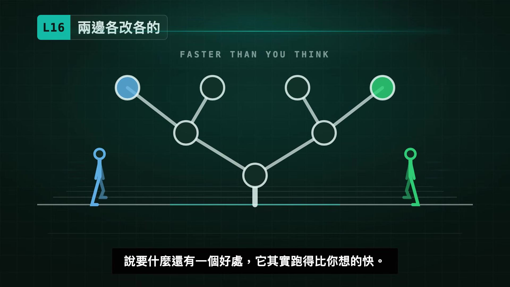

**逐字稿片段：** 康克爾畫了一棵樹 兩個人分別要改樹上的兩個節點 一個在左邊 一個在右邊 如果用接力式上鎖 兩個人都得從樹根往下走 而樹根跟第二層是共用的 所以後面那個人只能等 可是你退一步看 這兩個人真正動到的東西完全不一樣 所以系統只要記兩件事 這一段裡你讀過哪些位置 你寫過哪些位置 兩個人的讀和寫如果沒有交集 讓他們同時做 誰也不用等 有交集才排隊 康克爾說這就是交易式記憶體最迷人的地方 你用的是跟出鎖一樣好寫的寫法 拿到的卻是細鎖那種速度 因為他不是看你鎖了什麼 是看你真的碰到了什麼 你再想一次那份公用文件 兩個人改不同段落 本來就不需要互相等 還有一個好處 跟寫程式的方式有關 軟體是一塊一塊拼起來的 你寫好一個提款 寫好一個存款 你希望轉帳 就是把這兩個湊在一起 康口說 鎖在這裡會壞掉 轉帳要先鎖住第一個帳戶 再鎖住第二個帳戶 現在有兩筆轉帳同時發生 方向剛好相反 第一個人鎖住了甲 第二個人鎖住了乙 然後兩個人都在等對方 又是死結 你當然有辦法救 全公司講好 所有的索醫律照 編號有小到大拿 可是你發現問題了嗎 為了把兩個小東西湊在一起 你得先知道整個系統的規矩 那這兩塊就不是各自獨立的積木了 換成交易式記憶體 你在轉賬外面再寫一個不可分割 裡面那兩個自然被包進來 順帶一提 出事的時候你只要說一聲放棄 系統就把這一段做過的修改 整個收回去 不像用鎖 你得記得把每一把都放掉 不過空調也提醒 這個字不是萬靈丹 你包錯地方一樣會出事

**話題推測：** 透過修改樹狀結構的例子，展示交易式記憶體的效能優勢。

---

## 00:12:54

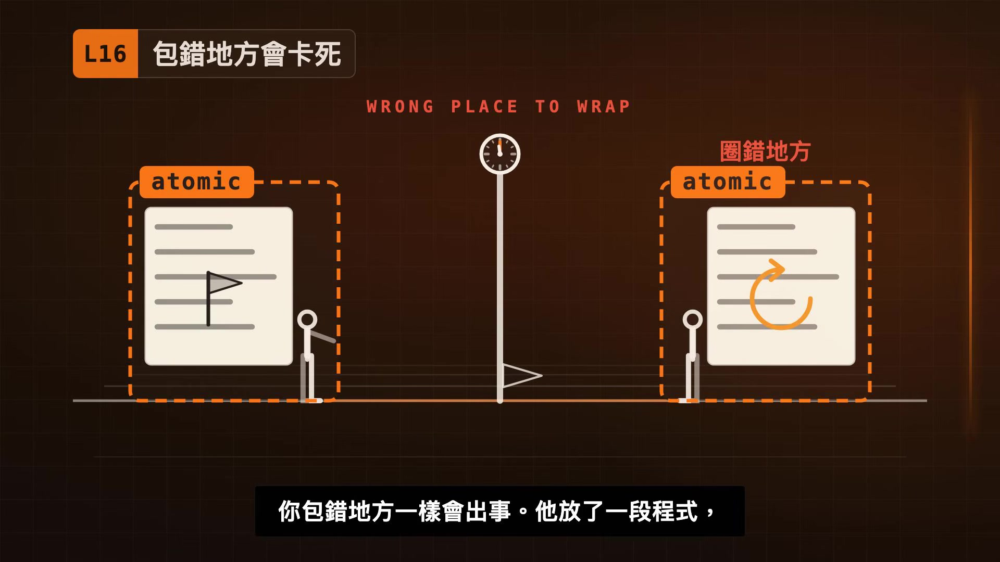

**逐字稿片段：** 他放了一段程式 一邊把一個旗標設成成立 另一邊寫一個迴圈 一直等那個旗標變成立 才往下走 用鎖的寫法 這段程式跑得動 可是你把兩邊都包成不可分割 全班一起發現 它會永遠卡在那裡 為什麼 因為隔離性 隔離的意思就是 這一段做完之前 你改的東西別人看不見 等在迴圈裡的那一邊 就永遠等不到旗標變成立 誰也走不出去 這種錯誤有個名字 叫原子性違規 意思是你把不可分割這四個字 圈在了錯的一段程式外面 你交出去的是怎麼做 不是要做什麼 要做什麼還是你的責任

**話題推測：** 警告使用 Atomic 關鍵字的潛在錯誤，並展示一段造成死結的程式碼。

---

## 00:13:32

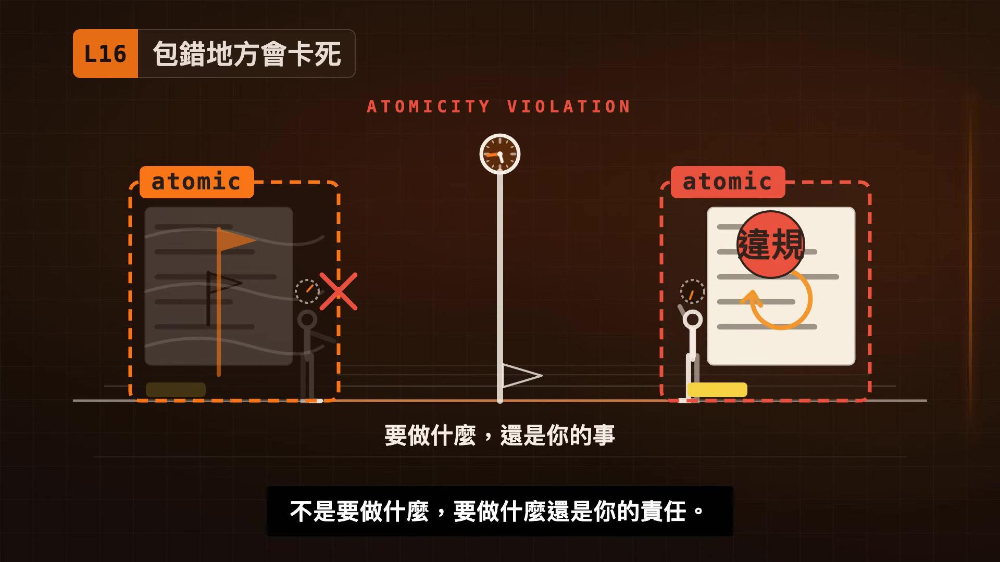

**逐字稿片段：** 第二堂交易是記憶體 conto 要講怎麼把它做出來

**話題推測：** 進入第二堂交易式記憶體課程，探討其底層實現。

---

## 00:13:36

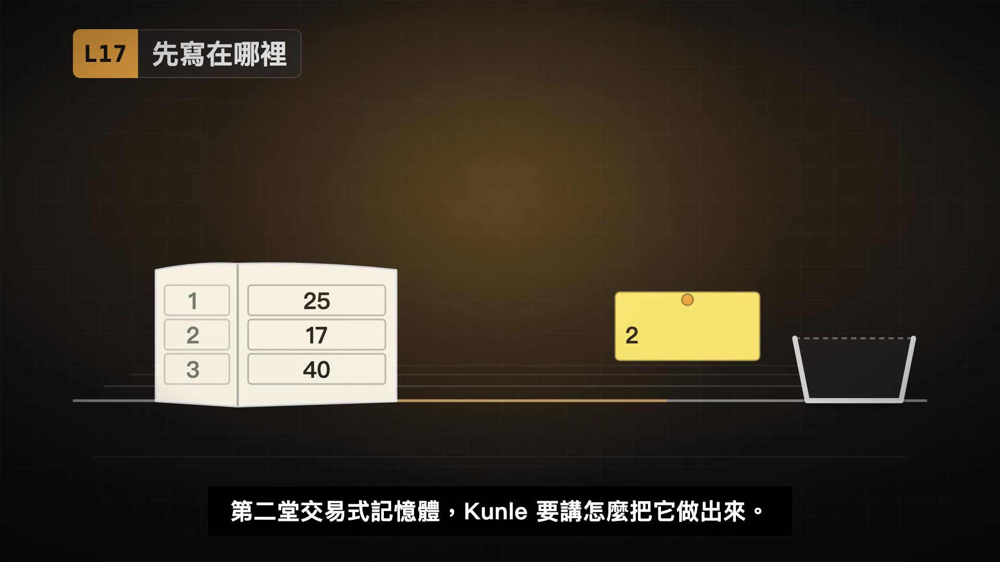

**逐字稿片段：** 第一個要決定的事是 你這段做的修改先放在哪裡 第一種叫eager versioning 這種叫積極版本管理 你直接把新的值寫進記憶體 可是在旁邊另外留一份記錄 寫的這一格原本是多少 這份記錄叫undo log 中文叫復原記錄 做完了 把復原記錄丟掉就好 中途放棄 就照著記錄一格一格改回去 第二種叫lazy versioning 中文叫延後版本管理 你不去動記憶體 新的只先寫在自己的一張便條上 這張便條叫寫入緩衝區 做完了 才把便條上的東西一次抄進記憶體 中途放棄 把便條揉掉就好 兩種各有各的痛 積極的做完很快 放棄很慢 延後的放棄很快 做完要抄一輪 而且你讀資料的時候 得多看一個地方

**話題推測：** 探討第一種修改處理方式：積極版本管理（eager versioning）與復原記錄（undo log）。

---

## 00:14:17

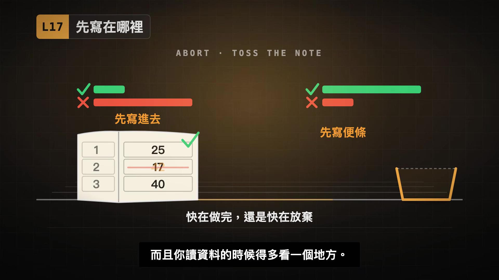

**逐字稿片段：** 第二個要決定的事是 什麼時候檢查有沒有撞到別人 第一種叫悲觀偵測 他假設一定會撞到 所以每一次讀 每一次寫 都當場檢查一遍 好處是發現得早 發現得早就多一個選擇 你可以先停下來 等對方做完 手上已經做過的東西都還留著 不用重來 壞處是兩邊可能互相讓 你停下來等我 我停下來等你 結果誰都沒有往前 又是前面講過的活節

**話題推測：** 探討第一種衝突檢測方式：悲觀偵測（pessimistic detection）。

---

## 00:14:38

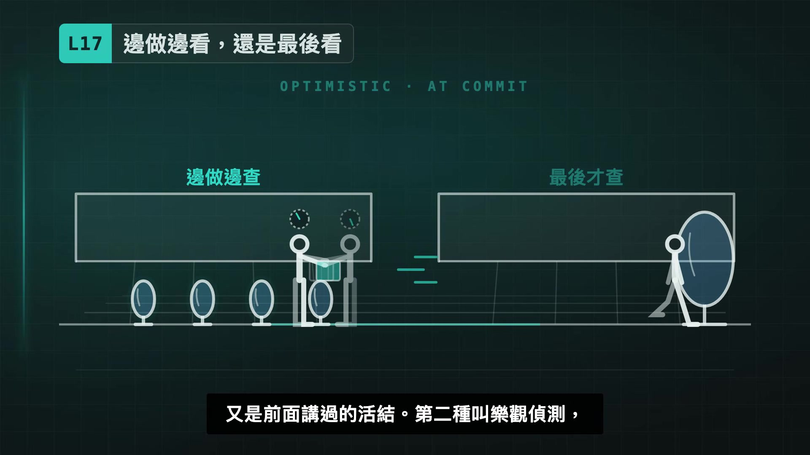

**逐字稿片段：** 第二種叫樂觀偵測 他假設不會撞到 一路做到最後 要交出去的時候 才檢查一遍 規矩很簡單 正在交出去的那一個一定贏 其他有讀到同一個位置的 通通放棄重來 它的好處是一定有人往前走 不會整個卡住 壞處是你可能已經白做了一大段 才發現自己早就沒救了 知道要做哪些決定之後

**話題推測：** 探討第二種衝突檢測方式：樂觀偵測（optimistic detection）。

---

## 00:14:55

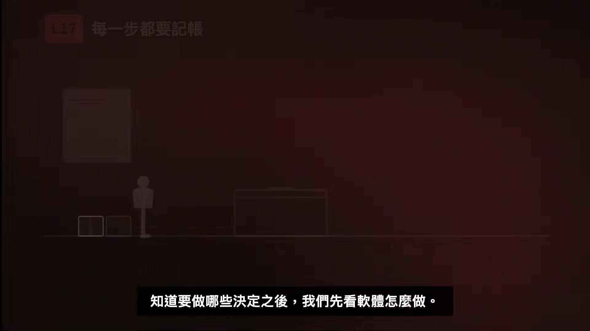

**逐字稿片段：** 我們先看軟體怎麼做 純軟體的版本 編譯機會把你的程式整個改寫一遍 你每讀一個值 它就替你插一段程式 先去查這個位置有沒有被別人鎖住 版本對不對 然後把它寄進讀過的清單 你沒寫一個值 它又插一段 去拿鎖記賬留下復原記錄 這些多出來的動作有個名字叫軟體屏障 你可以想成每搬一箱東西都要先填一張單子 代價有多大

**話題推測：** 轉向討論交易式記憶體在軟體層面（STM）的實現方式。

---

## 00:15:18

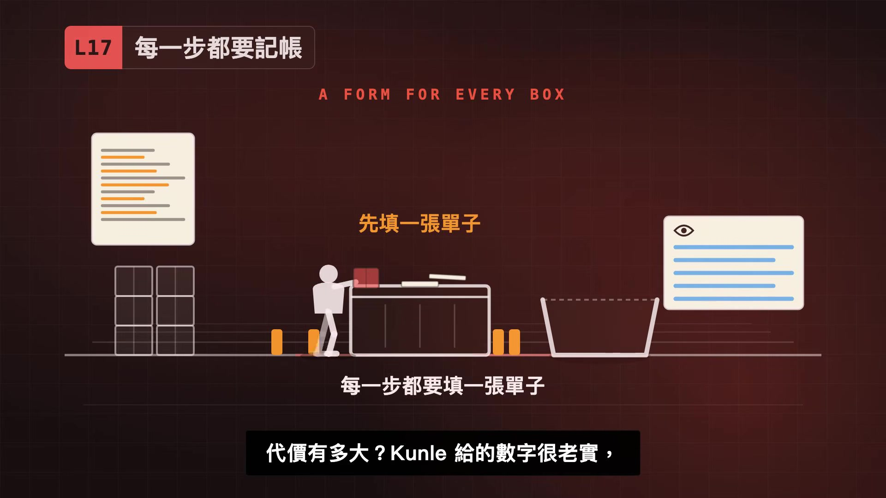

**逐字稿片段：** Canto給的數字很老實 沒有最佳化的版本 在一個核心上就要多花七成到八成的時間

**話題推測：** 展示純軟體交易式記憶體未優化前的效能開銷數字。

---

## 00:15:24

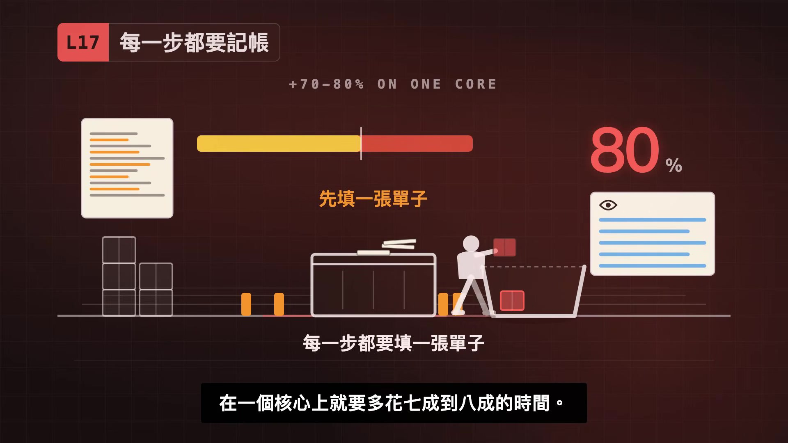

**逐字稿片段：** 後來Intel的團隊發現 這些單子很多是重複的 交給編譯器整理掉 多花的時間降到三成到四成 這還是在一個核心上 你要的是多核心跑起來會變快 可是門檻就是這麼高 那硬體能不能幫忙 Canto說了一句我很喜歡的話 其實你已經有一套現成的東西了 你回想上一集 好幾個核心手上有同一頁的影印本 誰要改就得先喊一聲 別人就把自己那份作廢 這套規矩叫快取一致性 他在做的事 跟交易師記憶體要的是 幾乎一樣 都是盯著誰碰了同一份資料

**話題推測：** 展示經過 Intel 優化後，軟體交易式記憶體的效能開銷數字。

---

## 00:15:54

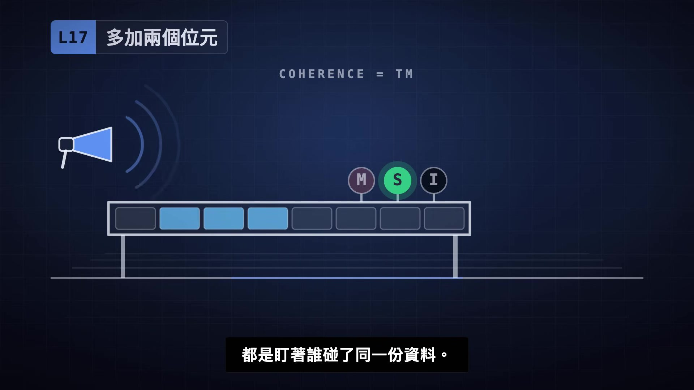

**逐字稿片段：** 所以硬體版的做法很省 每一行快取本來就有幾個狀態位元 現在再多加兩個 一個叫R 記著這一行 我在這一段裡讀過 一個叫W 記著這一行 我在這一段裡寫過 寫過的新值就先留在自己的快取裡 不送出去 這樣別人自然看不到 要放棄的時候把這些位元清掉 那些值也跟著沒了 有了那兩個位元 偵測衝突就變得很直接 你的快取一直在聽線上有沒有人喊話 如果有人喊我要改某一行 你手上那行的讀取位元是亮的 那就代表你這段讀過它 你們撞上了 如果有人喊我要讀某一行 你那行的寫入源是亮的 也一樣 那交出去又是怎麼一回事 就是把你這段寫過的每一行 用原本那套喊話的方式喊出去 我要改這些 別人聽到了發現自己讀過 就得放棄重來 你有沒有發現 這整套就是上一集那套規矩 只是從一行一行變成一整段一起喊 所以Kongro說 你只要懂了 快取一字信 再往前看 交易式記憶體 就只是一小步

**話題推測：** 解釋硬體如何透過快取行狀態位元（R/W bits）實現讀寫追蹤。

---

## 00:16:48

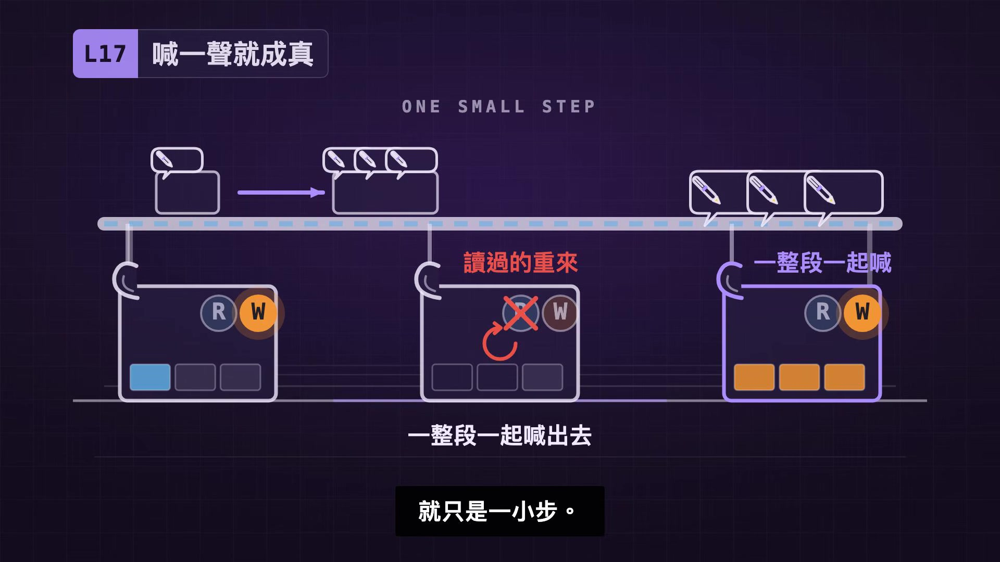

**逐字稿片段：** 聽起來這麼好 你現在電腦有嗎 Conto的答案很誠實 幾乎沒有 Intel真的在處理器裡 做過硬體交易式記憶體 最後沒有走下去

**話題推測：** 討論硬體交易式記憶體的現況與 Intel 嘗試失敗的原因。

---

## 00:16:56

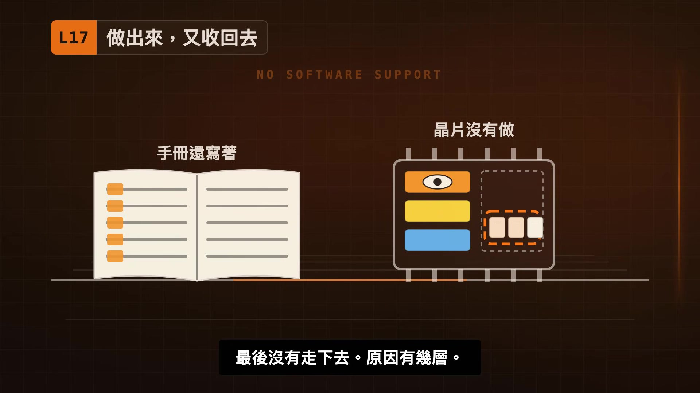

**逐字稿片段：** 原因有幾成 一個是配套的軟體沒跟上 另一個是它太容易放棄 你這一段的資料 只要被擠出快取 整段就得重來 真正讓它被收起來的 是有人用它挖出了安全漏洞 所以今天你去看Intel的指令手冊 那些指令的定義還寫在裡面 可是新的處理器上沒有做 今天用到交易式記憶體的 多半是軟體版 而且只用在局部 例如資料庫系統裡面 最難用鎖寫對的那幾塊 有學生問以後硬體會做得起來嗎 康頭笑著說 這是個好問題 答案還沒出來 這也提醒我們一件事 一個想法在課堂上很漂亮 不代表它在市場上活得下來

**話題推測：** 列舉硬體交易式記憶體未普及的原因，包括軟體生態、容易放棄和安全漏洞。

---

## 00:17:29

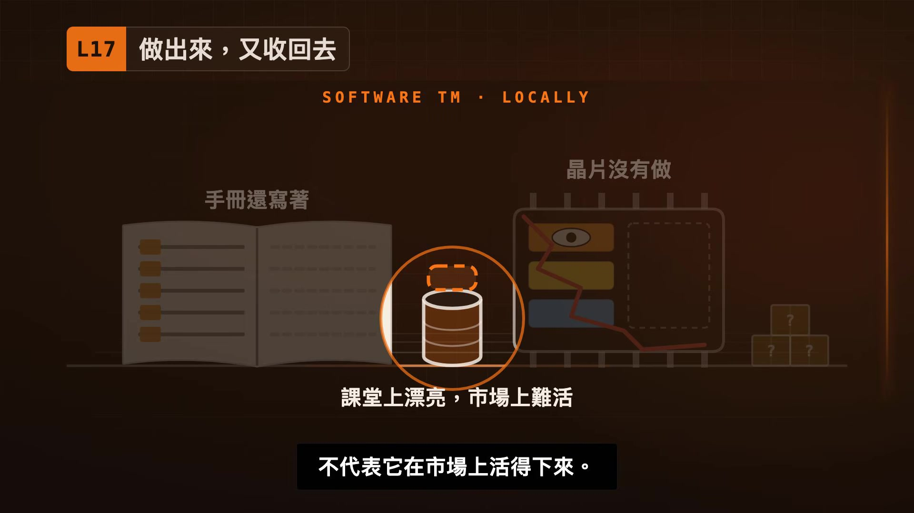

**逐字稿片段：** 最後兩堂課 第一堂還是空流 他要講的是特化 也就是為了一種工作特別打造的硬體 為什麼需要它 先講一段歷史 以前晶片每換一代 電競體變多 而且每一顆用的電變少 所以你什麼都不用做 速度就自己上去 這個好日子大約在十幾年前結束了

**話題推測：** 開始倒數第二堂課，探討「特化」硬體（為特定工作打造的硬體）。

---

## 00:17:46

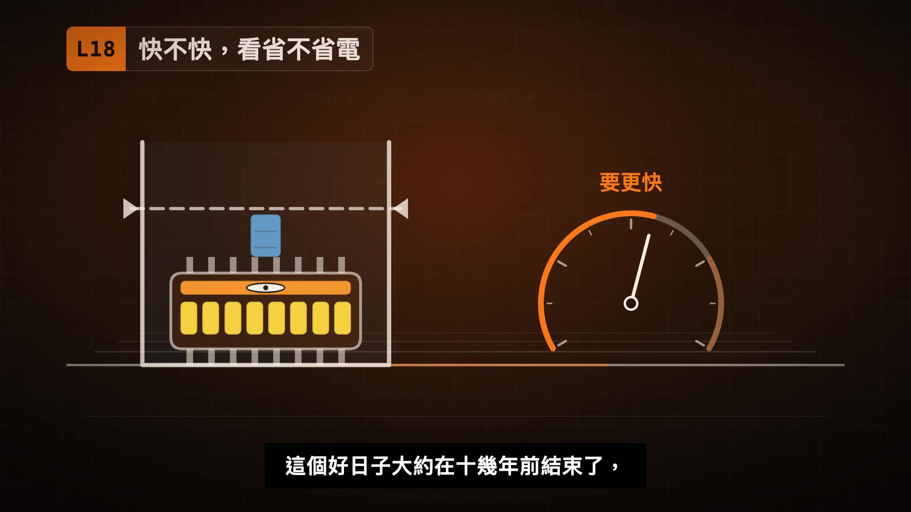

**逐字稿片段：** 現在電競體還是變多 可是每一顆用的電不再跟著降 你的筆電有個能散掉的熱量上限 資料中心有電費上限 你的手機沒有風扇 連散熱都只能靠機殼慢慢散 所以今天的情況變成這樣 你能用的電是固定的 要更快 只剩一條路 讓每一次運算用掉的電更少 這句話換個方式說 效能問題已經變成能源問題 而省電的辦法只有一個 少做那些跟計算無關的事 那跟計算無關的事有多少

**話題推測：** 解釋摩爾定律放緩後，晶片設計面臨的功率限制與挑戰。

---

## 00:18:12

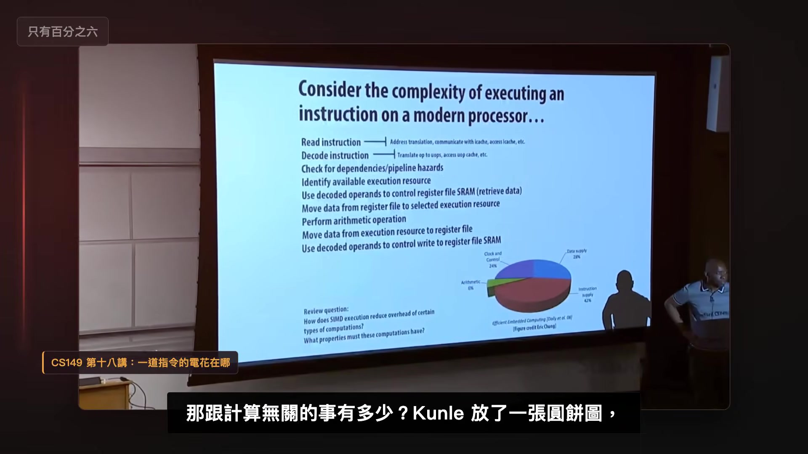

**逐字稿片段：** Conto放了一張圓餅圖 把一道乘加指令用掉的電切開來看 真正拿去做那一次乘法和加法的 只佔6% 剩下的9成多花在哪 讀出這道指令 看懂他要做什麼 檢查他有沒有在等前面的結果 確認要用的單元空不空 找出資料在哪個佔存器 把資料搬過來 再把結果搬回去 還有整顆晶片的時脈訊號 你可以想像一間工廠 真正在鎖螺絲的那幾秒 只佔很小一塊 其他時間都在看單字 找工具 搬料 這就是為什麼一般的處理器 在能源上這麼吃虧 他為了什麼城市都能跑 每一道指令都要重新問一次 我現在到底要做什麼 只要電話在哪 省電的方向就清楚了

**話題推測：** 展示圓餅圖，分析乘加指令運算中，真正計算所佔的功率比例（6%）。

---

## 00:18:46

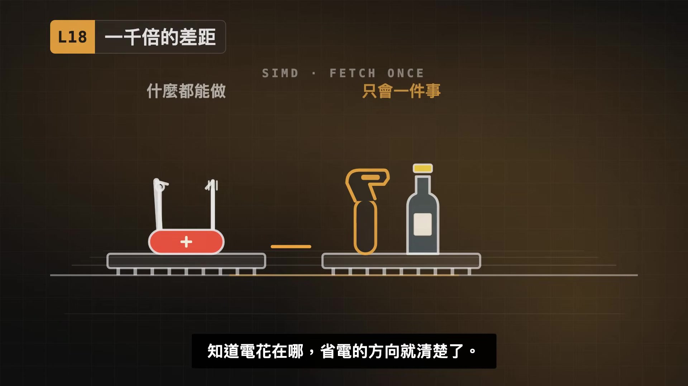

**逐字稿片段：** 第一步你已經學過 SIMD 也就是一道指令 一次做很多筆資料 指令看懂指令 那些成本只付一次 卻貪給很多次計算 圓餅圖上灰色的那一塊 就被貪飽了 比較如果一個演算法重要到 值得你為它做一顆專門的晶片 這種晶片叫ASIC 中文叫特定應用機體電路 同樣大的面積 它能算的量大約是一般處理器的1000倍 你想拿來把瑞士刀 一般的處理器什麼都能做 所以每一件事都要先問一次要做什麼 開屏器不用問 它生下來就只會做那一件事 代價也很清楚 那顆晶片只能做那一件事 而且你要等大概18個月才拿得到 你有一個新想法 你等得起 一邊是什麼都能跑 但很耗電的處理器 一邊是省電很多 但只會一招的晶片

**話題推測：** 再次提及 SIMD（單指令多資料）作為省電和提高效率的技術。

---

## 00:19:30

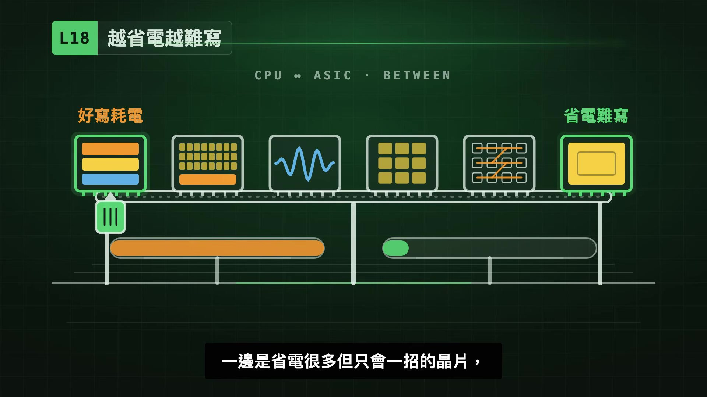

**逐字稿片段：** 中間當然有東西 Ctrl 把它們排成一條線 往右一格是顯示卡 你得學會寫 CUDA 再往右是數位訊號處理器 它的指令是為了訊號處理設計的 複雜到編譯器幾乎寫不出來 你常常得手寫組合語言 再往右是為某一個領域做的晶片 例如 Google 為了機器學習做的 TPU 它做的事說穿了就是 把很大的矩陣乘法算得特別快 你用 Tensorflow 或 PyTorch 就能用到它 再往右是 FGA 一種可以重新接線的晶片 到這裡你等於要當硬體工程師了 最右邊才是剛剛那顆專用晶片 這條線上沒有正確答案 只有取捨 你往右走一格 省下的電是真的要付出的力氣也是真的 那要怎麼做 一顆專用的硬體 以前你只能寫Verilog這種硬體描述語言 很折騰

**話題推測：** 呈現從通用處理器到ASIC的硬體特化光譜。

---

## 00:20:12

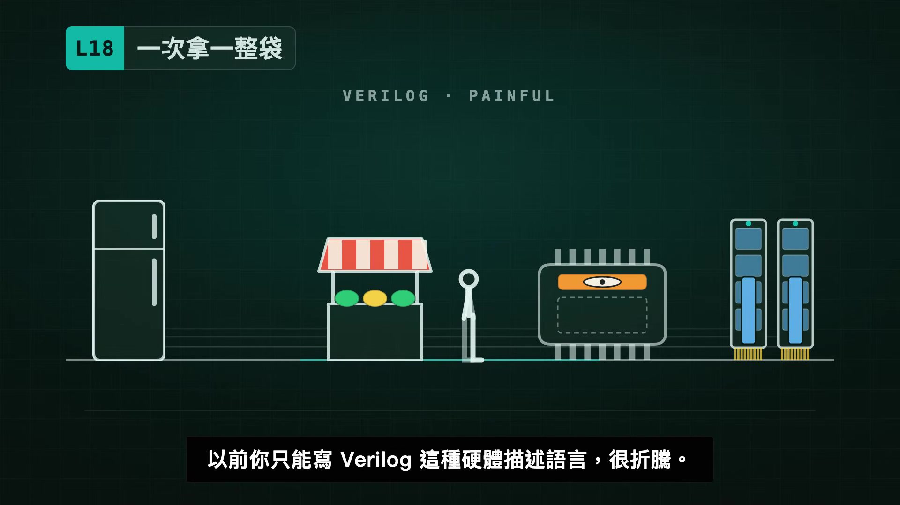

**逐字稿片段：** Conco的實驗室做了另一條路一個叫Special的語言 中文可以叫空間語言 他的想法是 會做這種硬體的人其實已經懂 平行跟資料擺放了 那就讓他直接用這兩件事來描述硬體 在一般的處理器上 資料什麼時候從記憶體進快取 你管不到 在Special裡 你自己說話 這塊記憶體放在晶片上 那塊放在晶片外 什麼時候搬 一次搬多大一塊 好像有用一個很日常的例子 解釋為什麼要一次搬一大塊 你去一趟超市 不會只買一顆蛋 你既然出門了 就一次買一整袋 回來放進冰箱 晶片去一趟 外面的記憶體也是這樣 去一趟很花時間 所以一次拿一整塊回來

**話題推測：** 介紹一種新的硬體描述語言「Special」（空間語言）。

---

## 00:20:47

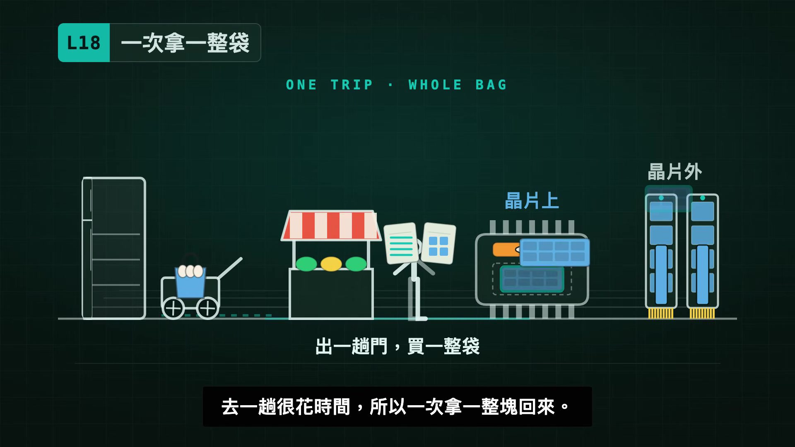

**逐字稿片段：** Special還有一招 正好街上終極講過的事 你還記得注意力那一層嗎 張一億格的大表不存下來 一塊一塊算完就走 那個做法叫融合 寫起來很不容易 你得自己把好幾個步驟 揉成一段程式 Special換了一個角度 它讓你寫兩段程式 一段算指數 一段把每一橫排加起來 然後在兩段中間 結一條管子 英文叫FIFO 中文就是先進先出 先放進去的先被拿走 這兩段是同時在跑的 前面一段算出一個 就丟進管子 後面一段從管子裡 拿一個就用掉 那張大表根本沒有機會存在 康克說這種寫法 在硬體裡非常自然 在軟體裡反而很難想 因為軟體習慣一段做完才換下一段

**話題推測：** 介紹 Special 語言如何利用 FIFO（先進先出）實現資料流水線。

---

## 00:21:24

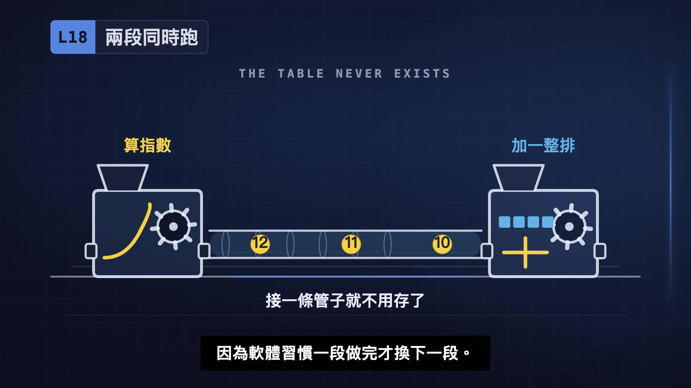

**逐字稿片段：** 最後一堂課回到Kevin 他說整個學期大家一直在喊 記憶體頻寬不夠 可是我們從來沒看過 記憶體裡面長什麼樣子

**話題推測：** 進入最後一堂課，回歸記憶體存取議題。

---

## 00:21:30

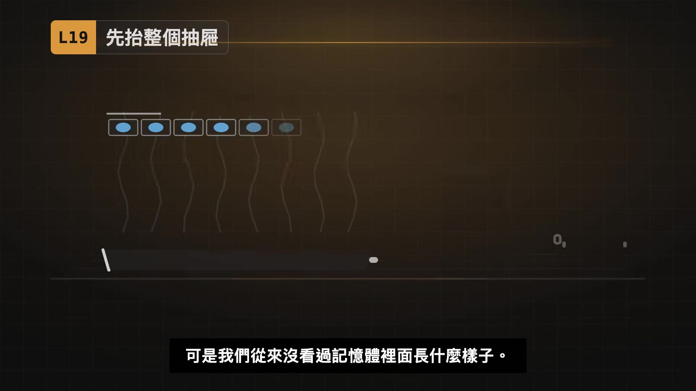

**逐字稿片段：** 你的電腦裡那幾條記憶體 上面的晶片叫DRAM 一顆電源晶片裡面是一大片格子 每一格存一個位元 存的方式是一小袋電荷 多一點算1少一點算0 你要讀其中一格 不是伸手去拿那一格 第一步先把一組線的電壓準備好 這一步大約10奈秒 第二步把你要的那一整列的電荷 導到線上 整列搬到晶片底下一個叫列環衝區的地方 這一步又大約10奈秒 第三步 才從那一列裡挑出你要的那幾格送到外面去 你可以想成去檔案室挑資料 管理員不會只抽一張紙給你 他把整個抽屜抬到櫃檯上 抽屜抬上來之後 有一件很實際的事發生了 你要的下一個位元組 如果就在同一列裡 那不用重來 直接從櫃檯上挑就好 快得多 可是如果他在另一列 你得先把櫃檯上這一列寫回去 因為剛剛那個倒的動作 會把原來那一列清空 然後再重新準備一次線 再抬一次抽屜 可以問說 所以記憶體的存取時間 根本不是固定的 同樣是沒有命中快取 你的存取順序長什麼樣子 決定了 你拿到資料要多久 差別有多大 一路順順的拿 跟每次都要重來的 頻寬可能差三到四倍 你在這門課裡 一直被要求連續存取 理由不只是用滿一整行快取 還有這一層 連續的請求 讓記憶體可以一直從 同一個抽屜裡拿 只要慢在哪 接下來的解法你已經很熟了

**話題推測：** 解釋 DRAM（動態隨機存取記憶體）的物理結構和電荷儲存方式。

---

## 00:22:43

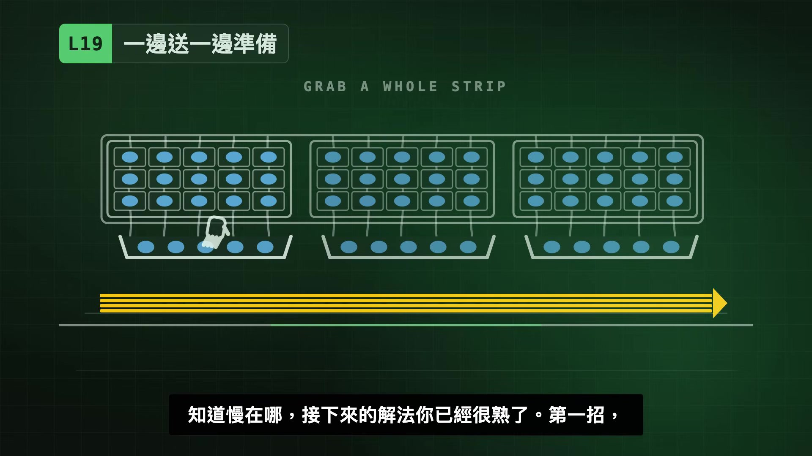

**逐字稿片段：** 第一招 一次多拿一點 晶片支援一次 要一整串連續的會員組 一次的準備成本 就攤給很多筆資料 這也是為什麼 一行快取是64個會員組 而線一次只送得了8個 第二招 你一定猜得到 做成流水線 他們把一顆晶片裡的格子 分成好幾區 每一區叫一個bank 中文叫記憶體區塊 當第一區正在把資料送出去的時候 第二區已經在準備線了 第三區在抬抽屜 這樣那組往外送資料的線 只要沒有讓他一直有資料在跑 你就在浪費你最缺的資源 這兩招你在前面兩集都見過 只是這次他們發生在記憶體裡面 這裡有一個細節 我覺得是這一集主線最好的例子 你的程式沒有命中快取 就會送出一個請求 這些請求會先進到一個叫記憶體控制器的地方 他不會照你送來的順序做 他會把一堆請求先收著 然後重新排過 把要到同一個抽屜的請求湊在一起 一次做完 Kevin說NVIDIA顯示卡上的記憶體控制器 可能是整顆晶片最複雜的一塊 他可以壓著上萬筆請求 就為了排出一個對記憶體最友善的順序 而這件事你完全管不到 你在城市裡沒有任何一個指令可以指揮它 還有一個很現實的地方 同一臺機器上還有別的城市在跑 你以為自己的資料排得很漂亮 另一支城市的請求插進來 兩邊就互相打斷 你能做的只有一件事 把你的存取寫得夠連續 讓它好排

**話題推測：** 介紹記憶體存取的優化第一招：一次讀取更多資料。

---

## 00:24:02

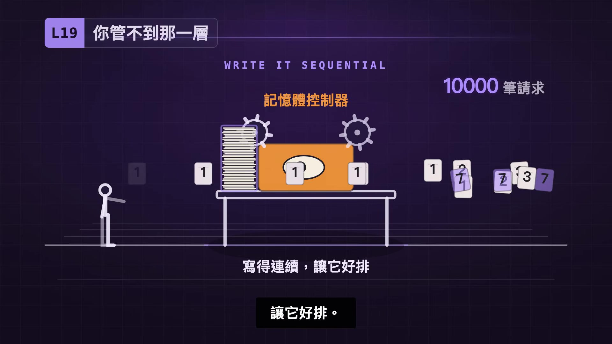

**逐字稿片段：** 還有條路跟排順序無關 是把記憶體整個搬到處理器旁邊 為什麼線只有八條 因為那些線要走過整片主機板很貴 那如果記憶體不放在主機板上 直接放在同一塊硅上呢? 今天高階的顯示卡就是這樣做的 一堆3M晶片疊起來 穿過每一層打通垂直的線 然後透過一小片硅直接接到處理器 原本只能從晶片邊緣拉出去的線 現在可以從整片面積上拉出去 這種記憶體叫HBM 中文叫高頻寬記憶體 線的寬度從64個位元 變成4000多個位元 2016年就能做到每秒720GB 今天更高 K房順手提了一句 中甲獎的那個注意力最佳話 當初的設計目標就是 就是把中間結果放進這一層裡面 不要掉到外面的記憶體去

**話題推測：** 介紹「HBM」（高頻寬記憶體），透過垂直堆疊將記憶體搬到處理器旁。

---

## 00:24:43

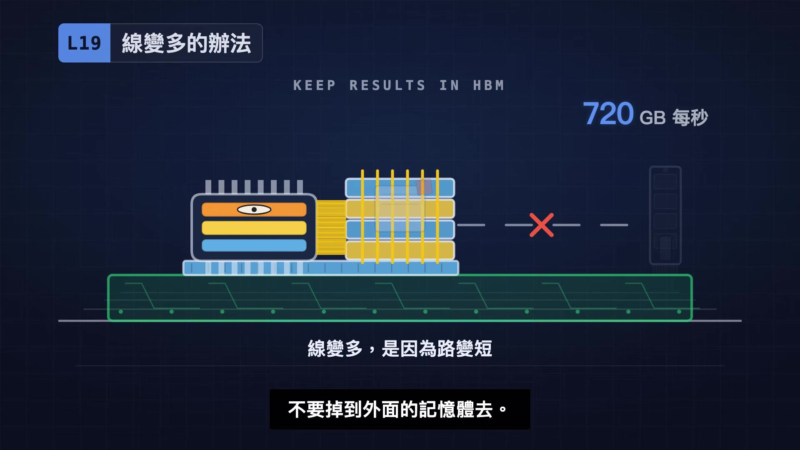

**逐字稿片段：** 最後一天 Kevin把整門課收成幾句話 第一句他說 如果今天你只帶走一件事 那就是這句 把事情分給很多人做 其實常常是最簡單的一步 難的是怎麼把資料送到那些處理器手上 從第一堂課那樣子條 到今天的抽屜跟疊起來的記憶體 整門課一直在講同一件事

**話題推測：** 開始總結整門課程的關鍵學習點。

---

## 00:25:00

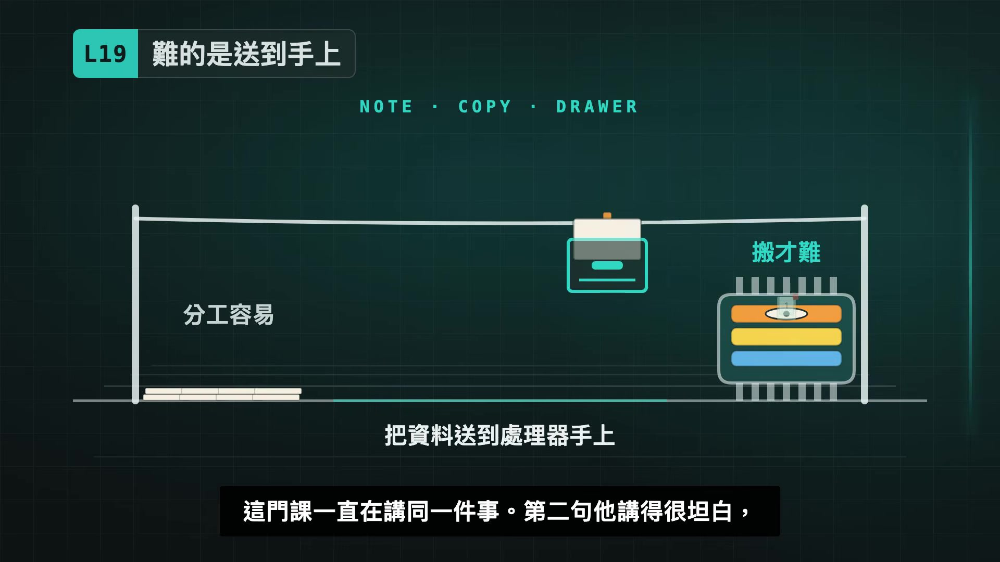

**逐字稿片段：** 第二句他講得很坦白 大部分軟體比機器真正做得到慢很多 他說第一份作業就看到了 一支寫得不錯的C程式 比一支真正用上向量指令的程式慢了大約40倍 再加上特化的硬體又是10倍到100倍 所以他提醒大家 以後在實驗室裡 有人說我們要租一整排機器 你先停一下想想 也許花一點力氣改寫就快上1000倍

**話題推測：** 強調軟體與硬體之間巨大的效能差距，並提出優化建議。

---

## 00:25:21

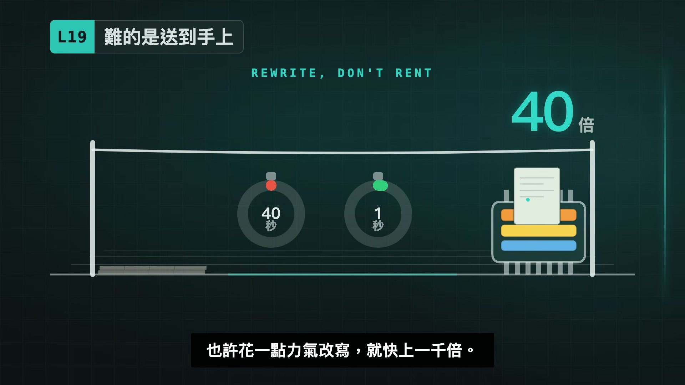

**逐字稿片段：** 我們回到開場那句話 這一集 你看到鎖其實只是記憶體裡的一個格子 看到四臺車在路口誰也退不了 看到有人乾脆不上鎖 先做完 最後一刻才檢查 你看到這種語言逼你放掉自由 換他替你安排迴圈 看到一個字寫在程式外面 就把什麼守規矩這件事 整個交給系統 看到一顆位的一件事 打造的晶片 同樣的面積 能算的量是1000倍 最後你看到 連你的請求 要用什麼順序 送進記憶體 都有人替你重排 所以這一集的答案是 男的不是自己管好每一步 是把規矩交出去 而沒交出去一次 你都放掉了一點自由

**話題推測：** 總結本集所有關鍵概念，強調「把規矩交出去」的主題。

---

## 00:25:56

**逐字稿片段：** 三集走到這裡 其實是同一條線 上集講的是那張 走過教室的紙條 男的不是算 是搬 中甲講的是 四個人手上的影印本 男的不是分工 是共用 這一集講的是 你願意把多少事交給機器替你守 最後問你一個問題 如果你手上有一件很重要的事 你會自己盯緊每一步 還是把規矩講清楚以後交出去 留言跟我分享 喜歡這種把公開課講清楚的內容 也可以訂閱AI Notebook 我是Jim 我們下次見

**話題推測：** 將三集節目的核心主旨串聯起來，強調共同的主題。

---
