# jimainotebook_7ipbnVilTDI — 關鍵畫面索引

- 來源逐字稿：[jimainotebook_7ipbnVilTDI_FIN.srt](jimainotebook_7ipbnVilTDI_FIN.srt)
- 影片：https://www.youtube.com/watch?v=7ipbnVilTDI
- 截圖數：58

## 00:00:06

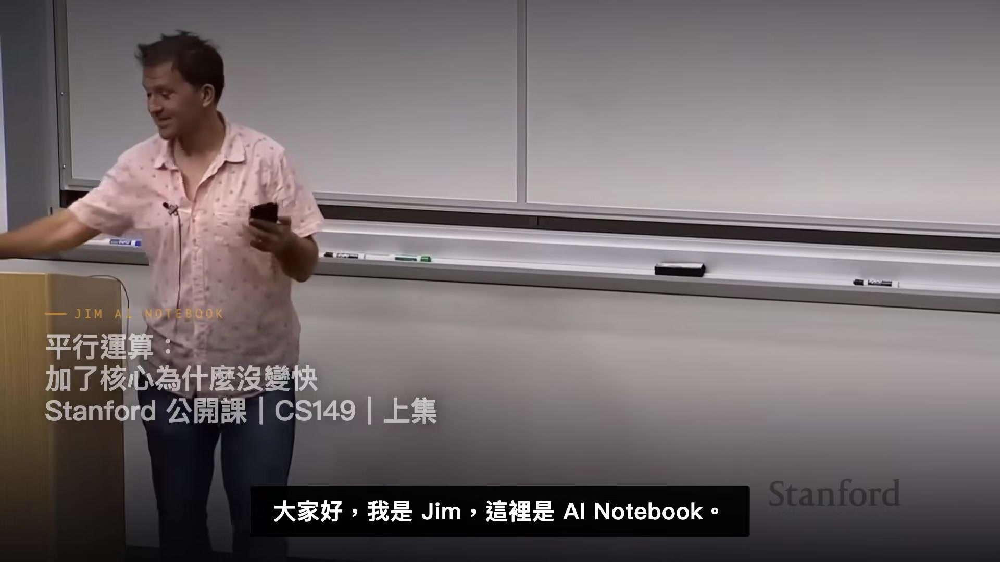

**逐字稿片段：** 你換了一臺核心更多的電腦,誠實卻沒有快多少 你有沒有想過為什麼?

**話題推測：** 提出問題：核心多電腦卻沒變快

---

## 00:00:11

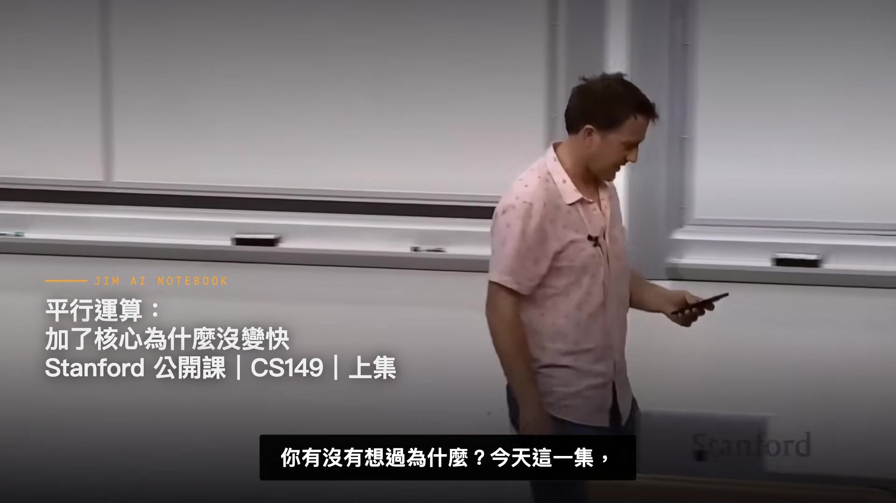

**逐字稿片段：** 今天這一集,我們一起上史丹佛平行運算CS149的前六堂課 老師是Keyvon Fattahelian

**話題推測：** 課程主題：史丹佛平行運算CS149

---

## 00:00:17

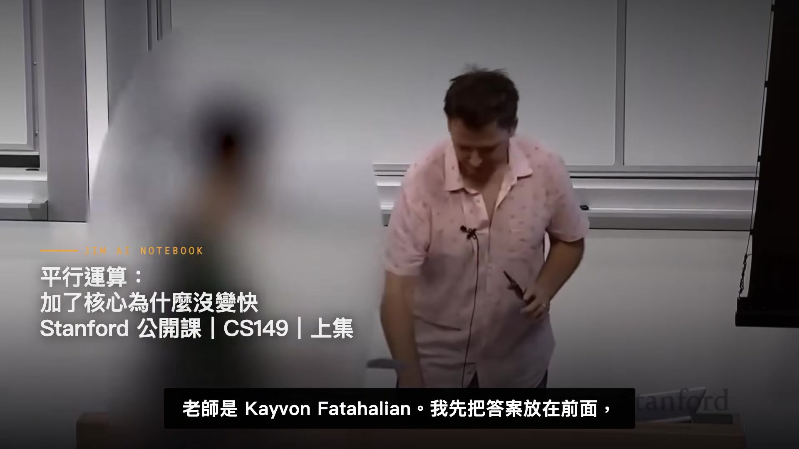

**逐字稿片段：** 我先把答案放在前面,平行運算最難的 從來不是算,是辦,算其實很快,把資料送到該區的地方才慢 這句話聽起來有點空,所以Keyvon沒有從頭影片開始

**話題推測：** 核心觀念：平行運算難在資料傳輸

---

## 00:00:28

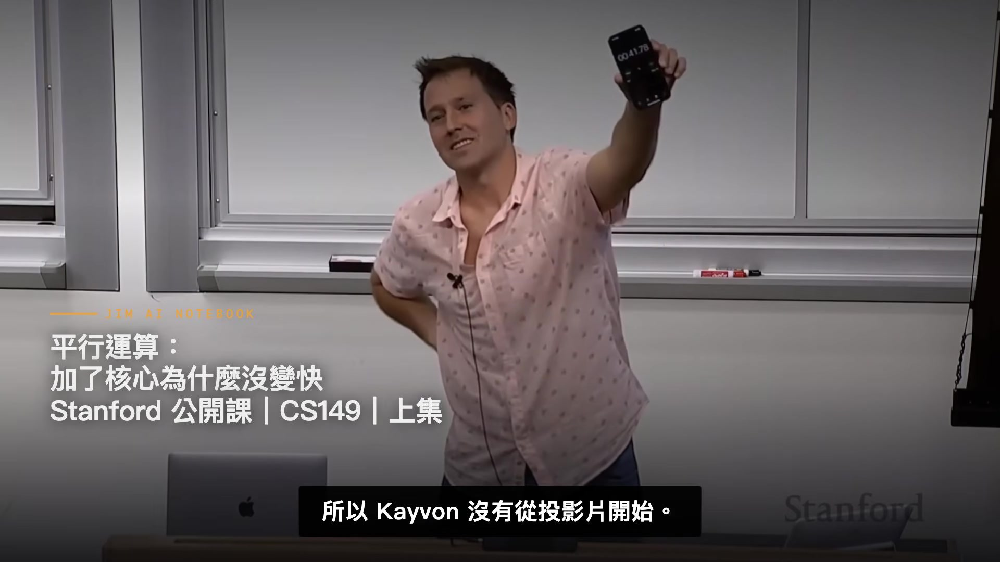

**逐字稿片段：** 講臺上放了16張紙,每張寫著一個數字 他請一位同學上來 把他們全部加起來 我們就從這16張紙開始 你想像講臺上有16張紙 每張寫著一個數字 題目只有一個 全部加起來 K本請一位同學上臺 按下碼錶 這位同學一張一張往下加

**話題推測：** 實驗一：單人加總16張數字紙

---

## 00:00:44

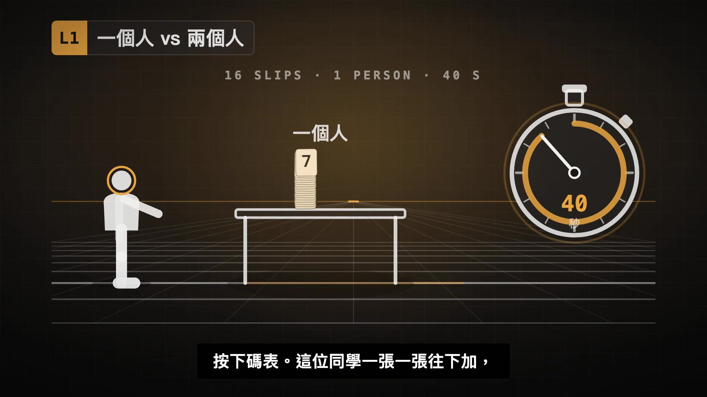

**逐字稿片段：** 花了大約40秒 答案106 全對 接著K本說 我們來試試看 能不能更快

**話題推測：** 實驗一結果：耗時40秒

---

## 00:00:50

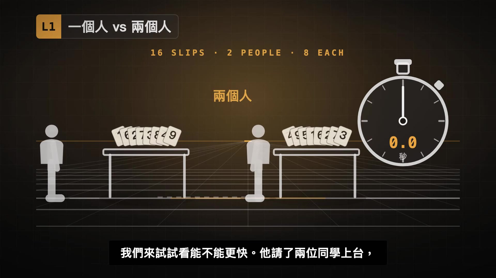

**逐字稿片段：** 他請了兩位同學上臺 換一組新的16張紙 一人8張 不過他加了一條規則 第二位同學要待在教室最後面 兩個人不準講話 只能靠一張紙和一支筆溝通 你猜猜看 兩個人 兩倍的人手 應該20秒左右就結束了吧 馬錶停下來 顯示41.7秒 答案一樣正確 時間卻幾乎沒有進步 多找了一個人 速度卻沒有跟得上來 他轉過身問全班 剛剛到底發生了什麼事

**話題推測：** 實驗二：兩人分工加總，加限制條件

---

## 00:01:15

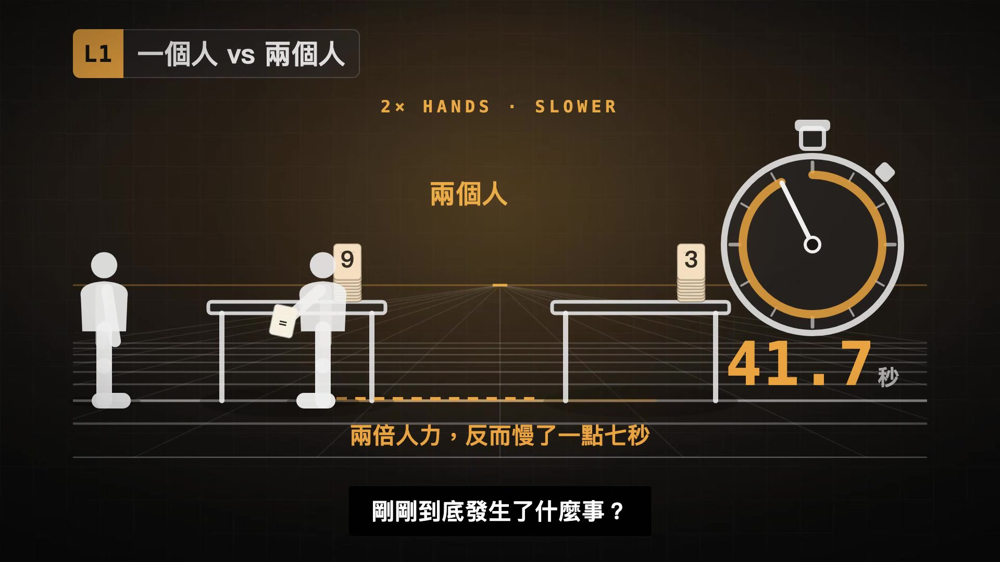

**逐字稿片段：** Kevin把馬錶的分段 一個一個念出來 兩個人各自加完手上八張紙 大約在第21秒就停了 接下來呢 兩個人開始舉手 因為不知道下一步要怎麼辦 到了第23秒 其中一位才站起來 拿著寫了小記的紙條 走到教室另一頭交給對方 對方再加一次 才算出答案 你把時間攤開來看 40多秒裡面 只有一半在算 另一半都花在走路送紙條

**話題推測：** 分析實驗二：時間花費分段明細

---

## 00:01:37

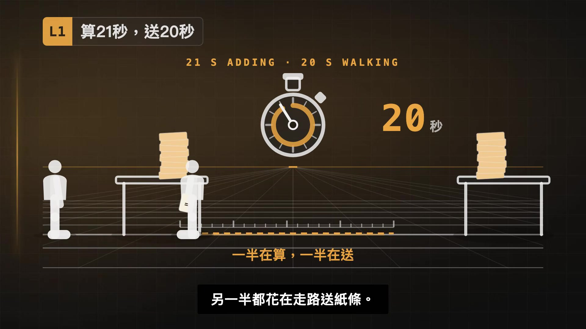

**逐字稿片段：** 臺下有同學說出一個詞 通訊 通訊的意思 就是把東西從一個人手上 交到另一個人手上 人變多了 要傳的東西也跟著變多 每一傳一次都要花時間 Kvon接著問 如果重來一次 你們會怎麼改 一位同學說 我會邊算邊走過去 另一位說 我會直接用手機傳 這兩個答案 一個讓送跟算同時進行 一個按送變得便宜 整門課後面的做法 差不多都是從這兩個方向長出來的 Kvong又叫了四個人上臺 四份工作發下去 這一次規則放寬了 四個人可以站在一起 也可以講話 結果呢 不但沒有快四倍 還比兩個人更慢

**話題推測：** 引入新概念：通訊時間的影響

---

## 00:02:11

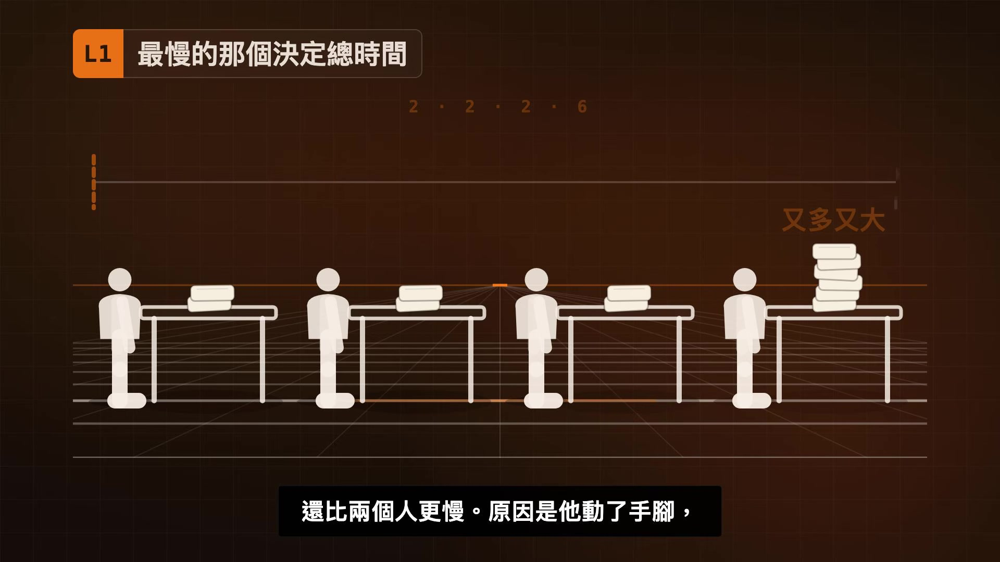

**逐字稿片段：** 原因是他動了手腳 他刻意把數字發得不平均 其中一個人拿到的紙又多 數字又大 另外三個人拿到的都是四啊五啊 這種小數字 一下子就加完了 只能站在臺上等 臺下有人喊出來 工作沒分平均 Kvong把這句話補完整 那三個人做完之後 完全沒事可做 這就是第二個教訓 決定總時間的 不是大家的平均速度 是最慢的那一個人 例如你在手機上 打開一個網頁 十張圖有九張一下就出來 最後一張卡住 你還是得等整頁跑完 你付了四個人的錢 最後有一段時間 只有一個人在做事

**話題推測：** 實驗三失敗原因：工作量分配不均

---

## 00:02:42

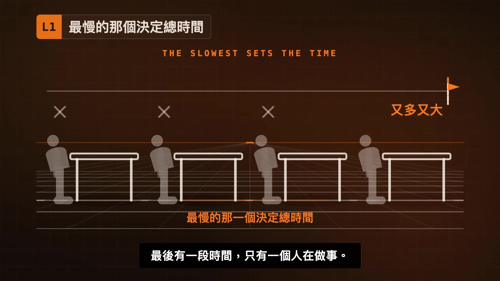

**逐字稿片段：** 最後K本把全班都拉了進來 題目很簡單 這間教室現在有多少人 他給大家一分半鐘 先講好做法再動手 同學們提了好幾種方案 有人說一排一排數 再加起來 有人說大家站起來 自己湊成十人一組 再數又幾組 K本每聽到一個方案 都追問同一句話 那這段時間 其他人在做什麼

**話題推測：** 實驗四：全班統計人數

---

## 00:03:00

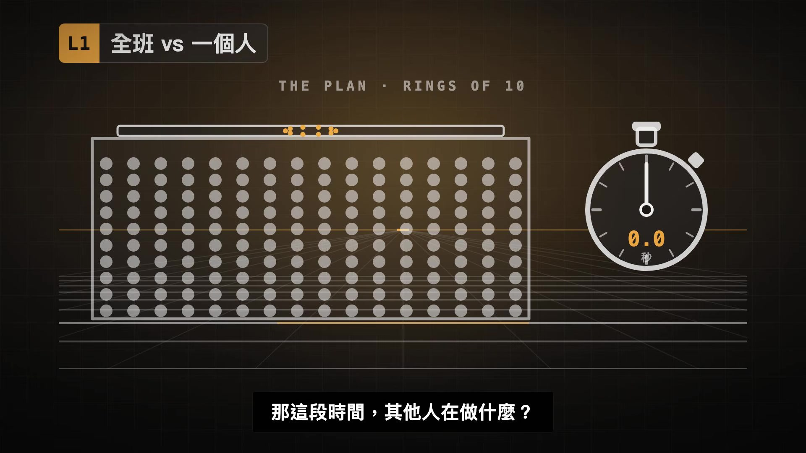

**逐字稿片段：** 最後全班選了一個 最有野心的版本 所有人往前移 把前面幾排坐滿 再用排數乘上每排的座位數 馬錶開始跑 160個人一起站起來換位置 你可以想象那個畫面 走道上擠滿的人 大家都在找空位 跑到兩分鐘 轎池還在移動 沒有人喊出答案 K本在旁邊說 如果剛剛只派一個人 從第一排輸到最後一排 兩分鐘大概也輸完了 160倍的人力 輸給一個人慢慢輸 事後檢討 K本問全班 剛剛哪裡出了問題 有人說應該留一兩個人專門負責數 不要讓所有人都在動 也有人說 光是大喊這裡還有兩個空位 喊來喊去就花掉太多時間

**話題推測：** 全班選定計數方案：移動座位數排數

---

## 00:03:36

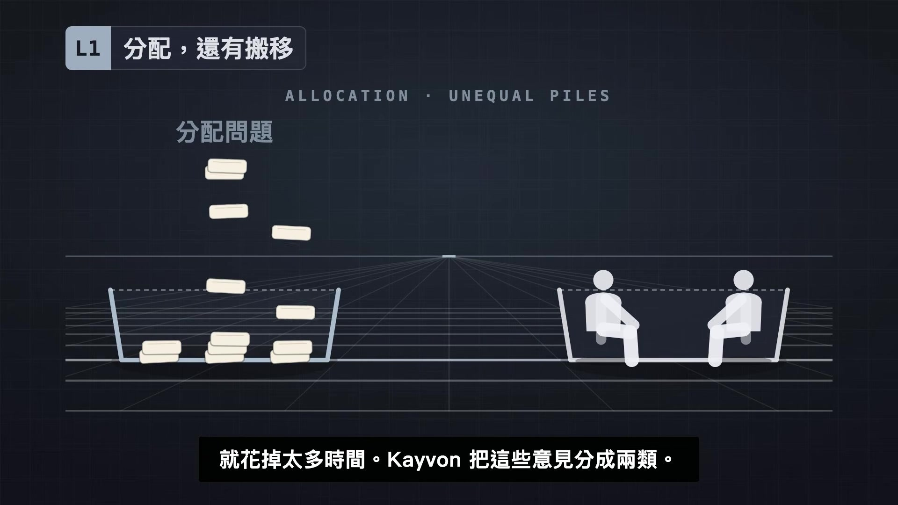

**逐字稿片段：** A風把這些意見分成兩類 一類是分配問題 你沒有事先想清楚誰該做什麼 另一類是搬移問題 工作還沒開始 你就先花了一大段時間 把每個人搬到對的位置 你回想一下剛才那張紙條 也是一樣的事 大部分時間不是在家 是在走

**話題推測：** 問題分類：分配問題與搬移問題

---

## 00:03:51

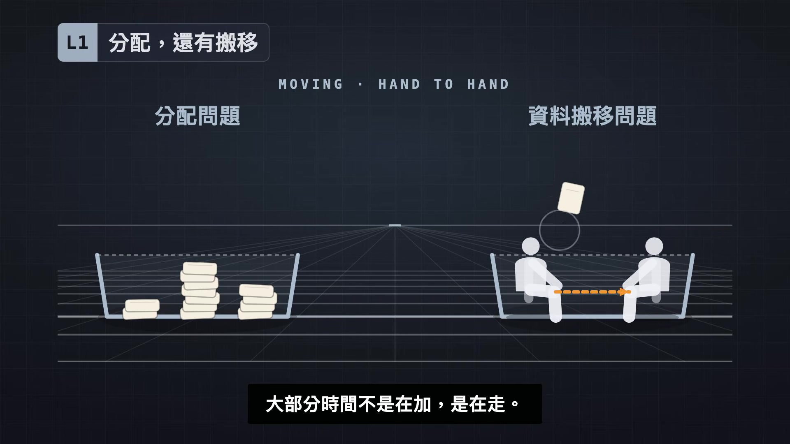

**逐字稿片段：** 接著他講了一句會貫穿整門課的話 他說 雖然整門課叫平行運算 但是我這輩子做過的每一個系統 真正決定成敗的只有一件事 通訊 還有把東西搬來搬去 他請大家接下來每一講 都把這句話記在心裡 這一集後面的內容 就是用硬體一步一步證明 他這句話是對的 在講硬體之前

**話題推測：** 貫穿課程核心：通訊與搬移決定成敗

---

## 00:04:11

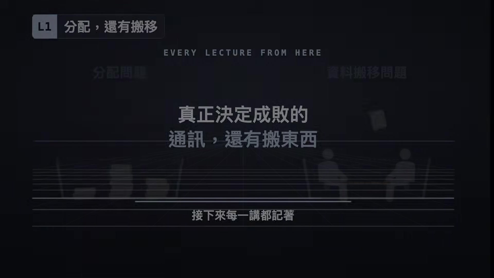

**逐字稿片段：** Kvon先丟了一個問題 假設你去實習 主管給你一臺10核心的機器 10核心指的是 處理器裡能自己做事的單位一個核心 就像講臺上一個在加數字的同學 主管要你把一支程式變快 一個月後你回去報告 我讓它快了兩倍 你覺得你會被開除 還是被加薪 臺下分成兩派 說要開除的人覺得 十個核心才換到兩倍 代表資源浪費了一大半 說要加薪的人舉了例子 網站打開的時間少一半 客人就不會跑掉 一款遊戲從每秒15張畫面 變成30張 可能就是能不能上市的差別 K王說兩遍都對 有時候你在乎的是快不快 有時候在乎的是有沒有浪費 他說這門課雖然叫平行運算 他在乎效率的程度 一點都不輸給平行 就像剛才數人頭 如果一個人數一遍比較快 那就派一個人 不要為了平行而平行

**話題推測：** 情境提問：10核心電腦程式加速兩倍算成功嗎？

---

## 00:04:55

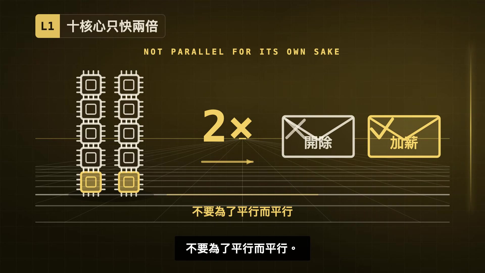

**逐字稿片段：** 那為什麼我們非走平行這條路不可

**話題推測：** 探討為何必須走平行運算之路

---

## 00:04:58

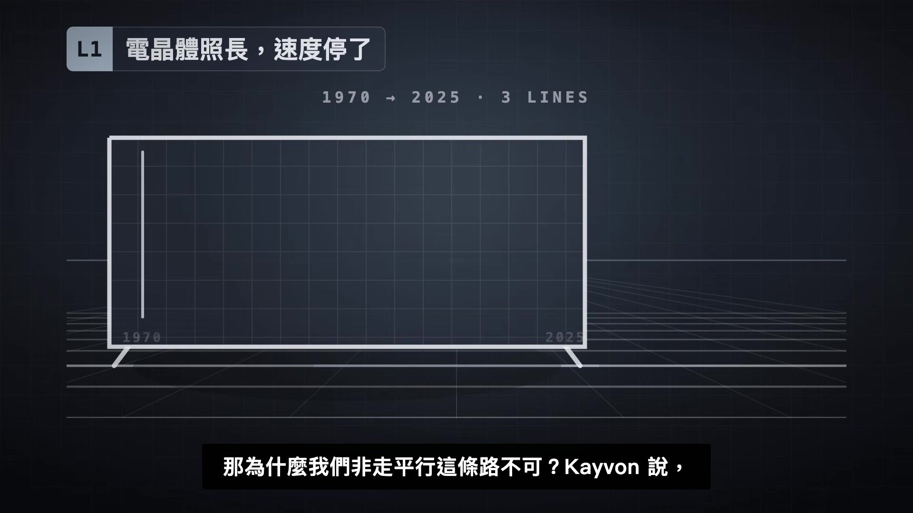

**逐字稿片段：** 黑夢說有一張圖 學電腦的人大概都看過 行的是年份值的是一顆晶片上電晶體的數量 電晶體是晶片裡最小的開關 數量越多 能做的事就越多 這條線到今天都還在往上爬 一顆揮打的高階晶片上 大約有851顆 可是同一張圖上還有另外兩條線 一條是處理器 每一拍能做幾件事 另一條叫時脈 就是處理器一秒鐘打幾拍 這兩條線大約15年前就平了 例如你今天去買一臺新筆電 規格表上的10mai跟15年前的電腦差不了多少 電晶體一直變多速度卻沒有跟著變快 中間出現了一道落差 這整門課要做的就是想辦法把這段差距補回

**話題推測：** 圖表：電晶體數量與處理器速度趨勢

---

## 00:05:35

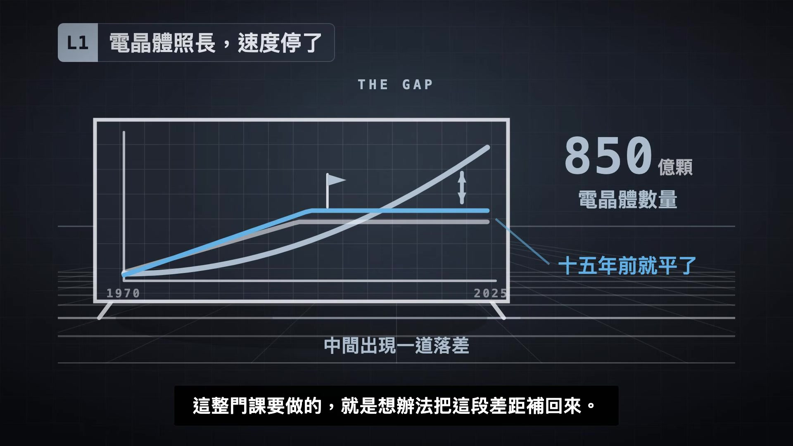

**逐字稿片段：** 10mai為什麼停住 答案是耗電 這個叫功耗 就是晶片吃掉多少電 這裡有個好記的關係 功耗大概跟頻率的平方一起走 頻率就是剛才的10mai一秒打幾拍 你把頻率拉高一倍 耗電要付出大約4倍

**話題推測：** 時脈停滯原因：功耗與散熱限制

---

## 00:05:49

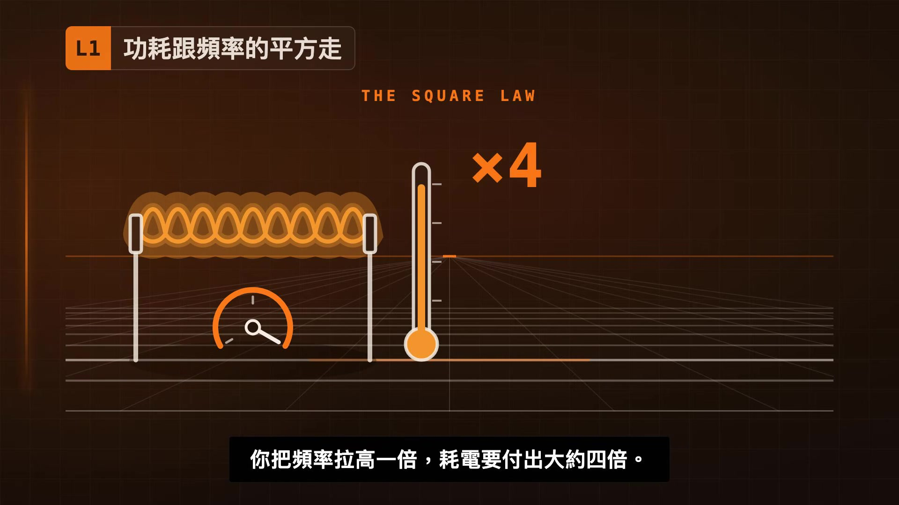

**逐字稿片段：** KBONG給了一個很有畫面的比較 一張RTX4090顯示卡全速在跑機器學習 它吃的電 跟你家廚房那臺梅波爐 在熱昨天的漢堡 是同一個等級 那些電最後都會變成熱 熱要是閃不掉 晶片就會燒壞 所以頻率不是不能再往上 是往上之後 多出來的熱 你處理不了 現在最大的超級電腦 耗電已經跟一座小鎮差不多 這條路走到了盡頭

**話題推測：** 功耗比喻：RTX4090與微波爐耗電量

---

## 00:06:12

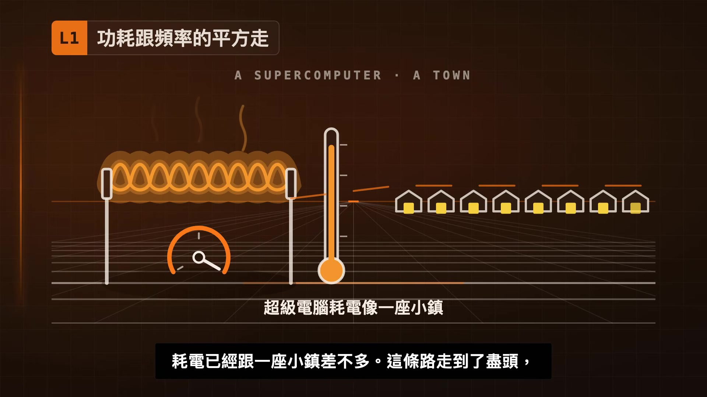

**逐字稿片段：** 速度只好從別的地方找 那個地方就是 讓很多事情同時發生 在多核心出現之前 那些多出來的電晶體 先被拿去做了一件事 偷偷幫你平行

**話題推測：** 解決速度瓶頸：讓多事同時發生

---

## 00:06:22

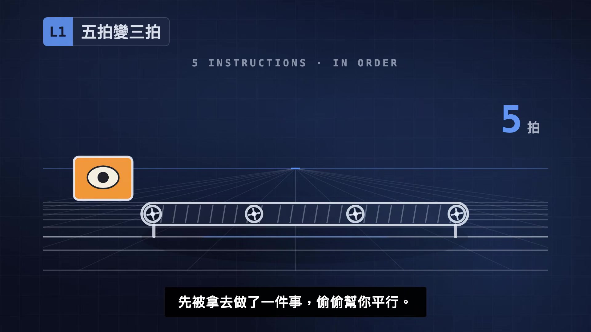

**逐字稿片段：** 這個做法叫超存量 意思是處理器在同一part裡 同時做好幾道指令 指令就是處理器一次做的一個小動作 像加一次半一次 Kvon在臺上寫了五道指令 前三道各算各的 互不相干 後兩道要等前面的答案 處理器自己看出來 前三道可以一起做 於是原本要五part三part就做圓了 而且算出來的結果 你寫的順序完全一樣 你根本不會發現

**話題推測：** 硬體平行：超存量(Superscalar)運算

---

## 00:06:43

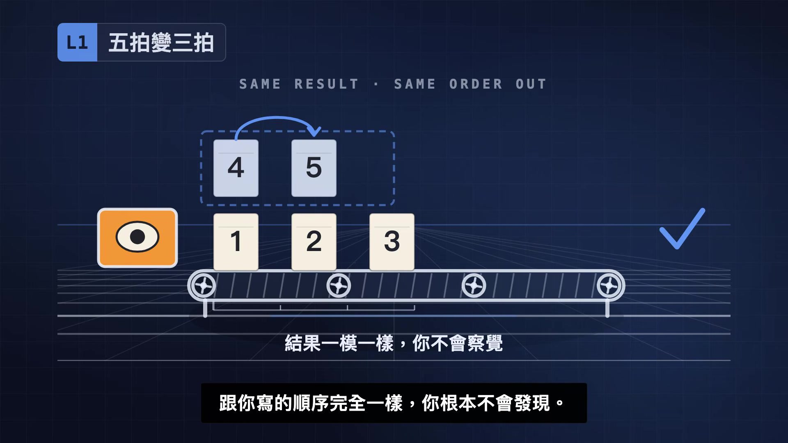

**逐字稿片段：** Kvon在這裡講了一個 他很在意的分別 橙色的意思是照這個順序做完 會得到這個答案 處理器實際用什麼順序去做 只要你看不出差別 他就可以自己決定 就像那16張紙 最後的總和是106 至於誰先加哪一張 答案都不會變 意思跟做法是兩回事 這個分別後面每一講都會用到 既然硬體這麼會幫忙 為什麼不一直做下去 Kven把剛才的例子往下推 如果處理器一次能做三件事 是不是更快 答案是不會 還是三拍 因為後面那兩道指令 要等前面的答案 你準備再多的時候 也只能一步一步拍著走

**話題推測：** 區分程式的「意思」與「做法」

---

## 00:07:15

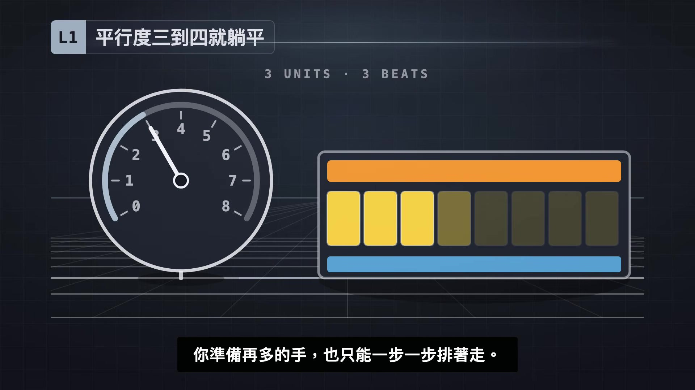

**逐字稿片段：** 史丹佛早年有研究 專門問過這件事 如果完全不改程式 硬體自己能挖出多少平行 結果畫成一張圖 行的是處理器 一次最多做幾件事 值得是因此快了幾倍 曲線爬到3到4就平了 再往上加 也用不到 道理不難懂 你寫的程式本來就有先後 例如你要先打開冰箱 才拿得到牛奶 硬體再聰明 也變不出本來不存在的平行 三條路都走到底了 電晶體還在變多 頻率不能再拉 硬體也挖不出更多平行

**話題推測：** 史丹佛研究：硬體自動平行化上限圖表

---

## 00:07:41

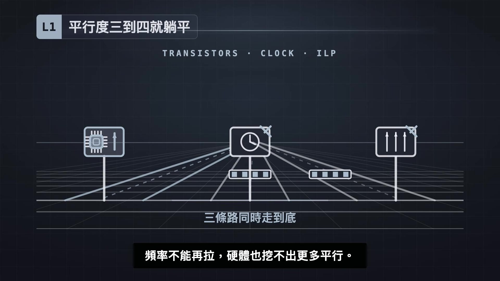

**逐字稿片段：** 設計晶片的人只好換個策略 既然我猜不到哪裡可以平行 那就請你直接告訴我 多核心就是這樣來的 它的第一步有點出乎意料 先做減法 每個核心裡那些花俏的功能 像自己找平行的那套邏輯 全部縮小一點 每個核心一直變笨 跑單一程式可能慢上兩成五 但是省下來的電晶體 可以在同一塊晶片上多放好幾個核心 我們回到那16張紙 這就像把一個聰明但很貴的同學 換成兩個普通的同學 只要你把紙分好 兩個人一起加 大概能快1.5倍 這筆交易看起來不漂亮 但是他能一直做下去 你現在打開你的手機 裡面也是多核心 兩顆大核心負責讓眼前的APP跑得順 四顆小核心處理背景工作 旁邊還有專門處理相機和神經網路的電路 不過都核心有個前提 你得給它好幾份工作 你原本那隻從頭跑到尾的程式 就像只有一疊紙 丟到雙核心的機器上 只會有一個核心在動 另一個在旁邊發呆

**話題推測：** 新策略：多核心(Multi-core)處理器設計

---

## 00:08:31

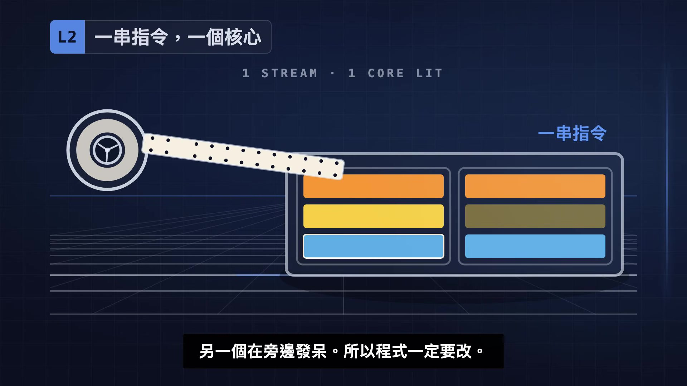

**逐字稿片段：** 所以程式一定要改 而開封用一個計算 證顯值的小程式當例子 證顯是數學課學過的一個函數 你不用記 只要知道 輸入一排數字 每個數字各自算出一個答案 彼此完全不相干 這種程式裡面明明到處都是 可以同時做的事 處理器卻只看得到眼前幾道指令 看不出來 最直接的改法叫開執行序 執行序就是一疊交給某個核心去做的紙 你自己把這排數字切成兩半 前半一條後半一條 這樣確實會變快 可是你也把兩個核心這件事 寫死在城市裡了 換到一臺四核心的機器只用到一半 換到16核心只剩八分之一 你每換一臺機器就得回頭改一次 Kevin覺得 比較好的做法是換一個角度寫 你不要規定開幾條執行序 也不要規定誰做哪一段 你只要宣告一件事 這件事跟迴圈有關 迴圈就是同一個動作 每個數字都做一次 你只要說這個迴圈的每一輪 彼此都不相干 他在頭影片上發明瞭一個寫法 叫Four意思是 對所有元素做同一件事 而且順序不影響結果 這樣寫程式只負責說 哪些事可以同時做 實際要開幾條 交給執行環境 也就是程式跑起來 是旁邊那個管事的軟體 他看你手上的機器來決定 兩核心就開兩條 16核心就開16條 程式一行都不用改 這就像你只跟全班說 這些紙可以分開加 至於找幾個人來加 現場看有幾個人再決定

**話題推測：** 軟體配合：程式需改寫以利用多核心

---

## 00:09:46

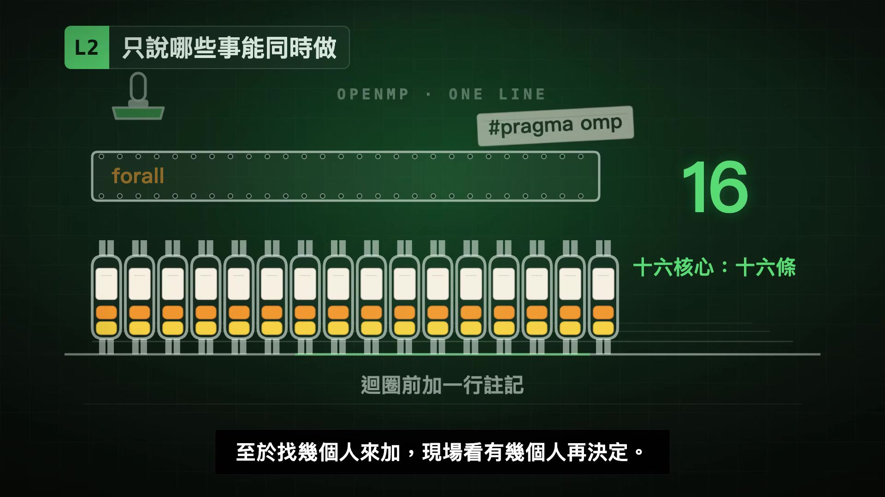

**逐字稿片段：** 在C語言裡 有一套叫OpenMP的工具 你在迴圈前面加一行註記 它就幫你開好執行序 Kevin發現 剛才那個迴圈還有一個特點 每一輪做的事情一模一樣 只是數字不同 修照片 跑機器學習 畫遊戲畫面 大部分的運算都長這樣 一大堆資料 全部做同一件事

**話題推測：** C語言工具：OpenMP實現平行化

---

## 00:10:02

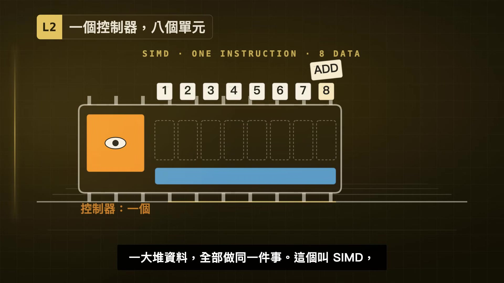

**逐字稿片段：** 這叫SIMD 中文叫單一指令 多重資料 它做的事是這樣 一個核心裡 負責讀指令的控制器還是隻有一個 但是真正做加減乘除的算術單元 一次放8個 控制器說做加法 8個單元就同時對8個不同的數字做加法 例如你在手機上把一張照片調亮 每一個小點都要加一點亮度 做的是完全一樣 SIMD就是一口氣調8個點 寫程式的人常用一個叫NumPy的工具 處理大量數字 在NumPy裡把兩排數字相加 那個加號在機器上就是一道指令 架構師想得很直接 既然每一輪的指令都一樣 何必每次都重讀 讀一次就好 為什麼這樣划算 一個算數單元本身用的電晶體比你想的少很多 真正貴的是旁邊那一整套 讀指令 看懂指令 安排順序的控制邏輯 SIMD做的 就是讓8個算數單元共用一套控制 把這筆錢攤掉 臺下有人問 那為什麼不乾脆做8倍的核心 答案就在這裡 每多一個核心 你就要多付一整套控制的錢 SIMD只付一次 我們回到講臺上來看 就像請一個人負責念題目 8個人同時動筆 念題目的人不用請8個 代價是程式要改寫 每個數字都要換成一次裝8個的版本 K1自己也承認 改原的程式碼幾乎沒辦法讀 可是好處很具體

**話題推測：** 硬體加速：單一指令多重資料(SIMD)

---

## 00:11:12

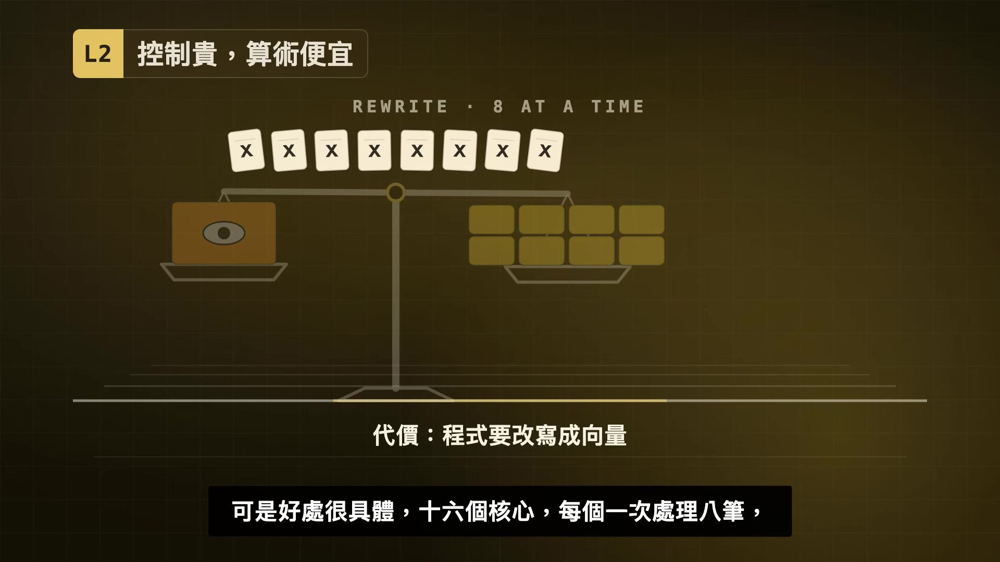

**逐字稿片段：** 16個核心 每個一次處理8筆 整顆晶片同時有128筆資料在算 理論上最多快128倍 前提是 每一筆都做同一件事

**話題推測：** SIMD效益：高吞吐量實現顯著加速

---

## 00:11:21

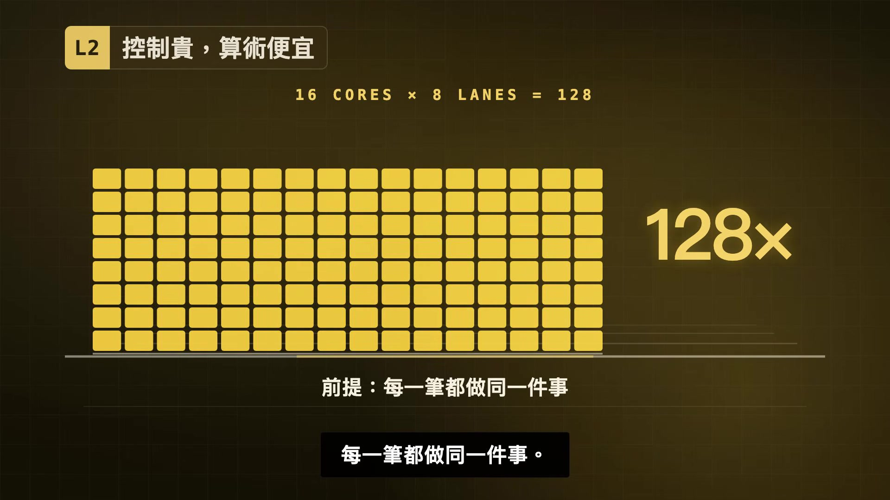

**逐字稿片段：** 不過這個前提不一定成立 K1換了一段程式 迴圈裡多了一個if if 就是如果數字大於0走這條路 不然就走另一條 另一條叫else 問題來了 8個算術單元綁在同一個控制器上 同一時間只能做同一個動作 所以處理器只好先做if那段 把用不到的單元遮起來 讓他們空等 接著反過來做else 換另一批空等 在他的圖上if 那段有三個單元在做事 else那段有五個 加起來只用到一半多一點 然後他出了一道題 你能不能只用一個if 讓這臺機器只剩八分之一的效率 臺下想了好一陣子 最後有人想到 讓八筆裡只有一筆 走進一條很長的路 另外七筆走很短的路 這樣大部分時間 八個單元只有一個在做事 另外七個全在等他 這跟講臺上三個人站著等第四個人 是同一件事

**話題推測：** SIMD限制：程式分歧(Divergence)降低效率

---

## 00:12:05

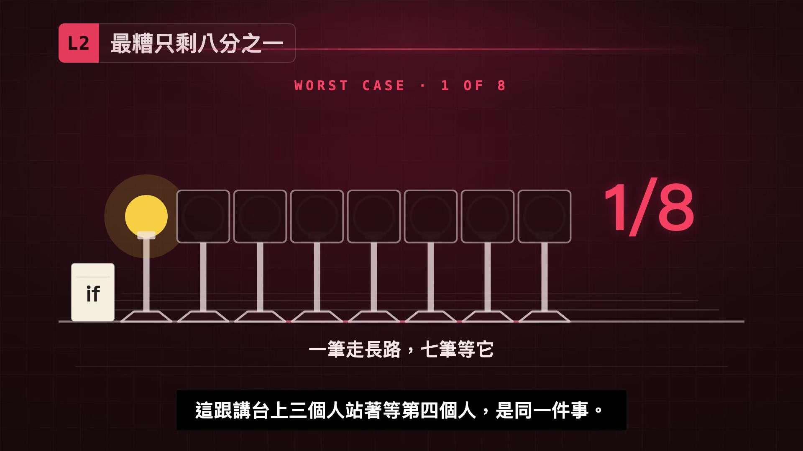

**逐字稿片段：** 這種情況有名詞 所有元素都走同一條路 叫做一致執行 大家各走各的 叫做分歧 分歧的程式 在SIMD上跑得很差 你的筆電一次 大約做8個 手機常見的是4個 繪圖處理器 也就是顯示卡里那顆晶片 可以寬到32 同一段有分歧的程式 放到顯示卡上 最糟只剩32分之1 所以顯示卡程式的人 一直被提醒 保持一致保持一致

**話題推測：** 術語：一致執行與分歧

---

## 00:12:28

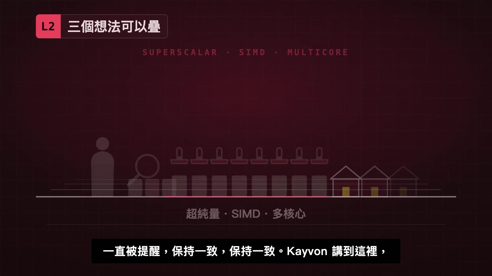

**逐字稿片段：** K網講到這裡 把前面三個想法 並排放在一起 超存量 是硬體自己找 你不用改程式 SIMD是你告訴他 同一件事做8次 多核心 是把整個核心複製好幾份 三件事互不影響 可以任意組合 你可以把一顆晶片 想成那間教室 臺上有好幾個同學 每個人手上一次拿八張紙 還會順手先做不相干的題目 真實的晶片 通常三個都用上了 差別只在比例 講員怎麼算

**話題推測：** 總結：超存量、SIMD、多核心的整合

---

## 00:12:54

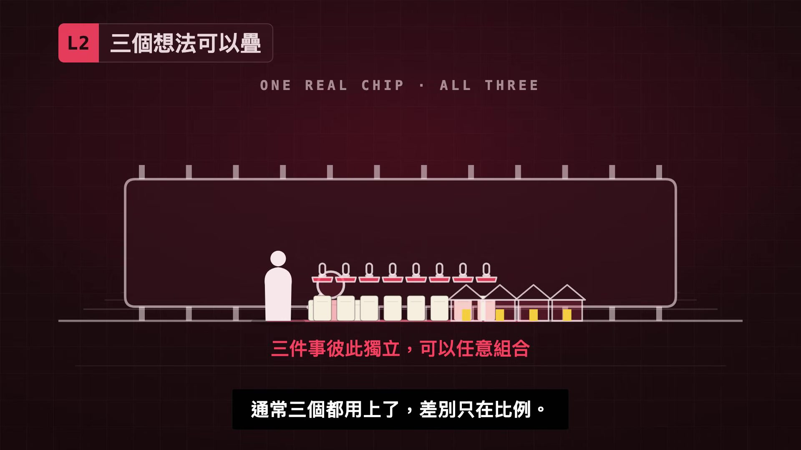

**逐字稿片段：** K板回頭處理一個 一直被割折的問題 記憶體 記憶體就是存放資料的地方 對城市來說 它只是一個很大的陣列 陣列就是一整排 編了號的格子 你報一個號碼 它含你格子裡的值 但實際上 這些格子放在晶片外面 哪一次要走很長一段路

**話題推測：** 新主題：記憶體(Memory)問題

---

## 00:13:09

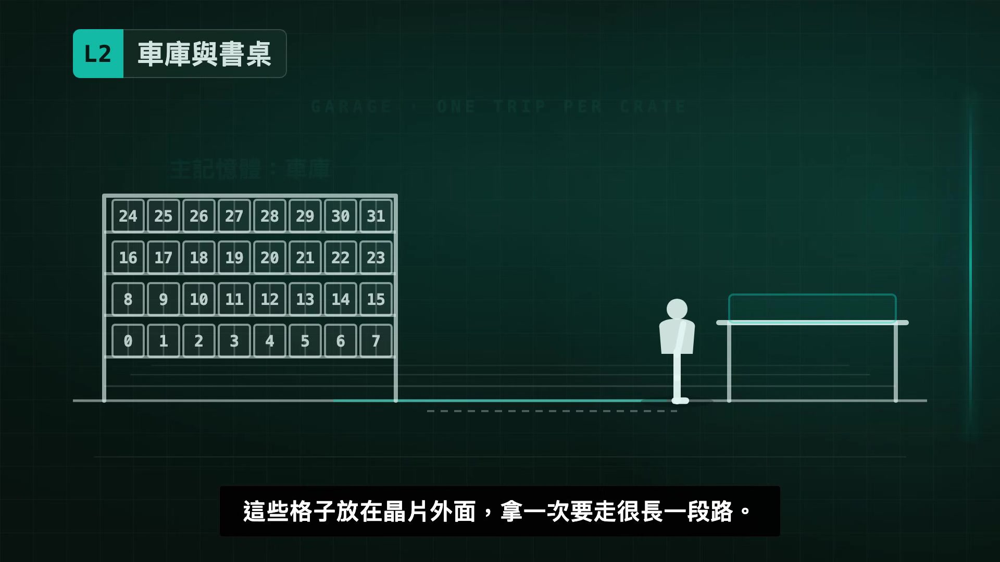

**逐字稿片段：** K板用了一個比喻 主記憶體像你家的車庫 空間很大 但每拿一樣東西都要走一趟 處理器旁邊還有一小塊記憶體 叫快取 它像你書桌的桌面 放不了多少 但伸手就拿得到 有同學問 那為什麼不把車庫 整個搬到書桌上 全搬都笑了 當然放不下 還有一個細節 資料不是一格一格搬 是一次搬一整排 這一排叫做快取行 在Intel的處理器上是64個位元組 位元組是電腦計算資料大小的單位 你只要一格 旁邊63格也一起被搬上桌 快取能幫上忙 靠的是讀兩件事 第一件叫時間區域性 意思是你剛用過的東西 等一下很可能又要用 就像你正在寫的那份作業 會一直攤在桌上 不會每看一次就收回車庫 第二件叫空間區域性 意思是你拿了這一格 接著很可能拿隔壁那一格 就像從車庫的箱子裡 把相簿往下翻 只要程式符合這兩件事 大部分時候伸手就拿到了

**話題推測：** 記憶體比喻：車庫（主記憶體）與桌面（快取）

---

## 00:13:59

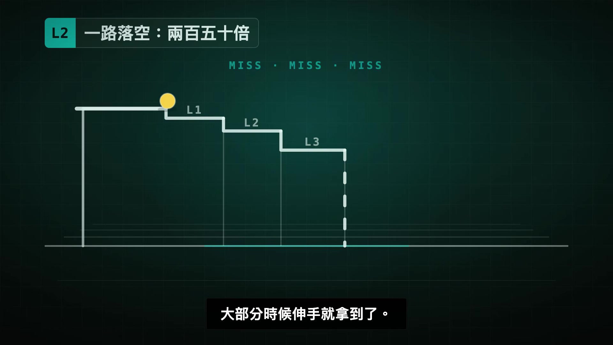

**逐字稿片段：** Kevin把等待的時間照比例畫了出來 最靠近處理器的那層快取 幾乎是一瞬間 往外一層慢一點 再往外又慢一點 一路都沒找到 要跑回車庫拿的話 要等上250倍的時間 他說你辛辛苦苦用四個核心 換來四倍粗度 資料擺錯地方 一下子就可能輸掉250倍 好處跟損失 根本不在同一個量級 麻煩的是 為了塞進更多核心 架構師剛剛才把快取縮小 算術單元變多 每秒要吃的資料變多 桌面卻變小了 還有一件事更麻煩 有些城市根本預測不了 下一步要拿什麼 例如你在網路上一個連接 接一個連接點下去 不打開這一頁 你不會知道下一頁在哪裡 處理器就會常常停下來 等車庫把資料送來 Kevin在這裡 問了全班一個生活問題 你們洗衣服的時候 會把衣服丟進洗衣機 然後站在旁邊 等他洗完嗎 大家都笑了 當然不會 你會先去做別的事 洗好再回來

**話題推測：** 時間圖：不同層級快取的存取延遲

---

## 00:14:49

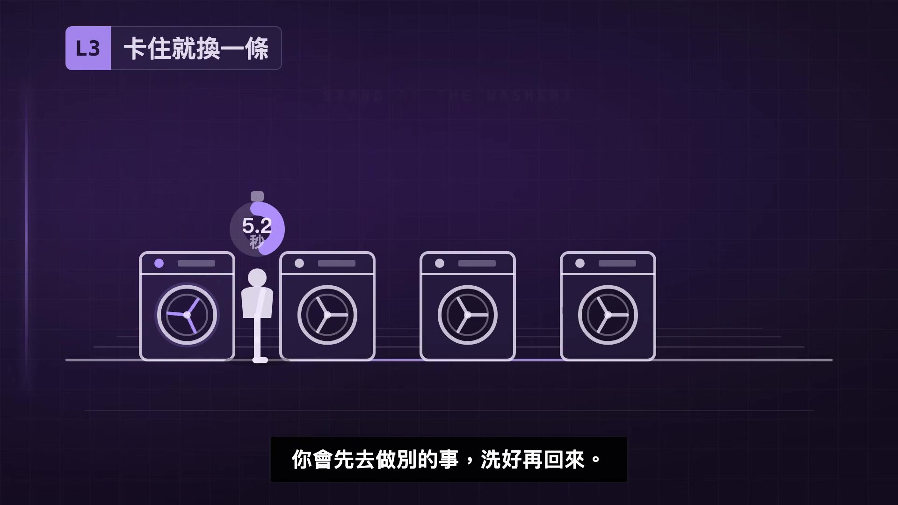

**逐字稿片段：** 第三個想法就是這樣來的 它叫硬體多職情緒 一個核心 同時記住好幾份工作各自做到哪裡 眼前這一份卡住在等資料 下一拍就換另一條來做 完全不用停 這個切換幾乎不花時間 硬體只是改一下 他現在看的是哪一份工作 這裡有個很容易誤會的地方 硬體都執行去 並沒有讓任何一件事變快 他做的是讓整臺機器不閒著 我們再回到洗衣機 你同時處理好幾欄衣服 這一欄在洗 你去晾另一欄 整個下午你一直在動 洗完的總量最多 可是其中任何一欄 從放進去到晾好 都比你專心只顧它還要久 因為它得排隊等你

**話題推測：** 硬體多執行緒(Hardware Multithreading)概念

---

## 00:15:24

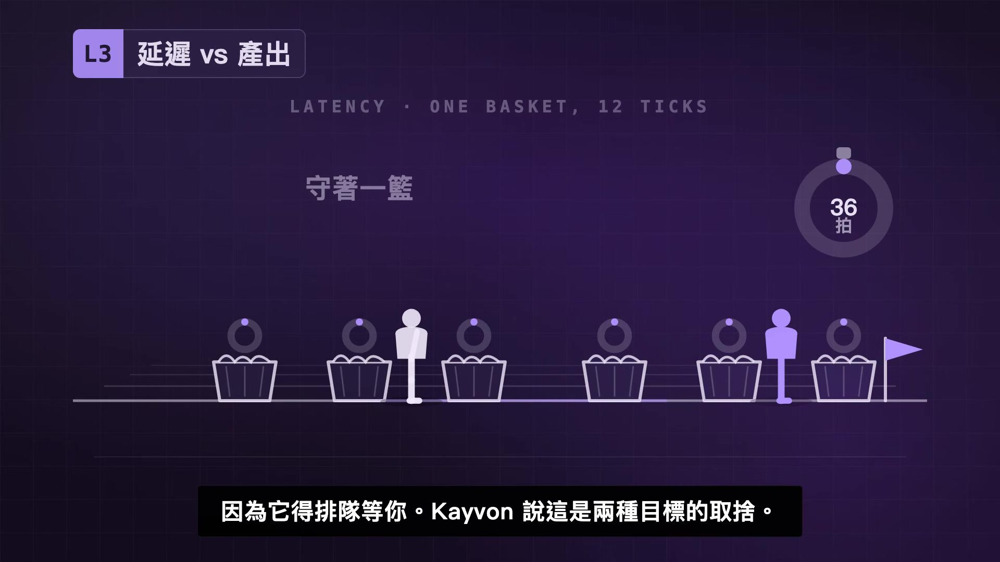

**逐字稿片段：** Cable說這是兩種目標的取捨 一個叫延遲 就是一件事從開始到結束要多久 一個叫產出 就是一段時間裡總共完成幾件事 你想讓某一件最快做完 就守著它 你想讓總量最多 就在等待的時候切去做別的 硬體多執行續旋的是後者 它讓每一件工作慢一點 換整臺機器一直在做事 它還提醒 這門課講處理器快不快 幾乎都是在講產

**話題推測：** 目標取捨：延遲(Latency)與產出(Throughput)

---

## 00:15:47

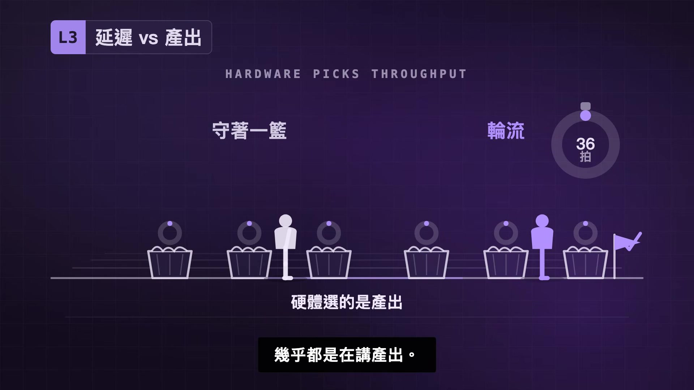

**逐字稿片段：** 那到底要幾條才夠 Cable讓全班一起算 一段程式先算3% 接著等資料12拍 就這樣一直重複 只有一條執行序的時候 大部分時間都在等 利用率只有20% 利用率就是 機器有多少時間 真的在工作 那要幾條才能填滿 你回想一下洗衣機 一欄在洗的時候 你要準備幾欄 手才不會停下來 他給大家20秒討論 有人喊出來 答案是5條 算法是這樣 一條卡住會空出12拍 每一條能補3拍 所以要另外4條來補 加上卡住的那條 一共5條 他接著問 那如果核心能同時記住8條呢 也沒有更快 已經滿了 多出來的只是浪費晶片的空間 再把題目改成先算六拍 答案就變成三條 算的時間跟等的時間 這個比例決定你需要幾題

**話題推測：** 計算：填滿核心所需的執行緒數量

---

## 00:16:31

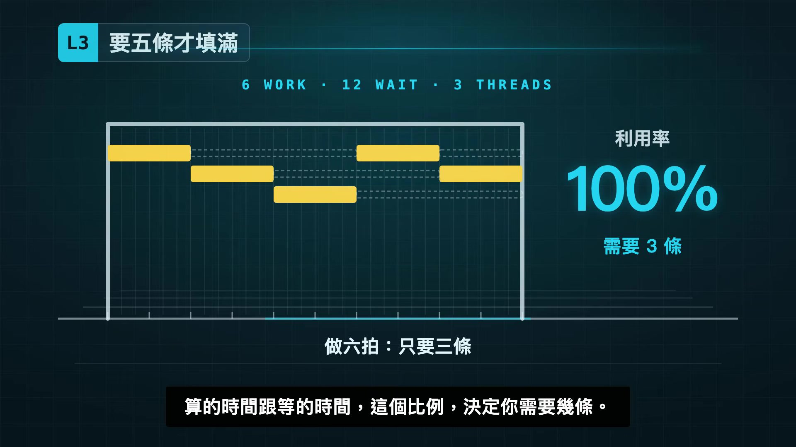

**逐字稿片段：** 講完三個想法 K-Bone把他們放回一顆真的處理器上 學生做作業用的那批機器 每個核心同時記住兩條執行序 Intel把這個叫做超執行序 那同時也是超存量 一拍最多可以把三道指令 送進三組算術單元 每組一次做八個 你會看到一個有趣的現象 只跑一條的時候 常常塞不滿這三組 因為一份工作裡 找不到那麼多互不相干的指令 多開第一條 情況就不一樣了 兩份不同工作的指令 一定互不相干 三組單元比較容易同時塞滿 不過K-1也提醒 多值情緒不一定都是好事 早年超值情緒剛出來的時候 兩條直情緒共用同一張書桌 桌面就那麼大 會把對方的資料擠回車庫 有些程式開了反而變慢 所以當時的電腦還讓你把第二條關掉 現在把三個想法疊在一起 你就會看到 一顆現代晶片有多難為寶 一顆有16個核心的處理器 每個核心同時記住4條直情緒 每條一次處理8筆資料 算術單元只有128個 可是要把等待的時間藏好 你再準備512件互不相干的事情給他 我們回到講臺上 這就像你請來一大群同學 手上卻只有幾張紙 大部分人只能站著

**話題推測：** 現代處理器整合三種硬體設計

---

## 00:17:35

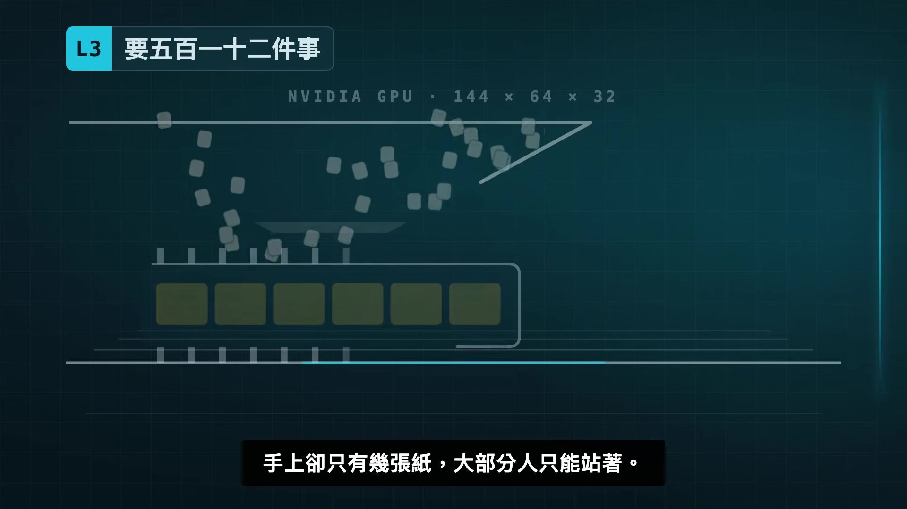

**逐字稿片段：** K文接著把同樣的算法 套到會達的顯示卡上 核心 執行序 每次處理的筆數 全部再乘上去 要把它餵飽 你得準備好幾十萬件獨立的工作 這就是為什麼 一個很小的神經網絡 撈一張很大的顯示卡上 根本跑不快 問題不在卡不夠強 只是你手上根本沒有那麼多事情可以交給你

**話題推測：** 顯示卡案例：餵飽GPU需數十萬獨立工作

---

## 00:17:54

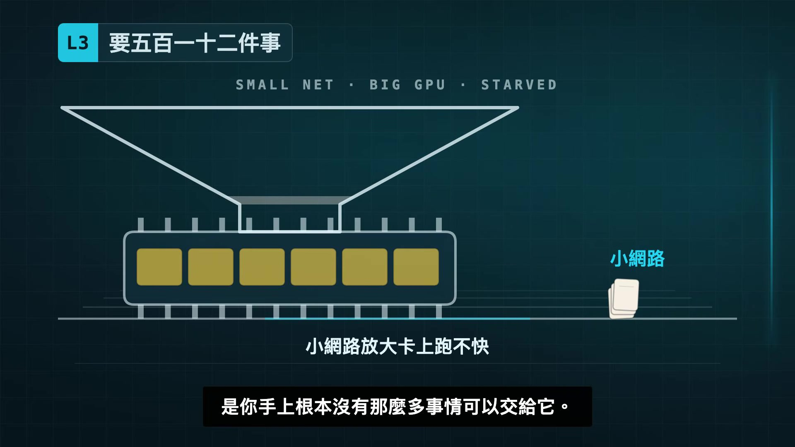

**逐字稿片段：** 就算事情夠多 後面還有一道牆

**話題推測：** 新的瓶頸：記憶體頻寬不足

---

## 00:17:56

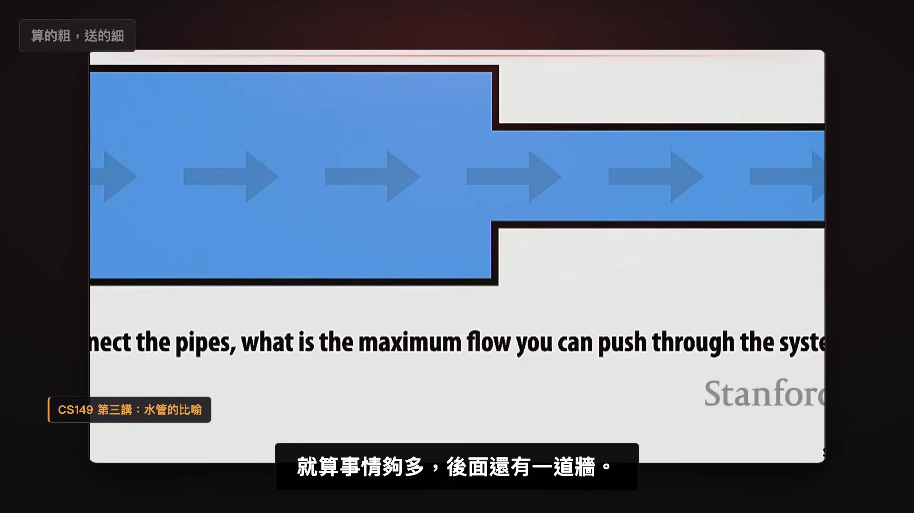

**逐字稿片段：** Cable用水管來比喻 一條每秒能流100公升的出水管 接上一條每秒只能流10公升的細水管 整條管線就只剩10公升 你永遠只能跑在細的那一段 電腦也一樣 算得多快不是重點 資料從車庫送上桌的速度才是

**話題推測：** 頻寬比喻：水管粗細限制水流

---

## 00:18:11

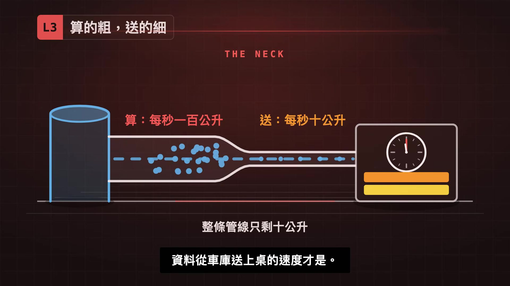

**逐字稿片段：** 他把處理器跟記憶體之間的來往 畫成一張時間圖 處理器算兩下 就要一次資料 再算兩下又要一次 要資料的單子很快就排滿了 處理器這頭大部分時間閒著 他舉了一個最普通的例子 把兩排數字一格一格相加 就是你在任牌寫一個加號 一張現代的顯示卡要把它餵飽 記憶體的每秒送出100兆位元主 可是現在最快的記憶體 大約每秒1兆 算的那條水管 比送資料的那條出了100倍 所以這段最普通的加法 放在一張頂級的顯示卡上 大約只能用到1%的算力 有同學舉手問 那把快取加大呢 KBONG說 書桌再大 也要你會回頭用桌上的東西才有用 這段程式每個數字只用一次 用完就丟 桌子打也幫不上忙 有人問 事先把資料讀進來 他說就算車庫到書桌一瞬間就到 也沒有用

**話題推測：** 時間圖：處理器等待記憶體資料

---

## 00:19:00

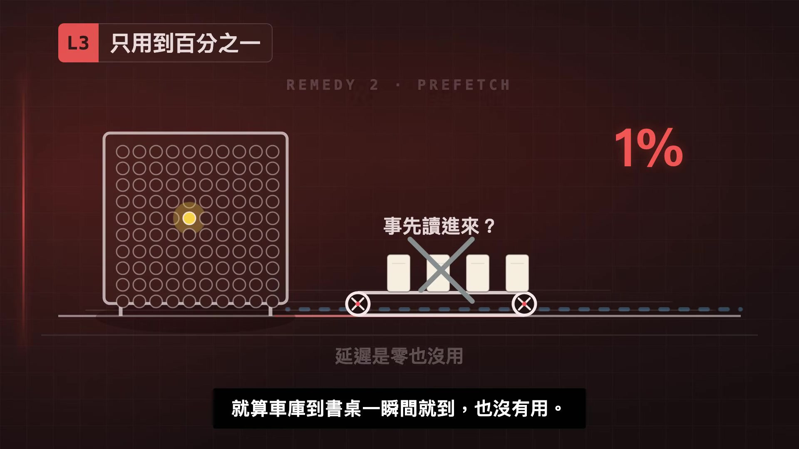

**逐字稿片段：** 因為這不是延遲的問題 是平寬的問題 延遲是送一趟要多久 平寬是一次能送多少 你不是在等水來 你是想從一條每秒一兆的水管裡 擠出每秒一百兆的水 碰到這種情況 除了改寫程式 或者等下一代記憶體 沒有別的辦法 而且記憶體大約十年才大躍進一次 算力卻一路往前跑 這道落差只會越拉越大

**話題推測：** 區分：延遲(Latency)與頻寬(Bandwidth)

---

## 00:19:21

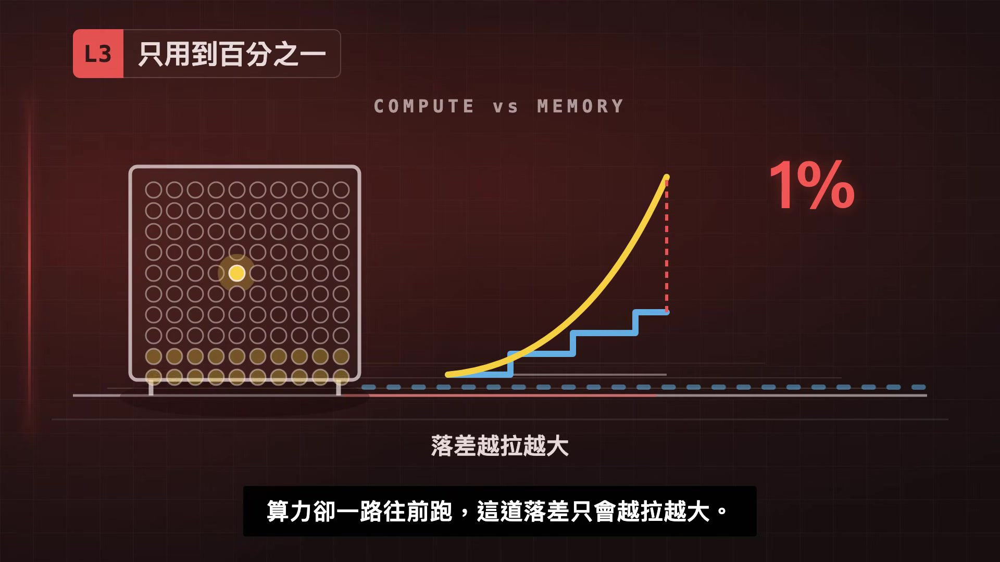

**逐字稿片段：** 改寫程式要改的是一個比例 這個比例叫算術強度 他的意思是 每從車庫搬一個位元組上桌 你要在他身上做幾次運算 剛才那個相加算術強度非常低 搬12個位元組只做一次加法 有同學問 那晶片為什麼要塞那麼多算術單元 可以幫我說 因為他本來就不是為了這種相加設計的 如果你這輩子只做相加 9乘9的算術單元都可以拿掉 幸好畫面和機器學習的運算不一樣 他們每搬一個位元組 大概能做10到20次運算 剛好配得上現代晶片

**話題推測：** 關鍵比例：算術強度(Arithmetic Intensity)

---

## 00:19:50

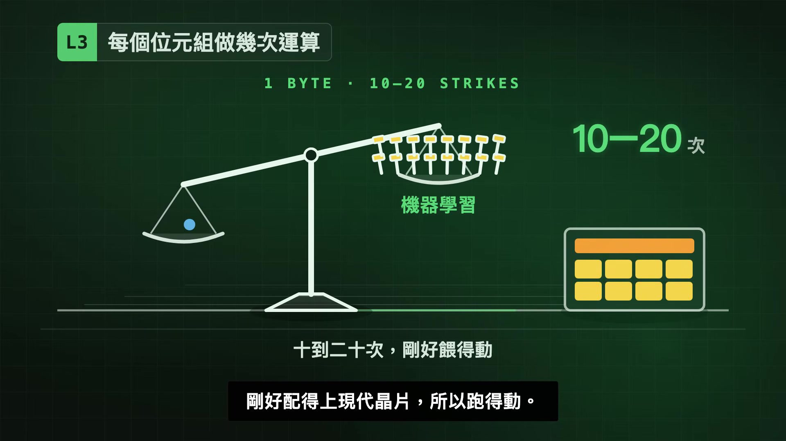

**逐字稿片段：** 所以跑得動 他還講了晶片設計師做事的順序 不是先決定放多少算術單元 而是先算 我負擔得起多少平寬 再依照要跑的東西 決定放多少算術單元 你在這門課寫的每一支程式 幾乎都在跟這個比例搏鬥 想辦法讓每個班上桌的位元組 被多用幾次

**話題推測：** 晶片設計師的工作順序：先算頻寬再配單元

---

## 00:20:08

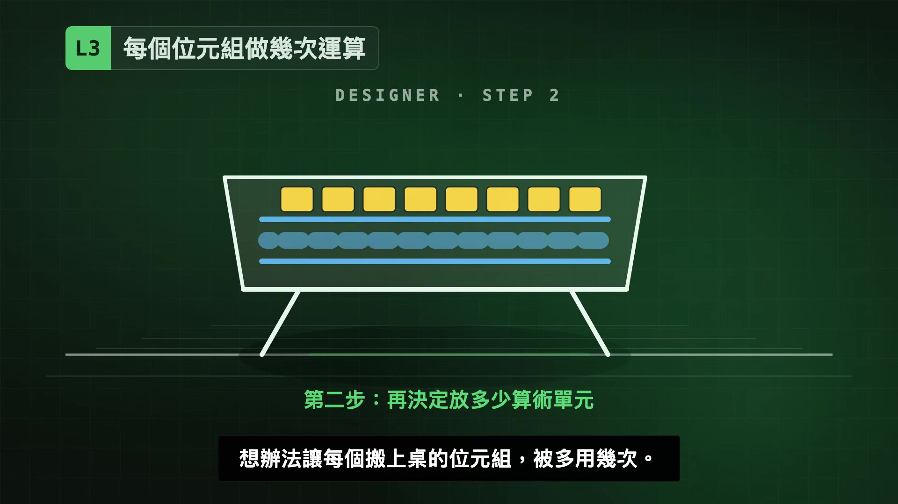

**逐字稿片段：** 有了硬體的全貌 K1才開始教怎麼寫 第一份作業用的程式語言 叫ISPC 是Intel做的一個很小眾的語言 他自己也說 網路上幾乎找不到討論 用過的人大概就是歷年修正門課的學生 再加上一兩百個 想把Intel處理器用到極限的工程師 選他的理由是 他非常貼近硬體前面講的觀念 會直接擺在你面前

**話題推測：** 程式語言：ISPC (Intel SPMD Program Compiler)

---

## 00:20:29

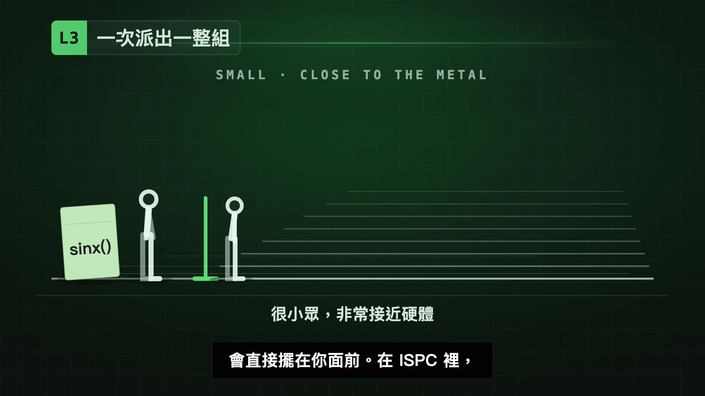

**逐字稿片段：** 在ISPC裡 你叫程式去做一件事 出發的不是一條直行序 而是一整組程式實例同時出發 這一組叫做一個gang 實例你可以想成 講臺上的一個同學一個gang 就是老師一次叫一整排上臺 每個實例都知道自己是第幾號 也知道這組總共幾個人 然後照自己的號碼 去拿屬於自己的那幾張紙 一組的人數 通常跟SIMD一樣寬 8個 這組實力其實就跑在那8個算術單元上 K1特別講了這個語言的一個設計 他刻意不用執行序這個詞 因為執行序會讓你想到 作業系統在排班 在切換 而這8個實力根本不是這樣懂的 他們是同一個控制器底下 一起動手的8個算術單元 這又回到那個分別程式的意思 跟他實際的做法

**話題推測：** ISPC核心概念：Gang (一組程式實例同時出發)

---

## 00:21:09

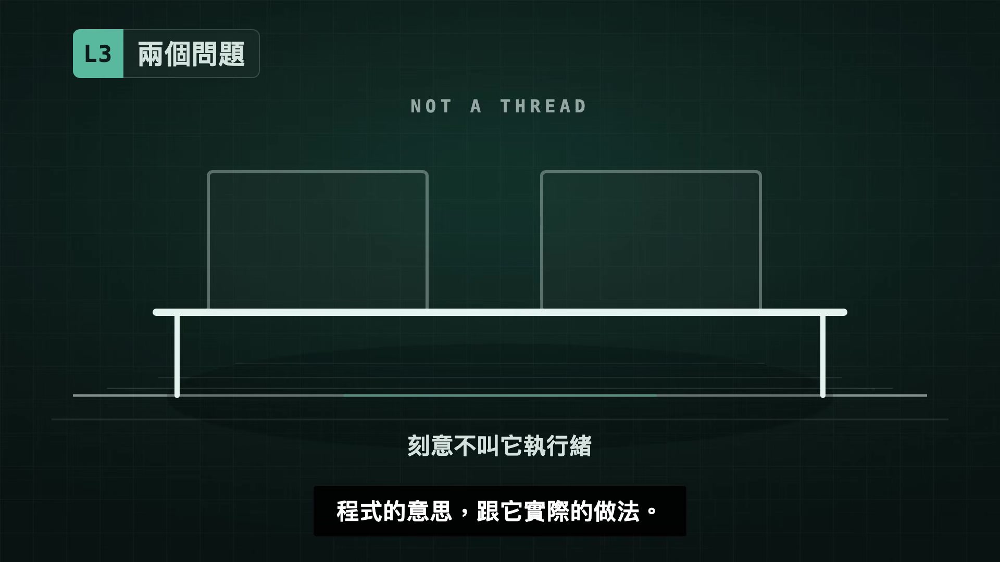

**逐字稿片段：** 他說你讀一段ISPC程式 要先問自己兩個問題 第一 這段程式應該算出什麼答案 第二 機器上的每一個部分 在某個時刻 實際在做哪一份工作 很多學生來問問題 卡住的原因 都是把這兩題混在一起了 就像講臺上那個遊戲 你先確定總和是106 再去看誰在什麼時候 加了哪幾張 他也提醒 作業是在真實的機器上跑 多核心SIMD多執行序 超存量四件事同時在作用 數字對不上 通常不是觀念錯了 是幾個效果疊在一起 只要怎麼說 出哪些事能同時做之後 下一個問題是 工作要怎麼分給這些執行序

**話題推測：** 理解ISPC的兩個問題：答案與實際做法

---

## 00:21:43

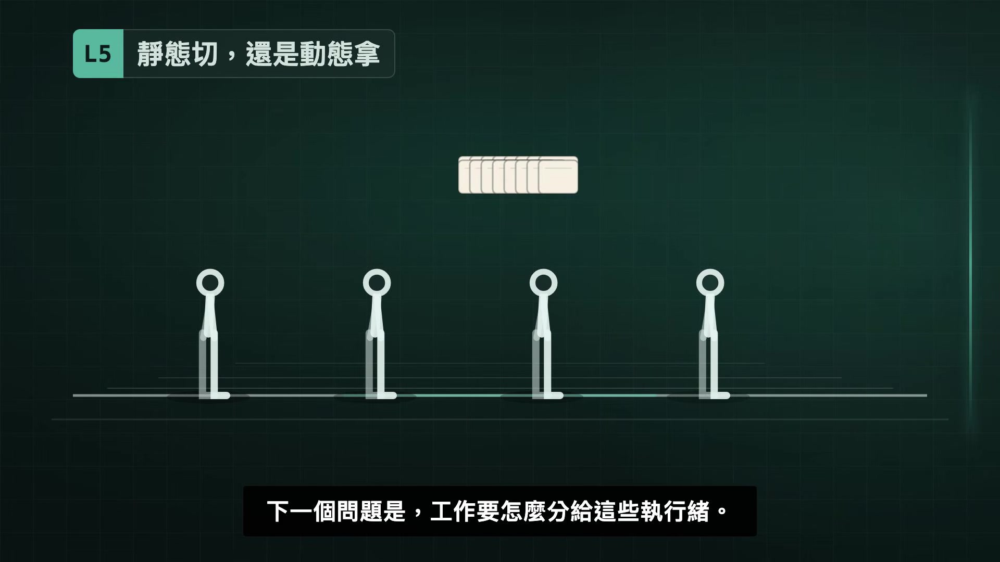

**逐字稿片段：** 最簡單的做法叫靜態分配 事先把數字切成一樣長的幾段 每條執行區各拿一段 好處是完全不用協調 每個人一開始就知道自己要做什麼 Cable用一個程式當例子 判斷一個數字是不是指數 指數就是除了1和他自己 沒有別的數能整除它 問題是判斷指數花的時間差很多 數字越大算越久 你切平均的只是數字的個數 不是工作量 最後還是有人很早就做完 在旁邊等 這就是開場那四位同學碰到的事 只是換成了程式

**話題推測：** 工作分配策略：靜態分配(Static Allocation)

---

## 00:22:10

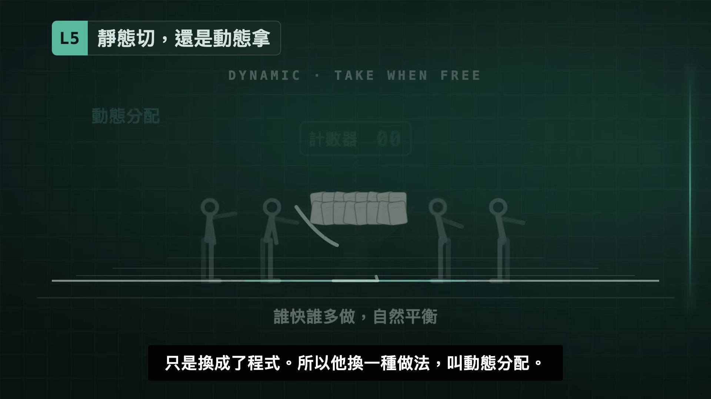

**逐字稿片段：** 所以他換一種做法 叫動態分配 所有工作排成一條隊 誰做完手上那份 就回來拿下一份 誰快誰多做 就像把整碟紙放在講臺上 誰加完就上來再拿一張 在城市裡 這條隊可以簡單到 只是一個共用的計數器 誰要拿工作 就把數字加一 拿到的號碼就是下一份

**話題推測：** 工作分配策略：動態分配(Dynamic Allocation)

---

## 00:22:27

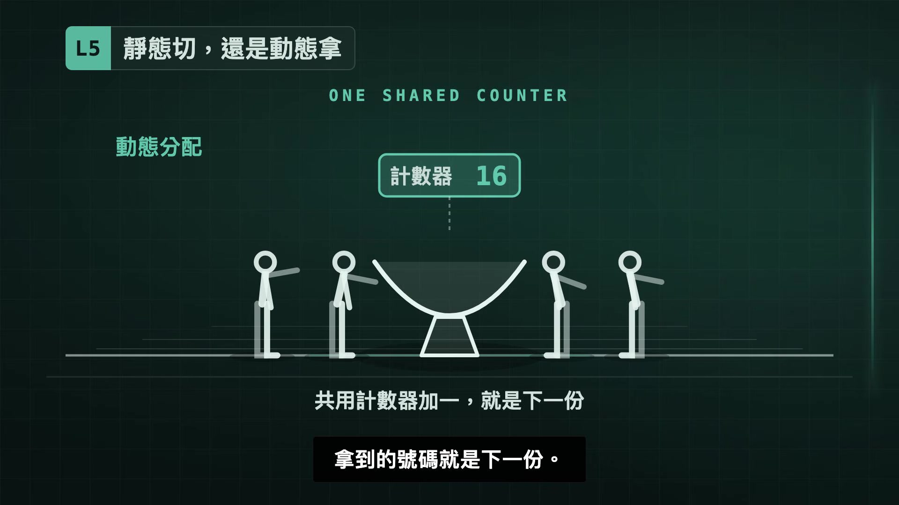

**逐字稿片段：** 動態分配也有代價 那個共用的計數器需要一把鎖 鎖的意思是 同一時間只准一個人去動它 免得兩條執行去拿到同一份工作 就像講臺上那碟紙 一次只准一個人伸手去拿 其他人的排隊 Cable讓大家看計時 整支程式跑了5.9秒 他說 如果幾乎所有時間都在判斷指數 那就沒什麼好改的 可是如果真正在算的只有兩秒半 代表一半以上的時間 都花在排隊搶那把鎖 解法是一次多拿幾份 把每次拿一份 改成每次拿兩份 搶鎖的次數就少一半

**話題推測：** 動態分配代價：搶鎖(Lock)耗時

---

## 00:22:59

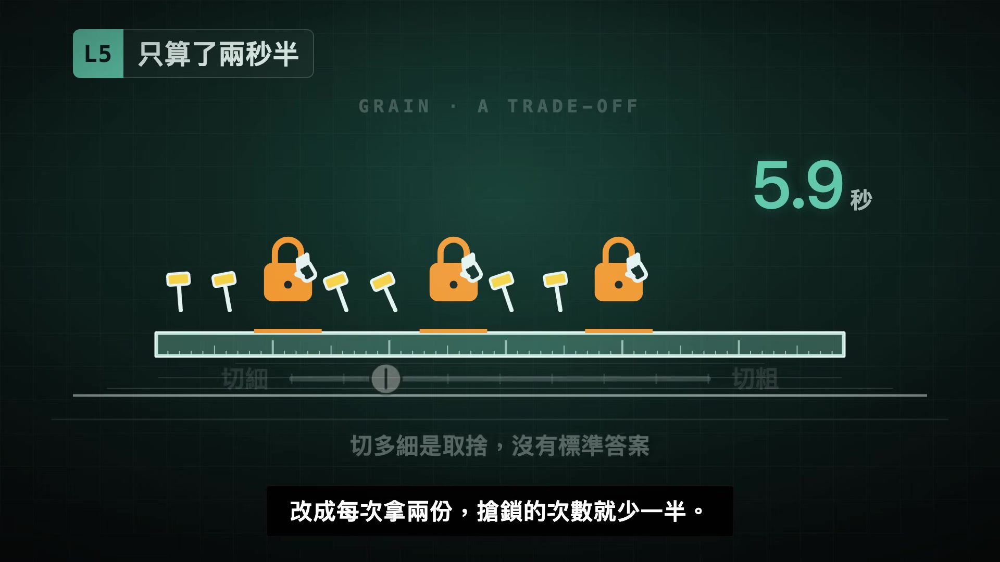

**逐字稿片段：** 這裡有一個取捨 工作切得越細 越容易分得平均 但是排隊拿工作的次數越多 切得越粗 排隊少了 卻容易有人抱走一大塊 拖住所有人 這沒有標準答案 K-BON自己的習慣 是把每次拿幾份 寫成一個參數 交作業錢再慢慢調 就算用了動態分配還是可能卡在最後那一段 長尾就是大家都做完了 只剩一件拖在後面 K幫畫了一張圖 16份工作 他刻意讓最後一份特別大 動態分配照順序往下發 偏偏最大的排在最後 等某條資訊去拿到他的時候其他人早就做完了 大家只能一起等他 就像講臺上那四位同學 偏偏最後的一疊紙最後才發下去 如果你事先知道每份工作的大小 有一個很簡單的改法 先發最大的 最大的那份一開始就被拿走 後面再用小的去補空檔 最後大家幾乎同時收工

**話題推測：** 動態分配取捨：工作粒度大小

---

## 00:23:49

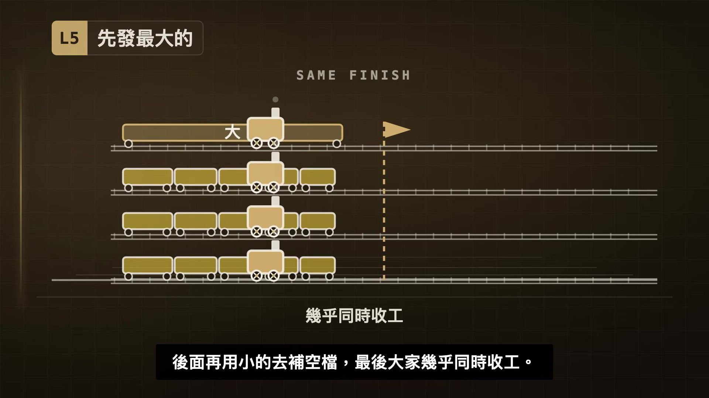

**逐字稿片段：** 他還提了一個進階做法 不要讓所有人擠同一疊紙 每個人各自一疊 自己的作業 就去別人那裡偷一份來做 這跟開場那四位同學是同一個教訓 差別在於 這次你有辦法事先處理它 還有一種平行 長得不太一樣 它不是一開始就擺在那裡的 K-BON用快速排序當例子 排序就是把一堆數字從小排到大 他用的是其中跑得很快的一種 你先挑一個基準值 比他小的放左邊 比他大的放右邊 然後左右兩邊各自再排一次 例如你再整理一疊考卷 先抽一張60分的 比它低的放左邊 高的放右邊 兩疊再各自往下分 一開始只有兩件事可以同時做 左邊跟右邊 但是每一邊又會再分成兩邊 一層一層往下 能同時做的是越來越多 最後多到可以塞滿整臺機器

**話題推測：** 長尾問題解決方案：工作竊取(Work Stealing)

---

## 00:24:32

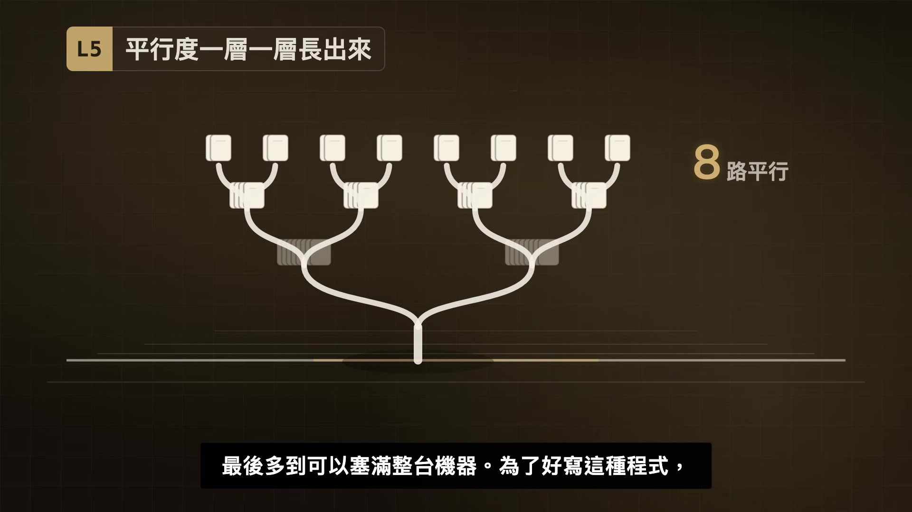

**逐字稿片段：** 為了好寫這種程式 有一套工具叫Silk 現在大部分C++的編譯器都支援 它只加了兩個關鍵字 Spawn的意思是交出去 不用等它你繼續往下走 Sync的意思是 派出去的都做完了 它可以繼續 K1提醒 先弄懂這兩個字的意思 別急著想他們底下怎麼做出來 Kevin後來把重點從分工移到通訊 你還記得開場那張紙條嗎 很多時候真正的成本不在 算在同學之間要傳的那些東西

**話題推測：** 遞迴平行化工具：Silk (spawn與sync)

---

## 00:24:58

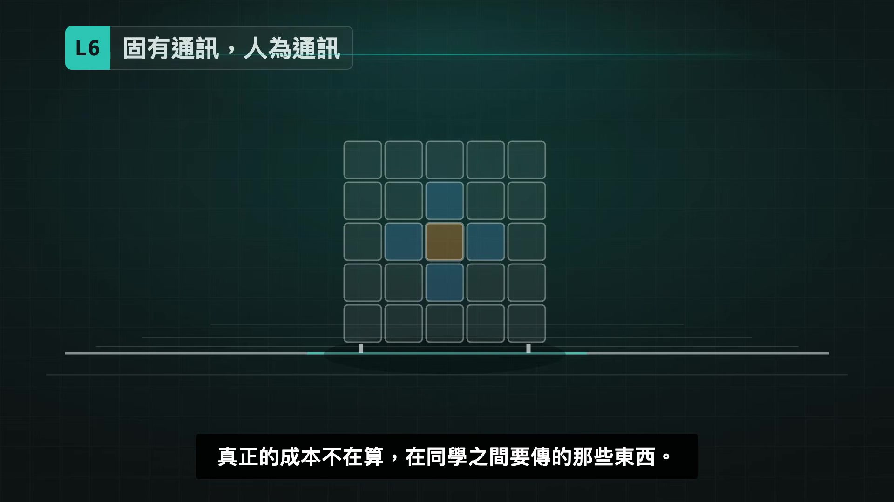

**逐字稿片段：** 他把通訊分成兩種 第一種叫固有通訊 是題目本身就需要的 例如你要算這一格 就一定得知道隔壁那格的值 這種躲不掉 第二種叫人為通訊 是你的寫法多製造出來的 例如資料擺放的不好 你只想拿一個數字 卻得從車庫搬回一整條 64位元主的快取行 其他60幾個位元組根本用不到 有例如兩條執行區各改各的數字 偏偏這兩個數字擠在同一條快取行裡 硬體為了讓兩邊看到的一樣 只好讓那一整排在兩個核心之間來回搬 就像兩個人搶同一張紙條 前一種你只能接受 後一種你可以重新安排資料和工作的順序 把它消掉

**話題推測：** 通訊分類：固有通訊與人為通訊

---

## 00:25:33

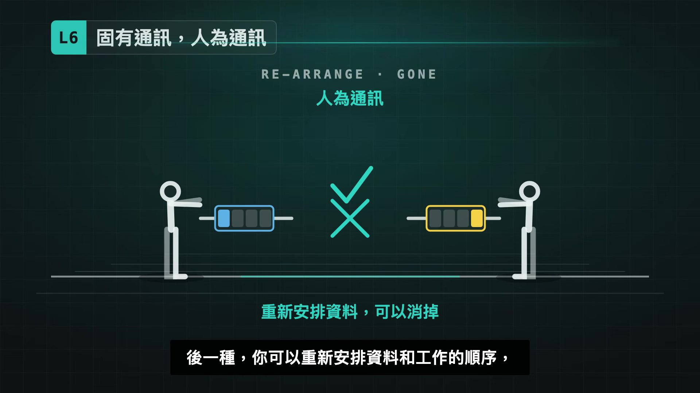

**逐字稿片段：** 我們回頭看這一集 你會發現每一個想法都是在處理搬東西 多核心要成立 工作之間就不能傳太多紙條 SIMD要有效率 八筆資料的走同一條路 快取是為了讓資料少跑幾趟車庫 多值行驅是在等資料的時候 像等洗衣機一樣 先去做別的事 工作分配 是為了讓沒有人站在臺上乾等 而最後那道平寬的牆告訴你 就算前面每件事都做對了 只要每班一個位元主做的運算不夠多 整臺機器還是隻能用到1%

**話題推測：** 總結：所有優化都為處理「搬東西」

---

## 00:26:03

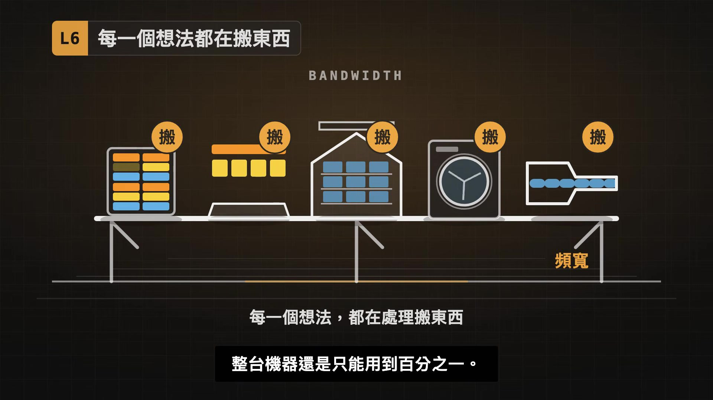

**逐字稿片段：** K-1在第一堂課說過 這門課要教你兩件事 第一件是看到問題就想 怎麼分成可以同時做的部分 以及他們之間怎麼配合 第二件是讓你知道硬體裡實際在發生什麼 因為不知道引擎怎麼轉 你就不可能讓它跑快 穿兩者的就是開場那句話 真正決定成敗的是通訊和搬東西 現在它不只是一句口號 是你算得出來的結論

**話題推測：** 課程目標：分工合作與理解硬體運作

---

## 00:26:24

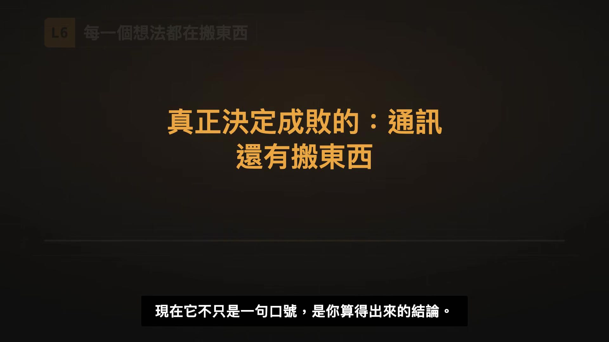

**逐字稿片段：** 我們回到開場那兩位同學 他們各自加完八個數字只花了21秒 剩下的20秒都花在把一張紙條從教室這頭送到那頭 這集我們從那張紙條出發 一路看到晶片上128個算數單元在等資料 看到一條每秒一兆的水管 恨不起每秒100兆的需求 說到底硬體給你的算力很多 用不用得上要看你怎麼安排資料

**話題推測：** 回顧開場實驗：紙條傳遞的低效率

---

## 00:26:44

**逐字稿片段：** 下一集我們會進到繪圖處理器 一顆晶片上幾萬個算術單元 要你準備好幾十萬件工作才為得保 最後問你一個問題 如果你手上有一段程式 在多核心的機器上跑不快 你覺得它卡在算還是卡在搬 留言跟我分享 喜歡這種把公開課講清楚的內容 也可以訂閱AI Notebook 我是Jim 我們下次見

**話題推測：** 下集預告：繪圖處理器(GPU)

---
