# jimainotebook_ECDoHDwhsjM — 關鍵畫面索引

- 來源逐字稿：[jimainotebook_ECDoHDwhsjM_FIN.srt](jimainotebook_ECDoHDwhsjM_FIN.srt)
- 影片：https://www.youtube.com/watch?v=ECDoHDwhsjM
- 截圖數：49

## 00:00:06

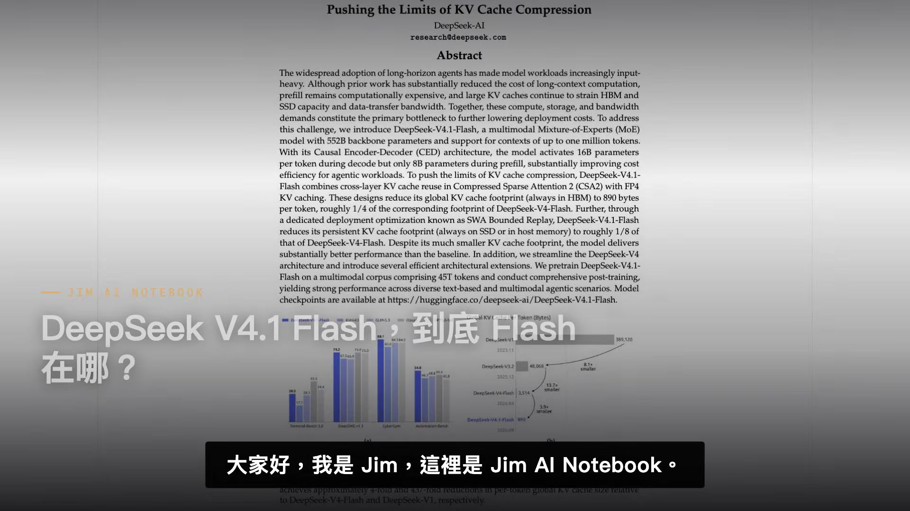

**逐字稿片段：** 今天來聊DeepSeek V4.1 Flash, 看到Flash這個名字, 你可能跟我一樣, 第一個想到的就是快, 回復比較快, 等待時間比較短, 或者是一個便宜一點能力也稍微弱一點的版本, 但看完這份技術報告, 我覺得最值得聊的, 是他怎麼處理越來越長的內容, 你如果用過Coding Agent, 應該很熟悉這個過程, 叫他改一個功能, 他先讀程式碼, 再看文件, 跑完測試, 還要把錯誤訊息讀回來, 事情還沒做完, 對話裡已經塞了一大堆東西, 他還沒做完, 對話裡已經塞了一大堆東西, 他還沒做完, 對話裡已經塞了一大堆東西 這些內容模型都得處理 而且下一步還可能再用到 任務做得越久 背後的負擔就越重 v4.1 Flash花了很大力氣 把這部分的成本壓下來 按照官方公佈的數字 它的全局KB Cache 大約只剩上一代的四分之一 在幾項程式開發和自動化測試裡 成績也已經接近旗艦模型 所以今天我們就來看 它到底省了什麼 又為了省下這些成本 改了哪些地方 我們先從最實際的問題開始 便宜 大家當然喜歡 但前提是事情要做得完 以前講到flash這類模型 常見的用法是把比較簡單的工作交給他 分類 整理格式 回答短問題 遇到難題 再換能力更強 價格更高的模型 LIFO等於flash 這個分工沒那麼容易劃清楚

**話題推測：** 介紹主講模型DeepSeek V4.1 Flash

---

## 00:01:18

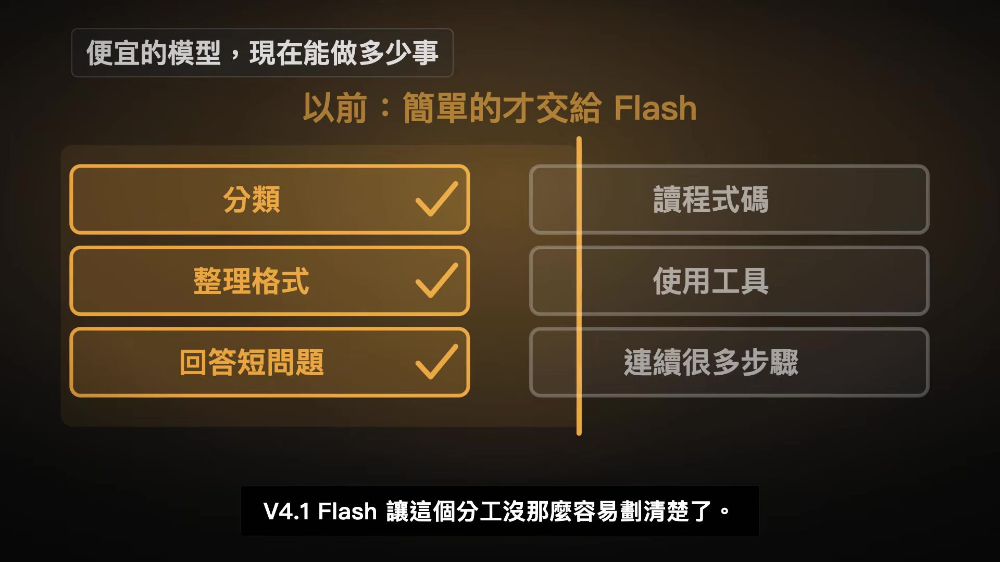

**逐字稿片段：** 從官方的測試來看 一些需要堵城市馬 使用工具 連續執行很多步驟的工作 他已經有相當好的表現 如果你平常跑的任務 剛好落在這個範圍 選模型時就會多想一下 我還需要每一步都用最貴的那個嗎 不過這不代表旗艦已經沒有用途 官方目前的定價業仍然保留Visual Pro 也顯明會繼續提供API服務 光看產品安排 還不能下結論說Flash已經全面取代Pro 真正要比較的 還是你交給他的那件事

**話題推測：** 轉向討論官方測試結果，可能展示性能數據圖表

---

## 00:01:47

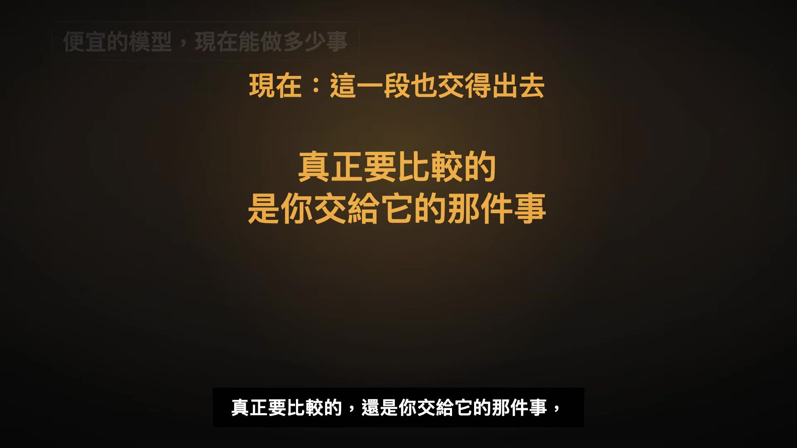

**逐字稿片段：** 他做了什麼 先看成績單 官方把他跟Opus 5、GP Tifa 6、Soul Kimi K3等模型放在一起 表格標示的是各模型最高推理強度的結果 Visual屌與Flash比較亮眼的 是幾項需要實際操作的測試 例如修改真實程式碼的Deep SWE 他的分數略高於Opus 5 Terminal Bench 2.1 就是命令列裡完成任務的測試 它排在這張表的最前面 Automation Bench的自動化任務 表現也很好

**話題推測：** 明確指示查看成績單，預期展示模型性能比較表格

---

## 00:02:13

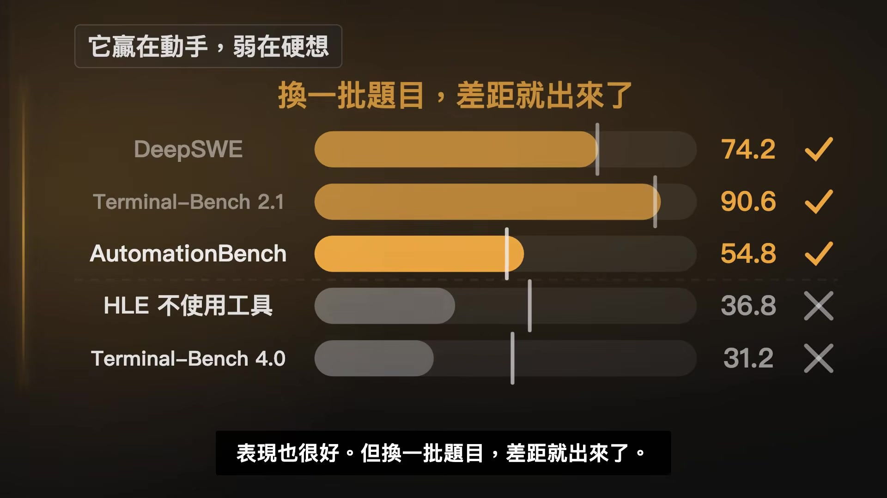

**逐字稿片段：** 但換一批題目 差距就出來了 愛不使用工具的Humanities Last Exam 也就是人類最後測驗裡 VSO.1 Flash是36.8分 Opus I是56.3分 差了將近20分 而且就算同樣是命令列任務 也不能一概而論

**話題推測：** 討論另一批測試題目，可能切換到不同測試結果的圖表

---

## 00:02:30

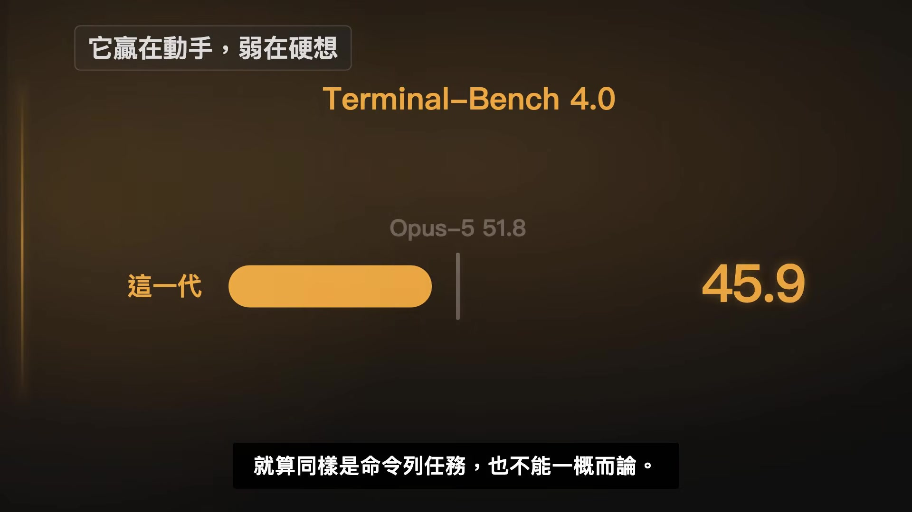

**逐字稿片段：** Terminal Bench 5.1 它領先換到4.0 它是31.2分 Opus I則是51.8分 所以我會說 他已經很擅長某些agent工作 但還不能把這句話擴大成只要能用工具 他就跟最強的模型一樣 測試內容一換 能力上的差異還是看得見 報告裡也有一段

**話題推測：** 提及新的測試Terminal Bench 5.1及其分數，可能更新圖表數據

---

## 00:02:47

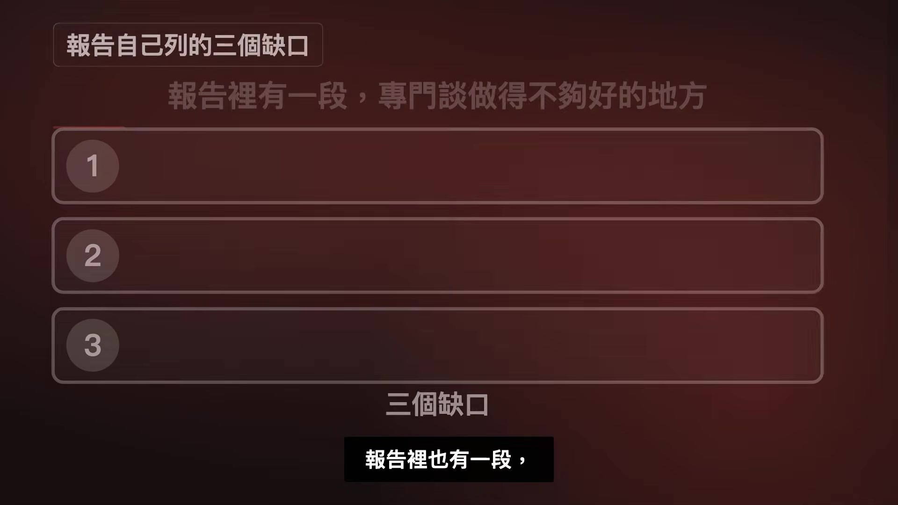

**逐字稿片段：** 專門談他目前還做的不夠好的地方 第一個是科學類的長任務 這些工作往往需要很深的領域知識 而且一路推進 不能中間哪一步想做就整件事跑偏 這部分他跟更大的模型還有距離

**話題推測：** 開始討論模型目前表現不佳的方面，可能展示弱點列表

---

## 00:02:59

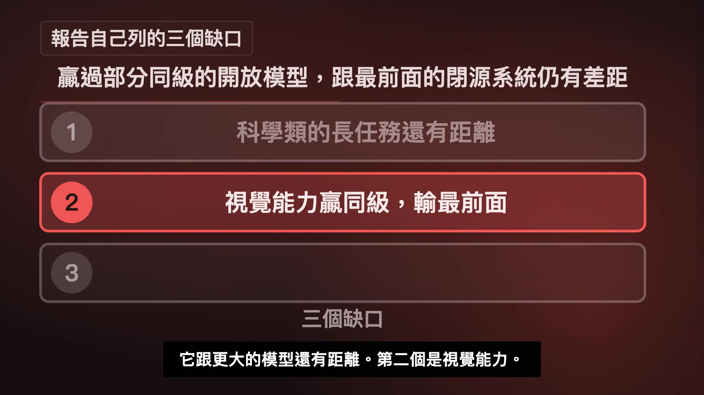

**逐字稿片段：** 第二個是視覺能力 看圖理解圖表 他已經能做 也贏過部分統計的開放模型 但跟最前面的閉元系統相比

**話題推測：** 討論第二個弱點：視覺能力

---

## 00:03:08

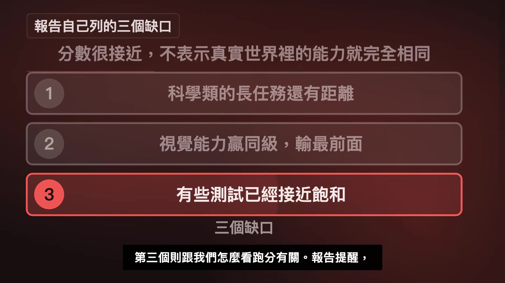

**逐字稿片段：** 第三個則跟我們怎麼看跑分有關 報告提醒 有些測試已經接近飽和 分數很接近 不表示模型在真實世界裡的能力就完全相同 這點其實很實用 你平常交給agent的任務 不會剛好都是排行榜上的題目 他會不會誤解需求走到一半卡住 需要你提醒好幾次 這些都會影響你最後覺得他好不好用

**話題推測：** 討論第三個弱點：如何看待跑分

---

## 00:03:26

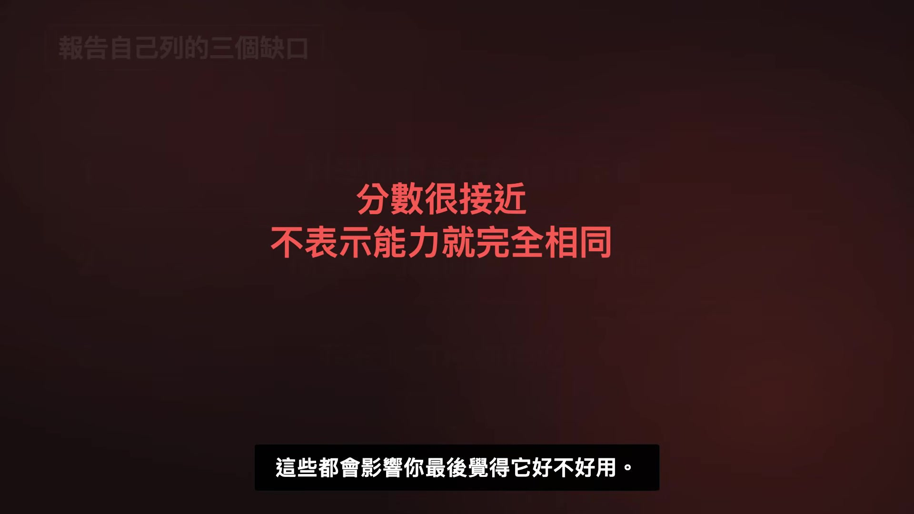

**逐字稿片段：** 接下來架構說明 主要來自DeepSeek自己發佈的技術報告

**話題推測：** 轉向模型架構說明，可能展示架構圖

---

## 00:03:30

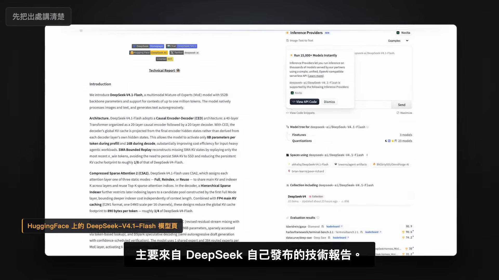

**逐字稿片段：** 它是一份51頁的官方報告 我們會把裡面的測試結果 當成開發團隊提供的證據來看 官方測試有參考價值 但不能直接當成所有結果都已經被第三方重現 後面講到獨立時測試 我會另外說明來源

**話題推測：** 提及51頁官方報告，可能展示報告封面

---

## 00:03:42

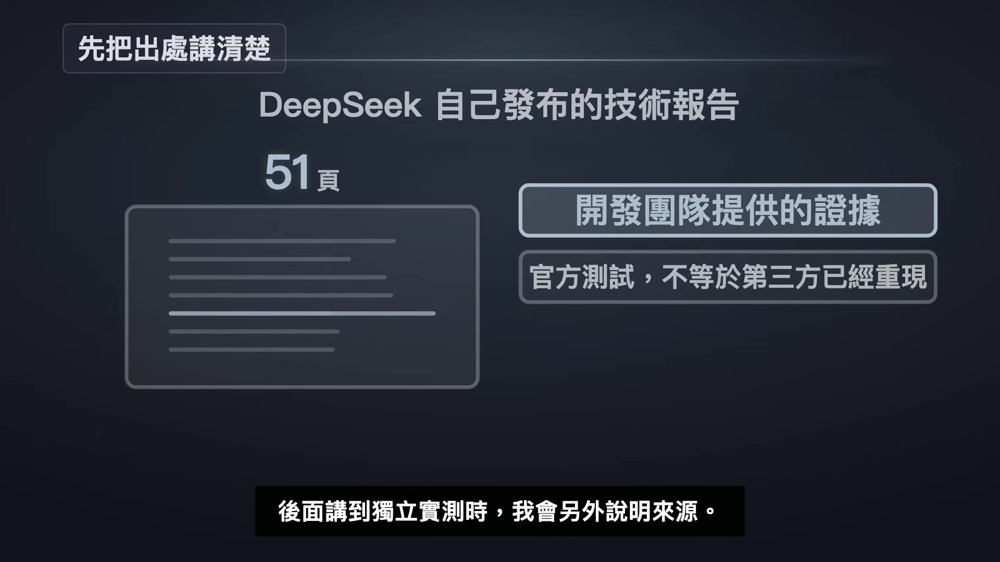

**逐字稿片段：** 這份報告的標題翻成中文 大概是把KVCash的壓縮推到極限 光看標題知道它的重點放在哪裡

**話題推測：** 提及報告標題「把KVCash的壓縮推到極限」，可能展示標題頁

---

## 00:03:49

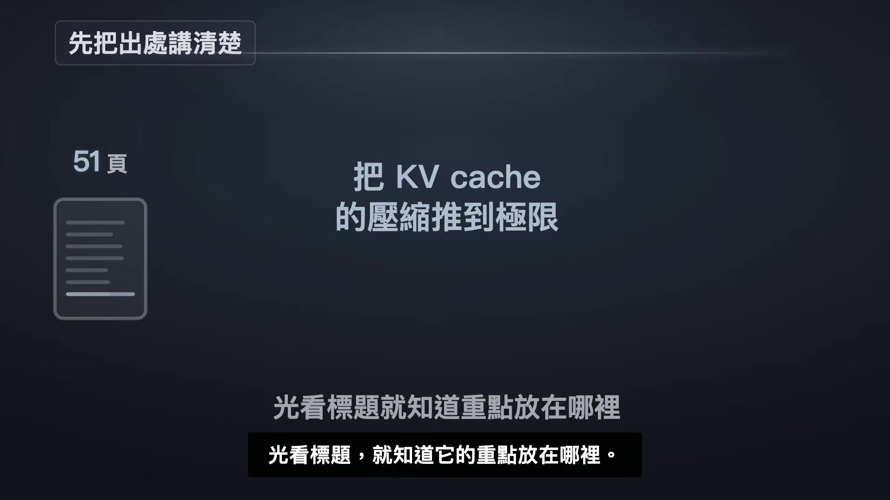

**逐字稿片段：** KVCash是模型處理上下文時保留的一組中間資料 名字現在不用急著記 等一下會分開講 先補一個單位 報告裡的長度和價格用的都是Token 你可以把它理解成模型處理文字的基本單位 但一個Token不一定等於一箇中文字 所以這一代資源的100萬長度 值了是100萬個Token 它還能直接接收圖片 屬於多模態模型 要理解它為什麼省

**話題推測：** 定義KVCash，可能搭配解釋圖示

---

## 00:04:14

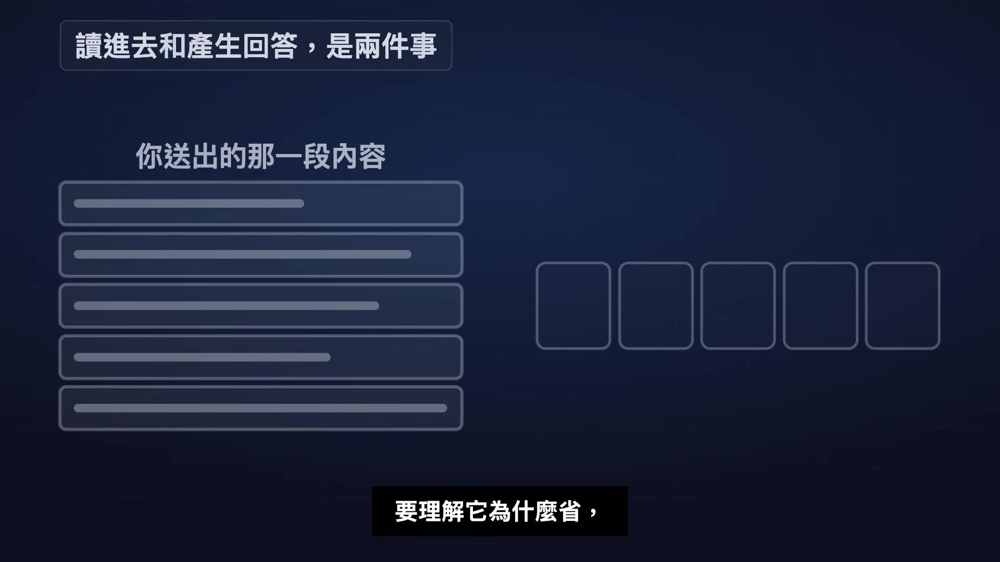

**逐字稿片段：** 先把模型的工作分成兩個階段 你送出一段內容之後 模型會先處理輸入 這個階段叫Prefill 中文通常翻成預填 如果你貼了一份很長的文件 它就得先把這份文件算過一遍 接下來模型才開始逐步產生新的Token 這個階段叫Decode 也就是解碼 你看到回答一段一段出現 主要就是這個過程 兩個階段對硬體的需求不太一樣 預填可以同時處理很多輸入位置 假碼則的 接著前一步的結果 繼續產生下一個Token 對的來說 預填尤其重要 因為它每做一步 可能都會拿到新的資料 檔案內容 搜尋結果 工具回傳 測試記錄 等到下一次呼叫模型 這些東西又會成為輸入的一部分 你最後看到的答案也許只有幾段 中間處理過的內容卻可能非常多 E4.1 Flash的設計 就是很明確地朝這種工作形態去優化

**話題推測：** 將模型工作分為Prefill和Decode兩個階段，可能展示流程圖

---

## 00:04:59

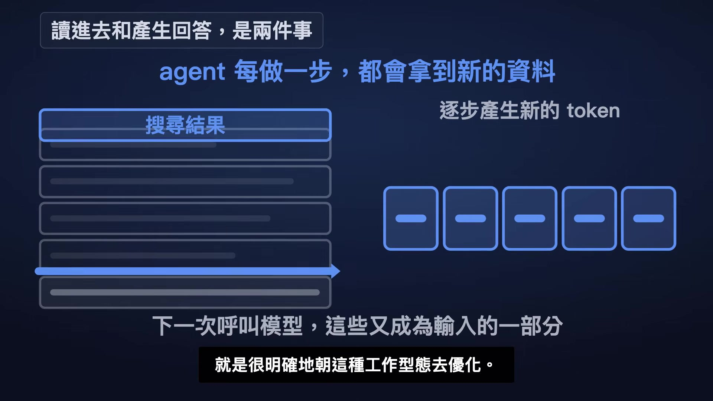

**逐字稿片段：** 這臺模型的主幹有40層 分成前20層和後20層 你可以把一層理解成一個處理階段 資料經過每一層 都會繼續被轉換 最後用來預測下一個Token 這40層裡 有些計算會用到很前面的內容 有些只關注最近的一小段 為了讓後續生成不用反覆重算 系統會把部分中間結果 留在顯示卡記憶體裡 如果希望下次遇到相同的前綴時 也能重用 也可以把快取保存到其他儲存空間 例如主機記憶體或SSD 所以接下來

**話題推測：** 介紹模型的40層主幹結構，可能展示分層圖

---

## 00:05:27

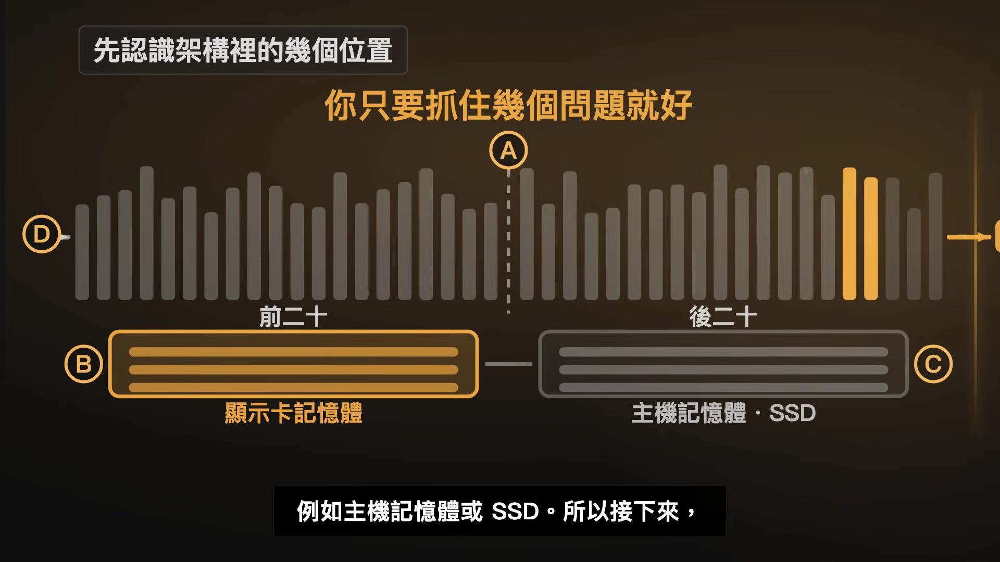

**逐字稿片段：** 你只要抓住幾個問題就好 哪些層一定要算 哪些資料可以共用 每一份要存多大 以及下次還要不要繼續留著 這一代大部分的改動 都能放回這幾個問題來理解 模型產生下一個token時 會透過注意力機制 使用前面內容的資訊 如果前面的中間結果 每次都重新計算 生成檔回答的成本就會很高 因此係統會把注意力機制 需要的key和value保留下來

**話題推測：** 列出接下來要探討的幾個核心問題

---

## 00:05:49

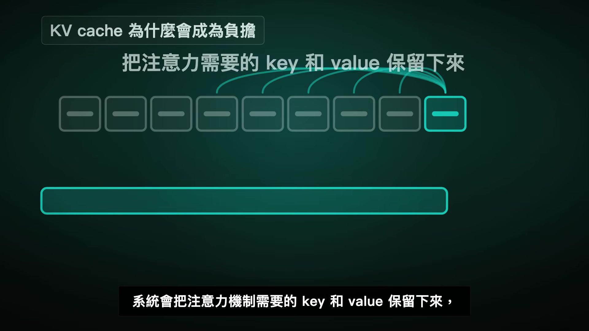

**逐字稿片段：** 叫做KV cache 中文叫見值快取 你可以暫時把它想成 模型讀的內容後留下的筆記 不過它存的是數值表示 並不是一份人看得懂的摘要 這份快取讓模型省下大量重算 但也帶來另一個問題 上下文越長 需要保留的資料通常就越多 如果每一層都留一份 很多個使用者又同時在跑場任務 顯示卡記憶體很快就會吃緊 而且存得下還不夠 生成時還得把需要的資料讀出來 這又牽涉到記憶體頻寬 所以壓縮KB Cache 省到的是儲存空間 也可能減少讀取資料的負擔 這就是它值得花這麼多篇幅處理的原因

**話題推測：** 再次解釋KV Cache，可能搭配圖示說明

---

## 00:06:24

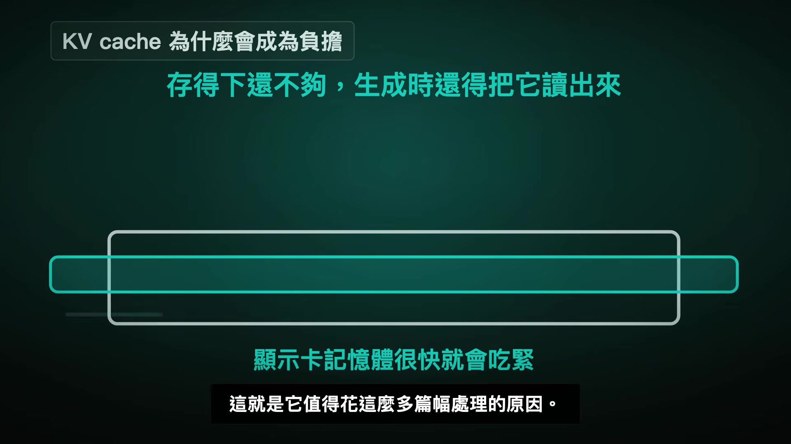

**逐字稿片段：** 第一個改動 是前面提到的20層加20層 E4.E Flash 採用Costal Encoder Decoder 簡稱CED 也就是因果編碼器解碼器架構 報告提到 設計受到UQO研究的啟發 前20層負責處理輸入 後20層需要了全局KBH 則從前半段最後的輸出投影得到 後半段就不用為了建立全局快取 再把整份輸入完整跑一次 這裡的Costal 是說每個位置只能使用自己和前面的資訊 不能看到後面還沒出現的內容 它跟我們平常講的因果推理是兩回事 這個分工帶來的結果是 預填時每個Token

**話題推測：** 介紹第一個改動：20層加20層的結構

---

## 00:07:00

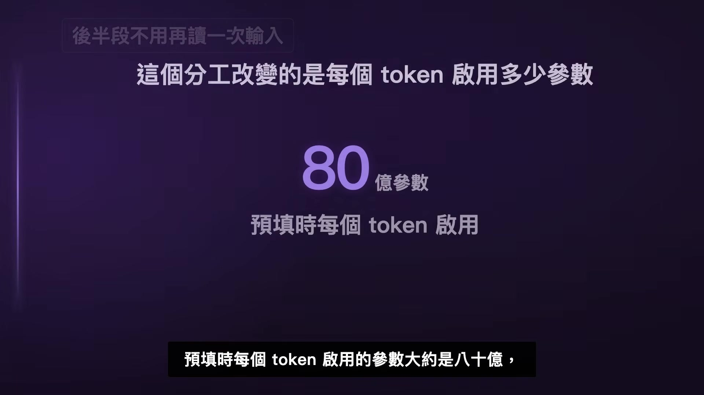

**逐字稿片段：** 啟用的參數大約是80億 到了生成階段 前後40層的銀顏都要參與 啟用參數大約是160億 但後半段也不是完全不用處理輸入 最近那一小段的局部快取 還有需要補算的部分 因此 這裡可以說預填的計算量接近減半 但不能直接換算成 你每次問問題都會快一倍 實際還省多少 要看輸入多長輸出多長 以及系統當時的負債

**話題推測：** 提及預填和生成階段啟用的參數數量（80億/160億）

---

## 00:07:23

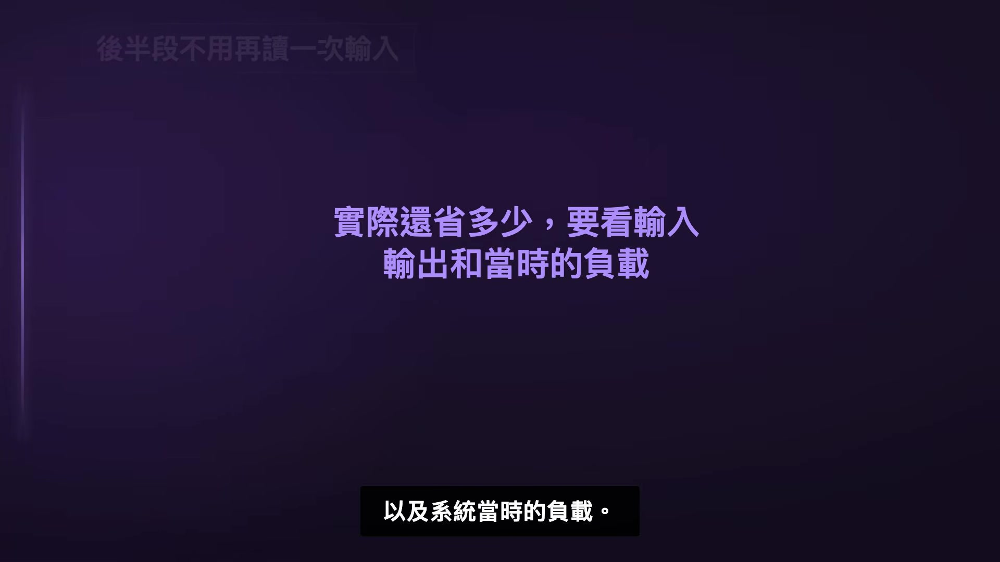

**逐字稿片段：** 第二個改動 事實上不同層共用部分資料 一般來說各層的表示不同 各自保存快取有它的理由 但如果架構和訓練方式配合得好 就不一定每一層都得保留獨立的一份 v4.1 Flash用的是 Compress Sparse Attention Tool 簡稱CSA桶

**話題推測：** 介紹第二個改動：不同層共用部分資料

---

## 00:07:40

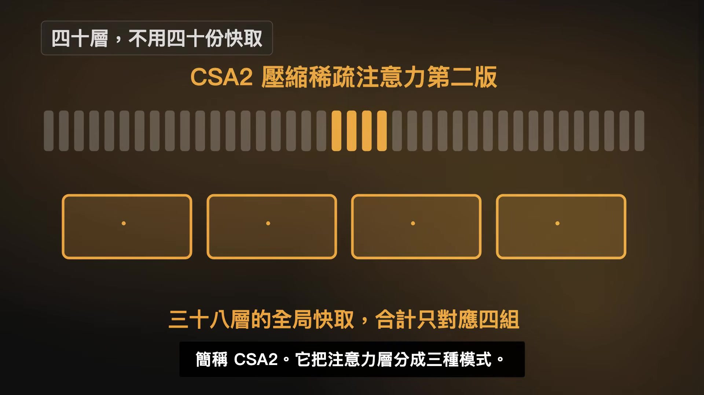

**逐字稿片段：** 它把注意力層分成三種模式 完整模式會建立快取 也會挑出這次要讀取的重點位置 紅條模式沿用前面建立的快取 但重新挑一次位置 沿用模式則連挑選結果都直接共用 差別就在於 這一層究竟需要重新算多少東西 40層裡 最前面兩層只看局部範圍 其餘38層會使用全局資訊 而這38層的全局快取

**話題推測：** 解釋注意力層的三種模式：完整、紅條、沿用模式

---

## 00:08:01

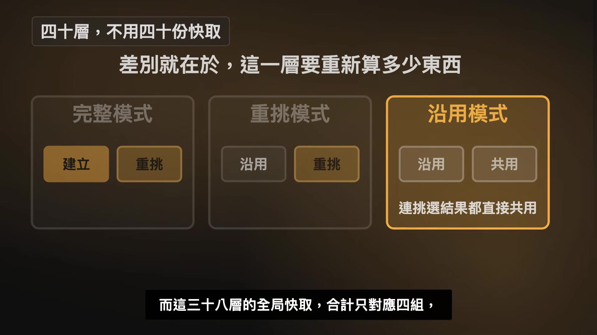

**逐字稿片段：** 筆記只對應四組 前半段三組 後半段一組 這不表示可以直接拿38除以4 就算出相對上一代省了幾倍 因為上一代已經有壓縮設計 各組快取的大小也不一定相同 另外上一代V4 混用了兩種注意力設計 這一代統一成一種 對工程師做來說 統一之後 比較容易把程式和執行效率一起調好 快取可以共用 挑選資料的動作本身也得夠便宜 吸收注意力的概念 是每次只讀取一部分比較相關的內容 但要知道哪些內容相關 還是得先搜尋 如果每一層都把全部位置掃過一遍 上下文一場 光是挑選就會很花時間

**話題推測：** 提及全局快取只對應四組的具體數字

---

## 00:08:35

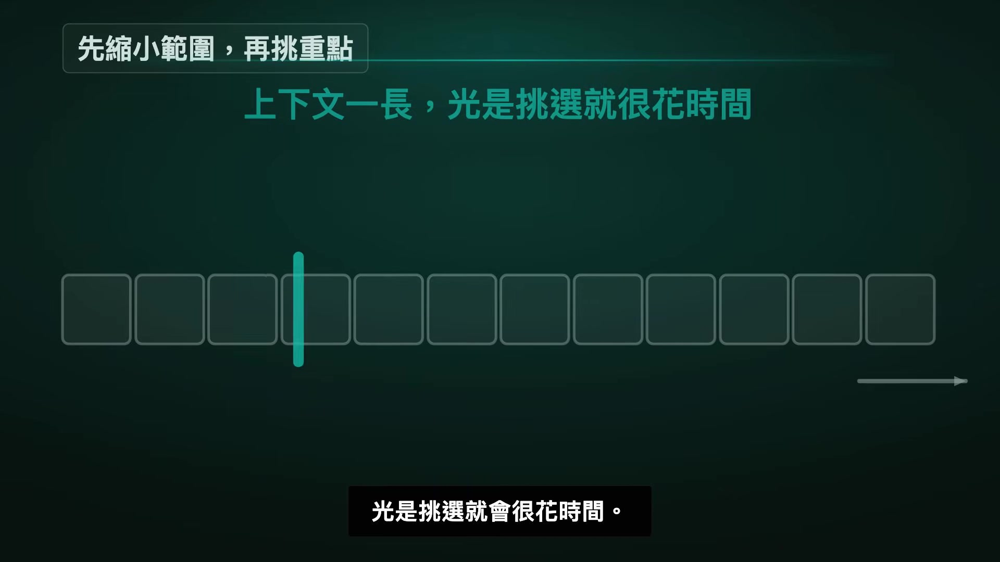

**逐字稿片段：** 他們因此加上分層的索引機制 先由前面負責建立候選集合的層 做一次比較粗的篩選 後續需要重新挑選的層 就從這個候選集合裡繼續找 不必每次都掃完整份上下文 這個做法有點像查一本很厚的書 先確定可能再拿幾個章節 再進去找細節 會比從第一頁一路翻快的多 它的好處是 後續這些索引層要處理的候選數量 可以被限制住 不會隨著上下吻長度一路增加

**話題推測：** 介紹分層索引機制，可能搭配圖示說明搜尋過程

---

## 00:09:01

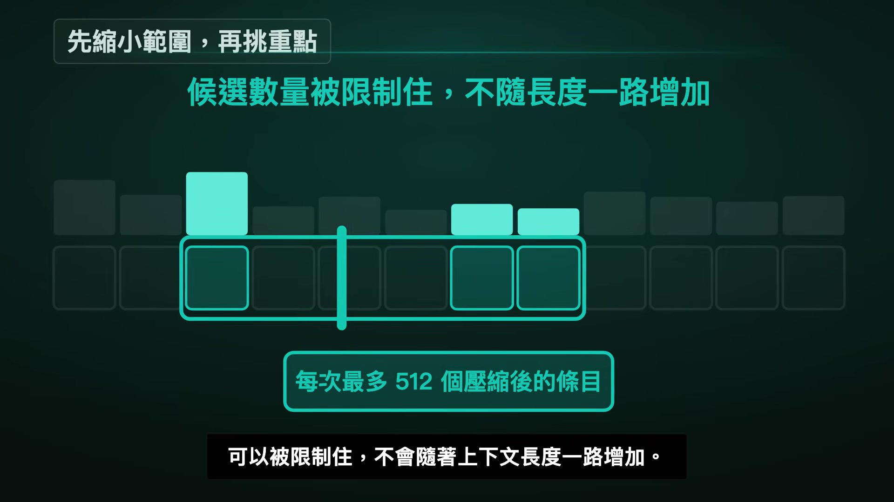

**逐字稿片段：** 不過每次最多挑512個壓縮後的條目 不代表系統只保存512個條目 其他快取還在 下一次查詢可能就會用到 這招主要省的是搜尋和讀取 不然它理解成其他記憶都刪掉了 接下來是量化 也就是用更少的位元存同一組數值 E4.0 Flash把主要的全局KP Cache 從8位元改成4位元格式 這一張數值本身的體積就少了一半 但實際計算時還要加上縮放係數 它的作用是記錄這一組數字的尺度 讓比較粗的數字格式仍然能涵蓋需要的範圍

**話題推測：** 提及每次最多挑選512個壓縮條目的具體數字

---

## 00:09:31

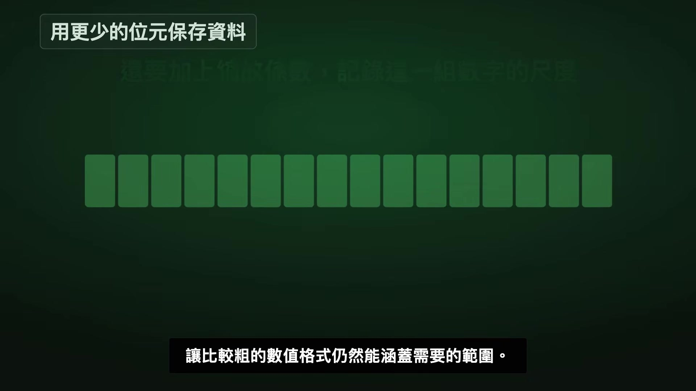

**逐字稿片段：** 這一代的配置是每16個數值 共用一個8位元的縮放係數 攤下來每個數值平均需要4.5個位元 做量化時最怕的就是省了空間 能力也一起掉下去 因此他們在後段訓練就讓模型適應這種格式 這叫量化感知訓練 模型有機會在訓練過程中 學者處理量化帶來的誤差 通常會比最後才突然壓縮更有餘裕 至於比較敏感的局部快取 他們那年保留8位元 按照報告的結果 這套配置造成的能力損失很小 把前面的共享和壓縮加在一起

**話題推測：** 提及量化配置：每16個數值共用一個8位元縮放係數

---

## 00:10:02

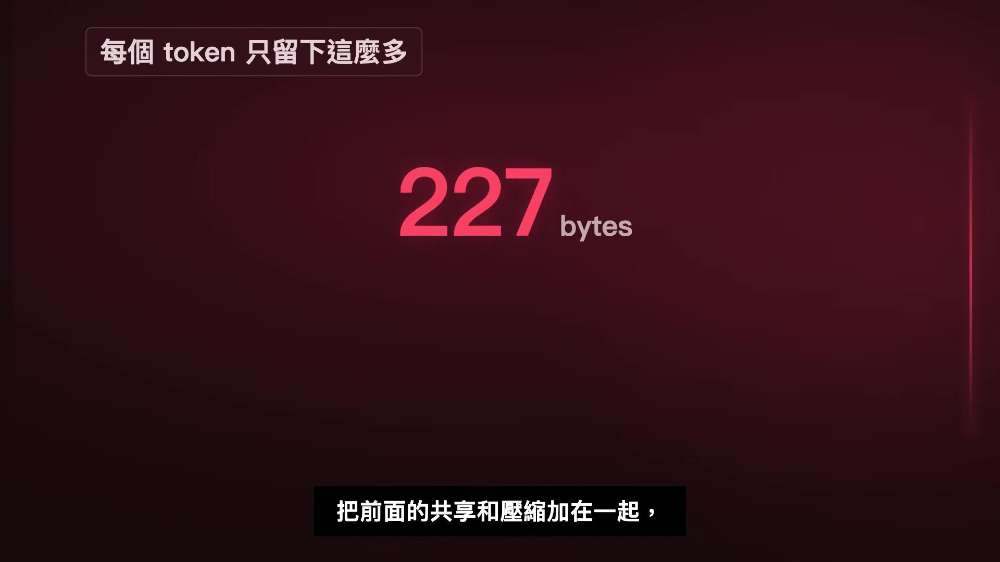

**逐字稿片段：** 就得到這份報告最重要的數字之一 每個Token的根據KV Cash 只需要890個位元主 大約是上一代V4 Flash的四分之一 換成比較容易想象的容量

**話題推測：** 揭示報告中最重要的數字：每個Token的KV Cache所需位元數

---

## 00:10:10

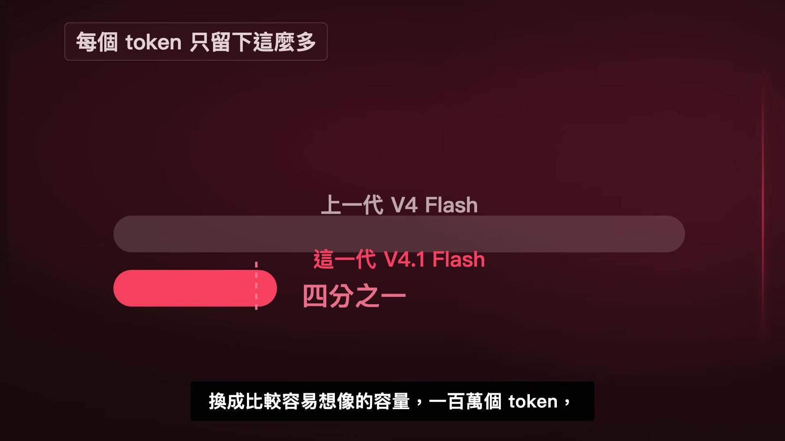

**逐字稿片段：** 100萬個Token 大約對應0.89GB的全局快取 先提醒一下 這只是全局KV Cash 模型權重局部快取 執行時的暫存空間 全部都還要另外算 所以這不代表整臺模型 不到1GB就能跑 它真正影響的是 同樣一批顯示卡 可以留它多少空間 給上上下文 以及同時處理多少個請求 假設瓶頸主要就在 這一部分的快取 容量縮到四分之一 容納的上下文總量 就有機會大幅增加 但整套服務 能不能多接四倍使用者 還要看算力平寬 和加機一體開銷 比較有意思的是

**話題推測：** 將Token容量轉換為更易理解的GB數

---

## 00:10:43

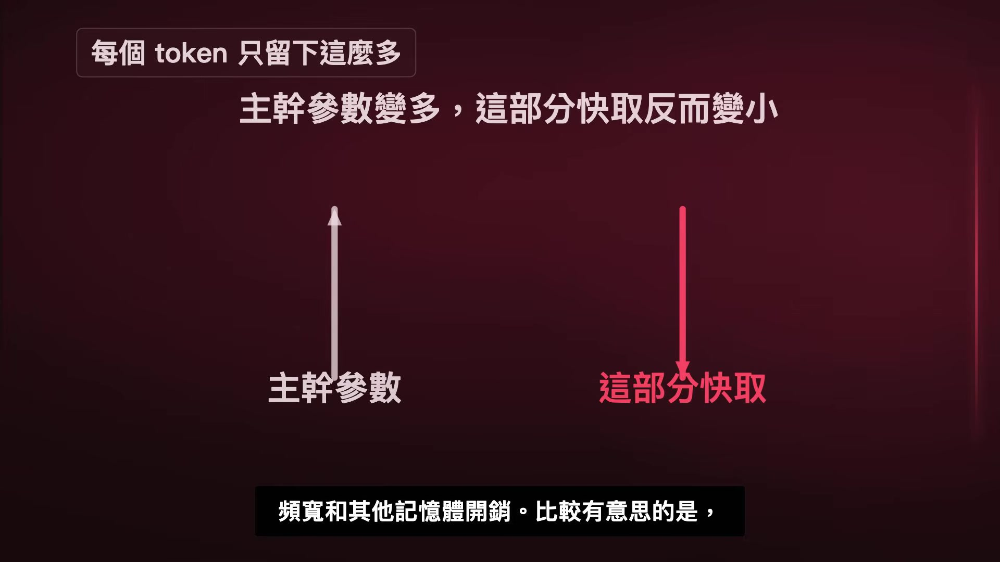

**逐字稿片段：** 這一代的主幹參數 其實變多了 這部分的快取反而變小 模型有多大 跟每次處理場內容有多貴 已經不能只看同一個數字 除了生成當下放在顯示卡上的快取 還有一種成本 是把快取保存下來 請求可以重用 VSO.me Flash在這裡做了一個取捨

**話題推測：** 指出本代模型主幹參數增加的事實

---

## 00:10:59

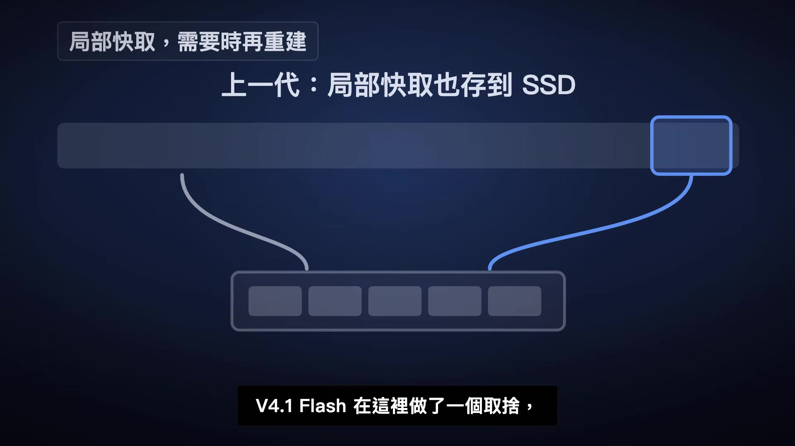

**逐字稿片段：** 局部注意力用到的那份快取 不再長期保存到SSD 需要的時候 再用最近的一小段內容把它重建出來 因為局部注意力只看附近的內容 太前面的資料 不會直接參與這一層的局部計算 所以重建不必從整份文件的開頭開始 但多層疊起來影響範圍還是會往前延伸 按照報告的設定 要完整還原 會涉及20層乘上128個Token 也就是約2560個Token的範圍 他們實際採用的是隻重跑最近的一個窗口 接收一點近似誤差

**話題推測：** 說明局部注意力快取不再長期保存到SSD的設計決策

---

## 00:11:30

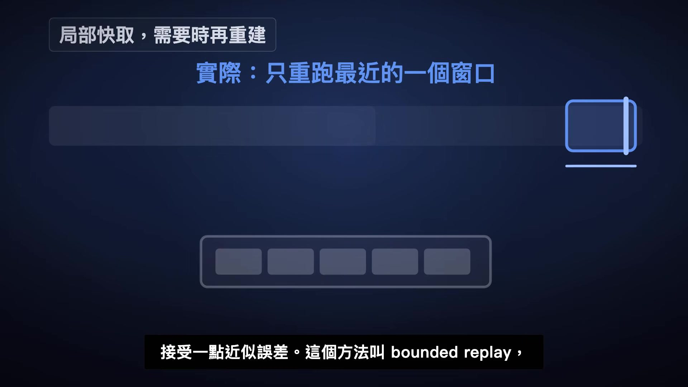

**逐字稿片段：** 這個方法叫Bonded Replay 可以理解成限制重播的範圍 這裡要講清楚 它跟完整重算在數學上並不相等 報告的做法 其實在後段訓練就模擬這種重建方式 讓模型適應並檢查造成的影響 局部快取不用長期存 有下來的全局快取又更小 兩個效果合起來 持久保存的KB Cash

**話題推測：** 介紹Bonded Replay方法

---

## 00:11:49

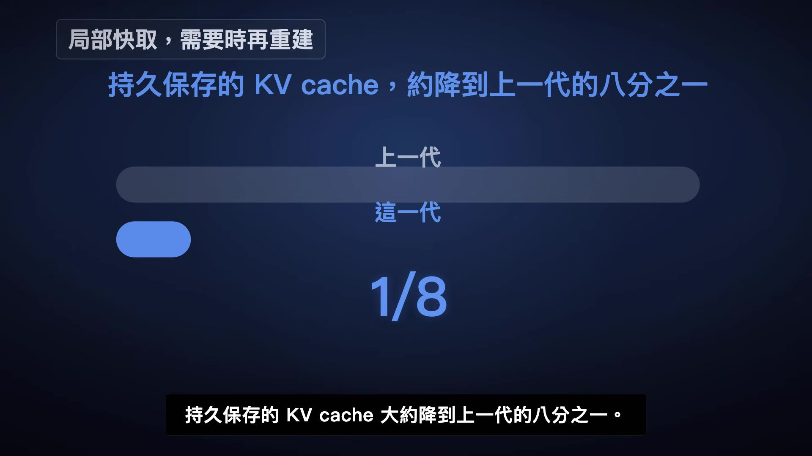

**逐字稿片段：** 大約降到上一代的八分之一 前面主要在省讀取和記憶體

**話題推測：** 公布持久保存的KV Cache降至上一代八分之一的數據

---

## 00:11:53

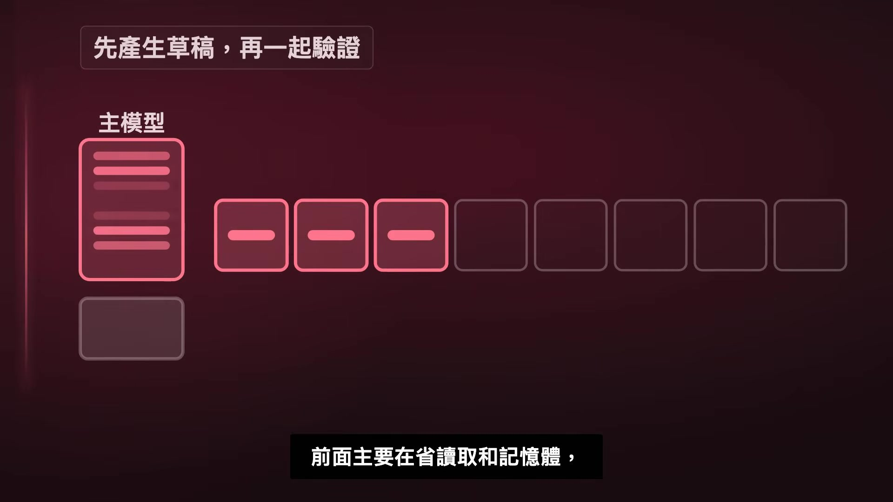

**逐字稿片段：** 輸出速度則還有另一套做法 正常生成時 模型每產生一個Token都要跑一次計算 要讓它更快 一個常見的方法 是先用比較小的模型提出一串候選 再交給主模型一起驗證 這叫投機結碼 例如小模型先拆後面5個Token 主模型就可以在A輪裡檢查這幾個候選 前面連續通過的部分可以接受 遇到不符合接受條件的位置再修正並繼續生成 如果草稿經常被接受 就能省下主模型足夠深層的回合 拆得不好 也會增加白做的工作

**話題推測：** 轉向討論輸出速度優化

---

## 00:12:21

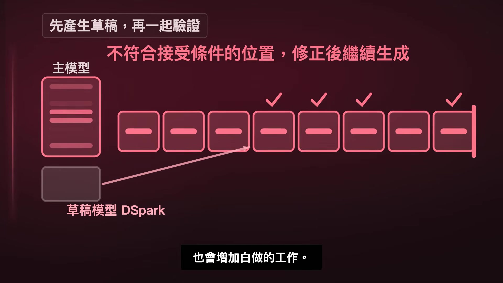

**逐字稿片段：** V4.1 Flash的草稿模型叫D-Spark 它會估計候選被接受的幾率 再配合系統負債 調整這一輪驗證的長度 因此策略不一定永遠都是拆得越多越好 服務同時有很多請求時 還得考慮整批硬體的吞吐量 而且這一套是在主幹訓練完成之後 另外安排階段訓練的 跟上一代把相關模組一起訓練的做法不同 架構設計員 還得看它在顯示卡上怎麼執行 模型的一層 通常包含很多小段運算 這些在GPU上執行的小程式

**話題推測：** 提及V4.1 Flash的草稿模型D-Spark

---

## 00:12:50

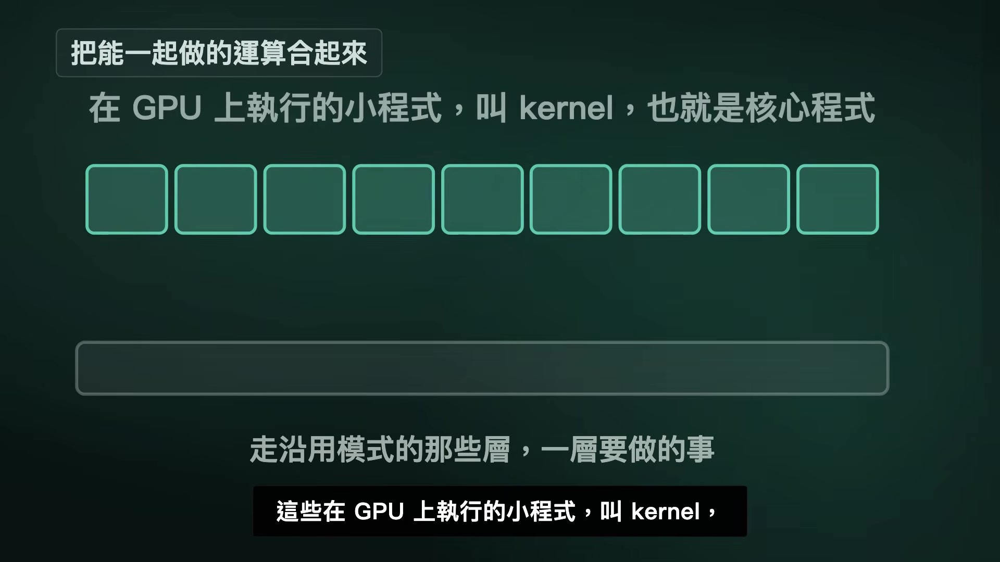

**逐字稿片段：** 叫Kernel 也就是核心程式 如果每個步驟都分開執行 就可能多出啟動成本 也可能需要把中間結果寫回記憶體 下一個步驟再讀出來 所以常見的優化 是把適合接在一起的運算合併 讓資料留在更靠近運算單元的地方 少搬幾次 這一代也花了不少力氣做這件事 報告指出 對 佔多數的沿用模式層來說

**話題推測：** 解釋「Kernel」（核心程式）在GPU上的執行

---

## 00:13:10

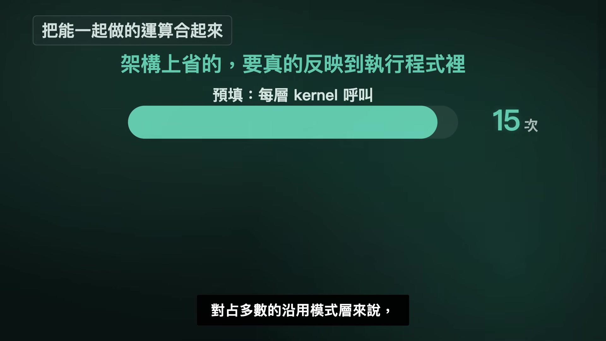

**逐字稿片段：** 譬如說,預填每層只需要15次Kernel呼叫,解碼則是11次 這兩個數字,你不需要背 重點是前面那些共用和省略最後真的反應到直航程式裡 否則架構圖上看起來省很多,實際跑的時候一直搬資料,一直等待,效果還是會打的

**話題推測：** 提及預填和解碼每層Kernel呼叫次數的具體數字

---

## 00:13:24

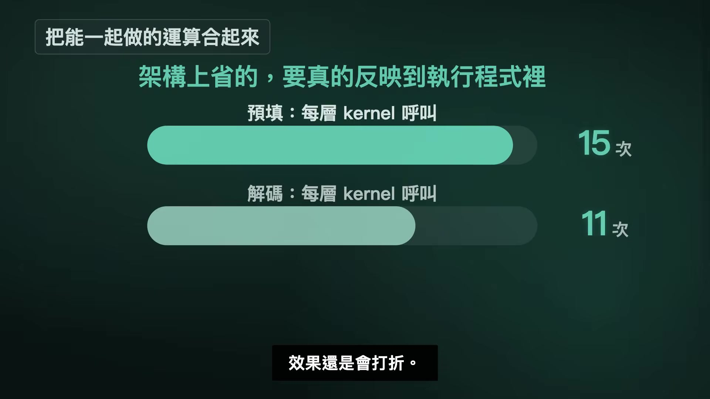

**逐字稿片段：** 再往外看,就是整套服務怎麼部署 一次多模態請求 可以分成幾個工作 先把圖片轉成模型能使用的表示,再處理整份輸入 最後逐步產生回答

**話題推測：** 轉向討論服務部署策略，可能展示部署架構圖

---

## 00:13:33

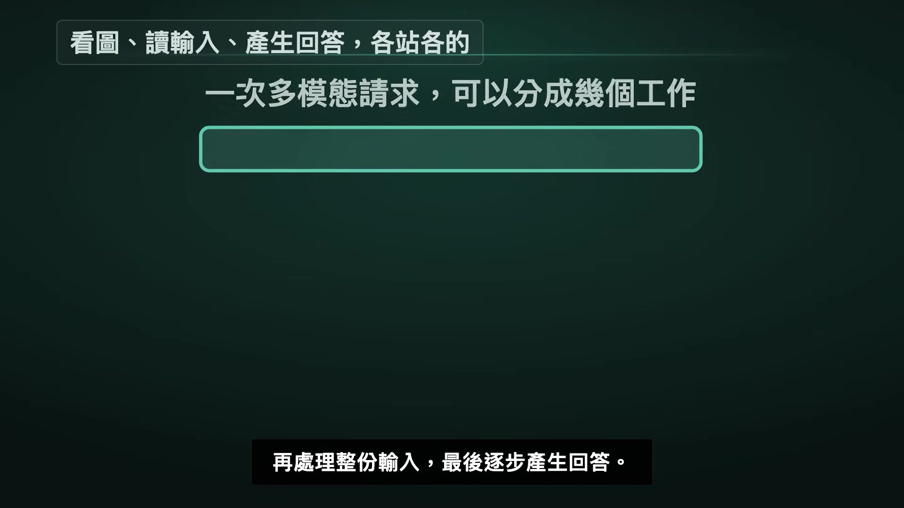

**逐字稿片段：** 而v4.1 Flash把視覺編碼、預填和解碼分開部署 讓不同階段使用各自的資源 安排的理由很直接 玉田通常比較吃算力 逐步解碼時 記憶體頻寬往往很重要 圖片處理的需求則會隨請求內容變動 如果全部綁在一起 某一段忙不過來時 其他資源未必能有效幫上忙 分開之後 就能比較有針對性的增加資源 也比較容易安排不同請求同時進行 例如一個請求還在生成回答 另一個請求可以先在玉田的機器上處理輸入 當然 分開也會有資料傳輸和排程成本 它的價值在於 當服務規模夠大 各階段需求又不同時 可以把硬體用得更有效率 講了這麼多回答大家最直覺的問題

**話題推測：** 說明視覺編碼、預填和解碼分開部署的策略

---

## 00:14:13

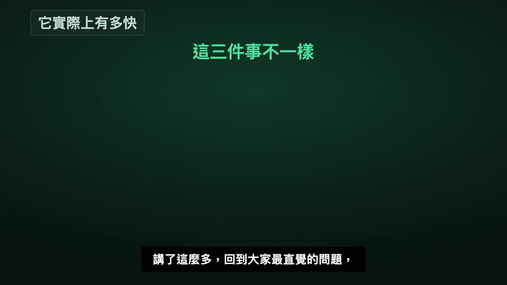

**逐字稿片段：** 用起來到底快不快 這裡要分開看幾個指標 輸出開始之後 每秒能產生多少Token 送出請求之後 多久收到第一個Token 以及整個任務要花多久才能完成 這三件事不一樣 我查到的Artificial Analysis 面面VSO.Flash 在DeepSeq官方API上的輸出速度

**話題推測：** 轉向討論實際使用速度和性能指標

---

## 00:14:30

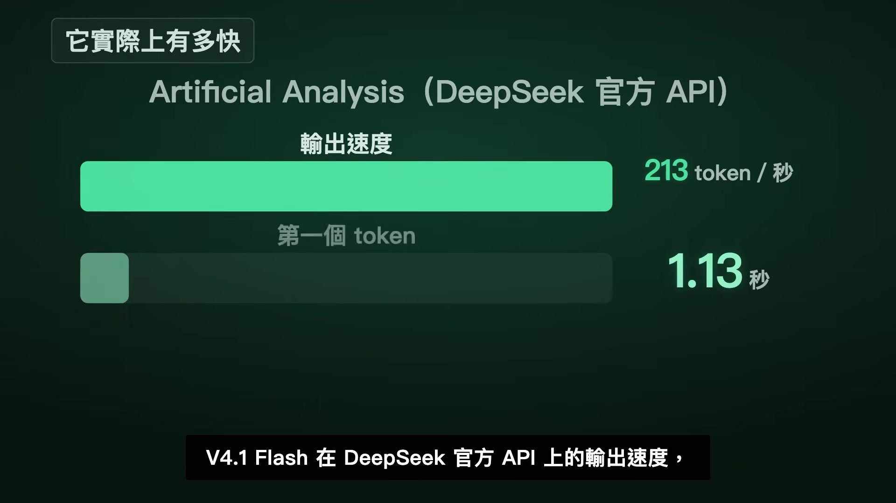

**逐字稿片段：** 大約是每秒213個Token 首個Token的時間大約是1.13秒 首個Token不一定就是你想看的正式答案 如果模型先推理 從開始回傳到真正回答 中間還可能有一段時間 這些數字也會隨服務負債、測試條件和版本更新有變動

**話題推測：** 提及DeepSeq官方API輸出速度約每秒213個Token

---

## 00:14:46

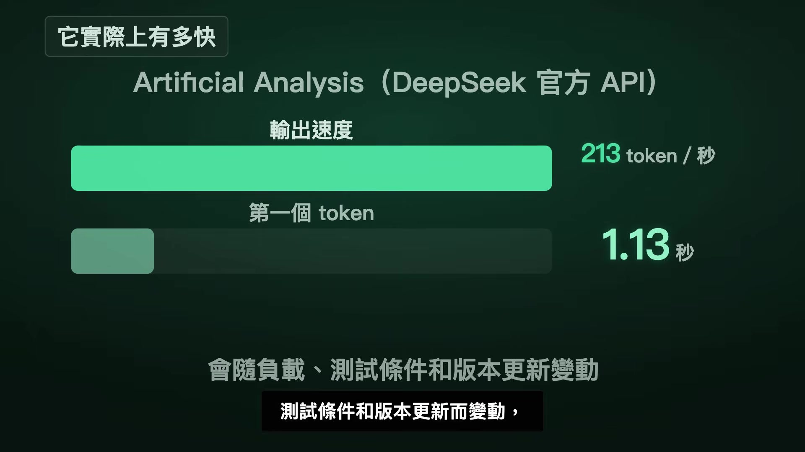

**逐字稿片段：** 我會把連結放在諮詢欄 技術報告更想強調的則是長度增加之後的計算量 按照報告的結果 上下文從約4000個Token拉到約100萬 長度增加約256倍

**話題推測：** 提及提供連結在資訊欄，可能顯示QR code或連結文字

---

## 00:14:57

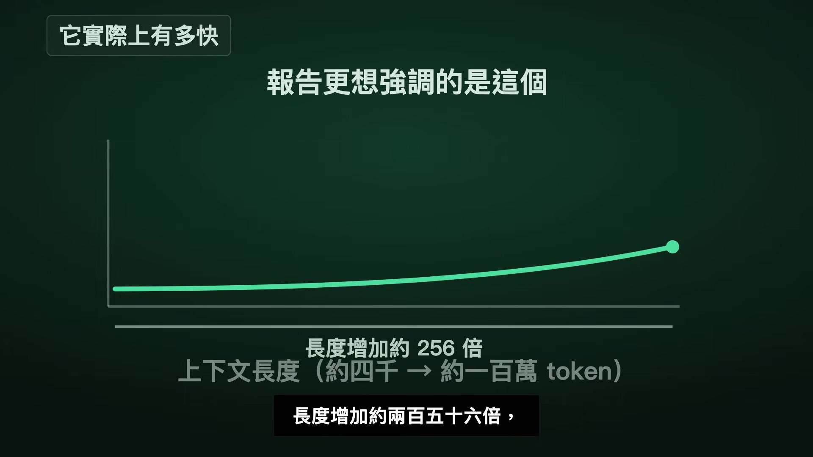

**逐字稿片段：** 每個輸出Token的計算量只增加約1 4分之1 這不代表整份輸入免費 也不代表延遲只增加1 4分之1 它說明的是上下文變長之後 後續每一步生成需要增加的計算被控制住 到這裡可能已經有不少名詞了

**話題推測：** 公布上下文長度增加256倍，每個輸出Token計算量只增加1/4的數據

---

## 00:15:11

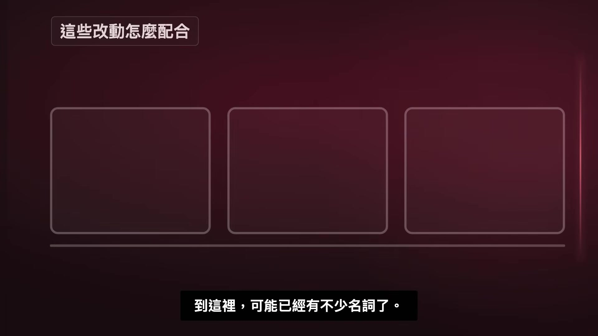

**逐字稿片段：** 我們把它們放回同一個流程看 收到場輸入時 CED先減少預點需要跑的計算 處理過的全局資訊 透過跨層共用和量化 縮小保存的體積 後續要取用資料時 再用分層索引減少搜尋範圍 需要重用先前的上下文 就載入保留下來的全局快取 局部狀態則用最近的內容重建 開始生成之後 再交給DISPARK提出候選 減少主模型逐個輸出的回合 底下還有Colonel合併和分離部署 負責把這些設計有效的跑起來 他們解決的是不同環節的成本 也會互相配合 像快取縮小 除了比較省記憶體 跨機器傳輸時也比較輕 這些效果加在一起 才是整套系統能便宜下來的原因

**話題推測：** 總結前面提到的技術改動並置於一個流程中，可能展示總覽圖

---

## 00:15:50

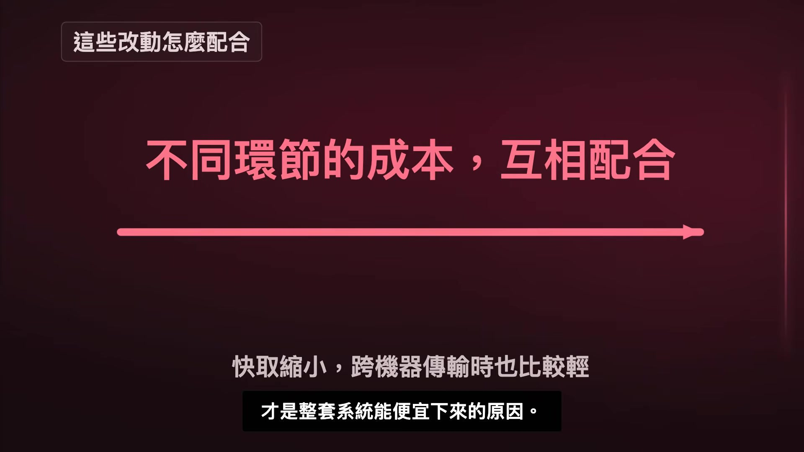

**逐字稿片段：** 再看一次模型規模 會發現一個容易搞混的地方 上一代V4 Flash的主幹參數是2841 這一代增加到5521 接近兩倍 但它是MOE模型 每個Token不會用到全部參數 再加上前面說的CED 預填時啟用約80億參數 解碼時則是約161 上一代的啟用參數是約131 也就是說這一代在讀取和生成時的數字不同 挑帕11那個數字 拿來代表所有使用情境

**話題推測：** 再次檢視模型規模，可能展示參數比較圖表

---

## 00:16:17

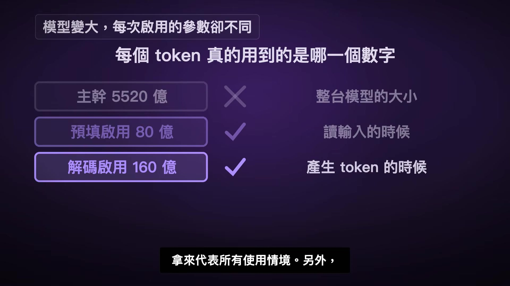

**逐字稿片段：** 另外 它還有一個叫engram的條件記憶模組 配置了1961參數 透過稀疏查找來存取 這也提醒我們 看參數量時要確認 數字算的是主幹 也是包含其他模組 多模態訓練方面 它從語言模型預訓練開始 就一起處理文字和圖片表示

**話題推測：** 提及engram條件記憶模組及其參數

---

## 00:16:33

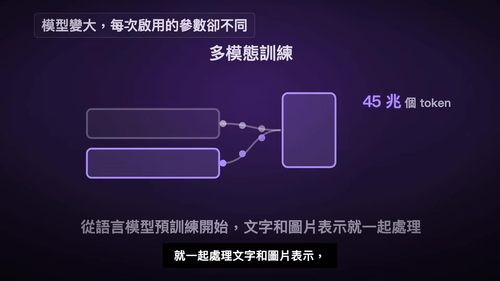

**逐字稿片段：** 訓練語調規模是45兆個token 最後看知識能力 部分基礎模型測試已經接近V4 Pro 但不是每一項都追評 它的效率確實提升了 能力範圍人要一項一項看 推論效率之外 還有另一個問題

**話題推測：** 提及訓練語料規模為45兆個token

---

## 00:16:46

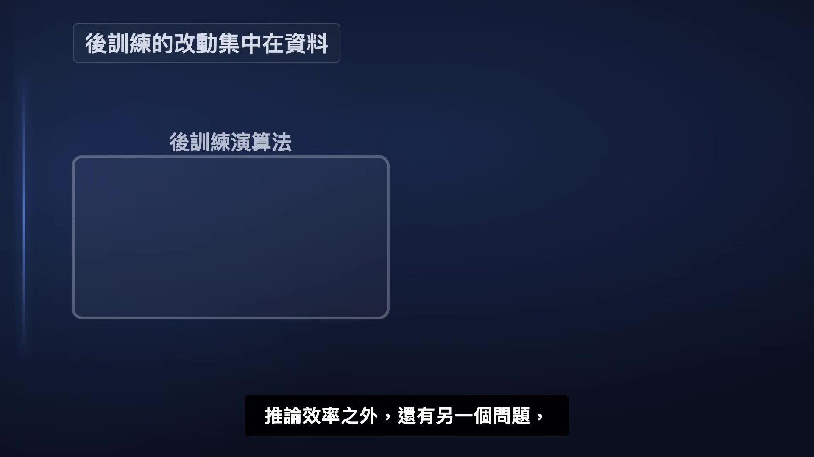

**逐字稿片段：** 它怎麼練出這些agent能夠在後訓練這一段 講得很明確 這次沒有修改後訓練演算法 主要改動集中在資料流程 訓練能源連用SFT強化學習

**話題推測：** 轉向討論agent模型的後訓練方法

---

## 00:16:56

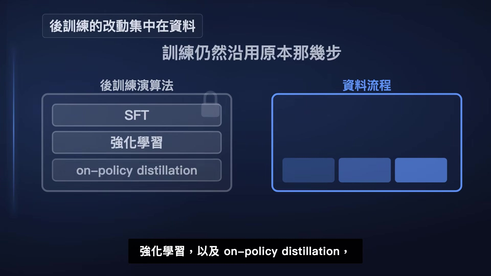

**逐字稿片段：** 以及On Policy Distillation 也就是讓模型在自己產生的軌跡上 接受老師模型的指導 真正花力氣的地方 是大量產生agent任務和環境 再逐步擴大資料 任務種類 以及實際跑過的軌跡 對agent來說 這件事很重要 光有一份問答資料 不足以呈現完整的工作過程 還需要看到怎麼使用工具 怎麼根據結果決定下一步 也需要遇到失敗之後 還能繼續處理的情境 我的解讀是 當一套訓練方法已經夠用 把資料和環境做得更完整 您有很大的進步空間 但沒有改後訓練演算法 說的是這一段訓練流程 前面那些模型架構 和推論系統的改動 仍然是這一代的重要工作 這些優化 對使用者最直接的影響

**話題推測：** 提及On Policy Distillation等訓練技術

---

## 00:17:36

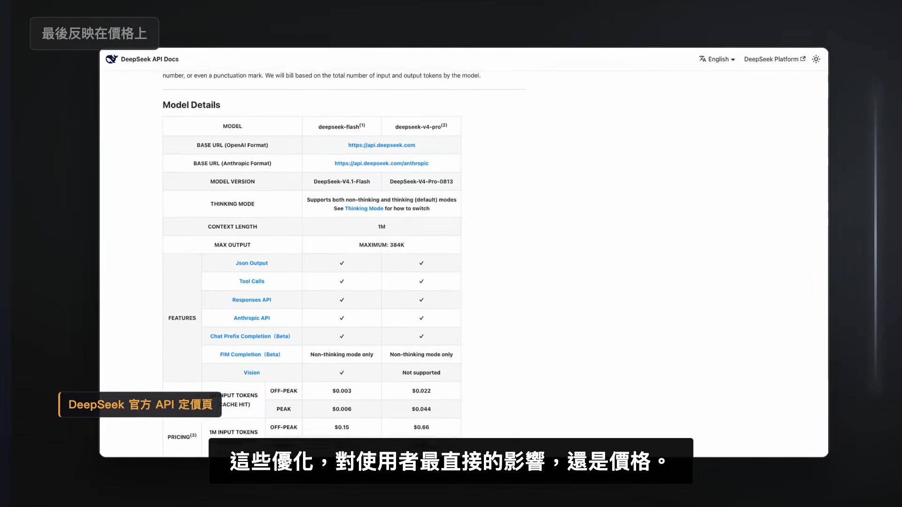

**逐字稿片段：** 還是價格 目前官方把費用分成 快取命中的輸入 沒有命中的輸入 以及輸出三類 而且還有尖峰和離峰價格 以E4.1 Flash來說 每100萬個輸入Token 快取命中時是0.15到0.3美元

**話題推測：** 轉向討論價格，可能展示定價表格

---

## 00:17:51

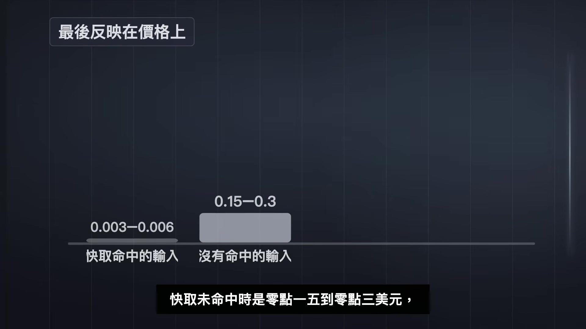

**逐字稿片段：** 快取命中時是0.003到0.006美元 每100萬個輸出Token

**話題推測：** 提及快取命中與未命中的輸入Token價格

---

## 00:17:56

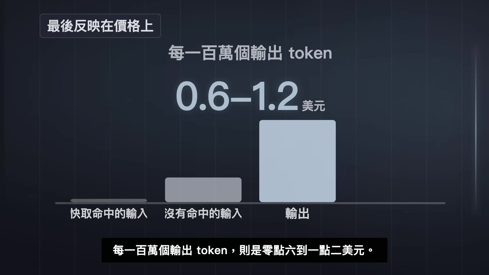

**逐字稿片段：** 則是0.6到1.2美元 離峰是尖峰的一半 不過時段是照官方的UTC規則劃分 不能直接理解成你所在地的半夜才便宜 對反覆讀取相同程式碼和文件的agent來說 能不能命中快取會明顯影響賬單 同樣是跑時輪 前面的內容能重用多少 成本可能差很多 至於V4 Pro 目前仍列在定價頁上 官方也說會繼續提供服務 因此 我不會把這次更新解讀成旗艦已經被淘汰 比較實際的變化是 你現在可以用較低的單價 嘗試把更多工作交給模型 最後值不值得 還是要把成功率 從事次數 和整個任務的花費 一起算進去 如果你自己會寫程式 也已經在用agent 我覺得它值得拿來 跑你手上的長任務 尤其是那些 要反覆讀取同一份專案 檢查測試結果 繼續修改的工作 挑幾個你熟悉的案例 比較它最後 有沒有做對 花多久 整個任務花多少錢 如果你是在公司裡 評估導入 這次更新 比較值得注意的是 某些原本成本 太高的流程 可能可以重新估算 不過估算時 要把人工介入 也算進去 模型便宜很多 但如果沒跑幾步 就要有人接手 省下的API費用 不一定補得回來 如果你不寫程式 只是想知道 這件事為什麼重要 可以這樣看 當AI要處理的工作 越來越長 光是答得好還不夠 它也得能負擔整個過程 這一代展示的 就是怎麼從架構和系統裡 直接反覆出現的成本 一點一點降下來 回到最開始 那個coding agent的例子 他讀了程式碼 文件和測試結果之後 接下來每一步 都可能需要前面的資訊 如果保存和使用 用這些資訊的代價太高

**話題推測：** 提及每百萬輸出Token的價格

---
