# jimainotebook_F5eZ5lr7edo — 關鍵畫面索引

- 來源逐字稿：[jimainotebook_F5eZ5lr7edo_FIN.srt](jimainotebook_F5eZ5lr7edo_FIN.srt)
- 影片：https://www.youtube.com/watch?v=F5eZ5lr7edo
- 截圖數：44

## 00:00:06

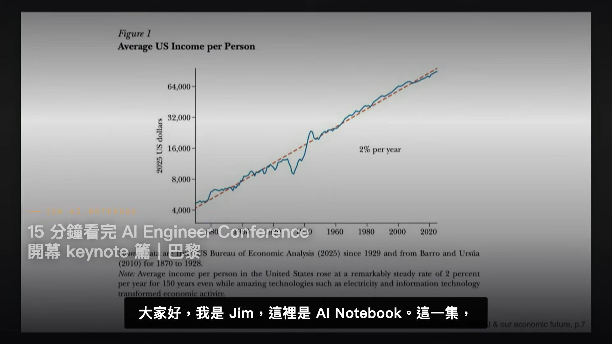

**逐字稿片段：** 這一集我們看巴黎AI Engineer大會的開幕夜, 三個人輪流上臺, 一個講經濟史, 一個講工程師手上的工具, 一個講一家做模型的公司, 三場聽起來各講各的, 其實在回答同一個問題, 模型進步得這麼快, 為什麼它真正改變我們工作的速度, 卻慢了這麼多,

**話題推測：** 影片標題或大會介紹畫面

---

## 00:00:23

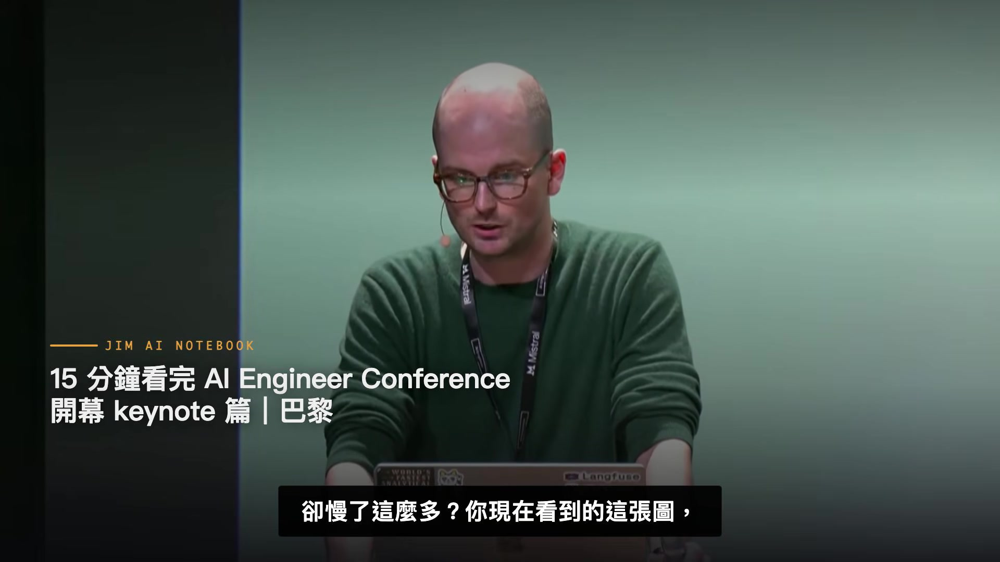

**逐字稿片段：** 你現在看到的這張圖是第一位講者放上臺的一條拉得很長, 卻幾乎不轉彎的線, 我們就從這條線開始, 你現在看到的這張圖, 橫軸是年份, 縱軸是美國每個人平均的收入, 他用的是對數座標 意思是每往上一格 就是多乘一倍 所以一路穩定成長 會畫成一條直線 這條線 從19世紀末 一路畫到今天 幾乎沒有轉彎 可是你想一下 這段時間發生了什麼 汽車 飛機 電視 網路 全都是在這條線上 被髮明出來的 這麼多改變世界的東西 加起來 換來的只是每年 文文往上一小步 講者Clemens 把這張圖放在臺上 是想問一件事 AI會讓這條線 變得不一樣嗎 經濟學家的估計 差得非常遠 有人覺得他只會在這條線上 多加一點點 有人覺得他會讓這條線 明顯變陡 Clemens沒有選邊

**話題推測：** 展示第一位講者介紹的圖表

---

## 00:01:07

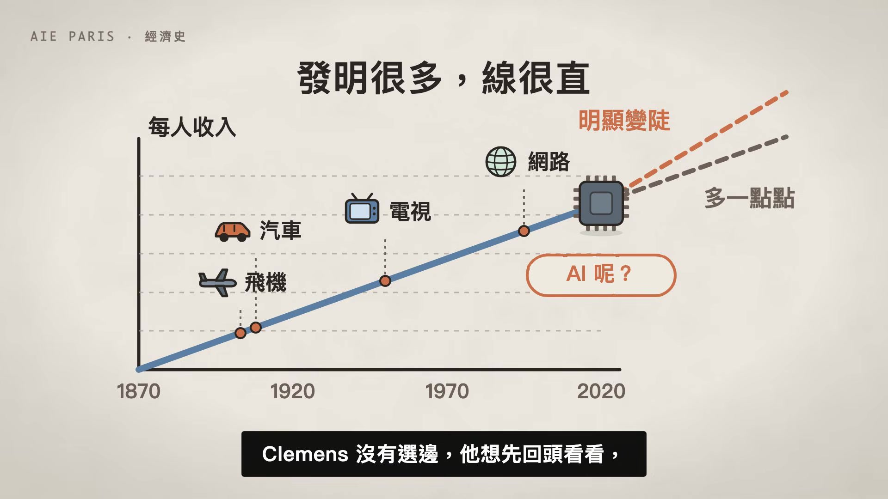

**逐字稿片段：** 他想先回頭看看 過去那些真正的大發明 到底花了多久 才讓這條線動起來 Clemens是Lamfuse的 共同創辦人 Lamfuse做的 是幫工程師看清楚 AI應用在做什麼的工具 可是他在學校唸的是經濟史 所以他這樣不講產品

**話題推測：** 轉向討論過去重大發明的歷史時間

---

## 00:01:21

**逐字稿片段：** 講歷史 他先丟出一個名詞 叫通用技術 英文是General Purpose Technology 縮寫剛好也是GPT 通用技術的意思 是一種會改變整個經濟的技術 它要符合三個條件 它到處都用得到 不是隻有一個產業在用 它會一直被改良 越來越便宜好用 它還會帶動周邊的東西一起長出來

**話題推測：** 介紹新名詞「通用技術」（General Purpose Technology）

---

## 00:01:38

**逐字稿片段：** 符合這三個條件的並不多 水車 蒸汽機 鐵路 電力 電腦 大概就是這一排 Clements的看法是 AI很可能就是這一排的下一個 所以要猜AI接下來會怎麼走 最好的教材 就是前面這幾個是怎麼走過來的

**話題推測：** 列舉符合通用技術的歷史例子

---

## 00:01:51

**逐字稿片段：** 第一個例子是蒸汽機 最早能用的蒸汽機 是18世紀出一個叫Newcom的人做出來的 主要拿來抽礦坑裡的水 後來Watt把它大幅改良 變得更省眉 也更好用 照理說故事到這裡就該起飛了 可是經濟學家回頭去算 蒸汽機真正把整個國家的生產力推上去 要等到1830年代以後 從發明算起 超過100年 這100年在等什麼 機器本身要先變便宜 要有能做精密零件的工具機 要有鐵路把煤火貨送出去 還要有一整代 懂得操作和修理機器的工人 Clemens在演講最後

**話題推測：** 開始講述蒸汽機的例子

---

## 00:02:21

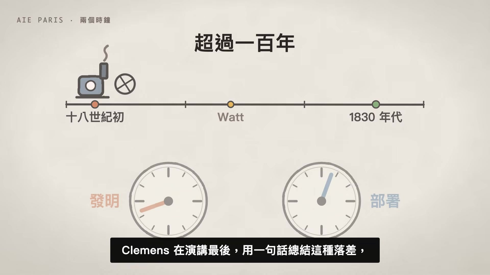

**逐字稿片段：** 用一句話總結這種落差 他說技術有兩個時鐘 一個是發明的時鐘 走得很快 另一個是部署的時鐘 也就是把東西真正用進工作裡走得很慢 這兩個時鐘 也是今晚三場演講共同的主線 電力的故事更清楚 IT正在1880年 在紐約開了一座商用發電廠 可是美國的工廠 很久以後才真的換成用電 到了20世紀初 工廠的動力只有很小一部分來自電力 要再過30年左右才變成大部分 為什麼這麼慢

**話題推測：** 介紹技術發展的「兩個時鐘」概念

---

## 00:02:48

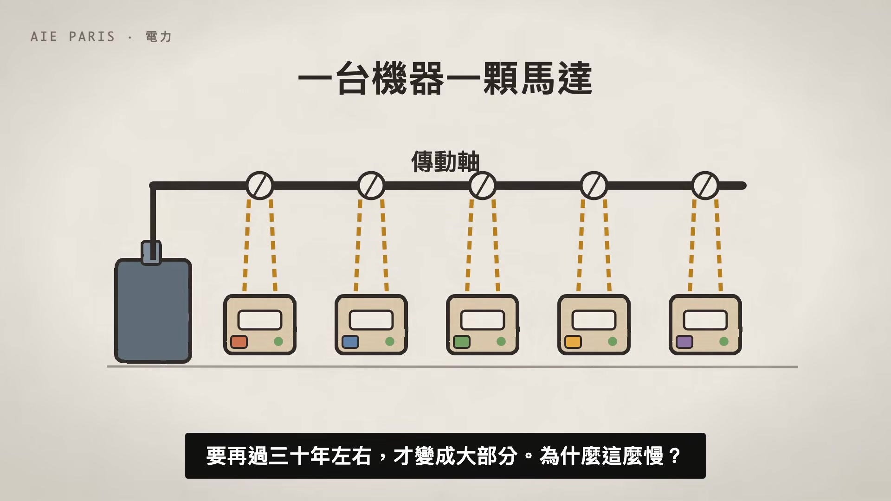

**逐字稿片段：** 問題不在電本身 在工廠的格局 蒸汽時代的工廠 是一臺大引擎 帶動一根長長的傳動軸 軸上掛著皮帶 連到每一臺機器 這種做法叫群體驅動 整間工廠要照著那根軸來排 工廠一開始換成電 只是把大引擎換成一顆大馬達 軸跟皮帶都沒動 當然看不出差別

**話題推測：** 解釋電力普及緩慢的原因，可能展示工廠動力傳輸圖

---

## 00:03:05

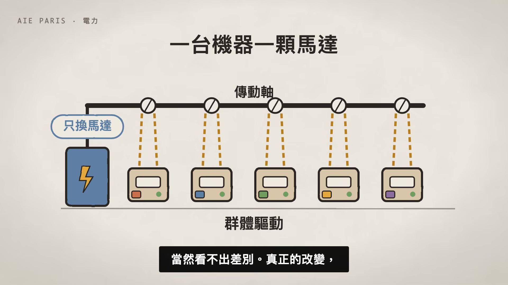

**逐字稿片段：** 真正的改變 每一臺機器裝上自己的小馬達 這叫單元驅動 從這一刻開始 工廠可以照工作的順序重新排 一臺機器壞了 也不會拖垮整間工廠 CLEMENS的說法是 電力要的不是一顆更好的馬達 是一間重新設計的工廠

**話題推測：** 闡述工廠從群體驅動轉向單元驅動的改變

---

## 00:03:20

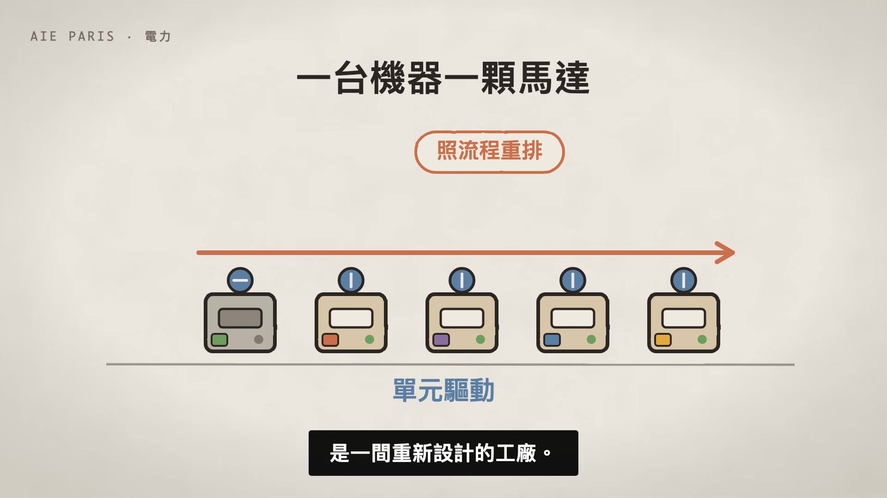

**逐字稿片段：** 電腦也走了一樣的路 到了80年代辦公室裡已經到處都是電腦 可是生產力的數字就是不動

**話題推測：** 開始講述電腦普及的例子

---

## 00:03:26

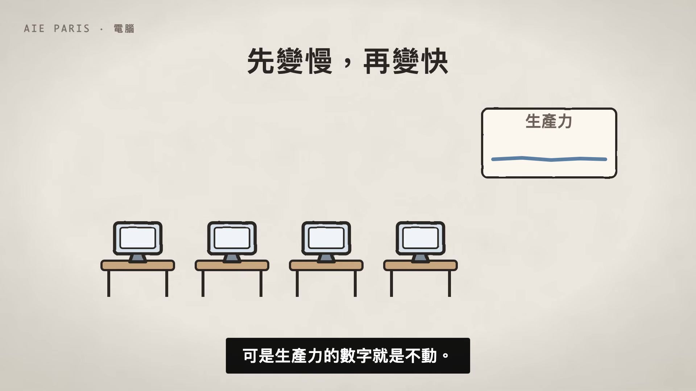

**逐字稿片段：** 諾貝爾經濟學獎得主Solo 在1987年留下一句很有名的話 說到處都看得到電腦 就是在生產力的統計裡看不到 要等到90年代中後期 數字才終於上來 中間那十幾年 企業在做的事情是改組織 重新設計流程 把供應鏈整個重做一遍

**話題推測：** 引用諾貝爾經濟學獎得主Solo的觀點，可能展示生產力統計圖

---

## 00:03:42

**逐字稿片段：** 這個現象叫生產力的接續線 它的意思是 一家公司剛導入新技術的時候 要先花錢 先訓練人 先改流程 這段時間生產力看起來反而往下掉 就像借這個字母的底部 等整套東西接好了 曲線才往上翹 你把三個例子排在一起看 蒸汽機要等零件和工人 電力要等工廠重新設計 電腦要等組織改造 每一次 快的都是發明 慢的都是後面那一整套 時間講完了

**話題推測：** 介紹「生產力的J型曲線」概念圖

---

## 00:04:07

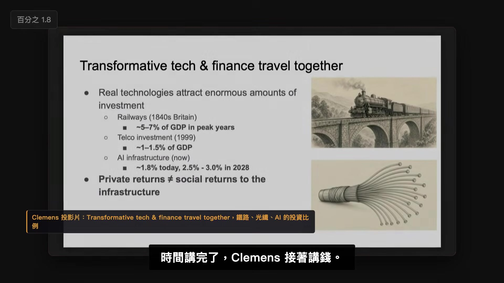

**逐字稿片段：** Clemens接著講錢 每一次大技術出現 資金都會跟著一起衝進來 1840年代的英國 有一段叫鐵路狂熱的時期 鐵路投資最高的時候 大約是整個國家經濟產出的5-7%

**話題推測：** 轉變話題到技術投資資金

---

## 00:04:17

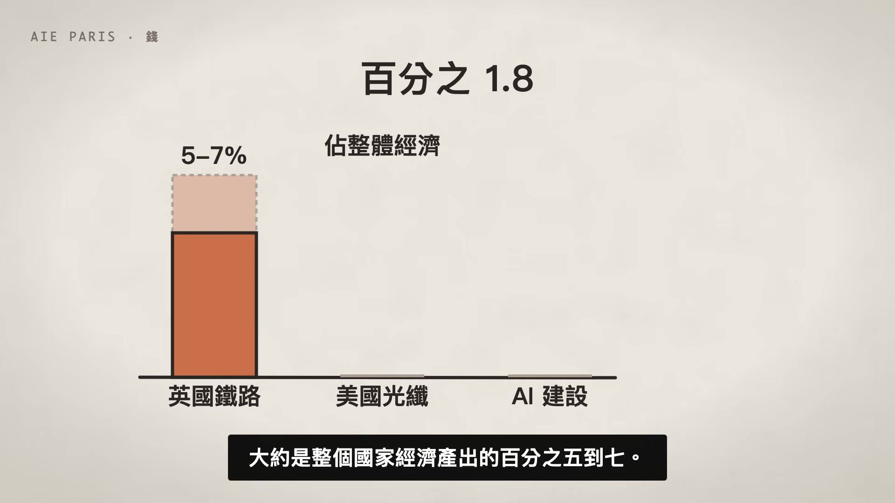

**逐字稿片段：** 後來網路泡沫那幾年 美國攀命舖光鮮 那時候的比例比鐵路低很多 那AI呢 今年蓋資料中心 買晶片 這些AI基礎建設的投資 大約是美國整體經濟的1.8%

**話題推測：** 提及網路泡沫時期的投資比例

---

## 00:04:29

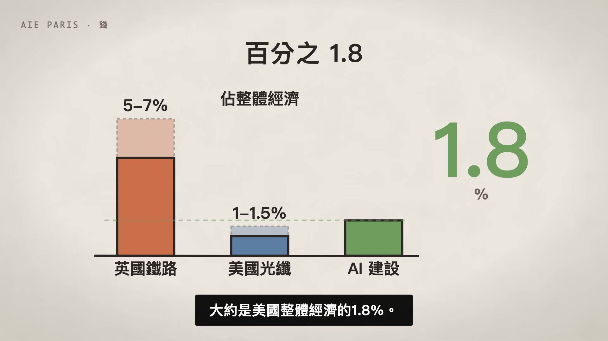

**逐字稿片段：** 你把這三根長條擺在一起 AI已經比當年的光線高 但還沒到鐵路狂熱那種程度 而且預估接下來幾年還會再往上 臺下一定有人想問 這是不是泡沫 Clemens很老實 他說他不知道 也不打算評論 他只提醒大家一件事 就算真的是泡沫 蓋出來的東西並不會跟著消失 鐵路狂熱 後來確實崩了 很多投資人賠得很慘 可是鋪好的鐵軌還在 後來整個國家用很便宜的價格在運貨 網路泡沫也一樣 當年多鋪的光纖 有很大一部分根本沒在用 業界把它叫暗光纖 Dark Fiber 泡沫破掉以後 這些閒置的線路變得很便宜 後來的串流影片和行動網路 才有便宜的基礎可以長出來 Clamens講到這裡

**話題推測：** 比較鐵路、網路、AI投資的長條圖

---

## 00:05:07

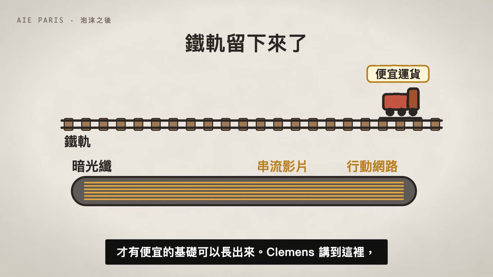

**逐字稿片段：** 把整場收回來 他說 我們進入深層式AI的時代 大概四年了 快的那個時鐘已經跑得很遠 接下來的問題是 要花多少力氣 才能讓慢的那個時鐘跟上 他給臺下的答案不是更好的模型 是重新設計工作流程 訓練人開新的公司 他最後說 這個房間裡的人 每天在做的就是這件事 而下一位上臺的講者 剛好就是每天都在做這件事的人

**話題推測：** 總結Clemens演講，回顧「發明時鐘」與「部署時鐘」

---

## 00:05:30

**逐字稿片段：** 第二位上臺的是Kitsy 他做了一個給網頁工程師用的瀏覽器 叫CZ 講話一向很直 他上一次來這個大會

**話題推測：** 介紹第二位講者Kitsy及其產品

---

## 00:05:36

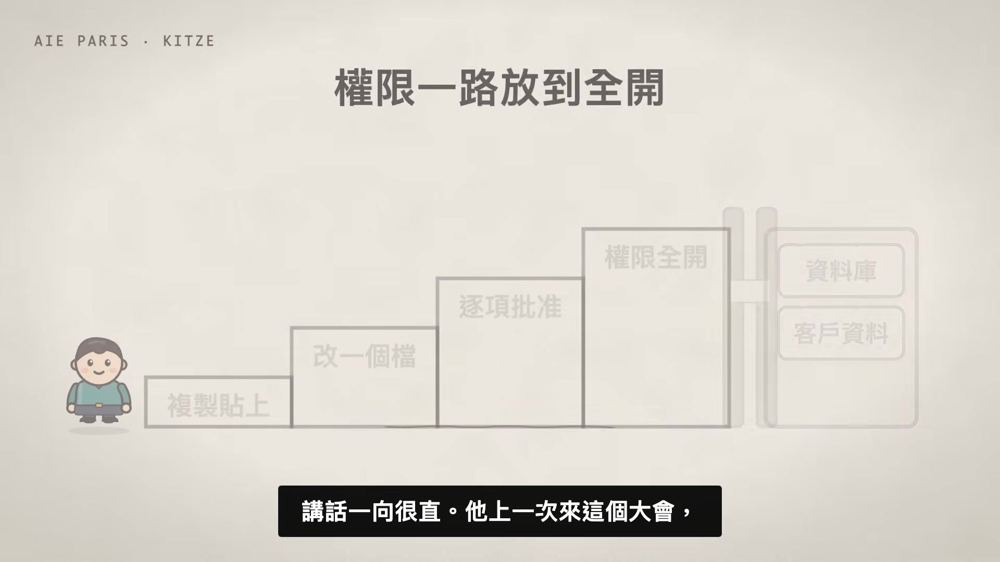

**逐字稿片段：** 題目叫從Vibe Coding 走到Vibe Engineering Vibe Coding這個詞 說的是寫程式的時候不太看程式碼 用說的叫AI寫 感覺對了就收下

**話題推測：** Kitsy上次演講主題「從Vibe Coding走到Vibe Engineering」

---

## 00:05:44

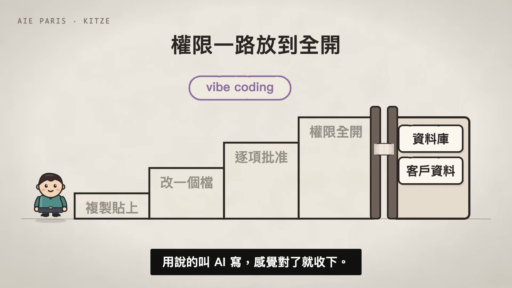

**逐字稿片段：** 這次他先帶大家回顧這幾年 一開始 我們拜託ChatGPT把一個函式寫完 還要求他只給乾淨的資料 後來AI可以直接改一個檔案 大家還覺得有點危險 再後來有了Agent 就是會自己規劃自己動手的AI助手 那時候他每做一件事 我們都一項一項按批准 差不多一年之後 他說他認識的人 幾乎全都把權限全開了 資料庫和客戶資料全部交給他 只求他把事情做完 速度確實上來了 可是有一件事 被大家一直丟在了後面 權限一開速度就上來了 問題也跟著來

**話題推測：** 回顧近幾年AI在程式開發中的應用演變

---

## 00:06:15

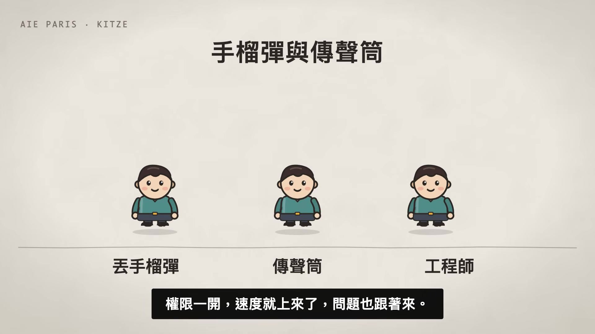

**逐字稿片段：** Kitsy 把現在用AI工作的人分成三種 第一種叫Slob 手榴彈投擲者 Slob是網路上的說法 指AI大量產出 沒有人認真看過的低品質內容 這種人叫Agent 生出一大堆城市碼 自己沒賭 就直接丟給同事 祝你好運 他說臺下大部分的人 包括他自己都丟過 第二種叫肉身代理人 Meet Proxy 老闆交代一個需求 他原封不動貼進AI AI給什麼 他就原封不動交回去 自己只是中間那根傳聲筒 第三種 才是真正的工程師 這種人其實不多 他還留下一個判斷 他覺得明年會有很多肉身代理人被裁掉 因為中間那一首老闆自己也做得到 這只是他個人的看法 可是他點中了一件事 AI讓產出變得很快 把關的那一段卻沒有人在做 那工程師要怎麼把關 Keys也先看了一圈大家在用的工具 現在能同時指揮好幾個agent的工具很多

**話題推測：** 將AI工作者分成三種類型

---

## 00:07:01

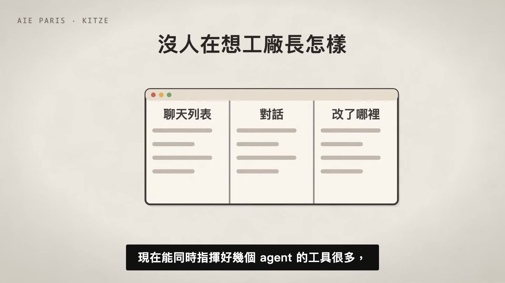

**逐字稿片段：** 這類工具叫編排器 orchestrator 意思是負責分派工作追蹤進度的那一層 他說這三年來 各家的編排器幾乎長得一模一樣 左邊一排聊天記錄 中間是對話 右邊是城市碼改了哪些地方 接著他講到一個更根本的問題 大家嘴上都在說要做軟體工廠 意思是讓AI像生產線一樣 穩定地產出城市 可是一間軟體工廠 到底該長什麼樣子 沒有人講得清楚 每個人的設定都不一樣 你會發現 這跟Clemens講的電力很像 大家拿到了新的動力 卻還在用舊的格局 只是把大引擎換成大馬達 皮帶和傳動軸原封不動 Kitsy這場接下來講的 就是他自己怎麼一步一步 重新排他的工廠

**話題推測：** 介紹能指揮多個Agent的「編排器」（orchestrator）工具

---

## 00:07:37

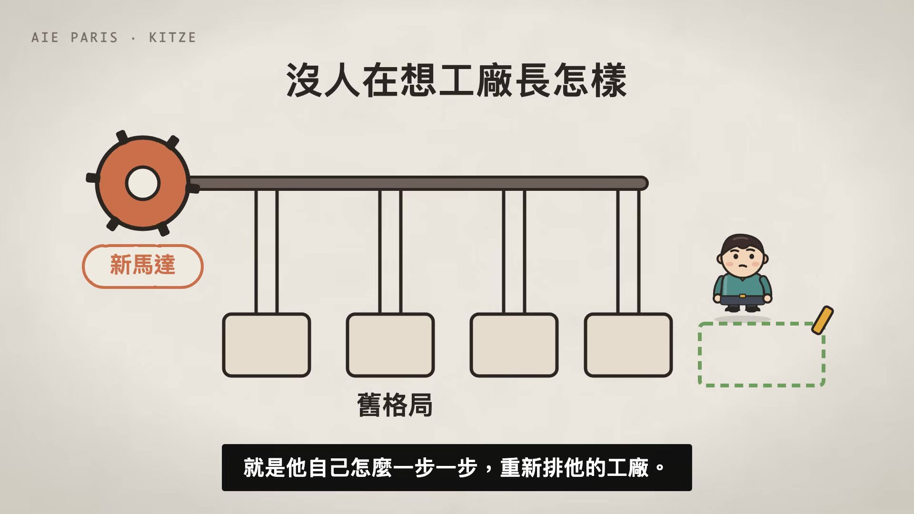

**逐字稿片段：** 他的第一步 是讓好幾個agent 同時做不同的任務 只要用到一個叫worktree的功能 中文叫工作數 A-GIT是工程師用來記錄程式碼 每次修改的工具 工作數是他的一個功能 能把同一份程式碼分出好幾個工作區 每個agent各改各的 Kiss也本來也覺得這樣很安全 直到有一天 其中一個agent為了測試 要在資料庫裡灌一批假資料 結果碰到的是真的正式資料庫 一口氣把資料全部清空了 還好他有備份 問題出在哪裡 工作數只隔開了程式碼 這臺電腦上的資料庫 密碼 網路 agent一樣摸得到 Kizzie在臺上說

**話題推測：** Kitsy介紹改造工廠的第一步：使用Git工作樹（Worktree）

---

## 00:08:11

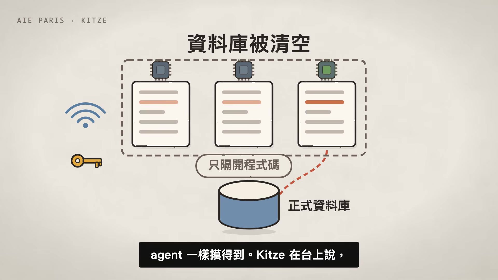

**逐字稿片段：** 工作室不是沙盒 沙盒sandbox 指的是一個 跟外面完全隔開的環境 裡面怎麼亂來 都碰不到外面的真東西 她學到的是 權限給的越大 agent帶的地方就越要管好 所以她換了一個做法

**話題推測：** 介紹「沙盒」（Sandbox）的概念

---

## 00:08:24

**逐字稿片段：** 每一個任務都開一臺 用源就丟的迷你電腦 這種迷你電腦叫虛擬機 意思是在你的電腦裡 用軟體模擬出一臺獨立的小電腦 每一臺小機器裡 有自己的資料庫 有測試用的假資料 還有瀏覽器agent需要的東西都在裡面 可是他拿不到外面正式環境的密碼 任務做完機器就銷毀 下一個任務再開一臺新的 他的電腦一次只能開幾臺更多的任務 就排隊等著

**話題推測：** 介紹使用一次性虛擬機作為解決方案

---

## 00:08:46

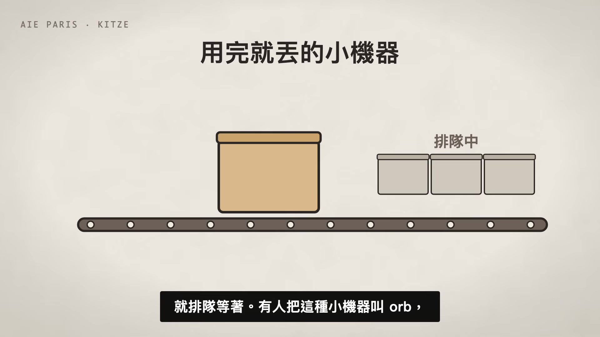

**逐字稿片段：** 有人把這種小機器叫Orb Kezy一開始還在網路上嘲笑這個名字 後來自己整套走過一遍 才承認這是比較穩的做法 他在臺上說 我們的角色正在改變 以後我們再替AI當測試員 每臺小機器都會開個網址 你點進去 就能看到他做出來的東西 看過沒問題才收下來 隔離解決了一半

**話題推測：** 提及這種迷你電腦被稱為「Orb」

---

## 00:09:04

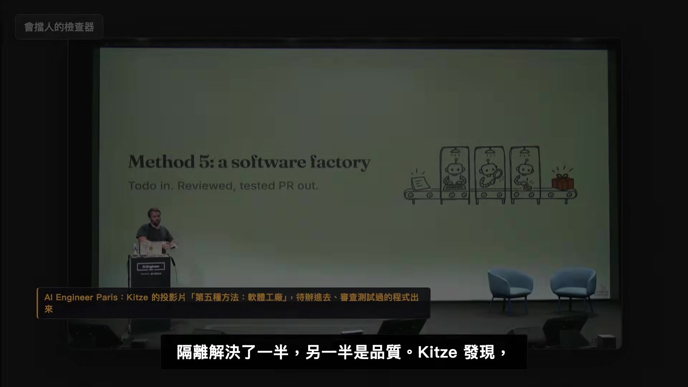

**逐字稿片段：** 另一半是品質 Agent為了讓畫面上顯示沒有錯誤 會偷偷把檢查規則關掉

**話題推測：** 轉向討論AI生成的程式品質問題

---

## 00:09:10

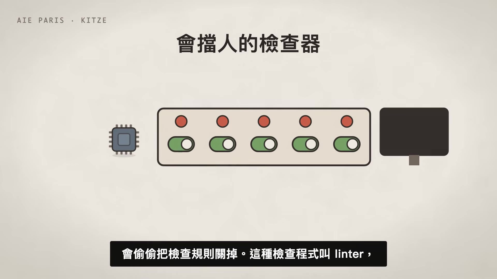

**逐字稿片段：** 這種檢查程式叫Linter 他會自動掃過程式碼 抓出不符合規定的寫法 他打開設定一看 一大堆規則被Agent停用了 他只是想把事情做完 所以他的結論是 規則不能只放在你的腦袋裡 要搬出來放進一個會擋人的檢查器 有些規則 一般的檢查工具寫不出來 他就請Agent幫他另外寫一支

**話題推測：** 介紹程式碼檢查工具Linter

---

## 00:09:29

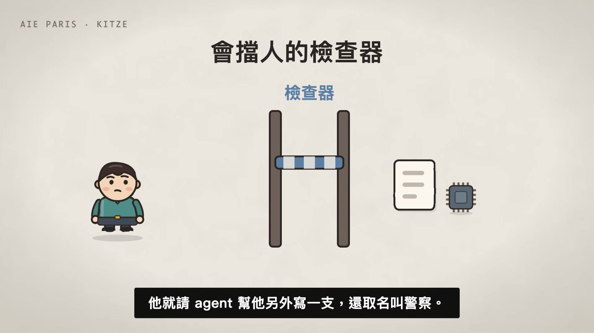

**逐字稿片段：** 還取名叫警察 最後他秀出自己搭的編排器 任務進來 先寫程式 再審查 再測試 一關一關過了 才會送到他面前給他看 他說 你現在的工作不是寫程式 是在協調一間工廠 這就是Clemens說的 重新設計工廠 Kize把工程師這一側的生產線 從頭排了一次 工程師這一側再重排工廠

**話題推測：** 介紹自製的「警察」檢查器

---

## 00:09:48

**逐字稿片段：** 那企業那一側呢 第三位講者是 Mistro的工程副總 萊利歐 Mistro是法國的AI公司 自己訓練大型語言模型 成立三年多 他是公司很早期的成員 也是好幾篇Mistral模型論文的作者 他一開場就說 我們不是在追AGI 我們在追有用 AGI是通用人工智慧 指的是什麼事都能做的 跟人一樣好的AI Mistral選的方向不一樣 他們要的是把AI放進企業裡 把一個個概念驗證 變成正式上線 概念驗證 英文是Proof of Concept 就是先做一個小樣品 證明這件事做得到 企業裡常見的是 小樣品做了一堆 真正上線的很少 用Clemens的話來說 Mistral想做的 就是去推那個慢的時鐘 要推慢的時鐘 光有模型不夠 來利誘藉著講

**話題推測：** 過渡到企業端的AI應用討論

---

## 00:10:29

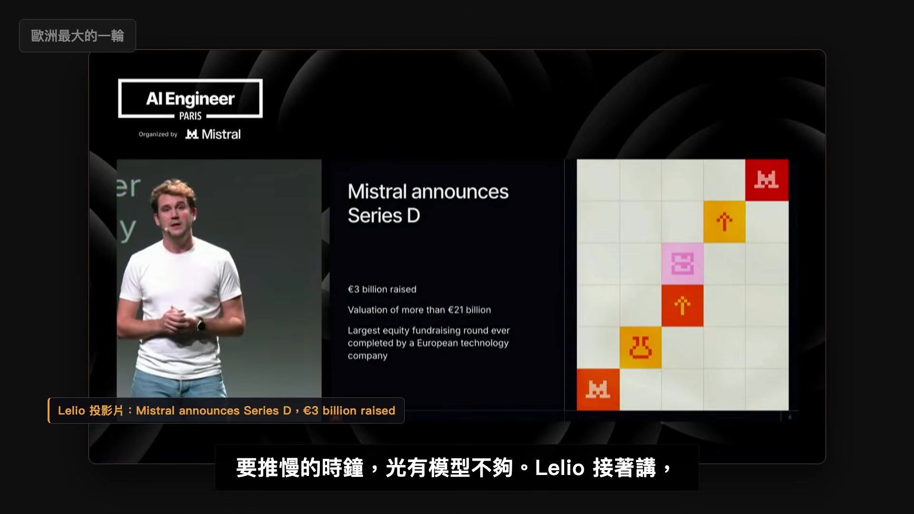

**逐字稿片段：** 這一年Mistro買了什麼 第一家是Coyab 一家做雲端運算的公司 他的專場是T城市 開一個隔離的執行環境 也就是剛剛Kids一直在講的沙盒 第二家是Amy AI 來自維也納 做的是用AI模擬物理現象 例如空氣怎麼流過一臺車 你看這兩筆收購 一個補的是agent要住的地方 一個補的是模型 走進工廠要用的專門能力 補的都是部署這一車

**話題推測：** 介紹Mistral公司過去一年的收購案

---

## 00:10:51

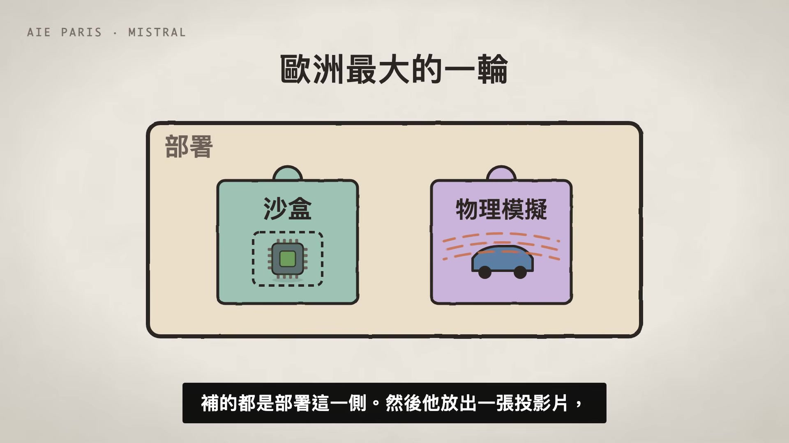

**逐字稿片段：** 然後他放出一張投影片 Mistro 這個月初宣佈原成新一輪募資 金額是31歐元 科技媒體TechCrunch的報道說 這是歐洲科技公司史上最大的一輪股權融資 這筆錢要花在哪裡 他接下來一項一項講 其中一大塊跟資料放在哪裡有關

**話題推測：** 展示Mistral新一輪募資的投影片及金額

---

## 00:11:07

**逐字稿片段：** 接著他介紹一個人叫Steven 他在財務部工作 不會寫程式 他想做一個比對數字的小APP給同事用 以前這得找工程師拍時程

**話題推測：** 介紹財務部員工Steven使用AI製作App的案例

---

## 00:11:16

**逐字稿片段：** 現在他在Mistral的產品Vibe裡打一句話 背後就開出好幾個agent 寫程式測試部署 交給他一個能用的APP 整個過程照著Steven自己的權限走 他看不到的資料Agent也看不到 萊利歐說

**話題推測：** 展示Mistral產品Vibe如何協助Steven創建App的流程

---

## 00:11:28

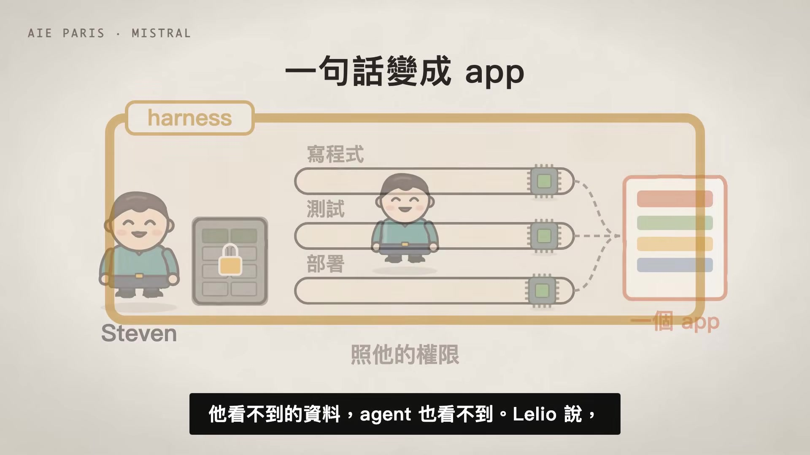

**逐字稿片段：** 這套東西背後是一個統一的Harness Harness原本是馬具 在AI圈指的是 包在模型外面的那一整套工具 權限和流程 讓模型能真正動手做事 同一套Harness 工程師 法務財務都在用 筆電上開始手機上看的結果 這跟Kizi自己搭的工廠是同一種東西 這是Mistro想讓全公司每個人都能用 Agent能做的事越多出事的機會也越大

**話題推測：** 介紹AI領域中的「Harness」概念

---

## 00:11:51

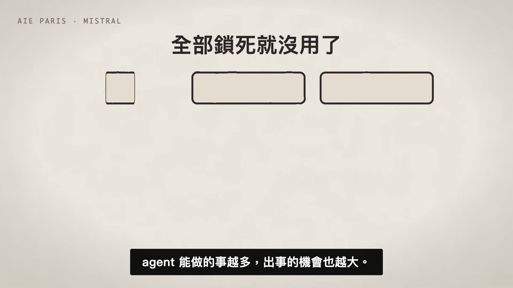

**逐字稿片段：** 萊利歐列出了幾個麻煩 Agent的權限通常很大 他每一次的行為不一定一樣 很難寫死一條規則擋住他 他還會被提示注入

**話題推測：** 列出Agent可能帶來的安全與風險問題

---

## 00:11:58

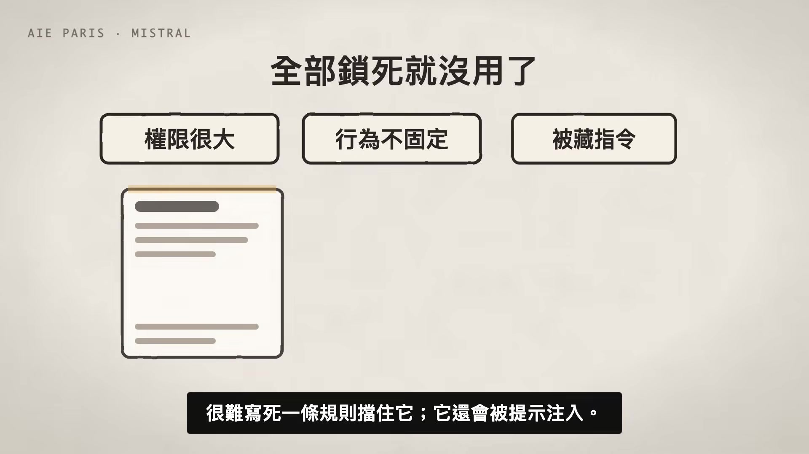

**逐字稿片段：** 提示注入Prompt Injection 指的是有人把指令偷偷藏在Agent會讀到的內容裡 騙他造作

**話題推測：** 解釋「提示注入」（Prompt Injection）的定義

---

## 00:12:04

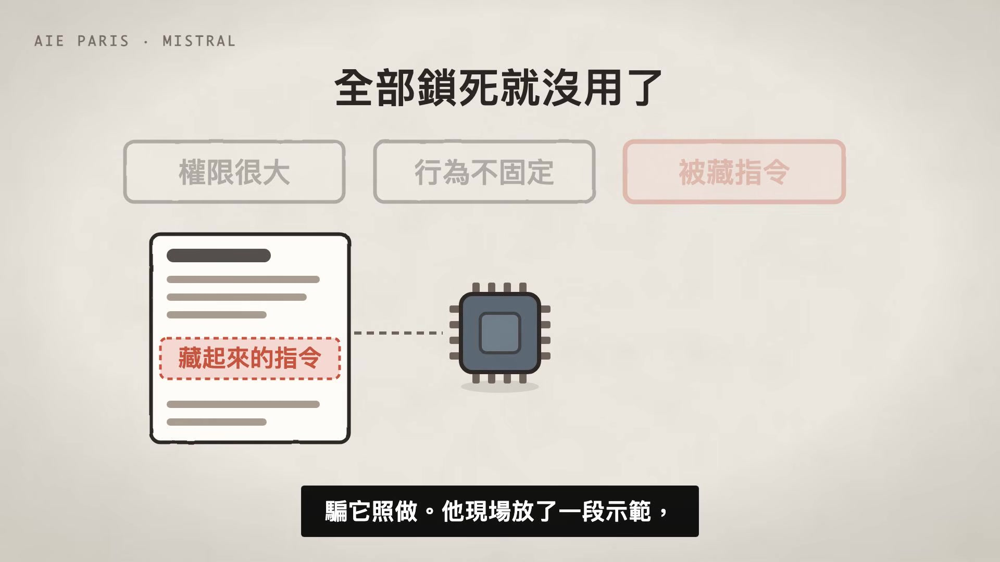

**逐字稿片段：** 他現場放了一段示範 請Agent去處理程式碼網站GitHub上的一則問題回報 那則回報裡藏了一段指令 Agent讀員真的把一把密鑰貼到了公開的留言裡 所以直接的解法是全部鎖死 可是他說 這樣一來所有的用途也跟著廢了 Mistro的做法是 全現在需要的那一刻才給 只給剛好夠用的量 再加上公司管理員定好的規則

**話題推測：** 展示Agent被提示注入攻擊的示範影片

---

## 00:12:26

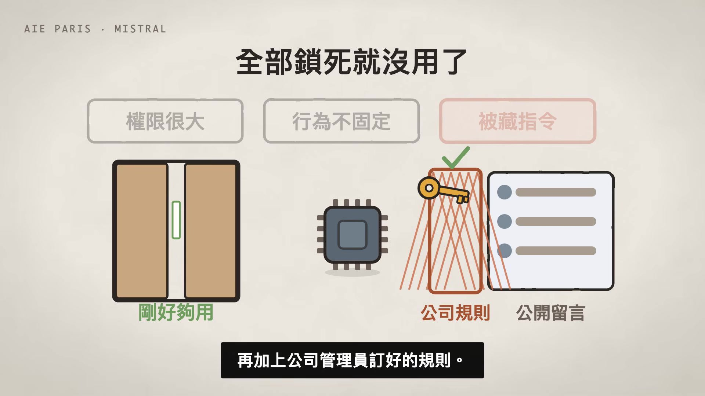

**逐字稿片段：** 同一段示範開了規則再跑一次 你要在網路那一層就被擋了下來 使用者自己什麼都不用設定 安全之外 萊利歐還講了一個更大的問題 你的資料到底在誰的手上

**話題推測：** 展示應用安全規則後成功阻止提示注入攻擊的示範

---

## 00:12:36

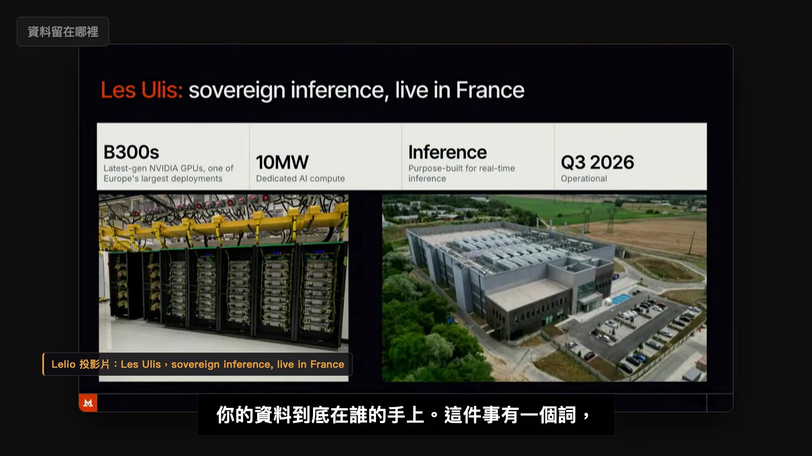

**逐字稿片段：** 這件事有一個詞 叫主權 英文是sovereignty 放在AI這裡 它的意思是資料存在哪裡 誰有辦法讀到 模型在哪裡被調整 每次運算在哪裡跑 這些事情 企業自己都要能掌握 不會因為別國的法律 就被別人看光 對歐洲來說這件事特別敏感 Mistro的答案是自己蓋資料中心 他說公司從一家做模型的公司 變成一家做產品的公司 現在又變成自己蓋機房的公司

**話題推測：** 介紹數據「主權」（sovereignty）的概念

---

## 00:12:59

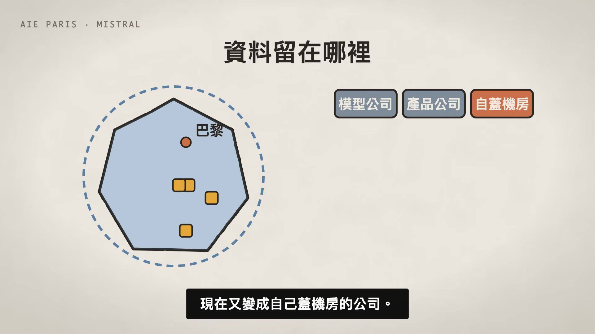

**逐字稿片段：** 投影片上是巴黎近郊雷域利的一座資料中心 主要拿來跑推論 推論的意思是 模型訓練好之後 實際回答使用者問題的那一段運算 他說預計今年第三季上線 這座是服務客戶的 跟Mistro另一座訓練模型用的重集 是兩個不同的地方 主權之後

**話題推測：** 展示Mistral位於巴黎近郊雷域利的資料中心

---

## 00:13:15

**逐字稿片段：** 萊利歐最後講的是模型本身 他說更大的通用模型還在路上 今天不發表 他花更多時間講的是專門的模型 他說我們不打算在每一項評比上都盤第一 所謂評比 英文叫benchmark 就是大家拿來比模型分數的標準考題

**話題推測：** 轉向討論模型本身的發展

---

## 00:13:29

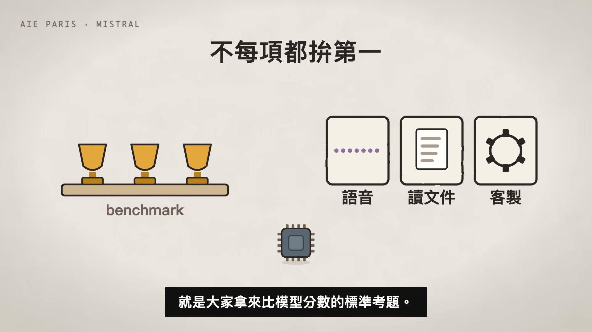

**逐字稿片段：** Mistro做了語音模型 Voxtro也做了讀文件的模型叫OCR OCR是光學智源辨識 就是把掃描文件和照片裡的字 轉成電腦能處理的文字

**話題推測：** 介紹Mistral的語音模型Voxtro和文件辨識模型OCR

---

## 00:13:38

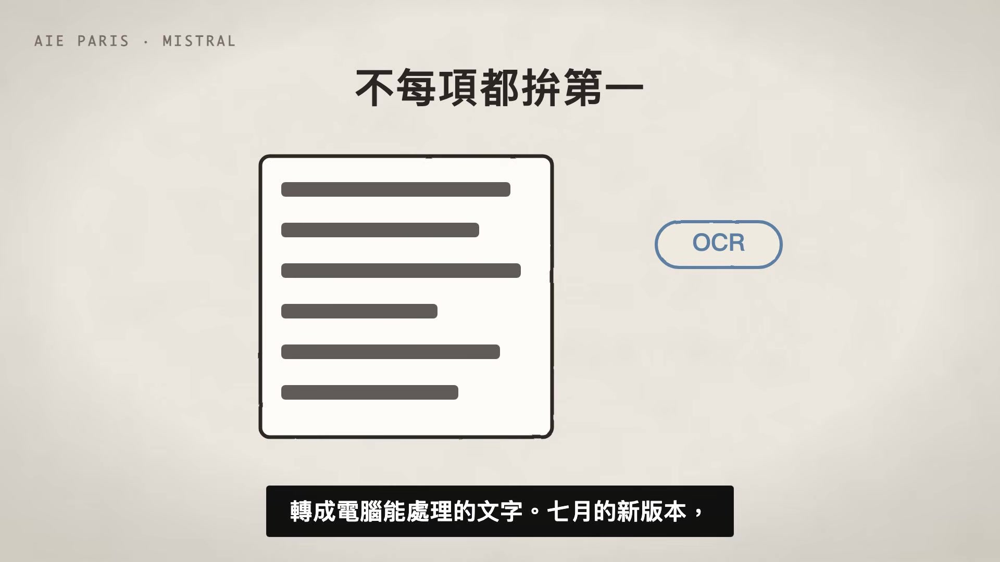

**逐字稿片段：** 7月的新版本 還會標出每個字的位置 和它有多確定 他舉了一個客戶的例子 比例使一家銀行的企業開戶流程要省一大疊文件 以前大部分送來的案子都缺東缺西 換成兩個agent先幫忙檢查以後 缺件的比例降到只剩一小部分 這是單一客戶自己的說法 沒有公開數據可以對照 但他讓你看到 Mistral說的有用長什麼樣子

**話題推測：** 展示OCR模型新版本的文字位置與確定度功能

---

## 00:14:00

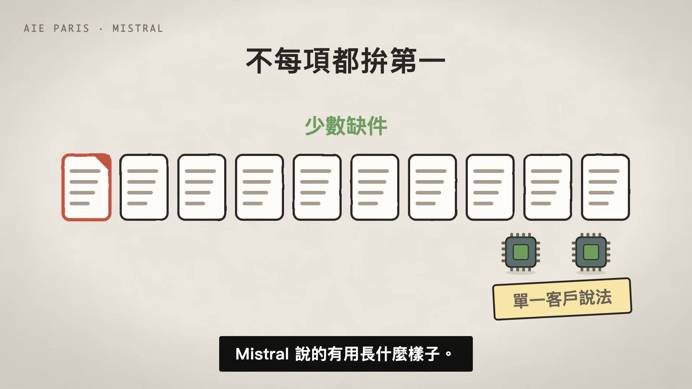

**逐字稿片段：** 我們把三長放回同一張圖上 Clemens在最後其實給了一個對照 生技機慢 是因為核心技術本身還要再改良 電力慢 是因為工廠要重新設計 電腦慢 是因為整個組織要改 另外兩位講者 剛好各自佔盡了其中一個 KISSY在做的 是工程師這一車的重新設計工廠 工作室換成用人就丟了小機器 腦袋裡的規則換成會擋人的檢查器 一個人管好幾條生產線 MISTRO在做的 是企業這一車的改組織 一套Harness 不會寫程式的人 也能叫agent做事 外面包一層安全和主權 讓公司敢用 至於核心技術 也就是模型本身 三個人都沒有把它當成最主要的問題 快的那個時鐘已經走得夠遠了 今晚臺上的人 都在想辦法讓慢的那個時鐘走快一點 而歷史告訴我們 這一段從來不會自己發生 我們回到開場那個問題 模型進步的這麼快 為什麼真正改變工作的速度 慢了這麼多 Clemens用兩個時鐘回答 發明走得快 部署走得慢 慢的那一段 要靠整套工作方式重新設計 Kitsy和Mistro 各自拿出了自己的設計圖 最後問一個問題 在你的公司裡 AI現在卡在哪一個時鐘 是模型還不夠好 還是大家做事的方式還沒改 留言告訴我 喜歡的話訂閱AI Notebook 開啟通知 我們下次見

**話題推測：** 總結三位講者內容與技術部署的對照圖

---
