# jimainotebook_K1cnH5DBplY — 關鍵畫面索引

- 來源逐字稿：[jimainotebook_K1cnH5DBplY_FIN.srt](jimainotebook_K1cnH5DBplY_FIN.srt)
- 影片：https://www.youtube.com/watch?v=K1cnH5DBplY
- 截圖數：36

## 00:00:12

**逐字稿片段：** 主角是Leonardo de Mora,他是Lean的創造者,現在是Lean FRO的首席架構師。

**話題推測：** 介紹影片主角Leonardo de Mora及其職位。

---

## 00:00:17

**逐字稿片段：** 今年7月25號,網路上出現一份證明,說他推翻了一個放了將近90年的數學猜想,叫Caulatz猜想。 這份證明附上了Lean的檢查結果,Lean蓋了章。 另一套獨立寫成的檢查程式,也蓋了章。 可是這份證明是錯的,Caulatz猜想到今天,沒有人證明,也沒有人推翻。 頻道前一支影片我們講

**話題推測：** 提及具體日期與「Collatz猜想」的重大事件。

---

## 00:00:35

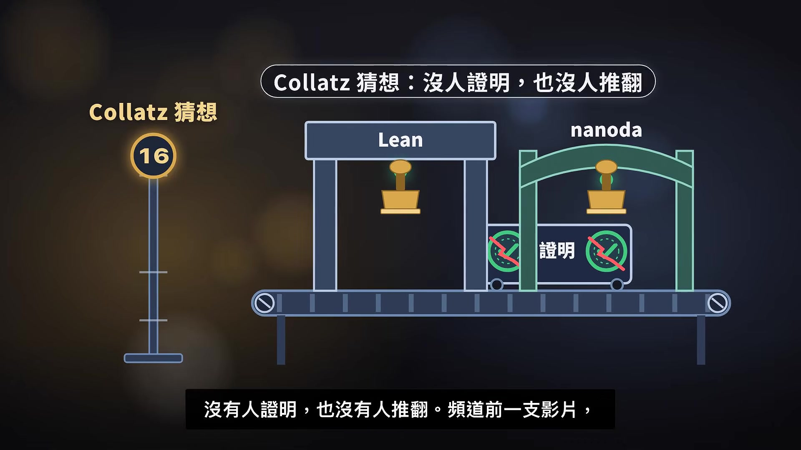

**逐字稿片段：** OpenAI公開700多篇AI數學論文 那支片的結論之一是 附上LIN證明的成果 比較讓人放心 這一集要往下多問一層 聯邦數學證明 蓋章的程式都可能被騙 AI大量交出證明以後 我們到底能相信什麼 這一集就只問這個問題

**話題推測：** 提及OpenAI的AI數學論文新進展。

---

## 00:00:49

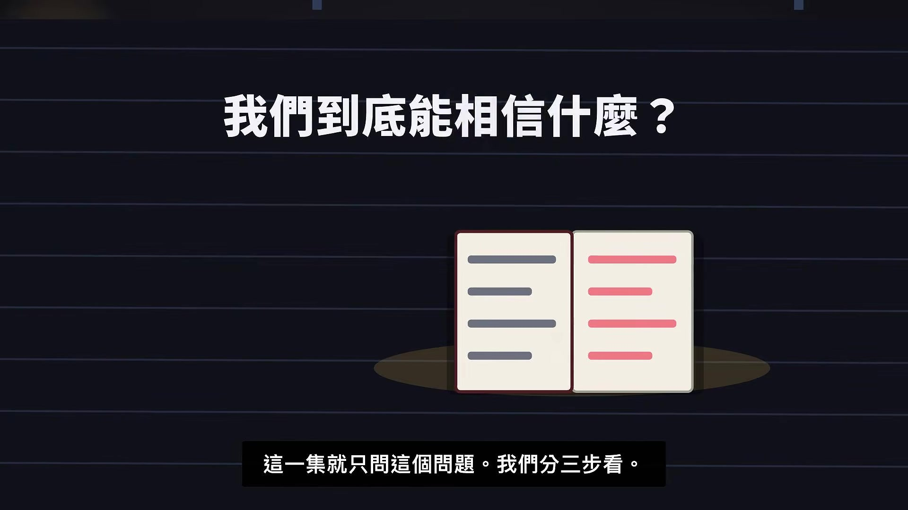

**逐字稿片段：** 我們分三步看 先看蓋章的程式是怎麼被騙的 再看就算章是真的 那到底保證了什麼 最後看 當證明長到沒有人讀得完 還剩下什麼工作

**話題推測：** 概述影片接下來的三個主要討論點。

---

## 00:00:58

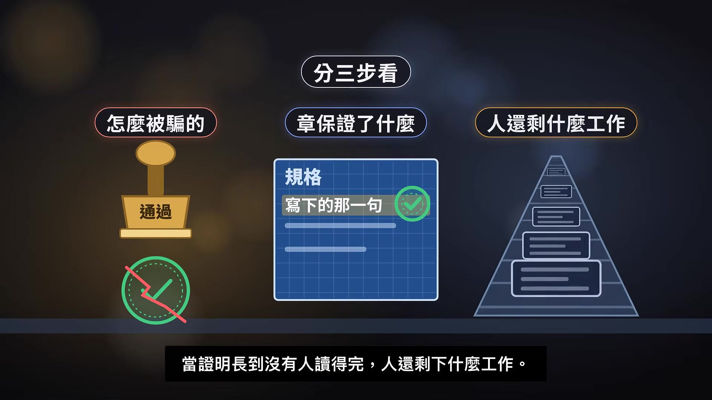

**逐字稿片段：** 先講LIN是什麼 LIN是一種程式語言 也許他會檢查每一步合不合規則 全部通過 他才承認這個證明成立 這類軟體有個正式名字叫證明輔助程式 你可以把它想成數學的裁判 數學家在紙上寫證明 靠的是同行一頁一頁讀 另不看感覺只看規則 哪一步跳太快他就吹哨 把紙上的證明翻成另看得懂的寫法 叫形式化 就像把食譜上的鹽少許 寫成鹽三克 每一步都不能考一會 De Mora從十幾年前開始寫另 他原本以為 這會是工程師用來檢查重要系統的工具 沒想到後來陶哲軒這樣的數學家也用他 還到處演講介紹 到了AI會寫證明的今天 很多研究團隊都拿Lin來檢查AI寫的證明 因為他的判決不靠人的眼睛 可是裁判本身也是程式 程式就會有bug 也就是寫錯的地方 Lin整套系統非常龐大 裡面有自動找證明的工具 有各種方便的寫法 現在還有AI在旁邊幫忙寫 這麼大的東西怎麼可能沒有錯

**話題推測：** 開始介紹「Lean」這個證明輔助程式的定義。

---

## 00:01:55

**逐字稿片段：** Lin的回答是一個叫核心的設計 英文叫Kernel 核心是Lin裡面一小段程式 只有幾千行 負責最後一道檢查 前面不管是人寫的 工具產生的 還是AI寫的 最後都要交給核心 一步一步重新核對一次 所以核心就像裁判手上那本規則書 比賽現場再亂 球員的花招再多 只要最後的判決 照規則書來 結果就算數 你不用相信整個Ling 只要相信這本薄薄的規則書 這個想法叫做 小而可信的核心 它是整支影片的地基 後面每個故事 都是在問這本規則書 靠不靠得住 聽他自己說

**話題推測：** 介紹Lean系統中的「核心」(Kernel)概念。

---

## 00:02:43

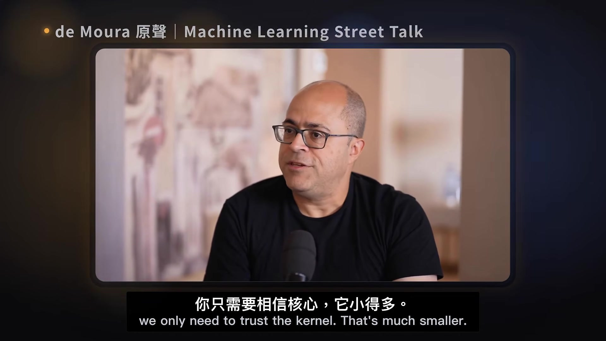

**逐字稿片段：** 先認識扣卡斯猜想 它的規則很簡單 隨便選一個正整數 如果是偶數 就變成它的一半 如果是奇數就乘以3再加1 然後一直重複下去 比如從3開始 會變成10 再變成5 16 8 4 最後落回1 數字忽上忽下 像冰雹在雲裡翻滾 所以它也叫冰雹疏裂 猜想說的是 不管從哪個數字開始 最後都會落回1 電腦已經檢查到 天文數字那麼大都成立 可是將近90年來 沒有人證明它

**話題推測：** 詳細解釋「Collatz猜想」的規則與案例。

---

## 00:03:09

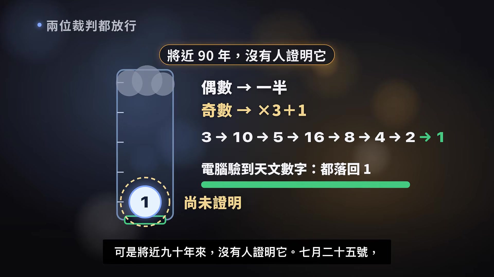

**逐字稿片段：** 7月25號 Romanakuma在Github 一個放程式碼的網站上 公開一份Lin證明 宣稱證明瞭 這個猜想是錯的 這份證明是AI協助產生 Lin的官方核心接受了它 Lin還回報 這份證明沒有偷用 任何額外的假設

**話題推測：** 再次提及具體日期，進入虛假證明被公開的事件描述。

---

## 00:03:22

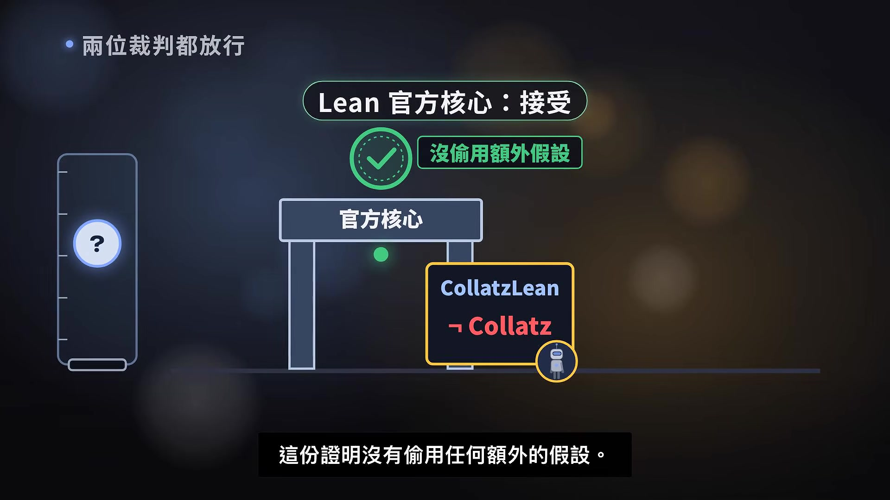

**逐字稿片段：** 另一個獨立寫成的核心叫Nanoda也接受了 兩位裁判同時放行了一份站不住的證明 聽他自己說 事後調查發現

**話題推測：** 介紹另一個獨立的檢查程式「Nanoda」。

---

## 00:03:49

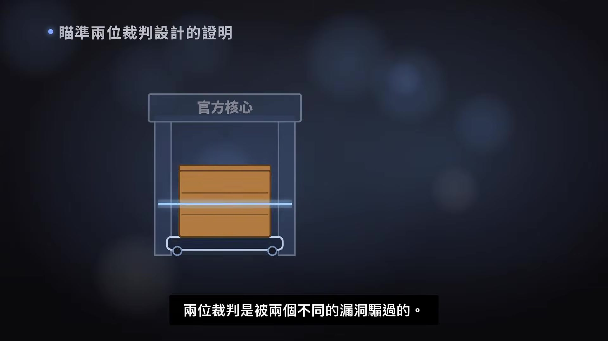

**逐字稿片段：** 兩位裁判是被兩個不同的漏洞騙過的 先講官方核心 零裡有一種資料性別 像是盒子裡又包著另一個盒子 核心在處理這種東西的時候 漏了一道檢查 有一部分內容 從頭到尾沒有被看過 只要在那個沒人看的位置 放一個錯的東西 就能讓核心接受一個命題 叫false 也就是假 核心一旦承認假是真的 什麼都證得出來 連0等於1都可以 就像裁判被騙 在一張空白單子上蓋了張 之後拿張單子 想寫什麼就寫什麼 Demo啊 特別強調 這是陳詩寫錯 不是令背後的數學理論有動 而且這個漏洞要繞過平常的寫法 直接把東西塞給核心才碰得到 另一位裁判南諾達 是Chris Bailey用Ross這種程式語言 從頭寫的另一個核心 官方漏掉的那一處 他有檢查 卻漏了另一處 他從一個東西里取出某一欄的時候 沒有確認 這個東西真的是他自稱的那種結構 就像檢票員只看座位號碼 沒看這張票是不是這班車的 這份證明的厲害之處 是兩個洞剛好對得上 官方沒檢查的那段 正好放進舊版的Noda會放行的東西 等Moradai修補官方核心的時候 注意到證明裡有一段 跟數學毫無關係的東西 被製造雜臭碰撞

**話題推測：** 總結兩個系統被不同漏洞欺騙的事實。

---

## 00:04:50

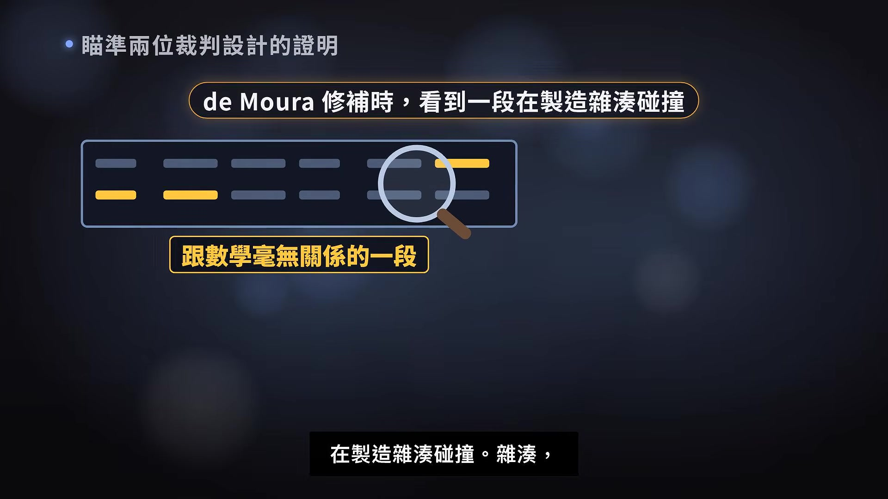

**逐字稿片段：** 雜臭是程式T一大段資料 算出的一串短短的編號 像指紋 碰撞 就是兩個不一樣的東西 算出同一個指紋 聽他自己說 I said why did they put this stuff there is to pass NANOTA I mean to exploit the bug in NANOTA

**話題推測：** 介紹「雜湊碰撞」這個技術概念。

---

## 00:05:22

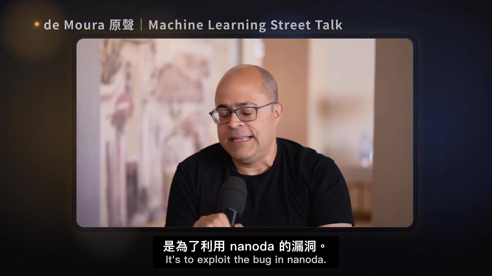

**逐字稿片段：** 7月28號 研究員Kieran Gopinathan 把這份證明說成一小段誠實 用最短的寫法讓Lin證出假 然後回報給Lin團隊 修正是Dimora本人寫的 從回報到他交出修正 只用了幾個小時 Lin團隊的Joaquin Breitner審過 提出改進 當天就合並進去 至於NANOTA差不多同一時間 他也剛被回報修補了一個漏洞 而這份證明用的正是修補前的舊版 這麼巧 是不是AI讀到了Nanoda的修補記錄 才設計出這個攻擊 提出這份證明的Romana認為是巧合 但也不能排除模型讀過那份回報 Liyin團隊另一個看法是 時間撞在一起 是因為現在剛好有夠強的模型 找得到這種漏洞了 這段訪談錄在7月底 就是事情發生的那一週 影片9月底才上架 Dimora在訪談裡說了一句後來應驗的話 聽他怎麼講 what we can do to improve Because this is going to keep happening people's AI is really good Bugs in the kernels 他說對了而且來得很快 訪談錄完沒幾天

**話題推測：** 提及具體日期，說明漏洞被報告及修復的過程。

---

## 00:06:28

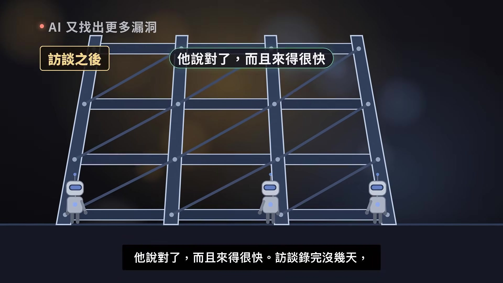

**逐字稿片段：** 從7月30號到8月20號 OpenAI的研究員Denny Selsom 用公司內部的模型 對 另的核心和執行環境 辦了一場抓漏洞大賽 一直進行到模型回報 找不到更多了 結果模型又找出好幾個漏洞 每一個都能讓官方核心接受甲 大部分被Nanoda和一個新寫的檢查程式擋了下來 但有一個連舊版Nanoda也放行了 Dimora在事後報告裡說其中兩招非常巧妙 一招跟技術器有關 程式會記住某個東西正被幾個地方使用 這個數字叫參照技術 模型故意讓這個技術器異位 就像汽車的里程錶轉過頭歸零 把記憶體弄亂再趁亂正出甲 另一招是發現Lean在Linux上的官方版本 用了一個舊版的大數運算函式庫 叫GMP Linux 是一種常見的作業系統 GMP專門處理很大的數字 這個舊版有已知的bug 模型就拿它來造假證明

**話題推測：** 提及新的日期區間，OpenAI進行大規模漏洞挖掘。

---

## 00:07:16

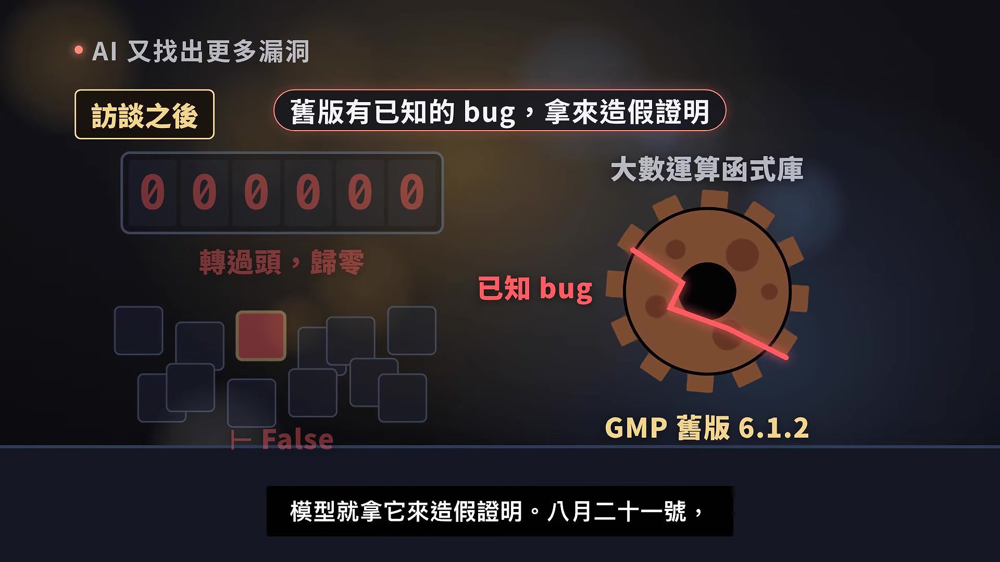

**逐字稿片段：** 8月21號 另釋出新版 把這些漏洞全部修補好 還加了一個指令 可以一次用所有內建的核心 把證明重新檢查一遍 同一段時間 用公開模型找漏洞的團隊 沒有人回報任何一個 報告裡還有一句很重的話 我們把AI產生的證明 當成可能的惡意證明 那要怎麼防

**話題推測：** 提及具體日期，Lean新版釋出並修補漏洞。

---

## 00:07:33

**逐字稿片段：** DEMORA的方向 不是把一位裁判變得更強 而是請更多位彼此獨立的裁判 不同的人 用不同的程式語言 各自從頭寫一個核心 同一份證明交給每一位都檢查一次 一個人寫出的漏洞 另一個人剛好犯同一個錯的機會 小的多 另一團隊用來重新檢查證明的工具 叫Comparator 他想把考卷收走 換一間教室 請兩位老師重新批改事件之後 Comparator預設 會同時用官方核心和Nanodart檢查 而且每天換上最新版的Nanodart 再往下一層是 證明核心本身沒有寫錯

**話題推測：** 轉向討論如何防範未來漏洞的方向和策略。

---

## 00:08:03

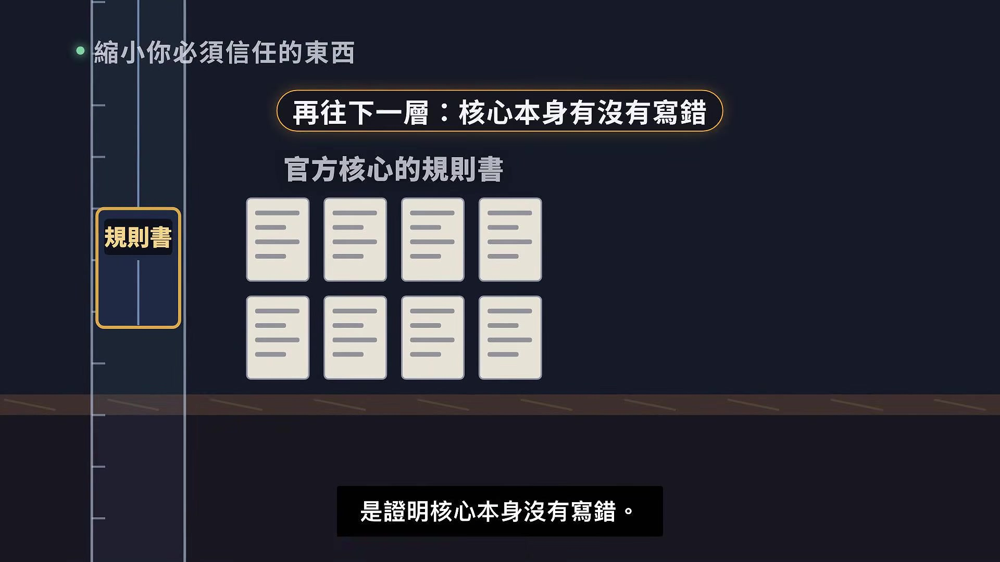

**逐字稿片段：** Mario Canero在做一個叫Linfo-Lin的專案 用另來證明另的核心是對的 可是他還沒證完 偏偏沒證到的 就是這次被攻擊的那一塊 而且他照著官方核心寫 連同一個漏洞也一起抄了過去 Demora說 要是那部分先證完 這個漏洞會在被利用之前就被找到 他也反對把核心藏起來 靠保密換安全 他認核心必須公開 大家才能一起檢查 就算核心證明是對的 他要靠編譯器 也就是把程式翻成電腦指令的工具 最後在處理器上執行 每一層都可能出錯 所以這條路要一路往下走 聽他自己說

**話題推測：** 介紹新的人物與專案，試圖用Lean證明Lean核心的正確性。

---

## 00:09:00

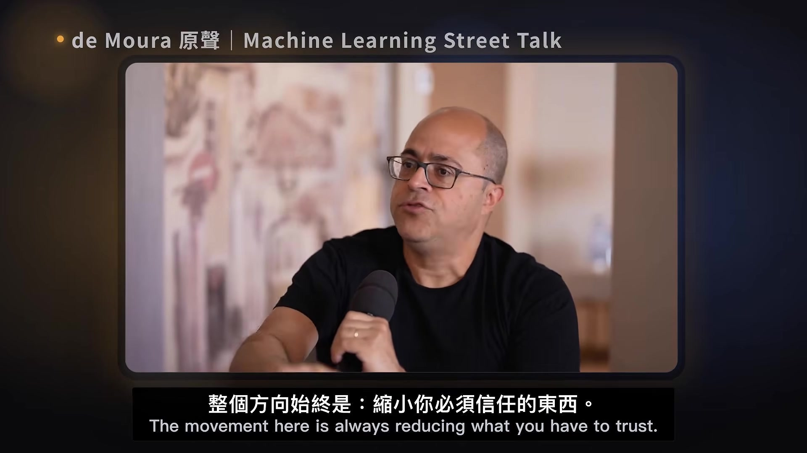

**逐字稿片段：** 先收下第一部分的答案 蓋章的程式被騙了我們還能相信什麼 答案是 不要只相信一位裁判 把必須信任的東西說到最小 只剩一本薄薄的規則書 再請好幾位彼此獨立的裁判 各自拿自己的規則書核對 規則書本身要公開給所有人檢查 最好還能被證明沒有寫錯 另一團隊現在的態度 是把AI交來的每一份證明 都當成可能是來找漏洞的 這樣做以後 章蓋下去就可信得多 可是還有一個問題沒回答 就算每一位裁判都沒被騙 這個章到底保證了什麼

**話題推測：** 總結影片第一部分的討論重點。

---

## 00:09:29

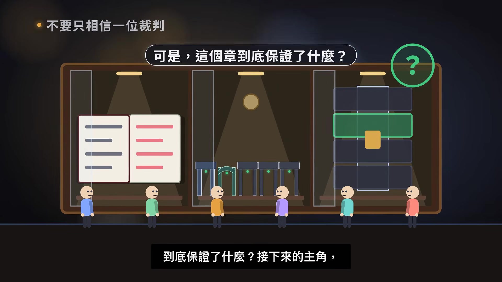

**逐字稿片段：** 接下來的主角 是一個你每天都在用 卻大概沒看過的程式

**話題推測：** 引入第二個主要討論議題。

---

## 00:09:34

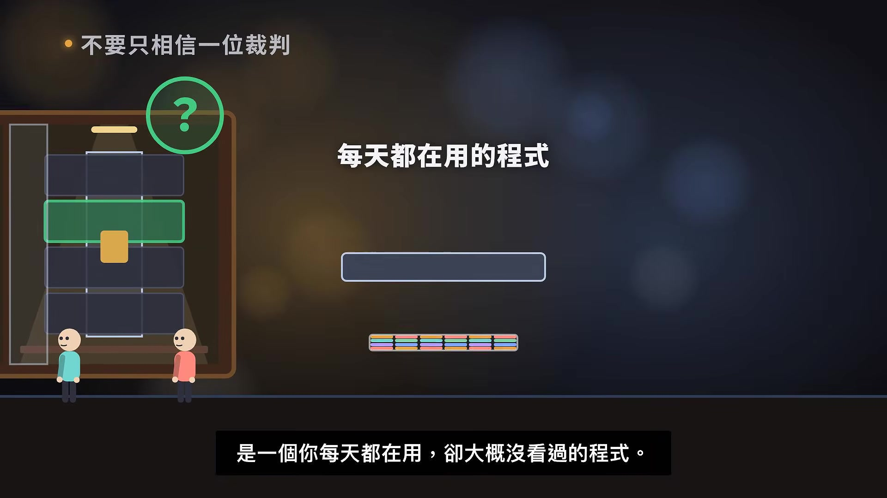

**逐字稿片段：** 這個程式叫Zlib 它是一套把資料壓小的程式庫 你下載檔案 打開網頁 看一張PNG圖片 背後常常都有它在幫忙 它是幾十年前用C這種程式語言寫的 大量的軟體都靠它

**話題推測：** 介紹日常廣泛使用的壓縮程式庫「Zlib」。

---

## 00:09:47

**逐字稿片段：** 今年2月 Mora公開了 Lean團隊的Kim Morrison做的一個實驗 Kim用的是Cloud 一個一般用途的AI 沒有為了證明數學特別訓練過 拿來直接用 請他把Zlib翻成Lean 再用Lean證明它是對的 裡莫瓦說 年初他覺得這件事 沒指望AI還不夠好

**話題推測：** 提及具體日期，開始說明Lean團隊的Zlib實驗。

---

## 00:10:03

**逐字稿片段：** 這裡要先分清楚兩個詞 測試是拿一些例子去試 例子都對 不代表所有情況都對 證明 對 所有可能的輸入都成立 差別就像煮一鍋湯 試吃十口都不鹹 跟保證整鍋每一口都不鹹 是兩回事 結果AI不只做到測試 還做到了證明 聽他自己說 with the C version and then it proves that for any compression level for any data if you compress the data and then decompress you get the original data back

**話題推測：** 開始區分「測試」與「證明」兩個關鍵概念。

---

## 00:10:44

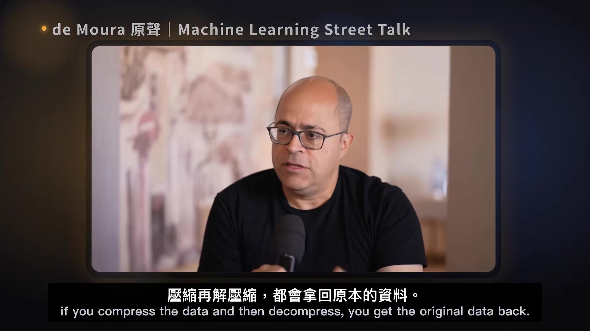

**逐字稿片段：** 他證明的那句話是 不管哪一種壓縮等級 不管什麼資料 壓縮再解壓縮 都拿回原本那一份 這是對所有資料成立的保證 不是試試幾口 這一句被證明成立的話叫定理

**話題推測：** 闡述AI成功證明Zlib的具體定理。

---

## 00:10:55

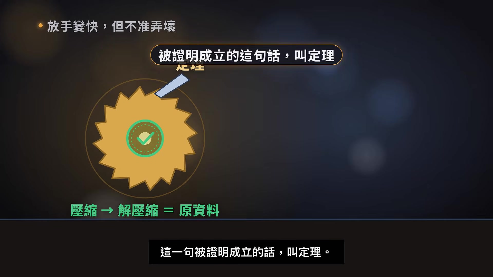

**逐字稿片段：** 接著Kim讓AI放手去讓程式變快 條件只有一個 每修改一次 都要重新證明那個定理 震不出來就不準合併進去 這種做法 Lean團隊說是把正名當成極輪 極輪是隻能往一個方向轉的齒輪 腳踏車後輪裡就有 往前踩會帶著車子走 往後倒踩就空轉 這裡的意思是 城市只能往更快的方向走 不能一邊變快一邊變錯 結果在同樣的壓縮程度下 它的壓縮速度 贏過一個很常用的Rust壓縮函式庫 叫Minis Oxide Rust是一種以又快又安全出名的語言 不過要講清楚 它不是比所有版本都快 更講究速度的Z-Lib NG和Z-Lib RS 大部分情況還是比他快 DeMura的感想是 人沒有耐心做這種 很低階很瑣碎的最佳化 AI有 他說去年他還覺得不可能 現在看得到一條路了 他還說了一句很有把握的話 聽他怎麼講 作弊不了 這句話有個前提 就是裁判本身沒有漏洞 第一部分我們才看過 這個前提不見得成立 而且就算裁判沒被騙 還要問一件事 章蓋在哪一句話上

**話題推測：** 介紹實驗的下一階段，利用證明加速程式碼。

---

## 00:12:05

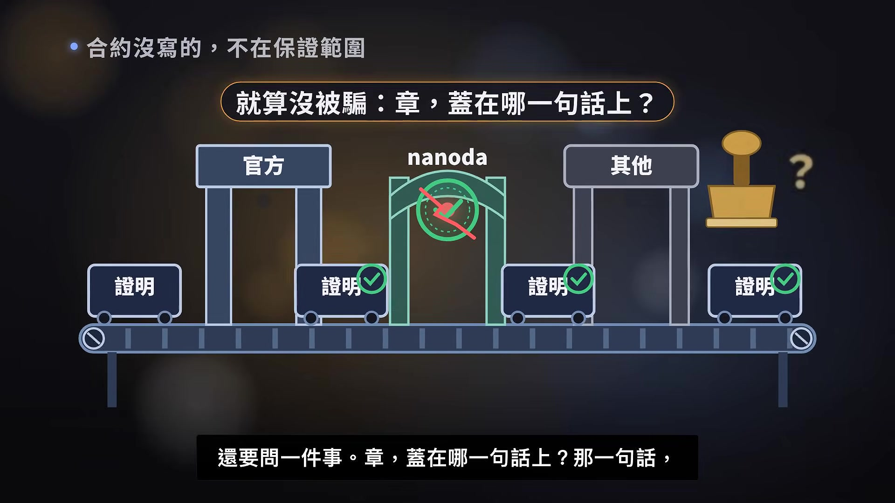

**逐字稿片段：** 那一句話叫規格 英文叫specification 規格是寫清楚一個程式 應該做到什麼的那段敘述 證明保證的是程式符合這段規格 規格沒寫的是證明不負責 這就像蓋房子的合約 驗收的人只對照合約 合約裡沒寫的 就不在保證範圍 Zlib剛好可以看到這件事

**話題推測：** 引入「規格」（Specification）這一核心概念。

---

## 00:12:21

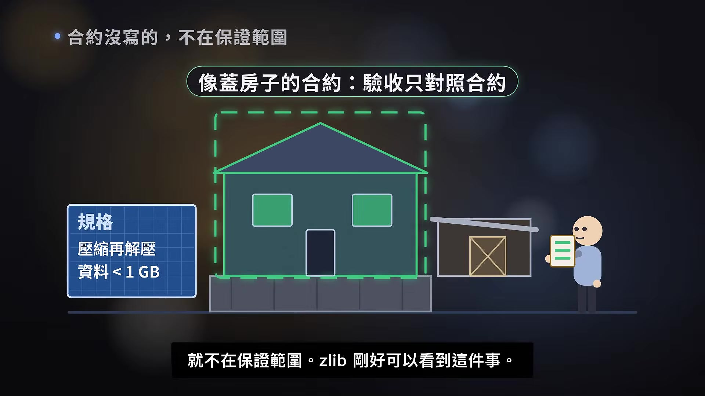

**逐字稿片段：** 今年2月那一版的定理 有一個小小的前提資料要小於1GB 這個上限 是AI為了把證明收尾 自己加上去的 後來的版本換了寫法 但你看 合約上的一行小字 就決定了保證的範圍 今年4月 Kieran Gopinathan 就是後來回報 Coloss漏洞的那一位 用Cloud帶著一組自動化工具 對這個Lin版的Zlib

**話題推測：** 提及Zlib證明中關於「資料小於1GB」的規格前提。

---

## 00:12:43

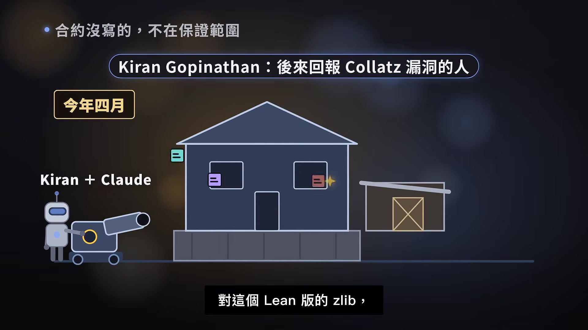

**逐字稿片段：** 做了1億零500萬次模糊測試 模糊測試 就是不停丟亂七八糟的資料進去 看程式會不會出事 結果很有意思 被證明過的那部分 另程式碼 一個記憶體漏洞都沒有

**話題推測：** 提及具體數字，模糊測試的巨大規模。

---

## 00:12:52

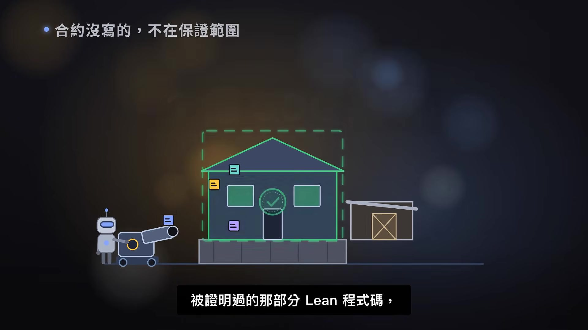

**逐字稿片段：** 可是他在另一的執行環境裡 找到一個記憶體溢出的漏洞 影響所有版本 執行環境 是讓另一程式真正在 電腦上運作的那層底座 記憶體溢出 就是往一個格子塞進超過容量的資料 蓋到隔壁的格子 他還在Zlib裡一段沒有被證明的程式 找到一個能讓程式癱瘓的漏洞 來短程式 負責讀壓縮檔的目錄 證明守住了他承諾的那一塊 出事的地方 都在合約外面 我再收下這部分的答案 就算裁判都沒被騙人章保證的 也只是寫下來的那句規格 而且只涵蓋被證明的那一塊 規格寫窄了 藏了一行小字 或者有一段程式根本沒被證明 章都管不到 把前面兩部分接起來 我們能相信的東西就很清楚了 一個是那幾位彼此獨立的裁判 另一個是你寫下來的規格 其他的 像執行環境編譯器處理器 都要一層一層在檢查 這聽起來很麻煩 為什麼不乾脆找人組行讀一遍 因為有些證明 已經長到沒有人讀得完

**話題推測：** 說明在Lean執行環境中發現了記憶體漏洞。

---

## 00:13:44

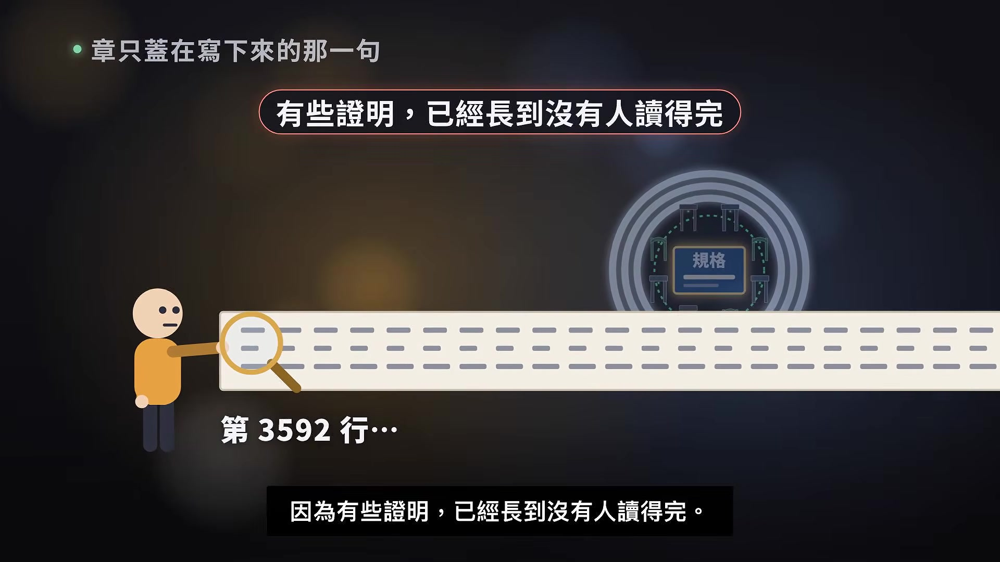

**逐字稿片段：** 回到頻道前一支影片 OpenAI用內部的模型 推翻了數學家 艾迪區提出的一個猜想

**話題推測：** 轉向第三部分，回顧OpenAI推翻數學猜想的例子。

---

## 00:13:50

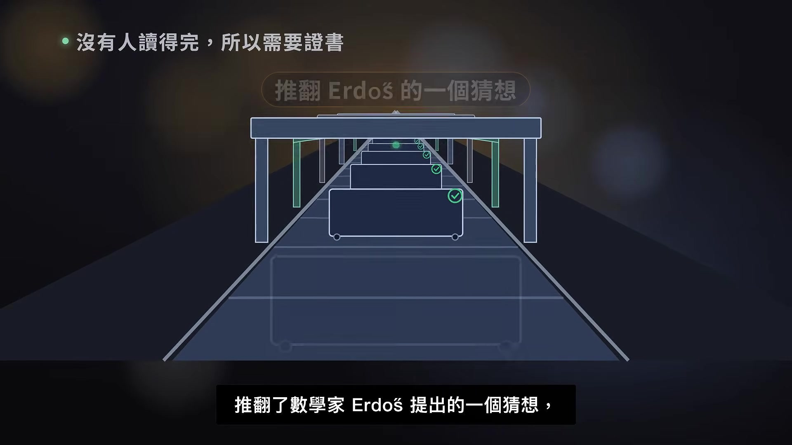

**逐字稿片段：** 叫單位距離猜想 講的是平面上一堆點之間 最多能有多少對點 剛好距離相同 艾迪區是20世紀 發表最多論文的數學家之一 這個推翻的結果 有一份令 證明 由Boris Alexiev公開出來 迪莫拉在訪談裡 就拿他當例子 他的主張是 就算有一個模型 幾乎每一次都答對

**話題推測：** 介紹OpenAI推翻的「單位距離猜想」。

---

## 00:14:08

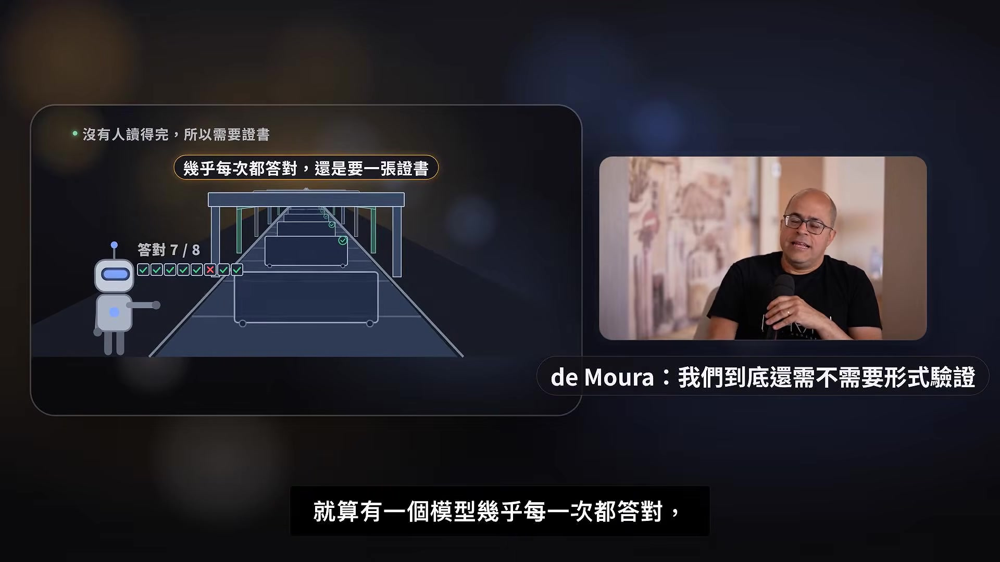

**逐字稿片段：** 我們還是要一張證書 這裡的證書 指的是一份機器人檢查的證明 他不靠你相信誰 任何人都能拿任何一位裁判 重新核對一遍 這就是第一部分那些裁判的用處 證書不是給人讀的 是給裁判讀的

**話題推測：** 引入「證書」的概念，作為機器檢查證明。

---

## 00:14:21

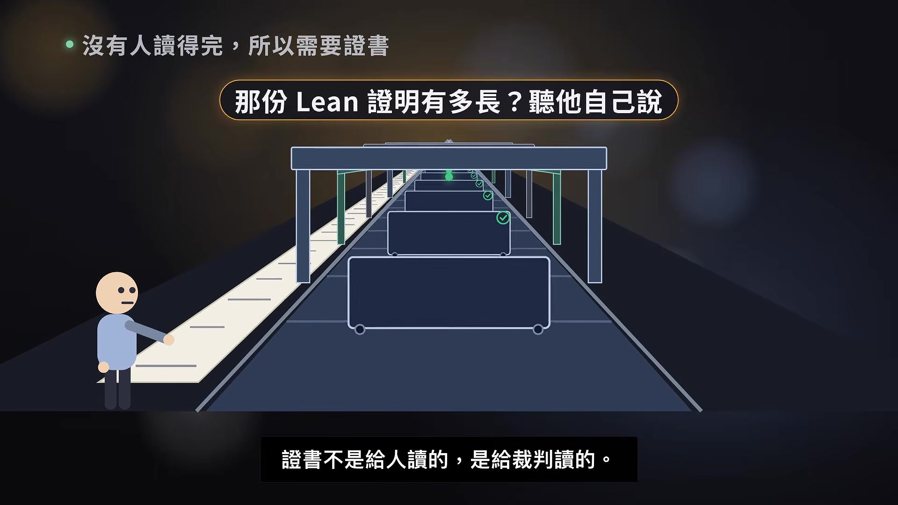

**逐字稿片段：** 至於那份令證明有多長 聽他自己說 一行讀十秒 一天讀八個小時 一個人要讀一年多 沒有人會這樣讀 也不必這樣讀 只要第一部分的那幾位裁判都點頭 張證書就算數

**話題推測：** 討論AI證明長度驚人，人類無法閱讀。

---

## 00:14:53

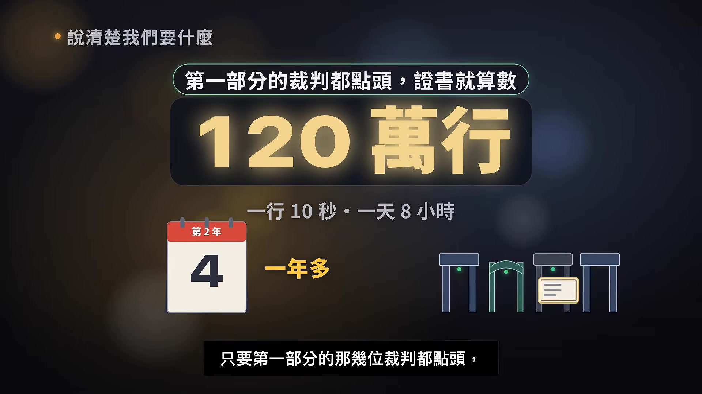

**逐字稿片段：** 這就是第三部分的答案 證明多到人讀不完的時候 我們不再主行讀證明 而是相信兩樣東西 好幾位彼此獨立 而且公開給大家檢查了裁判 以及我們自己寫下來的規格

**話題推測：** 總結影片第三部分的討論重點。

---

## 00:15:04

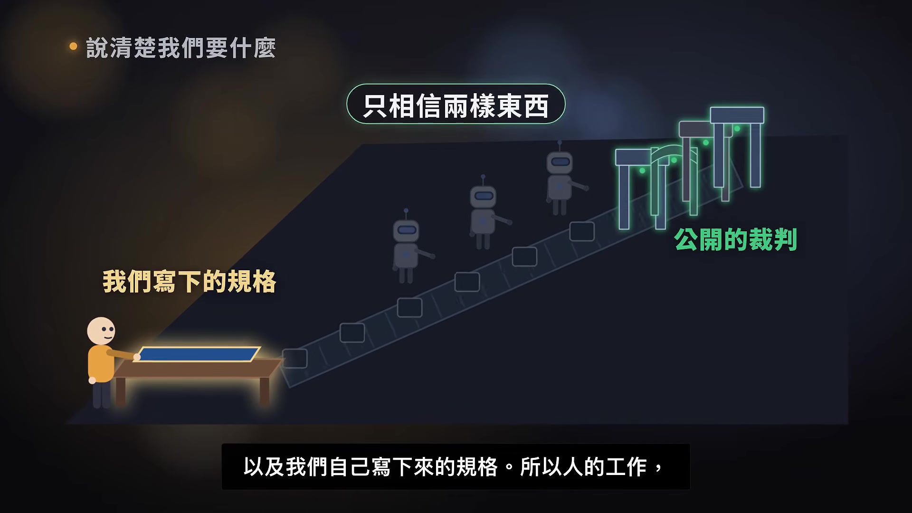

**逐字稿片段：** 所以人的工作 搬到了最前面 林木娜的看法是 AI很擅長把文獻裡現成的招數組合起來 可是需要發揮的方式 發明新招的時候他好像還差一截 更根本的是 什麼才是我們要的 只有我們說得出來 規格寫錯了 證明在完美 也只是完美D證明瞭一件錯的事 這也是他對人類角色的回答 聽他自己說

**話題推測：** 討論AI時代下人類在證明領域的角色。

---

## 00:15:48

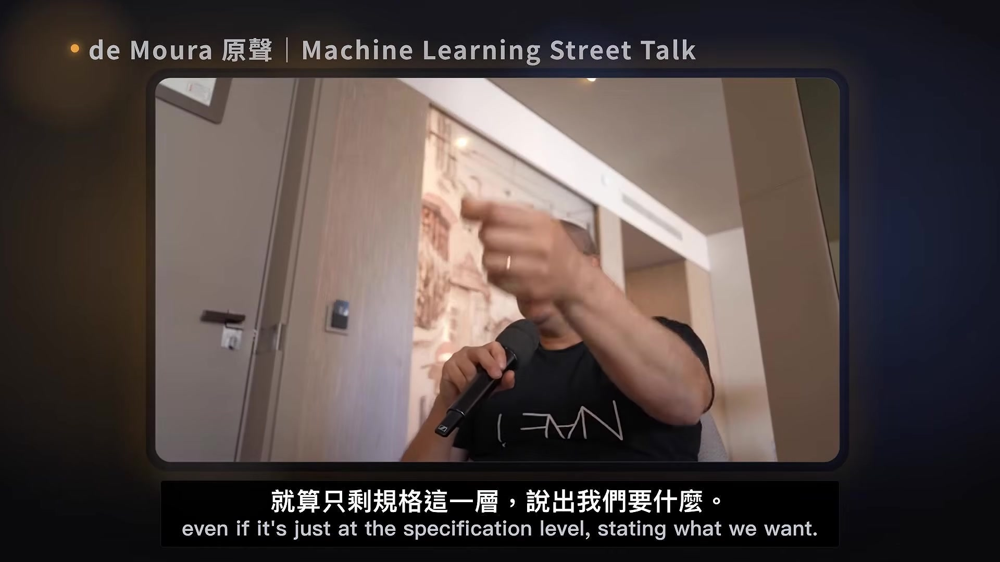

**逐字稿片段：** 我們回到開場那個問題 聯邦數學證明蓋章的程式都可能被騙 AI大量交出證明以後 我們到底能相信什麼

**話題推測：** 回顧影片開場提出的核心問題。

---

## 00:15:56

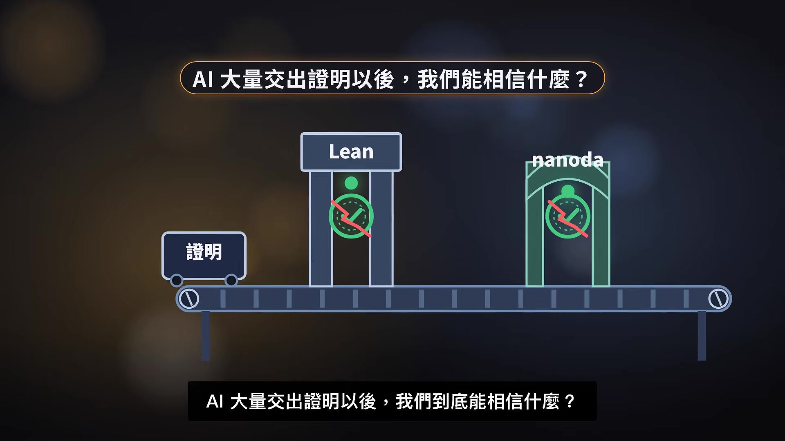

**逐字稿片段：** DMUA的答案有三層 不要只相信一位裁判 把必須信任的東西說到最小 再請好幾位彼此獨立的裁判 公開的互相核對 記得章子蓋在寫下來的那句規格上 而當證明長到沒有人讀得完 我們靠的是機器能檢查的證書 人負責的是把規格寫對 那份collapse假證明騙過了兩位裁判 卻也讓這套系統多了好幾道防線

**話題推測：** 總結De Mora對核心問題的三層回答。

---

## 00:16:17

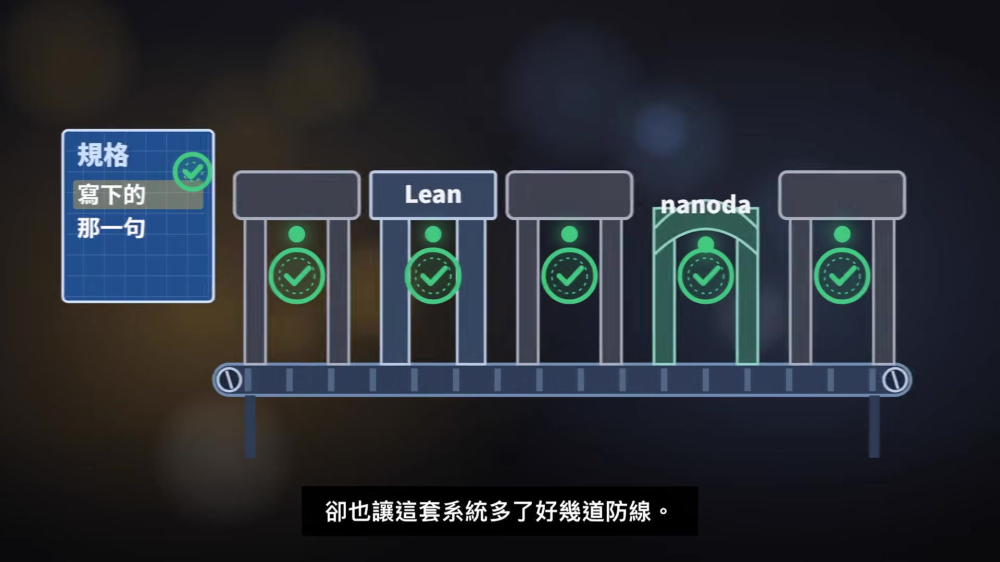

**逐字稿片段：** 最後問你一個問題 如果AI教給你一份 長到讀不完的證明 說你的程式沒有錯 你會想先檢查哪一樣東西 留言告訴我 喜歡的話訂閱AI Notebook 開啟通知 我們下次見

**話題推測：** 影片結束前的互動提問。

---
