# jimainotebook_N1eF7fCm_Hk — 關鍵畫面索引

- 來源逐字稿：[jimainotebook_N1eF7fCm_Hk_FIN.srt](jimainotebook_N1eF7fCm_Hk_FIN.srt)
- 影片：https://www.youtube.com/watch?v=N1eF7fCm_Hk
- 截圖數：60

## 00:00:24

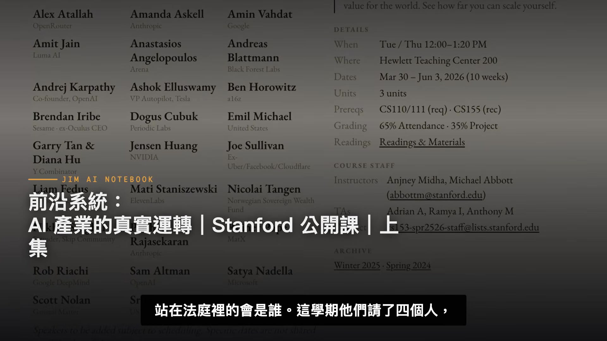

**逐字稿片段：** 這學期他們請了四個人 微軟的執行長 OpenAI的執行長 Google 關於基礎設施的技術長 還有一位前Uber的資安長 這四個人剛好站在 這條產業鏈的四個位置上 他們講出來的東西 有一個共同點 那也是我們今天 要一路追下去的線索 我們先從一句 聽起來很奇怪的話開始

**話題推測：** 介紹本學期邀請的四位講者及其職位。

---

## 00:00:44

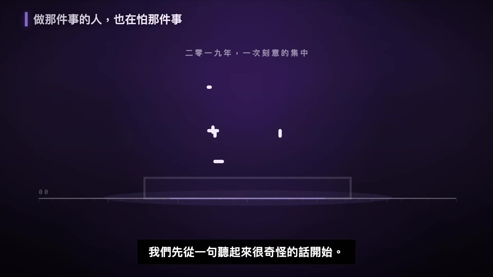

**逐字稿片段：** 2019年 微軟決定投資OpenAI 10億美元 六年之後 微軟的董事長 兼執行長Satya Nadella 坐在史丹佛的講臺上 被問到這個決定 他的回答繞開了那筆錢 他說你真正在分配的 從來不是資本 最大的那一個決定 是算力的集中 也就是說 這個時代的起點 是一次刻意的集中 把當時全世界 最稀缺的運算資源 壓在一個團隊 一個方向上面 而這門課請到的每一個人 包括他自己都在講 同一件他們害怕的事 權力不可以集中 在少數幾家公司手上 同一群人做了那件事 又在警告那件事 更奇怪的是 他們沒有一個人能說出 要怎麼避開它 這條矛盾就是我們今天要一路跟著走源的線索 我們先講清楚今天在看的是什麼

**話題推測：** 談及2019年微軟投資OpenAI 10億美元的決定。

---

## 00:01:31

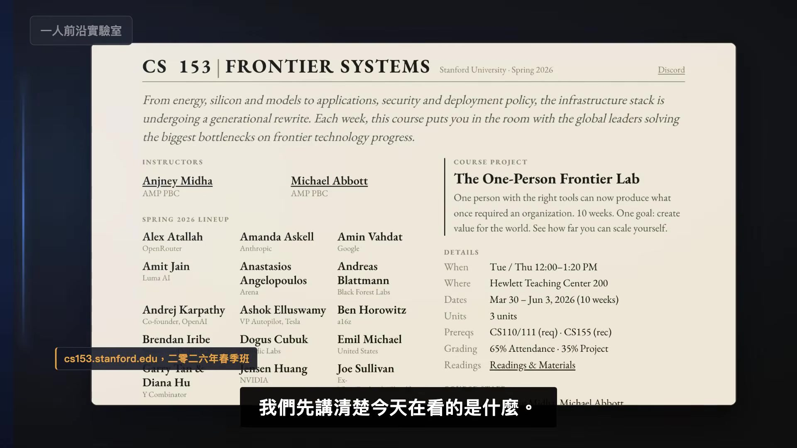

**逐字稿片段：** 這門課叫CS153 Frontier Systems 中文可以說成前沿系統 是史丹佛2026年春季開的課

**話題推測：** 介紹史丹佛CS153 Frontier Systems課程的名稱和開課資訊。

---

## 00:01:40

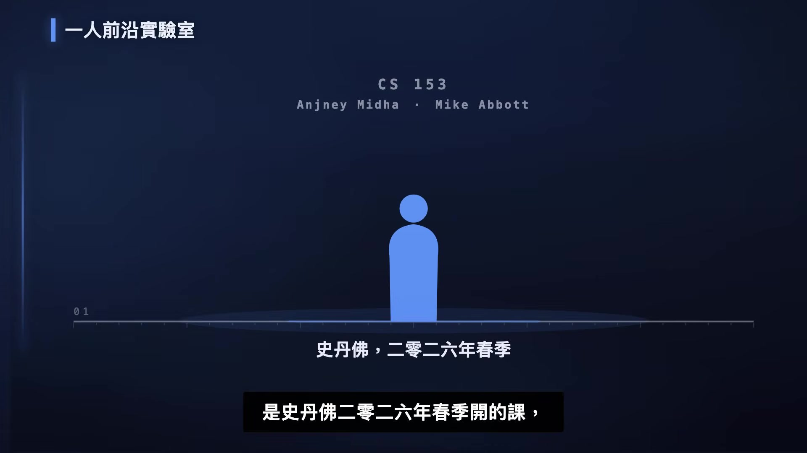

**逐字稿片段：** 授課的是Angie Mita和Mike Abbott 兩個人都來自一家叫AMP的公司 Abbott 這個名字你可能沒聽過 但他做過微軟早期的雲端服務 當過Twitter第一任工程副總 也管過Apple的雲端 這門課從第一堂就把姿態擺得很清楚 不教你怎麼把模型訓練出來 他教你這一整套東西是怎麼運轉的 而最能說明他野心的

**話題推測：** 介紹課程授課講師Angie Mita和Mike Abbott及其背景。

---

## 00:02:03

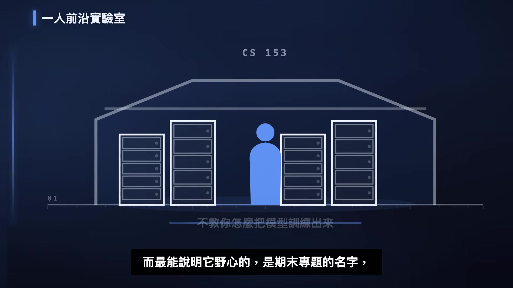

**逐字稿片段：** 是期末專題的名字 叫The One Person Frontier Lab 一眼前沿實驗室 科網上寫的原話是 十週一個目標 為世界創造價值 看你能把自己放大到什麼程度 史丹佛正在教學生 怎麼一個人當一間實驗室 你今天要看的這四堂 就是他們請來的四個人 站在這條產業鏈的四個位置上 裡面的運作講給學生聽 我們從微軟的執行長 Satya Nadella開始 他這一堂是在 微軟開發者大會結束的 隔天盧德 人剛從舞臺上下來 訪談一開場就問了 那個所有人都想問的問題

**話題推測：** 提及課程期末專題「The One Person Frontier Lab」及其目標。

---

## 00:02:38

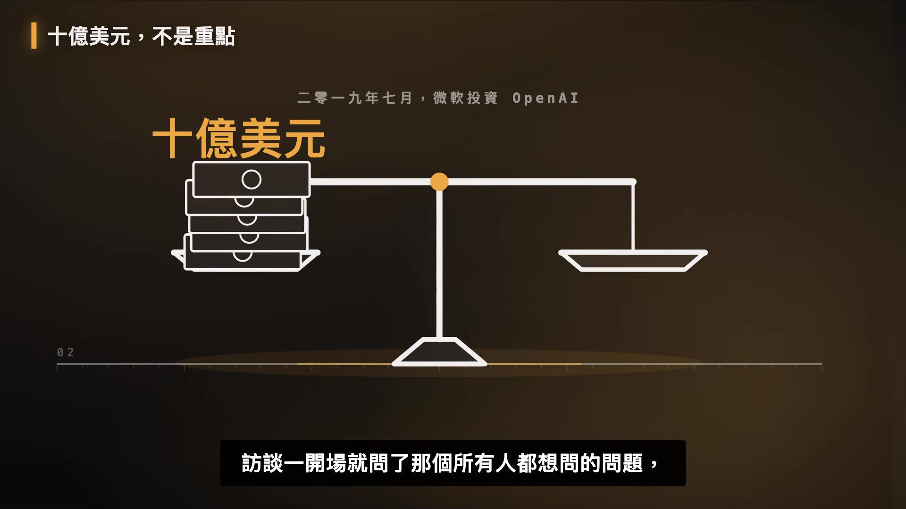

**逐字稿片段：** 2019年7月 微軟宣佈投資OpenAI11美元 那個決定是怎麼做出來的 你可能以為他會講一段 關於眼光的故事 他沒有 他說 任何時候你在分配稀缺資源 而很多時候 那個資源根本不只是錢 最大的那一個決定 是算力的集中 他的意思是 錢不稀缺 微軟賬上多的是錢 真正稀缺的是 當時全世界能拿來做這件事的運算資源 而他們決定不要平均分給100個專案 要壓在一個團隊身上 他還補了一段 很少有執行長會講的話 他說2017 2018年那個時候的微軟 其實不太相信深度學習 你那時候去問他們 他們會說某種符號邏輯 加上機器學習的組合 他說 我們大概不是最相信深度學習 能在語言上做出突破的那群人 所以那不是一個先知的決定 那是一個他們自己都還不確定的 那個賭注贏了以後 他現在在想的是另一件事 而這件事跟你上班的那家公司直接有關

**話題推測：** 回顧2019年7月微軟投資OpenAI 10億美元的背景。

---

## 00:03:32

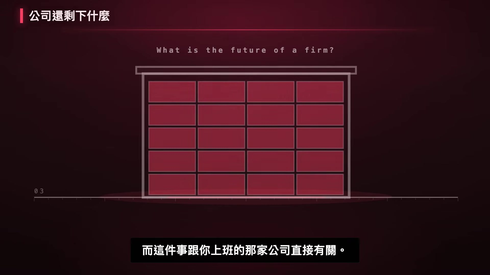

**逐字稿片段：** 他在課堂上問了一個很硬的問題 如果一個模型是從資料裡學會的 那公司這個東西的未來是什麼 他自己接著解釋 公司今天之所以值錢 是因為他在營運過程裡 累積下來的隱性知識 還有人生上的經驗 這些東西不寫在任何一份文件裡 它長在人跟流程中間 可是當這些東西越來越多被模型學走 公司還剩下什麼 他給的答案沒有留情面 他說 如果你只是一個基礎模型的消費者 我不確定你要怎麼保住企業價值 更別說創造價值了 你可以把這句話翻譯成一個很日常的畫面 你們公司花了15年 練出來的那一套做事方法 現在外面有一個買得到的工具 做得跟你們的直升員工一樣好 甚至更好 那你們公司相對於別人的優勢 還剩下幾成 這就是他要所有企業客戶正視的問題 所以他的解法是什麼

**話題推測：** Nadella提出「公司這個東西的未來是什麼？」的新問題。

---

## 00:04:22

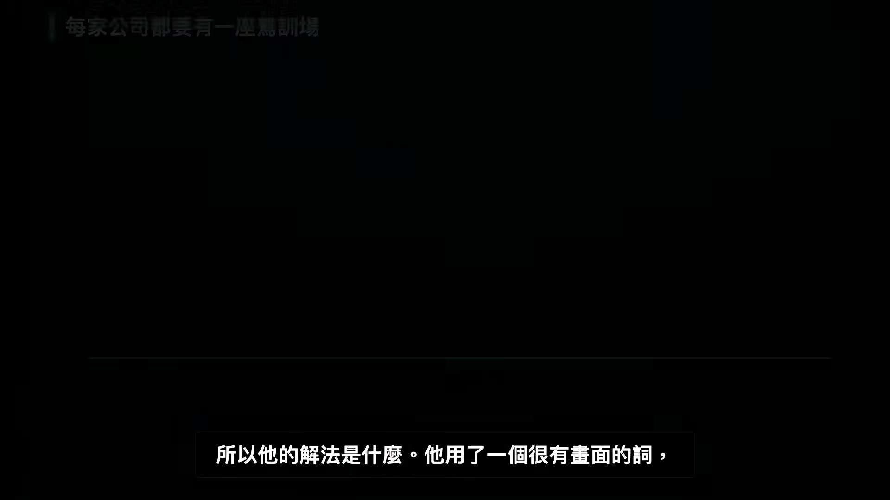

**逐字稿片段：** 他用了一個很有畫面的詞 爬坡機 英文叫Hill Climbing Machine 聽起來很抽象 但他講的事情很具體 他要每一家公司把自己真正的工作流程 變成一個可以讓模型反覆練習的環境 再加上一份只有你有的考卷 這裡有兩個詞要先講白

**話題推測：** 介紹Nadella提出的「爬坡機」（Hill Climbing Machine）概念。

---

## 00:04:40

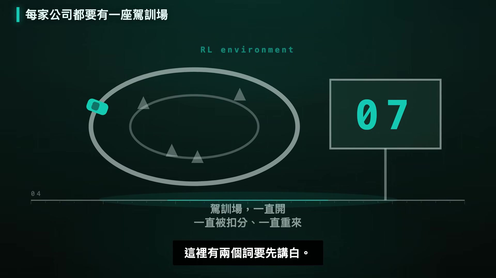

**逐字稿片段：** 第一個東西英文叫RL環境 中文是強化學習環境 你可以想成一間駕馴場 模型在裡面一直開 一直被扣分 一直重來 開到會為止 第二個東西叫Private Eros 私有評測 說白了就是一份只有你們公司有的考卷 任何一個新模型出來 你都可以把它丟進這座駕馴場練一輪 而練出來的那個變強的部分 歸你們公司所有 不是貴模型公司所有 微軟的賣點就是 你不用自己蓋這作家訊場 我們本來就在看你們怎麼跑流程 可以直接幫你生出第一批題目 這個判斷值得記下來 備來公司的護城河 可能不是你有多少資料 而是你有沒有一份 別人拿不到的考卷 有了這個判斷 他接下來做的每一件事 就都說得通了

**話題推測：** 解釋「RL環境」（強化學習環境）和「私有評測」（Private Eros）兩個術語。

---

## 00:05:21

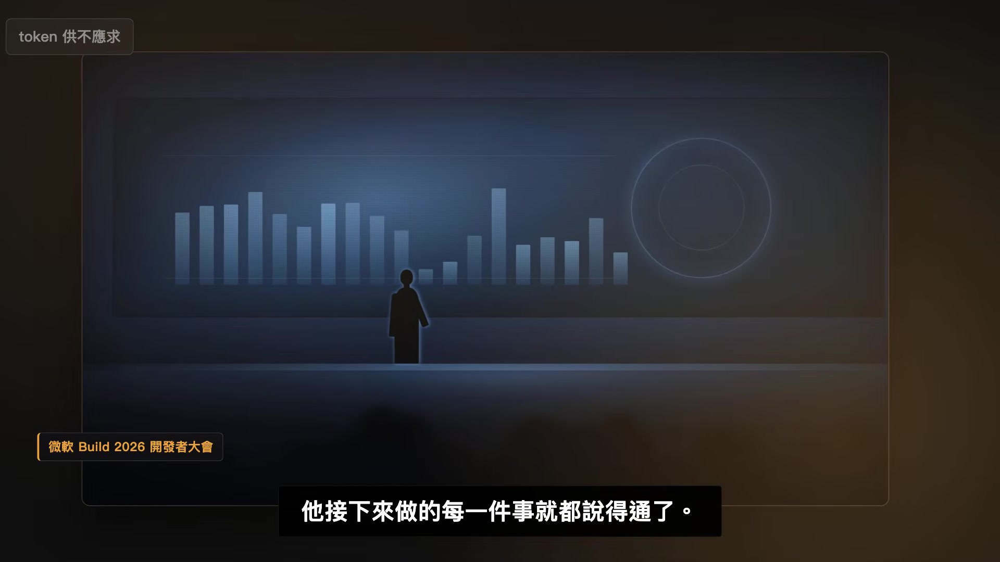

**逐字稿片段：** 微軟現在正在做一件 聽起來有點不像微軟的事 他想去用你筆記型電腦裡面 閒著的那一顆繪圖晶片 理由他講得很白 模型已經在那裡了 應用程式正在被寫出來 而Token供不應求 Token這個詞 你可以想成模型吐出來的字 一個Token 大概是一個詞或者半個詞 模型每講一句話都是燒它 它的意思是 需求已經大到雲端機房喂不飽了 所以它要把散在世界各地 每一臺電腦裡閒著的運算能力都利用起來 同一個邏輯還有第二個版本

**話題推測：** 微軟尋求利用筆記型電腦中閒置的繪圖晶片來擴展運算能力。

---

## 00:05:53

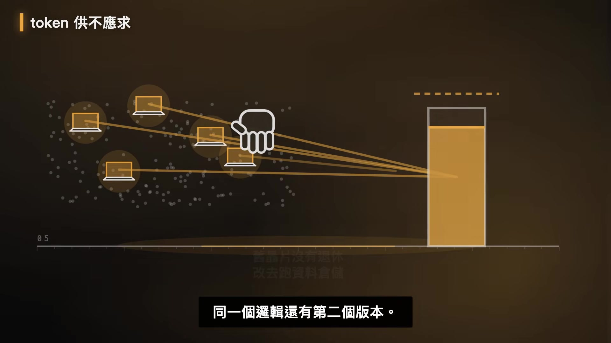

**逐字稿片段：** 微軟機房裡那些舊的繪圖晶片 沒有一臺被淘汰 他們把它們拿去加速資料倉儲 也就是幫企業跑報表和查詢的那一套系統 效能比原本快了好幾倍 它自己的說法是 我們把整個機隊當成一支雜牌軍來看 用軟體把每一臺的架子炸出來 你先把這個畫面記在心裡 等下第四位講者會從機房的那一端 講出一模一樣的事情 他也被問到

**話題推測：** 微軟將舊繪圖晶片用於加速資料倉儲，提升效能。

---

## 00:06:15

**逐字稿片段：** 學生現在可以同時指揮100個coding agent 這到底是好事還是壞事 agent就是一個能自己動手做事的AI助理 你給他一個任務 他自己去查 去寫 去執行 他的回答沒有站隊

**話題推測：** 探討學生同時指揮100個coding agent的影響。

---

## 00:06:29

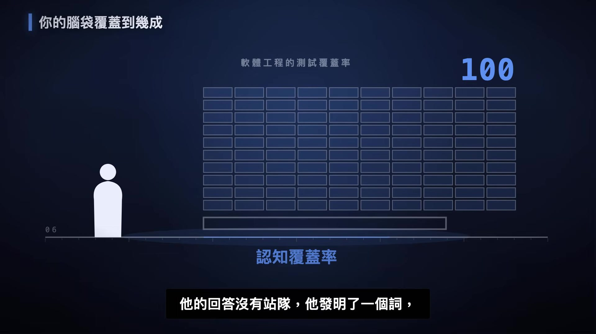

**逐字稿片段：** 他發明了一個詞 認知覆蓋率 這個詞是從軟體測試借來的 工程師會算測試覆蓋率 意思是你的程式有百分之幾被測試檢查過 他把同一個問法搬到人身上 你指揮了100個agent 那你自己的腦袋覆蓋到了其中的幾成 他說重點根本不是你外包了多少 重點是你下了什麼指令 還有他做完之後 你看不看得懂他做了什麼 然後他給了一個學生一聽就懂的類比 這就像同時修100門課 你可以同時註冊100門 但期末你要考100次 這句話其實對每一個開始用AI工作的人都成立 你手上的產出變多了 但你能為他背書的那個比例 有沒有跟著變多 他還講了一句更硬的話 每個人都喜歡改變 只是他們希望改變的是別人 不是自己 他說重點不是把成長心態掛在嘴上 是有沒有勇氣正視自己身上 那個固定的部分 這一講最後的收束 是一個比喻 他引用了前一位講者的話 也就是我們等一下要講的 Sam Altman 連電力剛普及的時候 電力公司賣的不是電 是夜裡的燈 因為沒有人知道電是什麼 也不知道自己為什麼需要它 Nadella接下去那一句 是整堂課我印象最深的 他說而且那道光 不在AGI遊地區號裡的人看得見 AGI是通用人工智慧的縮寫 指的是那種什麼都會做的AI 他接著把話講得更重 他說這個生態系要是變成 少數幾家公司拿走全部報酬 其他人都過得很慘

**話題推測：** 介紹Nadella提出的新詞彙「認知覆蓋率」。

---

## 00:07:51

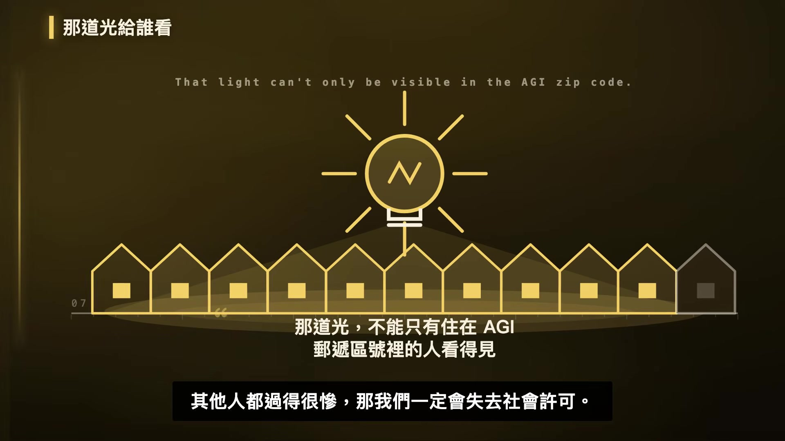

**逐字稿片段：** 那我們一定會失去社會許可 社會許可這個詞是說 一個產業能不能繼續做下去 最後不是法律決定的 是社會願不願意讓你做 請你先把社會許可這四個字放在心裡 等到第三位講者上場 你會看到那個許可被收回去的時候 具體長什麼樣子

**話題推測：** Nadella提出若AI生態系過度集中，將會失去「社會許可」。

---

## 00:08:07

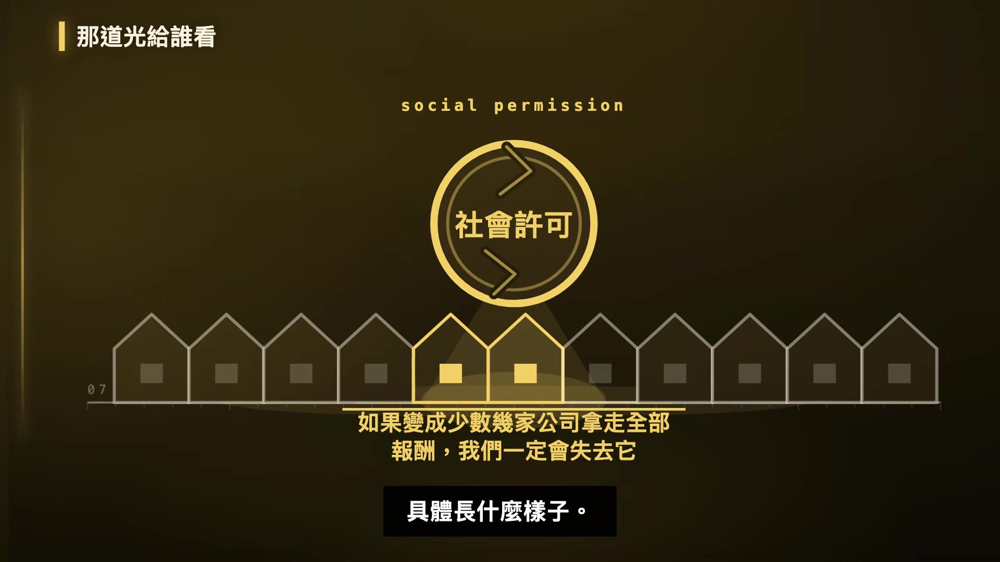

**逐字稿片段：** 第二位講者走進來的時候 這間教室對他來說是熟門熟路 Sam Altman AI的執行長 他自己就是史丹佛一夜神 只念了兩年 2014年秋天 他還在這裡開過一門課叫How to start a startup 怎麼創一家公司 這門CS153的設計靈感之一 就是那門課 他一坐下來就講了一句很有意思的話 他說我剛剛走進來的時候在想 如果我再多一點時間 我也想把那門課整個重做一次 因為創業這件事的每一個環節都變了 我到現在還沒看過 有人做出一個好的 屬於現在的版本 順帶把一個 常常被講錯的年份講清楚

**話題推測：** 開始介紹第二位講者OpenAI執行長Sam Altman。

---

## 00:08:45

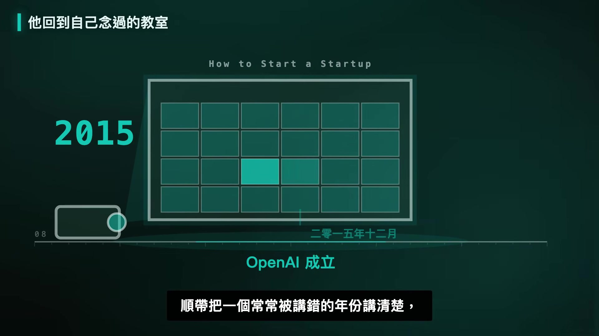

**逐字稿片段：** OpenAI成了於2015年12月 他在臺上先講了1015 又改口1016 正確的是2015 這場對談的主題

**話題推測：** 澄清OpenAI成立於2015年12月。

---

## 00:08:54

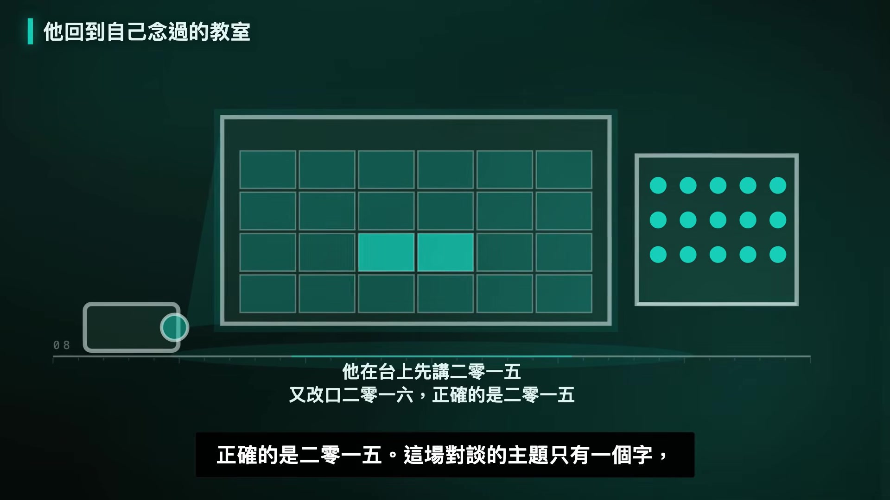

**逐字稿片段：** 只有一個字 規模 而他要講的是 他這一輩子看過最重要 卻也最說不清楚的一個現象 他的核心信念是這樣的 當你把一個東西的規模拉大 它會長出在小規模的時候 完全不存在的性質

**話題推測：** Sam Altman對談主題為「規模」。

---

## 00:09:07

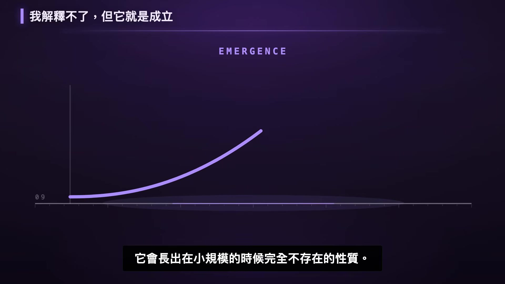

**逐字稿片段：** 這個現象有一個名字叫湧現 意思是能力不是被你一項一項加上去的 是量做大的以後自己冒出來的 但他接下來的那一段 才是我覺得整堂課最誠實的地方 他說我不知道這個觀察為什麼是真的 我提不出任何一個 我自己滿意的理論來解釋它 這讓我有點緊張 緊張到我不太敢叫你們照做 但我還是要講 因為經驗上它就是成立的 你想想這句話的分量 今天全世界壓上幾千億美元 開機房買晶片籤電力合約 而背後那個最根本的信念 是一個世界上最瞭解他的人 自己說我解釋不了的東西 它不是一個理論 它是一條一直往上 還沒有轉彎的曲線 他說他真正學會這件事 其實不是在AI上面 是在Y Combinator 當年所有聰明人都叫他 把每一批新創的規模縮回去 但他發現真正的魔法 在同一批人彼此之間的互相幫忙 那個東西在只有10加的時候 根本不存在 它是規模長出來的 他講完信念之後 接著講了一個 很多人以為自己知道 其實不知道的故事

**話題推測：** 介紹「湧現」現象，即規模擴大會產生新性質。

---

## 00:10:07

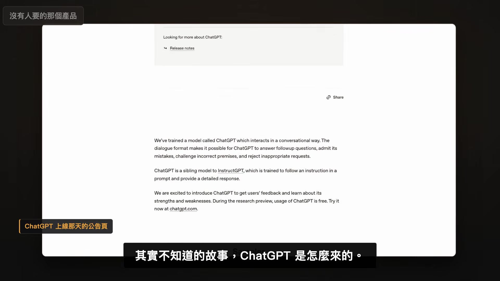

**逐字稿片段：** Check GPT是怎麼來的 GPT-3做出來以後 OpenAI內部找不到產品 他們不知道這個東西該長成什麼樣子 最後的決定是 開放成一個API丟出去 API你可以想成一個插座 外面的程式插上來就能用你的服務 他自己的說法是 希望別人想得出來 這個插座上線之後 在推特上很隨機的紅了一陣子 但真正跑得起來的生意只有一種 幫人寫行銷文案 他的評價是不怎麼樣 也不怎麼令人興奮 可是他們注意到了一個異常 一堆人拿了精藥之後 其實什麼正經事都沒做 他們只是在跟他聊天 這件事在報表上看起來像雜訊 是那種會被歸類成 使用者亂玩的東西 但他們決定認真對待這個雜訊 把那個聊天的界面單獨做出來 這就是ChatGPD的由來 它不是一個規劃出來的產品 它是一個失敗品旁邊長出來的東西 上線之後那幾天 他做了一個判斷 我覺得任何在做產品的人都該學起來 ChatGPD上線 流量每天往上衝 然後掉下來 每次掉下來 公司裡就有人說 你看吧 只是炒作 可是隔天他又衝到一個更高的高點 他說到第四天第五天 我就知道接下來會發生什麼事了 第五天他把所有人叫進來 講了一句很經典的話 這是緊急狀況 是好的那種緊急狀況 但我們同時把公司和產品系蓋出來 他判斷的依據 是他在Y Combinator 有活到的一條規則 當一個東西已經開始成長 而它其實還很爛 那你手上就是一個 幾乎保證會紅的東西 這句話的邏輯很簡單 用的東西紅了不奇怪 難用的東西還一直有人回來 那代表底下有一個很強的需求 強到願意忍受這麼糟的體驗 你如果現在手上有任何一個作品 這個判準筆 任何一份市場調查都好用 不過這一堂最值得被記住的 可能不是他講對的事 是他承認自己講錯的事 有人問他 這三年有沒有什麼是他預測錯的

**話題推測：** 講述ChatGPT的產品誕生故事。

---

## 00:12:00

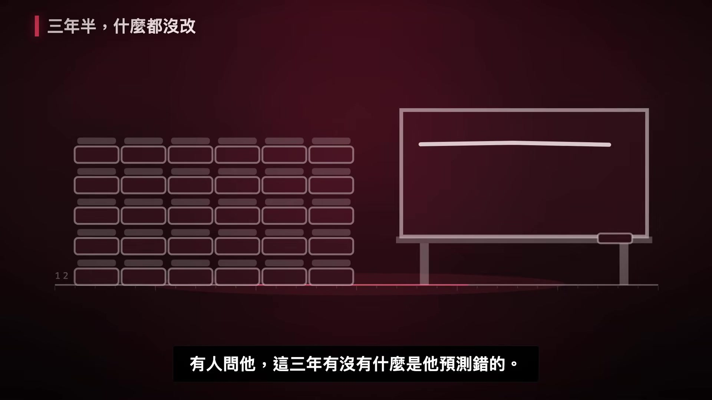

**逐字稿片段：** 他講了教育 他說ChatGPT剛上線的時候 我心裡想的是 好吧 大概會有一年學生拿他作弊 學不到東西 然後整個教育系統 就會重新設計自己 然後他停了一下說 老實講 ChatGPT上線三年半以來 我指不出任何一個體制性的改變 那是我的一個預測錯誤 他接著給了一個警告 如果一直這樣不改 會出現的是批判性思考能力的萎縮 這件事其實不只發生在學校裡 你自己想想 你上一次為了一個問題 坐在那裡想到頭痛 是什麼時候 現在的預測動作是打開一個對話框 他沒有把這件事講成末日 他只是誠實地說 我以為那個系統會自己調整 結果他沒有 而在這門課上 這句話還有第二層意思 一個從2015年就開始做這件事的人 對他的社會後果 預測能力也是有限的 他丟出了整場對談裡 我認為最重要一句 他說 一件很少被討論的事情是

**話題推測：** Sam Altman承認他對ChatGPT推出後教育體制會快速調整的預測錯誤。

---

## 00:12:51

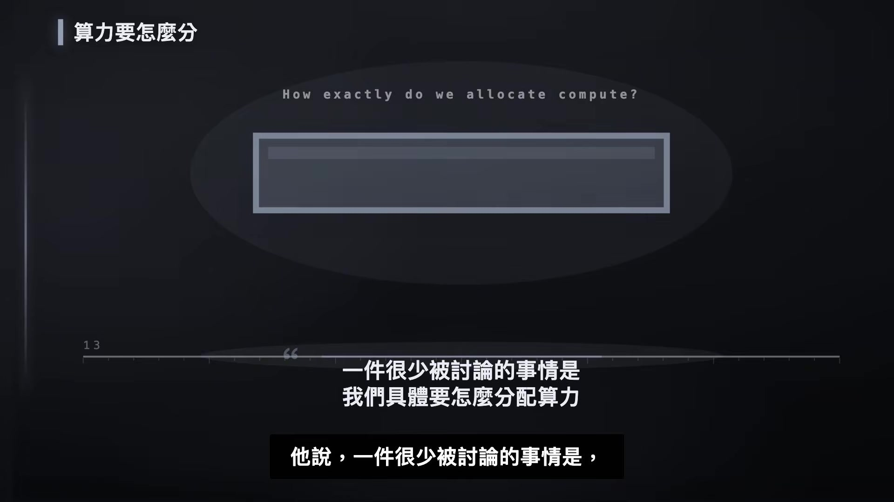

**逐字稿片段：** 我們具體要怎麼分配算力 這句話為什麼重要 因為算力已經不只是一個技術資源了 他決定誰能做研究 誰能做產品 誰家的小孩用得到好的家教 而他的判斷是 這個短缺不會過去 他的原話是 只要我們還能持續進步 短缺就會永遠存在 理由不是產能不夠 是需求根本沒有上限 他說 如果我們做出很好的個人助理 你會想同時跑10個 然後你會想跑100個 我覺得你真的會想要100個 現場有人說 這感覺像運算時代的疫情搶購 衛生紙全被買光了 他的回答是 我覺得大家應該要更恐慌一點 至於誰該拿到這些算力 他只給了一個偏好 沒有給機制 他說他更希望看到的 是人們持有某種所有權 而不是每個月固定領一筆現金 他講到這裡 自己把那個最大的分叉講了出來 他說未來10年最重要的一件事 是這個技術到底會民主化 讓很多人都用得上 也分得到 還是會集中到少數幾家公司手上 讓他們變成地球上財富的一大塊 他給了民主化這條路大概八成的幾率 但他馬上補了一個詞

**話題推測：** 提出「我們具體要怎麼分配算力」這個核心問題。

---

## 00:13:54

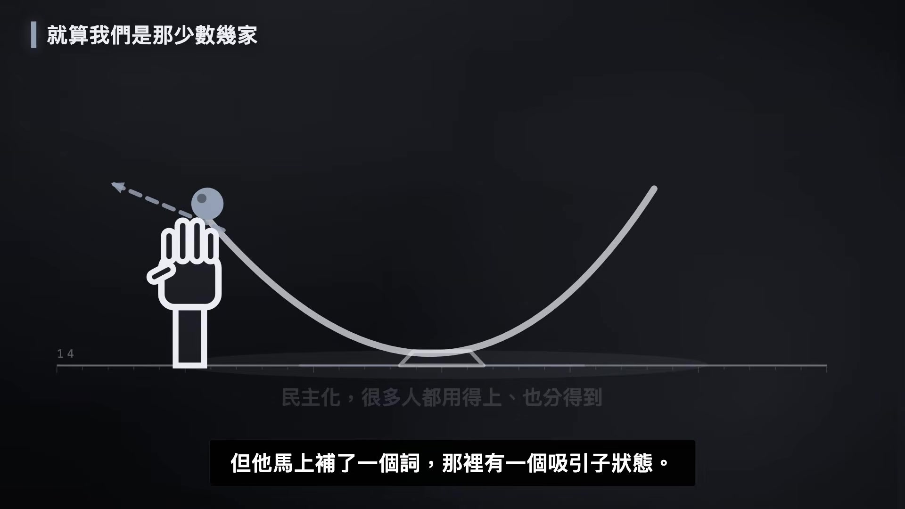

**逐字稿片段：** 那裡有一個吸引子狀態 吸引子狀態是物理和數學裡的講法 意思是一個系統只要靠得夠近 就會被那個狀態吸過去 你不用做錯什麼 你只要什麼都不做就滑進去 他說的最有力的是這一句 把這件事集中在少數幾家公司手上的風險 即使我們會是那少數幾家之一 也不是我們應該容忍的事 你注意他的位置 他是最有可能成為贏家的那個人 而他站在那裡說 這件事不該被容忍 可是他也承認 他沒有機智 他知道分配算力 是最少被討論的問題 他也知道那裡有一個 會把所有人吸進去的狀態 然後他沒有答案 這個空缺 就是接下來兩位講者 要從完全不同的角度 替他補上具體的形狀

**話題推測：** Sam Altman提及「吸引子狀態」比喻技術發展集中化的風險。

---

## 00:14:35

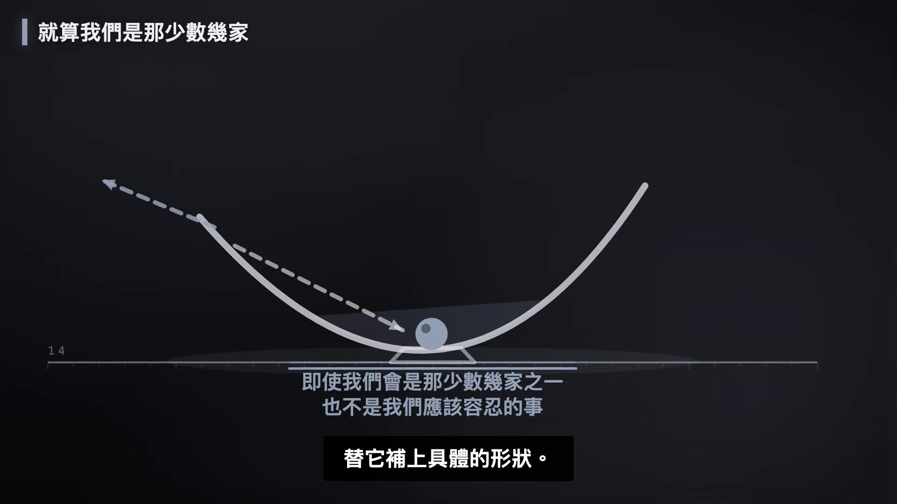

**逐字稿片段：** 而第三位講者一上臺 這門課的氣氛就變了 前面兩位在講 我們要蓋多大的東西 這一位在講 蓋這個東西的人 出事之後會怎麼被審判 我們先從2017年 感恩節那一週講起 他跟家人在泰浩湖度假 一位彭博社的記者 傳訊息給他 想跟他聊聊 他被Uber開除這件事 他看著手機 完全不知道對方在講什麼 因為沒有任何人 告訴過他這件事 一個小時之後

**話題推測：** 開始介紹第三位講者，轉向討論AI技術出事後的責任問題。

---

## 00:15:00

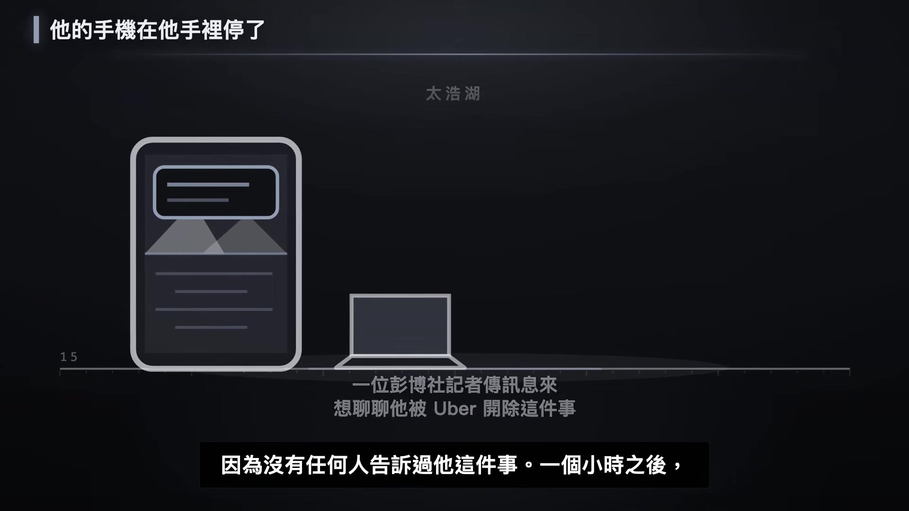

**逐字稿片段：** 全球的新聞標題上線了 Uber付錢給駭客 刪掉5700萬人 被偷走的資料 然後是最像電影的一幕 他說 我的手機在那個當下 停止運作了 因為那隻手機 是Uber配給他的 而他自己的團隊 在上面裝了管理軟體 接著他的團隊 用那套軟體 他的手機和電腦 然後變成了兩塊磚 而那套軟體 是他自己導入公司的 他站在湖邊 手上拿著一塊 什麼都打不開的金屬 而全世界正在讀他的名字 這個人是誰 你必須先知道 才會知道這件事有多不合理

**話題推測：** 講述2017年Uber資料外洩事件，涉及5700萬用戶資料。

---

## 00:15:33

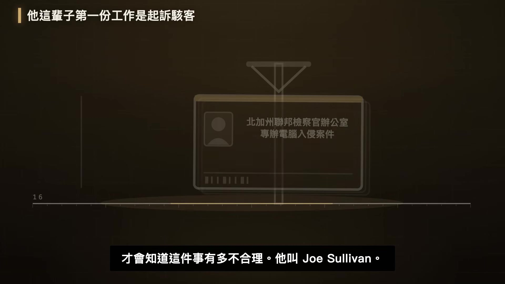

**逐字稿片段：** 他叫Joe Sullivan 他的職業起點不是硅谷 是美國司法部 2001年到2002年 他在北加州的 聯邦檢察官辦公室 當檢察官 而且是那個辦公室裡 專門辦電腦入侵 和智慧財產案件的 小組的創始成員之一 也就是說 他這輩子第一份重要的工作 是起訴駭客 之後他去了eBay和PayPal 接著當了大約五年 Facebook的資安長 2015年被Uber找去當資安長 資安長這個職位 英文叫CSO 簡單講就是 一家公司裡負責 守住所有資料和系統的那個人 所以請你記住這個組合 一個當過檢察官的人 在做資安長 全世界最清楚 哪些事情會構成犯罪的 那一群人裡面 他是其中一個 而接下來發生的事情是 這個人在他自己 最守的那一條法律上 被定罪了 我們把時間往前拉一年 看那個案子到底是什麼

**話題推測：** 介紹第三位講者Uber前資安長Joe Sullivan。

---

## 00:16:23

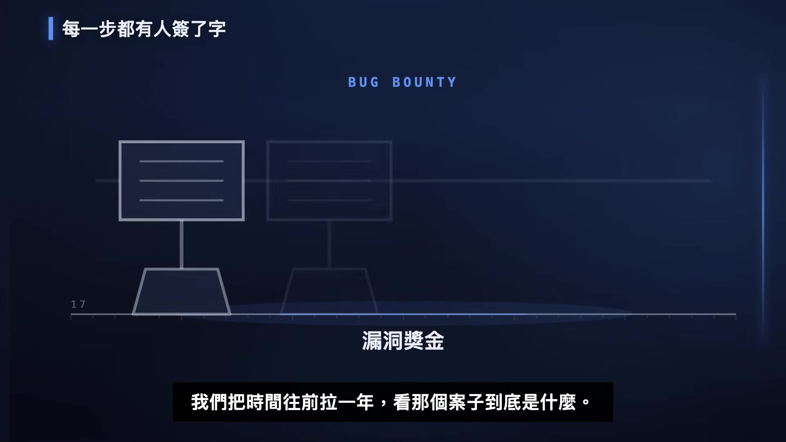

**逐字稿片段：** 2016年秋天 有人寫信到Uber 說找到了一個嚴重的漏洞 他照著公司的標準流程 把信轉給負責漏洞獎金的 產品安全團隊 漏洞獎金這個制度 是科技公司公開 跟外面的研究者說 你找到我的問題來告訴我 我付你錢 讓你拿去黑市賣好 查下去之後發現 這個漏洞來自一個 很舊的雲端設定問題 而牽涉到的那個資料庫 是在他們到職之前 就已經被放著不管的 他的團隊根本不知道他存在

**話題推測：** 回溯至2016年秋天，Uber收到駭客漏洞報告的開始。

---

## 00:16:50

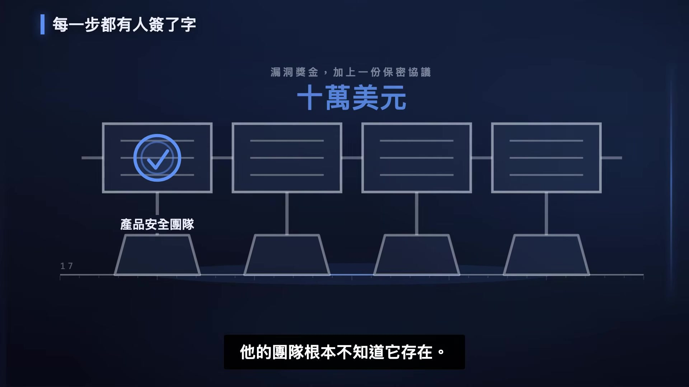

**逐字稿片段：** 他們付了10萬美元的漏洞獎金 加上一份保密協議 這件事執行長簽了合 法務有兩到三位律師全程在回權禮 東關團隊也在 法務的判斷是 我們認為這件事不需要對外揭露 你可以不同意這個判斷 但請注意 這條路上的每一個環節 都有一個被授權的人籤的字 這也是整個故事最讓人不安的地方 他不是一個人在深夜裡偷偷做的決定 而且他做的比流程要求的還多 他不放心那兩個駭客 是不是真的把資料刪掉了 所以他派了一位 受過訓練的退役中情局訊問專家 飛到佛羅里達去當面確認

**話題推測：** Uber向駭客支付10萬美元漏洞獎金。

---

## 00:17:28

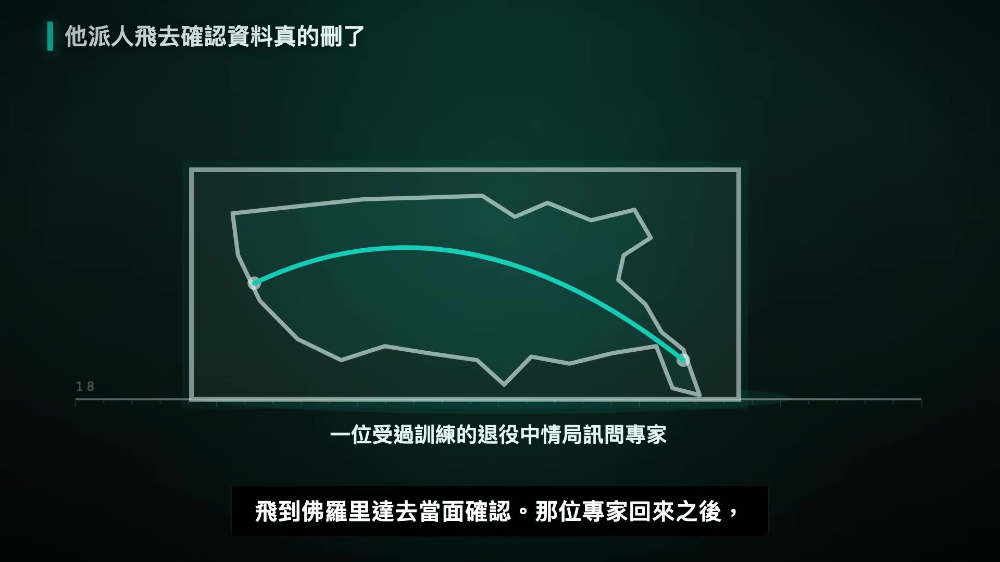

**逐字稿片段：** 專家回來之後 交給他一份六頁的心理測寫 這裡還有一個對照組 讓整件事更難評價 同一批駭客 當時也去敲了另一家公司

**話題推測：** 提及退役中情局專家提供的六頁心理測寫報告。

---

## 00:17:36

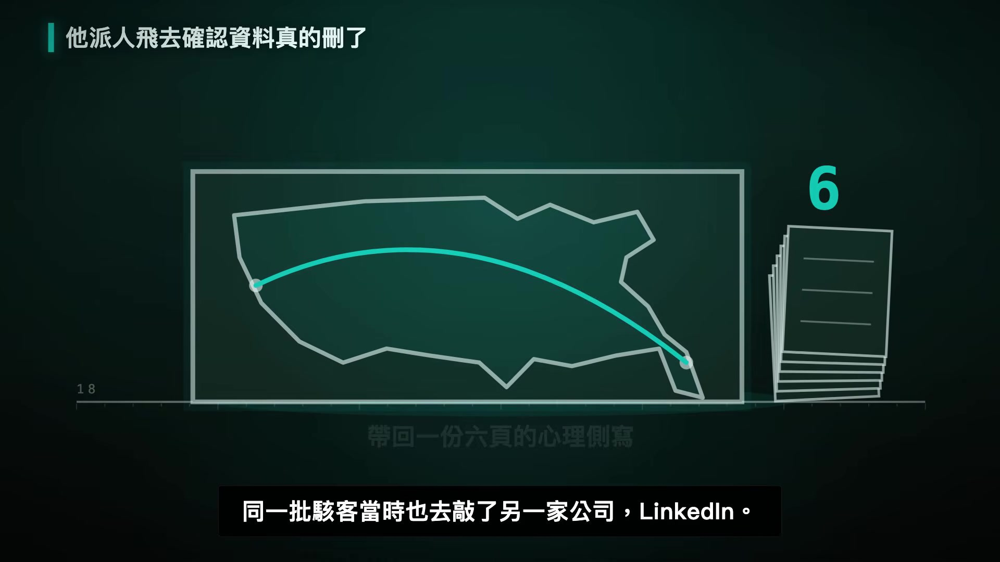

**逐字稿片段：** LinkedIn LinkedIn選擇了另外一條路 報警 結果是聯邦調查局 找不到這兩個人 他的團隊找到了 所以如果你只看結果 這個治安長做的事情是 找到了執法單位找不到的人 確認了資料被刪除付了錢 拿到保密協議 而且每一部都有法務背書 這一段講完 你大概會覺得這個故事應該就結束了 可是他才剛剛開始

**話題推測：** 對比LinkedIn處理同一批駭客事件的選擇。

---

## 00:17:58

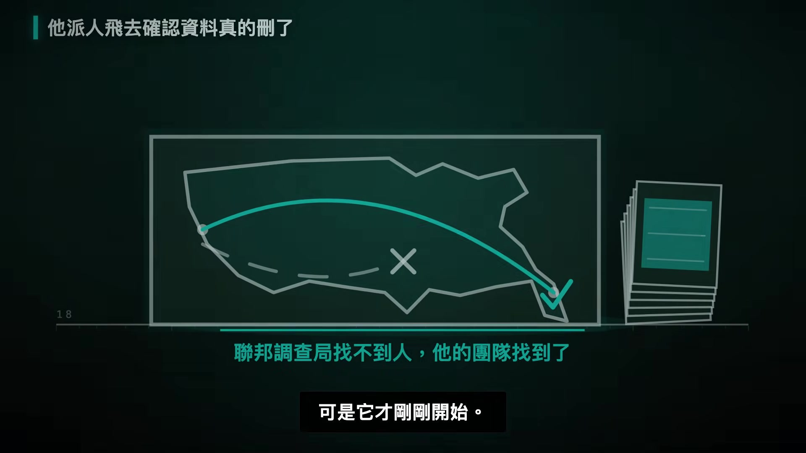

**逐字稿片段：** 2020年 聯邦調查局發了一份新聞稿 那一天他的大女兒 正在德州大學奧斯汀分校搬進宿舍 他的同學在收音機上聽到一則新聞 裡面有他爸爸的名字 他整個人慌了 打電話回家 而他本人那個時候 正坐在家裡的書桌前

**話題推測：** 時間跳轉至2020年，聯邦調查局發布新聞稿。

---

## 00:18:14

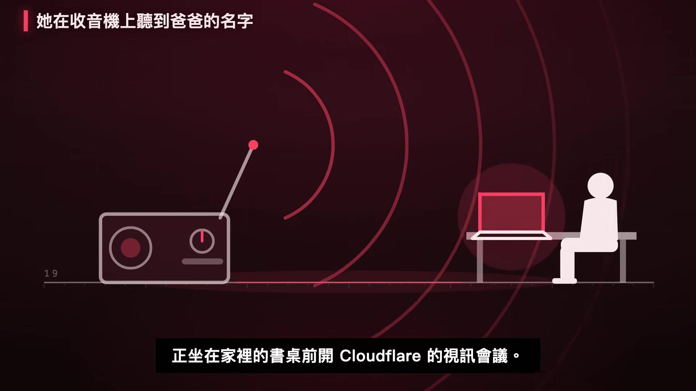

**逐字稿片段：** 開Cloudflare的視訊會議 他其實沒有被逮捕 但他被起訴了 罪名有兩條 我們把它翻成白話 第一條是 妨礙聯邦貿易委員會的調查程序 聯邦貿易委員會當時正在調查 Uber早年的另外一次資料外洩 檢方認為他沒有把這一次的事情交出去 第二條的英文很拗口 中文可以說成知情不報重罪 意思是你知道有一個重罪發生了 你不但沒有報告 還做了事情去掩蓋它 到這裡 事情已經從一個公司內部的判斷 變成了一個人要不要坐牢的問題 而全美國的資安長都在看這一場

**話題推測：** 提到Joe Sullivan當時正參與Cloudflare的視訊會議。

---

## 00:18:49

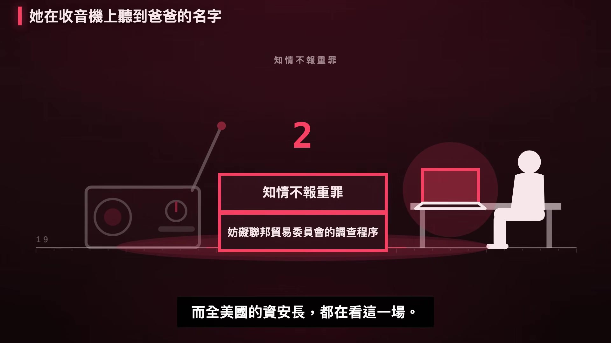

**逐字稿片段：** 案子在2022年9月開庭 他的律師在政府舉證員之後 跟他說了一句話 我們根本不用辯護 我們應定了 陪審團退籍之後 議了好幾天 然後他們遞出了一個問題 那個問題把整套辯護掏空了 他們問的是 依照美國那條電腦入侵法 Uber有沒有權利在存取 已經發生之後 回頭補一個授權 你可能覺得這聽起來很技術 但他決定了一切 因為如果公司可以事後授權 那兩個駭客拿走資料這件事 在法律上就變成了一次 被許可的存取 也就沒有那個重罪 可以被知情不報 他過去拿到的 所有法律意見都說可以 類比的是一條 很古老的侵入罪 有人走進你家前院 你在那當下說進來吧 在法律上就不再是侵入 可是法官不確定 政府主張不行 陪審團最後拿到的指示是 Uber不能授權 他自己的形容是 這基本上 把我們整套辯護掏空了 你注意這件事的形狀 不是他做錯了什麼 是那一條規則 在他做完之後 才被定義出來 判刑之前 聯邦的緩刑辦公室會做一份很厚的量刑前調查報告 這個過程裡

**話題推測：** 案件於2022年9月開庭審理。

---

## 00:19:57

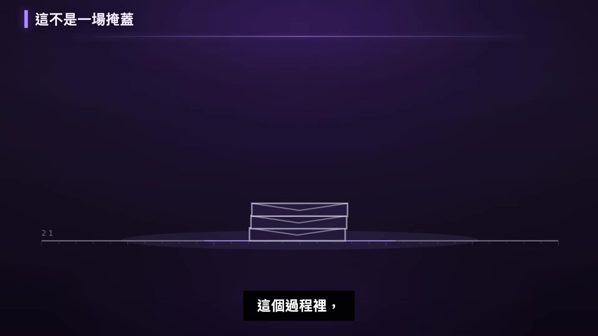

**逐字稿片段：** 他收到了超過200封寄給法官的澄清信 其中一封有60個治安界的人聯署 另一封50個 另一封40個 他形容那段時間的說法我一直忘不掉 他說我等於是參加了自己的首領 我還活著的時候就聽到了所有人講我的好話 而最讓他震動的 是信裡寫的很多事情他自己完全不記得

**話題推測：** Joe Sullivan收到超過200封寄給法官的澄清信支持。

---

## 00:20:17

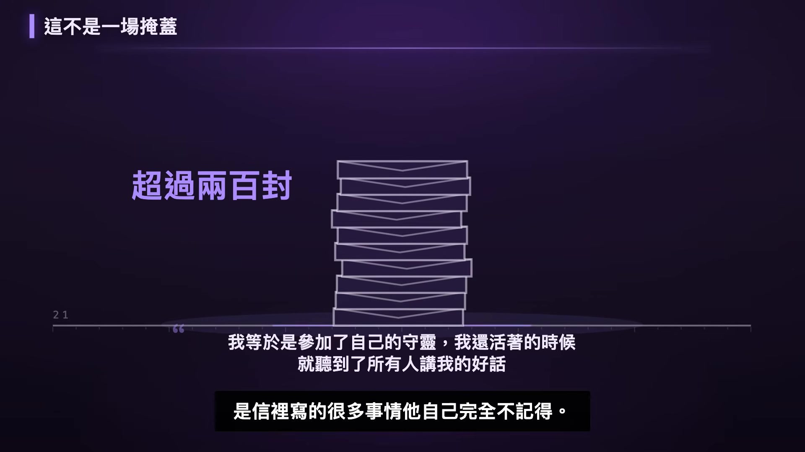

**逐字稿片段：** 1023年5月判決下來 政府原本要求三年聯邦監禁 後來降到18個月 法官說他最想聽到的一句話 這不是一場掩蓋 然後法官當庭訓斥了檢方 如果你要起訴一家公司 你為什麼不起訴執行長 執行長在迴圈裡 執行長支持了所有的決定 如果我們要讓公司負責 那就從最上面開始

**話題推測：** 2023年5月，法官宣判Joe Sullivan的判決結果。

---

## 00:20:38

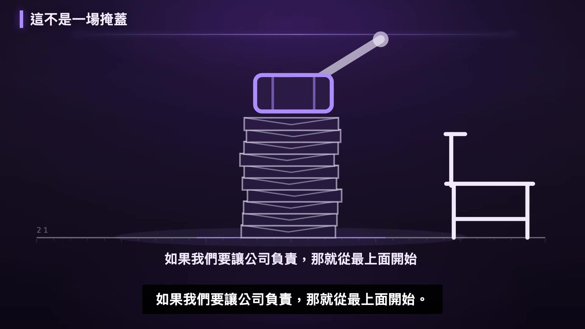

**逐字稿片段：** 最後他被判三年緩刑 200小時社區服務 加上5萬美元罰金 但這個故事沒有停在這裡 而且他在臺上沒有講 1025年3月 聯邦第九巡迴上訴法院 一致維持了他的有罪判決 所以他站在史丹佛講臺上的那一刻 法律上他仍然是一個重罪犯 這故事裡還有一個很亮的對照組 而且他自己就是主角 被全球媒體點名之後 第一批主動聯絡他 想請他去當治安主管的三家公司

**話題推測：** Joe Sullivan被判三年緩刑、200小時社區服務及5萬美元罰金。

---

## 00:21:04

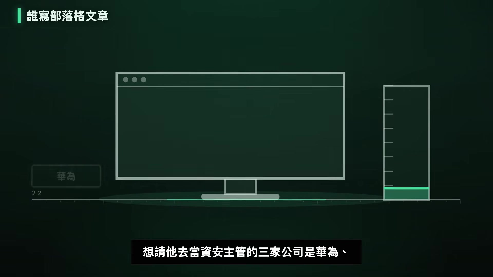

**逐字稿片段：** 是華為、WeWork和肢解跳動 他講這句話的時候特別強調 我是認真的 他最後選了當時還很小的Cloudflare 因為那家公司的執行長 Matthew Prince 打了電話去問他的前老闆 一定賭一把 到了Cloudflare之後的第一次治安事件 是一個星期五的晚上 他打給執行長報告 對方只問了一句話 誰寫部落格文章 他說我們現在在流血 對方又問了一次 誰寫部落格文章 五分鐘之後 技術長自己上了視訊會議說 我來寫 一年之後 Cloudflare推壞了一條防火牆規則 半個網機網路掛掉 隔天他上網看討論 看到的是這個 我們實質上弄壞了整個網機網路 結果大家在稱讚我們透明 他的結論很簡單 選擇透明的公司在累積信任 而選擇不透明的公司 累積的是慢慢主廢的負面情緒 他講完自己的故事 這是上集裡唯一一段從第一線看AF2D的內容 他服務過一家美國東南部的小銀行 兩個月之內

**話題推測：** 列出主動聯絡Joe Sullivan的三家公司：華為、WeWork和字節跳動。

---

## 00:22:05

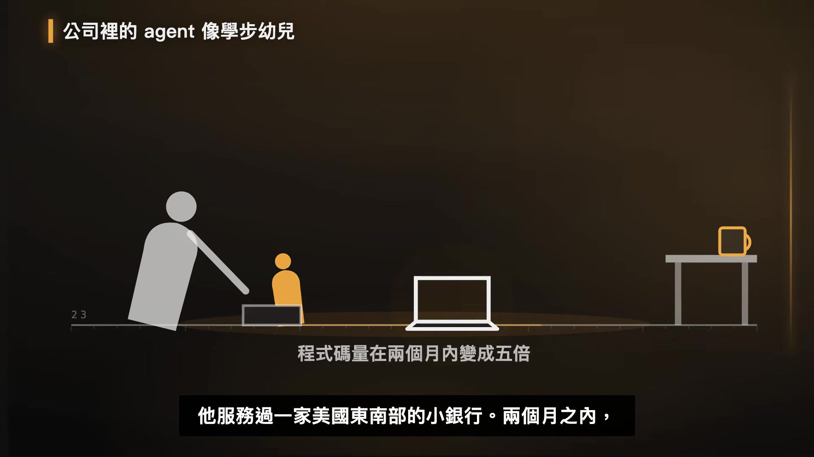

**逐字稿片段：** 這家銀行每個月產出的城市碼 從25萬行變成125萬行 人數沒有變 變的是工具 然後他講了一件讓所有資安主管背脊發涼的事 灣區有一家公司的資安常打給他 說第一個把有漏洞的城市合併進正式環境的人 來自行銷部門 而傳統流程在這裡整個失效 因為資安部門的做法是把問題退回去 附上一個建議的修法 讓工程師自己看著辦 行銷部門的人做不到這件事 他們不會修 肥技術的員工也拿不到 公司的API金鑰 他們的解法不是去申請 是自己跑到外面架一臺伺服器 自己生一把出來 他的總結是我聽過最好的比喻 他說 公司裡的agent 就像家裡的學部幼兒 他們到處跑 他們跑得很快 然後每隔一陣子就會出事 你看過家裡有幼兒的父母吧 他們是跟在旁邊一起跑的 這就是我們現在得做到的事 及時 而且是在他動的當下 他也講了一個真實的規模參考 讓你知道這件事失手會長什麼樣子

**話題推測：** 一家小銀行在兩個月內產出程式碼從25萬行增至125萬行。

---

## 00:23:02

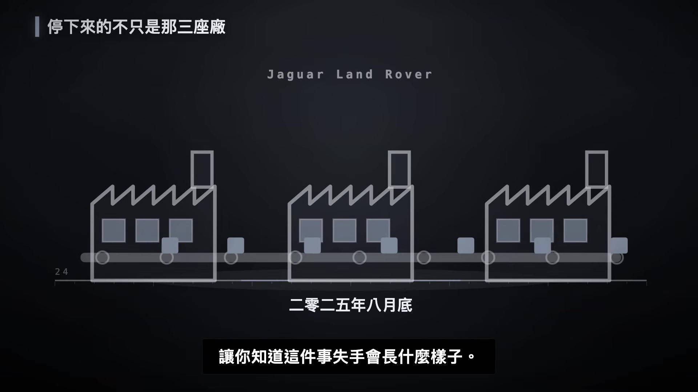

**逐字稿片段：** 2025年8月底 英國的Jaguar Land Rover被攻擊 三座工廠停產了大約5週 英國政府後來提供了最高15億英鎊的貸款擔保 而英國一個專門評估資安損失的機構估算 這件事對英國經濟的總成本大約是19億英鎊 是英國史上最具破壞性的資安事件 但真正的痛點不在車廠身上 這家公司的零件來自幾百家小公司 停產的那幾週 這些小廠交不了貨 收不到錢 很多撐不下去 他給學生的結論不是要更小心 而是這一句 我們不會把任性和危機管理 寫進職務說明書 但如果你2026年在科技業工作 你必須準備好被人一拳打在臉上 他接著補了那個比喻 拳擊手上場的時候 就知道自己會被打 但他還是有計劃 他甚至提到 勒索軟體談判員 現在已經是一個正式的職業 而業界的最佳做法 是先簽好一個放在快速撥號裡

**話題推測：** 2025年8月底，英國Jaguar Land Rover遭攻擊事件。

---

## 00:23:55

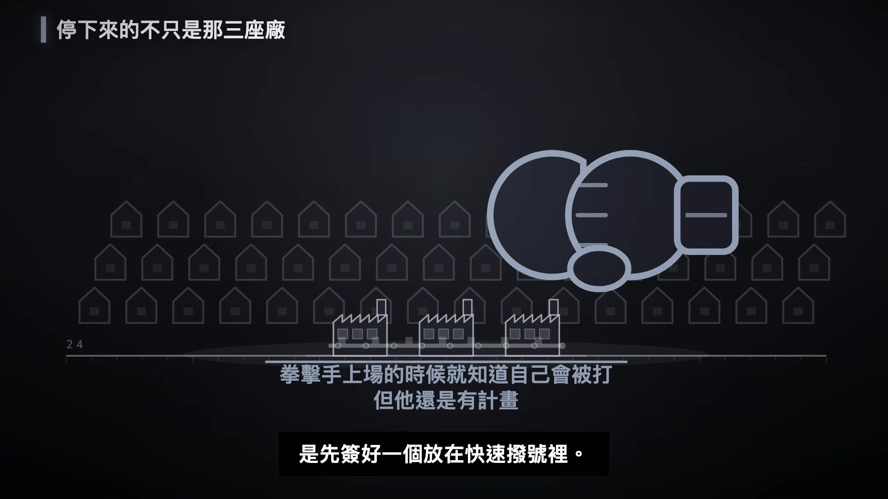

**逐字稿片段：** 第四位講者 是這個系列裡 技術密度最高的一場 他叫Amin Vade Google的資深副總裁 也是AI與基礎設施的技術長 直接向執行長報告 他手上管的是TPU 也就是Google自己設計的AI晶片 還有資料中心的網路 機房的排成系統 還有整條供應鏈 他原本是大學教授 2010年用一年學術休假的名義加入Google 然後就沒有回去了 他一開口就否定了現在全世界正在用的那把尺 今天你看任何一則AI新聞

**話題推測：** 開始介紹第四位講者Google資深副總裁兼AI與基礎設施技術長Amin Vahdat。

---

## 00:24:24

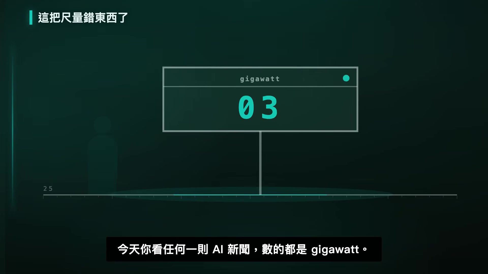

**逐字稿片段：** 數的都是Gigawatt Gigawatt的中文叫十億瓦 是一個電力的單位 你可以直接想成1GW差不多就是一部核能發電機組全開 用得起做中型程式 所有人現在都在比誰手上有幾GW 而他說的是 最重要的考量不是你有幾GW 是你交付給使用者多少能力和價值 然後他講的那句最關鍵的話 我這裡有一個GW 那裡有一個GW 咱們不是同一個東西 然後他要換成哪一把尺 他給的替代指標非常好懂 他說如果我在做Gemini這個應用程式 背後有1GW在跑 也是沒有人在乎 那背後是一個兩個四個還是半個 大家在乎的是

**話題推測：** Vahdat質疑以Gigawatt作為衡量AI運算能力的標準。

---

## 00:25:03

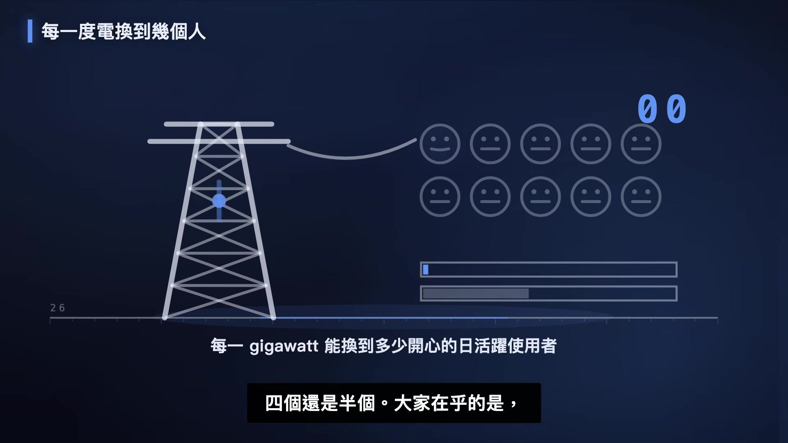

**逐字稿片段：** 我有多少開心的日活躍使用者 日活躍使用者的意思是 每天真的打開來用的人 所以他要的計分板 是每Gigawatt 能換到多少開心的使用者 這個轉換聽起來很簡單 但他會改變一家公司所有的決策 他把同一件事再講得更硬一點 不是衡量標準 不是你每Gigawatt花了多少錢 是你每一塊錢交付了多少價值 如果我可以花一半的錢 部署一半的容量 給你一樣的能力 那太好了 更好的是 如果我能從同一個Gigawatt 交付兩倍的價值 我就少蓋幾個Gigawatt 這句話的分量在於他的方向 全世界都在講怎麼蓋更多 他在講怎麼少蓋 而他還有一句話 用一個工程師的詞 把這件事講到底 如果我們有容量在那邊閒著 那是一個bug 然後他講了一個 我認為是整支影片 最讓人恍然大悟的事實 過去20年 企業客戶要的可靠度

**話題推測：** 提出以「開心的日活躍使用者」作為衡量運算效益的替代指標。

---

## 00:25:55

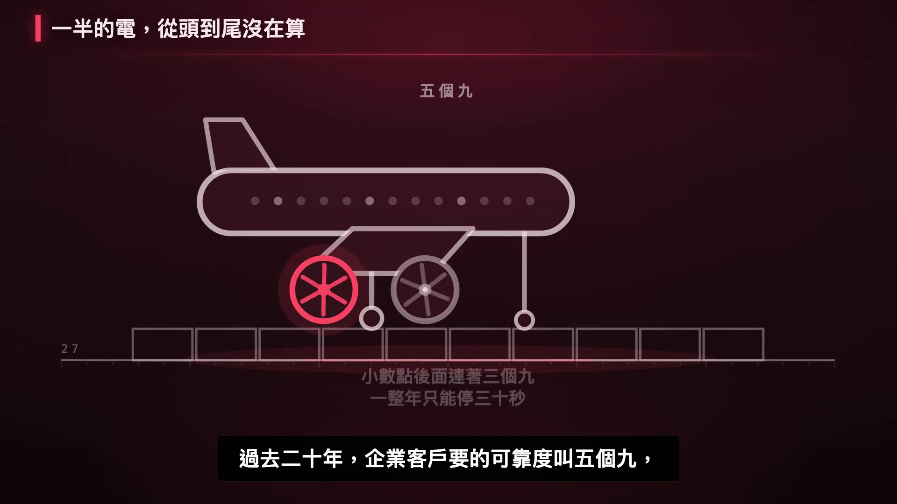

**逐字稿片段：** 叫五個九 意思是小數點後面 扔著三個九 換算下來 這年只能停30秒 這個要求聽起來很合理 你當然不希望你的服務中斷 但他問了一個沒什麼人問的問題 這件事的代價是什麼 要做到五個九 電力系統必須做到雙分倍元 也就是每一條供電的路徑 旁邊都要有一條一模一樣的路徑顯著等 隨時準備接手 他的原話是

**話題推測：** 解釋企業客戶追求「五個九」可靠度，意味每年停機不超過30秒。

---

## 00:26:17

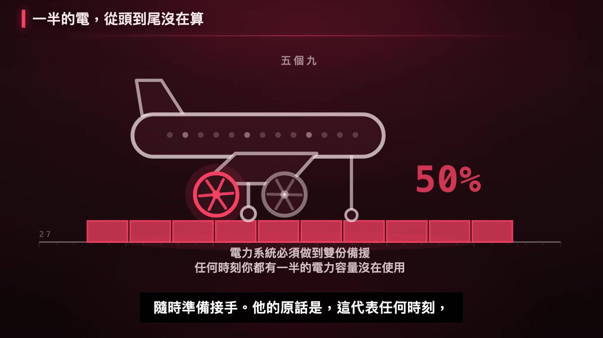

**逐字稿片段：** 這代表任何時刻 你都有一半的電力容量沒在使用 你可以想成一臺永遠開著兩顆引擎的飛機 其中一顆從頭到尾只是在那邊空轉 為的是萬一另外一顆熄火 這就是為什麼他說計分板是錯的 當所有人在數這個國家又蓋了幾GW的時候 那些GW裡面有很大一塊 從一開始就不是拿來算東西的 它是拿來當保險的 可是這件事現在正在翻轉 而他把這個翻轉標成一個很值得注意的新發展 他說你現在去問那些前沿實驗是一個問題

**話題推測：** 揭示為達「五個九」可靠度，一半電力容量處於閒置備用狀態。

---

## 00:26:48

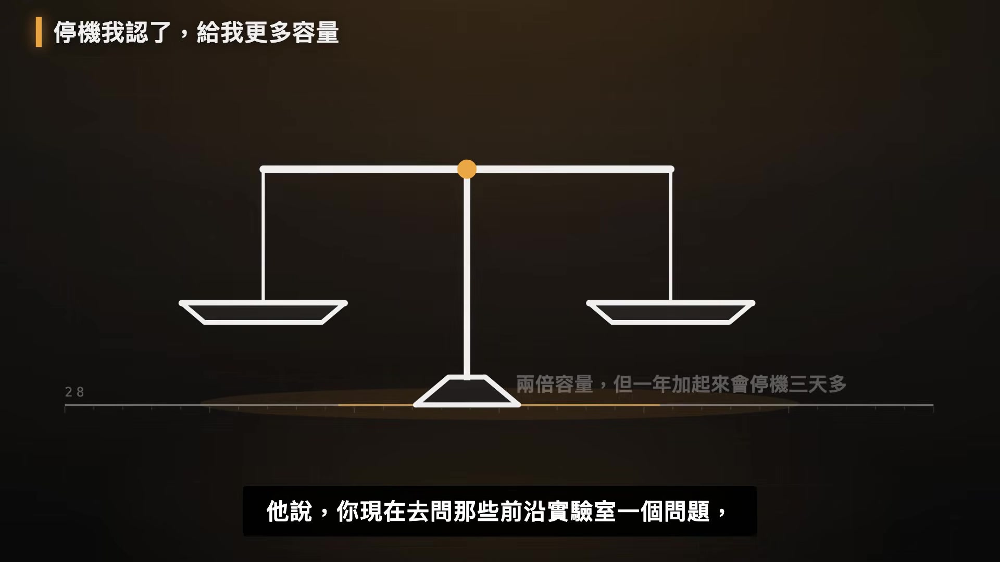

**逐字稿片段：** 你要兩倍的容量 但一年加起來會停機三天多 還是要一半的容量 但一年只停30秒 他們的回答是兩倍 那個算我一份 有更多容量 停機我認了 這是產業心態的一次地殼變動 過去20年 整個網絡服務業的信仰 是可用性至上 因為使用者一秒都不能等 但是訓練模型 看的是另外一個東西

**話題推測：** 說明前沿實驗室寧願選擇兩倍容量，即使每年停機三天多。

---

## 00:27:08

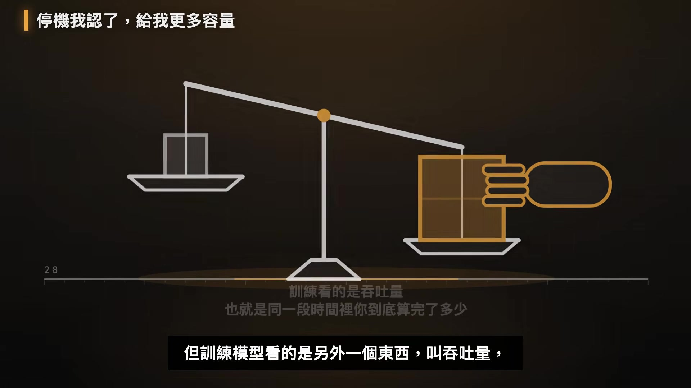

**逐字稿片段：** 叫吞吐量 就是同一段時間 你到底算完了多少 停一天 你損失的是一天的進度 不是一群客戶 這裡還有一個 很違反直覺的細節 訓練是一種同步計算 1GW的機房

**話題推測：** 指出模型訓練更重視「吞吐量」而非傳統的可用性。

---

## 00:27:20

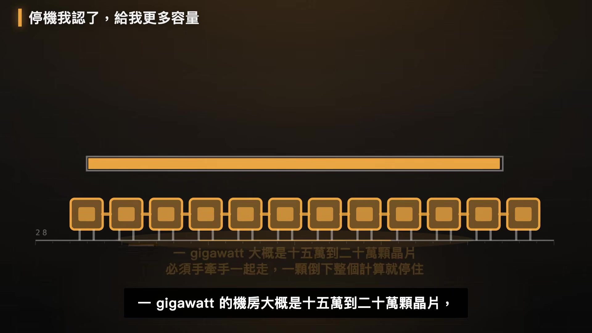

**逐字稿片段：** 大概是15萬到20萬顆晶片 而這些晶片 必須手牽手一起走 一顆倒下 這個計算就可能停住 他說 過去20幾年 網絡服務業建立起來的 就是別擔心單一臺機器壞掉 系統會自己繞過去 在這裡全部作廢 因為現在每一個節點都是特殊的 它負責的是模型裡特定的那一層 所以他們做了一件很像科幻片的事 Google的機房裡有一種設備

**話題推測：** 說明1GW機房約包含15萬到20萬顆晶片。

---

## 00:27:45

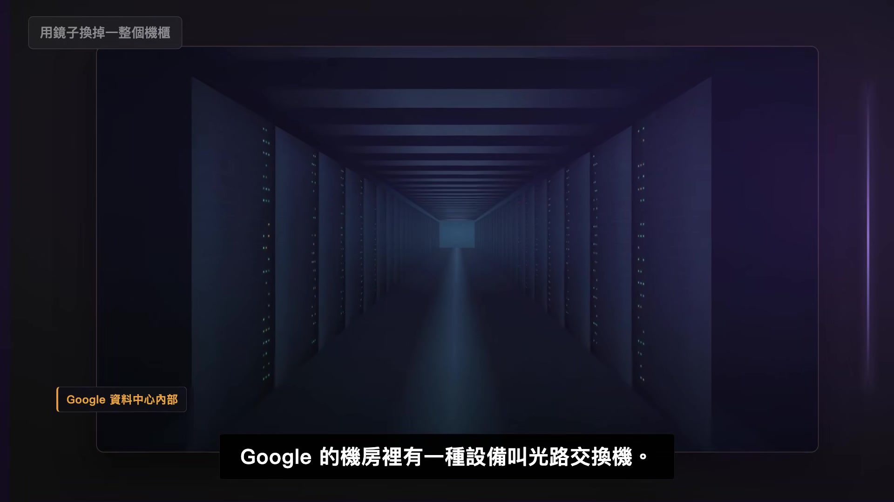

**逐字稿片段：** 叫光路交換機 你先想象現在的網路長什麼樣子 資料在機器之間跑 中間要經過一臺一臺的交換機 每一臺都要把光訊號變成電訊號 讀懂它再送出去 這非常耗電 光路交換機不做這件事 它裡面裝的是一片會轉動的微型鏡子

**話題推測：** 介紹Google機房中的「光路交換機」技術。

---

## 00:28:02

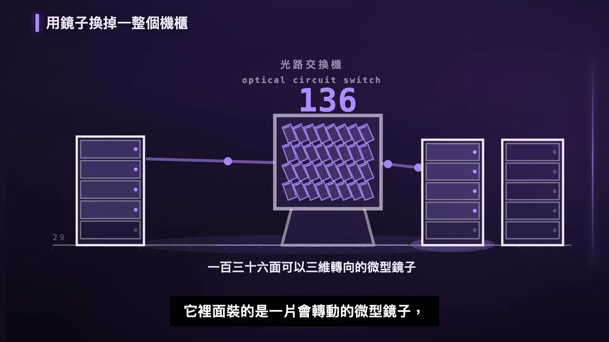

**逐字稿片段：** 總共136面 每一面都可以三維轉向 光從機櫃的光線射進來 打在鏡子上 被反射到指定的出口 全程沒有變成電 所以它的耗電只有大約100瓦出頭 而等級的傳統交換機要3000瓦 但真正厲害的是它能做什麼 當一整個機櫃壞掉 它不需要有人跑到機房裡去拔線 它只要把鏡子轉一個角度 就可以在幾秒鐘之內 把壞掉的機櫃從天上往裡拿掉 放上一個備用的 它的說法是 TPU真正的差異化 就是可以做到高得多的可用性 我現在可以瞬間從故障中恢復 我們講完機房裡面 把鏡頭拉到機房外面 這是他這一堂最現實的一段

**話題推測：** 光路交換機內部包含136面可轉動微型鏡子。

---

## 00:28:40

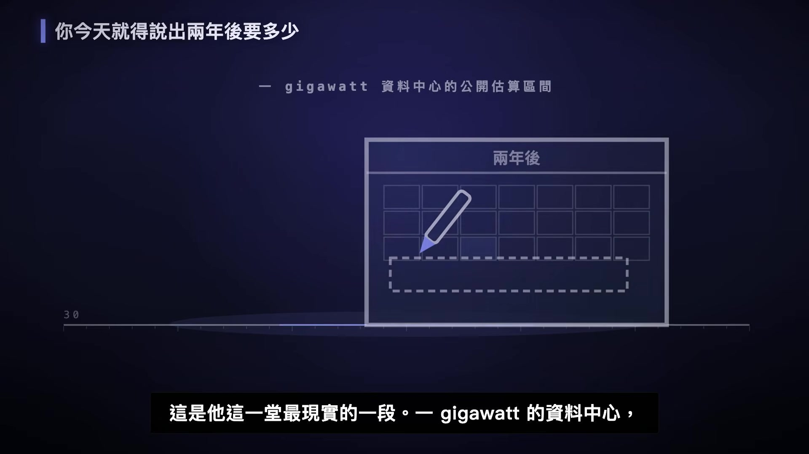

**逐字稿片段：** 1GW的資料中心到底要花多少錢 公開的估算差很多 看你算到哪一層 比較安全的講法是 350億到600億美元之間 這個數字你可以這樣感受 一座這樣的機房 價格是一整條高速鐵路的等級 而Google的目標是數十個GW 更難的其實不是錢 是時間 從決定要蓋到真的能用

**話題推測：** 討論1GW資料中心的建設成本。

---

## 00:29:02

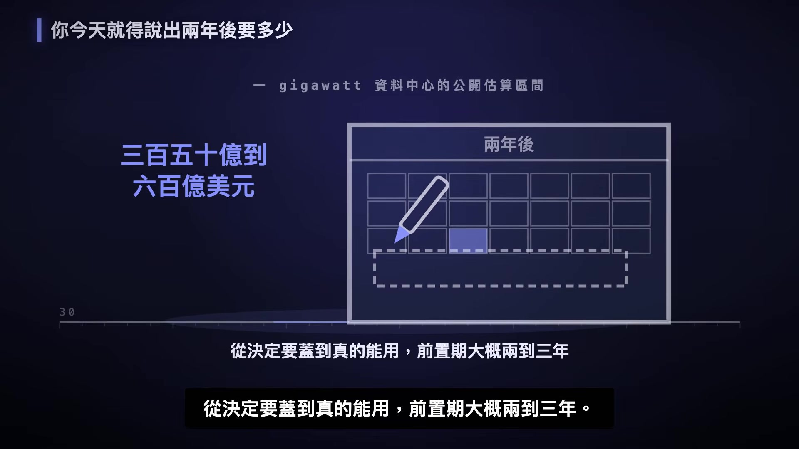

**逐字稿片段：** 前置期大概兩到三年 也就是說你以前就必須說出 你兩年之後確切需要多少容量 他把這件事講成一個沒有好答案的題目 他說基本上會有兩種結局 結局一你預測太少 你會非常懊惱 因為你把機會留在地上 結局二你預測太多 你剛剛浪費了一大筆錢 還有第三種幾率無限小的可能 你預測的剛剛好 那從來不會發生 他還舉了一個現成的例子 寫程式的agent是四五個月前才報起來的 沒有任何人在那個等級上預測到 所以沒有人有足夠的前置時間去準備機器 現在大家到處在問 我可以在哪裡弄到容量 而最能說明這件事 已經變成什麼樣子的

**話題推測：** 資料中心從規劃到啟用有兩到三年預設期。

---

## 00:29:38

**逐字稿片段：** 是他講的電力合約 他說 以前你去跟電力公司 要10MW 對方會說沒問題 連約都不用籤 我閒著的容量多的是

**話題推測：** 探討電力合約如何反映當前運算容量的緊缺。

---

## 00:29:47

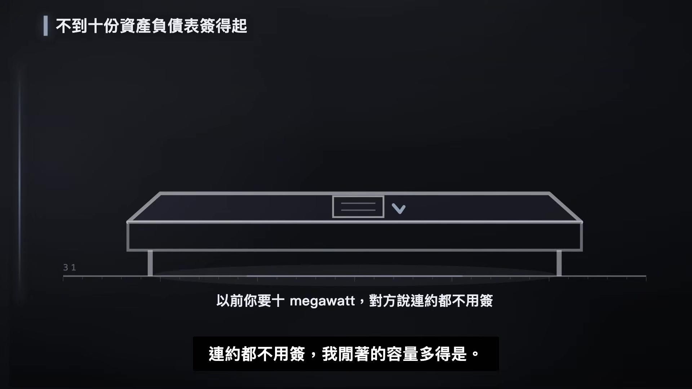

**逐字稿片段：** 現在你去要1GW 對方的回答變成 沒問題 但你要簽約 接下來20年 一天24小時 你都得付這1GW的錢 這種合約有一個特性 用不用都要付 你可以直接想成 健身房的年費 你去不去他都照扣 只是這裡的金額 是一整座城市的電費 原因是電網上已經沒有多餘的備源容量了 電力公司必須確定你會付才敢為你蓋 這件事本身就是一臺把產業推向集中的機器

**話題推測：** 比較過去申請10MW電力與現在申請1GW電力，需簽20年合約的差異。

---

## 00:30:13

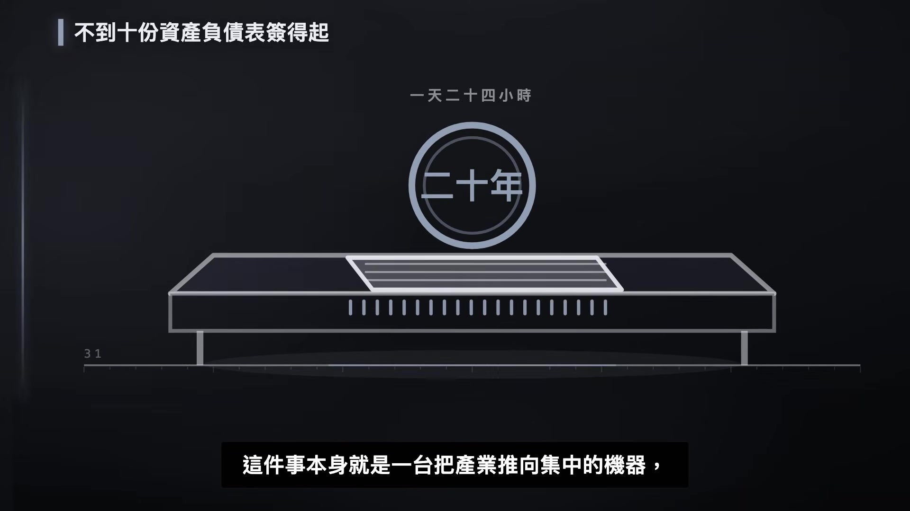

**逐字稿片段：** 因為全世界能簽下那張紙的資產負債表不到10分 這裡還有一個副作用 因為超大規模的業者只要那種未來還能擴充的廠子

**話題推測：** 指出全球能簽署這種長期電力合約的公司不到10家。

---

## 00:30:22

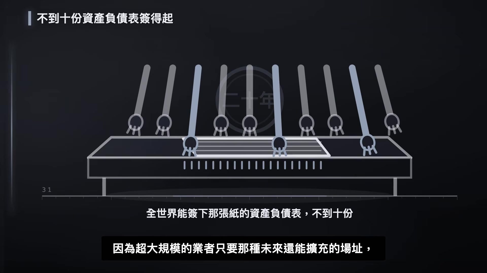

**逐字稿片段：** 所以任何100MW以下的地點基本上都變成了孤兒 他自己的判斷是 等需求從訓練轉向日常使用 這件事會慢慢鬆開 因為日常使用可以切成小塊 比較好搬 供應鏈這條線上 有一段對臺灣觀眾特別有意思 他在課堂上順口說

**話題推測：** 提及100MW以下規模的電力地點因大型業者需求而變為「孤兒」。

---

## 00:30:39

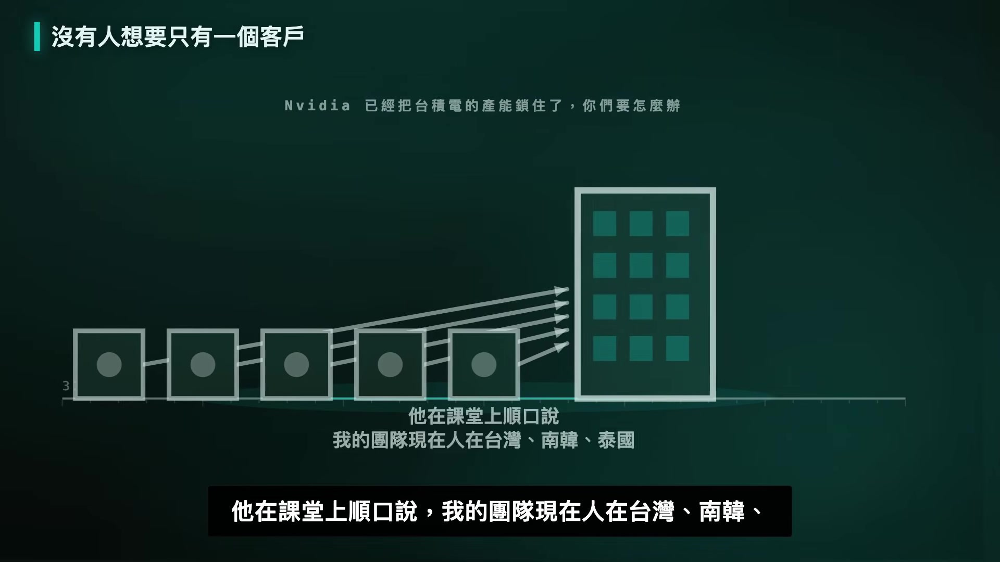

**逐字稿片段：** 團隊現在人在臺灣南岸泰國 這條鏈的一大段就在我們旁邊 然後有學生問了一個臺灣媒體 每天在講的問題 NVIDIA已經把臺積電的產能鎖住了 你們要怎麼辦 他沒有抱怨 他用對基本的道理 把這個前提化解掉 他說你想看 如果你是一家電容器的供應商 你會想要只有一個客戶嗎 就算這個客戶未來三年 要包下你全部的產能 就算他讓你賺更多錢 這對供應商其實不好 你去看任何一家公司的財報揭露

**話題推測：** 提到團隊成員在台灣南岸與泰國進行供應鏈工作。

---

## 00:31:09

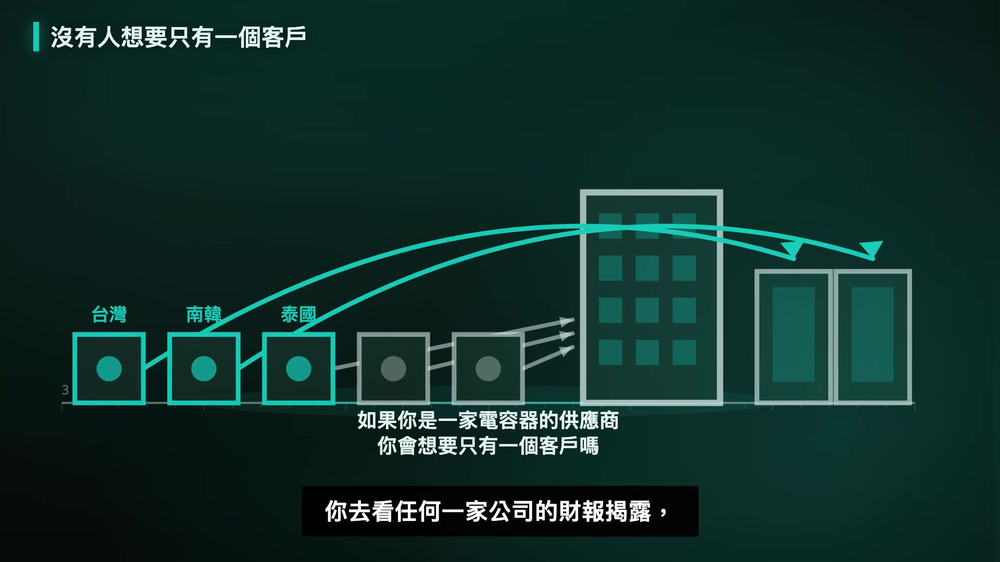

**逐字稿片段：** 如果九成的營收來自一兩個客戶 投資人不會開心 也就是說 供應商自己就有很強的動機 不讓客戶集中 這是整個系列裡少數幾個 真的在對抗集中的力量 而且它靠的不是道德 是風險 另一個學生問 TPU什麼時候可以打敗GPU 他說這連目標都不是 就是市場擴張的太劇烈 沒有輸贏可言 而主持人接著給了全班一句更重的話 真實世界裡沒有贏家和輸家 只有把事情做成的人 和沒做成的人 這一堂最珍貴的部分 是兩段承認

**話題推測：** 指出若供應商九成營收來自少數客戶，投資人會不悅。

---

## 00:31:39

**逐字稿片段：** 第一段發生在2015年 他們在設計第二代TPU的時候 要選網路技術 當時整個產業 40幾年的共識是 網路就是用Ethernet 也就是我們平常在用的 以太網路 有一些很聰明的人跟他說 對 這個領域要的是另一種做法 Ethernet是錯的解法 他當時的反應是 搞什麼 我背後有40年的歷史 而且我和另外1000個人 一直都是對的 然後他在臺上說 錯了 TPU真的不該用Ethernet 這個判斷經受了十年的考驗 我搞錯了 而我學到了一件事 第二段更重 有人問他真正的瓶頸是什麼 他先說沒有單一的瓶頸 他每天都在換 然後他給了這場最誠實的一句 我最不知道解法的那一個是能源 他說要把能源擴張到我們全球需要的規模 方法都很貴 而且不只是錢貴 被追問哪些方向被低估的時候 他的答案樸素到不像一個技術長

**話題推測：** 回顧2015年Google設計第二代TPU時，在網路技術選擇上的錯誤判斷。

---

## 00:32:31

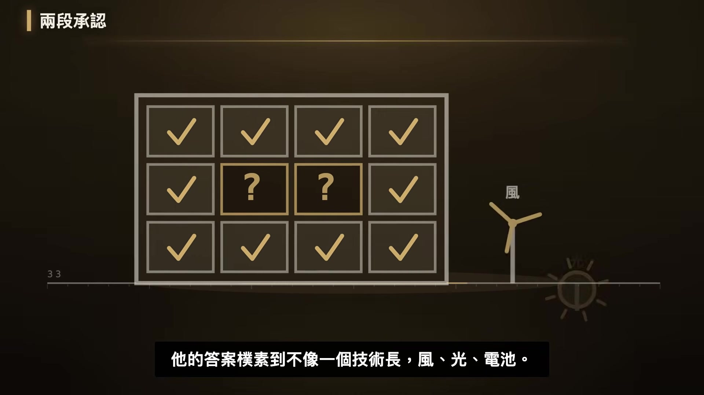

**逐字稿片段：** 風光電池 他說這是一個製造和規模化的過程 裡面有物理 而物理就是需要時間 他這一堂的最後回到了一件跟工程無關的事 Google的機房有兩種設計 一種比較省電但是要用很多水

**話題推測：** Vahdat認為風光電池的製造和規模化是被低估的方向。

---

## 00:32:46

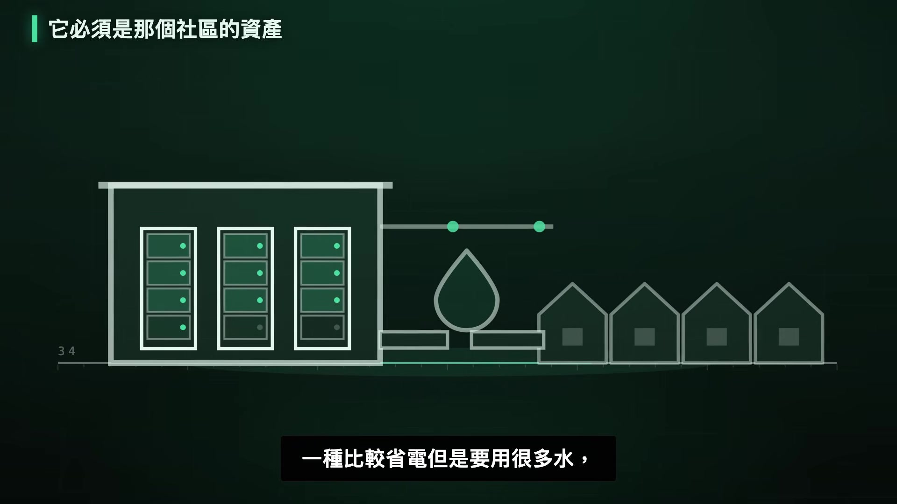

**逐字稿片段：** 一種幾乎不用水但是電銷差10% 他說10%很多 1GW省他10% 那是多出來的100MW 可是他做的決定是 除非那個社區的水真的很充裕 否則一律走比較耗電 幾乎不用水的那種 他還講了另外一個做法 電網我在一年裡最冷或最熱的那一軸 必須過度建設 所以他們跟電力公司說 等那兩天你告訴我們 我們把資料中心關掉 把100MW還給你 他說我們很樂意接受那個停機 然後是他這一場的最後一句 那個Gigawatt 不是某個人試算表裡 一個抽象的Gigawatt

**話題推測：** 比較Google機房兩種設計：省電耗水與不耗水但效率低10%。

---

## 00:33:19

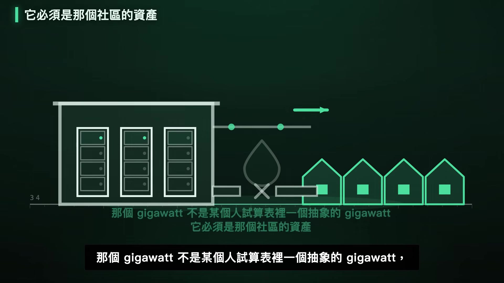

**逐字稿片段：** 它是在猶他州的一次大規模部署 它必須是那個社區的資產 你有沒有發現 這句話跟第一位講者說的 社會許可 其實同一件事情的兩端 我們把四個人放在一起看 他們表面上完全不相干 企業策略 創業哲學 一場官司 機房工程 可是他們咬得很緊 這個時代的起點 是一次刻意的集中 微軟的執行長親口說 最大的那一個決定不是那筆錢 說了算力的集中 而現在同一群人 每一個都把集中值認為失敗模式 OpenAI的執行長說 即使我們會是那少數幾家之一 這也不是該容忍的事 微軟的執行長說 如果變成少數幾家拿走全部報酬 我們會失去社會許可 可是Google那位管基礎設施的人 把物理現實攤開來 一座機房350億美元起跳 前置期兩到三年 還要籤一張20年的電力合約 RCA簽得起那張紙的 不到十份 也就是說 集中不是誰的陰謀 它是條件本身長出來的結果 最有權利的三個人 一致說不要集中 但沒有一個人能說出 避開他的機制 OpenA的執行長自己承認 最早被討論的問題就是 算力要怎麼分 然後他沒有答案 而第三位講者告訴我們 問題一直沒有答案 最後會發生什麼事 不是一場辯論 是一個人站在法庭裡 而法官在問 如果要讓公司負責 為什麼不是執行長 前四講走遠 你會發現這四個人 其實在回答同一個問題 這一整套東西 該由誰蓋 有誰付錢 又該由誰負責 微軟的執行長說 真正的賭注 從來不是那筆錢 是算力的集中

**話題推測：** 強調資料中心不僅是GW數字，更是猶他州社區的實體資產。

---
