# jimainotebook_RtytrLzbJ-0 — 關鍵畫面索引

- 來源逐字稿：[jimainotebook_RtytrLzbJ-0_FIN.srt](jimainotebook_RtytrLzbJ-0_FIN.srt)
- 影片：https://www.youtube.com/watch?v=RtytrLzbJ-0
- 截圖數：62

## 00:00:11

**逐字稿片段：** 我們把耶魯大學的賽局理論公開課, 課號ECON159, 前面八堂課一起上完, 講臺上是Ben Pollack老師, 這八堂課都在回答同一個問題, 當你的結果不只有你決定, 你該怎麼選, 我先把答案放在前面, 難的不是算出自己要什麼, 是算出別人會怎麼做, 你要什麼, 通常你心裡有數, 可是別人在想什麼, 別人以為你在想什麼, 這才是這門課真正在練的功夫。 Polak上課不先教公式

**話題推測：** 影片開場，介紹耶魯大學賽局理論公開課的背景資訊。

---

## 00:00:35

**逐字稿片段：** 他發開一張紙 讓全班先玩一場遊戲 第一堂課那張紙上 只有兩個字母 2007年秋天 耶魯大學的第一堂賽局理論課 Ben Polak走進教室 先發開一張紙 紙上寫著一個成績遊戲 你要在格子裡填一個字母 Alpha或是Beta 不能給旁邊的人看 老師會把你的紙 跟另一個同學的紙 隨機配成一對 你們兩個永遠不會知道 對方是誰

**話題推測：** 介紹第一堂課的遊戲，可能會顯示一張紙或遊戲規則。

---

## 00:00:58

**逐字稿片段：** 規則只有四行 你填Alpha 對方填Beta 你拿A 對方拿C 都拿B減 你填Beta 對方填Alpha 你拿C 對方拿A 兩個人都填Beta 兩個人都拿B加 Polak把這四行

**話題推測：** 詳細說明遊戲的四行規則，可能以文字或簡報形式呈現。

---

## 00:01:12

**逐字稿片段：** 畫成一張表 橫的是你的選擇 直的是對方的選擇 每一格填上 兩個人的成績 他問全班 填Alpha的請舉手 舉起來的手 多到數不完 你會填哪一個 Polak請舉手的同學 說說理由 有一個女生站起來 她說等那句話 後來變成這門課的第一課 她說 不管對方填什麼 我填Alpha的結果都比較好 C B-B C 好 假設對方填Beta 你填Alpha拿A 你填Beta拿B加 A比B加好 兩欄都是同一個答案 這種情況有一個名字

**話題推測：** 將遊戲規則畫成一張表格，預期出現賽局矩陣圖。

---

## 00:01:44

**逐字稿片段：** 叫Secret Dominance 中文叫嚴格優勢 它的意思是 不管別人做什麼 這一步都比那一步好 Polak說 這個理由比另一位同學的強得多 因為另一位同學是先猜 對方會填Alpha 才決定自己也填Alpha 這個女生根本不必猜

**話題推測：** 介紹新概念「嚴格優勢」（Secret Dominance），可能顯示定義文字。

---

## 00:01:57

**逐字稿片段：** 於是第一課寫上黑板 你不要去打一個 被嚴格壓過的選擇 第一課聽起來很安全 可是你再看一次那張表 全班大部分人都填了Alpha 結果呢 兩個人都填Alpha 兩個人都拿B- 如果兩個人都填Beta 兩個人都拿B- B-比B-好 每個人都做了對自己最好的選擇 最後大家一起掉到比較差的地方

**話題推測：** 總結第一課的內容，預期顯示「第一課」簡報標題。

---

## 00:02:16

**逐字稿片段：** 這就是第二課理性的選擇會通向壞結果 這個局面有一個名字叫Prisoner's Dilemma 中文叫囚徒困境 Polak舉了一個你一定有感覺的例子

**話題推測：** 總結第二課的內容，預期顯示「第二課」簡報標題。

---

## 00:02:24

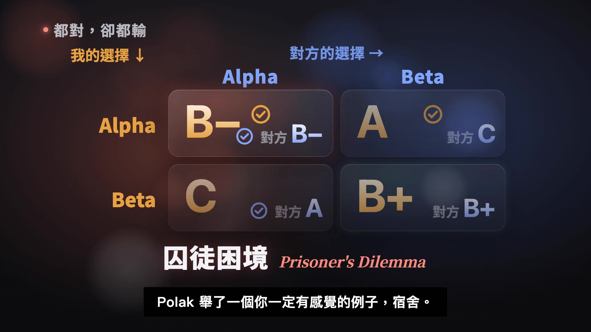

**逐字稿片段：** 宿舍 你跟室友合住一間房間 到學題末那間房間通常很慘 為什麼 因為如果室友不收你更不享受 你最不願意的事就是替別人收 如果室友收了 房間本來就乾淨 你也不用動 兩邊算下來 你都不會收 那再留到學題結束 這裡有件事要先講清楚 Paulak說 剛剛那張成績表 其實還不算一場遊戲 他有玩家 有可以做的選擇 也有每一種組合的結果 可是他少了一樣東西

**話題推測：** 提出新例子：宿舍清潔問題，可能搭配宿舍圖片。

---

## 00:02:50

**逐字稿片段：** 少的是pay off 中文叫報酬 也就是每個人心裡真正在乎的東西 你只在乎自己的成績嗎 還是對方拿C你也會難過 Paulak把在乎的東西換掉

**話題推測：** 介紹新概念「報酬」（pay off），可能顯示定義文字。

---

## 00:02:59

**逐字稿片段：** 重新算一次 他假設你拿A 對方拿C的時候 你會有罪惡感 晚上睡不好 你拿C 對方拿A的時候 你除了難過 還會覺得不公平 同一張表 同一批選擇 只是換了在乎的東西 Alpha就不再壓過Beta 全班的手也真的分成兩半

**話題推測：** 重新計算遊戲結果，預期顯示修改後的賽局矩陣圖。

---

## 00:03:14

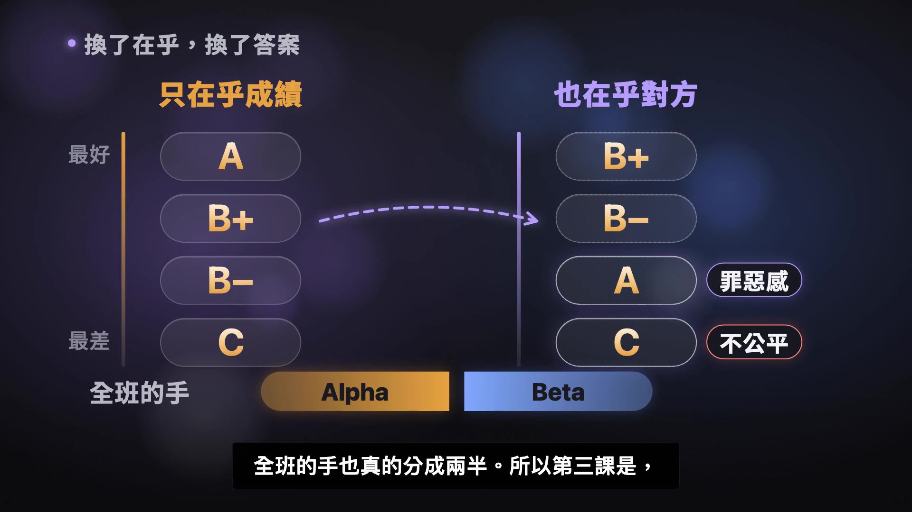

**逐字稿片段：** 所以第三課是 你得先弄清楚自己要什麼 才談得上怎麼拿到 接下來Polak 做了一件很聰明的事

**話題推測：** 總結第三課的內容，預期顯示「第三課」簡報標題。

---

## 00:03:21

**逐字稿片段：** 他把兩種人混在一起 假設你只在乎自己的成績 可是你知道對面那個人 會有罪惡感 你怎麼選 再翻過來 假設你是會有罪惡感的那種人 對面坐的是 是一隻在乎成績的人 你又怎麼選 第二種情況比較有意思 你自己這邊 沒有一個穩贏的選擇 Alpha不壓過Beta 可是你把眼睛 移到對方那一欄 你會發現 對他來說 Alpha壓過Beta 他一定填Alpha 你知道他會填Alpha 你就知道自己該填Alpha

**話題推測：** 介紹混合兩種玩家類型的新情境，可能顯示情境圖示。

---

## 00:03:44

**逐字稿片段：** 這就是第四課 也是這門課 真正難的地方 你要坐到對方的位置上 用他在乎的東西 替他算一次賬 順帶一提 那天耶魯有238個人 填Alpha 36個人填Beta Paulak笑著說

**話題推測：** 總結第四課的內容，預期顯示「第四課」簡報標題。

---

## 00:03:56

**逐字稿片段：** 第五課是耶魯的學生很自私 第一堂課結束前 Paul Lark又發了第二張紙 這次的題目更好玩 你要寫下一到一百之間的一個整數 老師會算出全班的平均數 最接近平均數三分之二的人贏 獎品是一張五塊美金的鈔票 他當場放進信封 交給攝影師保管 你先自己想一下 你會寫幾 下一堂課 Paul Lark把大家的答案挑出來

**話題推測：** 總結第五課的內容，預期顯示「第五課」簡報標題及耶魯學生的數據。

---

## 00:04:15

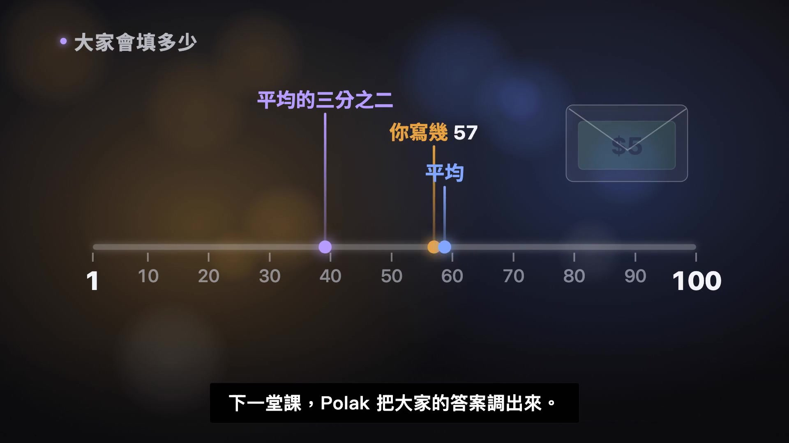

**逐字稿片段：** 有一批人寫在32到34之間 他請其中一個同學說理由 那個同學說 如果大家亂寫 平均大概是50 50的三分之二 大概是33 所以我寫33 這個推理聽起來很順 Polak也說他不是壞答案 他是一個很好的起點 可是他的第一句話就錯了 錯在哪裡 在回答之前

**話題推測：** 呈現猜數字遊戲的初步結果，可能顯示數字分佈圖。

---

## 00:04:33

**逐字稿片段：** Polak先講了一個更古老的故事 是一元前三世紀 Hannibal要帶軍隊翻進羅馬 他有兩條路可以走 一條是翻山的南路 就要折損一個軍團 另一條沿著海岸走 好走 不折損 你是守方 你只守得住其中一條 你守哪一條 全班大多數人舉手 守好走的那一條 Polak問 好走的那一條 有壓過難走的那一條嗎 沒有 如果對方真的走山路 你守在海邊就撲空了 那為什麼大家都選對 因為大家其實已經算過 對方那一欄 從他的角度看 走好走的路 最差的情況跟走山路一樣 最好的情況比走山路好 他當然走好走的路 你算出他會走哪一條 你就知道自己該守哪一條

**話題推測：** 講述一個古老的故事：漢尼拔的行軍策略，可能顯示地圖或歷史圖像。

---

## 00:05:09

**逐字稿片段：** 我們回到那個猜數字的題目 那句錯的話是 如果大家亂寫 Paulak請全班互相看一看 他說你們有誰長得像一臺 隨機數字產生器 大家都想贏 大家都在算 那就一層一層往下走

**話題推測：** 回到猜數字遊戲，可能重新顯示遊戲規則或新的計算畫面。

---

## 00:05:21

**逐字稿片段：** 第一層 沒有人會寫超過67 因為就算全班通常寫100 平均的三分之二也只有66點多 寫更大的數字 永遠比不上寫67 68以上等於不存在 第二層 既然沒有人寫超過67 平均最多就是67 三分之二大概是45 45以上也可以刪掉 第三層刪到30 第四層刪到20

**話題推測：** 開始解釋「反覆刪除」的第一層推理，預期有逐步刪除數字的動畫或圖示。

---

## 00:05:40

**逐字稿片段：** 這個手法有個名字叫反覆刪除 意思是刪掉沒人會選的 再回頭看一次 再刪一次 你一直刪下去 最後只剩下一 那天全班的答案是多少

**話題推測：** 介紹新概念「反覆刪除」（Iterated Elimination），可能顯示定義文字。

---

## 00:05:49

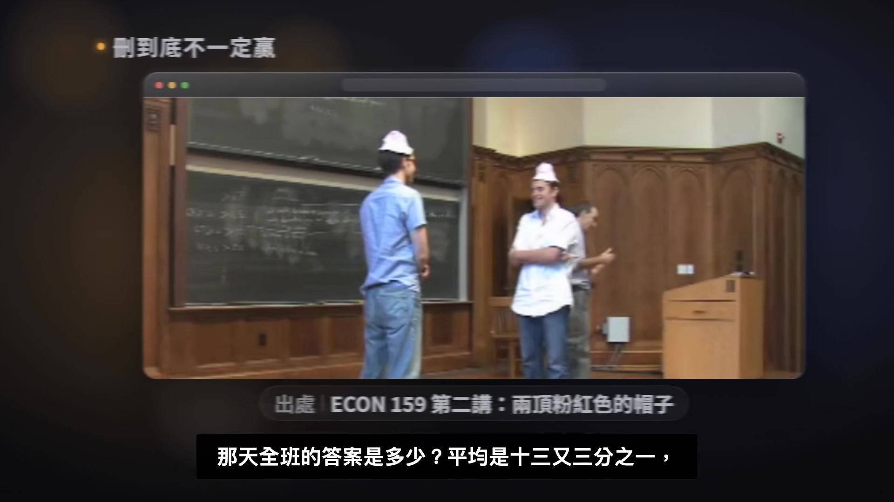

**逐字稿片段：** 平均是13 又三分之一 三分之二剛好是9 寫9的那幾個同學站起來領獎 5塊錢分成9份 有意思的是寫1的人是全班最多的 可是他們沒贏 為什麼 為什麼3到底反而不對 因為3到1需要的條件很重 你要理性 你要知道別人理性 你要知道別人知道你理性 一路無限往上 這種狀態

**話題推測：** 公布猜數字遊戲的最終平均結果和贏家數字，可能顯示具體數字。

---

## 00:06:07

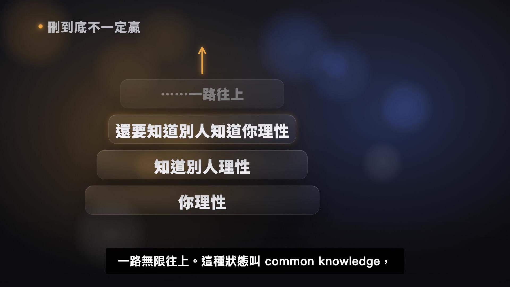

**逐字稿片段：** 叫common knowledge 中文叫共識

**話題推測：** 介紹新概念「共識」（common knowledge），可能顯示定義文字。

---

## 00:06:09

**逐字稿片段：** Polak請兩位助教上臺 各戴一頂粉紅色的帽子 兩個人都看得到對方頭上是粉紅色 可是誰也看不到自己頭上那一頂 所以臺上兩個人都知道有粉紅色的帽子 卻沒有人敢說 對方也知道 後來Polak讓全班再玩一次 這一次每個人寫的數字都更小 變得不只是你會算了 是你知道旁邊每個人也都會算了

**話題推測：** 透過助教戴帽子的方式演示情境，可能顯示實際演示畫面。

---

## 00:06:27

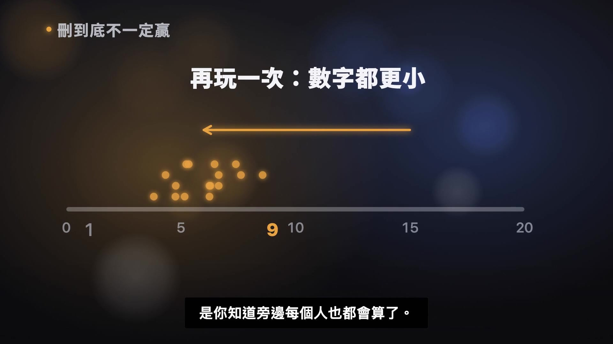

**逐字稿片段：** Polak把同一套想法搬到政治上 他在黑板上畫一條線 上面有十個位置 1號是最左邊 10號是最右邊 他假設每個位置都住著全部選民的10% 假設每個選民都投給離自己最近的候選人 假設兩個候選人都想拿到最多的票 你是其中一個候選人 你站哪裡 Polak問全班 有沒有哪個位置根本不該站 一個同學回答 1號和10號 你算一次1號跟2號的差別 你佔2號對方佔1號 1號那邊的人投給他 剩下9層全部投給你 你佔1號對方佔2號 只有1號那邊的人投給你 對方不管佔哪裡 1號都比1號多拿5個百分點 所以2號壓過1號 又變得道理一樣 9號壓過10號 1號和10號刪掉之後 有位同學舉手說 那再看一次呢 這是關鍵的一步 在原本的遊戲裡 2號並沒有被3號壓過 因為萬一對方佔1號佔2號 會比佔3號多拿票 可是既然1號不會有人佔 這個萬一就消失了 於是2號被3號壓過 9號被8號壓過 你再上一次 3號和8號也走了 再一次 4號和7號也走了 最後整條線上 只剩下5號和6號 兩個人肩並肩站在正中間 這個結論在政治學裡有名字 叫Median Voter Theorem 中文叫中間選民定理 他說決定選舉結果的 是站在中間的那一小群人 Paulak舉了一個老例子 你今天回去看

**話題推測：** 將賽局理論應用於政治情境，可能顯示政治光譜圖。

---

## 00:07:38

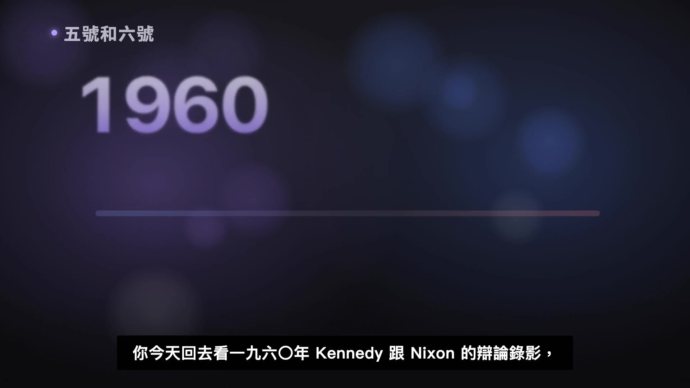

**逐字稿片段：** 1960年Kennedy跟Nixon的辯論錄影 會很驚訝 Kennedy講起話來有多保守 兩個人都在往中間擠 同一個模型 換一個場景 你每天都看得到 你有沒有想過

**話題推測：** 引用1960年甘迺迪與尼克森的辯論錄影，可能顯示歷史影像。

---

## 00:07:47

**逐字稿片段：** 加油站 為什麼老是擠在同一個路口 照理說加油站 平均散在城市各處 對大家最方便 你車子在哪裡快沒油 附近就有一家 可是現實不是這樣 他們常常兩三家 擠在同一個十字路口 原因跟剛剛那條線一模一樣 你如果自己搬遠一點 離你比較近的客人就變少了 對手會把你這邊的客人 一口氣接走 你不敢離開 對手也不敢離開 兩邊就這樣黏在一起 這個想法在經濟學裡 出現得更早 1919年就有一位

**話題推測：** 提出新例子：加油站的選址問題，可能顯示地圖上加油站群聚的圖像。

---

## 00:08:11

**逐字稿片段：** 叫Hotelling的學者寫過 政治學那邊是 1957年的Anthony Downs 同一件事 兩個領域各自想到一次 Polak 記得做了一件 我很喜歡的事 他把模型放在臺上 然後請全班一起挑他的毛病 同學講出來的有這些

**話題推測：** 提及Hotelling學者的名字及年份，可能顯示學者照片或論文資訊。

---

## 00:08:25

**逐字稿片段：** 選民不是平均分佈在一條線上 不是每個人都會去投票 真實選舉常常不止兩個候選人 政治也不是隻有 左跟右一個方向 還有外交 環境 還有候選人的人品 Polak自己補了一個 最要命的 這個模型 假設候選人想站哪就站哪 可是你相信嗎 一個有記錄的人 突然說自己在中間 選民通常不買賬 他舉了英國的例子

**話題推測：** 列出對政治模型提出的毛病，可能以條列式簡報呈現。

---

## 00:08:44

**逐字稿片段：** 工黨連輸好幾次選舉 每次都說我們已經是中間路線了 沒有人信 後來Tony Blair的做法很極端 他把對手政府 未來五年的財政計劃 整份拿過來 說這就是我的計劃 他不是說自己在中間 他是把位置真的搬過去 Polak在課堂上說 接下來要講 世界上最重要的一場遊戲 全班安靜下來

**話題推測：** 以英國工黨的例子說明，可能顯示東尼布萊爾的照片或相關新聞畫面。

---

## 00:09:03

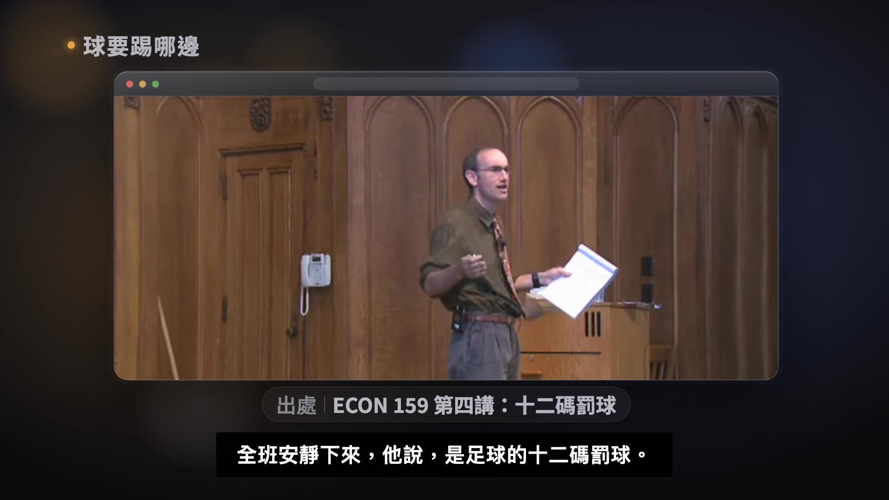

**逐字稿片段：** 他說 是足球的十二碼罰球 踢的人有三個選擇 或鋪右邊 他先把進球的幾率

**話題推測：** 介紹新遊戲：足球十二碼罰球，可能顯示足球場上的罰球示意圖。

---

## 00:09:11

**逐字稿片段：** 填進一張表 你踢左邊 守門員鋪左邊 幾率最低 你踢左邊 他鋪右邊 幾率最高 踢右邊剛好反過來 踢中間呢 不管他鋪哪一邊 幾率都落在中間 不高也不低 你先看一點這張表 有沒有哪個選擇 被完全壓過 沒有 踢中間在他鋪左邊的時候 比踢左邊好 在他鋪右邊的時候 又比踢右邊差 用前面的號刪除的方法 你在這張表上一步也走不動 可是這是最重要的遊戲 總不能什麼都說不出來 Pluck換了一個工具

**話題推測：** 填寫進球機率的表格，預期出現新的矩陣圖。

---

## 00:09:36

**逐字稿片段：** 他在黑板上畫一張圖 橫軸是你相信守門員往右撲的幾率 從0到1 縱軸是你的進球幾率 你踢左邊畫出一條線 踢右邊畫出另一條線 踢中間畫出第三條 全班一看就看懂了 中間那條線 從頭到尾都被壓在另外兩條下面 這代表什麼 這代表不管你心裡怎麼想守門員 不管你覺得他往右撲的機會是1層還是9層 踢中間都不會是你最好的選擇

**話題推測：** 在黑板上畫圖分析，預期顯示新的座標圖表。

---

## 00:09:58

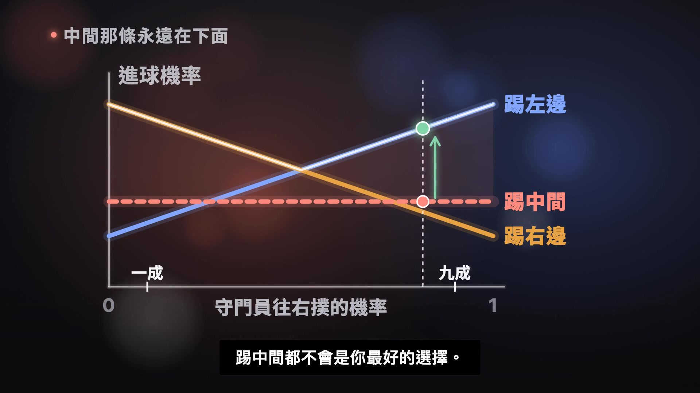

**逐字稿片段：** 這個概念叫best response 中文叫最佳回應 意思是在你相信對方會怎麼做的前提下 你能走得最好的一步 所以這一堂課的結論很短 你不要踢中間 Polak還補了一句 除非你是德國人 這一段講完之後 Polak又把模型放下來 檢查一次 他說有人真的去查了實際比賽的資料 論文登在美國經濟評論上

**話題推測：** 介紹新概念「最佳回應」（best response），可能顯示定義文字。

---

## 00:10:17

**逐字稿片段：** 作者是Caporey 跟幾位合作者 真實數字跟他黑板上邊的數字很接近 只有一個差別 射手往自己順角的方向踢 進球率確實高一點點 全班還挑出別的毛病 守門員其實可以站著不動 射手還可以選擇踢高踢低 有一位同學講到一件更要緊的事 你不只選方向 你還選要踢多大力 Polak說這個很關鍵 如果你是那種球踢得很重 但是不太準的人 往兩邊踢比較容易射偏 往中間踢 反而因為球速太快守不住 把這件事划進圖裡

**話題推測：** 提及Caporey的論文及其合作者，可能顯示論文標題或作者名稱。

---

## 00:10:44

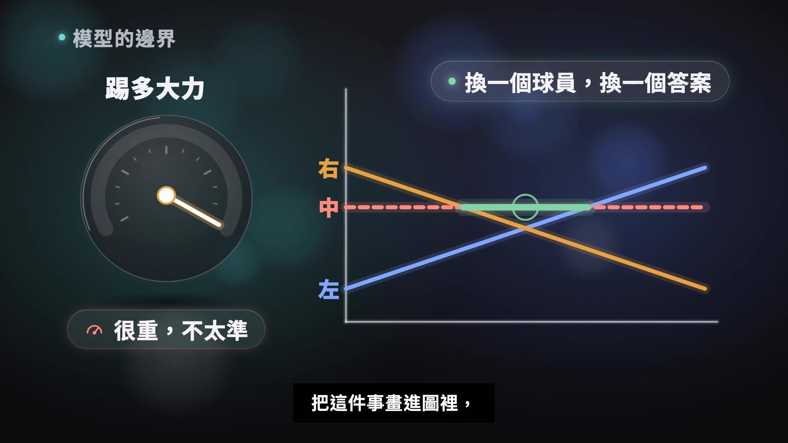

**逐字稿片段：** 中間那條線的一小段就冒出頭來了 同一堂課的下半場 Polak換了一個你更用得到的例子

**話題推測：** 將踢球力度納入分析並繪製到圖中，預期顯示修改後的圖表。

---

## 00:10:49

**逐字稿片段：** 合夥 兩個人合開一家事務所 利潤一人一半 可是利息各出各的 你多花一小時 公司多賺一點 這很直接 除此之外 還有一項你們兩個一起做 會比各做各的多賺一些 因為你擅長的地方 剛好補上他不會的 這一項有一個名字叫忠孝 Polak 請大家算出一件事 如果對方出的利益是某個數字 你出多少利益對自己最好

**話題推測：** 轉換新例子：合夥經營事務所，可能顯示兩位合夥人的示意圖。

---

## 00:11:08

**逐字稿片段：** 算出來是一條往上走的線 對方越攀你也越想攀 把兩個人的線

**話題推測：** 繪製一條往上走的線來表示最佳回應，預期顯示新的圖表。

---

## 00:11:13

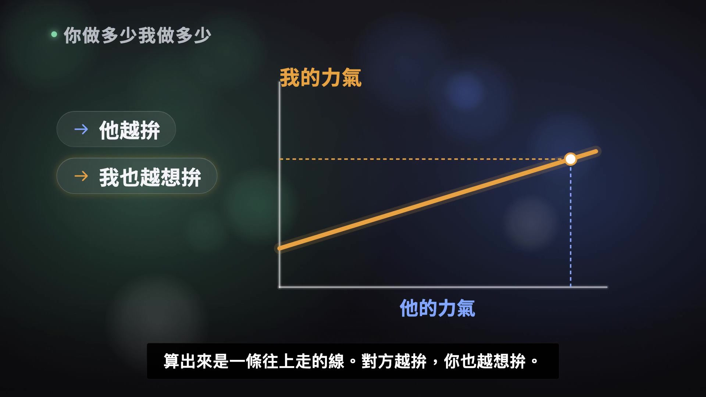

**逐字稿片段：** 畫在同一張圖上 焦點就 兩個人同時在對對方 做最佳回應的地方 這種你多做 我也想多做的關係 Polak給了一個名字

**話題推測：** 將兩條線畫在同一張圖上，預期顯示兩線交會的圖表。

---

## 00:11:22

**逐字稿片段：** 叫策略互補 算出來之後 Polak問了一個更實際的問題 這個出力的程度 是多了還是少了 答案是少了兩個合夥人出的力 會比整體最好的程度還低 為什麼 有同學說 因為對方會偷懶 Polak說這個方向對 可是還沒說到點上 真正的原因是這樣 你多做一小時 這一小時的辛苦全部是你的 可是這一小時多賺的錢 你只拿一半 另外一半進了對方口袋 你在算自己這一步的時候 那一半根本不在你的賬上

**話題推測：** 介紹新概念「策略互補」，可能顯示定義文字。

---

## 00:11:45

**逐字稿片段：** 經濟學把這件事叫外部性 你回頭看第一堂課 那間沒人收拾的宿舍 是同一回事 成本自己扛 好處大家分 這裡也是 只要利潤要分 出力就會偏少 跟人品沒什麼關係 兩條最佳回應線 交匯的那個點 有一個名字

**話題推測：** 介紹新概念「外部性」，可能顯示定義文字。

---

## 00:12:00

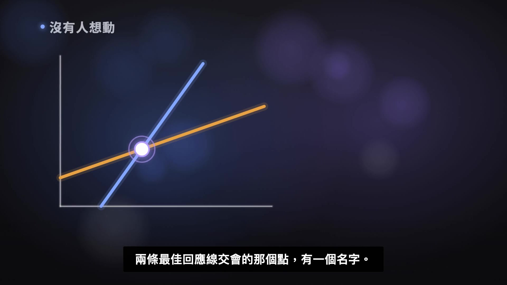

**逐字稿片段：** 它叫Nash Equilibrium 中文叫Nash均衡 它的定義只有一句話 每一個人的選擇 都是對其他人選擇的最佳回應 Polakke的兩種聽得懂的說法 第一種叫沒有後悔 你隔天早上醒來 已經知道別人做了什麼 你回頭看自己那一步 你不會想改 第二種叫自我實現的預期 如果每個人都相信別人會照這個組合走 那每個人真的就會照這個組合走 因為那正好是自己最划算的一步 Polak特別提醒一句 這不代表人一定會走到均衡 全班玩猜數字的時候 均衡是1 真正的答案是9 均衡是一種很有用的預測 不是一條鐵律 Polak又讓全班玩一場 規則是這樣

**話題推測：** 介紹新概念「Nash均衡」（Nash Equilibrium），可能顯示定義文字。

---

## 00:12:35

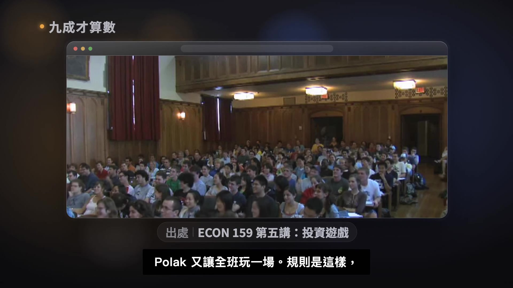

**逐字稿片段：** 你可以投10塊錢 也可以不投 不投的人不賺不賠 投了的人要看全班的結果 如果全班有9成以上的人投 你拿回15塊 等於淨賺5塊 如果不到9成 你那10塊錢就沒了 中間不準討論 不準打暗號 你會投嗎 第一次舉手 全班大概一半一半 Polak問了幾個人 有人說我投 因為不投永遠不可能賺到東西 有人說我不投 因為要賺這五塊 得先賭九成的人跟我一樣 賠的時候卻是整整十塊 兩種算法都說得通 問題是一半一半離九成很遠 這一局所有投錢的人都賠 這場遊戲有幾個均衡 有同學回答得很好 兩個 一個是所有人都投 大家都賺 沒有人想改 另一個是所有人都不投 大家都沒事 也沒有人想改 因為如果別人都不投 你自己跳下去就是白賠 兩個都是納許均衡 可是一個明顯比另一個好 Polak讓全班再玩第二次 第三次舉手的人越來越少 第三次幾乎沒有人投 全班一路滑到比較差的均衡 為什麼會往下不往上 因為第一次就已經在九成以下了 沒投的人發現自己做對了 就繼續不投 投的人發現自己賠了 下一次也不投 Polak說 如果第一次剛好有九成三的人投 這班很可能一路往上滑到好的那一邊 這裡有一個容易混掉的地方 全班掉到壞結果 看起來很像第一堂課的囚徒困境 可是他不是 在囚徒困境裡 不合作那一步永遠比較好 怎麼算都一樣 在這裡不是 如果全班都投 你跟著投就會賺 你的選擇跟著別人的選擇跑

**話題推測：** 介紹新遊戲：投資十塊錢，可能顯示遊戲規則或獎勵簡報。

---

## 00:13:51

**逐字稿片段：** 這種局面叫協調問題 Polak說他在社會上到處都是 一種難看的流行 大家一起穿 一套不見得最好的軟體 大家一起用 因為別人都在用 你的檔案才打得開 一種電視規格 大家一起選 最戲劇化的一個例子

**話題推測：** 介紹新局面「協調問題」，可能顯示定義文字。

---

## 00:14:04

**逐字稿片段：** 叫銀行擠兌 銀行把你的存款 借出去賺利息 只要大家有信心 把錢留在裡面 這是好的均衡 只要大家開始害怕 一起跑去領錢 銀行手上根本沒有那麼多現金 他就真的倒 我們回到銀行擠兌這件事 2007年那個秋天

**話題推測：** 提出新例子：銀行擠兌，可能顯示銀行門口排隊的人潮照片。

---

## 00:14:18

**逐字稿片段：** 英國一家叫Northern Rock的銀行 正在發生擠兌 報紙上就有存戶在門口排隊的照片

**話題推測：** 提及2007年英國Northern Rock銀行擠兌事件，可能顯示新聞畫面。

---

## 00:14:23

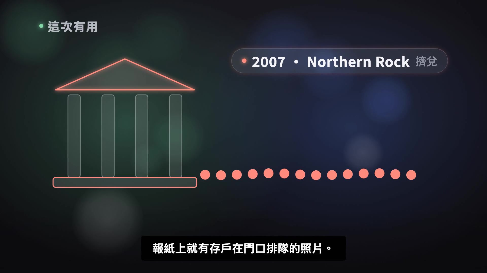

**逐字稿片段：** Paul Lager也提到電影《風雲人物》 片子裡的銀行沒有倒 因為Jimmy Stewart站出來 跟大家把話講清楚 然後他做了一件很妙的事 他把麥克風交給一位同學 給他五秒鐘 讓他對全班說話 那位同學只說了一句 如果我們都投了 大家都比較好 所以大家都投吧 接著再玩一次 幾乎全班都投了 同一場遊戲 玩第四次 結果整個翻過來 他沒有給錢 沒有簽約 沒有威脅任何人 他只是把話說出來 在囚徒困境裡 這種話一點用都沒有 在協調問題裡 這種話 可以把大家一起搬到 另一個均衡 這就是領導幫得上忙的地方 下一堂課 Polak 說要幫大家解決約會的問題

**話題推測：** 提及電影《風雲人物》，可能顯示電影劇照。

---

## 00:14:56

**逐字稿片段：** 一對男女約在電影院碰面 有三部片可以選 兩個人忘了先講好 要看哪一部 進場前也聯絡不上 你先看一眼 有沒有 哪一部一定不用考慮 有 第三部片是兩個人 都最不想一起看的 不管對方去哪一部 你選他都比較差 直接刪掉 剩下兩部 兩個人碰到一起 才有分數 各走各的就是零分 所以這裡有兩個 納許均衡都去看第一部 或者都去看第二部 麻煩在後面 女生比較想看第一部 男生比較想看第二部 這跟投資遊戲不一樣 那場遊戲裡 好的均衡是大家公認的好 這裡兩個人喜歡的均衡不是同一個

**話題推測：** 介紹新題目：約會協調問題，可能顯示電影院或約會場景。

---

## 00:15:26

**逐字稿片段：** 這種局面 有一個名字叫性別之戰 接下來這個模型很老 1838年就有了

**話題推測：** 介紹新局面「性別之戰」，可能顯示定義文字。

---

## 00:15:31

**逐字稿片段：** 作者是法國人Cornot 比Nash早了大概100年 場景是兩家公司賣一模一樣的東西

**話題推測：** 提及法國學者Cornot的名字及年份，可能顯示學者照片或著作。

---

## 00:15:36

**逐字稿片段：** 就當作瓶裝水 他們要決定的不是價格 是產量 各自決定要生產多少瓶 市場上的水越多 價格就越低 這是需求區現在做的事 每一家的利潤 等於賣價減成本 在層上自己賣掉的瓶數 Polak一樣 先算最佳回應 對方生產的越多

**話題推測：** 提出新例子：兩家公司販售瓶裝水，可能顯示兩個水品牌競爭的示意圖。

---

## 00:15:54

**逐字稿片段：** 是往下走的 你回想一下合夥那個例子 那裡的線往上 對方越攀你越想攀 這裡剛好相反 這種你多做我就少做的關係 叫策略替代 兩條往下的線交在一起 就是這個市場的納許均衡 均衡算出來之後 Polar問了一個很商業的問題 這兩家公司能不能私下講好 各做一半 價格撐高 兩邊一起多賺 表面上可以 有同學馬上說 那是違法的 確實違法 可是我們先把法律放一邊 就算他們真的講好了 這個約定也撐不住 你把自己放進去算一次 假設對方守約只做一半 那你的最佳回應是什麼 多做一點 把多出來的錢賺走 對方也不笨 他知道你會多做 所以他也先多做一點 你知道他知道你會多做 你就再多做一點 一路推下去 兩邊又回到原本那個均衡 你有沒有覺得這個推法很眼熟 這就是猜數字那一堂課的 一層一層往下 只是這次推的不是數字 是產量 就算偷跑的問題解決了 還有一件事擋在前面 價格撐高 利潤就高 利潤一高 外面的人就看得見 Polec說1900年前後的美國 很多產業真的簽過限制產量的協議 紙 鋼 鐵 橡膠 鐵軌都有 結果呢 新的公司看到有錢賺 一家一家開進來 價格還是被壓下去 他也給了一個離現在比較近的例子 1970年代

**話題推測：** 繪製一條往下走的線來表示策略回應，預期顯示新的圖表。

---

## 00:17:03

**逐字稿片段：** OPEC把幾個主要產油國組織起來 講好限制產量 油價撐住了 接下來發生什麼事 英國跑去北海賺油 拉丁美洲一堆國家開始找油 蘇聯的石油變得非常好賺 你們幾個把價格撐住 賺錢的不一定只有你們 這是這個模型最現實的一句話 同一個市場 Polak 換了一個問法 剛剛兩家公司決定的是產量

**話題推測：** 提及OPEC組織限制產量的例子，可能顯示OPEC標誌或油田圖像。

---

## 00:17:23

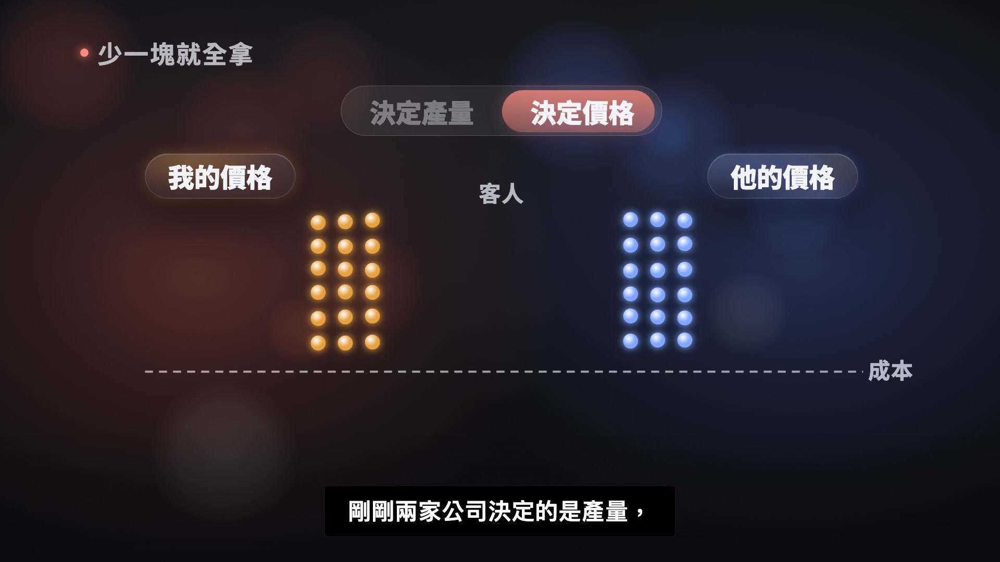

**逐字稿片段：** 這次他們決定的是價格 賣掉多少由市場決定 你先算自己的最佳回應 如果對方的定價高於成本 你怎麼做最好 你把價格定的比他低一點點 就一點點 整個市場的客人全部走到你這邊來 而且每一筆你都還有賺 對方也會這樣想 於是你降一點 他再降一點 一路降到哪裡 降到成本 這個市場的納許均衡 是兩家公司都把價格定在成本上 利潤是零 你注意一下這個結果有多極端 市場上只有兩家公司 只比獨佔多一家 可是消費者拿到的價格 跟有一千家公司在競爭的時候一模一樣

**話題推測：** 修改市場模型，討論公司決定「價格」而非產量，預期顯示新的市場模型簡報。

---

## 00:17:52

**逐字稿片段：** 這個模型叫Betrend競爭 這個結果讓Polak自己也不安 同一個市場 只是把公司在決定的東西 從產量換成價格 結論就從中間跑到極端 他說這件事真的讓人不放心 因為真實世界 不會因為你換一種想法就變樣 救回來的辦法是把現實加回去 前面兩家公司賣的是一模一樣的水 可是真實的商品幾乎都不一樣

**話題推測：** 介紹新模型「Betrand競爭」，可能顯示定義文字。

---

## 00:18:12

**逐字稿片段：** 他畫了一條街 一家店開在街頭 一家店開在街尾 客人平均住在這條街上 你買東西不只付錢 你還要走過去走得越遠越麻煩 所以離你近的那一家 就算貴一點你也可能買 同一條線也可以不是距離 而是啤酒的口味 飲料的甜度 你最愛的口味在這一點 喝到別的口味你也付出了一點代價 Polak

**話題推測：** 畫出一條街來表示產品差異化的模型，預期顯示商店分佈示意圖。

---

## 00:18:31

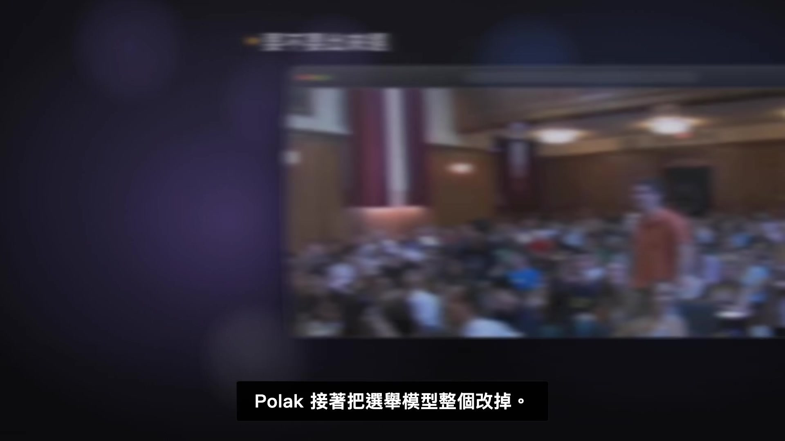

**逐字稿片段：** 接著把選舉模型整個改掉 前面那個模型 假設候選人想站哪就站哪 這次他反過來假設 後選人的位置改不了 而且每一個選民 都可能自己跳出來參選 他挑了一整排同學 當這條政治光譜 最左邊那個是最左派 最右邊那個是最右派 規則是這樣 他站起來就是參選 參選要付一筆錢 選上有一筆獎金 不管誰選上 那個人離你越遠 你心裡越不舒服 他請大家閉上眼睛數到三 要參選的人站起來 第一次 站起來的有個偏左的 一箇中間偏左的 一個站在中間的 中間那個贏了 跑大棍 這是均衡嗎 不是 因為偏左那位站起來也選不上 他坐著反而好 至少省下那筆參選的錢 這個模型馬上長出一個很真實的結論 假設場上有一個中間偏左的候選人 和一個中間偏右的候選人 兩邊票數差不多 這時候有一位更左邊的人決定跳出來選 他當然選不上 可是他會把偏左那位的票分掉一部分 最後贏的是右邊那位 他站出來換來的是一個離他更遠的人當選 Polak說你回頭看 一零零年的美國總統大選

**話題推測：** 重新討論選舉模型，加入新假設，預期顯示新的政治光譜模型簡報。

---

## 00:19:27

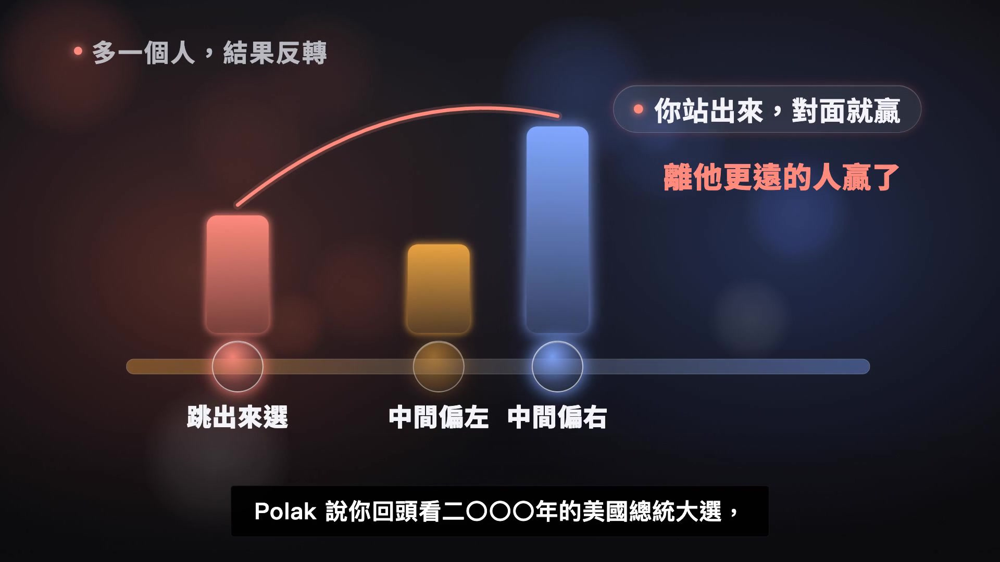

**逐字稿片段：** Nader參選之後發生什麼事 把票算一次就知道了 他還說 那天早上的報紙上 共和黨內部正在吵同一件事 如果Giuliani拿到提名 右派可能自己推一個人出來選 那樣的結果很可能是Hillary贏 這不是哪一邊的問題 兩邊完全對稱 既然候選人不一定會擠在中間 那他們最遠可以離多遠 Polak

**話題推測：** 提及2000年美國總統大選Nader參選的例子，可能顯示Nader照片或選舉結果。

---

## 00:19:47

**逐字稿片段：** 把整條政治光譜切成六等份來算 假設左邊那位站在六分之一的位置 右邊那位站在六分之五 這時候如果有人從正中間跳出來選 選民會分成三份 左邊三分之一 中間三分之一 右邊三分之一 中間那位剛好有機會贏 可是隻要左右兩位 稍微往中間靠一點點 他們各自的地盤就超過三分之一 中間那個人就擠不進來 他當然不會出來 所以答案是 兩個候選人 最遠可以站在六分之一和六分之五 他們不會被擠到正中間 也不會跑到最極端 只要離得太開 中間就會有人跳進來 而且會贏 最後一堂課

**話題推測：** 將政治光譜切成六等份進行計算，預期顯示精細化的政治光譜圖。

---

## 00:20:18

**逐字稿片段：** Polak換了一個完全不同的題目 他說有兩個鎮 一個叫東鎮 一個叫西鎮 每個鎮住得下一樣多的人 世界上有兩種人 高的人和矮的人 人數一樣多 他把教師前半部指定成矮的人 後半部指定成高的人 然後給每個人一樣的心理偏好 你最喜歡的情況是 你住的鎮剛好一半跟你同一種人 一半是另一種人 你最討厭的情況是 整個鎮只有你一個是你這一種 如果沒辦法剛好一半一半 你寧可待在自己這種人比較多的那個鎮 請你注意這一點 這裡沒有任何人討厭另一種人 所有人其實都偏好混住 接下來他請全班閉上眼睛 選一個鎮 Horak先給全班一個接近一半一半的起點 只是稍微偏一點點 第一次舉手 兩個鎮的人開始往兩邊挪 第二次形狀更清楚了 第三次 整間教室乾乾淨淨的分成兩班 前面全部是矮的人 後面全部是高的人 每個人都拿到自己拿得到的比較好的結果 可是整體落挨個 所有人都不喜歡的狀態 Polak問全班 這叫什麼 有同學喊出來 隔離 這個模型有一個關鍵詞

**話題推測：** 介紹最後一堂課的題目：隔離模型，可能顯示城鎮或人群分佈的示意圖。

---

## 00:21:13

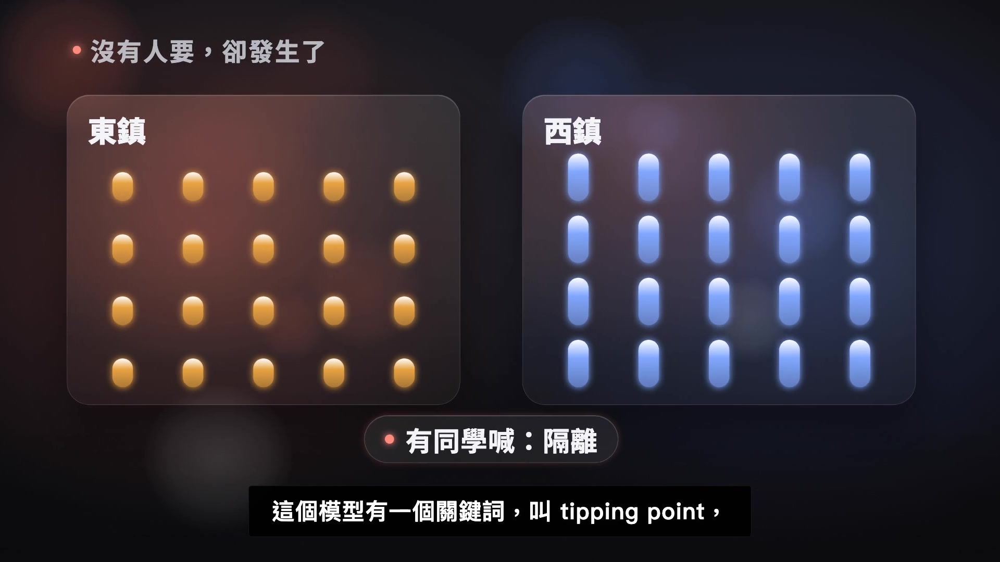

**逐字稿片段：** 叫tipping point 中文叫臨界點 一半一半 那個狀態其實也是一個均衡 可是它很脆弱 只要偏個5% 所有矮的人就想往東邊靠 所有高的人就想往西邊靠 幾步之內整個翻到底

**話題推測：** 介紹新概念「臨界點」（tipping point），可能顯示定義文字。

---

## 00:21:24

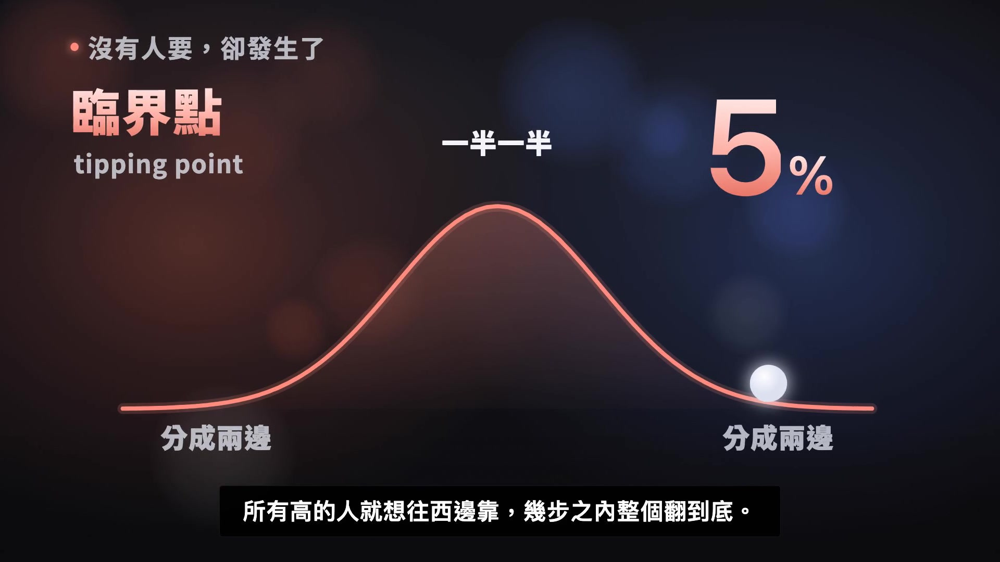

**逐字稿片段：** 這個模型是一位叫Sheldon的學者想出來的 他後來拿到諾貝爾經濟學獎 很大一部分就是因為他 Sheldon想提醒的事情是這樣 如果你走遍世界 發現每個社會都有隔離現象 你很容易推論說 因為大家喜歡隔離 可是這個模型告訴你 還有另一種可能 每個人其實都想住在混住的地方 只是沒有人願意當那個唯一的少數 光是這一點 加總起來就變成了隔離 你看到一個社會現象不代表那些人想要它 Polak說這在美國是很實際的政策問題 哈佛以前讓學生自己選宿舍 結果每一棟宿舍都長出一種味道 後來校方改成隨機分配 你不再自己選 反而大家都住進了混合的宿舍 最後Polak丟出一個 所有人都玩過的遊戲

**話題推測：** 提及Sheldon學者的名字，可能顯示學者照片或諾貝爾獎資訊。

---

## 00:22:01

**逐字稿片段：** 石頭剪刀布 你先想一想 這個遊戲有沒有納許均衡 如果你固定出石頭 我就固定出布 你看到我固定出布 你就改出剪刀 我看到剪刀 我又改回石頭 繞了一圈回到原點 沒有任何一組固定的選擇 能互相站得住 所以到這裡為止 我們學的那些選擇 Polak給了他們一個名字 叫純策略 而這個遊戲在純策略裡沒有均衡 那答案是什麼 答案是三個各出三分之一 他在黑板上算給大家看 對上一個各出三分之一的人 你出石頭 出剪刀 出布 期望分數都是零 所以你也不如各出三分之一 把自己的選擇隨機化的做法

**話題推測：** 介紹最後一個遊戲：石頭剪刀布，可能顯示遊戲手勢示意圖。

---

## 00:22:33

**逐字稿片段：** 叫混合策略 也是終極的起點 我們回到開場那句話 這八堂課走下來 你看到的其實是 同一件事的不同面 第一堂課那樣紙上 你只要看自己的兩欄 就知道要填alpha 到了猜數字 你得算別人算到第幾層 到了罰球 你得知道守門員心裡在想什麼 到了合夥 到了兩家賣水的公司 到了選舉 每一步都是在回答同一個問題 別人會怎麼做 所以這一節的答案是 男的不是算出自己要什麼 是算出別人會怎麼做 可是這八堂課還留下另一半 也是比較難受的那一半 每個人都做了對自己最好的選擇 房間還是沒人收 蓋頭的錢沒人投 想混住的人卻住成了兩個陣 好的結果 不會因為每個人都聰明就自動出現 終結我們會繼續往下上 Polak 演化怎麼把賽局玩出來 講有先後順序的賽局 還有承諾跟威脅 為什麼有時候 才是真正有用的一步 最後問你一個問題 如果你現在正卡在一個 所有人都不滿意 卻誰也不敢先動的局面裡 你會先動嗎 留言告訴我 喜歡這種 把公開課講清楚的內容 也可以訂閱AI Notebook 我是Jam 我們下次見

**話題推測：** 介紹新概念「混合策略」，可能顯示定義文字。

---
