# jimainotebook_aPid0lSkS1U — 關鍵畫面索引

- 來源逐字稿：[jimainotebook_aPid0lSkS1U_FIN.srt](jimainotebook_aPid0lSkS1U_FIN.srt)
- 影片：https://www.youtube.com/watch?v=aPid0lSkS1U
- 截圖數：41

## 00:00:10

**逐字稿片段：** 這一集看OpenAI放上網路的700多篇AI數學論文, 只問兩個問題, 他們解決了什麼, 又驗證到哪裡,

**話題推測：** 影片主題介紹：OpenAI發布的700多篇AI數學論文

---

## 00:00:17

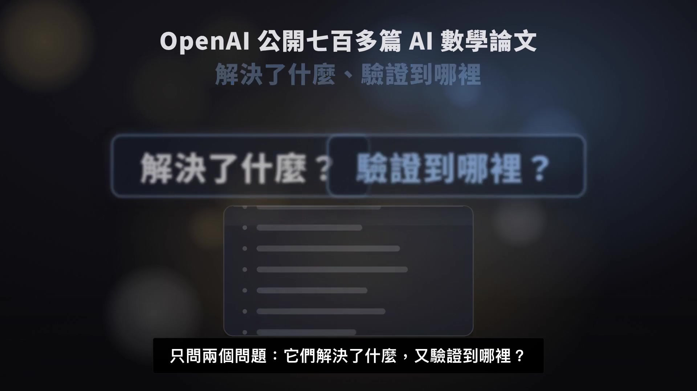

**逐字稿片段：** 臺灣時間10月7日清晨, OpenAI在Github上開了一個資料夾, 名字就叫Math, 你點進去, 目錄一直往下捲, 捲了很久還沒到底,

**話題推測：** 提及事件發生的具體時間及OpenAI在Github上建立的資料夾

---

## 00:00:25

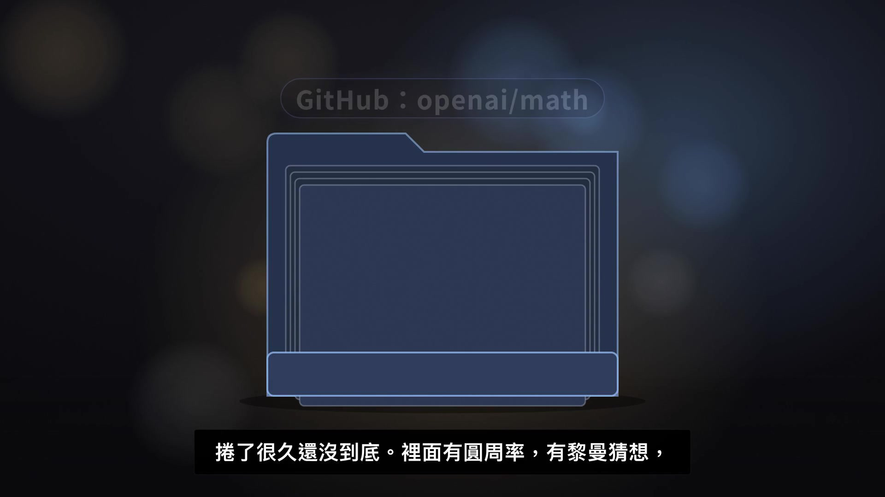

**逐字稿片段：** 裡面有圓周率, 有黎曼猜想, 還有一道千禧年難題, 每一篇的作者欄都只寫著OpenAI, 我們分三段走, 先花一點時間看OpenAI為什麼要做這件事, 再看他說自己解決了什麼, 最後看, 這些說法驗證了什麼,

**話題推測：** 列舉資料夾中包含的數學問題範例（圓周率、黎曼猜想、千禧年難題）

---

## 00:00:37

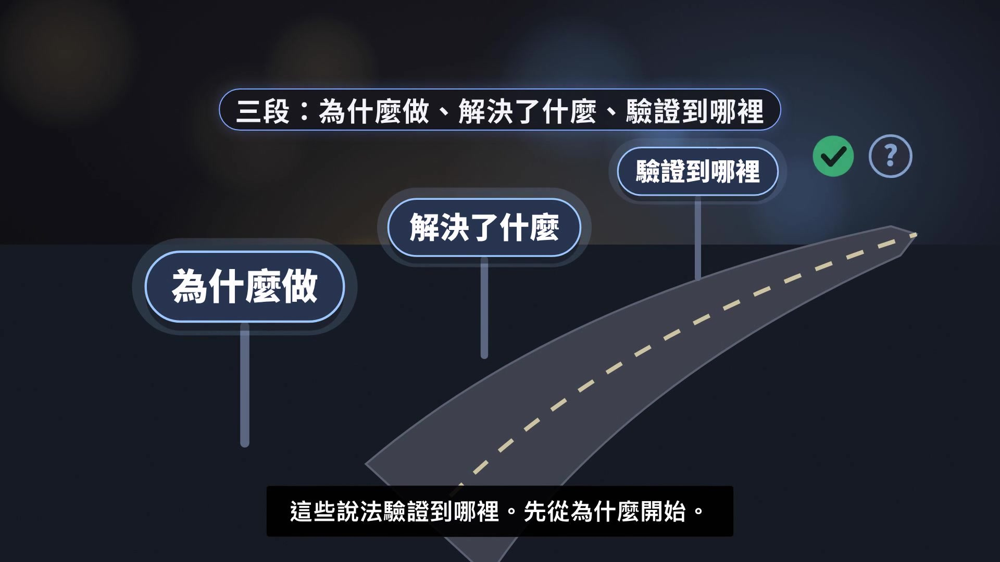

**逐字稿片段：** 先從為什麼開始 為什麼要做這件事 答案在資料夾裡的 一份說明文件裡面 有一句話是整件事的起點

**話題推測：** 開始探討OpenAI為何要發布這些數學論文的原因

---

## 00:00:43

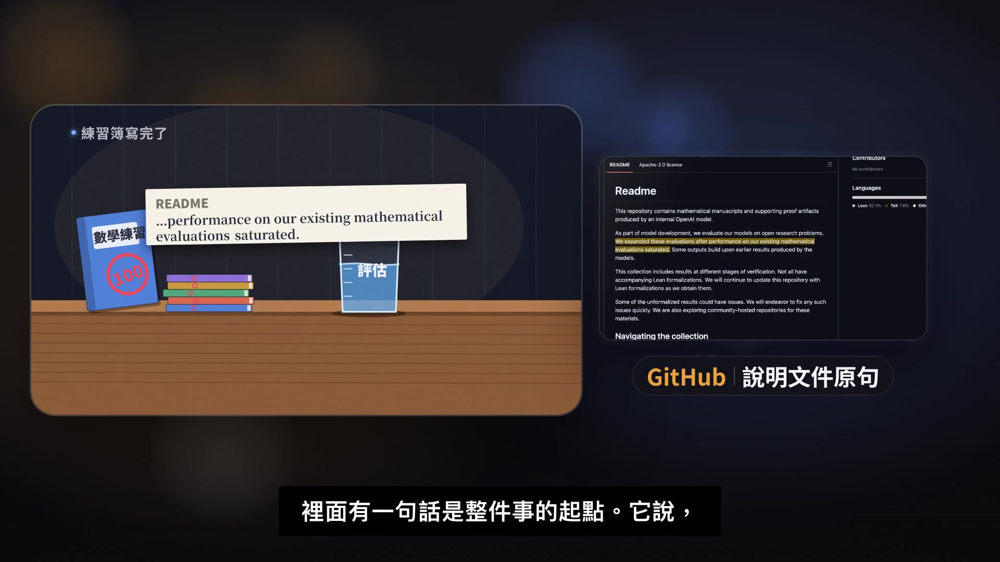

**逐字稿片段：** 他說 模型 在現有的數學評估上 已經飽和了 評估英文叫Evaluation 就是AI公司 拿來考自己模型的考卷 飽和 就是題目他幾乎都會了 分數已經頂到天花板 再考也看不出他有沒有變強 這就像一個學生 把書店裡所有的 數學練習簿都寫完了 每一本都拿滿分 再買一本也沒用 因為答案都在書後面 要知道他還有沒有進步 只能拿一道書 後面沒有答案的題目給他

**話題推測：** 引用OpenAI說明文件中的關鍵語句：「模型在現有數學評估上已飽和」

---

## 00:01:07

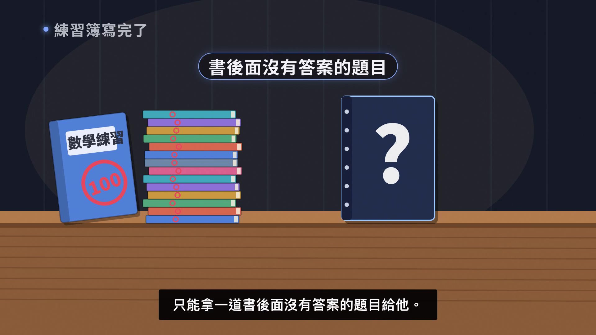

**逐字稿片段：** 這種題目 數學界叫開放問題 題目大家都知道 可是還沒有人解決

**話題推測：** 定義數學界的「開放問題」

---

## 00:01:11

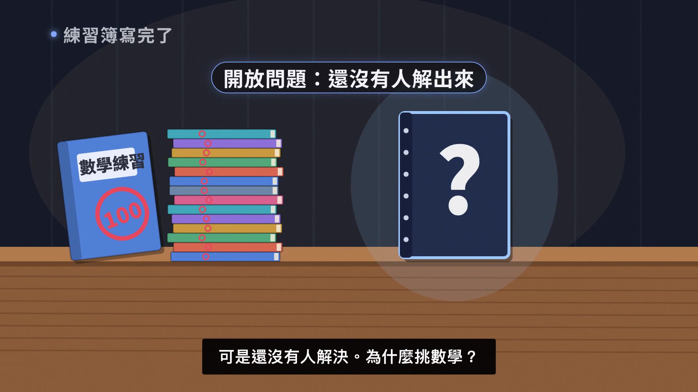

**逐字稿片段：** 為什麼挑數學 因為數學的對錯 可以一步一步檢查 這一點後面會用到 OpenAI的模型 之前在國際數學奧林匹亞 拿過金牌水準 那還是有標準答案的題目 這一次 他把考卷換成了 沒有人寫過答案的題目 新考卷怎麼考

**話題推測：** 解釋OpenAI選擇數學作為評估領域的原因

---

## 00:01:25

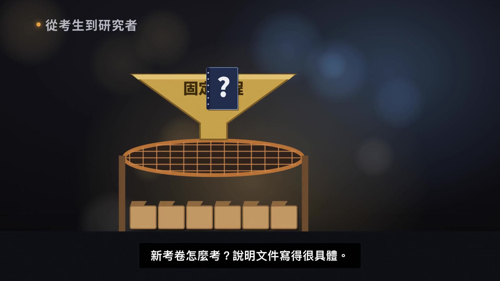

**逐字稿片段：** 說明文件寫得很具體 大部分的結果 用的是同一套固定流程 做題的是一個 還沒公開的內部模型 他們總共丟了 想三個小時 做完以後 不夠重要的被塞掉 最後留到三百多組 結果寫成七百多篇論文 這裡要小心 七百多篇 不是七百多個難題 很多篇是同一組結果 一篇主要的證明 加上從他推出來的其他定理 那剩下的題目呢 四千題裡 留下來的只是一小部分 OpenAI 沒有主題說明 其他是做不出來 還是被塞掉 從這個流程看得出 他要的不是一個 很會考試的模型 而是一個能做研究的模型 差別很簡單 考試有人先知道答案 研究沒有 OpenAI也說 它會繼續拿數學和其他科學來評估模型 數學只是第一個考場 考場之外

**話題推測：** 闡述OpenAI模型解決數學問題的具體流程與產出數據

---

## 00:02:10

**逐字稿片段：** OpenAI還有一個更難的問題 就是怎麼把結果交給數學界 讓人願意相信 這件事跟標題後半句的驗證到哪裡直接相關

**話題推測：** 轉向討論OpenAI面臨的另一個問題：如何讓數學界信任其研究成果

---

## 00:02:18

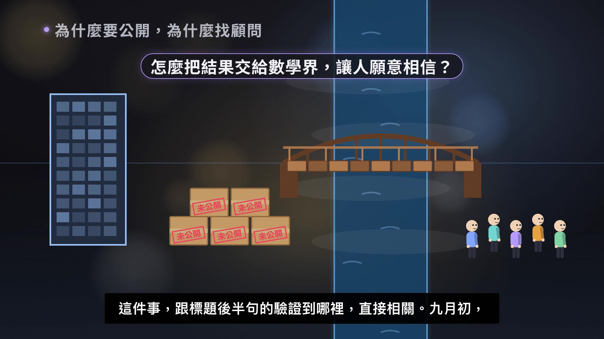

**逐字稿片段：** 9月初 OpenAI宣佈模型解決了一道跟水流有關的千禧年難題 9月下旬 它有說解決了100多個老問題 可是一篇證明都還沒有公開 看不到證明 數學家就沒辦法驗證 那時候數學圈已經在流傳一封公開信 標題叫AI在數學上的嚴重錯位 連署的人理陶哲軒也在裡面

**話題推測：** 提及OpenAI過去宣稱解決的問題及當時未公開證明的狀況

---

## 00:02:37

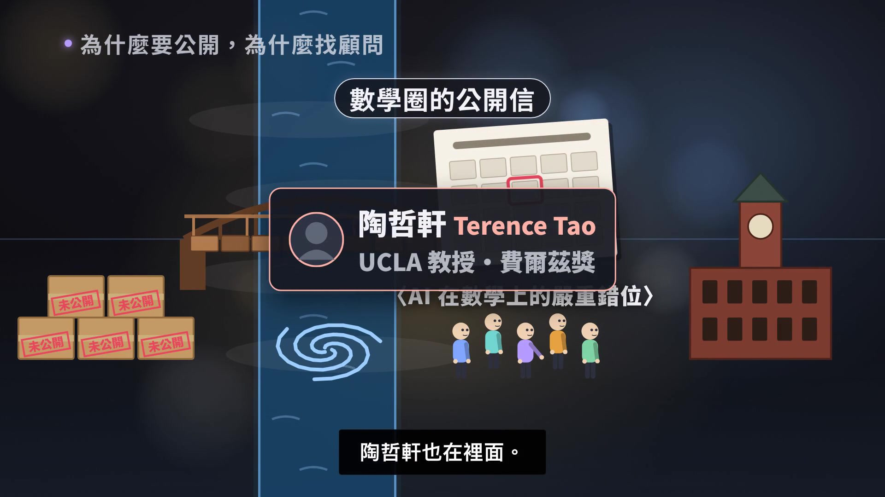

**逐字稿片段：** 陶哲軒是加州大學洛杉磯分校的教授 拿過費爾茲獎 也就是數學界最高的榮譽之一 常被稱為當代最頂尖的數學家之一 後面還會再聽到他 心裡擔心的是 解答只是過程中的一個里程碑 真正的目的是理解 題目被AI一題一題收走 卻沒有人理解 這個領域反而會變得貧瘠

**話題推測：** 介紹陶哲軒的背景與成就

---

## 00:02:56

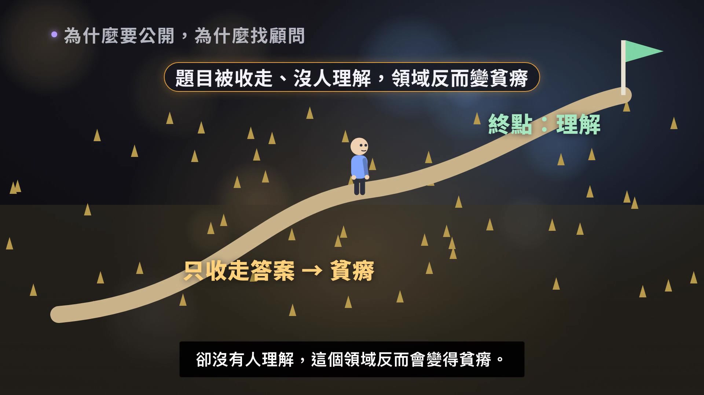

**逐字稿片段：** OpenAI的回應 是請數學家成立一個顧問團 設在普林斯頓的高等研究院 成員有九位數學家 不拿OpenAI的錢

**話題推測：** 說明OpenAI為回應數學界疑慮而成立的顧問團

---

## 00:03:04

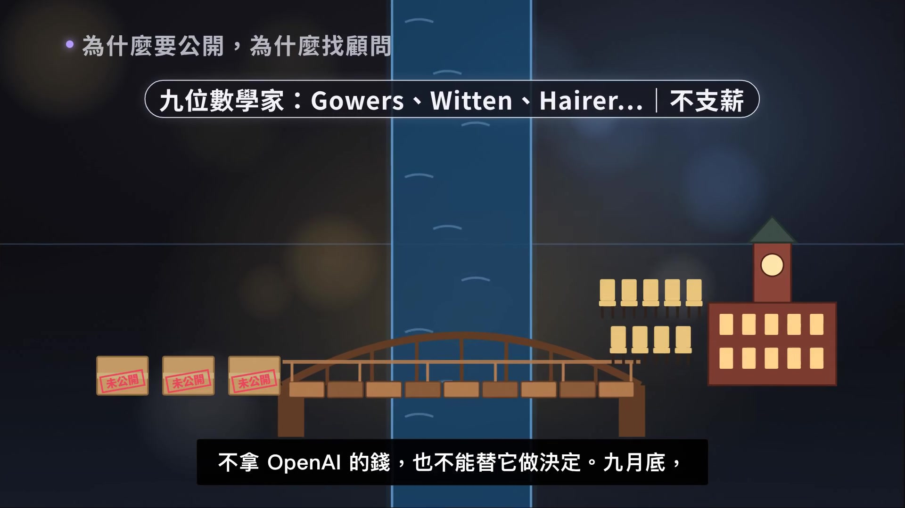

**逐字稿片段：** 也不能替他做決定 9月底顧問團公開了一份建議 要AI公司交代清楚三件事 模擬名稱提示詞和花費 另外也要盡量讓電腦檢查證明 這一次OpenAI做到了一部分 他附上很多讓電腦檢查的證明 還有十份推理摘要 可是模型的名字沒有公開 論文也還放在OpenAI自己的Github上 放上Github 是OpenAI在信任問題上走的第一步 背景大概就是這樣 OpenAI做這件事 是想解決他自己的兩個問題 一個是考試的問題 練習不寫完了 他需要沒有答案的題目 證明模型能做研究 另一個是信任的問題 結果交出去要怎麼讓人相信 顧問團和電腦檢查是他的答案 但還不是完整的答案

**話題推測：** 列出顧問團建議AI公司交代的三件事

---

## 00:03:44

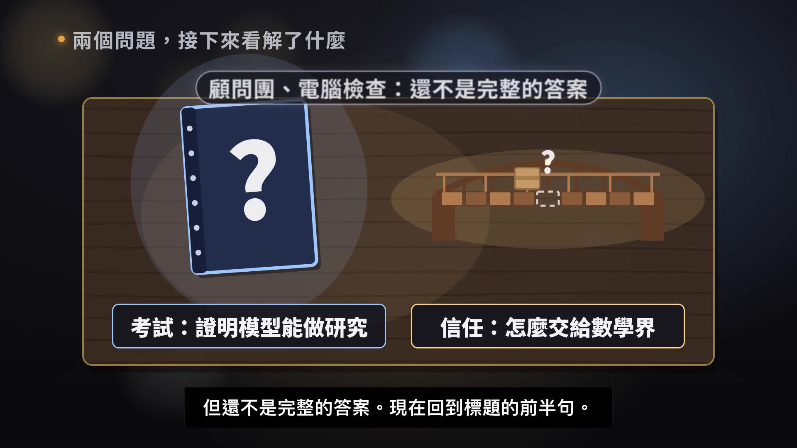

**逐字稿片段：** 現在回到標題的前半句 模型真正去碰的題目到底解決了什麼

**話題推測：** 轉向討論OpenAI模型實際解決了哪些問題

---

## 00:03:49

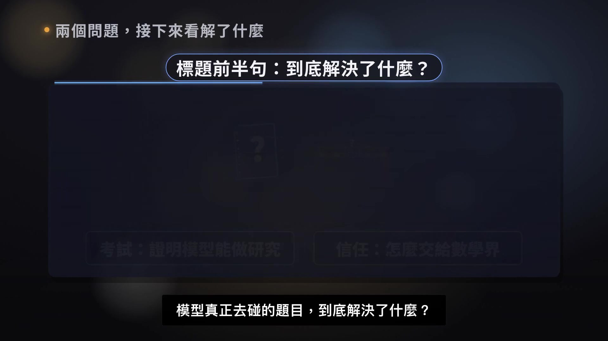

**逐字稿片段：** 他碰的題目先從整張地圖看 OpenAI附了一份總覽 把300多組結果 分成17個領域 你可以把它想成一張程式地圖 17個區每一區是數學的一個方向 結果最多的一區是理論電腦科學 研究電腦能多快多省力的算出答案

**話題推測：** 介紹OpenAI將300多組結果劃分為17個數學領域的總覽圖

---

## 00:04:04

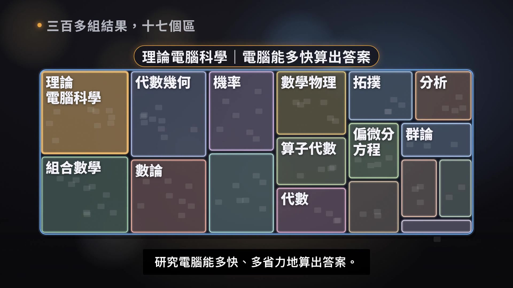

**逐字稿片段：** 接下來是組合數學代數集合和數論 最大的那一區裡 有一題 跟每個人都有關 它叫矩陣乘法 是電腦做大量計算時最常用的一種運算 AI本身也靠它運作 我朋友說 他找到了更快的做法 比數學家幾十年來一點一點往前推的紀錄 快了一大截

**話題推測：** 列舉結果數量最多的幾個數學領域

---

## 00:04:21

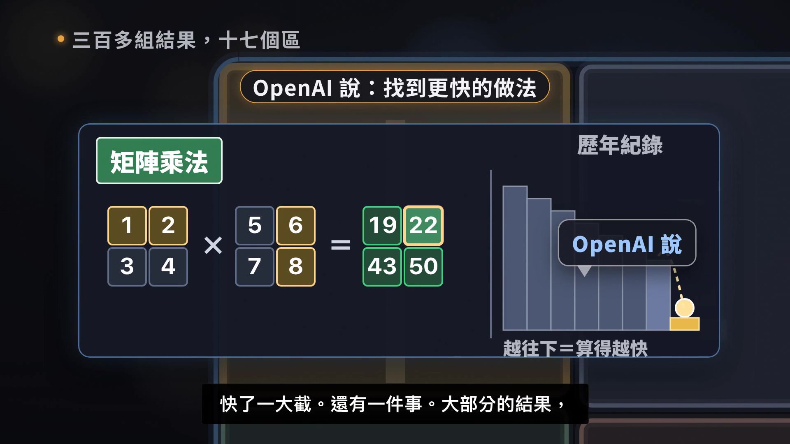

**逐字稿片段：** 還有一件事 大部分的結果是證明某個說法成立 可是大約每六七組 就有一組剛好相反 是證明大家相信的某個說法其實不成立 這叫推翻 不過要記得 整張地圖上的每一面棋子 都還是OpenAI自己插的 還沒經過別人驗證 每一面棋子 都代表OpenAI說 它解決了一個問題

**話題推測：** 介紹OpenAI成果中「推翻」既有數學說法的概念

---

## 00:04:38

**逐字稿片段：** 可是解決到底是什麼意思 我要先講兩個名詞 猜想和證明 猜想是很多數學家都相信 卻還沒有人能證明的說法 證明是從大家公認的事實出發 一步一步推到這個說法 我們用法庭來想 猜想 像是大家都覺得 某個人就是兇手 可是還沒定罪 證明是一條完整的證據鏈 每一環都要扣上 少一環就不能定罪 剛剛說的推翻 就是找到一個反例 證明那個人其實不是兇手 所以OpenAI說 它解決了一個猜想 意思是它交出了一條完整的鏈 不管是定罪還是犯案

**話題推測：** 開始解釋「解決問題」在數學領域中的具體含義

---

## 00:05:06

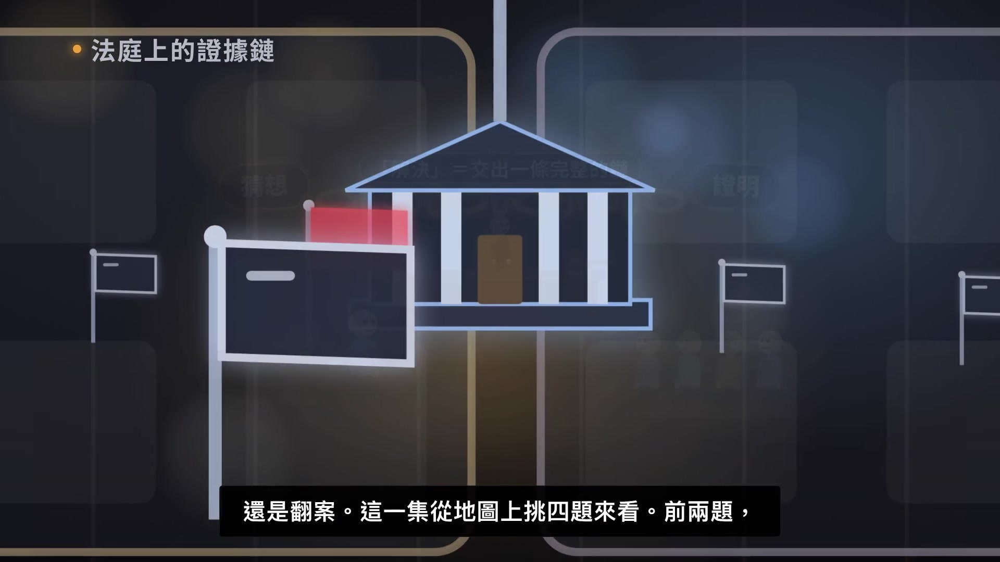

**逐字稿片段：** 這一集從地圖上挑四題來看 前兩題 一句話就問得完 後兩題 有名到數學系以外的人 也可能聽過 這四題的順序還有一個意思 就是電腦檢查做到哪裡 越前面的 檢查做得越完整 越後面的 越只能先聽OpenAI 先聽最好懂的一題

**話題推測：** 說明接下來將從OpenAI的成果中挑選四個具體題目進行討論

---

## 00:05:22

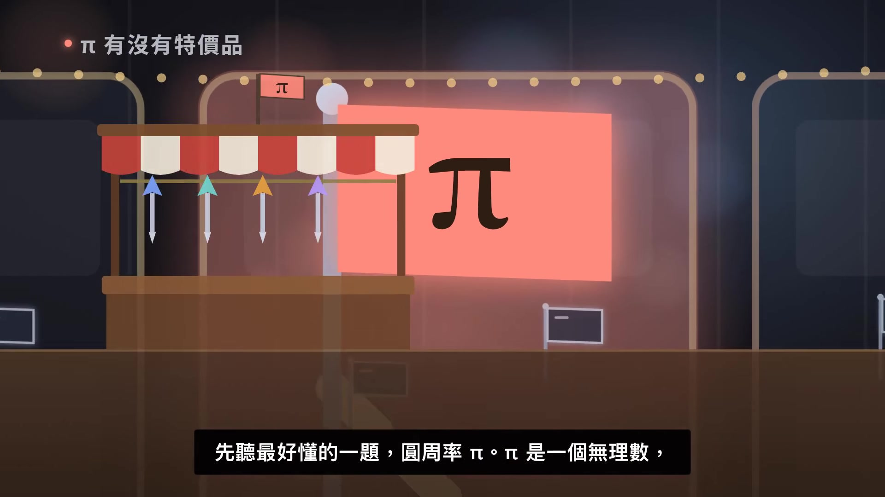

**逐字稿片段：** 圓周率π π是一個無理數 它沒辦法寫成 兩個整數相除的分數 它的小數一直寫下去 不會停也不會循環 可是分數可以靠近它 7分之22 小數點後兩位就跟π一樣 113分之355 小數點後六位都一樣 我們用買東西來想 分數底下那個數叫分母 分母越大 就像你付的錢越多 付越多錢 買到的準度越高 這很正常 數學家想知道的是 π有沒有特價品 也就是 有沒有一些分數 分母不大 確準的不正常 衡量這件事的量尺

**話題推測：** 開始介紹第一個具體數學問題：圓周率π

---

## 00:05:50

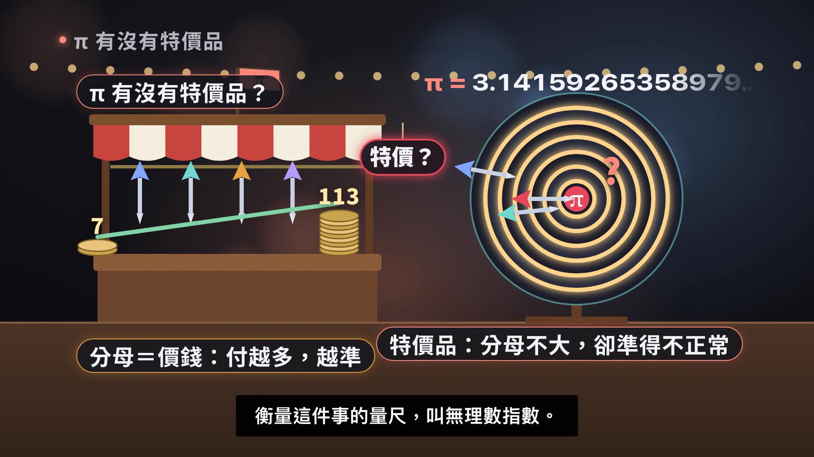

**逐字稿片段：** 叫無理數值數 它量的就是付出去的錢 跟買到的準度 是什麼比例 絕大多數的數都沒有特價品 付多少錢就買到多少準度 大家一直猜π是這樣 可是幾十年來 數學家只能證明它的特價不會太誇張 卻證明不了它一點特價都沒有

**話題推測：** 引入衡量圓周率特價品概念的量尺：無理數值數

---

## 00:06:06

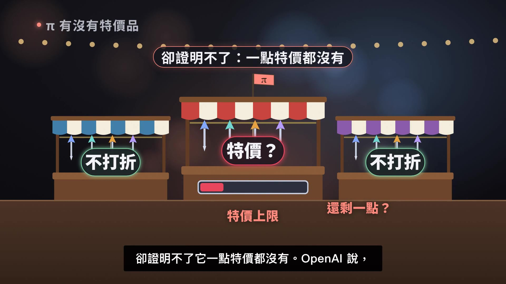

**逐字稿片段：** OpenAI說 它的模型證明了π沒有特價品 這一題附了另的電腦檢查 主要的定理有被檢查到 換回正式的說法 圓周率沒辦法被分數逼得特別近 它跟絕大多數的數一樣普通 普通的數一個一個看 沒什麼特別 排成一串就可能藏著規律

**話題推測：** 說明OpenAI模型證明了圓周率π沒有特價品

---

## 00:06:22

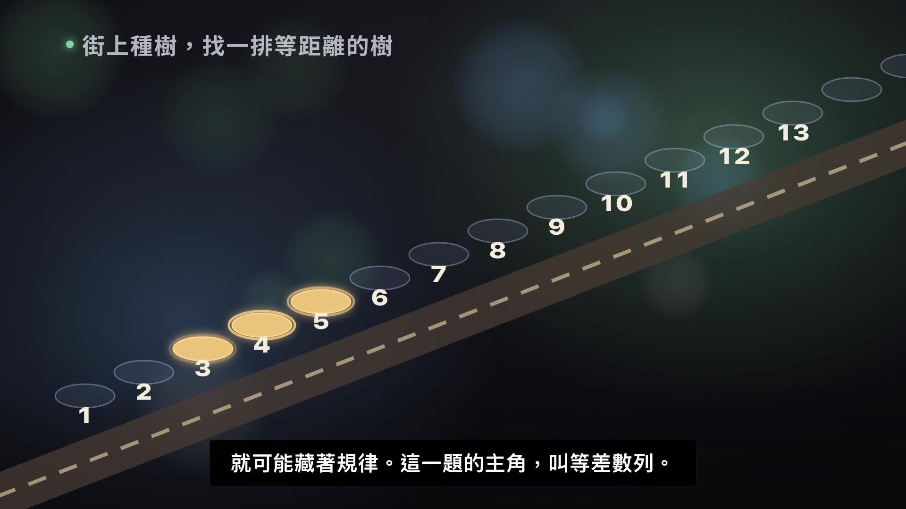

**逐字稿片段：** 這一題的主角叫等差數列 等差數列 就是間隔一樣的一串數 像1 4 7 10 每次都加3 我們用一條街來想 在街邊的一些空地上種樹 等差數列 就是一排間隔一樣的樹

**話題推測：** 開始介紹第二個具體數學問題：等差數列

---

## 00:06:34

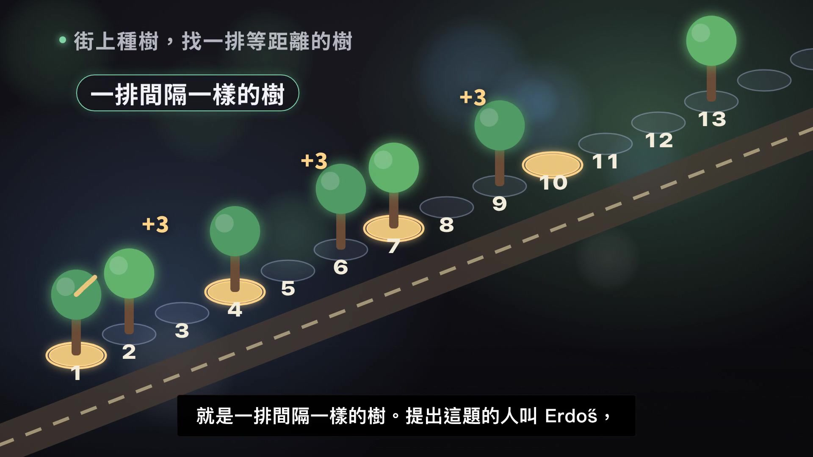

**逐字稿片段：** 提出這一題的人叫Erdos 一位很愛出題 還常自己出錢懸賞的數學家 他問 如果你種的樹夠多 那不管你要多長的 一排等距離的樹 是不是都找得到 夠多有個精確的標準 這裡先不細講 直覺上樹種的共鳴 就藏得住規律 可是要證明 非常難 支數就是一個例子 只在支數的位置種樹 數量剛好符合ERDOS的標準 光是證明支數里找得到任意場的等差數列

**話題推測：** 提及提出此問題的數學家Erdos

---

## 00:06:57

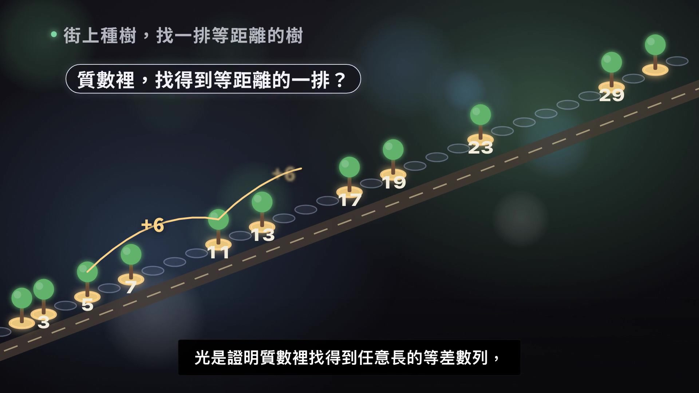

**逐字稿片段：** 就要等到2004年 由陶哲軒和另一位數學家完成 OpenAI說 它的模型證明了整個猜想 不只支數 只要數字夠多 就找得到任意場的等差數列 這一題也附了電腦檢查 可是範圍要講清楚 電腦檢查的是這一句結論 論文裡另一個更細的數量估計 沒有被檢查 在這一題裡 支數只是配角 下一題 支數變成主角 它是數學裡最有名的問題之一

**話題推測：** 提及陶哲軒在2004年證明了質數中存在任意長等差數列

---

## 00:07:19

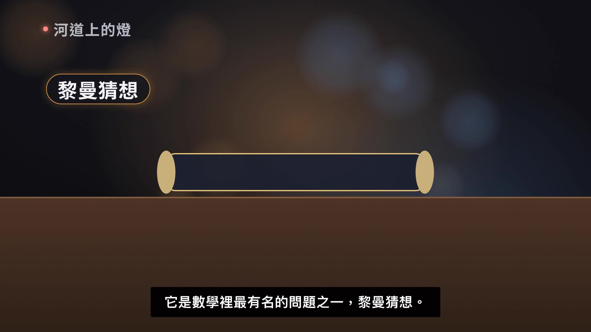

**逐字稿片段：** 黎曼猜想 前兩題一句話就問得完 這一題難得多 我們慢慢來 要講這一題

**話題推測：** 開始介紹第三個具體數學問題：黎曼猜想

---

## 00:07:24

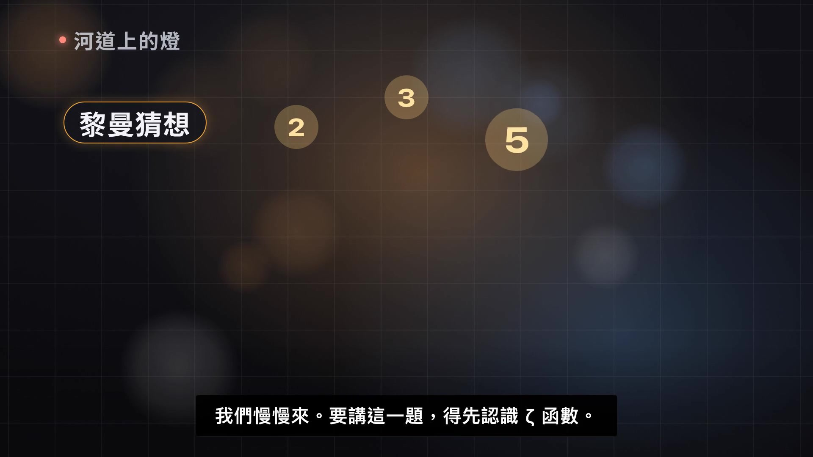

**逐字稿片段：** 得先認識Zeta數 Zeta是一個希臘字母 Zeta數是一個公式 跟指數怎麼分佈緊緊 綁在一起 你可以把它想成一張 指數的地圖 讀懂它就知道 指數大概會出現在哪裡 地圖上有一些特別的點 叫零點 也就是Zeta數 剛好等於零的位置 你可以把零點 想成地圖上的燈 燈的位置 決定了指數有多少規矩 這些燈 全部落在地圖上的 一條河道里 左岸叫0右岸叫1 黎曼猜想說 所有的燈都排在河道正中間 也就是一半的那條線上 如果這是真的 植樹的規律會非常整齊 可是到今天還沒有人證明 人類真正確定的 只有右岸上沒有燈 靠近右岸也有一小塊地方沒有燈 麻煩的是 往上游走得越遠 這塊地方就越窄 窄到幾乎貼著右岸 所以沒有人能在河道里 蓋得到筆直的圍籬 說圍籬右邊一盞燈都沒有 能蓋出這道圍籬

**話題推測：** 引入黎曼猜想的相關概念：Zeta數

---

## 00:08:10

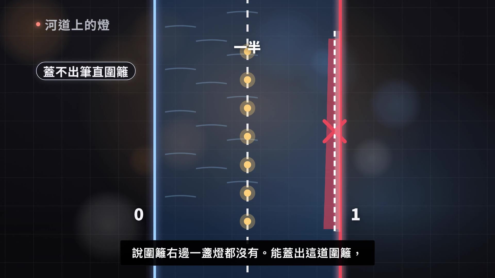

**逐字稿片段：** 就叫準離漫猜想 OpenAI說 它的模型把違離蓋在八分之七的位置 換回正式的說法 在八分之七的右邊 Zeta數沒有零點 這裡離漫猜想還很遠 正中間在一半 違離在八分之七 中間還隔著將近四成的寬度 可是違離沒往中間推一步 我們預測之數就準一截 如果它是對的 這是第一次有人蓋出這樣一道違離 這一題負了令的電腦檢查 不過OpenAI也註明 這一題的做法 跟其他題目的固定流程不一樣 不照固定流程做的 還有最後這一題 而且他連電腦檢查都還沒有 它是最難用白話講的一題

**話題推測：** 定義「準黎曼猜想」的概念

---

## 00:08:42

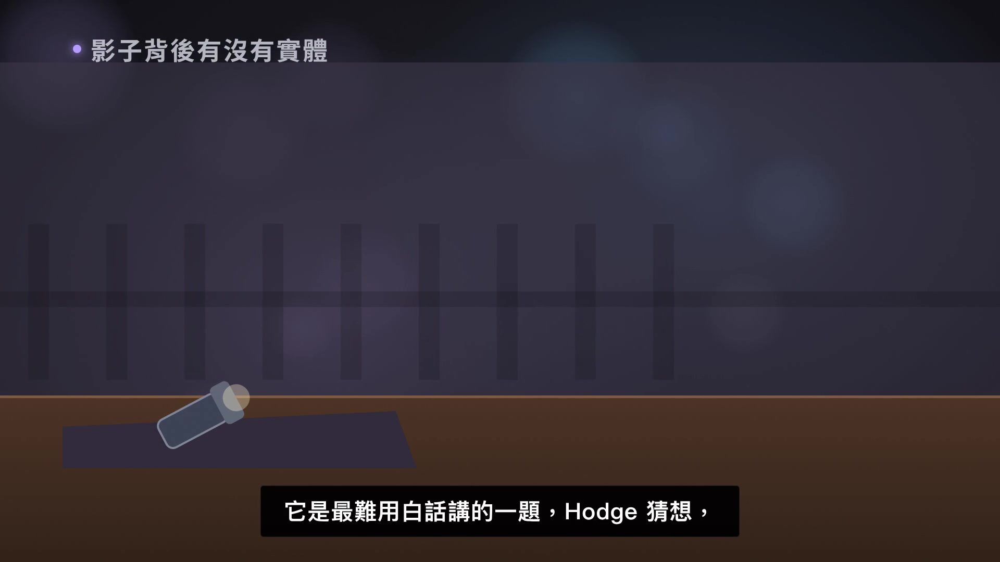

**逐字稿片段：** Hodge猜想 也是七道遷徙的難題之一 這段我第一次讀 也讀得很吃力 所以我們只抓一個畫面 數學家研究一些 很高維度的形狀 我們看不見 只能用方程式寫下來 在這些形狀上 有一種痕跡

**話題推測：** 開始介紹第四個具體數學問題：Hodge猜想

---

## 00:08:54

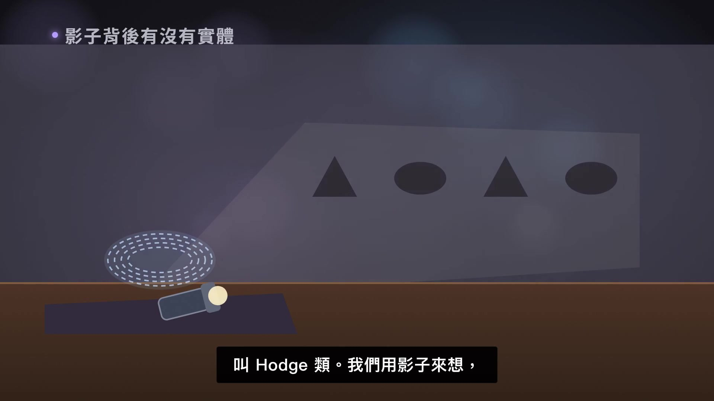

**逐字稿片段：** 叫Hodge類 我們用影子來想 Hodge類 就像牆上的影子 看起來很像是某個東西 投出來的 Hodge猜想問的是 每一個這樣的影子 背後是不是真的 真的都有一個實體 而且這個實體能用方程式寫出來 OpenAI 這次沒有說它解決了整個Hodge猜想 整個猜想像一棟大樓 OpenAI說它蓋好的 只是其中一層 那一層是一類特別對稱的形狀 名字很長 比較有複數稱法的阿貝爾處 不用記 你只要知道它很對稱 所以手上能用的工具比較多 OpenAI說 在這類形狀上 影子背後都有實體 換回正式的說法 Hodge猜想在這類形狀上成立 可是這一題要注意兩件事 它沒有附令的電腦檢查 而且跟黎曼那一題一樣 它不是照固定流程做出來的 是體力 它最有名 也是檢查做的最少的一體 實體看完

**話題推測：** 引入Hodge猜想的相關概念：Hodge類

---

## 00:09:37

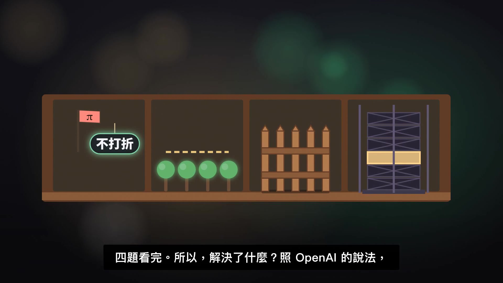

**逐字稿片段：** 所以解決了什麼 照OpenAI的說法 有四件事 圓周率 沒辦法被分數逼得特別近 數字夠多 就找得到任一長的等差數列 Zeta數在7%的右邊沒有零點 Hodge 猜想在一類特別對稱的形狀上成立 可是每一句前面 都要加上OpenAI 說因為他們被檢查的程度不一樣 圓周率那一句 主要的定理有電腦檢查 等差數列那一句 結論有電腦檢查 更細的估計沒有 黎曼那一句 有電腦檢查 可是做法不在固定流程裡 Hodge那一句 沒有電腦檢查 也不在固定流程裡 這裡有一件有點尷尬的事 越有名的題目 越要等數學家自己去讀 那要等多久 威斯康星大學的數學家 Jordan Allenberg 也寫過暢銷的數學科普書 他的回答很樂觀 他說結果真的很多 但時間會過去 數學家會慢慢研究 看能拿它們做什麼 他希望答案是很多 而且不用急 可是在大家慢慢研究之前 得先知道這些說法 站不站得住

**話題推測：** 總結OpenAI模型聲稱解決的四個主要數學問題

---

## 00:10:28

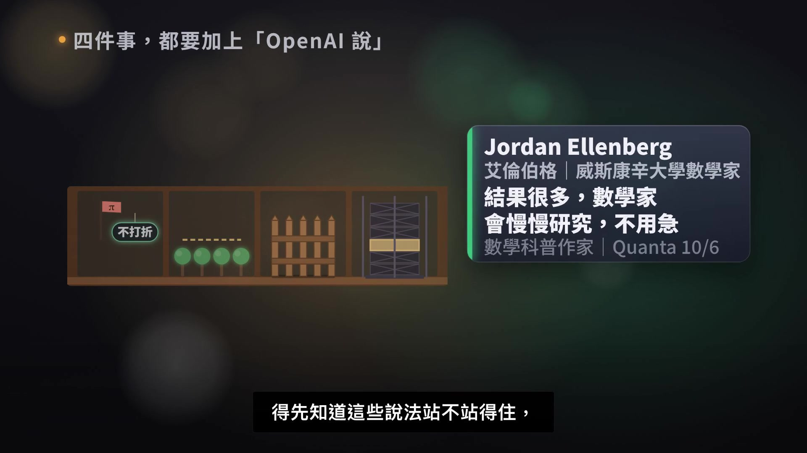

**逐字稿片段：** 也就是標題的後半句 驗證到哪裡 你要知道驗證到哪裡 先看數學界 平常怎麼確認一個證明是對的

**話題推測：** 轉向討論成果的驗證程度

---

## 00:10:35

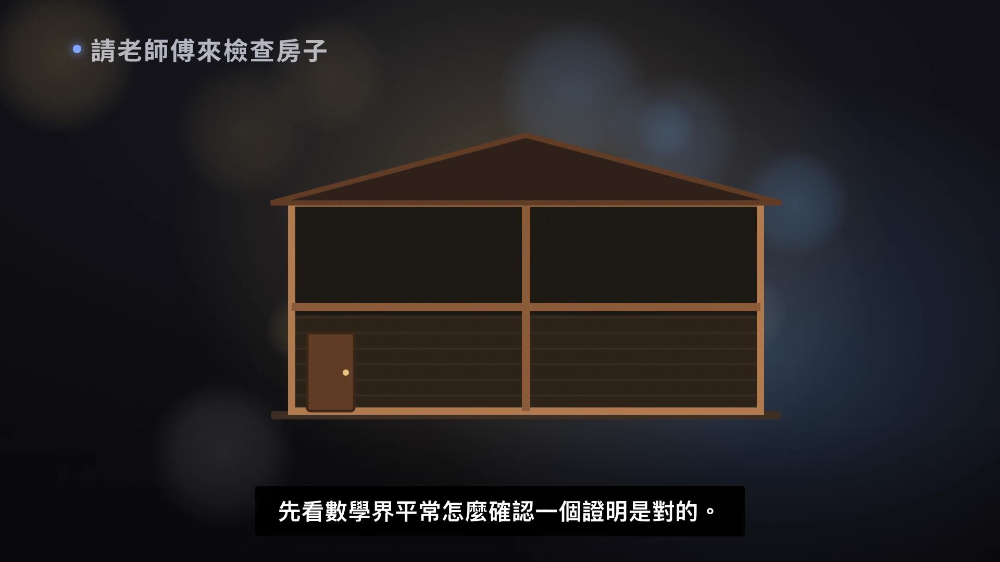

**逐字稿片段：** 傳統的方法叫同差審查 英文是peer review 我們用蓋房子來想 一篇論文 就像一棟剛蓋好的房子 同差審查 就是請集會同行的老師傅 一間一間走進去 敲敲牆壁 看看管線 找漏水和裂縫 這是很慢 短了幾個月 長了好幾年

**話題推測：** 介紹傳統數學證明確認方法：同儕審查（peer review）

---

## 00:10:50

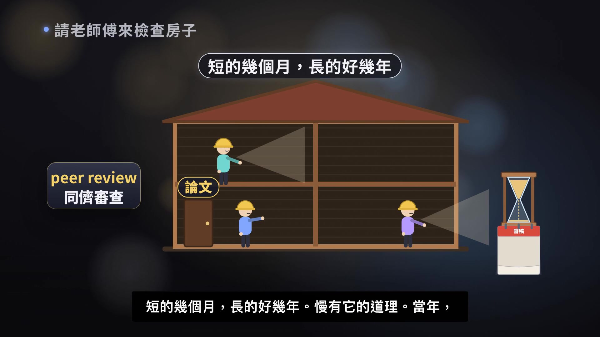

**逐字稿片段：** 漫有他的道理 當年數學家懷爾斯宣佈 證明了費馬最後定理 一道放了幾百年的難題 審查的人卻發現 證明裡有一個漏洞 他又花了一年多才把漏洞補起來 連最頂尖的數學家 蓋出來的房子也會漏水 現在換成OpenAI這次的規模 700多棟房子一次蓋好 每一棟都在很偏僻的地方動 那一區的老師傅可能就那麼幾個人 照傳統的速度 光是看完 可能就要好幾年

**話題推測：** 提及懷爾斯證明費馬最後定理時發現漏洞的例子

---

## 00:11:14

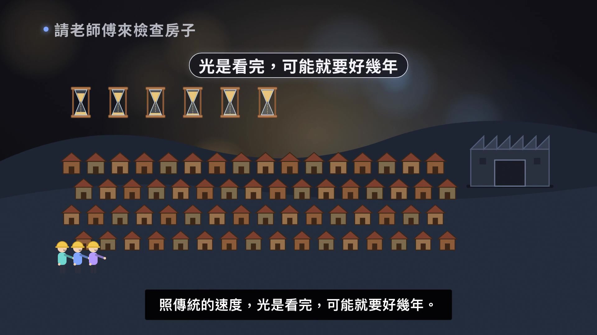

**逐字稿片段：** 所以OpenAI想先用另一種方法擋一層 就是讓電腦檢查證明

**話題推測：** 說明OpenAI採用電腦檢查證明的方法

---

## 00:11:18

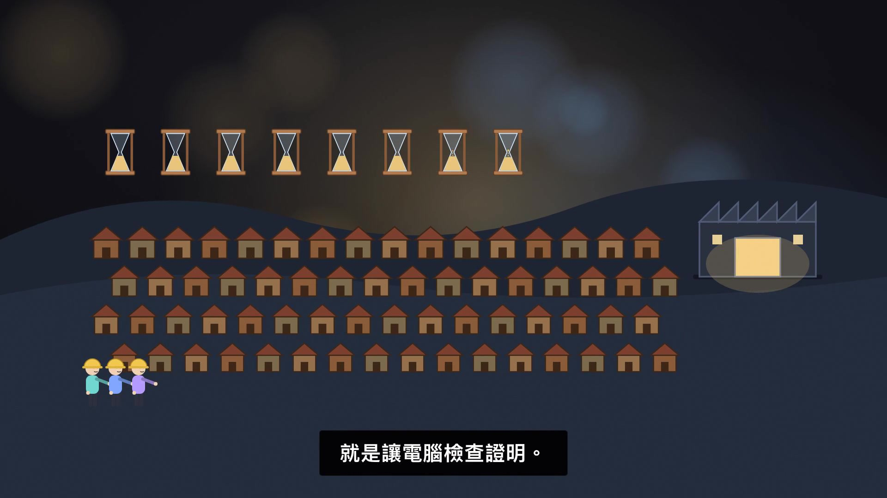

**逐字稿片段：** 讓電腦檢查證明的工具叫LIN 它是一種專門用來檢查證明的程式語言 LIN會把證明的每一步 都寫成電腦看得懂的樣子 再讓電腦一步一步確認 只要有一步是跳過的 或是說不清楚的 它就不給過

**話題推測：** 介紹用於電腦檢查證明的工具：LIN程式語言

---

## 00:11:31

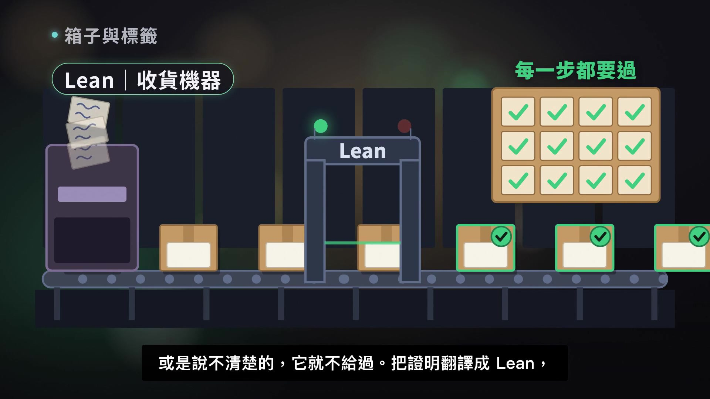

**逐字稿片段：** 把證明翻譯成LIN 這個動作叫隱私化 英文是formalization 我們用倉庫收穫來想 LIN 就像一臺很嚴格的收穫機器 一個證明就是一個箱子 箱子外面貼著一張標籤 寫這裡面裝的是哪一個定理 機器保證的是 就是箱子裡的東西 跟標籤寫的一模一樣 一顆螺絲都沒少 可是標籤本身有沒有寫對 機器不管 標籤寫的是不是你真正想問的題目 要人自己讀 OpenAI就是這樣安排的 每一題都附一張很短的標籤 只有幾行字 像黎曼那一題 標籤寫的就是在7%的右邊 Zeta數不等於0 證明本身非常龐大 但人只要讀懂這幾行 另外還有一個工具 確認證明只用了三條公認的基本公理 就是大家都同意 不用再證明的出發點 這批論文放上網路不到一天 就有人自己把黎曼那一帖的 Lin證明編譯了一次 全部通過 不過他也說得很清楚 他檢查的是Lin證明 不是那篇論文 而且只在一臺電腦上做了一次 那論文本身呢 有一位數學家認為 應該以Lin為準

**話題推測：** 定義將證明翻譯成LIN的動作為「形式化」（formalization）

---

## 00:12:25

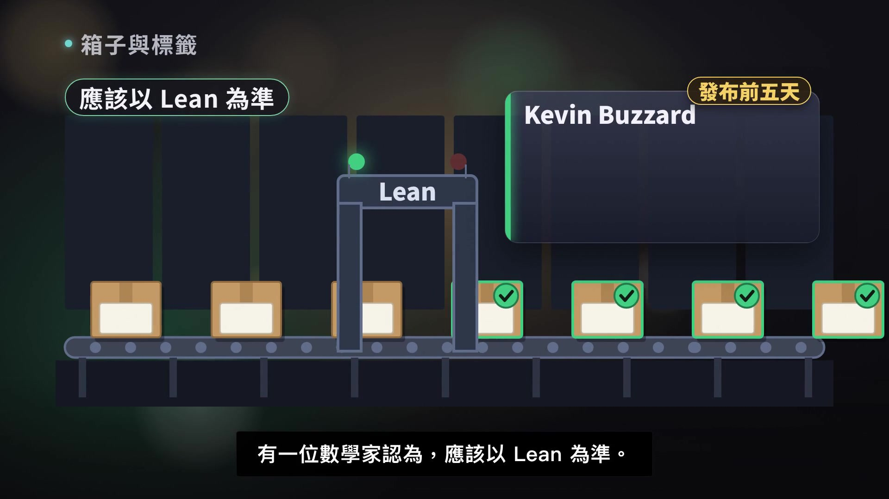

**逐字稿片段：** 他是Kevin Buzzard 倫敦帝國學院的教授 正在帶頭用Lin把廢碼 最後定理整個檢查一遍 就在這批論文 放上網路的五天前 他公開呼籲OpenAI 把手上的定理全部放出來 讓大家看清楚 他到底宣稱做了什麼 在他看來 令的程式碼才是最可靠的依據 論文寫得亂 之後可以再整理 如果要以令為準 那這次到底有多少題有令 照OpenAI的目錄 300多組結果裡 大約6成多負了令 如果一篇一篇算 大約是一半 這已經很多了 可是讀這個數字 要像讀健康檢查報告 報告上檢查過的項目寫得正常 沒檢查的項目是空白 空白不代表沒病 只代表沒檢查 這次的報告

**話題推測：** 提及倫敦帝國學院教授Kevin Buzzard對LIN證明的看法

---

## 00:13:02

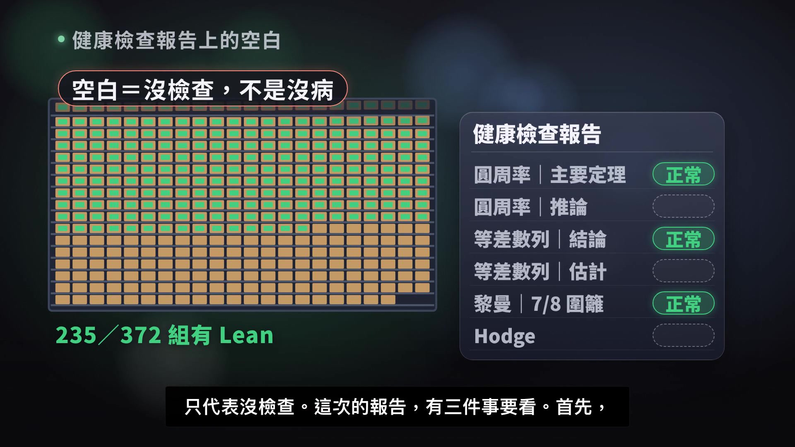

**逐字稿片段：** 有三件事要看 首先 很多令只檢查主要定理的一部分 雲州綠內體的推論 等差數列內體的估計 都還是空白 再來 OpenAI自己的清單上 人工審查那一欄寫的是 還沒有檢查 清單也寫著 隱私化是AI agent做的 Agent 就是能自己一步一步執行任務的AI程式 換句話說 電腦拿來比對的那幾行定理陳述 是AI寫的 還沒有人一條一條讀過 最後剩下的部分根本沒有另 Arch內體就在裡面 對 這部分OpenAI在說明文件裡寫得很坦白 還沒隱私化的結果 可能有問題會盡快修正 他也說以後的修正都會留下記錄 舊版本不會刪掉 報告上這些空白 電腦補不了 只能靠人 就看數學家怎麼讀 先講清楚 這批結果放上網絡還不到一天 所有的反應都還很早 科學人雜誌當天訪問了兩位數學家 看法剛好相反 比較謹慎的

**話題推測：** 說明檢視OpenAI驗證報告時需注意的三點

---

## 00:13:51

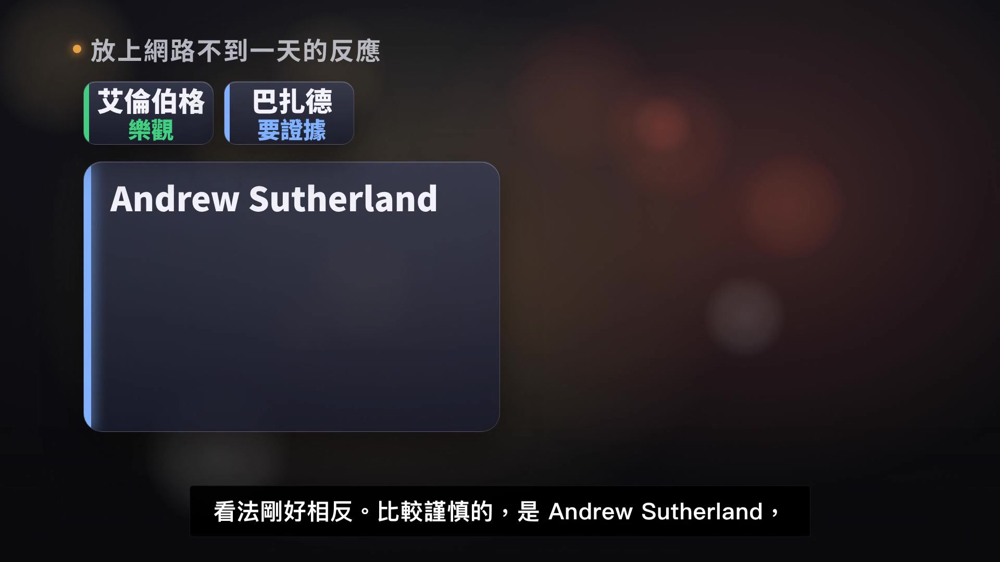

**逐字稿片段：** 是Andrew Sutherland 麻省理工學院的數學家 研究數論 也很常用電腦做計算 他說在模型公開 別人能做出同樣的結果之前 這些說法都該當時還沒確認 他的原話是 我們應該要看收據 比較樂觀的 是Daniel Leet 多倫多大學的數學家 常在網路上談AI做數學 他說 如果想知道這些問題的答案 沒有理由要公司 把答案藏起來 這對數學是好事 可是就算答案都放出來了 誰來讀 這正是陶哲軒擔心的事 他在OpenAI 公告前幾個小時 剛好發了一串文章 要說清楚 他談的不是這批結果 對不對 而是整個趨勢 他說 以前一個重大的證明出來 大家會聽演講 開研討會 一起合作 證明會被慢慢消化 最後寫進教科書 可是現在 難題被大量收割 卻沒有人消化 而且一道題被宣佈解決就回不去了 顧問團當天的聲明也是同一個意思 他們說 公開只是人類理解這些結果的開始 不是完成他們當顧問 也不代表替這些結果背書 到我們做這集為止 還沒有人公開指出哪一篇是錯的 但也才過了一天 才過了一天 能說的就是這些 所以驗證到哪裡

**話題推測：** 提及麻省理工學院數學家Andrew Sutherland的謹慎看法

---

## 00:14:54

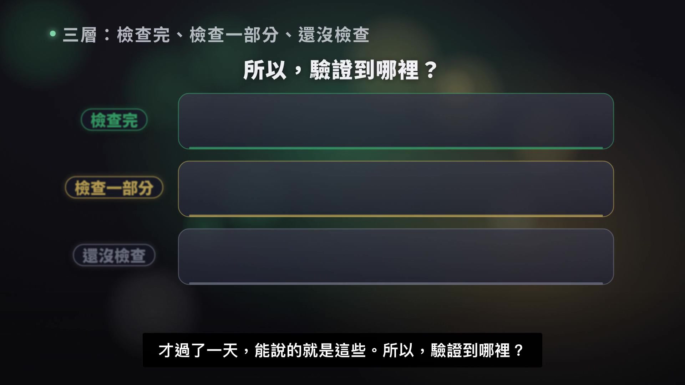

**逐字稿片段：** 可以分成三層 第一層有令 而且層數又短又清楚 像圓周率那一題 電腦確認的證明一步不漏 那幾行陳述人也讀得懂 很可能是真的解決了 再來有Ling 但只檢查了一部分的 像等差數列那題的估計 還有空白要補 最後沒有Ling的 像Hodge那一題 現在只能說是OpenAI的說法 最有名的幾題 剛好落在檢查最少的那一邊 而且就算全部都對 還有一個新問題才剛出現 這些證明有了 卻還沒有人真正讀懂 陶澤軒擔心的就是這個 題目解決了 跟數學家理解了 是兩件事 前者 後者電腦可以幫忙檢查 後者只能靠人慢慢讀 再慢慢講給下一個人聽 這需要時間 時間會給出更完整的答案 現在先回到標題的兩個問題 解決了什麼 OpenAI說 它的模型碰了圓周率等差數列 黎曼猜想Hodge猜想這些放了幾十年 甚至上百年的題目 交出300多組結果 驗證到哪裡 大約六成多負了令的電腦檢查 但檢查的範圍還沒有人一條一條核對 剩下的包括最有名的Hodge 還要等數學家一篇一篇讀 最後問一個問題 如果一道難題是AI證明的 電腦也檢查過了 可是還沒有人真正看懂 你覺得它算是被解決了嗎? 留言告訴我 喜歡的話訂閱AI Notebook 開啟通知 我們下次見

**話題推測：** 將成果驗證的程度劃分為三個層次

---
