# jimainotebook_ata4dmLP5IU — 關鍵畫面索引

- 來源逐字稿：[jimainotebook_ata4dmLP5IU_FIN.srt](jimainotebook_ata4dmLP5IU_FIN.srt)
- 影片：https://www.youtube.com/watch?v=ata4dmLP5IU
- 截圖數：61

## 00:00:19

**逐字稿片段：** 今天我要帶你看懂背後那個負責懂意思的零件, 它叫Embedding, 你每一次搜尋, 每一次收到推薦, 每一次AI幫你查資料, 它都在裡面, 而這整件事的起點, 是一位語言學家在1957年寫下的一句話, 我們先把這件事講清楚,

**話題推測：** 介紹影片主軸：Embedding這個「懂意思的零件」。

---

## 00:00:36

**逐字稿片段：** 你的相簿裡可能有2萬張照片 你沒有幫任何一張寫過說明 沒有分過類 甚至有一半你早就忘記自己拍過 可是你在搜尋框打幾個字 機器就能撈出對的那幾張

**話題推測：** 重新舉相簿例子，並引入「2萬張照片」的具體數字。

---

## 00:00:46

**逐字稿片段：** 這件事在十幾年前是做不到的 那時候的搜尋靠的是比對字面 你的檔案名稱裡有沒有這幾個字 有就找得到 沒有就找不到 而你那張照片的檔名叫IMG4527 它跟海邊的日落 一個字都沒有重疊 所以真正奇怪的地方 不是搜尋變快了 而是機器不知道從哪一天開始 好像真的知道海邊的日落 是什麼意思了 他到底怎麼知道的 答案不是他讀懂了中文 而是有人想到一個很怪的辦法 把意思這件事 變成了數字

**話題推測：** 對比過去搜尋技術的限制。

---

## 00:01:13

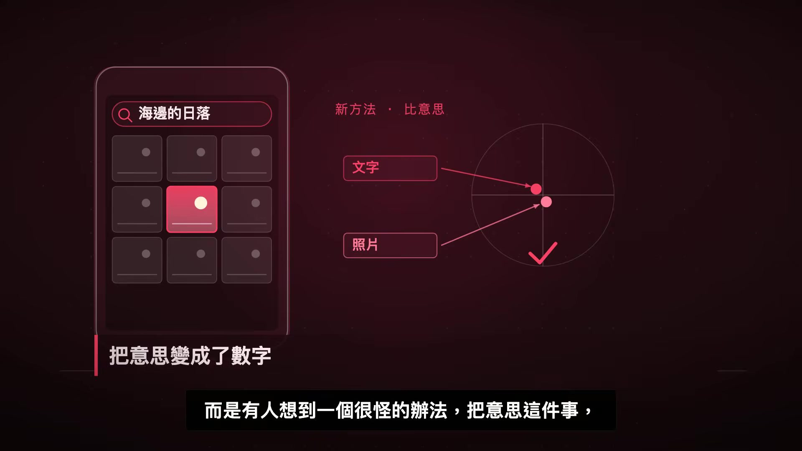

**逐字稿片段：** 這個辦法叫embedding 中文常常翻成嵌入 不過你先不用管這個名字 你只要記住他做的事情

**話題推測：** 再次提及Embedding是將「意思」變成「數字」的方法。

---

## 00:01:19

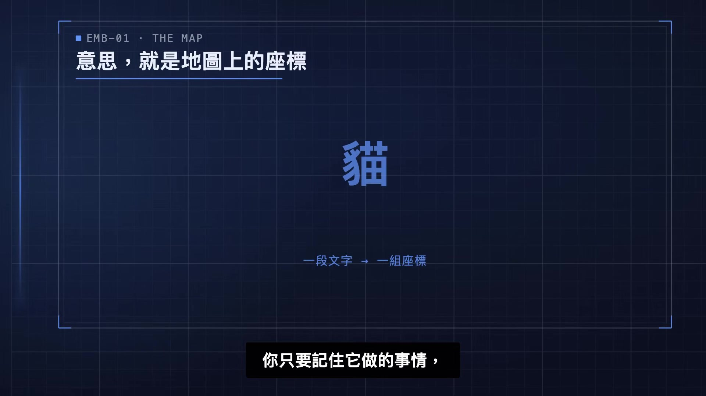

**逐字稿片段：** 就是把一段文字變成一串數字 舉個例子

**話題推測：** 說明Embedding的功能：把文字變成數字串。

---

## 00:01:22

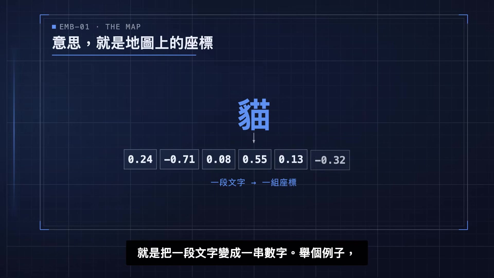

**逐字稿片段：** 你給他貓這個字 他吐回來的是一排小數 可能是三百個數字排成一列 這排數字有一個更好懂的講法 它就是這個詞在一張地圖上的座標 你想想我們平常怎麼描述一個地點 精度多少 維度多少 兩個數字就把一座城市釘在地圖上了 Embedding做的是同一件事 只是它的地圖不是兩個方向 而是300個方向 我們把這些方向叫做維度 維度你就想成地圖上的座標軸 兩個軸畫出平面地圖 300個軸畫出來的 是一張我們看不到 但電腦算得動的地圖

**話題推測：** 以「貓」為例，展示如何被轉換為一排小數（三百個數字）。

---

## 00:01:52

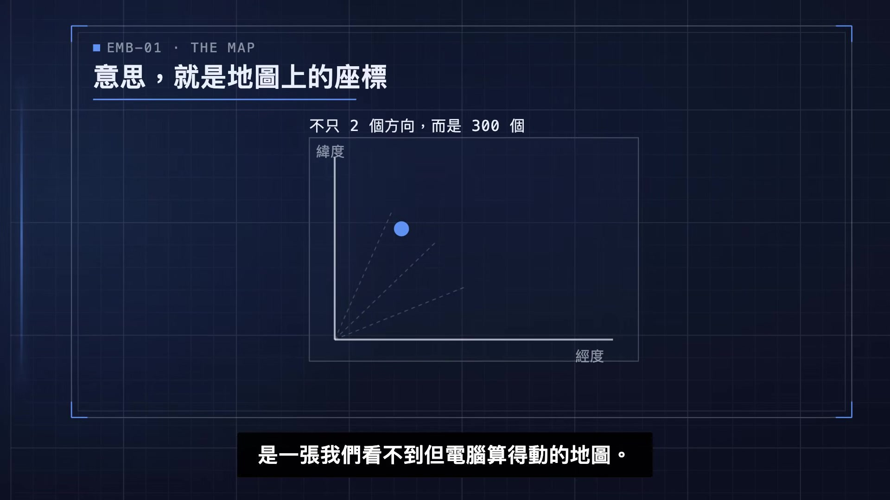

**逐字稿片段：** 這張地圖只有一條規矩 意思越接近的東西 就位置就排得越近 貓跟狗會住在隔壁 貓跟沒積分會住在地圖的兩端

**話題推測：** 解釋地圖規則：意思接近的詞位置排越近。

---

## 00:02:00

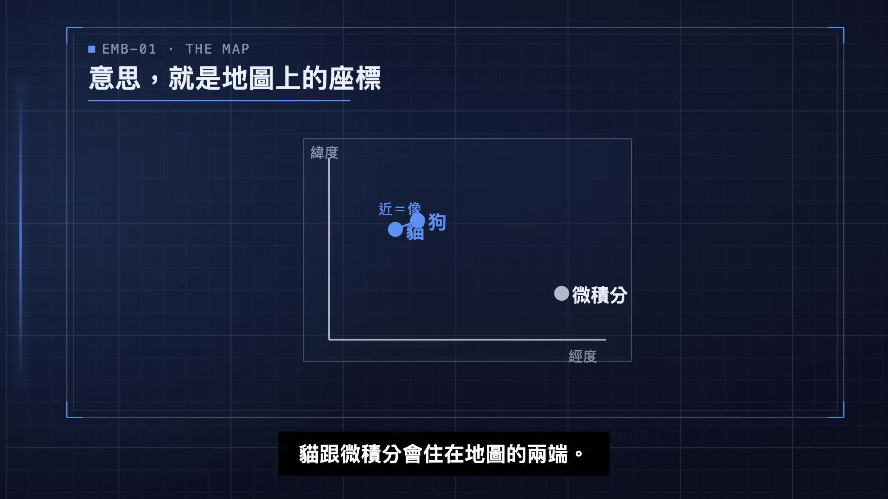

**逐字稿片段：** 這排數字在工程上的名字叫向量 你把它當成一個座標就好 你可能會想 把字變成數字有什麼了不起 了不起的地方在於 電腦本來就只會算數 它不會讀書

**話題推測：** 介紹排數字的工程名稱「向量」。

---

## 00:02:13

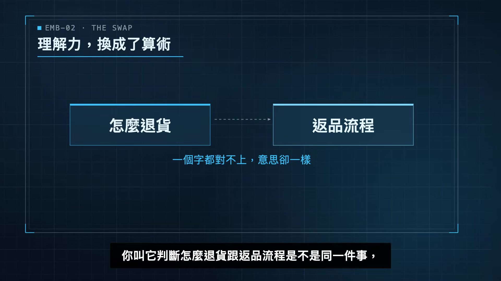

**逐字稿片段：** 你只要判斷怎麼退貨跟翻評流程 是不是同一件事 它做不到 因為這兩句話一個字都對不上 可是如果這兩句話都變成了座標 問題就換了一個樣子 要問的是這兩句話意思一樣嗎 現在只要問這兩個點離得近不近 前面那個問題需要理解力 後面那個問題只需要減法 這就是embedding真正解決的事情 它把一個機器做不到的問題 換成一個機器做得飛快的問題 從此以後 搜尋不再是找字 推薦也不再是猜你喜歡什麼 是找出跟你位置最近的那些人在聽什麼歌 你手機相簿那次搜尋 答案也在這裡 照片跟你打的那幾個字被放進了同一張地圖 機器只是算了一下誰離誰最近

**話題推測：** 解釋Embedding如何將理解問題轉化為電腦可運算的數學問題（判斷座標距離）。

---

## 00:02:49

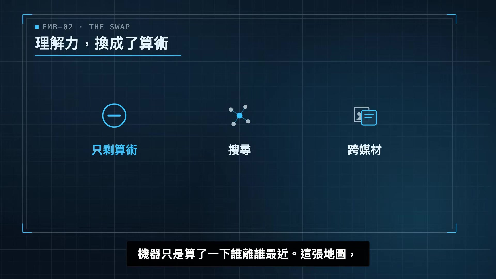

**逐字稿片段：** 這張地圖就是這支影片接下來要講的全部 我們要理解這張地圖有多不容易

**話題推測：** 總結前面內容，並預告接下來將深入探討這張「地圖」的發展歷史。

---

## 00:02:54

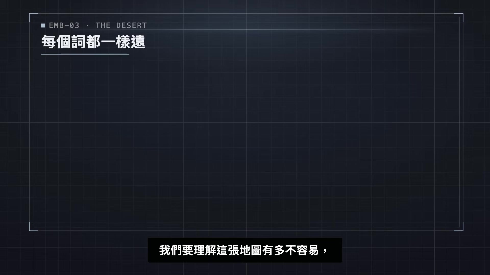

**逐字稿片段：** 就得先回到還沒有地圖的年代 最早的做法簡單到有點好笑 工程師先做一本字典 把出現過的詞全部編好 第一個詞編一號 第二個詞編二號 一路編到五萬 然後每個詞用一根很長的柱子表示 表示 柱子上有五萬格 只有屬於自己的那一格 填上一 其他四萬九千九百九十九格 全部是零 這個做法有個名字叫

**話題推測：** 進入主題歷史，從「還沒有地圖的年代」開始講述。

---

## 00:03:13

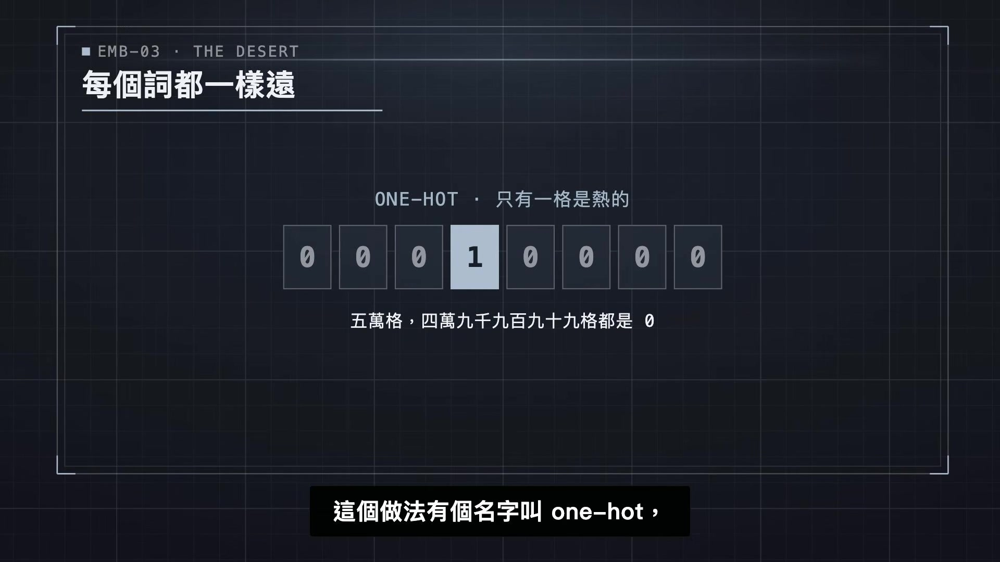

**逐字稿片段：** One Heart 意思是隻有一格是熱的 它有一個致命的問題 你去量 任何兩個詞之間的距離 答案永遠一樣 貓跟狗的距離 等於貓跟沒積分的距離 也等於貓跟星期三的距離 在這個世界裡 每一個詞都 孤零零站在自己那一格上 跟其他所有詞的遠近完全相同

**話題推測：** 介紹「One Hot」的名稱與概念。

---

## 00:03:32

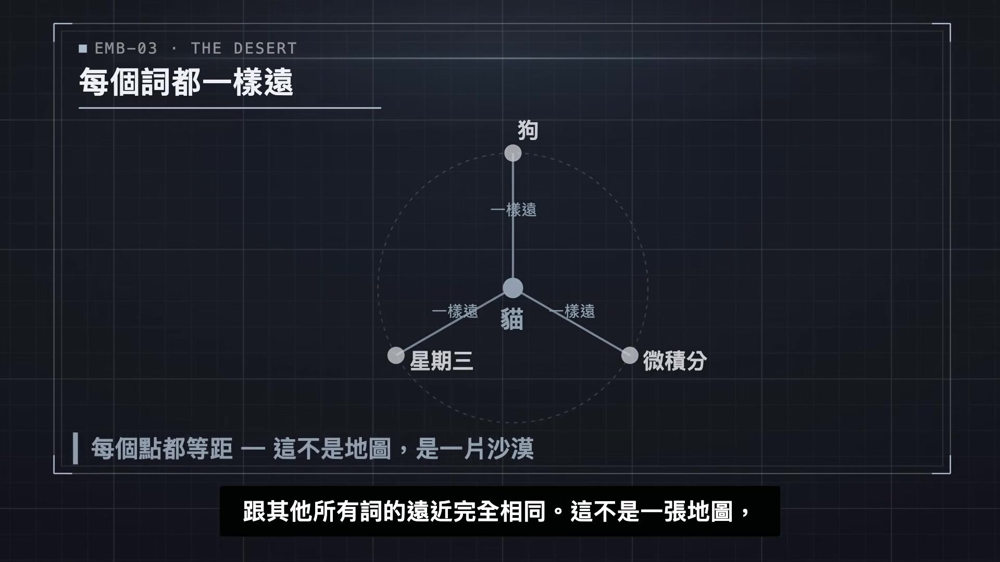

**逐字稿片段：** 這不是一張地圖 這是一片沙漠 每一個點 每個點跟每個點都等句 你走到哪裡都沒有方向感 在這片沙漠裡 人們還是做出了能用的東西

**話題推測：** 比喻One-hot Encoding的世界是「一片沙漠」，詞之間距離都相同。

---

## 00:03:40

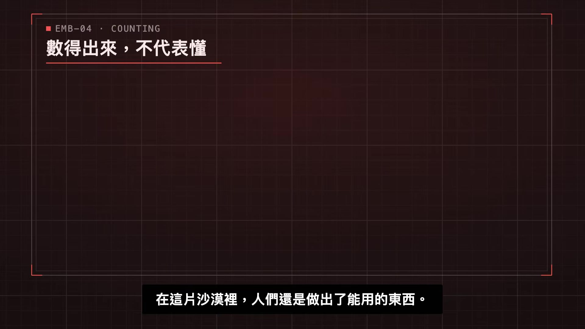

**逐字稿片段：** 最有名的一招叫磁帶 英文是Bag of Words 說法就像把一整篇文章倒進一個袋子搖一搖 不管順序 指數每個詞出現幾次 拿著郵件過濾就靠這招活了很多年 一封信裡中獎跟匯款出現太多詞 機器根本不用懂意思 數數字就能攔下來

**話題推測：** 介紹「Bag of Words」模型。

---

## 00:03:56

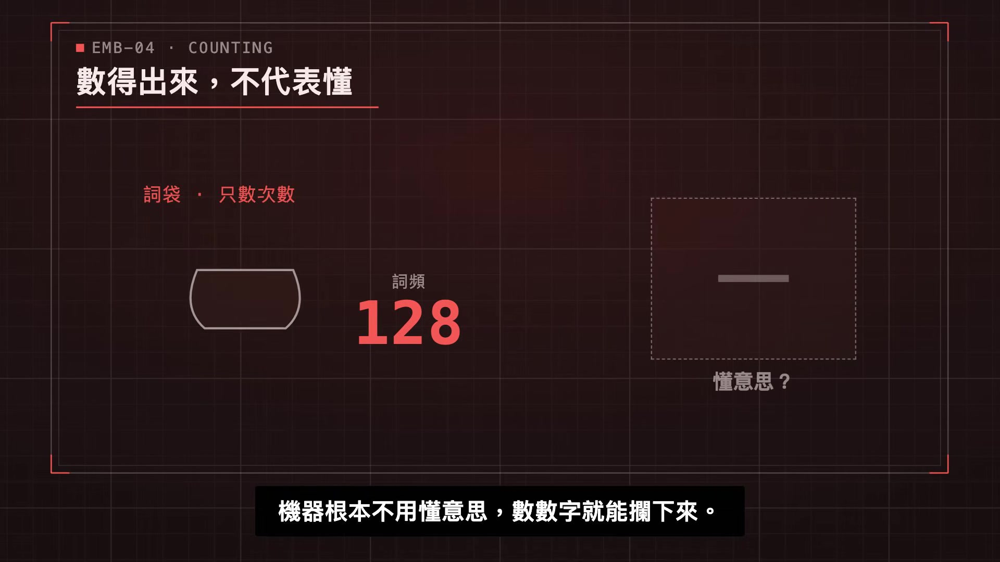

**逐字稿片段：** 後來有人再加一層聰明 1972年 劍橋大學一位叫Karen Spark-Jones的研究者提出一個想法 一個詞越少見 他越能代表這篇文章在講什麼 的這個字到處都有 所以他什麼都沒說 那現體很少出現 一出現就幾乎決定了主題 這一招叫TFIDF 到今天的搜尋引擎裡都還在用 但你有沒有發現 這些方法從頭到尾都在做同一件事 他們在數字 不是在懂詞 沙漠裡的小聰明在多 沙漠還是沙漠

**話題推測：** 介紹TF-IDF模型，並提到「1972年」和「Karen Spark-Jones」。

---

## 00:04:25

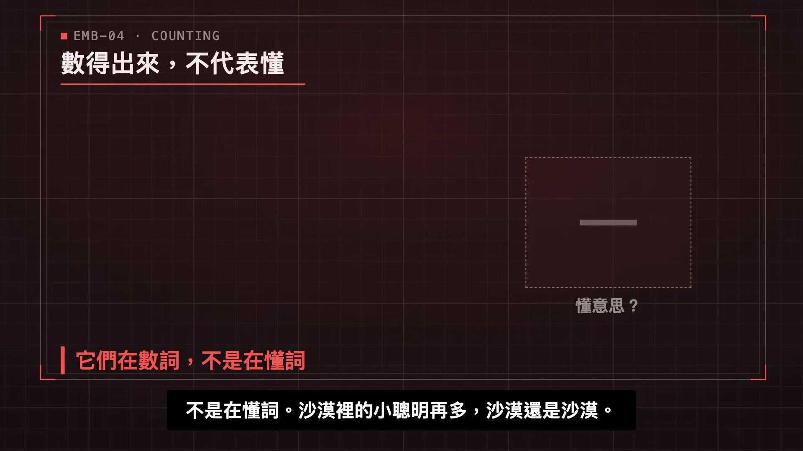

**逐字稿片段：** 轉機不是來自工程師 而是來自一位 從來沒碰過電腦的語言學家

**話題推測：** 話題轉折，指出真正的轉機來自語言學家而非工程師。

---

## 00:04:29

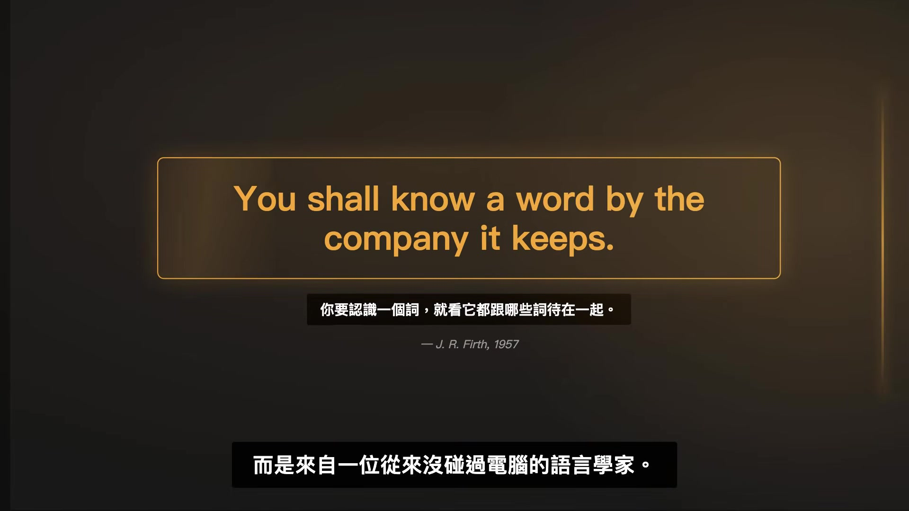

**逐字稿片段：** 1957年 英國人John Rupert Furse 在一篇論文裡寫下一句話 後來被引用了無數次 他說你要認識一個詞 就看它都跟哪些詞待在一起 這句話白話一點講就是 你不用查字典也能猜出一個生字的意思 只要看它前後都跟誰出現 有人跟你說他昨天喝了一整杯馬代茶 你就算沒聽過這個東西 也知道它大概是一種飲料 因為喝跟一整杯這兩個鄰居 已經把答案寫出來了 這個想法在語言學裡叫做分佈假說 1954年的Zedek Harris 也寫過更正式的版本 你注意一下時間 這句話比第一臺跑了這種神經網路的電腦還要老 而接下來60幾年 整個AI領域做的事情 某種程度上就是把這句話翻譯成數學 把那句話變成數學的第一次認真嘗試

**話題推測：** 再次提及「1957年」和「John Rupert Furse」及其關鍵語句。

---

## 00:05:14

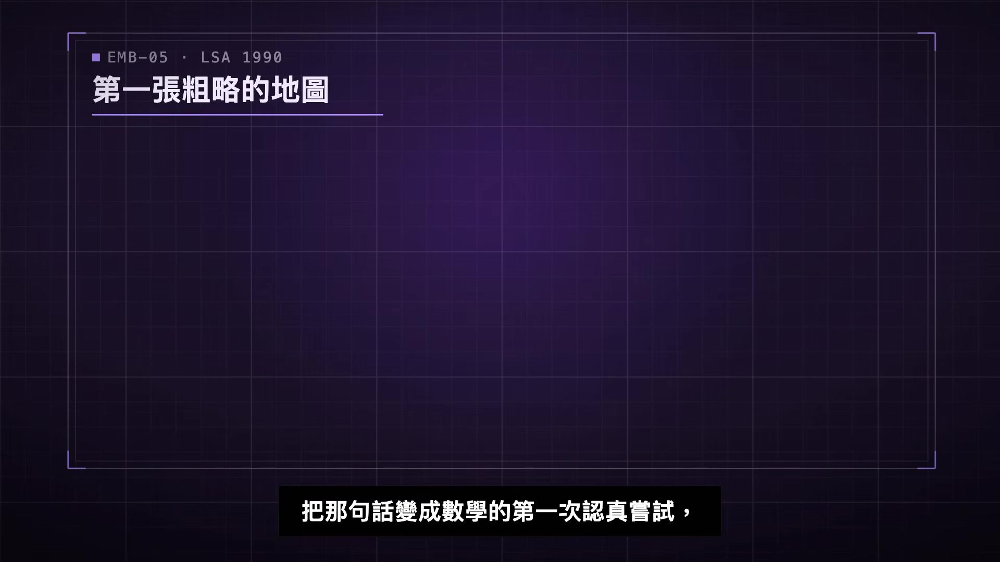

**逐字稿片段：** 發生在1990年 一群研究者做了一張巨大的表格 買的是每一個詞 值的是每一份文件 格子裡填的是這個詞 在這份文件出現幾次 這張表格大的離譜 而且幾乎全是空的 他們用一套線性代數的手法 把這張幾萬欄的表格 硬壓成100欄左右 你可以想成把一間 堆滿雜物的倉庫重新整理 只留下100個抽屜 每個抽屜代表一個大主題 然後把每個詞丟進最像他的那幾個抽屜裡

**話題推測：** 介紹「1990年」研究者利用表格進行潛在語意分析（LSA）。

---

## 00:05:41

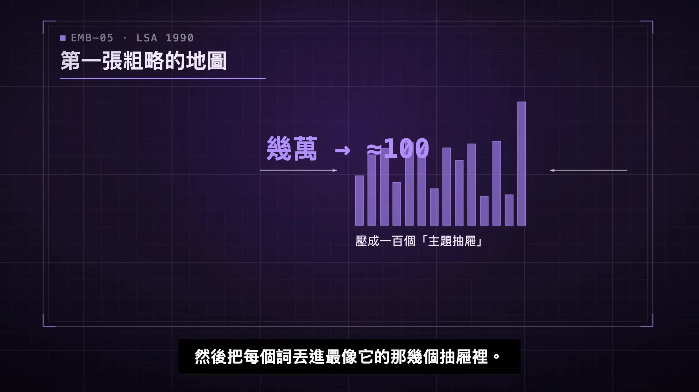

**逐字稿片段：** 這個方法叫做潛在語意分析 英文簡稱LSA 壓完之後發生了一件事 Car跟Automobile這兩個幾乎不會同時出現在一句話裡的詞 第一次在數學上靠在一起了 這是人類第一次真的畫出語意的座標

**話題推測：** 命名該方法為「潛在語意分析 (LSA)」。

---

## 00:05:54

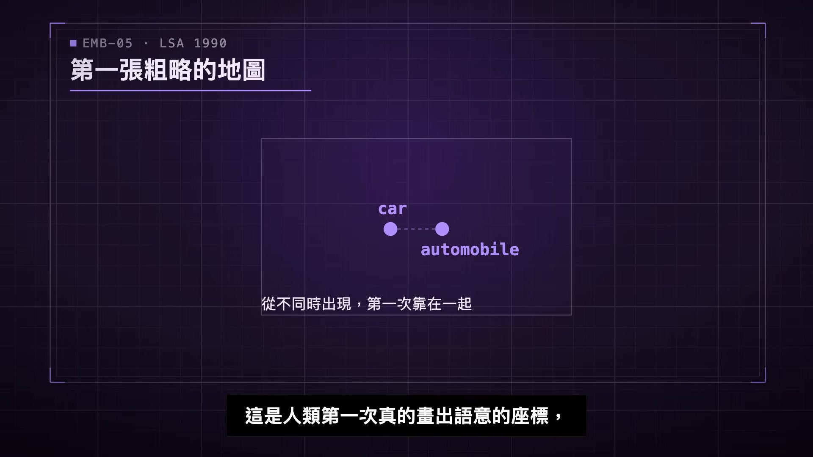

**逐字稿片段：** 比後面那個引爆全世界的方法還早了23年 1990年那張表格有個先天的毛病 它是靜態的 語料一變就得整個重算 也學不會新的詞

**話題推測：** 指出LSA比後來的方法早了「23年」。

---

## 00:06:04

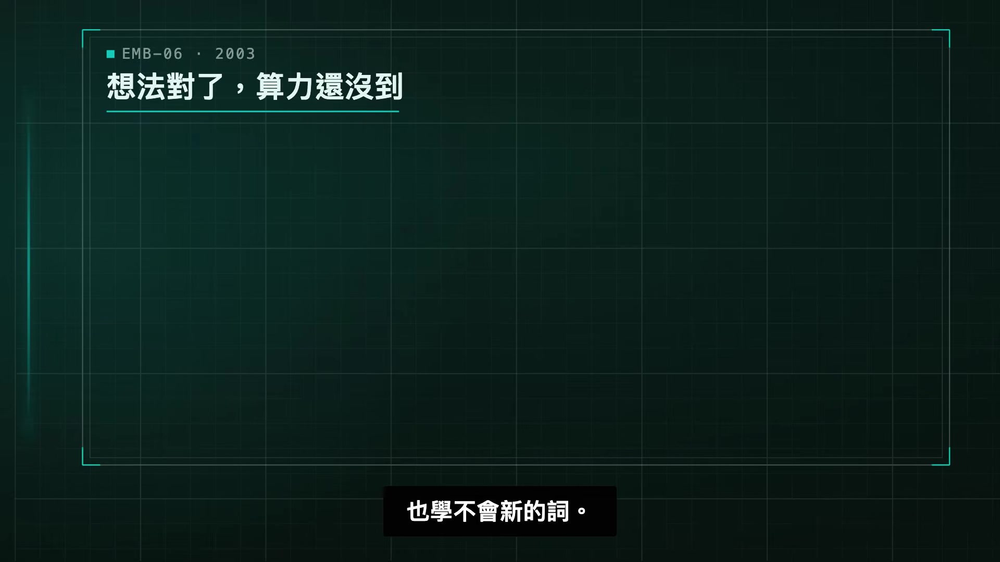

**逐字稿片段：** 真正指出要愛條路的人是Yosha Bengio 1003年 他跟同事發表了一篇論文 做法完全不一樣 他們讓一個神經網絡 去做一件很無聊的事 看前面幾個詞 猜下一個詞是什麼 重點在於 這個網絡為了猜得準 必須自己在內部長出一套 對每個詞的理解 那套理解就是一組座標 詞的座標不是他們本來要的東西 是這個訓練過程順手長出來的副產品 這就像一個學生 為了應付考試拼命讀書 考完之後你會發現 他腦子裡多出來的 不是那幾道題目的答案 是一整張學科的地圖 這個想法完全正確 問題出在1003年 那時候的電腦跑這種模型 慢得讓人絕望 磁位表只能開幾萬個 語料只能用一小塊 正確的想法有了 算力還沒到

**話題推測：** 介紹「Yosha Bengio」在「2003年」提出的神經網絡方法。

---

## 00:06:48

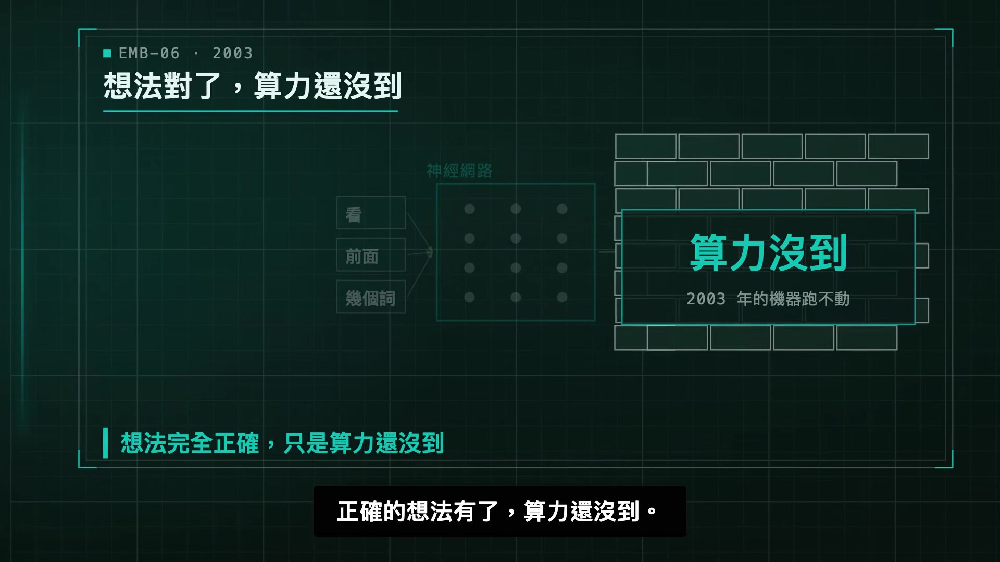

**逐字稿片段：** 十年之後 補上那塊算力的人 是一個沒什麼人聽他說話的 年輕研究員 Thomas Mikolov 捷克人

**話題推測：** 轉向解決算力問題的「Thomas Mikolov」。

---

## 00:06:56

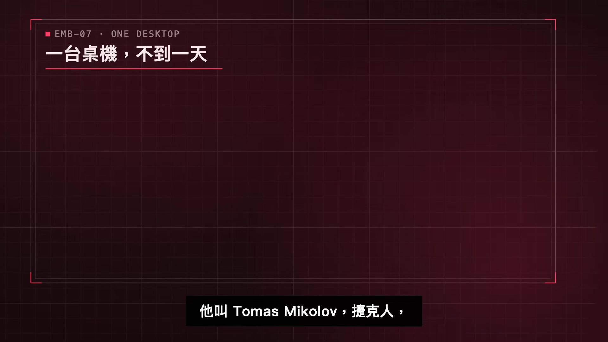

**逐字稿片段：** 2012年在布爾諾拿到博士 論文題目就是用神經網絡 做語言模型 他進了Google之後跟同事說 磁向量這件事 可以做得又快又好 根據他自己後來的回憶 當時沒有人認真聽 實驗室的注意力 全都在另一篇 他覺得又複雜 又多餘的論文上 他決定不再說服任何人 自己動手寫 他沒有申請重集 也沒有排隊等機器 就用一臺 普通的桌上型電腦 幾個星期之後 結果出來了 他寫的那套程式

**話題推測：** 提到Mikolov在「2012年」獲得博士學位。

---

## 00:07:21

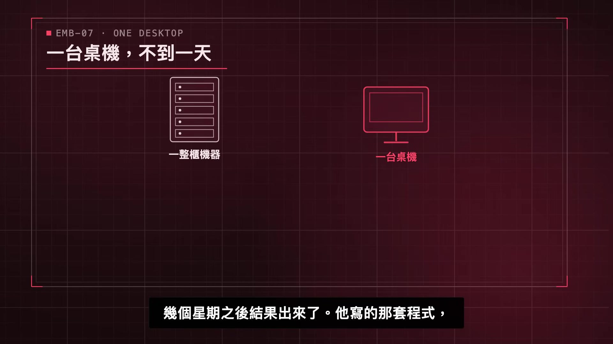

**逐字稿片段：** 從16億個詞的語料裡 學出高品質的詞項量 花了時間不到一天 而Google 內部那個 用好幾臺機器 訓練好幾個星期的模型 被他一臺桌機的結果拉開了一整節 這件事的重點不是他多聰明 他證明的是 這條路之所以走不通 不是想法錯了 是大家一直把它做得太複雜

**話題推測：** Mikolov用「16億個詞」的語料，在「不到一天」的時間內訓練出詞向量。

---

## 00:07:41

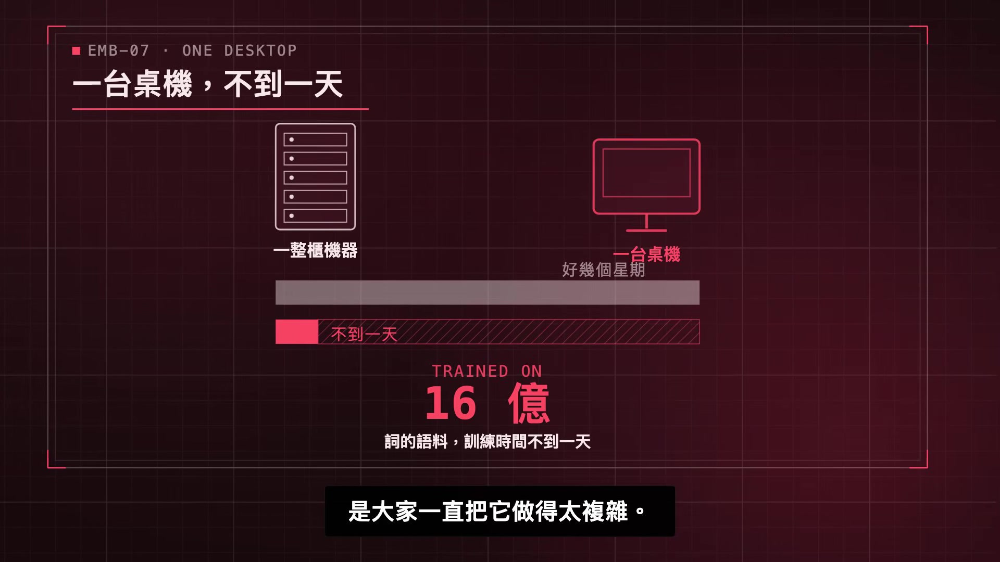

**逐字稿片段：** 他把那套程式命名為Word to Vector 字面意思就是把詞變成向量

**話題推測：** 將Mikolov的程式命名為「Word to Vector」。

---

## 00:07:46

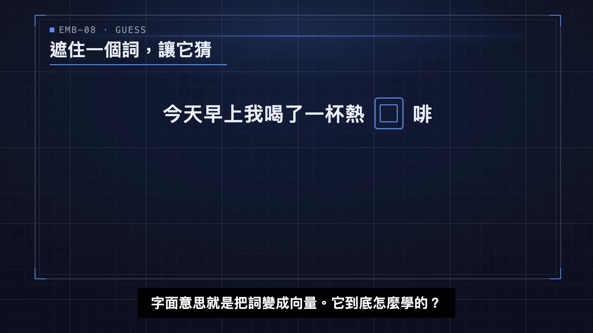

**逐字稿片段：** 他到底怎麼學的 做法簡單到你會懷疑他為什麼有效 你拿一句話出來 今天早上我喝了一杯熱咖啡 他把中間那個詞遮起來 問模型 前後這幾個字圍著的空格應該填什麼 或者反過來 給模型一個咖啡 要他猜咖啡旁邊通常會出現哪些詞 整份語調就這樣一句一句滑過去 猜錯就每條一隻座標 猜對就把座標留著 挖過幾十一個詞之後 那些常常被同樣的鄰居圍著的詞 位置自然就被拉到一起了 你發現了嗎 這正是Furz那句話的機器版本 看一個詞跟誰帶在一起 就知道它是什麼意思 Furz是用嘴巴講的 Word to Vector是用幾十億次猜測 把同一件事做成了座標 M. Mikolov真正的功勞 這個猜測的計算量壓到幾滴 低到一臺桌子一天就能跑完 結果這麼好 論文應該一路順風吧 並沒有

**話題推測：** 解釋Word2Vec的核心學習方法（遮蔽詞語猜前後詞或反之）。

---

## 00:08:36

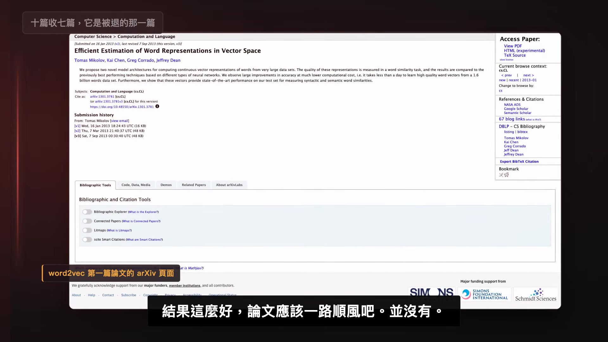

**逐字稿片段：** 2013年1月 他把第一篇Water Vector論文 投到一個叫ICLR的機器學習會議 被拒絕了 這件事最尷尬的地方在於

**話題推測：** 講述Word2Vec論文在「2013年1月」被ICLR會議「拒絕」的經歷。

---

## 00:08:45

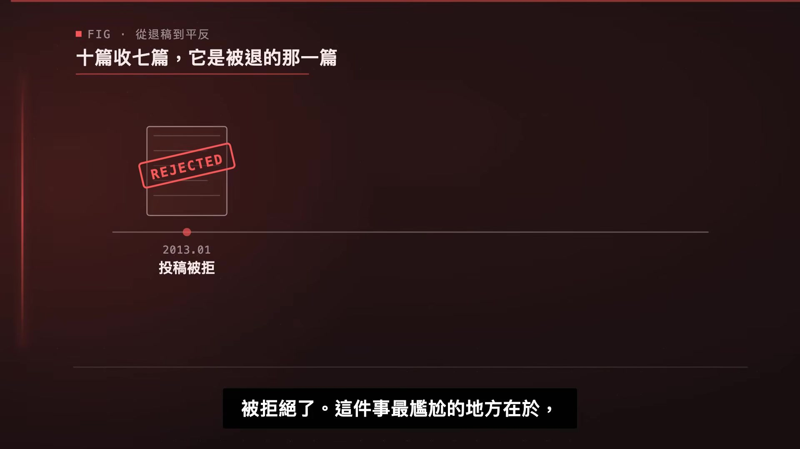

**逐字稿片段：** 那一年那個會議的接收率大約是七成 也就是說十篇裡面收七篇 而後來改變整個領域的那一篇 剛好落在被退回來的那三篇裡 Miccolo自己在2023年公開講過這一段 他也提到Google大約在那年8月 批准把程式碼開放出來 等審批的那段時間 他還順手把程式改得更短更快 程式一放出來 事情就不受任何人控制了 全世界的工程師下載訓練 接近自己的系統 詞項量在兩三年之內 變成了自然語言處理的標準配備 至於那篇被拒絕的研究 他的續作在十年後

**話題推測：** 提到會議「七成」的接收率。

---

## 00:09:21

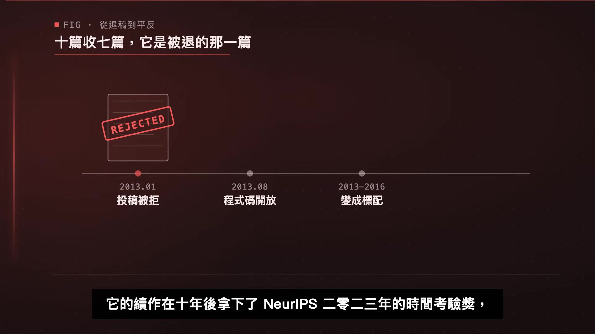

**逐字稿片段：** 拿下了New York IPS 2023年的時間考驗獎 這個獎專門頒給 當年沒被看懂 但是經得起時間檢驗的論文

**話題推測：** 指出Word2Vec的續作在「2023年」獲得NeurIPS「時間考驗獎」。

---

## 00:09:29

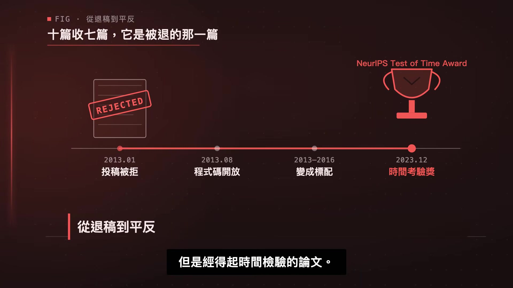

**逐字稿片段：** 真正讓所有人坐直起來的 是另外一件事 既然每個詞都變成了座標 那座標之間的減法 又代表什麼 研究團隊做的一個實驗

**話題推測：** 轉向詞向量的驚人發現：向量之間的數學運算（減法）。

---

## 00:09:37

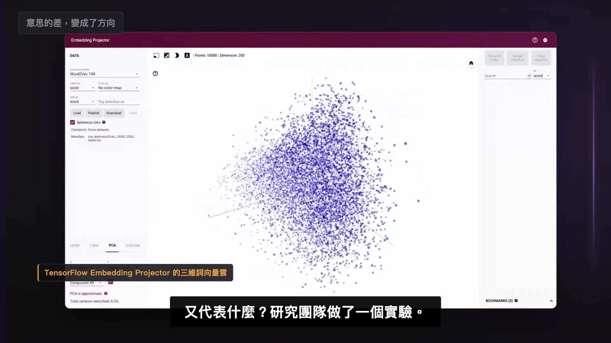

**逐字稿片段：** 他們拿King這個詞的座標 減掉Man的座標 再加上Woman的座標 然後去看落點附近站著誰 OK 安答是Queen 你把這件事想清楚會有點發毛 沒有人教過這個模型什麼叫性別 他從頭到尾只是在猜下一個詞而已 可是一時一旦變成座標 意識之間的關係就變成了方向 從Man走到Woman的那個方向 跟從King走到Queen的方向 幾乎是同一個

**話題推測：** 展示「King - Man + Woman = Queen」的例子。

---

## 00:10:02

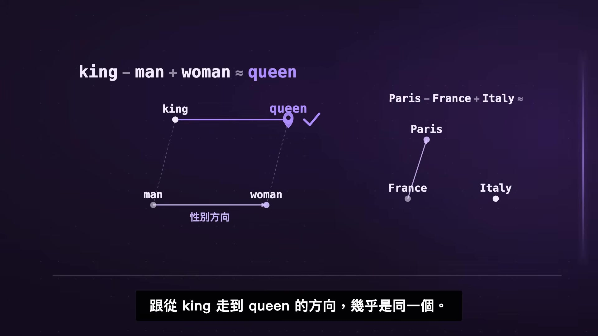

**逐字稿片段：** 同樣的道理 巴黎剪掉法國 再加上意大利 弱點是羅馬 首都這個關係 在地圖上也是一個方向 這一刻 語義不再只是 誰跟誰比較近 它有了幾何 這也是整段歷史裡 最漂亮的畫面 一個從來沒有人民說過的規則 自己從資料里長得出來 不過我必須跟你講一件 很少被提起的事 因為它才是這個故事 誠實的部分

**話題推測：** 展示「巴黎 - 法國 + 意大利 = 羅馬」的例子。

---

## 00:10:24

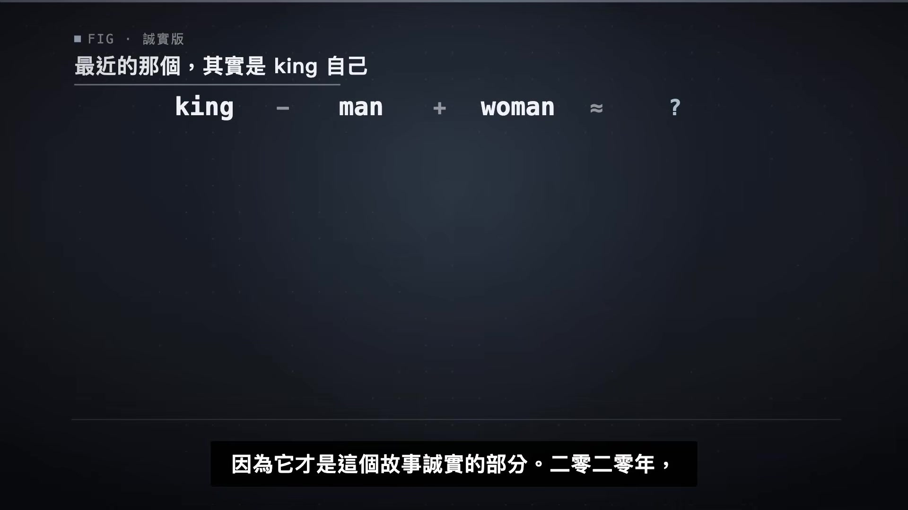

**逐字稿片段：** 2020年 一組研究者 在計算語言學期刊上 發表了一篇論文 標題直接寫著 公平比慫恫更好 他們回頭去驗那個著名的等式 發現了一個細節 King-Man-Woman說 李洛點最近的那個座標 其實是King自己 Queen只是第二名 而所有教科書上會給你Queen 是因為標準的工具程式 包含word factor 自己附的那一支 預設就會把輸入用過的那幾個詞 從答案裡排除掉 你可以說這是合理的工程處理 因為問題本來就不是要他回答King 但你也必須承認 那個讓全世界驚呼的示範 是修過圖的 方向確實存在 關係確實被學到了 這些都是真的 可是展示出來的那個乾淨結果 中間隔著一行沒有人提起的城市 科學傳播最難的地方就在這裡 連自己這一邊的神話也得拿去查證 魔法之外

**話題推測：** 揭露著名等式背後的「修過圖」細節，提到「2020年」的研究。

---

## 00:11:12

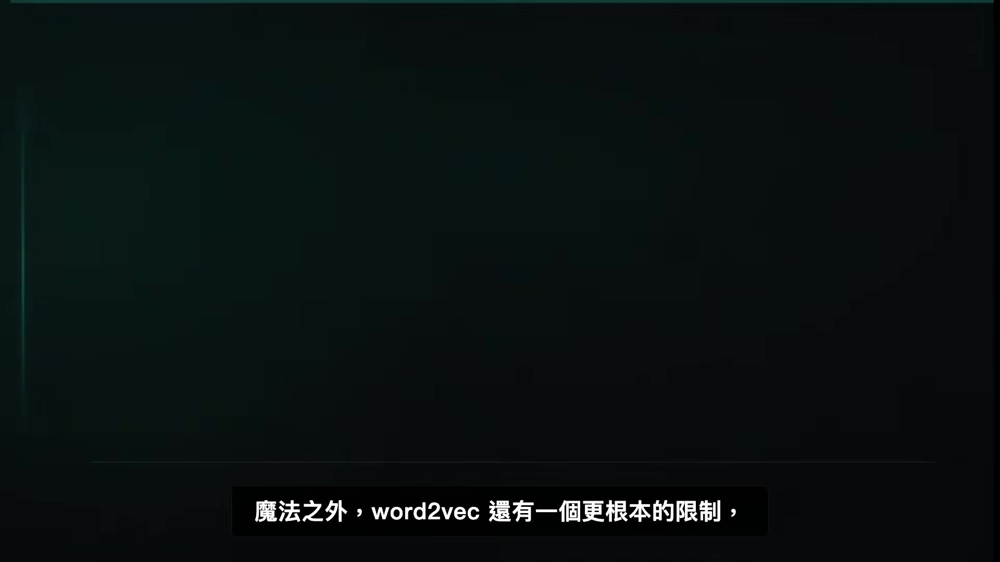

**逐字稿片段：** Word to Vector還有一個更根本的限制 而這個限制後來把整個領域推向下一個階段 它給每一個詞一個固定的座標 一輩子就那一個 可是語言不是這樣運作的

**話題推測：** Word2Vec的一個根本限制：詞義的固定性。

---

## 00:11:22

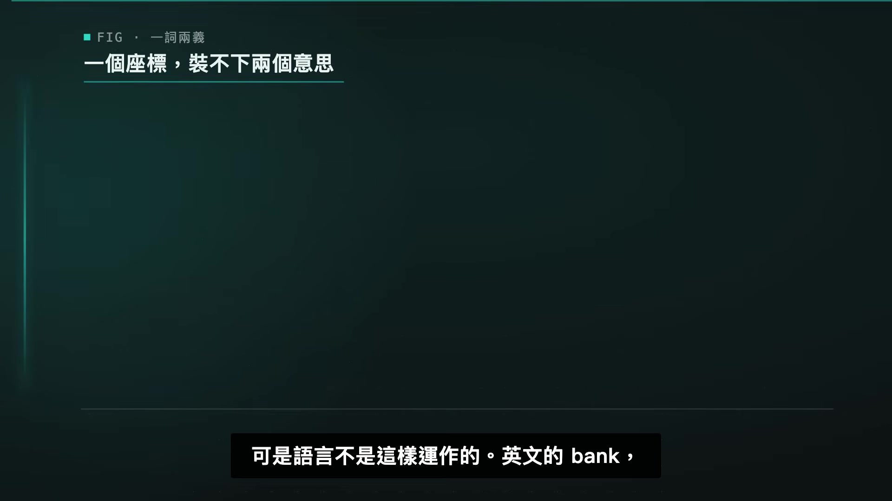

**逐字稿片段：** 英文的bank在river bank也是河岸 bank account也是銀行 中文更明顯 蘋果發表會的蘋果 跟蘋果削皮的蘋果 是兩件完全不同的東西 一個固定座標要同時代表這兩個意思 結果就是它哪一個都不像 只能卡在中間某個很尷尬的位置 就像你在地圖上只能給一家連鎖店標一個點 可是它在城市的東邊跟西邊各有一間分店 你標在中間兩邊的人都找不到 問題到這裡已經很清楚了 一個詞的意思不是它自己決定的 是它這一次出現在哪一句話裡決定的 插表這個做法走到頭了

**話題推測：** 用英文「bank」和中文「蘋果」的例子說明詞義多樣性。

---

## 00:11:55

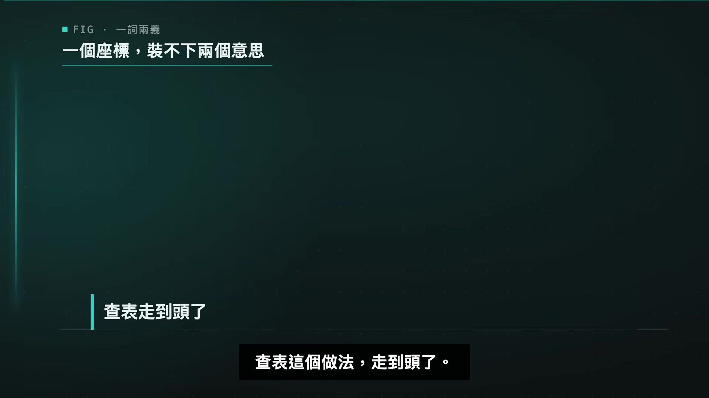

**逐字稿片段：** 假髮在2018年出現 一群來自艾倫人工智慧研究院 跟華盛頓大學的研究者 做了一個模型

**話題推測：** 轉向新一代模型「ELMo」的出現（「2018年」）。

---

## 00:12:02

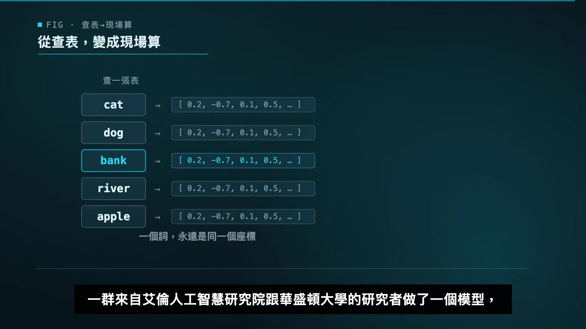

**逐字稿片段：** 名字取自芝麻街的角色 他的想法很乾脆 不要再查表了 你要一個詞的座標 就把整句話丟進模型 讓模型從頭到尾讀一遍 再從他的內部狀態 把這個詞的座標取出來 同一個bang在兩句不同話裡 就會拿到兩個不同的座標 這件事的意義很大 座標從一張固定的表 變成一個現場計算的結果

**話題推測：** 介紹模型「ELMo」的名稱和核心思想：根據上下文生成詞座標。

---

## 00:12:22

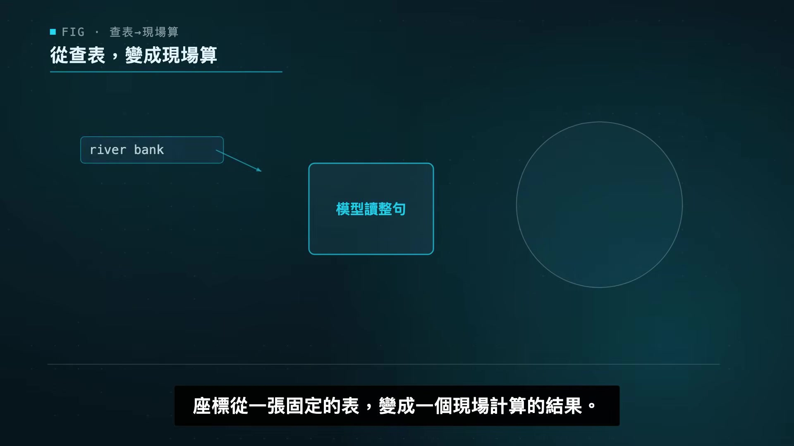

**逐字稿片段：** 同一年10月 Google發表了Bird 走的是同一條路 但是更徹底 他讓模型在讀句子的時候 隨機遮掉一些詞 逼他從左右兩邊的上下文把答案還原回來

**話題推測：** 介紹Google在「同年10月」發表的「BERT」模型。

---

## 00:12:33

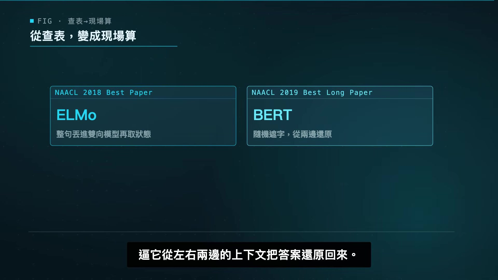

**逐字稿片段：** 這兩篇論文分別拿下了NAACL2018年跟2019年的最佳論文 NAACL是自然語言處理最主要的學術會議之一 同一個研究方向連續兩年拿下最佳論文 這在學界等於一句話 轉折點就在這裡

**話題推測：** 提到兩篇論文分別拿下NAACL「2018年」和「2019年」的最佳論文。

---

## 00:12:46

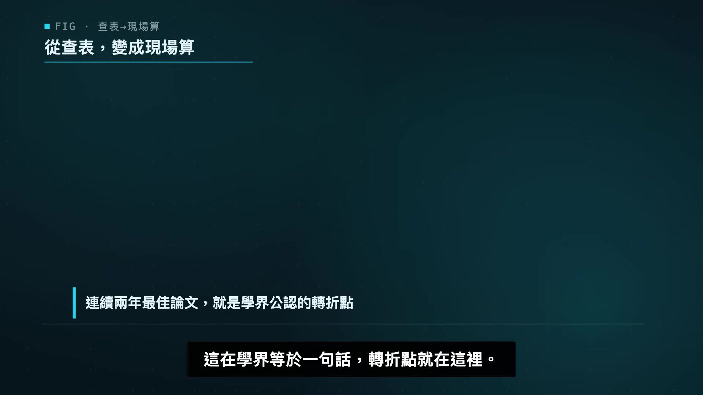

**逐字稿片段：** 不過Bert這種做法有一個很現實的問題 他太慢了 Bert判斷兩句話像不像 必須把兩句話一起位進去讀一遍 讀完才給你一個分數 你手上有一萬個句子 想找出最相似的那一對

**話題推測：** 討論BERT在計算相似度上的「太慢」問題。

---

## 00:12:59

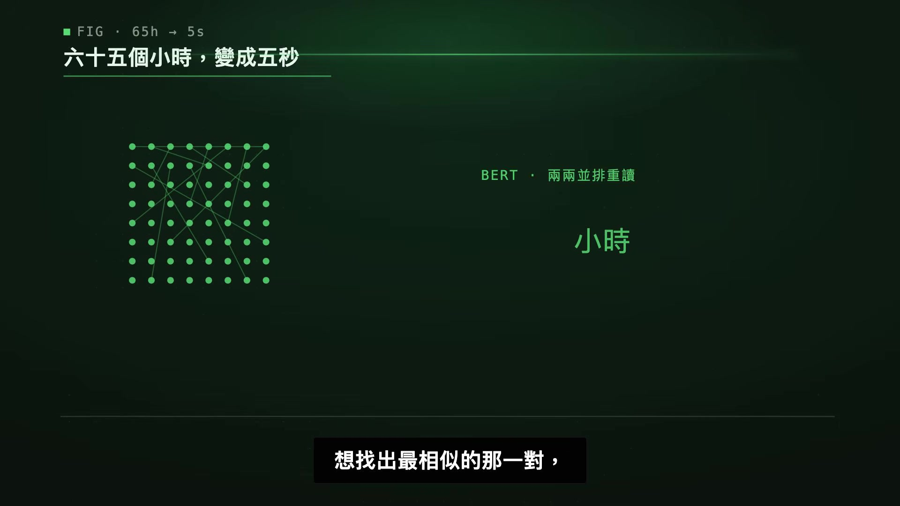

**逐字稿片段：** 就得碼一萬個句子兩兩配對跑幾千萬次 2019年那篇論文算過這個數字 用當時的顯示卡 這件事要花大約65個小時

**話題推測：** 提到需要「幾千萬次」計算才能找出相似句對。

---

## 00:13:08

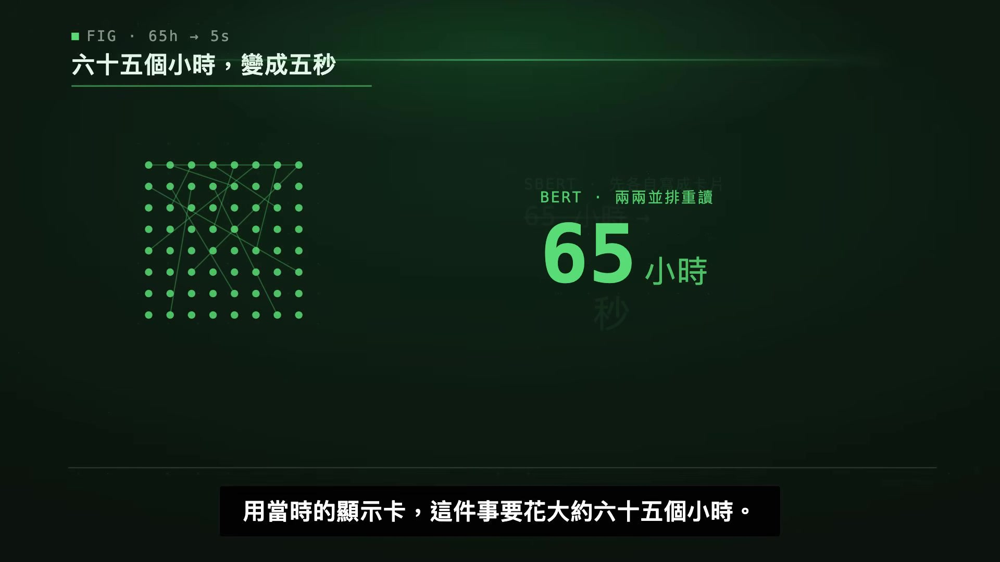

**逐字稿片段：** 我也在德國的研究者提出了一個改法 叫Sentence Burt 他們改成先讓模型單獨讀每一句話 各自產生一支座標 之後要比較的時候 只要算座標之間的距離就好 同樣一萬句話 同樣的準確度

**話題推測：** 介紹德國研究者提出的改進方法「Sentence BERT」。

---

## 00:13:21

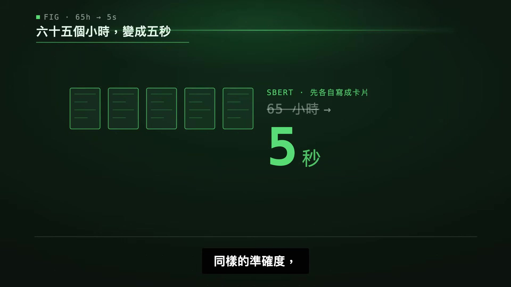

**逐字稿片段：** 時間從65個小時調到大約5秒 這個改動的精神你在生活裡見過 一個神稿人如果每次都要把兩份文件 並排從頭讀一遍 他一天讀不完幾組 但如果他先幫每份文件寫一張摘要卡片 之後直筆卡片 一個下午就能把整項文件排完 從這一刻起 Embedding從一個詞的技術 變成一整段文字的技術

**話題推測：** Sentence BERT將計算時間從「65個小時」大幅縮短到「5秒」。

---

## 00:13:41

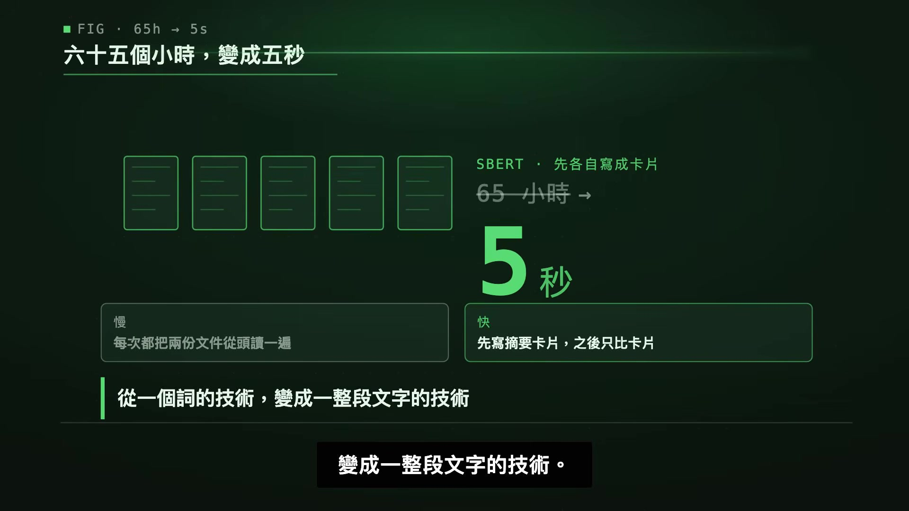

**逐字稿片段：** 地圖上的居民很快就不只有文字了

**話題推測：** 話題擴展到地圖上的居民不只有文字。

---

## 00:13:45

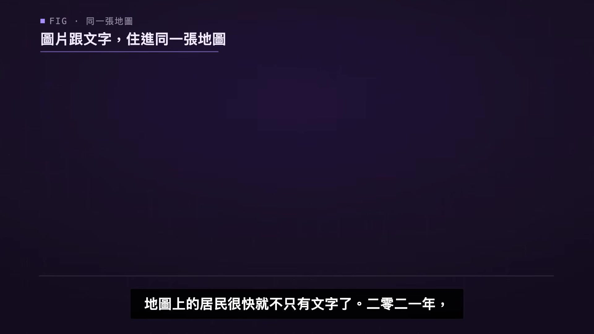

**逐字稿片段：** 2021年 OpenAI發表了一個模型叫CLIP 他同時訓練兩個網路 一個讀圖片 一個讀文字 然後要求他們把真的配在一起的圖片跟說明 放到地圖上幾乎同一個位置 把不成對的推開

**話題推測：** 介紹OpenAI在「2021年」發表的「CLIP」模型。

---

## 00:13:58

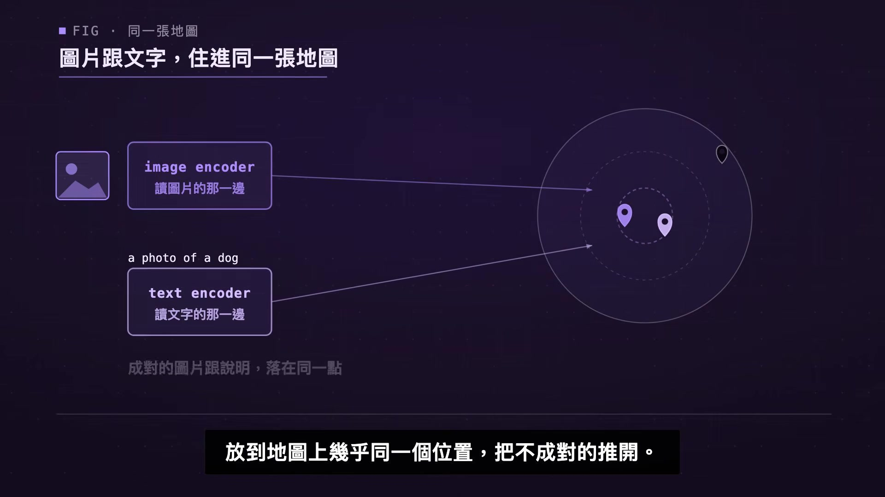

**逐字稿片段：** 他用了網路上4億組圖片 跟說明文字來做這件事 訓練完之後 一張狗的照片 跟a photo of a dog 這句英文 位置靠得非常近 你想想這代表什麼 以圖找字 以字找圖 全部變成同一件事 算距離 你手機相簿 那次搜尋 用的就是這一類技術 你打的那幾個字 跟你的照片 被放進同一張地圖 機器只是找了一下 誰離你最近 順帶一提

**話題推測：** CLIP模型使用了「4億組」圖片和說明文字進行訓練。

---

## 00:14:24

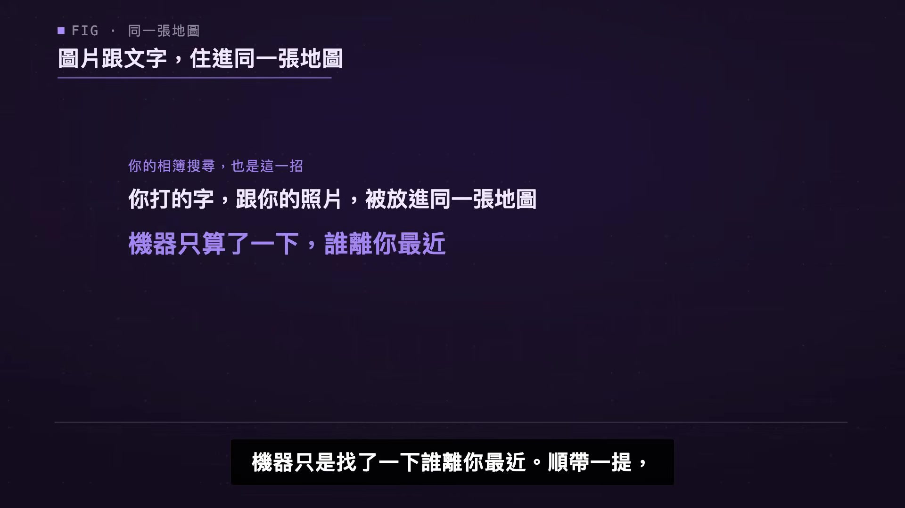

**逐字稿片段：** 這篇論文的作者名單裡 有Iliya Saskiva 2013年 World2Vector的第二篇論文 作者名單裡也有她 同一個人 橫跨了這張地圖的兩個時代 我們的歷史線講到這裡就走完了

**話題推測：** 提到「Iliya Saskiva」是CLIP和Word2Vec兩代模型的共同作者。

---

## 00:14:37

**逐字稿片段：** 接下來我想帶你看 這張地圖今天長在哪些地方 而最常見的那個地方 你每天都在用 它叫RAG RAG的意思是 先去查資料 再讓AI根據查到的東西回答 所有那些跟你的PDF對話 公司內部知識庫問答的產品 底下都是這一條管線 我們一步一步走一遍 第一步 把文件切成一塊一塊 這個動作叫Chunking

**話題推測：** 轉向Embedding的當前應用：RAG。

---

## 00:15:00

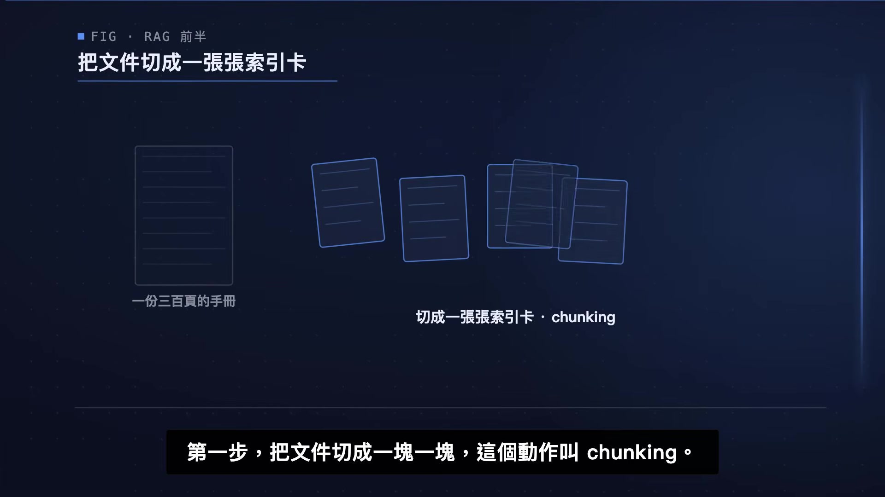

**逐字稿片段：** 一份三百頁的手冊不能整份丟進去 工程師會把它切成一段一段 像把一本書做成一張一張索引卡 這裡有一個要拿捏的地方 卡片切得太小 每一張都沒頭沒尾 讀了不知道在講什麼 切得太大 一張卡上寫了五個主題 那張卡的座標就會變得很模糊 什麼都像一點 什麼都不夠像

**話題推測：** 舉例一份「三百頁」手冊需要Chunking。

---

## 00:15:18

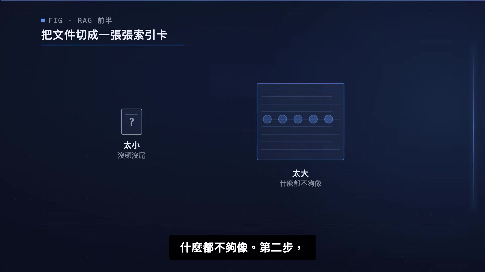

**逐字稿片段：** 第二步 每一張卡片 各自過一次embedding模型 變成一隻座標 然後全部存進一個 專門存座標的地方 這種資料庫叫向量資料庫 使用者問問題的時候

**話題推測：** RAG流程第二步：卡片過Embedding模型生成座標，存入「向量資料庫」。

---

## 00:15:29

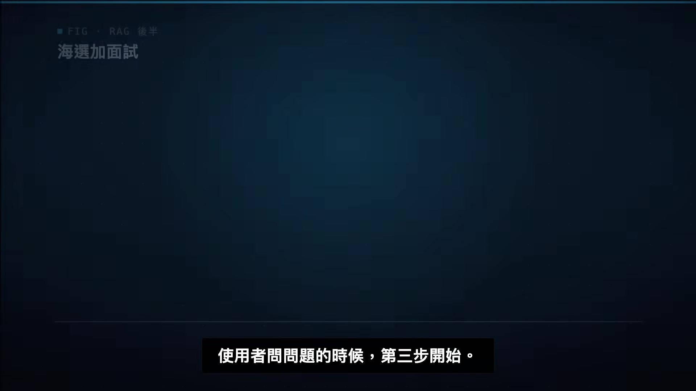

**逐字稿片段：** 第三步開始 他打的那一句問題 也要用同一個模型 轉成一隻座標 這裡有一條鐵律 一定要是同一個模型 不同模型畫出來的地圖 座標系是不通用的 就像兩張用不同投影法畫的世界地圖 經緯都不能混著看

**話題推測：** RAG流程第三步：使用者問題轉為座標。

---

## 00:15:44

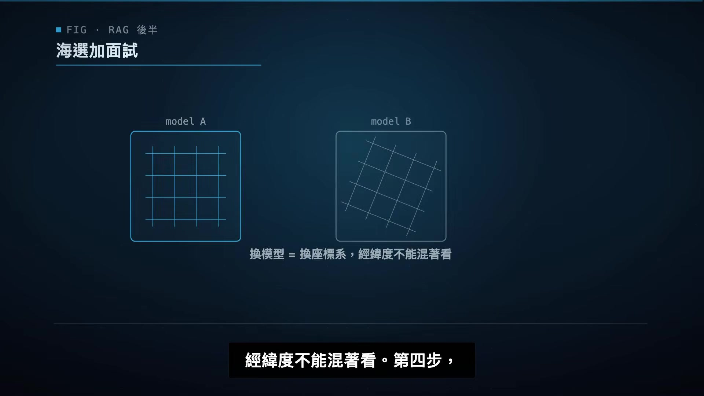

**逐字稿片段：** 第四步 在幾百萬只坐標裡 找處理問題最緊的那幾只 這件事如果老老實實一個一個比 會慢到不能用 所以實務上用的是 近似最近零搜尋 英文簡稱ANN 它的精神不是問遍全城每一個人 而是先問各區的里長 所定對的社區 再往裡面轉 犧牲一點點準確度 換來毫秒級的速度 至於怎麼判斷兩支座標近不近 最常用的方法叫cos相似度 你把兩支座標想成 從原點射出去的兩支箭頭 只看它們的夾角 不管誰比較長 同方向就是最像 垂直就是完全無關 最後一步 撈回來的那幾十段還要再塞一次 這個動作叫re-rank 它會用另一個比較慢 但是比較準的模型 把問題跟每一段並排精讀一次 再打分數 整條線就是海選加面試 Embedding負責海選 Rank負責面試 這條管線聽起來很新 但它其實已經默默運轉很多年了

**話題推測：** RAG流程第四步：在大量座標中找最近的，使用「近似最近鄰搜尋 (ANN)」。

---

## 00:16:39

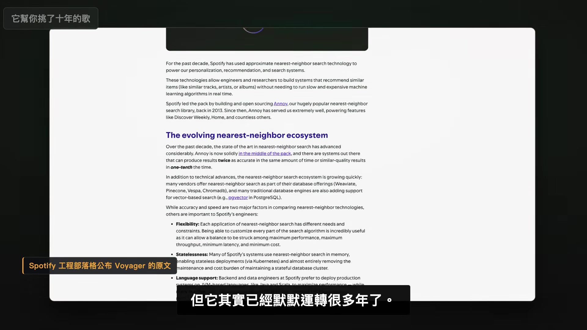

**逐字稿片段：** 最好的例子是Spotify 早在2013年 也就是World2Vector出來的同一年 Spotify就開放了一套自己寫的程式庫叫Annoy 做的正是在幾百萬字座標裡快速找出最近的鄰居 他們把每一首歌 每一個使用者 都變成這張地圖上的一個點 你每個星期一收到的那份Discover Weekly播放清單 還有你打開首頁看到的推薦 背後就是這個動作 找出離你最近的那些點 再看看他們在聽什麼 這套東西撐了整整十年

**話題推測：** 以「Spotify」為例說明Embedding的長期應用。

---

## 00:17:07

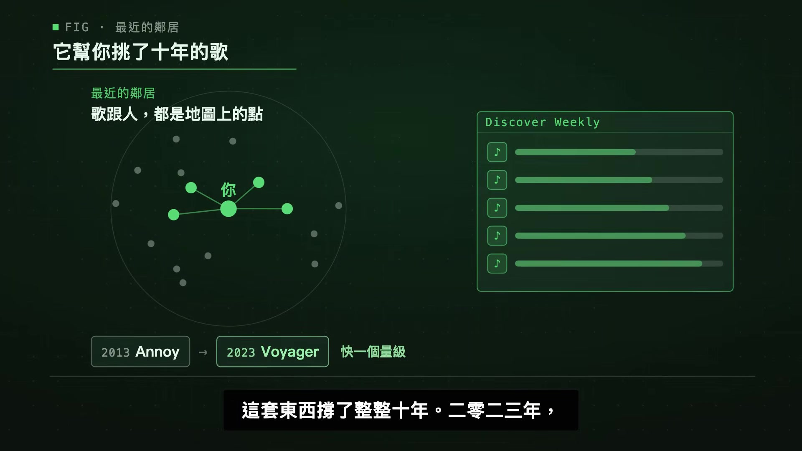

**逐字稿片段：** 2023年 Spotify官方發表了 新一代的程式庫 叫Voyager 換上更新的索引結構 官方的說法是 速度比舊的快了一個量級 我覺得這件事很值得記一下 你以為embedding是 Chad GPT紅了之後 才冒出來的東西 但你的播放清單 早就用它幫你挑了十年的歌 那為什麼是這幾年

**話題推測：** Spotify在「2023年」發表了新一代程式庫「Voyager」。

---

## 00:17:27

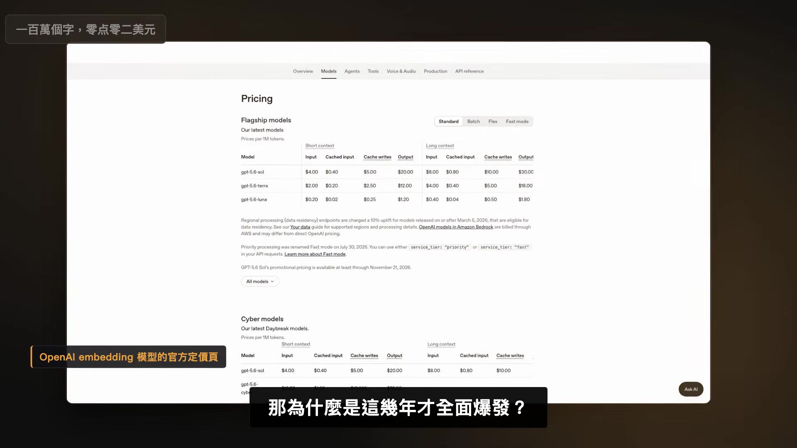

**逐字稿片段：** 才全面爆發 很大一部分原因是價格 今天你叫OpenAI的 入門款embedding模型 幫你處理100萬個token token 你就想成模型眼中的 一小段文字 大概是一個字到幾個字 價格是0.02美元 100萬個Token 大概是幾十本小說的量 花了錢連一塊臺幣都不到 這個價格比較同一家公司的模型生成文字 便宜了好幾個數量級 便宜到什麼程度呢 一間公司可以把過去十幾年 所有的文件郵件會議記錄 全部跑一遍變成座標 成本只是一頓午餐

**話題推測：** 分析Embedding近年全面爆發的原因：「價格」。

---

## 00:17:58

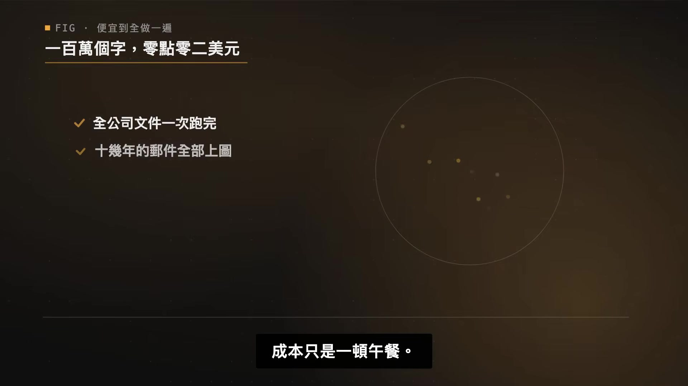

**逐字稿片段：** 這就是為什麼向量資料庫 在2023年突然變成一整個創投賽道 安空這樣的公司 一年之內就拿到了獨角獸等級的估值 不過這裡有一個很真實的代價要講 你換一代embedding模型 舊的座標就全部作廢 因為地圖重畫了 經緯度對不上 幾千萬份文件重新跑一次 這是每一間公司換模型的時候 都要吞下去的賬單 最後我想給你看一條線

**話題推測：** 解釋「2023年」向量資料庫成為創投賽道的原因。

---

## 00:18:20

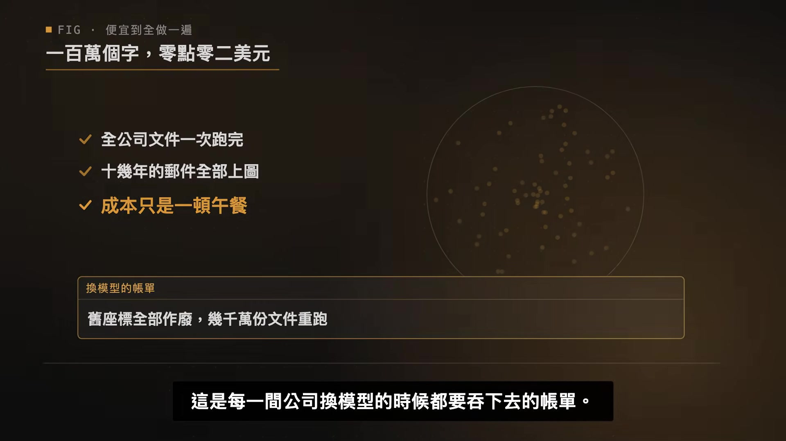

**逐字稿片段：** 它的走向跟直覺相反 1990年那張硬壓出來的地圖

**話題推測：** 轉向Embedding維度數量的發展趨勢。

---

## 00:18:25

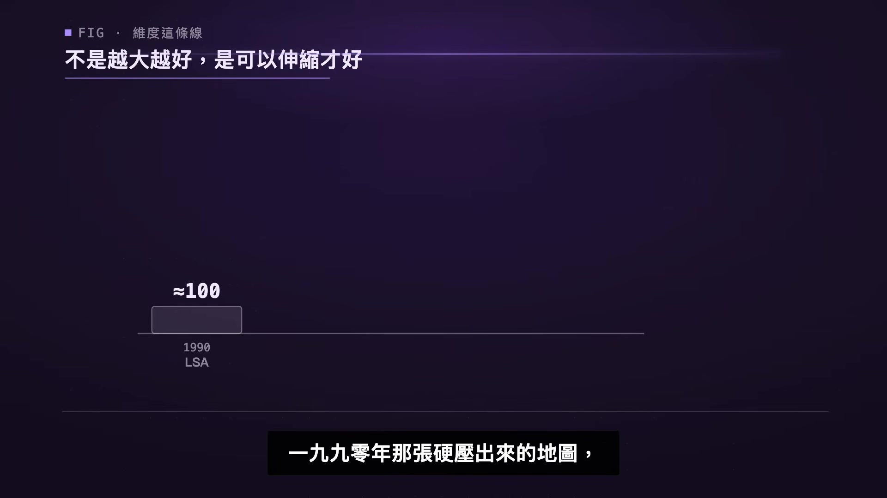

**逐字稿片段：** 就百個座標軸 world to vector用了300個 拍子用到700多個 到了今天 主流的商用模型 動輒3000多個座標軸 看起來就是一路往上漲 越大越好 對吧

**話題推測：** 列舉不同模型維度數：「1990年LSA」的「百個」、「Word2Vec」的「300個」、「BERT」的「700多個」、「商用模型」的「3000多個」。

---

## 00:18:37

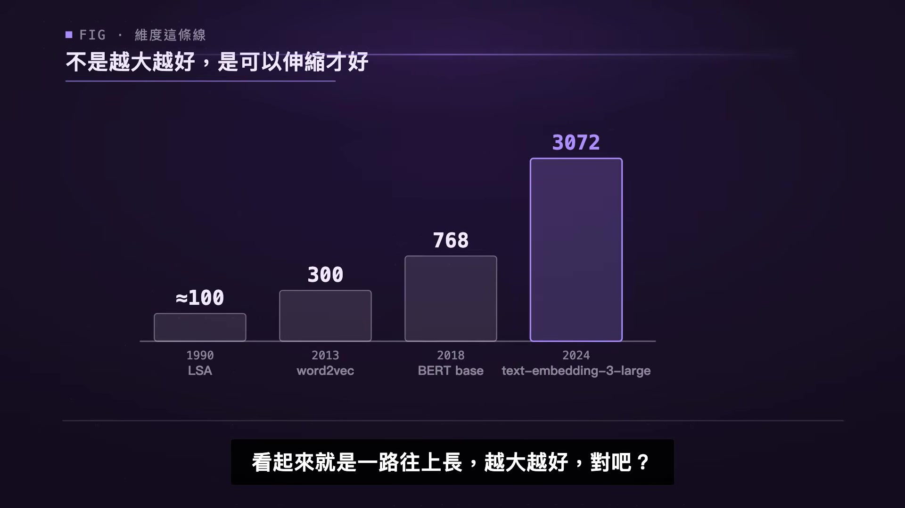

**逐字稿片段：** 結果2022年之後風向變了 有人提出一種訓練方法 名字叫Metroshka 就是俄羅斯娃娃 他在訓練的時候就規定 座標前面幾個維度要裝最重要的資訊 越往後越吃藥 你要省錢的時候 直接把後面那一節砍掉就好 今天OpenAR的模型 讓你自己指定要幾維

**話題推測：** 指出「2022年」後維度發展風向轉變。

---

## 00:18:55

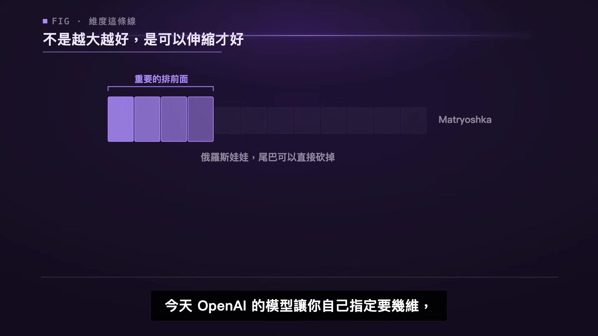

**逐字稿片段：** 3000多維砍到256維 儲存成本掉了十幾倍 效果還是贏過上一代的完整版 所以這個領域最後學到的 不是越大越好 是可以伸縮才好 我回頭看1957年 Fairt寫下那句話的時候 他手上連一臺電腦都沒有 他說你要認識一個詞 就看它都跟哪些詞待在一起 60幾年後 這句話變成了一組座標 藏在你每一次搜尋 每一份推薦 還有你相簿裡那張 沒有標籤的海邊日落背後 我自己整理完這條線 最深的感覺是 60幾年來 人類其實只做了一件事 就是把意識這個看不見的東西 一點一點搬到一張 可以計算的地圖上 從一片誰跟誰都一樣遠的沙漠 走到你手機裡 那是不用標籤的搜尋 中間隔著一句話 一臺桌上型電腦 還有一封劇稿信

**話題推測：** OpenAI模型可以指定維度，如從「3000多維」砍到「256維」。

---

## 00:19:43

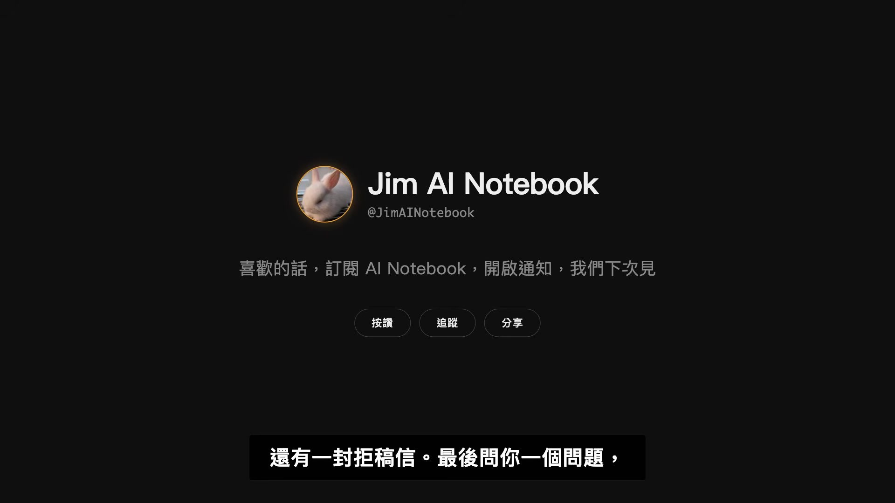

**逐字稿片段：** 最後問你一個問題 如果你手上所有的筆記 照片 聊天記錄 全部都變成 這張地圖上的座標 你最想拿它來找什麼 留言告訴我 喜歡的話訂閱AI Notebook 開啟通知 我們下次見

**話題推測：** 提出一個問題，鼓勵觀眾互動留言。

---
