# jimainotebook_dFhknF3fAJg — 關鍵畫面索引

- 來源逐字稿：[jimainotebook_dFhknF3fAJg_FIN.srt](jimainotebook_dFhknF3fAJg_FIN.srt)
- 影片：https://www.youtube.com/watch?v=dFhknF3fAJg
- 截圖數：75

## 00:00:10

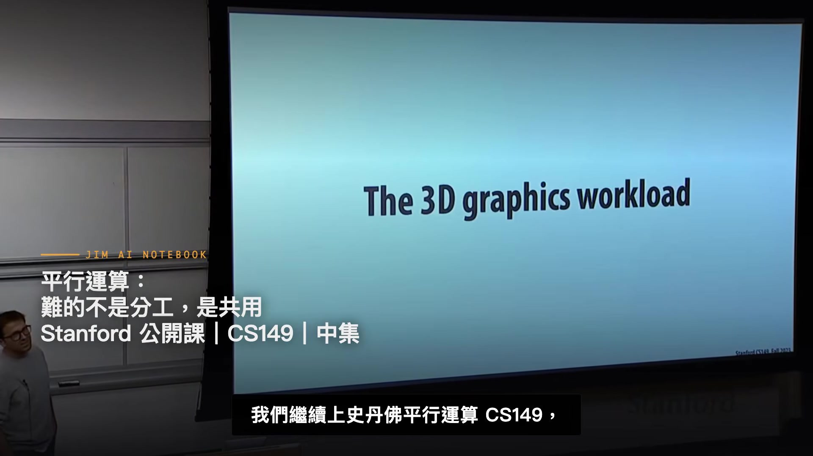

**逐字稿片段：** 這次是第七到第十二堂課, 老師是Kevin Fattahillian, 中間有三堂換成另一位教授Kuno Otokun, 這六堂課其實在回答同一個問題, 幾十萬件工作同時在跑, 碰到同一份資料的時候, 要怎麼辦?上一集的結論是, 難的不是算, 是搬, 這一集再往前走一步, 我先把答案放在前面。 難的不是分工是共用 把工作分出去 硬體人、程式庫都已經很會做了 真正麻煩的 是好幾個人手上拿著同一份東西 有人改了有人還在看舊的 上一集最後我們說 下一站是繪圖處理器 一顆晶片上幾萬個算數單元 要你準備好幾十萬件工作才為得寶 那我們就從這顆晶片開始 先問一個問題 它原本是拿來做什麼 KFone一開場就問了一個問題

**話題推測：** 影片介紹主題：史丹佛平行運算CS149課程資訊

---

## 00:00:49

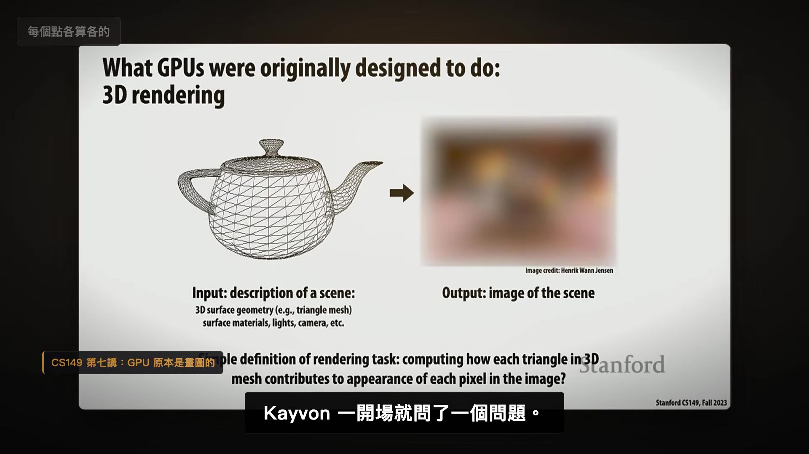

**逐字稿片段：** NVIDIA和AMD做的這些晶片 當年主要是拿來玩一款叫Quick的射擊遊戲

**話題推測：** 提到NVIDIA和AMD晶片與Quick射擊遊戲的演變

---

## 00:00:56

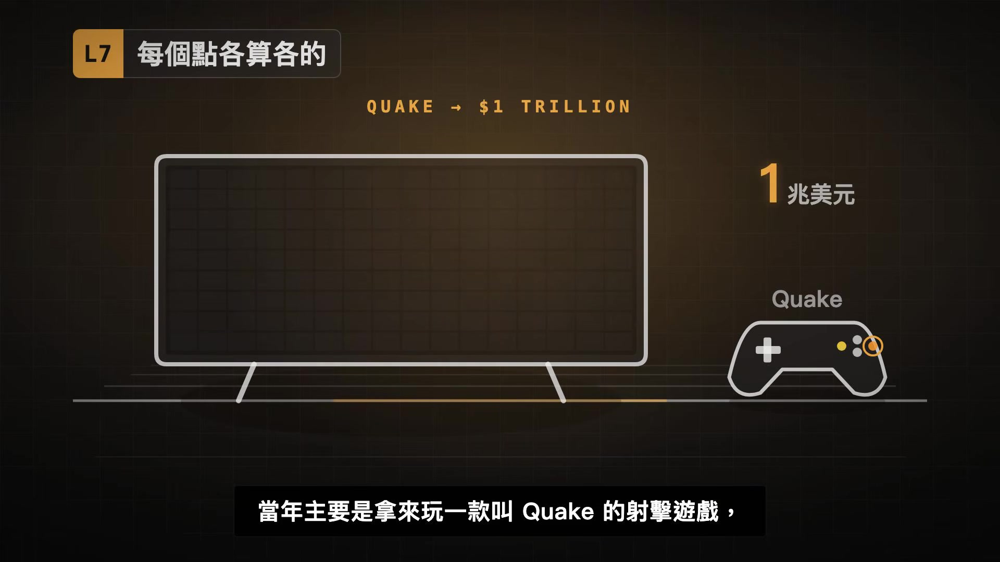

**逐字稿片段：** 怎麼會一路變成一家41兆美元的公司 比Intel大得多 全世界都在搶著買 這種晶片叫GPU 中文叫繪圖處理器 它原本只做一件事

**話題推測：** 提到NVIDIA成為41兆美元公司，比Intel大得多

---

## 00:01:03

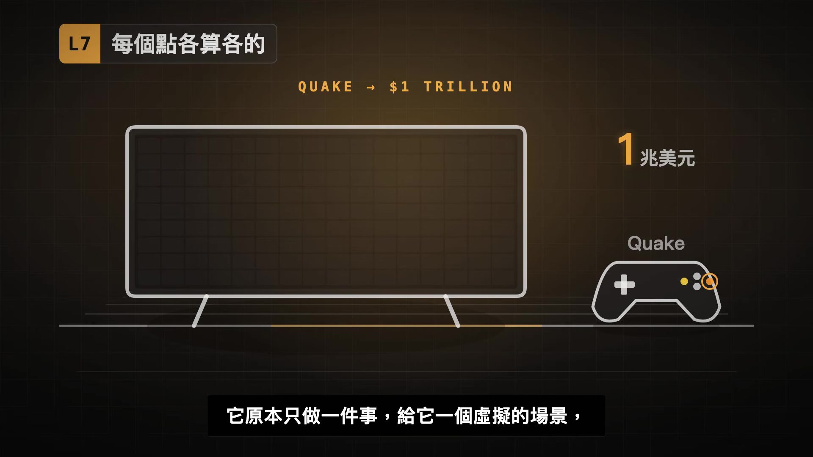

**逐字稿片段：** 給它一個虛擬的場景 算出攝影機會拍到什麼畫面 也就是替畫面上每一個小點算出顏色

**話題推測：** 解釋GPU如何計算畫面像素的顏色

---

## 00:01:09

**逐字稿片段：** 一張CK的畫面 有幾百萬個點 一秒還要畫好幾十張 每個點的顏色各算各的 彼此不用等 所以做這種晶片的人 很早就一直往上加核心 加算術單元 KBON接著說 今天這堂課沒有新觀念 多核心SIMD多值形序 全是上一集講過的東西 只是規模放大了好幾百倍 這麼多核心 一開始只能拿來畫圖

**話題推測：** 提到Quick遊戲畫面有幾百萬個點，一秒畫幾十張

---

## 00:01:32

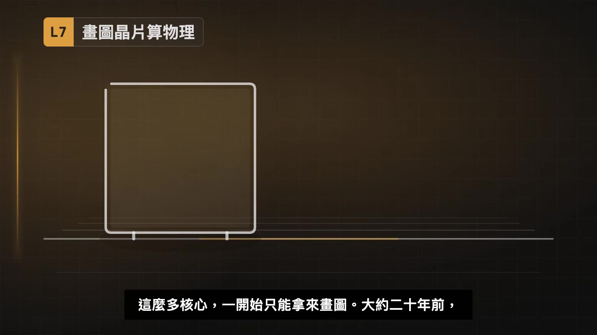

**逐字稿片段：** 大約20年前 史丹佛和北卡大學的研究人員發現 Intel的處理器不再變快 顯示卡卻每一代都在加核心 可是當時你沒辦法直接叫他跑程式 你只能丟給他一堆三角形 再附上一小段計算顏色的程式 於是他們在512x512的畫面上 畫兩個剛好蓋滿整個螢幕的三角形 這樣那段算顏色的程式 就會被執行26萬多次 接著他們偷偷換掉程式的內容 不算顏色啦

**話題推測：** 介紹史丹佛和北卡大學發現Intel處理器變慢，顯示卡核心增加的歷史背景

---

## 00:01:58

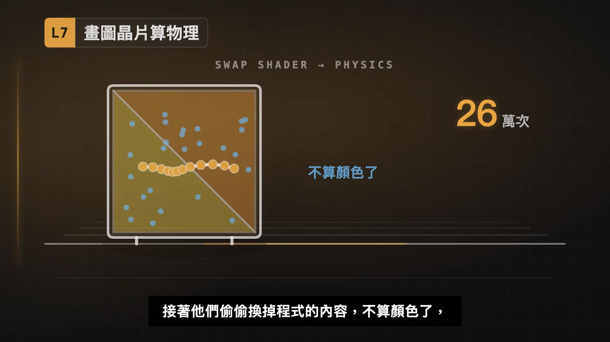

**逐字稿片段：** 改成推進一部物理模擬 或者算蛋白質折疊 2004年 史丹佛有個研究計畫說 這樣太亂來了 既然它是平行處理器 就該有一套正經的寫法 三年後 NVIDIA自己出手 推出了正式的做法

**話題推測：** 提到將算顏色程式改為物理模擬或蛋白質折疊

---

## 00:02:11

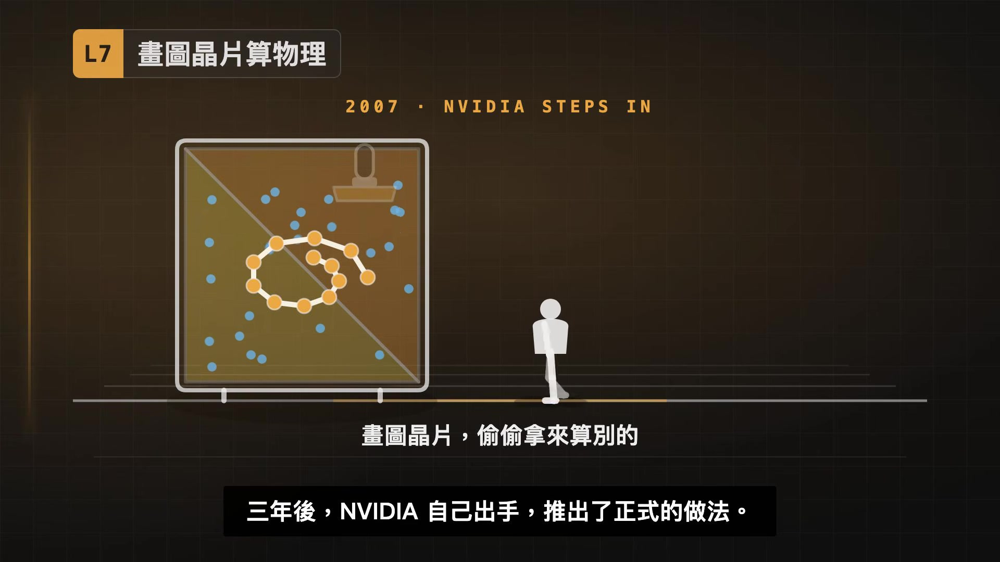

**逐字稿片段：** 2007年 NVIDIA推出了一套程式語言 叫CUDA 它的想法很簡單 你只寫一小段程式 然後告訴晶片 請把這段程式跑N份 每一份叫一條CUDA型序 每一條都知道自己的編號 再照編號去做屬於自己的那一份

**話題推測：** 2007年NVIDIA推出程式語言CUDA

---

## 00:02:26

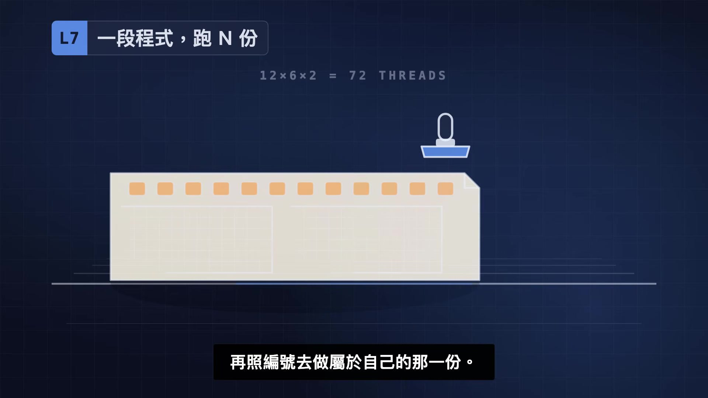

**逐字稿片段：** 例如你要把兩張12x6的表格相加 每一格派一條執行序 一共72條 那敘利亞還多了一層 執行序要先分組 每一組叫一個Thread Block 中文叫執行序區塊 你會發現 這跟上一集的ISPC幾乎一樣 Kvon說 ISPC當年就是 看到大家用CUDA寫顯示卡 才做出來的迴音 有一個細節要記住 你只決定要幾條執行序 怎麼分組 至於哪一組在哪個核心上跑 什麼時候跑 由晶片自己安排 那晶片拿到這些執行序 實際上怎麼跑

**話題推測：** 舉例用CUDA將兩張12x6表格相加，共72條執行序

---

## 00:02:57

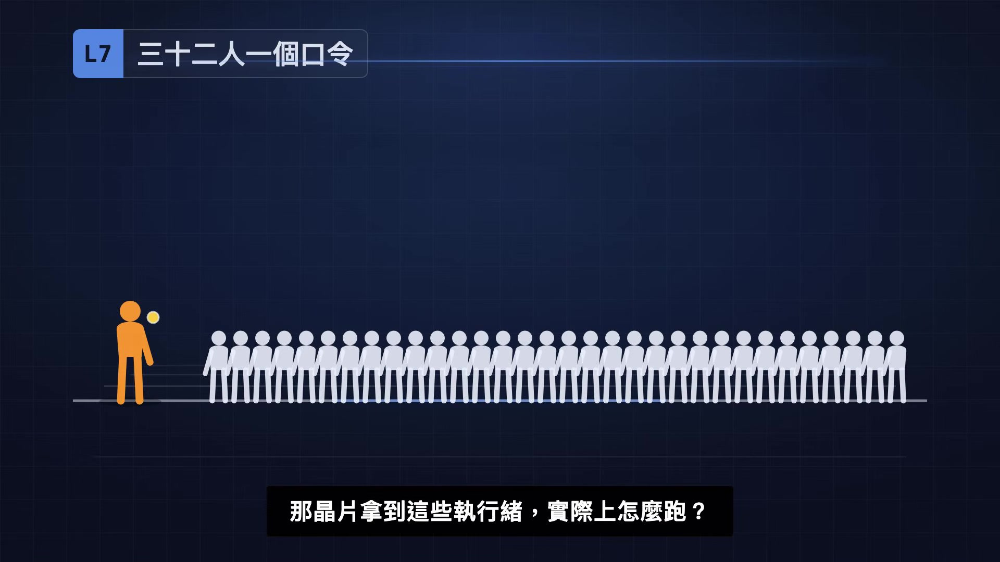

**逐字稿片段：** Kvon拿NVIDIA的E100來說明 案體會把編號連續的32條執行序綁成一組 這一組叫Warp 中文可以叫執行敘述 你可以把它想成操場上排成一列的32個人 大家聽同一個口令 口令喊舉手 32隻手一起舉起來 案體每一拍都會檢查 這32條是不是剛好走到城市的同一行 如果是就用一道指令一起做完 如果有人走到別的地方 就是上一集講的分歧 只好先讓一部分人做 其他人等著 在一般的處理器上 是編譯器替你把8個排成一組 在GPU上你寫的城市看起來每條各自獨立 自己把它們湊成一組 Cabin說這樣NVIDIA又會想把一組改成64個 你的程式也不用重寫 口令解決了一列32個人怎麼一起動 那一整個執行區區塊呢

**話題推測：** 使用NVIDIA E100說明晶片如何執行執行序

---

## 00:03:40

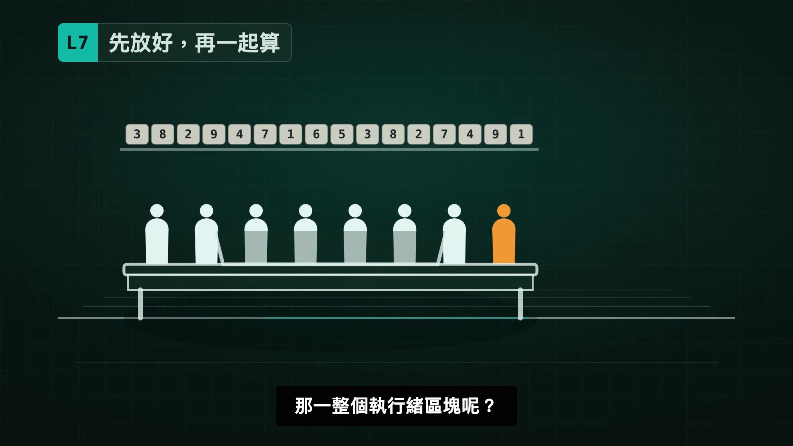

**逐字稿片段：** Cabin用了一個很常見的例子 把一排數字模糊化 每個輸出的數字 這原本位置和左右兩個鄰居的平均 就像修圖軟體把照片變柔和 如果每條執行區自己去讀 鄰居之間讀的東西大半重疊 同一個數字會被搬好幾次 所以Kuda給每個區塊一小塊自己的記憶體 叫Shared Memory 中文叫共享記憶體 一個區塊有128條執行序 要算128個輸出 需要130個輸入 大家先分工 每人搬一個數字進來 搬完之後還有一行關鍵的程式 叫Sync Threads 意思是全員到齊才能往下走 要是拿掉這一行 跑得快的人會拿到還沒搬進來的數字 算出錯的答案 這是這集第一次碰到共用 大家要一起用同一份資料 就得先等所有人放好 那區塊跟區塊之間呢 這裡K1算了一個很驚人的數字

**話題推測：** 舉例說明數字模糊化應用，類似修圖軟體

---

## 00:04:27

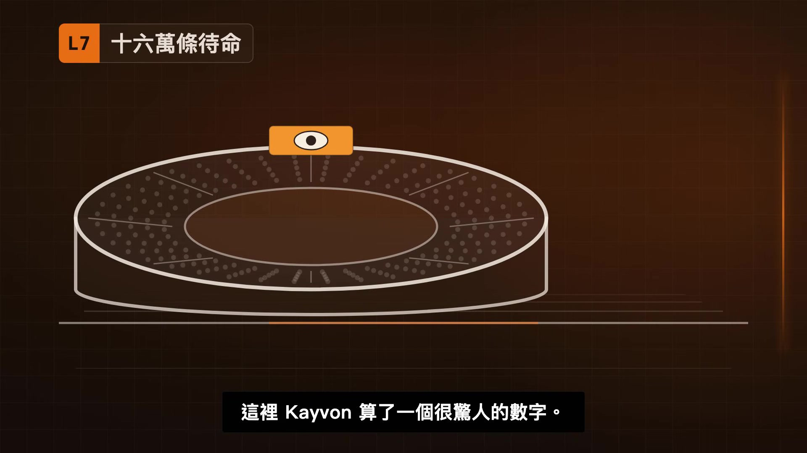

**逐字稿片段：** 把V100上每個核心能掛的WAP全部乘起來 一顆晶片上同時有163,000條執行序代名 這些執行序不會同時再算 可是他們都在晶片上排好了隊 誰卡住在等資料 又換下一個上場 這就是上一集洗衣機那一招 放大到十幾萬倍 這麼多區塊 由誰來發 晶片最上面有一個排成器 看哪個核心還有空間 就把下一個區塊丟過去 所以CUDA定了一條規矩 同一個區塊的執行序 保證同時待在同一個核心上 你互相等 不同區塊之間 你不能假設誰先跑 如果你寫一個區塊 一四指跑得動一個 他就會永遠等下去 16萬條執行序擺在那裡 下一個問題就來了 你手上真的有這麼多事可以教給他嗎

**話題推測：** 提到V100晶片上同時有163,000條執行序待命

---

## 00:05:08

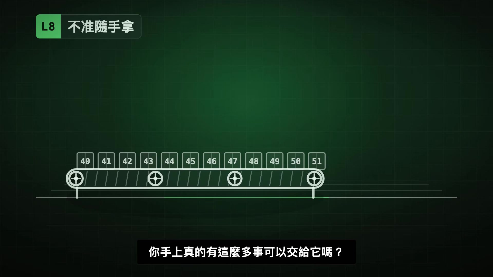

**逐字稿片段：** Kevin下一堂課一開頭就說 想把一顆GPU用滿 你大概要準備20萬件以上的工作 這種方式叫資料平行 你不再去想開幾條執行序 而是把整堆資料當成一個整體 只對它做幾種固定的操作 他把這一整堆資料叫Sequence 中文叫序列 就是一排有順序的東西 你寫過NumPy或PTorch的話 其實天天都在這樣做 兩個大陣列中間放一個加號 你不會去想執行序 一般的陣列你可以隨時伸手拿第43格 序列不讓你這樣做 你只能透過他提供的操作去碰資料 很多先後關係 就是在你隨手拿別人那格的時候出現 不讓你亂拿就不會有人互相等 第一種操作最簡單

**話題推測：** 下一堂課開始：如何用滿GPU，需要20萬件以上工作

---

## 00:05:45

**逐字稿片段：** 叫Map 中文叫Insert 你給他一個函式和一個序列 他把函式套在每一個元素上 產生一個一樣長的新序列 函式就是一臺小機器 放一個東西進去出來另一個東西 例如函式是加10 那整排數字就每個都加10 Kevin請大家站在寫Map的人那邊想 要讓他平行跑 你有把握嗎? 全班都說有 因為那個韓式只看得到自己手上那一個元素 他根本碰不到隔壁 想製造先後關係都做不到 你說清楚要做什麼 至於切成幾段開幾條執行序 那是寫Map的事 K文還說 我們在這門課寫過的程式 幾乎每一字都是Map 只是之前沒有叫他這個名字 這就跟前面那個口令一樣 每個人只管自己手上的東西 所以口令一喊 大家可以同時動

**話題推測：** 介紹Map（映射）操作

---

## 00:06:27

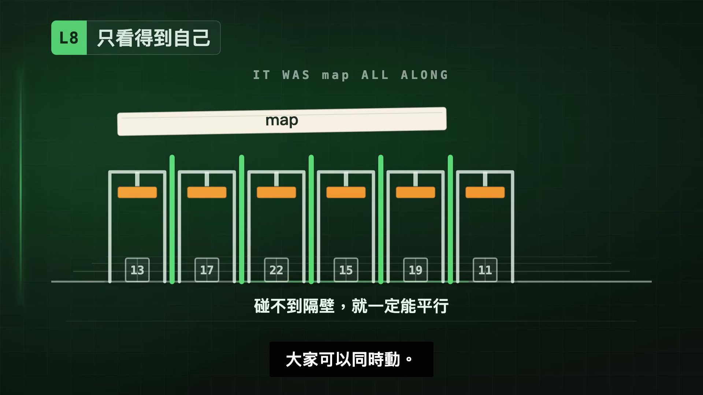

**逐字稿片段：** 第二種操作叫Fold 中文可以叫折疊 他把一整排東西合成一個值 最常見的就是加總 那FOLD能不能平行 臺下有人馬上說 可以 第一堂課那16張紙不就是這樣 分幾段各自加 再把小記加起來 可是另一位同學舉手說 不一定 問題出在 你教給FOLD 函式不一定是加法 平行的做法會先各算各的 再把結果合起來 等到TOTAL改變了 先算哪兩個 加法沒關係 怎麼分組 答案都一樣 可是如果換成減法

**話題推測：** 介紹Fold（折疊）操作，將一排東西合成一個值

---

## 00:06:56

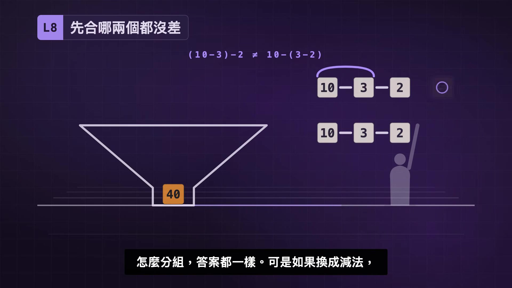

**逐字稿片段：** 10-3再減2 答案是5 10減掉3-2的差 答案卻變成9 K-1說

**話題推測：** 舉例減法操作，說明結合率對平行化的影響（10-3-2 vs 10-(3-2)）

---

## 00:07:02

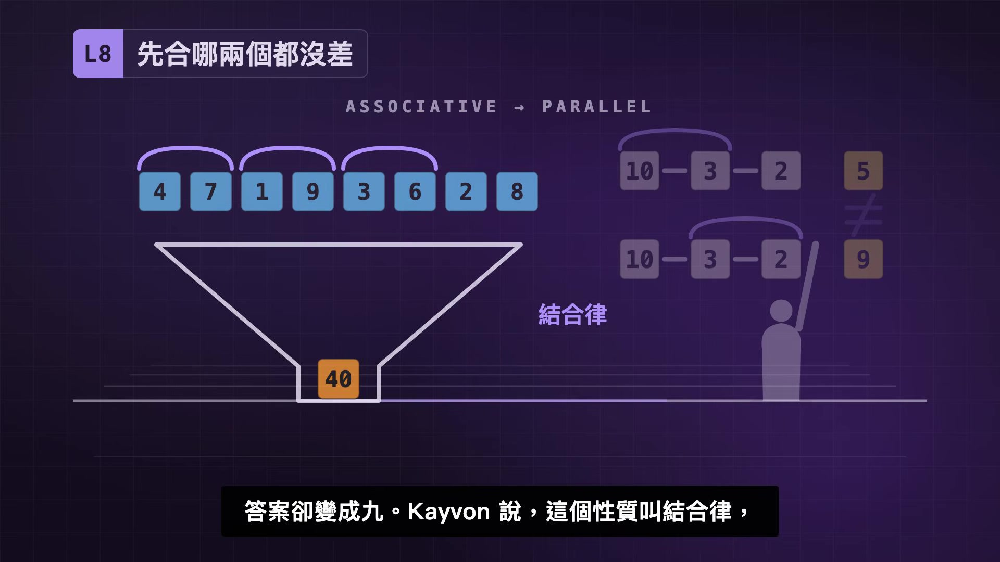

**逐字稿片段：** 這個性質叫結合率 意思是先合 哪兩個都沒差 還是有結合率 Fold就能平行 沒有的話 你就只能乖乖從頭算到尾 有意思的是 它不需要交換率 前後順序不用換 只是分組可以變

**話題推測：** 介紹結合率（Associativity）的概念

---

## 00:07:14

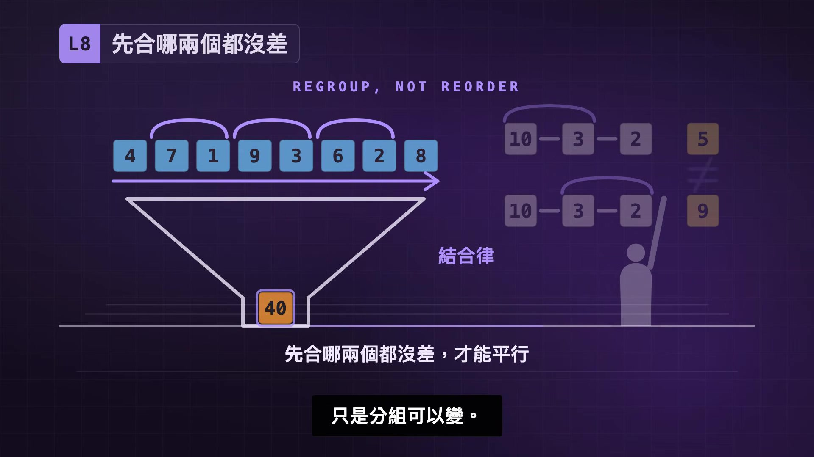

**逐字稿片段：** 第三種叫Scan 中文叫前最合 名字有點硬 但你天天都在用

**話題推測：** 介紹Scan（前最合）操作，計算每一步的小計

---

## 00:07:18

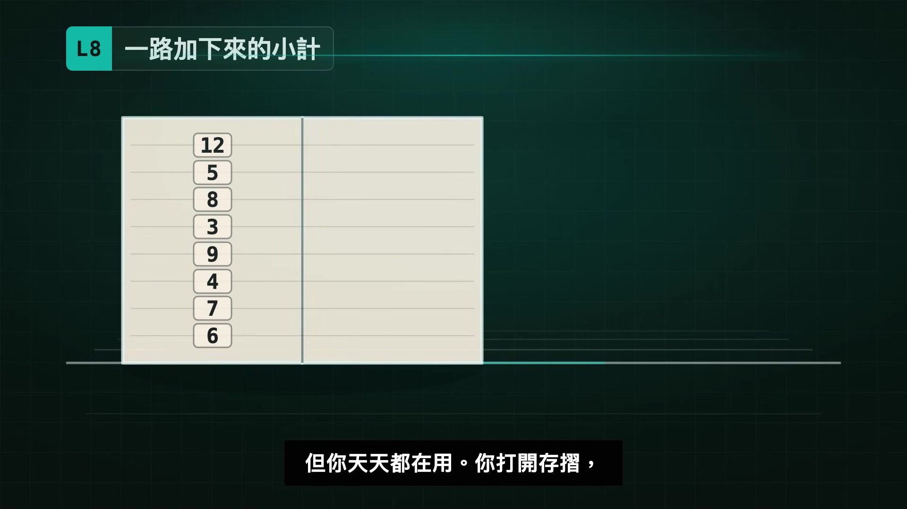

**逐字稿片段：** 你打開存摺 每一行都有一個餘額 那個餘額就是從第一筆 一路加到這一筆的總和 Scan做的就是這件事 它不只給你最後的總和 還給你每一步的小計 問題是 它看起來完全沒辦法平行 每一行都得等上一行算完 有同學說 先把前半段的總和算出來 後半段每一格加上它就好 他順著這個想法往下走 最後給出一個分兩趟的做法 頭一趟往上 兩箱家像一棵倒過來的樹 一層一層把小計往上合 第二趟往下 把合好的總和一路分回每一格 乘數很少 資料多一倍才多一層 總共做的加法 大約是從頭加到尾的兩倍 他說這個版本會是第三份作業的暖身體 你們要自己用酷打寫一次

**話題推測：** 舉例存摺餘額說明Scan的應用

---

## 00:07:59

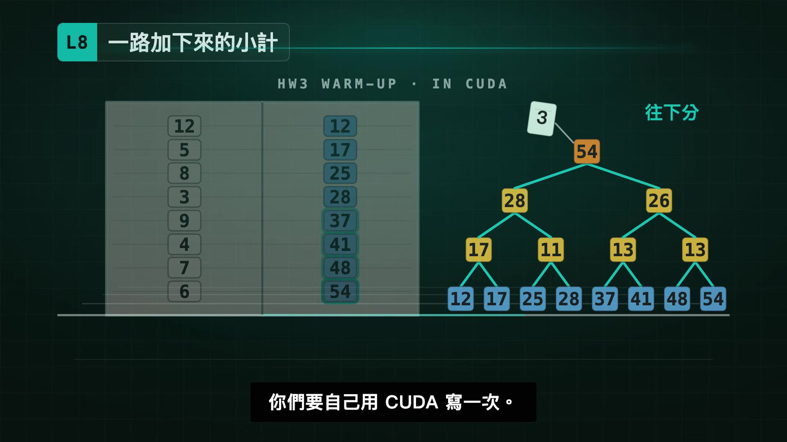

**逐字稿片段：** 故事到這裡有個轉折 真的放到GPU上 K本反而選了另一個看起來比較浪費的版本 浪費的版本很直接 每一步都讓每個人 跟前面某個人相加 32個數字 只要5步就做完 只是有很多加法是重複的 省工的版本加法比較少 卻要往上走5步 再往下走5步 一共10步 你猜哪個快 答案是浪費的那個 原因是32個人 聽的是同一個口令 你省下來的那些加法 並不會讓誰去做別的事 他們只是站在旁邊等 少做的工作換不到時間 所以他的結論是 要看你的機器長什麼樣子 只有兩個核心 就把資料切成兩半 各自從頭加到尾 最簡單的最快 有幾千個獨立的核心 就用省工的那棵樹 在同一個口令底下 就讓大家一起多做一點

**話題推測：** Scan算法的轉折：GPU上「浪費」的版本可能更快

---

## 00:08:39

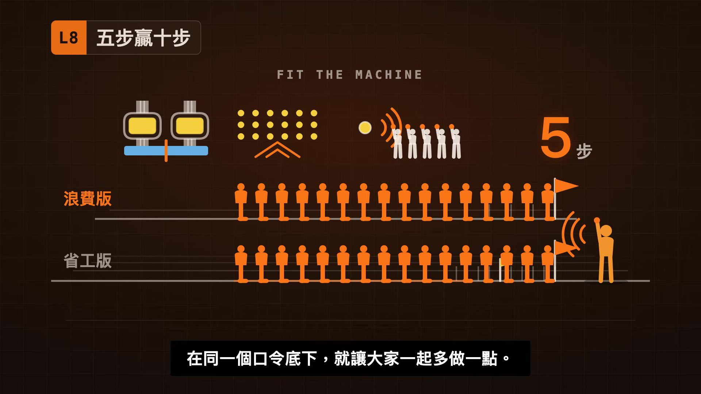

**逐字稿片段：** 最後Kevin出了一道題 你在做星系或流體的模擬 畫面上有幾百萬個粒子 空間切成四乘四 一共16個格子 你要做一張表 列出每個格子裡有哪些粒子 最直覺的寫法是 每個粒子算出自己在哪一格 然後拿一把鎖 把自己加進那一格的名單 臺下一起挑毛餅 10萬條GPU行去搶 用一把鎖 大家都在排隊 每一格一把鎖 也只有16把 先用一次Map 讓每個粒子算出自己的格子號碼 接著把所有粒子照格子號碼排序 同一格的自然排在一起 最後再用一次Map 每個人看自己跟左邊那個是不是同一格 不一樣的地方 就是一格的開頭 三步做完 沒有任何人碰同一份東西 看 問題從來不是分工 是那把大家都要搶的鎖

**話題推測：** 新問題：星系或流體模擬中，將粒子分配到16個格子

---

## 00:09:23

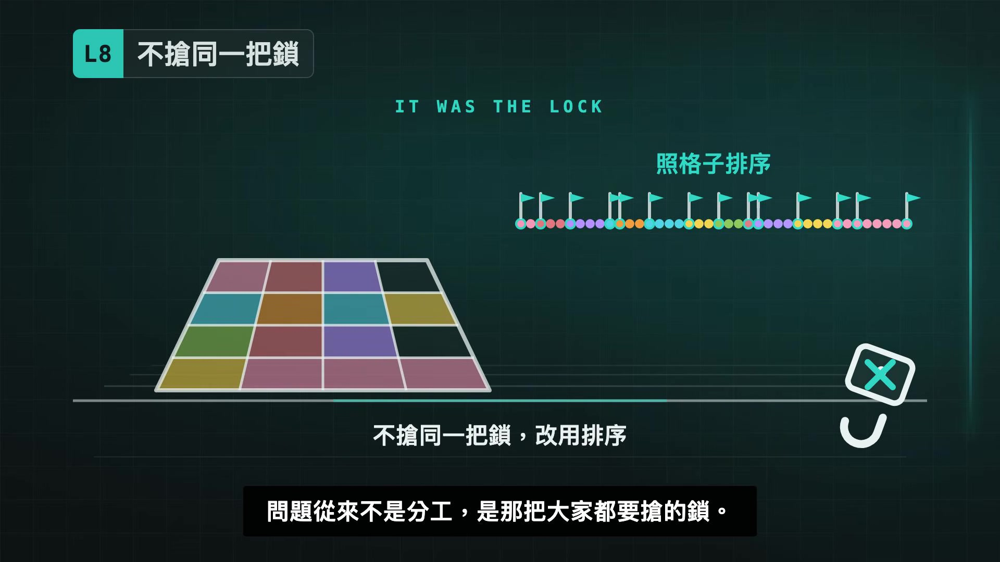

**逐字稿片段：** Keven那堂課最後提到一個叫Spark的系統 整個建立在同一個想法上

**話題推測：** Kevin課程最後提到Spark系統

---

## 00:09:28

**逐字稿片段：** 下一堂課 講臺換成另一位教授 Cornel O'Cotton 他把這個想法帶出一顆晶片 帶到一整座機房 為什麼要用一整群電腦 他舉了一個例子

**話題推測：** 教授Kuno O'Cotton接手講課，將概念從晶片擴展到機房

---

## 00:09:36

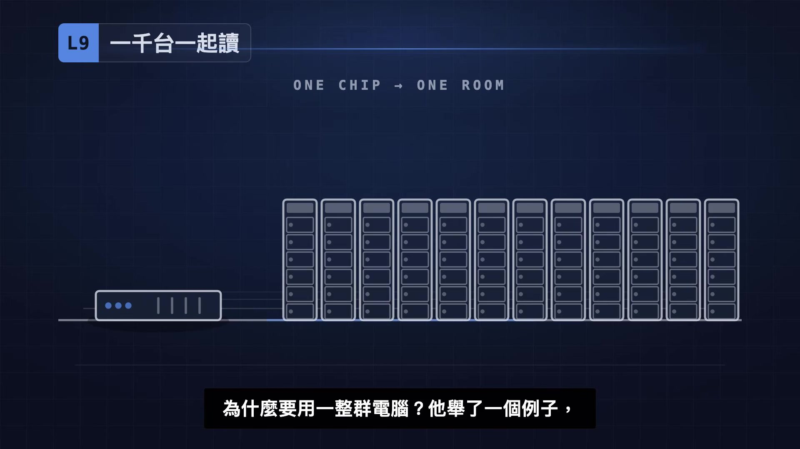

**逐字稿片段：** 像Facebook那樣的大網站 紀錄檔 動輒 幾百兆位元主 一臺電腦從硬碟一路讀下去 光是讀完就要23天 換成1000臺一起讀 就只要33分鐘 瓶頸不再算在硬碟送資料的速度 這個叫速度輸出頻寬 他還提到一位好朋友

**話題推測：** 舉例Facebook紀錄檔幾百兆位元組，一臺電腦讀23天，1000台讀33分鐘

---

## 00:09:51

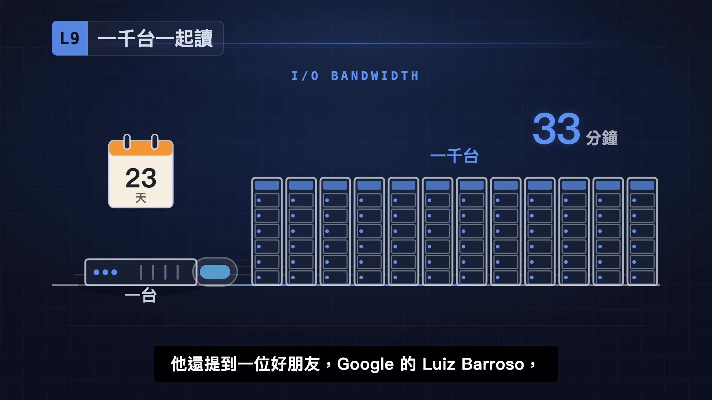

**逐字稿片段：** Google的Louis Barroso 他把整座倉庫那麼大的機房 當成一臺電腦來設計 Barroso前不久過世了 1000臺電腦放在一起 麻煩也跟著來 Campio說

**話題推測：** 提到Google的Louis Barroso將機房當成一臺電腦設計

---

## 00:10:01

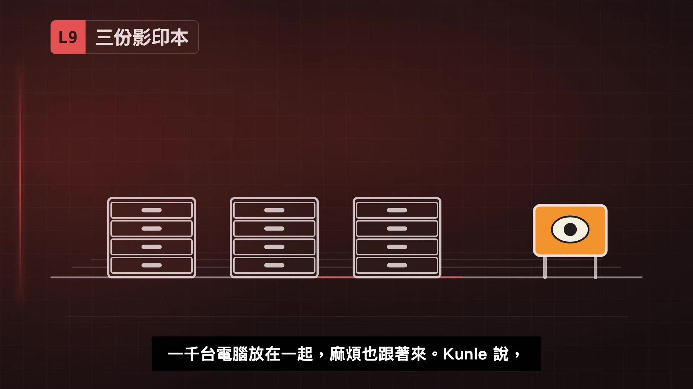

**逐字稿片段：** 就算一臺伺服器平均25年才壞一次 你把1000臺擺在一起 差不多每個小時就有一臺出狀況 所以第一件事是資料不能丟 做法叫分散式檔案系統 Google最早做的叫GFS 後來有開放原始碼的版本叫HDFS 他把一個巨大的檔案切成一塊一塊 每一塊都複製好幾份 放在不同的機櫃裡 機櫃就是一整排疊起來的伺服器 頂上的網路設備一壞 整排都會斷線

**話題推測：** 大型機房伺服器故障率統計：1000台機器每小時出狀況

---

## 00:10:25

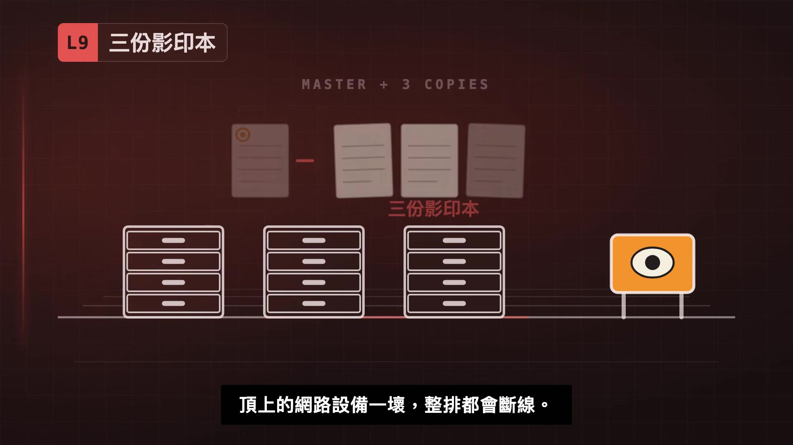

**逐字稿片段：** 這一集接下來會一直用到一個畫面 影印本 正本只有一份 為了保險 你印了三份放在三個不同的抽屜 這個抽屜打不開 你還有別的可以拿 另外有一臺總管的機器 記著每一份影印本放在哪裡 要讀資料的人先問他 再直接去抽屜拿 資料保住了

**話題推測：** 引入「影印本」類比，貫穿後續講解

---

## 00:10:41

**逐字稿片段：** 接下來要算 Conto出了一道很生活的題目 假設CS149 紅到大家都想來修 課程網站的瀏覽紀錄 多到要放在好幾臺機器上 你想知道同學都用什麼手機在看

**話題推測：** 新題目：分析CS149課程網站瀏覽紀錄，統計手機使用率

---

## 00:10:52

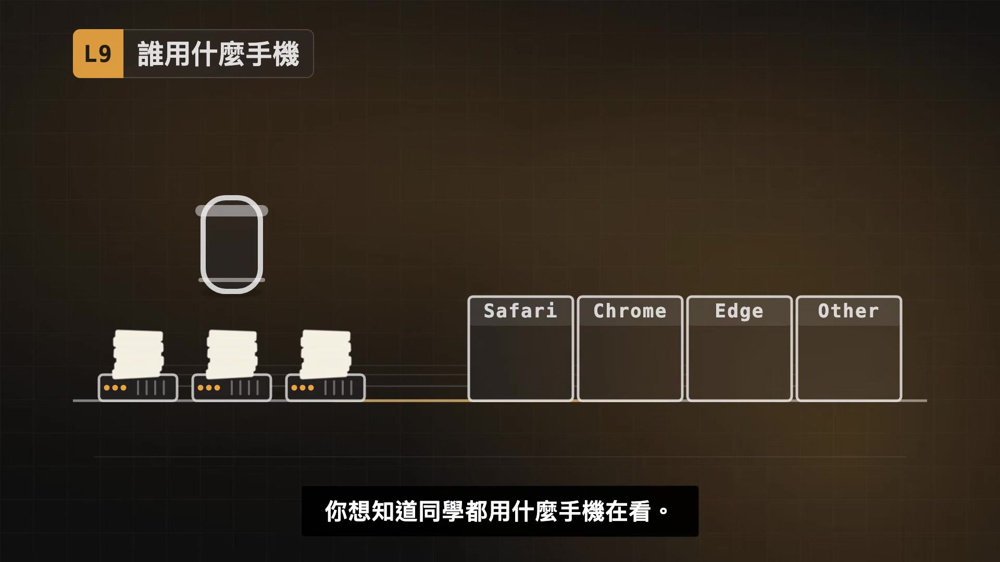

**逐字稿片段：** 他用的方法叫MapReduce 你只要寫兩個小函式 一個叫Mapper 每一行紀錄交給他 他看看是不是手機 是的話就記一筆 例如Safari加1 另一個叫Reducer 同一個鍵的所有數字交給他 他負責加總 鍵就是分類的標籤 中間還有一步你看不到 但很貴 系統要把所有機器上Safari的那幾筆 全部送到同一臺機器上

**話題推測：** 介紹MapReduce方法，包含Mapper和Reducer函式

---

## 00:11:12

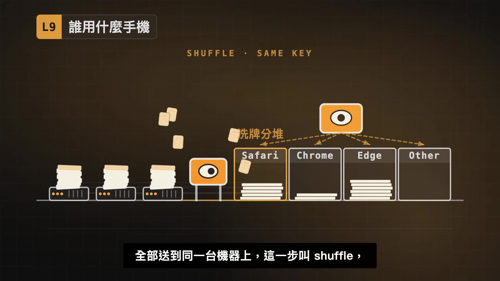

**逐字稿片段：** 這一步叫Shuffle 意思是洗牌 重新分堆 Map要放在哪臺機器跑 早年網路很慢 所以資料在哪裡就在哪裡跑 程式搬過去 比資料搬過來便宜 又回到上一集那句話 真正貴的是搬 Redri就是撐得住一千臺機器 靠的是一個很小的性質 Count1全搬 Map還有什麼重要的地方 有同學答出來 他不改自己的輸入 原本那一份紀錄 還是原封不動 這也讓壞掉變得不可怕 每臺機器會定時送一個訊號給總管 意思是我還活著

**話題推測：** 解釋MapReduce中的Shuffle（洗牌）步驟

---

## 00:11:43

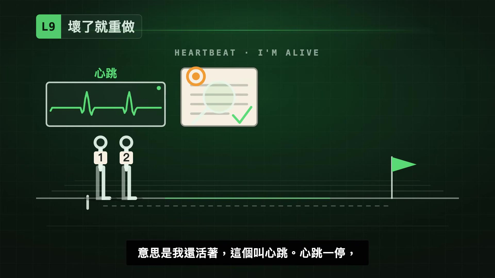

**逐字稿片段：** 這個叫心跳 心跳一停 總管就知道他掛了 把他手上的工作 交給另一臺 有同一份影印本的機器重做一次 因為輸入沒被改過 重做幾次答案都一樣 還有一種麻煩 機房裡的機器新舊不易 舊得特別慢大家都在等他 解法很直接 同一份工作再派給另一臺 兩臺一起跑 誰先做完就用誰的 另一臺直接停掉 你可能會覺得浪費 可是比起一千臺一起等一臺 這點浪費很便宜 說穿了 只要大家不去改共用的那一份 出事就能重來

**話題推測：** 解釋機器「心跳」機制來偵測故障，以及如何重做工作

---

## 00:12:10

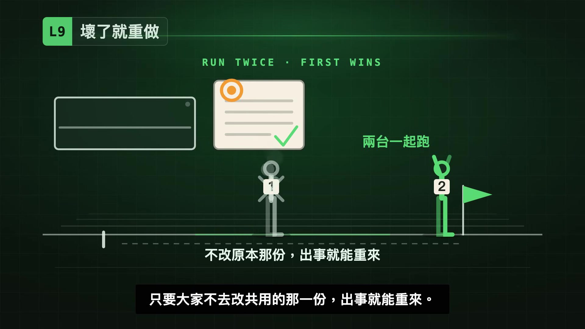

**逐字稿片段：** MapReduce有一個大缺點 每做完一輪Map和Reduce 結果都要寫回分散式檔案系統 下一輪再讀出來 如果你的演算法要一直重複

**話題推測：** 指出MapReduce的缺點：每輪結果需寫回硬碟

---

## 00:12:18

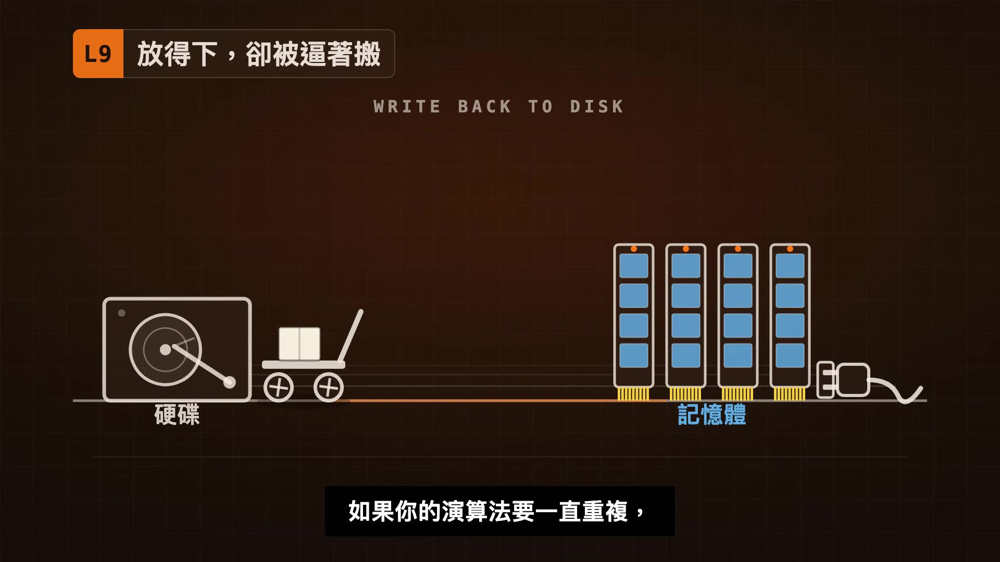

**逐字稿片段：** 例如Google最早拿來替網易排名的PageRank 要跑很多輪 每一輪都在硬碟和記憶體之間來回搬 那資料放得進記憶體嗎 他給大家看一篇2011年的論文 標題很直接 資料中心裡的硬碟區域性已經不重要了

**話題推測：** 舉例Google PageRank演算法需要多輪迭代，MapReduce效率低

---

## 00:12:31

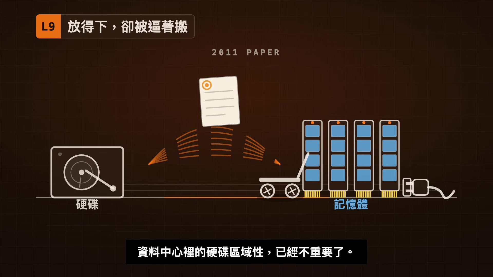

**逐字稿片段：** 裡面有一張表用的是2009年Facebook的資料 一臺機器只要64GB的記憶體 就放得下97%的常用資料 所以問題不是放不下 是MapReduce這套寫法 逼你每一輪都把東西送回硬碟 放在記憶體當然快 可是記憶體一斷電就沒了 這就是下一個系統要解決的事 Spark就是為這件事做的 它的核心叫RDD 中文叫彈性分散式資料集 你只要記得它的三個特點 有順序 只能讀不能改 而且只能從別的RDD或硬碟上的檔案編出來 先從檔案讀出每一行 就是第一個RDD 挑出手機的那幾行 變成第二個 再挑出Safari的 變成缸 第三個 最後數一數又幾筆 每一步都產生新的一份 舊的那份從來沒被改過

**話題推測：** 展示2009年Facebook資料，一台機器64GB記憶體能放97%常用資料的表格

---

## 00:13:13

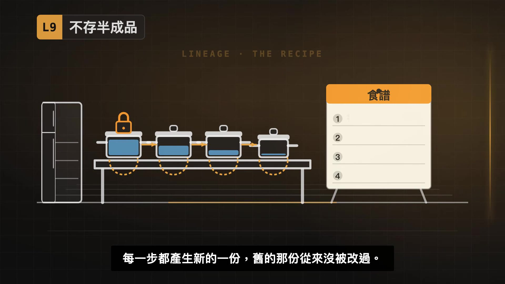

**逐字稿片段：** 這一連串步驟叫Lineage 中文叫血統 意思是這份資料是怎麼一路變出來的 我覺得更像一張食譜 你不必把每一道半成品都冰進冰箱 也就是寫回硬碟 只要把它們放在爐臺上 也就是記憶體 再把食譜記好 萬一哪一鍋打翻了 照食譜從頭再做一次就好 能這樣做是因為原料沒有被動過 同一份食譜 做幾次都是同一道菜 Spark讓一整座機房變成一臺電腦

**話題推測：** 解釋RDD的Lineage（血統）概念，像一張食譜

---

## 00:13:37

**逐字稿片段：** 下一堂K版回來 把鏡頭拉回一顆GPU 看他現在最常被拿去做的事 跑神經網路 他先把神經網路講得很樸素

**話題推測：** Kevin重新回到講台，討論GPU最常用於神經網路

---

## 00:13:45

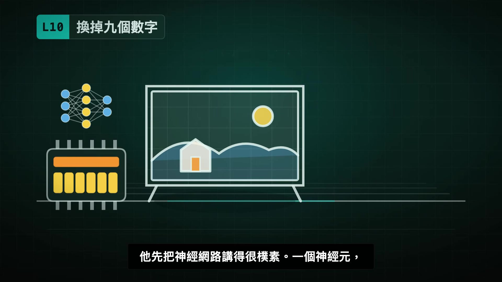

**逐字稿片段：** 一個神經元 說穿了就是拿一排輸入 跟一排權重做點積 也就是對應的數字相乘再加起來 最後跟零比一比 取比較大的那個 權重就是一排跳好的數字 很多神經元疊成一層一層 就是深度神經網路

**話題推測：** 解釋神經元和深度神經網路的基本構成

---

## 00:13:58

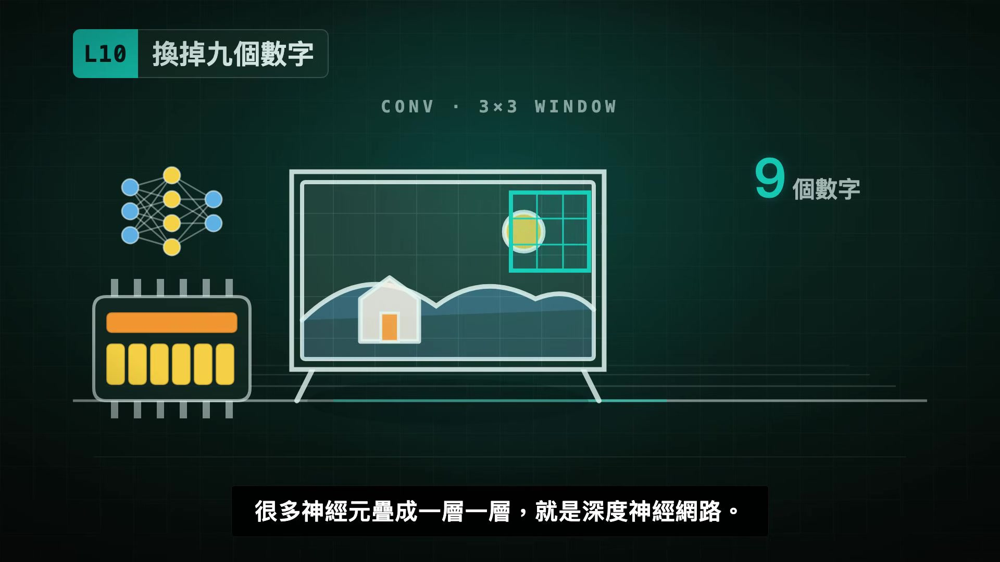

**逐字稿片段：** 引向你最常見的一種運算 叫卷積 它用修圖來說明 每個輸出的點 是原本那個點 跟周圍八個點的 平均九個數字 各成九分之一 整張圖就變模糊了 可是隻要把這九個權重換掉 有正有負 同一段程式就不再是模糊 而是在找邊緣 找橫的線或直的線 神經網路做的 是讓電腦自己學出這些權重 在談怎麼算快之前 可以往前提醒一件 很多做系統的人會忽略的是

**話題推測：** 介紹卷積運算，並用修圖模糊化與找邊緣說明

---

## 00:14:23

**逐字稿片段：** 要讓神經網絡變快 有三條路 頭一條跟這門課無關 是設計更好的網絡 他拿幾年間 陸續出來的影像網絡來比 準確度差不多 可是需要的權重和計算量 在大約四年裡少了25倍 硬體不可能在四年裡快25倍

**話題推測：** 加速神經網路的三條路徑

---

## 00:14:37

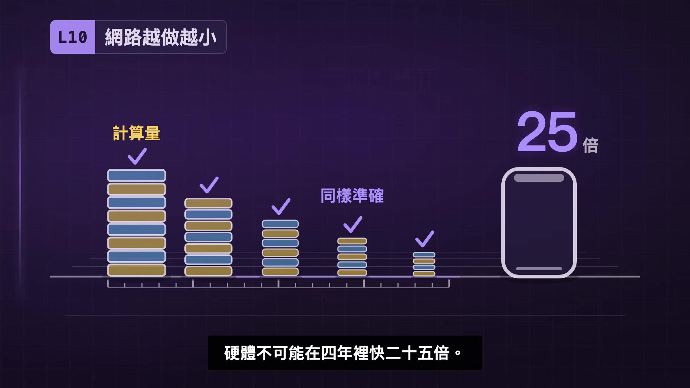

**逐字稿片段：** Google為了讓網絡塞進手機 有人花了兩年 一直調濾金要幾個 要疊幾層 最後做出一個叫 MobileNet的網絡 他說 現在的大型語言模型也一樣 先做出一個夠好的工程師 接著就會想辦法把它縮小 所以如果你只盯著 今天最紅的那個模型 拼命最佳化 一年後可能整個方向都錯了 做系統的人 也得跟著演算法走

**話題推測：** Google為手機設計MobileNet，調整濾鏡和層數

---

## 00:14:59

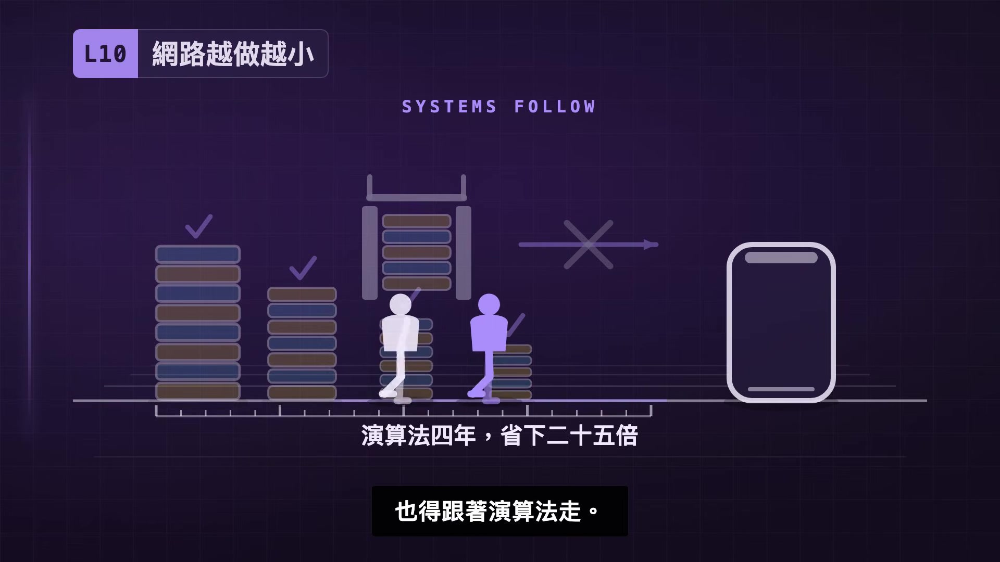

**逐字稿片段：** 第二條路 才是這門課的主場 網路定下來了 要讓他在手上的晶片跑快 K-Bone調了一招很常見的做法

**話題推測：** 第二條路：如何在現有晶片上加速網路運算

---

## 00:15:06

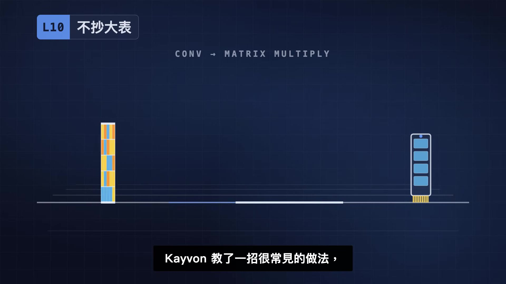

**逐字稿片段：** 把卷積變成矩陣乘法 矩陣就是一張排好的數字表格 矩陣乘法就是兩張表格 交叉相乘再相加 為什麼要變 因為世界上已經有人把 矩陣乘法做到極致 你邪不贏他們 做法是這樣 每個輸出的點需要周圍9個輸入 那就把這9個數字超成一橫排 每個輸出點一排 排成一張大表 再跟權重相乘 問題也跟著出現 同一個輸入點會被超近好幾排 整張表比原本的圖大了9倍 記憶體一下就被塞滿

**話題推測：** 將卷積轉換成矩陣乘法來加速

---

## 00:15:33

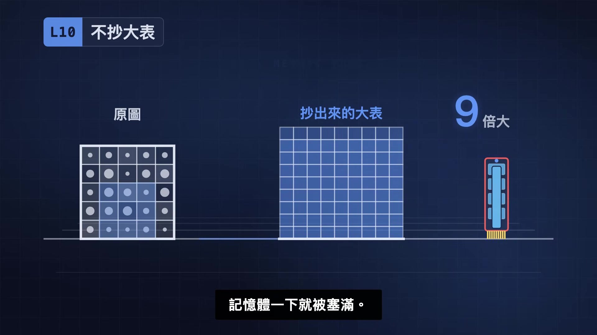

**逐字稿片段：** 所以比較新的做法叫影視矩陣乘法 程式照著矩陣乘法的樣子跑 卻從來不把那張大表真的超出來 要用到哪一格 就當場算出它在原圖的哪個位置 直接去拿 那矩陣乘法本身要怎麼寫才快

**話題推測：** 介紹「影視矩陣乘法」，不實際建立大表，即時計算

---

## 00:15:46

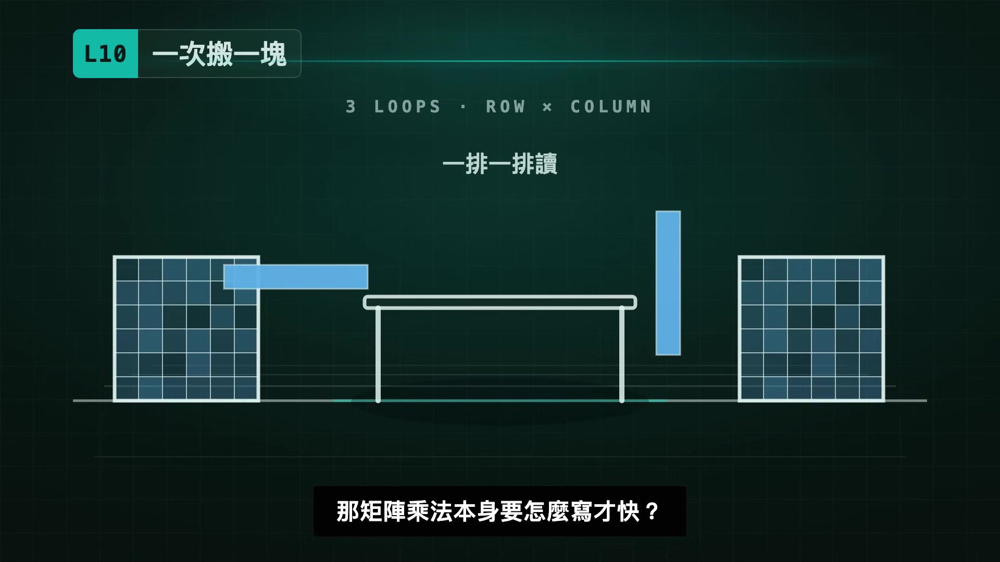

**逐字稿片段：** 最簡單的寫法是三層迴圈每算一個答案 就讀一整稜牌和一整支牌 Kevin問大家這樣有什麼問題 答案是你讀了兩個數字才做一次乘加 這跟上一集那個只用到1%算力的加法是同一種情況 全都卡在半 可是矩陣乘法照理不該這樣 它要做的乘法比資料多很多 每個數字照理可以被用上很多次 解法叫分塊英文叫blocking 把大矩陣切成一塊一塊小方塊 大小剛好放得儘快去 一次拿兩塊進來 把這兩塊之間所有該做的乘法全部做完 再換下一塊 上一集那張書桌又回來了 你一次把兩疊搬上桌 全部用源再搬下一疊 他說你在C語言裡花15分鐘寫這兩個版本 矩陣夠大的話速度可以差到1000倍左右 一層算快啦

**話題推測：** 最簡單的三層迴圈矩陣乘法寫法問題（讀寫過多）

---

## 00:16:27

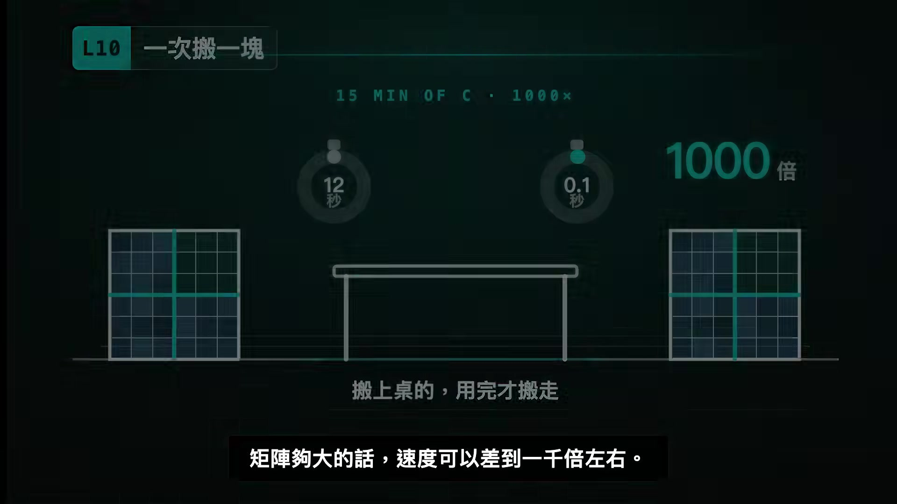

**逐字稿片段：** 還有一個更大的浪費 藏在層與層之間 每一層算圓 就把一大張結果寫回 顯示卡的主記憶體 下一步再整張讀回來 處理完再寫回去 這些小步驟幾乎沒有運算 全帶搬

**話題推測：** 指出層與層之間的大量資料搬移是浪費

---

## 00:16:38

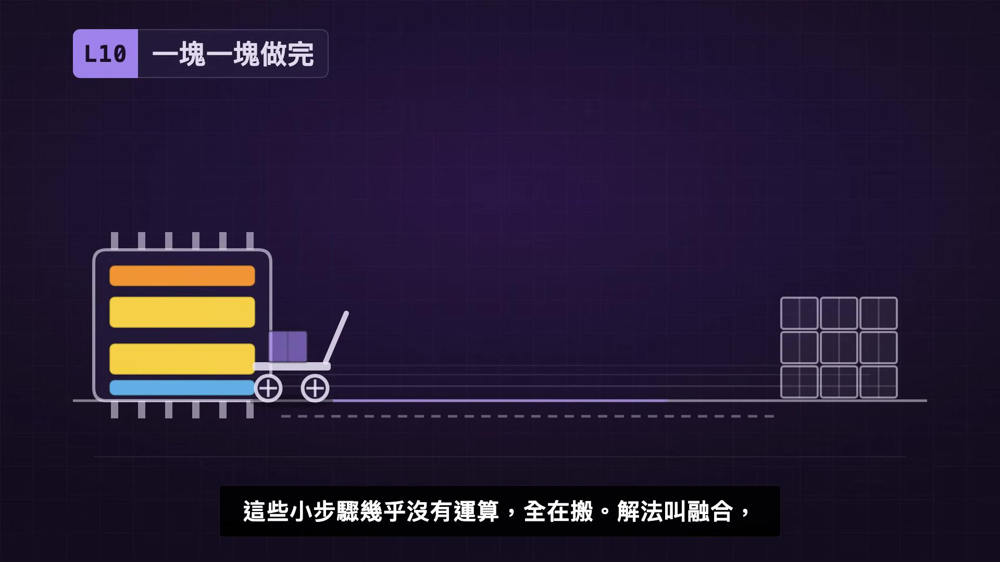

**逐字稿片段：** 解法叫融合 把連續幾步併成一步 結果還在晶片上就接著做完

**話題推測：** 介紹最佳化技術：融合（Fusion），連續步驟在晶片上做完

---

## 00:16:43

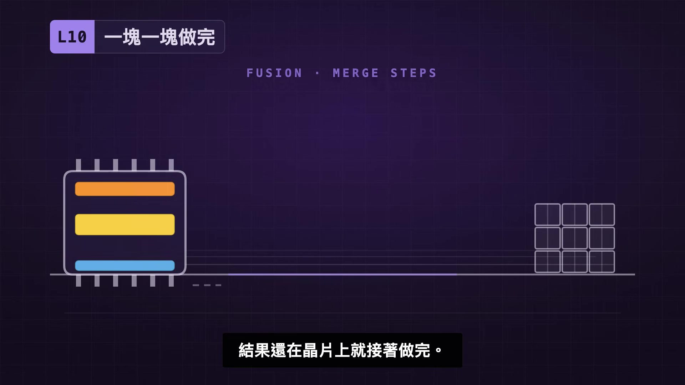

**逐字稿片段：** K-Ball說有一個很漂亮的例子 他就在一年半前在史丹佛發明 讓大型語言模型的注意力層快了很多 注意力層要把每個字 跟其他每個字配對打分數 一萬個字 就是一億格的表 每一橫排還要做一件事

**話題推測：** 舉例史丹佛發明的注意力層優化，加速大型語言模型

---

## 00:16:56

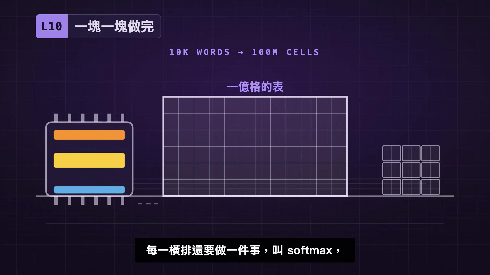

**逐字稿片段：** 叫softmax 他得先知道整排最大的那個數字 才能換算 可是有人發現 只要一邊算 一邊記著目前為止最大的數字和總和 就能一塊一塊做完 那張巨大的表 從頭到尾都不用存下來 能處理的長度 從八千個字 一路拉到三萬兩千個字 凱凡說 他相信GPT-4背後就有這種最佳化 最後Kvon問

**話題推測：** 提到softmax操作需要知道整排最大值

---

## 00:17:17

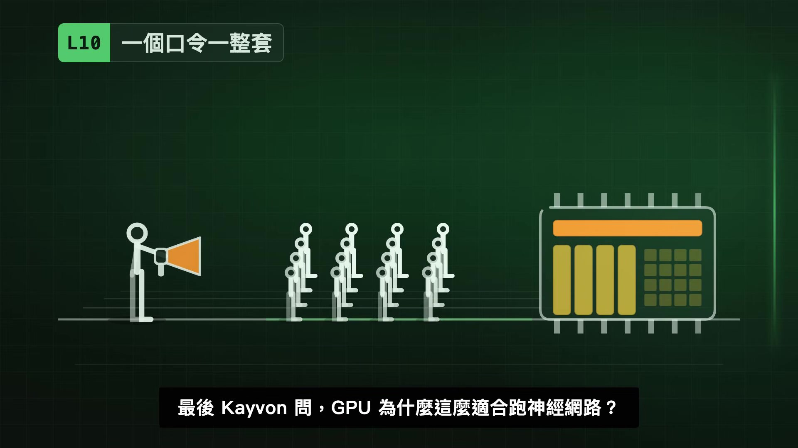

**逐字稿片段：** GPU為什麼這麼適合跑神經網絡 全班答得很快 平行度多 算術單元多 那他哪裡還不夠好

**話題推測：** 新問題：GPU為何適合神經網路，哪裡還不夠好？

---

## 00:17:23

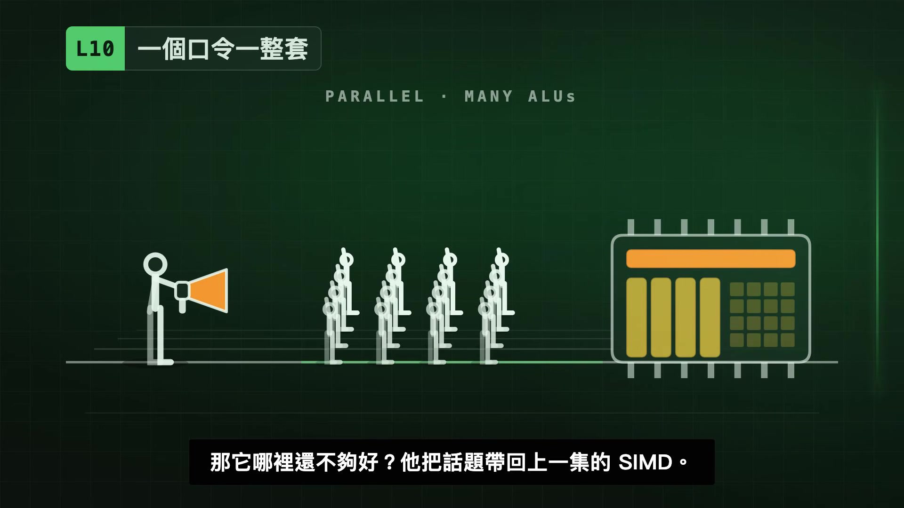

**逐字稿片段：** 他把話題帶回上一集的SIMD SIMD的道理是 讀一次指令 看懂一次指令 這些雜事的成本 貪給很多次運算 那何不走得更遠 NVIDIA自己估計

**話題推測：** 回顧SIMD原理，降低指令讀取和理解成本

---

## 00:17:33

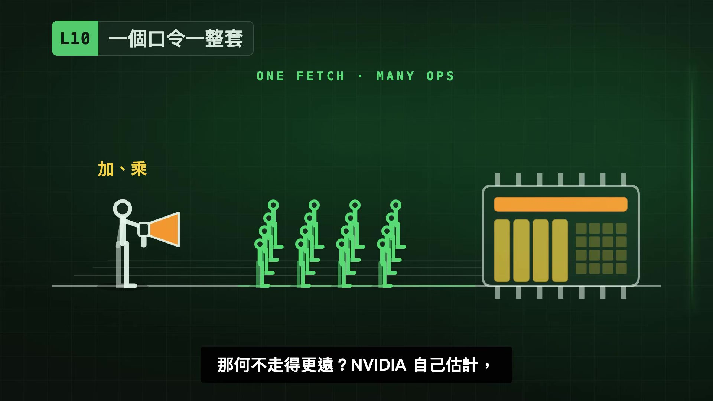

**逐字稿片段：** 如果只用一般的加法和乘法指令 去做矩陣乘法 能源效率比專門為他做的晶片 差2000倍 改成一道指令 就做完一個4x4的小矩陣乘法 差距就一下子縮到很小 NVIDIA的回應

**話題推測：** NVIDIA估計用通用指令做矩陣乘法，能效比專用晶片差2000倍

---

## 00:17:45

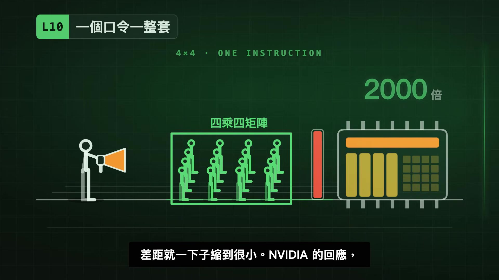

**逐字稿片段：** 是在GPU裡加了Tensor Core 中文叫張亮核心 名字聽起來很厲害 其實它就是一道專門做小矩陣乘法的大指令 你還記得那個口令嗎 以前一個口令是一個動作 現在一個口令就是一整套動作 只要你的運算寫得成矩陣乘法 尖峰算力一下子多了10倍以上

**話題推測：** NVIDIA的回應：在GPU中加入Tensor Core（張量核心）

---

## 00:18:02

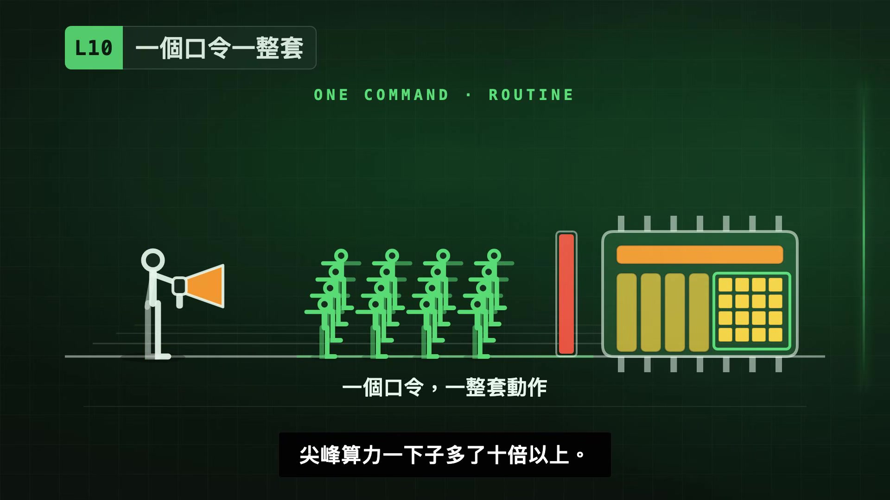

**逐字稿片段：** 下一堂課空流回到講臺 先把SPARK收尾 你還記得那張食譜嗎

**話題推測：** Kuno教授再次上台，總結Spark內容

---

## 00:18:06

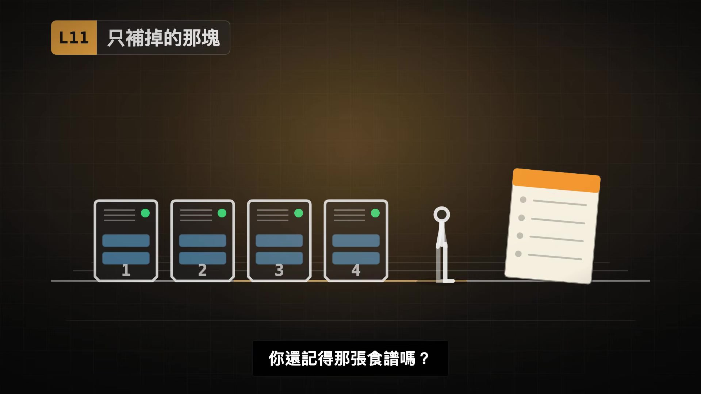

**逐字稿片段：** 它示範了一個機器當掉的情況 一串步驟正做到一半 一號機器突然掛了 他記憶體裡那兩塊資料全部消失 控控說 總管手上有那張食譜 也就是Lineage 他知道這兩塊是從硬碟上 拿幾份檔案 經過哪幾道步驟變出來的 原始檔案 在分散式檔案系統裡 有好幾份影印本 不會丟 所以照著食譜重做那兩塊就好 別的機器完全不受影響 食譜還有另一個好處 Spark看得懂每一步在做什麼 如果每一塊依賴前一步的同一塊 這叫載相依 他就能把幾步併成一步 中間結果根本不用存 這跟剛才GPU上的融合是同一招 反過來 像一鍵分組這種 要從每臺機器收資料的步驟

**話題推測：** Spark處理機器當機情況：利用Lineage食譜重做資料

---

## 00:18:43

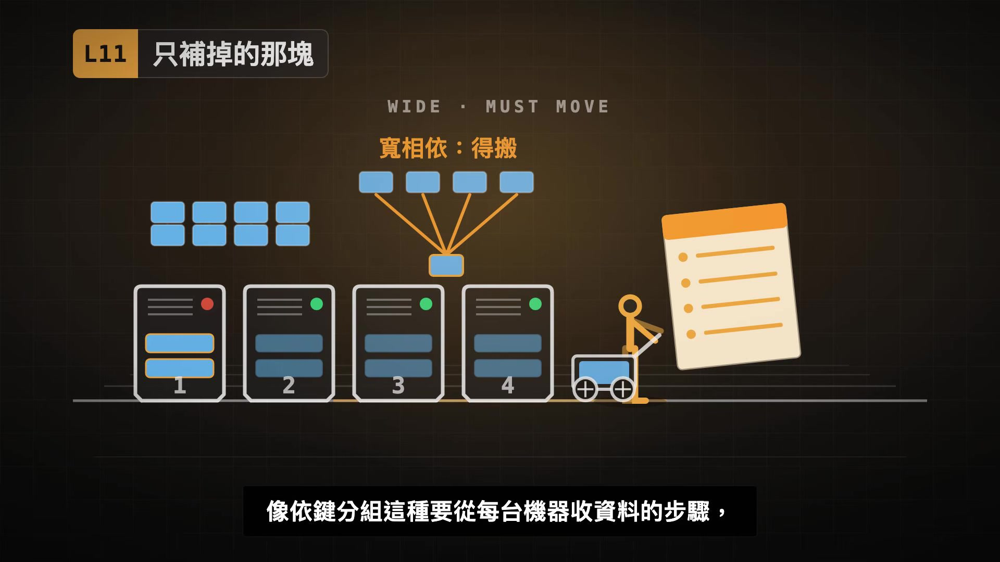

**逐字稿片段：** 叫寬箱一 就沒辦法秉持 嫩撈老實實的辦 Spark比起老的Hadoop 重複運算的每一輪 快了一個數量級以上

**話題推測：** Spark的「寬相依」（Wide Dependency）

---

## 00:18:50

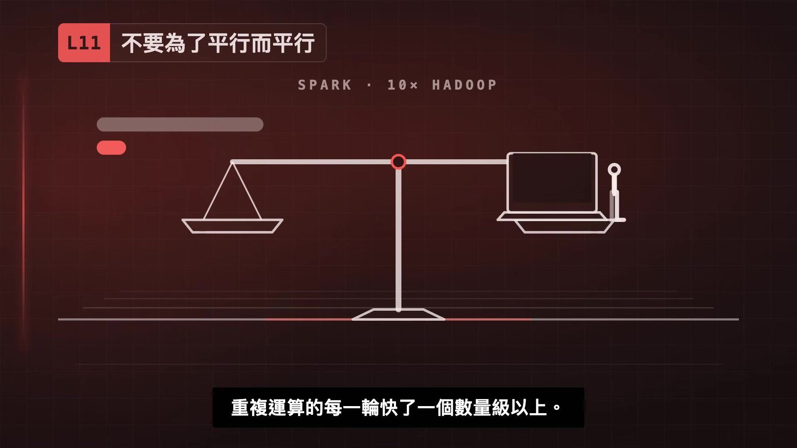

**逐字稿片段：** 只空口接著潑了一盆冷水 現在一臺大伺服器 就能裝到一兩TB的記憶體 很多研究拿Spark做實驗 資料其實只有幾GB 一臺機器就放得下 有一張表 比較了Twitter的社群關係圖 好20輪PageRank Spark用了128個核心 還比一臺電腦上的一條直行虛慢了兩倍 一位叫Frank McSherry的研究者講得很直接

**話題推測：** 對大數據系統研究潑冷水：單機效能有時更高

---

## 00:19:10

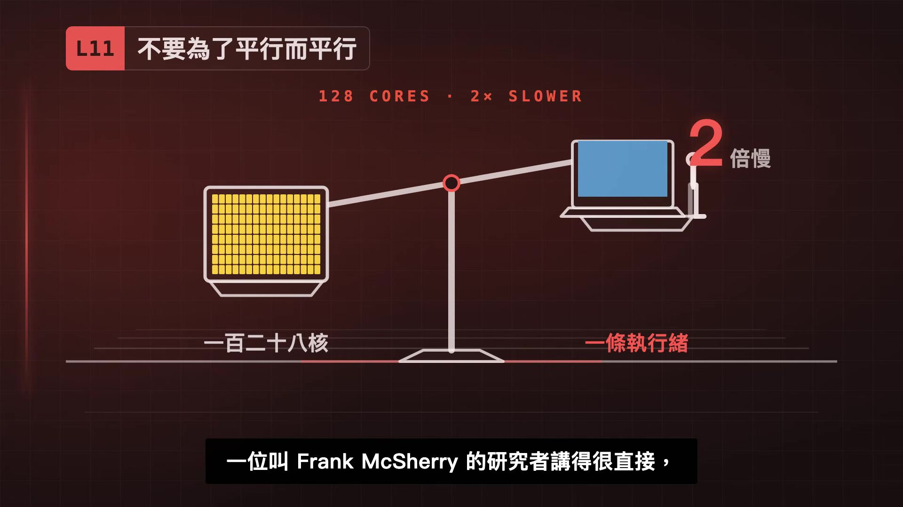

**逐字稿片段：** 他說大數據系統的研究 把可擴展性捧得比什麼都高 可擴展性就是機器加的越多跑得越快 意思是先造出一堆開銷 再想辦法省回來 Conco的結論很樸素 資料真的有幾百TB 你只能用分散式系統 資料不到1TB 一臺機器通常快得多 這跟上一集那句話是同一件事 不要為了平行而平行

**話題推測：** 提到研究者Frank McSherry對大數據系統研究的批評

---

## 00:19:29

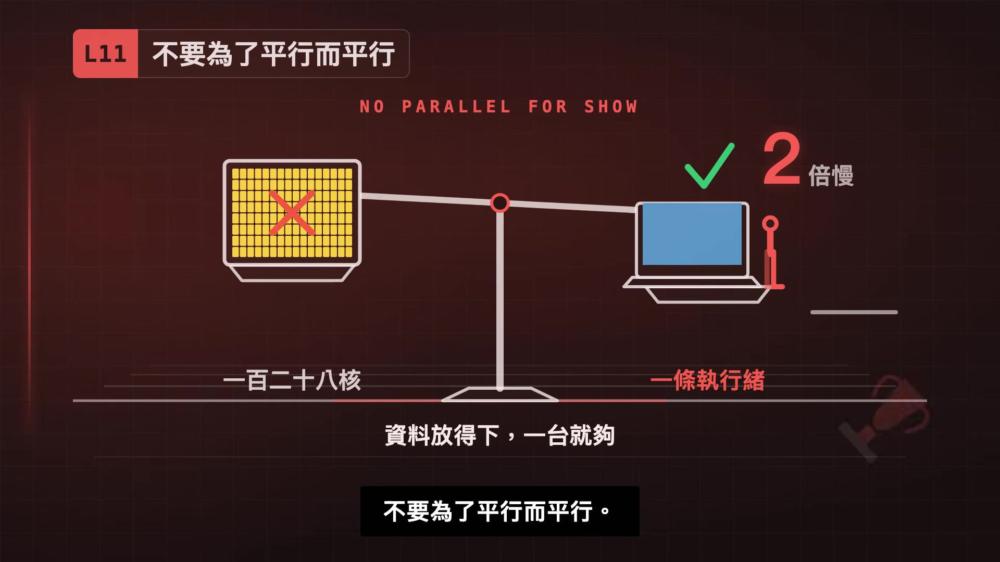

**逐字稿片段：** 接著Colo回到一顆晶片 進入這一集最核心的問題 學生用的那臺機器

**話題推測：** Colo回到單一晶片，進入本集核心問題：快取一致性

---

## 00:19:34

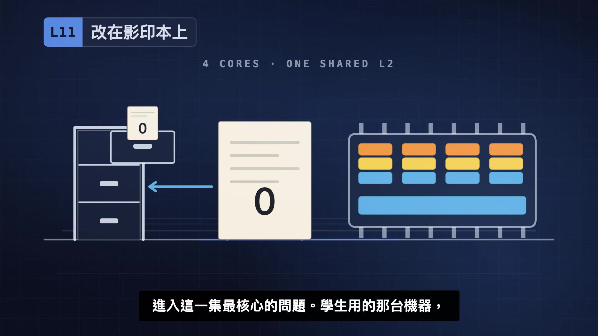

**逐字稿片段：** 每個核心有自己的小快取 四個核心 再共用一個比較大的快取 快取裡的每一格 除了資料 還貼著幾張標籤 一張叫tag 記著這一格 其實是記憶體的哪一段 另一張叫dirty bit 中文叫張衛元 意思是這一格被改過了 跟記憶體裡的不一樣 為什麼會不一樣 因為現在的快取 大多是寫回式的 你寫資料 只寫在快取裡 不急著送回記憶體 等這一格要被別人擠掉的時候 才寫回去 我們用影音本來看 記憶體是正本 快取是你手上的影音本 你直接在影音本上改字 改原在角落貼一張紅色便利貼 提醒自己正本還是舊的 一臺機器 只有一個人的時候沒問題 換成四個核心 四個人手上都有同一頁的影音本 事情就來

**話題推測：** 介紹四個核心共享快取的架構

---

## 00:20:12

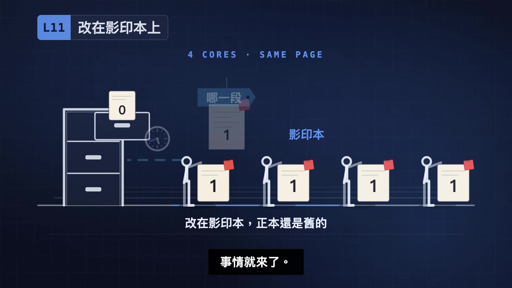

**逐字稿片段：** 康頭在臺上一步一步演給大家看 有一個變數X 一開始在記憶體裡是0 1號處理器讀它 影音一分到自己的快取 拿到的是0 2號也讀 也拿到0 1號把它改成1 改在自己的影音本上 3號去讀 記憶體還是0 所以他拿到0 接著他改成2 2號 這時候再讀 他自己手上那份還在 直接拿來用 讀到的是0 最後1號處理器的快取要騰出為止 把他手上那份寫回記憶體 記憶體變成1 你現在看看整個系統 記憶體說X是1 3號說是2 2號說是0 1號手上已經沒有了 同一個變數出現三個答案 有同學問 加鎖不就好了 他說不行 鎖只能讓大家輪流改 可是就算輪流 每個人還是改在自己的營運本上 別人手上那份照樣是舊的 問題不再強 在同一份資料 同時存在系統裡

**話題推測：** 逐步演示快取不一致的例子，變數X在不同核心有不同值

---

## 00:20:56

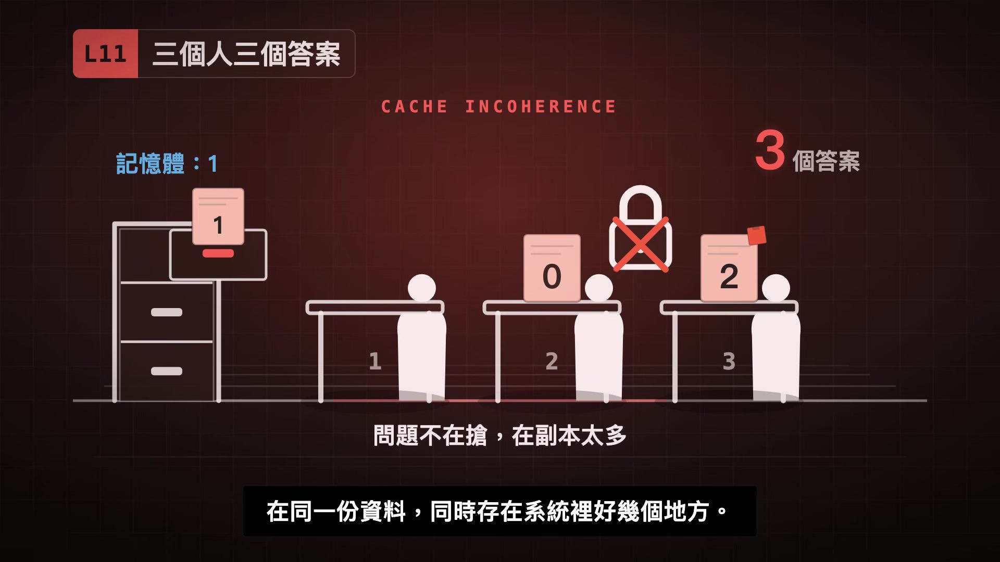

**逐字稿片段：** 好幾個地方 這種毛病叫快取不一致 那一致應該長什麼樣子

**話題推測：** 定義快取不一致（Cache Incoherence）問題

---

## 00:21:00

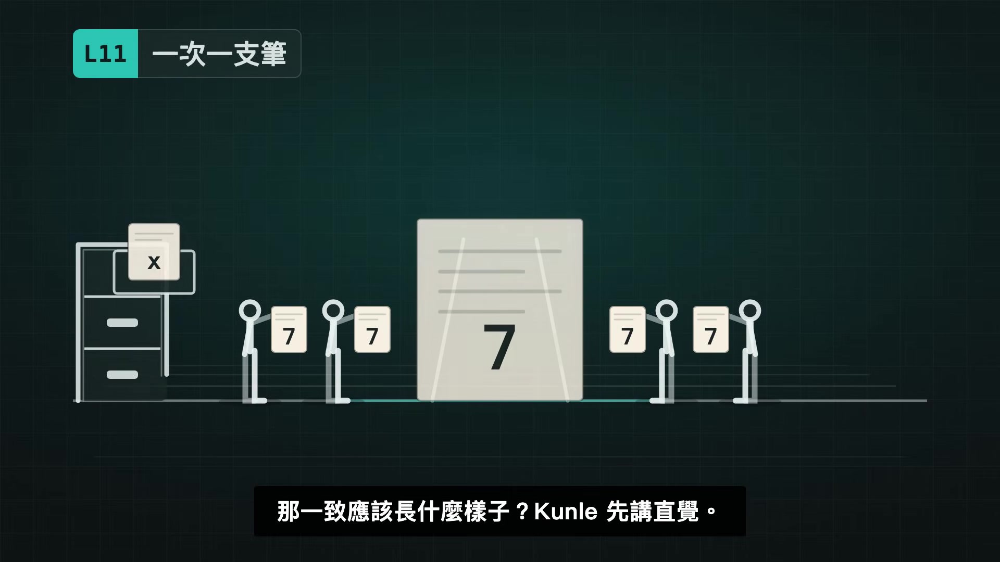

**逐字稿片段：** 康口先講直覺 任何一個位置 你讀它 就該拿到 最後一次寫進去的值 可是最後一次是什麼意思 兩個人同時寫 誰算最後 所以他把他說得更精確 對 同一個位置 所有人的讀跟寫 要能排成一條隊 而讀到的 永遠是隊伍裡 前個寫進去的值 要做到這件事 Anti守著兩條規則 一條叫單一寫者 要嘛 只有一個人可以改 那要嘛 大家都只能讀 另一條叫資料值不變 意思是一段只能讀的時間裡 每個人讀到的 都是前一段那個唯一寫者 最後留下的字 用影印本來說 這一頁同時只能有一支筆 筆在誰手上 別人的影印本就得作廢 等筆放下大家再重新影印 有同學問 那不寫快取不就沒事了 沒錯 可是每次都跑記憶體 速度就沒了 一支筆的規則 要靠什麼來執行 一種做法是乾脆 不要各自的快取 大家共用一個

**話題推測：** 定義快取一致性（Cache Coherence）的直覺和精確描述

---

## 00:21:49

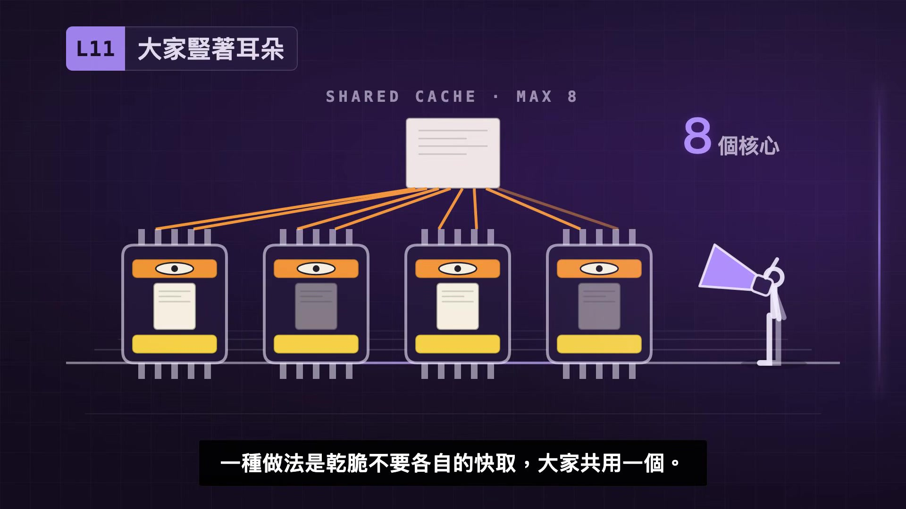

**逐字稿片段：** Control說他以前設計過一顆叫Nagra 2的處理器 第二層快取就是8個核心共用 可是每個核心都要拉線連到快取 到了8個核心 差不多就是極限

**話題推測：** 提到Nagra 2處理器，第二層快取由8個核心共用

---

## 00:21:59

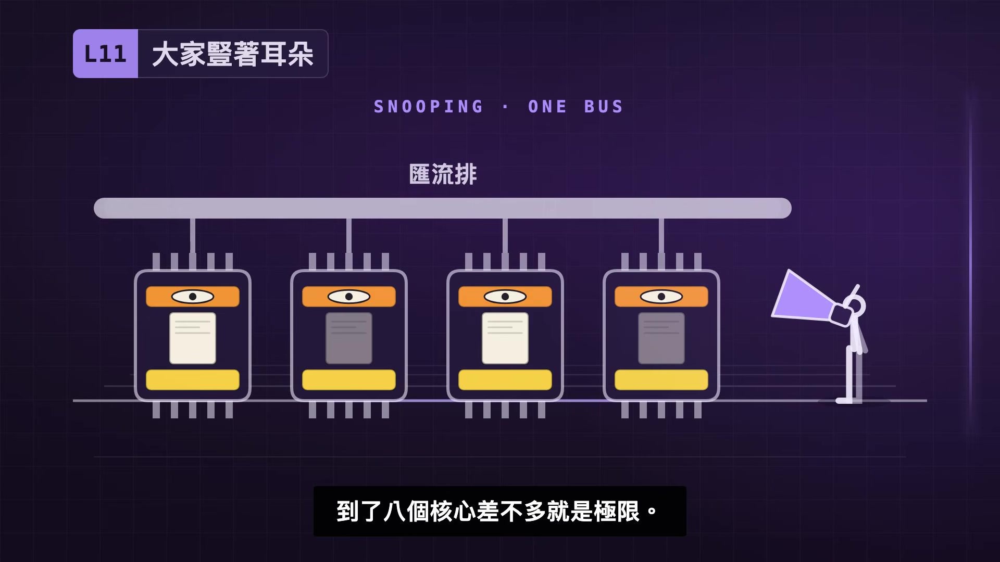

**逐字稿片段：** 另一種做法叫窺探 每個核心的快取都接在同一條匯流排上 匯流排就是一組大家共用的線 Control說匯流排有兩個好性質 就像這間教室裡的空氣 一個人開口 所有人都聽得到 這叫廣播 同一時間只能有一個人講話 這叫排序 所以每個快取都一直豎著耳朵 聽匯流排上有沒有人說 我要改某一頁了 聽到了 而且自己手上剛好有那一頁 就把自己的影音本作廢 最簡單的版本 是沒寫一次就廣播一次 可是這樣匯流牌馬上塞爆 所以真正的做法 要搭配剛才的寫回式快取 下一堂課 空調把真正的規則寫出來

**話題推測：** 介紹窺探（Snooping）機制，核心通過匯流排監聽

---

## 00:22:31

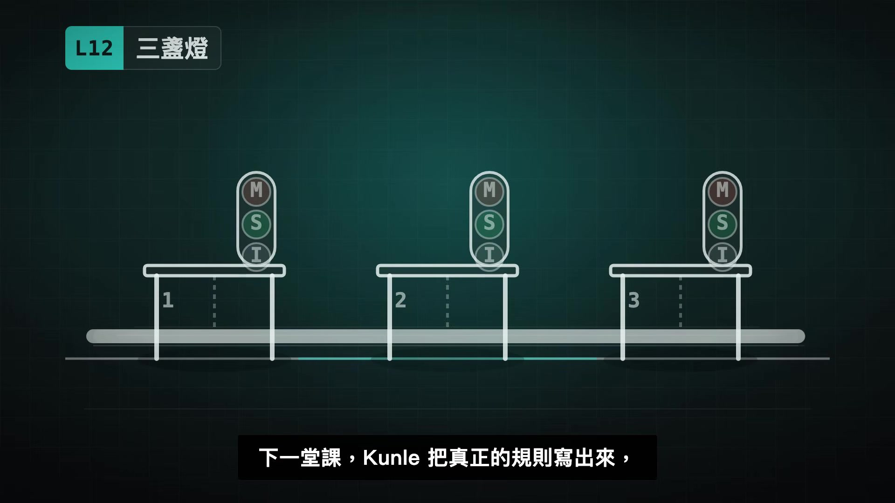

**逐字稿片段：** 這套規則叫MSI協定 三個字母是三種狀態 M是Modify 以修改 這一頁只有你有 而且你改過了 你就是那個拿著筆的人 S是Shared 共享 好幾個人都有 大家都只能讀 這時候記憶體裡的正本 一定是最新的 I是invalid 無效 就是你手上沒有 或者被作廢了 1號想讀在匯流牌上 喊一聲 我要讀 他拿到一份 狀態是共享 3號也讀 也是共享 3號想改在匯流牌上喊 我要讀 而且要改 1號聽到了 把自己那份作廢 3號變成已修改 接著1號又想讀 喊了一聲 這次是3號跳出來 把他改好的那份交出去 兩個人一起回到共享 你會發現 1號本來讀自己手上那份就好 現在因為3號寫過 他得多走一趟匯流牌 就這樣變成延遲的 MSI有一個小浪費 先讀再寫是很常見的動作 可是這樣要喊兩次 一次說我要讀 一次說我要改 所以多了一個狀態

**話題推測：** 介紹MSI協定（Modify, Shared, Invalid）及其三種狀態

---

## 00:23:23

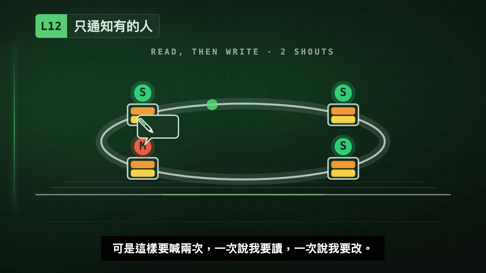

**逐字稿片段：** 叫e-exclusive讀佔 意思是這一頁只有你有 但你還沒改 康克爾說這個協定叫MESI 跟那位阿根廷足球巨星同名 有了讀佔 你讀的時候如果發現沒人有這一頁 就直接拿讀佔 你要改的時候不用再喊 悄悄的就能改 另一個問題出在匯流牌本身 每一次喊話 所有核心都得聽 連手上根本沒有那一頁的也要停 核心一多就撐不住了 所以現在大部分處理器改用目錄 最大那層共用快取的每一格旁邊 都附了幾個位元 記著四個核心裡 誰手上有這一頁 要作廢的時候 只去通知手上真的有的那幾個 不用對全體廣播 靠著目錄 核心可以做到幾十個甚至上百個 你聽到這裡可能會覺得 這些都是硬體的事 跟寫程式的人沒關係 康求用一組數字告訴你 差很多

**話題推測：** 介紹MESI協定中的e-exclusive（獨佔）狀態

---

## 00:24:09

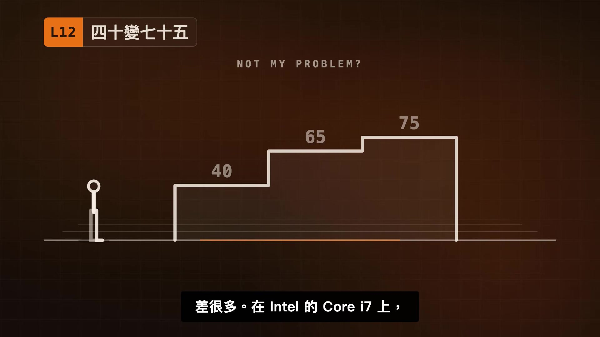

**逐字稿片段：** 在Intel的Core i7上 你要的東西在最大那層快取裡 而且只有你在用 大約40個10M週期就拿到 10M週期就是處理器打一拍的時間 如果那一格好幾個核心都有 要65個週期 如果它剛被另一個核心改過要75個 差不多是兩倍 他說 一支程式從一個人跑變成很多人跑 平均每次拿資料的時間一定會變長 因為公用會把你的存取 推到更慢的那幾層去 這就是公用的價錢 它不會讓你的程式出錯 硬體已經替你把張對好了 可是它會安靜的讓你變慢

**話題推測：** Intel Core i7上快取存取時間的數字對比

---

## 00:24:40

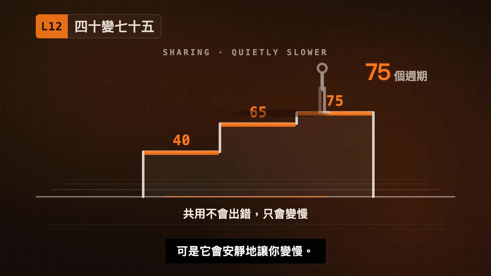

**逐字稿片段：** Conto建議用Intel的VTune這類工具 但是哪個資料結構一直錯過快取 更麻煩的是 有時候你根本沒有共用 硬體卻以為你有

**話題推測：** 建議使用Intel VTune工具分析快取錯失

---

## 00:24:49

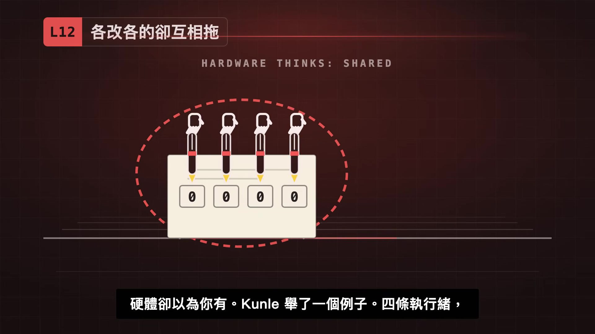

**逐字稿片段：** 剛剛就舉了一個例子 四條直行序 每條有一個自己的計數器 各加各的 完全不相干 一種寫法是把四個計數器 放在一個陣列裡緊緊挨著 另一種寫法 讓每個計數器各自佔滿一整排快取行

**話題推測：** 舉例說明偽共享（False Sharing）現象

---

## 00:25:03

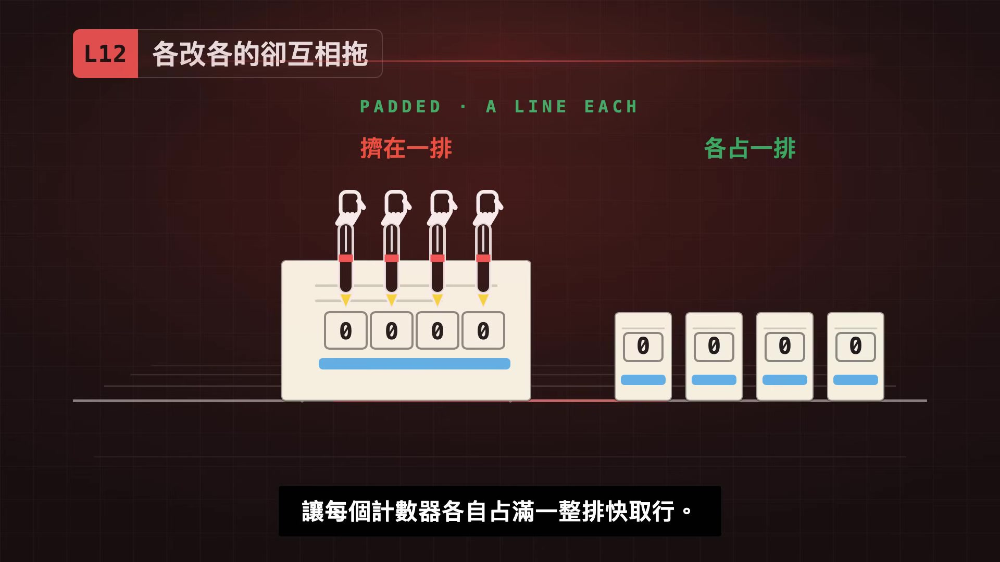

**逐字稿片段：** 在一臺四核心的機器上 前一種跑了14.2秒 後一種只要4.7秒 程式邏輯卻一模一樣 原因是快取一次辦一整排 上一集講過 這一排叫快取行 四個計數器擠在同一排裡 就像四個人各自在同一頁影音本上改不同的字 可是作廢是整頁作廢的 一號改了他那一格 其他三個人整頁作廢 重新影音 一號一改 又整頁作廢 那頁就在四個人之間來回飛 這個現象叫偽共享 英文叫false sharing 解法很簡單 把資料隔開 雖然浪費一點空間 意志性只管同一個位置 不同位置之間誰先誰後 是另一個問題

**話題推測：** 展示偽共享導致的性能差異：14.2秒與4.7秒

---

## 00:25:36

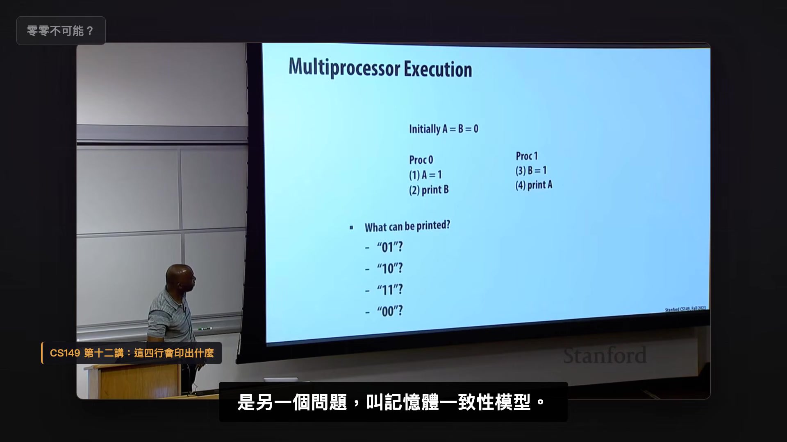

**逐字稿片段：** 叫記憶體意志性模型 Countio寫了四行程式 請大家跟旁邊的人討論 A跟B一開始都是0 1號處理器先把A設成1 再印出B 2號處理器先把B設成1 再印出A 請問可能印出哪些結果 臺下有人說01 有人說11 大家幾乎都同意 00不可能 為什麼 要印出00 1號印B的時候 2號還沒設B 2號印A的時候 1號也還沒設A 可是每個人都是先設再印 你把這些先後關係畫成箭頭 會繞成一個圈 一件事的發生在自己之前 這不可能 這種直覺有一個正式的名字

**話題推測：** 介紹記憶體一致性模型（Memory Consistency Model）

---

## 00:26:07

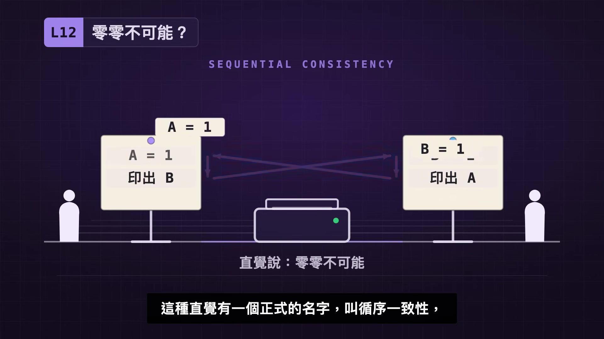

**逐字稿片段：** 叫循序一致性 是Leslie Lampert定義的 他後來拿了土林獎 意思是所有人的動作 可以排成一條隊 而每個人自己的動作 都造成是的順序

**話題推測：** 介紹循序一致性（Sequential Consistency）及其定義者Leslie Lamport

---

## 00:26:17

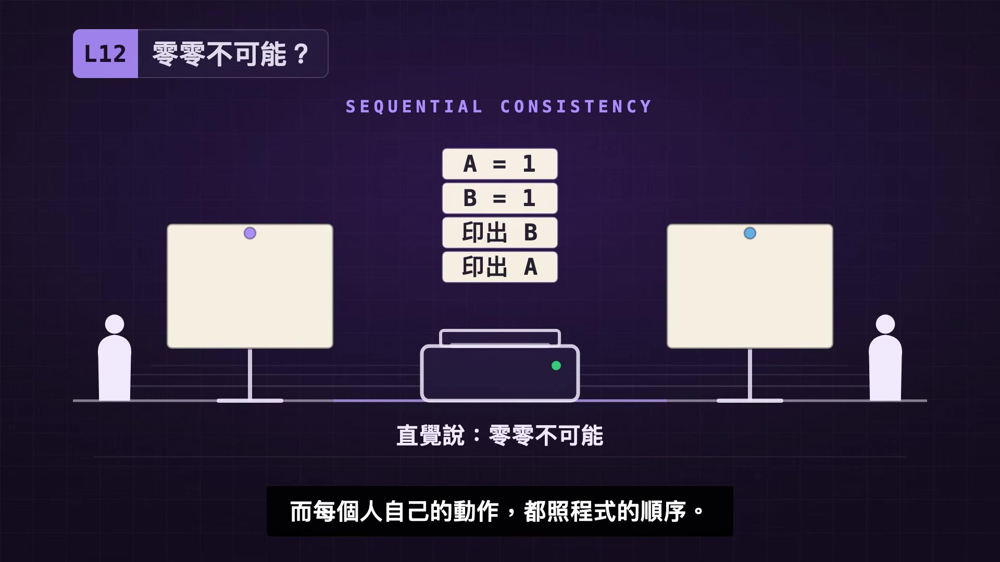

**逐字稿片段：** 可是真實的處理器 印得出00 寫入常常要等很久 後面那個讀取 卻可能馬上就在快取裡拿到 何必讓讀取乾等 所以處理器

**話題推測：** 真實處理器可能輸出00，因為寫入緩衝區（Write Buffer）

---

## 00:26:25

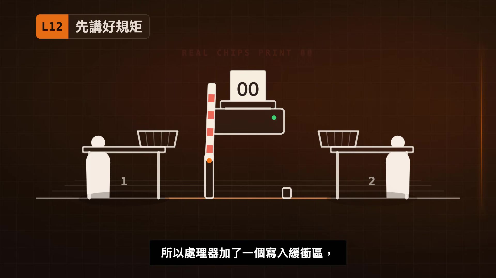

**逐字稿片段：** 加了一個寫入緩衝區 你可以想成桌角的帶送欄 寫好的東西先放進欄子 晚一點再送出去 讀取先走 這樣1號把A設成1 還躺在自己的欄子裡 他就去讀B 拿到0 2號同時也一樣 也拿到0 00就這樣出現了 Conco還提醒 你口袋裡那隻手機 用的是更寬鬆的規則 幾乎什麼順序都能換 那要順序怎麼辦 加一道柵欄 英文叫Fence 他讓所有人把手上的毒血都送完 才準往下走 他說平行運算底要解決問題 常常就是讓東西慢下來 他給的建議很實在 共用的資料一定要用同步保護好 不要讓兩個人在沒有約定的情況下 碰同一個位置 剩下的交給寫同步程式庫 和編譯器的人去傷腦筋 我們回到開場那個問題 這一集你看到GPU把16萬條執行序排在一顆晶片上 分工全交給硬體 只讓同一個區塊裡的人共用 你看到Cable不用鎖 改用排序 看到Spark靠著從不修改的資料 還一張食譜 撐過一千臺機器隨時會壞 最後你看到 四個核心手上的影印本 光是要讓同一頁保持一樣 就得作廢 重印 喊話 還會在你根本沒共用的時候 把你拖慢好幾倍 所以難的不是分工 是共用

**話題推測：** 解釋寫入緩衝區導致的順序變化

---

## 00:27:34

**逐字稿片段：** 下一集是正門課的最後幾堂 我們會看到大家搶同一份資料時 不用鎖要怎麼辦 專門為一種問題設計的程式語言 一種叫交易式記憶體的想法 為了特定工作打造的硬體 最後再回到記憶體存取 把整門課收起來 最後問你一個問題 如果你跟同事要同時改同一份文件 你們會先講 好 誰能改 還是各改各的 最後再來對版本 留言跟我分享 喜歡這種把公開課講清楚的內容 也可以訂閱AI Notebook 我是Jim 我們下次見

**話題推測：** 預告下一集課程內容：不用鎖處理資料競爭、交易式記憶體、專用硬體

---
