# jimainotebook_dVnETuDm1bg — 關鍵畫面索引

- 來源逐字稿：[jimainotebook_dVnETuDm1bg_FIN.srt](jimainotebook_dVnETuDm1bg_FIN.srt)
- 影片：https://www.youtube.com/watch?v=dVnETuDm1bg
- 截圖數：54

## 00:00:14

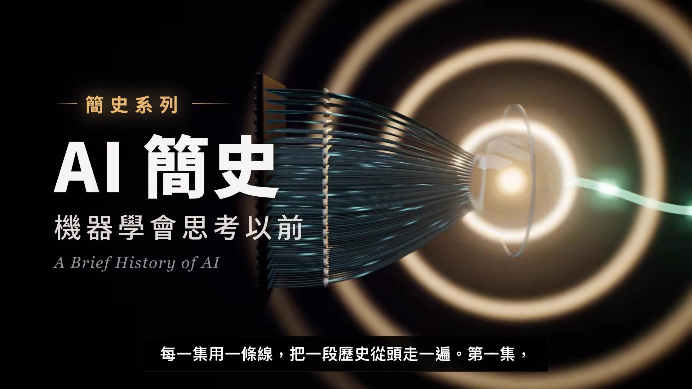

**逐字稿片段：** 第一集,我們走人工智慧的70年,1955年 四個美國科學家寫了一份研究申請書 說只要給他們10個人,兩個月 就能再讓機器有智慧這件事上往前走一大步 那個夏天,過去的70年也過去了 這70年裡,大家好幾次都說機器快要會思考了 然後又好幾次卡住 這一集只問一個問題,每一次卡住的到底是什麼 我先把答案放在前面,每一次卡住 都是因為我們想親手把智慧寫給機器 每一次往前 都是因為我們讓他自己從例子裡學 難的不是把智慧寫進機器 是讓他自己學出來

**話題推測：** 討論人工智慧70年歷史的開場。

---

## 00:00:43

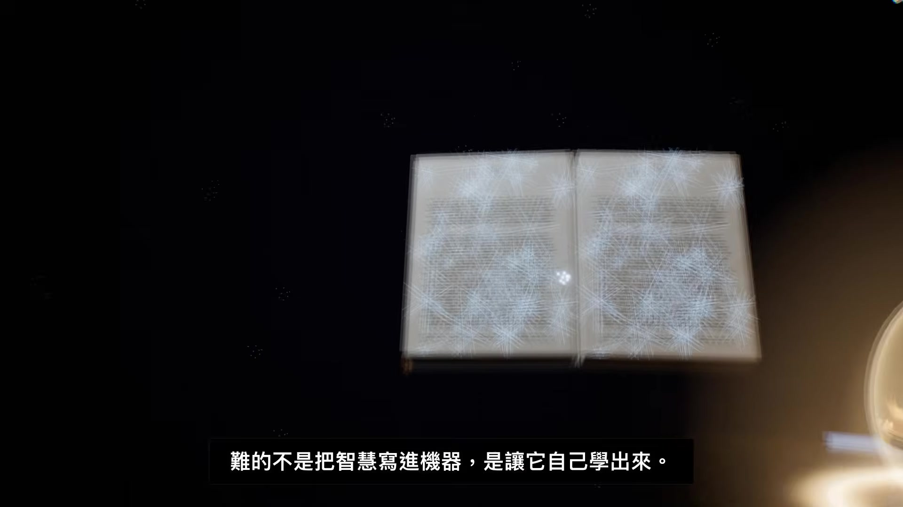

**逐字稿片段：** 這條線分三步走 先看為什麼智慧寫不完 再看讓機器自己學 為什麼等了二十幾年 最後看他真的學起來以後 現在又卡在哪裡 中間有一部圍棋 人類下出來的機會大約只有萬分之一

**話題推測：** 介紹本集將分三步驟來探討AI歷史的發展。

---

## 00:00:54

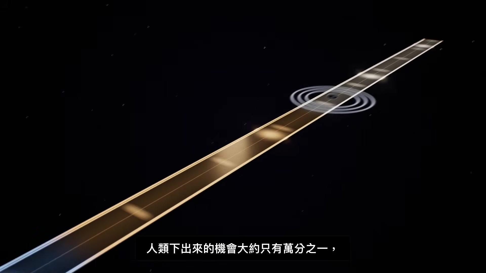

**逐字稿片段：** 我們留到後面 故事要從更早的一張紙開始 1950年

**話題推測：** 故事回溯到1950年Turing的論文。

---

## 00:00:58

**逐字稿片段：** 英國數學家Alan Turing 在一本哲學期刊上發表了一篇論文 論文的第一句話是 我想來討論一個問題 機器會思考嗎 他接著說 這個問題很難直接回答 因為思考這兩個字 每個人的定義都不一樣 所以他換了一個問法 做成一個遊戲

**話題推測：** 引入Alan Turing及其關於機器思考的問題。

---

## 00:01:11

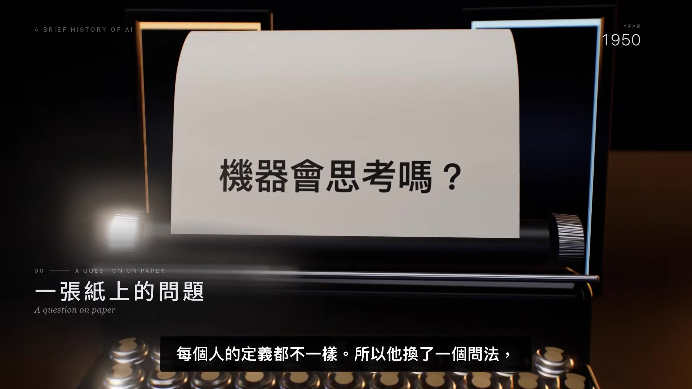

**逐字稿片段：** 叫Imitation Game 中文叫模仿遊戲 後來大家叫他圖靈測試 遊戲是這樣玩的 一個人坐在房間裡 只能用打字 跟兩個看不見的對象聊天 一個是人 一個是機器 聊了一陣子以後 他要猜哪一個是機器 如果他常常猜錯 Turing說 我們就很難再堅持 機器不會思考 你會發現 這篇Turing沒有回答機器會不會思考 他把問題換成一個可以測的東西 他還預測 大約50年後 機器就能把這個遊戲玩得相當好 這一集的70年 某種程度上 都在回答這張紙上的那個問題 這篇論文最常被引用的是那個遊戲 可是在論文最後一節 Turing寫了一段很少人記得的話 他說 與其寫一個程式去模仿大人的腦袋 為什麼不寫一個模仿小孩的 然後去教他 你想一下一個小孩是怎麼學說話的 沒有人先給他一本文法書 叫他背首主詞和動詞 再開口 他是聽了成千上萬句話 說錯了 被大人糾正 慢慢自己就會了 規則不是別人寫給他的 是他從例子裡自己長出來的 這個畫面我們整集會一直回來用 就叫他學說話的小孩 所以Turing在1950年 就把兩條路都擺出來了 一條是把大人的智慧 一條一條寫下來交給機器 另一條是做一個會學的小孩 讓他自己從例子裡學 他只提出了這個想法 沒有說該怎麼做 接下來的70年 人類幾乎先把前面那條路 從頭走到底 才繞回後面這一條 Turing提出問題

**話題推測：** 介紹Turing Test (模仿遊戲) 的概念與運作方式。

---

## 00:02:25

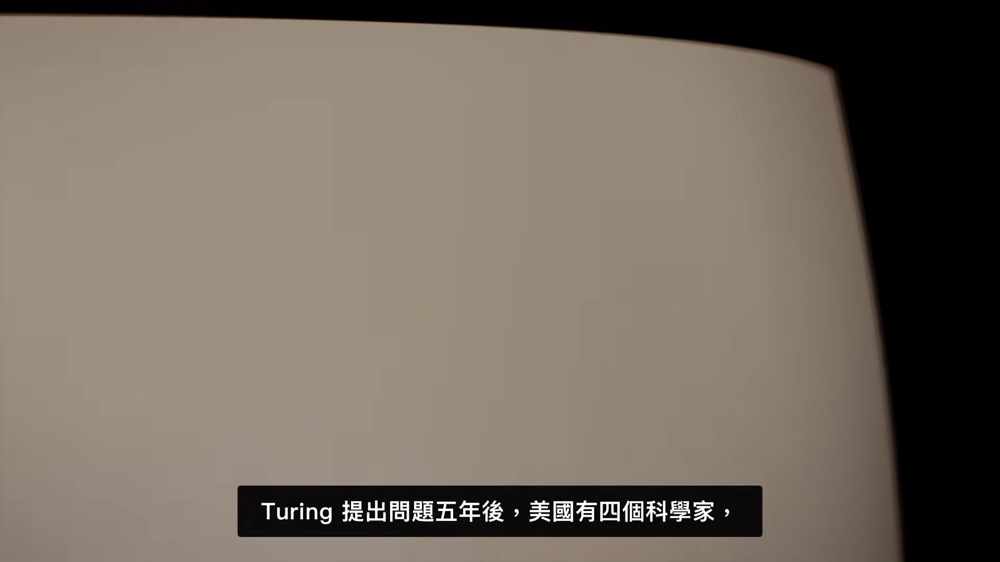

**逐字稿片段：** 五年後,美國有四個科學家

**話題推測：** 轉向1955年達特茅斯會議與人工智慧一詞的誕生。

---

## 00:02:27

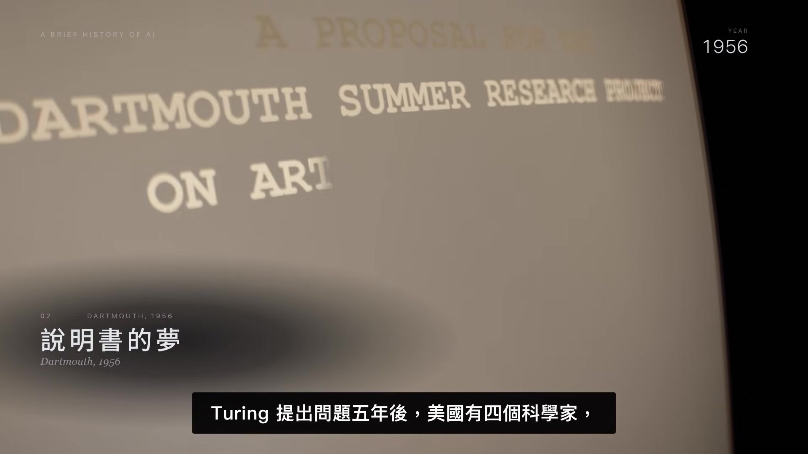

**逐字稿片段：** John McCarthy, Marvin Minsky, Nathaniel Rochester 和 Claude Shannon 寫了一份研究申請書 他們想在隔年夏天把一群人找到 Dartmouth 學院一起做研究 就在這份申請書裡出現了 Artificial Intelligence 這個名字 中文叫人工智慧 申請書裡有一句話把他們的信心寫得很清楚 他們認為學習和智慧的每一個方面 原則上都能描述得非常精確 精確到可以做一臺機器去模仿它 他們申請的規模是十個人 兩個月 1956年那個夏天 真的有一群人來了 有兩位研究者帶來一個程式

**話題推測：** 提及四位重要的科學家，包括John McCarthy和Marvin Minsky。

---

## 00:03:00

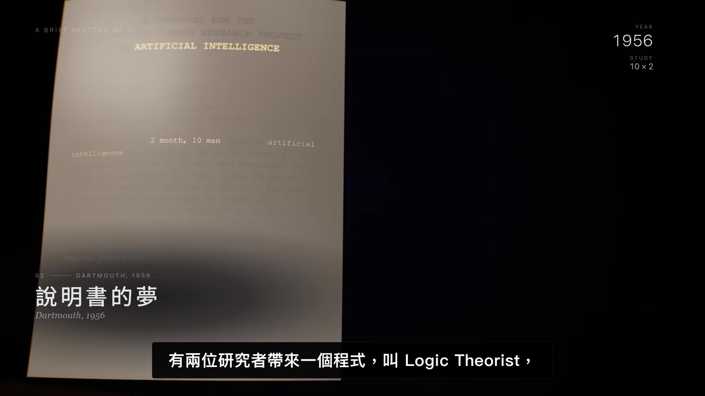

**逐字稿片段：** 叫Logic Theorist 他把一本數學經典裡 前面幾十條定理 正出了一大半 有一條的正法比原書還短 下棋 證明 揭秘 這些我們覺得最需要智慧的事 好像都能一步一步寫成規則

**話題推測：** 介紹Logic Theorist程式的成就。

---

## 00:03:10

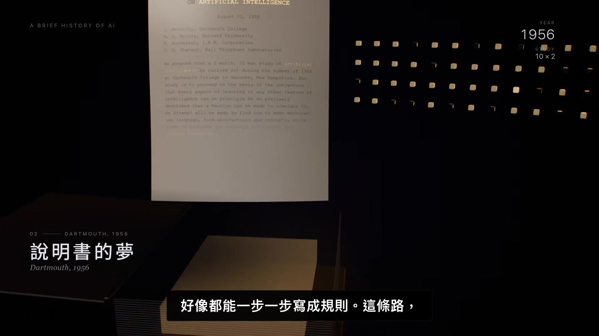

**逐字稿片段：** 這條路我們就叫他寫說明書 把智慧寫成一本說明書 極其照著做 那時候的人很自然地相信 只要說明書寫得夠厚 智慧就會出現 就在大家忙著寫說明書的時候 另一條路也有人在走

**話題推測：** 闡述「寫說明書」即基於規則的AI方法。

---

## 00:03:22

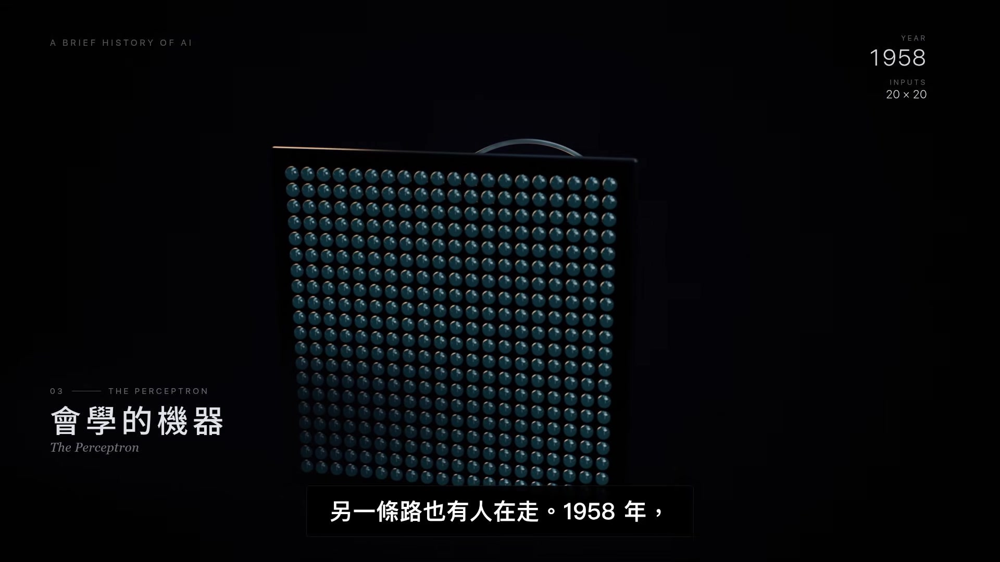

**逐字稿片段：** 1958年 心理學家Frank Rosenblatt 做出了一臺機器 叫Perceptron 中文叫感知器 他的想法來自腦袋裡的神經細胞 一個神經細胞會收到很多訊號 每個訊號有輕有重 加起來超過一個門檻 它就發出訊號 感知器照這個樣子做 前面是一排感光的小眼睛 每隻眼睛接一個可以轉的旋鈕 旋鈕決定 這隻眼睛的話算多重 你給它看一張圖 它猜一個答案 猜錯了 就把旋鈕轉一點點 沒有人告訴它規則 他是從一張一張的例子裡 自己把旋鈕轉到對的位置 這就是Turing說的那個小孩 第一次有了身體 美國海軍資助了這個研究 還辦了一場記者會

**話題推測：** 引入1958年Frank Rosenblatt的感知器。

---

## 00:03:57

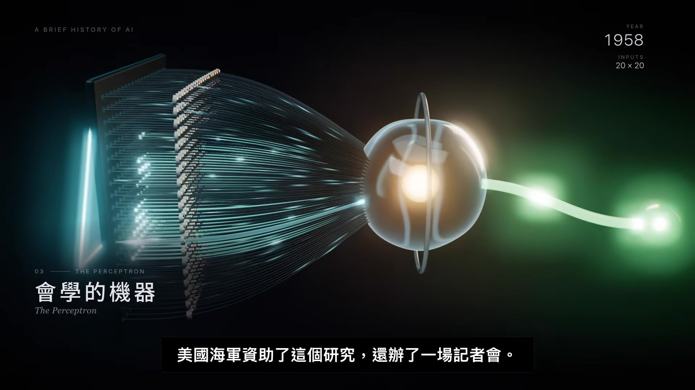

**逐字稿片段：** 紐約時報的報道說 海軍期待這臺電腦的雛形 將來能走路 說話 看 寫字 複製自己 還能意識到自己的存在 一臺只能分辨簡單圖形的機器 被寫成這個樣子 你大概猜得到 後面會發生什麼事

**話題推測：** 呈現紐約時報對Perceptron的誇大報導。

---

## 00:04:10

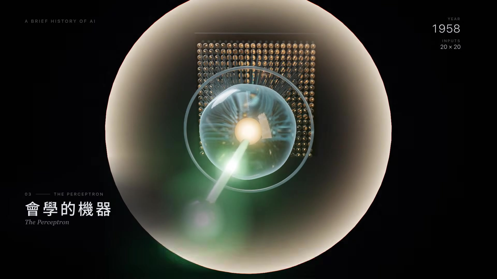

**逐字稿片段：** 1960年代 是人工智慧的第一個春天 研究經費很多 每個人都很樂觀 而這些樂觀後來都留下了白紙黑紙

**話題推測：** 標示人工智慧的第一個春天時期。

---

## 00:04:17

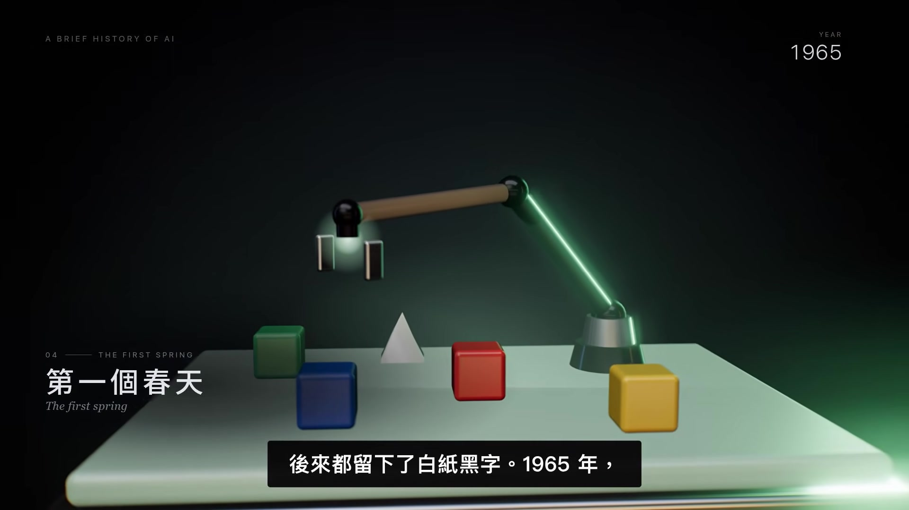

**逐字稿片段：** 1965年 Herbert Simon 寫道 20年之內 機器將能做任何人能做的工作 Minsky 後來也在雜誌上說 幾年之內就會有一臺跟一般人一樣聰明的機器 說這些話的不是在路邊吹牛的人 是這個領域最頂尖的科學家 他們為什麼這麼有把握 因為在小世界裡事情真的很順 證明定理 解帶出應用體 或者在一張只有幾塊積木的桌面上 照著一句英文指令 把積木疊起來 機器都做得到 一個小世界做得到 看起來只要把世界放大就好 我們後面會一直用季節來講這段歷史 春天的時候所有人都在往前衝 可是春天說出口的話 都會被冬天拿出來一堆帳 感知器那條路 先碰到了牆

**話題推測：** 引用Herbert Simon和Minsky對AI未來的高度樂觀預測。

---

## 00:04:54

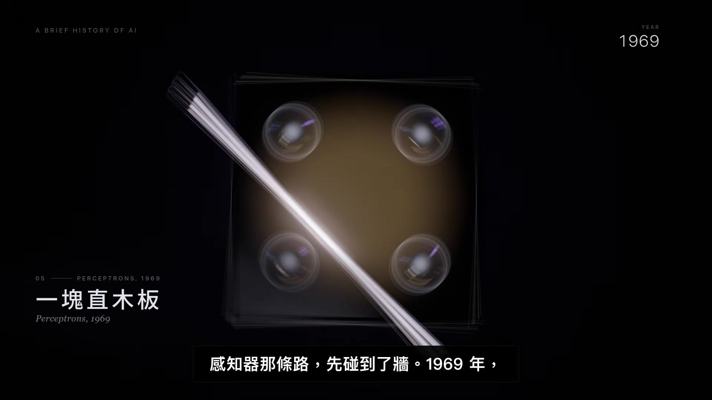

**逐字稿片段：** 1969年 Minsky 跟 Seymour Pepper 出了一本書 書名就叫 Perceptrons 感知器 書裡用數學證明只有一層的感知器 有些非常簡單的事 怎麼學都學不會 最有名的一個例子 可以想成兩個開關和一盞燈 規則是兩個開關剛好只開一個燈才亮 兩個都開或兩個都關 燈都不亮 這件事小孩一看就懂 可是一層的感知器 做的事情就像拿一塊紙質的木板 把會亮的情況和不會亮的情況隔開 你把這四種情況擺在桌上 會發現那塊木板怎麼放 都隔不乾淨 大家知道多疊幾層也許就能學會 可是當時沒有人知道 多層的要怎麼訓練 這本書出來以後 大家對這條路的熱情很快樂地下來 研究經費轉向寫規則的那一邊 1971年 Rosenblatt再一次划船意外地過世 那天剛好是他的生日 會學的小孩那條路 幾乎沒有人走了 寫規則的那一邊 也沒有好到哪裡去 1973年 科學研究委員會請數學家James Lighthill評估人工智慧的研究 他的報告裡有一句話 大意是這個領域到目前為止沒有任何一部分 產生當初承諾的那種重大影響 問題出在哪裡

**話題推測：** 介紹Minsky和Papert的《Perceptrons》一書及其對感知器的挑戰。

---

## 00:05:56

**逐字稿片段：** 他點名了一件事叫combinatorial explosion 中文叫組合爆炸 他的意思是在積木桌上 可能的走法沒有幾種 集氣一個一個試就好 可是世界一放大 每多走一步可能性就成好幾倍 很快多到任何電腦都試不完 說明書也是這樣 你每寫一條規則就冒出三個例外 每個例外又要再寫三條 報告出來以後 英國大部分大學的人工智慧研究經費都被停掉 美國的國防研究經費也收緊了

**話題推測：** 引入「組合爆炸」的概念，說明規則寫不完的問題。

---

## 00:06:20

**逐字稿片段：** 這段時間後來被叫做人工智慧的冬天 春天說出口的話 第一次被拿出來對賬 冬天過了

**話題推測：** 標示人工智慧的第一個冬天時期。

---

## 00:06:26

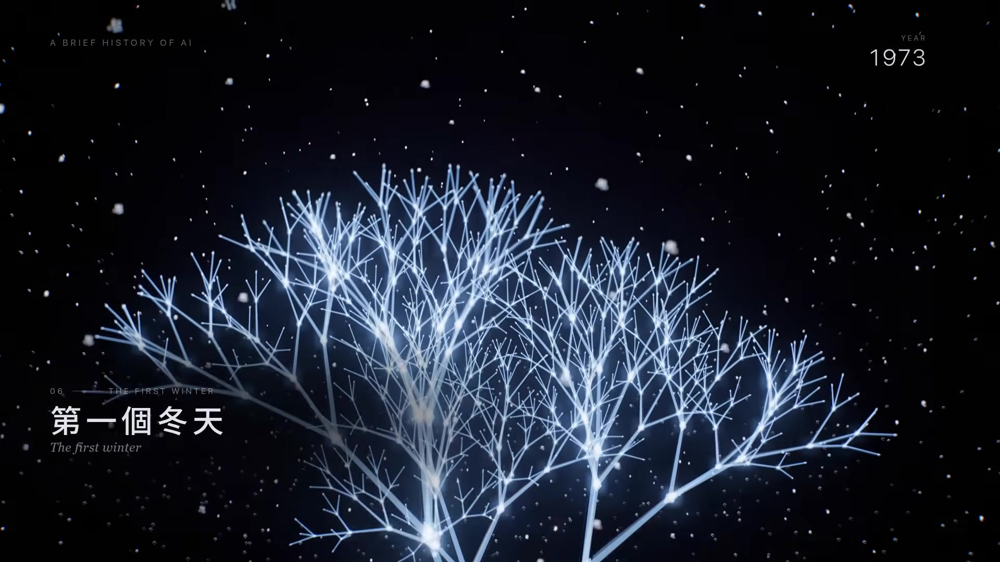

**逐字稿片段：** 1980年代春天又回來了 這次換了一個比較務實的說法 既然整個世界太大 那就只做一個小領域 而且找真正的專家來寫規則 這種東西叫Expert System 中文叫專家系統 它的做法是 寫成式的人去訪問醫生或技術人員 把他們腦袋裡的判斷一條一條寫成如果怎樣就怎樣

**話題推測：** 轉向1980年代的第二個春天，引入專家系統。

---

## 00:06:43

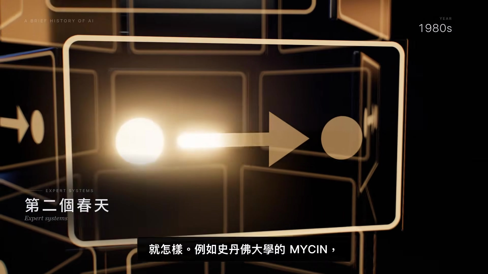

**逐字稿片段：** 例如史丹佛大學的MYCIN 專門判斷血液感染該用哪一種抗生素 另一個叫XCOM 是一家電腦公司用來幫客戶配電腦零件的 據說每年幫公司省下不少錢 這一次說明書不再想寫整個世界 只寫一個專家的一小塊 效果好到很多大公司紛紛成立人工智慧部門 還出現了專門跑這種城市的電腦

**話題推測：** 舉例史丹佛大學的MYCIN和XCOM專家系統。

---

## 00:07:01

**逐字稿片段：** 日本也在1981年 開始一個國家級的十年計劃 想做出新一代會推理的電腦 第二個春天比第一個更熱 因為這一次真的有錢在流動 可是這座說明書的塔 蓋得越高問題越明顯 最先碰到的問題是專家講不出來 你去問一個看了很多年病的醫生 他為什麼覺得這個病人不對勁 他常常只能說 看起來就是怪怪的 那個怪怪的寫不成規則 再來是規則打架 規則寫到幾千條 新加一條 就可能跟舊的某一條互相矛盾 沒有人記得全部 最麻煩的是 專家系統很脆 只要碰到說明書裡沒寫的情況 他不會說我不知道 他會很有把握的給一個錯的答案 維護這些規則的成本越來越高 1987年 專門跑這類城市的電腦 市場在一年之內垮掉 日本那個十年計劃到期的時候 也沒有達到當初的目標 其實早在1984年 就有兩位資深研究者 在年會上公開警告 冬天要回來了 人工智慧的冬天這個說法 就是在那時候開始流行的

**話題推測：** 提及日本國家級的十年AI計劃。

---

## 00:07:54

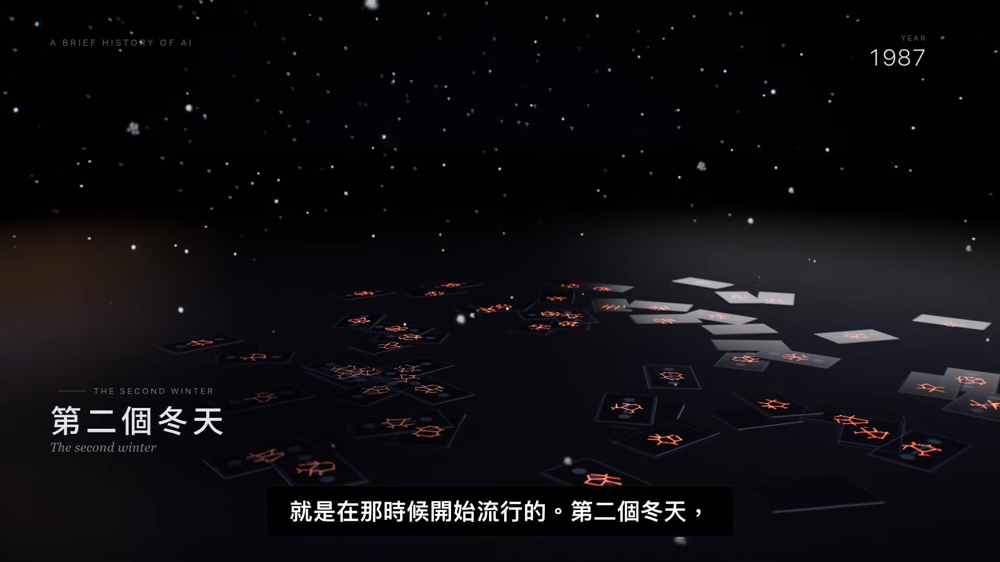

**逐字稿片段：** 第二個冬天比第一個更冷 很多研究者寫計劃的時候 乾脆不提人工智慧這幾個字 我們是不是從一開始就把難跟簡單搞反了

**話題推測：** 標示人工智慧的第二個冬天時期。

---

## 00:08:05

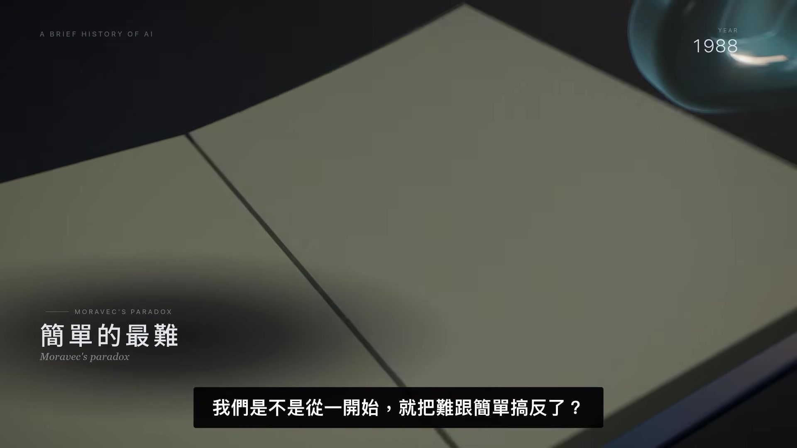

**逐字稿片段：** 1988年 機器人學家Hans Morag在書裡寫了一個觀察 後來被叫做Moravix Paradox 中文叫莫拉維克貝倫 他的意思是 讓電腦做質疑測驗下跳棋 做到大人的水準 相對容易 可是要讓他擁有一歲小孩的看跟走 很難甚至做不到 你想一下你一眼就認得出一隻貓 不管他是趴著跳著 還是隻從沙發後面露出一條尾巴 可是你能不能把怎麼認出貓 寫成一本說明書 你試了就會發現 寫不出來 你知道 可是你說不出來 這就是寫規則那條路 真正卡住的地方 智慧裡面最大的一塊不是下棋 證明這種我們說得出來的東西 是看聽走路這種 我們自己也說不出來的東西 說不出來就寫不成規則 說得出來的那一塊 寫規則的路其實走得很遠

**話題推測：** 引入Hans Moravec的「莫拉維克悖論」。

---

## 00:08:45

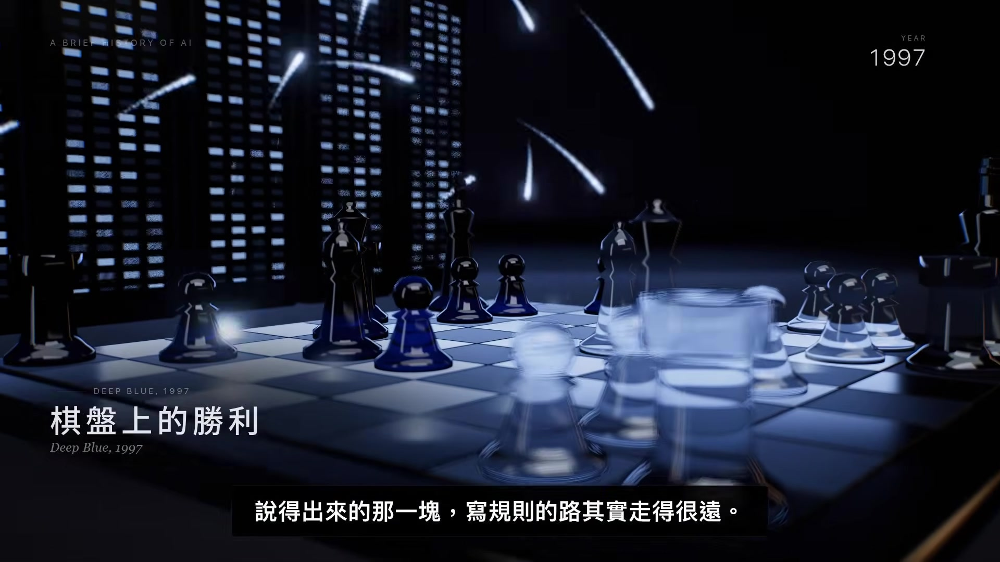

**逐字稿片段：** 1997年 IBM的電腦Deep Blue 在紐約跟世界西洋棋冠軍Gary Kasparov 下了六盤最後贏了 這是電腦第一次 在正式比賽的條件下 贏過當時的世界冠軍 Deep Blue是怎麼贏的 他不是比較懂棋 再用人寫好的評分規則 判斷哪個局面比較好 這是說明書加上力氣 把一個規則清楚的小世界一路算到底 這場勝利上了全世界的新聞 很多人以為機器終於會思考了 可是我們用Morrigan畫回頭看 激揚棋 剛好是那個簡單一邊 棋盤就那麼大 規則寫得完 輸贏很清楚 而在同一個年代 你拿一張普通的照片給電腦 要他認出裡面有沒有一隻貓 他還是非常吃力 我們先停一下

**話題推測：** 介紹1997年IBM Deep Blue擊敗西洋棋世界冠軍的事件。

---

## 00:09:25

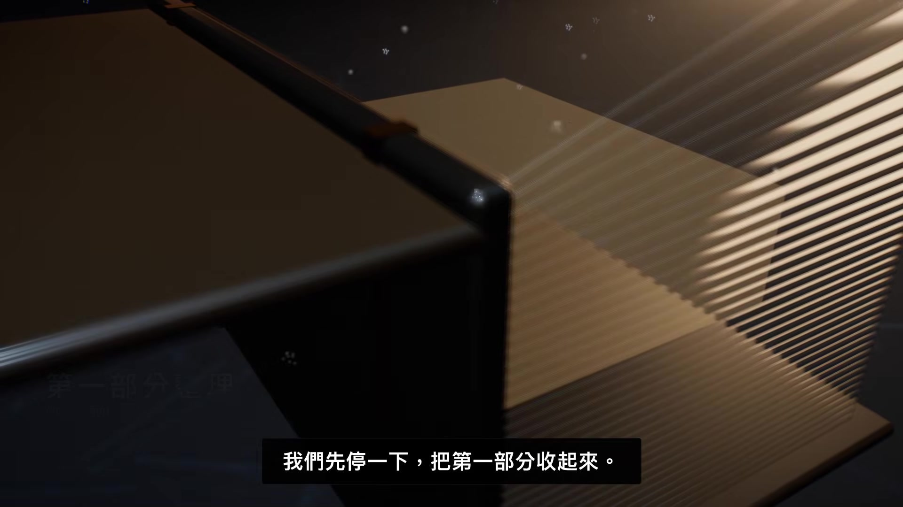

**逐字稿片段：** 把第一部分收起來 這部分的問題是 能不能把智慧一條一條寫給機器 答案是 寫得了一部分 寫不完 說得出來的那一塊 像下棋證明定理 寫規則的路走得很遠 甚至贏了世界冠軍 可是說不出來的那一塊 像認出一隻貓 聽懂一句話 寫不成說明書 專家講不出自己的直覺 規則越寫越多 互相打架 碰到沒寫到的情況 就很有把握的出錯 兩個冬天 卡住的都是同一件事 沒跟上的話 記住這一句 智慧裡最大的一塊 是我們自己也說不出來的 最後那一節嘛 如果寫不出來 就只剩另一條路 我們不寫了 讓機器像學說話的小孩一樣 自己從例子裡學 這條路Rosenblatt走過 被一本書擋了下來 它又重新被剪起來 得先解決那塊木板 隔不開的問題 我們要讓機器自己學 得先講清楚 學到底是怎麼一回事 這種會學的機器

**話題推測：** 總結第一部分：智慧無法完全由人寫出。

---

## 00:10:14

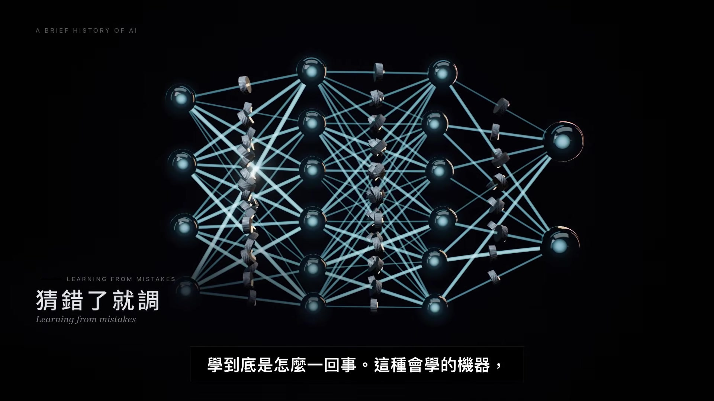

**逐字稿片段：** 今天叫Neural Network 中文叫神經網絡 它就是很多個感知器 一層接一層疊起來 每一條連接上 都有一個旋鈕 一個網絡可以有 成千上萬個旋鈕 學習的過程只有三個動作 猜 對答案 轉旋鈕 你給他一張照片 他猜這是狗 你告訴他 這是貓 他就把旋鈕轉一點點 讓下次猜貓的機會大一點 一張照片轉一點 一萬張照片就轉一萬次 這跟學術化的小孩很像 小孩指著狗說貓咪 大人說那是狗狗 小孩下次就少錯一點 沒有人在小孩腦袋裡寫規則 規則是被一次一次糾正 慢慢磨出來的 可是這裡有一個難題 只有一層的時候 你知道每個旋鈕該往哪邊轉 跌到很多層以後 最後答錯了 中間那幾層的旋鈕 各自要負多少責任 這個問題不解決 網路就跌不起來 這個問題的答案在

**話題推測：** 介紹神經網絡的概念，作為機器自主學習的路徑。

---

## 00:10:59

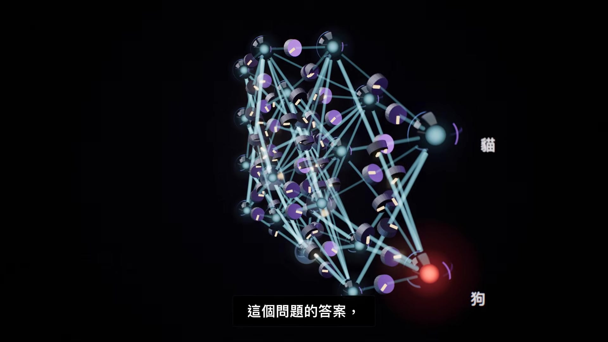

**逐字稿片段：** 1986年被寫成一篇很有名的論文 作者是David Romer Hart Joffrey Hinton和Ronald Williams 登在科學期刊Nature上 這個方法叫Back Propagation 中文叫反向傳播 它的意思是 最後答錯了 就從最後一層開始 把錯誤一層一層往回傳 每一個旋鈕都會被告知 你讓答案錯了多少 該往哪個方向轉 每一層都照著 後面傳回來的訊息 調整自己的旋鈕 然後再往前傳 這個想法更早就有人提過 可是這篇論文讓大家看到 它在多層的網絡上真的有用 而且中間那幾層 會自己學出有用的特徵 你還記得那兩個開關一盞燈嗎 一塊子木板隔不開 多疊一層 就像多了一塊可以彎的板子 這題就學得會了 擋住感知器將近20年的那道牆 終於有了門 新方法很快就有人拿去用了 1989年 在美國貝爾實驗室工作的

**話題推測：** 介紹1986年David Rumelhart等人提出的反向傳播演算法。

---

## 00:11:47

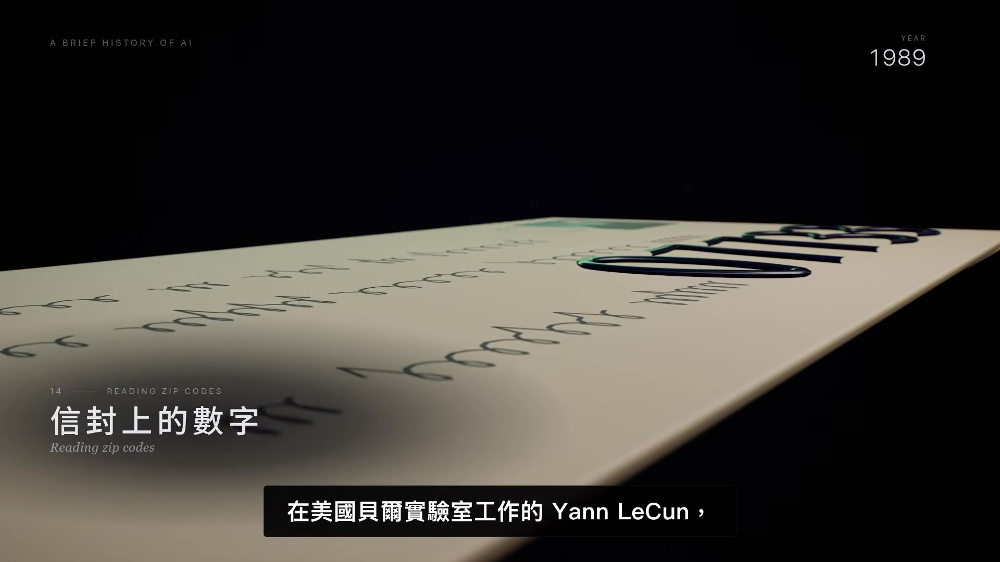

**逐字稿片段：** Jan LeCun 用反向傳播訓練的一個網絡 去認訊封上手寫的郵遞區號 手寫數字 正好是那種說不出來的東西 一個人寫的漆都不一樣 你幫他寫一條規則 說漆長什麼樣子 而QN的網絡還加了一個設計 讓他像眼睛一樣 先看小小一塊 找出筆畫的邊邊角角 再往上組合成整個數字 後來這一類網絡

**話題推測：** 介紹1989年Yann LeCun利用卷積神經網絡識別手寫郵遞區號。

---

## 00:12:06

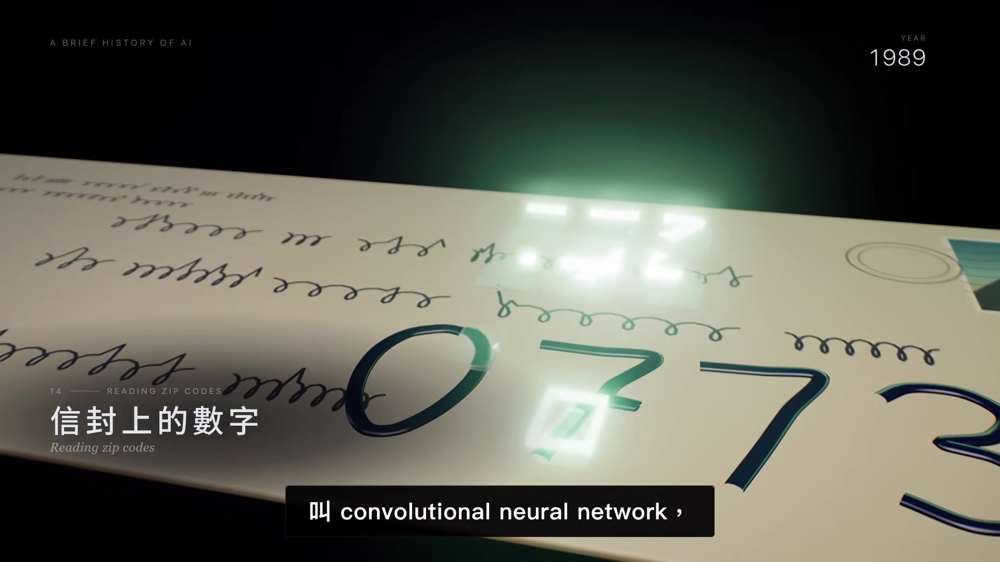

**逐字稿片段：** 叫Convolutional Neural Network 中文叫卷積神經網絡 他不只認郵遞區號 1990年代後期 他被放進銀行後臺 去讀支票上手寫的金額 會學的小孩 第一次真的去上班了 而且做的正是說明書寫不出來的那件事 照理說 故事應該從這裡一路往上 可是接下來的十幾年 神經網絡反而又冷掉了 1990年代到1000年代

**話題推測：** 引入卷積神經網絡 (Convolutional Neural Network) 一詞。

---

## 00:12:30

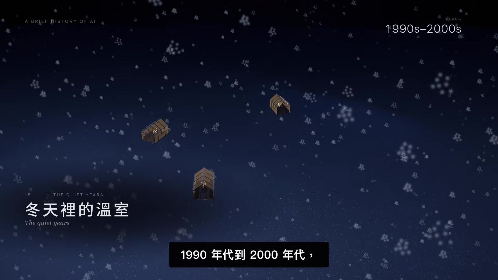

**逐字稿片段：** 學術界更喜歡其他比較好分析 比較好證明的方法 那些方法在當時的資料量上 成績常常一樣好 甚至更好 而且不用調一大堆旋鈕 神經網絡被很多人看成一門 說不清楚的手藝 你跳了半天 也說不出它為什麼會好 很多研究者後來回憶 那段時間 論文只要寫的神經網路 就很難被接受 整個大環境像冬天 可是冬天裡 還有幾間小溫室亮著燈 Hinton在多倫多 雷昆在紐約 Yoshua Bengio在蒙特羅 還有加拿大的一個研究機構 願意長期資助這些小群人 他們一邊被說過時 一邊繼續把網路疊得更深 後來回頭看

**話題推測：** 說明1990至2000年代神經網絡的沉寂時期。

---

## 00:13:05

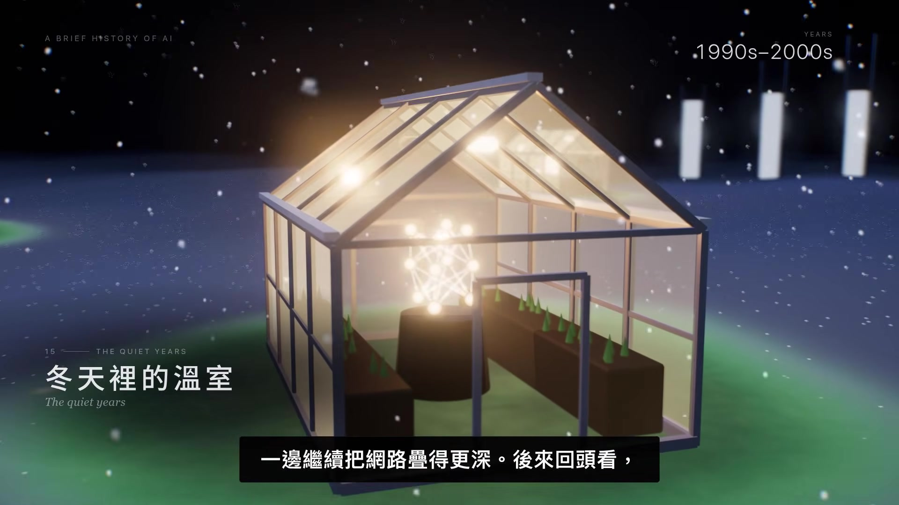

**逐字稿片段：** 這些小群人守住的 正是今天這些AI的祖先 方法有了人也在 為什麼還要再等 這一段我第一次讀的時候 也想不通 後來才懂 缺的不是更聰明的方法 是兩樣很笨的東西 我們回到學說話的小孩 你想像一個很聰明的小孩 可是他一年只聽得到十句話 而且每聽一句 要想三天才反應得過來 這個小孩再聰明 也學不會說話 當時的神經網絡就是這個小孩 一個缺的是例子

**話題推測：** 提及 Hinton、LeCun、Bengio 等人在寒冬中堅持研究。

---

## 00:13:28

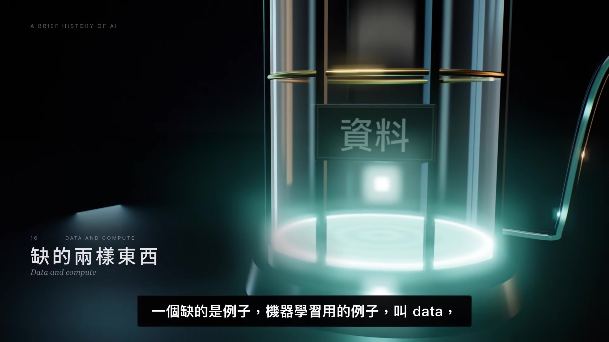

**逐字稿片段：** 機器學習用的例子 叫data 中文叫資料 那時候大家手上的照片資料 常常只有幾千張幾萬張 網絡轉了半天旋鈕 學不到多少東西 另一個缺的是計算能力 網絡越大 旋鈕越多 每看一個例子要算的次數就越多 當時的電腦訓練一個大網路 要花很久很久 所以神經網路一直看起來不如別的方法 不是他想錯了 是他還沒吃飽 接下來的故事就是這兩個缺口 被兩件跟人工智慧沒什麼關係的事情 一個一個補起來 第一個缺口是被網路補起來的 到了2000年代 網路上已經有數不清的照片 那時在普林斯頓大學的電腦科學家

**話題推測：** 強調資料 (data) 作為機器學習的關鍵要素。

---

## 00:14:01

**逐字稿片段：** 菲菲利 想做一件當時很多人覺得不值得做的事 他要蓋一個超大的照片資料庫 每一張都有人標上它是什麼 這個資料庫叫ImageNet 問題是誰來標 他的團隊用了 Amazon的一個零工平臺 叫Mechanical Turk 把標照片的工作 切成很小的一份一份 發給全世界很多國家的人來做 最後的成果 是1400多萬張標好的照片 分成兩萬多個類別 從貓狗到各種工具都有 2010年開始 他們每年用其中一部分 辦一場比賽 看誰的城市認照片認得最準 你回頭看 這就是把那個一年 只聽得到十句話的小孩 丟進一座 看不到鏡頭的圖書館 第二個缺口 是被電動玩具補起來的 3D遊戲的畫面 每秒要更新幾十次 每一次都要算出幾百萬個小點的顏色 為了這件事 顯示卡裡有一種晶片

**話題推測：** 介紹Fei-Fei Li創建的ImageNet大型圖像資料庫。

---

## 00:14:45

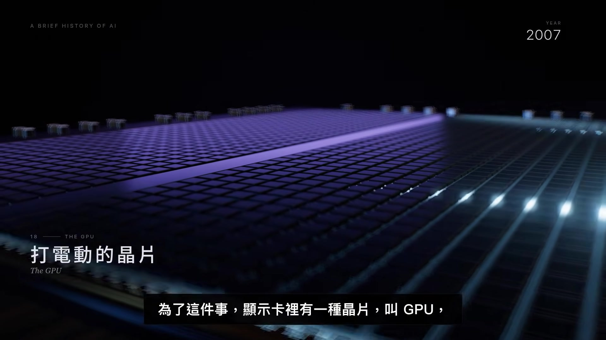

**逐字稿片段：** 叫GPU 中文叫圖形處理器 它跟一般電腦的主晶片很不一樣 主晶片的核心不多 每一個都很強 擅長一件接一件 做複雜的事 GPU有上千個小核心 每一個只會做 簡單的乘法和加法 可是可以同時一起做 而神經網路學習的時候 要做的剛好就是 大量的乘法和加法 每一個旋鈕都在乘 每一層都在加 比較酷打 讓一般的研究者 也能拿GPU來算遊戲以外的東西 一顆本來為了讓遊戲更好看的晶片 剛好是神經網絡最需要的那種力氣 粒子有了 力氣也有了 就差有人把三樣東西放在一起 舊的方法 新的粒子和新的力氣 把三樣東西放在一起的 是Hinton在多倫多大學的兩個學生 Alex Krzyzewski和Ilya Satskever

**話題推測：** 介紹GPU (圖形處理器) 如何提供神經網絡所需的計算能力。

---

## 00:15:29

**逐字稿片段：** 2012年 他們做了一個很深的卷積神經網絡 後來大家叫他AlexNet 訓練他用的 是兩張打電動用的顯示卡 就放在Krzewski父母家裡 他的臥室 跑了大約一個星期 那年的ImageNet比賽規則是這樣的 程式看一張照片 可以猜五個答案 五個裡面都沒有正確答案才算錯 第二名大約錯了26% AlexNet只錯了15% 他一次拉開了10個百分點以上 這不是小贏 是整個領域的人都要停下來看的差距 Ryukyun後來形容 這是電腦視覺歷史上 一個毫無疑問的轉折點 20幾年前的方法 加上一座照片圖書館 再加上兩張顯示卡 就這樣把門推開了 AlexNet之後 事情變得很快 隔年Google買下了Hinton 這兩個學生剛成立的小公司 語音辨識 照片搜尋翻譯 一個接一個換成了神經網絡 這種很多層的神經網絡 這時候有了一個新名字

**話題推測：** 介紹2012年AlexNet在ImageNet比賽中突破性表現。

---

## 00:16:18

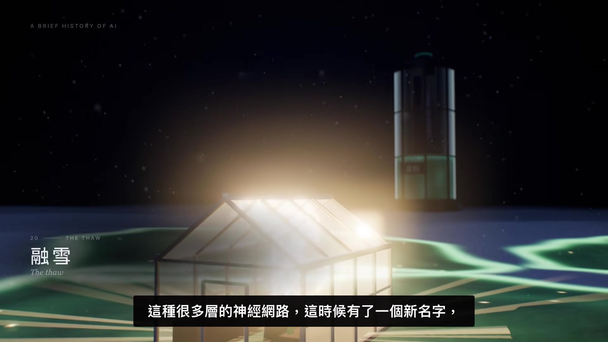

**逐字稿片段：** 叫Deep Learning 中文叫深度學習 深度 說的就是陳述很多 你把這一段跟前面放在一起 看會發現一件很有意思的事 AlexNet用的方法 幾乎都是舊的 會學的神經元 是Rosenblatt的想法 反向傳播 是1986年的論文 先看一小塊再組合 是Common早就在做的事 真正新的只有資料多了很多 計算也快了很多

**話題推測：** 引入「深度學習」(Deep Learning) 這個新名稱。

---

## 00:16:38

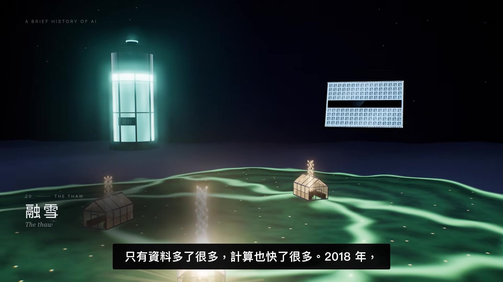

**逐字稿片段：** 2018年 Hinton、Kang和Bengio 一起拿到電腦科學最高的獎 圖靈獎 這個獎的名字 就來自那個 問機器會不會思考的Turing 冬天裡那幾間小溫室 這時候整片溶雪 我們再停一下

**話題推測：** 提及2018年Hinton、LeCun和Bengio獲得圖靈獎。

---

## 00:16:51

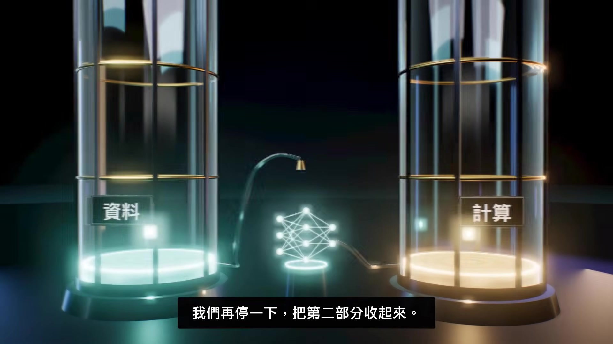

**逐字稿片段：** 把第二部分收起來 這一部分的問題是 既然智慧寫不完 讓機器自己從粒子學 怎麼講 答案是可以 可是要等 方法早在1986年就有了 反向傳播 讓一層一層的網絡 知道自己錯在哪裡 沒過幾年 他就已經在讀信封跟支票 可是接下來十幾年 他一直贏不了別的方法 因為那個小孩一年只聽得到十句話 而且想得很慢 直到網路給了他一座 看不到鏡頭的照片 圖書館打電動的晶片給了他力氣 他才一口氣把門推開 沒跟上的話 記住這句 方法二十幾年前就有了 缺的是粒子跟計算能力 這個答案會把我們帶到下一個問題 如果粒子跟計算能力就是關鍵 那一直加上去他能走多遠 還有一件事 照片要人一張一張標 標不完 如果機器能自己產生粒子呢 機器自己產生粒子 最早在一個棋盤上做到了 威奇的棋盤比西洋棋大得多 可能那下法多到Deep Blue 那種一步一步算的辦法 根本很不通 而且下圍棋的高手 也常常說不出來 為什麼這一步好 只能說這裡的形狀比較漂亮 這又是一個說不出來的東西

**話題推測：** 總結第二部分：自主學習方法雖早有，但缺乏資料與計算力。

---

## 00:17:47

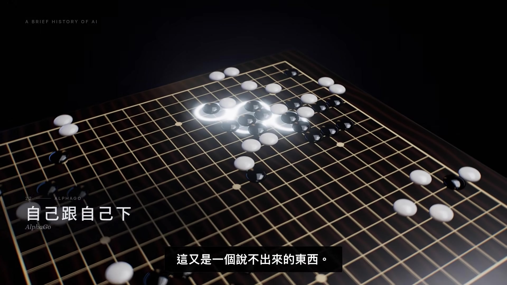

**逐字稿片段：** Google棋下的DeepMind 做了一個程式 叫AlphaGo 他先看大量人類高手的棋譜 學人會怎麼下 然後他開始自己跟自己下 下了幾百萬盤 每一盤下完 贏的那一方做過的選擇 就被鼓勵 輸的那一方就被調低 這種學法叫reinforcement learning 中文叫強化學習 它不需要有人告訴他每一步 只需要知道最後是贏是輸 這是解決了上一部分 最後那個問題 例子不用人標 機器跟自己下一盤 就多一盤例子

**話題推測：** 介紹Google DeepMind的AlphaGo及其強化學習方法。

---

## 00:18:12

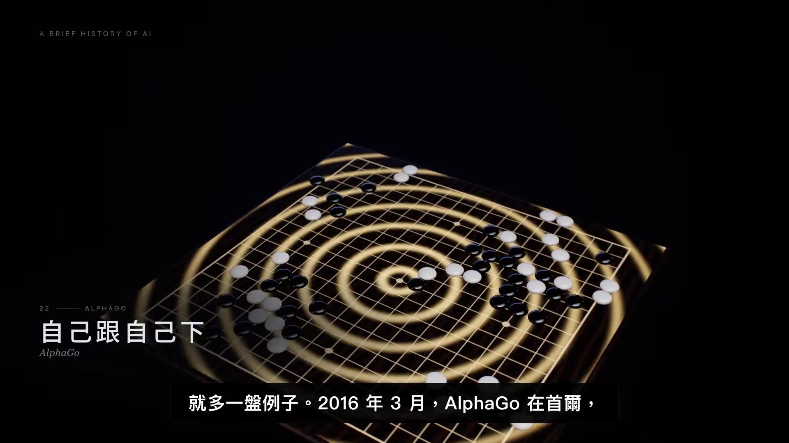

**逐字稿片段：** 2016年3月 AlphaGo在首爾 跟世界頂尖騎士Lysetto 下了五盤 五盤裡的第二盤 發生了一件 讓整個圍棋界安靜下來的事

**話題推測：** 描述2016年AlphaGo擊敗李世乭的圍棋比賽。

---

## 00:18:22

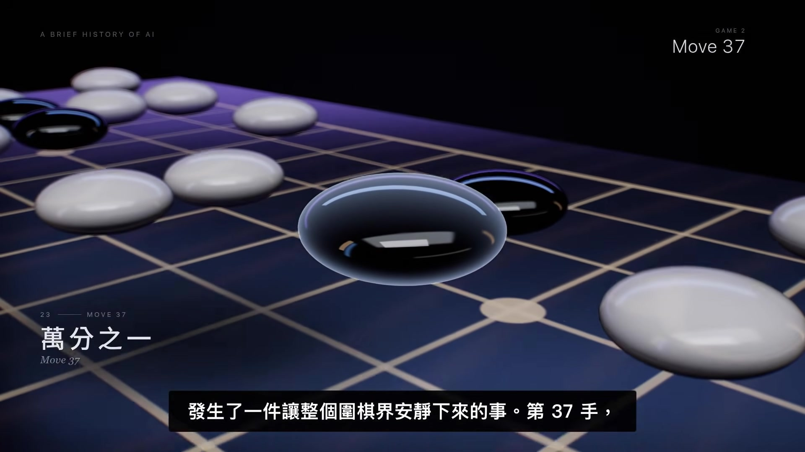

**逐字稿片段：** 第37首 AlphaGo下了一步 有職業騎士一開始以為是失誤 後來分析 一個人類騎手會下出這一步的機會 大約只有萬分之一 可是這一步 後來被很多騎士認為是一步妙手 這是一個很重要的時刻 他不是在模仿人 他從自己跟自己下的幾百萬盤裡 學到了一個人類下了幾千年都很少走的想法 第四盤 李賽魯也用一部同樣出人意料的題 拿下了唯一的一盤 隔年 Deep Mind又做了一個新版本 這一次連人類的旗譜都不看 從零開始自己下 三天之後就贏過了舊版 你把這幾件事放在一起 就會看到這一部分的主角 不再只是人給的例子 而是機器自己產生的例子 可是圍棋有一個很大的好處 輸贏很清楚 人類的語言沒有這種計分版 語言難在哪裡 你讀一句話 要理解其中一個詞 常常要看很前面的另一個詞 例如 我把獎盃放進行李箱 可是它太大了 放不進去 這裡的它指的是獎盃 你把太大改成太小 它就變成行李箱 一個字的差別 要回頭看整句才知道 在2017年以前 處理語言的神經網絡 大多是一個詞一個詞往後讀 讀到後面 前面的東西就慢慢模糊了 就像學說話的小孩 聽一段很長的話 聽到最後 忘了開頭在講誰 而且他一定要讀完上一個詞 才能讀下一個 沒辦法同時讀 這點很麻煩 因為我們在上一部分才看到 GPU厲害的地方 就是上千個核心同時做事 一個只能排隊慢慢讀的方法 等於讓GPU大部分的核心 都在旁邊等 所以語言卡住的地方 一半是記性 一半是吃不到計算能力

**話題推測：** 聚焦AlphaGo在第二局下出的「第37手妙招」。

---

## 00:19:44

**逐字稿片段：** 2017年 Google的八位研究者發表了一篇論文 標題很直接 叫Attention is all you need 意思是你只需要注意力

**話題推測：** 介紹2017年Google論文提出的Transformer架構。

---

## 00:19:50

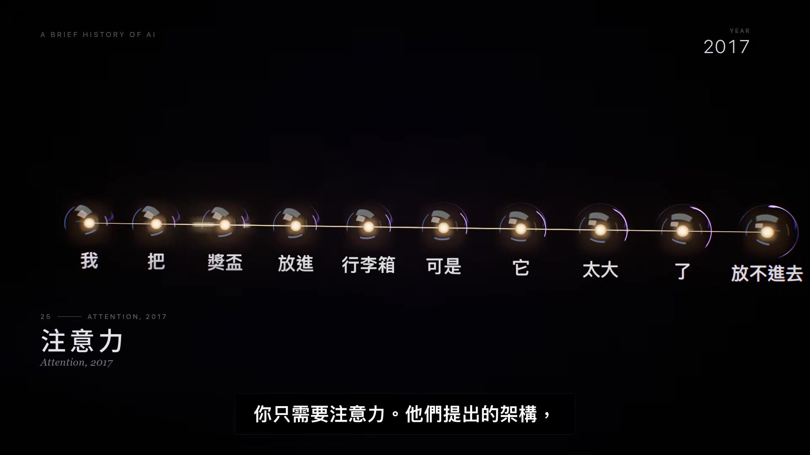

**逐字稿片段：** 他們提出的架構叫Transformer 它的核心是一個動作 叫Attention 中文叫注意力 它的意思是一句話裡的每一個詞 同時去看其他所有的詞 自己決定哪幾個跟我最有關係 剛剛那句話裡 它這個詞會去看獎盃 看行李箱 看太大 然後把最多的注意力放在獎盃上 這一次 也不用一個一個排隊讀了 所有的詞同時看彼此 這正好是GPU最擅長的那種 同時做事 記性的問題 跟吃不到計算能力的問題 一次解決 這篇論文當時是為了翻譯寫的 後來幾乎所有的大型語言模型都建在這個架構上 有了Transformer 還要回答一個問題 例子從哪裡來 照片要人標 語言要誰來標 答案出奇的簡單 不用標 你拿任何一段人寫的文字把下一個字遮起來 叫機器猜 猜對了很好 猜錯了就把旋鈕轉一點點 答案就在原文裡 不需要任何人去對

**話題推測：** 闡述Transformer模型核心的「注意力」(Attention) 機制。

---

## 00:20:36

**逐字稿片段：** 這種學法叫Pretraining 中文叫預訓練 2018年 OpenAI 用這個方法做出第一代GPT G是生成 P是預訓練 T就是Transformer 這一招的厲害之處在於 例子突然變成無限多 網路上每一篇文章 每一本數位化的書 每一段程式碼 都是現成的例子 我們回到學說話的小孩 以前他一年只聽得到死句話 現在他可以把一整座圖書館 從頭到尾偷聽一遍 而且為了猜準下一個字 他不得不學會很多東西 文法 事實 甚至一點推理 例如一本推理小說 要猜準最後一頁兇手的名字 得先看懂前面整本書 接下來幾年 大家發現一件很意外的事 這種模型好像越大越好 而且好得很有規律 2020年1月 OpenAI的Jerry Kaplan 和同事發表了一篇論文

**話題推測：** 引入「預訓練」(Pretraining) 的概念，實現無需人工標註的資料擴展。

---

## 00:21:19

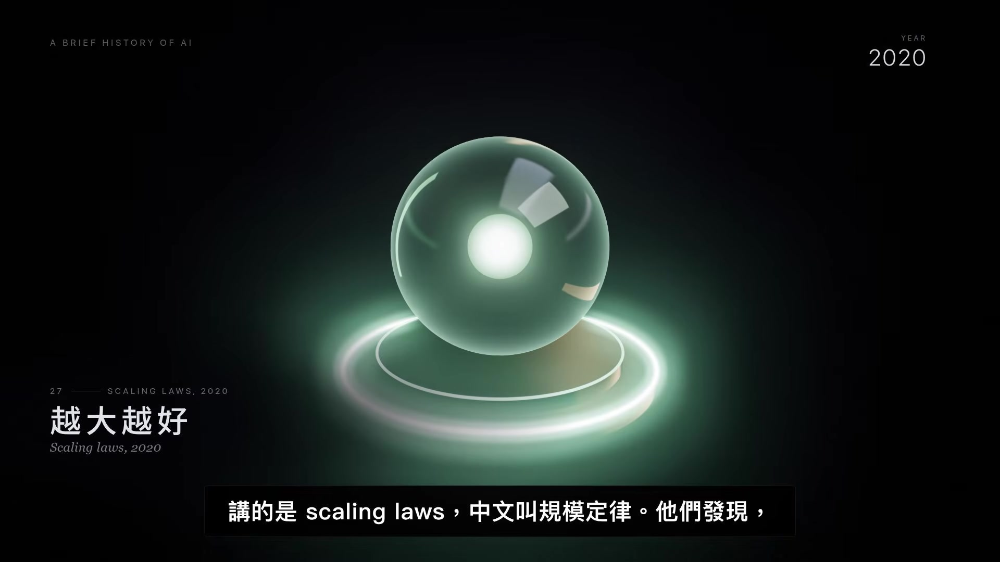

**逐字稿片段：** 講的是Scaling Laws 中文叫規模定律 他們發現 模型的旋鈕越多 讀的資料越多 用的計算能力越多 猜錯的程度 就照著一個很穩定的規律往下降 而且這個規律在很大的範圍裡都成立 說白一點 你幾乎可以事先算出 多花多少錢 能換到多好的模型 同一年 OpenAI發表了GPT-3 它有1751個旋鈕 是之前同類模型的十倍以上 它出現了一個新本事 你在問題前面給它幾個例子 它就能照著做一個 它從來沒被專門訓練過的新任務 這一課第二部分的那個答案 被推到了極端 如果缺的是例子跟計算能力 那就把它們加到前所未有的大 可是一個讀過整座圖書館的模型 並不等於一個好幫手 你問它一個問題 它可能不回答 反而接著寫出三個類似的問題 因為在網路上 問題後面常常接著更多問題 他學會的是接話 不是幫忙 我們回到學說話的小孩 一個偷聽了整座圖書館的小孩 懂很多 可是還不知道別人問他話的時候 該怎麼好好回答 這時候需要大人來教 2022年初 OpenAI發表了一篇論文 做的就是這件事 他們先請人示範好的回答 再讓模型對同一個問題 寫出好幾個答案 請人排名哪一個比較好 模型就往比較好的方向轉旋鈕 這個方法叫

**話題推測：** 介紹2020年Jared Kaplan等人發表的「規模定律」(Scaling Laws)。

---

## 00:22:30

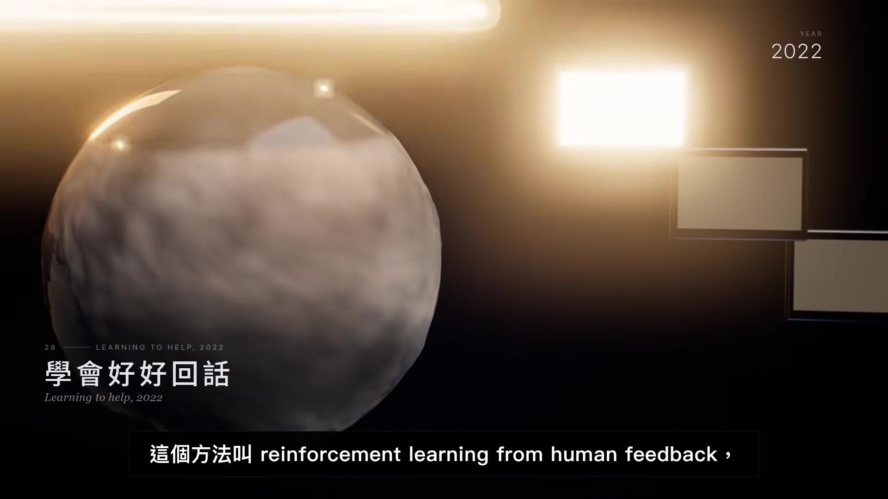

**逐字稿片段：** 這個方法叫 Reinforcement Learning from Human Feedback 中文叫人類回饋強化學習 這是AlphaGo那一招的變形 只是記分板從輸贏換成了人的喜好 論文裡有一個很有意思的結果 一個小了一百多倍的模型 經過這樣教過以後人反而比較喜歡他的回答 論文也寫得很直接 把語言模型變大 不會自然讓他更懂使用者想要什麼 2022年11月30日 OpenAir把這樣教過的模型 放上一個聊天網頁 當作研究預覽

**話題推測：** 介紹人類回饋強化學習 (RLHF) 方法。

---

## 00:22:55

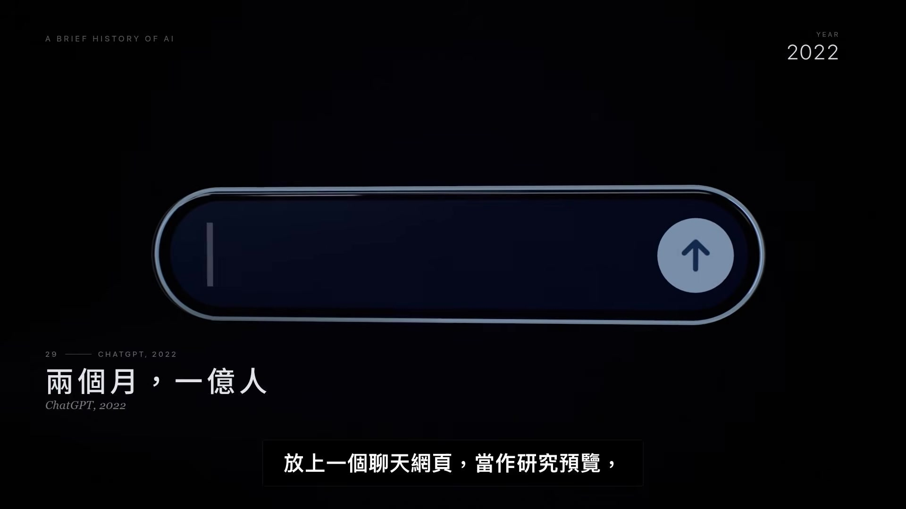

**逐字稿片段：** 名字叫ChatGPT 他的介面簡單到不能再簡單 一個輸入框 你打字 他回話 後面的事你大概記得 你請他寫一封信 他寫 你請他解釋一段程式 他解釋你隨口問一個問題 他像一個很有耐心的人一樣回答你

**話題推測：** 介紹2022年11月30日發布的ChatGPT。

---

## 00:23:09

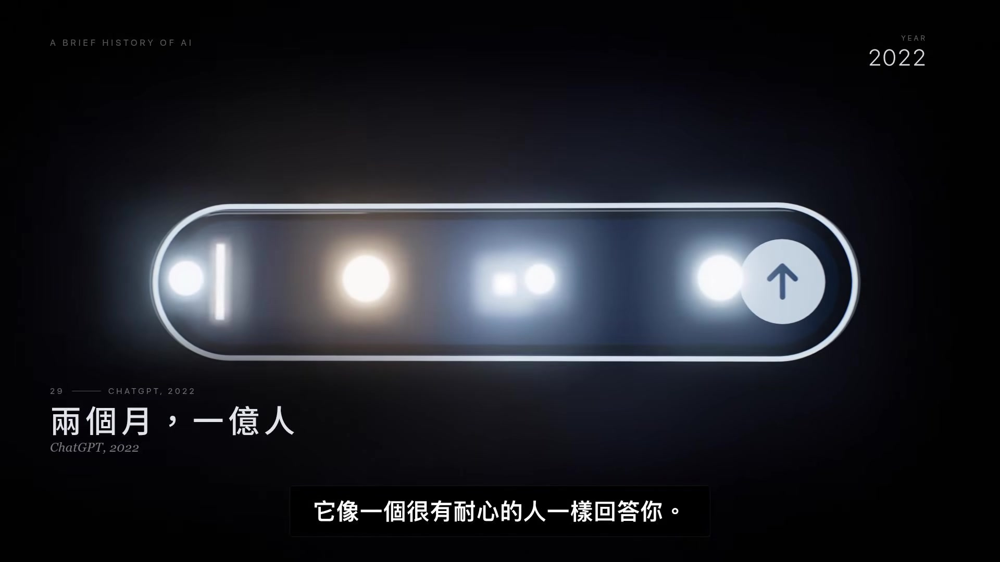

**逐字稿片段：** 根據瑞士銀行UBS分析師的估計 他推出兩個月 每個月的使用者就達到大約一億人 是當時史上成長最快的消費型應用程式 這是70年來 第一次有這麼多人 同時親手碰到一臺好像聽得懂人話的機器 你回頭看那張1950年的紙 Turing的模仿遊戲 一個人只靠打字 跟看不見的都這樣聊天 這個畫面突然變成了幾億人每天的日常 可是他真的在思考嗎 這個問題其實早就有人上過一次檔 1966年前後 MIT的Joseph Weissenbaum 寫了一個很簡單的聊天程式

**話題推測：** 提到ChatGPT在兩個月內達到一億用戶的驚人增長速度。

---

## 00:23:38

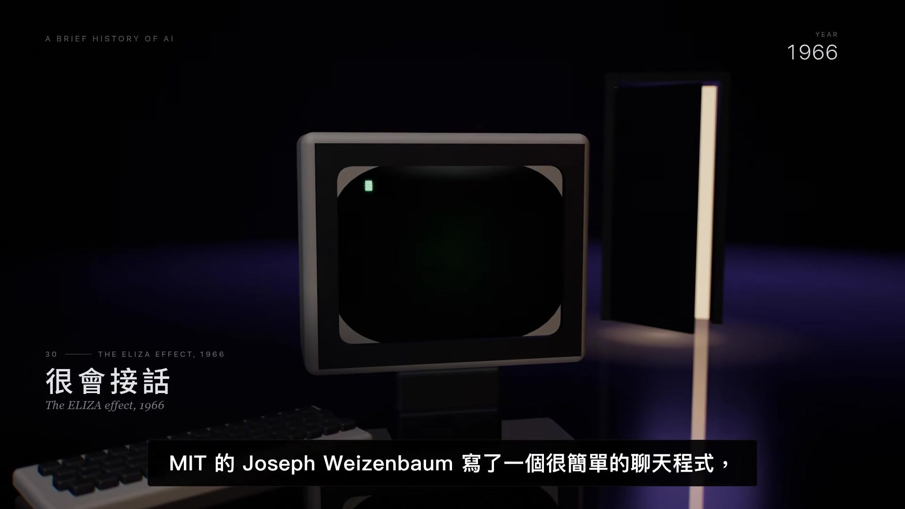

**逐字稿片段：** 叫Eliza 他假裝成心理智商師 做法只是把你說的話 換個說法丟回來問你 你說我最近很難過 他就問你 你為什麼覺得自己很難過 就這樣而已 可是據說 連Weissenbaum自己的秘書 用了一陣子以後 都請他離開房間 讓他跟Eliza單獨說話 Weissenbaum後來寫到 他沒想到 很短地接觸一個很簡單的程式 就能讓正常人產生很強的錯覺 後來大家把這種現象 叫Eliza Effect 中文叫伊莉莎效應 人很容易把它理解 投射到一臺很會接話的機器上 今天的模型當然比Eliza強太多了 他是真的能做很多事 可是這個提醒一直有效 他聽起來懂 不等於他每一次都懂 他說得很有把握 也不等於他是對的 ChatGPT之後 前沿的競賽換了好幾次方向 一個方向是讓模型先想再答 2024年9月

**話題推測：** 介紹1966年MIT的聊天程式Eliza，及其引發的「伊莉莎效應」。

---

## 00:24:22

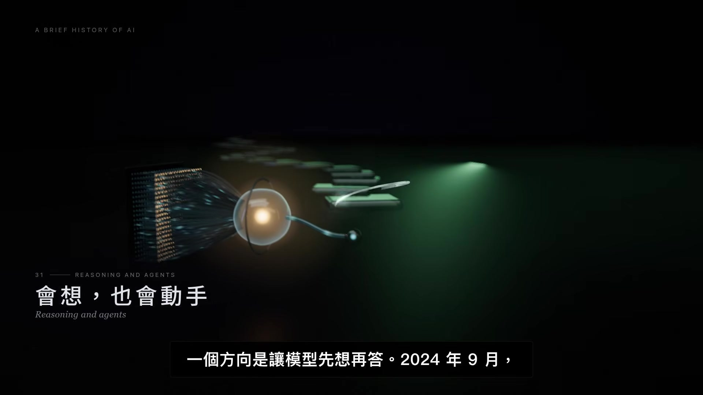

**逐字稿片段：** OpenAI推出一個叫O1的模型 他回答之前 會先寫出一長段自己的思考過程再給答案 他是怎麼學會好好想的 就是AlphaGo那一招 強化學習 這一類模型的計分版 常常是數學題 有沒有算對 程式有沒有跑過 你會發現 這一部分的三個工具 自己產生例子 注意力 人的回饋 在這裡全部接在一起了 另一個方向 是讓模型動手 這種能自己動手做事的

**話題推測：** 提及2024年OpenAI推出的O1模型，強調「先思考再回答」。

---

## 00:24:46

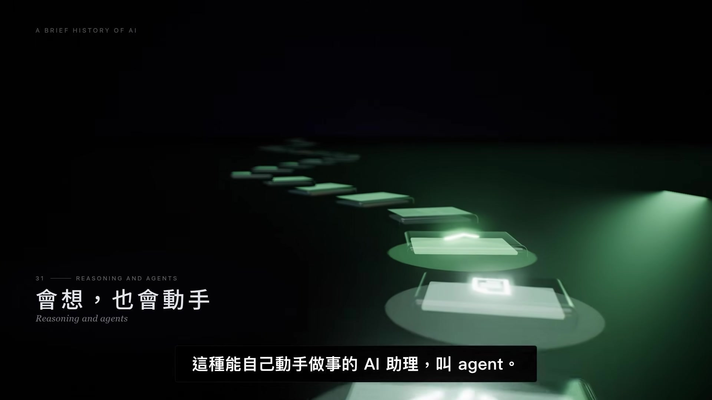

**逐字稿片段：** AI助理 叫agent 你交代他一件事 他會自己打開檔案 寫程式 執行 看結果 再修改 一連做好幾十步 2026年9月 Anthropic

**話題推測：** 介紹「AI Agent」概念，能夠自主執行多步驟任務。

---

## 00:24:55

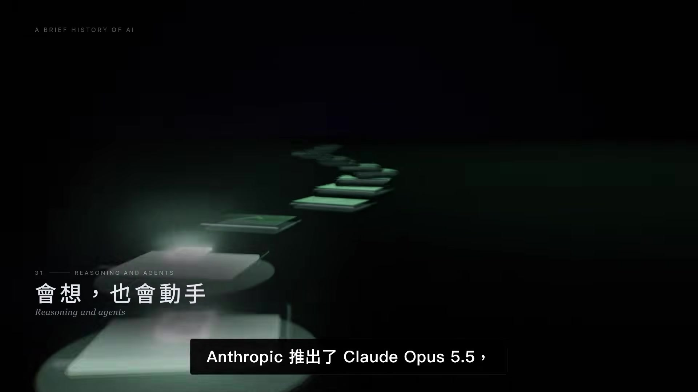

**逐字稿片段：** 推出了Color Opus 5.5 它是現在走在前面的 幾個模型之一 大家現在比的 已經是 他能不能一個人 把一整件工作做完 從一臺只會分辨 簡單圖形的感知器 走到這裡 花了將近70年 走到這裡 我們回到整集的問題 這次卡住的是什麼 答案跟前兩次不一樣 最先碰到的 是他會很有自信的講錯

**話題推測：** 提及2026年Anthropic推出的Claude Opus 5.5。

---

## 00:25:13

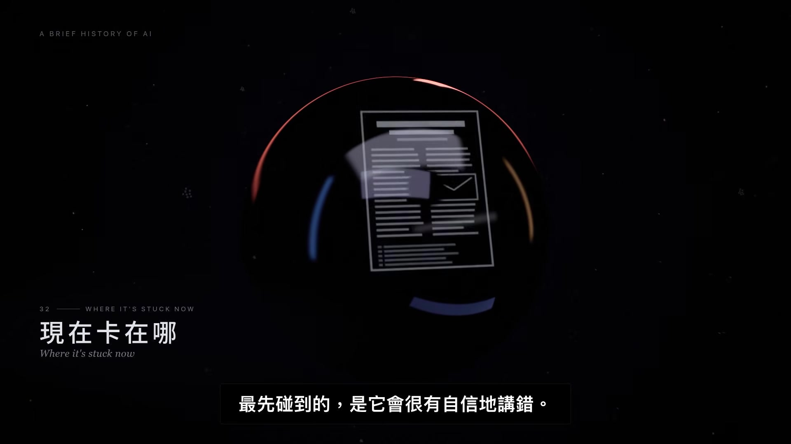

**逐字稿片段：** 這叫hallucination 中文叫幻覺 他可能編出一篇不存在的論文 連作者和頁數都有模有樣 原因並不神秘 他被訓練去猜最像的下一個字 而最像的答案 不一定是真的答案 另一個卡點 是我們看不太懂他學到了什麼 說明書的時代 每一條規則都是人寫的 錯了可以翻出來看 現在的模型有非常多旋鈕 是他自己賺出來的 哪一個旋鈕記住了什麼 研究的人還在努力看懂 這是一個有點諷刺的結局 我們放棄寫說明書 換來的機器真的會學 代價是 他學會的東西 也變成一本我們讀不太懂的說明書 還有一個比較實際的卡點 前河店 每網上放大一集要的晶片跟電力 就多一大截 那冬天會不會再來 這個問題我沒辦法回答 我只能把前兩次冬天的樣子 擺在你面前 兩次冬天 都有同一個前奏 一邊是很大的承諾 像20年內做到 任何人能做的工作 另一邊是很多錢 壓在同一個方向 然後有一天 有人拿承諾去對賬 今天這兩個前奏都在 有人說幾年之內 機器就會做完大部分的工作 也有很多錢 壓在更大的模型 跟更大的資料中心上 可是也有一件事 跟前兩次不一樣 前兩次冬天來的時候 真的拿得出去用的東西 都只在很窄的一小塊領域裡 今天的模型 已經每天被幾億人拿來寫訊 寫程式查資料 他可能在某些地方被高估 也可能在另一些地方被低估 可是他不是隻活在實驗室裡的東西 比較可能的不是整片結冰 而是春天說出口的話 又一次被拿去對賬 有些兌現了有些沒有 在收尾之前 我想把幾個名字放回去

**話題推測：** 闡述當前AI模型面臨的「幻覺」(Hallucination) 問題。

---

## 00:26:36

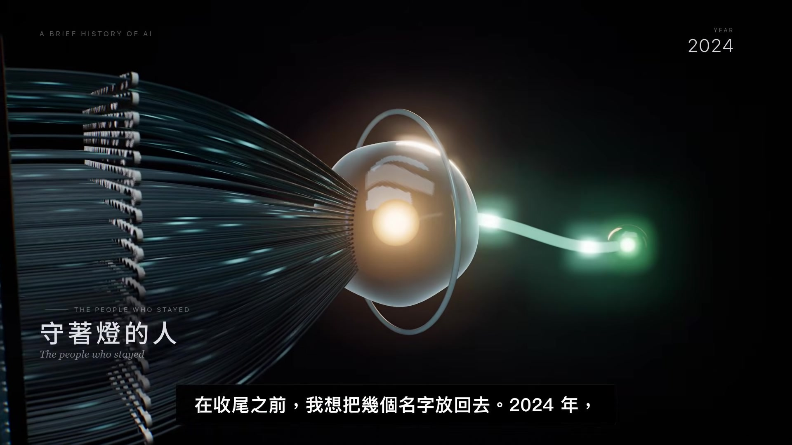

**逐字稿片段：** 2024年諾貝爾物理學獎 頒給了John Hopfield和Jeffrey Hinton 理由是他們的基礎發現和發明 讓機器能夠用人工神經網絡學習 Hinton就是那個 1986年寫反向傳播 也在2012年帶著兩個和聲 推開門的人 中間二十幾年他大部分的時間 都在做一件別人覺得過時的事 同一年的諾貝爾化學獎

**話題推測：** 提及2024年諾貝爾物理學獎頒給John Hopfield和Jeffrey Hinton。

---

## 00:26:57

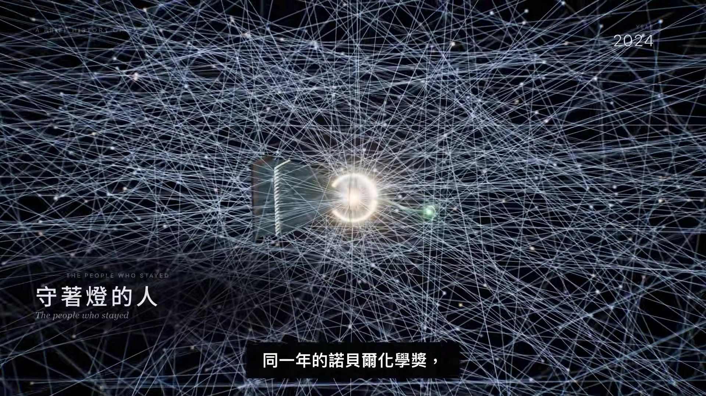

**逐字稿片段：** 有一半頒給了DeepMind的 Demis Hassabis和John Jumper 因為他們用AI預測蛋白質的形狀 我們再往回看 Rosenblatt 沒有等到這一天 他的感知器被一本書擋了下來 Turing也沒有等到 他在1954年就過世了 那篇論文最後寫的那個會學的小孩 要再過60年才真的長大 這段歷史裡最常被講的 是那些大膽的預言 可是真正把路走通的 常常是那些在冬天裡 還繼續點著燈的人 我們最後停一下

**話題推測：** 提及同年諾貝爾化學獎頒給DeepMind的Demis Hassabis和John Jumper。

---

## 00:27:22

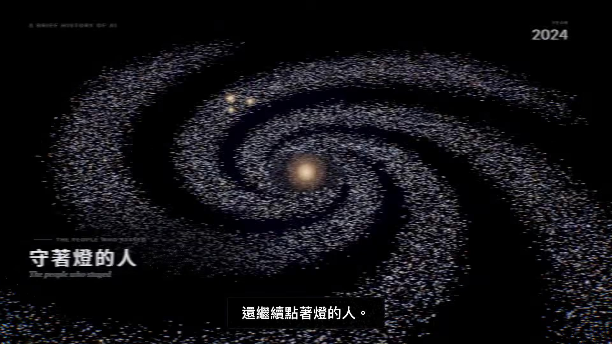

**逐字稿片段：** 把第三部分收起來 這一部分的問題是 粒子跟計算能力加上去 它能走多遠 答案是 比幾乎所有人預期的都遠 粒子不用人標了 機器跟自己下棋 或者把整座圖書館的 下一個字一個一個猜 自己就產生了粒子 注意力讓語言吃得到 GPU的計算能力 人的回饋 教他怎麼好好回話 再加上強化學習 他開始會先想 也會動手 可是走得越遠 卡住的東西也換了 以前卡在我們寫不出來 現在卡在他自己學出來的東西 我們看不太懂 他什麼時候會錯 他自己也不一定知道 每根上的話 記住這一句 機器已經學會了很多 我們說不出來的事 現在難得 是弄清楚他到底學會了什麼 我們回到開場那個問題 70年來 每一次大家都說 機器快要會思考了 後來卡住的 到底是什麼 前兩次卡住的都是同一件事 智慧裡最大的一塊 我們自己也說不出來 所以寫不成規則 後來往前走的那一步 是Turing在1950年就寫下的想法 與其寫一個大人 不如做一個會學的小孩 讓他自己從例子裡學 才等到夠多的例子和夠大的力氣 所以這一集的答案是 難的不是把智慧寫進機器 是讓他自己學出來 而今天他真的學出來了 新的問題也跟著來了 我們要怎麼看懂他學到了什麼 至於機器到底會不會思考 Turing 當年把這個問題換成了一個遊戲 今天這個遊戲很多人每天都在玩 問題卻還在 最後問你一個問題 你第一次覺得機器好像真的聽懂 你是在哪一課 留言告訴我 簡史系列還會繼續 下一段歷史我們下一集再走 喜歡的話訂閱AI Notebook 開啟通知 我們下次見

**話題推測：** 總結第三部分：資料與計算力推動AI發展，但也帶來新挑戰。

---
