# jimainotebook_ddTy5Fra4-4 — 關鍵畫面索引

- 來源逐字稿：[jimainotebook_ddTy5Fra4-4_FIN.srt](jimainotebook_ddTy5Fra4-4_FIN.srt)
- 影片：https://www.youtube.com/watch?v=ddTy5Fra4-4
- 截圖數：84

## 00:00:14

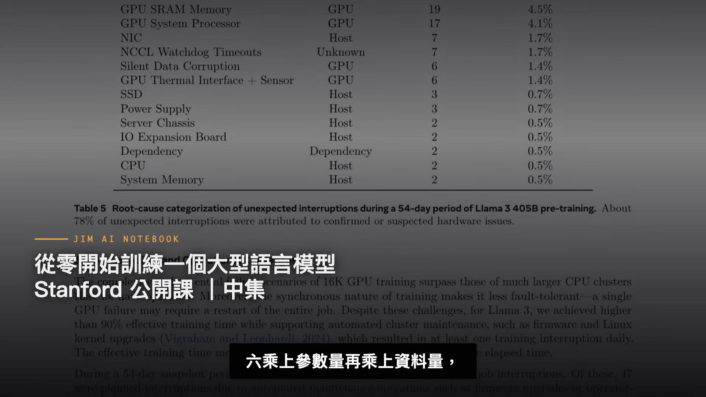

**逐字稿片段：** 1000張顯示卡要跑144天,一個參數要吃掉16個位元組 所以一張卡根本裝不下一個700億參數的模型 算完之後問題不會消失,它只會變得更具體 終極要回答的就是接下來那三個問題 第一,這個模型到底跑不跑得動,你要怎麼把它切開 看到幾千張卡上面 第二 這筆錢花對了沒有 你憑什麼在還沒開始訓練之前 就決定模型要多大 資料要為多少 第三 五個月燒完之後 你怎麼知道它到底有多好 這三個問題對應的是 課程的第七到第十二講 而他們其實共用同一種能力 我們先從一份論文附錄裡的數字說起

**話題推測：** 呈現1000張顯示卡運行144天、參數佔用16位元組等具體數字，可能為上次課的總結或新資料展示。

---

## 00:00:51

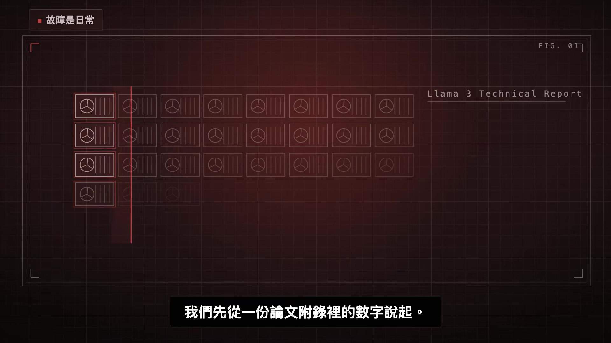

**逐字稿片段：** Meta在Lama3的技術報告裡 很誠實地記下了那次訓練期間 所有的中段 他處在第七講 把這一頁調出來給學生看 裡面有一個數字是這樣的

**話題推測：** 提到Meta Llama 3技術報告，可能展示報告名稱或相關頁面。

---

## 00:01:01

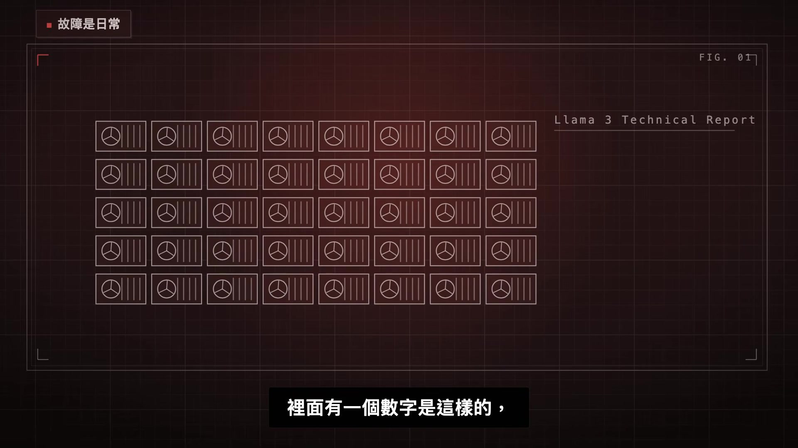

**逐字稿片段：** 光是顯示卡故障造成的中斷 就有148次 大約佔掉全部中斷的三成 另外還有32次是機器臨時要維護 根本沒有排進計劃裡 而且這還只是民豬壞的那一種 他主說業界更怕的是另一種 顯示卡不報錯 那只是默默的回傳錯的數字 你的訓練照跑 損失曲線照降 等你發現的時候 錢已經燒掉了 你可以想成一個工地 你手上有10萬個工人 每天都有人請假 還有幾個人在偷偷把螺絲鎖歪 而這個工地連續好幾個月不能停工 這就是這一集開始的地方 當你的計算規模大到這個程度 股漲不是意外 它是日常 塔楚在第七講的開場 只講了一句話 就把整堂課的鏡頭拉遠了 他說

**話題推測：** 列舉Meta Llama 3訓練期間具體的中斷次數與比例，可能以統計圖表或數字列表呈現。

---

## 00:01:43

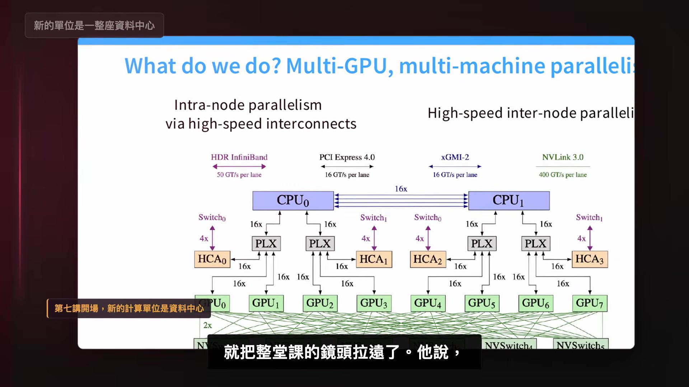

**逐字稿片段：** 計算的基本單位已經不是一顆顯示卡了 新的單位是一整座資料中心 這句話聽起來像羞恥 可是他真的改變了每一件事 你在一臺機器上寫程式的時候 講的是怎麼把資料 從記憶體搬到計算單元旁邊 這是上集的主題 現在你要想的是 怎麼把資料從這棟樓的這一排機櫃 搬到走到另一邊的那一排機櫃 距離變遠了 中間多了交換器跟網路線 所有的老問題全部重來一次 而且每一項都被放大好幾個數量級 這也是為什麼剛才那148次故障 值得放在最前面 當你的計算單位變成一座資料中心 可靠性就變成演算法設計的一部分 而不是維修部門的事

**話題推測：** 提出計算基本單位從單張顯示卡轉變為資料中心，可能展示從單卡到資料中心的示意圖。

---

## 00:02:22

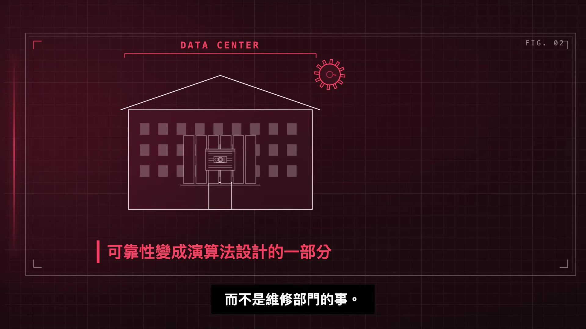

**逐字稿片段：** 接下來的兩講就是再教一件事 你手上有一個裝不進任何一臺機器的模型 你要怎麼把它切成幾千份 攤在這座資料中心裡 也讓這幾千份還能像一臺機器一樣一起工作 我們先把上集那本賬翻回來一頁上集算過 一個參數不是隻佔一份位置 他自己要一份 他的修正量要一份優化器 還要幫他記兩筆滑動平均 加起來大概要吃掉16個位元組 他除在第七講 把這筆賬講得更白 這16個位元組 其實等於你把同一份權重存了5次

**話題推測：** 預告接下來兩講的核心問題，即如何將模型切分並協同工作，可能為問題陳述投影片。

---

## 00:02:53

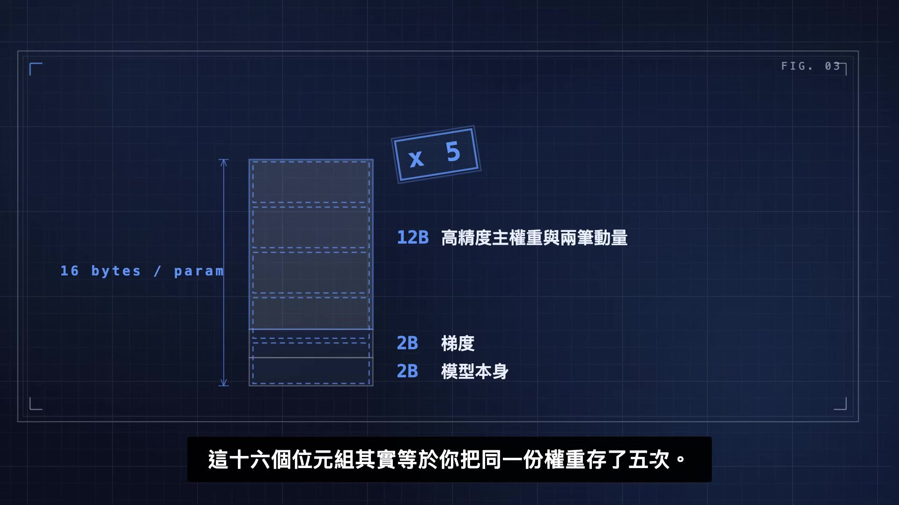

**逐字稿片段：** 所以8張H100 加起來的記憶體聽起來很多 真的拿來訓練的話 頂多塞了下一個60億參數的模型 而現在隨便一個主流的開放權重模型 有700億參數起跳 你看得出來這中間的缺口有多大 你可以想成搬家 上級 我們再算一個房間放不放得下一張床 現在的問題是這張床比整棟房子還大 把它切開 一部分放這間一部分放那間 然後讓他們合起來 還能像一張完整的床一樣用 這件事聽起來很荒謬 可是接下來我們要講的 全部都是在講 怎麼把這件荒謬的事做對 而且做到讓幾千張卡看起來像一張卡 要把一個模型切開 聽起來有無限多種可能

**話題推測：** 比較8張H100顯卡與700億參數模型的記憶體缺口，可能為記憶體使用率比較圖表。

---

## 00:03:33

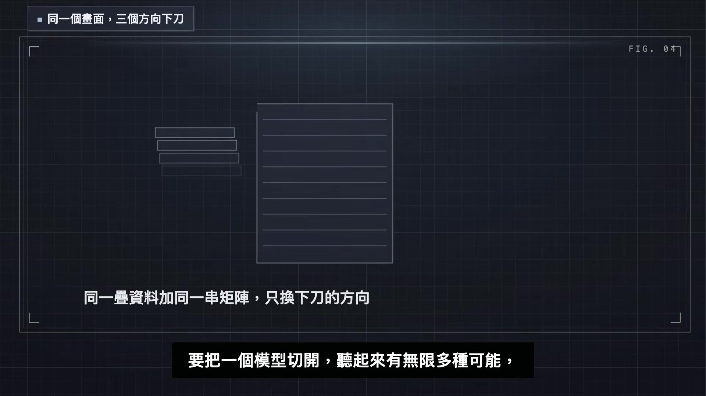

**逐字稿片段：** 實際上只有三種切法 Tasu在第八講用了一張很好的圖 同一個畫面一疊資料一串矩陣 你只要換一個方向下刀 就得到一種平行化

**話題推測：** 介紹模型切分的三種方式，可能配以示意圖。

---

## 00:03:43

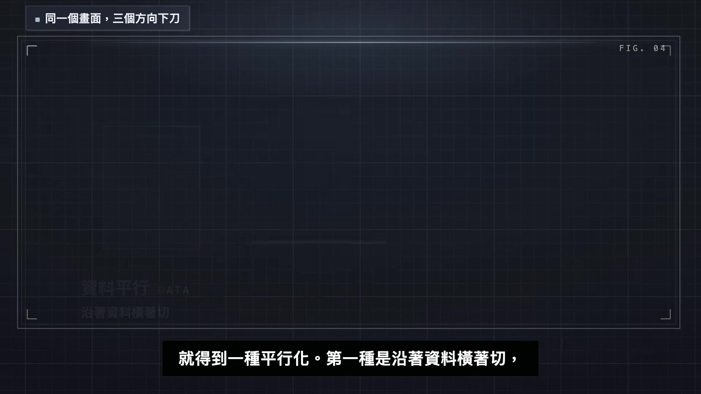

**逐字稿片段：** 第一種是沿著資料橫著切 每臺機器拿到不同的一批資料 模型本身每臺都存一份完整的 這叫資料平行

**話題推測：** 詳細解釋「資料平行」切法，可能展示資料與模型複製分佈圖。

---

## 00:03:51

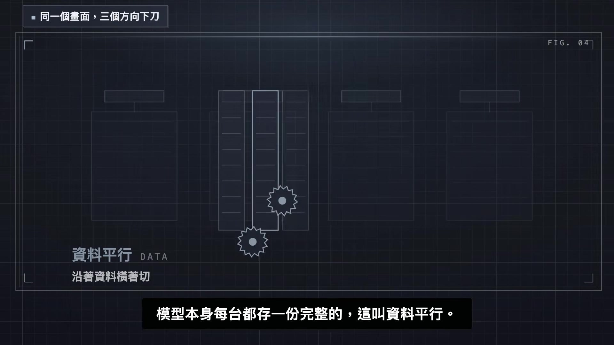

**逐字稿片段：** 第二種是沿著寬度直著切 每一個矩陣都被PO成好幾片 每臺機器只拿一片 這叫張量平行 張量你就想成上集講的那張數字表格 第三種是沿著深度切 模型有80層前20層放這一臺 接下來20層放下一臺 這叫管線平行

**話題推測：** 詳細解釋「張量平行」切法，可能展示矩陣切分示意圖。

---

## 00:04:08

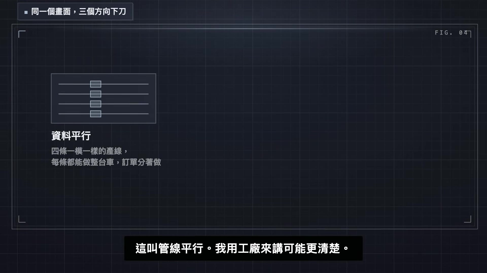

**逐字稿片段：** 我用工廠來講可能更清楚 資料平行是開了四條一模一樣的產線 每一條都能做完整臺車 只是訂單分的做 張量平行是同一道工序 找四個人一起做 一人負責一腳 管線平行是傳統的輸送帶 第一站裝底盤 第二站裝引擎 這三種分工各有各的代價 而選哪一種 答案不在演算法 在你機房的網路線上 我們一種一種看

**話題推測：** 使用工廠生產線比喻三種平行化，可能展示新的比喻圖示。

---

## 00:04:29

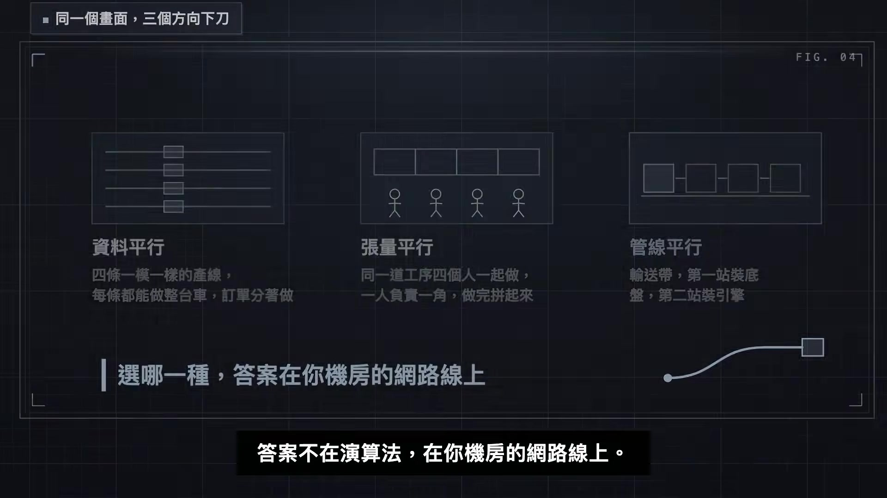

**逐字稿片段：** 先看最常用的資料 平行四臺機器 各存一份完整的模型 一批資料切成四份 每臺各算一份 算完之後 手上都有一份自己的修正量 問題就在這裡 四臺機器各學各的 四份修正量不一樣 如果放著不管 四個模型會越走越開 最後會變成四個不同的模型 所以每一步結束之前 四臺機器要對一次賬 把四份修正量加起來 平均掉 再各自更新

**話題推測：** 深入探討資料平行，解釋修正量同步問題，可能展示資料流與模型更新圖。

---

## 00:04:54

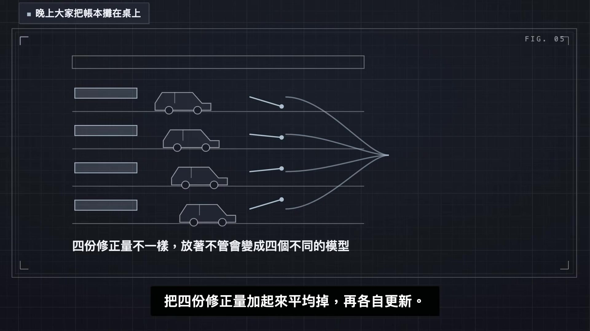

**逐字稿片段：** 這個動作 有一個正式的名字叫All Reduce 中文可以說成全體歸約 前面那個Reduce的意思是做加總這一類的運算 後面那個All的意思是 賺出來的結果要送回給每一個人 你可以想成四個店員各自記了一天的賬 讓大家把賬本攤在桌上 加總 然後每個人再抄一份一樣的總賬回去 他主說 這個領域的效能分析沒有那麼玄 你只要數兩件事 他呼叫了幾次集體通訊 每次搬多少東西 資料平行漂亮的地方是簡單 代價是每一臺機器都得存一份完整的模型 記憶體完全沒有省到

**話題推測：** 介紹「All Reduce」集體通訊操作，可能展示通訊流程圖。

---

## 00:05:28

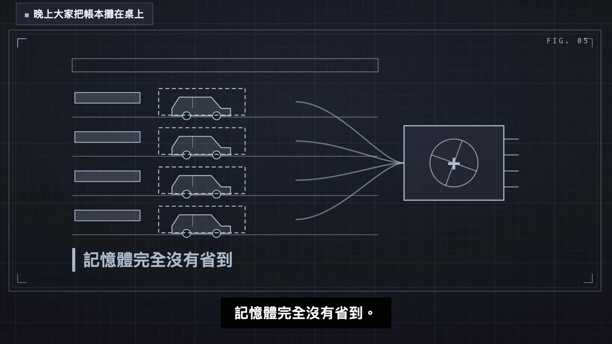

**逐字稿片段：** 第二種是張量平行 既然每臺都存一份完整的模型太浪費 那乾脆讓每臺只存一部分 模型裡面最大的東西就是那些數字表格 張量平行就是把每一張表格沿著寬度剖開 這臺機器各拿四分之一 一筆資料進來 四臺各自算自己那一片 最後再對一次賬 合起來 答案跟原本一模一樣 這就像一道很寬的工序 本來一個人從頭做到尾 現在四個人並排站 一人負責一段 做完 拼回去 張量 平行有一個非常珍貴的性質 資料 平行要靠加大批次量 才能攤平通訊成本 可是批次量是有上限的 超過某個規模 你再加大 模型學到的東西也不會等比增加 所以批次量在大規模訓練裡 是一種要精打細算的資源 而張量平行 完全不花這個資源 它切的是模型的寬度 跟你一次喂多少資料無關 代價是什麼 代價是 它每一層都要對賬一次通訊 非常密集 密集到它幾乎只能在同一臺機器裡面做 這一句話 等一下會變成整張最重要的那條鐵綠

**話題推測：** 深入探討張量平行，可能展示模型矩陣分片及計算流程圖。

---

## 00:06:26

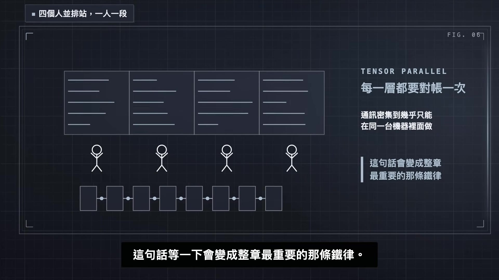

**逐字稿片段：** 第三種是管線平行 沿著深度切 模型有80層 你把前20層放第一臺機器 加20層放第二臺資料 從第一臺進去 算完20層 把中間結果傳給第二臺 第二臺接著算 這就是輸送帶 輸送帶有一個很現實的毛病 第一臺在算的時候 後面三臺在發呆 如果傳到第四臺 前面三臺又沒事做了 四臺機器裡永遠只有一臺在真的工作 這段空窗 在課堂上叫氣泡解法 是把一大批資料切成很多小批 讓他們一個接一個上輸送袋 慢慢的整條線就都填滿了 小批切得越多氣泡越小 代價又回到剛才那件事 你得有夠大的批資量可以切 管線平行還有一個代價不會寫在論文裡 Katsu轉述了他最近聽到的一段對話 某個前沿實驗室的人說 我們整個團隊只有兩個人 真的搞懂管線平行怎麼運作 其中一個已經離職了 所以他們的訓練系統 現在靠著一個人撐著 他用了一個詞形容那個人 沉重人 你就知道這件事在工程上有多不好惹 講到這裡 資料平行最大的問題還沒有解決 每一臺機器都要存一份完整的模型 要解決它

**話題推測：** 深入探討管線平行，可能展示輸送帶模型層級傳遞及氣泡問題示意圖。

---

## 00:07:31

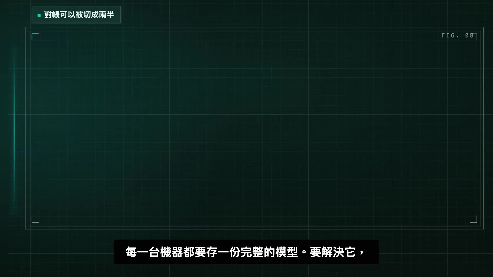

**逐字稿片段：** 我們得先看懂一個等式 這個等式是第七講的核心 剛才那個對賬的動作 其實可以被切成兩個更小的動作 第一個動作 四臺機器把自己的賬本切成四段 每臺只負責加總自己那一段這一步

**話題推測：** 引入核心等式，解釋All Reduce如何拆分成兩個子動作，可能展示公式或分解圖。

---

## 00:07:43

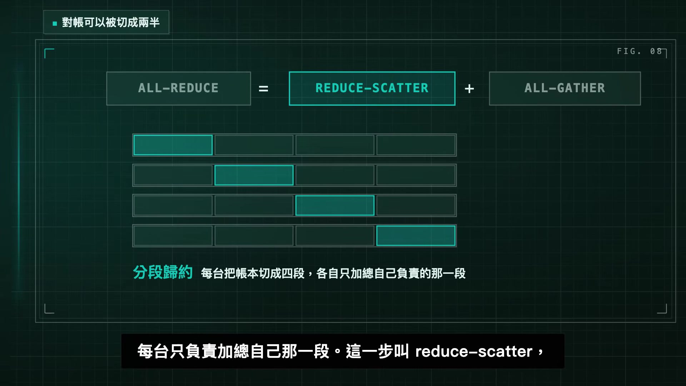

**逐字稿片段：** 叫Reduce Scatter 中文可以說成 分段規約做完之後 每臺手上有一段正確的總賬 第二個動作每臺把自己算好的那一段廣播出去四段拼起來 每個人就都有完整的總賬了 這一步叫all gather全體收集 這兩步加起來跟直接對一次賬的結果一模一樣 他說這是這一講你唯一需要背下來的橫等式 那為什麼重要 因為當你發現對賬可以被切成兩半 你就會發現中間那個狀態非常有價值 每臺機器只拿著一段總賬 這件事聽起來像缺陷 可是換個角度看 那就是每臺機器只需要存四分之一的東西 整條瀑布就是從這個念頭開始的

**話題推測：** 介紹「Reduce Scatter」動作，可能展示其通訊步驟。

---

## 00:08:21

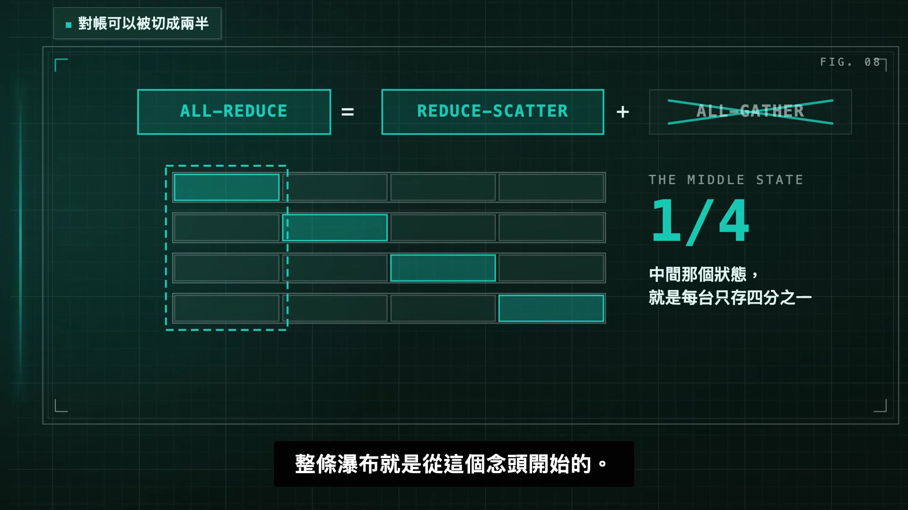

**逐字稿片段：** 這個念頭做成系統就叫ZERO 名字的意思是把冗餘降到零

**話題推測：** 引入ZERO系統概念，旨在減少記憶體冗餘，可能展示ZERO的架構圖。

---

## 00:08:26

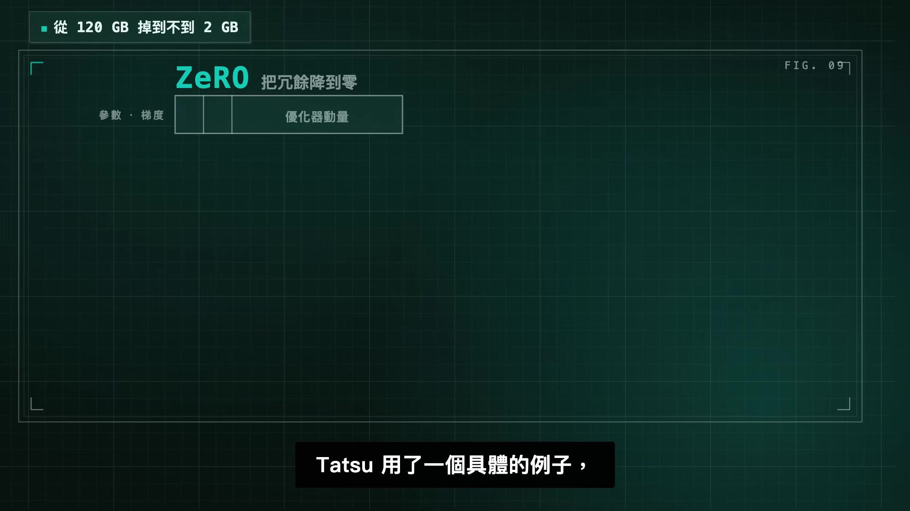

**逐字稿片段：** TASU用了一個具體的例子 一個75億參數的模型 攤在64個加速器上面 一開始什麼都不切 每一臺都存完整的一份

**話題推測：** 舉例說明75億參數模型在64個加速器上的記憶體優化過程，可能以數據表格或瀑布圖展示。

---

## 00:08:34

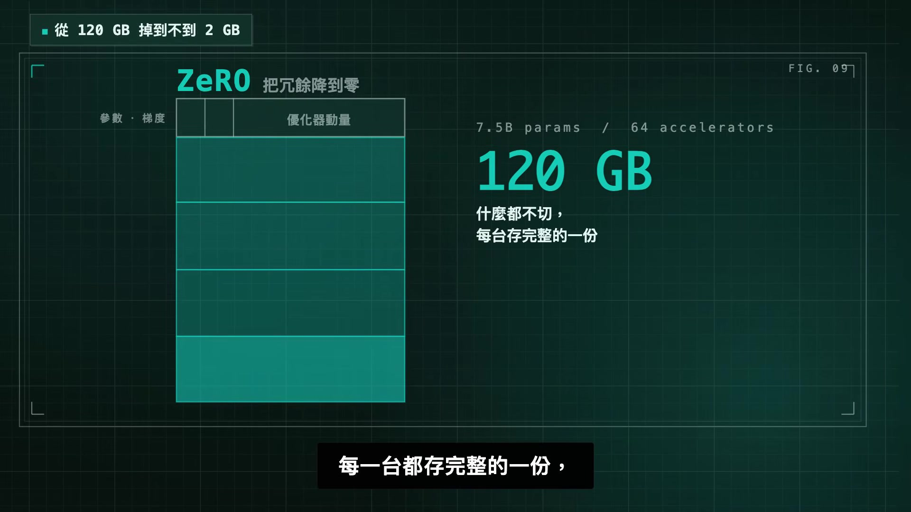

**逐字稿片段：** 每一張卡要吃掉120GB的記憶體 讓我們一段一段往下切 第一段優化器 那兩筆動量最肥 可是它只有在更新參數的那一瞬間才用得到 那就不要每臺都存切成64份 每臺只管自己那一段 120掉到31.4

**話題推測：** 列出優化前每張卡120GB的記憶體使用量。

---

## 00:08:52

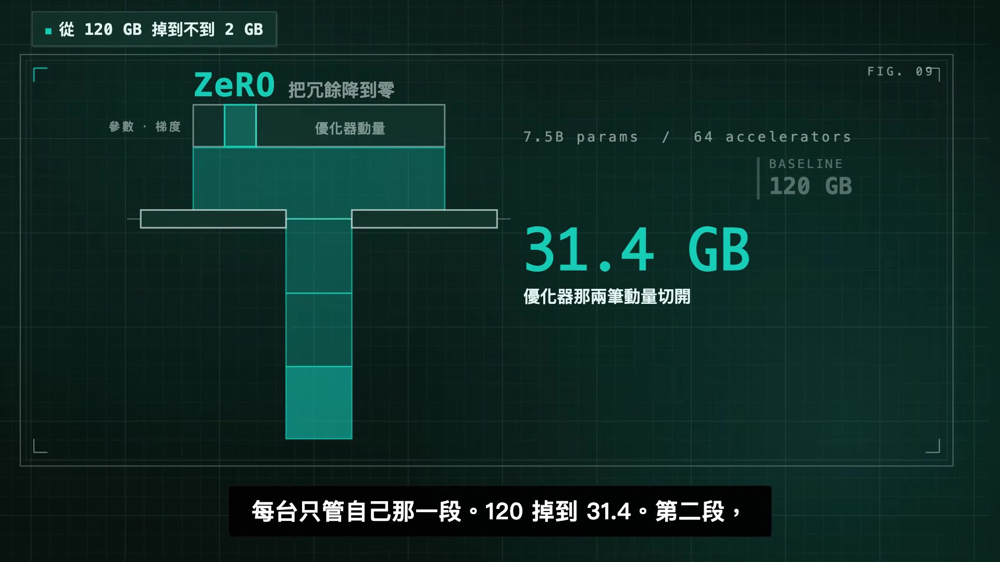

**逐字稿片段：** 第二段 提度也是一樣的道理 你只需要自己負責的那一段提度 其他的加總完就可以丟掉 31.4掉到16.6 第三段最徹底

**話題推測：** 第二階段優化，將梯度數據切分，記憶體從31.4GB降至16.6GB。

---

## 00:09:00

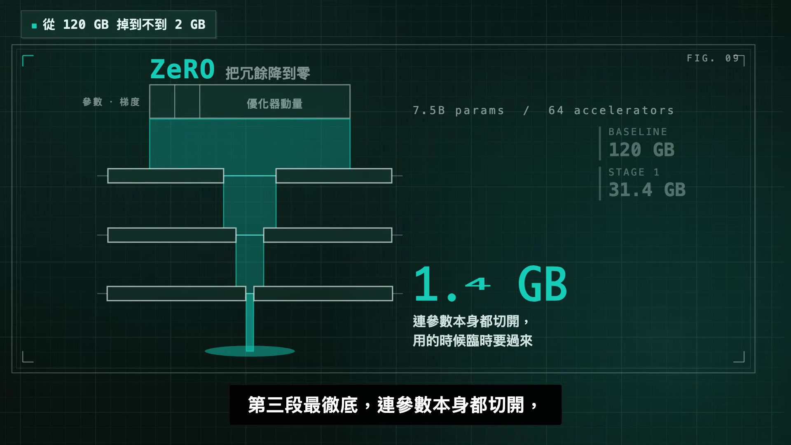

**逐字稿片段：** 連參數本身都切開 需要哪一層 就臨時跟大家要過來 用完就丟 16.6掉到1.9 重新看一次 這條瀑布120GB 掉到不到2GB 模型一樣大 資料一樣多 結果一模一樣 只是沒有人在存重複的東西了 這是我在整門課裡 也看過最漂亮的一張圖 你聽到第三段的時候 心裡應該會冒出一個疑問 參數都不留在本地 每算一層都要跟其他機器要一次 那不是要搬風了嗎 這確實是它的代價 通訊量會變成原本的1.5倍 可是它實際跑起來的開銷 比大家想像的低很多 原因是一個很聰明的安排 機器在算第一層的時候 負責通訊的那條線路並沒有閒著 它已經在背景把第二層的參數要過來了 等第一層算完第二層早就到了 這就像餐廳的備料 廚師在炒這道菜的時候 助手已經把下一道菜的料切好放在旁邊 所以廚師從來不用停下來等 這一招你可能已經用過了 只是不知道它的來歷

**話題推測：** 第三階段優化，將參數本身切分，記憶體從16.6GB降至1.9GB。

---

## 00:09:54

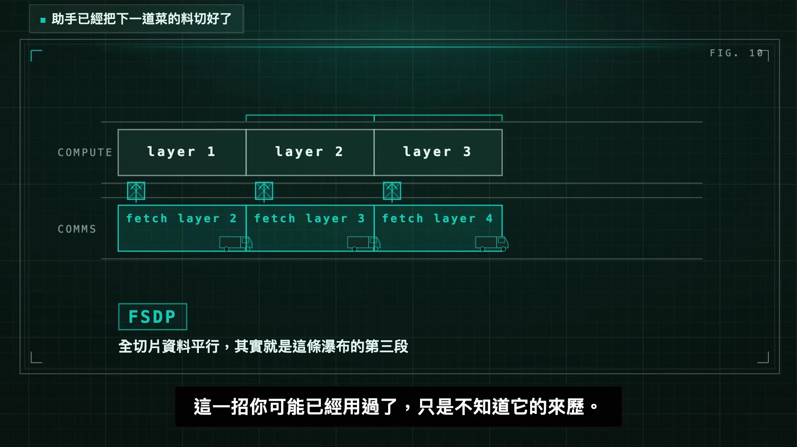

**逐字稿片段：** Pytorch裡那個叫FSTP的東西 中文是全切片資料平行 那其實就是這條瀑布的第三段 這條瀑布的效果有多實在 塔數給了一個數字

**話題推測：** 提到PyTorch中的FSDP（全切片資料平行）技術，可能展示其名稱或示意圖。

---

## 00:10:03

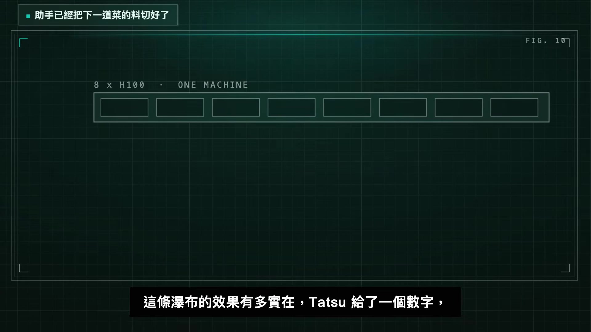

**逐字稿片段：** 同樣是8張H100的一臺機器 什麼都不切的時候你只塞了下60億參數 切到最徹底之後 同一臺機器可以塞500億 同樣的硬體同樣的錢 訓練的模型大了將近8倍 講到這裡你可能會覺得 這一整套像是隻有大公司 才碰得到的黑魔法 第八講 整堂課就是來破除這個印象的

**話題推測：** 比較8張H100顯卡在不同切分策略下，可訓練模型大小的提升，可能以長條圖呈現。

---

## 00:10:23

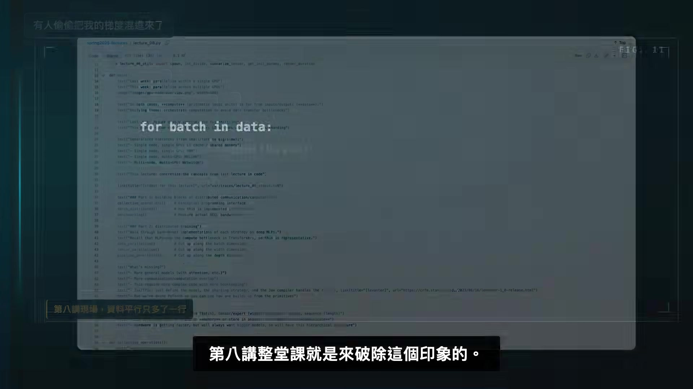

**逐字稿片段：** 他處打開編輯器 當場把這三種平行化各寫一次 每一種都只有十幾行 我最喜歡的是資料平行那一段 他先寫一個最普通的訓練迴圈 讀一批資料 算損失 反向傳播 更新參數 然後他再反向傳播 算完之後更新參數之前 插進去一行 把所有機器的梯度對一次張 平均掉 就這樣 結束了 這一行就是完整的資料平行 哈處講了一句我覺得很傳神的話 他說 從優化器自己的角度看 好像什麼事都沒有發生 我就是在跑我的梯度下降 只是有人偷偷把我的梯度混進來了 你可以想成 四個人同時在改同一份文件 改完之後有人把四份修改合併 再把合併後的版本發回給每個人 從每個人的角度看 他只是在改文件 可是那份文件已經悄悄變成大家的共識了 分散式訓練沒有那麼神秘 它是幾個1980年代就有的通訊原語 重新排列組合而已 這樣我們可以回答那個問題了 三種切法到底要怎麼選 踏出的答案很乾脆 答案不在演算法 在你機房的線路上

**話題推測：** 展示平行化程式碼範例，可能為程式編輯器畫面。

---

## 00:11:23

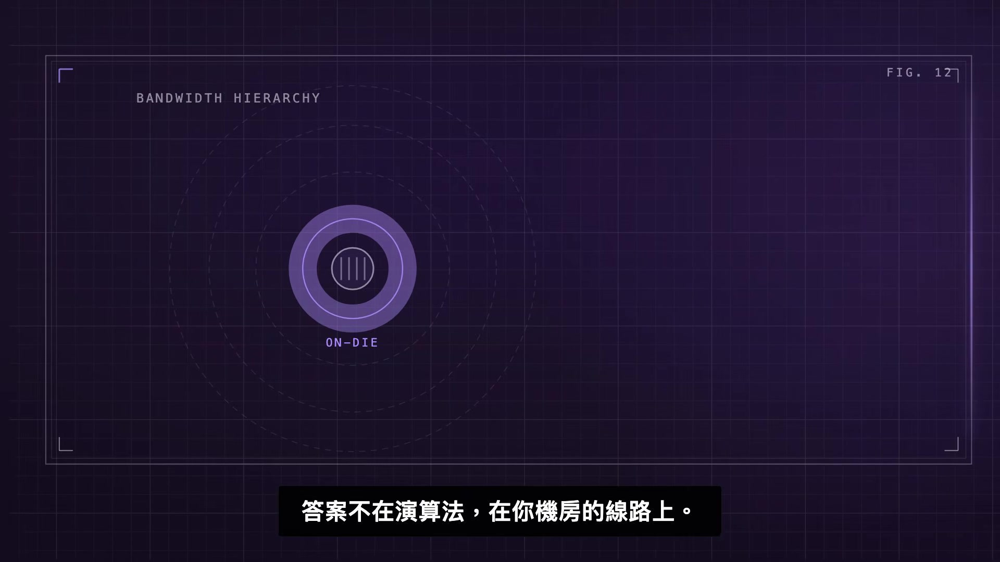

**逐字稿片段：** 顯示卡衝擊的網路是分層的 在機器裡面通常有八張卡 這八張卡之間走的是 揮達自己的專用線路叫NV-Link 快到什麼程度 快到跟顯示卡讀自己的記憶體只差幾倍 可是這八張卡想跟隔壁機器的卡講話 就得走出機殼走網路交換器 一條線叫Infiniband 它述說 同樣一條通道走出機殼之後大概慢8倍 再往外還有一層 整個重集 大概在256張卡以內 任何兩張卡都能直接快速對話 超過這個規模 風包就得再爬一層 交換器速度又降一級 所以整個機房其實是一組同心圓 圓心的水管最粗 往外一圈就細一截 這件事的意思是 你手上那三種切法 同訊量最大的那一種 必須放進最粗的水管裡 而通訊量最大的就是張量平行 每一層都要對一次帳 一臺機器裡剛好有8張卡 這兩件事一對上 那條鐵綠就自己出來了

**話題推測：** 解釋顯示卡網路的分層結構（NV-Link, Infiniband等），可能以網路拓撲圖展示。

---

## 00:12:16

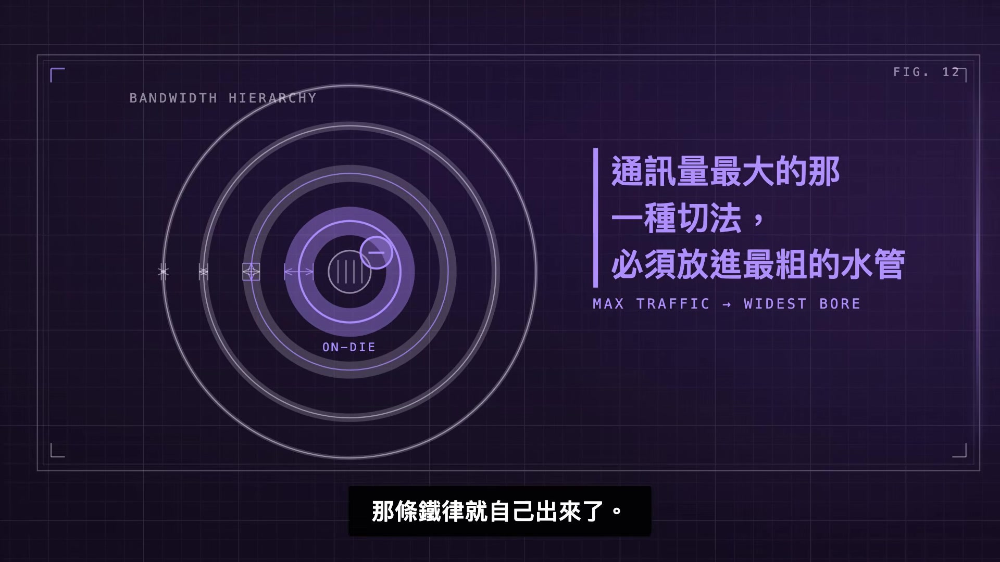

**逐字稿片段：** Tatsu贏了一份實測資料 張量平行切到8張卡以內 吞吐量大概損失1層到1層2 這是可以接受的代價 切到16張卡 也就是跨出了機殼的吞吐量直接掉4層2 切到32張 再掉6層5 這條曲線只講一件事 張量平行的甜蜜點就是8 而8這個數字不是理論算出來的 它就是一臺機器裡有幾張卡 所以那句 到處都看得到的張量 平行射8 不是迷信 它是機殼的形狀決定的

**話題推測：** 引用實測數據，說明張量平行在不同卡數下的吞吐量損失，可能以折線圖呈現。

---

## 00:12:43

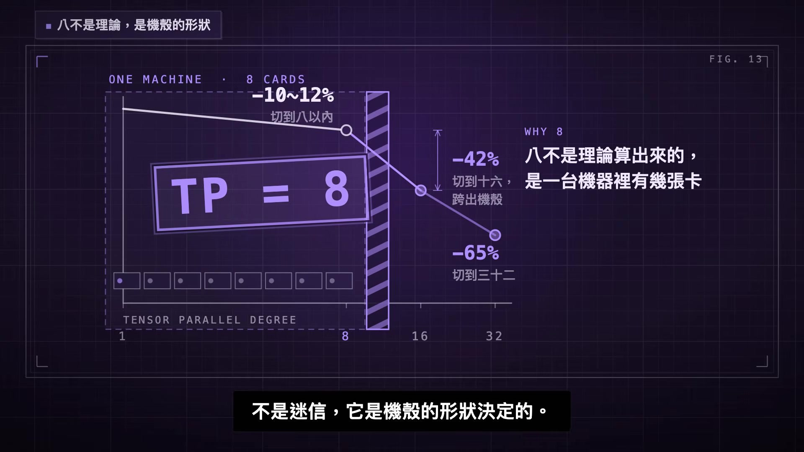

**逐字稿片段：** 整套決策流程其實很短 第一步張量平行開到8 先把單機吃滿 第二步模型還是塞不下 才跨出機殼 用那條瀑布的第三段 或者管線平行第三步 剩下的卡全部拿去做資料平行 他屬於給了一個例外 他說他知道的例子裡

**話題推測：** 總結平行化決策流程的步驟，可能為流程圖或步驟清單。

---

## 00:12:58

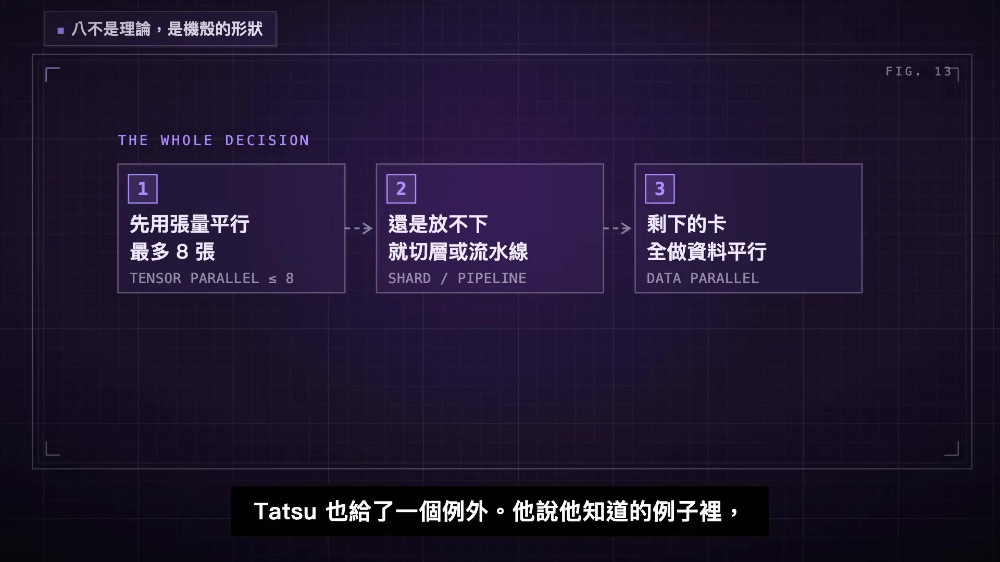

**逐字稿片段：** 只有DeepSeek V3 完全不用張量平行 改成16路管線平行 加上64路專家 平行專家平行 是因為它是專家混合架構 模型裡面有很多份專家 那就乾脆一臺機器管幾份 這個例外很有意思 因為它通常代表一件事 那家公司的機器之間 線路沒有別人好 機器排好了

**話題推測：** 提及DeepSeek V3模型的特殊平行化配置（管線平行和專家平行），可能為其架構圖。

---

## 00:13:18

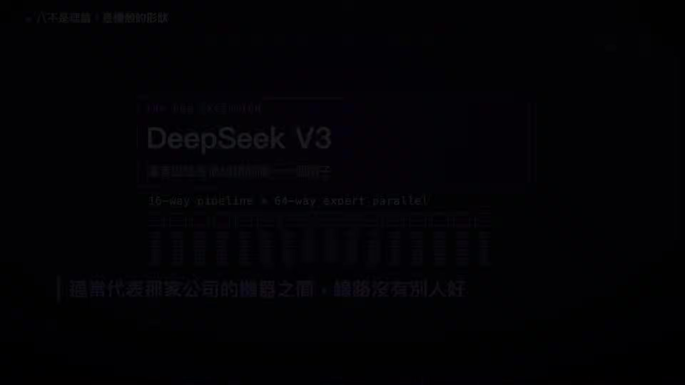

**逐字稿片段：** 現在換一個完全不同的問題 它似乎在第九講一開場 給了學生一個情境

**話題推測：** 轉入全新話題：如何在大規模訓練前決定模型參數。

---

## 00:13:23

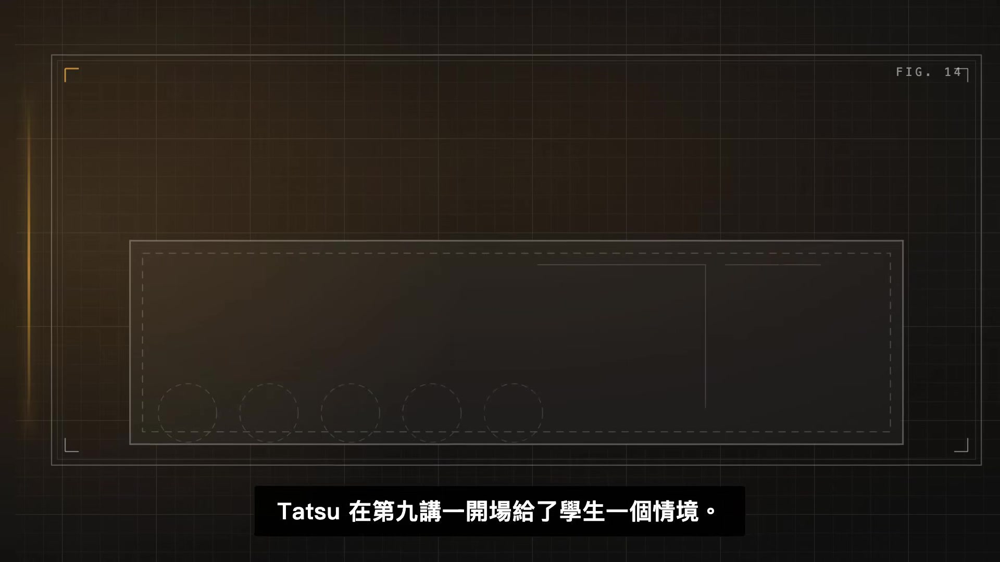

**逐字稿片段：** 假設你有一個很有錢的朋友 他借你十萬張H100用一個月 條件是你要造出 當下最強的開放權重模型 這個情境的重點不在錢 在於你只有一次機會 你不可能訓練20個大模型來挑一個 那筆錢只夠燒一次 所以模型要多大 資料要為多少 學習率設多少 全部都必須在你按下開始之前就決定好 踏鼠把深度學習過去的做法形容為 又舊又討厭 就是訓一堆大模型 一邊調參數一邊看 它變好 那在你有無限次機會的時候可行 現在完全不可行 所以有了新的做法 它稱之為新的樂觀主義 你先訓練一大堆很小的模型 小到便宜的可以隨便試 從他們身上找出一條規律 然後把這條規律往上外推 直接算出大模型該長什麼樣子

**話題推測：** 設定情境，假設有大量H100顯卡用於訓練，可能展示這些顯卡的視覺。

---

## 00:14:08

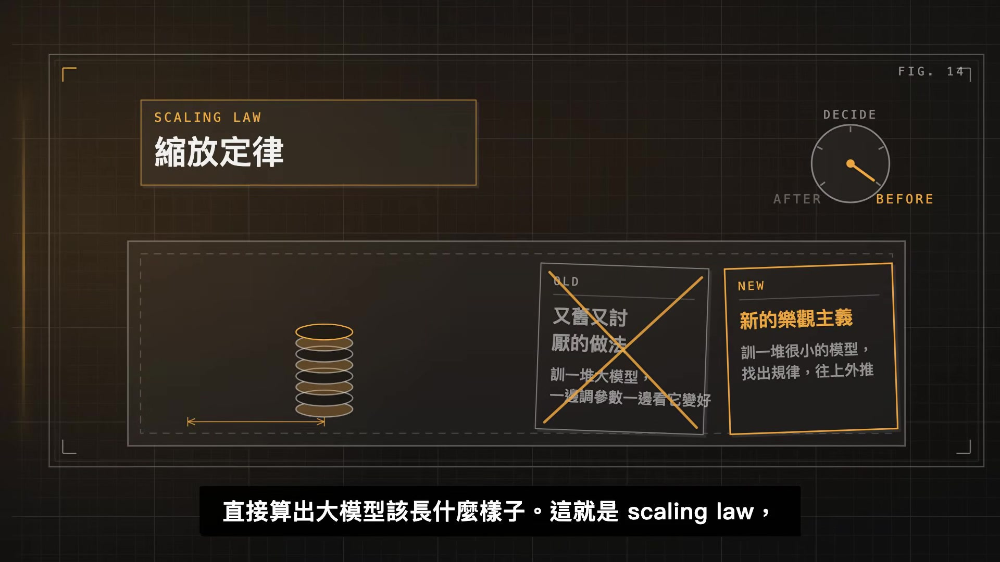

**逐字稿片段：** 這就是Scaling Law 中文可以說成縮放定律 那其實不是在預言人工智慧的未來 它在解決一個很務實的問題 你怎麼用小模型的錢 來到大模型的答案 在往下走之前 他主做了一件我很欣賞的事 他把這件事的來歷交代清楚 很多人以為縮放定律是這幾年才發明的東西 是某種對人工智慧未來的預言 他主說不是

**話題推測：** 介紹「Scaling Law」（縮放定律），可能展示定義或概念圖。

---

## 00:14:31

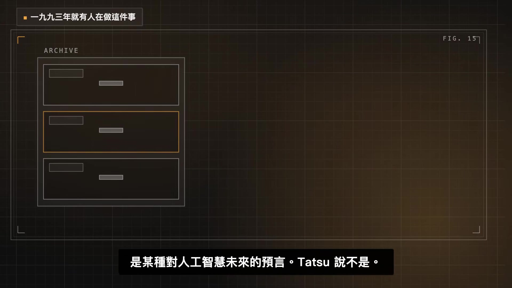

**逐字稿片段：** 他認為第一篇真正意義上的縮放定律論文 發表在1993年的NeuroLabs 作者來自貝爾實驗室 裡面有幾個名字你可能聽過 Vladimir Vapnik, Corina Cortez 那篇論文說 在很大的資料庫上訓練一個分類器 計算量太大了 我們希望在真的訓完之前 就能預測哪一個比較好 他述說他備課的時候 重讀這篇論文 很驚訝他有多超前 因為換成今天的說法就是一模一樣的事

**話題推測：** 追溯縮放定律的歷史，提及1993年Bell Labs的論文，可能展示論文資訊。

---

## 00:14:55

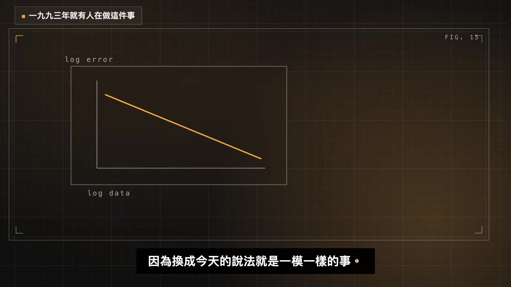

**逐字稿片段：** 他還提到2017年百度的一份研究 那是最早在大規模神經網路上做這件事的 涵蓋了機器翻譯、語音辨識跟影像 所以縮放定律不是憑空冒出來的新宗教 它是一條有30年曆史的學術脈絡 它做的事情也不懸 就是把統計學習理論裡那些寫不出具體數值的上界 換成一條真的量得出來的經驗曲線 縮放定律長什麼樣子 橫軸放資料量 縱軸放模型的錯誤率 兩軸都取對數 你會看到一條直線 這條直線的斜率就是全部的重點 他告訴你資料每多10倍 錯誤率會掉多少

**話題推測：** 提及2017年百度在神經網路上做的相關研究，可能展示研究名稱或圖表。

---

## 00:15:30

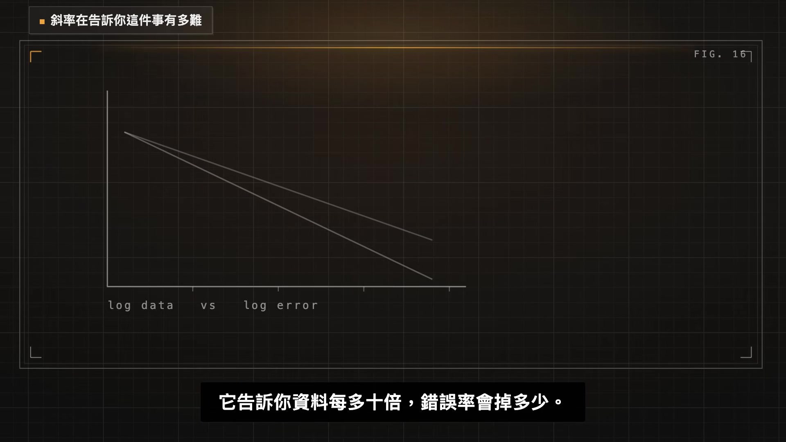

**逐字稿片段：** 他說給了幾個實測值 機器翻譯跟語音辨識都比較陡 語言建模只有0.095 是裡面最平的一條 這個數字小到有點讓人沮喪 把資料加10倍 損失也只掉一點點 為什麼語言這麼難

**話題推測：** 列舉機器翻譯、語音辨識、語言建模等任務的斜率實測值，可能以圖表標示。

---

## 00:15:43

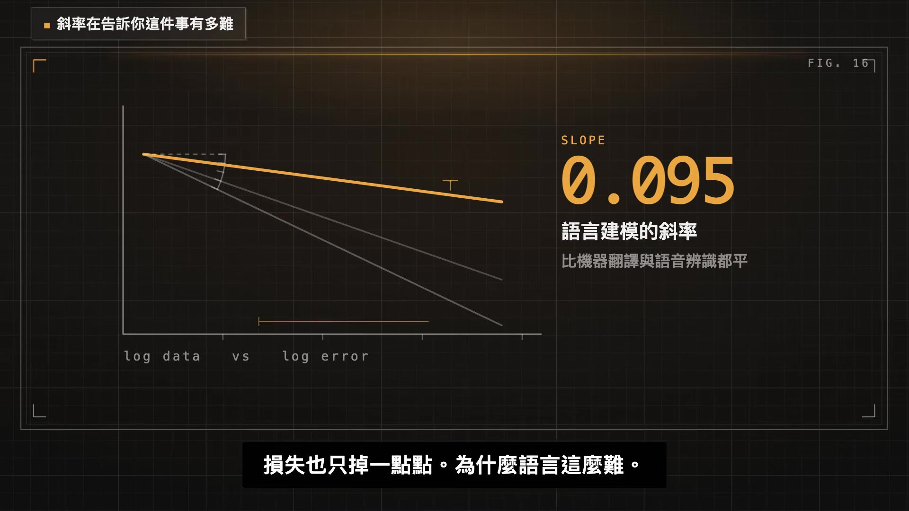

**逐字稿片段：** 他說用了一個很漂亮的推導 想象你要在一個正方形裡面 估計一個函數 你在裡面撒了100個點 切成10x10的小格子 每一格取一次平均 這樣就估得不錯了 現在把場景換成三維 同樣要讓每一格里面有一個點 你需要的點數變成1000個維度 再往上加需要的點數是指數爆炸的 所以斜率其實是在告訴你 這個任務背後有多少個內在的維度 斜率越平代表維度越高越難學 語言的斜率遠比教科書上任何一個標準情況都平 這本身就在說語言是一個維度高到誇張的問題 這也順便解釋了 為什麼大家非得把治療量堆到照這個等級不可 知道曲線長什麼樣 我們可以問那個真正花錢的問題 你手上有一筆固定的算力預算 該把它花在一個大模型讀比較少的資料 還是一個小模型讀比較多的資料

**話題推測：** 以幾何估計函數的比喻，解釋斜率與內在維度的關係，可能展示方形與立方體的點分佈圖。

---

## 00:16:33

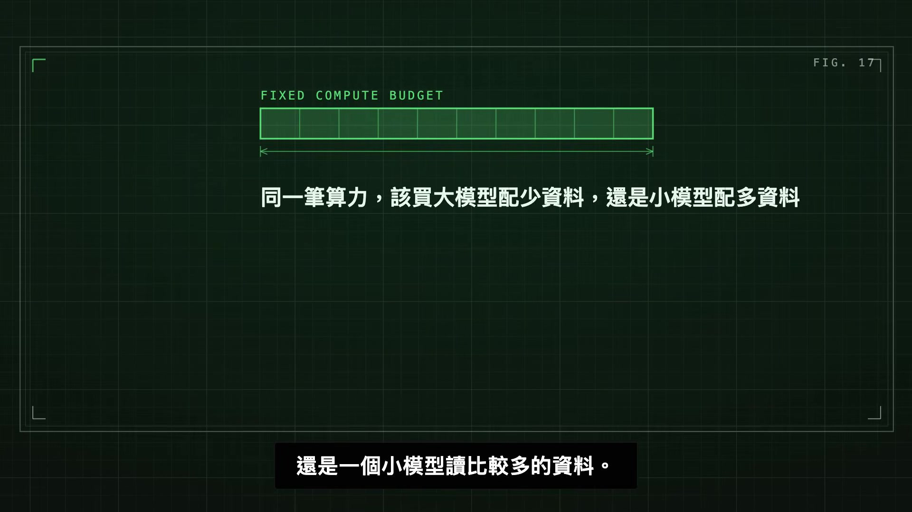

**逐字稿片段：** 這就是Chinchia那篇論文在回答的問題 它是DeepMind在2022年做的Tatsu說 裡面有三種做法 它最推薦的是第二種

**話題推測：** 介紹DeepMind 2022年發表的Chinchilla論文，可能展示論文標題或作者。

---

## 00:16:42

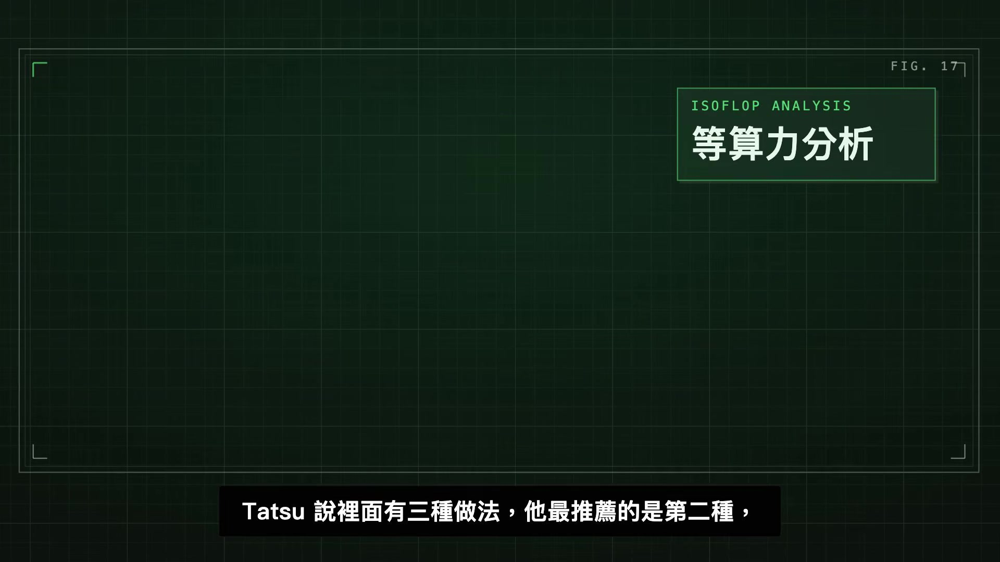

**逐字稿片段：** 叫等算力分析 做法非常直觀 你先固定一個算力預算 在這個預算之內 你可以訓練一個很小的模型讀很多資料 也可以訓練一個很大的模型只讀一點點資料 你把中間各種組合都試一遍 把損失畫出來 你會得到一個碗的形狀 太小的模型學不動 損失高 太大的模型資料不夠 也學不好 損失一樣高 碗底那個點 就是這筆預算最划算的模型大小 然後你換一個更大的預算 再畫一個碗 神奇的事情發生了 這些碗的碗底連起來

**話題推測：** 介紹Chinchilla論文中最推薦的「等算力分析」方法，可能為方法流程圖。

---

## 00:17:14

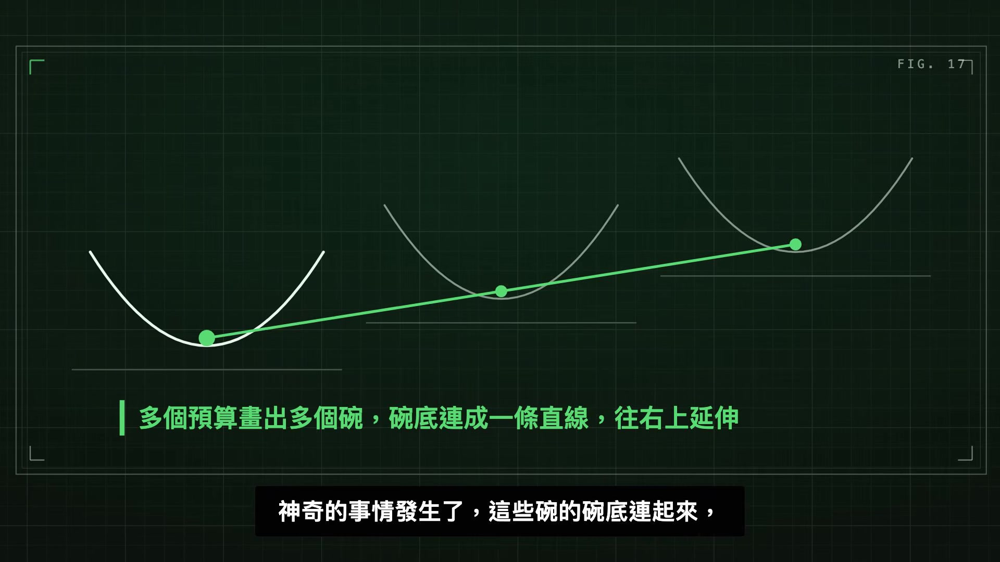

**逐字稿片段：** 在對數座標上是一條漂亮的直線 你只要把這條直線往右上延伸 你就可以回答一個 從來沒有人訓練過的規模 該用多大的模型 一條直線,讀出來的答案就是那個被引用到爛掉的比例

**話題推測：** 描述在對數座標上連接碗底形成一條直線的現象，可能展示新的對數圖。

---

## 00:17:27

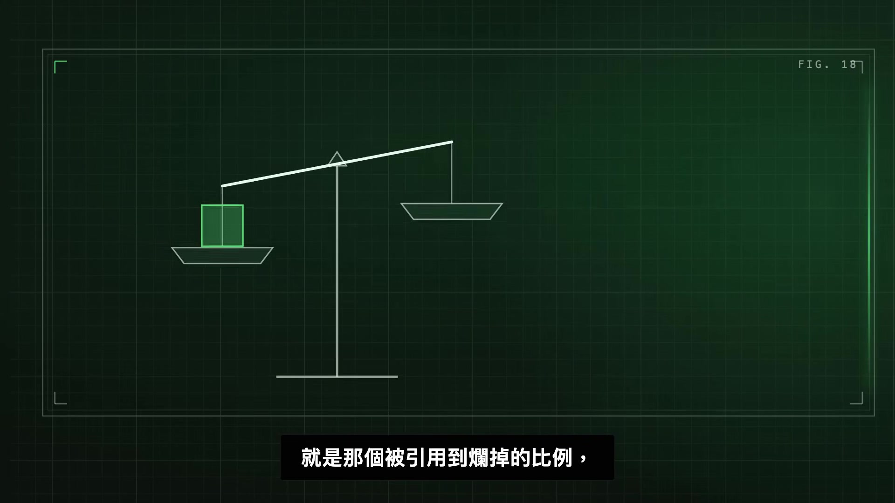

**逐字稿片段：** 每一個參數大約應該配20個Token的訓練資料 卡處特別強調,這篇論文 最漂亮的地方不是這個數字 是三種完全不同的推導方法,答案几乎一樣 而在Chinchua之前,業界流行的比例大約只有2比1 那是GPT-3那個年代的做法 也就是說,同樣一筆算力預算 資料量跟模型大小的比例前後差了10倍 為什麼之前會估錯? 他處指出了一個很具體的技術原因跟學習率的排成有關

**話題推測：** 揭示Chinchilla論文的關鍵比例：每個參數約配20個Token的訓練資料，可能強調該數字。

---

## 00:17:55

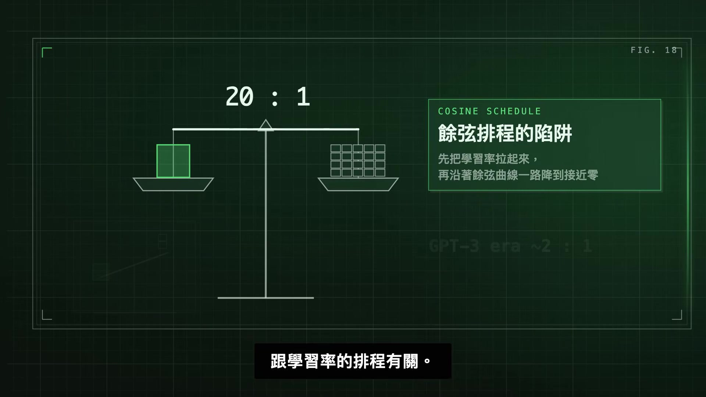

**逐字稿片段：** 現在的訓練幾乎都用一種先升後降的曲線 一開始把學習率慢慢拉起來 然後沿著一條餘旋曲線一路降到接近0 這條曲線的形狀是為你預計的總資料量剋制出來的 所以你不能拿一次完整訓練跑到一半的檢查點 去代表一個只訓練到一半資料量的模型 因為那兩件事的學習率完全不一樣 他處說這個坑一天到晚在咬人 之前那份研究就是踩了這個坑 才會把比例估得那麼低 群七啦 還有一個很少人講了後續 他處說這是他覺得最有趣的一段 剛才那三種推導方法 其實有一個小瑕疵 前兩種算出來的答案几乎一模一樣 第三種卻有點偏 他處說他的學生問過他 為什麼第三種差這麼多 他當時的回答是我不知道 說放定律有時候就是有點雜訊

**話題推測：** 解釋學習率的「先升後降」餘弦曲線排程，可能展示學習率曲線圖。

---

## 00:18:41

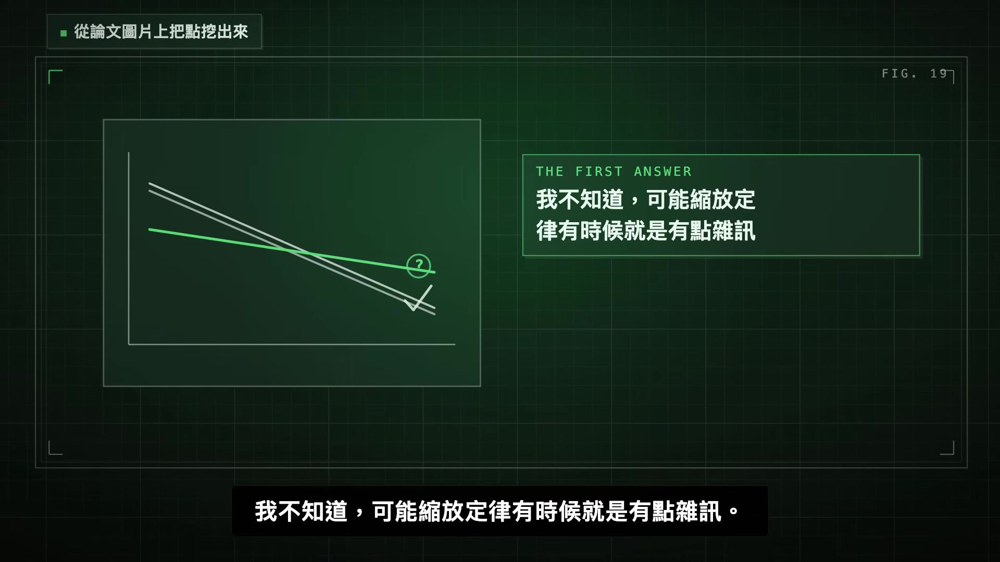

**逐字稿片段：** 去年有一群Epoch AI的研究者 好奇到不行決定重跑一次 第三種方法 困難在於原始的訓練資料 他們拿不到 所以他們做了一件很像見識的事 他們拿取值工具 直接從論文那張圖的圖片上面 把每一個資料點的座標一顆一顆挖出來 挖完之後重新擬合 結果發現原作者的資料完全沒問題 是曲線擬合那一步沒做好 殘差有明顯的偏移修正之後 第三種方法的答案跟前兩種幾乎完全對上 這個故事我很喜歡的地方是它的方向 大部分的重現研究 目的是要推翻原本的結論 這一次的重現反而讓原本的結論站得更穩 就是比例這個數字 後來發生了什麼事

**話題推測：** 介紹Epoch AI研究者重現Chinchilla第三種方法的研究，可能展示新論文或圖表。

---

## 00:19:20

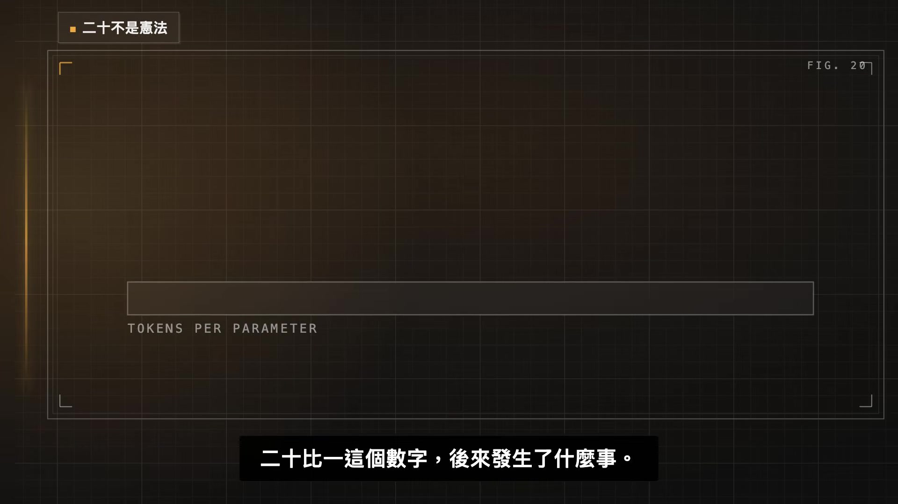

**逐字稿片段：** 他屬在第十一獎給了一把很有畫面的尺 不過他先講了一件很現實的事 Chad GPT出現之後 前沿實驗室對 縮放的細節幾乎全面封口 他說他去問過那些公司的人 對方的回答是 我們什麼都不會告訴你 所以這一獎其實是在做考古 從少數還願意誠實公開的論文裡面往回挖 Meta在Lama3上自己重做了一次 等算力分析 得到的比例大約是39比1

**話題推測：** 進入第十一講，討論Scaling Law的後續發展，引入「一把尺」的比喻，可能展示一個量尺的視覺。

---

## 00:19:46

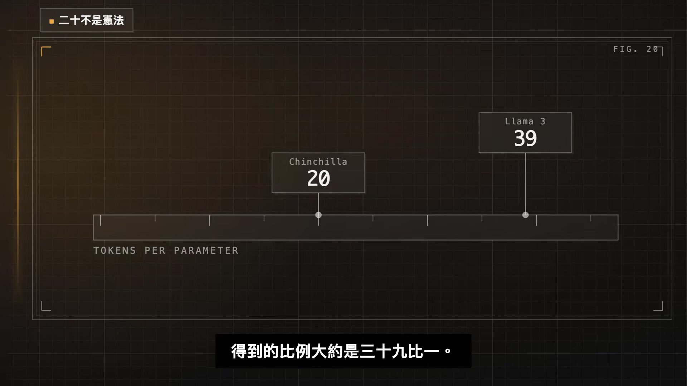

**逐字稿片段：** 騰訊的會員大模型做出來是96比1

**話題推測：** 提及騰訊會員大模型的比例為96比1，可能展示該數字。

---

## 00:19:48

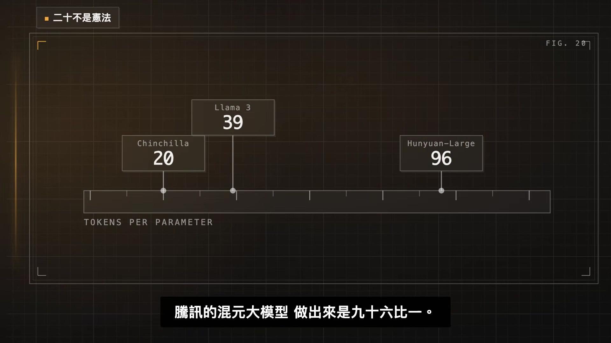

**逐字稿片段：** 而最極端的是一份叫MiniCPM的研究 他們推出來的比例是192比1 他處的評語很直接 他說他沒有看過任何其他人推出這個數字 這是一個離群值

**話題推測：** 提及MiniCPM研究的極端比例192比1，可能強調此離群值。

---

## 00:19:59

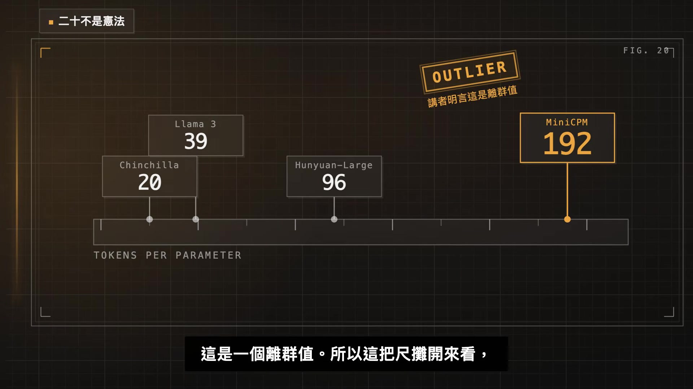

**逐字稿片段：** 所以這把尺攤開來看 從21路滑到192 各家算出來的答案差了將近10倍 他處的結論是 Chinchilla真正被反覆驗證的從來不是20 而是那套等算力分析的方法本身 20不是憲法 它只是一個起點 為什麼所有人都在往右滑

**話題推測：** 展示各家公司算出的比例在「尺」上的分佈，從21到192，可能為視覺化的比例尺。

---

## 00:20:16

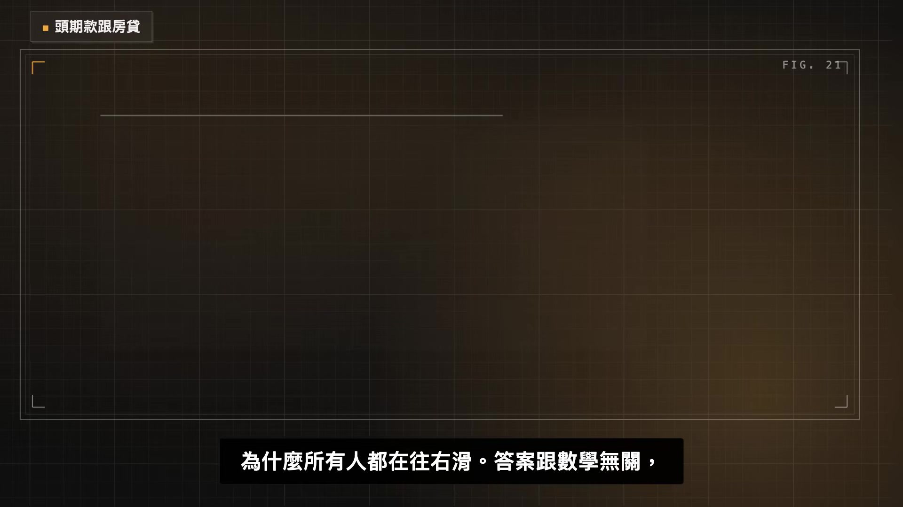

**逐字稿片段：** 答案跟數學無關 跟商業模式有關 阿樹說 在Chinchilla的年代 大家問的是 這筆算力怎麼訓練出最好的模型 可是模型變成產品之後 問題整個換掉了 變成我這個模型要被幾億人用 每一次對話都要付一次錢 訓練是一次性的支出 推理是永遠都在跑的水電費

**話題推測：** 探討比例變化的原因與商業模式相關，可能展示商業考量示意圖。

---

## 00:20:34

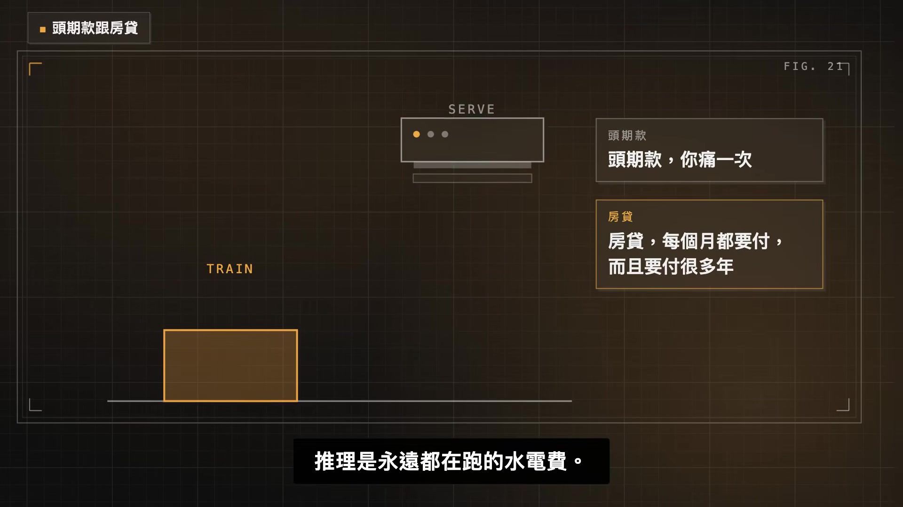

**逐字稿片段：** 你可以想成買房跟租房 訓練成本是頭期款 你痛一次 推理成本是房貸 每個月都要付 而且要付很多年 所以現在的做法變成 寧可在訓練上多花好幾倍的錢 也要把模型做得更小一點 因為小模型每被呼叫一次都便宜一點 而那個一點會被乘上幾億次 這就是為什麼今天的模型都在超訓位 這資料遠遠超過計算上最划算的量 他處說他前一天才看到

**話題推測：** 以買房與租房比喻訓練成本與推理成本，可能展示此比喻圖。

---

## 00:20:59

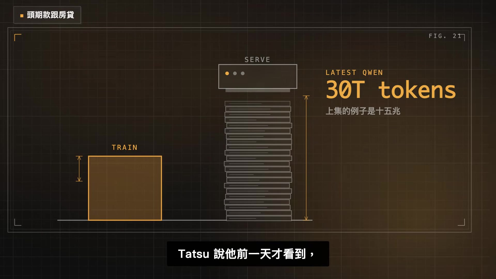

**逐字稿片段：** 最新的昆模型訓練資料是30兆個Token 回想一下上集那個15兆的例子 現在已經是他的兩倍了 所以那把尺會繼續往右滑 不是因為有人發現了新的頂履 是因為推理賬單一直在增加 推理賬單這四個字

**話題推測：** 提到最新模型訓練資料已達30兆個Token，可能展示巨大的資料量數字。

---

## 00:21:14

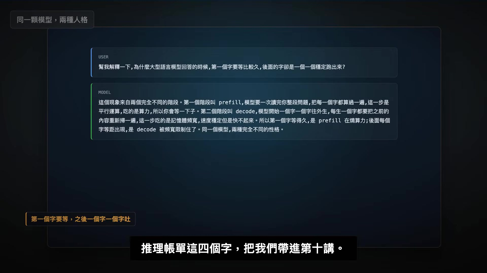

**逐字稿片段：** 把我們帶進第十講 這一講的講者是Percy Lam 他開場先講了一句話 把推理的地位擺正 做評測要生成Token 讓模型多想一會再回答 要生成Token,用強化學習訓練他 要一直生成 Token推理是這一切的底層 而他的物理性質跟訓練完全不一樣

**話題推測：** 進入第十講，由Percy Lam講授推理，主題明確轉變。

---

## 00:21:32

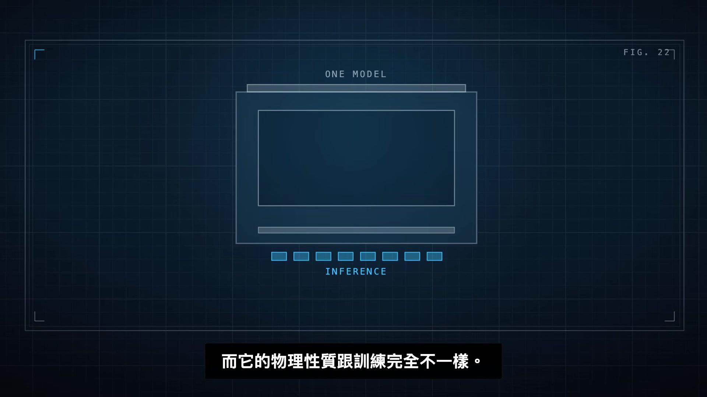

**逐字稿片段：** 每次跟模型講話其實有兩個階段 這兩個階段的個性差非常多 第一個階段叫Pre-fill 你把整段輸入丟給模型 他先把這段話讀完一次 關鍵是所有的字可以同時處理,顯示卡的計算單元全部忙起來,這是他最擅長的事

**話題推測：** 解釋模型對話的兩個階段：Pre-fill和Decode，可能展示階段流程圖。

---

## 00:21:47

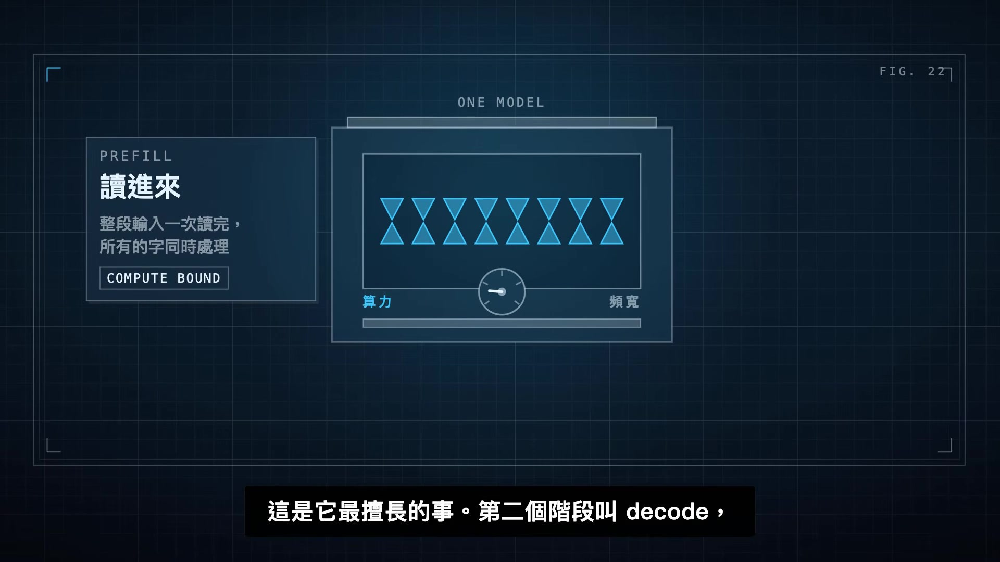

**逐字稿片段：** 第二個階段叫DECODE模型,開始一個字一個字往外吐,這一步沒辦法同時做 他得先知道第一個字是什麼,才能決定第二個字 所以同一顆模型在同一張卡上,前半秒跟後面那幾秒完全是兩種人格 這也解釋了一件你天天都在體驗的事 為什麼模型的第一個字要等一下才出來,出來之後卻能穩定的一個一個吐 也解釋了為什麼幾乎所有的模型服務輸入的價格都比輸出便宜很多 為什麼第二階段這麼慢?

**話題推測：** 闡述Decode階段的特性。

---

## 00:22:13

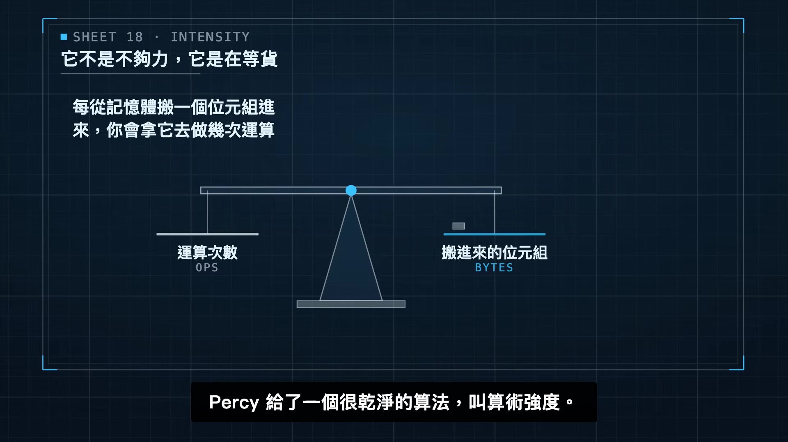

**逐字稿片段：** Percy給了一個很乾淨的算法,叫算術強度 他問的是,每從記憶體搬一個位元組進來 會拿他去做幾次運算,你可以想成加油 加完又可以跑300公里,那趟很划算 如果你沒跑5公里就要回加油站一次 但你大部分的時間都花在路上,引擎再強也沒有用

**話題推測：** 引入「算術強度」概念，衡量記憶體搬運效率，可能展示定義或公式。

---

## 00:22:30

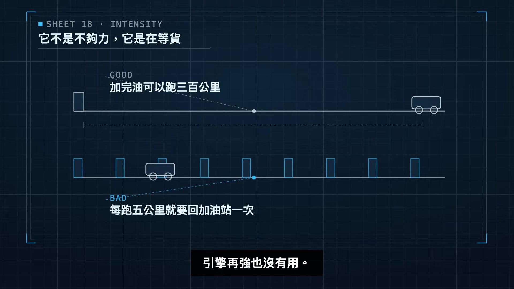

**逐字稿片段：** H100這張卡有一個天生的門檻 他的計算能力除以他的記憶體頻寬 得到的數字大約是295 這個數字的意思是,每搬一份資料進來 至少要拿它做295次運算 才算把這張卡用滿 現在你回頭看 第二個階段 模型一次只吐一個字 也就是說 它要把整個模型的權重 全部從記憶體搬過來一次 只為了處理一個字

**話題推測：** 揭示H100顯卡的算術強度門檻約為295。

---

## 00:22:52

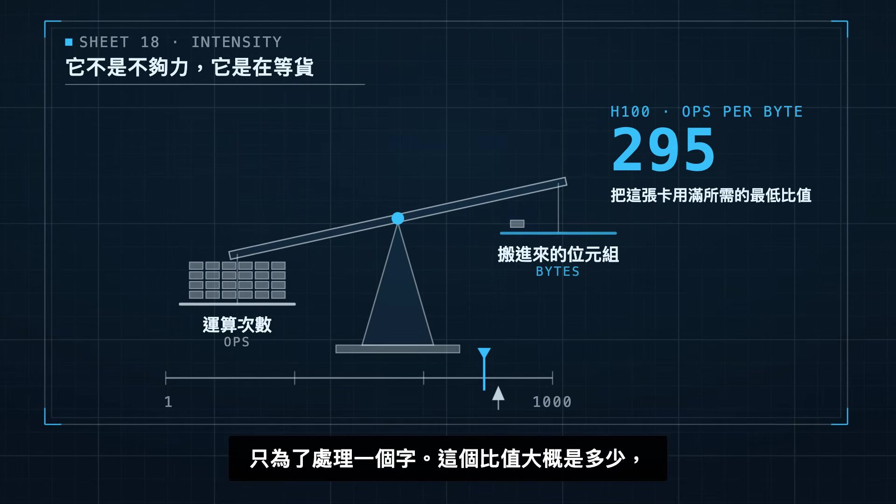

**逐字稿片段：** 這個幣值大概是多少 答案11 差了將近300倍 所以你會看到一個 很違反直覺的畫面 你打開監控 檢視 卡的使用率明明沒有滿 可是文字就是慢慢的跑 它不是不夠力 它是在等貨 這也是為什麼

**話題推測：** 揭示Decode階段的算術強度僅為11，對比295。

---

## 00:23:06

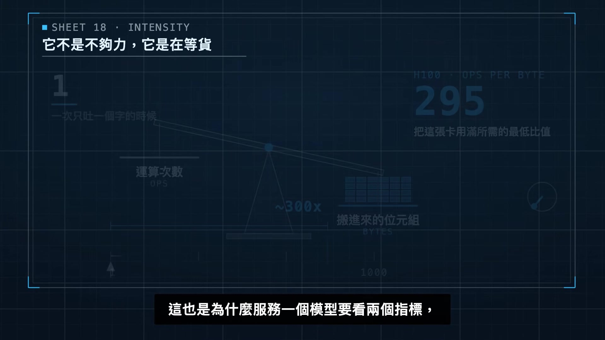

**逐字稿片段：** 服務一個模型要看兩個指標 一個是你按下送出之後多久看到第一個字

**話題推測：** 介紹服務模型需關注的兩個指標：延遲和吞吐量，可能展示定義或示意圖。

---

## 00:23:11

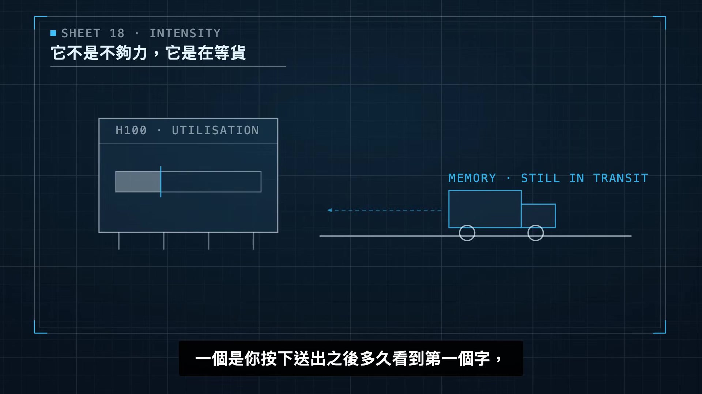

**逐字稿片段：** 叫延遲 另一個是整臺機器每秒總共吐出多少字 這叫吞吐量 Percy說 如果這堂課你只記一件事 那就是速度的關鍵 全部在記憶體 有一個很自然的想法可以救這件事 就是同時服務很多人 既然搬一次全種子處理一個字 太浪費 那我一次處理100個人的下一個字 全種子要搬一次 按下去每個人都便宜 這一招對模型裡面負責思考的那些區塊完全有效 因為那些權重是全部人共用的 搬一次服務所有人 這件事有一個你每天看得到的商業版本

**話題推測：** 定義「延遲」。

---

## 00:23:44

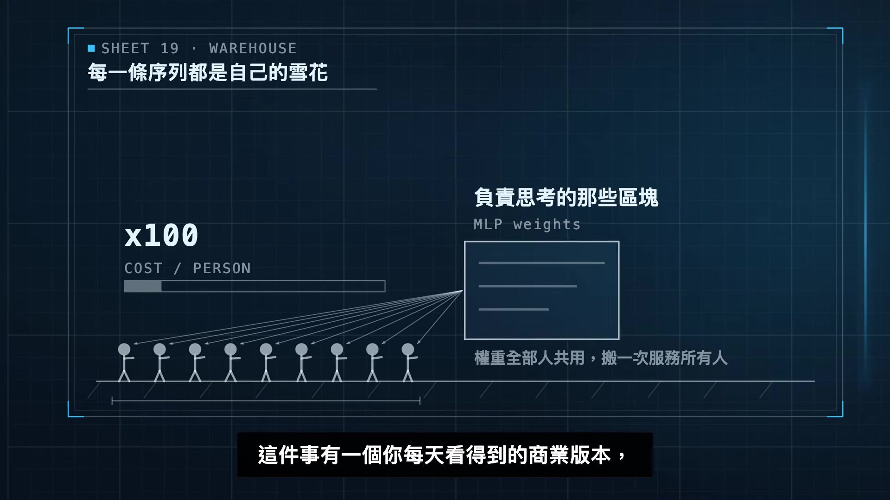

**逐字稿片段：** 這家模型供應商都有一種批次的API API就是程式跟模型下單的窗口 不急著要結果 價格就直接打對摺 他們敢賣半價 靠的就是把很多人的請求 湊成一大批一起算 搬一次權重服務更多人 可是他對注意力機制完全無效 原因就是上集講過的那本筆記 KV Cash 每一個人的對話都不一樣 筆記本都是他自己專屬的 Percy用了一個很好的說法 他說 在注意力這裡 每一條序列的筆記都是他自己獨一無二的雪花 你多服務一個人 你就多搬一整本筆記 這個成本貪不掉 所以注意力那個筆值永遠是一加再多的人也不會變

**話題推測：** 提到模型供應商的「批次API」商業模式，可能展示API介面或定價策略。

---

## 00:24:20

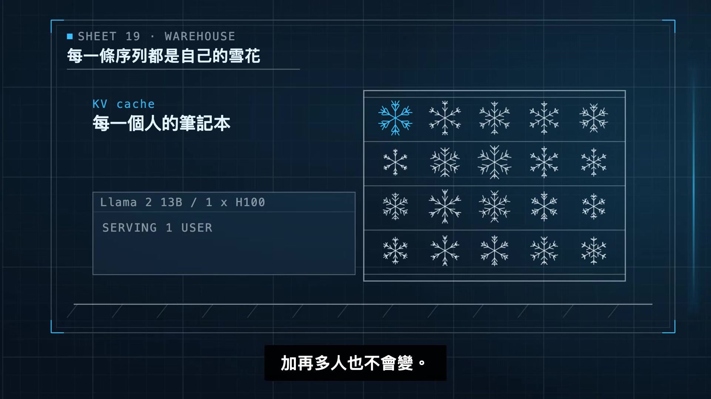

**逐字稿片段：** Percy在課堂上實際用紙筆算過一次 一個130億參數的模型 放在單張H100上面 一次只服務一個人 大概每秒可以吐124個字 你想把它加大到同時服務256個人 往時那些筆記本就要吃掉240GB的記憶體 這張卡根本放不下,所以你想省錢 你只有一條路,把筆記本本身變小 所以近幾年模型架構的改動 有一大半是被推理成本逼出來的 Percy說了一句很有意思的話 這堂課名義上在講推理 偷偷的其實在講模型架構 把那本筆記變薄

**話題推測：** 以130億參數模型在單張H100上的推理速度為例，進行具體計算。

---

## 00:24:53

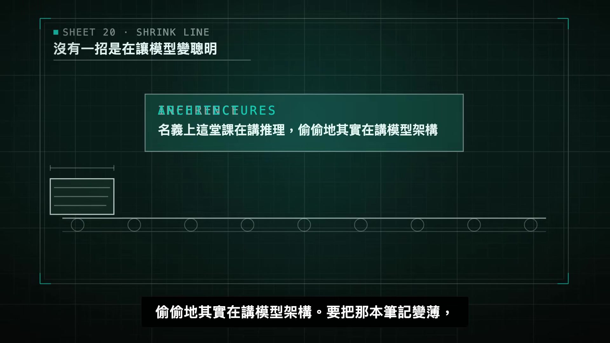

**逐字稿片段：** 業界大概有四招 第一招上集講過讓好幾個注意力頭共用同一本筆記

**話題推測：** 介紹減薄KV Cache的四種業界做法，可能為列表或示意圖。

---

## 00:24:58

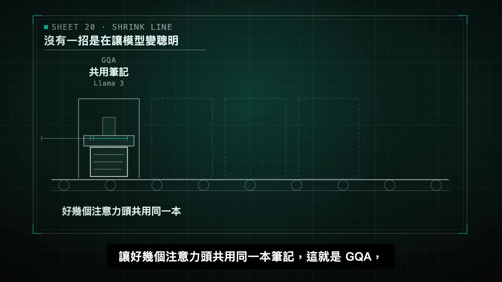

**逐字稿片段：** 那就是GQA LAMA 3 全系列都用了第二招更激進 是DeepSync第二代模型的做法 它們不是共用筆記 是把筆記整個壓縮過再存 這種時候在還原這一招叫MAA Percy給了一個數字 原本每個字要記16000個數字 壓縮之後只剩512個 第三招是限制記憶的範圍 不是每一層都回頭看全部的歷史 大部分的層只看最近的一小段 Character AI的配方是 每六層裡面只留一層看得到全文 其他五層只看附近 第四招是讓不同的層共用同一份筆記 等於好幾層樓共用同一個倉庫 你注意到沒有 這四招沒有一招是在讓模型變聰明 全部都是在讓那本筆記變薄 這就是推理成本反過來改造模型架構最直接的證據 剛才四招有一個共同點 GQA也好 MLA也好都是設計圖上的決定 模型還沒開始訓練就得先想好 訓練完就改不動了 可是還有一整層是模型都訓練完了 準備要出場了 你在最後一刻再壓它一次

**話題推測：** 提及GQA技術及Llama 3模型應用。

---

## 00:25:58

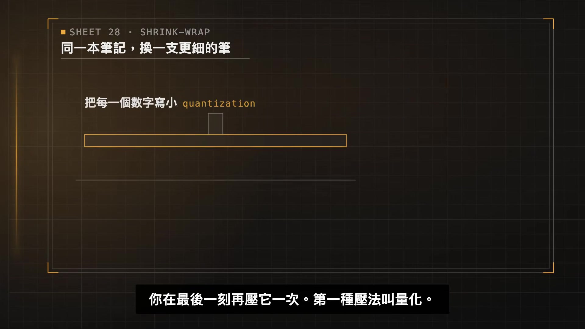

**逐字稿片段：** 第一種壓法叫量化 模型裡面每一個權重都是一個數字 推理的時候通常用兩個位元組來存量化 就是問 能不能少寫幾位 你可以想成同一本筆記 你換一支更細的筆 重抄一遍 內容沒變 結束卻少了 壓成int bar 再壓成int 4 權重佔了空間剩下四分之一 前面那個瓶頸就鬆開了 這一招只給推理用 訓練的時候還是需要精度 麻煩的是硬壓會壓壞 問題處在少數幾個特別大的數字 這些叫離群值

**話題推測：** 介紹第一種推理優化方法：量化，可能展示位元數縮減示意圖。

---

## 00:26:27

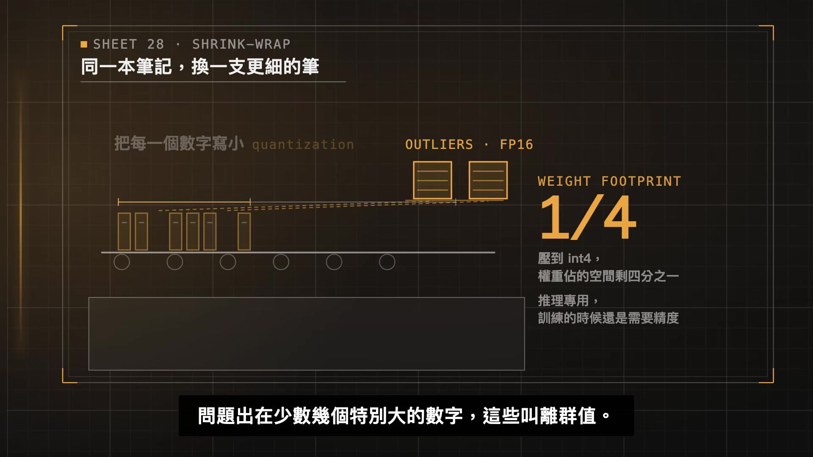

**逐字稿片段：** 有一篇叫做LLM Interbar的論文 做法很直接 把那幾個維度抽出來 用高精度算 剩下的全部壓掉 後來的AWQ更進一步 改看模型拋起來時激活值多大 這個決定哪一小撮全重不能壓

**話題推測：** 提及LLM.int8()論文解決離群值問題。

---

## 00:26:41

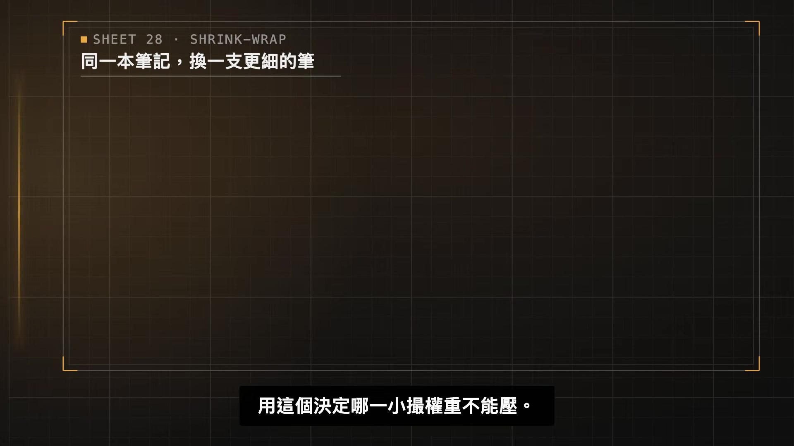

**逐字稿片段：** 第二種壓法就沒那麼客氣了 既然有些層本來就沒什麼貢獻 那就直接把幾頁撕掉 NVIDIA的MINITRON 先用一小批資料量出來 哪幾層最不重要 然後整層整層砍掉 砍完模型會變笨 所以還有第三步 與原本那顆完整的大模型當老師 把砍掉的能力再交回來一次 有沒有發現 剛才這一整排招數 都有一個共同的心虛之處 不管是把筆記變薄 還是把數字寫小 本質上都是在丟掉一些資訊 模型是不是變笨了一點 你其實不知道 Percy說有一個辦法可以兩全其美 而且它是有數學保證的

**話題推測：** 介紹第二種推理優化方法：修剪（剪枝），可能展示模型層級刪減示意圖。

---

## 00:27:14

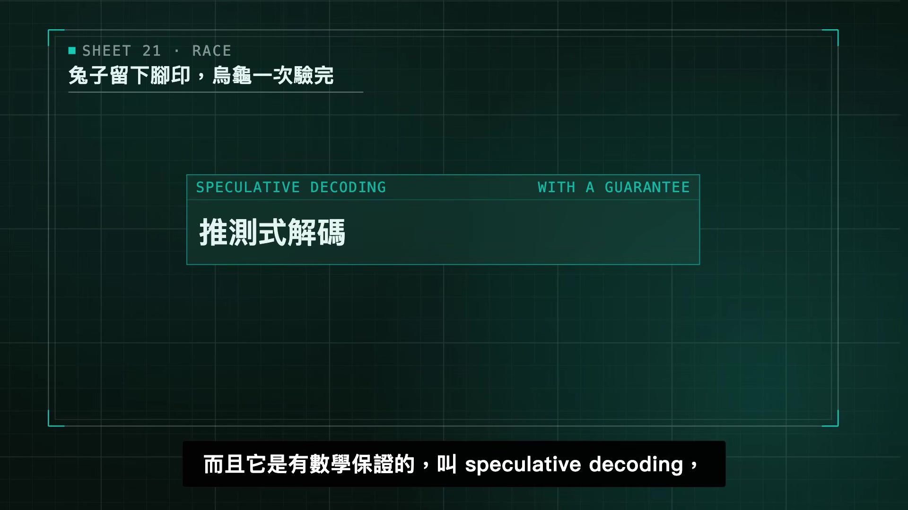

**逐字稿片段：** 叫Speculative Decoding 中文可以說成推測式解碼 它的直覺其實只有一句話 檢查筆生成快 生成是一個字一個字來的很慢 可是檢查一段已經寫好的文字 那是把整段一次讀完 是快的那一種 所以做法就變成 準備一個很小的模型當草稿手 讓他一口氣往前寫五個字 然後你把這五個字一次交給大模型 大模型用讀的一次驗完 前三個字他同意 第四個字不同意 那就從第四個字開始改寫 後面的作廢 你可以想成一隻兔子 在前面連續跳 留下五個腳印 烏龜在後面一次 把五個腳印全部檢查完 最精彩的是那個數學保證 接受草稿的規則被設計得非常巧妙 最後吐出來的文字 幾率分佈跟大模型自己慢慢寫是完全一樣的 不是差不多是完全一樣

**話題推測：** 介紹Speculative Decoding（推測式解碼）技術，可能展示大模型與小模型協同工作的流程圖。

---

## 00:28:00

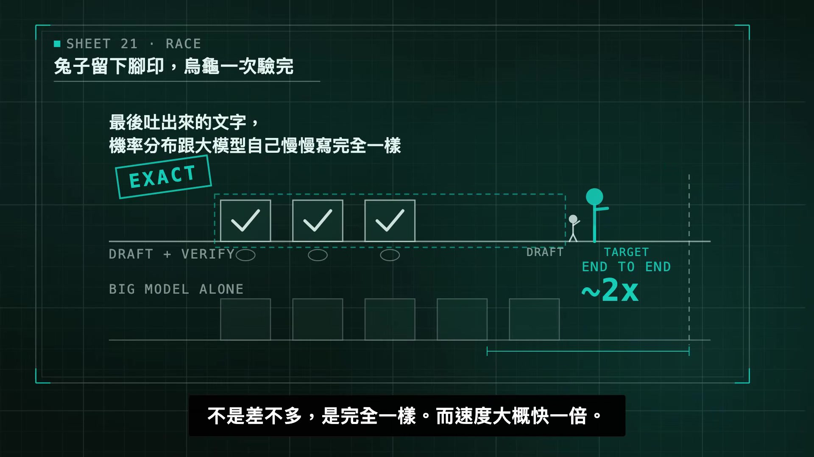

**逐字稿片段：** 而速度大概快一倍 還有一層省錢的地方 不在模型裡 在系統裡 Percy在最後講了一個我覺得非常有畫面的故事 那些筆記本要放在顯示卡的記憶體裡 而每一段對話會有多長 你事先根本不知道 所以最早的做法是幫每一段對話先劃一塊 很大的連續空間 結果就是記憶體被切得零零碎碎 中間卡著很多用不到的空洞 明明總量 還有就是塞不進新的對話 這正是作業系統課本第一章 在講的事情

**話題推測：** 說明Speculative Decoding可提升約一倍速度。

---

## 00:28:28

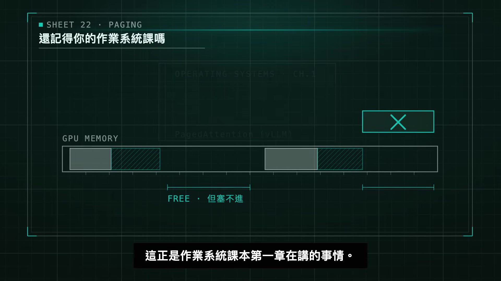

**逐字稿片段：** 所以VLM那篇論文的做法 就是直接把作業系統那一套搬過來 把筆記切成一塊 一塊固定大小的頁 愛放哪裡放哪裡 再用一張表記住順序 而且他連寫實複製都學了 兩段對話 如果開頭一樣 他們就共同一塊 直到其中一段開始分叉 才真的複製一份同一層 還有一個很小 但最有感的改動 廢物裡,只要有人先講完他就馬上補一個新的人進來,不用等整批一起結束

**話題推測：** 提及VLM論文將作業系統記憶體管理概念應用於KV Cache，可能展示頁表與寫實複製示意圖。

---

## 00:28:54

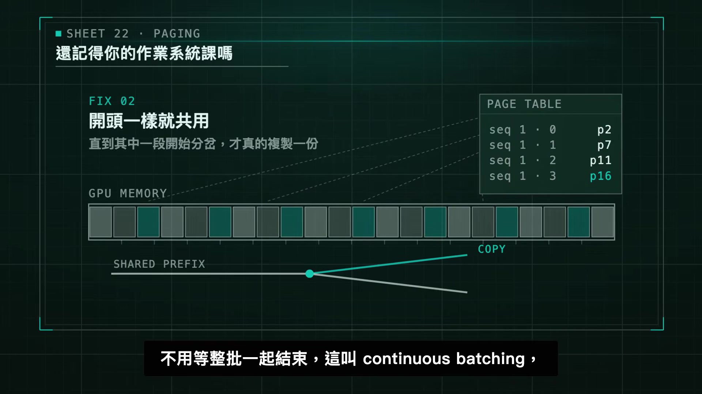

**逐字稿片段：** 叫Continuous batching,中文可以說成連續批次 Percy講到這裡笑著說還記得你的作業系統課嗎?拿來用在推理上就對了 我很喜歡這個例子,因為這個領域看起來每天都在發明新東西 可是很多最有效的做法,是把幾十年前就解過的問題重新搬過來用一次 你把前面這一整段連起來看,會看到三種完全不同的態度 第一種是讓那本筆記變薄共用它 壓縮它只留最近的一段 第二種是換一個人先寫草稿 讓大模型只負責檢查 可是還有第三種 最徹底的乾脆不要那本筆記 Hershey在第十講的最後說 Transformer 當初被設計出來的時候 根本沒有人在想推理這件事 注意力機制 加上一個字一個字往下寫 天生就被記憶體卡住 所以真正的問題也許不是怎麼省 可是要不要換一個底

**話題推測：** 介紹Continuous batching（連續批次）技術，可能展示批次處理流程圖。

---

## 00:29:41

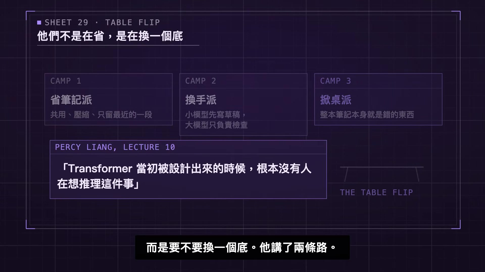

**逐字稿片段：** 他講了兩條路

**話題推測：** 探討Transformer替代方案：狀態空間模型和擴散語言模型，可能展示其概念圖。

---

## 00:29:43

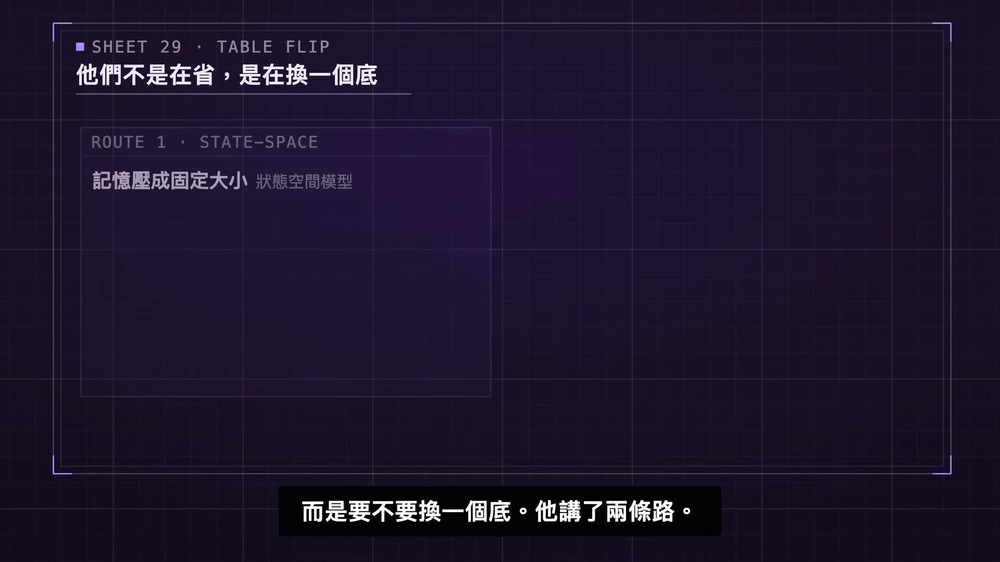

**逐字稿片段：** 第一條叫狀態空間模型 他不把每一個字的筆記都留著,只是維護一份固定大小的記憶 你跟他聊十句還是一萬句,他身上帶的那份記憶永遠是同一個大小 推理成本就不會隨著對話變長一直往上爬 第二條路是擴散語言模型,他連一個字一個字往下寫都不做 先鋪一整片雜訊,再一輪一輪把它修清楚,整段文字幾乎是一起浮現的 我要很誠實的講後面這一半,狀態空間模型有明顯的弱點 你問他剛才那個名字是誰 他容易想不起來 所以現在能打的做法 還是要留幾層真正的注意力 回去看全文 這兩條路 要到今天都還沒有取代Transformer 可是他們為什麼存在? 答案就在這一整幕裡 就是推理的成本已經把人逼到要去掀桌子了 模型 訓好了也跑得動了

**話題推測：** 介紹狀態空間模型。

---

## 00:30:32

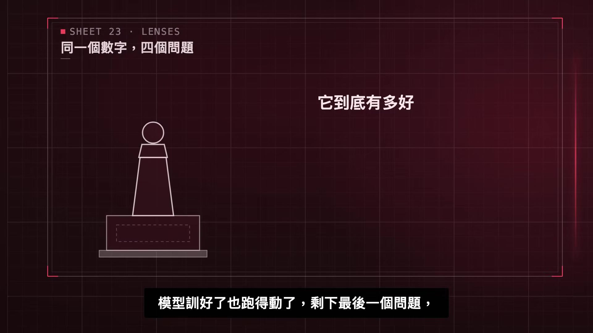

**逐字稿片段：** 剩下最後一個問題他到底有多好 第十二講的講者一樣是Persilion 他一開場就把大家最想聽的那個答案否定掉了 他說不存在唯一正確的評測 這句話聽起來像在打太極 其實非常實用 他舉的例子是

**話題推測：** 進入第十二講，由Percy Lam講授模型評測，主題再次轉變。

---

## 00:30:46

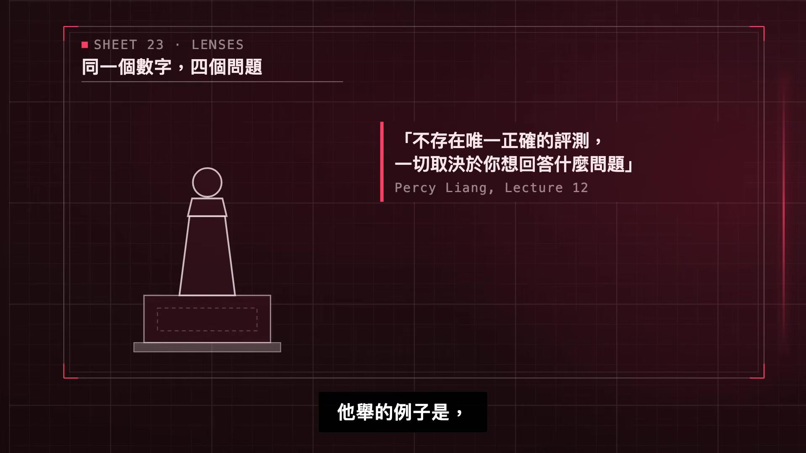

**逐字稿片段：** 同一個模型在同一個測驗上考了91分 這個91分對四種人的意義完全不同 對一個要採購的公司來說 他想知道的是這個模型能不能撐住我的客服 對一個做研究的人來說 他想知道的是這一年到底有沒有進步 對一個管政策的人來說 他想知道的是這東西會不會出事 對一個正在開發模型的工程師來說 他想知道的是 我上禮拜那個改動到底有沒有用 同一個數字,四個問題,答案完全不一樣 所以Percy說,你要先想清楚你在回答什麼問題 再去挑對應的評測 而且他提醒了一件很多人會忽略的事

**話題推測：** 以模型在測驗中獲得91分為例，闡述不同群體對分數的不同解讀，可能為情境圖。

---

## 00:31:20

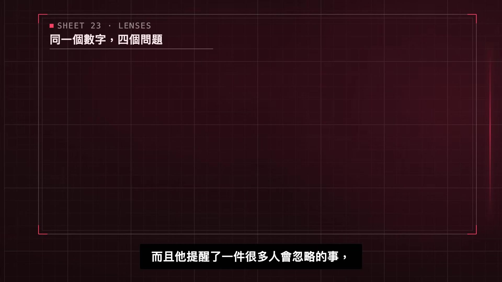

**逐字稿片段：** 很多排行榜上都少了一個軸成本,同樣91分 一個回答一次要幾百美元,一個一次只要幾分錢 放在同一張榜上,比本身就是誤導

**話題推測：** 批評排行榜缺乏成本軸，導致誤導，可能展示一個簡化的排行榜。

---

## 00:31:30

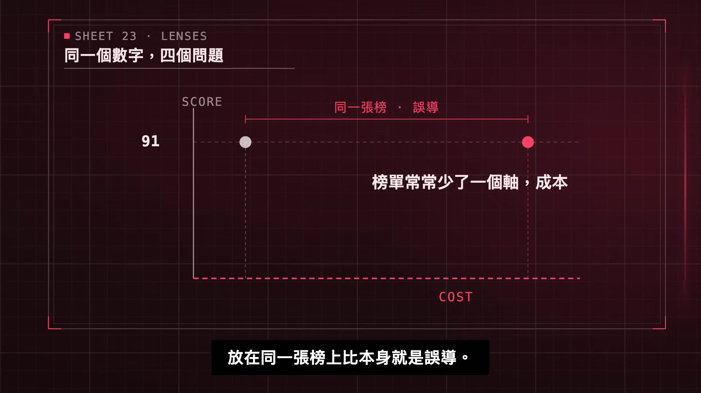

**逐字稿片段：** Percy接著帶大家走了一段很有意思的樓梯

**話題推測：** 以「樓梯」比喻模型評測的演進，可能展示一系列評測基準的階梯圖。

---

## 00:31:33

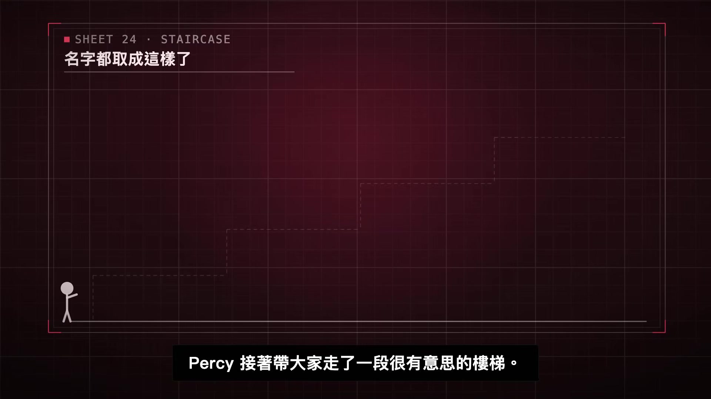

**逐字稿片段：** 2020年出現一個叫MMLU的測驗 57個科目的選擇題 題目從網路上找來 GPT-3,那時候大概考45分,現在的前沿模型普遍在90分以上,分數上去了 題目就不夠用了,於是出現了加難版,把4個選項加到10個,再把那些本身有問題的題目挑掉 Percy說,那個理由很誠實,大家都90分,你不能全班都給A

**話題推測：** 介紹MMLU測驗及其分數演變（GPT-3 45分，現今90分以上）。

---

## 00:31:57

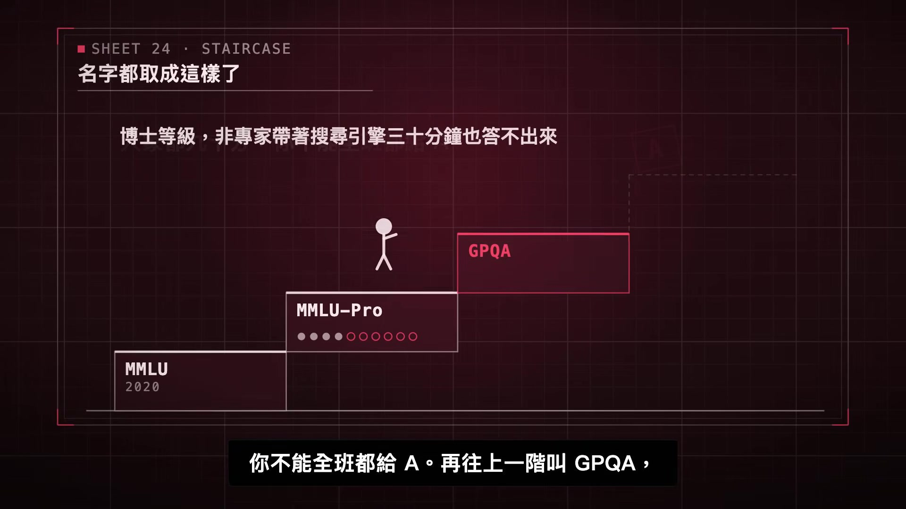

**逐字稿片段：** 再往上一階叫GPQA,是博士等級的題目,而且被設計成搜尋引擎,查不到 出題的人要確認一件事,一個非該領域的人給他30分鐘,加上一臺可以上網的電腦 他還是答不出來 真正的領域專家做這份題目大概拿65分 非專家帶著搜尋引擎只拿30分 GPT-4當時考39分 而Percy說 現在的O-Sign已經到75分了 所以在上面又蓋了一階

**話題推測：** 介紹GPQA博士級測驗，及其不同人群和模型分數（專家65分，非專家30分，GPT-4 39分）。

---

## 00:32:21

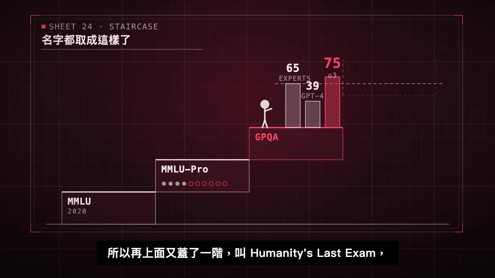

**逐字稿片段：** 叫Humanities' Last Exam 翻成中文是人類的最後一次考試 Percy講到這裡的評語是 名字都取成這樣了 我不知道之後還能叫什麼 考試題會被追評 那換一種評法呢

**話題推測：** 介紹最新的Humanities' Last Exam。

---

## 00:32:33

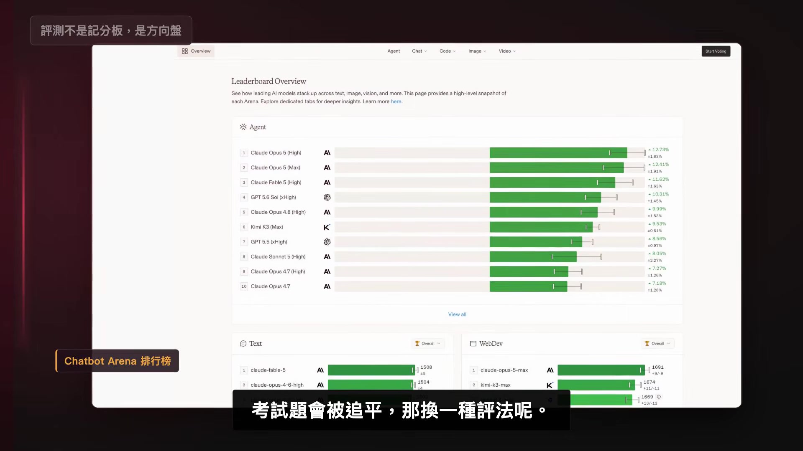

**逐字稿片段：** 有一個很受歡迎的做法叫Chatbot Arena 它不考試 他讓路人隨便丟一個問題 兩個模型各給一個回答 但不告訴你誰是誰 你只要選你比較喜歡哪一個 累計很多場 再用下棋那套積分制度算出排名 這個設計亮的是真實使用者的偏好 不是考試技巧 可是Percy說這個榜也出事了

**話題推測：** 介紹Chatbot Arena評價方式，可能展示其介面或排名系統。

---

## 00:32:53

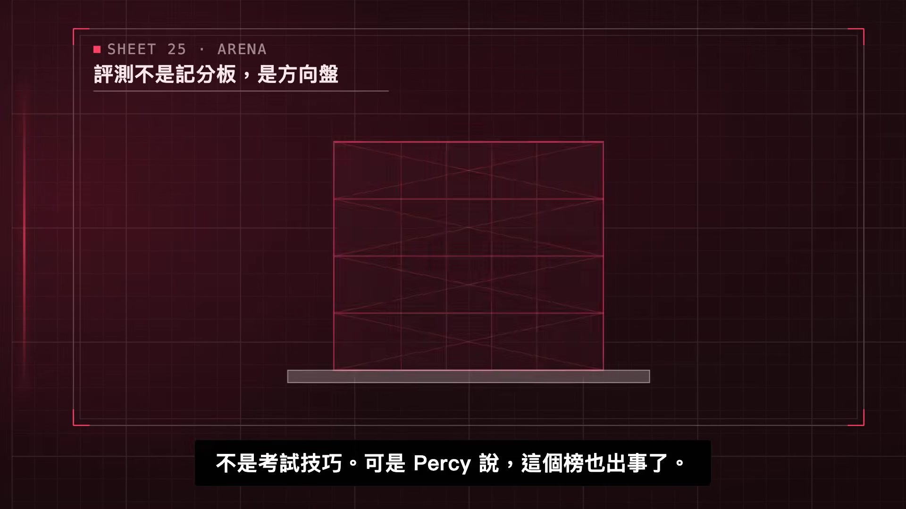

**逐字稿片段：** 有一篇論文叫The Leaderboard Illusion 翻成中文是排行榜的錯覺 它揭露某些廠商拿到的特權 可以私下多次提交自己的模型 來挑分數最好的那一次公開 另外一個更早被玩壞的例子 是用模型當裁判的評測 後來大家發現 只要回答寫得長一點 裁判就給比較高的分數 跟內容好不好無關 Percy把這些現象串成一句話

**話題推測：** 提及The Leaderboard Illusion論文揭露排行榜作弊行為。

---

## 00:33:15

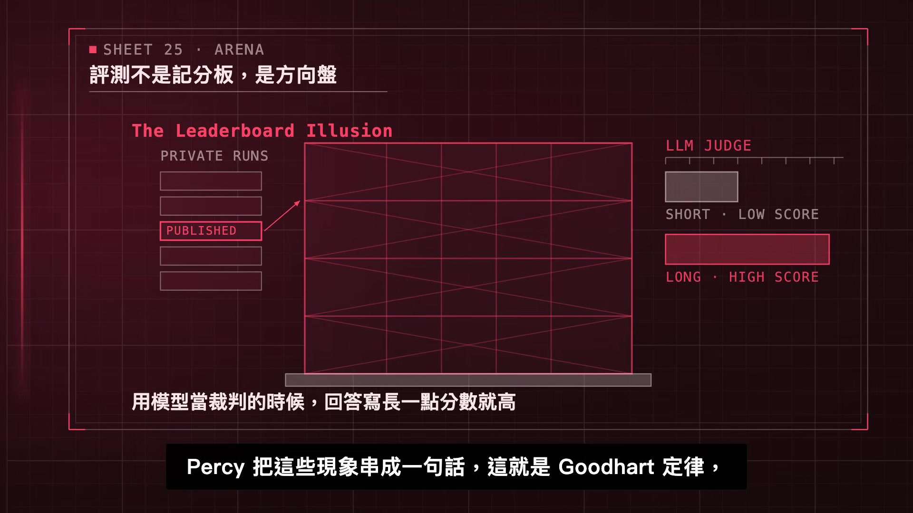

**逐字稿片段：** 這就是Good Heart定律 一個指標一旦變成目標 它就會被玩壞 而評測的角色 比大家想象的重要得多 追蹤哪一個數字 全世界的實驗室 就會把模型往那個方向做評測 不是事後的計分板 而是方向盤 Percy在最後留了一個問題 我覺得那是整堂課最好的一句 他說你要分清楚兩件事 一個是有人在考你 一個是有人在問 考你的人自己知道答案 只是想看你會不會 問你的人是真的不知道 他需要你的幫忙 而我們現在幾乎所有的標準測驗 都屬於前面那一種 真正產生價值的卻是後面那一種 這個落差說明了 為什麼榜上的分數 跟你自己的體感常常對不上

**話題推測：** 引入Goodheart定律，說明指標一旦成為目標就會被扭曲。

---

## 00:33:53

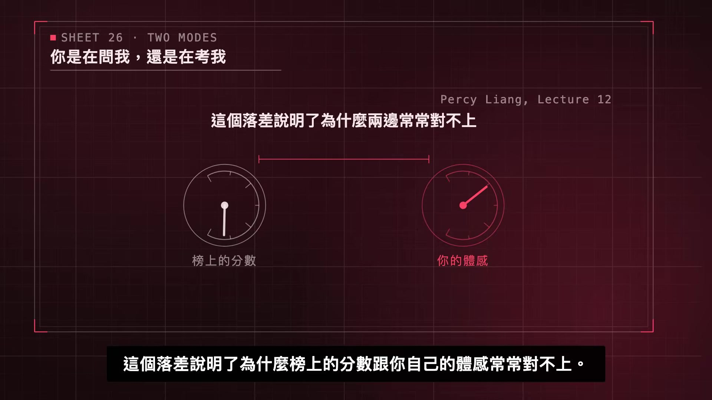

**逐字稿片段：** Percy還補了兩件殺風警的事 第一件是汙染 現在的訓練資料是整個網絡 而考題也在網絡上 業界的做法是把 跟題目重疊的訓練文件刪掉 可是這支擋得住 一字不差的複製改寫過的 跟翻譯過的全部都穿得過去

**話題推測：** 探討評測汙染問題，說明訓練資料與考題重疊對分數的影響。

---

## 00:34:10

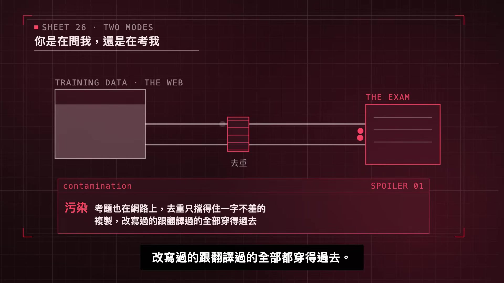

**逐字稿片段：** 第二件更有意思 有些數學測驗大家都考90幾分了 剩下答錯的那幾題仔細去看 大概有一半根本是標準答案標錯了 所以你以為模型還差最後那幾分 其實它差的不是能力 是那份考卷本身有錯 這兩件事加起來的意思是 分數不會自己說明自己 也知道它是怎麼量出來的 終極走到這裡

**話題推測：** 指出數學測驗中部分標準答案標錯導致的評測偏差。

---

## 00:34:31

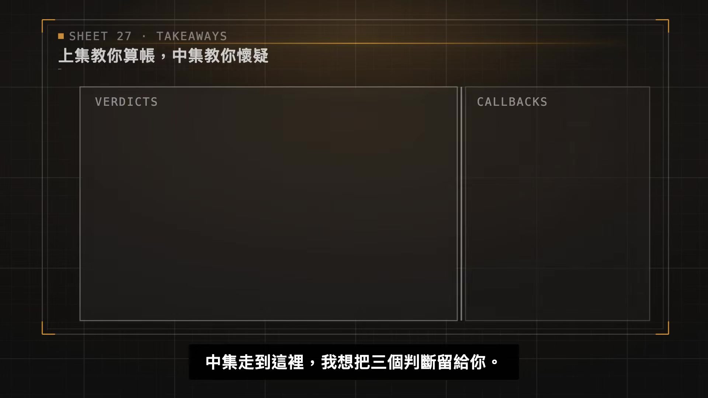

**逐字稿片段：** 我想把三個判斷留給你 第一個判斷是 平行化不是演算法問題 是地理問題 把模型切成幾份 切在哪一刀 答案不是從數學推出來的 是你機房的線路長度決定的 通訊最密的那種切法 必須帶在同一臺機器裡面 這就是為什麼 張量平行的答案永遠是8 以後看到任何一家公司 公佈訓練配置 都可以反過來讀 他們配置在告訴你 他的機器之間有多快 第二個判斷是 比例不是常數 是財務決定 20比1從來不是自然定律 它是那個年代的最佳解 今天大家把資料量往上堆 不是因為發現了新的規律 是因為訓練負一次 推理要負一輩子

**話題推測：** 總結三個主要判斷，可能以條列式清單呈現。

---

## 00:35:10

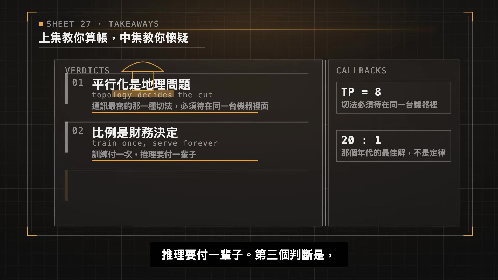

**逐字稿片段：** 第三個判斷是 數字要先問怎麼量的 再問是多少 從上集那張規格表上的星號 到排行榜上 被多次提交挑出來的最好成績 再到那些標準答案標錯的考題 都在講同一件事 任何一個數字 都帶著它的良策條件 你不知道條件 就不知道那個數字在說什麼 上集我教你算賬 中集其實是在教你懷疑 A集我們把三個問題走完了 怎麼把模型切到幾千張卡上面 在花錢之前就決定要花多少 還有花完之後那個分數能不能信 這三件事共用同一種能力 就是在看到任何一個漂亮的數字之前 先問它是在什麼條件下亮出來的 最後問你一個問題 如果現在有人給你十萬張顯示卡用一個月 你會拿去訓練一個更大的模型 還是訓練一個小很多 但是為了超薄的模型 然後讓它服務更多人

**話題推測：** 提出第三個判斷：數字需要追問其衡量條件。

---

## 00:35:59

**逐字稿片段：** 留言告訴我 下集我們會走進課程的後半段 資料是從哪裡來的 怎麼洗乾淨 還有訓練完之後的對齊 跟後訓練那一段 喜歡的話 訂閱AI Notebook 開啟通知 開啟通知 追蹤 後續下次見

**話題推測：** 預告下集內容：資料來源、清洗及後訓練等，可能為下集預告清單。

---
