# jimainotebook_dttPH3QWdK0 — 關鍵畫面索引

- 來源逐字稿：[jimainotebook_dttPH3QWdK0_FIN.srt](jimainotebook_dttPH3QWdK0_FIN.srt)
- 影片：https://www.youtube.com/watch?v=dttPH3QWdK0
- 截圖數：64

## 00:00:29

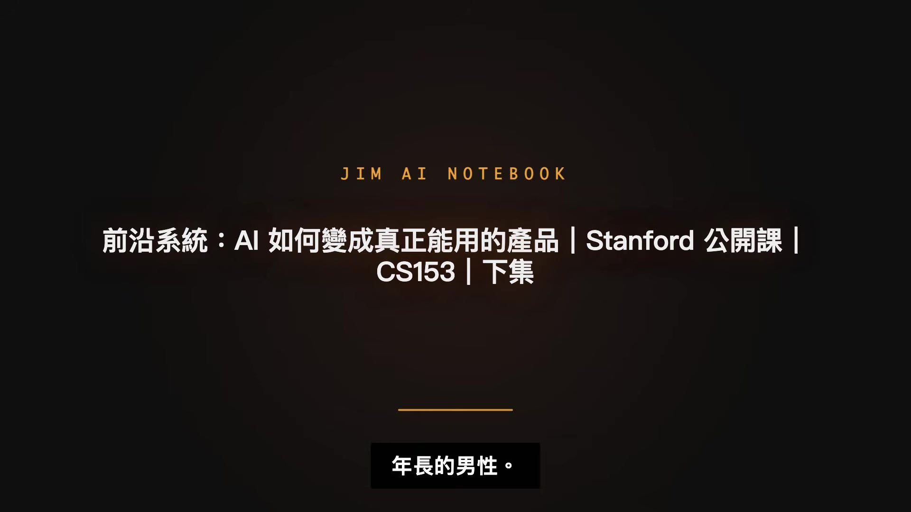

**逐字稿片段：** 而又有兩個在那種電視前面長大的年輕人, 後來一個進了Palantir 一個進了Google 然後他們兩個都辭職了 去做同一件事 讓機器把臺詞唸得像人 這是史丹佛CS153 這門課的第九堂到第十三堂 五位講者 站的卻是同一個位置 今天我們就把這五堂課一起上 那兩個從小看這種電視的波蘭人 一個叫Marty Staniszewski 本來在Palantir當部署策略師 另一個叫Piotr Dabkowski 本來在Google當機器學習工程師

**話題推測：** 介紹兩位年輕人的背景與公司（Palantir, Google）。

---

## 00:00:57

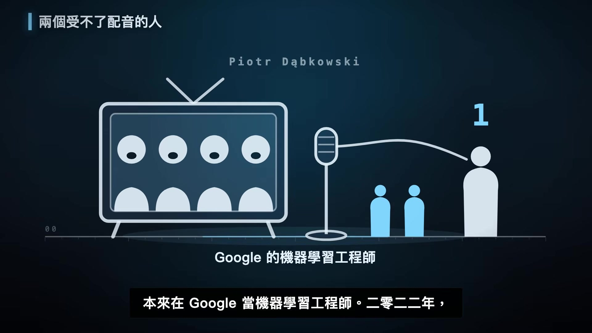

**逐字稿片段：** 2022年 他們在倫敦開了一家公司 叫11 Labs 你給他一段文字 他把文字念出來 今天這家公司的年化營收超過5億美元 年化營收的意思是 把每個月收入乘以12推算的一年規模 不是已經入賬的錢 他在講臺上講了一件 跟我原本想的不一樣的事 他說讓電影公司願意把這個技術 放進工作流程的 不是聲音變得多像人因子那一關 早就過了 真正卡住的是 你沒有辦法指揮他 你把稿子丟進去 他自己決定怎麼念 你不喜歡就再生成一次 再讀一次 一直到最近 他們才做到 讓你可以像片場的導演那樣講話 這一句重念一次 細節新一點 同時再慢一點 模型早就夠好了 真正卡住的不是他會不會唸 誰有權利說這句唸的好不好 這門課的前八堂 我們在上集和終集上完了 上集那四個人回答的是同一個問題 權力集中在誰手上 終極那四個人回答的是下一個問題 那我還剩多少籌碼 答案是槓桿變得非常長 但是那個支點是租來的

**話題推測：** 介紹他們於2022年在倫敦創立的Eleven Labs公司及其主要業務。

---

## 00:01:49

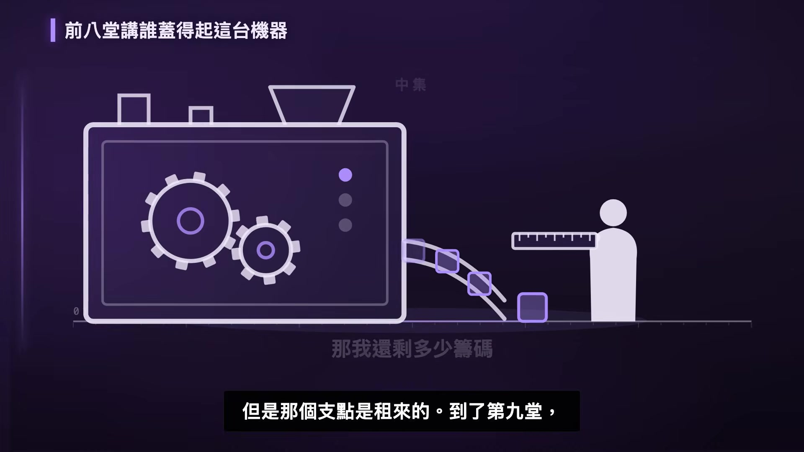

**逐字稿片段：** 到了第九堂 整個樓層換掉了 前八堂講的是 誰蓋得起這臺機器 這五堂講的是 機器蓋好之後 站在出料口的那個人

**話題推測：** 轉入討論第九堂至第十三堂課的主題：機器蓋好後的應用端。

---

## 00:01:57

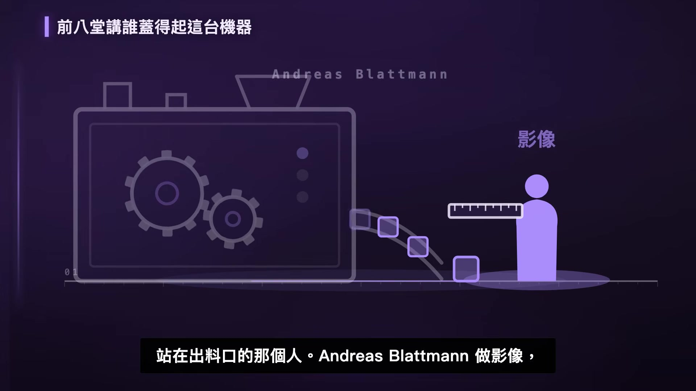

**逐字稿片段：** Andreas Blackman做影像 他是Black Forest Labs的共同創辦人 Amit Jain做影片 是LumaA的執行長 Matthew Staniszewski做語音 Nickel Singel不談模型 他做產品 講的是人 最後一堂是授課者Angie Meeta 這五個人的位置完全不同 可是隻像同一句話 模型已經夠好了 卡住的是誰來說這個好不好 順著這句話往下走 你會走到一個答案 你能驗證什麼 你就擁有什麼

**話題推測：** 列出五位講者及其所屬領域（影像、影片、語音、產品、授課者）。

---

## 00:02:23

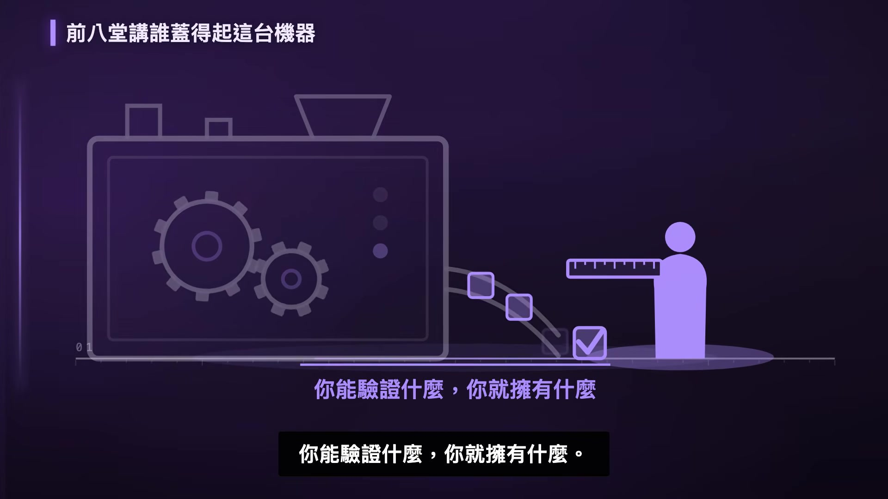

**逐字稿片段：** 我們先從影像這一講開始 第十一堂的講者叫Andreas Blattman 他是Black Forest Labs的共同創辦人 那天他從德國的Freiberg連線進教室 他大學唸的是機械工程 2019年才轉進AI 他一開場沒有講技術 他請全班做一件事 他問 18個月前 有多少人試過丟一張自己的照片給模型 叫他幫你加一頂帽子 然後出來的那個人真的像你 逐字稿上寫著 整間教室只有一隻手

**話題推測：** 介紹第十一堂課的講者Andreas Blattman及其公司Black Forest Labs。

---

## 00:02:49

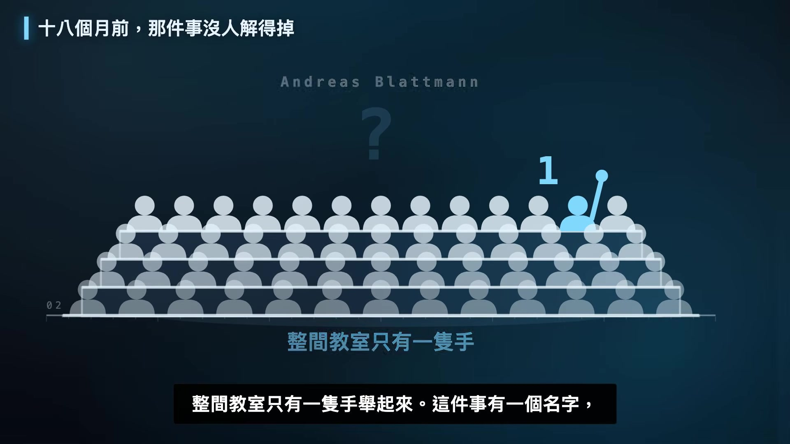

**逐字稿片段：** 舉起來 這件事有一個名字 叫角色一致性 意思是你換個場景換件衣服 畫面裡那個人還是同一個人 而在那個時候 這是一個大家公認解不掉的問題 Bladman說了一句很重的話 他說如果每一次有人跟我講這個問題 永遠解不掉 這些模型太笨了 我就能拿到一塊錢的話 然後他補了半句 而這些都是非常聰明的人 包括這門課的一些講者 一個全業界的共識 在兩年之內整個翻掉了 那他們是怎麼解掉的 答案要倒回2019年 當時Blatman在德國海德堡 一個小實驗室念博士 指導教授叫Bjorn Omer 他們的對手是Google 和OpenAI的研究團隊 而他的說法是 我們的算力少非常非常多 他說那時候 光是生出一張256x256的小圖 都算挑戰 沒有錢 就只能問一個 別人不用問的問題 有沒有這種表示法 對人的眼睛來說 跟原圖幾乎一樣 但是資料量小很多 他們找到了 他說你其實是在訓練 一個壓縮模型 可以把它想成一個 學出來的JPEG編碼 JPEG就是你手機裡 照片的那種格式 丟掉很多你看不出來的細節 換到小很多的檔案 他們就先把圖片 壓進那個空間 在裡面把圖畫出來 畫完再放大回像素

**話題推測：** 介紹「角色一致性」這個關鍵概念。

---

## 00:03:56

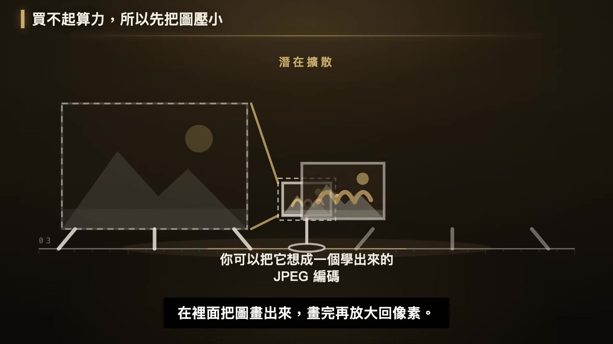

**逐字稿片段：** 這個東西叫潛在擴散 他後來的名字你一定聽過 Stable Diffusion 他之所以能在你自己家裡 那張顯示卡上跑起來 直接的原因就是 這群人當年買不起算力 Blatman這一講的主張 藏在一個很簡單的觀察裡 他說你現在看著我 你感知我的媒介是影像和聲音 這兩樣東西他叫做自然表示 因為它們的來源你控制不了 光來自太陽 河流的聲音本來就在那裡 文字不一樣 文字是人造的 他說如果你去量每一個符號 帶多少資訊 文字遠遠高過影像裡的每一個像素 原因就是它是人做出來的 溝通效率 演化太重要 所以我們把文字裡多餘的部分壓掉了 而奇怪的是 對學習來說 那些多餘的東西反而是必要的 你可以想想自己 還是嬰兒的時候怎麼學的 先是觀察 用聽的和用看的 然後在物理世界裡動手互動 大概五歲才開始讀字 他說一個三歲小孩的智能 跟一個語言模型的智能 是很不一樣的東西 所以他的結論是 從語言出發再往上疊別的表示 這個方向是錯的 應該回到人類真正的學習順序 先觀察再互動

**話題推測：** 介紹潛在擴散及其廣為人知的名稱Stable Diffusion。

---

## 00:04:55

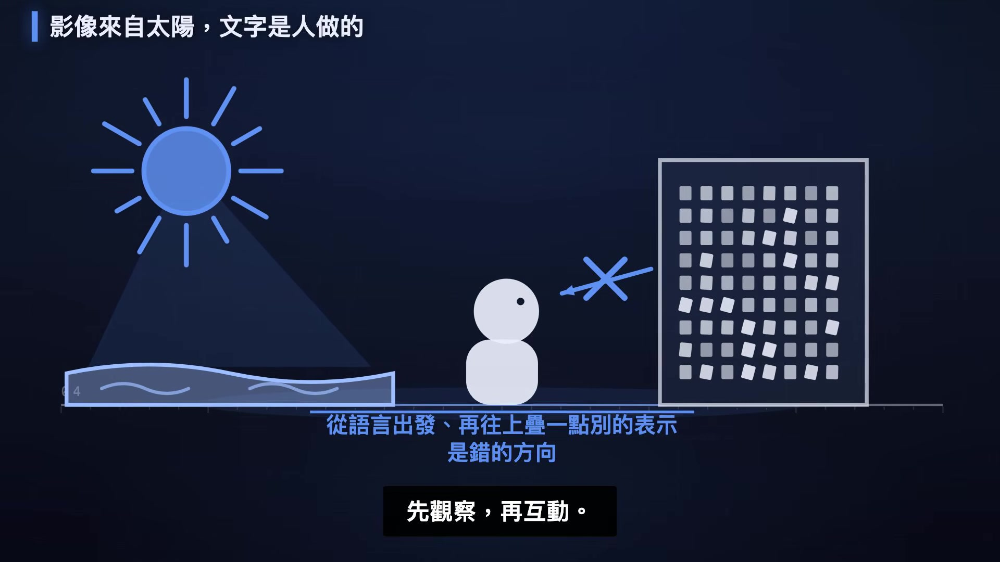

**逐字稿片段：** 真正把那個沒有人解得掉的問題 這套理論 是他們回頭看了一次使用者的資料 那一年他們在意大利辦團隊聚會 中間傳來消息 一個資源多很多的實驗室 剛發表了看起來好很多的東西 他說這種時候第一個直覺一定是 文呢 然後他給了一句每個人都用得上的話 一個好的領導者的標記就是 不要慌 保持冷靜 看資料 評估地形 再一步一步把計劃想出來

**話題推測：** 解釋他們回頭分析使用者資料來解決問題。

---

## 00:05:21

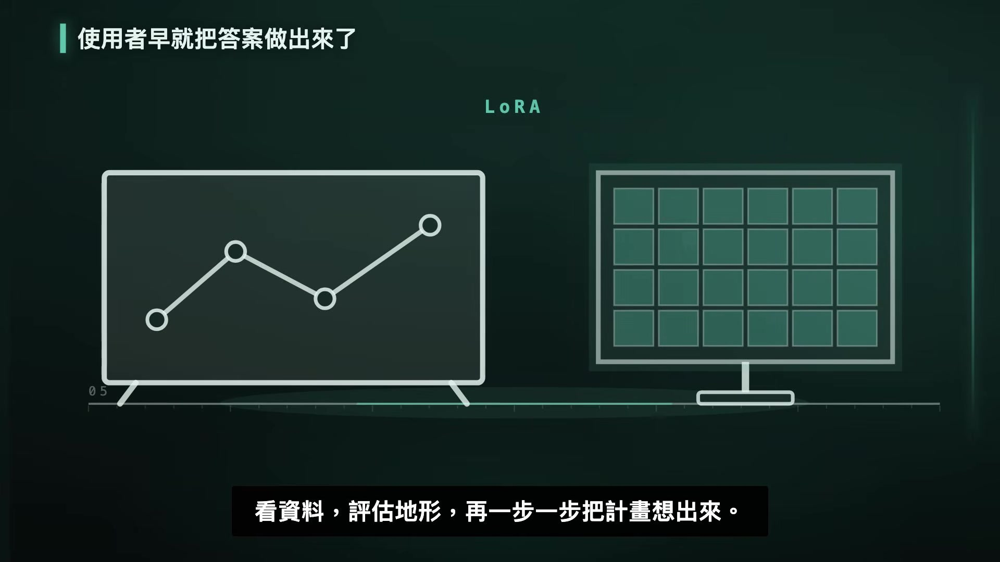

**逐字稿片段：** 大量的使用者拿他們的文字生圖模型 去訓練一種叫RORA的東西 RORA你可以想成 給一個大模型外掛一小塊記憶 讓他記住某一個特定的人 或某一種風格 比較像貼一張便條紙 不是重新訓練 那些人訓練羅拉的目的 幾乎都一樣 為了讓畫面裡的角色 每一張都是同一個人 這代表使用者要的控制力 遠遠超過一句文字能給的 所以團隊的一個叫Dustin的人想通了 他們要做的不是更會畫圖的模型 是能編輯的模型 24小時之內 整個團隊的人力被重新配置 60天之後 那個模型出來了 使用者的日常操作 改掉了一家公司的路線圖 這也出現了整支影片的主線 主持人問Blatman 美感這種東西要怎麼驗證 我先把驗證這個詞講白沉是嗎 很好驗證 你寫一段檢查程式去跑 對就是對錯就是錯 可是一張圖好不好看 沒有測試可以跑 他的回答很老實 那需要大量大量的人類判斷 很累 而且非常取決於你問誰 同一張圖拿給一個 沒碰過影像生成的人看 拿給他這種看過無數張圖的人看 訊號完全不同 然後主持人把這件事變成一條通則 這是這五堂課的鑰匙 只要怎麼驗證的答案是看觀眾是誰 就代表這個系統的價值高度取決於它能不能為特定觀眾調整

**話題推測：** 介紹使用者利用文字生圖模型訓練RORA的行為。

---

## 00:06:30

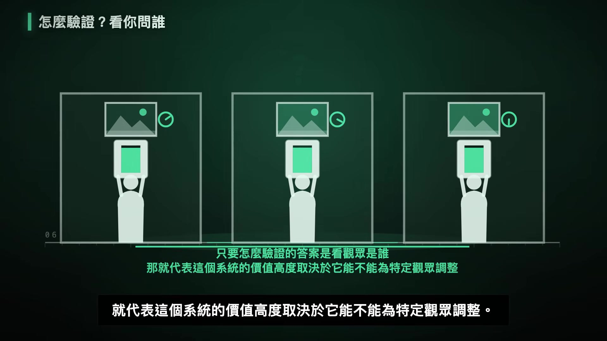

**逐字稿片段：** 而這正是開放權重進場的地方 開放權重的意思是 公司把訓練出來的參數直接給出去 任何人可以下載可以改可以在自己機器上跑 不是給你成品是給你原料和配方 所以他們可以跟一家大公司說 你想怎麼跳這個模型的偏好去服務使用者 你可以跟一個文化偏好完全不同的政府說 最後一粒鹿的控制權在你手上 那開放權重要怎麼賺錢 他們的flux一號不是一個模型是三個包裝 第一個叫Snail 德文的快 源泉開放給大家下載 第二個叫Dev 權重一樣公開 自己在家裡玩沒問題 可是要拿去賺錢 就得付費授權 第三個叫Pro 權重不公開 只放在截面後面 你付錢呼叫 而三個的差別不是大小 他說 這不像語言模型 有小中大三種尺寸 這三個一樣大 差的是步數 擴散模型畫圖 是從一團雜訊開始 一步一步把圖插出來 插50次細節 但是慢 他們用一種叫針流的技巧 讓小模型跟著大模型學 把50步壓到4步快很多 品質差一點 所以你買的不是不同的模型 你買的是不同的耐心 主持人幫他把 德國人的委婉翻成白話 不管你是誰多有錢 你要問把護欄拿掉 抱歉 護欄對所有人一樣 因為要當一個 大家能依賴的基礎設施 就不能對不同的人有差別待遇 Blatman承認 這確實讓公司少賺過 相當可觀的一筆營收 然後他說 那沒關係

**話題推測：** 介紹「開放權重」的概念，即公開模型的訓練參數。

---

## 00:07:49

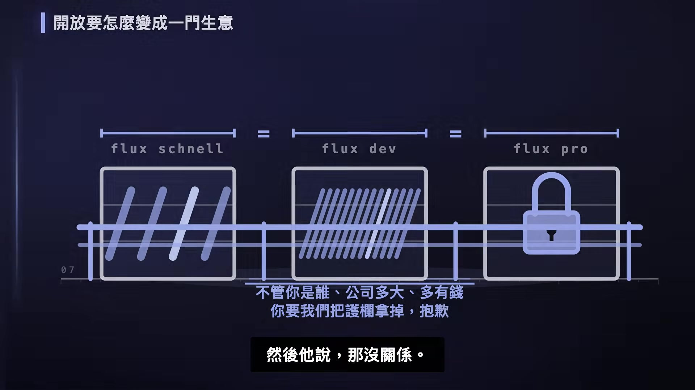

**逐字稿片段：** 講一影像我們往上抬一層 第十堂的講者叫Amy Chen Luma AI的執行長

**話題推測：** 介紹第十堂課的講者Amy Chen（Luma AI執行長）。

---

## 00:07:53

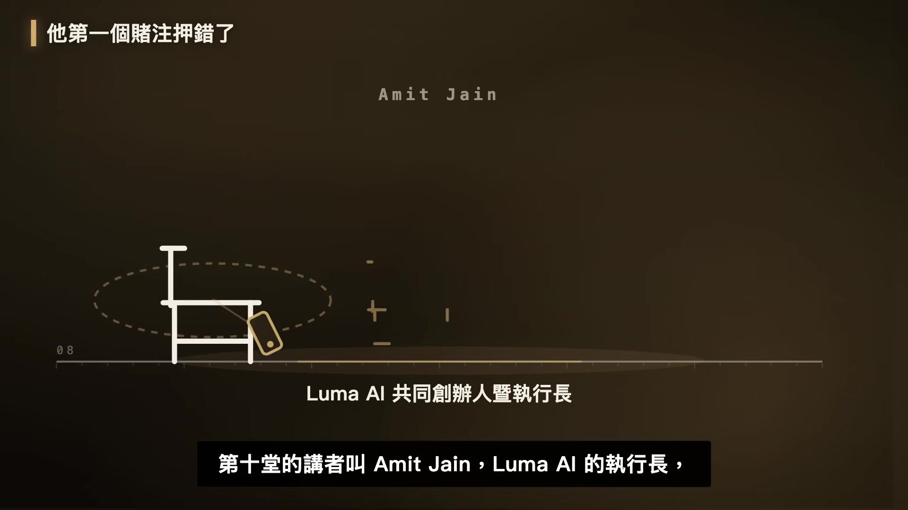

**逐字稿片段：** 之前在Apple做過Vision Pro 這一講最值得聽的是 他一開場就承認自己壓錯過一次 還用了天真這兩個字 他當時的推論很漂亮 立體資料比影像多 影像又比文字多 那要做最聰明的模型 當然去收集立體資料 所以Luma出了一個App 你拿手機繞著東西拍一圈 他就重建出立體場景 然後他撞牆了 他說不管多少人用那個App 都到不了學會這個宇宙學校的規模 因為網路上寫字拍照拍影片的人 遠遠超過任何一家公司散播的數據的量 他學到的那句話最實用 你必須照我的資料在哪裡設計演算法

**話題推測：** 講述Amy Chen最初的錯誤判斷，認為立體資料最重要，並推出Luma App。

---

## 00:08:27

**逐字稿片段：** 而不是反過來 他把這個教訓套到機器人身上 大家都要做動作系統 可是動作的資料在哪裡 他的原話是 網路上沒有一個動作的網際網路 文字和影片有整個網際網路累積了幾十年 可是沒有任何地方在記錄 一隻手把螺絲鎖進去 Luma後來做出的產品叫Dream Machine 2024年6月上線 你打一句話生一段影片 上線之後使用者很多 於是他們把按讚還下載的行為當成訊號 你們喜歡哪一隻模型就往哪個方向找

**話題推測：** 將教訓應用到機器人領域，提出動作資料稀缺的問題。

---

## 00:08:53

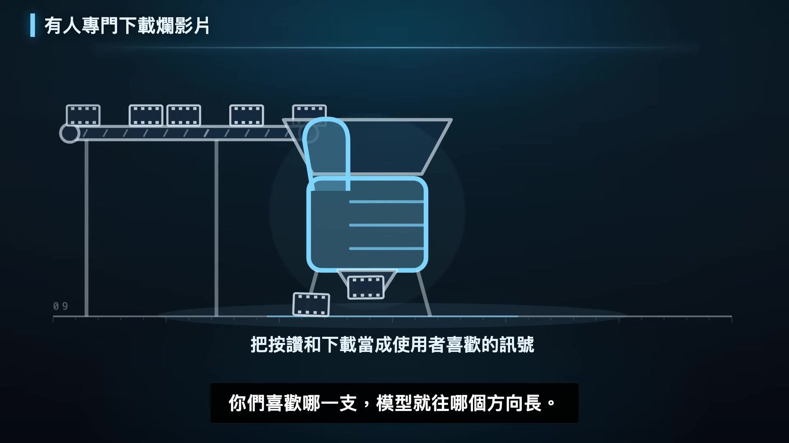

**逐字稿片段：** 然後出現了一個很好笑的問題 阿密劍說這個訊號不是百分之百準的 因為有些人下載的是真的很爛的影片 下載回去是為了拿給朋友看 說你看AI做出來的東西有多爛 模型分不出這兩種下載 於是他把那些也一起學進去了

**話題推測：** 提出使用者下載爛影片做為「反向訊號」的問題。

---

## 00:09:07

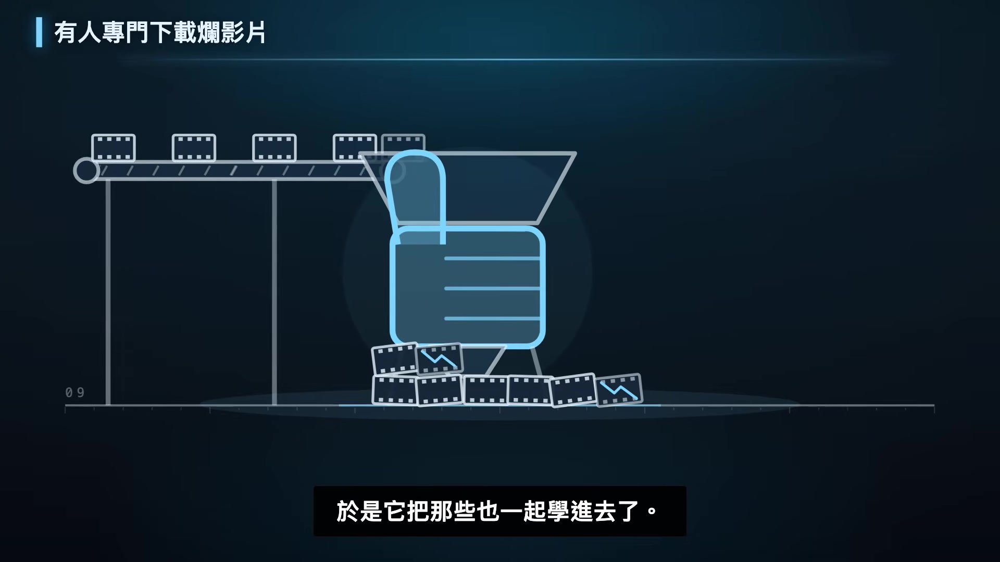

**逐字稿片段：** 所以他們得再蓋一層 付錢請人來把這種東西一直一直挑掉 他接著講的這句話 更正了很多人對前沿實驗室最大的誤解 他說這時候一個前沿實驗室 真正的樣子才浮出來 他有資料有算力有演算法 但是他還有一大塊 是訓練員家教還有做標註的人 沒有那些人 這個實驗室是不完整的 你以為那裡面全是顯示卡 其實還坐著一整排 在替模型打分數的人

**話題推測：** 強調前沿實驗室中「訓練員、家教、標註員」等人工環節的重要性。

---

## 00:09:30

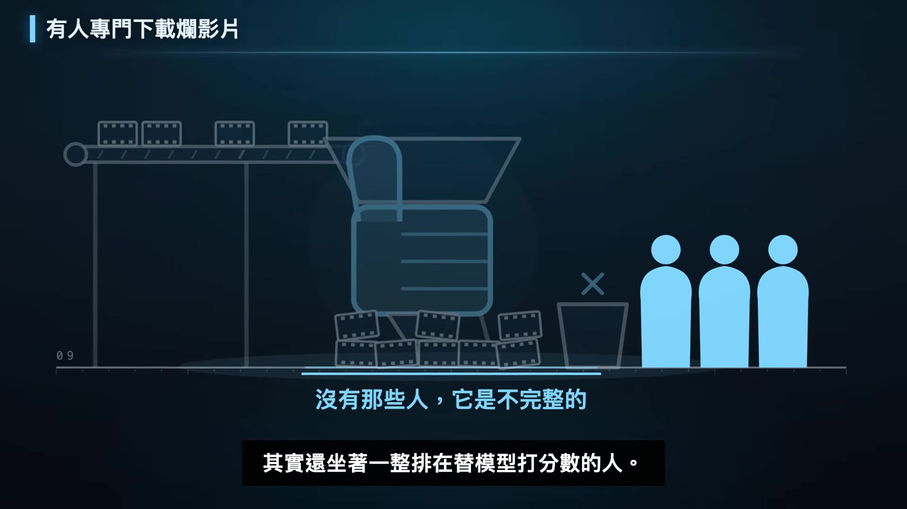

**逐字稿片段：** 接下來是這一講最好的一段 而且他可以整個班去解釋這五堂課 Armit Jain說 大家想到影像模型就覺得 他們只是在產出漂亮的圖片 而這是全世界對這個領域 最大的一個認知落差 他要你先想想語言模型 語言模型產出的也只是文字 那些文字可以排得很美 你可以說這是一首詩 然後他其實什麼都沒說 可是同樣一批文字 也可以排成一個數學證明 他們最後都只是字 決定資訊含量 決定聰明程度的 是你怎麼把他們串起來 像素也一樣 你怎麼排列像素 決定了他們在傳達什麼 也決定了他們有多聰明 所以他的立場是 影像和影片模型 不是會畫圖的模型 他們是在用 另一種材料表達智能 就像有些人用文字思考 有些人用圖思考 材料不一樣 思考是同一件事 這句話重新設定了整個問題

**話題推測：** Amit Jain提出影像與影片模型是利用不同材料表達智能，而非僅產出圖片。

---

## 00:10:16

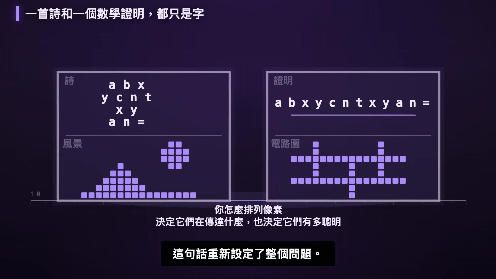

**逐字稿片段：** 如果影像也是一種語言 那今天這些模型不好用 原因就不會是 畫得不夠漂亮 那問題在哪裡 他的答案只有兩個字 真的很笨 他馬上補一句這樣 笨不是要罵人 是在描述一組症狀 他問 當你跟一個 你不覺得聰明的人 共識症狀是什麼 他們忘記你講過的話 你得一直重複同一件事 他們其實沒聽懂你的意思 他們是一個聽懂的仿製品 你講一句話 他們照字面解釋 可是那不是你的意思 他們可以做小事 你要求多一點就做不到了 他說 這就是今天所有的影片 和影像模型

**話題推測：** 提出影像模型「很笨」的問題點，而非畫得不漂亮。

---

## 00:10:48

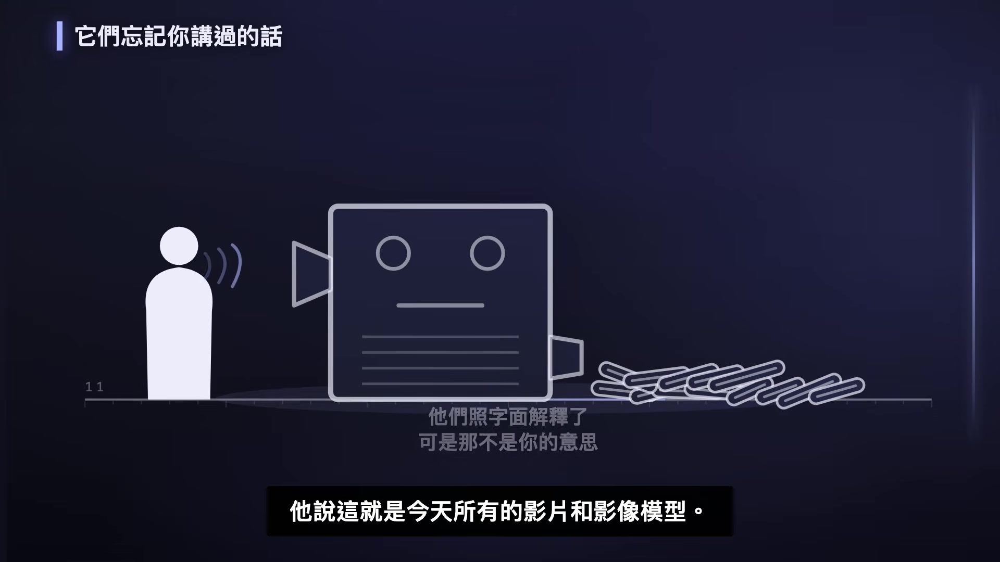

**逐字稿片段：** 他的類比更清楚 如果ChatGPT只能講一輪 你沒講完一句就要重開一次 那會多煩 沒有人會用 而那正好就是語言模型從研究專案 變成真正有用的東西的分界線 可以多輪對話 可以被你當場糾正 影像和影片模型還沒跨過那條線

**話題推測：** 將影像模型與早期單輪對話的ChatGPT作類比，指出影像模型尚未具備多輪對話能力。

---

## 00:11:04

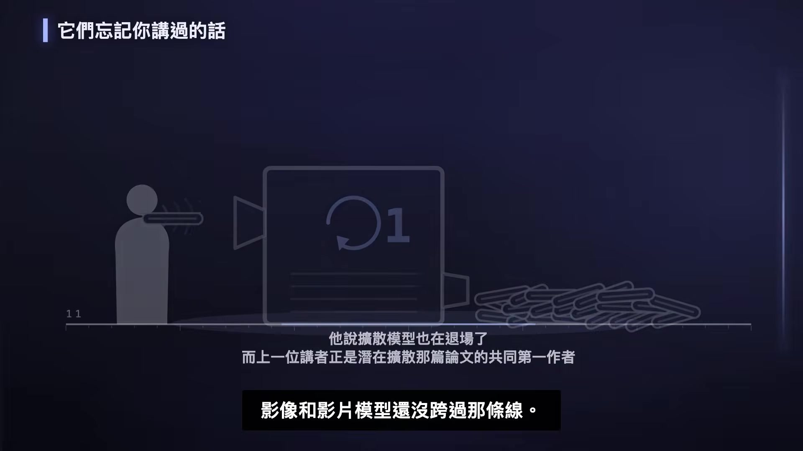

**逐字稿片段：** 這一講還有一句他自己標明有爭議的話 他說 擴散模型也在退場了 物理上規模撐不住 你可以把這句跟前面那堂放在一起聽 因為上一位講者 正是潛在擴散那篇論文的共同第一作者 同一門課 隔幾週 兩個人講了相反的話

**話題推測：** Amit Jain提出「擴散模型正在退場」的爭議性觀點。

---

## 00:11:19

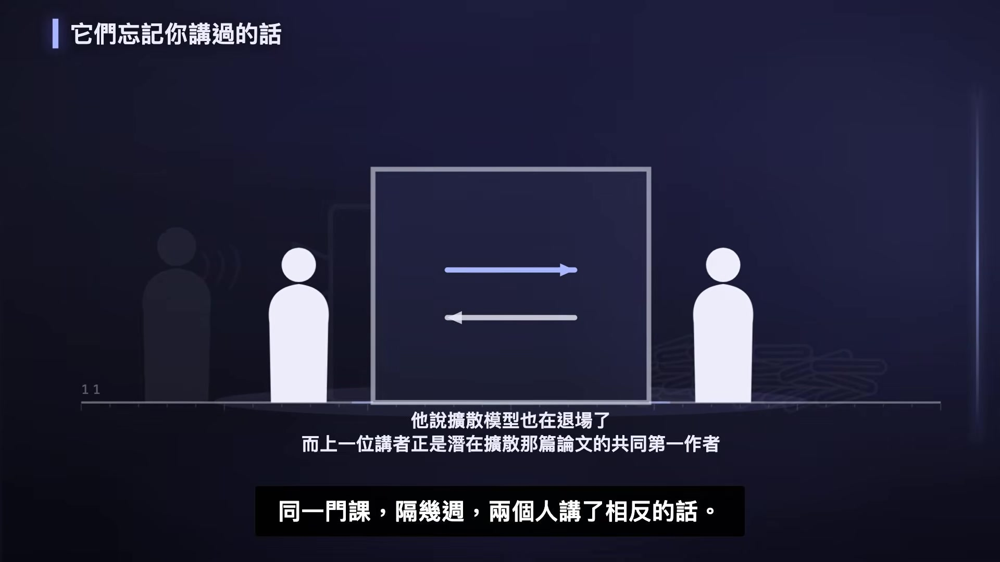

**逐字稿片段：** 那要怎麼把他變聰明 Amit Jain給的方向叫統一架構 也是不需要任何技術背景 他說Transformer其實不在乎你 為什麼資訊進去 真正出問題的是前面和後面 也就是編碼器和解碼器 所以他們要做的是 不管聲音影像文字還是程式碼 全部先編碼到同一個空間 然後在同一個骨幹裡面推理 他自己給的類比就是人腦 人腦處理視覺和聽覺 確實有不同的區域 但是那些只是編碼器 就像眼睛和耳朵 把光和空氣的振動都轉成同一種電訊號 所有資訊最後都進到大腦皮子 思考 推理 判斷 全部發生在同一個地方 他說這個架構他們花了大概一年 失敗過非常多次

**話題推測：** Amit Jain提出「統一架構」作為讓模型變聰明的方向。

---

## 00:11:57

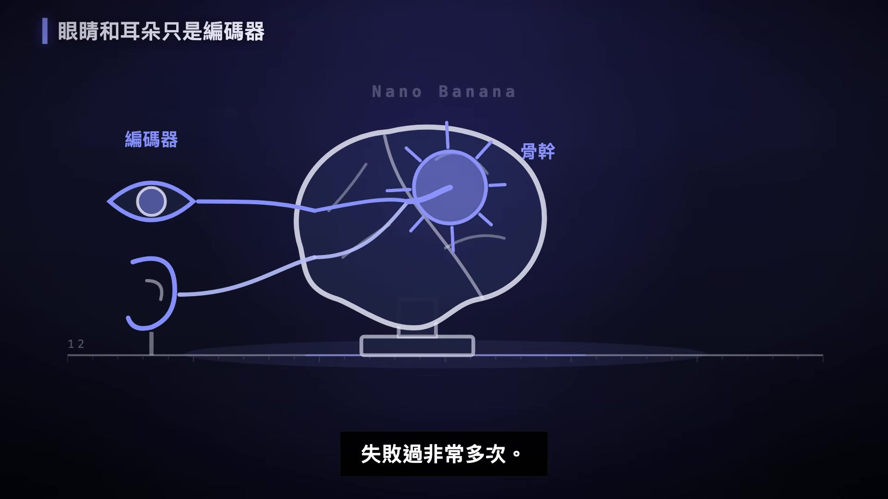

**逐字稿片段：** 他也順口評論了一款你可能天天在用的工具 Nanobanana 他猜那個東西還是兩座塔 一座負責生土 一座負責生製 中間只有一條很細的橋 這裡要加一個段數 那是他的推測 那家公司從頭到尾沒有公佈過任何架構資訊 那句話你聽他的觀點不要當成事實

**話題推測：** 評論Nanobanana工具的可能架構，推測其為兩座獨立模型間的細橋連接。

---

## 00:12:12

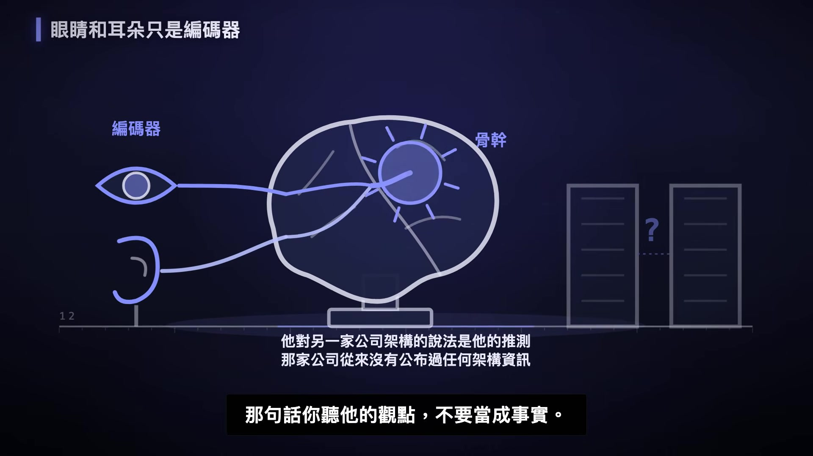

**逐字稿片段：** 那人在這套系統裡的位置在哪裡 阿米錢在課堂上 當場用Luma的產品生出一整份簡報 主持人問他怎麼做到的 他的回答不是模型 他說我們團隊裡有一個非常會做簡報的人 寫了一份大概50頁的文件 講什麼叫好的簡報設計 那份文件才是關鍵 模型負責畫 那份文件負責判斷什麼叫做好

**話題推測：** 探討人在AI系統中的位置，強調「好的簡報設計文件」而非模型本身是關鍵。

---

## 00:12:35

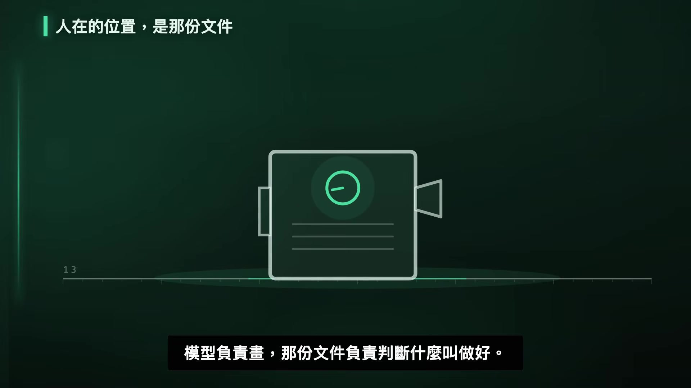

**逐字稿片段：** 他說城市設計師一直有一種槓桿 是藝術家從來沒有的 你寫一次城市 它會在所有人的電腦和手機上跑一次又一次 可是一個藝術家做出一個東西 只是一個東西就這樣 現在其他領域的創作者也拿到這個槓桿了 你把自己的判斷交給模型一次 它就能在不同情境下產出大量的東西 這句話的前半很勵志 可是他接的後半很冷 應該文人講出來 他說人的技能和創造力變得更重要 他會淘汰掉平庸的人 把真正厲害的人抬得更高 因為他們的作品會被重跑非常多次 同一個槓桿 兩個方向 你落在哪一邊 取決於你手上有沒有那份文件

**話題推測：** 闡述創作者如何透過模型獲得類似程式設計師的槓桿效應。

---

## 00:13:09

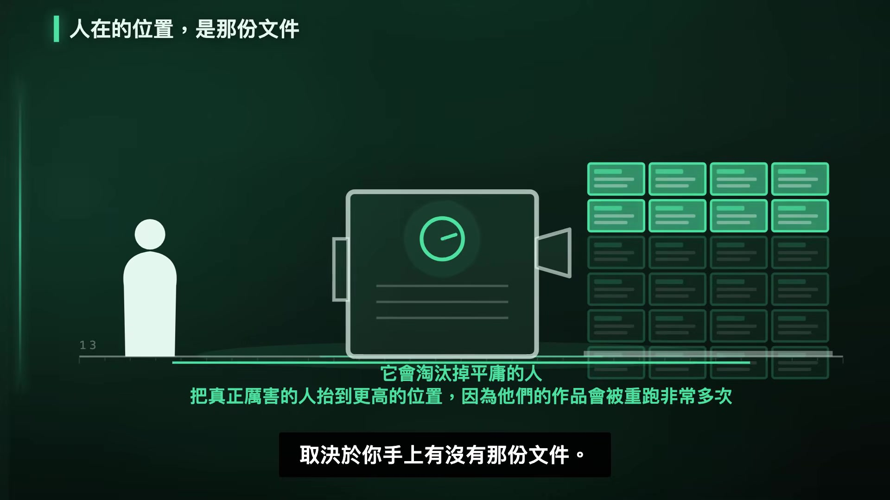

**逐字稿片段：** 這一堂最後有一段跟模型完全無關 有人問他AI會不會殺死好萊塢 他先把AI盛開 他說好萊塢現在是預設死亡的 而這跟AI一點關係都沒有 他的商業模式已經惡化了30年 疫情加速了他 然後編劇罷工是最後一根釘子 他接著說 好萊塢已經不拍電影了 好萊塢出錢 但是不拍 那在哪裡拍 希臘 加拿大 愛爾蘭 哪裡有稅務優惠就在哪裡拍 他把病因歸到一種心態 把一個系列當成一份資產 然後儘可能收租 哪一部大賣就拍二拍三拍四 他說他已經數不清有幾部復仇者了 他給的反例是串流平臺 一年做將近600部中等預算的東西 於是更多種類的故事被說出來 也就吸引到更廣的觀眾 這一段跟臺灣也接得上 我們自己也在做影視補助 他最後引了一句電影裡的臺詞收尾 不是觀眾有義務走進戲院養活好萊塢 是好萊塢有義務做出好東西讓觀眾想看 你不能怪你的客戶

**話題推測：** 探討AI是否會殺死好萊塢，提出好萊塢商業模式惡化的問題。

---

## 00:13:59

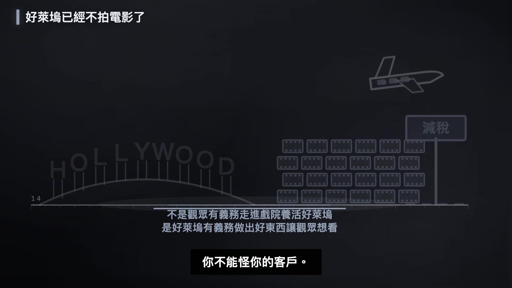

**逐字稿片段：** 好萊塢那個位置接到第12堂 Matis Daniszewski

**話題推測：** 介紹第十二堂課的講者Matis Staniszewski。

---

## 00:14:03

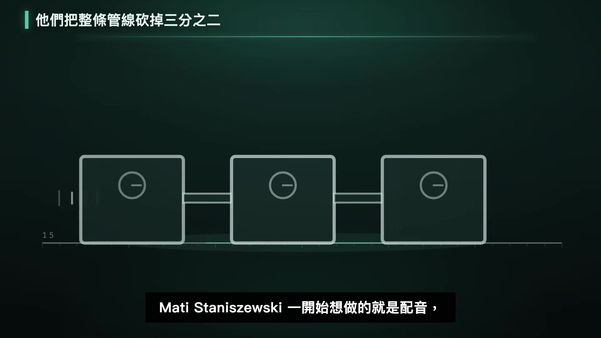

**逐字稿片段：** 一開始想做的就是配音 而配音要自動做完 需要三個模擬接力 第一個是轉錄 聽出畫面上是誰在講話講了什麼 還要把背景音樂分開 第二個是翻譯 把臺詞換成另一種語言 第三個才是合成 用聲音念回去 三個都不好做 他在動手之前 做了一件很土的事 打電話去問創作者和片場 如果自動配音做得出來 你有沒有興趣 對方的回答讓整家公司轉向 他們說有興趣 可是你能不能先幫我 做一件更簡單的事 我錄音的時候有幾段沒錄好 你能不能幫我修掉 或者直接用我的聲音 把稿子念出來這樣 我就不用站到鏡頭前面 所以在2022年 他們把整條管線 砍掉三分之二 只做最後一例 把文字變成聲音 聽起來像人 有情緒 而且只做英文 主持人把這個決定 這件事跟前面兩位講者同一個道理 資源有限的時候 你要盈靠的不是多做 是準確的少做

**話題推測：** 介紹自動配音的三個步驟：轉錄、翻譯、合成。

---

## 00:14:55

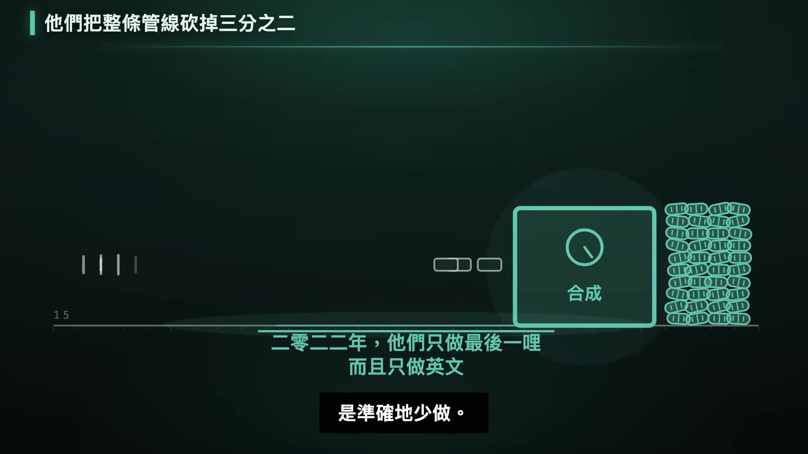

**逐字稿片段：** Stanislawski自己給了一條很好用的解題 把語音這幾年一年一年排出來 2022年他們解掉的是上下文 同樣一句話 如果它是一句開心的話 跟它是一段對話裡的一句念法必須不一樣 模型要先讀懂這一句 在什麼情境裡

**話題推測：** 按照時間順序闡述語音技術每年的進展，從2022年的上下文理解開始。

---

## 00:15:09

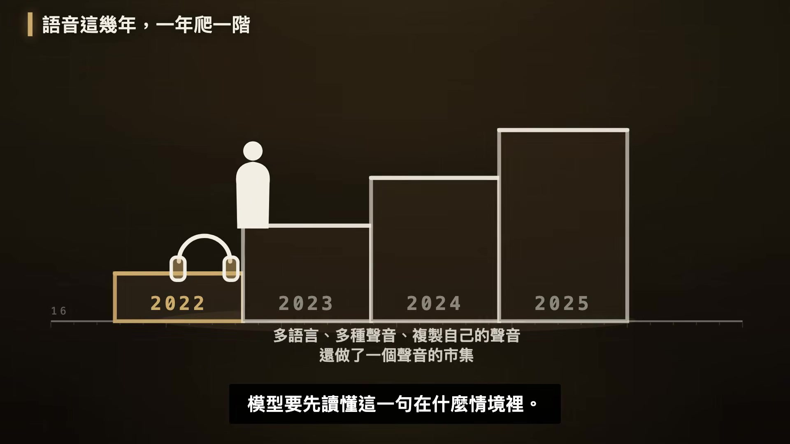

**逐字稿片段：** 2023年往外漲 變成多語言 多種聲音 也讓人可以複製自己的聲音 他們還做了一個聲音的試級 貢獻自己的聲音還能分到錢

**話題推測：** 介紹2023年語音技術的進展，包括多語言、多聲音及聲音市場。

---

## 00:15:18

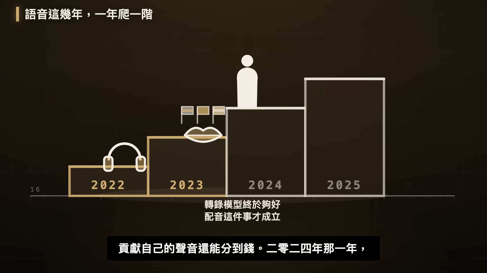

**逐字稿片段：** 2024年那一年 轉入模型終於做得夠好了 於是轉入翻譯合成三端 可以真的串起來 他們一開始最想做的配音 這時候才成立 你注意這個順序 他們最想做的事情 是在第三年才有能力做的

**話題推測：** 說明2024年轉錄模型完善，使得自動配音的完整管線終於實現。

---

## 00:15:30

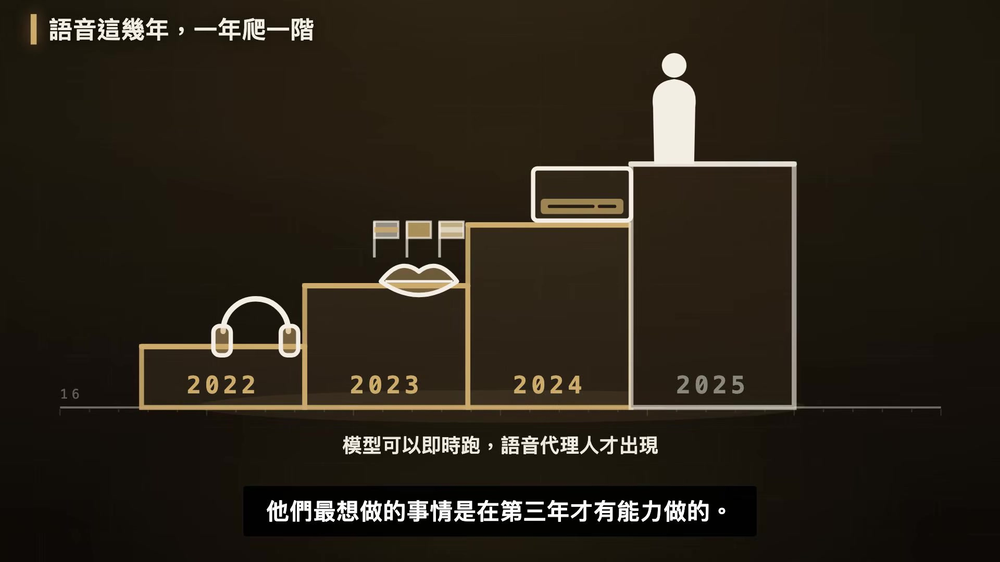

**逐字稿片段：** 2025年的關鍵是速度 模型終於可以即時跑 於是語音代理人出現了 他得判斷你這句話講完了沒有 然後馬上接話

**話題推測：** 預測2025年的關鍵是速度，語音代理人將實現即時對話。

---

## 00:15:37

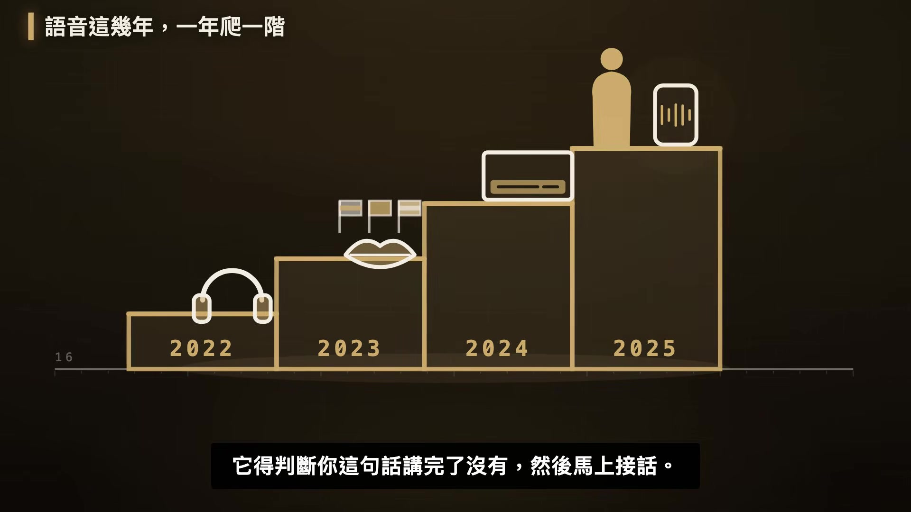

**逐字稿片段：** 而到了2026年 題目變成怎麼把中間的延遲 再壓下去 一年一節 而每一節都不是聲音變好聽 是這個系統又多學會 一件本來只有人在做的事 那要讓模型聽指揮 難在哪裡 答案很無聊 Stanislavski說 難的地方是 你根本沒有多少資料可以告訴模型 這一段的念法是開心是難過還是緊張 網路上有海量的聲音 可是沒有人在旁邊標註情緒 所以過去一年 他們大量投資的是標註工程 先把資料伸出來 才有東西可以訓練 這跟上一堂AmyGen講的是同一件事 前沿實驗室裡最不像科技的那一塊 決定了模型能不能再往上一截

**話題推測：** 預測2026年將著重於語音系統的延遲優化。

---

## 00:16:13

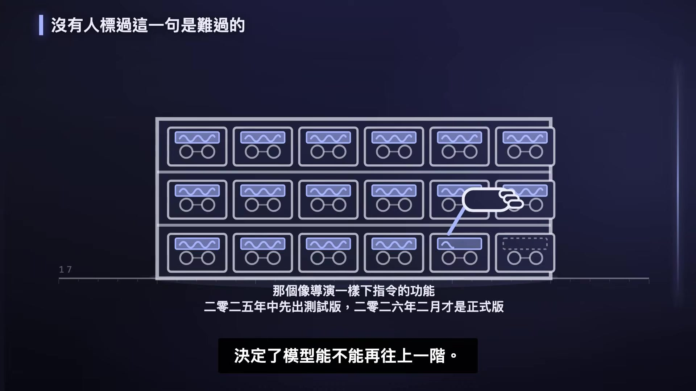

**逐字稿片段：** 那個像導演一樣下指令的功能 時間要講精確一點 2025年中先出測試版 2026年2月才是正式版 Synergyowski還給了AI8G一個定義 比阿比芬的討論都準 他說這些工具應該是中斷到中斷 不是斷到斷 你先有一個想講的故事 用工具做出旁白然後去修 也許整段重做才拿到好成果 而他講的那種垃圾 是端到端的版本你打下去提示 他直接給你成品 既沒有一開始那個故事的輸入 也沒有中間反覆修改的過程

**話題推測：** 提供像導演般下指令功能的精確推出時間：2025年中測試版，2026年2月正式版。

---

## 00:16:39

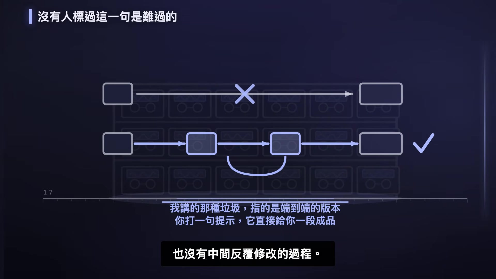

**逐字稿片段：** 他講最好的工程判斷 是他選了一個不性感的答案 語音系統有兩種概法 第一種叫串接式 三個模型排隊接力 一個負責聽懂 一個負責想 一個負責講出來 第二種叫融合式 一個模型從頭報到尾 你一開口他直接聲出聲音 不經過文字 明顯比較快 而Stanislavski的結論是 接下來幾年串接式才對 理由是每個人都經歷過的場景 你打電話到客服改機票 他得先驗證你是不是你 把資料拉出來 要動到付款還得確認付款資訊 中間大概還會走一次雙重驗證 每一步都必須可靠 而且照著順序走 他說融合式就犧牲了這一塊 你很難追蹤每一步發生什麼事 也沒辦法給他護欄 至於速度他直接認輸 延遲最難 這裡融合式是贏的 可是我們的客戶是企業 要可靠度勝過延遲

**話題推測：** 比較語音系統的「串接式」與「融合式」兩種架構，並說明串接式在未來幾年的優勢。

---

## 00:17:23

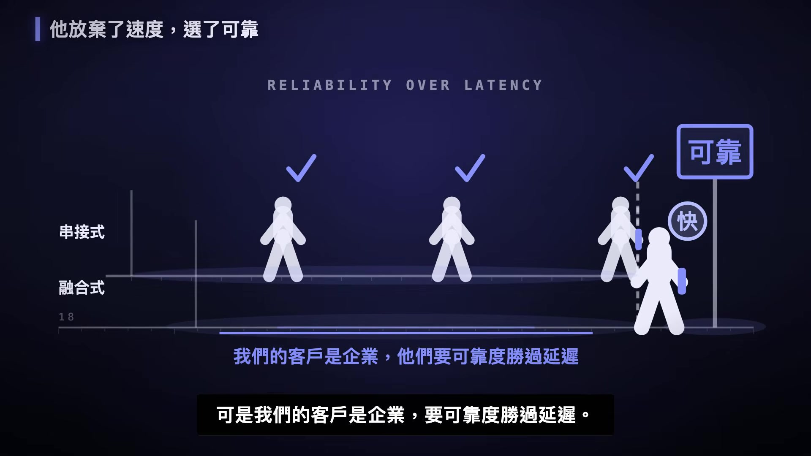

**逐字稿片段：** 這一段值得跟上一堂一起聽 MGN說要一個骨幹全部包進去 Staniszewski隔一週在同一間教室 說企業要的是接力 同一門課兩個相反的答案 而他們都有客戶 這一堂裡我最想留給你的 其實不是技術 主持人問Staniszewski 你在Eleven Labs做過最驕傲的事情是什麼 他講的不是營收也不是模型 他說是跟那些失去聲音的人合作 把他們的聲音找回來

**話題推測：** 對比Amit Jain的「統一架構」與Staniszewski的「串接式」觀點。

---

## 00:17:45

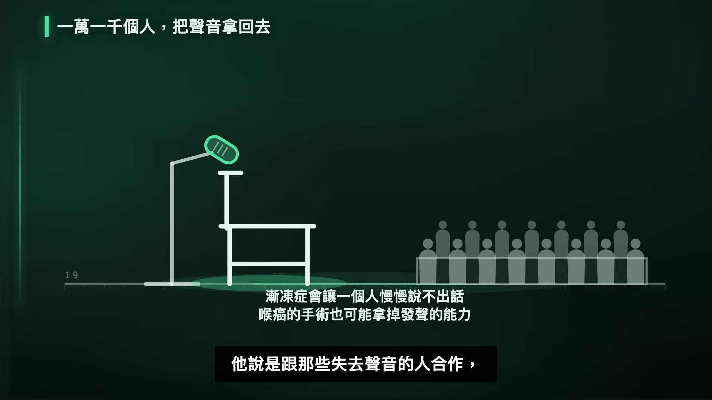

**逐字稿片段：** 見動症會讓一個人慢慢說不出話 後來的手術也可能拿掉髮聲的能力 而如果這個人在還能說話的時候 留下過任何一段錄音 哪怕只是一段家庭錄音帶 模型就可以從那段聲音裡學會他的音色 然後把他之後想講的每一句話 用他自己的聲音講出來 到目前為止 這件事他們已經替超過一萬一千個人做過 你可以想象那個畫面 一個人在鍵盤上打字 然後房間裡響起來的是他自己的聲音 不是一個機器人的聲音 這個數字是整支影片裡我最想讓你記住的一個 同一個技術你可以拿他做出很難聽的東西 也可以拿他把一個人還給他的家人

**話題推測：** 說明Eleven Labs如何協助超過一萬一千名失去聲音的人重建個人音色。

---

## 00:18:18

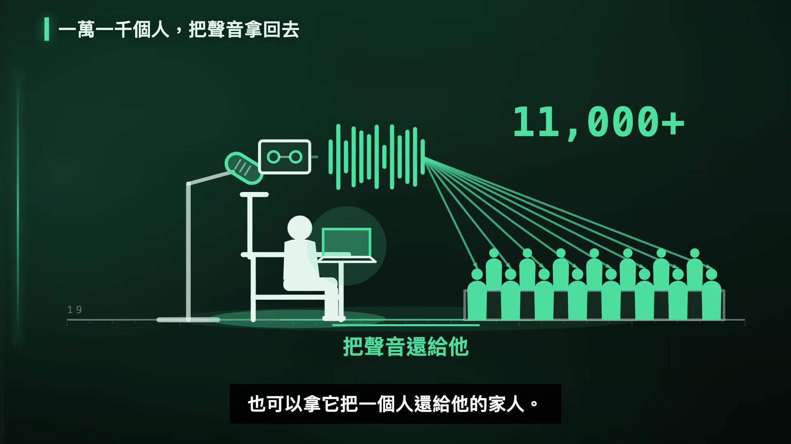

**逐字稿片段：** 同一套技術還去了一個 你不會想到的地方 戰爭開打之後 烏克蘭政府面對一個很現實的問題 人在移動 機關在關門 那些要跑一趟才辦得到的事怎麼辦 他們做了一個叫DR的公民應用程式 這個字在烏克蘭文裡是行動的意思 把上百項服務全部放進子手機裡 而11Maps做的是 加上語音那一層 Stanislavski自己飛到基輔去工作 因為真正的難點不是 手機界面做得多漂亮 是那些不太會用科技 年紀比較大 沒有網路的人 要怎麼拿到同樣的服務 他們的答案很土也很好 讓那個人打一支電話就好 電話那頭是一個 聽得懂也講得出來的系統 他還觀察到一件跟技術無關 但是很值得操的事 在那裡每一個部位 都有自己的技術資源可以做創新 不必走繁文入節 各自往前推 一個在臺上講架構的人 講到最有溫度的兩段 一段是把聲音還給病人 一段是讓一個沒有網路的老人打了通一支電話 這一堂還有一句話

**話題推測：** 介紹Eleven Labs技術在烏克蘭戰爭中，透過DR公民應用程式提供語音服務的應用。

---

## 00:19:10

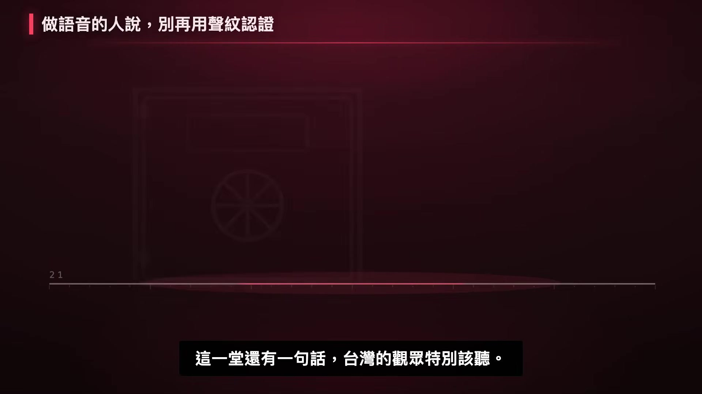

**逐字稿片段：** 臺灣的觀眾特別該聽 銀行和電信這幾年一直在推聲紋認證 就是用你的聲音當密碼 而一個做語音模型的人在史丹佛的講臺上說 這天很多系統包括銀行還在依賴語音認證 我們認為這不是未來 你應該離開這條路 不要再拿它當認證手段 從治安的角度來看這是錯的做法

**話題推測：** 警告臺灣觀眾聲紋認證並非可靠的未來方向，銀行應停止依賴此認證方式。

---

## 00:19:29

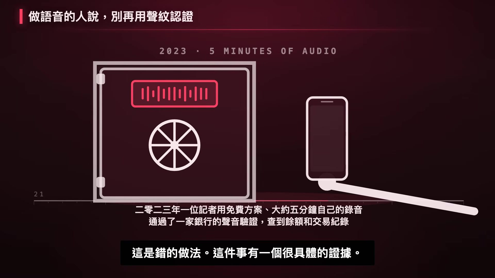

**逐字稿片段：** 這件事有一個很具體的證據 2023年一位記者用的就是11Labs的免費方案 拿自己大約5分鐘的錄音 做出一段合成語音 打進自己的銀行 通過了聲音驗證 查到餘額和交易記錄 滿是被自己的聲音打開的

**話題推測：** 舉例說明2023年記者利用Eleven Labs合成語音成功通過銀行聲紋認證。

---

## 00:19:43

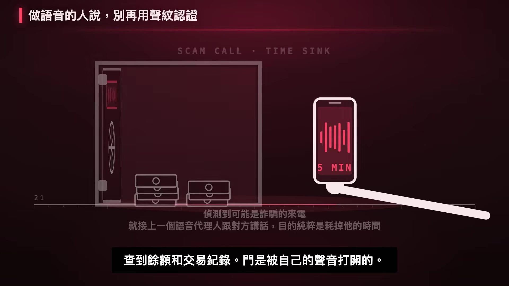

**逐字稿片段：** 反過來也有很好玩的一段 他們跟一個慈善機構合作 只要偵測到一通來電 可能是詐騙集團打的 就把一個語音代理人 接上去跟對方講話 目的很單純 就是耗掉那個人的時間 同一個技術 一邊把假的聲音送進銀行 一邊用假的聲音去拖住騙子

**話題推測：** 介紹Eleven Labs利用語音代理人阻擋詐騙電話的應用。

---

## 00:19:57

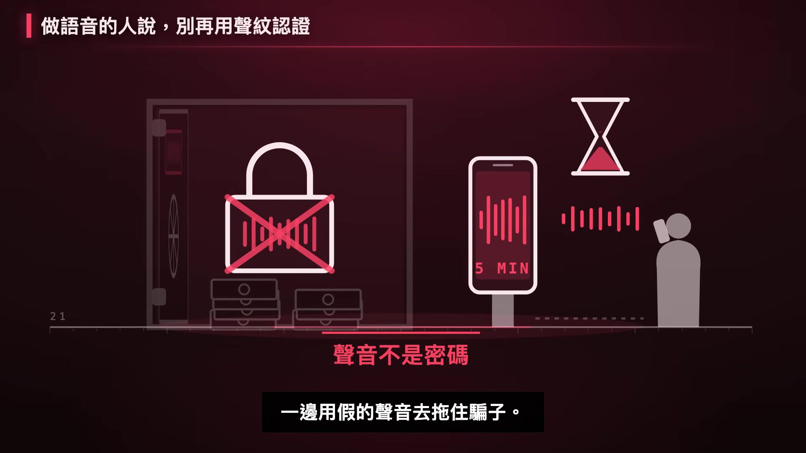

**逐字稿片段：** 五堂課裡有一堂完全不談模型 第九堂的講者叫Nikiru Shingo 創過三家公司 在Google當過產品管理總監 管過Hangouts 現在在Meta當產品副總 另外經營一個叫Skip的網路 他這一堂講的是人

**話題推測：** 介紹第九堂課的講者Nikiru Shingo，其內容完全不談模型。

---

## 00:20:10

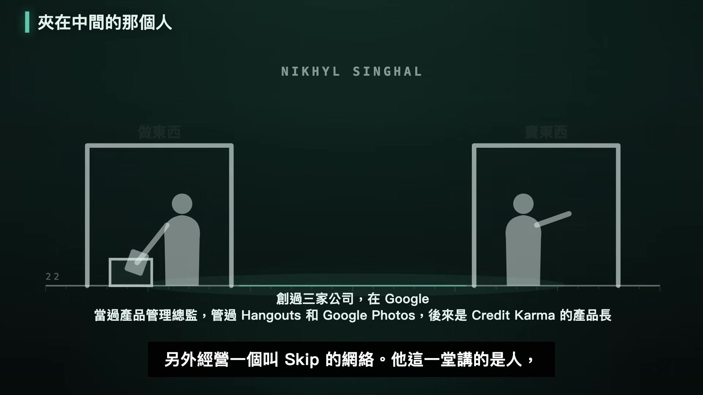

**逐字稿片段：** 也是全系列對觀眾處境講得最直接的 他先定義了產品經理 這個定義非常好懂 他說每一家科技公司裡 都有一群人負責做東西 有一群人負責賣東西 然後有一群人夾在中間 夾在中間的那些人 把你想做什麼 黏到要怎麼做出來上面 那就是產品經理

**話題推測：** Nikiru Shingo定義了產品經理的角色。

---

## 00:20:27

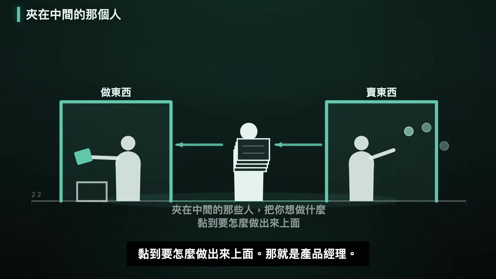

**逐字稿片段：** 接著他畫了一張公司四個階段的地圖 第一階段是在找一個 真的有人要的產品 他的比喻是 專木取火 一直戳 希望冒出一點菸 這時候根本沒有產品經理 冒煙之後你聞到熱度 要做的不是繼續實驗 是冷靜下來 因為下一個客戶 不能拿到不一樣的產品 再來是超高速成長 既要把現有產品做大 又要開新產品線 而過去五年 做這兩件事的標準做法 只有一種 僱一大堆人 他講了一個自己搞砸的案子 Google曾經把好幾個通訊產品 整病成一個叫Hangouts的東西 那次整病就是他做的 他說那個決定的錯誤在於 它是一個大樓裡面的問題 不是使用者的問題 他問全班你們有誰會想 天啊我好希望手機上 只要一個App就能跟所有人溝通 我打賭你們每天都在用 好幾個不同的軟體 那全部是不同的App 可是我們在公司裡的信念是 我們有七套程式碼 七個產品 七套身份系統 整合起來一定比較合理 結果客戶根本不在乎 他給的對照組是另一家通訊軟體 只做純文字 把印度和鄉村地區做到全世界最可靠 等網路建起來之後 語音和視訊自然疊得上去 還有一個很好的反諷 Hangouts 後來又被分回兩個產品

**話題推測：** 介紹公司發展的四個階段。

---

## 00:21:31

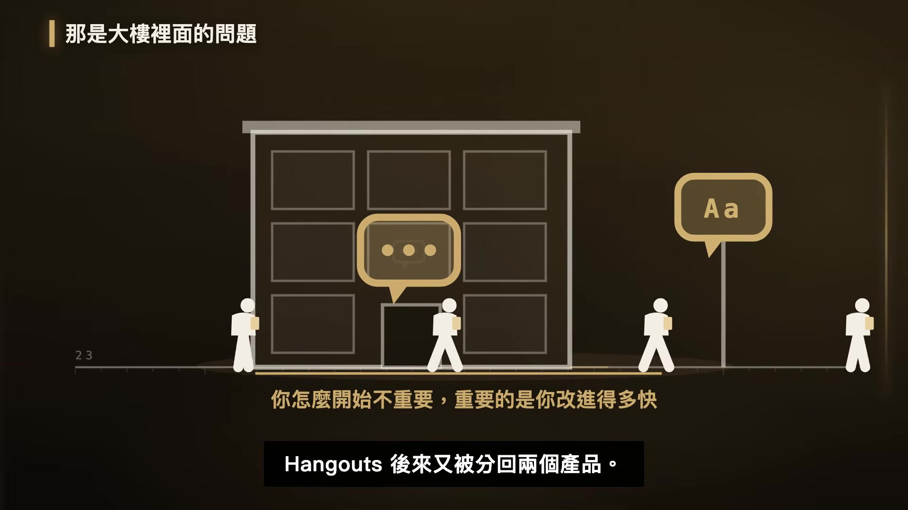

**逐字稿片段：** 難說Google教他最有用的一件事是 最好的產品一開始看起來都很爛 重要的是你改進得多快 Trump每六個星期出一個新版本 當時的IE好幾年才動一次 這一堂最好的一段是兩次舉手 Single先問全場 多少人對畢業之後找工作感到焦慮 幾乎所有的手都舉起來 然後問他這個問題 多少人正在用AI做東西 而且做得很開心 舉手的是同一群人 他停在這裡給了一個對照組 如果三年前問同樣這兩個問題 答案會反過來 焦慮的大概只有二三成 可是那時候我找不到一個 真心喜歡自己職位的人 為什麼 那時候是零利率年代 錢很便宜 公司排名固人 就算你只是中等能力 也會拿到好幾個聘署 可是那些工作全都是同一種形狀 有責任沒權利 他說產品這一行不管公司大小 你的工作就是把資訊包裝好 交給另一個做決定的人 如果你是想做東西的人 當一個官僚是很痛苦的 所以他的判斷是一個 你可能沒想到的好消息 現在的人壓力更大 但是更快樂 因為你不用再等工程師 等設計師 等老闆點頭 這一段跟前面幾堂接得很緊 前面講的是模型 把成本壓下去 這裡講的是 那件事落到一個人身上的樣子

**話題推測：** 闡述產品改進速度的重要性，以Trump和IE的更新週期為例。

---

## 00:22:35

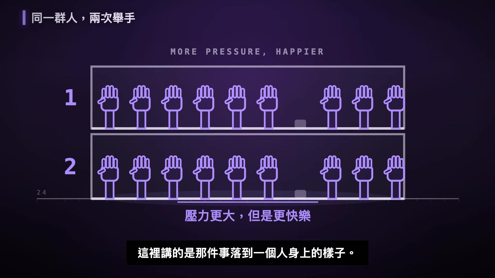

**逐字稿片段：** 有人問他 現代的產品管理裡 最沒有用的是什麼 他的回答分兩層 第二層很不客氣 他說很多公司 是用演戲在做產品的 你開一個大型的正式會議 會議上有一份簡報 那份簡報是一群副總寫的 你去問副總 副總說是我團隊做的 再往下是總監 總監熬夜把投影片拼起來 再往下全部都來自某一個30歲的人 跑的一個實驗 然後一大堆副總把時間全花在這件事上面 而最底下那個想出這個實驗的人 根本沒有出現在那個會議室裡

**話題推測：** 批評現代產品管理中，大型會議簡報層層轉嫁責任的「演戲」現象。

---

## 00:23:03

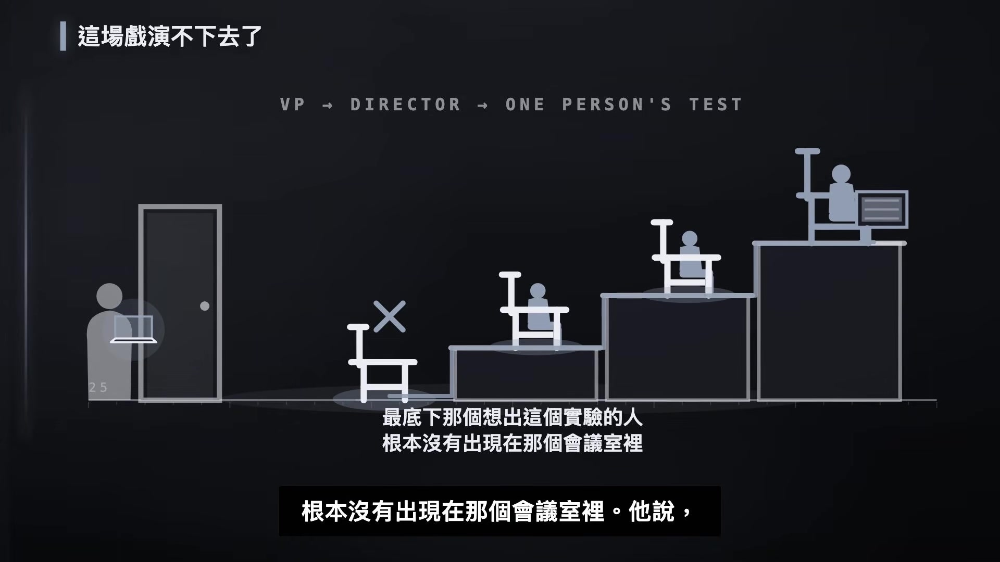

**逐字稿片段：** 他說這就是今天軟體被做出來的方式 然後他下了一句判斷 我覺得這一整堂就靠這句話撐住 他說這場戲演不下去了 他自己在Meta的工作 大部分就是讀很長的文件 或者背靠背開會 而業界現在有一個很明確的趨勢是 是往完全不開會的方向走 有些團隊一個星期只去半天 理由跟上面是同一件事 那些會本來就是在演戲 把地面上發生的事一層一層往上傳 這件事現在有別的東西可以代勞

**話題推測：** 提出「這場戲演不下去了」，軟體開發正朝向減少會議，多依靠文件工作。

---

## 00:23:29

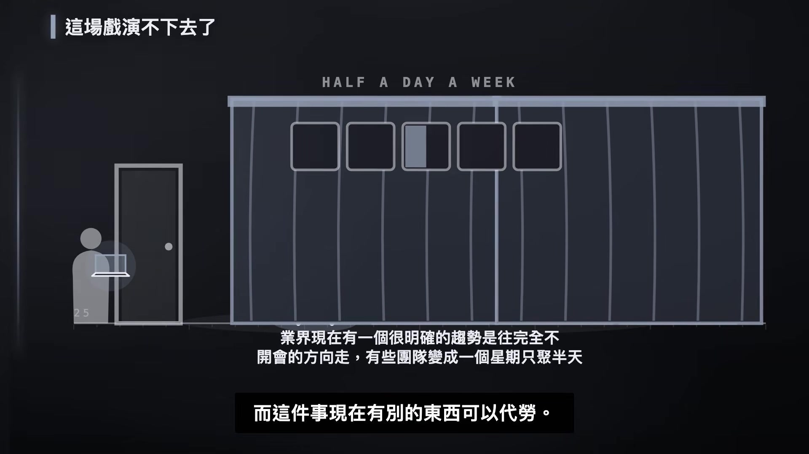

**逐字稿片段：** 這一段是這一堂最冷的 我照他的原話講 他說最難受的那群人不在這間教室裡 是那些還可以但是 不算頂尖的建造者 在零利率的年代被升上去當主管 他們對該做什麼沒什麼意見 但是對資訊怎麼流動意見很多 他們現在看到AI會自己寫程式 他們有小孩 有年邁的父母三十幾歲 他們心裡想的是 我沒有時間 自己重新發明一次 他的結論是 最焦慮的房間不在這裡 是那些入行8到15年的中階主管

**話題推測：** 指出入行8-15年的中階主管是當前最焦慮的一群人，因AI衝擊其資訊搬運角色。

---

## 00:23:56

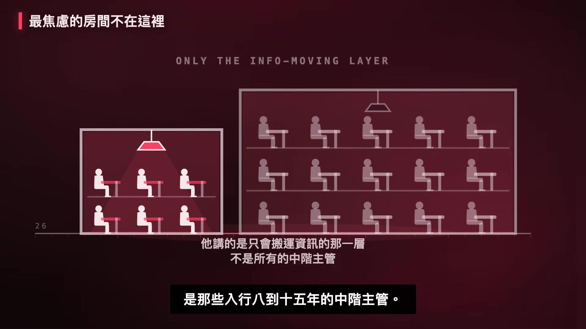

**逐字稿片段：** 這裡要把分寸講清楚 他講的是 只會搬運資訊的那一層 不是所有的中階主管 他說那些實驗室面試的時候 不在乎你待過哪個牌子的公司 他們看得出來 一個人是不是在面試的同時 才在學工具 他還丟了一句 對名校生很有分量的話 品牌現在處在歷史低點

**話題推測：** 澄清不是所有中階主管都受影響，並提醒名校品牌不再是優勢。

---

## 00:24:12

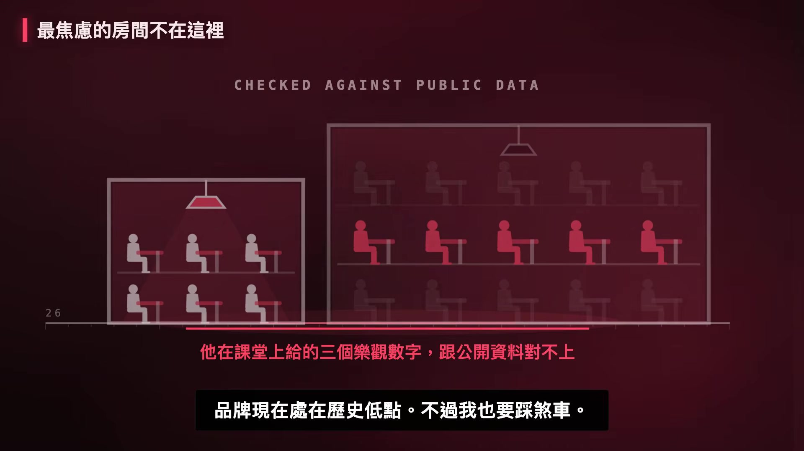

**逐字稿片段：** 不過又要踩剎車 他在課堂上還說 產品經理的職缺 比歷史上任何時候都多 大型科技公司今年會裁掉三成到七成的人 這兩個我都對過公開資料 跟產品最相關的職缺 現在比疫情之前還低 各家公司實際的裁員比例落在2%到15% 那他給學生的答案是什麼 他先做了個算術 一個人這輩子可能工作40到50年 一份工作平均只待兩三年 所以你這輩子大概會有15到18份工作 他的結論是 你的職涯不是球賽的三節 是一本書的章節 他那家公司叫Skip 命名理由就是這個 他說最好的職涯建議是去想 你正在想的那一章的下一章 所以與其問第一份工作要做什麼 不如問你第二份工作要做什麼 第一份要怎麼安排 才能讓第二份選擇最多

**話題推測：** 更正關於產品經理職缺和大型科技公司裁員比例的數據。

---

## 00:24:54

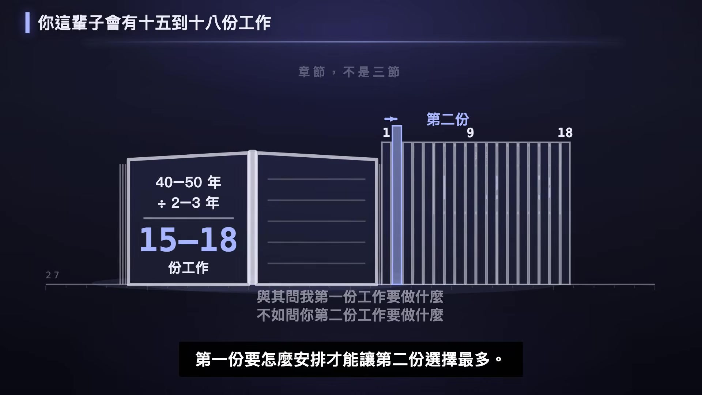

**逐字稿片段：** 他給的建議裡最重要的是系統思維 以前的問題是 這個東西要怎麼做出來 現在的問題是 假設他做得出來 那到底該不該做 他還畫了一條線 每隔幾年平臺就往上漲一層 從組合語言到編譯語言 腳本語言 到現在是用提示在寫東西 如果你懂這些層怎麼往上疊 怎麼把下面那層淘汰掉 那才是接下來唯一的求局 最後他講了自己的後悔 他說我當年應該少焦慮很多 除了你自己以外 沒有人真的在乎你的成績 我沒遇過任何一個僱主在意過 他還說非常後悔 沒有交更多朋友 最後一堂課 是這門課的授課者自己上的 他叫Enje Mita

**話題推測：** 強調系統思維的重要性，並描繪技術平台從組合語言到提示工程的疊代演進。

---

## 00:25:28

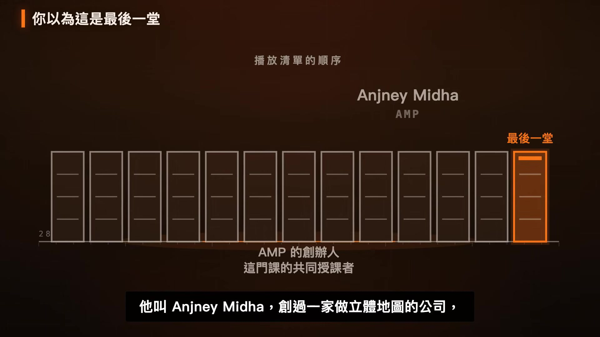

**逐字稿片段：** 創過一家做立體地圖的公司 後來被Disco收購 之後在創投機構ASU6J 現在開了一家叫AMP的公司 而這裡有一件事是 我做這支影片時才發現的 它會改變你怎麼看前面12堂 這一堂在播放清單裡排在最後 因為那個清單是按照上傳時間排的 可是它不是期末總結 它是開學第一週的課 他自己在開場就說了 今天我是這一季剩下所有人的開場暖場 接下來那些人才是你們的主秀 也就是說前面12堂 那些你以為排在他前面的人 微軟的執行長 OpenAI的執行長 黃仁勳 在時間上全部是後來才走進這間教室的 他們講的每一句話 其實都是在回答 開學第一週黑板上就寫好的問題

**話題推測：** 揭露本堂課實際上是開學第一週的課，為前12堂課設定了主題。

---

## 00:26:06

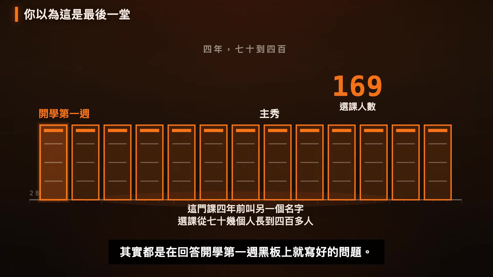

**逐字稿片段：** 這門課四年前叫另一個名字 那時候選課七十幾個人 這一季是四百多人 所以接下來這幾段 你可以當成一份提前公佈的答案卷 Mita一開始就在黑板上畫了一張圖 而這張圖其實就是我們這三集的目錄 他說過去十幾年 垂著雲長出來 一個還算穩定的堆疊已經成型了 最上面是資本 前綴靈活 可以放進任何一層 往下是土地 電力 和廠房 也就是發電和蓋機房 再往下是晶片 再往下是雲 也就是讓晶片能被用起來的那層軟體 再往下是模型和代理人 然後是應用 拖的整件事是治理 安全 安全 治安 還有信任

**話題推測：** 比較課程選修人數從四年前的七十多人增長到四百多人。

---

## 00:26:42

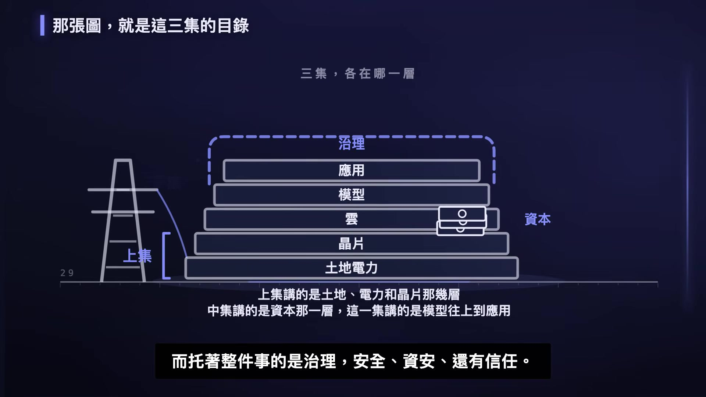

**逐字稿片段：** 你把這三集擺上去就會發現 上集講的是土地 電力 還有晶片 中集講的是資本 而這一集講的是模型往上到應用的那幾層 他管現在這個時刻叫大轉換 他說至少在我這一生 我不記得有哪個時候是每一層 假設都同時在被重新檢視的 而他接的話是給學生的 那給了你們巨大的機會 因為只有在不確定的時候事情才會改變 這張圖也解釋了為什麼這門課的講者名單 長得那麼奇怪 一個做核燃料的 一個做語音的 一個管治安的 因為他是照著這張圖一層一層把人請上來

**話題推測：** 解釋科技堆疊圖與本系列三集影片內容的對應關係。

---

## 00:27:12

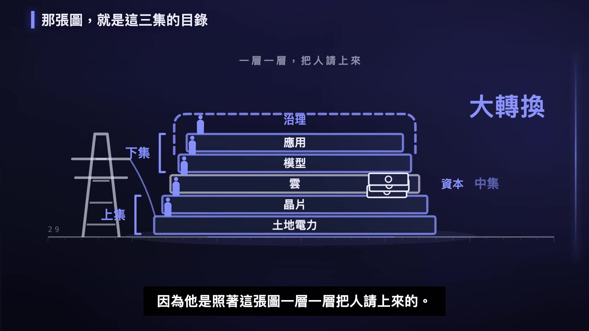

**逐字稿片段：** 接下來他做了一件我很欣賞的事 把兩個最常被亂用的英文詞用養狗講完了 第一個詞是強化學習 他說如果你養過寵物 或者有一個弟弟妹妹需要被教會不要進你房間 那你已經是一個成功的前沿模型訓練員 核心概念是你不告訴那個模型怎麼做 只告訴他你要他做到什麼 做到就可以獎勵 沒做到就不給 然後洗掉重來

**話題推測：** Mita用「養狗」的比喻來解釋「強化學習」的核心概念。

---

## 00:27:32

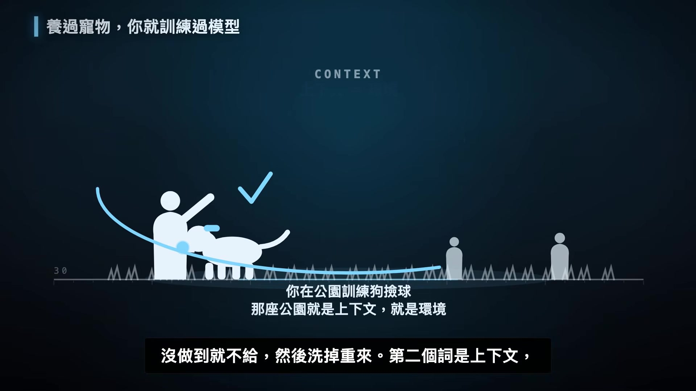

**逐字稿片段：** 第二個詞是上下文 英文叫context 那個詞常常被講得讓人聽不懂 他說你在公園訓練你的狗去撿球 那座公園就是上下文 就是環境 公園裡的人跑來跑去的小孩 草地下雨 這些環境因素都會影響 你能不能訓練起來

**話題推測：** Mita用「公園訓練狗撿球」的比喻來解釋「上下文」（Context）。

---

## 00:27:48

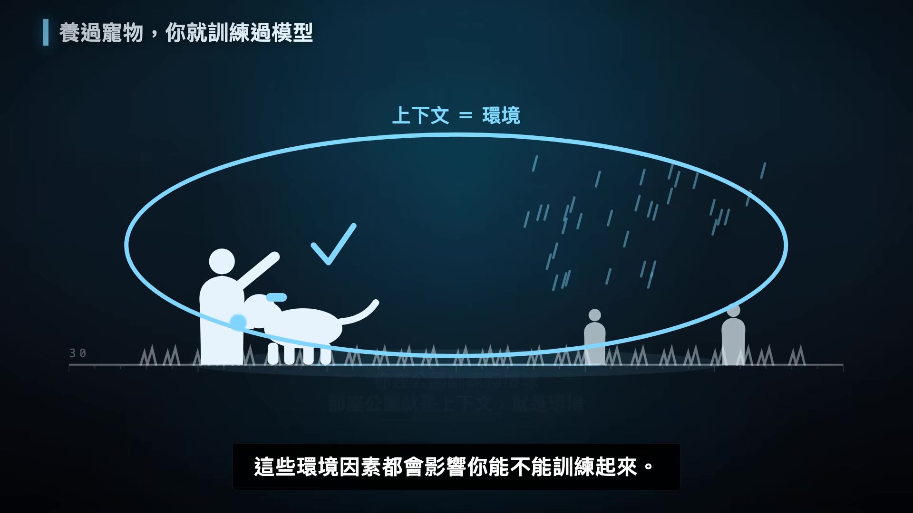

**逐字稿片段：** 然後他用這個比喻 推出三個問句 幾乎可以拿去看整個產業 哪裡的進展會最快 哪裡的環境可以被 可靠的測量和驗證 程式碼可以寫測試 材料可以做實驗 誰會贏 那些對某一段環境有賭佔 而且守得住的 存取權的團隊 誰會輸 那些被鎖在 關鍵環境外面的團隊

**話題推測：** 透過養狗比喻提出觀察整個產業的三個關鍵問題。

---

## 00:28:07

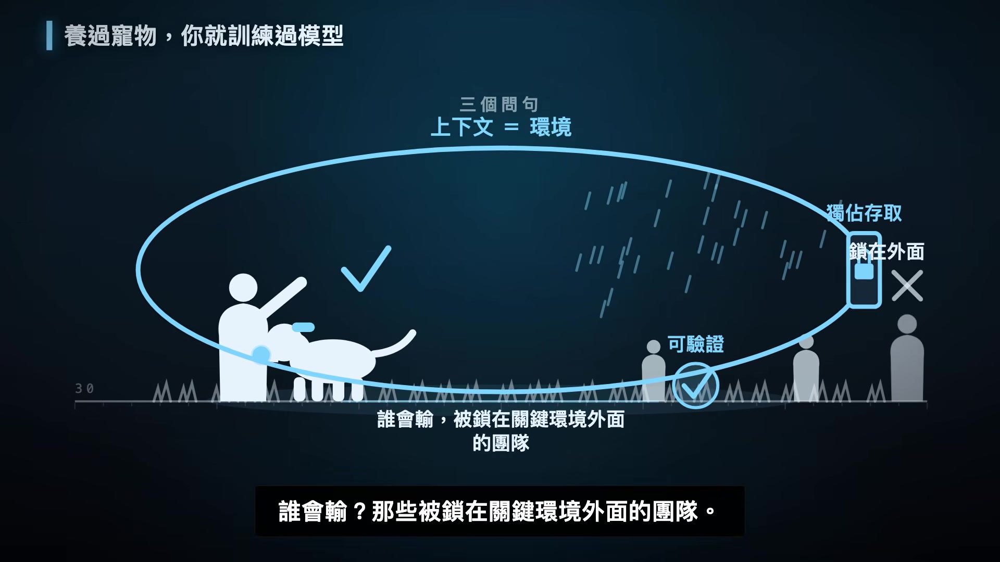

**逐字稿片段：** 最後這句你先記著 他馬上就給了一個活生生的例子 他講的是一個叫WindServe的程式編輯器 2025年春天 市場上傳出OpenAI要收購它

**話題推測：** 以WindServe程式編輯器為例，講述OpenAI收購傳聞的事件。

---

## 00:28:17

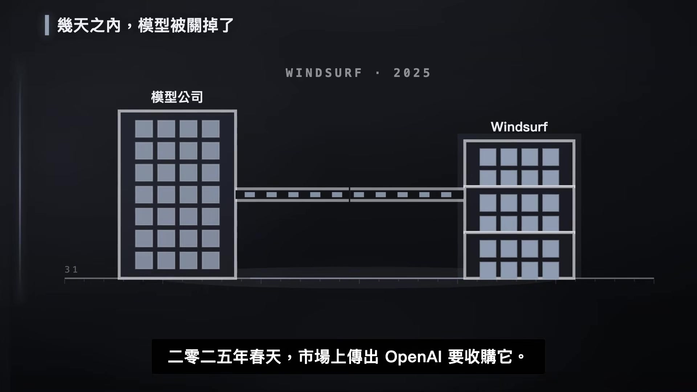

**逐字稿片段：** 四個星期之後 Anthropic幾乎切斷了WindServe 使用者對自家模型的存取 而且只給了不到五天的通知 Media說這種事在這一行不常發生 不會沒有預警 就把界面關掉 但他說這完全說得通 如果你的競爭對手需要用你的模型 需要那一段環境 而且可以從你怎麼幫助你想搶的客戶身上 把本事學走 那就是外洩 他說對業界人來說這件事非常清楚 我一點都不意外 但是很多人開始改變看法了

**話題推測：** 介紹Anthropic幾乎切斷WindServe使用者對其模型存取的事件。

---

## 00:28:42

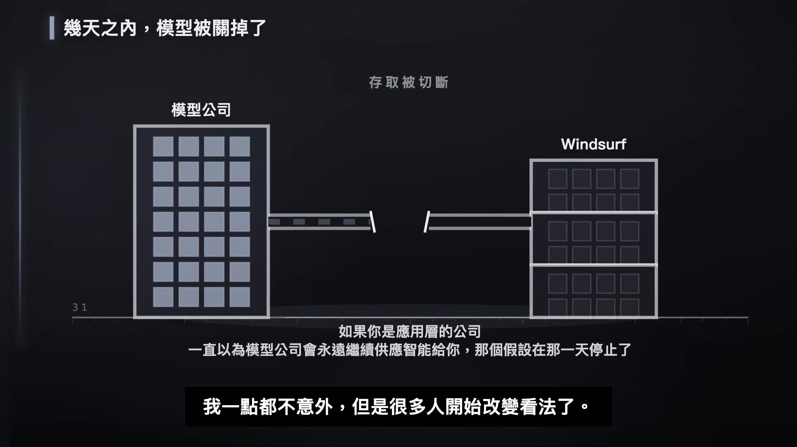

**逐字稿片段：** 然後他把這件事接回那張堆疊圖 如果你是應用層的公司 一直以為上面那層會永遠供應智能給你 那個假設在那一天停止了 這個故事後來還有結局 比他講到的那一半更完整 那筆收購最後破局 Google付了一筆授權金 並且帶走執行長 剩下的公司被另一家新創買下 一個編輯器 兩個月之內被分成三塊 他接著問全辦 有多少人聽過Cloud Act 組織稿上寫著0 他說那得把它列成指定閱讀 這條法律是美國在2018年通過的 業者必須交出他持有或者控制的資料 不論那份資料放在美國境內還是境外 也就是說資料放在哪一國的機房不是重點 重點是那家公司受不受美國管轄 我要講精確一點 因為他在臺上的說法有點過頭 這條法律並沒有新增監控權限 要拿到內容還是要有相當理由的搜索票 那是針對特定賬戶的形式程序 不是隨便撈 不過有一點反而讓他的論點更成立 可以抗辯的機制要看對方是不是簽了協議的國家 而美國目前只跟英國和澳洲簽 歐盟還在談 所以他說這就是為什麼歐洲會長出自己的模型公司 城市碼那種環境不敏感 開發者不介意送到某個雲端 可是國家的紀錄 國防這種環境就得鎖在自己的機房裡 那你就需要一個可以在自己機器上跑的開放權重模型 臺灣這幾年也在炒 資料能不能放境外的雲這條線 你會覺得很熟 然後他講到了整支影片的那條主線 他說有一派人認為 只要環境對 算力夠 代理人怎麼都學得會 他不會材料科學 就叫他自己蓋一個環境去練 他說他站在另一邊 他的原話是 目前並不清楚強化學習 有在他練過的任務之外類推出去 他看到的是 生活是雜亂的 進展最快的永遠是容易驗證的領域 在城市這種可以跑測試的地方 你會看到一種很窄的超級智能 可是世界上有一大堆不容易驗證的領域 他舉的例子是美感美愛 好的美感 可驗證的判準是什麼 沒有人答得出來 他還講了一件糗事 三個星期前 他把自己寫的一篇宣言傳給一位朋友看 對方30秒之後回他 你這是用Cloud寫的吧 他說沒有 對方說我不信 他承認自己是先寫大綱 再叫模型展開 從那之後 他們公司有一條內歸 不互相傳AI生成的文

**話題推測：** 將WindServe事件與科技堆疊圖連結，強調應用層公司對上層智能供應的假設不再成立。

---

## 00:30:43

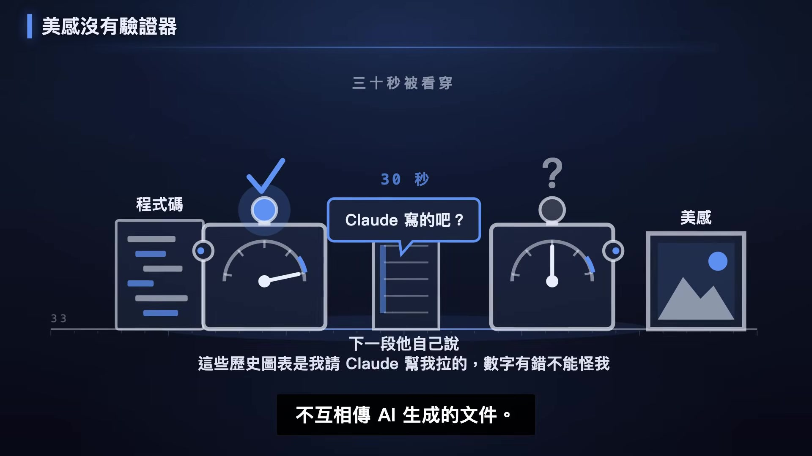

**逐字稿片段：** 而下一段 他放出一整組歷史圖表時 自己補了一句 這些圖表是我請Cloud幫我拉的 數字有錯不能怪我 這一堂最後的主張 跟很多人的直覺相反 他說過去四年 我數不清有多少人跟我說 你為什麼把這麼多時間 花在算力上 那是商品 給公司一點錢 自己去雲端租就好 然後他說不太對

**話題推測：** 展示由Cloud生成的歷史圖表。

---

## 00:31:02

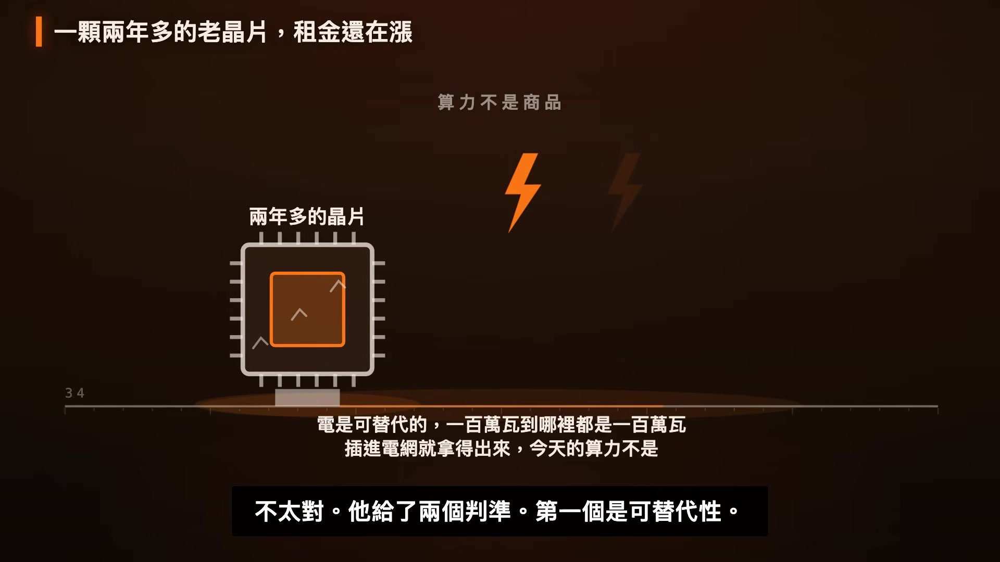

**逐字稿片段：** 他給了兩個判準 第一個是可替代性 電是可替代的 100萬瓦到哪裡都是100萬瓦 可是今天的算力不是 連同一家廠商不同世代的晶片都不能互換 城市在這一代跑得好 半一代要重調 第二個是可預測性 我們對用電已經有幾十年 穩定的預測算力沒有 研究團隊很難推理自己下個月要多少 訓練是尖峰式的 現在小規模玩演算法 有效才衝上去跑大的 推論又是走起性的 白天很多人用 晚上沒人用

**話題推測：** 從「可替代性」和「可預測性」兩方面解釋算力不是商品的理由。

---

## 00:31:28

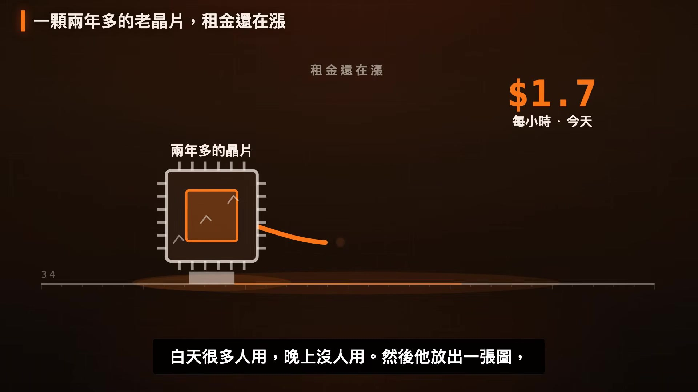

**逐字稿片段：** 拿他放出一張圖 那是一款兩年多前的晶片租金曲線 2025年10月的低點 大約一小時1.7美元 今天大約2.5美元 一個兩年多的老東西 租金不但沒掉還在漲 他那天早上還收到一位 剛募到大錢的創辦人訊息 說我們算力短缺 急需晶片 他回 要幾張 什麼時候 對方回 現在就要 價格不是問題

**話題推測：** 展示一款兩年多前晶片的租金曲線圖，顯示租金不跌反漲。

---

## 00:31:49

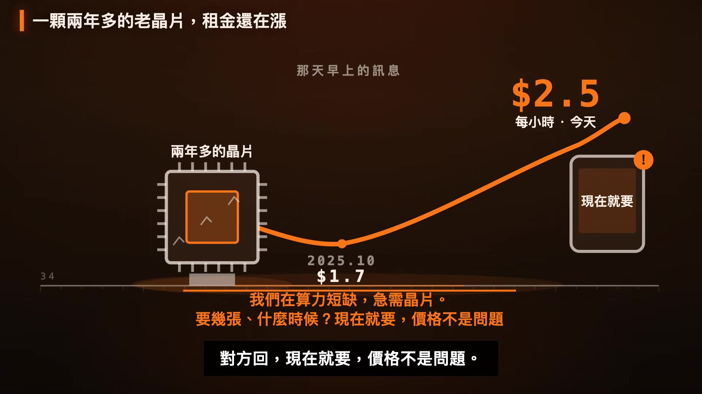

**逐字稿片段：** 那怎麼辦 Mina的答案不漂亮 但很具體 他說歷史告訴我們 要把一種被少數人窩著的稀缺資源 變成大家都拿得到的 只需要兩樣 一樣是標準 交流電和直流電是標準 網絡的傳輸協定也是 都是我們反覆聚在一起達成的協議 同意一套格式 不管在哪裡大家都能用 另一樣是機構 因為到某個規模的人一定會不一致 總得有人去協調 把大家對齊到標準 他最後那句最重 標準不會自己來 他需要機構去執行 把權力從靠囤積得力的人手上 重新分配出去 改成優先考慮公共利益 這句話回答的是上級留下來的空缺 上級Sam Altman說 很少被討論的一件事是 我們具體要怎麼分配算力 然後他承認沒有答案 這一堂在他走進教室之前 就給了答案

**話題推測：** Mita提出將稀缺算力轉為普及資源需要「標準」和「機構」。

---

## 00:32:34

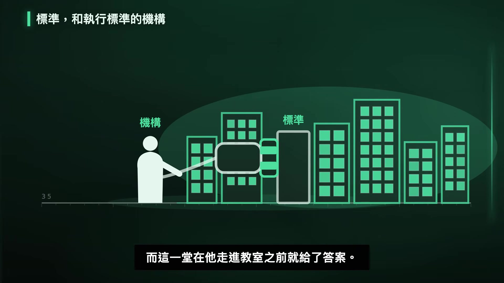

**逐字稿片段：** Meta最後給學生留了兩個問題 要怎麼讓運算 完成一次和平的轉換 還有你在這裡面是什麼角色 他還說有太多領域只有你懂 也只有你驗證的了 因為那是你的執念 你的品位 你的文化 那才是你最有價值的東西 五個人站在五個不同的位置上 最後給的是同一個答案 模型已經夠好了 真正卡住的是誰來說這個 好不好 而順著這句話往下走 你會走到一個很簡單也很不容易的結論 你能驗證什麼你就擁有什麼

**話題推測：** Mita向學生提出兩個問題，鼓勵他們思考自己在運算轉型中的角色及個人價值。

---

## 00:33:00

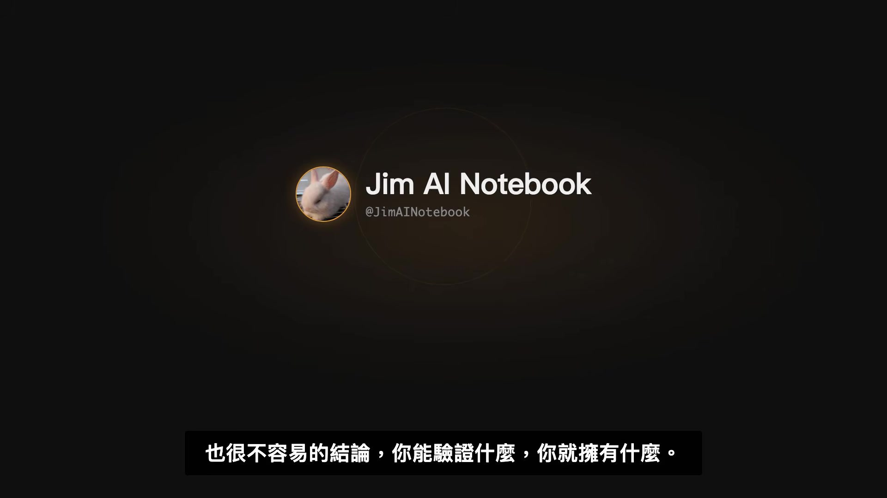

**逐字稿片段：** 上集問的是 權力集中在誰手上 中集問的是 那我還剩多少籌碼 這一集的答案是 那根珠來的槓桿上屬於你的 是你判斷得出好壞的那一段 而那些沒有驗證器的地方 美感 品味 愛 正好也是暫時還沒有人拿得走的地方 最後問你一個問題 在你自己的工作裡 有哪一件事是你看得出好壞 而模型還看不出來的 留言告訴我 這是正門課的最後一集 上集 中集 下集 我都放在同一個播放清單裡 喜歡的話訂閱 AI Notebook 來起通知 我們下次見

**話題推測：** 總結三集影片，指出判斷好壞的能力是個人在槓桿上最有價值的資產。

---
