# jimainotebook_eNtWSchE05w — 關鍵畫面索引

- 來源逐字稿：[jimainotebook_eNtWSchE05w_FIN.srt](jimainotebook_eNtWSchE05w_FIN.srt)
- 影片：https://www.youtube.com/watch?v=eNtWSchE05w
- 截圖數：54

## 00:00:12

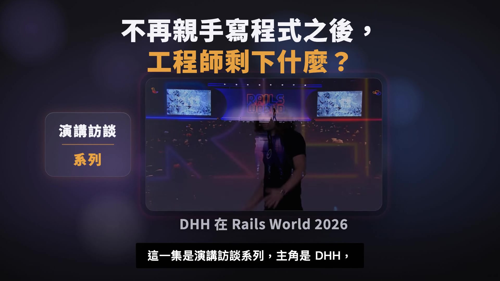

**逐字稿片段：** 主角是DHH, 本名David Heinemeyer Hansen, 他寫出了Ruby on Rails, 一套很多知名網站都在用的開發工具, 也是軟體公司SantiSignals的合夥人跟技術長。

**話題推測：** 介紹演講主角DHH的背景與成就

---

## 00:00:22

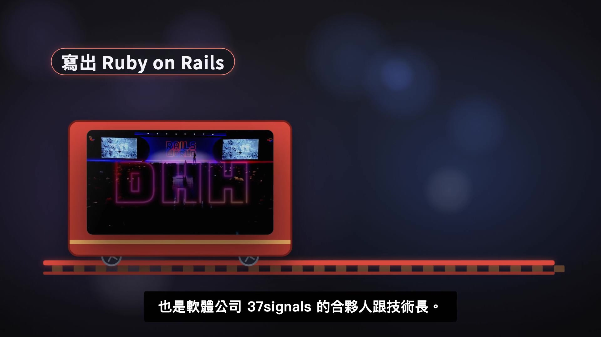

**逐字稿片段：** 2026年9月 美國德州的奧斯汀 他在Real World的開幕演講上 說了一句讓臺下工程師很難不在意的話 他說他的公司已經pencils down 不再親手寫程式了

**話題推測：** 交代DHH演講的時間地點與主題：停止手寫程式

---

## 00:00:35

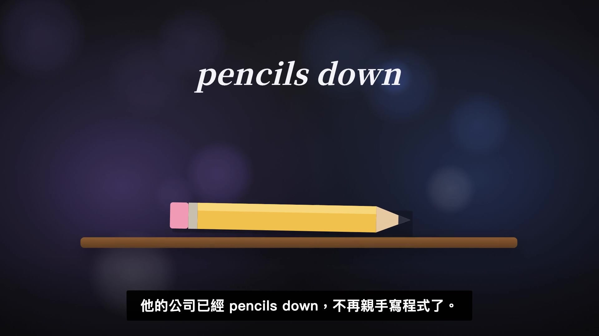

**逐字稿片段：** 這一集只問一個問題 當寫程式這件事交給AI 會寫程式的人 還剩下什麼 我先把他答案放在前面 他用畫家來比喻 相機出現以後畫家沒有消失 可是工作換了一種 他覺得程式設計師正站在同一個路口 這個方向我覺得有道理 可是他說的速度跟範圍要打一點折

**話題推測：** 影片主軸問題：程式交給AI後，程式設計師還剩下什麼？

---

## 00:00:51

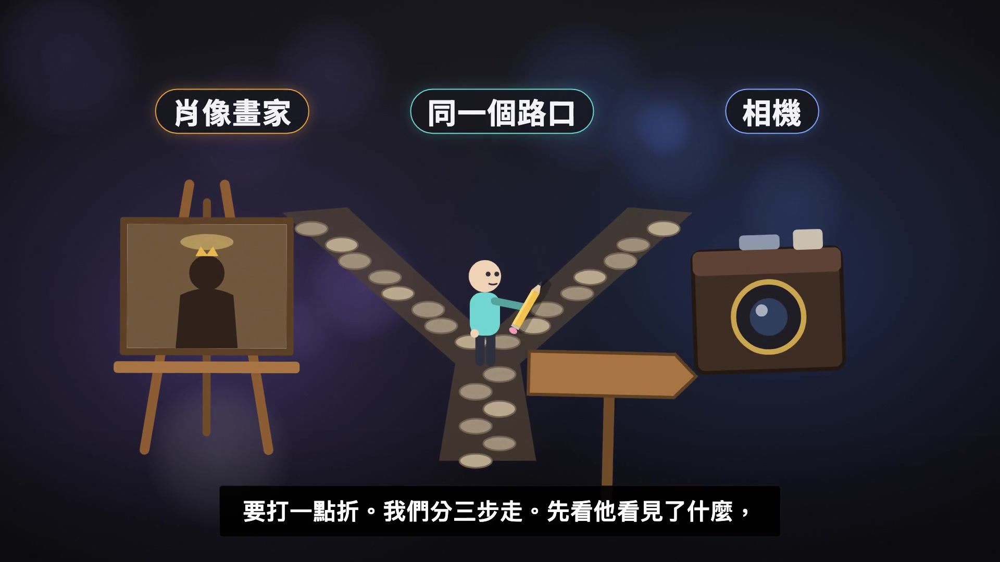

**逐字稿片段：** 我們分三步走 先看他看見了什麼 再看他的公司實際怎麼做 最後把這場演講放回現實 核對哪些是實情 哪些是臺上的樂觀 先從一個在臺上 手舞足蹈的人開始 ADH是丹麥人 David Heinemeyer Hansen 這個名字太長 大家都叫他DHH 他在2004年寫出Ruby on Rails 後來跟合夥人一起經營

**話題推測：** 影片結構預覽：分三部分探討DHH的觀點

---

## 00:01:10

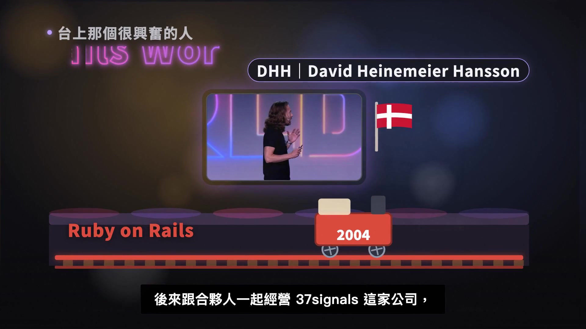

**逐字稿片段：** 三子Signal是家公司 做專案管理軟體Basecamp 還有電子郵件服務HEY 在工程師的圈子裡 他的形象很鮮明 講話直接 立場強烈 常常跟主流唱反調 Rails World 或者是RAILS的社群一年一度的大會 2026年辦在奧斯汀 9月23號開幕 DHH上臺 先替自己打了一劑預防針 他說看到一個人在臺上這麼興奮 你的第一個反應可能是想幫他做個診斷 網路上有個說法叫AI psychosis 意思是被AI沖昏了頭 好像中了血 他說他不喜歡這個詞 想換一個

**話題推測：** 介紹DHH所經營的軟體公司37signals及其產品Basecamp和HEY

---

## 00:01:40

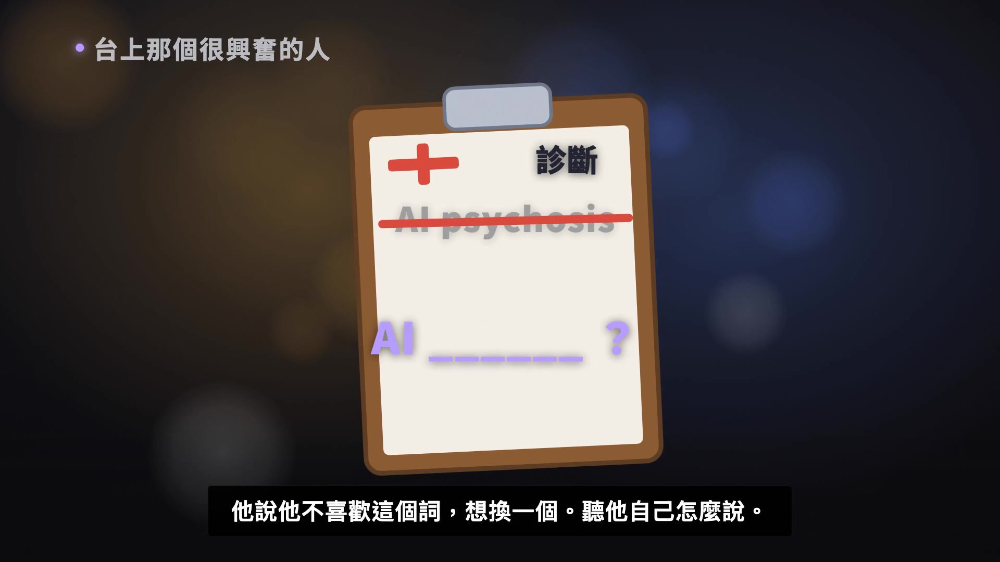

**逐字稿片段：** 聽他自己怎麼說 AI psychosis I prefer a different term I have AI delirium AI euphoria 因為這是我們讓電腦做的最令人興奮的一件事 在我跟它們合作、玩耍、互動的那一段時間中

**話題推測：** DHH引述並評論「AI psychosis」、「AI delirium」、「AI euphoria」等詞彙

---

## 00:02:03

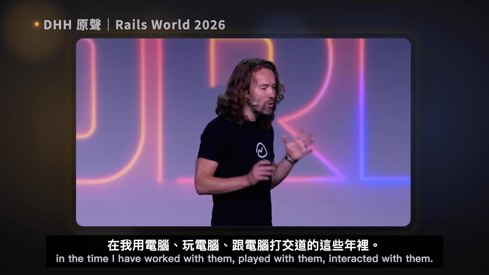

**逐字稿片段：** 他的興奮要從 Rails 講起 Ruby on Rails 是一個網頁框架 框架的意思是 一套事先幫你打好的骨架 你只要專心做自己產品的那一部分

**話題推測：** 解釋Ruby on Rails的網頁框架概念與作用

---

## 00:02:12

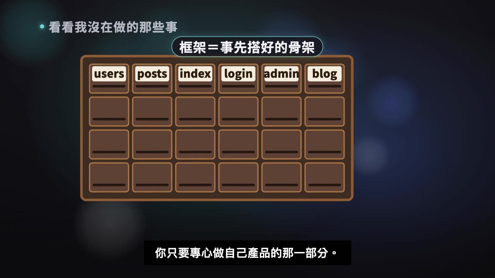

**逐字稿片段：** Rails 最有名的一條原則 叫 Convention over Configuration 中文叫約定優於設定 他的意思是 很多事情不用你一條一條寫清楚 只要你照大家約好的方式取名字 系統就自動知道東西放在哪裡 比方說你做了一個叫Blog的功能 網址、程式、頁面就自動對在一起 不用另外寫設定檔

**話題推測：** 介紹Rails核心原則：Convention over Configuration（約定優於設定）

---

## 00:02:30

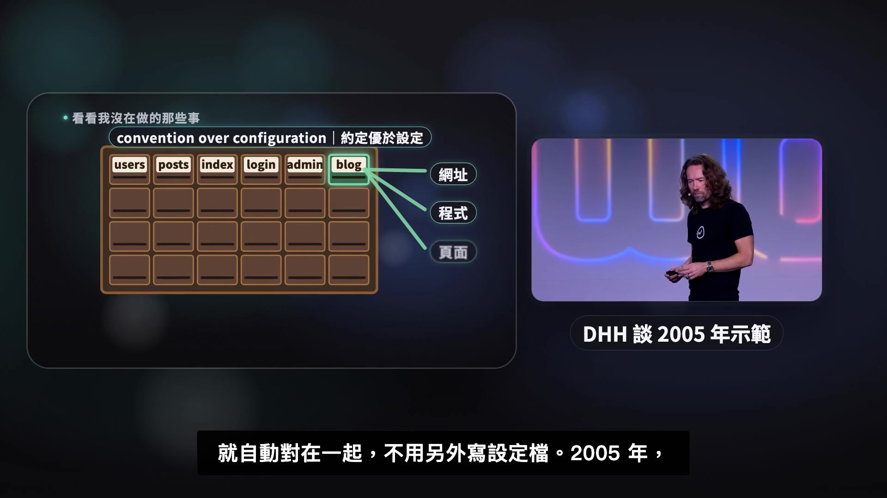

**逐字稿片段：** 2005年DHH在一場研討會上示範這件事 一邊打字一邊說 看看我沒在做的那些事 後來GitHub、Shopify這些很大的網站 都是用Rails做起來的 所以這20年DHH其實一直在追同一件事 讓一個人少寫一點程式 也能做出完整的產品 這一次他在臺上把那段2005年的影片又放了一次 接著說了這段話 那個時刻到底是什麼 DHH沒有直接講AI

**話題推測：** 提及GitHub和Shopify等知名網站皆採用Rails，並展示DHH 2005年的示範影片

---

## 00:03:15

**逐字稿片段：** 他先帶大家回到200多年前 他用的比喻是肖像畫 在18世紀 你想留下自己的樣子 就要請一位畫家 坐在他面前好幾個小時 再等他畫上好幾個月 畫出來很美 可是很貴 大多是貴族跟王室才請得起

**話題推測：** DHH以肖像畫家的例子比喻程式設計的轉變

---

## 00:03:29

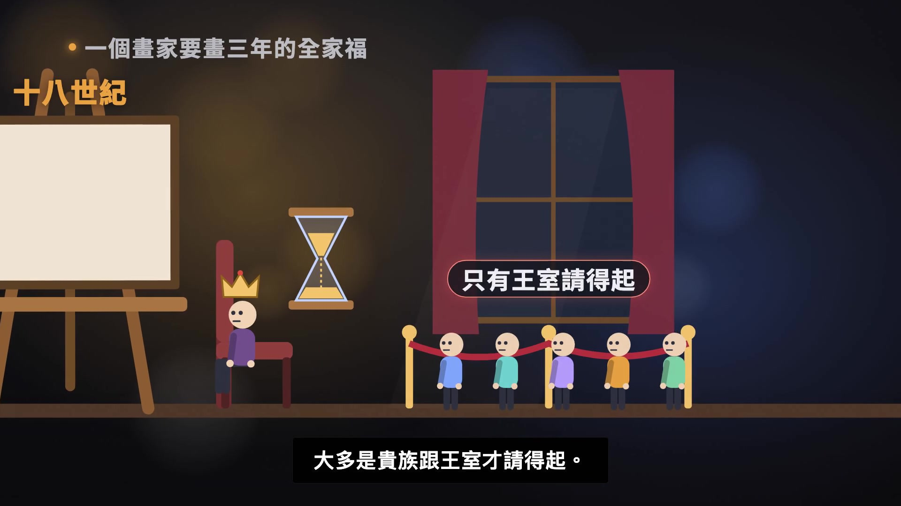

**逐字稿片段：** 他放了一張丹麥王室的全家福 畫的是丹麥國王克里斯蒂安九世一家人 1886年完成 畫家叫Loris Tuckson DHH說光這一張就畫了三年 然後相機來了

**話題推測：** 展示丹麥王室的全家福肖像畫，並介紹畫家Loris Tuckson

---

## 00:03:41

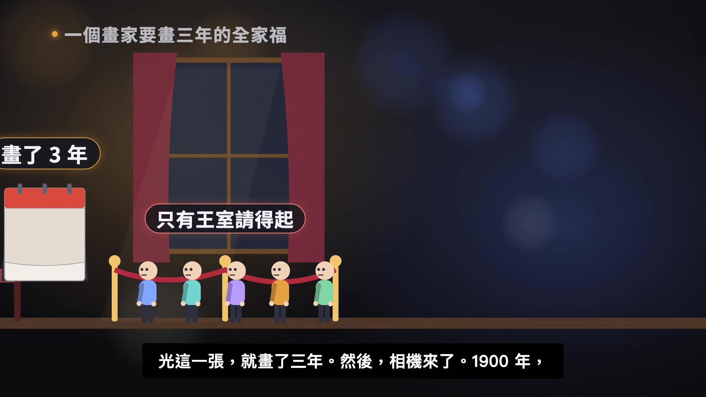

**逐字稿片段：** 1900年 Kodak推出一臺叫Brownie的相機 賣一美元 一般家庭也買得起 留下一個人樣子的成本 一下子掉到很低 講到這裡 DHH指責那王室全家福 說了一件臺下沒有人想到的事

**話題推測：** 介紹柯達Brownie相機的出現，大幅降低影像留存成本

---

## 00:04:08

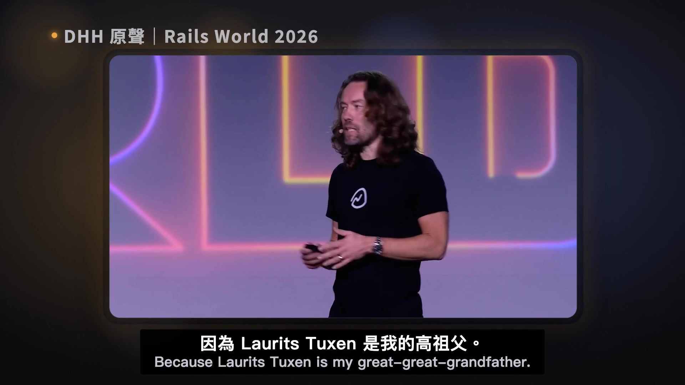

**逐字稿片段：** 畫這張畫的人是他的高祖父 所以這個比喻對他來說是家族的故事 DHH說 Brownie出來以後 Tuxen跟同一個年代的很多畫家都發現 把現實畫得跟真的一模一樣 已經不再是賺得到錢的本事 他們需要另一種本事

**話題推測：** DHH揭露畫肖像的高祖父是自己的家族故事，強化比喻的個人連結

---

## 00:04:25

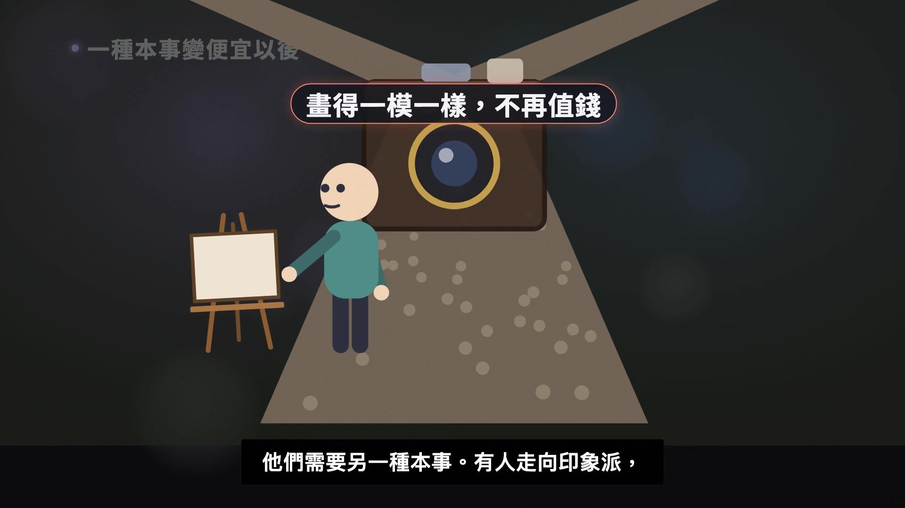

**逐字稿片段：** 有人走向印象派 畫光線跟感覺 有人走向印象派 像畢卡索 走向立體派 他說技術把舊路堵住 反而逼出了一波新的創作

**話題推測：** 藝術家在相機出現後走向印象派、立體派等新方向

---

## 00:04:34

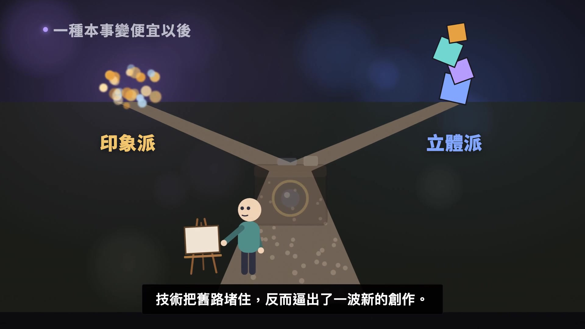

**逐字稿片段：** 他也放了一張Tuxen晚年的照片 畫了一輩子肖像的人 自己也做到了相機前面 這個比喻有一條界線要先講清楚 DHH剛的 是轉型成功的那一群畫家 當年靠畫肖像過日子的人 不見得每一個都找到了新路 這一點 我們第三部分會回來看 不過比喻的重點很清楚 一種本事變便宜了 有這種本事的人 價值會移到別的地方

**話題推測：** 展示Loris Tuckson晚年照片，說明畫家也開始被相機拍攝

---

## 00:04:54

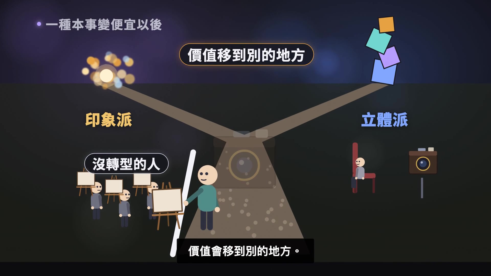

**逐字稿片段：** 那城市設計師的Brownie是什麼 DHH給了一個很精確的日期

**話題推測：** 將畫家與相機的比喻引導回程式設計師面臨的「Brownie時刻」

---

## 00:04:58

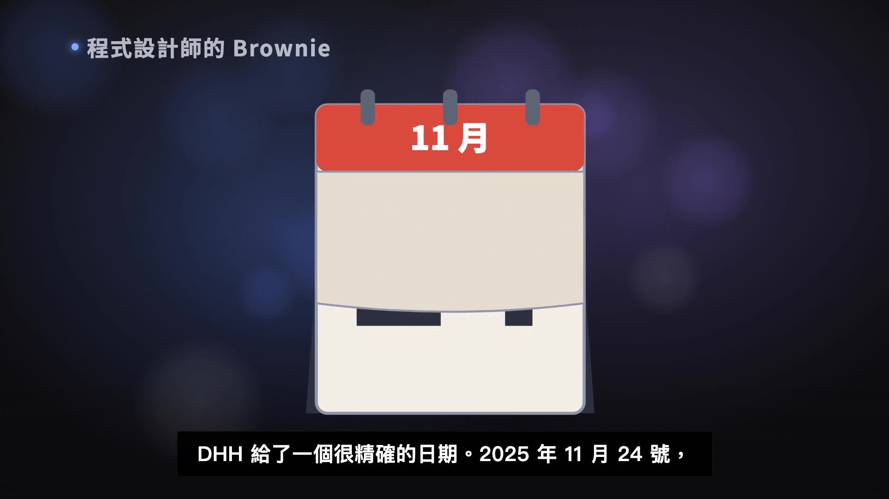

**逐字稿片段：** 2025年11月24號 Anthropic推出了Cloud Opus 4.5 Cloud是一個AI模型 Opus是它最強的那個等級

**話題推測：** DHH指出程式設計師的「Brownie時刻」是2025年11月24日Anthropic推出Cloud Opus 4.5

---

## 00:05:06

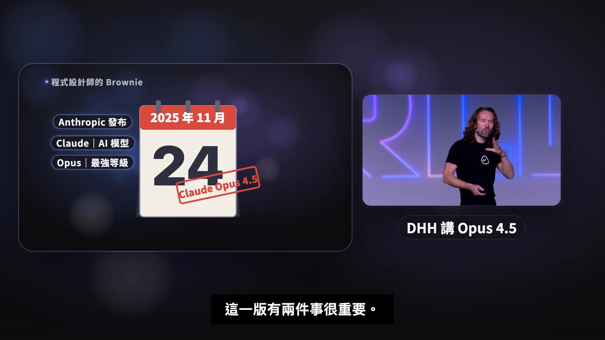

**逐字稿片段：** 這基本有兩件事很重要 它寫程式的能力明顯變好 價錢也降到上一代Opus的三分之一 DHH還用了一個詞

**話題推測：** 說明Cloud Opus 4.5的程式編寫能力提升與價格下降

---

## 00:05:13

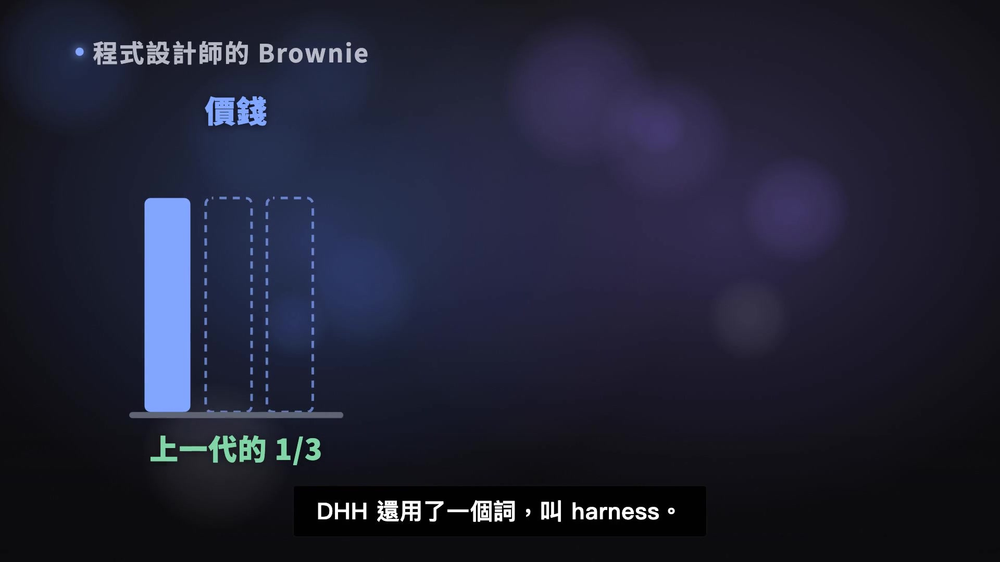

**逐字稿片段：** 叫Harness Harness原本是馬距的意思 在AI這裡 指的是包在模型外面的那一套工具 讓模型可以自己讀取檔案 執行指令 修改程式 像Cloud Code就是一種Harness 模型變強又變便宜 再加上一套順手的工具 很多工程師第一次覺得 旁邊做了一個真的能一起寫程式的夥伴 DHH說 那一天對他來說是一條分界線 之前是一個世界之後是另一個 他在臺上是這樣說的 接下來的故事DHH講得很老實

**話題推測：** 解釋「Harness」在AI領域中的含義：包裹AI模型的工具套件

---

## 00:06:03

**逐字稿片段：** Opus 4.5之後 大家興奮了好幾個月 開放權重的模型也追了上來 開放權重的意思是 模型本身可以下載 放在自己的電腦上執行 可是從今年2月到5月

**話題推測：** 提到開放權重AI模型的興起，讓模型可自行下載執行

---

## 00:06:13

**逐字稿片段：** 他說進入了一段幻滅的低谷 幻滅的低谷 是科技顧問公司Gartner用的說法 一項新技術被捧上天以後 常常會跌進一段 大家覺得被騙了的時期 那幾個月新模型一直推出 用起來卻好像沒有更好 有人開始說 AI的進步走到頭了 DHH說 這段低谷沒有像攝影那樣 拖上幾十年 到了六月就結束了

**話題推測：** 描述AI發展經歷「幻滅的低谷」，並引用Gartner的說法

---

## 00:06:33

**逐字稿片段：** 新一代的模型出來以後 它的用法整個變了 以前它是叫agent 做一件小事 agent的中文叫代理程式 是為自己一步一步 把工作做完的AI 現在它可以把一整個問題 甚至一個想法交出去 自己不碰時做的細節 回來看到的 是已經解決好的結果 第一部分先整理一下

**話題推測：** 新一代AI模型改變用法，從Agent的小任務轉變為處理複雜想法

---

## 00:06:49

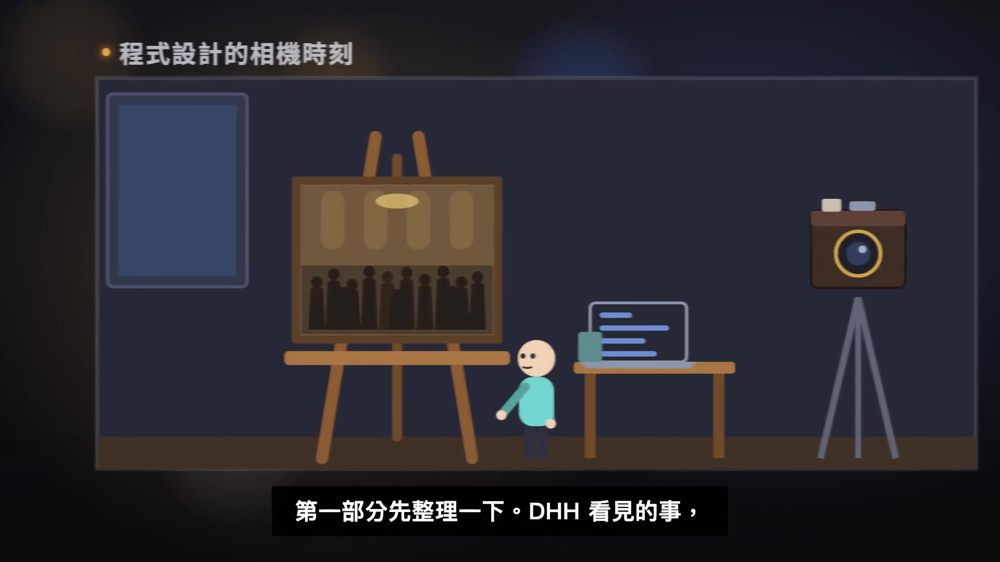

**逐字稿片段：** DHH看見的是 用他自己的比喻來說 就是程式設計的相機時刻 肖像畫沒有消失 可是把現實化的一模一樣 不再是賺錢的本事 他覺得寫程式也走到了這一步 一行一行親手打出程式 正在變得跟 跟請畫家畫肖像一樣 很好看 但太慢也太貴 而他的整個職業生涯 從RAILS開始 就是在追求少寫一點程式 所以AI一來他不是被迫接受 而是覺得終於等到了 那接下來的問題就很實際

**話題推測：** 第一部分總結：程式設計的「相機時刻」已來臨

---

## 00:07:14

**逐字稿片段：** 一家真的在賣軟體 也要對客戶負責的公司 把鉛筆放下以後 每天的工作到底變成什麼樣子 答案在演講第20分鐘左右 DHH說 幾個禮拜前

**話題推測：** 過渡至第二部分：探討37signals公司在放下鉛筆後實際的工作方式

---

## 00:07:25

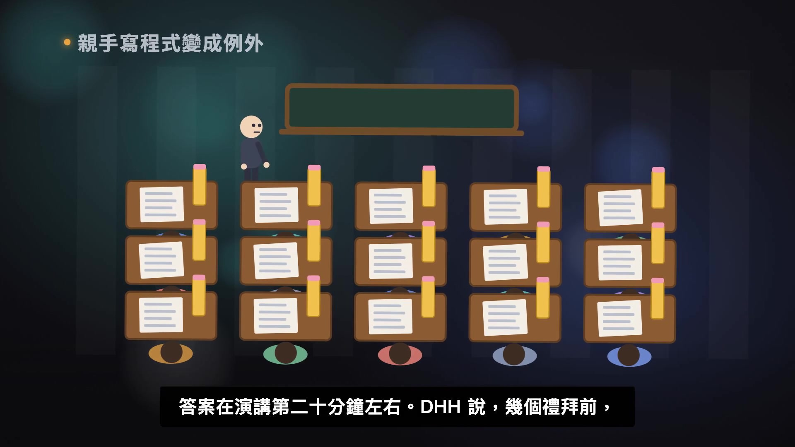

**逐字稿片段：** 37signals 做了一個決定 我們不再親手寫程式了 他用的詞是pencils down

**話題推測：** 37signals做出「pencils down」的決定，不再親手寫程式

---

## 00:07:30

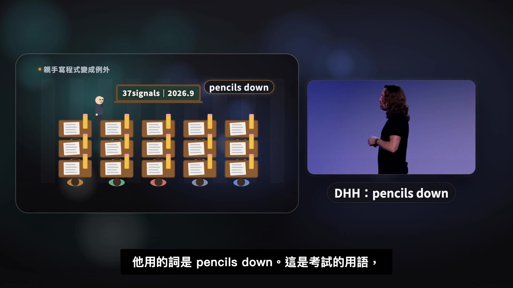

**逐字稿片段：** 這是考試的用語 時間到了 尖靠老師和Pencils Down說人把筆放下 在30signals 親手寫程式從日常工作變成一種例外狀態 他還打了一個比方說

**話題推測：** 解釋「pencils down」的來源與含義，代表停止手寫程式成為常態

---

## 00:07:40

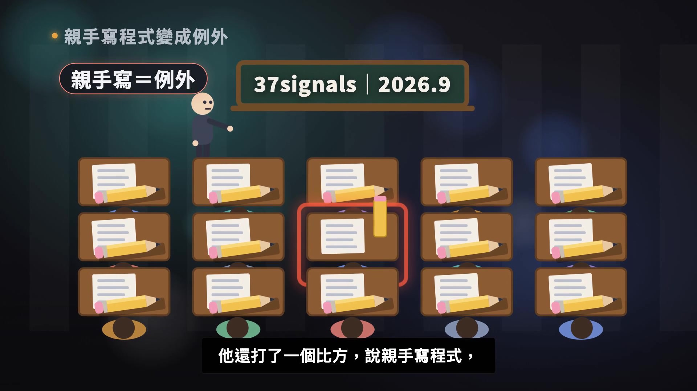

**逐字稿片段：** 親手寫程式 就像在Sentry上看到一個錯誤 Sentry是工程師用來收錯誤通知的工具 系統哪裡壞了 他就會跳出來提醒你 意思是 如果有人用拿起鉛筆自己寫 就代表哪裡出了問題 為什麼Agent做不出我們要的東西 接下來這段 是整場演講裡我覺得最重要的一個想法 我覺得最重要的一個想法 It is like seeing a bug in sentry. Something here went wrong. 為什麼工程師不可以製造我們想要的東西 好,可能再做一段時間 But then we fix the machine. We fix the factory. We get things going again.

**話題推測：** 以Sentry錯誤通知比喻手寫程式，說明手寫代表有問題

---

## 00:08:23

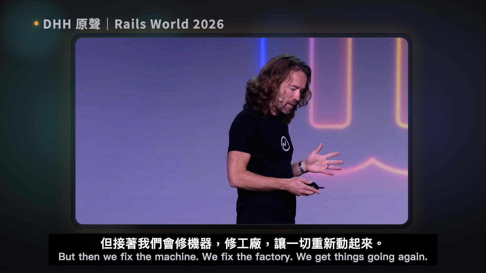

**逐字稿片段：** 修機器、修工廠 這是DHH自己的比喻 以前的工程師 像工廠裡親手做零件的師傅 每一個零件都經過他的手 現在零件交給機器做 工程師的工作 變成照顧這條生產線 機器做壞了 他不是自己去補那個零件 而是去查清楚機器為什麼會做壞 把它調整好 讓之後的零件都對 這個轉變

**話題推測：** DHH以「修機器、修工廠」比喻工程師從手做零件到照顧生產線的角色轉變

---

## 00:08:44

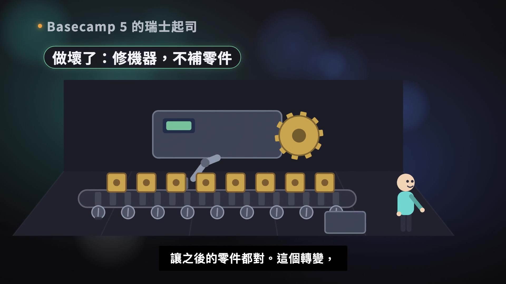

**逐字稿片段：** 37GNOS 其實失敗過一次 今年春天他們在港北Camp 5 讓一群設計師直接用AI寫功能 送出二三十個PR PR是Pool Request 意思是我修改好了一段程式 請大家檢查以後合併進去 每一個PR單獨看都還可以 全部合在一起 整個程式的結構 卻像一塊瑞士起司 到處都是洞 他們當時的結論是 技術還沒準備好 DHH現在說 那個結論是錯的 再多等一下 新一代模型一出來 同樣的做法 大概就行得通 他在臺上請他 在美洲親手寫 大量城市的人舉手 他說 整個會場 大概只有五個人

**話題推測：** 37signals初期使用AI寫功能失敗，導致程式結構像瑞士起司

---

## 00:09:16

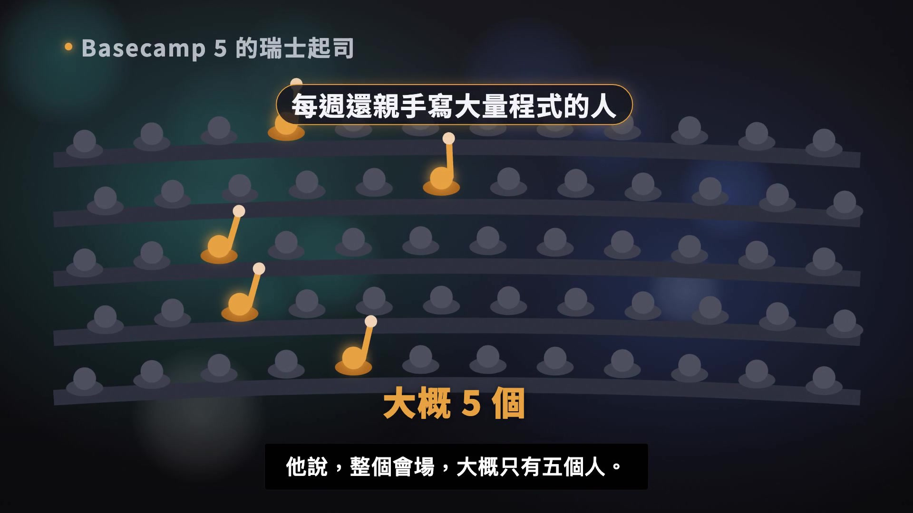

**逐字稿片段：** 工廠真正開工 是在HEY HEY是Signal Signals的 電子郵件服務 原本是一個 網頁應用城市 用瀏覽器打開就能用 DHH說 其實一直不想當網頁城市 他會做成網頁是因為 網頁最省人力

**話題推測：** 37signals將AI工廠模式應用於HEY電子郵件服務

---

## 00:09:31

**逐字稿片段：** 另一條路叫原生應用程式 就是替iPhone Android Windows Mac 這些平臺各寫一套專屬的版本 用起來更快更順 可是要很多人維護 以前一個小團隊 要同時照顧六套原生程式 幾乎沒有人做得到

**話題推測：** 介紹原生應用程式的優點與維護挑戰，對比網頁應用程式

---

## 00:09:44

**逐字稿片段：** 這一次他們一個禮拜前才開工 臺上已經在播六個平臺的示範畫面 後端也要換掉 後端是使用者看不到 在伺服器上處理郵件的那一半

**話題推測：** 37signals在短時間內用AI為HEY生成六個平臺的原生應用程式示範畫面

---

## 00:09:53

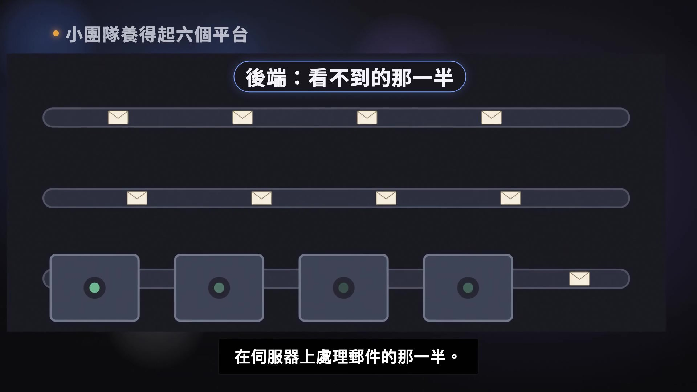

**逐字稿片段：** 他們打算用一種叫RUST的程式語言重寫 RUST執行的很快 很省資源 可是寫起來很繁瑣 DHH對他的感情很複雜 聽他自己說 就在這段之前他還說 Rust是40年來最醜的程式語言 叫人去讀它 簡直不人道 可是隻要不用看 他就愛它 這句話很好笑 背後卻是一個很大的轉變

**話題推測：** 37signals計畫用Rust程式語言重寫HEY的後端系統

---

## 00:10:39

**逐字稿片段：** 他把AI寫出來的Rust程式 當成一個黑盒子 黑盒子的意思是 你不管裡面怎麼運作 只看輸入跟輸出 對不對 他說 這跟歷史上 每一個請工程師 寫軟體的老闆一樣 老闆也不讀程式碼 他驗收的是結果 差別只是 現在被請來的是AI

**話題推測：** DHH將AI生成的Rust程式視為「黑盒子」，強調只看輸入與輸出結果

---

## 00:10:55

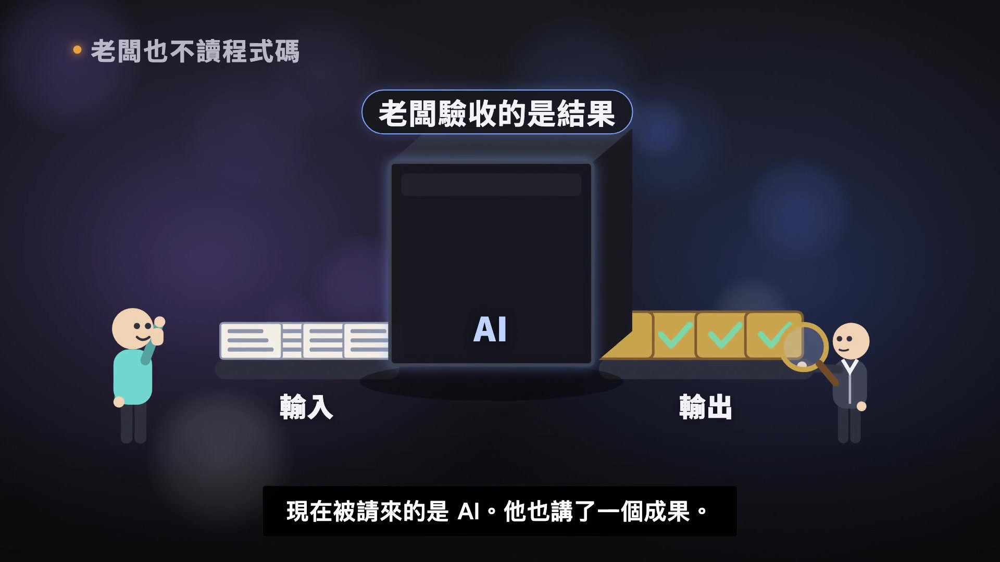

**逐字稿片段：** 他也講了一個成果 照他們初估 新的HEI後端 用的運算資源少了一大截 尖峰時段的流量 甚至可能用一臺Raspberry Pi撐住 Raspberry Pi是一臺信用卡大小的小電腦 這是他們自己的估算 新系統還沒上線 我們先記下來 那他是用什麼告訴AI要做什麼 他的答案 連他自己都覺得意外

**話題推測：** 展示HEY新後端節省運算資源的成果，甚至可能用Raspberry Pi支撐尖峰流量

---

## 00:11:33

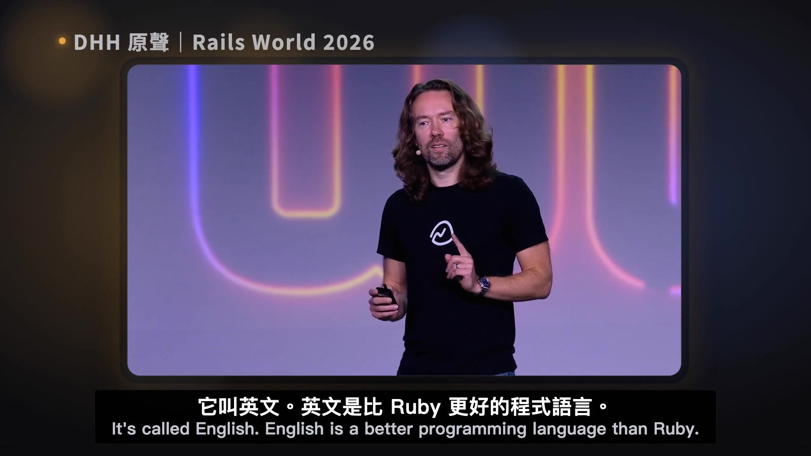

**逐字稿片段：** 英文是比Ruby更好的設定語言 用英文寫程式 意思是用人化描述你要什麼 讓AI去寫 換成我們用中文也可以

**話題推測：** DHH發現英文比Ruby更適合作為AI的設定語言，實現「用英文寫程式」

---

## 00:11:42

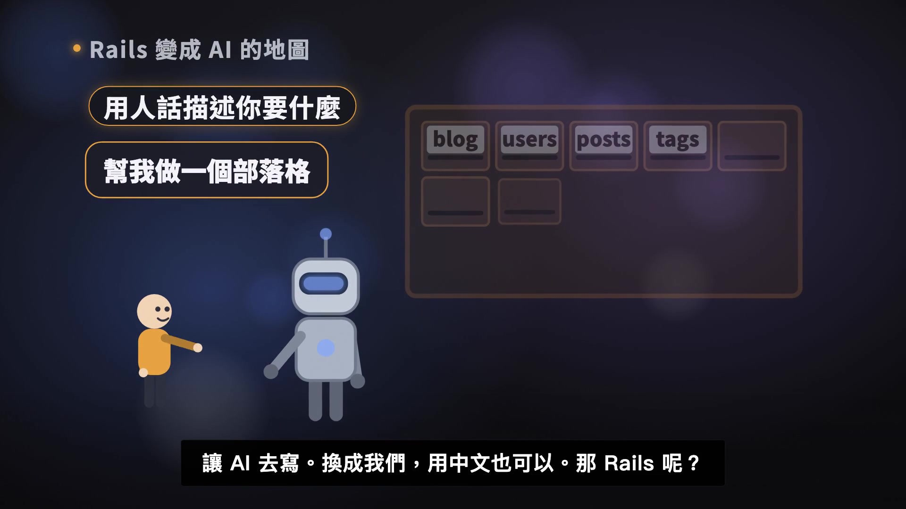

**逐字稿片段：** 那個Rails呢 如果大家都用人化寫程式 Rails還有用嗎 DHH的回答是 Rails那條約定優於設定的老原則 剛好最適合這個時代 原因跟Token有關

**話題推測：** 探討Rails在AI時代的價值，其「約定優於設定」原則有利於AI節省Token

---

## 00:11:51

**逐字稿片段：** Token是AI讀寫文字的單位 你可以先把它想成字數 AI讀得越多寫得越多 就越慢也越貴 一個照約定走的專案 AI不用讀一大堆設定檔 就知道東西放在哪裡 少讀少寫 就省Token

**話題推測：** 解釋AI讀寫文字的單位「Token」

---

## 00:12:04

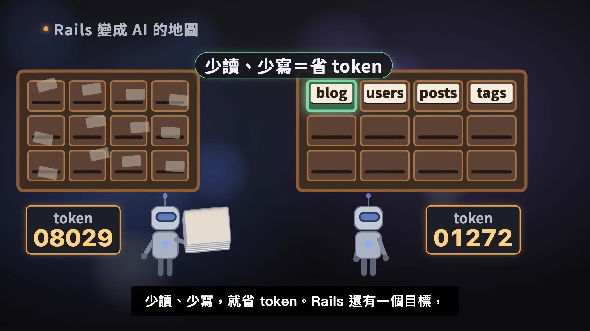

**逐字稿片段：** RAILS還有一個目標叫一個人的框架 讓一個開發者就能做完一整個產品 這也正是Agent想幫上忙的地方

**話題推測：** 提及Rails「一個人的框架」目標，與Agent的目標不謀而合

---

## 00:12:10

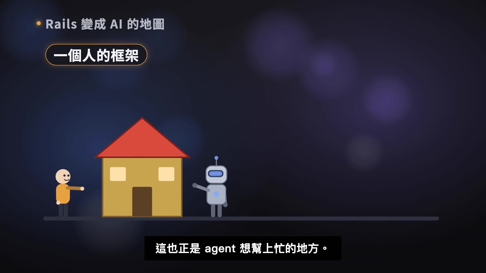

**逐字稿片段：** RAILS基金會還請Evil Martians 加顧問公司做了一套EVAIL EVAIL是給AI的考卷 這份考卷看Agent用RAILS 做功能做的好不好 DHH說第一版考卷很快就被考到9成5 只要換一份更難的

**話題推測：** Rails基金會推出EVAIL作為AI模型的考卷，評估其在Rails上的表現

---

## 00:12:23

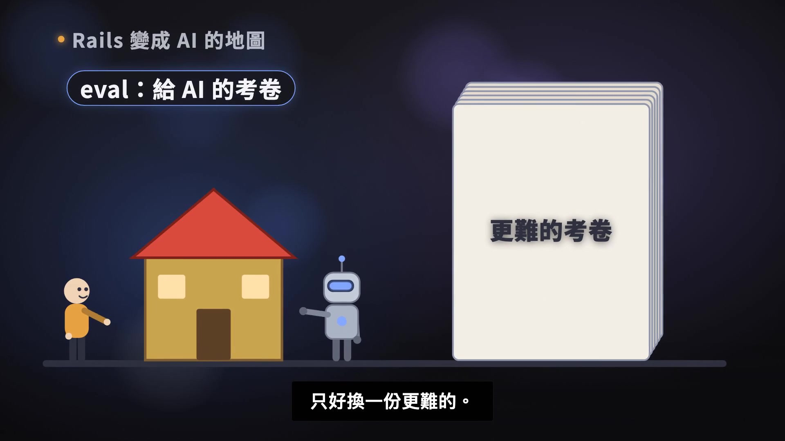

**逐字稿片段：** 說到這裡DHH拿出了這場演講最大的數字 過去21年 他平均一年寫大約3萬行 正式上線的Ruby程式 今年8月一個月 他寫了15萬行 大約是他長期平均的60倍 他自己馬上補了一句 這裡面很多是很囉嗦的Rust 而且是他沒看過的程式 所以行數不能直接拿來比 大家看的是那個數量級 另一個改變比較私人

**話題推測：** DHH公布程式碼產量驚人數字：8月一個月寫了15萬行程式，是長期平均60倍

---

## 00:12:45

**逐字稿片段：** 他放了一段自己以前的影片 影片裡他說 比起放棄寫程式 他寧願退休 然後他說 他已經從職業程式設計師退休了 大概是今年3月左右 他不是說他不做軟體 他每天還在做 只是不在一行一行親手寫 對一個說過 寧願退休也不肯放下程式的人來說 這句話很重 可是他回頭看了25年 語氣裡沒有遺憾 I spent a quarter of a damn century chiseling code by hand and loving every moment of it What a wonderful experience and productive time in that era 如果故事停在這裡 它是一段很溫暖的退休感言 可是DHH接著把這件事 從他自己推到了所有人身上 他說

**話題推測：** DHH個人的轉變：從「寧願退休也不放棄寫程式」到宣布「從職業程式設計師退休」

---

## 00:13:30

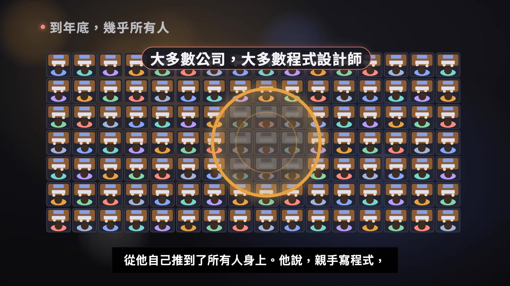

**逐字稿片段：** 親手寫程式 對大多數公司裡的 大多數城市設計師來說 已經不划算了 這是今天 到今年年底 會擴大到幾乎所有領域 幾乎所有人 這是整場演講 最強的一句主張 也是第三部分 要好好核對的一句 我們先聽他原本怎麼說 第二部分整理一下

**話題推測：** DHH強烈主張親手寫程式對大多數公司和程式設計師已不划算

---

## 00:14:10

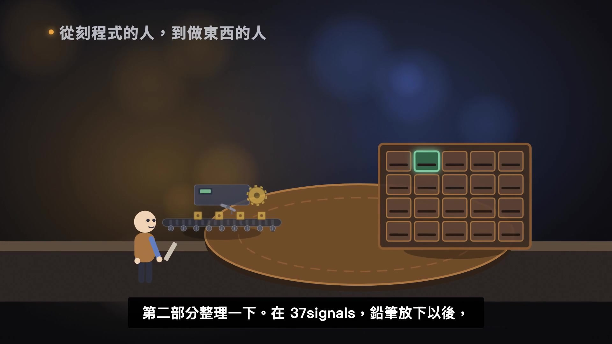

**逐字稿片段：** 在三次C-Signals 鉛筆放下以後 工程師的工作變成三件事 第一 用人畫把要做的東西說清楚 第二 照顧那座工廠 機器做壞了 去修機器 不去補零件 第三 把AI寫出來的程式 當成黑盒子 從外面驗收結果 Rails那條老原則 也從替人省力 變成替AI省Token DHH自己的說法是 大家會從親手課程式的人 變成專業做東西的人 可是這些話 出自一個很會演講的人 在他自己的大會上 對著最支持他的觀眾說 接下來我們把它放回現實看一看

**話題推測：** 第二部分總結：工程師工作轉變為溝通、維護AI工廠和驗收黑盒子

---

## 00:14:41

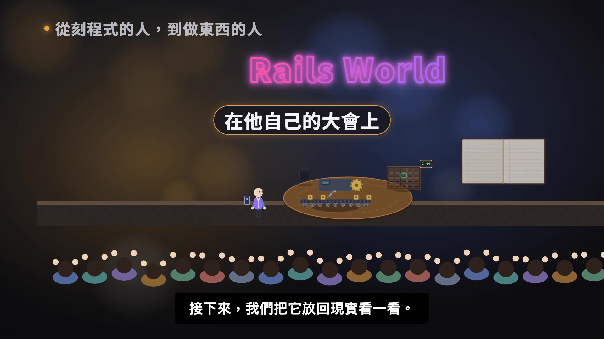

**逐字稿片段：** 第一個要核對的是時間 DH也並不是一直這麼想

**話題推測：** 進入第三部分：核對DHH觀點與現實的落差，首先是時間線

---

## 00:14:45

**逐字稿片段：** 今年1月7號 他在自己的部落格 寫了一篇文章 標題叫替AI Agent升職 他說他以前一直不喜歡 編輯器裡那種AI自動補完 覺得會打斷自己的思考 現在Agent能自己把工作做完 他願意給他們升職 可是同一篇文章裡他也寫 如果要守住品質 還有城市整體的一致性 他做不到有些人說的 九成以上的城市都交給AI 到了5月

**話題推測：** DHH在1月部落格文章中對AI Agent持保留態度，但願給AI升職

---

## 00:15:06

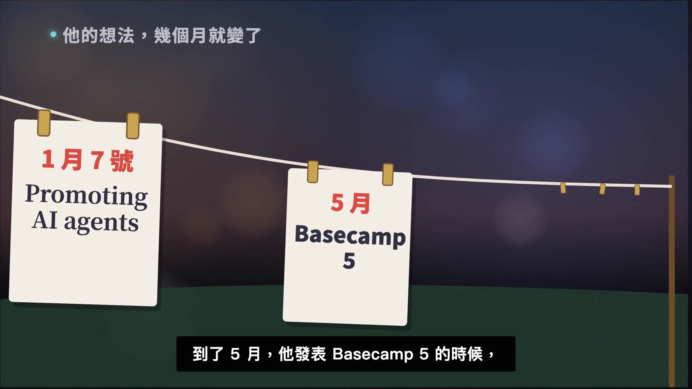

**逐字稿片段：** 他發表Baycam 5的時候 還說這個產品歡迎AI來用 但他們不會跟著Agent的熱潮起舞 從那時候到9月宣佈 鉛筆放下不到4個月 看到新證據就更新想法 本來就是好習慣 可是這也提醒我們 他今天講的這麼篤定的話 是幾個月內形成的 之後也可能再變 第二個要核對的

**話題推測：** DHH在5月發布Basecamp 5時仍表示不會盲目跟隨Agent熱潮

---

## 00:15:23

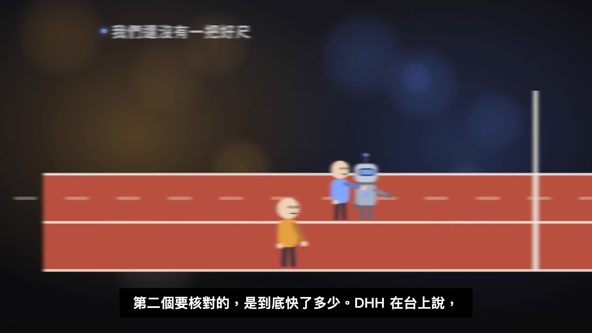

**逐字稿片段：** 是到底快了多少 迭去記載臺上說 最差的程式設計師不用AI 跟最強的程式設計師用AI 差距可能到1000倍 這個數字沒有人量過 真的去量的研究 結果複雜的多

**話題推測：** 核對DHH提出「程式設計師生產力差距1000倍」的說法與研究數據

---

## 00:15:34

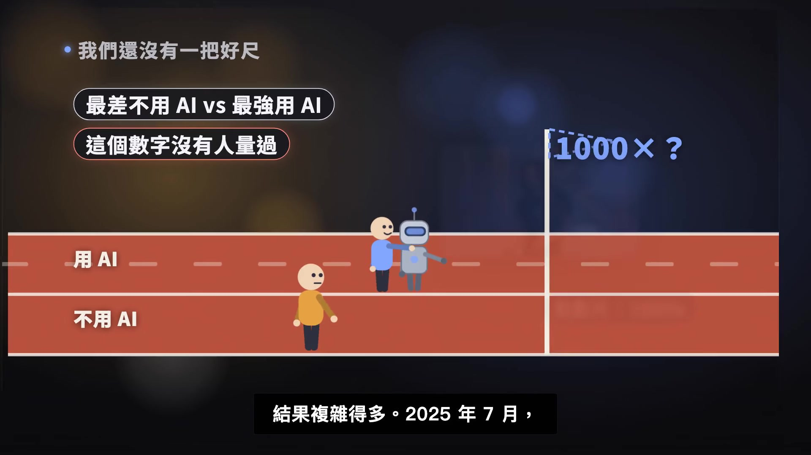

**逐字稿片段：** 2025年7月 一個叫METR的研究機構 找了16位很有經驗的開放原始碼開發者 讓他們做自己手上真實的工作 有些可以用AI有些不行 結果用了AI的時候 他們反而慢了大約19% 而且這些人自己感覺是快了兩成 不過那是2025年初的工具 比OPUS 4.5還早 METR 今年2月想再亮一次 卻碰到新的問題 很多開發者不肯在沒有AI的情況下工作 有的人乾脆不教那些不想手寫的題目 實驗就亮不準了 他們自己也說 真正的加速可能比亮到的還大 所以比較誠實的說法是 AI確實讓很多人變快 可是快了多少 我們還沒有一把好尺 行數也不是那把尺 這一點DHH自己也承認 第三個要核對的是代價

**話題推測：** 介紹METR研究機構的發現，AI在真實工作中可能導致效率下降19%

---

## 00:16:14

**逐字稿片段：** 把RUS當黑盒子 對DHH來說說得通 他寫了25年程式 看結果就知道哪裡不對勁 可是黑盒子一多 問題也跟著來 除了資訊安全的漏洞 誰看得懂 過幾年要修改 誰接得住 DHH在臺上也承認 資訊安全是真實的風險 他的回答是 我們有工具 也有AI可以拿來防守 這是一個方向 還不是一個答案 Rail社群裡也有人很失望 開發者Joey de Villa 在部落格寫了一篇心得 標題引了一句話 說這是他經歷過 最讓人困惑的一場告別式 他覺得一個20年來 教大家寫出漂亮城市碼的人 現在說城市碼不用看了 等於丟下了這個社群 還有一個小地方 DHH的提款機的例子 提款機出來以後 銀行櫃員反而變多了 方向 沒錯 經濟學家James Basson研究過 櫃員的工作確實沒有因此減少 因為銀行開了更多分行 可是DHH講的年代跟人數 都跟紀錄對不上 這很像整場演講 方向抓得準 細節講得很快 最後他用這段話替整場演講收尾 這段話很有感染力 可是要看清楚它是什麼 它是一種態度的選擇 不是證據 未來不確定 所以選擇開心 這可以是很好的生活方式 但他沒辦法告訴我們明年工作會變成什麼樣子

**話題推測：** 核對將AI程式碼當作「黑盒子」的代價，涉及資安與維護問題

---

## 00:17:37

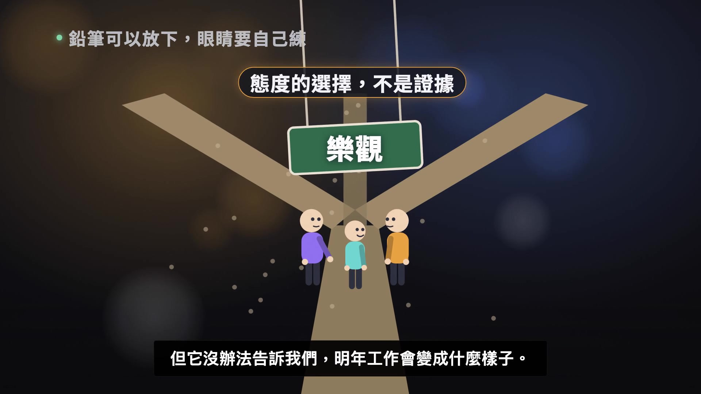

**逐字稿片段：** 那對一般人這場演講有什麼用 回到畫家的比喻 兩面都要看 一面是像Tuckson這樣的畫家轉型 留下了新的作品 另一面是很多靠畫肖像為生的人 那份工作是真的變少了 對正在學程式的人 DHH甚至說太懂電腦的人反而容易管得太細 用初學者的心態下指令 效果更好 這有一點道理 可是他能把RUS當黑盒子 是因為他花了25年 知道好的軟體長什麼樣子 驗收的眼光 還是從親手做過裡面長出來的 就寫程式的人門檻真的變低了

**話題推測：** 總結DHH演講對一般人的意義：從畫家比喻看轉型與工作減少的兩面

---

## 00:18:07

**逐字稿片段：** DHH這場演講用的簡報軟體 是他在準備演講的那幾天 請AI做出來的 整個程式只有半個MB 你想要一個剛好合自己習慣的小工具 現在可以試著用一段話 把它描述出來 我們回到開場那個問題 當寫程式交給AI會寫程式的人 還剩下什麼 DHH的答案是 他高祖父那一代畫家的答案 把現實化的一模一樣的本事變便宜了 可是知道要畫什麼 看得出好壞的人 還有位置 站得住的那一半是 是Sanity Signals真的在這樣做 也真的做出了東西 要打折的那一半是 它的轉變只花了幾個月 研究還量不準到底快了多少 黑盒子的帳也還沒算清楚 所以我的看法是

**話題推測：** DHH用AI在幾天內完成簡報軟體的例子，說明低程式碼門檻

---

## 00:18:43

**逐字稿片段：** 鉛筆可以放下 可是判斷好壞的那雙眼睛 還是要自己練

**話題推測：** 講者提出最終看法：鉛筆可放下，但判斷好壞的眼光需自己鍛鍊

---

## 00:18:46

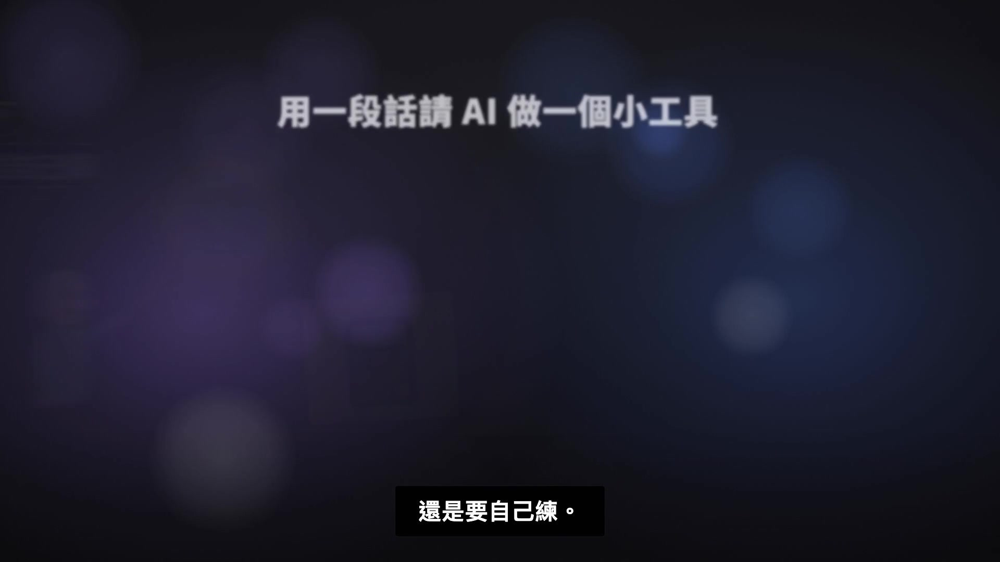

**逐字稿片段：** 最後問你一個問題 如果你可以用一段話 請AI幫你做一個只給自己用的小工具 你第一個想做什麼 留言告訴我 喜歡的話訂閱AI Notebook開啟通知 我們下次見

**話題推測：** 呼籲觀眾思考自己想用AI做什麼個人小工具

---
