# jimainotebook_ignI6mQrsNs — 關鍵畫面索引

- 來源逐字稿：[jimainotebook_ignI6mQrsNs_FIN.srt](jimainotebook_ignI6mQrsNs_FIN.srt)
- 影片：https://www.youtube.com/watch?v=ignI6mQrsNs
- 截圖數：85

## 00:00:14

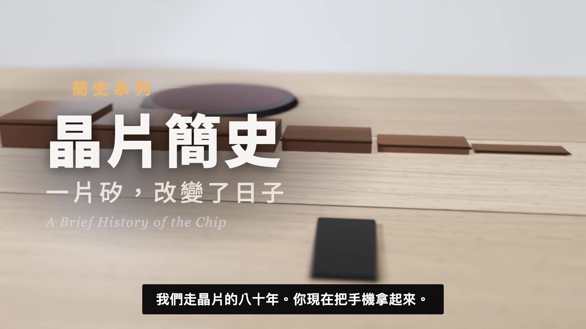

**逐字稿片段：** 你現在把手機拿起來, 它比一本筆記本還輕, 裡面最重要的那片晶片比你的指甲還小, 上面卻有上百億個開關,

**話題推測：** 介紹現代手機晶片的微小與強大

---

## 00:00:21

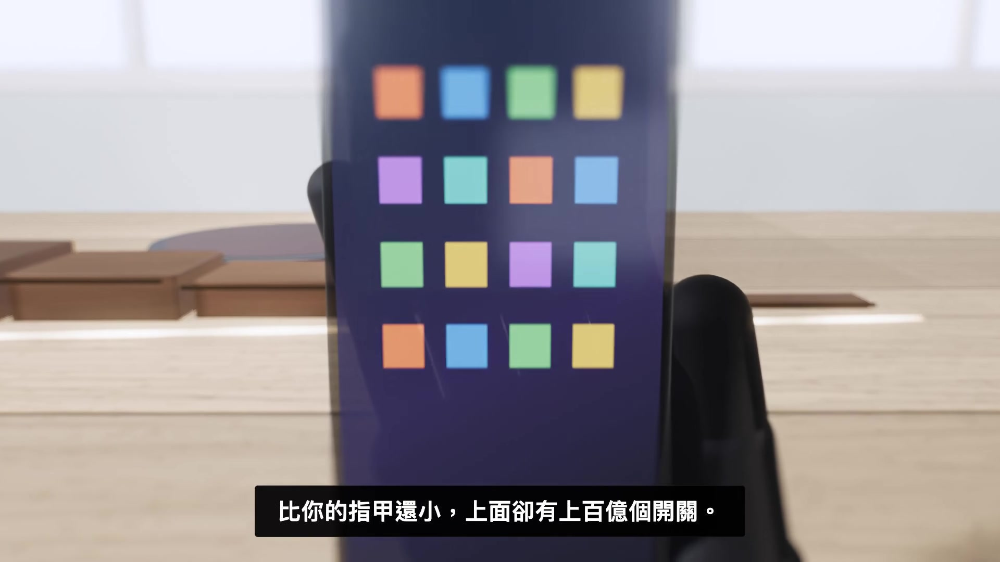

**逐字稿片段：** 80年前, 一臺只會做計算的電腦要佔滿一整個房間, 這一集只問一個問題, 一片這麼小的戲是怎麼改變我們每天的生活的, 我先把答案放在前面, 同一件事, 發生了一次又一次, 開關變得更小, 更便宜, 多到每個人都用得起, 就有一件新的東西走進普通人的生活,

**話題推測：** 對比80年前佔滿房間的電腦（ENIAC）

---

## 00:00:37

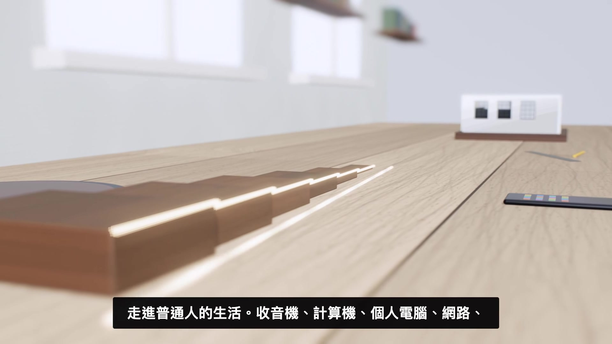

**逐字稿片段：** 收音機 計算機 個人電腦 網絡 手機 還有今天的人工智慧 而每往前一步 需要一起動手的人和國家也越來越多

**話題推測：** 列舉晶片帶來的產品演進：收音機、計算機、PC、網絡、手機、AI

---

## 00:00:45

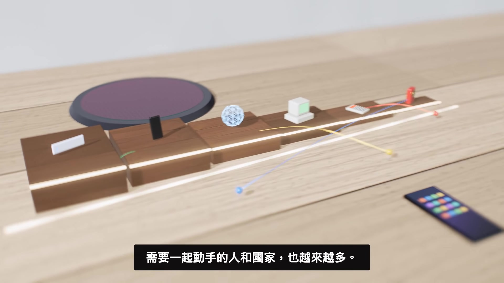

**逐字稿片段：** 這條線分三步走 先看一整個房間 怎麼變成一片晶片 再看書桌上的電腦 怎麼走進每個人的口袋 最後看今天這片晶片背後 跨越很多國家的供應鏈 中間有一頓早餐 吃在臺北車站附近的一間豆漿店 我們留到後面

**話題推測：** 影片結構劃分：晶片歷史三步驟

---

## 00:00:59

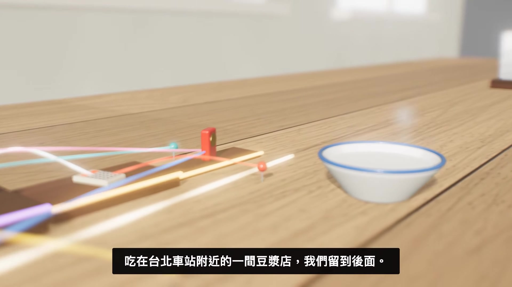

**逐字稿片段：** 故事要從1940年代的一臺電腦開始

**話題推測：** 故事主線開始：1940年代的電腦歷史

---

## 00:01:02

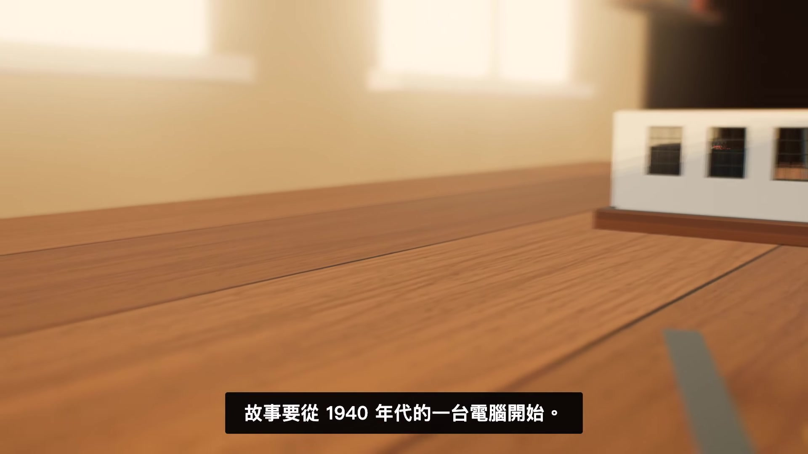

**逐字稿片段：** 1940年代 美國賓州大學蓋了一臺電腦叫INIAC 他佔滿了一整個房間 裡面裝了將近18000只Vacuum Tube 中文叫真空管 真空管長得像一顆小燈泡 在這裡你可以先把它想成一個電子開關 讓電流通過 或者不讓電流通過 你家牆上的電燈開關 往上搬 燈就亮 往下搬 燈就暗 真空管做的是類似的事 只是他不用手搬 是用電來搬 電腦說穿了就是一大堆這樣的開關 可是這種開關有三個麻煩

**話題推測：** 介紹ENIAC電腦及其構成

---

## 00:01:27

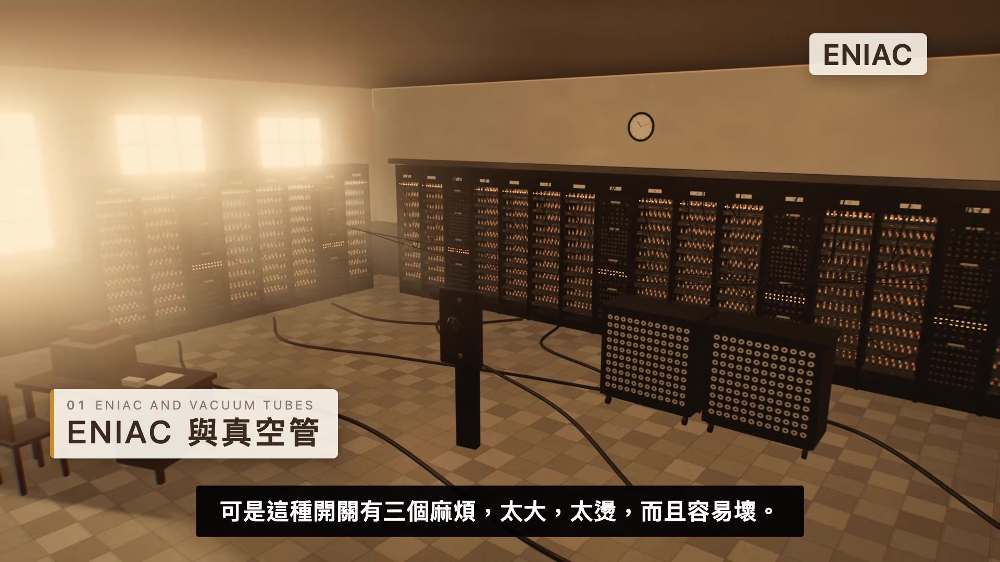

**逐字稿片段：** 太大 太燙 而且容易壞 美國的電腦歷史博物館記錄 FINAC 大約每一兩天 就要燒掉一隻真空管 工程師得在一萬多隻裡面 把壞的那一只找出來換掉 你想要更厲害的電腦 就得放更多開關 可是開關越多 壞的越頻繁 房間也越熱 所以最早的問題是 開關能不能小一點 冷一點 而且不要那麼容易壞

**話題推測：** 說明真空管開關的三大問題（太大、太燙、容易壞）

---

## 00:01:48

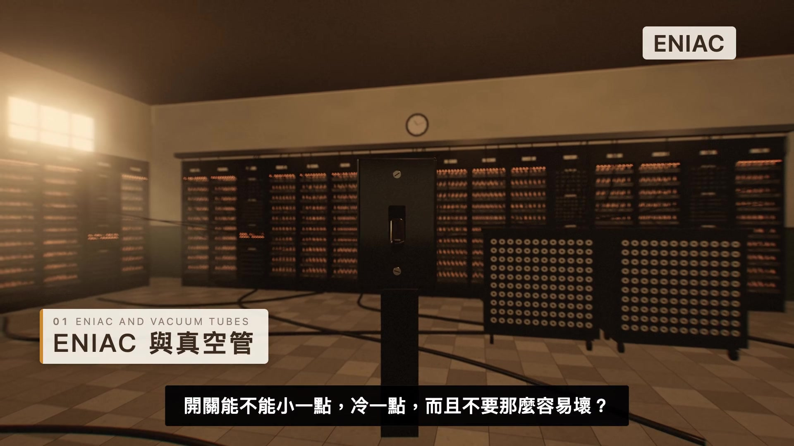

**逐字稿片段：** 那一堆開關 為什麼可以算數 一個開關有兩種狀態 開著我們叫它一 關著我們叫它零 只有一個開關能表達的東西很少 可是你把八個開關排成一排 開開關關的組合 就足夠代表一個英文字母 真正關鍵的是用電搬的開關 可以讓一個開關的結果 去搬下一個開關 這樣接起來就能做出這種規則 兩個開關都開著 下一個才開 用很多這種小規則疊起來 就能做加法做比較 也能把結果記住 所以一臺電腦能做多少事 很大一部分取決於 它有多少開關 這些開關切換的多快 看一個時代的晶片 很重要的一個指標 就是上面擺了多少開關 ENIAC的開關 是一隻一隻的真空管 每一隻都像燈泡那麼大 要讓電腦更強 一條關鍵的路 是把開關做小

**話題推測：** 解釋電腦如何利用開關進行運算（二進制概念）

---

## 00:02:30

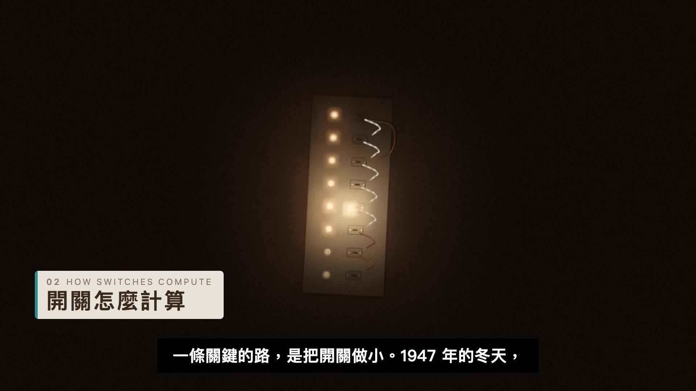

**逐字稿片段：** 1947年的冬天 一間實驗室 做出了一種新的開關 這一間實驗室 是美國電報公司 AT&T的Bell Labs 中文叫貝爾實驗室

**話題推測：** 貝爾實驗室發明電晶體

---

## 00:02:39

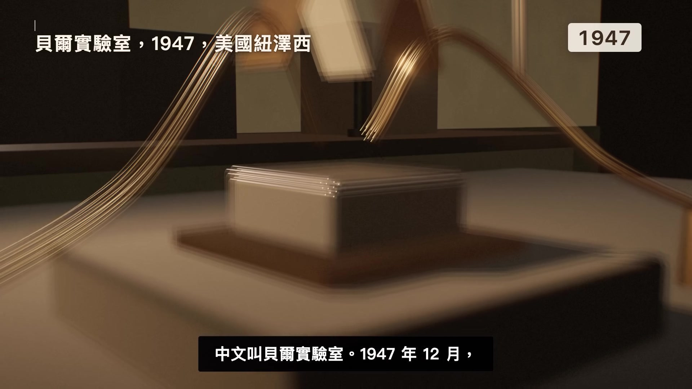

**逐字稿片段：** 1947年12月 兩位物理學家 John Badin 和Walter Breton 在一小塊叫Germanium 中文叫褶的材料上 壓了兩個 靠得很近的金色接點 他們發現在其中一個接點 送進一點點電流 另一邊流過的電流 就會跟著被放大 或者被關掉 這個東西叫Transistor 中文叫電晶體 它做的是 就是我們說的那個開關 用一個小小的電 去搬一個比較大的電 跟真空管不一樣 它不需要加熱燈絲 褶這種材料 叫Semiconductor 中文叫半導體 它導電的本事 介於銅線這種導體 和玻璃這種絕緣體之間 而且可以被控制 這真是做開關需要的性質 那個月的23日 他們把這個東西展示給 實驗室的主管看 開關這件事 從這一天起 不再需要一顆燈泡

**話題推測：** 說明電晶體的工作原理

---

## 00:03:22

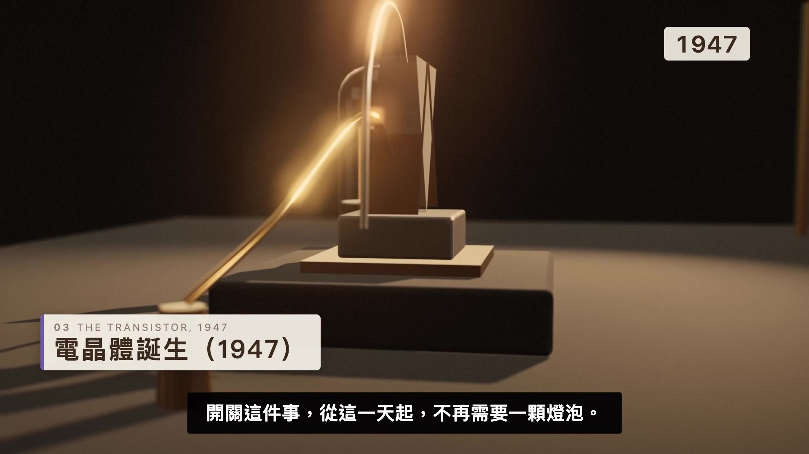

**逐字稿片段：** 9年後 Bardin Bretain 還有帶領他們團隊的 William Shockley一起拿到了諾貝爾物理學獎

**話題推測：** 電晶體發明者獲諾貝爾獎

---

## 00:03:29

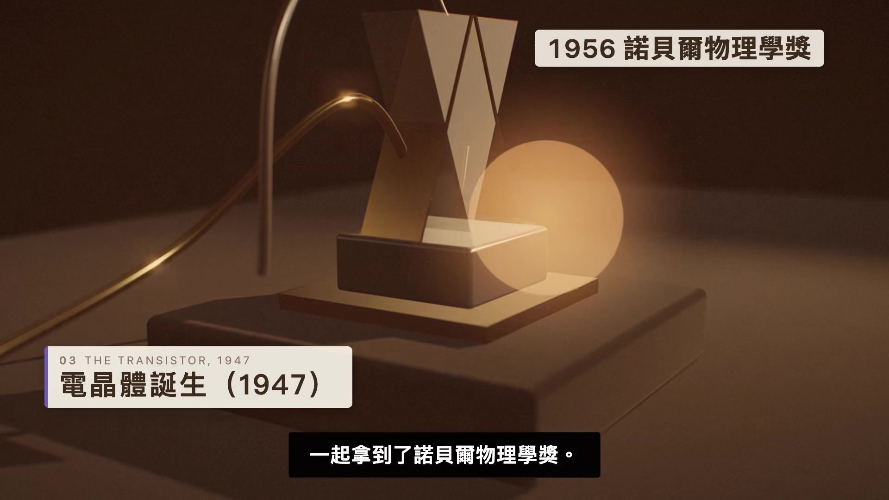

**逐字稿片段：** 電晶體發明以後 最先把它帶進普通人家裡的 不是電腦是收音機

**話題推測：** 電晶體首次應用於消費產品：收音機

---

## 00:03:33

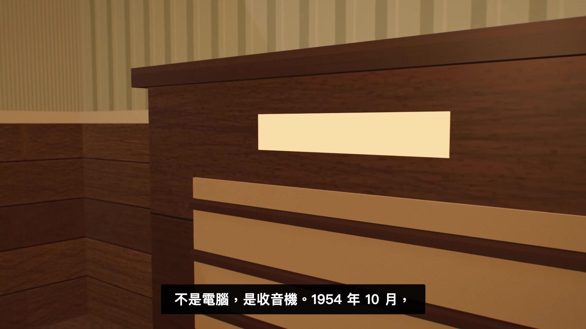

**逐字稿片段：** 1954年11月 美國的德州儀器公司Texas Instruments 宣佈了第一臺商用的電晶體收音機 叫Regency TRE 它裡面只有四顆電晶體 以前的收音機 是放在客廳的一個木頭箱子 要插電 然後等真空管熱起來 這一臺可以放進外套口袋 用電池就能聽 它在當時不便宜 可是賣得很好 美國的電腦歷史博物館說 很多人是從這臺收音機 第一次聽到電晶體這個詞 你可以想象那個畫面 一個年輕人走在街上 口袋裡放著收音機 耳機裡是自己想聽的歌 開關變小了 音樂就可以隨身帶著走 這是電晶體第一次 這麼直接的走進普通人的生活 可是這時候的電晶體 還是一顆一顆的 而且用的材料有一個怕熱的毛病 收音機裡的電晶體用的是褶 褶有一個問題 怕熱 電腦歷史博物館的整理是 褶做的電晶體 溫度一高就不太可靠 而且關著的時候還會露出不少電流 一個關不緊的開關 對電腦來說是很麻煩的事

**話題推測：** 德州儀器推出首臺商用電晶體收音機Regency TRE

---

## 00:04:28

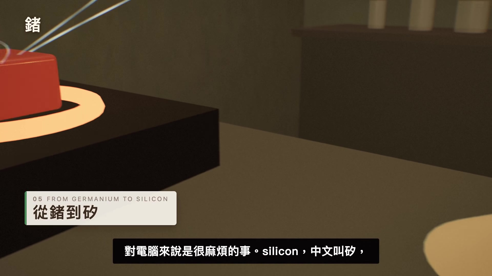

**逐字稿片段：** Silicon 中文叫矽 在這兩件事上都好得多 它能在熱得多的地方工作 關起來也比較緊 矽還有一個更大的好處 砂紙的主要成分就是矽跟氧 而矽的表面一加熱 就會長出一層很薄的玻璃 叫二氧化錫 這層玻璃可以把底下的東西保護起來 還能把電擋住 這層玻璃後來會變得非常重要

**話題推測：** 引入新材料「矽」

---

## 00:04:45

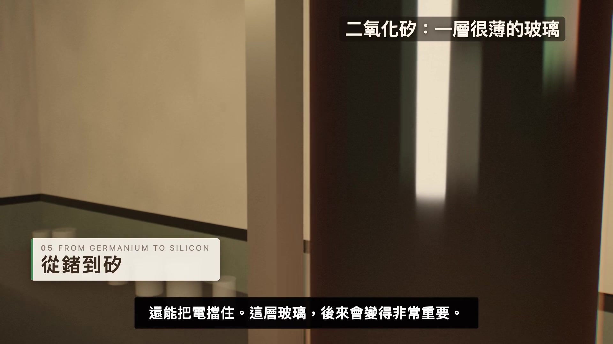

**逐字稿片段：** 1954年 美國的德州儀器公司 Texas Instruments 做出了第一批可以賣的錫電晶體

**話題推測：** 德州儀器製造出第一批矽電晶體

---

## 00:04:51

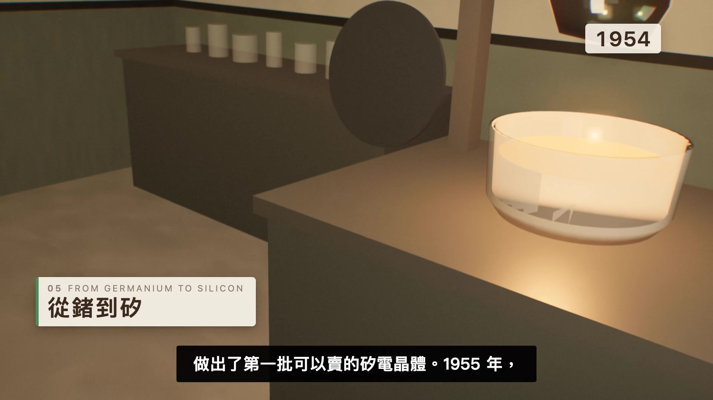

**逐字稿片段：** 1955年 當年帶領貝爾實驗室團隊的 William Shockley 回到加州 開了一家公司 要做用錫做的電晶體 那一代後來有了一個名字叫錫鼓 Shockley找來的年輕人很優秀 可是Shockley很難相處 電腦歷史博物館的說法是 他的管理風格多疑又尖刻 員工去找公司的出資者 希望換掉他 沒有成功

**話題推測：** William Shockley回加州創辦公司，開啟矽谷序章

---

## 00:05:09

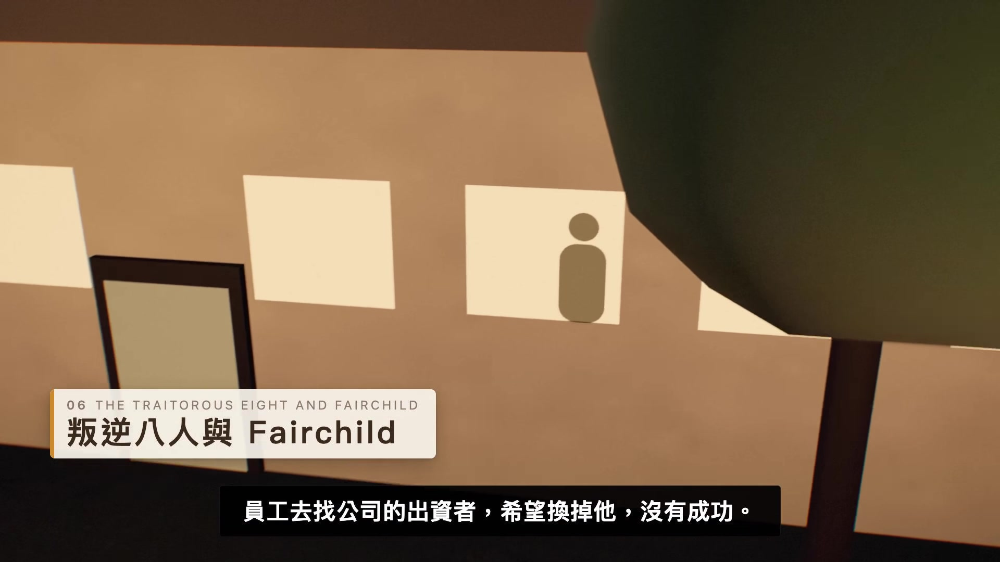

**逐字稿片段：** 1957年9月 八個年輕人一起離開 後來大家把他們叫做Traitors 8 意思是八個叛徒 其中有兩個人 後來改變了整個產業 Robin Noyce和Golden Moore

**話題推測：** 「八叛徒」離開Shockley建立快捷半導體

---

## 00:05:20

**逐字稿片段：** 他們透過一位年輕的投資銀行家 Arthur Rock牽線 找到Fairchild攝影器材公司出資 成立了Fairchild Semiconductor 中文叫快捷半導體 這在當時很少見 一群工程師一起離開老闆 拿別人的錢 自己開公司 後來矽谷一代一代的新公司 很多都是這樣開始的 可是新公司要做出成績

**話題推測：** Fairchild Semiconductor成立，矽谷新模式開端

---

## 00:05:37

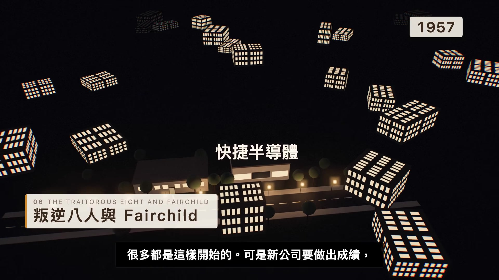

**逐字稿片段：** 得先面對一個老問題 開關雖然變小了 把他們接起來還是一件苦工 那時候的電競體 是一顆一顆做好 再用手一根一根接起來的 你想想一臺收音機的電路板 電晶體 電阻電容 每個零件都有兩三隻腳 工人要用焊錫 把它們跟電線焊在一起 一臺電腦要幾千個 甚至幾萬個零件 就會有好幾萬個焊點 每一個焊點都可能接不好 只要一個壞了 整臺機器就可能出錯 這其實回到了ENIAC的老問題 只是換了一個樣子 以前是開關本身會壞 現在是開關之間的線會出問題 開關越多 線越多 出錯的地方也越多 還有一件事 但是線越長 電跑得越久 電腦也就越慢 所以想要更多開關 不能只是把開關做小 還得想辦法 不要再一根一根去接 當時的工程師把這件事看得很清楚 問題不在開關在接線

**話題推測：** 提出電晶體連線的難題

---

## 00:06:20

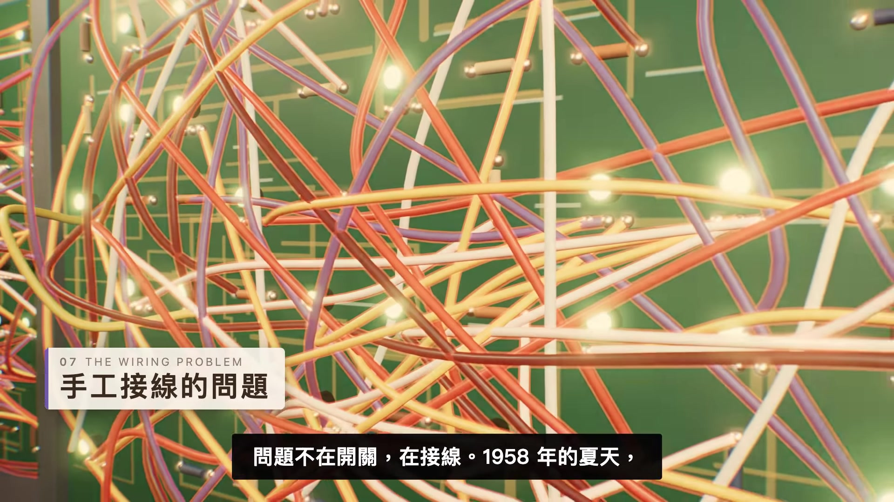

**逐字稿片段：** 1958年的夏天 德州有一位剛到職的工程師 在大家都去度假的時候 一個人留在實驗室裡想這件事 這位工程師叫Jack Kilby 在德州儀器公司上班 他的想法很簡單 也很大膽 既然電晶體是用半導體做的 那電阻跟電容 能不能也用同一塊半導體做 如果所有零件都長在同一塊材料上 就不用一顆一顆做

**話題推測：** Jack Kilby發明積體電路

---

## 00:06:40

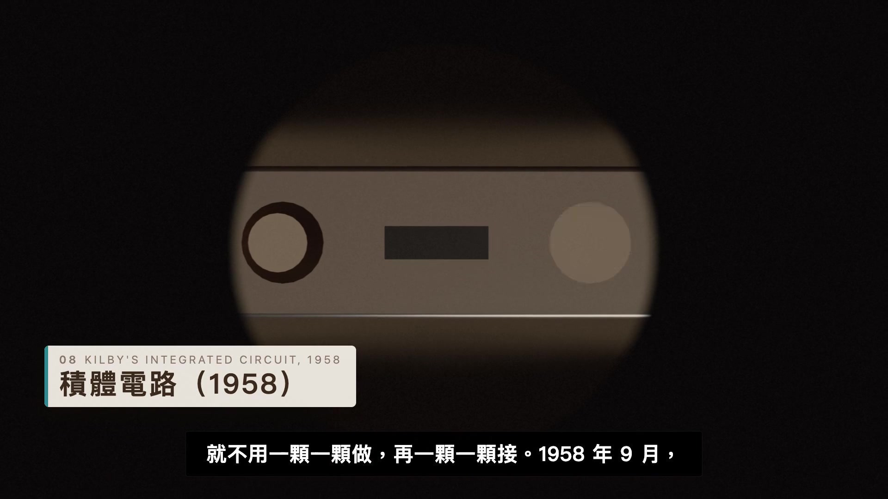

**逐字稿片段：** 再一顆一顆接 1958年9月 他把一片很小的折片拿給主管看 上面做出了電晶體和其他零件 接上電 儀器的螢幕上出現了一條穩定的波形 這個東西 我還叫integrated circuit 中文叫集體電路 意思是把整個電路集合在一片材料上 這也就是我們今天說的晶片 42年後 QB 因為這件事拿到諾貝爾物理學獎 得獎理由是 他在集體電路的發明上所做的貢獻 可是你如果仔細看他那片折片零件之間 還是用細細的金線在空中拉來拉去 接線的問題只解決了一半 另一半在加州的快捷半導體被補上了

**話題推測：** 展示Kilby的第一片積體電路

---

## 00:07:13

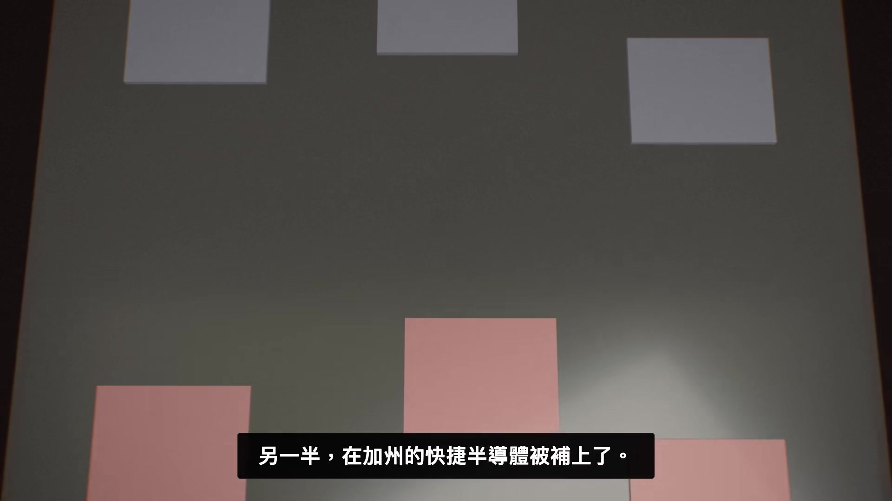

**逐字稿片段：** 細表面那層薄薄的玻璃 這時候派上了用場 快捷的物理學家Jan Horny想到 做完電晶體以後不要把這層玻璃去掉 把它留在上面當保護層 這樣一來所有東西都可以從同一面一層一層做上去 整片晶片是平的 這個方法叫planar process 中文叫平面製程

**話題推測：** Jean Hoerni發明平面製程

---

## 00:07:29

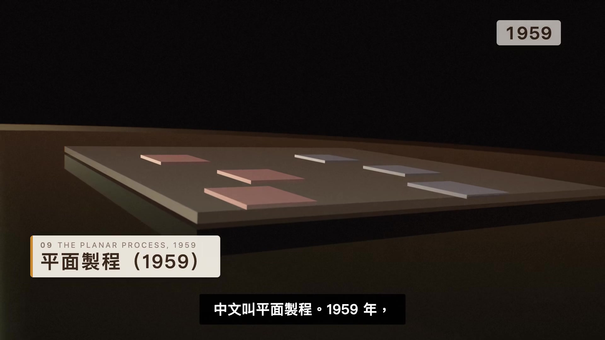

**逐字稿片段：** 1959年Robert Noyce接著往下想 既然表面是平的 還蓋著一層玻璃 那零件之間的線 就不用在空中拉了 直接在玻璃上面鋪一層很薄的鋁 再把不要的部分去掉 留下來的鋁就變成了連線 這是整個故事最關鍵的一步 從這一刻開始 晶片不再是一顆一顆組裝出來的 而是零件跟連線在同一片繫上 一層一層一起製造出來 一百個開關跟一萬個開關 可以用同一套步驟同時做出來 接下來幾十年的晶片產業 都建立在這個做法上 平面製程做出來的機體電路

**話題推測：** Robert Noyce將鋁線整合到平面製程中

---

## 00:07:58

**逐字稿片段：** 一開始很貴 最早大量買它的是 太空跟國防

**話題推測：** 積體電路的早期應用：太空與國防

---

## 00:08:01

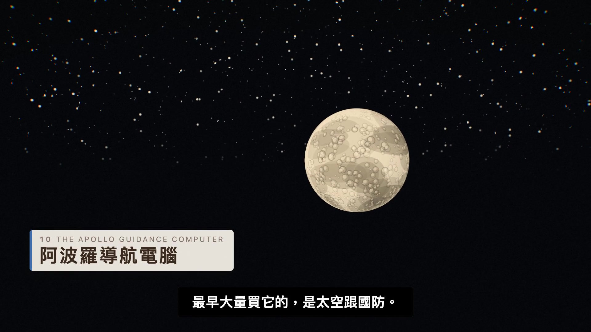

**逐字稿片段：** 美國的阿波羅登月計畫 要在太空船上放一臺電腦 幫太空人算方向跟位置 這臺電腦叫Apollo Guidance Computer 中文叫阿波羅導航電腦 它不能像ENIAC大 太空船裡面有那個空間 所以它用了機體電路 電腦歷史博物館的記錄是 每一臺導航電腦 都用了幾千顆同一種機體電路 整個計畫前後買了大約20萬顆 到1965年為止 它是全世界機體電路最大的買家 後來美國空軍的飛彈計劃又超過了它 這些大訂單也讓早期的機體電路工廠 累積了大量生產的經驗

**話題推測：** 阿波羅導航電腦應用積體電路

---

## 00:08:33

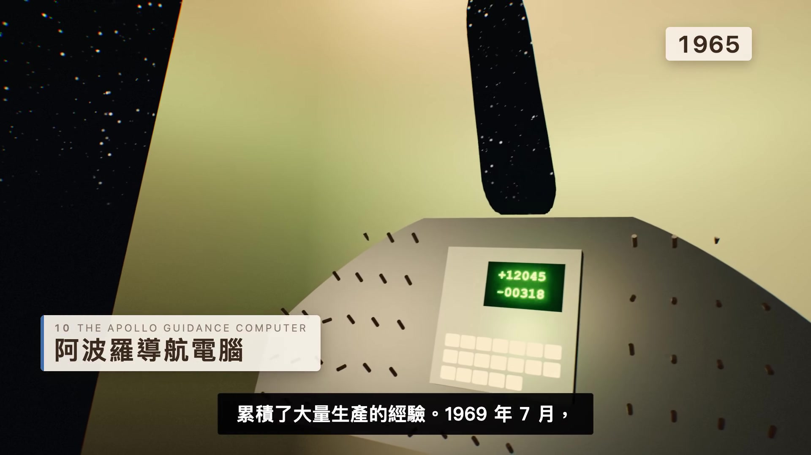

**逐字稿片段：** 1969年7月 太空人登上月球 那一趟路上幫他們算方向的 就是一臺用機體電路做成的電腦 一臺電腦第一次小到可以放進太空船 接下來它要小到可以放在一張書桌上 甚至一個人的手掌上

**話題推測：** 阿波羅登月成功，晶片技術的里程碑

---

## 00:08:46

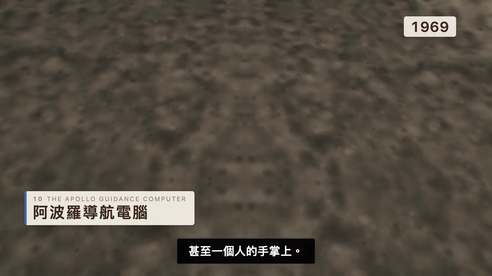

**逐字稿片段：** 1968年 諾伊斯和莫爾離開了快捷 自己開了一家新公司 叫Intel

**話題推測：** Intel公司成立，微處理器時代來臨

---

## 00:08:51

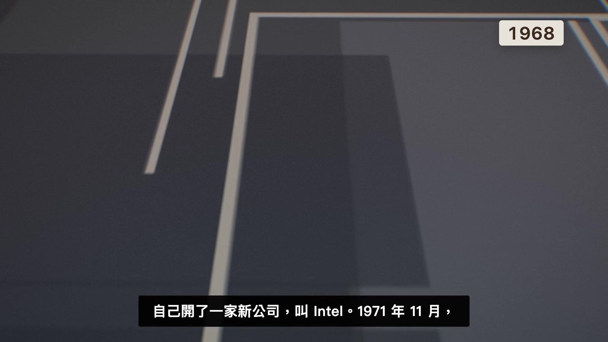

**逐字稿片段：** 1971年11月 Intel推出了一片晶片 叫4004 它原本是替日本一家計算機公司 Musicom做的 要放進一臺桌上型計算機 可是它不只是一片計算機晶片 它把一臺電腦最核心 負責計算跟判斷的部分 整個放進了同一片晶片裡 這種東西叫Micro Processor 中文叫微處理器 Intel自己的說法是 這是世界上第一個 在市面上買得到的微處理器 這片晶片上 有2300個電晶體

**話題推測：** Intel推出首款微處理器4004

---

## 00:09:17

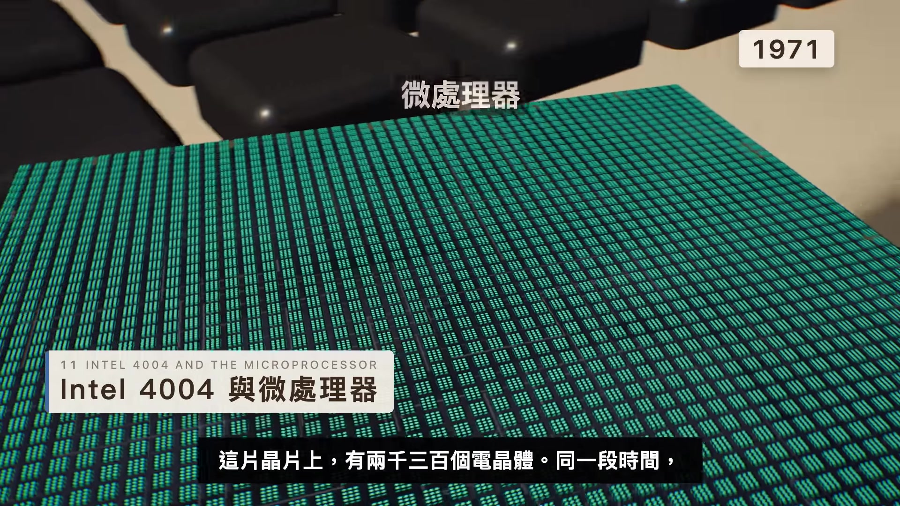

**逐字稿片段：** 同一段時間 計算機也開始變成 每個人都買得起的東西 電腦歷史博物館的記錄是 1971年第一款 大量銷售的手持計算機 還要200多美元 不到10年 類似的計算機 價錢只剩下原來的一個零頭 學生 會計 菜市場的老闆 都開始有自己的計算機 2300這個數字 後面我們會拿一顆今天的晶片來對照

**話題推測：** 手持計算機普及，晶片進入大眾生活

---

## 00:09:36

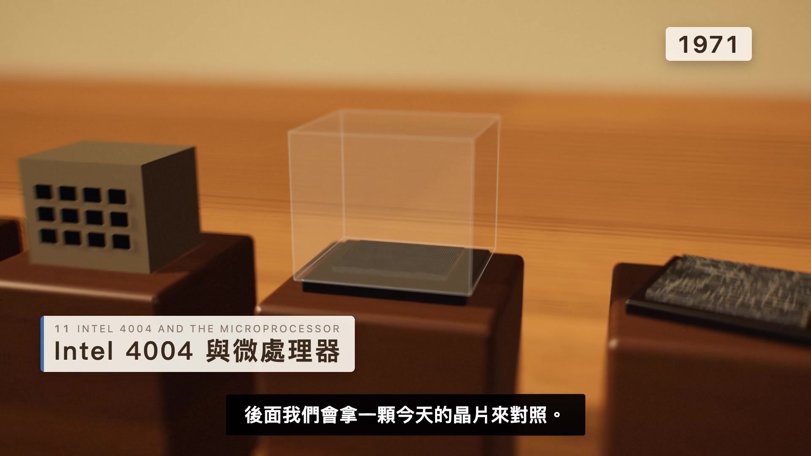

**逐字稿片段：** 我們先停一下 把第一部分收起來 開關從真空管變成了電晶體 材料從褶換成了細 零件之間的線 從用手焊 變成在同一片細上 跟零件一起做出來 每小一步 就有一樣東西走進生活 收音機放進了口袋 電腦上的太空船 計算機放上了桌子 記住這一句 晶片是一整片 一層一層製造出來的 那下一個問題就很自然了 線能做多細 越做越細 又能把電腦帶到哪裡

**話題推測：** 第一部分總結：晶片技術從真空管到整合製造的演進

---

## 00:10:00

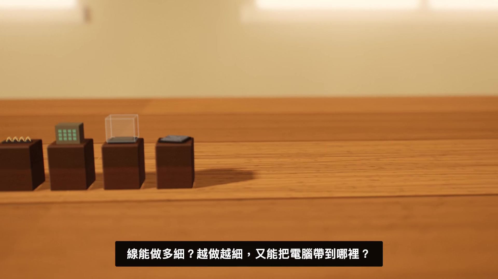

**逐字稿片段：** 第一個認真回答 能做多細的人 是Golden Moore

**話題推測：** 介紹摩爾定律

---

## 00:10:04

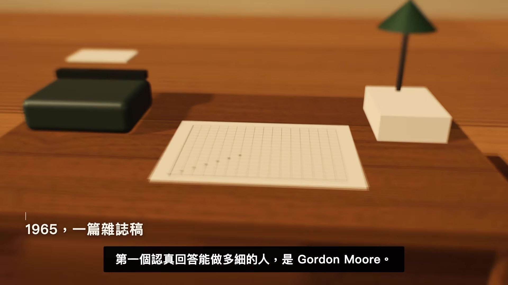

**逐字稿片段：** 1965年 他還在快捷半導體 一本電子產業的雜誌 請他寫一篇文章 預測未來十年 他把過去幾年的晶片 畫在一張圖上 發現一件很規律的事 每一片晶片上 成本最划算的零件數量 一片晶片上會有好幾萬個零件 他在文章裡還寫了一句 集體電路會帶來家用電腦 汽車的自動控制 還有可以隨身攜帶的個人通訊設備 那是1965年 你手上的手機 那時候連影子都沒有 十年後 他把速度修正成大約每兩年翻一倍 後來有一位加州理工學院的教授 Carver Mead 替這個觀察取了名字 叫Morse Law 中文叫More定律 它不是物理定律 比較像一張全產業一起追的時間表 這張時間表後來推著整個產業 走了半個世紀 要做得更細 得先講清楚 電路的圖案

**話題推測：** 展示摩爾定律的圖表，說明晶片上零件數量的規律

---

## 00:10:52

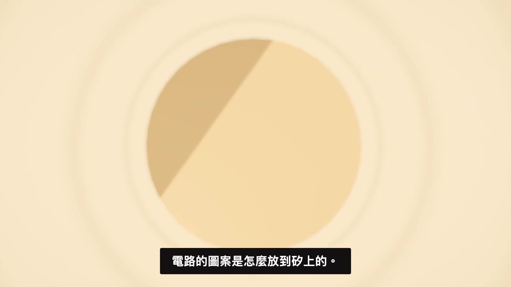

**逐字稿片段：** 是怎麼放到戲上的 晶片是做在一片 圓形的薄細片上 這片戲叫Wafer 中文叫晶圓 把圖案放上去的方法 叫Photolithography 中文叫微影 也有人叫光刻 它的做法 跟沖洗照片有點像 首先在晶圓表面 塗上一層 對光很敏感的材料 叫光組 再來 拿一塊叫光罩的板子 上面有電路的圖案 光穿過光罩 經過一組鏡頭 把圖案縮小 投影在光組上 被光照到的地方 性質會改變 用藥水一洗 就留下了圖案 如果要打個比方 光照 有點像印刷用的板 光纖墨 把同一個圖案 一次又一次轉到晶圓上 可是這個比方只對一半 美影負責的是 把圖案轉上去 真正把每一層做出來的是 後面的步驟 層級 是把一層薄薄的材料鋪上去 石刻 是把不要的部分去掉 摻雜 是把別的元素加進系裡 改變它導電的性質 這套方法最早是 是1950年代貝爾實驗室的研究人員 從電路板的製板技術借過來的 他讓工廠可以一次又一次 重複製作同一套圖案 可是一片晶片不是隻做一層 一顆現代的晶片是幾十層圖案疊起來的 有的層放電晶體 有的層放連線 一層一層往上疊 每一層都要對準下面那一層差一點點 上下兩層的線路就接不起來 一片晶圓上會同時做出很多顆晶片

**話題推測：** 解釋晶圓與微影（光刻）製程

---

## 00:12:06

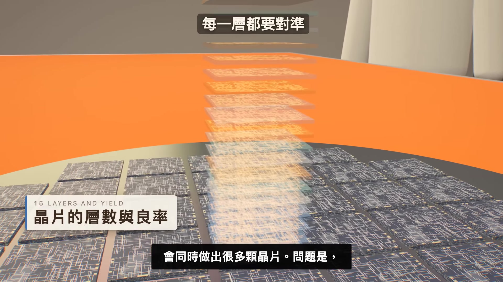

**逐字稿片段：** 問題是 只要一粒灰塵落在錯的位置 那顆晶片就壞了 所以工廠要蓋成比開刀房還乾淨的房間 叫五層室

**話題推測：** 介紹晶片製造的無塵室環境

---

## 00:12:14

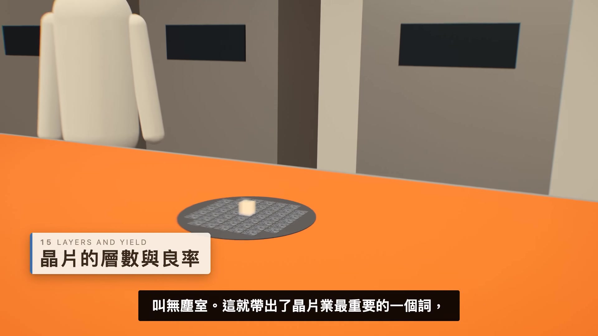

**逐字稿片段：** 這就帶出了晶片業最重要的一個詞 叫Yield 中文叫良率 它的意思是 一片晶圓做完以後 能用的晶片佔了多少 良率九成 跟良率五成 用的是一樣的機器 一樣的材料 能賣的晶片卻差了將近一倍 所以晶片工廠之間 在比的不只是誰的現化的最細 也是誰能在幾百道步驟裡 每一步都不出錯 臺灣後來的故事 跟良率這兩個字關係很深 那為什麼大家一定要做得更細

**話題推測：** 引入良率（Yield）概念及其重要性

---

## 00:12:38

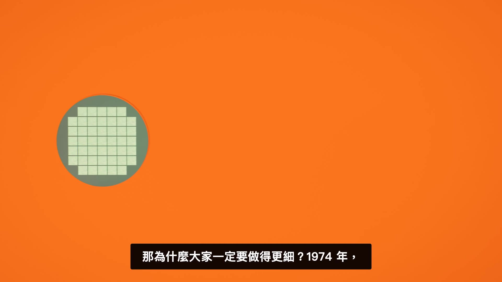

**逐字稿片段：** 1974年IBM的工程師Robert Dennard和同事發表了一篇論文 他們說明電晶體縮小的時候 如果電壓跟電流也照比例一起降 每個開關就能更快 也更省電 而且同樣面積裡發出的熱不會增加 這個規律後來叫Dennard Scaling 中文叫Dennard縮放 泛神生活化就是在這些條件還成立 製造也跟得上了那幾十年裡 把電晶體做小 同一塊麵積就能放更多開關 速度跟耗電一起變好 每一個功能的成本也有機會往下降 可是好處的背後有代價 沒往下做細帶 光照要更精準 機器要更好 工廠也要更乾淨

**話題推測：** 說明Dennard Scaling（德納德縮放）規律

---

## 00:13:13

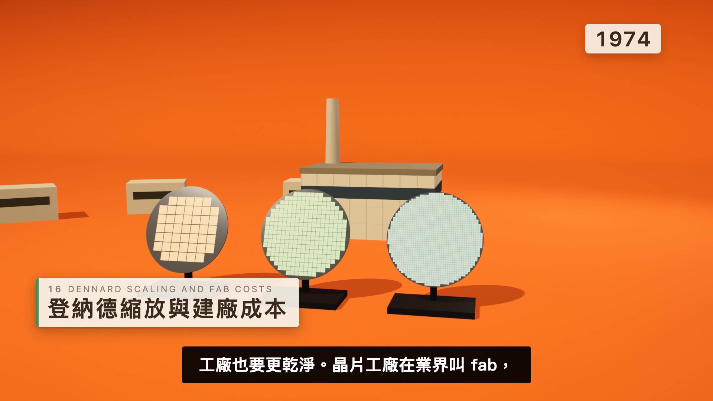

**逐字稿片段：** 晶片工廠在業界叫Fab 中文叫晶圓廠 產業裡有一個經驗法則 叫Rock's Law 名字來自前面牽線成立會計的 那位Arthur Rock 大意是蓋一座晶圓廠的成本 大約每四年就翻一倍 它不是精確的定律 可是方向很清楚 晶片越做越好 蓋工廠的門檻也越來越高 做得起的公司越來越少 晶片越做越便宜 電腦就從大公司的機房 走到了普通人的書桌上

**話題推測：** 介紹Rock's Law（洛克定律）與晶圓廠建造成本

---

## 00:13:35

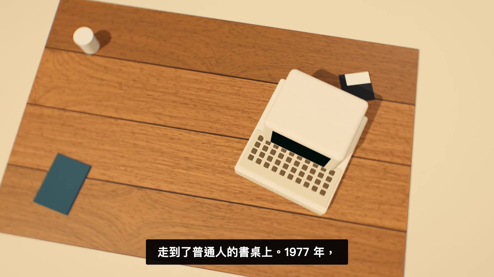

**逐字稿片段：** 1977年 Apple II開始上市 它是一臺整臺組好的電腦 有主機板 有電源 有鍵盤 有外殼 買回家插上電就能用 電腦歷史博物館的記錄是 從1977年到1993年 Apple II賣出了好幾百萬臺

**話題推測：** 個人電腦時代來臨：Apple II上市

---

## 00:13:48

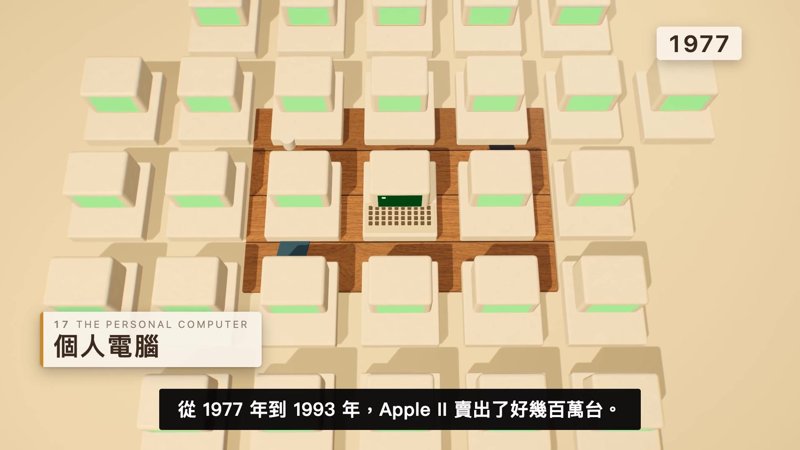

**逐字稿片段：** 1981年8月12日 IBM在紐約的一間飯店 發表了IBM PC 它用的處理器 是Intel的8088 PC這兩個字 是Personal Computer的縮寫 中文叫個人電腦 你想一下那時候的變化 以前要算賬 要打報告 要找一部大型電腦排隊等著用 現在一個會計師 一個學生 一個小店老闆 在自己的桌上就能做 這一次 晶片讓電腦 從一個機構的東西 變成一個人的東西 可是要讓每個家庭都買得起 電腦裡面的另一種晶片 也得變得很便宜 那種晶片負責寄東西

**話題推測：** IBM PC發表，定義個人電腦

---

## 00:14:19

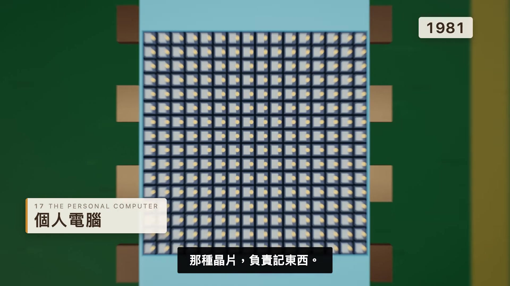

**逐字稿片段：** 這種負責寄東西的晶片 叫DRAM 中文叫動態隨機存取記憶體 電腦正在用的資料 都暫時放在它上面

**話題推測：** 介紹DRAM（動態隨機存取記憶體）

---

## 00:14:26

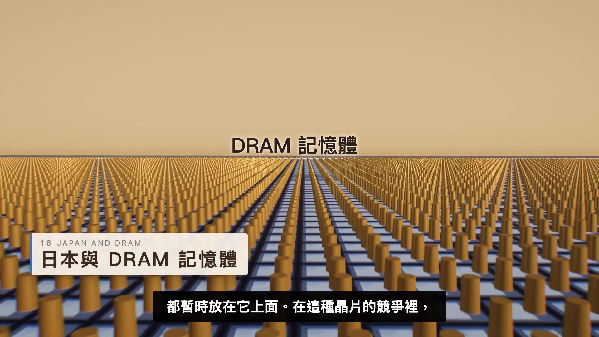

**逐字稿片段：** 在這種晶片的競爭裡 有一段時間 走到最前面的是日本 Anderson在華盛頓的一場會議上 公佈了一份測試結果 他們拿美國跟日本供應商的 記憶體晶片來比 日本晶片的故障率 比美國的低很多 有的說法是好幾倍 甚至十倍 DRAM的結構很規律 一大片一模一樣的小格子 比的就是誰做得多 做得準 做得便宜 日本的NEC 東芝日立的這些公司 把工廠管得非常細 良率一路往上 到了1980年代後半 日本的公司拿下了 全世界大約七八成的DRAM市場 記憶體便宜了 能把良率做到最高 把成本壓到最低的人才會贏 就在各家大公司彼此競爭的時候 另一條路悄悄打開了

**話題推測：** 日本在DRAM市場的領先地位

---

## 00:15:11

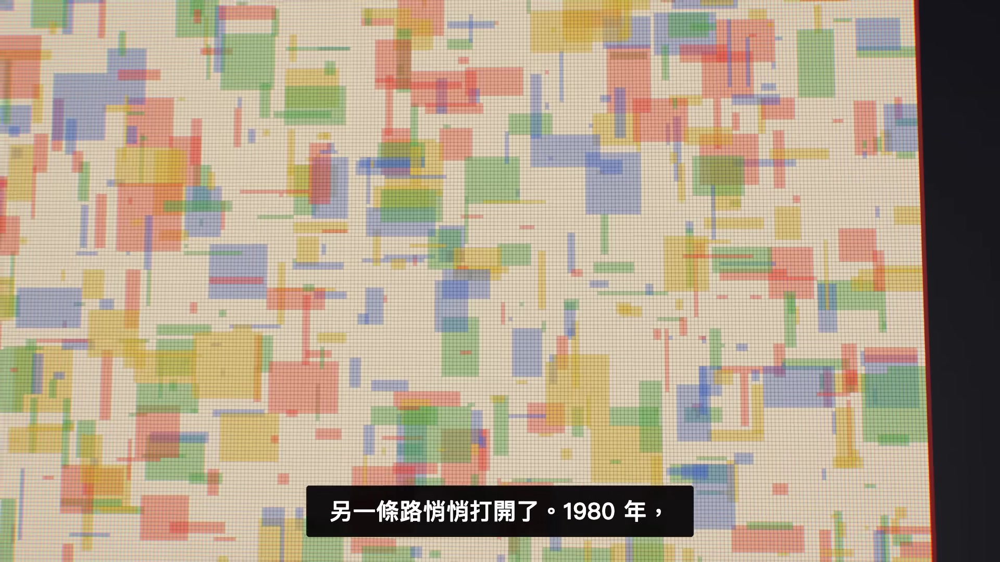

**逐字稿片段：** 1980年 替摩爾定律取名的教授Covermead 跟Xerox研究中心的Lin Conway 出版了一本教科書 叫《Introduction to VLSI Systems》 這本書 教你用一套規則化電路 只要照著規則化 不用懂工廠裡每一臺機器的設計 就有機會交出去做 設計晶片的人 跟製造晶片的人 第一次可以分開

**話題推測：** Mead & Conway的教科書，促成設計與製造分離

---

## 00:15:31

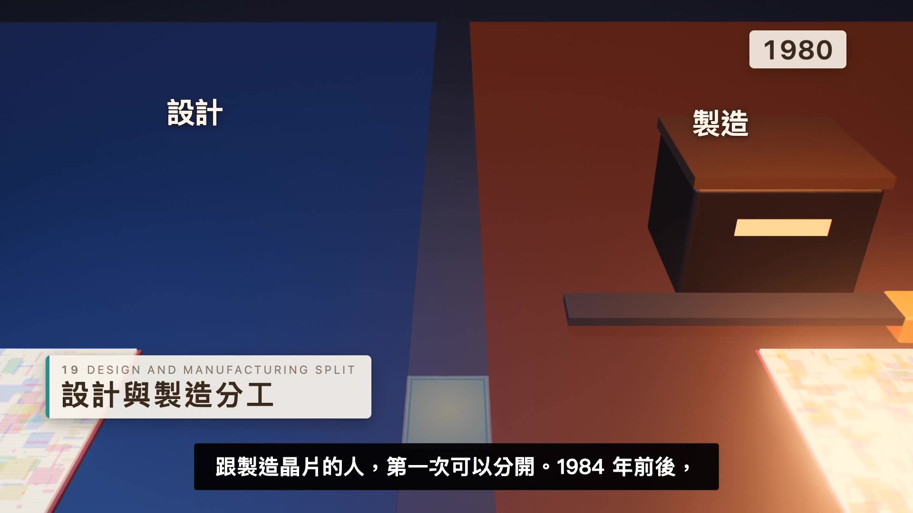

**逐字稿片段：** 1984年前後 美國開始出現一種新的公司 只設計晶片 自己沒有工廠 這種公司叫Fabulous 意思是沒有晶圓廠的公司 可是設計要交給誰 那時候的晶圓廠 幾乎都屬於自己賣晶片的大公司 Triple E Spectrum 雜誌在一篇介紹張忠謀的文章裡寫到 小公司的晶片 只有在大公司的產線有空時才能做 大公司談條件時 還常常要求把設計一起移轉過去 產品賣得好 大公司就可能推出互相競爭的晶片 就算對方沒有這樣做 客戶也很難不擔心 把最值錢的設計交給一個同行 保密跟利益衝突 就成了每天都要想的事 世界上還缺一家只幫別人製造 自己不賣晶片產品的公司

**話題推測：** 晶片設計公司（Fabless）興起

---

## 00:16:09

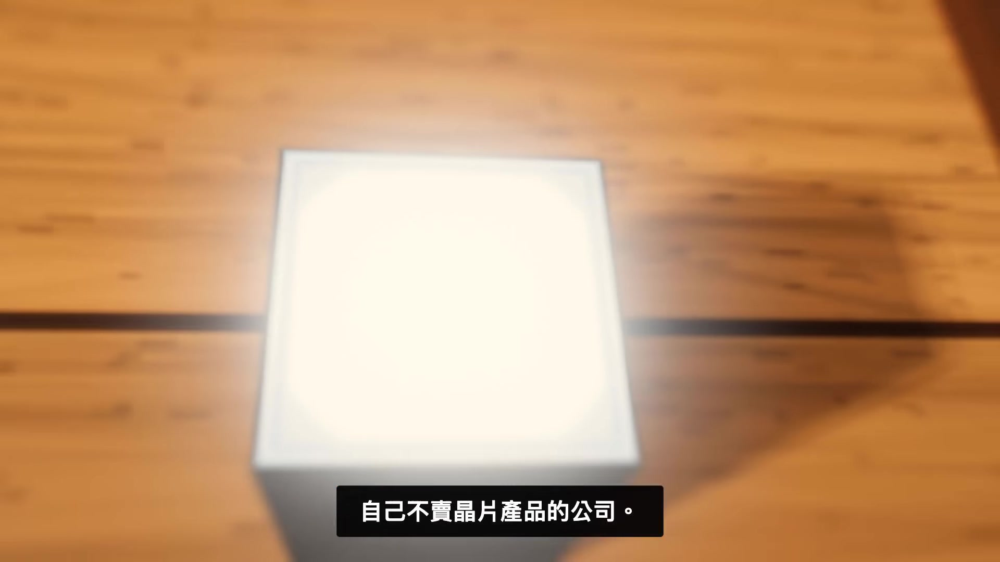

**逐字稿片段：** 1974年1月7日 那個冬天的早上 臺北車站附近 一間叫小星星的豆漿店樓上 坐了七個人 有經濟部長孫運璇 行政員秘書長費華 交通部長高玉樹 還有一位從美國回來的工程師 潘文淵 潘文淵當時在美國的RCA 中文叫美國無線電公司 主持一間研究室 那時候臺灣的電子業 多半是幫外國公司 組裝收音機跟電視 賺的是很薄的工錢 這頓早餐討論的是 臺灣下一步能做什麼 潘文淵的建議是 做機體電路 在座的人同意了 那年夏天 潘文淵把自己 關在圓山飯店 寫出一份 機體電路計劃的草案 孫運權當天下午就批准了 後來立法院通過了 一筆四年的預算 大約一千萬美元 以今天的眼光看 這筆錢很小 可是對當時的臺灣 這是一筆很大的投資 而且要做的 是臺灣從來沒做過的東西

**話題推測：** 臺灣發展半導體的關鍵早餐會議

---

## 00:16:55

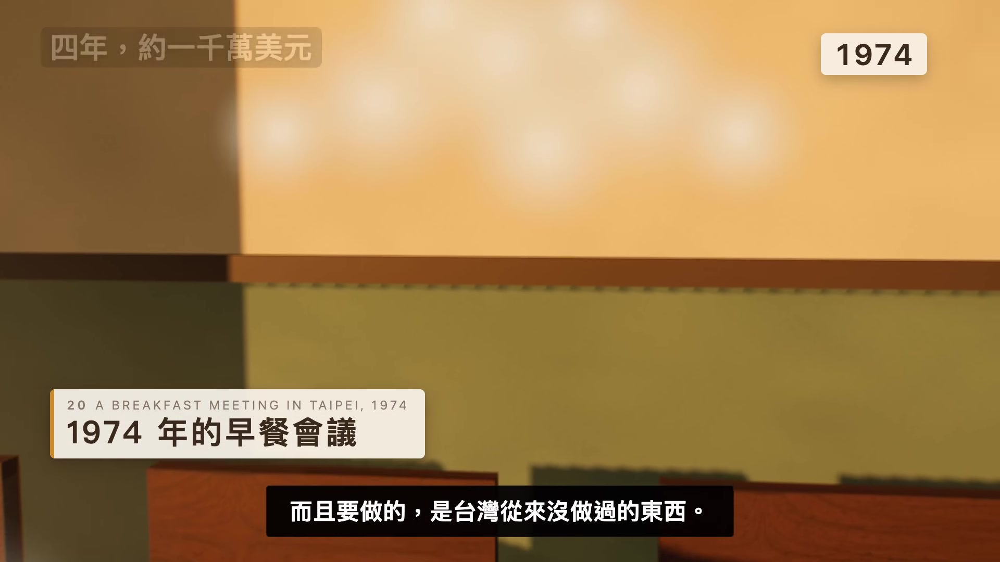

**逐字稿片段：** 計劃要做 得先找有經驗的公司來調 1976年3月 工業技術研究院 大家叫它工研院 跟美國的RCA簽了技術移轉合約 RCA答應 把一套做機體電路的技術交給臺灣 這套技術做出來的線寬是7維米 大概是一根頭髮粗細的十分之一 那在當時已經不是最先進的 美國最前面的工廠 已經做得更細了 可是對一個從零開始的地方 先學會穩穩的做 比做的最細更重要

**話題推測：** 工研院與RCA簽署技術移轉合約

---

## 00:17:21

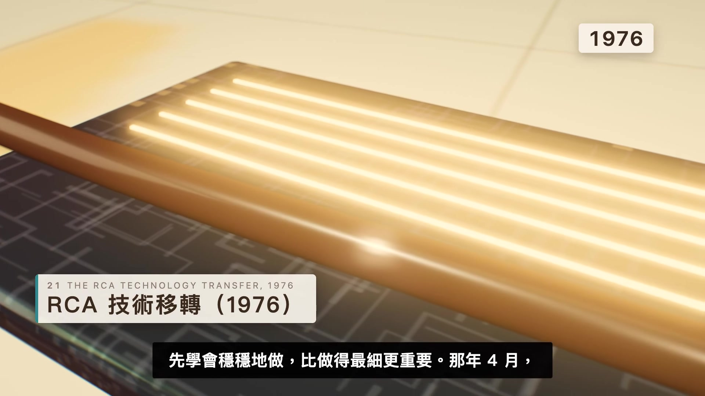

**逐字稿片段：** 那一年4月 第一批19個臺灣的年輕工程師 飛到美國的RCA受訓 帶隊的是楊丁元 裡面有史青泰 曾凡成 蔡明介 他們要把每一道步驟 都學會帶回臺灣 這一批人 後來很多都成了 臺灣半導體業的骨幹 曾凡成後來當上 臺積電的副董事長 蔡明介後來創辦了聯發科技 他們帶回來的 不只是一套技術 而是一種能力 知道一座晶圓廠 每一天要怎麼把它顧好 他們回來以後 工研院蓋了一座示範工廠

**話題推測：** 首批臺灣工程師赴美RCA受訓

---

## 00:17:48

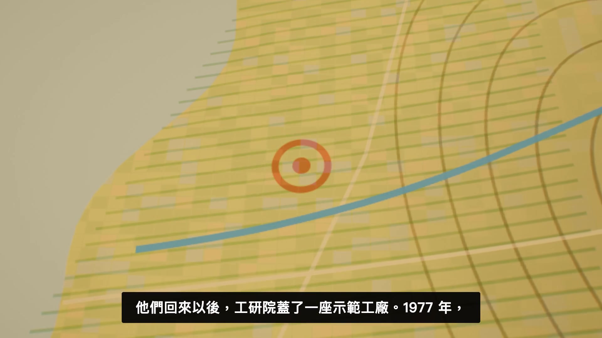

**逐字稿片段：** 1977年工廠開始運轉 工研院自己的記錄寫著 營運第六個月 良率就達到了七成 良率就是一片晶圓做完 能用的晶片佔多少 一群第一次做集體電路的 臺灣工程師 半年就把這件事做得很穩 有些說法還說 這個良率比 RCA自己的工廠還高 可是工廠的記錄只寫了七成 我們就講到這裡 這件事證明的是 臺灣的工程師 能在很短的時間裡 把一條產線的製造能力建立起來

**話題推測：** 工研院示範工廠良率快速提升

---

## 00:18:12

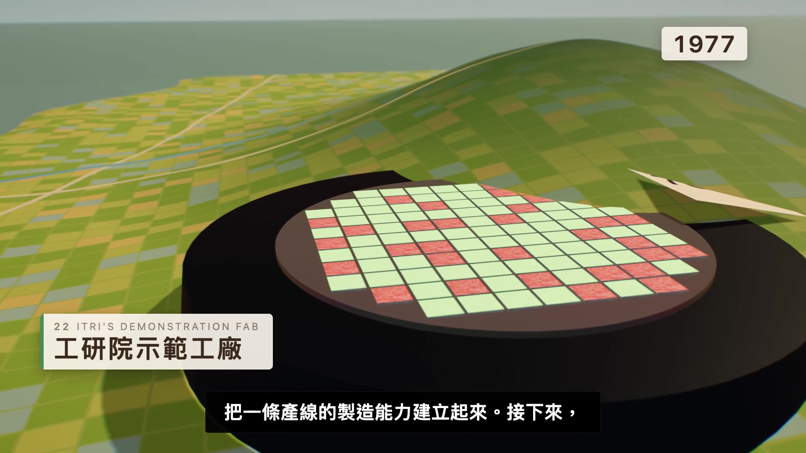

**逐字稿片段：** 接下來政府做了兩件事 1980年 工研院把這套技術跟一部分的人 分出去成立一家公司 叫蓮花電子 大家叫它蓮電 這是臺灣第一家集體電路公司 同一年的12月 新竹科學工業園區成立 蓮電是最早搬進去的公司之一 可是蓮電在那時候 跟全世界其他晶片公司一樣 自己設計 自己製造 自己賣 那種只專心幫別人制造的公司 還沒有出現

**話題推測：** 聯華電子（UMC）成立與新竹科學園區設立

---

## 00:18:35

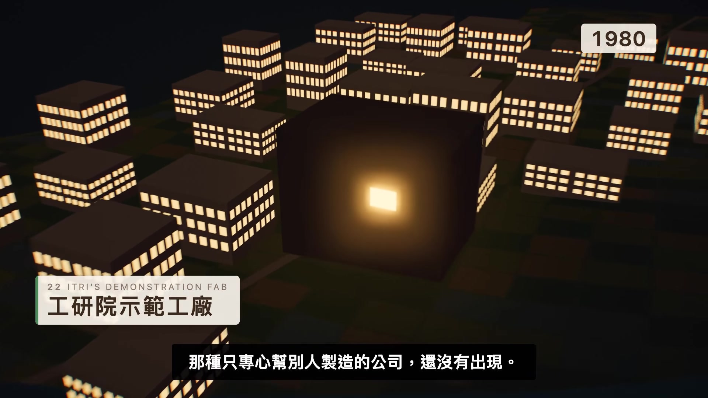

**逐字稿片段：** 1985年 一個人從美國來到臺灣 接下工研院院長的位置 他叫張忠謀 張忠謀在美國讀書 拿到史丹佛大學的博士 他在德州儀器公司待了25年 一路做到負責全球半導體業務的主管 後來又去一家叫General Instruments的公司當總裁

**話題推測：** 張忠謀回臺灣接任工研院院長

---

## 00:18:51

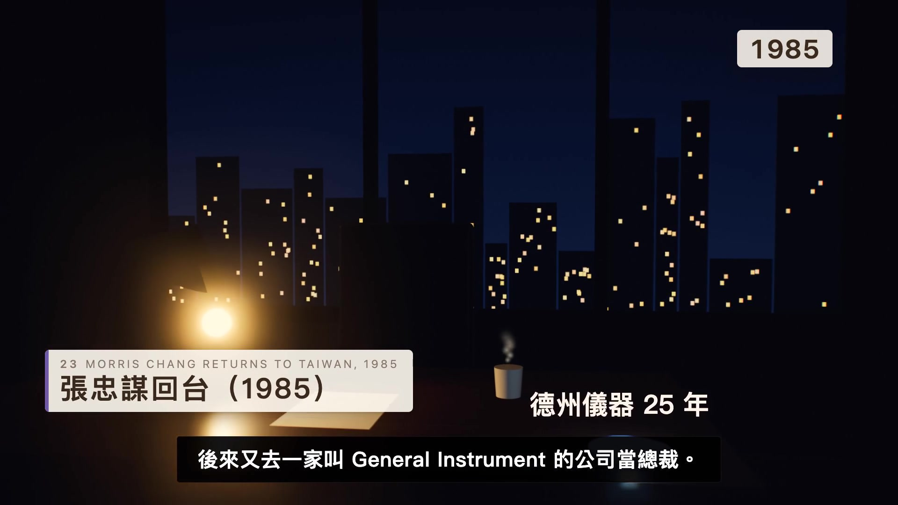

**逐字稿片段：** 請他回臺灣的 是孫運璇 他到臺灣才幾個禮拜 當時的政務委員李國鼎就把他找去 張忠謀在電腦歷史博物館的口述訪談裡回憶 李國鼎對他說 你看起來很適合在臺灣開一家新公司 給我們一份營運計劃 張忠謀後來說過一句話 沒有李國鼎就沒有臺積電 那時候他已經50多歲 在很多人開始想退休的年紀 他要回答一個問題 臺灣能開一傢什麼樣的晶片公司

**話題推測：** 李國鼎與孫運璇邀請張忠謀協助發展

---

## 00:19:14

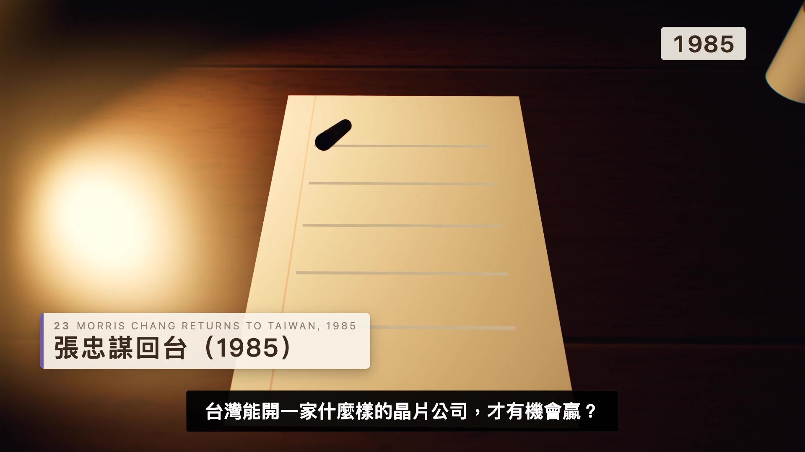

**逐字稿片段：** 才有機會贏 張忠謀的答案來自一張很誠實的清單 他在口述訪談裡說 當時的臺灣研究開發沒有優勢 電路設計沒有優勢 銷售跟行銷也沒什麼優勢 智慧財產權幾乎也沒有 唯一可能的優勢 而且只是可能不是明擺著的 是半導體製造 你回想一下公園院那座示範工廠 半年就把良率做到七成 臺灣最有機會的地方 就是把一條產線顧好 然後他把這一點 對上前面講的那個需求 全世界越來越多人會設計晶片 卻蓋不起工廠 有工廠的 大多是自己賣晶片的大公司 那如果臺灣開一家公司 不設計也不賣自己的晶片 只幫別人製造呢

**話題推測：** 張忠謀分析臺灣半導體優勢：製造

---

## 00:19:49

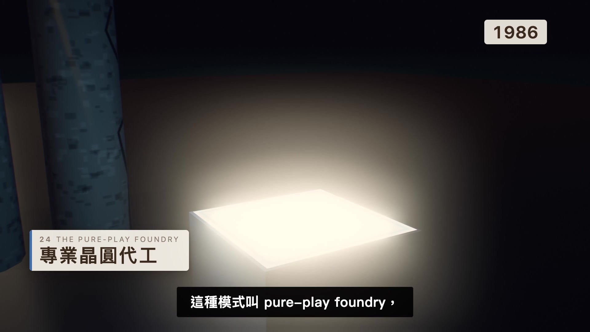

**逐字稿片段：** 這種模式叫Pure Play Foundry 中文叫專業晶圓代工 張忠謀的自傳寫著 他花了大約兩個禮拜 把這份營運計畫寫出來 他在訪談裡還用了一個很老實的說法 你也可以叫他最不壞的那個選擇 意思是在幾個都不理想的選項裡 壞處最少的那一個 他從臺灣的限制出發 找到的是一門當時全世界還沒有人專心做的生意

**話題推測：** 提出專業晶圓代工（Pure Play Foundry）商業模式

---

## 00:20:09

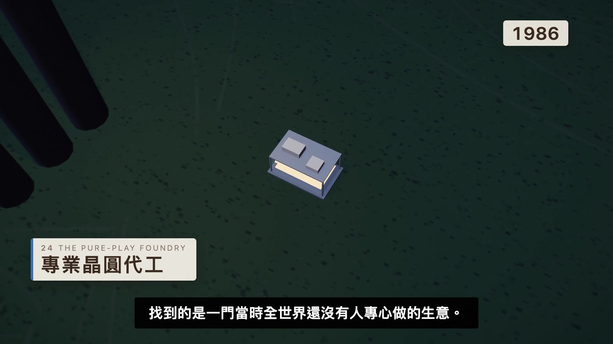

**逐字稿片段：** 1987年1月 臺灣機體電路製造公司成立 大家叫它臺積電 那一年張忠謀55歲 最大的股東是行政院開發基金 第二大的是荷蘭的菲利普 第一座工廠是跟工研院租來的 張忠謀自己說 那時候的技術比世界最前面落後了兩個半世代 外面的反應很冷淡 很多人的第一個反應是 臺灣到底在搞什麼 可是這家公司有一個承諾 它在年報裡寫著 公司本身不設計 不生產 也不銷售自由品牌的產品 確保不跟客戶直接競爭 你把這句話放回前面那個問題 就知道它有多重 一顆晶片的設計 是一家公司最值錢的東西 臺積電說的是 我只幫你製造 你的設計在我這裡 不會變成我的產品 這種承諾靠一句話不夠 要靠很多年不破例 客戶才會相信 一開始願意下單的反而是自己有工廠的大公司 像英特爾、德州儀器、摩托羅拉 張忠謀回憶、英特爾派人來看工廠 挑出了很多問題 臺積電一個一個改 信任 是這樣一張訂單一張訂單累積出來 臺積電在新竹慢慢站穩的那幾年 世界上桌上的電腦越來越多 下一件事是把他們連起來

**話題推測：** 臺灣積體電路製造公司（TSMC）成立

---

## 00:21:10

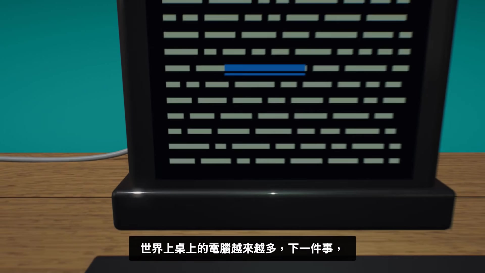

**逐字稿片段：** 1989年3月 在歐洲的核子研究組織Seren 一位英國的研究員Tim Berners-Lee寫了一份提案 他想讓擅在各地的研究者 可以用一種簡單的方法 互相看到彼此的文件 這個想法 後來叫World Wide Web 中文叫全球資訊網 也就是我們今天說的網頁 1990年第一個網站 在Cern的一臺電腦上跑了起來 1991年 他把這套軟體公開給外面的人 你今天點開的每一個連結 都建立在這個發明上 這一步的主角是軟體 可是還能普及到全世界 是因為接上網的每一臺電腦 每一臺伺服器 每一臺路由器裡面 都有越來越便宜的晶片 伺服器 就是放在機房裡 專門把網頁送給你的電腦 電腦從一個人的東西 變成了一群人連在一起的東西

**話題推測：** 全球資訊網（World Wide Web）誕生

---

## 00:21:52

**逐字稿片段：** 1990年代 越來越多沒有工廠的晶片公司 把設計交給臺積電 其中一家很小的公司 叫NVIDIA 做的是處理畫面的圖形晶片 張忠謀自己講過這段故事 NVIDIA打電話到臺積電 在美國的辦公室 一直沒有人回 創辦人黃仁勳就寫了一封信給他 張忠謀多多信自己打電話過去說 我是臺積電的張忠謀 我要找黃仁勳先生

**話題推測：** NVIDIA與臺積電的合作關係

---

## 00:22:12

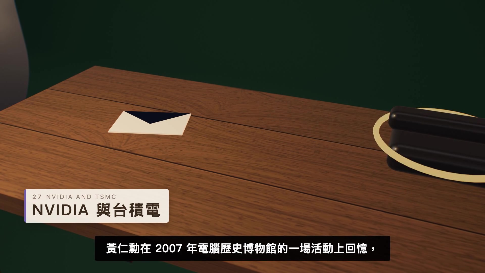

**逐字稿片段：** 黃仁勳在2007年 電腦歷史博物館的一場活動上回憶 1997年他們見面的時候 NVIDIA只有大約100個人 隔年就開始跟臺積電合作 他還記得張忠謀對他說過 我們會為你全力以赴 這家當年的小公司 後來做出了今天訓練人工智慧 最重要的那些晶片 而那些晶片到今天還是由臺積電製造 這個故事好聽的地方 不是誰幫了誰 而是他剛好示範了那個模式 一家只會設計的小公司 不用蓋工廠 也能做出世界級的晶片 而愛越成功 臺積電的產線就越猛 NVIDIA只是其中一家 臺積電成立以後的20年 沒有工廠的晶片公司 一家一家成立 做手機晶片的 做網路晶片的 做繪圖晶片的 很多都把製造交給了新竹 這裡有一個很重要的機制 臺積電做的晶元越多 在製程上碰到的狀況也越多 沒解決一個問題 累積下來的是製程 設備跟品質管理上的改進 這些改進 可以用在後面的產品上 要注意 這裡累積的不是客戶的設計 客戶的設計仍然是客戶自己 產量越大 工程師看過的狀況越多 良率就比較有機會往上走 良率上去 每一顆好晶片的成本就往下降 交貨也更穩定 價格最後由市場決定 可是成本比較低 交貨比較穩 客戶就更願意來 客戶多了產量又更大 這個循環一旦轉起來 後面的公司要追 又得付出很大的代價 臺積電累積的是來自很多客戶 很多種產品的製造經驗 這是專業晶元代工最大的好處之一 接下來晶片要走進口袋 手機靠電池 所以晶片不只要快 還要省電

**話題推測：** 黃仁勳與張忠謀會面，NVIDIA與臺積電開始合作

---

## 00:23:36

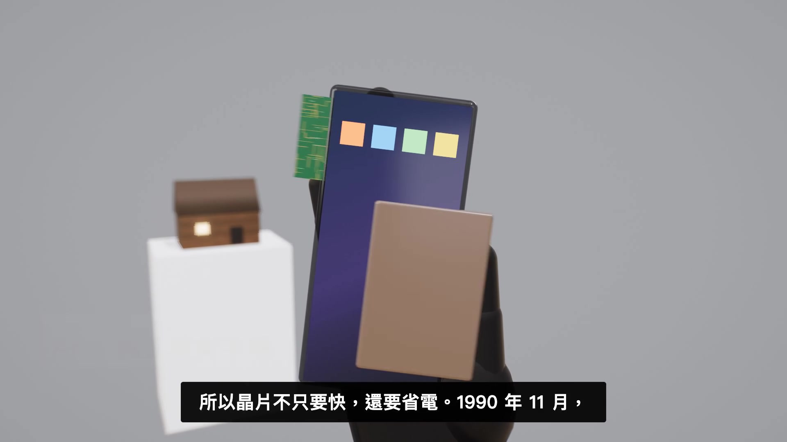

**逐字稿片段：** 1990年11月 在英國劍橋郡的一間舊股倉裡 一家叫ARM的公司成立了 它是由ACON電腦 Apple和VLSI Technology一起出資的 ARM不自己製造晶片 它設計一種很省電的處理器架構 在授權給別的公司去用 處理器架構 就是一顆處理器聽得懂的那一套基本指令 ARM自己的說法是 今天全世界超過99%的智慧型手機 都用它的技術

**話題推測：** ARM Holdings成立，專注於低功耗處理器架構設計

---

## 00:23:58

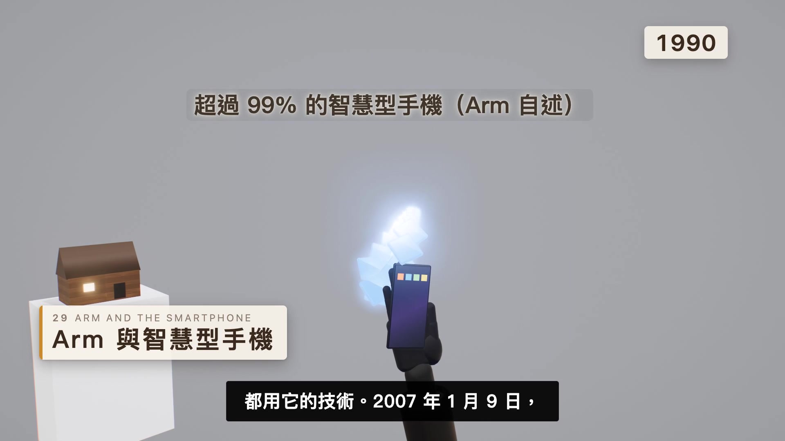

**逐字稿片段：** 2007年1月9日 Apple發表了iPhone 把手機音樂播放器 上網的工具 放進了同一隻手機裡 手機從打電話的工具 變成一臺放在口袋裡的電腦 國際電信聯盟 2024年的統計是 全世界10歲以上的人 5個人裡 有4個有自己的手機 80年前 一臺電腦佔滿一個房間 現在 它在大多數人的口袋裡

**話題推測：** Apple發表第一代iPhone

---

## 00:24:19

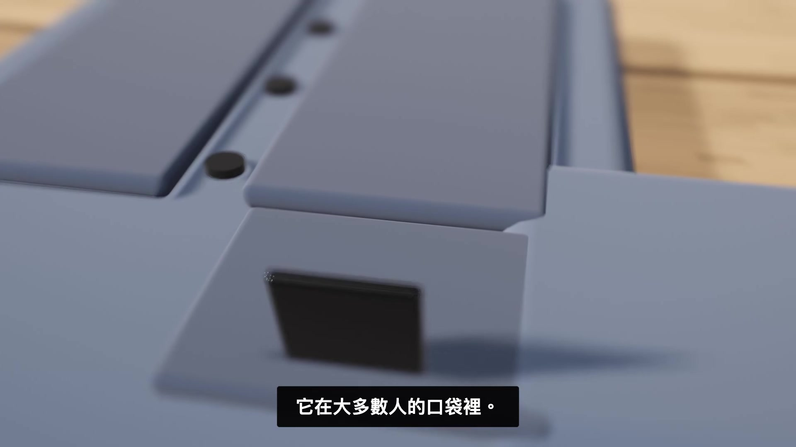

**逐字稿片段：** 我們再停一下 把第一部分收起來 線越做越細 晶片越來越便宜 電腦走上書桌 網路把他們連起來 手機放進了口袋 可是工廠也越來越貴 做得起的人越來越少 設計跟製造分開以後 臺灣補上了專心幫別人製造的那一塊 記住這一句 晶片越便宜 走進生活的東西越多 背後的工廠卻越來越難蓋 到了這裡 一片先進的晶片 已經不是一個國家做得出來的了

**話題推測：** 第二部分總結：摩爾定律推動下的個人電腦與移動時代

---

## 00:24:42

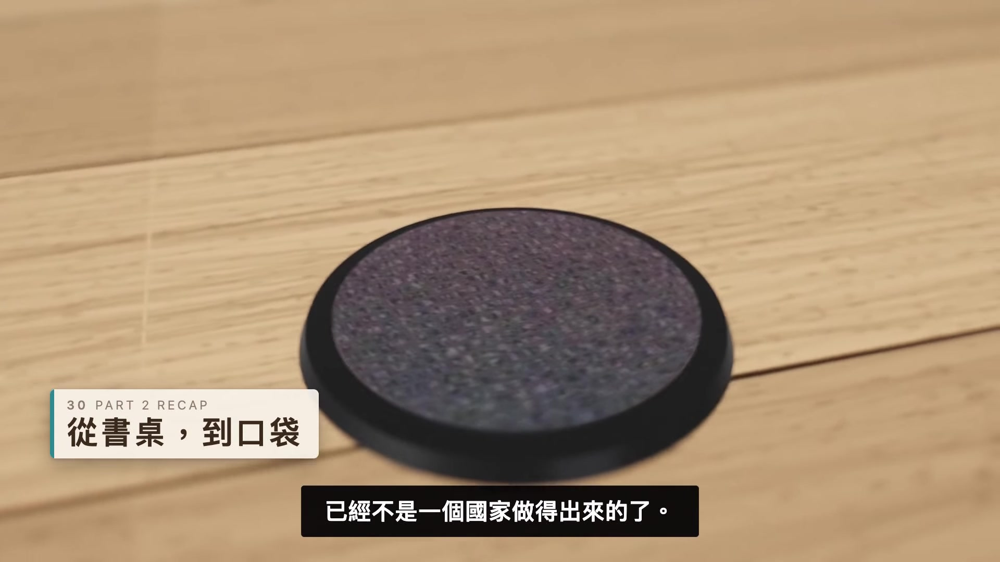

**逐字稿片段：** 可是到了2000年代 開關本身出了問題 德納德說放縮的那種好處 大約在2005年前後開始失效 電壓沒辦法照比例往下降 電晶體縮得太小 就算關起來 電還是會從底下偷偷漏過去 一個關不緊的開關 會一直漏電一直發熱

**話題推測：** Dennard Scaling失效，電晶體技術遭遇瓶頸

---

## 00:24:57

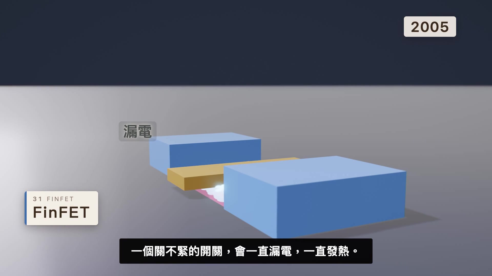

**逐字稿片段：** 有一個重要的解法 來自一位在臺灣長大的工程師 胡正明他在加州大學博克萊分校的團隊 在1999年發表了一種新結構 叫FinFET 中文叫騎士電晶體 以前的電晶體是平的 控制開關的那一層叫雜極 只從上面壓著電流的通道 FinFET把通道立起來 像一片魚鰭 雜極從三面把它包住 開關就更容易關緊 他沒有讓疊壓噪比例下降的那段日子回來 可是他讓電晶體可以繼續往下縮 漏電也控制得住 胡正明在2001年到1004年 擔任臺積電的第一任技術長 Intel最早把這種立體電晶體用進量產的產品 臺積電在2015年開始量產 16nm的FinFET 在製程持續演進的同時 臺積電也碰上了一個很大的客戶 你口袋裡如果是iPhone 裡面那顆主晶片 是Apple自己設計的 叫A系列 早期A系列是由誰製造 用的是哪一種製程 外界的資訊主要來自第三方的晶片分析公司 他們會把手機打開來看

**話題推測：** 胡正明教授團隊發明FinFET（鰭式電晶體）

---

## 00:25:51

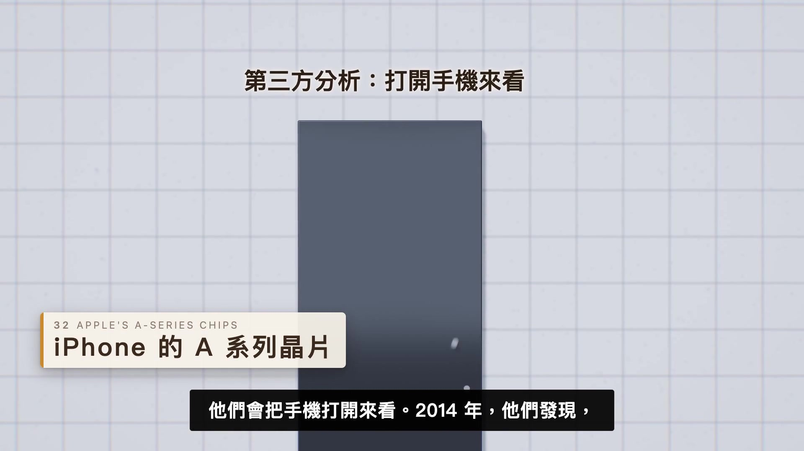

**逐字稿片段：** 2014年 他們發現 iPhone 6的A8晶片 是臺積電用20nm製造的 在那之前 目前Apple的主晶片主要是三星製造的

**話題推測：** 臺積電成功拿下Apple A8晶片訂單

---

## 00:26:00

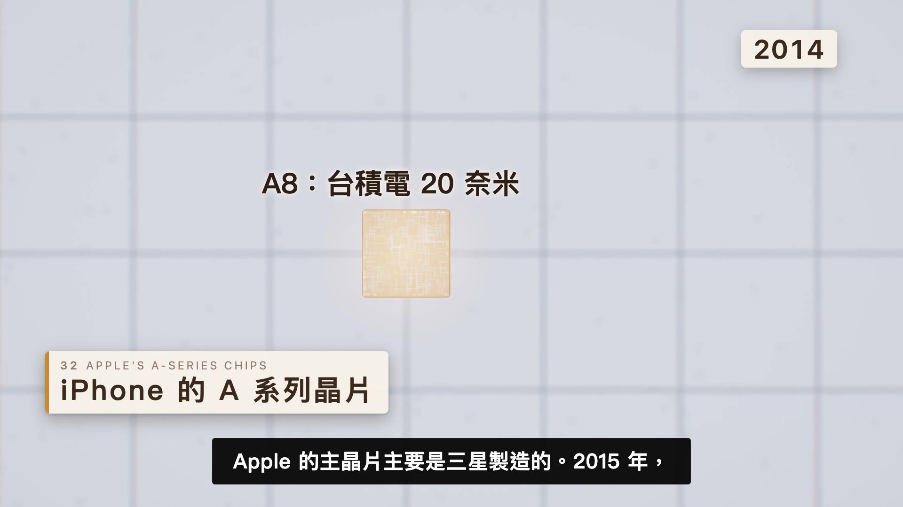

**逐字稿片段：** 2015年 A9晶片由三星跟臺積電兩家分著生產 從2016年的A10開始 分析顯示都有臺積電生產 一般認為 臺積電一種新的封裝技術 也就是把晶片包起來接到外面的方法 是他拿下訂單的原因之一 這件事 對整個故事的意義在於數量 每一年上億隻手機 意思是臺積電每一年 都要在最新的那一代製程上 做出非常大量的晶片 前面說的那個循環 在最新的製程上 轉得最快 電晶體越做越小 圖案就得越畫越細 眉影能畫出多細的線 受到光的波長限制 圖案很難比光的波長細太多

**話題推測：** Apple晶片訂單從三星轉向臺積電

---

## 00:26:33

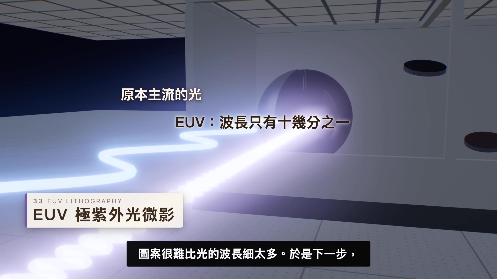

**逐字稿片段：** 於是下一步 換了一種光叫EUV 中文叫極紫外光 它的波長 只有原本主流那種光的十幾分之一 這種光很難產生 荷蘭的SML公司這樣描述的 一顆一顆很小的錫滴 從噴嘴裡射出來 先被一道雷射打扁 再被一道更強的雷射打成電漿 電漿發出的 就是極紫外光 這個過程 每秒要重複五萬次 這種光也很難控制 它會被一般的鏡片吸收掉 所以機器裡的鏡頭 換成了一面一面多層的反射鏡 連光照都改成會反射的 那些反射鏡 由德國的蔡司獨家供應 ASML自己說 它是今天全世界 唯一做得出這種機器的公司 機器裡還要搭配 土光組跟顯影的設備 這一塊 日本的東京威力科創

**話題推測：** 引入極紫外光（EUV）微影技術

---

## 00:27:15

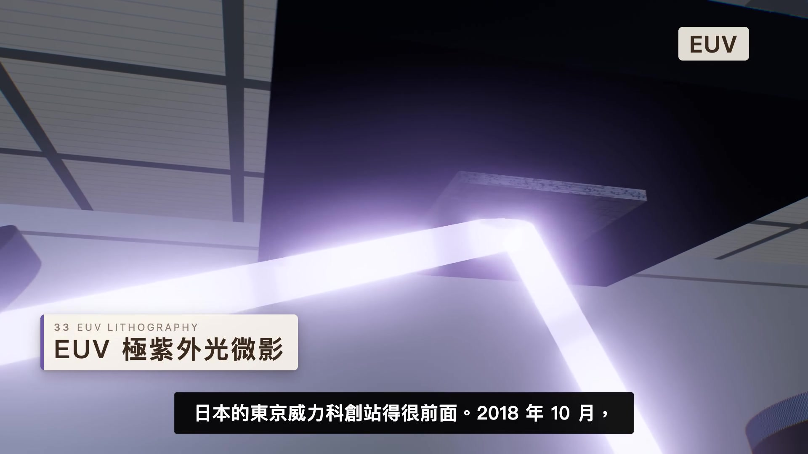

**逐字稿片段：** 佔得很前面 2018年10月 韓國的三星宣佈 開始用極紫外光生產晶圓 2019年 臺積電的N7 Plus 製成也用上了極紫外光 進入大量生產 一臺荷蘭的機器 裝著德國的鏡子 配著日本的設備 放進臺灣跟韓國的工廠

**話題推測：** 三星與臺積電陸續採用EUV技術量產

---

## 00:27:31

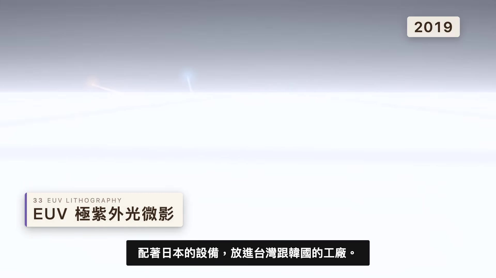

**逐字稿片段：** 同一段時間 曾經長期領先製程的Intel 卻卡住了 Intel跟臺積電不一樣 它主要是替自己製造晶片 它的10奈米制程 原本計劃在2016年前後量產 2018年它只能先少量出貨 到了2019年 才有比較大規模的產品上市 2020年7月 Intel又宣佈 下一代要再延後 良率比那一波的目標 落後了大約一年 這件事的影響有兩層 一層是Intel自己的產品 製程慢了 就比較難跟對手比 另一層是 他的對手 那些把製造交給 外面先進製程的公司 得到了追上來的機會 到了2026年初 Intel退出了 用自家18A 自己乘坐的處理器 他還在往前追

**話題推測：** Intel在先進製程上遭遇延遲

---

## 00:28:09

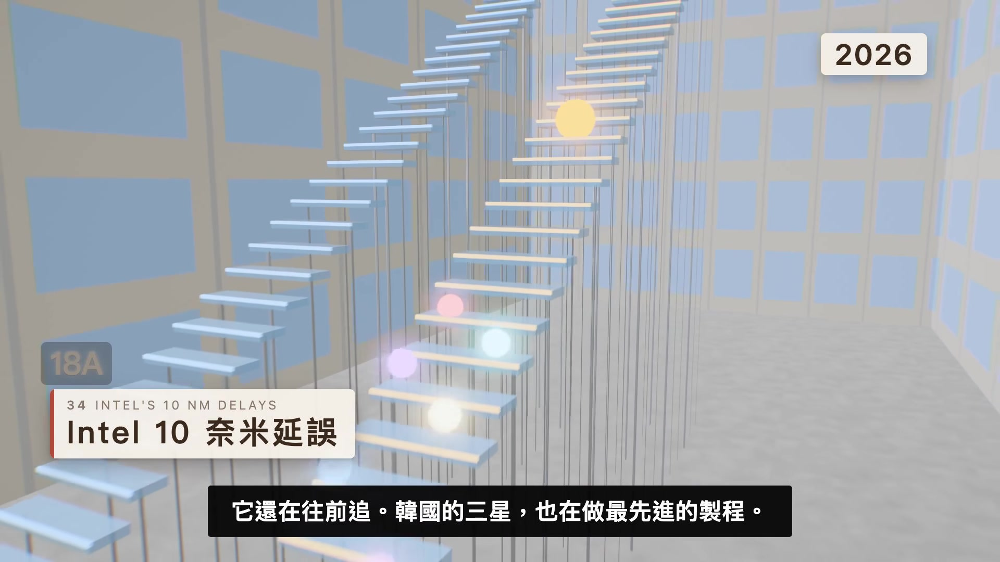

**逐字稿片段：** 韓國的三星 也在做最先進的製程 於2022年 他比臺積電更早量產 下一代的電晶體結構 可是2024年 他的主管公開道歉 說公司讓外界擔心 他的技術競爭力 在先進的製程上 沒有誰一直站在最前面

**話題推測：** 三星在先進製程上面臨挑戰

---

## 00:28:23

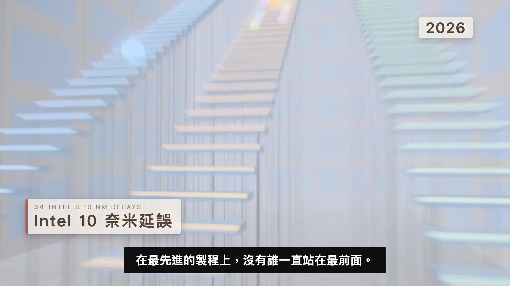

**逐字稿片段：** 想到這裡你可能一直在想一件事 三奈米一奈米到底是什麼東西的大小 答案可能跟你想的不一樣 它已經不是任何一個東西的大小了 早期的製程名稱 大致對得上電晶體上某個部分的長度 可是大約從20年前開始 名字跟實際的尺寸就分開了 AEEE Spectrum在2020年寫過 7奈米電晶體上大部分關鍵的尺寸 其實都比7奈米大得多 當時臺積電研究部門的副總裁黃漢森 2019年在一場演講裡說得更直接 今天這些數字就只是數字 就像車子的型號 像BMW5系列 或者Mazda6 所以e奈米 比較像一個世代的名字 意思是比上一代 同樣的面積 能放下更多開關 也更省電

**話題推測：** 解釋奈米製程名稱與實際尺寸的脫鉤

---

## 00:29:01

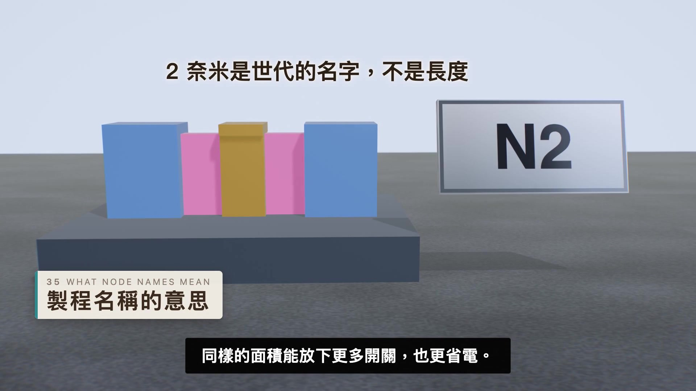

**逐字稿片段：** 臺積電的e奈米 已經在2025年 第四季開始量產 電競體的結構 又換了一次 從一片魚鰭 變成幾片疊起來的 奈米薄片 雜集從四面 把通道包住 開關又更容易關緊了 把一片先進晶片的來歷 攤開來看 你會發現 它從來不是一個地方 做得出來的

**話題推測：** 臺積電1奈米製程將採用GAA（環繞閘極）電晶體結構

---

## 00:29:19

**逐字稿片段：** 這種跨很多公司 很多國家的分工 叫供應鏈 大概可以分成三塊 頭一塊是設計跟軟體 設計晶片的公司 像NVIDIA Apple Qualcomm 很多在美國 設計晶片要用一種專門的軟體 叫EDA 中文叫電子設計自動化 這一塊 美國的公司也站得很前面 再來一塊是機器跟材料 荷蘭的曝光機 德國的鏡子 日本的材料跟設備 還有美國的其他機臺 最後一塊是製造 最先進的邏輯晶片 有很大一部分在臺灣製造 韓國站了很前面 把晶片包起來測試好 很多在亞洲其他地方完成 一片晶片 前前後後要經過幾百道 甚至上千道製程步驟 美國半導體產業協會寫過一個例子 單單一家美國的半導體公司 全世界的供應商就超過一萬六千家 一片晶片是一整條供應鏈一起做出來的 這條供應鏈平常看不見 直到有一天它卡住了

**話題推測：** 晶片全球供應鏈的三大組成部分

---

## 00:30:09

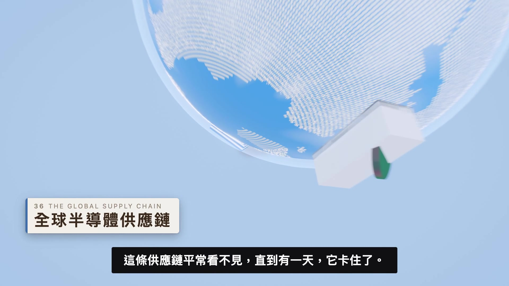

**逐字稿片段：** 2020年 疫情讓全世界的人留在家裡 大家買電腦 買螢幕 買遊戲機 晶片的需求一下子往上衝

**話題推測：** 2020-2021年全球晶片短缺現象

---

## 00:30:17

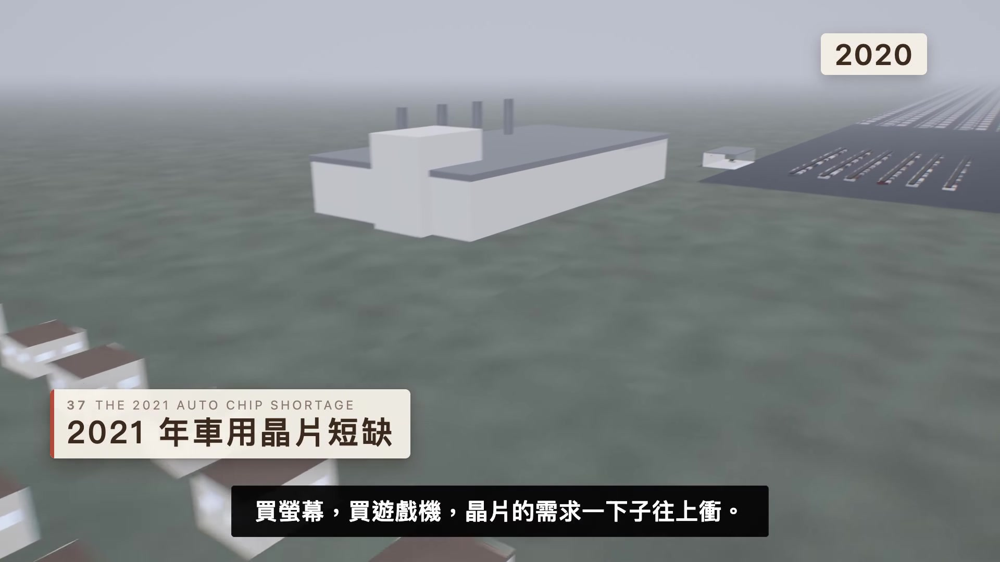

**逐字稿片段：** 到了2021年缺晶片的問題 落到了一個很多人沒想到的地方 汽車 一臺現代的汽車裡有很多顆晶片 控制引擎 剎車 車窗 還有儀表板 它們很多不是最先進的晶片 可是隻要少一顆 整臺車就交不了

**話題推測：** 汽車產業因晶片短缺而減產

---

## 00:30:31

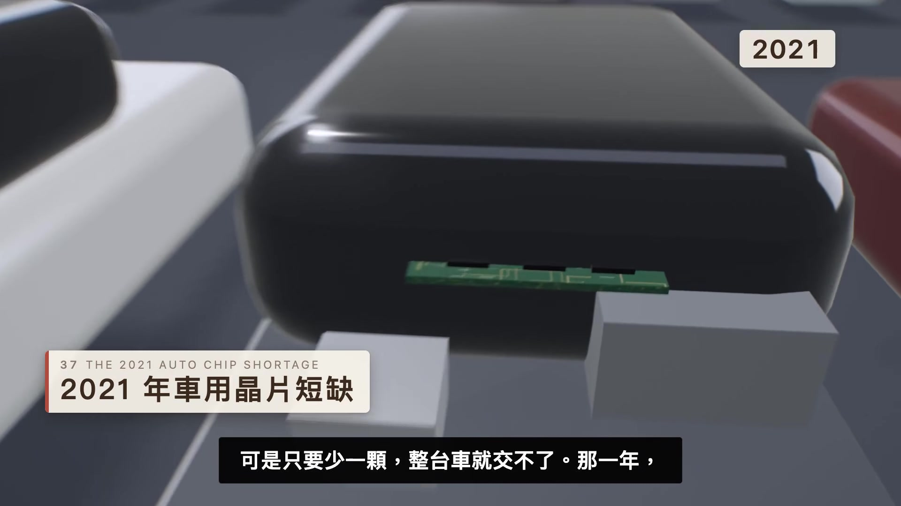

**逐字稿片段：** 那一年 世界各地都有汽車工廠 因為等不到晶片而減產 顧問公司Alex Partners 在2021年9月預估 這一年全世界的汽車業 會因此少生產大約770萬輛車 很多人第一次感覺到晶片 不是在新聞上 而是在車行裡 業務員說你要的那臺車要等好幾個月 這件事讓大家看清楚一件事 晶片不只在手機跟電腦裡 它藏在生活的每個角落 而供應鏈只要一個地方卡住 影響就會傳到很遠的地方 晶片改變的 不只是我們手上的東西 也改變了科學家看世界的方式

**話題推測：** 2021年汽車減產770萬輛的預估數據

---

## 00:31:03

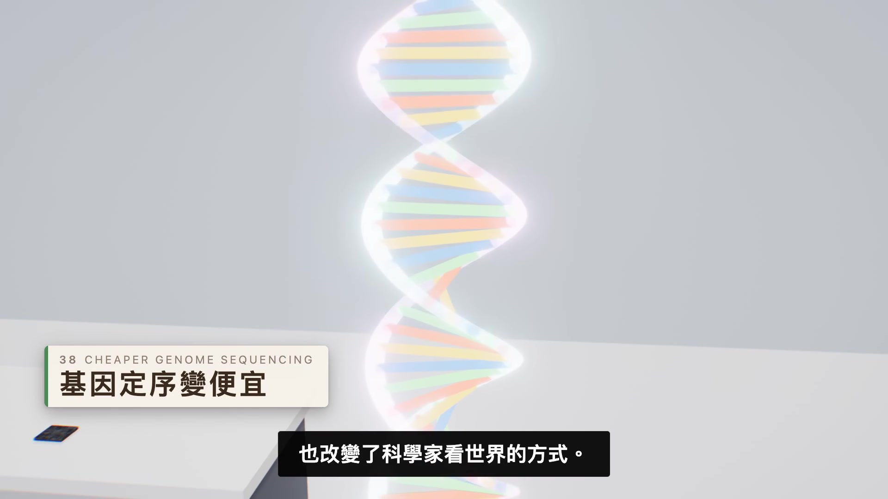

**逐字稿片段：** 我們身體的細胞裡 有一整套遺傳資訊叫Gnome 中文叫基因體 讀出一個人的基因體叫做定序

**話題推測：** 晶片對基因體定序成本的影響

---

## 00:31:09

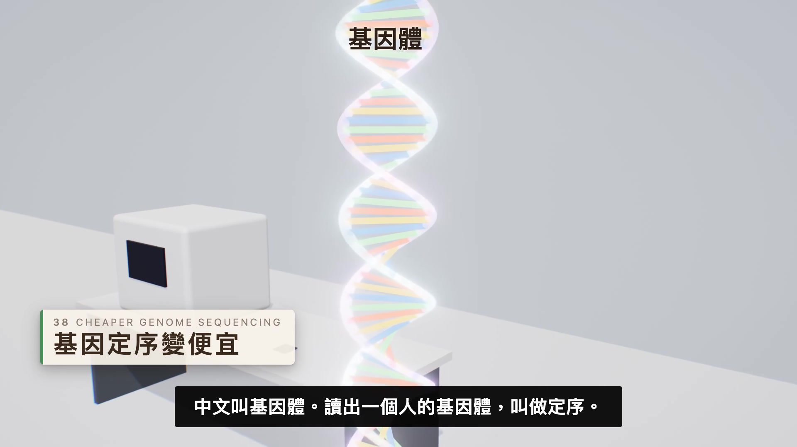

**逐字稿片段：** 美國國家人類基因體研究所的資料顯示 2001年讀出一個人的基因體 大約要花9500萬美元 到了2022年只要幾百美元 這條成本曲線 從2008年前後開始 降得比莫爾定律還快 主要的原因是新一代的定序技術本身 可是新一代的定序儀 一次會吐出非常大量的原始資料 要把這些資料整理成一個人的基因體 靠的是電腦也就是晶片 醫生今天可以更快找出一些罕見疾病的原因 科學家可以比較成千上萬個人的基因 背後都是定序成本一路往下降 晶片沒有自己去讀基因 可是他讓讀出來的東西算得動 也存得下

**話題推測：** 基因體定序成本從9500萬美元降至幾百美元

---

## 00:31:46

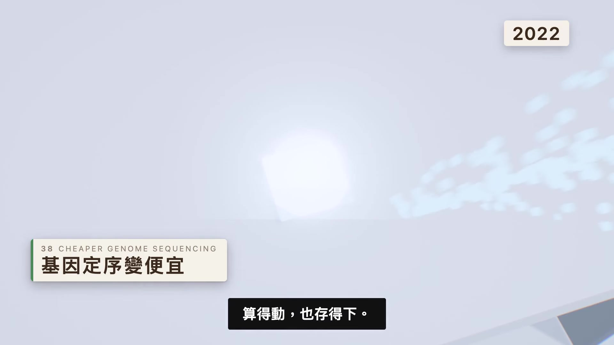

**逐字稿片段：** 2022年11月30日 ChatGPT上線 很多人第一次在一個數目框裡打字 機器用完整的句子回答 Microsoft說 他替OpenAI在ASUS上蓋了一臺超級電腦 用了好幾千顆NVIDIA的GPU

**話題推測：** ChatGPT上線，人工智慧進入大眾視野

---

## 00:32:00

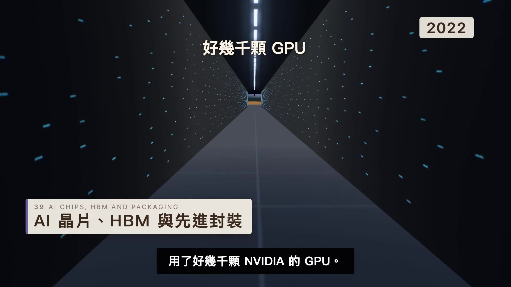

**逐字稿片段：** 今天NVIDIA最新一代的Blackwell GPU 是兩片晶片接在一起 一共有2081個電晶體由臺積電製造 你還記得1971年那顆4004嗎 2300個 50多年 大約多了9000萬倍

**話題推測：** NVIDIA Blackwell GPU的電晶體數量與Intel 4004對比（約2080億個電晶體）

---

## 00:32:12

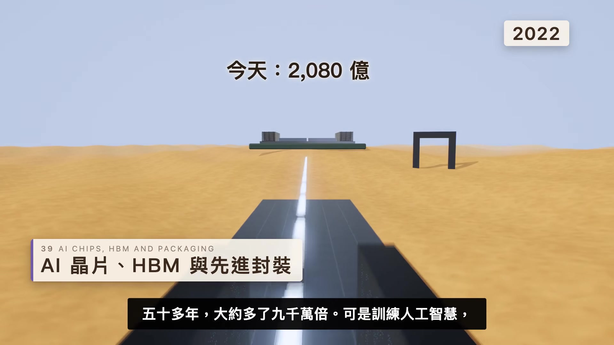

**逐字稿片段：** 可是訓練人工智慧 光有算得快的晶片還不夠 資料要能很快送進去 這就需要一種記憶體 叫HBM 中文叫高頻寬記憶體 他把好幾片記憶體晶片疊起來 中間用很細的垂直連線穿過去 這一塊 韓國的SK Hynix跟三星站在最前面

**話題推測：** 高頻寬記憶體（HBM）在AI晶片中的應用

---

## 00:32:28

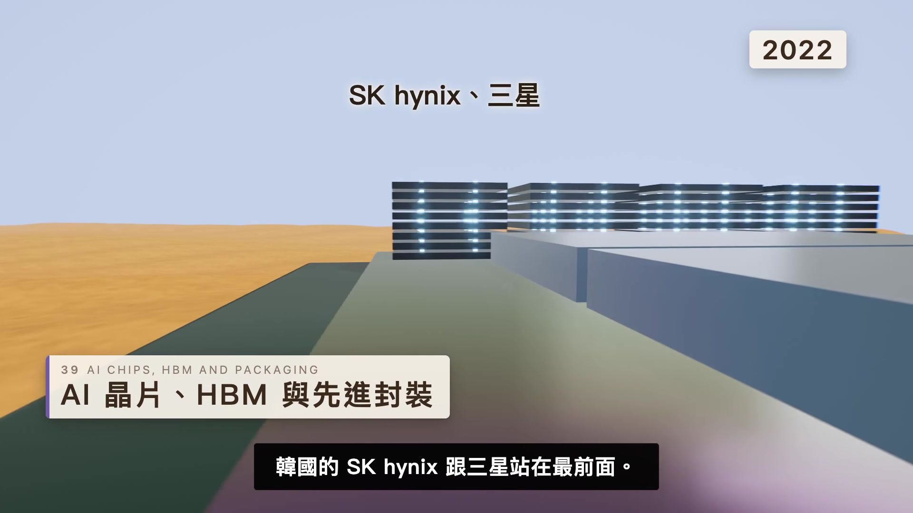

**逐字稿片段：** 運算晶片跟記憶體 還要緊緊放在一起 臺積電有一種先進封裝 叫Sowars 他把運算晶片和一疊一疊的記憶體 並排放在同一塊錫底板上 用很密的線連起來 臺積電的執行長魏哲嘉 在2024年說過 產能很緊 今天限制人工智慧晶片產量的 不只是晶片本身 還有把它們接在一起的封裝 這條供應鏈 也開始受到國家政策的影響

**話題推測：** 臺積電先進封裝技術CoWoS

---

## 00:32:51

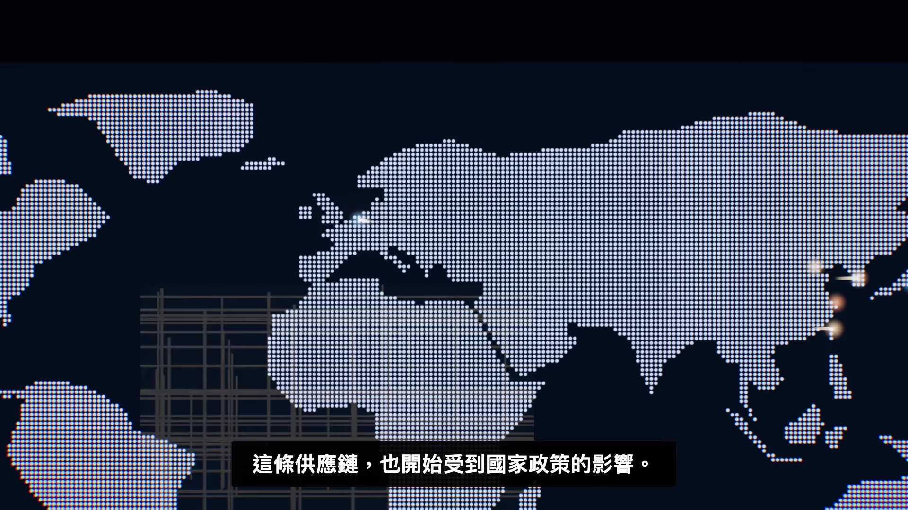

**逐字稿片段：** 2022年10月7日 美國商務部宣佈新的出口管制 限制先進的運算晶片 還有製造晶片的設備 出口到中國 出口管制就是政府規定 哪些東西賣到哪裡 需要先取得許可 2023年 荷蘭跟日本也陸續堆一些 一些晶片製造設備加上管制 2024年12月 美國在把高頻寬記憶體 也放進管制範圍

**話題推測：** 美國對先進晶片及設備的出口管制

---

## 00:33:11

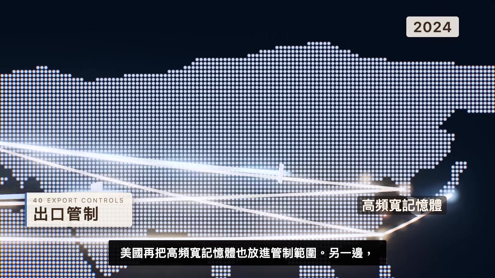

**逐字稿片段：** 另一邊中國也在往前走 2023年 分析公司Tech Insights 打開一隻華為手機 發現裡面的處理器 是中國的中興國際 用7奈米等級的製程做的 而且沒有用極紫外光的機器 這些規則 這幾年一直在調整 有的收緊 有的放寬 每一條都有它的日期 我們在這裡不猜結果 只記下一件事 晶片從設計到製造 要經過很多的國家 所以每一條新的規則 都會讓供應鏈的某一段跟著調整 所以各國開始把工廠往自己家附近蓋

**話題推測：** 中國在晶片製造上的進展（華為與中芯國際）

---

## 00:33:39

**逐字稿片段：** 2022年8月 美國通過了晶片與科學法案 用補助吸引工廠到美國

**話題推測：** 美國通過「晶片與科學法案」吸引工廠

---

## 00:33:44

**逐字稿片段：** 臺積電在美國亞利桑那州的第一座工廠 從2024年底開始量產 Apple在2025年公開說 臺積電亞利桑那廠 正在替他生產好幾千萬顆晶片 日本熊本有臺積電合資的工廠 做的主要是比較神熟的這層 日本的新公司Rapidus 2025年在北海道做出了 奈米電晶體的試作品 目標是2027年量產 歐洲在2023年通過了自己的晶片法案 德國德勒斯登的新工廠 也在2024年動工 講到集中 有兩個數字常常被混在一起 一個是產能在哪裡 2021年一份美國產業報告 估計2019年全世界 10奈米以下的最先進產能 9成2在臺灣 其他在韓國 這描述的是當時集中的程度 另一個是公司的市場位置 市場研究機構Trendforce統計 2026年第二季 全世界晶圓代工的營收 臺積電佔了七成以上 這裡面也包括他在海外工廠的營收 蓋一座新工廠要好幾年 製造正在慢慢分散到更多地方

**話題推測：** 臺積電亞利桑那廠開始量產

---

## 00:34:39

**逐字稿片段：** 我們回到開場那個問題 一片這麼小的戲 是怎麼改變我們每天的生活 80年來 同一件事 一次又一次發生 真空管換成電晶體 收音機走進了口袋 零件跟連線一起坐在戲上 計算機放上了書桌 電腦 跟著太空人上了月球 線越做越細 個人電腦走進家裡 網路把他們連在一起 手機放進了每個人的口袋 今天同樣的晶片 讓機器開始回答我們的問題 所以這集的答案是 開關每變小一次 每偏移一次 就有一件新的東西 走進普通人的生活

**話題推測：** 總結晶片80年演進的核心邏輯

---

## 00:35:09

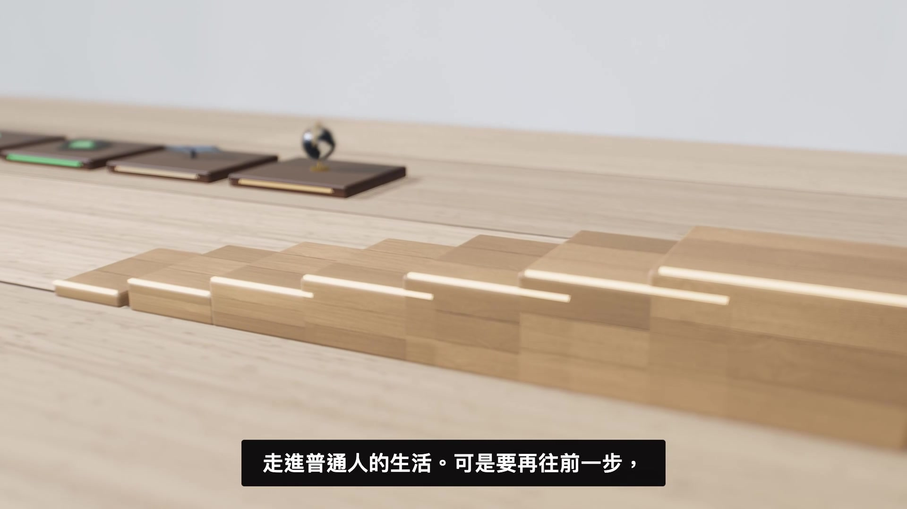

**逐字稿片段：** 可是要再往前一步 需要的人也越來越多 美國的設計 荷蘭的機器 德國的鏡子 日本的材料 韓國的記憶體 臺灣的工廠 還有中國 歐洲 東南亞 很多我們叫不出名字的供應商 這條供應鏈今天正在重新調整 工廠往更多地方蓋 規則也一直在變 對我們來說最實際的影響可能就是下一支手機 下一臺車 下一個人工智慧工具 會在什麼時候用什麼價錢來到我們手上 最後問你一個問題 在你的生活裡 是哪一樣電子產品讓你第一次覺得 日子真的被它改變了 留言告訴我 監視系列還會繼續 下一段歷史我們下一集再走 喜歡的話訂閱AI Notebook 開啟通知我們下次見

**話題推測：** 世界各國在晶片供應鏈中的角色

---
