# jimainotebook_ixw8pLpXtYs — 關鍵畫面索引

- 來源逐字稿：[jimainotebook_ixw8pLpXtYs_FIN.srt](jimainotebook_ixw8pLpXtYs_FIN.srt)
- 影片：https://www.youtube.com/watch?v=ixw8pLpXtYs
- 截圖數：56

## 00:00:13

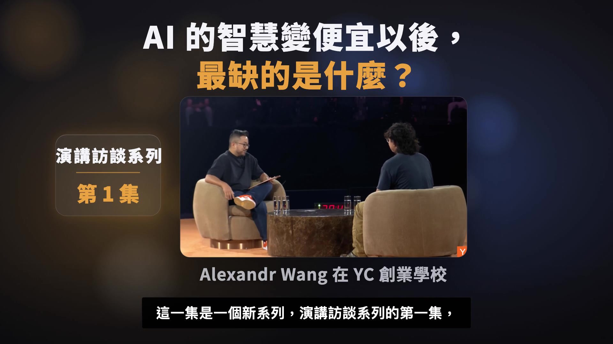

**逐字稿片段：** 主角是Alexander Wong,他19歲創辦Scale AI,現在在Meta帶領超級智慧實驗室。 今年夏天,他回到YC的創業回校,對著臺下一群18-20歲的年輕人說了一句很大的話。

**話題推測：** 介紹本集主角Alexander Wong的背景與主要成就

---

## 00:00:27

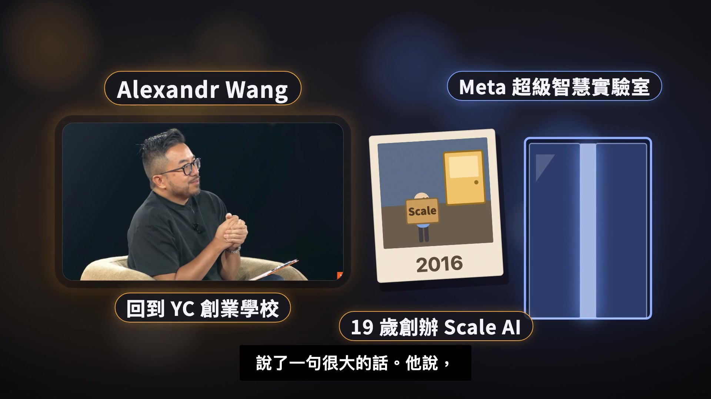

**逐字稿片段：** 他說,現在可能是一個文明只會遇到一次的機會。 這一集只問一個問題,這句話是真的嗎? 如果是真的,機會到底在哪裡?跟我們一般人又有什麼關係? 我先把答案放在前面。 他的意思是AI的智慧正在變成按一下就拿得到的東西 當智慧不再稀少 最缺的就變成知道要往哪裡走的人 這句話我覺得有一半站得住 另一半要打折 因為說這句話的人 正好在全世界花最多錢追趕AI的公司之一 負責這整件事

**話題推測：** Alexander Wong提出「文明只會遇到一次的機會」這一核心觀點

---

## 00:00:52

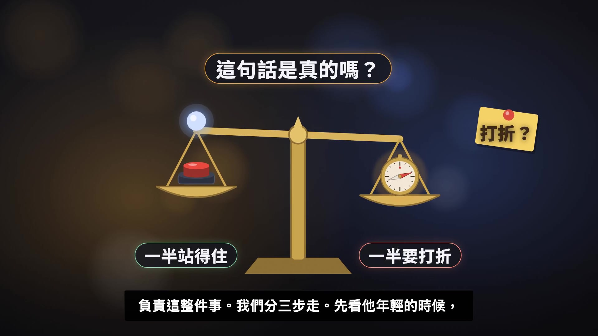

**逐字稿片段：** 我們分三步走 先看他年輕的時候怎麼看見別人沒看見的東西 再看他說的機會到底長什麼樣子 最後把他的身份放回來 看看這句話要打幾折 先從2016年一個19歲的大學生開始 先認識臺上的兩個人

**話題推測：** 影片將以三步驟拆解Alexander Wong的觀點

---

## 00:01:05

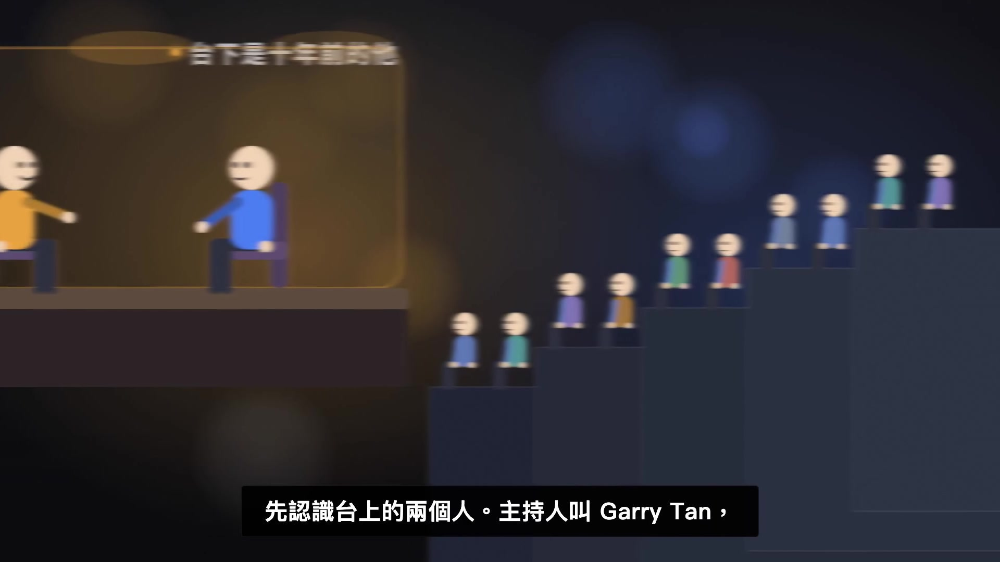

**逐字稿片段：** 主持人叫Gary Tan 他是Y Combinator的執行長 Y Combinator大家簡稱YC 是矽谷很有名的創業加速器 他做的事情很簡單 投一小筆錢給 剛起步的團隊 再陪他們走三個月 把產品做出來 Startup School 是YC辦的創業學校 臺下做的 大多是想創業的學生 跟年輕工程師 坐在Gary對面的

**話題推測：** 介紹主持人Gary Tan與Y Combinator (YC)的背景

---

## 00:01:25

**逐字稿片段：** 就是Alexander Wang 2016年夏天 他19歲 帶著一個點子進了YC 那家公司後來叫Scale AI

**話題推測：** 介紹19歲的Alexander Wang帶著點子進入YC的經歷

---

## 00:01:32

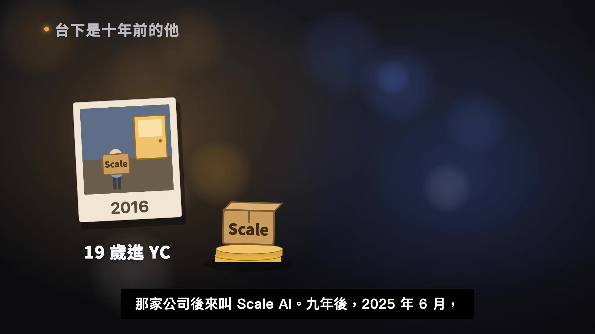

**逐字稿片段：** 9年後 2025年6月 Meta宣佈投資Scale AI 143億美元 買下將近一半的股份 同時把汪本人請進Meta 他的頭銜是首席AI長 帶領一個新成立的部門

**話題推測：** 闡述Meta對Scale AI的巨額投資與Alexander Wang在Meta擔任首席AI長的職位

---

## 00:01:43

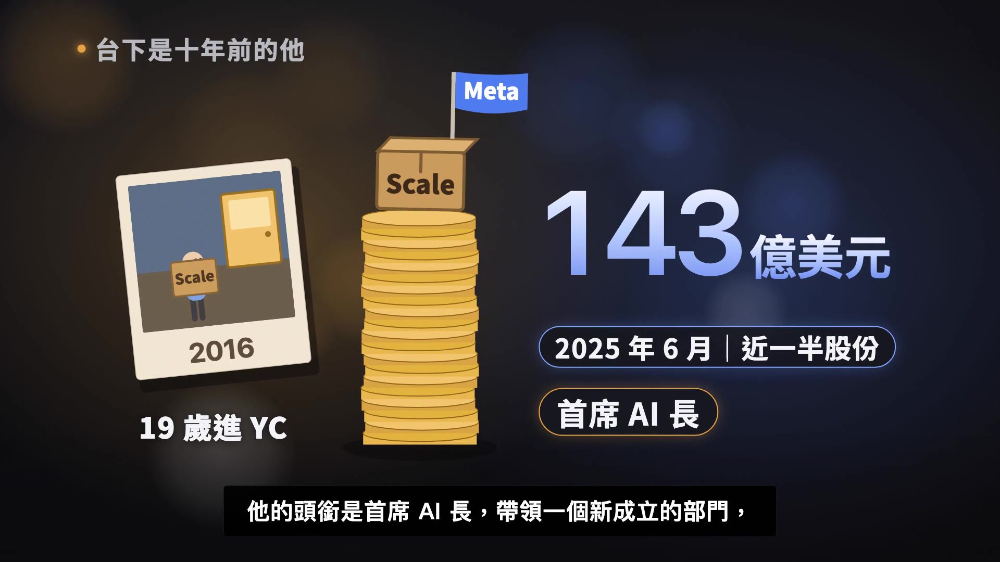

**逐字稿片段：** 叫Meta Super Intelligence Labs 中文是Meta 超級智慧實驗室 超級智慧的意思是 在幾乎所有事情上 都比人更強的AI 所以這場對談有點特別 臺下作者的 很像十年前的他 Gary一開始就問 你18歲的時候在想什麼 他的回答很老實

**話題推測：** 介紹Meta成立的「Meta超級智慧實驗室」及其定義

---

## 00:02:00

**逐字稿片段：** 他在新墨西哥州的 Los Alamos長大 從小參加數學跟城市競賽 知道自己想做大事 可是不知道怎麼做 高中畢業以後

**話題推測：** Alexander Wang在新墨西哥州Los Alamos的成長背景與早期經歷

---

## 00:02:07

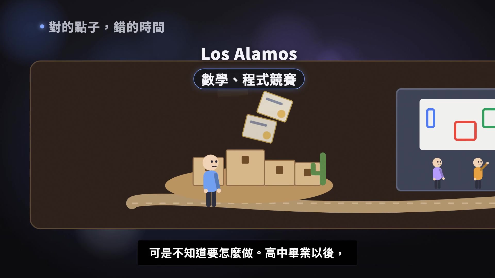

**逐字稿片段：** 他先去矽谷的問答網站 Cora工作了一年 再去讀MIT 他說這兩段經驗 各給了他一樣東西 在公司裡他看到一群人 實際上怎麼做決定 怎麼把一個東西一改再改 在MIT 他第一次自己動手訓練AI模型 讀了一年 他就申請了YC

**話題推測：** Alexander Wang在Quora工作與MIT求學的經歷

---

## 00:02:22

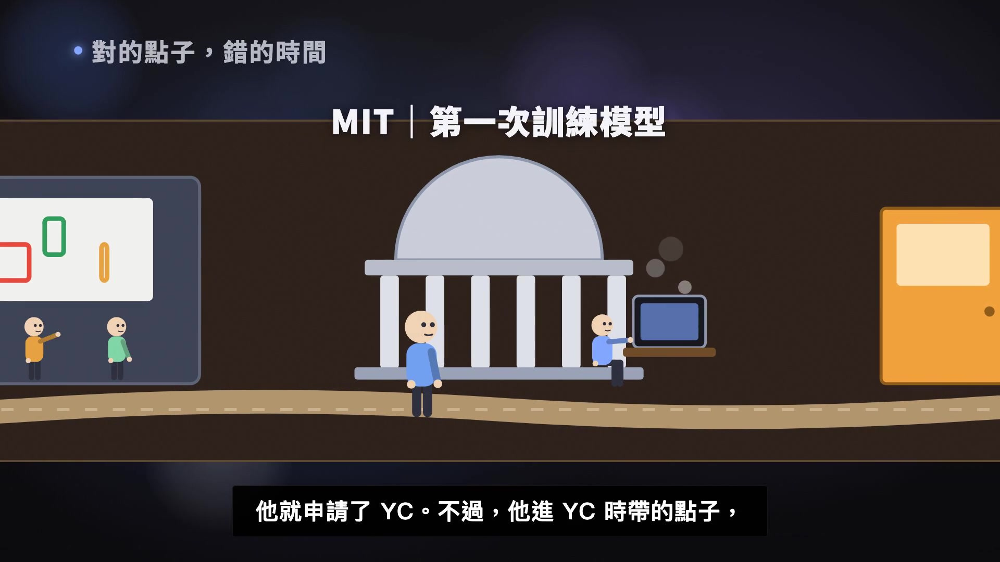

**逐字稿片段：** 不過他進YC時代的點子並不是scale 他們原本想做一個AI助理 幫人處理看病這件事 做了一兩個月 YC的合夥人Jarrett Friedman 把他們拉到一邊說 這個方向我不確定會有結果 忘說那正是他們需要聽到的話 今天回頭看 他覺得那個點子本身沒有錯 現在真的有人在做 用AI幫人看病的工具 錯的是時間點 2016年的技術還做不到 所以他們回到一張白紙 重新想機會到底在哪裡 答案 藏在他在MIT訓練模型的時候 遇到的一個麻煩力

**話題推測：** 探討Alexander Wang最初在YC的創業點子（AI助理看病）及其失敗原因

---

## 00:02:52

**逐字稿片段：** 訓練一個AI模型 他說需要三樣東西 這裡我用一間廚房來比喻 這一集會一直回來用它 第一樣是算力 也就是電腦的計算能力

**話題推測：** 解釋訓練AI模型所需的三樣東西，並引入「廚房比喻」

---

## 00:03:00

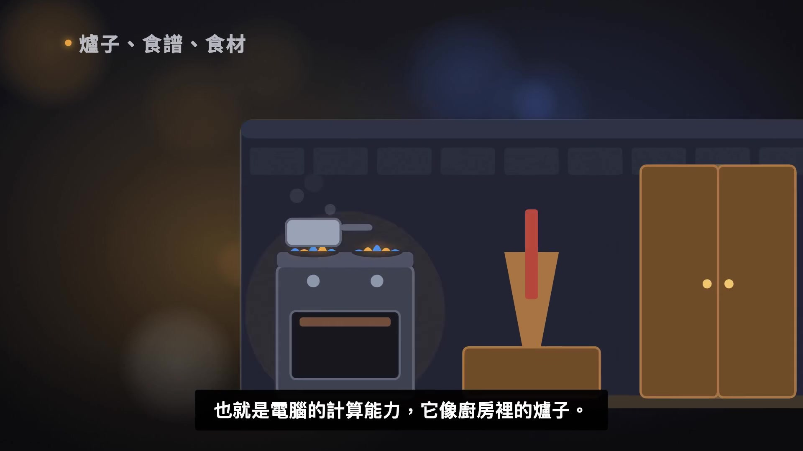

**逐字稿片段：** 它像廚房裡的爐子

**話題推測：** 將算力比喻為廚房裡的爐子

---

## 00:03:01

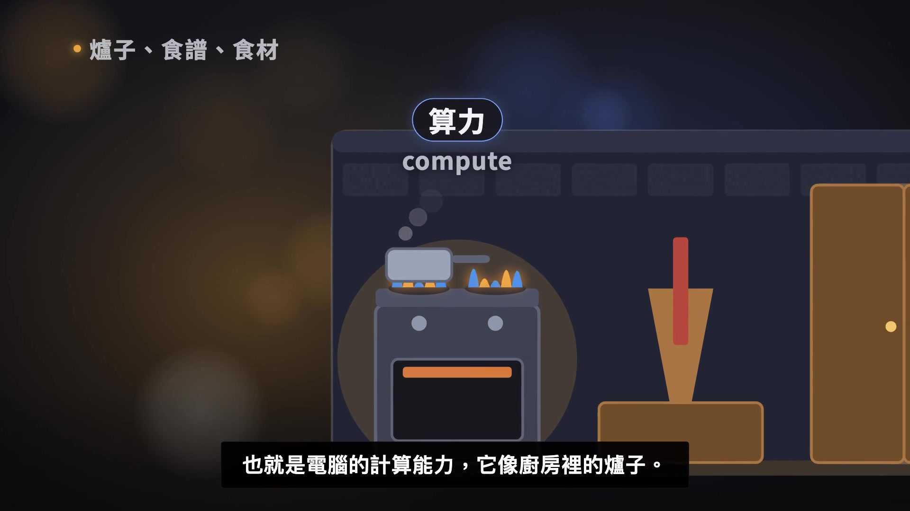

**逐字稿片段：** 第二樣是程式碼 告訴電腦一步一步怎麼學 它像食譜 第三樣是資料 模型 要從大量的例子裡學到 它像食材 2016年前兩樣都很好拿

**話題推測：** 將程式碼比喻為食譜

---

## 00:03:10

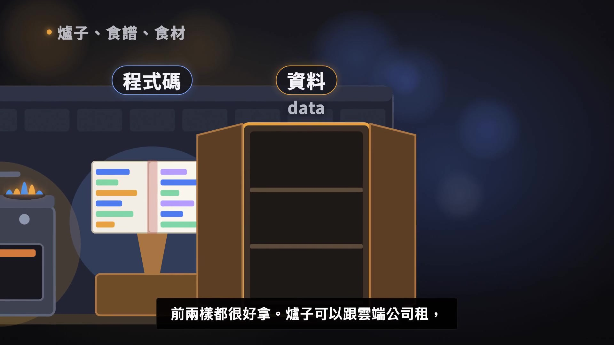

**逐字稿片段：** 爐子可以跟雲端公司租 它當時用的是Google的雲端賬號 按一下就有

**話題推測：** 指出2016年算力（爐子）可從Google雲端租用

---

## 00:03:15

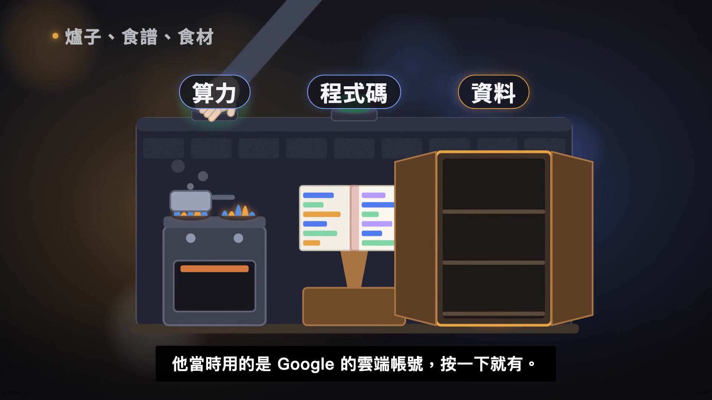

**逐字稿片段：** 食譜網路上也找得到 Google前不久才公開了一套訓練模型的工具 叫Tension Flow 可是食材不一樣 你想教模型認出馬路上的車 就得先有一大堆照片 每一張都有人仔細框出 車在哪裡 行人在哪裡 這種整理好 標好答案的資料 沒有地方可以按一下就買到 他覺得這件事太明顯了 未來一定會有一個按鈕按下去就拿到資料 這一段聽他自己怎麼說

**話題推測：** 指出2016年程式碼（食譜）可透過Google TensorFlow取得

---

## 00:03:47

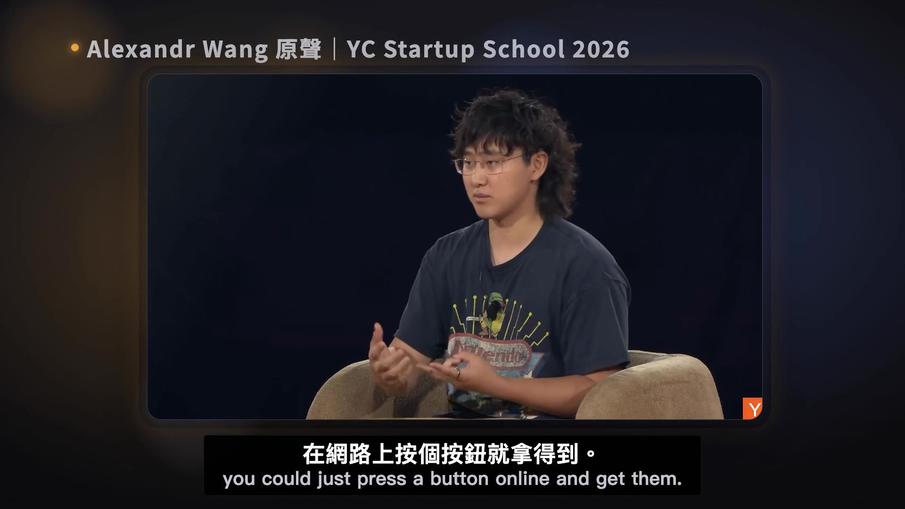

**逐字稿片段：** 所以Scale做的事 就是當時才供應商 他找來大量的人 配上好用的工具 把照片 影片 文字 一筆一筆標好答案 再賣給要訓練模型的公司 這個工作叫資料標準

**話題推測：** 解釋Scale AI的商業模式：提供資料標註服務

---

## 00:04:05

**逐字稿片段：** 第一批大客戶是做自動駕駛的公司 因為在那個年代 最需要看懂馬路畫面的 就是自動駕駛的車 聽起來很合理 可是在那幾年 這個生意一點都不吸引人 我跟你說

**話題推測：** 自動駕駛公司成為Scale AI的第一批大客戶

---

## 00:04:16

**逐字稿片段：** 公司的營收明明長得很好 每次出去募資 創業投資公司還是一臉懷疑 他們會問 這種生意做得久嗎 撐得住嗎 這段我第一次聽 覺得有點意外 一家數字很好看的公司 為什麼還是說服不了人 他後來想通了原因 聽他自己講 你知道 they'd be like 他們會說 does it have longevity is this durable and it was really weird to me 對我來說很奇怪 so I guess they didn't really get it

**話題推測：** 探討Scale AI早期營收雖好但募資困難的原因（投資人懷疑商業模式）

---

## 00:04:50

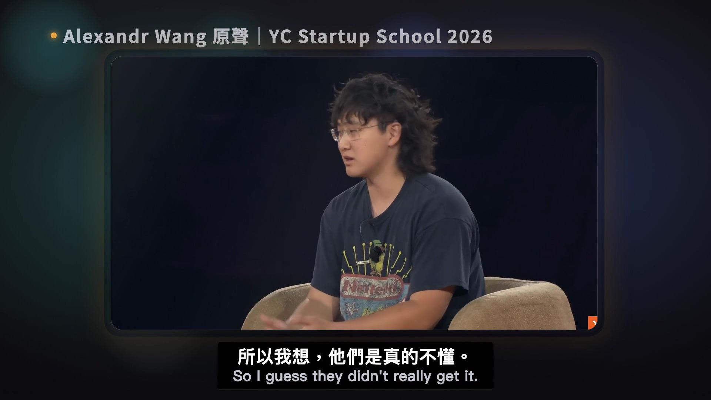

**逐字稿片段：** 這件事後來整個翻了過來 大型預言模型紅了以後 資料變成大家搶著要的東西 他說當年不看好 scale 的同一批投資人 現在在寫文章講資料有多重要 Gary 接著問 這種事情你是怎麼撐過來的 Wong的回答 是這場對談裡他最常回來講的一個詞

**話題推測：** 大型語言模型興起後，資料重要性被重新肯定

---

## 00:05:05

**逐字稿片段：** conviction 中文可以翻成信念或是篤定 他說的篤定 不只是自信心很強 他的意思是 你相信一件事 身邊幾乎沒有人同意你 你還是照著它做 他給的證據是

**話題推測：** 介紹Alexander Wong提出的核心概念「篤定」(Conviction)

---

## 00:05:16

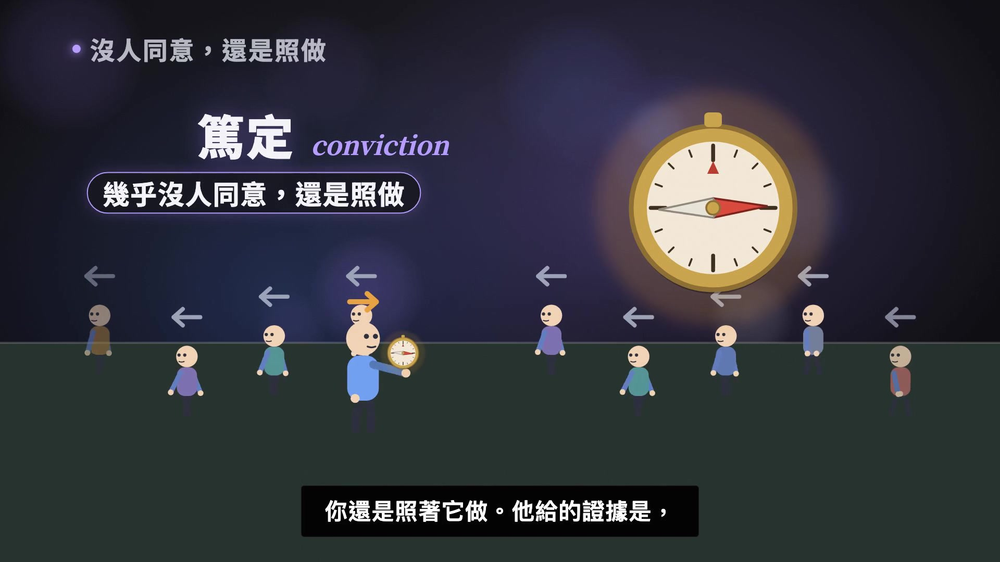

**逐字稿片段：** 回頭看世界上最成功的那些公司 創辦的時候 他們的核心想法都還沒有流行 他們要在沒有人注意的地方 默默做很多年 等到大家都同意的那一天 聽聽他怎麼說 所有世界上最有成績的企業 他們在一段時間之前 他後面還補了一句 如果你太跟著人群走 你會非常困惑 最後哪裡都到不了

**話題推測：** 以成功公司為例說明篤定的重要性，它們的核心想法曾不被認可

---

## 00:05:51

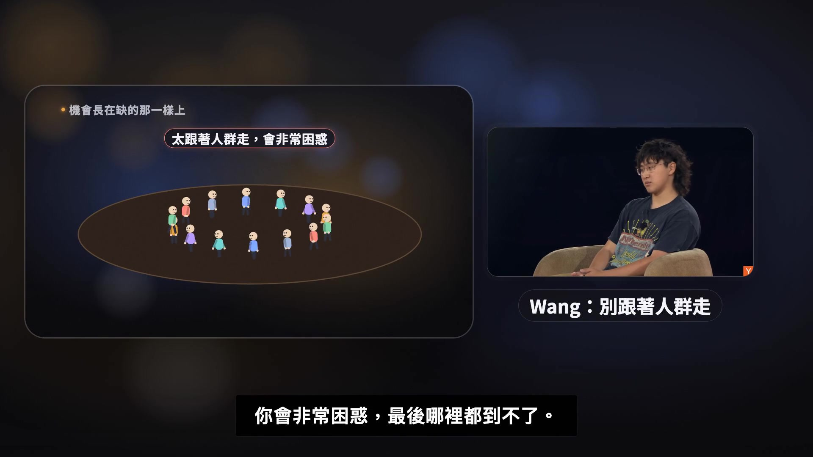

**逐字稿片段：** 所以每個人都要有自己的指南針 自己判斷未來會長什麼樣子 這個指南針 影片 最後他還會再講一次 第一部分走到這裡

**話題推測：** Alexander Wong強調每個人都需要有自己的指南針來判斷未來

---

## 00:05:58

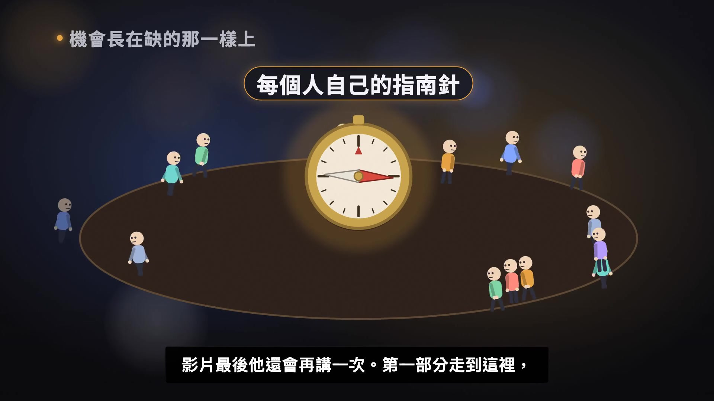

**逐字稿片段：** 我們整理一下 王在2016年看見的機會 有三個特點 他不在新聞頭條上 他在他自己動手訓練模型 卡住的那個地方 他很無聊 無聊到投資人看不懂 而且他得一直做下去 做到世界追上來

**話題推測：** 總結Alexander Wang在2016年發現的機會特點（不起眼、無聊、需要堅持）

---

## 00:06:10

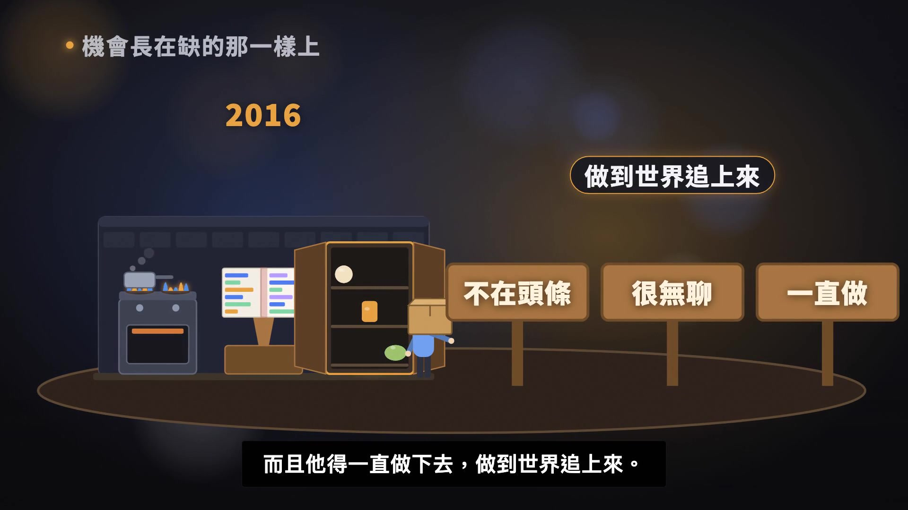

**逐字稿片段：** 用廚房來說 當時爐子跟食譜都按一下就有 缺的是食材 他就去當了食材供應商 這一部分只要記住一句 機會常常長在缺的那一樣東西上

**話題推測：** 用廚房比喻總結2016年AI產業的「食材」缺失

---

## 00:06:20

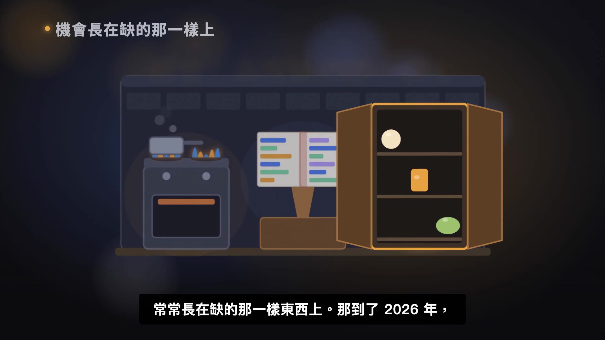

**逐字稿片段：** 那到了2026年 廚房裡缺的又是什麼 Gary問了一個很直接的問題 現在創業的人手上有AI可以用 跟你當年比起來會不會快很多 汪先講了一個判斷 他說現在卡住的 不是AI模型進步的夠不夠快 卡住的是這些已經存在的技術 要怎麼走進世界的每個角落 這件事有一個名字

**話題推測：** 轉向探討2026年AI廚房裡最缺乏的東西

---

## 00:06:39

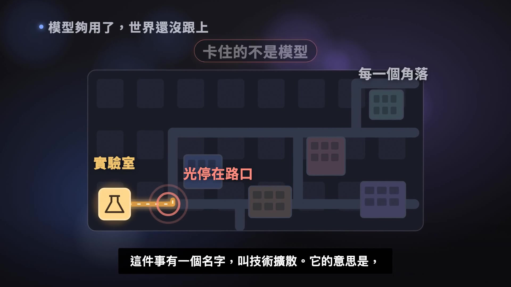

**逐字稿片段：** 叫技術擴散 他的意思是 一項新技術從實驗室出發 一路走進公司學校醫院政府 最後變成大家每天在用的東西 說穿了 模型就算從今天起不再進步 大部分的公司跟政府 也還沒學會怎麼好好用它 光是追上現在的模型 就有很多事情要做

**話題推測：** 介紹「技術擴散」概念，解釋當前AI發展的瓶頸

---

## 00:06:55

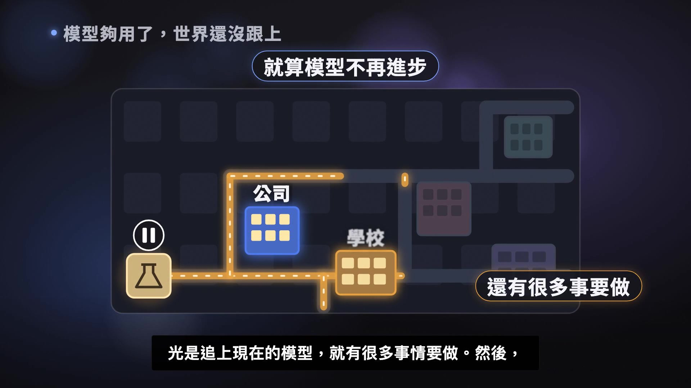

**逐字稿片段：** 然後他講了這場對談最有名的一句話 聽他自己說 和歷史上的經濟 和世界的運作 以及我們周圍的一切 所以我認為 這將會成為 一個最驚人的 可能是一個 在一個文明時代的機會 去成為夢想者 去擁有夢想 一個文明只會遇到一次 這句話很大 我們先看他給的理由 他說 十年前他創辦SCALE的時候

**話題推測：** Alexander Wong提出「文明只會遇到一次的機會」的理由

---

## 00:07:30

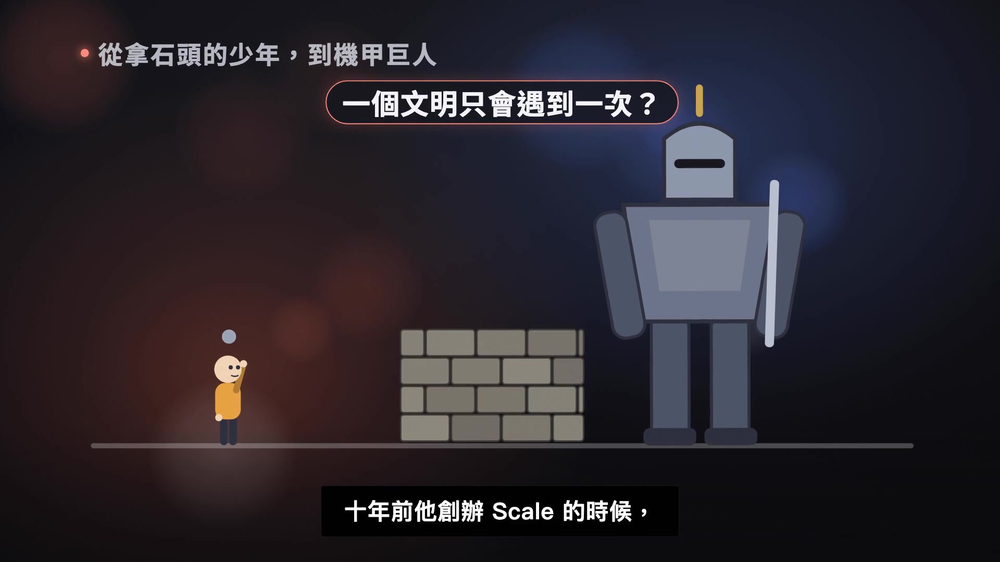

**逐字稿片段：** 創業向大衛對抗哥里亞 這是聖經裡的故事 牧羊少年大衛拿著一顆石頭 打倒了全副武裝的巨人哥利亞 小公司資源少 只能找一個很巧妙的角度 從縫隙裡鑽進市場 可是現在 他說情況變了 關鍵是AI代理程式 代理程式英文叫agent 他是為自己一步一步 把事情做完的AI程式 給他一個目標 他會自己查資料 寫程式 檢查結果再修改 不用你每一步都盯著他 如果一個小團隊

**話題推測：** Alexander Wong用「大衛對抗哥利亞」比喻過去的創業環境

---

## 00:07:56

**逐字稿片段：** 背後有一大群這樣的代理程式 在幫忙 他就不再是那個拿石頭的少年 聽他怎麼形容 GIGA巨人 這個畫面很好記 可是要讓小團隊 變成GIGA巨人 有一個前提 這些代理程式要用得起 代理程式做一件事 背後要讓模型跑很多很多次 他查一次資料 就要讀一大段文字 他改一次程式又要再想一遍 模型越貴帳單就越腫 這就是Gary接下來講的事

**話題推測：** 描繪小團隊藉由AI代理程式變成「GIGA巨人」的願景

---

## 00:08:38

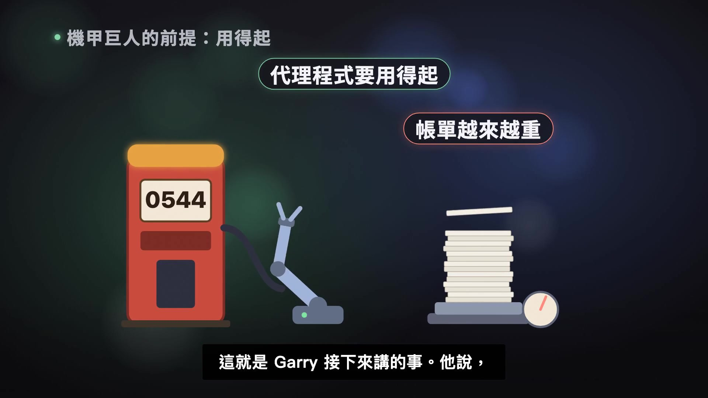

**逐字稿片段：** 他說他自己用Meta的新模型Musepark跑代理程式 覺得效果跟Anthropic的旗艦模型Opus差不多 價錢卻便宜八倍 這裡先記住 八倍是主持人跟Meta這一方的說法 第三部分我們會回來核對 哇 順著這句話 講了Meta的立場 是很重要的 讓所有人都能夠使用這個技術 去建造他們想要建造的東西

**話題推測：** Gary Tan以Meta Musepark模型為例，指出AI代理程式的價格優勢（便宜八倍）

---

## 00:09:34

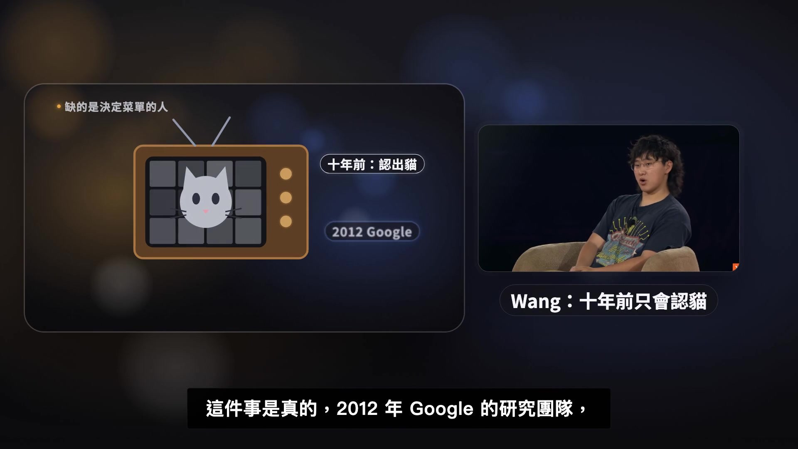

**逐字稿片段：** 2012年Google的研究團隊 讓模型看了大量從YouTube影片 截出來的畫面 他自己學會了認出貓臉 當時是大新聞 而今天他說

**話題推測：** 回顧2012年Google模型辨識貓臉的歷史，對比AI的巨大進步

---

## 00:09:42

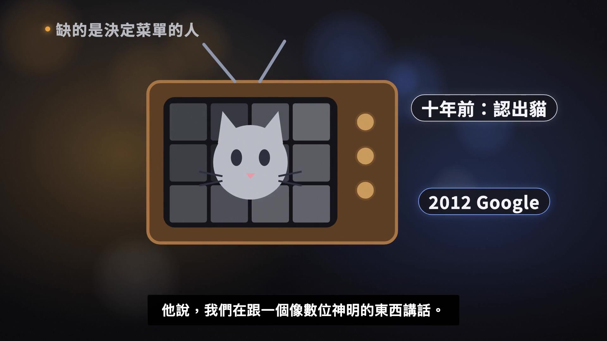

**逐字稿片段：** 我們在跟一個像數位神明的東西講話 數位神明是他的用詞

**話題推測：** Alexander Wong將現在的AI比喻為「數位神明」

---

## 00:09:46

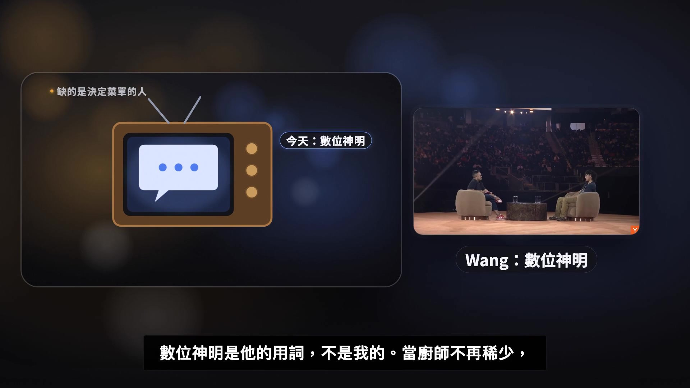

**逐字稿片段：** 不是我的 當廚師不在其掃 廚房裡最缺的又是什麼 他的答案是 決定要煮什麼菜的人 聽他怎麼說 isn't gonna be intelligence or agency 我真的覺得 他說的願景不是寫在牆上的口號 他問的是很具體的事

**話題推測：** 延續廚房比喻，指出當前最稀缺的是「決定要煮什麼菜的人」（願景）

---

## 00:10:13

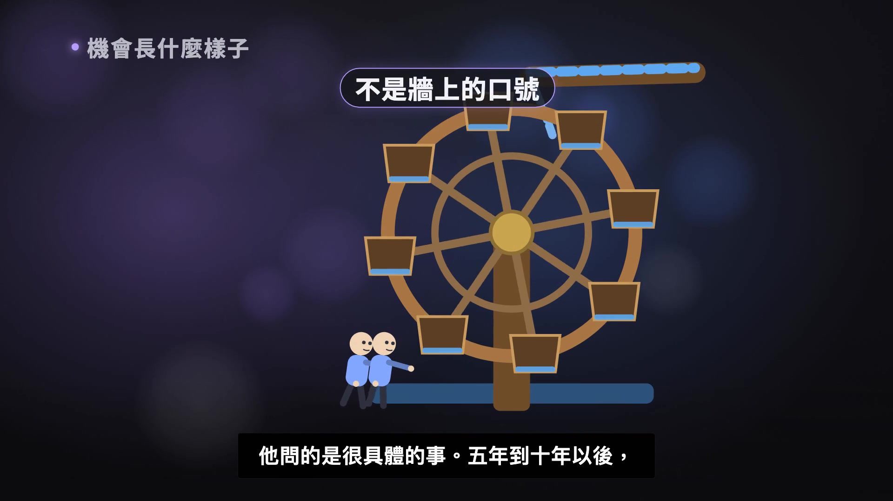

**逐字稿片段：** 5年到10年以後 你希望世界的哪一個地方 跟今天不一樣 你有沒有那股勁 願意穿過一路上所有麻煩的事 把它做出來 Gary請他再講具體一點 現在最大的機會在哪裡 Wong的答案是 讓代理城市去跑回饋循環 回饋循環的意思是 做一件事看結果 根據結果調整再做一次 他說一家公司 其實就是一個大的回饋循環 找到客戶 讓客戶更滿意 客戶花更多錢 同時再請更多人去找更多客戶 過去這個循環的每一個環節 都是人在推 如果你能給代理程式一個清楚的分數 讓他一直去追 他都在Meta內部看過 一群代理程式做出來的成果

**話題推測：** Alexander Wong闡述未來5到10年最重要的機會在於「具體願景」

---

## 00:10:48

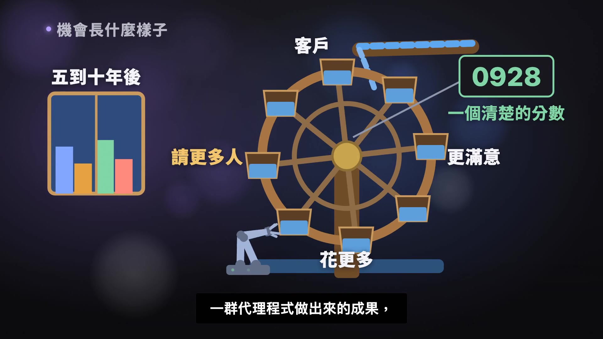

**逐字稿片段：** 比100個工程師的團隊還多 這是他的說法 外界沒有辦法驗證 那這些代理程式是怎麼跑起來的 答案頻繁到臺下都笑了 I think it's always funny how mundane everything is once you really dig into it

**話題推測：** 分享Meta內部觀察，代理程式成果超越100名工程師團隊

---

## 00:11:11

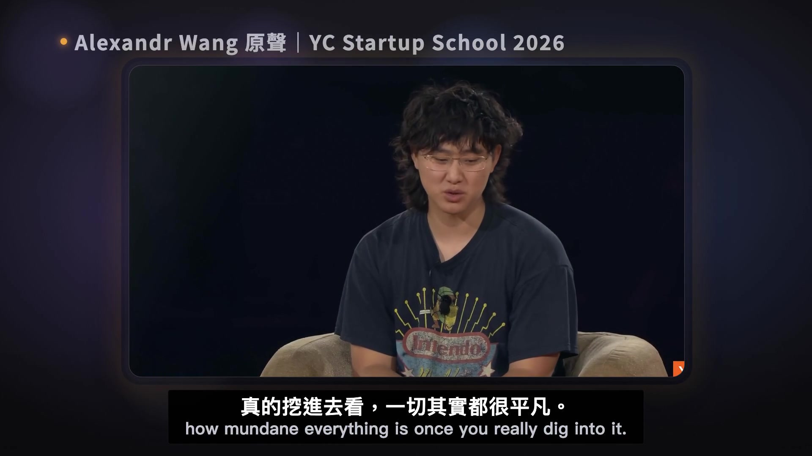

**逐字稿片段：** 技能檔案 是寫給代理程式看的工作說明 Markdown是一種很簡單的 純文字格式 Chrome Drop 則像電腦裡的鬧鐘 時間一到 就自動把一件工作跑一次 把這些很平凡的零件接起來 就是他說的機會 第二部分整理一下 亡的

**話題推測：** 解釋代理程式的實際運行方式，透過「技能檔案」、「Markdown」與「Cron Job」

---

## 00:11:26

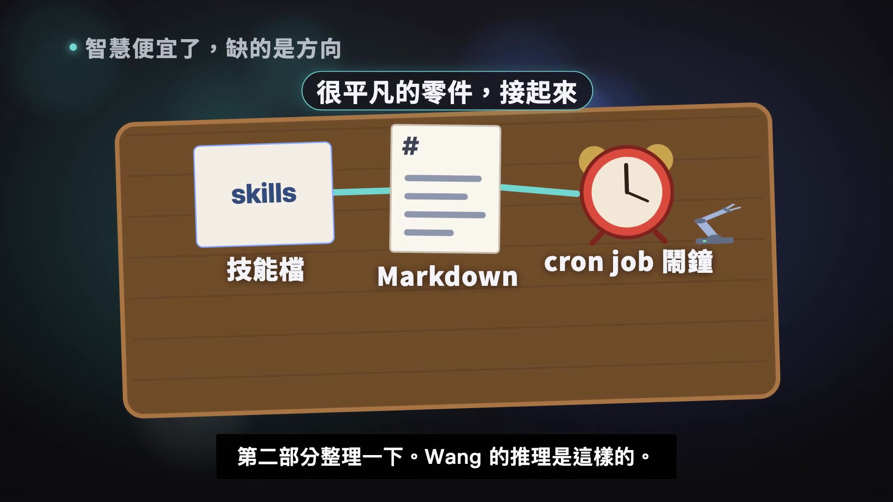

**逐字稿片段：** 推理是這樣的 模型已經夠強 卡住的是擴散 代理程式讓小團隊 有機會跟大公司正面對抗 前提是模型夠便宜 而當智慧本身越來越便宜 最稀少的就變成願景跟那股勁 用廚房來說 2016年缺食材 今天連廚師都快要誰叫誰到 缺的是決定菜單的人 這一部分記住一句 智慧變便宜以後 最值錢的是方向

**話題推測：** 總結第二部分Alexander Wang關於機會的推理（模型夠強、擴散是瓶頸、願景重要）

---

## 00:11:47

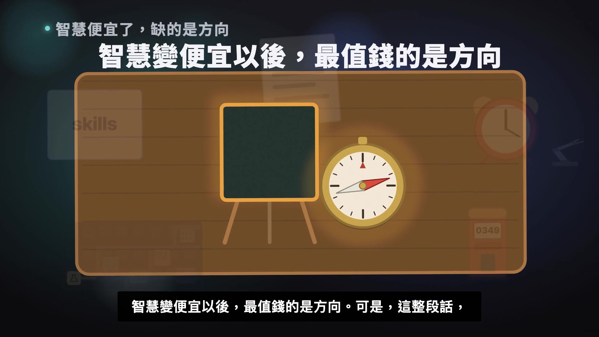

**逐字稿片段：** 可是這整段話是誰說的 現在把說話的人放回來 汪不是旁觀的評論家 他是Meta的首席AI長

**話題推測：** 進入第三部分，重新審視Alexander Wang的觀點，並考量其Meta首席AI長的身分

---

## 00:11:54

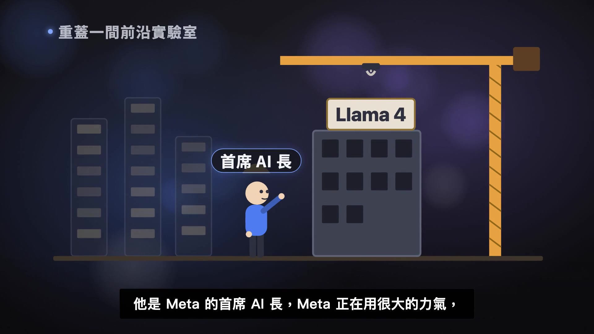

**逐字稿片段：** Meta正在用很大的力氣 追趕OpenAI Anthropic跟Google 他自己在臺上講得很直接

**話題推測：** 揭示Meta正在大力追趕OpenAI、Anthropic、Google等競爭對手

---

## 00:12:00

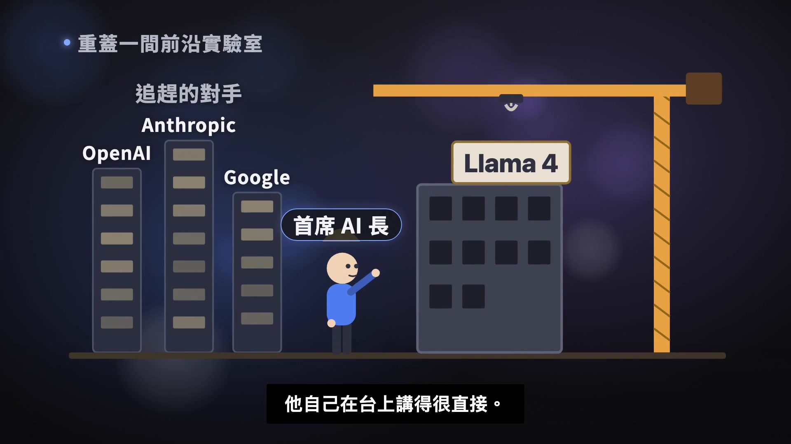

**逐字稿片段：** Meta上一代的模型 Lama4 2025年4月推出 他說他不在Meta需要的那條軌道上 所以他進去以後 幾乎是從零開始 重蓋一間前沿實驗室 前沿實驗室指的是 做最強那一季模型的團隊 他說 最重要的是人才密度 厲害的人越多 越厲害的人就越想加入 他會自己越滾越大 這句話背後 是2025年夏天

**話題推測：** 提及Meta上一代模型Llama 4的狀況，以及Alexander Wang如何從零開始重建實驗室

---

## 00:12:21

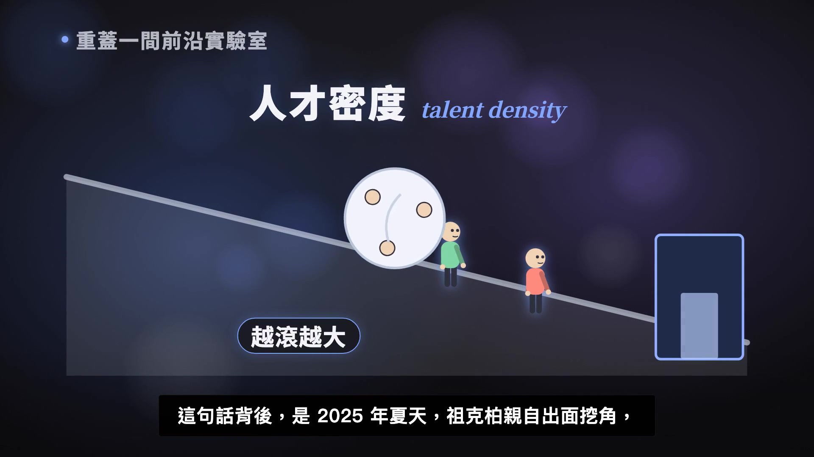

**逐字稿片段：** 祖克柏親自出面挖角 開出的條件 在紐約時報跟華爾街日報上都變成了新聞

**話題推測：** 透露祖克柏親自挖角人才，成為媒體新聞

---

## 00:12:27

**逐字稿片段：** 不到一年2026年4月 實驗室推出第一個模型 Muse Spark 他的評價怎麼樣 同一年6月 在彭博的科技大會上 忘了自己說 這個模型還不在最前面那一集 到了這場對談 主持人說他跟OPOS差不多 這兩句話不一定矛盾 中間Muse Spark更新了一個版本 可是你會發現 同一個模型在不同的臺上 講法不太一樣

**話題推測：** 提及Meta實驗室推出第一個模型Muse Spark及其評價的變化

---

## 00:12:48

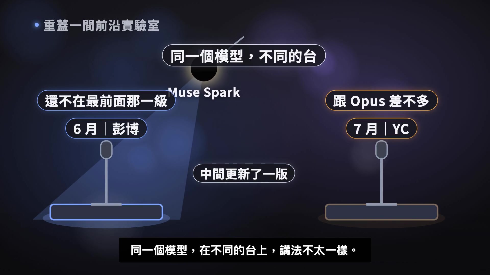

**逐字稿片段：** 再來核對那個8倍 我們要把兩家公開的價目表放在一起看 在這場對談的時候 Meta的Muse Spark跟Anthropic 當時的OPOS比

**話題推測：** 核對Meta Musepark模型價格「便宜八倍」的說法

---

## 00:12:57

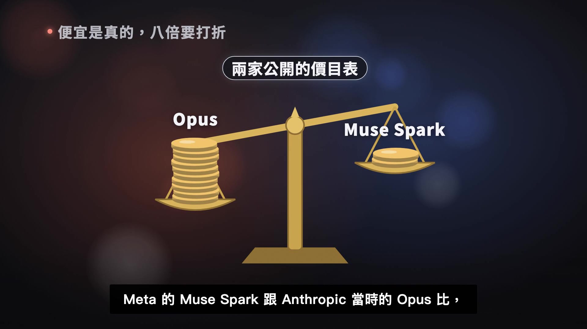

**逐字稿片段：** 同樣的用量輸入大約便宜4倍 輸出大約便宜6倍 所以照單價算 是4到6倍不是8倍 8倍要成立 還得把每個任務 實際用掉多少量也算進去 那是Meta這一方的策法 我們沒辦法自己驗證 便宜很多是真的 8倍要打一點折 另一件要放在一起看的是 是錢從哪裡來

**話題推測：** 數據顯示Meta Muse Spark輸入便宜4倍，輸出便宜6倍，而非8倍

---

## 00:13:14

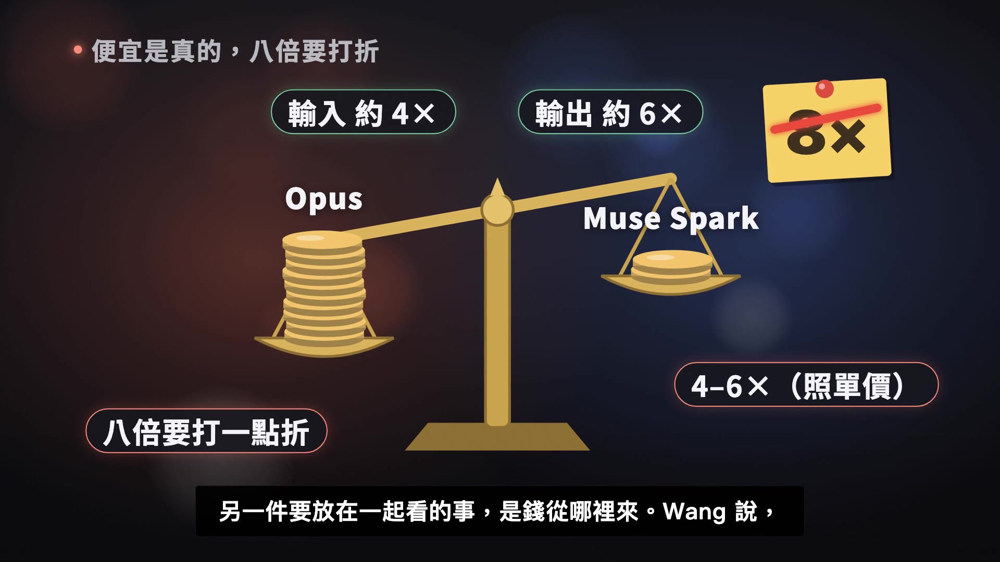

**逐字稿片段：** 旺說大衛對抗哥利亞的時代過去了 現在是巨人對巨人 可是Meta自己就是巨人 他在2026年7月的財報裡說 今年光是蓋資料中心買制服器這些設備 就要花1300億到1450億美元 這種錢叫資本支出 同一年5月Meta開始裁掉大約一成的員工 把模型價錢壓低 讓全世界的開發者都來用它 本來就是Meta追趕對手的辦法 這不代表他說的是假話 只是同一句話 也是一句很好的商業宣傳 這場對談公開到現在

**話題推測：** 分析Meta自身作為巨頭公司的資本支出（1300-1450億美元）與裁員情況

---

## 00:13:43

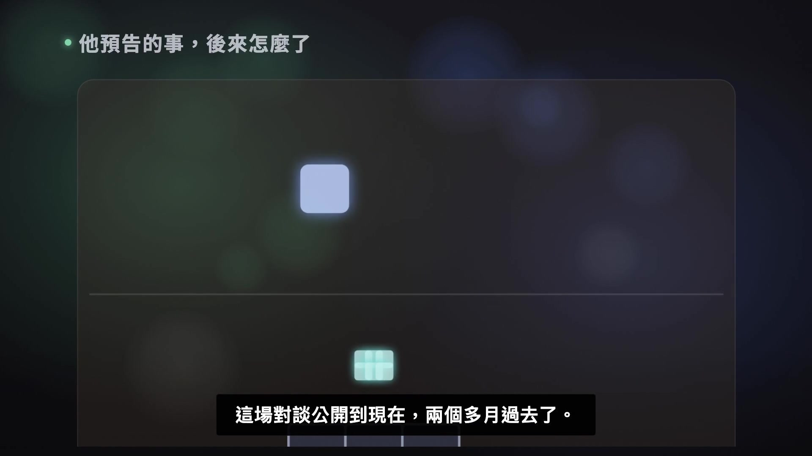

**逐字稿片段：** 兩個多月過去了 他在臺上預告了幾件事 我們可以一件一件對 他說Meta 很快會推出自己的Harness Harness原本是馬具的意思 在這裡指的是把模型包起來 讓他能在你的電腦上讀檔案 寫程式 自己動手做事的那一層工具

**話題推測：** 對比Alexander Wang在對談中預告的Meta產品發布情況

---

## 00:13:57

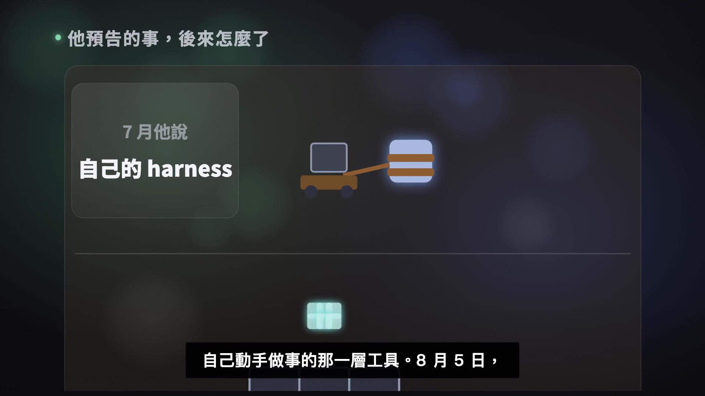

**逐字稿片段：** 8月5日 Meta推出了Muse Code 就是這樣一個寫程式的代理工具 他說Meta也在做開放的模型 8月10日

**話題推測：** Meta推出寫程式代理工具Muse Code，應驗其Harness預測

---

## 00:14:04

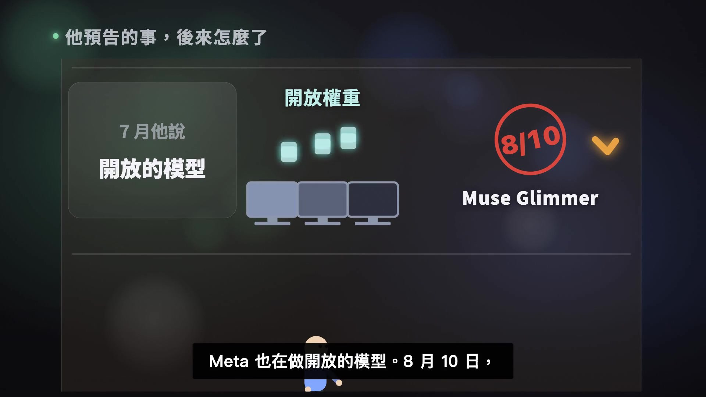

**逐字稿片段：** Meta公開了一個叫MuseGlimmer的模型 而且是開放權重 開放權重的意思是 模型本體放在網絡上 任何人都可以下載到自己的電腦上跑 不過它是比較小的版本 MuseBug本身並沒有公開 它說 每個人都有自己的個人超級智慧 9月8日

**話題推測：** Meta公開開放權重模型MuseGlimmer，應驗其開放模型預測

---

## 00:14:20

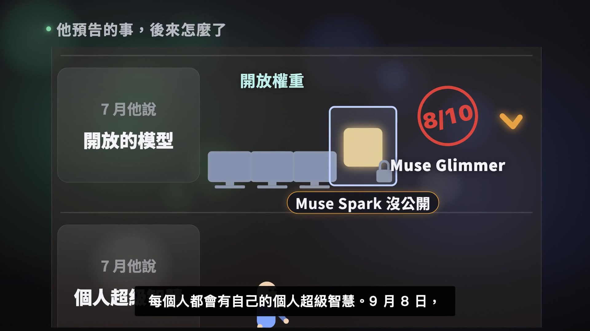

**逐字稿片段：** Meta推出個人代理程式 名字就叫Muse 可以幫你處理比較長的任務 接下來的發展 正好碰到它自己講的那個瓶頸

**話題推測：** Meta推出個人代理程式Muse，應驗其個人超級智慧預測

---

## 00:14:27

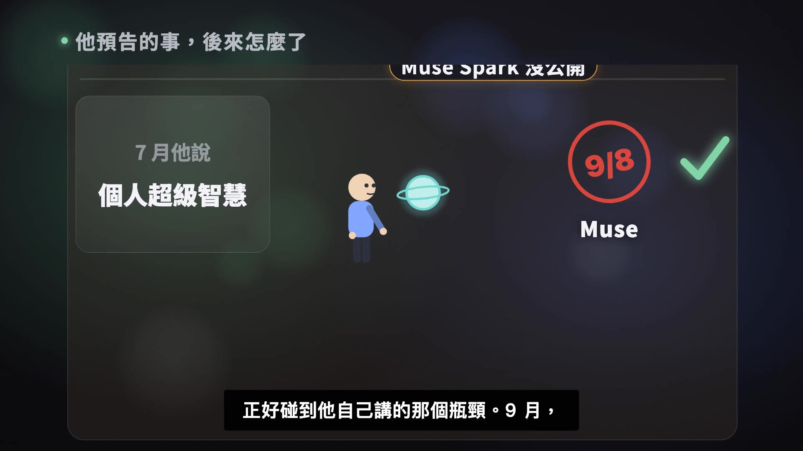

**逐字稿片段：** 9月404 Media報導 Muse幫你打電話給店家了 功能在內部測試的階段 有一部分電話其實是真人客服打的 Meta說 內部測試本來就是開發的一部分 另外據GeekWire報導 Amazon也擋下了Muse 不讓他在Amazon的購物網站上幫人買東西 技術做出來了 別人願不願意讓他進門 大家信不信得過他 這就是他說的擴散 這一步 往往比做出模型還要慢 對談的最後 Gary問了一個很溫柔的問題 如果可以寄一封電報給18歲的自己 你會寫什麼 這個問題其實是替臺下問的 臺下那些18到20歲的人 就是當年的他 在聽他的答案之前 我們先記得這一路看到的兩件事 他在2016年看見的機會 是從自己動手卡住的地方長出來的 而他今天說的機會 是從一家正在花大錢的公司裡講出來的 帶著這兩件事聽他的第一句話 and people telling you shit and like it'll be very confusing and it'll be very hard 這句話很動人 也有道理 可是我想替他補一個條件 篤定這件事 有一個很難看見的問題 叫倖存者偏差 他的意思是 你只看得到撐過來的人 而且一樣篤定 一樣在沒有人注意的地方 做了很多年 最後還是失敗的人 不會被請上臺演講 所以篤定 是成功的人常常有的東西 但不是有了他就會成功 汪自己的故事裡 其實藏著另一個條件 他對資料的篤定 不是憑空來的 是他在MIT自己訓練模型 平手卡在那裡才得到了 指南針要準 前提是你真的走過那一片地方 他的第二個建議 就比較能拿來檢查

**話題推測：** 報導指出Muse代理程式在應用擴散上遇到瓶頸（真人客服、Amazon阻擋）

---

## 00:16:07

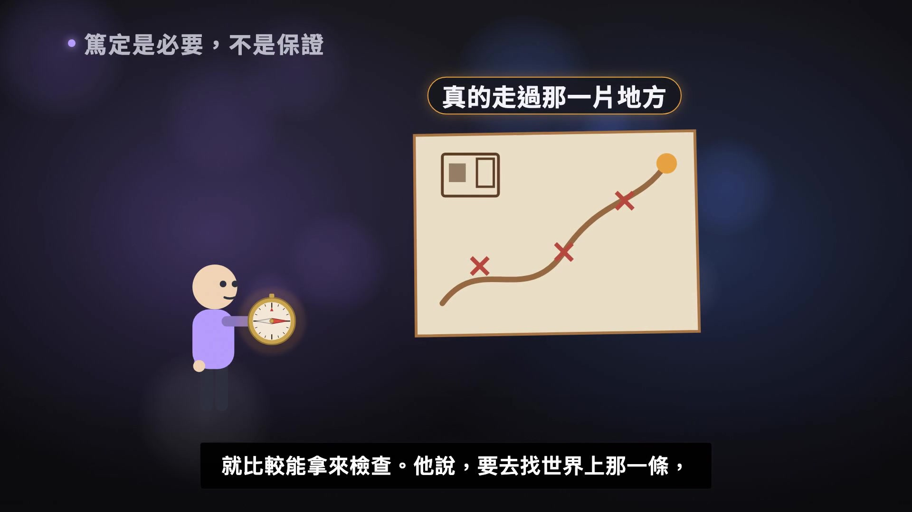

**逐字稿片段：** 他說要去找世界上那一條 曲線最陡又走得最久的指數成長 聽他怎麼說 在那時候是正確的投資方式 現在是AI進步 但未來將會有更多這種狹窄的曲線

**話題推測：** Alexander Wang建議尋找世界上「曲線最陡又走得最久的指數成長」領域

---

## 00:16:37

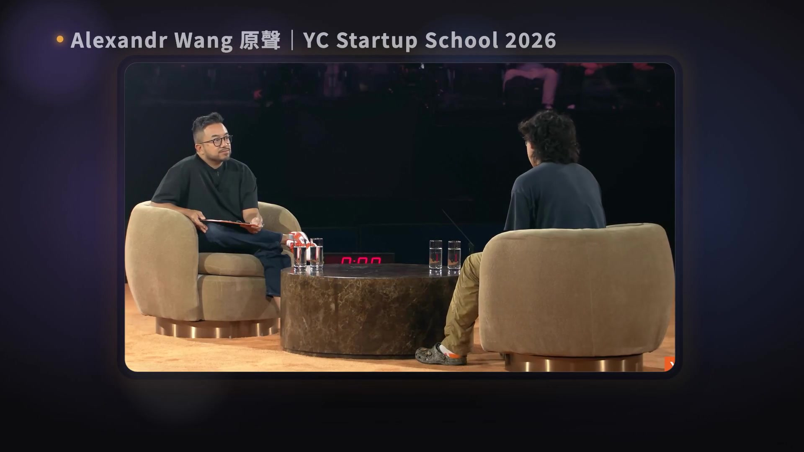

**逐字稿片段：** 默爾定律說的是 晶片上能放的電晶體 大約每兩年翻一倍 這條曲線撐了幾十年 帶出了個人電腦 也帶出了手機

**話題推測：** 以「摩爾定律」為例，說明指數成長曲線的巨大影響力

---

## 00:16:44

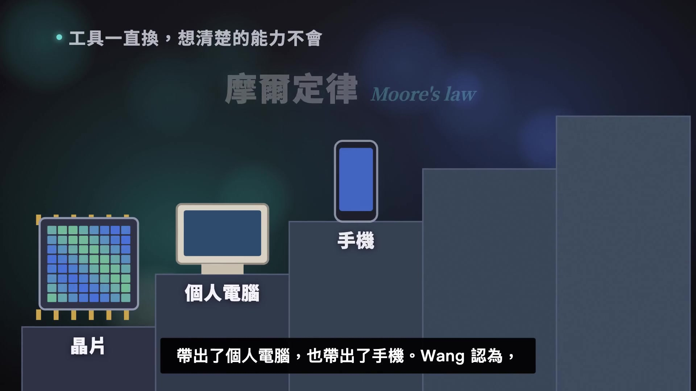

**逐字稿片段：** 汪認為 現在的那一條 是AI的進步 而且這種曲線的起點常常很無聊 就像當年只會認貓的模型 那對不打算創業的一般人呢 這場對談裡 有一段我覺得最實在 Gary提到 有些學生開始擔心 現在還要不要讀資訊工程 汪的回答是 有系統嚴謹的想事情 還是非常重要 他說 以前創業的人要寫程式 在學怎麼管理一群人 現在變成要學 怎麼指揮代理程式 接下來 是怎麼讓一大群代理程式 好好合作 工具一直在換

**話題推測：** Alexander Wang認為當前AI的進步就是這樣的指數成長曲線

---

## 00:17:12

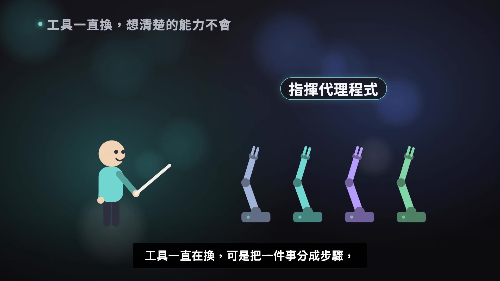

**逐字稿片段：** 可是把一件事分成步驟 安排誰先誰後 檢查哪裡出錯 這種能力不會過時 所以如果他說的對 智慧會變得到處都是

**話題推測：** 強調「系統嚴謹思考」與「將事情分步驟拆解」等能力的重要性，不會過時

---

## 00:17:20

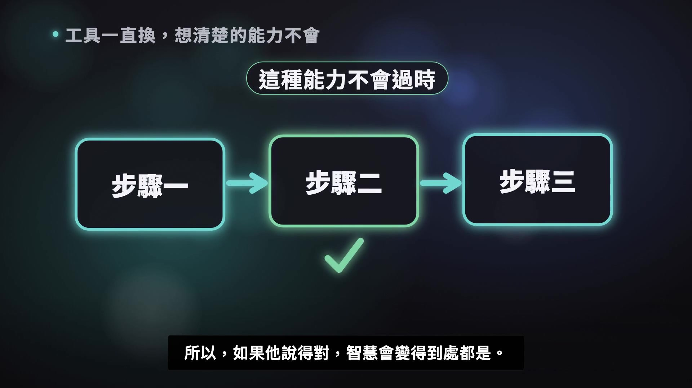

**逐字稿片段：** 那你手上最值錢的 是兩樣東西 一樣是你親手做過 知道哪裡會卡住的經驗 另一樣是 你清楚自己 想把世界的哪一個地方 變得更好 我們回到開場那個問題 一個正在替Meta追趕AI的人說 現在是一個文明只會遇到一次的機會

**話題推測：** 總結在智慧普及時代，個人最值錢的兩樣東西：經驗和願景

---

## 00:17:35

**逐字稿片段：** 這句話站得住的那一半是 智慧正在變得便宜 到處都拿得到 2016年他看見廚房裡缺的是食材 1026年他看見缺的是知道要煮什麼的人 要打折的那一半是說這句話的人 也正需要全世界的開發者都來用他的模型 八倍要打一點折 代理城市要走進別人的家門 也比做出來慢得多 所以機會可能是真的 只是他不會自己落到你身上 他比較可能落在親手做過 又清楚自己要往哪裡走的人身上 這是演講訪談系列的第一集 之後我們會繼續挑重要的演講跟訪談 把講者的原生跟背景放在一起看 最後問你一個問題 如果智慧真的變得像按一個按鈕那麼容易 你最想用它 把生活裡的哪一件事變得不一樣 留言告訴我 喜歡的話訂閱AI Notebook 開啟通知 我們下次見

**話題推測：** 總結Alexander Wang觀點的「一半站得住」（智慧變便宜）與「一半要打折」（Meta的商業宣傳與擴散挑戰）

---
