# jimainotebook_kfPGulrqVtI — 關鍵畫面索引

- 來源逐字稿：[jimainotebook_kfPGulrqVtI_FIN.srt](jimainotebook_kfPGulrqVtI_FIN.srt)
- 影片：https://www.youtube.com/watch?v=kfPGulrqVtI
- 截圖數：85

## 00:00:10

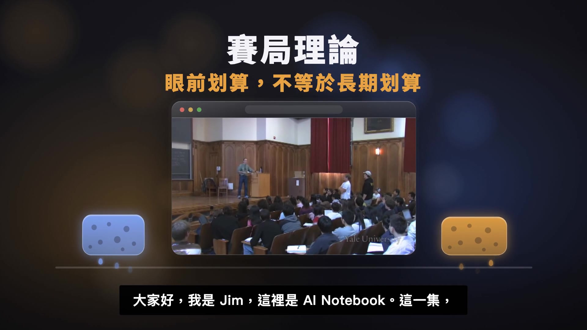

**逐字稿片段：** 這一集我們繼續上耶魯大學的賽局理論公開課, 課號ECON159, 這次上第九, 重蹈第十六塔, 講臺上還是Ben Pollack老師, 上集的答案是, 難的不是算出自己要什麼, 是算出別人會怎麼做, 這八堂課要再往前走一步,

**話題推測：** 影片主題介紹，開始講述耶魯大學賽局理論公開課內容。

---

## 00:00:25

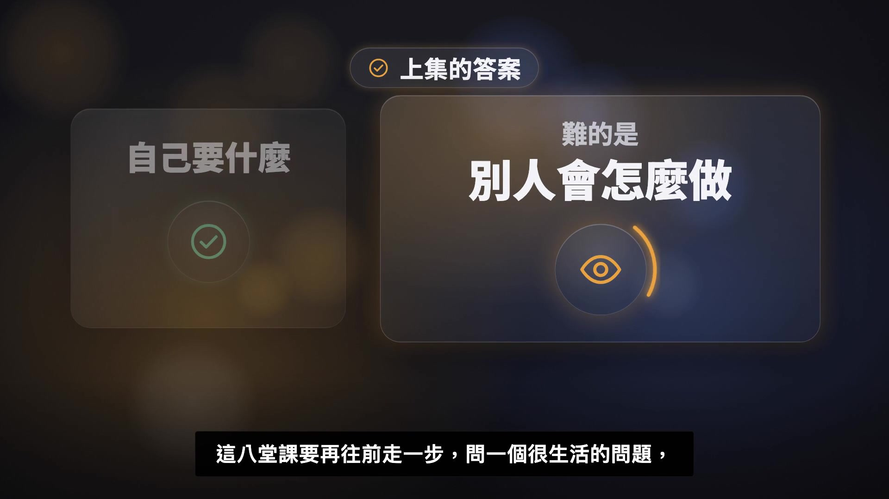

**逐字稿片段：** 問一個很生活的問題, 你想好的那一步, 等別人反應過來以後, 還划算嗎?別人可能會猜你, 可能會一代一代換人, 也可能站在旁邊看你出手以後才懂,

**話題推測：** 提出本集要探討的核心問題，預期畫面會顯示該問題。

---

## 00:00:34

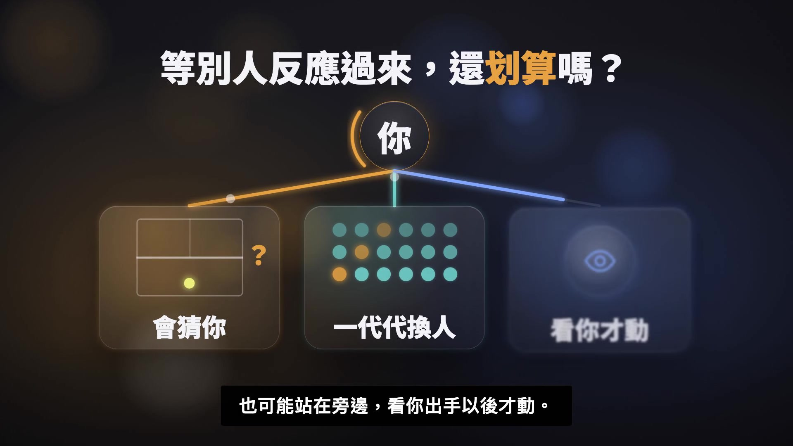

**逐字稿片段：** 我先把答案放在前面, 難的不是眼前划算, 是長期划算, 長期的意思就是把別人所有的反應都算進去以後

**話題推測：** 預先揭示本集問題的答案，可能顯示為結論式字幕。

---

## 00:00:41

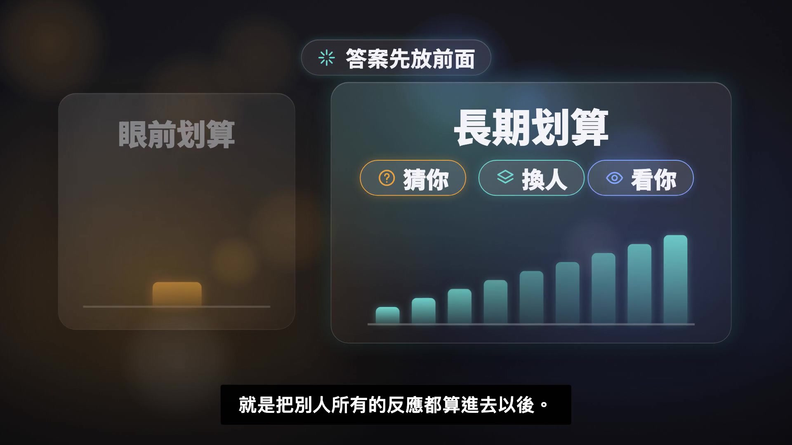

**逐字稿片段：** 最後一堂課Polak發給兩個同學 各一塊四海綿 讓他們站在走道兩端 他們都知道要丟 問題是什麼時候丟 這一題我們留到最後

**話題推測：** 引入一項新的課堂示範，預期畫面會是Polak教授與學生進行遊戲。

---

## 00:00:49

**逐字稿片段：** 先從網球場開始 Polak說Venus跟Serena在打球 Serena衝到往前 球來到Venus這邊 Venus要把球從Serena旁邊打過去 只有兩條路 打她的左邊 或者打她的右邊

**話題推測：** 轉換到新的主題案例：網球場上的賽局理論。

---

## 00:01:01

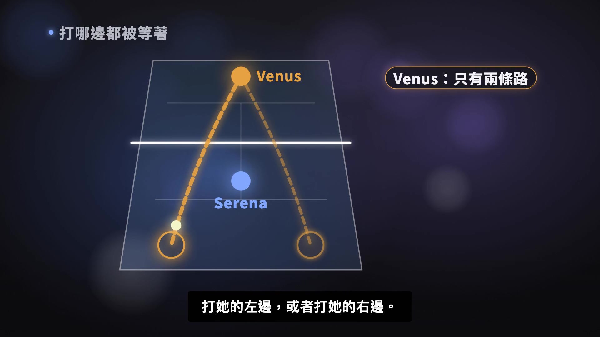

**逐字稿片段：** Serena的左邊是反手 比較弱 右邊是Venus自己最拿手的那種球 Serena也只有兩個選擇 身體先往左拼一點 或者先往右偏一點 規則很好懂 Venus打到Serena沒守著那一邊 多半得分 打到她守著的那一邊 球常常被截回來 所以你先想一下Venus該打哪邊 假設她決定打左邊 Serena猜到了 就往左偏 Venus看到她往左就改打右邊 Serena又猜到了 改往右偏 繞一圈又回到原點 這跟猜拳一模一樣 你連出三四十投 對面就會等著出步 在這一球裡 沒有任何一個固定的選擇站得住 電視上的球賽評論員最愛說 打你最強的那一邊就對了 不用管對手 Polak說 這句話聽起來很對 今天就會看到他錯在哪裡 既然固定會被等著 Venus能做的只剩一件事 不要固定

**話題推測：** 說明Serena的弱點，可能搭配網球場示意圖。

---

## 00:01:46

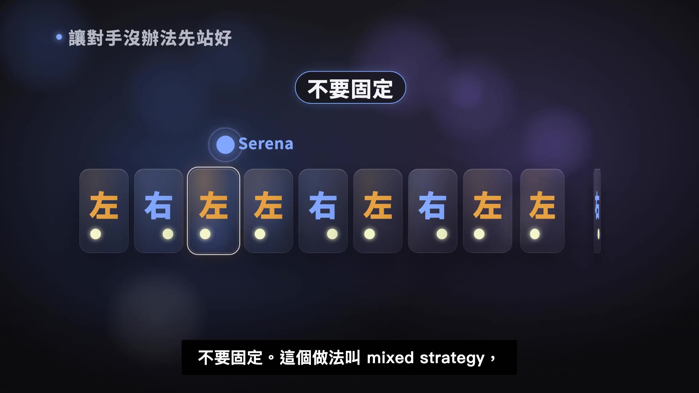

**逐字稿片段：** 這個做法叫Mixed Strategy 中文叫混合策略 他的意思是 你不是永遠打左邊 也不是永遠打右邊 而是照一個比例去混 譬如 十球壘大概幾球打左 幾球打右 可是哪一球打哪邊 對手事先不知道 你會發現 Venus並沒有變得更會打球 他只是讓Serena 沒辦法先站好 聽起來簡單 做起來很難 因為人很不會亂數 你以為自己在亂打 其實常常有規律 Polak講了一個故事 第二次世界大戰之後 一位英國指揮官在打一場遊擊戰 Polak印象中是在馬來西亞 他兵力不夠 每天只能保護其中幾支車隊 派哪一支 絕對不能被對方猜到 他的辦法是 每天早上把一張紙條藏在一隻手裡 叫一位士官猜在哪一隻手 用這個來決定當天的安排 他知道自己的腦袋靠不住 乾脆把決定交給那張紙 混合策略有一個很重要的性質 第一次聽會有點繞

**話題推測：** 介紹核心概念「混合策略」（Mixed Strategy），預期畫面會顯示該詞彙。

---

## 00:02:34

**逐字稿片段：** Polak用身高來講 他請三位助教站起來 說我要從他們裡面挑一組人 這組人的平均身高越高越好 我會怎麼挑 最矮的那一位先出局 他只會把平均拉低 第一個矮的也出局 最後只留最高的那一位 只有一種情況會留兩個人 就是兩個人一樣高 混合策略也是這樣 假設Venus打左邊其實比較容易得分 他就該一直打左邊 何必混 他願意兩邊混著打 唯一的理由是 兩邊給他的分數一樣高

**話題推測：** 以三位助教的身高為例，解釋混合策略的一個性質。

---

## 00:02:58

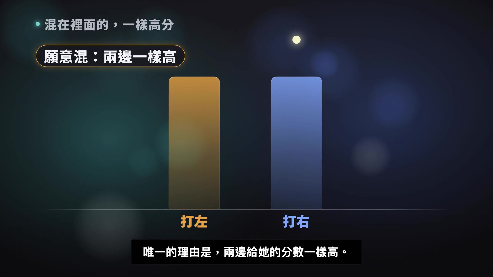

**逐字稿片段：** 所以這句話請你先記住 混在裡面的每一種選擇 分數一定一樣高 不然早就被踢出去了 這一集後面好幾個例子 用的都是這一句 這句話馬上就能用 而且用法有點怪 你想知道Serena會怎麼混 要看的不是Serena的分數 是Venus的分數 我們一步一步來 Venus兩邊都在打 所以兩邊給她的分數一樣高 可是Venus打左邊能拿幾分 要看Serena多長往左手 Serena往左手太多 Venus就該全打右邊 手太少 Venus就該全打左邊 只有一個剛剛好的比例 會讓Venus覺得打哪邊都一樣 那個比例就是Serena的答案

**話題推測：** 強調混合策略的關鍵原則：「混在裡面的每一種選擇，分數一定一樣高」。

---

## 00:03:31

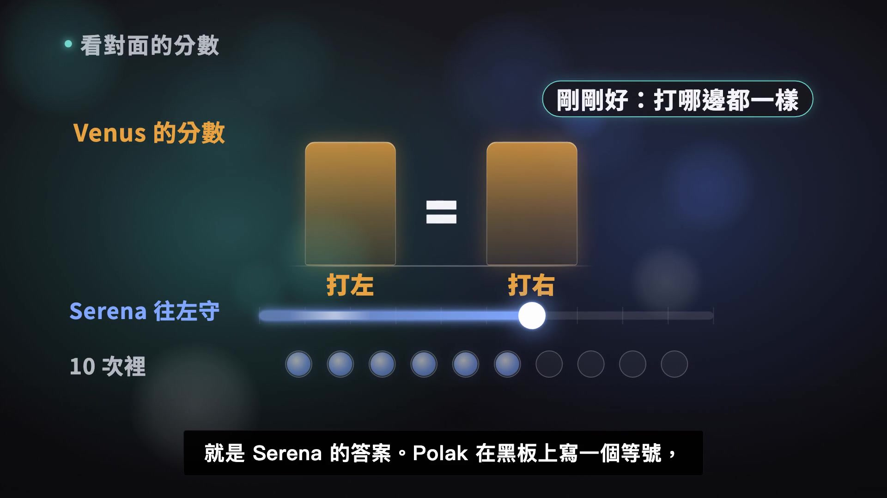

**逐字稿片段：** Polak在黑板上寫一個等號 解出來是 Serena Sen 次裡有六次往左偏 你想一下這件事有多怪 要算出他怎麼動 看的是你自己那一籃的分數 他不是故意要讓你打哪邊都一樣 是如果他不這樣守 你就會找到他的破綻 一直打那邊 有了這個怪方法 Polak出了一道題 Serena請了一位新教練 把反手節給練得更好 反手就是他的左邊 原本他十次裡有六次往左偏 現在他該更常往左還是更少 你的直覺大概跟很多同學一樣 那邊變強了 當然多用 Polak讓全班舉手 很多人壓多用 也有不少人乾脆不投

**話題推測：** 描述Polak在黑板上寫等式，預期畫面顯示計算過程。

---

## 00:04:04

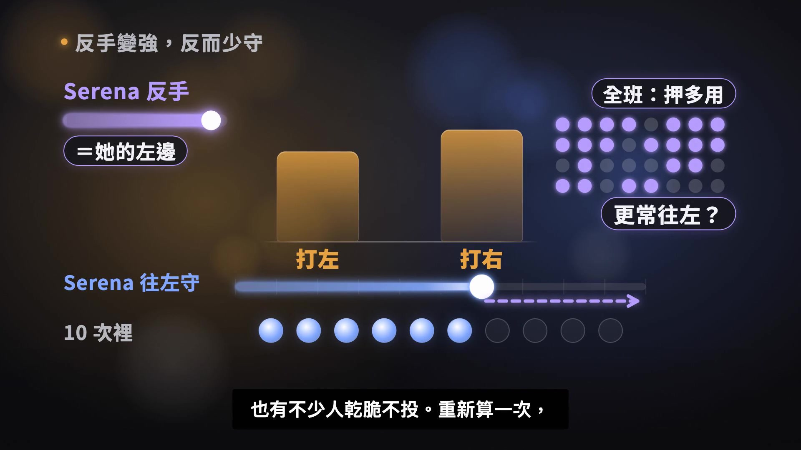

**逐字稿片段：** 重新算一次 Serena往左的比例 從6氣掉到5氣 她反而少往左 為什麼 照剛剛那個怪方法 Serena怎麼守 是Venus的分數決定的 Serena反手變強 改的是Venus打左邊的拿的分數 Venus 直到妹妹反手變強了 就少打那一邊 球來的少了 Serena也不必一直守在那裡 不然把這兩股力量分開講 一股是直接的效果 我變強了 所以多用 另一股是策略上的效果 對手看到我變強 先換了打的方向 結果是後面那股比較大 只看自己強在哪裡的教練 會把Serena 交到往錯的方向守 網球的例子講完

**話題推測：** 公布新情境下的計算結果，與直覺相反。

---

## 00:04:36

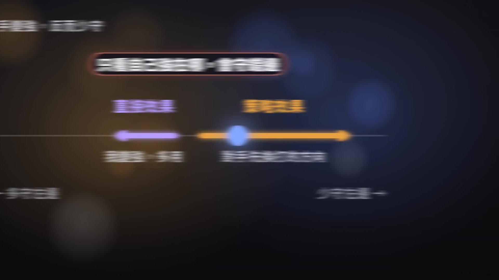

**逐字稿片段：** Paulak換到棒球 棒球裡有一個動作叫倒壘 跑者趁投手投球的時候 偷偷衝向下一個壘包 成功了 離得分進一步 被抓到直接出局

**話題推測：** 將案例轉換到棒球運動，講述倒壘的策略。

---

## 00:04:46

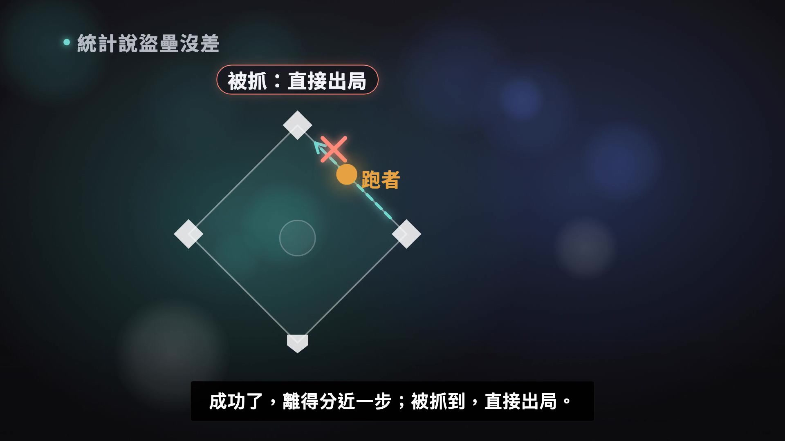

**逐字稿片段：** 有分析師做過很認真的統計 把美國職棒大聯盟跑者 站上一壘的每一次都翻出來 最後的結論是 跑者去倒壘 跟乖乖待在壘上 對比賽的影響差不多 所以他們說 速度被高估了 Paulak就說 這個數字我們不用查資料就知道 它一定長這樣 你還記得那句話嗎 混在裡面的 分數一樣高 職業跑者本來就在混 有時候跑有時候不跑 連投手都猜不到 兩種都在用 兩種的效果本來就該一樣 要是跑明顯比較好 他就會每次都跑 所以那份統計沒有發現速度沒用 它只是證明了跑者真的在混

**話題推測：** 提及分析師的統計數據，可能顯示相關圖表。

---

## 00:05:16

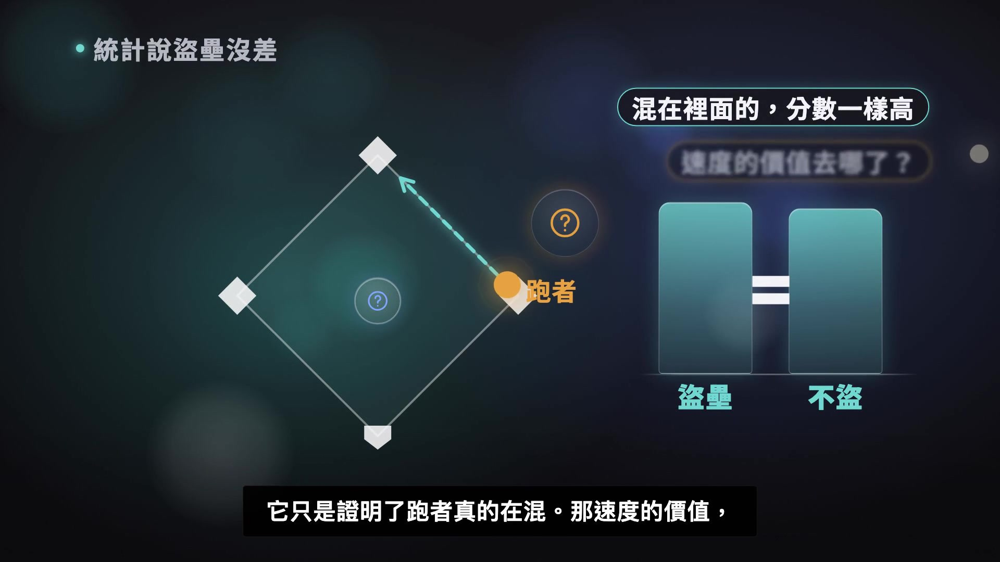

**逐字稿片段：** 那速度的價值 跑到哪裡去了 答案在下一棒身上 Pollock在教室裡找到一位 耶魯棒球隊的投手 叫Chris 問他 一雷站著一個跑得快的人 你會有什麼不一樣 Chris說至少三件事 想辦法把球傳回一壘牽制他 把球更快送到本壘 必要的時候故意把球偷偏 讓補手好傳 Polak再補一句 投手還會多投直球 因為直球最快到補手手上 這些事情 每一件都有代價 為了快 投手的放掉平常那一套 比較大的準備動作 直球又比變化球好打 打者等等就是這種球 把整串連起來看 快腿站上一壘 投手分心 下一棒就比較好打 所以快腿的價值 不在他自己倒壘的數字裡 在他後面那一棒的打擊率裡 那份統計沒有算錯 是看錯的地方 這一段我第一次看也愣了一下 那份統計只盯著跑者自己那一格 沒看到那一格讓投手跟下一棒變成什麼樣子

**話題推測：** 提出速度價值的真正體現點，引導至新的分析角度。

---

## 00:06:03

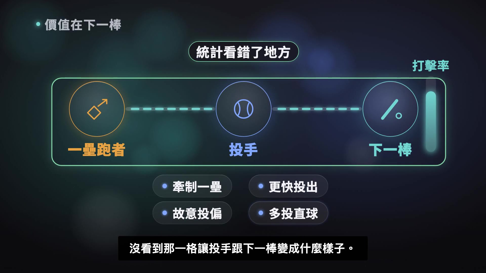

**逐字稿片段：** 網球跟棒球裡 選手是真的在變換出手 可是混合策略一定是有人在亂數嗎

**話題推測：** 引導至混合策略的第二種解讀方式，從亂數行為轉向主觀預期。

---

## 00:06:08

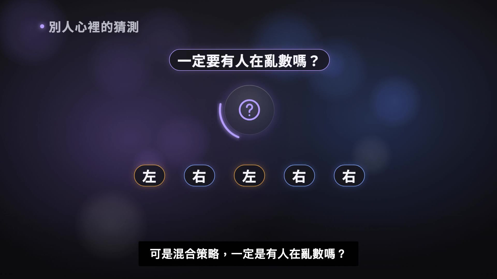

**逐字稿片段：** Paul Rack用一對約會的同學來回答 Nina跟David 上集他們約在電影院 忘了講好看哪一部

**話題推測：** 引入新的案例：一對情侶Nina與David的約會決策。

---

## 00:06:16

**逐字稿片段：** 這次又要出門了 要選的是去果園摘蘋果 還是去夜滷劇場看戲 妮娜比較想摘蘋果 David比較想看戲 可是兩個人都寧可待在一起 去自己比較不喜歡的地方 也比一個人好 結果他們又忘了先講好 這時候 兩個人都只能猜 對方會去哪 而且都有點偏向自己喜歡的地方 Paulak算出來 就次理由 他們根本碰不到面 比一半還多 可是這兩個人並沒有在丟銅板

**話題推測：** 描述Nina與David約會的具體選項，可能顯示圖片或文字。

---

## 00:06:38

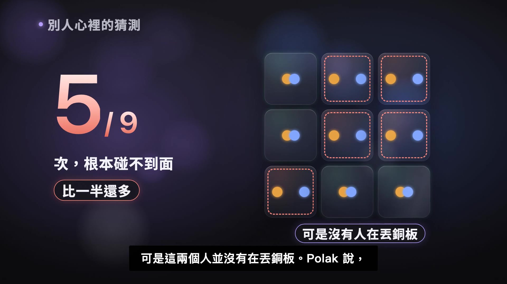

**逐字稿片段：** Paulak說 這裡的比例 比較好的讀法是 別人心裡對你的猜測 這是混合策略的第二種讀法 David覺得妮娜大概會去果園 這個猜測 就是Nina的混合策略 你不必真的亂數 別人心裡那個比例 就已經在決定結果了 這個讀法 請你先放著 到最後講名聲的時候 他會回來 那如果連猜都沒人在猜呢

**話題推測：** 解釋混合策略的第二種讀法，即「別人心裡對你的猜測」。

---

## 00:06:57

**逐字稿片段：** 那天剛好是家長週末 教室裡坐著不少爸媽 Polack 就拿報稅來講 報稅的人可以老實填 也可以少報一點 查賬的一方可以查你 也可以不查

**話題推測：** 引導至混合策略的第三種解讀方式，從個體行為轉向群體比例。

---

## 00:07:06

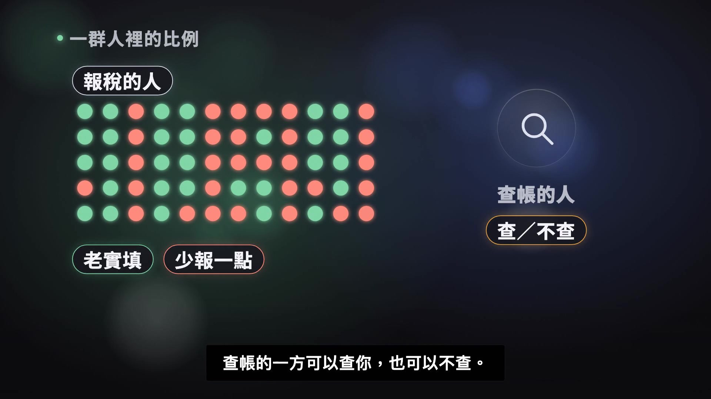

**逐字稿片段：** 我們先把四種結果用話講一遍 老實填又沒被查 相安無事 老實填卻被查 查賬的人百花利器 少報又被查到 罰得很重 還可能吃上官司 掃報又沒被查 就多留了一筆錢 現在看兩邊怎麼跟著改 大家都老實 查賬的就懶得查 沒人查 掃報就很划算 掃報的人一多 查賬又變得很值得 又是一圈猜拳 只是這一次 繞圈的是一整群人

**話題推測：** 列出報稅的四種可能結果，可能顯示為矩陣圖。

---

## 00:07:28

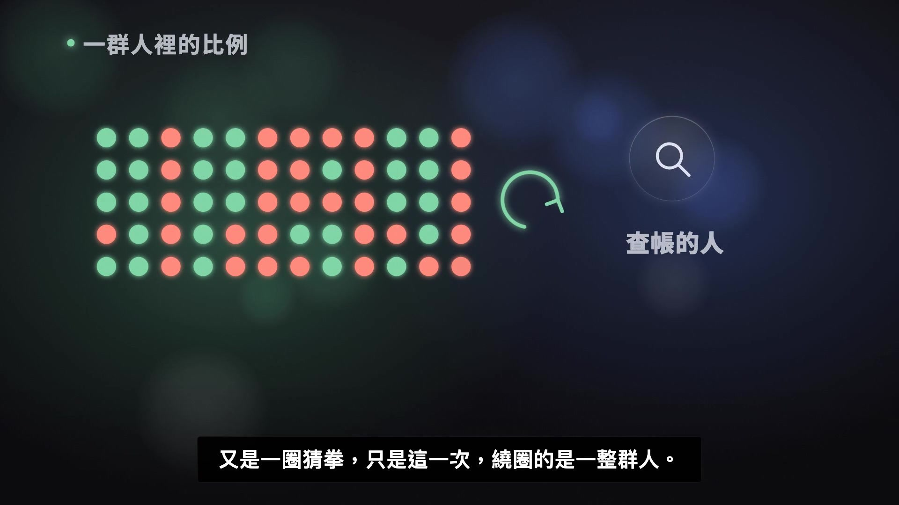

**逐字稿片段：** 算出來的結果是 每三個人裡有二個老實繳稅 這就是混合策略的第三種讀法 沒有人在丟銅板 也不是誰在猜誰 是一大群人裡 有的人這樣做 有的人那樣做 比例就停在那裡

**話題推測：** 公布報稅行為的計算結果，呈現社會中的老實繳稅比例。

---

## 00:07:38

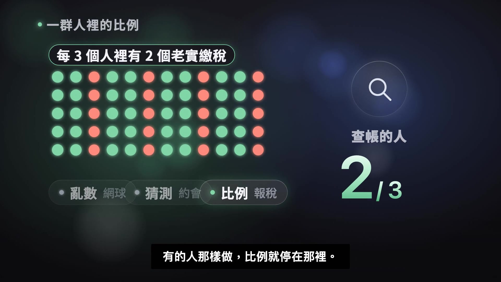

**逐字稿片段：** 有了這張表 Polak做了一個很像政策的實驗

**話題推測：** 提出一個政策實驗，討論增加逃漏稅罰金的影響。

---

## 00:07:41

**逐字稿片段：** 假設國會看不下去 決定把逃漏稅的罰金加倍 你猜老實繳稅的人會變多嗎 全班投票 多數人壓會變多 Polak還注意到 教室裡的家長都沒舉手

**話題推測：** 具體說明新的政策措施：將逃漏稅罰金加倍。

---

## 00:07:51

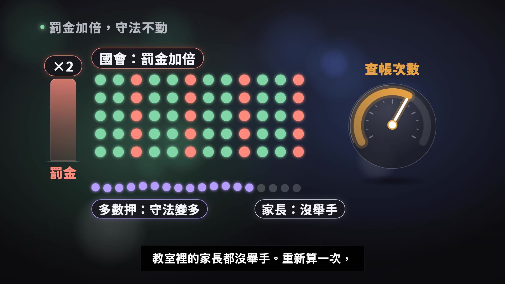

**逐字稿片段：** 重新算一次 收罰的比例完全沒動 還是每三個人裡有一個 重的是查賬 查賬的次數變少了 為什麼 答案又是那句老話 混在裡面的 分數一樣高 查賬的一方也在混 有時查有時不查 所以查跟不查 對他一樣划算 能讓他覺得一樣划算的收法比例 是用他自己那張表算出來的 查一次要花多少力氣 查到了有多少收穫 國會改的 卻是報稅那邊的表 所以報稅的人也不動 查賬的人少查一點

**話題推測：** 公布政策實驗的計算結果，發現老實繳稅比例並未改變。

---

## 00:08:17

**逐字稿片段：** 照樣壓得住 同一個道理 也解釋了為什麼有錢人比較常被查 不是他們比較不老實 是他們少報一次賺得比較多 要多查幾次 才能壓回原來的比例 真的想讓更多人收罰 Polak說 要改的是查賬那一方的誘因 我們先停一下

**話題推測：** 延伸報稅例子，解釋有錢人較常被查稅的原因。

---

## 00:08:31

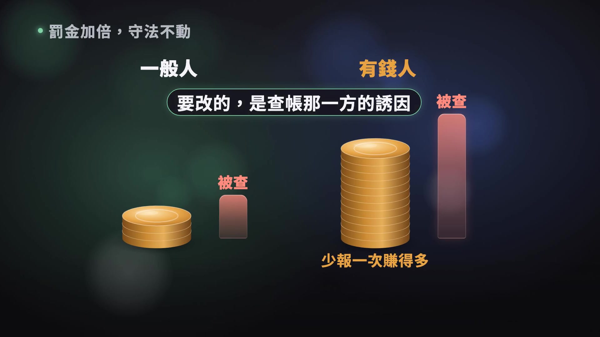

**逐字稿片段：** 把第一部分收起來 第二個問題是 對方會猜你的時候 然後你想好的那一步還划算嗎? 答案是隻要你一固定 就不划算 對面會在那裡等你 所以要混 這叫混合策略 他有三種讀法 真的在亂數 像Venus跟盜雷的跑者 別人心裡對你的猜測 像約不到的Nina跟David 還有一大群人你的比例 像報稅 三種讀法用同一句話算 混在裡面的分數一樣高 這句話帶出一個很怪的結論 你怎麼混 是對面的分數決定的 Serena反手變強 他反而掃手那一邊 罰金加重 改變的是查帳的人 如果前面哪一段沒跟上 記住這一句就夠了 你要算的不是自己那張表 是對面那張

**話題推測：** 總結第一部分的內容，畫面可能出現章節總結。

---

## 00:09:07

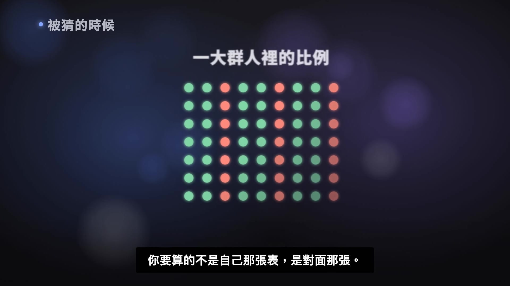

**逐字稿片段：** 第三種讀法特別重要 Polak在下課前說 下一堂課 他要把一大群人裡的比例這個想法 帶到一個完全不同的地方演化 到這裡為止

**話題推測：** 過渡到第二部分內容，將混合策略應用於演化領域。

---

## 00:09:16

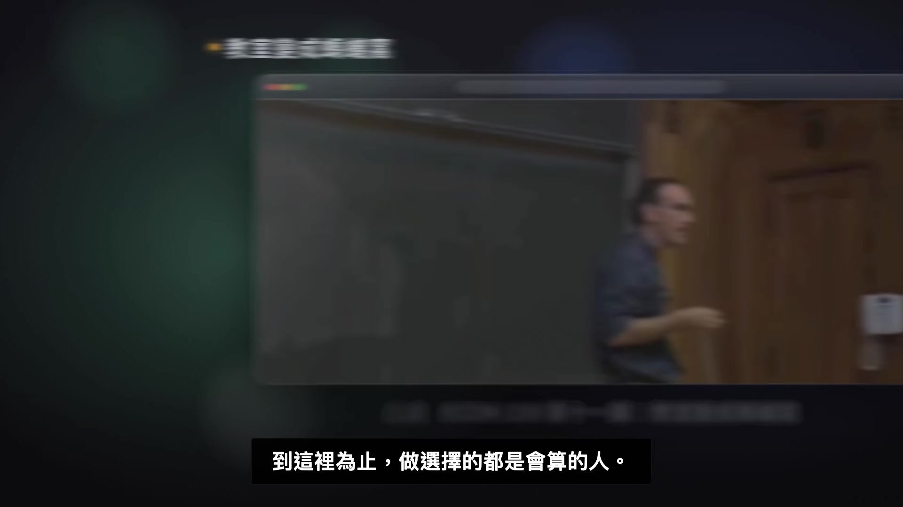

**逐字稿片段：** 做選擇的都是會算的人 Polak接著問 如果根本沒有人在算呢

**話題推測：** 提出第二部分的核心問題：若無人理性計算，何種策略會留存？

---

## 00:09:20

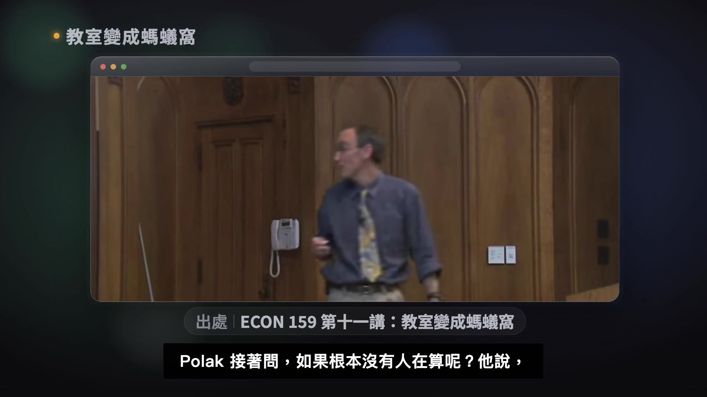

**逐字稿片段：** 他說 生物學家這幾十年來 拿賽局理論研究動物的行為

**話題推測：** 轉向生物學領域，探討賽局理論在動物行為上的應用。

---

## 00:09:23

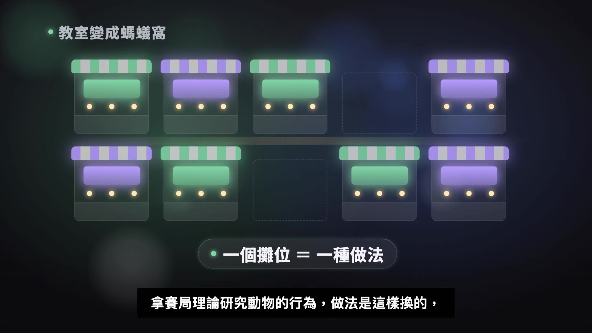

**逐字稿片段：** 做法是這樣換的 策略換成基因 分數換成能留下多少後代 做的好的做法後代多越來越多 做的差的慢慢消失 一隻螞蟻不會坐下來 想要衝出去守巢 他的做法是天生寫好的 他不會被說服 只會留下來或者消失

**話題推測：** 解釋生物學模型中的概念對應：策略=基因，分數=後代數量。

---

## 00:09:37

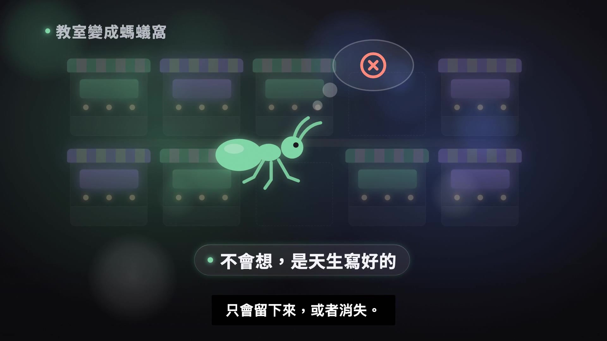

**逐字稿片段：** 你可以把它想成夜市裡的攤子 很多老闆不一定算過 怎麼定價最好 可是一條街逛下來 活下來的攤子 多半是賺得到錢的 賺不到的早就收掉了 Polak自己也舉了這種例子 市場上的競爭 就像叢林裡的競爭 公司倒閉 就是基因消失 他先講清楚兩件事 他不是生物學家 而且今天的模型很陽春 假設每一隻螞蟻 都是直接複製自己

**話題推測：** 以夜市攤販作類比，解釋適者生存的演化概念。

---

## 00:09:59

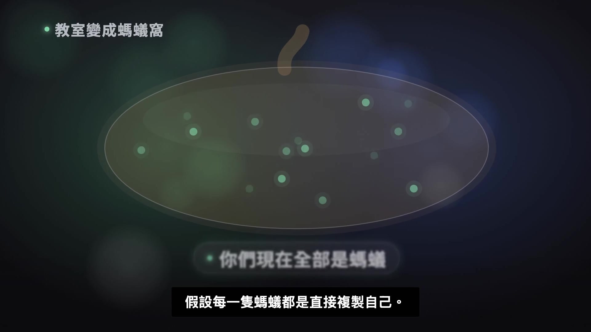

**逐字稿片段：** 然後他對全班說 你們現在全部是螞蟻 一開始 全班都是合作的螞蟻 碰在一起 兩邊都拿到不錯的分數 後透帶一路增加

**話題推測：** 開始進行螞蟻合作行為的群體實驗，預期畫面出現螞蟻或群體示意圖。

---

## 00:10:06

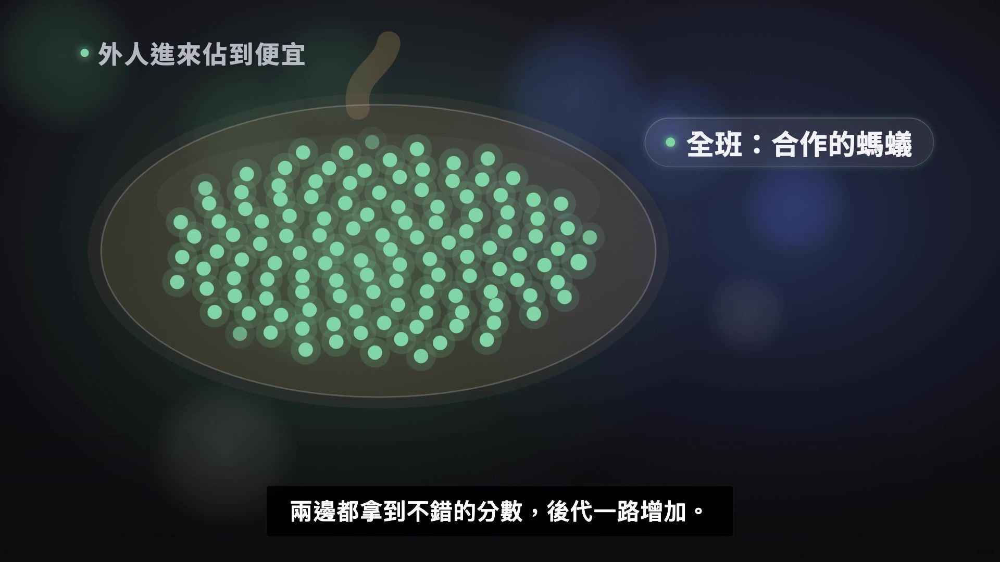

**逐字稿片段：** 然後Polak 放進一個突變 突變的意思是 族群裡偶爾生出一小群作法跟大家不一樣的 這次的突變是幾位助教他們天生不合作 一隻叫Nick的合作螞蟻 剛好碰上助教Rahul Nick出力 Rahul不出力 Nick什麼也沒拿到 Rahul拿到最高分 一輪一輪下去 Rahul這群越來越多 合作的螞蟻碰到他們的機會也越來越高 這裡要給一個名字 這個標準叫Evolutionary Stable 中文叫演化穩定 它的意思是 一整群都用同一種做法 少數外人帶著別的做法進來 掙不到便宜 最後自己消失 照這個標準 合作不是演化穩定 外人一進來就掙到便宜

**話題推測：** 引入「突變」概念，描述少數不合作螞蟻的出現。

---

## 00:10:41

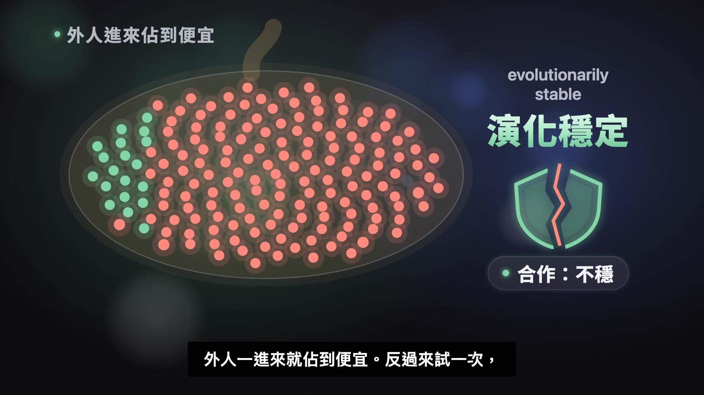

**逐字稿片段：** 反過來試一次 全班都不合作 放進一隻合作的土便豬叫Metal 它碰到的幾乎都是不合作的 每一次都吃虧 很快就不見了 長期留下來的是不合作 Polak的結論很直接 大自然選出來的結果 可能很糟 可是這個結論 跟你在動物節目裡看到的不一樣 獅子打獵的時候真的會合作 螞蟻窩被攻擊的時候 真的有螞蟻衝出去 模型卻說合作留不下來 到底哪裡不對 全班猜了好幾個方向 有人說不同族群之間會競爭 有人說動物會抓作弊的 Polag說有道理 可是他要的答案更簡單 他還提示 你們這個年紀每天都在想的事 最後一位同學講中了

**話題推測：** 反轉情境，探討當所有螞蟻都不合作時的演化結果。

---

## 00:11:16

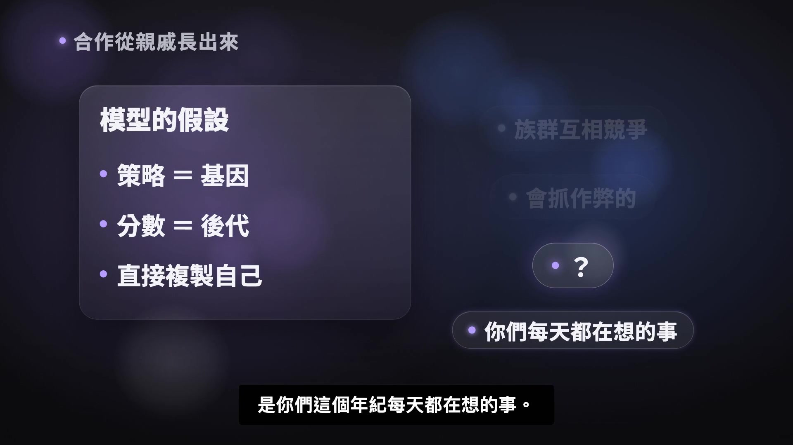

**逐字稿片段：** 因為模型假設的是無性生殖 真實的動物有爸爸有媽媽 基因會分到子女性類姐妹表情身上 所以真正要留下來的 不是哪一隻獅子 是那一段基因 你是一隻螞蟻 你衝出去可能會死 可是草裡很多是你的姐妹 身上有很多跟你一樣的基因 你死了 他們活下來 那段基因照樣傳下去 合作 是從親戚關係裡長出來的 我很喜歡這一段 Paul Lark先把模型講完 再親手指出他漏掉什麼 下次有人說 這是天性所以是對的 你可以先問一句 那個模型假設了什麼

**話題推測：** 揭示解決模型矛盾的關鍵點：模型假設為無性生殖。

---

## 00:11:45

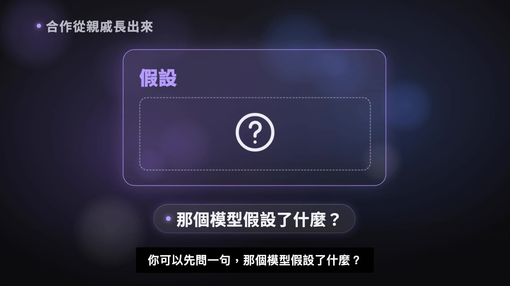

**逐字稿片段：** 演化穩定這個定義 是生物學家Maina Smith 在1971年正式寫下來的 經濟學那邊 1950年代有了納許均衡 上集講過 每個人都已經對別人做了最好的回應 沒有人想自己改 一個看基因怎麼傳 一個看人怎麼選 出發點完全不一樣 可是Polak把兩個定義攤開來對 他們幾乎是同一件事

**話題推測：** 介紹「演化穩定」的正式定義及其創始者。

---

## 00:12:04

**逐字稿片段：** 演化穩定的做法 一定也是拿取均衡 為什麼 我們反過來想 如果某種做法不是對別人最好的回應 就代表有另一種做法更好 那種做法變成突變闖進來 就會佔到便宜 原來的做法也就不穩了

**話題推測：** 闡述演化穩定策略與納許均衡之間的等價關係。

---

## 00:12:16

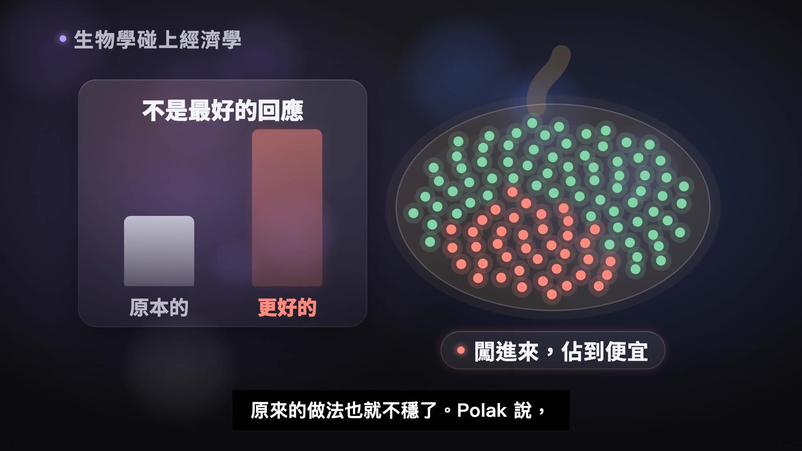

**逐字稿片段：** Polak說 這讓他想到17世紀 大家發現行星怎麼轉 跟時鐘怎麼走 是同一套力學 他也自己笑 說大概只有少數同學會跟他一起興奮 其他人覺得他瘋了 對我們來說這句話很有用 不會算的螞蟻最後停下來的地方 會算的人也算得到 所以第一部分那些工具 這裡照樣能用

**話題推測：** 以17世紀行星運動與時鐘運作為例，類比兩種理論的共通性。

---

## 00:12:32

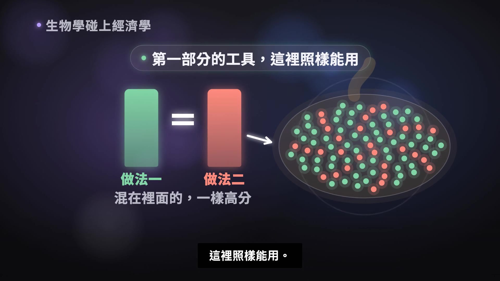

**逐字稿片段：** 有了演化穩定的把持 Polak先拿他量一件很日常的事 開車靠左還是靠右 你在一個大家都靠左的地方靠右開來 你活不了多久 Polak說 一個沒把旅遊書讀仔細的美國觀光客 到了英國 很快就被淘汰了 我們用他把持量一次 大家都靠左 竟然有一個靠右的 他碰到誰都要撞車 完全佔不到便宜 所以靠左是穩的 大家都靠右 進來一個靠左的 也一樣 所以兩個都穩

**話題推測：** 應用演化穩定概念分析日常生活現象：開車靠左或靠右。

---

## 00:12:54

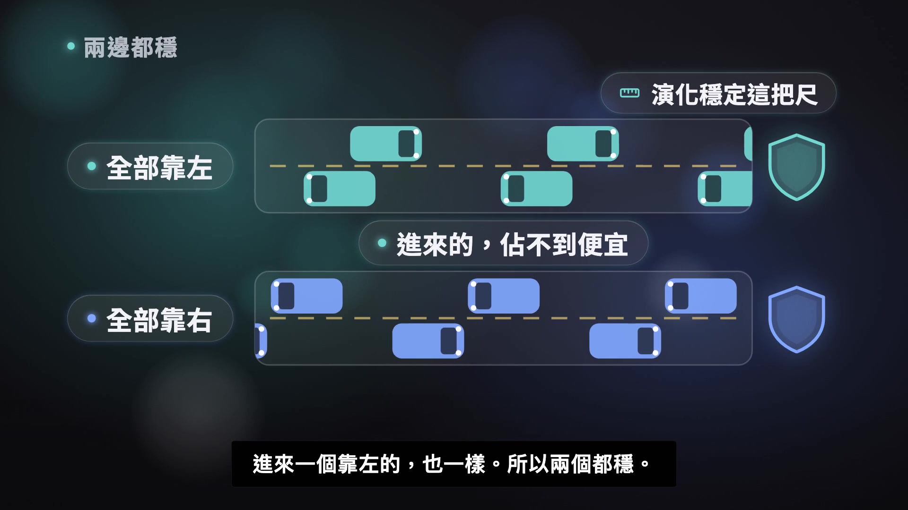

**逐字稿片段：** 這帶出兩件事 第一件 世界上可以同時有 好幾種穩的習慣 英國 日本 澳洲靠左 法國 美國靠右 一點都不奇怪 第二件 不代表比較好 Polla開玩笑說 靠左看起來比較有氣質 所以他在表上 給靠左多一點分數 就算這樣一個社會 照樣可能停在靠右 而且再也改不動 因為第一個改的人 一定先吃虧 我們常聽到一句話 留下來的就是最好的 這裡剛好相反 留下來的只是沒有被推翻的 靠著靠右不用打架 可是很多動物要搶東西 Polak 記著講一個生物學家研究很久的遊戲

**話題推測：** 歸納出開車方向演化穩定的兩項特點。

---

## 00:13:22

**逐字稿片段：** 這個遊戲叫Hawk Dolph 中文叫英格賽局 他的意思是 同一種動物裡有兩種脾氣 英式遇到就打 鴿式遇到就讓

**話題推測：** 正式介紹「鷹鴿賽局」名稱及概念。

---

## 00:13:30

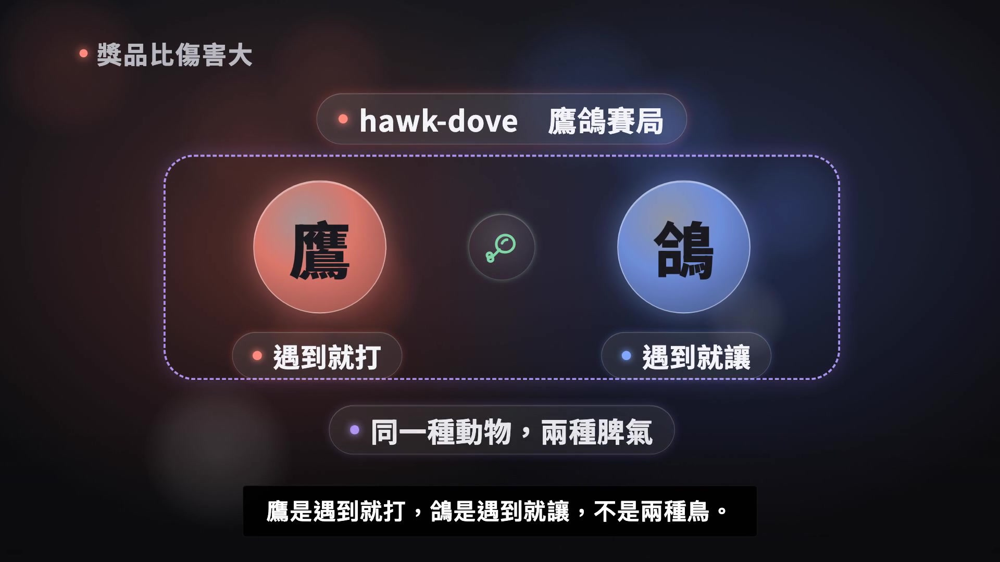

**逐字稿片段：** 不是兩種鳥 要搶的東西可能是食物 可能是地盤 可能是交配的機會 我們叫他獎品

**話題推測：** 定義鷹鴿賽局中的「獎品」概念，可能顯示相關圖示。

---

## 00:13:34

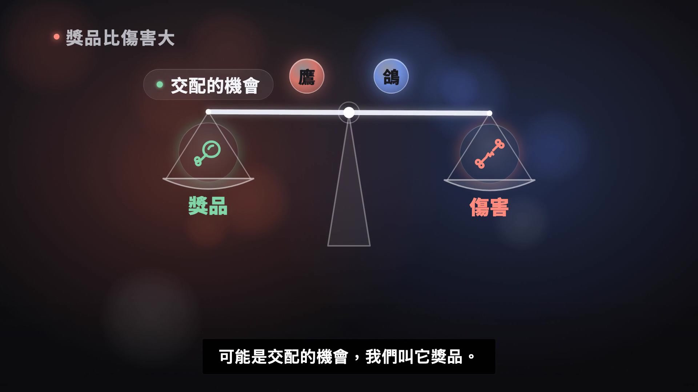

**逐字稿片段：** 真的打起來也有代價 可能頓一條腿 甚至沒命 我們叫他傷害 Polak沒有給這兩樣填數字 就讓他們留在黑板上 等一下就會很有用 先看第一種情況 獎品比傷害大 整群都是鴿 進來一隻鷹 對面每次都讓 他每次都拿到獎品 很快就多起來 所以全是鴿站不住 整群都是鷹 進來一隻鴿 他每次都讓 什麼也拿不到 很快就消失 所以獎品夠大的時候 全部當鷹才是穩的 你看到一群動物天天打架 不一定是脾氣壞 可能只是那邊的獎品真的夠大

**話題推測：** 定義鷹鴿賽局中的「傷害」概念，可能顯示相關圖示。

---

## 00:14:01

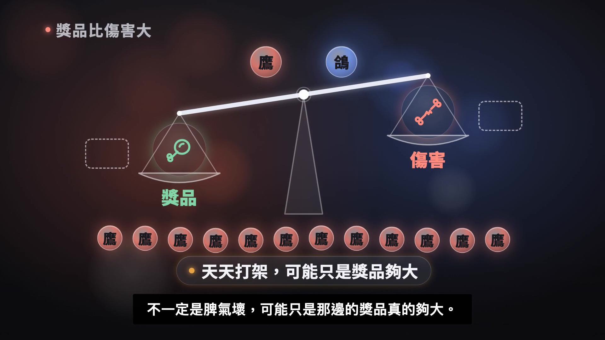

**逐字稿片段：** 第二種情況比較有意思 傷害比獎品大 全部當鴿 一樣站不住 來一隻鷹就橫著走 可是全部當鷹也站不住 兩隻鷹碰在一起 一半的時候搶到獎品 一半的時候受傷 傷又比獎品重 平均下來是虧的 這時候進來一隻鴿 它拿不到獎品 可是也不會受傷 反而過得比鷹好 所以最後停下來的是 鷹跟鴿混在一起 那比例是多少 這裡用的 正是第一部分那句話 混在裡面的分數一樣高 族群裡鷹跟鴿都活得下去 代表當鷹跟當鴿 平均分數一樣

**話題推測：** 分析第二種情況：傷害大於獎品的演化結果。

---

## 00:14:28

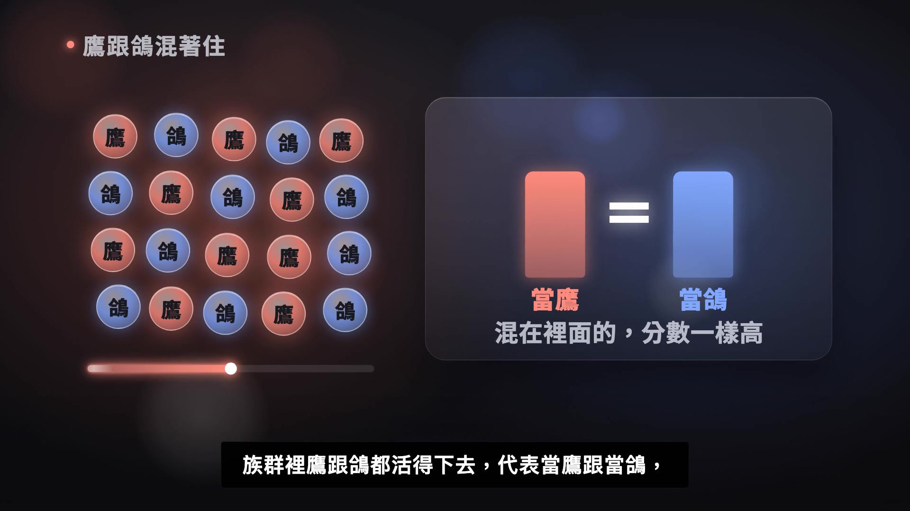

**逐字稿片段：** 把這個等號寫下去 答案很乾淨 因的比例剛好等於獎品除以傷害 獎品越大 因越多 傷害越大 割越多 你看網球場上那個工具 搬到動物身上照樣算得出來 只是這一次混合不是誰在亂數 是一整群動物裡 有多少是因 有多少是割 就像暴碎那一群人 接下來Polak問了一個問題 我第一次聽也答錯了

**話題推測：** 公布鷹鴿賽局中鷹與鴿的比例計算公式，預期畫面會顯示公式。

---

## 00:14:49

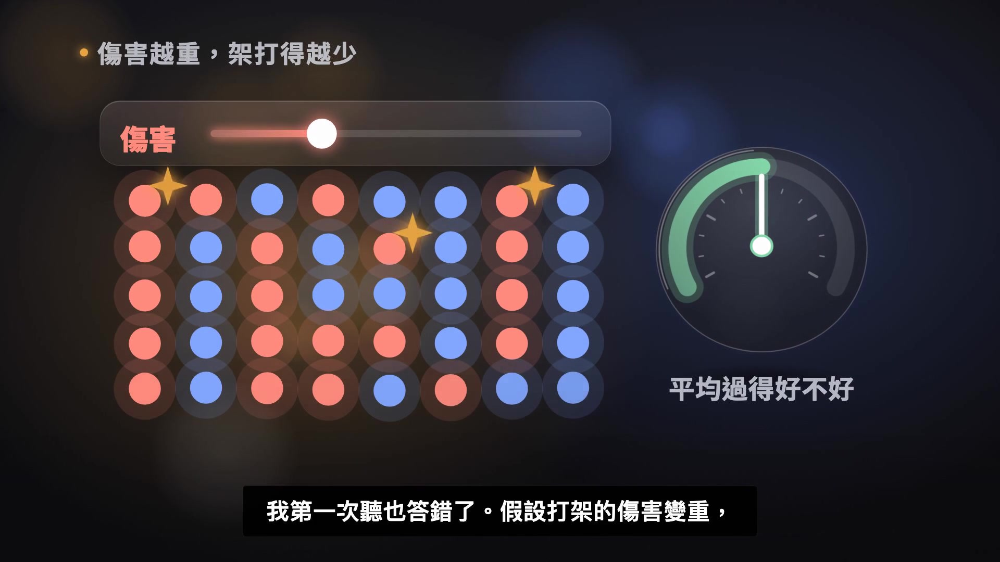

**逐字稿片段：** 假設打架的傷害變重 斷的不是腿 是整條命 整個族群平均會過得更好 還是更差 直覺會說更差 受重傷的更多了 算出來就是更好 原因是傷害一大 因的比例就掉下來 真正打起來的次數少很多 少到足夠補回每一次受的傷 打架的代價變重 架反而打得少 大家平均反而過得好一點 這個理論還有一個優點 它能被檢驗 獎品跟傷害 我們在野外看不到 可是打架的比例看得到 打架的比例一數出來 就能反推獎品跟傷害的比值

**話題推測：** 具體說明情境：打架傷害加重至危及生命。

---

## 00:15:18

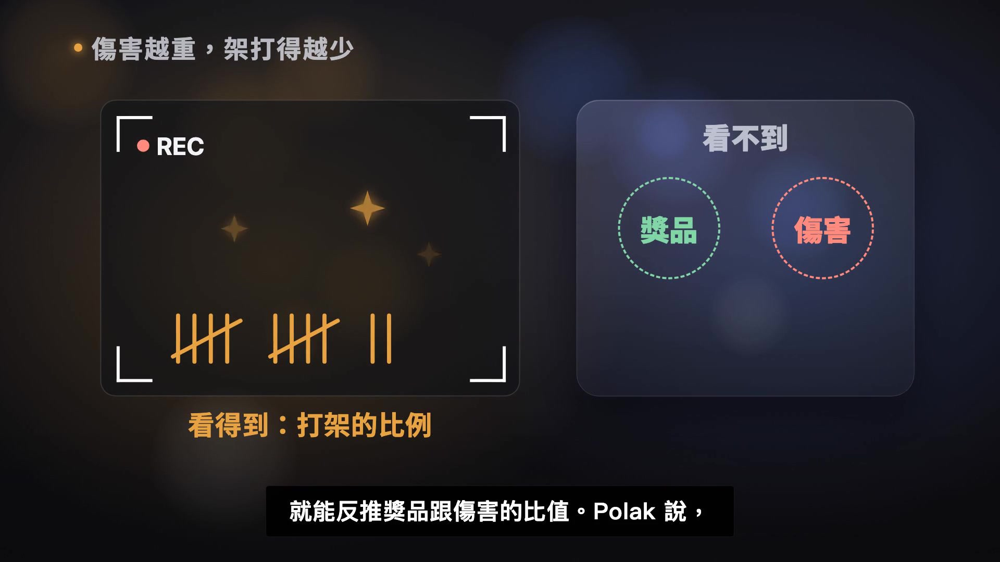

**逐字稿片段：** Pollack說 這件事在經濟學跟生物學裡 都有一個名字 叫識別 他的意思是 從看得到的資料 把理論裡看不到的東西算回來 可是能解釋已經看到的事還不夠 理論要厲害 得說出一件還沒人看過的事

**話題推測：** 介紹經濟學與生物學中的「識別」概念，即從可觀測數據反推不可觀測參數。

---

## 00:15:31

**逐字稿片段：** Polec說 如果自然界真的有一場猜拳 三種做法互相剋 那用演化穩定這把尺去量 會發現沒有任何一種比例是穩的 族群不會停下來 會一圈一圈的繞 1990年代中期 一篇登在Nature期刊的論文 真的找到了 那是一種蜥蜴 它們有三種顏色 橘色的地盤很大 守著很多母蜥蜴 黃色的偷偷混進別人的地盤 找機會交配 藍色的地盤小 幾乎只收著一隻

**話題推測：** 提出理論需要預測尚未觀測事件的重要性，引入猜拳遊戲。

---

## 00:15:55

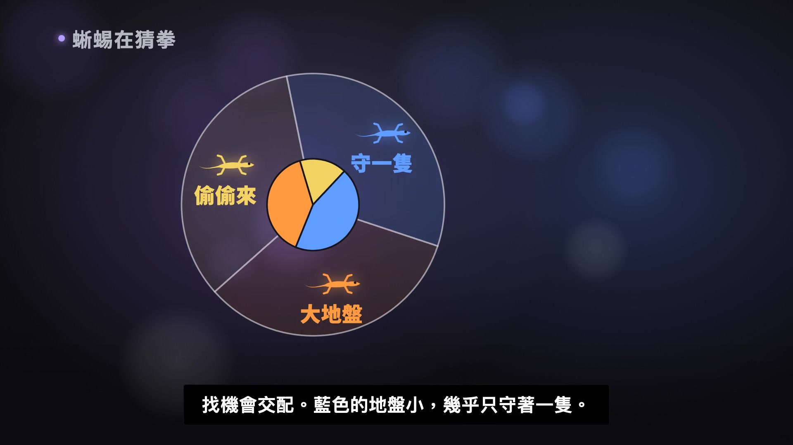

**逐字稿片段：** 橘色被黃色佔便宜 黃色被藍色佔便宜 藍色又被橘色佔便宜 族群的比例 正在照著模型說的在繞圈 Pollock說 這對生物學家來說 就像找到黑洞 上集結尾那場拆圈 網球場上那一圈 到這裡變成了 一整個族群的一圈

**話題推測：** 解釋三種蜥蜴策略之間的相剋關係，可能以循環圖表示。

---

## 00:16:09

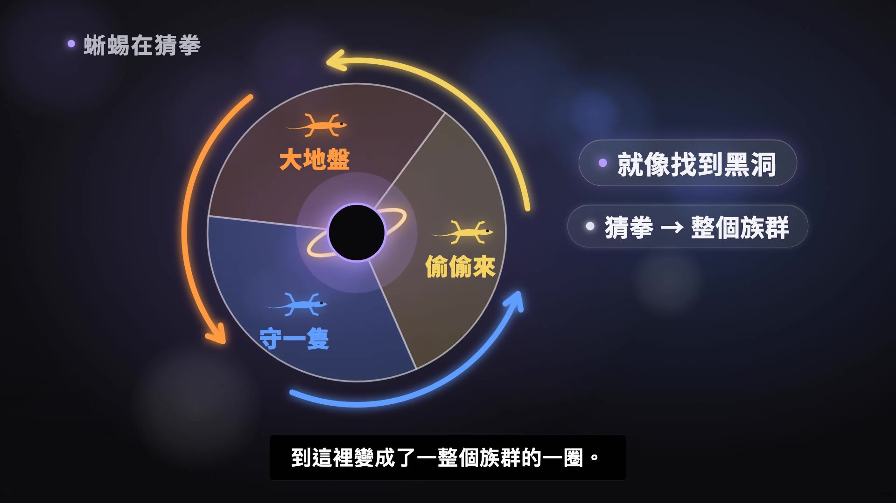

**逐字稿片段：** 我們把第二部分也收起來 第二個問題是 如果根本沒有人在算 只是一代一代換人 哪一種做法會留下來 答案是 留下來的是 外人進來佔不到便宜的做法 這叫演化穩定 而且不會算的螞蟻停下來的地方 會算的人也算得到 所以第一部分的工具照樣能用 硬的比例就是這樣算出來的 可是這一部分也給了三個提醒 留下來的不一定好 一窩合作的螞蟻會被不合作的吃掉 留下來的不止一種 靠左靠右都穩 穩了就很難改 有時候根本停不下來 像蜥蜴一直在繞圈 我們再回到夜市 在演化里老攤子什麼也不能做 新攤子進來 佔不佔得到便宜 全看那張分數表 可是真的市場不是這樣 老闆看得到隔壁新開了一家 他可以決定要不要降價

**話題推測：** 總結第二部分的內容，畫面可能出現章節總結。

---

## 00:16:49

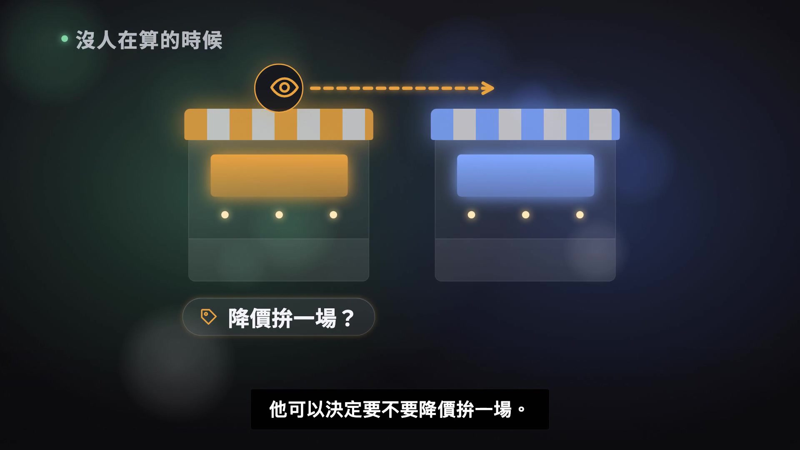

**逐字稿片段：** 拼一場 一旦有人看得到你的動作 看完才決定怎麼回你 整件事就換了一個樣子 這個老攤子跟新攤子 我們先放著

**話題推測：** 過渡到第三部分內容，強調「對方看得到你的動作」的影響。

---

## 00:16:56

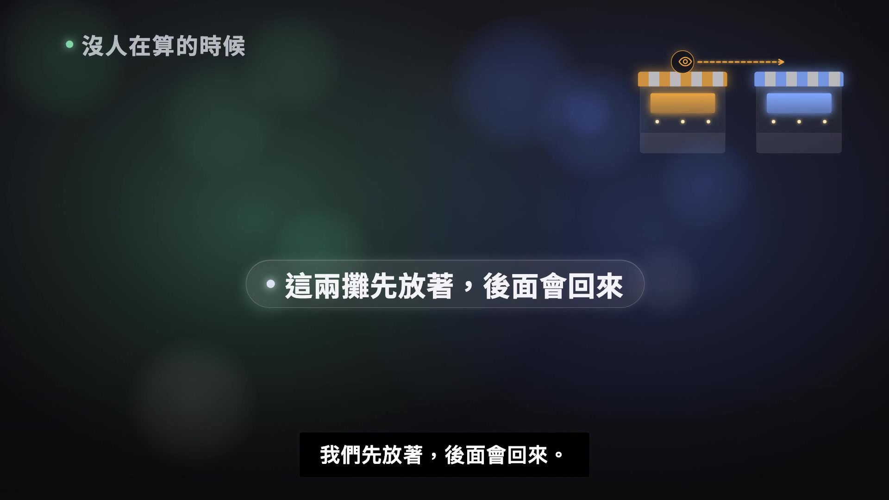

**逐字稿片段：** 後面會回來 Polak拿出一頂粉紅色的帽子 這是裡面放真的錢

**話題推測：** 引入新的主要案例：Polak教授用粉紅帽子和真錢進行的課堂遊戲。

---

## 00:17:00

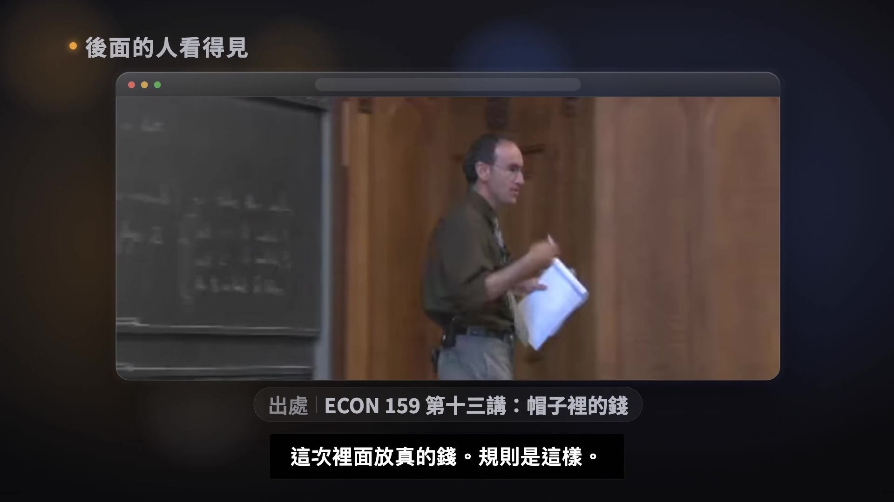

**逐字稿片段：** 規則是這樣 第一個人可以放零元一塊 花三塊進帽子 然後把帽子傳給第二個人 第二個人打開看得到裡面有多少

**話題推測：** 說明第一位玩家的選擇和規則。

---

## 00:17:07

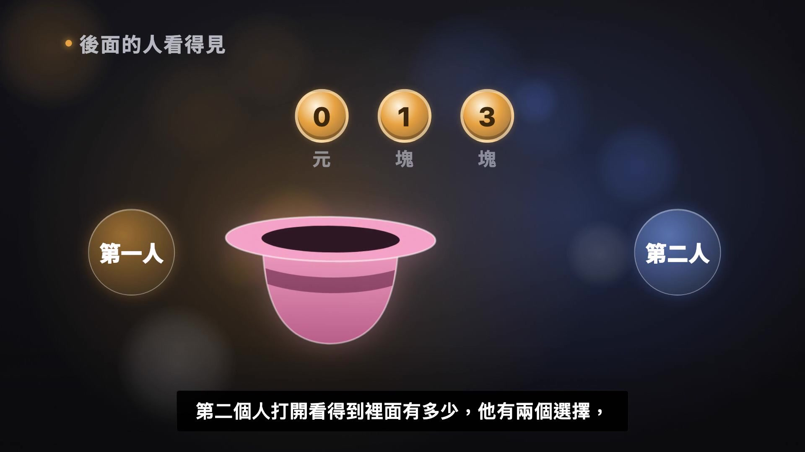

**逐字稿片段：** 還有兩個選擇 跟著放一樣多 兩個人一起把錢翻倍 或者直接把錢拿走 放得越多 一起翻倍的時候 這時候兩個人賺越多 被拿走的時候也虧越多 第一組 Justin放了一塊 Nate跟了一塊 換一組 Katy也放一塊 帽子從講臺一路傳到教室另一頭 沒有人動裡面的錢 Steven也跟了 兩組都沒人放 三塊

**話題推測：** 說明第二位玩家的選擇和規則。

---

## 00:17:27

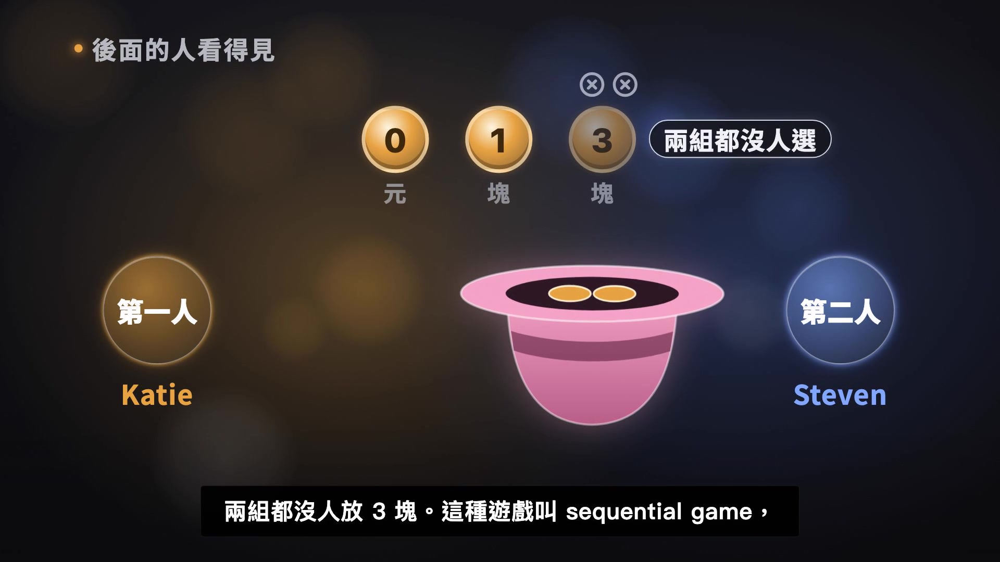

**逐字稿片段：** 這種遊戲叫Sequential Game 中文叫序列賽局 他的意思是大家照順序動 可是重點不在誰先誰後 在後面的人看得到前面的人做了什麼 而且前面的人知道他看得到 網球是兩個人同時決定 只能猜 帽子是看了再決定 所以放錢的人得先想好 對方看到之後會怎麼做 為什麼沒人放三塊 Justin自己講得很清楚 放一塊 他跟著放比較賺 他會跟 我放三塊 他直接拿走比較賺 他一定拿走 Paulak回頭問Nate 要是帽子裡是三塊 你會怎麼做 Nate說 我喜歡Justin 可是我把錢拿走 全班都笑了 你看Justin做的事 他先跑到對方的位置上 看對方在那個當下會怎麼選 再走回來決定自己這一步

**話題推測：** 介紹「序列賽局」（Sequential Game）這一概念。

---

## 00:18:03

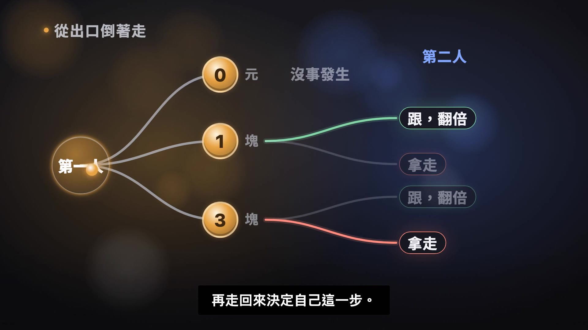

**逐字稿片段：** 這個做法叫backward induction 中文叫逆向歸納 他的意思是 從最後一步開始 一步一步往回推 他很像走迷宮 你不從入口硬闖 你從出口倒著畫回來 錄一下就清楚了 巴拉克說 這是這學期最重要的一樣東西 可能是你在耶魯學到最有用的一樣 他還說 以後我點到你 你又剛好在睡覺 不知道問題是什麼 答案就是逆向歸納 那天下課前

**話題推測：** 介紹「逆向歸納」（Backward Induction）這一核心分析方法。

---

## 00:18:24

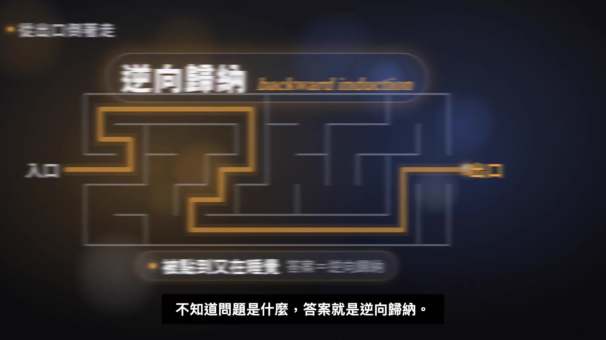

**逐字稿片段：** 波拉克馬上考大家一題 他指著一排同學說 你們現在都是餓了的獅子 最旁邊那位是一隻羊 規矩是 只有最大的獅子可以吃羊 可是他一吃飽就會睡著 睡著的時候 第二大的獅子就可以吃他 第二大的吃完也會睡著 第三大的就可以吃他 一路排下去 他問最大的那隻你吃不吃 那位同學說不吃 吃了我會被吃掉 這個直覺很正常 可是他只看了一步 我們從出口倒著走 最小的那隻獅子後面沒有人 他有機會就一定吃 所以倒數第二隻不敢吃 一吃就會被最小的吃掉 倒數第二隻不吃 倒數第三隻就可以放心吃 再往前一隻又不敢吃 吃不吃吃不吃 一直一直交替下去 Polak一路數回最大的那隻 答案是他其實可以吃 然後他笑著說 五分鐘前我才講 逆向歸納最重要 結果沒有人用

**話題推測：** 提出一個新的課堂問題：獅子吃羊的序列決策遊戲。

---

## 00:19:07

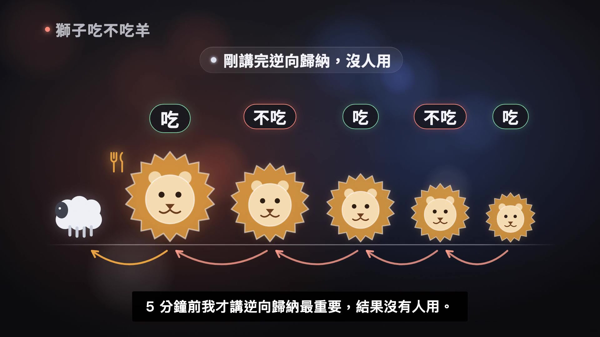

**逐字稿片段：** Polak說 那裡帽子是一個玩具 真正的遊戲叫借錢 第一個人是出錢的人 像專門投錢給新公司的創業投資公司 第二個人是拿錢去創業的人 錢進去以後 創業的人可以認真做 也可以隨便花 甚至帶著錢跑到墨西哥 你看剛剛的帽子 把三塊錢的大案子做成了 出錢的人跟創業的人 兩邊都比做一塊錢的小案子賺得多 兩個人都想要大案子 可是走不過去 出錢的人倒著算 就知道錢一多 對方拿走比認真做划算 所以不敢多放

**話題推測：** 將帽子遊戲應用於現實問題：借錢與創業投資。

---

## 00:19:35

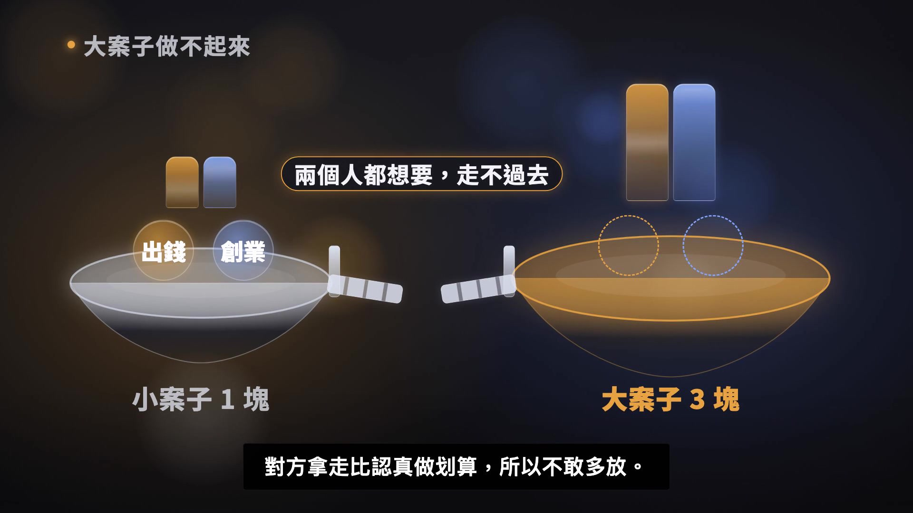

**逐字稿片段：** 這個問題叫Moral Hazard 中文叫道德風險 他的意思是 對方拿到東西以後 會有誘因去做對你不好的事 而你管不到 你買汽車保險也會碰到他 保險公司不讓你保全額 一定要你自己付一部分 因為全額保了 你可能就懶得鎖車門 回到借錢出錢的人 只好把案子做小 讓對方沒那麼想跑 兩個人都知道 大案子比較好 卻只能做小的 這是道德風險最難受的地方 要走到大案子 Polakun全班有什麼辦法 有人說立法 有人說分批給錢 HOLOC 都說好 可是各有限制 其中一位同學說 創業的人拿小頭 所以創業的人寧可把錢整包拿走 那就倒過來 讓創業的人多拿一點 多到把錢還回去比拿走更划算 這樣一改他就不跑了 大案子做得成 出錢的人分道的比例變小 可是餅變大了 他拿到的錢反而比做小案子多

**話題推測：** 介紹「道德風險」（Moral Hazard）這一經濟學概念。

---

## 00:20:23

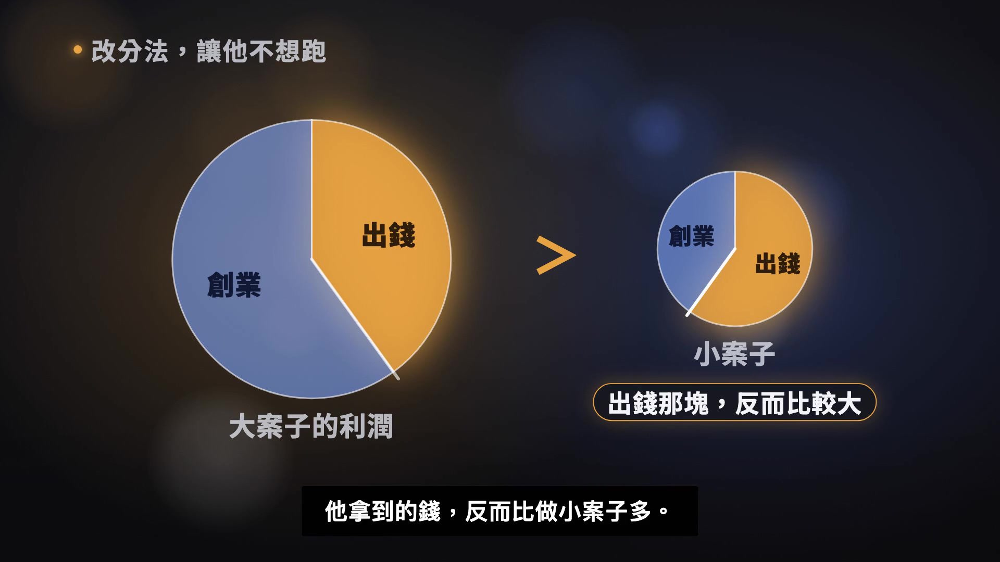

**逐字稿片段：** 這個做法叫incentive design 中文叫誘因設計 它的意思是 把規則改到對方自己想做對的事 不是去盯著他 是讓做對的事對他比較划算

**話題推測：** 介紹「誘因設計」（Incentive Design）這一解決道德風險的方法。

---

## 00:20:32

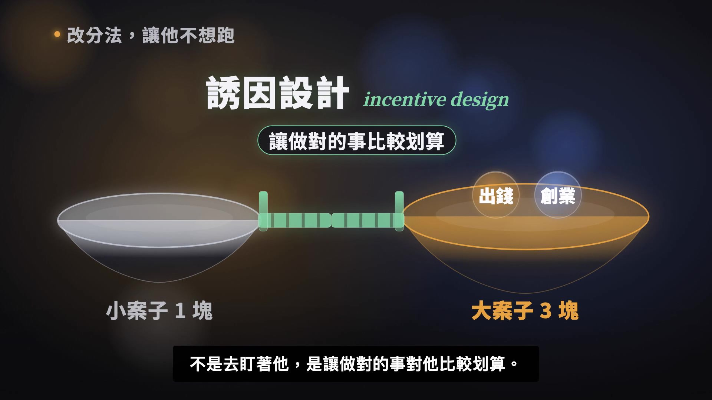

**逐字稿片段：** 不過誘因很難寫對 Polak拿自己開玩笑 他帶三歲的女兒去摘腹盆子 說好壓壞的可以當場吃 完好的帶回家 女兒宅一顆 轉頭跟他說壓壞了 放進嘴裡 再宅一顆又壓壞了 Paulak說 一個三歲小孩懂得道德風險 比教授還多

**話題推測：** Polak教授以女兒摘覆盆子的親身經歷，幽默說明誘因設計的困難。

---

## 00:20:47

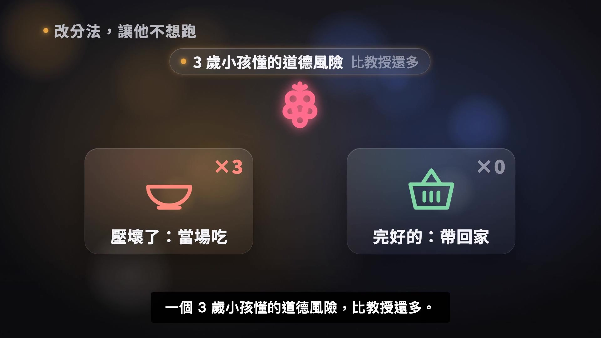

**逐字稿片段：** 還有他大多手的辦法 擔保餅 你去借錢創業 銀行會要你壓一樣東西 Paulak說 對 大部分學生來說 那會是爸媽的房子 擔保餅怎麼幫上忙 很多人以為是銀行比較安心 就算你跑了 他還有一間房子 Paulak說 說銀行其實不想要你爸媽的房子 重點是你一跑 就會失去它 你把自己某一條路上的結果弄得很慘 對方倒著算 就敢借你大錢 自己的分數變低 最後反而拿得更多

**話題推測：** 提出另一種解決方案：擔保品（Collateral）。

---

## 00:21:11

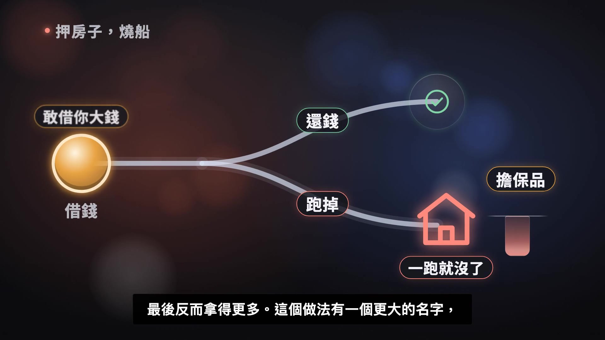

**逐字稿片段：** 這個做法有一個更大的名字 叫Commitment 中文叫承諾 它的意思是 先把自己的某些選項拿掉 讓對方相信你接下來只會那樣做

**話題推測：** 介紹「承諾」（Commitment）這一策略概念。

---

## 00:21:19

**逐字稿片段：** Polak舉了1066年的故事 諾曼人渡海打英格蘭 傳說指揮官William 上岸後把船燒了 士兵沒有退路 只能打 對面看到了就可能不敢衝 薩克遜人還是衝了 這個故事好聽 可是不完全是真的 重點是 承諾要有用 對方一定要知道

**話題推測：** 引述1066年諾曼人渡海作戰燒船的歷史故事，說明承諾的應用。

---

## 00:21:37

**逐字稿片段：** 電影齊在博士裡 蘇聯造了一臺 一被攻擊就自動反擊的末日機器 卻忘了告訴美國人 承諾的想法 Pollock接著拿去看生意

**話題推測：** 引用電影《奇愛博士》中的末日機器案例，說明承諾的可信性問題。

---

## 00:21:46

**逐字稿片段：** 他回到上集那兩家賣水的公司 上集他們是同時決定要做多少 這次改成一家先決定 另一家看到以後再決定 這個先後的版本 叫Stakeberg模型 先動的那家應該多做還是少做 很多人的第一個反應是 先動等於先把底牌亮出來 活動人家看到對方做很多隻能收回去 因為水一多價格就掉 兩家一起做多 大家都賺不到錢 所以先動的那家把產量拉高 逼對方少做 自己賺的比同時決定的時候多 你怎麼確定他一定賺的比較多 他本來就可以照就做 照就做就回到上集的結果 他選擇改 就代表改了比較賺 活動的那家做的少 價格又掉 賺的比以前少 倒是買水的人高興 兩家加起來做的水變多 價格變便宜 在這個遊戲裡先動是划算的 可是先動有一個前提 對方要相信你真的已經動了 plug one 那宣佈一下行不行 有位同學馬上說 不行 沒有可信的承諾

**話題推測：** 回到之前的賣水公司案例，引入先後決策的情境。

---

## 00:22:35

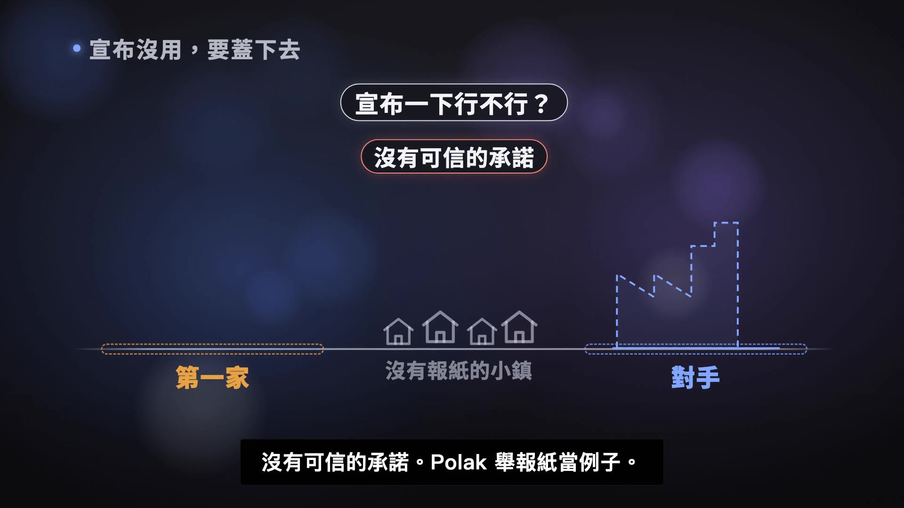

**逐字稿片段：** 破了舉報紙當例子 兩家公司要進同一個小鎮辦報 那個鎮本來一份報紙都沒有 其中一家的老闆是Murdoch 他跳出來說 我要印很多份 對面憑什麼相信 花獎完可以改 到了真的要印的那一天 印少一點可能比較划算 他就會印少 所以光說沒用 要讓這句話算數 他得真的把印刷廠蓋起來 而且那間工廠 不能隨便當廢鐵賣掉

**話題推測：** 提出新的商業案例：兩家公司進小鎮辦報的決策。

---

## 00:22:55

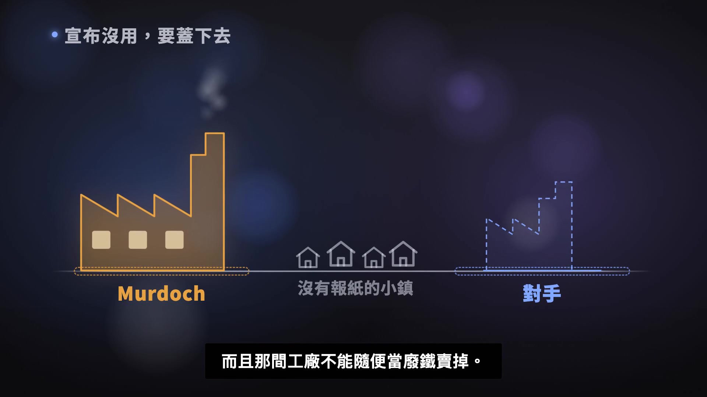

**逐字稿片段：** 這種錢叫sum cost 中文叫沉沒成本 意思是花出去就拿不回來的錢 平常我們說 沉沒的成本是包袱 要學者放下 這裡剛好反過來 錢砸下去拿不回來 對面才相信你真的要做那麼多 說穿了 這跟燒船是同一件事 你把退路收掉 對面的算盤才會跟著變 同樣這兩家半報的公司 Polak再加一個轉折

**話題推測：** 介紹「沉沒成本」（Sunk Cost）概念，及其在建立承諾中的作用。

---

## 00:23:15

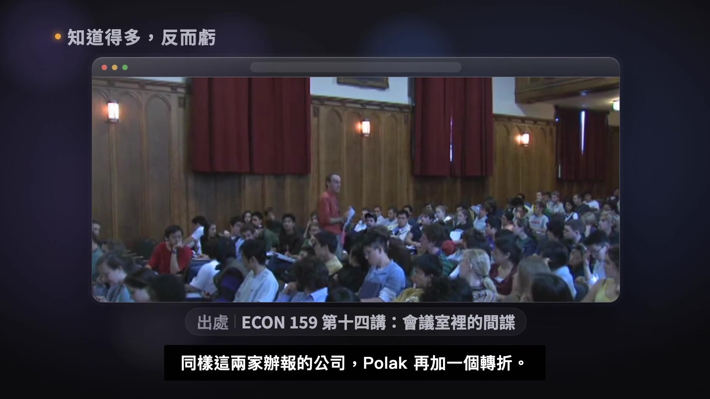

**逐字稿片段：** Murdoch在對手的會議室裡 安插了一個人 會議開完 消息就傳回去 然後有人告訴對手 你們會議室裡有間諜 只是不知道是誰 你是對手你會怎麼做 一位同學說 他有一份假計劃 可是很難 合約總要真的錢 另一位同學給了更好的答案 不用假的 就把真的計劃給他看 你決定蓋一座大工廠 消息傳到Murdoch那裡 他現在就像剛剛後動的那一家 看到你做多了 只好縮小 你等於被推到先動的位置上 所以安插間諜的那一家 因為看得到你 反而虧了 條件是你要知道看得到 Polak把這幾堂課的例子 放在一起講 燒船讓選擇變少 擔保品讓分數變低 間諜讓一方知道的更多 結果都跟你想的不一樣 因為他們改變了對面的做法 一個人自己做決定的時候 選擇多 知道多 一定不會吃虧 可是在賽局裡都不一定 這幾段聽下來 你可能會覺得 先動總是比較好 Polax最怕的就是這種結論

**話題推測：** 為報紙公司案例加入新轉折：在對手會議室安插間諜。

---

## 00:24:06

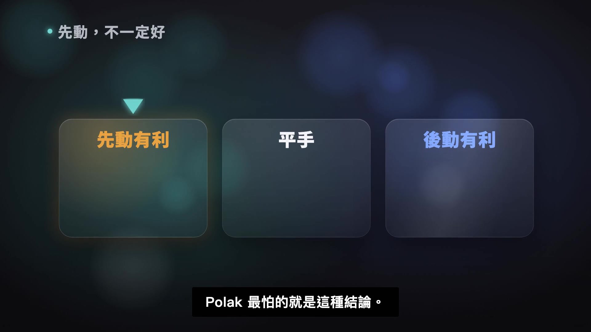

**逐字稿片段：** 他說機場書店裡 常有一種書 封面燙金 寫著凡事要先動 才有先動者優勢 這句話聽起來很對 所以很危險 你個人猜拳 你想先出還是後出 當然後出 公司要買一批新設備 讓別人先買 看好不好 不用再跟 還有一種是 就是兩邊都沒有優勢 小時候跟兄弟姐妹分蛋糕 一個人切另一個人先挑 誰都佔不到便宜所以才公平

**話題推測：** 批判「先動者優勢」的迷思，指出其危險性，預期顯示暢銷書封面。

---

## 00:24:27

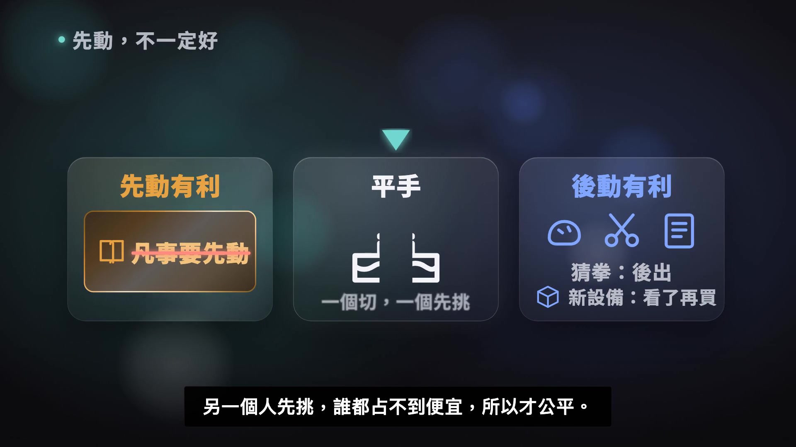

**逐字稿片段：** 接著Paulak請兩位同學上臺玩Nim 兩堆石頭輪流拿 每次只能從一堆拿 拿幾顆都行 拿到最後一顆的人贏 玩了兩輪臺下有人說出訣竅 把兩堆弄成一樣多 之後對方在一堆拿幾顆 你就在另一堆拿一樣多 所以兩堆一開始不一樣多 先動的人贏 一樣多後動的人贏 那天Paulak故意擺成不一樣多 因為先上臺的同學剛好生日 Nim最有意思的地方不是誰贏 是石頭一擺上桌 誰會贏就定了 Polak說 這件事可以講得更大

**話題推測：** 邀請學生上台玩「尼姆遊戲」（Nim），展示序列賽局的實際操作。

---

## 00:24:52

**逐字稿片段：** 他有一個名字 叫Zermelo定理 定理說 只要一場遊戲滿足幾個條件 他就一定有答案 兩個人輪流走 每個人輪到的時候 都看得到前面發生的每一步 而且遊戲不會沒完沒了 那結果只有三種 先手有辦法一定贏 先手有辦法至少合局 或者後手有辦法一定贏 Nimh是第一種或第三種 看石頭怎麼擺 景緻遊戲是第二種 兩邊都不出錯 就是合局 西洋棋也滿足這些條件 走法多到數不完 可是棋規會逼他結束 所以西洋棋一定有答案 證明的方法 就是我們的迷宮 從出口一格一格倒著推回來 可是這個定理有一個尷尬的地方 他只說答案存在 不告訴你答案是什麼 我們到今天還不知道 白棋到底是一定贏 還是隻能合局 知道有答案 跟知道答案是兩回事 倒著算的時候 有一件事很容易被忽略

**話題推測：** 介紹「Zermelo定理」（Zermelo's Theorem），說明特定遊戲存在確定解。

---

## 00:25:37

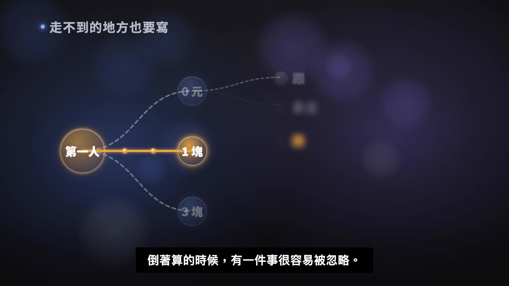

**逐字稿片段：** 在有先後順序的遊戲裡 Paulak說 一套策略 是一份完整的計劃 每一個你可能輪到的地方 你會怎麼做 都要寫下來 連你根本走不到的地方也要寫 拿帽子來說 第二個人的策略不能只寫看到1塊怎麼辦 還要寫看到0元怎麼辦 看到3塊怎麼辦 為什麼要寫走不到的地方 因為別人算你的時候用的就是那些地方 第一個人會先想 我放3塊你會怎麼回 再決定放多少 每一發生的那些路 正是別人判斷你的依據 麻煩也在這裡 如果只是照上級的方法 機械裡去找納許均衡 你會找到一些怪答案 某個人在走不到的地方寫了很蠢的一步 照樣成立 因為反正走不到 寫什麼都不會被抓到 這一段第一次聽有點抽象

**話題推測：** 解釋在序列賽局中，策略需要包含連走不到的地方的計畫。

---

## 00:26:14

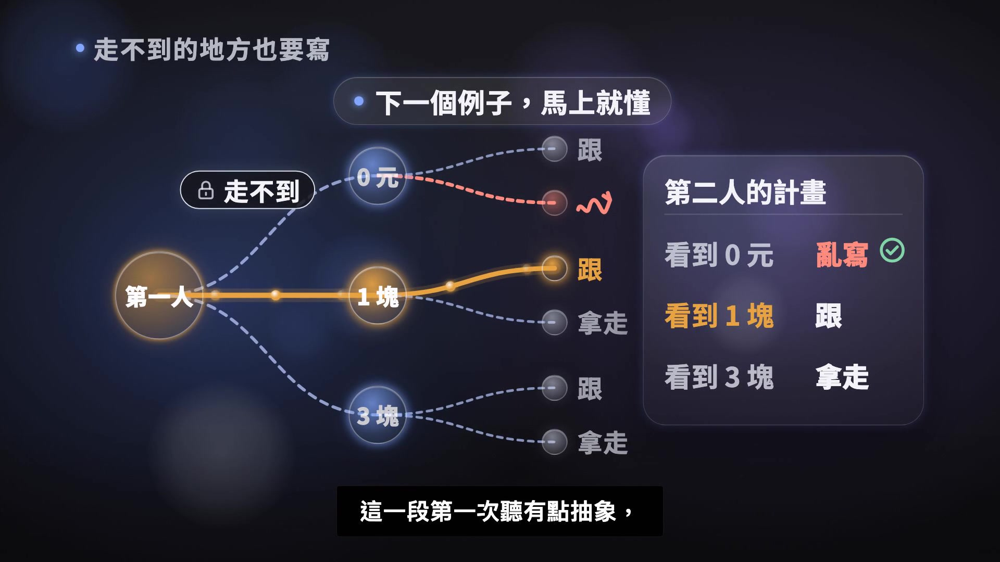

**逐字稿片段：** 我自己也是看了下一個例子才懂 你還記得夜市那個老攤子跟新攤子嗎 Polak在課堂上講的是同一件事 一個市場裡只有一家老店 獨佔的時候賺最多 一家新店想進來 新店進來 老店可以跟他和平分 兩家各賺一份 也可以降價拼到底 老店一毛都賺不到 新店還倒賠 老店先放話 你趕進來 我就跟你拼 新店相信了就不進來 老店繼續自己一家賺 你一次都不用真的拼 上甲的方法說 這也是一族納許均衡 可是你看那句重話 正好寫在一個走不到的地方 用逆向歸納走一次 我們先走到最後一步 新店已經進來了 這時候拼下去老店自己也一毛都賺不到和平分還有一份 所以到了那一刻他不會拼

**話題推測：** 回顧夜市老店與新店的例子，以說明不可信的威脅。

---

## 00:26:51

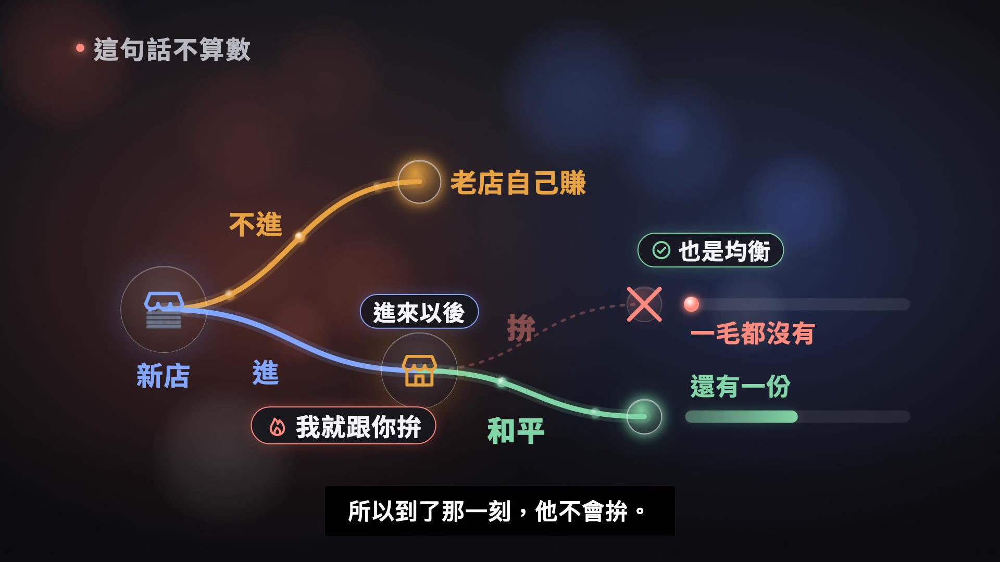

**逐字稿片段：** 這種話叫non-credible threat 中文叫不可信的威脅 他的意思是 說了出口 到了關頭卻不會做的話 Paulak說你真的要去做一套作業系統 Bill Gates 可能會派人跟你講幾句話 可是那幾句話本身沒有分量 可是現實裡老店真的會拼

**話題推測：** 介紹「不可信的威脅」（Non-credible Threat）概念。

---

## 00:27:07

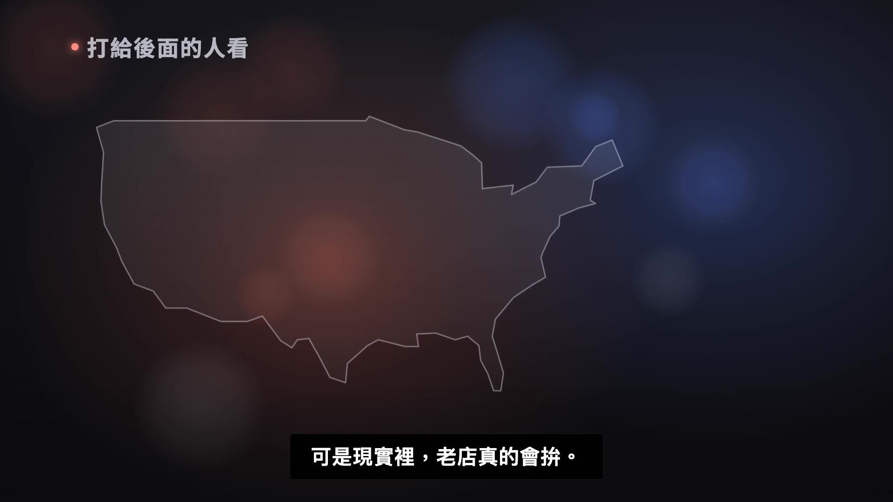

**逐字稿片段：** Paulak下一堂課就把這件事演出來 他請一位助教LA當披薩店老闆 在十個城鎮各開一家店 再請10位同學當想進場的新店 一個城鎮一位 照順序來 每個人先報上家鄉 邁阿密、馬迪遜、橋港、聖路易 一個一個變成地圖上的點 第一位 Isabella說進 Elle說拼 她賠了100萬 第二位看到了 說不進 接下來好幾位都不進 一直到第七位跟第八位 又有人趕進 Elle照樣拼 兩個人也都賠了 最後兩位又不敢進了 你看Elle做的事 第一場 她明明也虧 還是要拼 因為這一場不是拼給眼前這個人看的 他用前面幾場的虧損 換後面幾場的安靜 Polak最後問Al 要是第十位進來 你會怎麼做 Al說我不會拼 Al最後那句話 正好是逆向圭娜的起點 我們從出口倒著走 第十個層次後面沒有下一個 在那裡拼 已經沒有人要看 所以他不會拼 第十位可以放心進 那第九場呢 Al在第九場拼得再兇 也擋不住第十位 反正第十位一定會進 所以第九場拼了也白拼 他也不會拼 第九位也該進 一路倒著推回來 每一場都一樣 每一位都該進 老店一個都擋不住 可是我們剛剛親眼看到 他擋住了好幾個 理論跟教室裡發生的事

**話題推測：** Polak教授進行課堂實驗：披薩店老闆Elle與10位新店競爭。

---

## 00:28:13

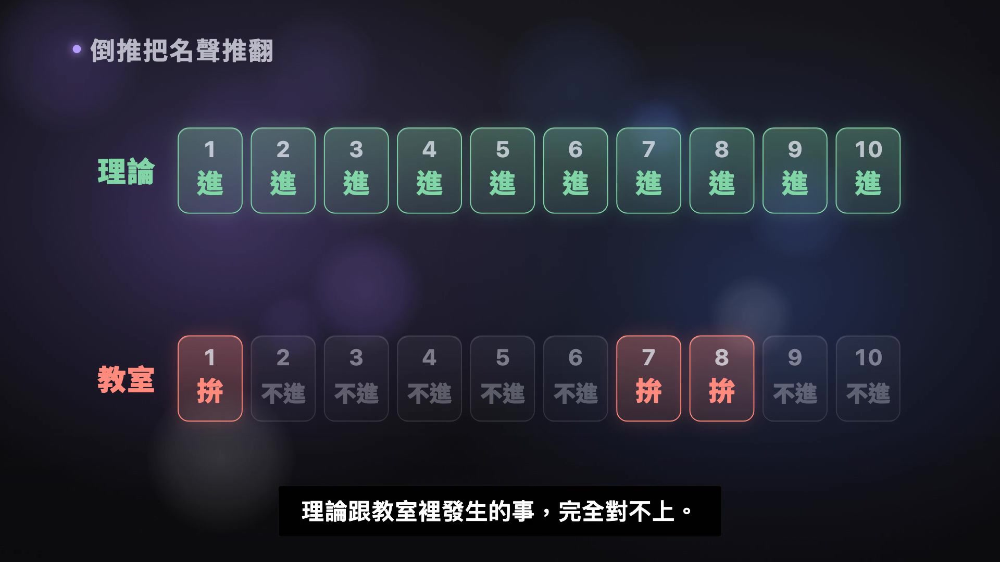

**逐字稿片段：** 完全對不上 這個問題叫Chain Store Paradox 中文叫連鎖店悖論 他的意思是 一步一步都推得通 推出來的結論 卻跟我們看到的現實對不上 提出他的是Selten 他後來拿了諾貝爾經濟學獎 那問題出在哪裡 Polak補了一樣很小的東西

**話題推測：** 介紹「連鎖店悖論」（Chain Store Paradox），指出理論與現實的差異。

---

## 00:28:28

**逐字稿片段：** 1%的懷疑 假設大家心裡覺得 Li有1%的機會 是一個真的愛打架的人 賠錢也要拼 他就是喜歡 只有一個城鎮的話這1%沒什麼用 第一位還是會進 幾乎可以確定L會讓 可是死個城鎮就不一樣了 L在第一場拼了 大家心裡那個機率就往上跳 第二場再拼又跳一次 後面的人就不敢賭了 再往下想一層 既然看起來愛打架這麼有用 一個完全清醒的A類也會故意裝成愛打架的樣子 Polak還補了一個細節 要是每個清醒的老闆都一定會裝 大家就看不出誰是真的 倒著推又會從後面垮掉 所以真正的答案是清醒的老闆有時候拼有時候不拼 又回到了第一部分的混合策略 還記得約會那一段嗎 混合可以是別人心裡對你的猜測

**話題推測：** 引入解決連鎖店悖論的關鍵：1%的「懷疑」（reputation）。

---

## 00:29:07

**逐字稿片段：** 名聲 就是住在別人心裡的那個猜測 這個道理在生活裡到處都是 你身邊有沒有那種脾氣比較急的朋友 一群人挑電影 點餐 玩遊戲選編 最後常常照他的意思走 不是他比較有道理 是大家怕他翻臉 先讓他一步 Polak還說 他可能根本沒那麼容易生氣 只是知道這樣比較容易拿到他要的 他在做的就是剛剛那個披薩店老闆 同一個道理 也解釋了那句很冷的話 不跟綁架的人談條件 這一次談了眼前的人質可能得救 可是不談 是說給以後的人聽的 綁了也沒有用 名聲也不止兇這一種 醫生跟會計師靠的是另一種名聲 這個人會說實話

**話題推測：** 定義「名聲」（Reputation）為「住在別人心裡的猜測」。

---

## 00:29:42

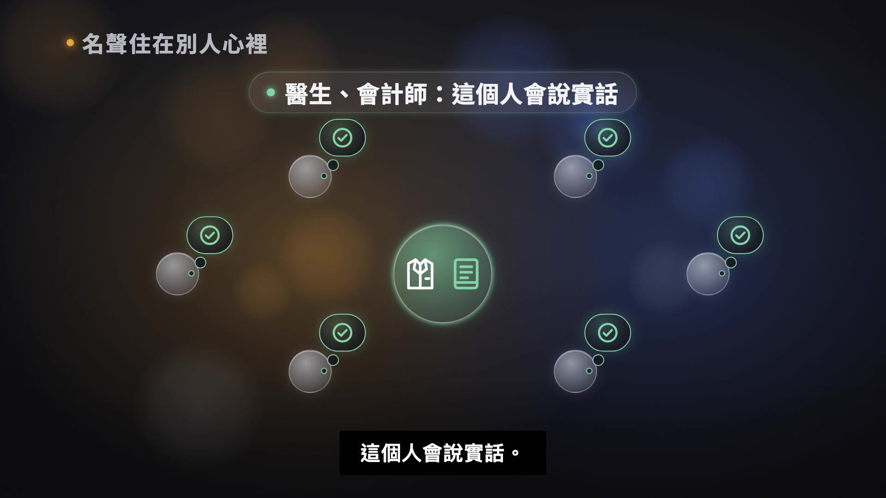

**逐字稿片段：** 會計師事務所Arthur Anderson 在安龍公司爆出做假賬的醜聞之後 很快就收掉了 他靠的那樣東西不見了 Polak說 有一年他在課堂上舉這個例子 臺下剛好坐著Arthur Anderson三世 兇的名聲讓人不敢惹你 誠實的名聲讓人願意信你 兩種都是靠前面一次一次做到 才住進別人心裡的 最後 我們回到開場那兩塊石海綿

**話題推測：** 以安隆案中會計師事務所Arthur Anderson倒閉為例，說明誠實名聲的價值。

---

## 00:30:02

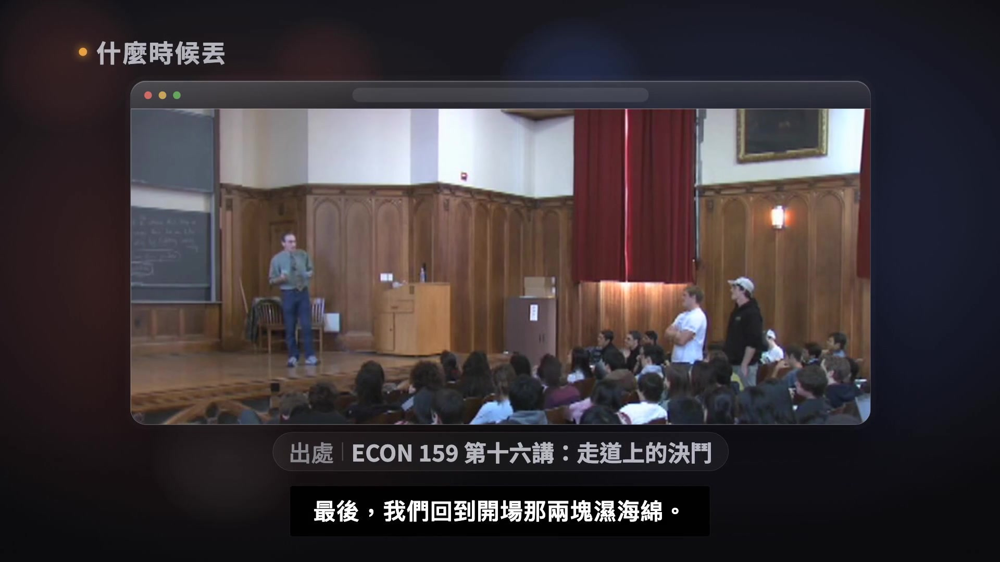

**逐字稿片段：** Polak請兩位美式足球隊的同學上臺 一人一塊 站在走道兩端輪流做選擇 輪到你的時候 你可以把海綿丟出去 丟中就贏 也可以往前走一步 離得越近 當然越容易丟中 關鍵規則只有一條 海綿丟出去就沒了 撿不回來 所以你一丟不中 對方就能慢慢走到你面前 把海綿輕輕放在你頭上 這場遊戲的問題 不是說什麼 大家都知道要丟 問題是什麼時候丟 Polak問全班 準投好的人會先丟 還是準頭差的人會先丟 有人說準的先丟命中率高 有人說差的先丟 要搶在被丟中之前 可是準的也會想 差的可能先搶 那我要更早 你想一層對方就想兩層 那天很多人乾脆棄權

**話題推測：** 邀請美式足球隊學生進行海綿遊戲，畫面可能切換到學生。

---

## 00:30:37

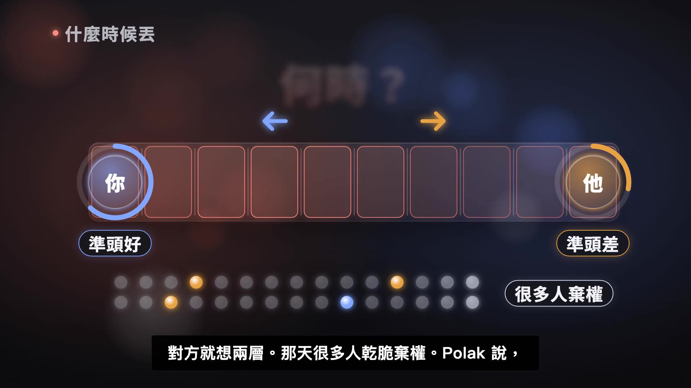

**逐字稿片段：** Paul Lark說 這種問題不止在教室裡 自行車賽 什麼時候從大隊裡衝出去 兩家公司什麼時候推出新產品 都是同一種問題 這一題最後是全班一起解出來的 用的是兩把老工具 第一把 假設我知道你明天不會丟 我今天就不該丟 因為我明天離你更近更容易中 第二把 假設我知道你明天會丟 我要比的是兩件事 我今天丟中的幾率 跟你明天丟不中的幾率 你明天丟不中我就贏了 所以這兩個要拿來比 把它整理一下 就是一條很好記的規則

**話題推測：** 將海綿遊戲的困境應用於現實世界的自行車賽與新產品發布。

---

## 00:31:03

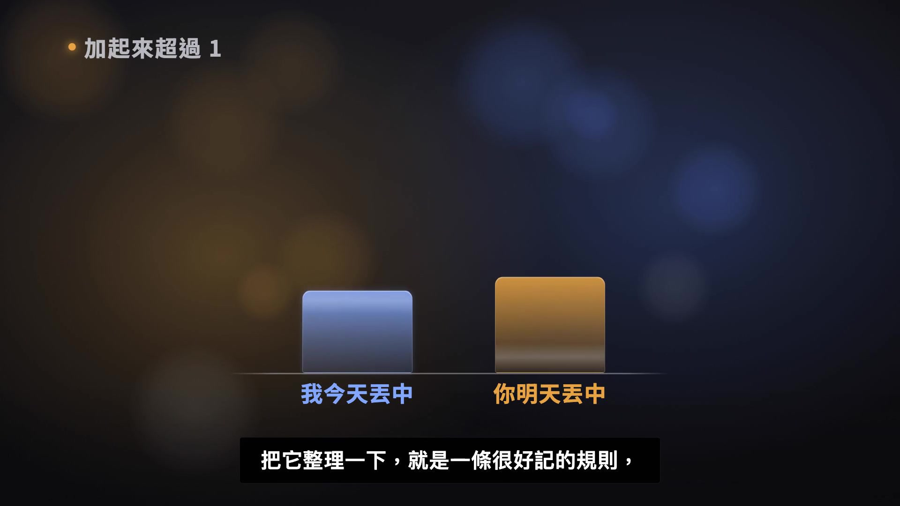

**逐字稿片段：** 我今天丟中的幾率 加上你明天丟中的幾率 只要加起來超過億 我就該丟 離得很遠的時候 兩個人都不準 這個和小於一 不管對方明天丟不丟 今天都該往前走 一步一步走進 總有一步 這個和第一次超過億 怎麼知道到了那一步 對方明天一定會丟 從出口倒著走 貼在一起的時候一定丟 退一步也該丟 一路退回來都是丟 所以答案是 第一次超過億的那一步 輪到誰誰就丟 18世紀的軍隊有一句話 等你看見對方的眼白在開槍 說的就是這一步 規則寫在黑板上 很簡單 可是Paul Lark說 這個遊戲他玩了很多年 不管在大學部還是商學院 同學幾乎都丟得太早 然後沒中 那天也一樣 兩組都是有人先丟 都沒中 照理說 準投有好有壞 丟中的應該有一半左右 他猜了兩個原因 一個是人常常對自己太有信心 另一個他說是美國人的習慣 從小被教要主動 要掌握自己的命運 運動員比賽結束接受訪問 最愛講這句 他問那些丟太早的同學為什麼 他們說至少我倒下之前有揮過拳 Paul Lack說 人生的目標不是倒下之前揮過拳 是不要倒下 他還提醒一件事 就算對面是一個完全不懂這套的人 你也不該在那一步之前丟 因為在那之前 不管對方怎麼做 往前走都比較好 有時候等就是一種策略

**話題推測：** 公布海綿遊戲的解決規則，可能以公式或簡報形式呈現。

---

## 00:32:12

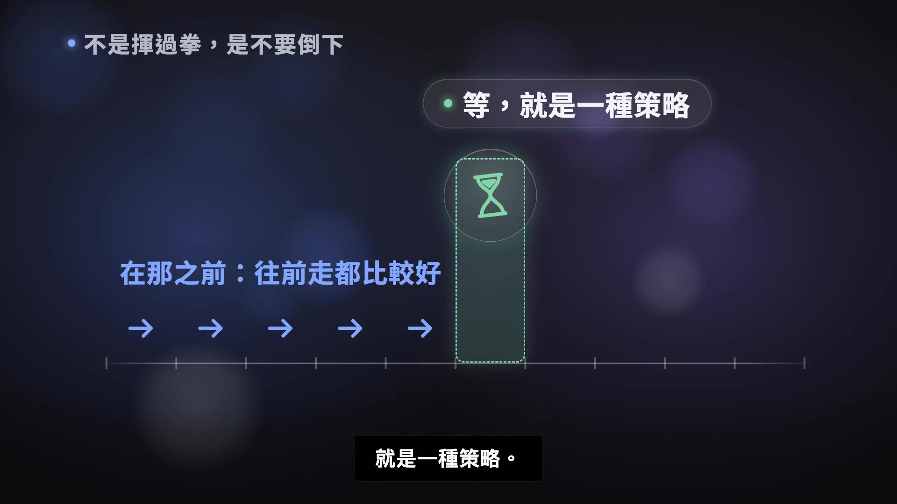

**逐字稿片段：** 我們把第三部分也收起來 第三個問題是 對方看得到你出手 看完才懂 你那一步還划算嗎 這時候最有用的方法 叫逆向歸納 先站到最後一步 看那個人到時候會怎麼選 再一步一步倒著走回來 就像從迷宮的出口 畫回入口 這個方法幫我們看懂了三件事 第一 你說的話要算數 得是走到那一步 對你還划算 所以要蓋工廠 要燒船 要壓房子 把退路收掉 而且要讓對方看見 第二 選擇少一點 分數低一點 甚至被人看光 有時候反而幫了你 因為對面會跟著改 第三 第三,民生就是住在別人心裡的猜測 前面付的代價 換到後面的安靜 而且只要一點點懷疑就夠 連最後那兩塊海綿也是一樣 不是越找越好 是算到那一步才出手 我們回到開場那個問題 你想好的那一步等別人反應過來以後還划算嗎 這巴唐克給了三個答案 其實說的是同一件事 對方會猜你的時候你不能被讀出來 而且你怎麼混是對面的分數決定的 一代一代換人的時候 留下來的是外人進來 佔不到便宜的做法 只是他不一定好 對方看得到你的時候 你說的每一步 都要走到那一刻 對你還划算 才算數 所以這一集的答案是 難的不是眼前划算 是長期划算

**話題推測：** 總結第三部分的內容，畫面可能出現章節總結。

---

## 00:33:18

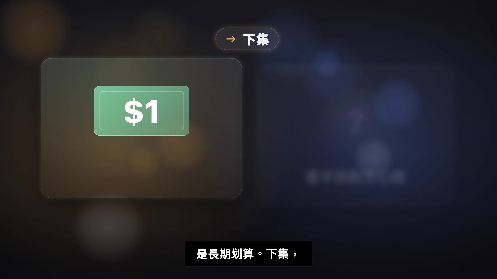

**逐字稿片段：** 下集 Polak會從口袋裡 拿出一張真的一塊錢 走到講臺 讓兩個同學來分 從那一開始 他要問的是 當你根本看不到 對方心裡那件事的時候 你還能不能算 最後問你一個問題 你有沒有為了 讓別人相信你是認真的 故意把自己的退路收掉過 後來對方有沒有因此改變 留言告訴我 喜歡這種 把公開課講清楚的內容 也可以訂閱AI Notebook 我是Jim 我們下次見

**話題推測：** 預告下一集主題：當無法看到對方想法時如何決策。

---
