# jimainotebook_kzdAkGshMS4 — 關鍵畫面索引

- 來源逐字稿：[jimainotebook_kzdAkGshMS4_FIN.srt](jimainotebook_kzdAkGshMS4_FIN.srt)
- 影片：https://www.youtube.com/watch?v=kzdAkGshMS4
- 截圖數：88

## 00:00:05

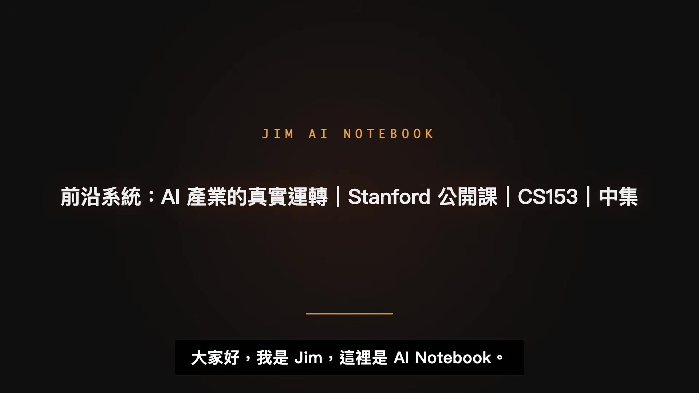

**逐字稿片段：** 2026年春天, 史丹佛的一間教室裡, 一個45歲的男人站在頭螢幕前面, 打開了一個他18年前寫過的東西, 那是他27歲那年做的第一個產品, 當年他募了資, 僱了10個人, 寫了兩年才寫完, 就把公司賣掉, 而他這一次做的事情是, 用一個每個月200美元的訂閱方案, 把同一個東西從頭再做一次, 他花了大約5天。 這是史丹佛CS153這門課的第五堂 而這門課的第五到第八堂 站上講臺的是四個位置完全不同的人 今天我們就把這四堂課一起上完 這個人叫Gary Tan

**話題推測：** 設定故事場景：史丹佛大學教室

---

## 00:00:40

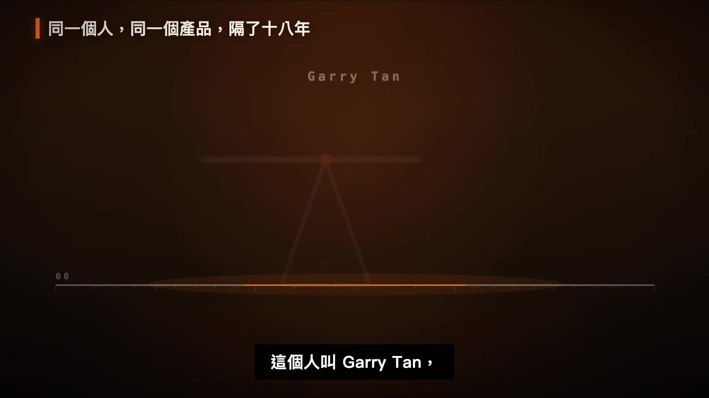

**逐字稿片段：** 現在是Y Combinator的總裁 即執行長 Y Combinator是硅谷最有名的新創育成機構 你可以把它想成新創公司的補習班 加上第一筆錢的來源

**話題推測：** 介紹Y Combinator，Gary Tan現職

---

## 00:00:52

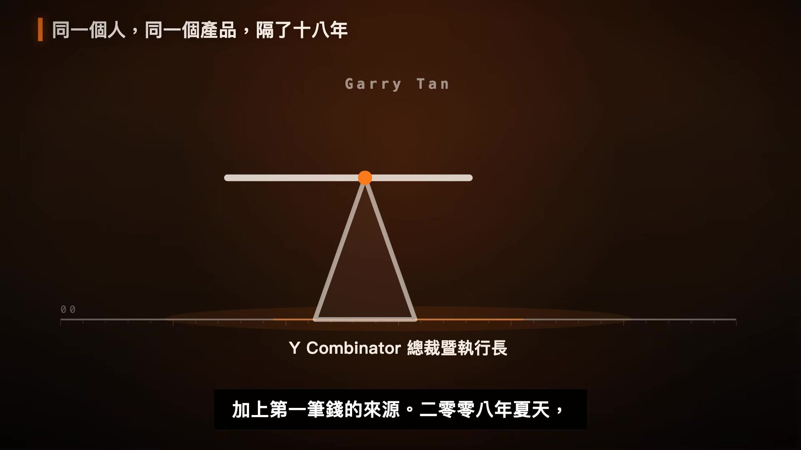

**逐字稿片段：** 2008年夏天 他自己也是那裡的學生 帶著一個叫Posturas的部落格產品進去

**話題推測：** Gary Tan 2008年創業時的產品Posturas

---

## 00:00:59

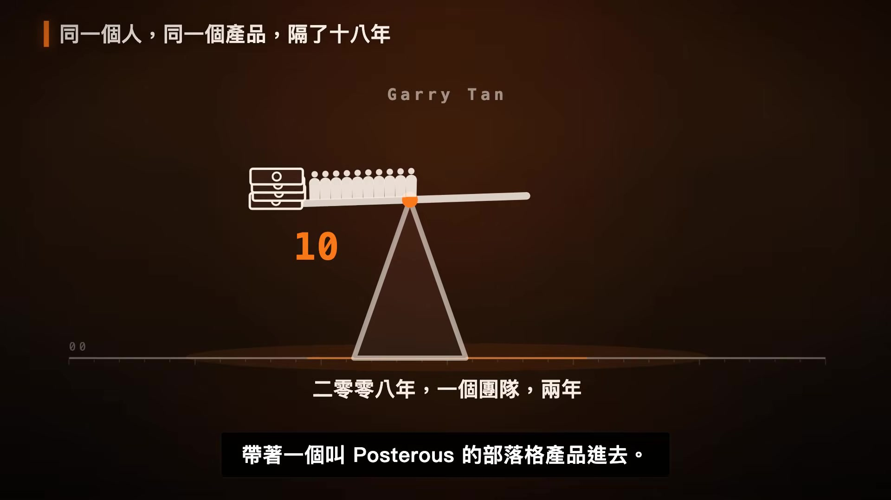

**逐字稿片段：** 他們前後募了大約1000萬美元 僱了10個人 花2年把所有軟體寫完 2012年3月賣給了Twitter 18年之後 他站在史丹佛的講臺上說 他把同一個東西重做了一次 這一次沒有團隊 沒有募資 一個每個月200美元的訂閱方案 他花了大約5天 我要先講清楚 這不是一支說AI讓你變厲害的影片 因為接下來這4堂課 4個站在完全不同位置的人 會各自證明同一件事

**話題推測：** Gary Tan當年創業的募資與出售數字

---

## 00:01:29

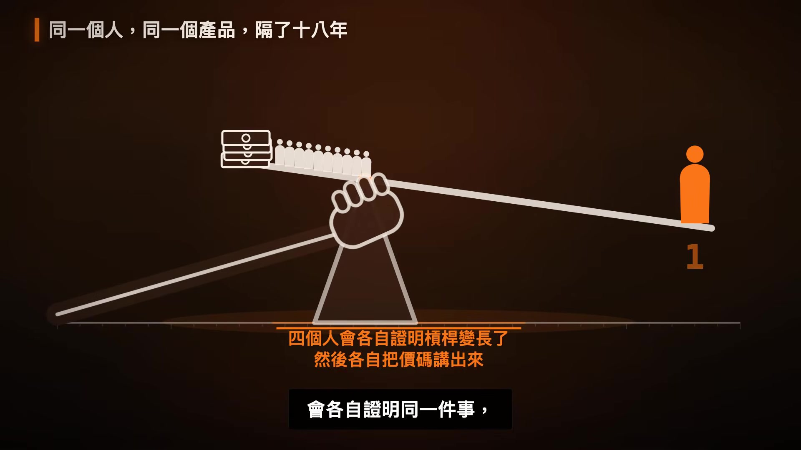

**逐字稿片段：** 一個人手上的槓桿確實變得非常長了 然後他們又會各自把這根槓桿的價碼講出來 上一集我們看完了這門課的前四堂

**話題推測：** 本集主題：AI時代個人槓桿變長

---

## 00:01:37

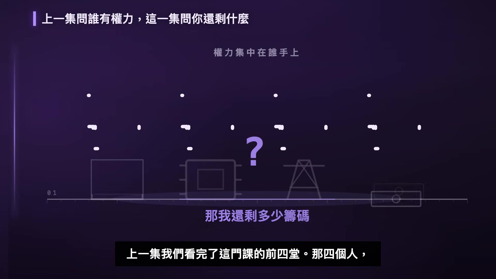

**逐字稿片段：** 那四個人 微軟的執行長 OpenAI的執行長 顧樂觀基礎設施的技術長 還有一位前執行長 講的其實是同一件事 這個時代的權力正在往少數幾家公司集中 他們每一個人都說這件事很危險 卻沒有人說得出避開它的方法

**話題推測：** 回顧上一集課程內容與講者

---

## 00:01:52

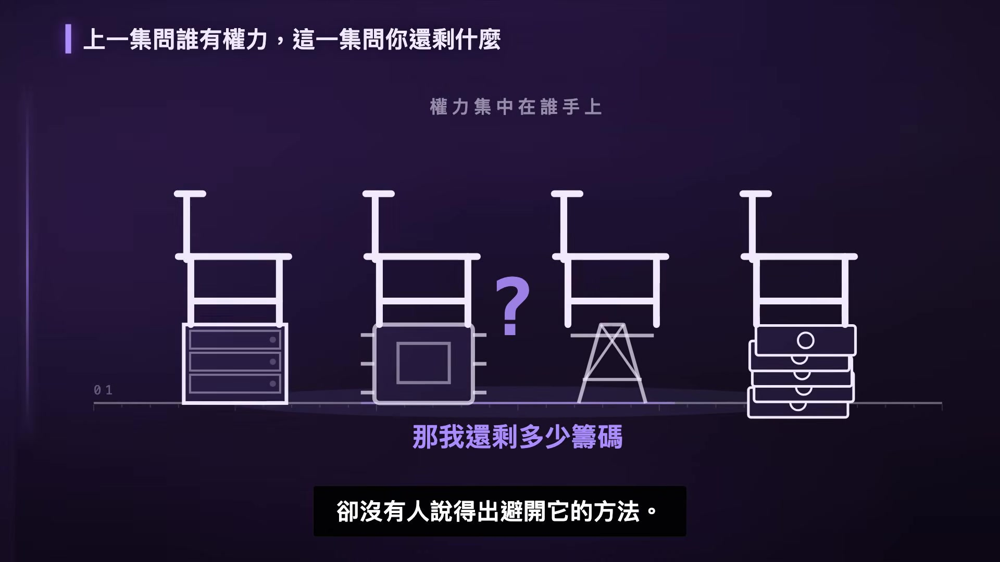

**逐字稿片段：** 上一集問的問題是 權力集中在誰手上 這一集問的是下一個問題 那我還剩多少籌碼

**話題推測：** 提出本集核心問題：個人還有多少籌碼？

---

## 00:01:58

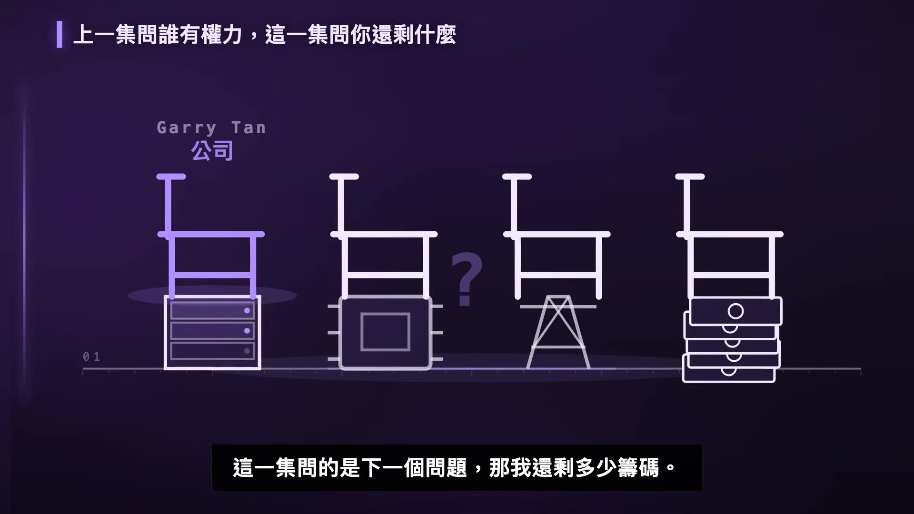

**逐字稿片段：** 這門課的第五到第八堂換了四個人 第五堂是剛剛那位Gary Teng 還有Guy Combinator的管理合夥人Diana Hu 第六堂是NVIDIA的創辦人 即執行長黃仁勳 第七堂是General Matter的創辦人 即執行長Scott Nolan 那是一家幫核電廠做藍調的公司 第八堂是Andresen Horowitz的 共同創辦人Ben Horowitz 公司算力 能源 資本 他們四個人的答案疊起來 會變成一句聽起來不太舒服的話

**話題推測：** 介紹本集第五到第八堂課的四位講者

---

## 00:02:26

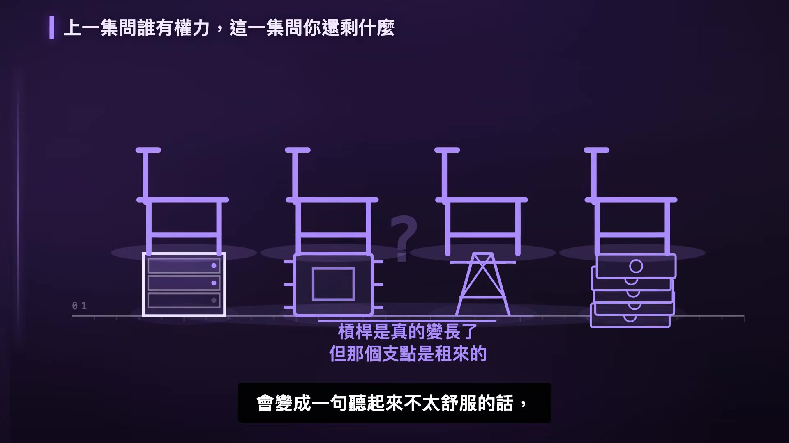

**逐字稿片段：** 你手上的槓桿是真的變長了 但那個支點是租來 我們先把這個對照看仔細一點 因為它是這堂課最實在的一組東西

**話題推測：** 本集總結：槓桿雖長，支點是租來的

---

## 00:02:36

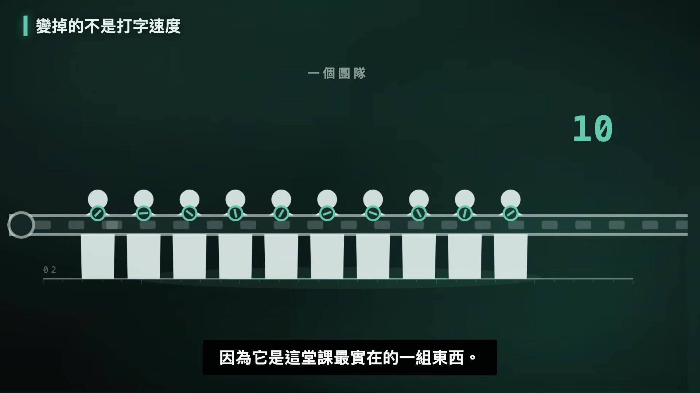

**逐字稿片段：** 2008年那一次 他要做的事情包含這些 說服投資人給他籤面試 並顧盡10個工程師 租辦公室 分配工作 開會對齊 然後每一行程師都要有人親手寫出來 兩年之後產品才算完成 2026年這一次 他訂了一個叫Cloud Code Max的方案 每個月200美元 Cloud Code 你可以理解成一個會自己 動手改你程式的助理 你把要做的事情交代給他 他自己去讀你的專案 自己寫自己跑測試 做完再回來給你看 他說他這一次不是坐在那裡打字 他是在核準 所以真正變料不是打字速度 而是生產的單位

**話題推測：** Gary Tan 2008年創業細節對照

---

## 00:03:13

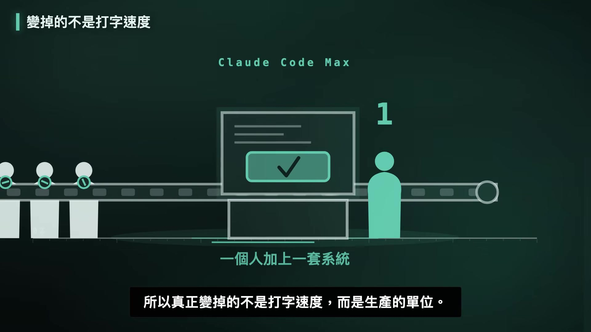

**逐字稿片段：** 以前一個產品要一個團隊才做得出來 現在是一個人加上一套系統 而這整堂課接下來講的東西 全部都是這句話的後文 他講了一件更誇張的事 他說在2025年年底之前 他其實已經很久沒有自己寫程式了 當上Y Combinator的總裁之後 他的工作是看人 看公司 講話 然後他重新開始寫 而且是用剛剛那種方式寫

**話題推測：** 生產單位從「團隊」變成「一個人＋一套系統」

---

## 00:03:35

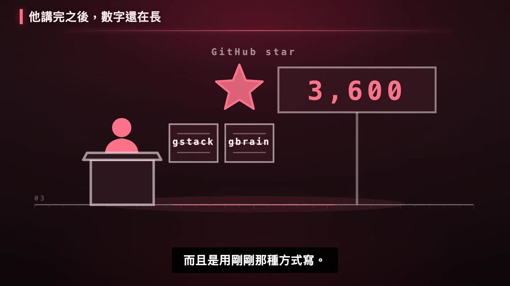

**逐字稿片段：** 他做了兩個放在Github上 任何人都可以免費拿去用的專案 一個叫Stack 一個叫Gbrand Github是全世界工程師放程式碼的地方 上面有一個按鈕叫做星星 就像你在社群平臺上按收藏 一顆星代表一個人覺得這個東西值得留著 他站在史丹佛講臺上那一天 這兩個專案加起來大概是10萬顆星 我在做這支影片的時候去看了一次 已經是16萬 多出來的那6萬顆 是他講完那句話之後才長出來的 那個速度不是一個形容詞 他在你查資料的這段時間裡還在繼續動 不過他自己給的量尺 比新星數保守的多 他講得很清楚 程式碼的行數是可以造假的 他還為了這件事公開道過歉 真正的量尺只有一個問題

**話題推測：** Gary Tan重寫的兩個Github專案：Stack和Gbrand

---

## 00:04:16

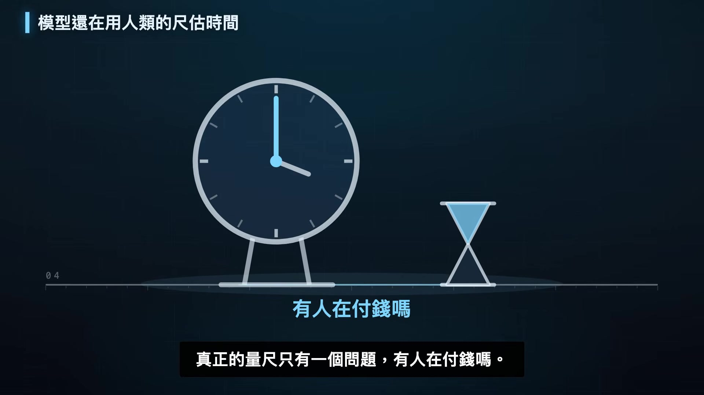

**逐字稿片段：** 有人在付錢嗎 而這一段裡最有趣的一個細節 是模型自己還沒有跟上這個現實 他把一件工作交給Cloud Code 順口問了一句這要多久 模型回答他大概三個星期 他按下核准 一個小時之後就作文了 模型是拿人類過去寫下的文字訓練出來的 所以他腦袋裡那把估算時間的尺 還是人類的尺 他也贏了另一個人的說法

**話題推測：** 衡量程式碼價值的真正標準：有人付錢嗎？

---

## 00:04:39

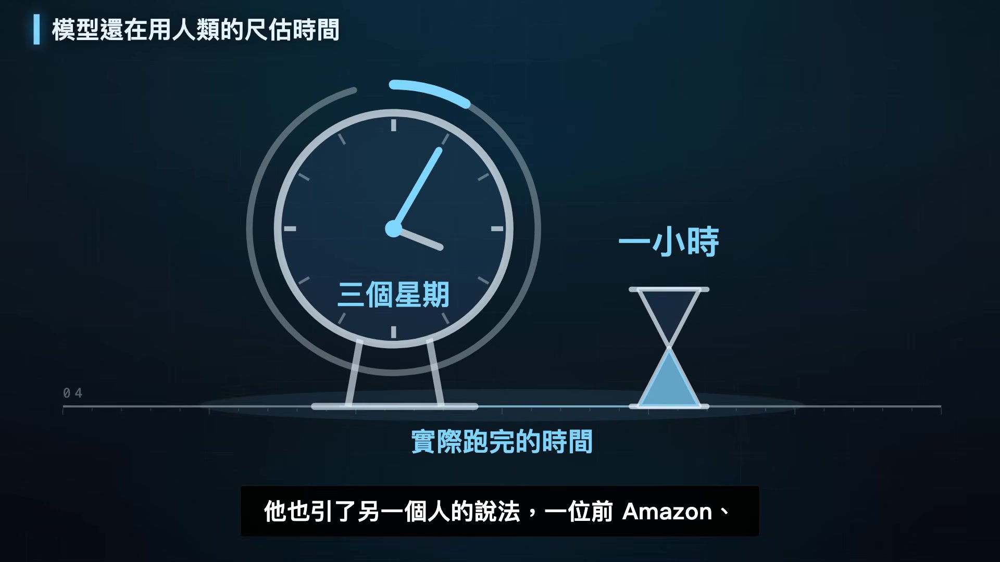

**逐字稿片段：** 一位前Amazon 前Google的工程師Steve Yegi 今年2月寫過一篇文章 主張認真用agent的人 生產力會比只開著聊天室創的人 高上10倍到100倍 agent的中文常翻成代理人 指的是那種你交代一次 他自己一路做到遠的城市 這裡也要說清楚 Yegi不是Anthropic的員工 這篇文章是他訪談了 大約40位Anthropic的人之後 寫下的個人判斷 不是任何公司亮出來的數據 這樣講下來 你可能會想問一個很合理的問題

**話題推測：** 前Amazon/Google工程師Steve Yegi的Agent生產力論點

---

## 00:05:11

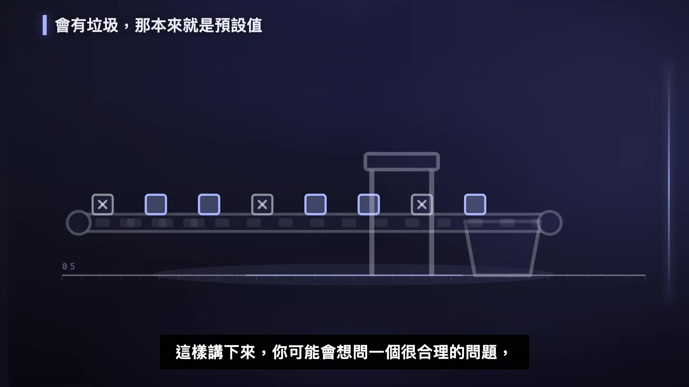

**逐字稿片段：** 那產出的東西品質呢 覺得這一段是他整場最誠實的地方 有人說AI寫出來的程式都是垃圾 他沒有反駁 他說沒有錯會有垃圾 那就是預設值 他的原話是 這正是你在打造自己那條產線的時候 要對抗的東西

**話題推測：** 探討AI產出程式碼的品質問題

---

## 00:05:27

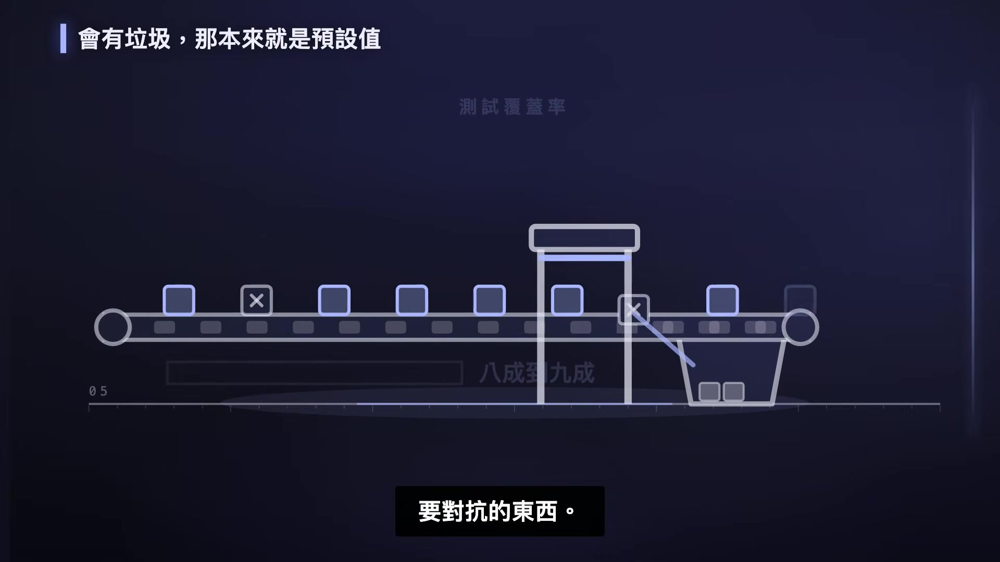

**逐字稿片段：** 他的具體做法是把測試覆蓋率 壓在八成到九成之間 測試覆蓋率的意思是 另外寫的那些檢查程式 涵蓋了你多少比例的程式碼 你可以把它想成 工廠出貨前的抽檢 抽檢的比例愈高 壞掉的東西溜出去的機會就愈低 所以它真正的意思是 一個人變成一百個人 靠的不是模型比較聰明 是你自己蓋了一條 有檢查站的產線

**話題推測：** 以「測試覆蓋率」來解決AI程式碼品質問題

---

## 00:05:51

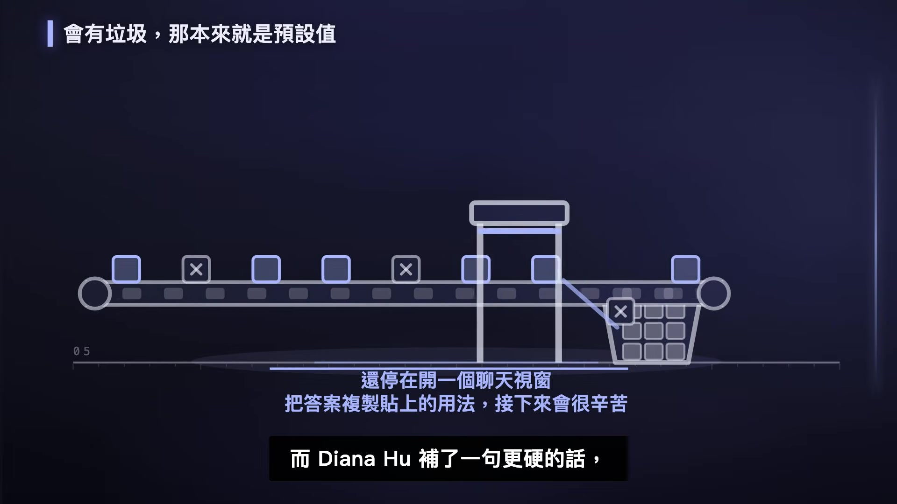

**逐字稿片段：** 等一下那胡補了一句更硬的話 他說還有人停在去年那種用法 就是開一個聊天室窗 把答案複製貼上 他的判斷是 那種用法接下來會很辛苦 到了這一堂最好的轉折 他說他認真去搭那一套 agent系統之後 做著做著 發現自己在重新發明一個很老的東西

**話題推測：** Diana Hu提出對舊式AI用法（複製貼上）的警告

---

## 00:06:08

**逐字稿片段：** 公司 他先寫了一堆叫skill的檔案 那其實就是一份一份的作業手冊 寫清楚某一件事該怎麼做 對應到公司裡 那是一個會做某件事的員工 他發現事情一多就會亂 所以他做了一個叫resolver的東西 負責決定哪一件事該交給誰 那就是組織圖 再來他發現有些事會沒有人接受 所以他又加了一道檢查 確認每一件進來的事情都真的有人負責 那是集合合法尊 法尊的意思是 確認你做的每一件事 都合乎規定 最後他還得確認 該啟動的時候 真的有啟動 於是他做了觸發測試 那是績效考核 他講完這一串之後 說了一句話 他說我坐在你們 這個位置的時候 完全不懂 為什麼那麼多公司 要花那麼多時間 在集合合法尊上面 現在我45歲 做了一堆這種系統 光是為了讓他們能動 就花掉這麼多時間 我終於懂了 你以為公司裡 那些凡人的流程是官僚 其實他們是 人類版的錯誤處理 迪亞娜胡接著 把這件事講得更系統一點

**話題推測：** AI系統在重新發明「公司」的概念

---

## 00:07:04

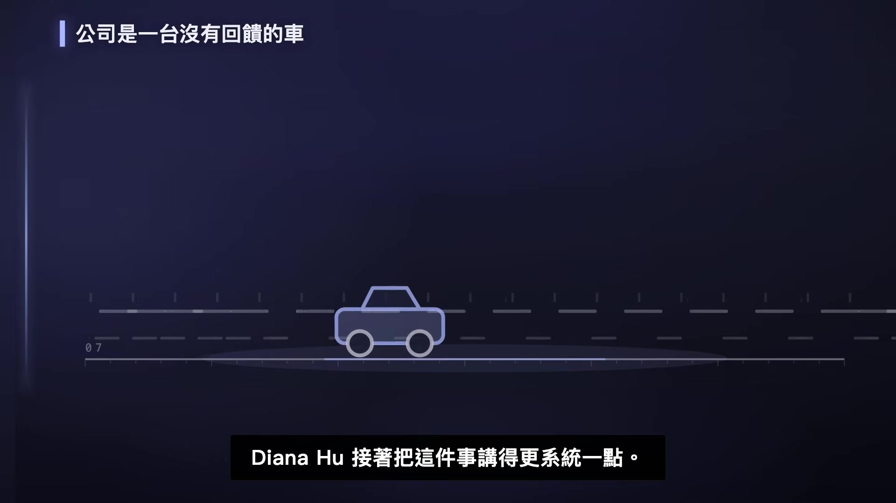

**逐字稿片段：** 她說今天的公司 是一個開回路的系統 開回路的意思是 你把指令送出去 但是你不知道結果 也沒有東西 自動把偏差修回來 公司裡的資訊活在哪裡 活在某個人的腦袋裡 活在私訊裡 活在沒有寫下來的會議裡 還有活在一種 叫做感覺的東西里 開回路系統的問題是 誤差會一點一點累積 等到有人發現的時候 整臺車已經開到路邊去了

**話題推測：** Diana Hu提出公司是「開迴路系統」的概念

---

## 00:07:27

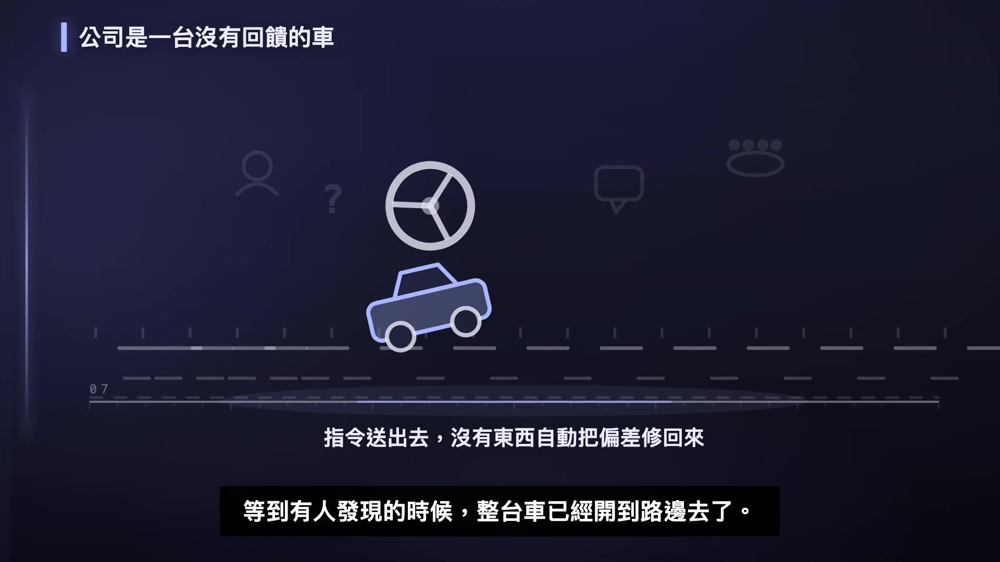

**逐字稿片段：** 閉迴路不一樣 它一直在量 一直在修 誤差被壓在範圍裡 他說AI真正的機會 是把公司從開回路變成閉迴路 讓他系統有權限 讀到公司產生的每一份東西 他引了一篇Jack Dorsey 和紅杉資本的Rolof Bosa 今年3月和寫的文章 題目叫做從階層到智慧 那篇文章的論點是 公司之所以會長出一層一層的主管 根本原因是一個人 只帶了那種三到八個人 AI現在可以接手主管 在做的那一件事 也就把資訊上上下下傳一遍 文章裡有一句話很直接 不需要一個長設的中階管理層 不過Dynahoo也畫了一條線 他說有樣東西不能外包 他的原話是

**話題推測：** AI將公司從「開迴路」轉變為「閉迴路系統」

---

## 00:08:08

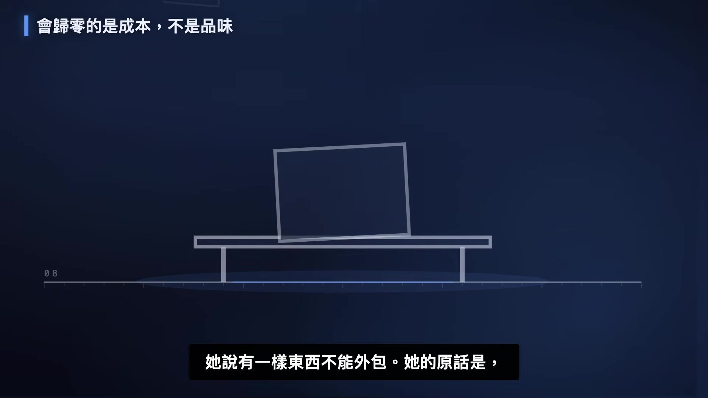

**逐字稿片段：** 寫成式的成本會歸零 但是判斷什麼是好東西的品位不會 而品位在一套系統裡面的具體形態 叫做EVO EVO就是評測的意思 你可以把它想成你自己出的一份考卷 題目是你的產品真正在乎的那些狀況 答案是你認為好的答案 他特別強調 烏上那些公開的通用評測 像MMLU那種考模型知識廣度的題庫 完全沒有辦法告訴你 你產品到底有沒有用

**話題推測：** AI無法取代的「品味」：EVO（評測）的重要性

---

## 00:08:35

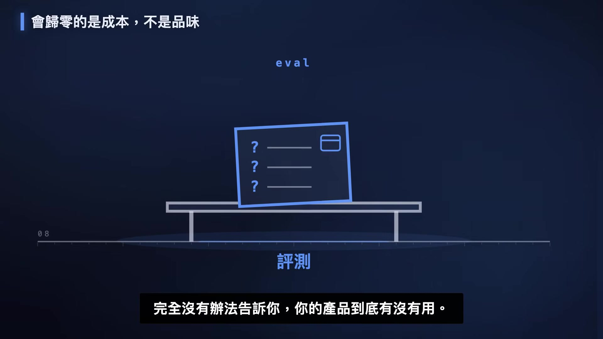

**逐字稿片段：** 這一段也連到他講的一個數字 而這個數字他在課堂上講錯了 我覺得應該講出來 他說AI原生的新創 每一個員工帶來100萬到200萬美元的營收 而像Salesforce這種大型上市公司 每一個員工帶來的營收不到6位數 實際上Salesforce最新一個會計年度 換算下來是50幾萬美元 所以那個差距沒有他講的10倍那麼大 是2到4倍 差距還在 只是沒有那麼戲劇化 公司實際上長什麼樣子

**話題推測：** AI原生新創與大型企業的員工營收數字對比

---

## 00:09:03

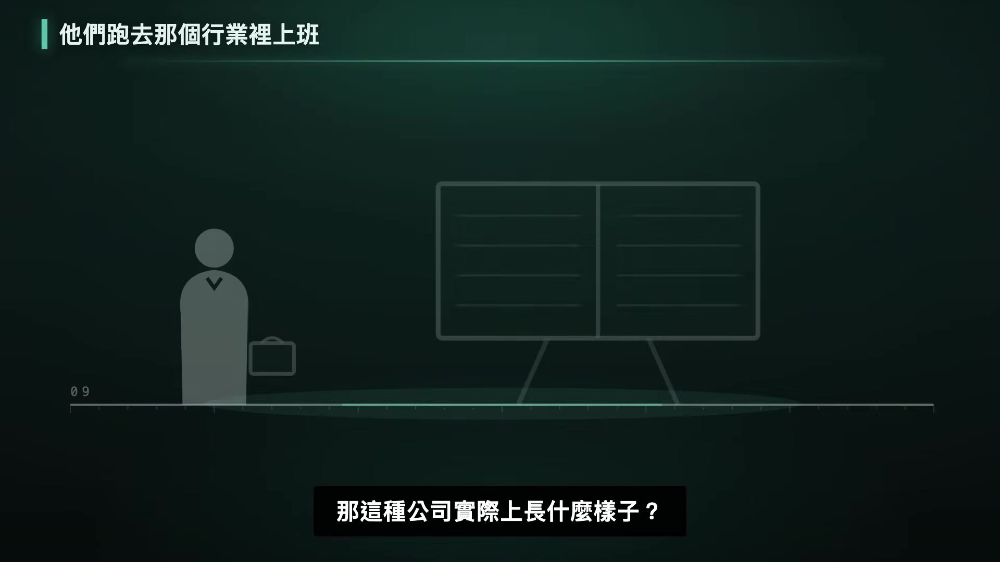

**逐字稿片段：** 他們在課堂上舉了三家 第一家叫Salient 做的是車貸的貸後服務 第二家叫Happy Robot 做的是貨運物流 卡車調度 那個世界裡有大量的電話 來回確認 第三家叫Reducto 做的是把PDF 這種給人看的文件 變成機器讀得懂的資料 他們引用Reducto的理由 值得記下來 因為所有的agent 都要讀文件 把文件處理做好 等於把所有人的記憶都變好了 而這三家有一個共同的做法 Nahal叫他臥底 這些創辦人本來完全不懂金融 也不懂物流 所以他們直接跑去那個行業裡跟班 甚至真的去上班 把流程學到骨子裡 他給了一句我覺得最實用的話 現在流程不在訓練資料裡 模型讀過整個網際網路 但他沒讀過一家貨運公司的調度員 早上七點在想什麼 這一段最後補一個數字

**話題推測：** 舉例三家AI原生公司：Salient, Happy Robot, Reducto

---

## 00:09:50

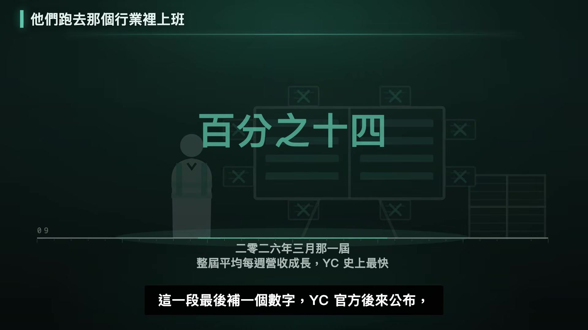

**逐字稿片段：** YC官方後來公佈 2026年3月那一屆 整屆平均每週的營收成長是14% 是YC歷史上最快的一屆 第六堂課講臺上換了人 展上去的是NVIDIA的 創辦人繼執行長黃仁勳 而這一趟是整個系列裡最不客氣的一場 開場沒多久 主持人就丟了一個有點難堪的問題

**話題推測：** Y Combinator 2026年3月屆的營收成長數字

---

## 00:10:11

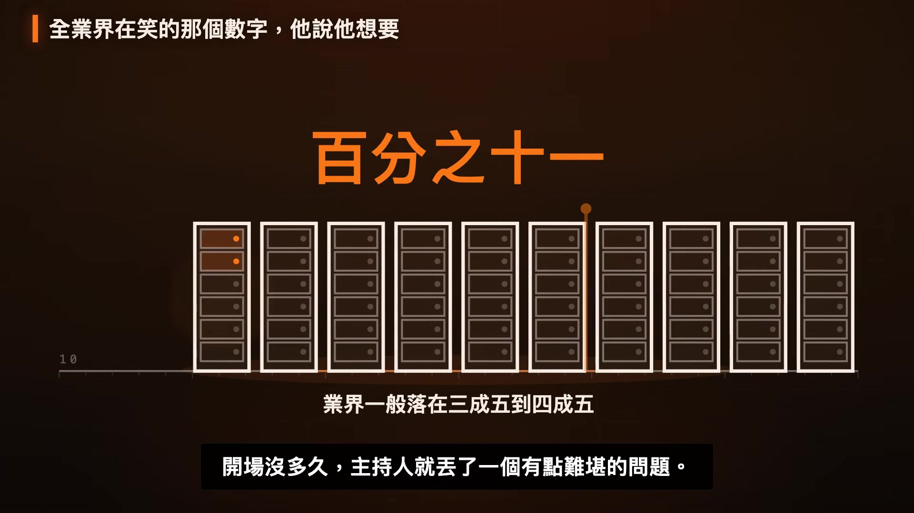

**逐字稿片段：** 2026年春天 有一份內部備忘錄外流出去 上面寫著XAI的訓練利用率大概只有11% 簽名的是XAI的總裁 他自己用的形容詞是低到難堪 因為業界一般落在3乘5到4乘5之間 這個數字的專有名詞叫MFU 中文可以說成模型算力利用率 白話講就是 你花大錢買回來的那一整批晶片 在訓練的時候 真正有在算的比例是多少 所以11%的意思是 將近九成的時間 那些非常昂貴的晶片 是閒著的 主持人把他問到黃仁勳臉上 本來想聽他怎麼修理這個數字 而他的回答是

**話題推測：** 主持人提出XAI訓練利用率僅11%的問題

---

## 00:10:48

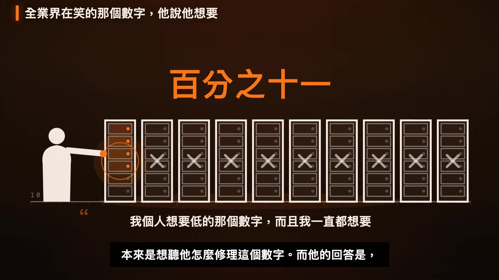

**逐字稿片段：** 我個人想要低的那個數字 而且我一直都想要 有事情是把這把尺本身推翻掉 他說MFU這個指標 根本就是錯的 理由是這樣

**話題推測：** 黃仁勳反駁MFU指標的錯誤性

---

## 00:10:57

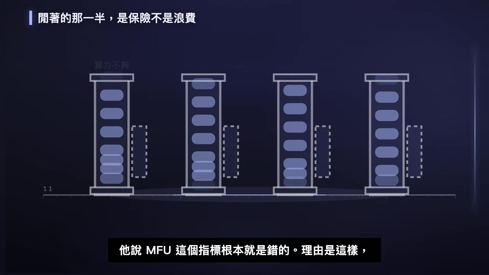

**逐字稿片段：** 一座大型機房 在任何一個時刻 一定有某一個東西是瓶頸 可能是算力不夠 可能是記憶體的頻寬不夠 可能記憶體塞不下 也可能是網路太慢 你不知道下一秒卡住的會是哪一項 所以正確的做法是每一項都配置的比你平常需要的更多 他說在對的那一刻 機器會充到百分之百 但是那只有很短一段時間 而如果在那段時間裡 你沒有那些平常顯著的算力 那段短的時間就會變成很長的時間 他還給了一個很好懂的說法

**話題推測：** 解釋大型機房瓶頸與配置冗餘的必要性

---

## 00:11:25

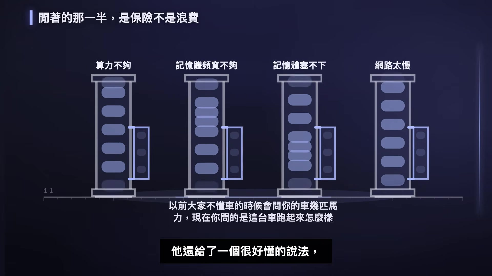

**逐字稿片段：** 以前大家不懂車的時候會問你的車幾匹馬力 現在還有誰這樣問 你問的是這臺車跑起來怎麼樣 零件的規格不是答案 整臺機器交出來的表現才是 這裡有一個很值得放在一起看的對照

**話題推測：** 以「汽車馬力」比喻晶片規格與實際表現

---

## 00:11:37

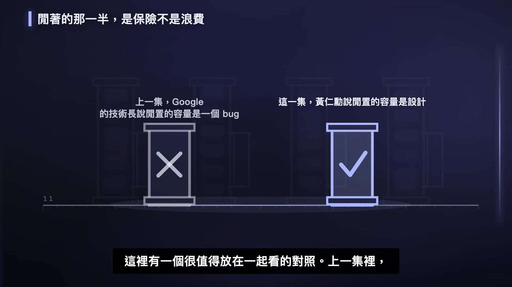

**逐字稿片段：** 上一集裡 Google管基礎設施的技術長 講過一句話 如果我們有容量在那邊閒著 不信吧 同一年 同一個產業 兩個站在最頂端的人 對浪費的定義剛好相反 那他為什麼會這樣想 因為他這輩子在做的事情 就是拒絕別人畫好的框

**話題推測：** 黃仁勳與Google技術長對「浪費」定義的對照

---

## 00:11:54

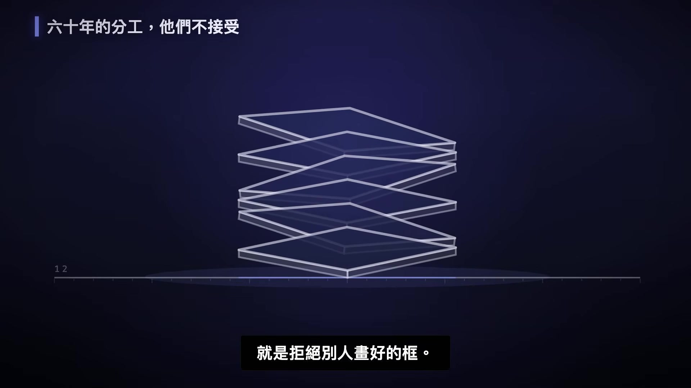

**逐字稿片段：** 從1964年 IBM推出那臺改變產業的大型主機開始 計算這件事就被切成一層一層 做晶片的人做晶片 做編譯器的人做編譯器 每一層只管自己那一層 這樣分工了60年

**話題推測：** 介紹60年來計算分層分工的歷史

---

## 00:12:07

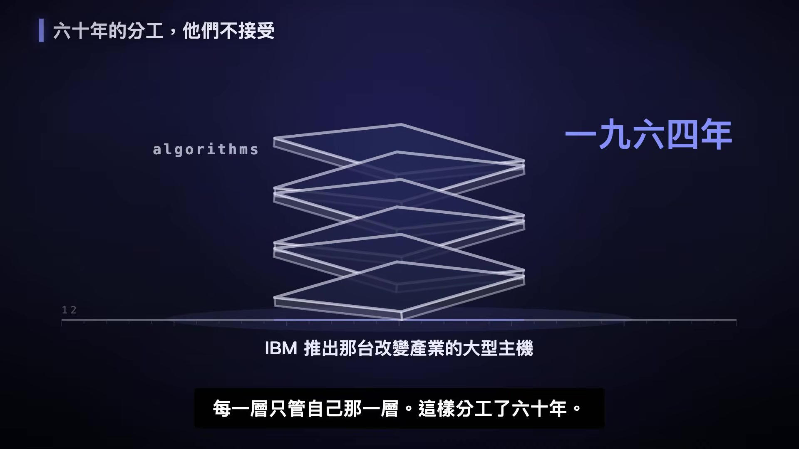

**逐字稿片段：** 他做的事情叫Codesign 中文是協同設計 意思是把演算法 框架 編譯器 晶片 網路 儲存 全部拉到同一張桌子上一起改 他給你的結果是這樣 摸耳定律最好的時候 晶片大概兩年快一倍 十年一百倍 可是十幾年前 電晶體變小之後 不再跟著省電 這個物理紅利先沒了 所以這十年 你實際上大概只拿到十倍 而他說

**話題推測：** NVIDIA的Codesign（協同設計）方法

---

## 00:12:30

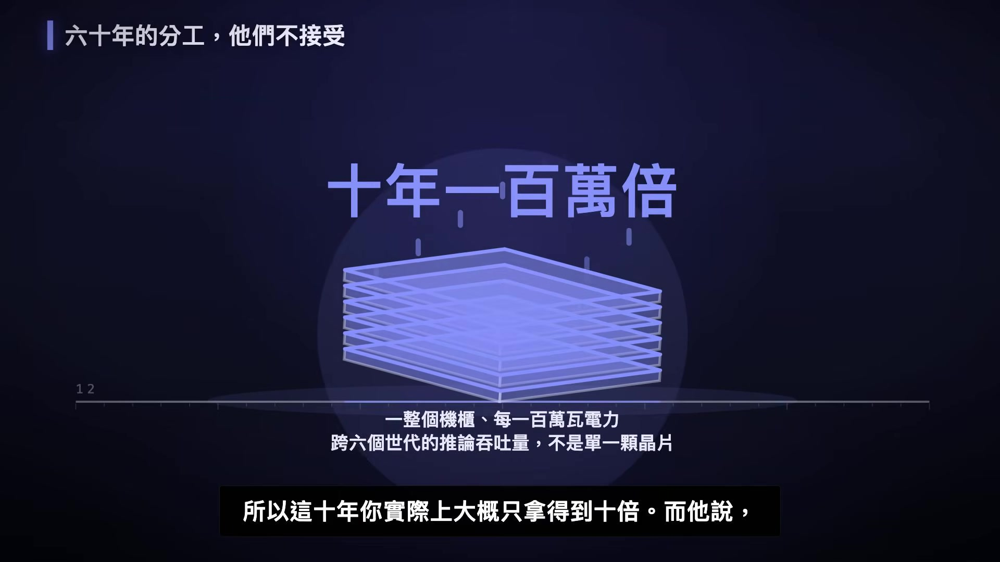

**逐字稿片段：** 他們拿到的是一百萬倍 這個數字要講清楚 它量的是什麼 它量的是一整個機櫃 每100萬瓦的電力能吐出多少推論 跨越六個世代疊起來的結果 不是單一顆晶片快了100萬倍 推論就是模型在回答你問題的時候 做的那些計算 但是更重要的是後果 他說快到這種程度之後 研究員才會開始講那句話 那我們幹嘛還挑資料 把整個網際網路都丟給電腦就好 同一套思路 也讓他做過一個 當時看起來很不合理的決定

**話題推測：** NVIDIA實現「一百萬倍」性能提升的數字

---

## 00:12:57

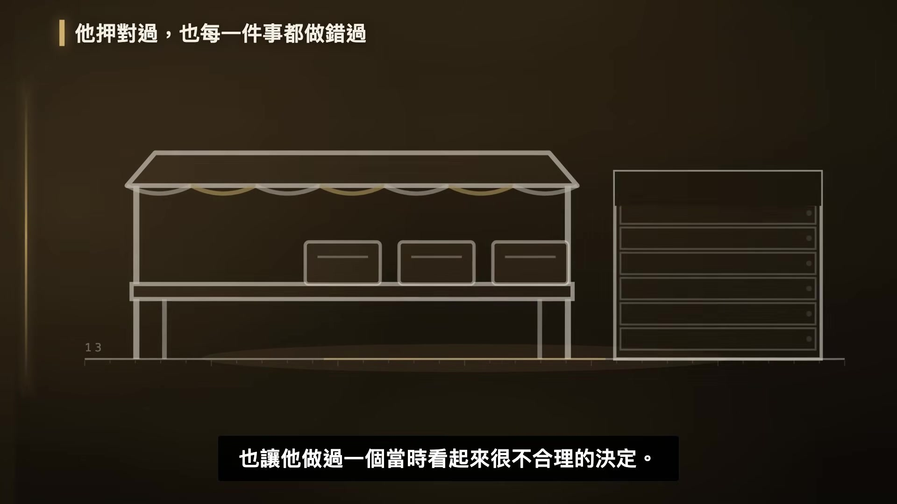

**逐字稿片段：** 他說設計Harper那一代晶片的時候 他們決定去蓋 要價幾十億美元的系統 當時全世界根本沒有人 買過那麼貴的電腦 他的原話是 你的市場規模精確的是0

**話題推測：** NVIDIA設計Harper晶片時的「零市場規模」決定

---

## 00:13:08

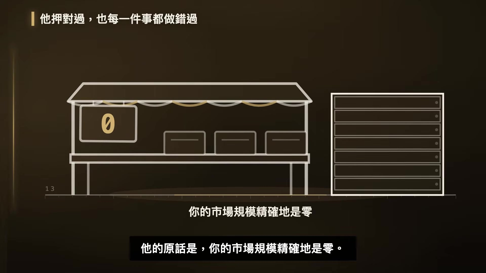

**逐字稿片段：** 他們還是照第一原理去做了 第一原理的意思是 不看別人現在怎麼做 回到最底層問 物理上這件事應該長成什麼樣子 可是他沒有把這一段 講成一個壓對保的故事 接著講的是他壓錯的那些

**話題推測：** NVIDIA堅持第一原理（First Principles）思考

---

## 00:13:22

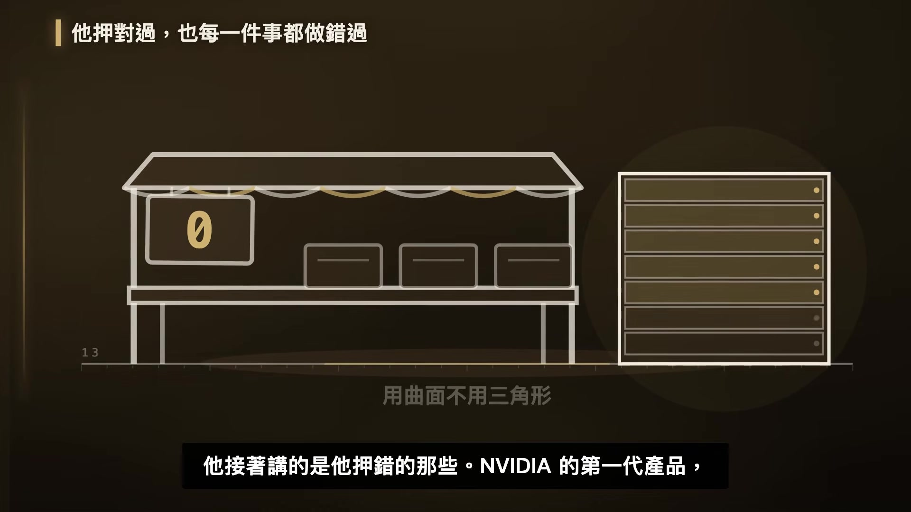

**逐字稿片段：** NVIDIA的第一代產品 他都不是有點錯 是每件事都做錯了 當時整個產業要往三角形走 他們用曲面 別人有一種叫Z-Buffer的東西 可以判斷哪一個物件在前面 他們沒有 他還有一句講了 33年的口頭禪 我們公司離倒閉只有30天 而他自己認定的真正策略錯誤 不是那顆晶片 是後來決定做手機晶片 那麼生意做起來之後 在3G換到4G那一輪被高通鎖死歸零 有人安慰他說 那些技術後來變成了機器人晶片的祖先 他不接受 他說那是事後合理化 你聽到這裡可能覺得他很硬 但是這一堂他也花了整整兩分鐘 講一件跟晶片完全無關的事

**話題推測：** 黃仁勳分享NVIDIA第一代產品的失敗

---

## 00:14:01

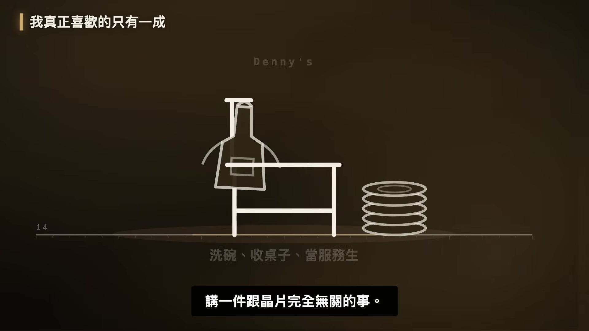

**逐字稿片段：** 他說他人生的第一份工作 是在一家叫Dennis的美式連鎖餐廳收桌子 他是移民 十幾歲就開始洗碗 收盤子當服務生 然後把這件事 接到一個學生問的問題上 有人問他 這是什麼感覺 他的回答讓現場安靜了一下

**話題推測：** 黃仁勳分享人生第一份工作：在餐廳收桌子

---

## 00:14:17

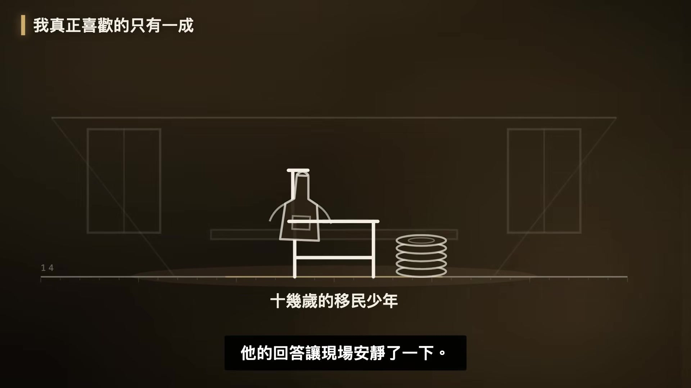

**逐字稿片段：** 他說沒有一個執行長 是從睜開眼睛到閉上眼睛 都樂在其中的 事實是我真正喜歡做的 只有我工作的一層 另外九層很難 而我還是全力去做 我是真的在受苦 接著他給了一個 他自己也知道不討喜的建議

**話題推測：** 黃仁勳對執行長工作的看法：大部分時間都在受苦

---

## 00:14:32

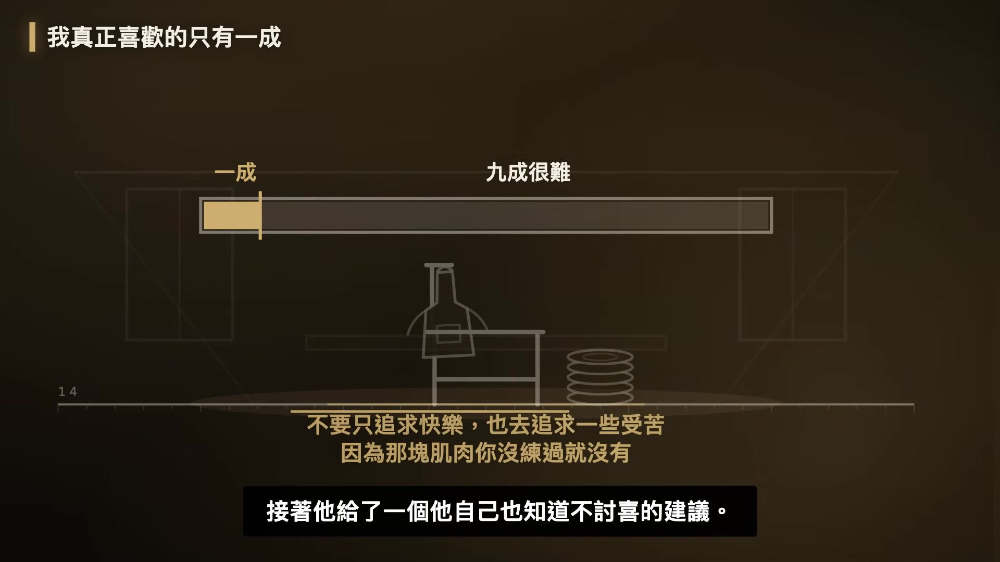

**逐字稿片段：** 他說我建議你們 不要只追求快樂 也去追求一些痛苦 一些受苦 因為總有一天 世界你的家人 你的公司 你的同事會需要 要你夠強韌 而到了那個時候 你沒有練過 你就沒有那塊肌肉 這一場的溫度 是在一個學生 問到出口管制的時候 整個上來的

**話題推測：** 黃仁勳對學生的建議：追求快樂也要追求痛苦

---

## 00:14:49

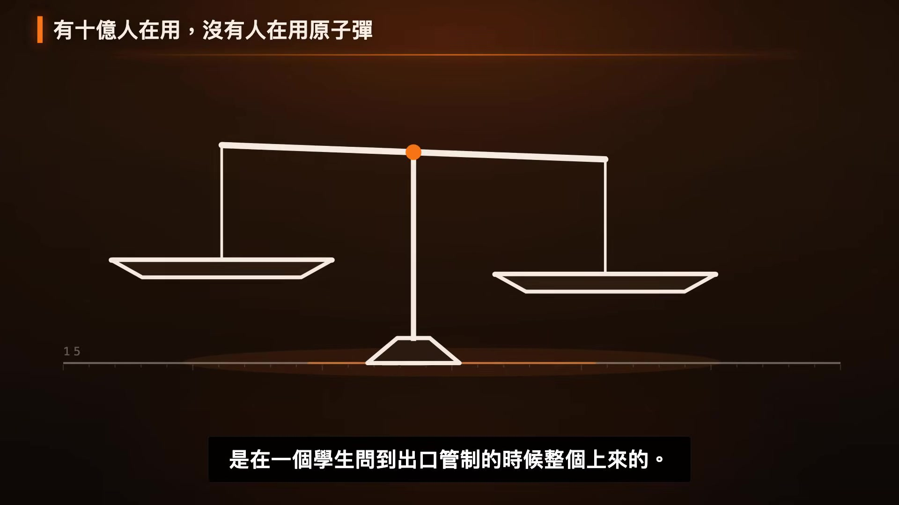

**逐字稿片段：** 出口管制的意思是 美國政府規定 某些等級的晶片 不能賣到某些國家去 有人拿了一個 常見的類比問他 把最高階的GPU 拿去跟核子武器比 他當場拒絕 他說有10億人 在用NVIDIA的GPU 我會推薦GPU 給我的家人 給我的小孩 給我愛的人 我不會推薦原子彈 給任何人 所以那個類比 是站不住的 而如果你從一個 站不住的地方開始想 你後面那一整串思考 都走不完 他更不能接受的是 另一種說法就是 反正我們也會輸 我們還去外面競爭 他的回答是 如果大家都照這個邏輯 那你早上幹嘛起床

**話題推測：** 學生提問出口管制，GPU與核子武器的類比

---

## 00:15:24

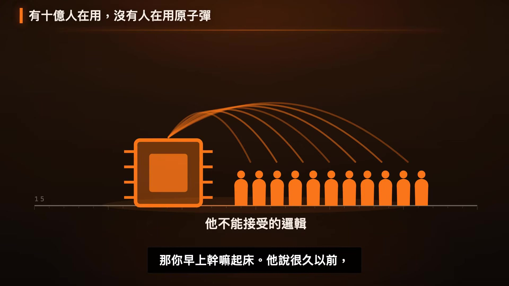

**逐字稿片段：** 他說很久以前 同樣這一套說法 被拿來對付美國的電信業 而今天美國已經沒有 任何基礎的電信技術了 那完全是政策 把他趕出我們的國家 這句話的前半是事實 美國今天確實沒有 一線的行動網絡設備上 但是後半那個因果 結果是他個人的判斷 主流的解釋是好幾件事疊在一起 他最後說了一句很短的話上 大家都應該有AI 沒有人應該有核彈 這個大家可以同意吧 這才是他這一場最有節奏的一段 他要處理的是那種末日式的說法

**話題推測：** 黃仁勳以美國電信業為例，反對輸不起心態

---

## 00:15:53

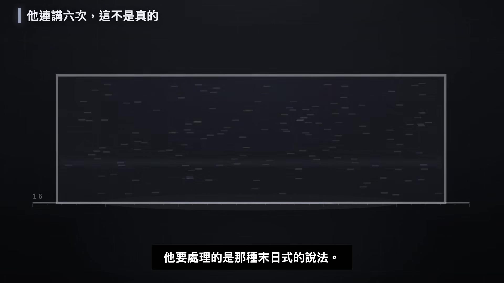

**逐字稿片段：** 他先把那個畫面念出來 他會在某一個星期四的晚上 起點突然降臨 然後遊戲結束 有一定機率是人類社會的終結 他停了一下說 拜託 我們都看過沙丘 不用再演一遍 然後他連續講了六次同一句話 說我們完全不知道 這些系統怎麼運作 這不是真的 說技術會在某一個瞬間突然無限強大 師姐 這不是真的 說完全沒有辦法防禦 這不是真的 他說這些人在公開場合活出他們的科幻幻想 而所有人都在依賴他們的話 相信他們的話 這是不負責任的 那他自己的防禦方案是什麼 這裡有一個很反直覺的答案

**話題推測：** 黃仁勳反駁AI末日論的科幻幻想

---

## 00:16:27

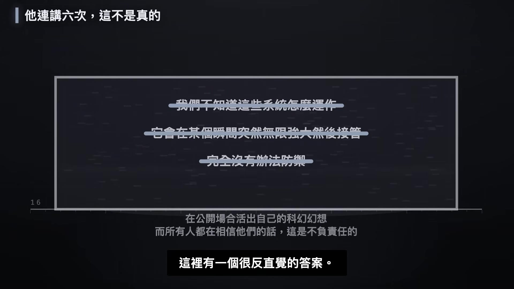

**逐字稿片段：** 他支持開放權重的模型 也就是把模型訓練出來的參數公開給大家下載使用 他給的理由不是理想 是資安 他說如果你希望AI是安全的 它就必須是開放的 因為你沒辦法防禦一個黑盒子 你也沒辦法保護一個黑盒子 他要的是反過來 用幾百萬 幾十億個便宜的小模型 把威脅整個包起來 做成一個罩子 這一堂最後的高點

**話題推測：** 黃仁勳的防禦方案：支持開放權重的AI模型

---

## 00:16:49

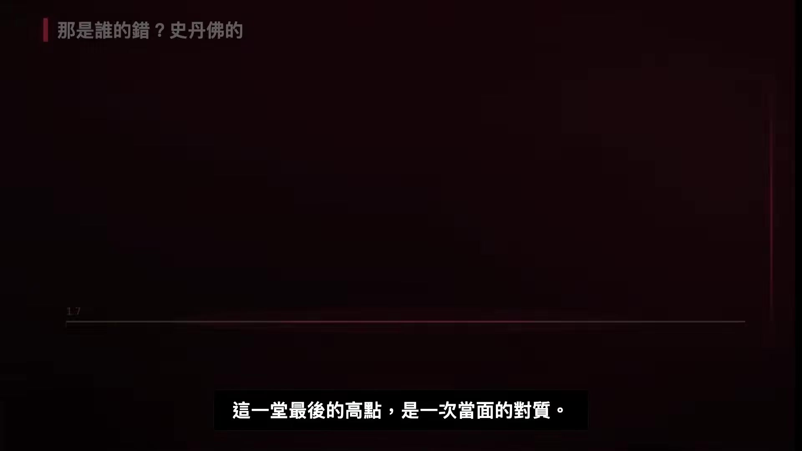

**逐字稿片段：** 是一次當面的對峙 主持人問他 美國國內的算力其實也很缺 新創大學 獨立的研究團隊根本拿不到 那美國自己不是應該排在出口前面嗎 他說絕對是 主持人說但是沒有發生 他說絕對沒有 全場都笑了 可是他不讓大家笑完 他說這不好笑 這是嚴肅的事 說有人下了單 而我們沒有交貨 這不是真的 你得先下單 然後他給了一個更難聽 也更準確的診斷

**話題推測：** 主持人提問美國國內算力缺乏問題

---

## 00:17:15

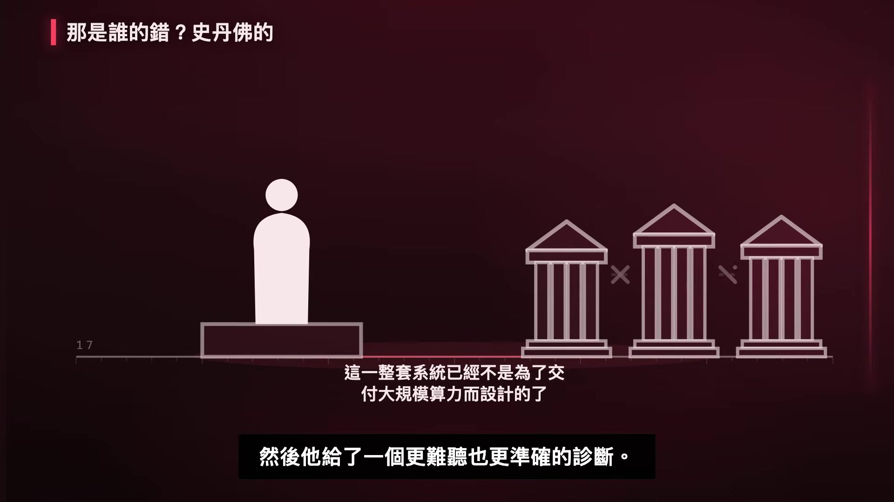

**逐字稿片段：** 他說根本的問題是 這一整套系統 已經不是為了 交付大規模算力而設計的了 史丹佛所有的研究部門 各自為政各自募款 沒有人會分享自己的經費 而沒有任何一筆經費 大到足以買下一臺 你只用一部分時間 但是用的時候需要他非常強的機器 主持人問 沒得錯 他說史丹佛的 主持人提到史丹佛的 效務基金有400多億美元 他的回答是 實際出來交給某一家雲端服務商 那也是每一個學生 每一個研究員都用得到AI超級電腦 我馬上就會這樣做 至於他為什麼要把責任推回去 那句解釋我們留到最後再講 第七堂課的講者 是這門課裡最不像AI產業的人

**話題推測：** 黃仁勳診斷問題：史丹佛系統未為大規模算力設計

---

## 00:17:53

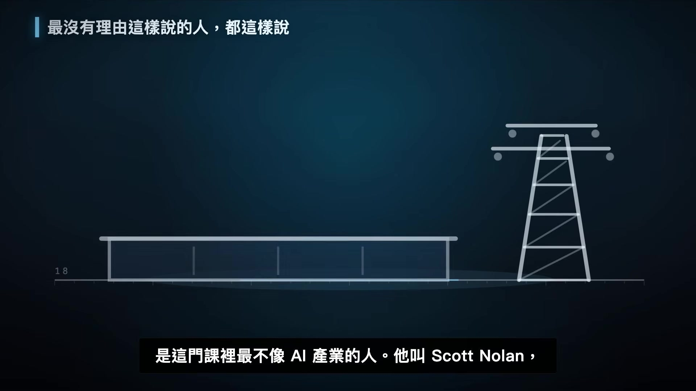

**逐字稿片段：** 他叫Scott Nolan 是General Matters的創辦人及執行長 他是一家做油濃縮的公司 他早年在SpaceX做推進系統 之後在創業投資機構Founders Fund 當了十年以上的合夥人 他一上臺沒有先講核能 他先舉證 他說有三個人 是最沒有理由說能源是瓶頸的人 他們上面都說能源是瓶頸 第一個是Sam Altman 他在美國參議院作證的時候說 所有的成本最後都會收斂到能源的成本 電的成本 因為晶片會變便宜 模型會變便宜 但是電是你在跑模型的時候 真正被消耗掉的東西 第二個是黃仁勳 他的誘因明明應該是說晶片才是瓶頸 可是他在Joe Rogan的節目上 被直接問到的時候 回答是他就是瓶頸 第三個是Elon Musk 他手上有一堆瓶頸可以講 他選的能源 主持人補的那一句最簡單 就算你的機房蓋好了 只要電送不進去

**話題推測：** 介紹第七堂課講者：Scott Nolan (General Matters創辦人)

---

## 00:18:43

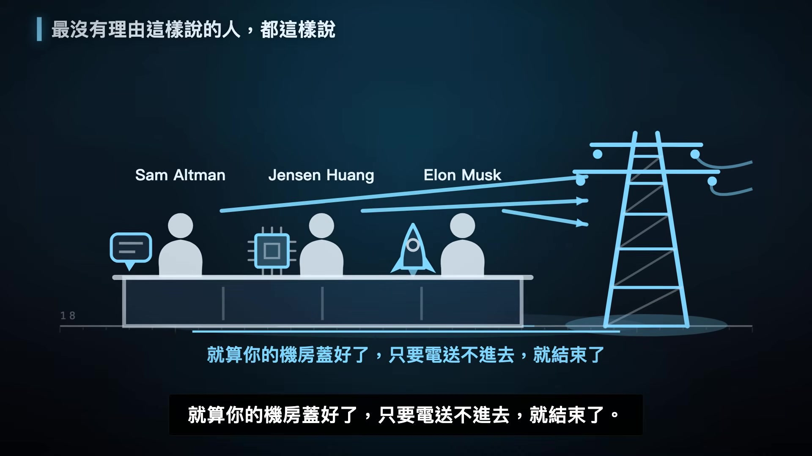

**逐字稿片段：** 就結束了 他接著把過去四年 講的兩次一模一樣的衝擊 第一次是2022年年底的CHAT GPT 那是第一個消費者等級的殺手級應用 一般人第一次真的每天在用AI 但是整條供應鏈完全沒有準備好 他說了一個外行人不會想到的細節 光是把晶片設計送去工廠流片 再把機房架起來 兩年 流片的意思是把設計定稿 送進晶圓廠 做出第一批實體晶片 所以2023年初就出現了算力荒 還短暫出現過電力荒 第二次是最近這一波 他說2025年底到2026年初 那幾個模型出來之後變得是企業 他說你們是學生 人家還有空慢慢玩 但是那些放假回去僱小孩的大人 假放完回到公司開始用它 然後事情就變了 而電從哪裡來

**話題推測：** AI發展的兩次衝擊：CHAT GPT與企業應用

---

## 00:19:28

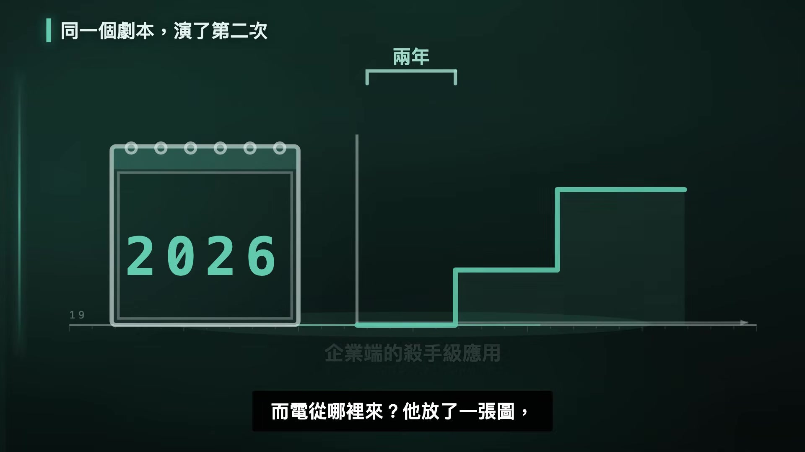

**逐字稿片段：** 他放了一張圖 把美國過去50年的用電量畫出來 前面30年一路往上 最近20年幾乎是一條平的線 他說我們需要的協律要比中國還陡 得從幾乎完全停滯 變成接近垂直 最快的解法 本來是去找那些已經有電 但是附近沒有人用的地方 這種電有一個名字

**話題推測：** 展示美國過去50年用電量圖表

---

## 00:19:47

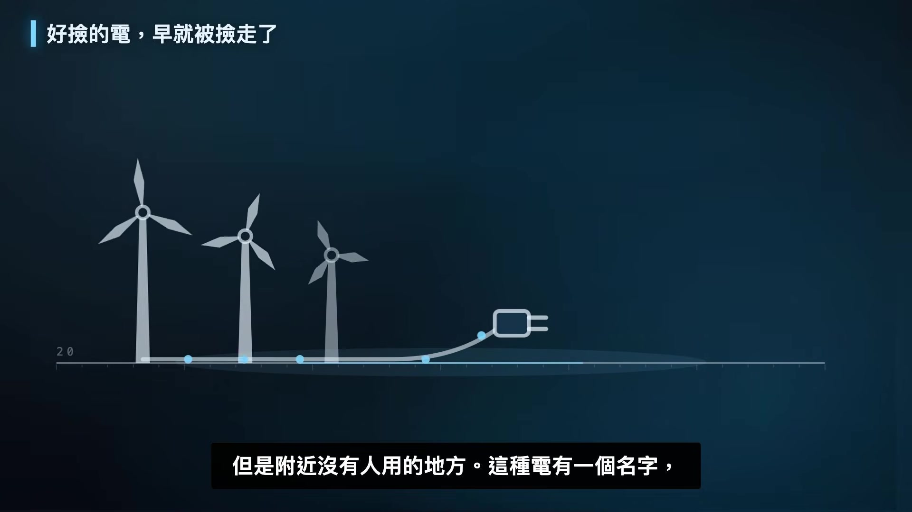

**逐字稿片段：** 擱淺的能源 偏遠地區的水力發電 孤立的地熱 還有西德州的風力 發出來沒有人要 只能浪費掉 而第一批跑去把這些電撿走的人 不是AI公司 是比特幣礦場 他們的條件很簡單 不需要光線 用衛星連線就夠了 他說今天那些好的資源 基本上都被撿光了 而且就算撿到 規模也早就不夠用了 這裡他跟主持人講了一段 我覺得很值得聽的話 主持人說

**話題推測：** 「擱淺的能源」概念，及比特幣礦場搶先利用

---

## 00:20:13

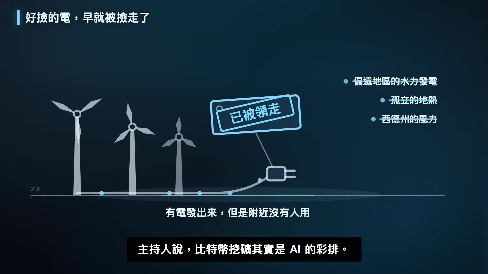

**逐字稿片段：** 比特幣挖礦其實是AI的彩排 他們兩個都提到同一件事 很多人只要看到一個團隊 跟加密貨幣有關 就把他們的技術進展一起丟掉 而那很可惜 他舉的例子是一家叫Kuso的公司 這家公司真正在做的事情 從來沒有變過 就是把沒有人要的電 變成有用的東西 他們一開始去油田那邊 把本來要直接燒掉 排進大氣的天然氣拿來發電 那時候那臺機器的產出是比特幣 今天他們把挖礦事業整個賣掉了 同一套本事拿去德州 蓋出一座超過11瓦等級的AI園區 那隔前的電檢完了 下一步是什麼

**話題推測：** 比特幣挖礦是AI彩排，以Kuso公司為例說明能源利用

---

## 00:20:47

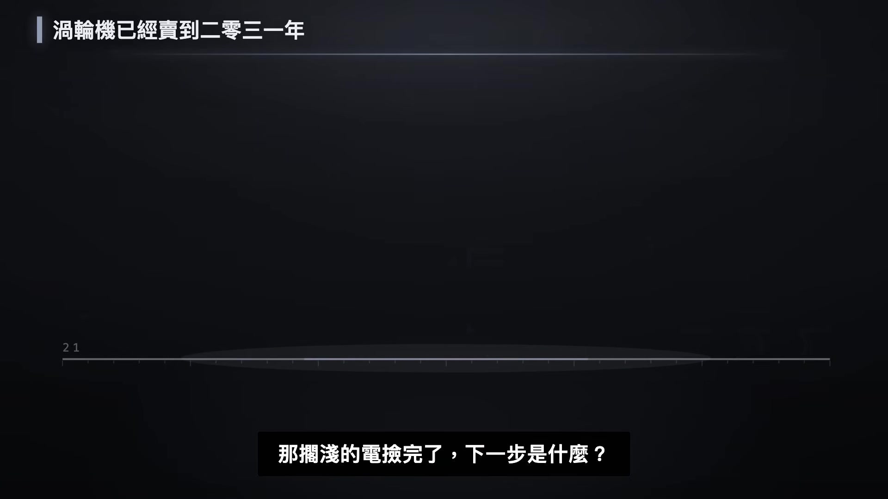

**逐字稿片段：** 現在的主流解法是燒天然氣 可是這裡有一個很硬的限制 發電用的燃氣渦輪機 全世界只有幾家做得出來 而他們的訂單已經排到2030年 現在借的是2031年交貨的預約 所以他說接下來兩年 真正的題目只有一個

**話題推測：** 目前主流解法：燒天然氣，但燃氣渦輪機供應鏈吃緊

---

## 00:21:02

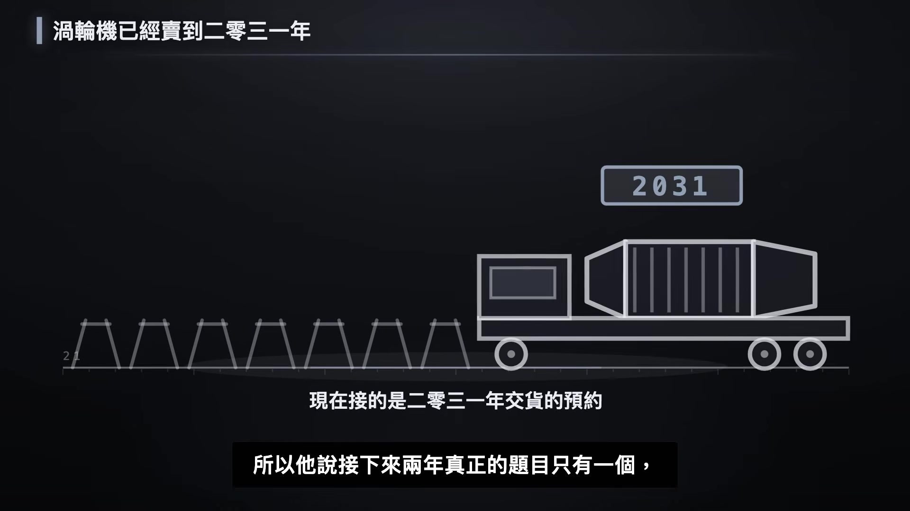

**逐字稿片段：** 怎麼在核能來得及之前不要撞牆 那核能為什麼是他認定的長期答案 他的論證方式很務實 如果你要的是 可以一直穩定發電的機載電力 要低碳 還要安全 那把歷史上每一座蓋過的電廠都算進去看統計 核能的碳排屬於最低的那一群 跟風力在統計上分不出高下 安全性也一樣 每發一度電造成的死亡人數 核能跟風力幾乎並列 太陽能才是第一名 他舉了兩個大家都聽過的事故

**話題推測：** 未來兩年挑戰：在核能成熟前避免撞牆

---

## 00:21:31

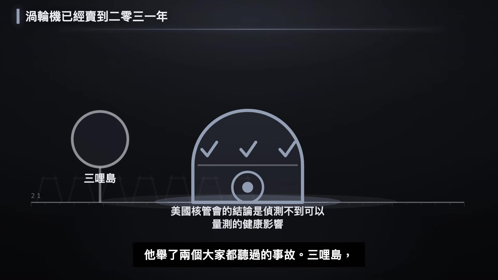

**逐字稿片段：** 山梨島 NG美國核管會的結論 偵測不到可以量測的健康影響 福島 官方認定的輻射相關死亡剛好一個人 一般民眾是零 而引發那場事故的海嘯本身 死亡加上失蹤接近兩萬兩千人 他真正想教學生的 其實不是核能

**話題推測：** 以三哩島與福島核災為例，說明核能安全數據

---

## 00:21:49

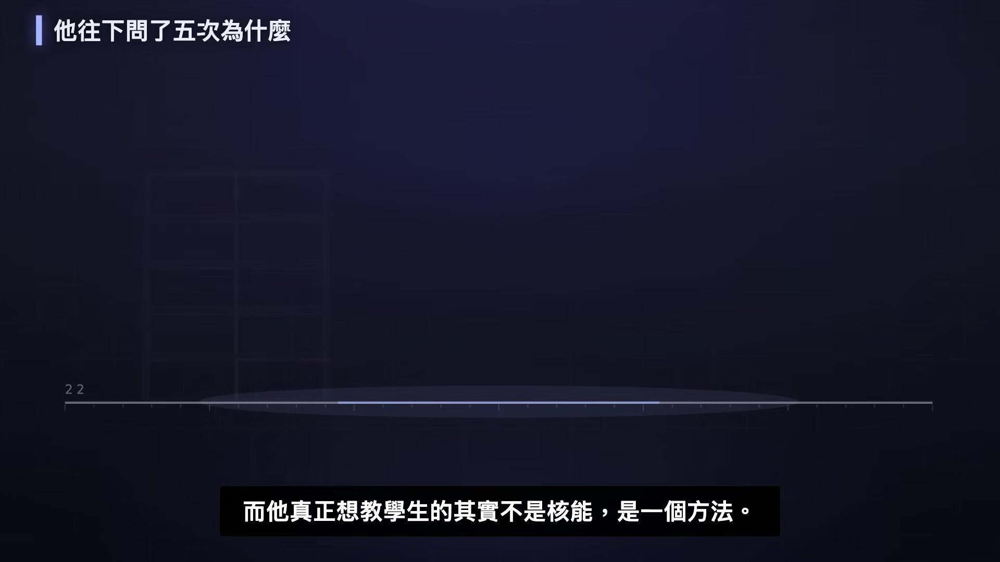

**逐字稿片段：** 是一個方法 他說不要太在意公開的敘事 也不要停在表層的說法 往下多問幾層 一路問到底 然後問我們到底要解決什麼 他自己示範了一次 AI的瓶頸是什麼 是算力 算力的瓶頸是什麼 是電 多電的長期瓶頸是什麼 是核能 核能的瓶頸是什麼 是燃料 燃料的瓶頸又是什麼

**話題推測：** Scott Nolan教學生的方法：一路問到底，追溯瓶頸

---

## 00:22:09

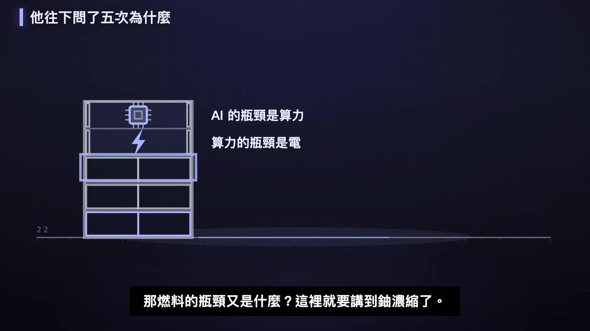

**逐字稿片段：** 這裡就要講到 優農說了 你從地下挖出來的鈾 裡面真正能拿來發電的那一種原子 連1%都不到 剩下的全部都不是 所以做核燃料的整條路是這樣 開採磨成黃餅 轉成氣體 把能用那種原子比例拉高 再轉回固體 最後壓成燃料丸 中間那一步把比例拉高 就叫濃縮 他自己給濃縮下的定義很好懂 濃縮說穿了就是精煉 只是他分的不是輕油重油 是同一種元素裡不同重量的原子 他的結論是 你把這個推導再做一次 你會發現濃縮在五年的時間尺度上 一路往下就是AI的瓶頸 他推到這一步的時候 丟出了整堂課最大的那個數字

**話題推測：** 解釋鈾燃料中可發電原子比例不到1%

---

## 00:22:48

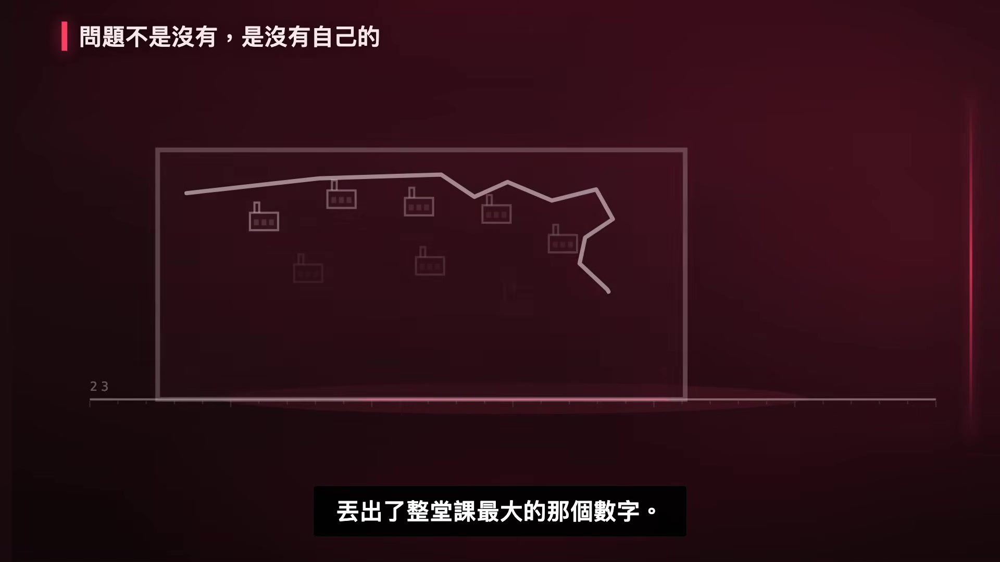

**逐字稿片段：** 他說你去看做核燃料的那幾個步驟 發現美國今天在濃縮這一步 全球的市佔率不到千分之一 這句話我要幫他講精確一點 因為他只在一種說法下成立 而講精確之後這個故事會更好

**話題推測：** 美國在核燃料濃縮領域的市佔率不到千分之一

---

## 00:23:01

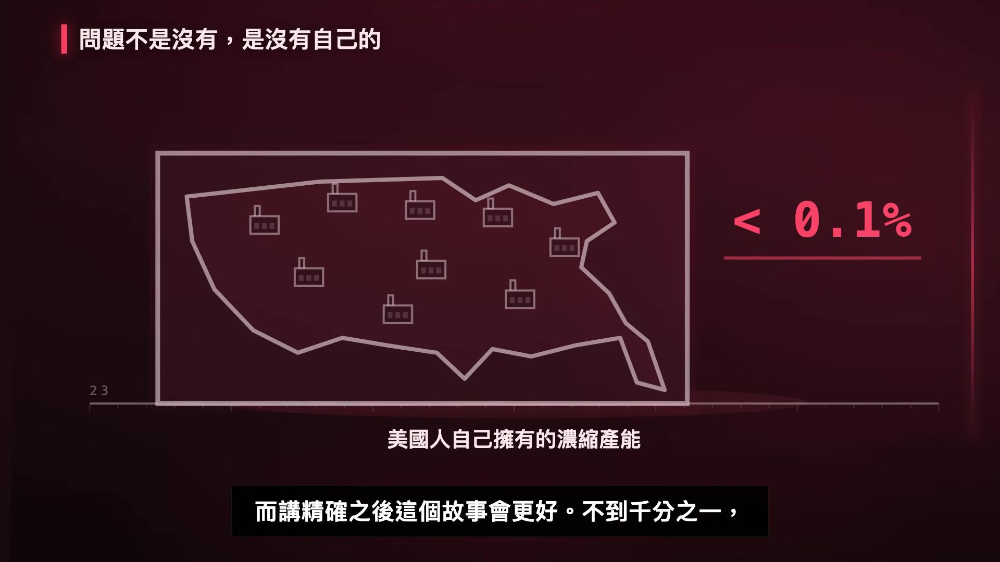

**逐字稿片段：** 不到千分之一 說的是美國人自己擁有的濃縮產能 美國國土上其實是有一座濃縮廠的 在新墨西哥州 年產量大概佔全球的6% 供應美國大約三分之一的需求 但是那座廠 是一家歐洲公司開的 所以真正的問題不是美國沒有 而是美國沒有自己的 他自己的說法也很直接 他說美國完全沒有能力 自己生產核燃料 我們完全依賴歐洲的廠商 甚至到今天還在依賴俄羅斯 即使有制裁 我們還是得進口 因為我們真的需要 你可以停在這裡 想一下這個畫面 一個正在跟全世界搶算力 把AI當成國家級競賽的國家 他的核燃料 得跟他正在制裁的對象買 這怎麼變成這樣的 答案是這一趟最有戲的地方 因為不是別人搶走的

**話題推測：** 澄清美國濃縮產能的實際情況與外國依賴

---

## 00:23:43

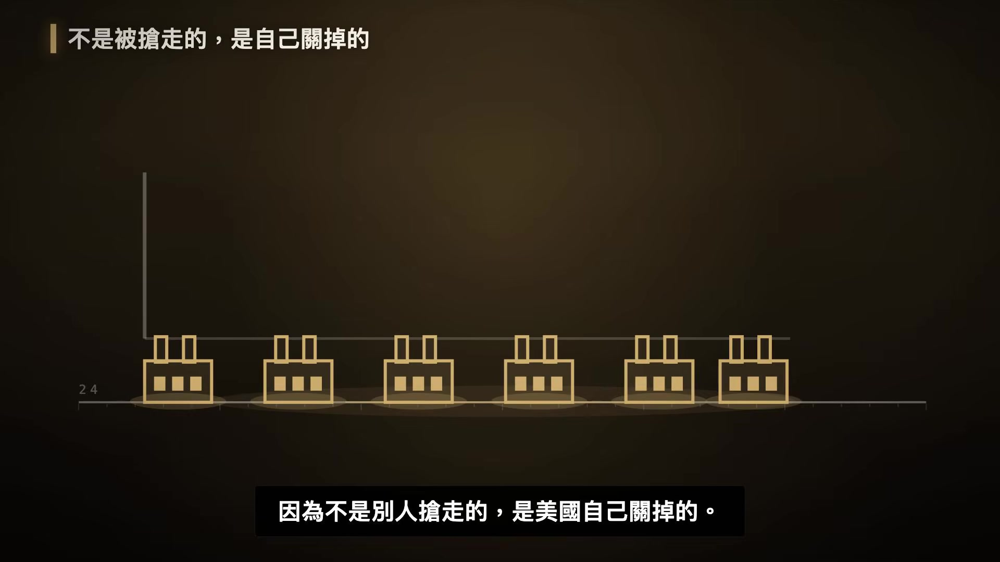

**逐字稿片段：** 是美國自己關掉的 時間倒回1960到70年代 美國幾乎壟斷了 整個非蘇聯世界的濃縮產能 1985年還有六成四 之後這條線一路往下 90年代中期剩不到四成 2001年剩兩成三 2008年剩一成四 中間發生了什麼 國領圍牆倒了 俄羅斯要裁減核彈頭 於是美國推了一個計劃 名字叫Megatons to Megawatts 中文可以說成 從百萬噸到百萬瓦 做法是把俄羅斯核彈頭裡的材料取出來 稀釋掉 變成發電用的燃料 丟進美國的反應爐去發電 500公噸的武器級材料 大約等於2萬顆彈頭 最後供應了美國核燃料的大約一半 同一段時間 美國自己那套老技術非常耗電 做同樣一份工要多燒50倍的電 成本上完全打不過 經營的公司開始虧錢 最後一座在2013年停止濃縮 這裡要補兩句話才誠實 法國的同型工廠2012年也關了 所以那是物理 不是美國獨有的失誤 而美國其實有做新一代的離心機 在2009年被政府拒絕貸款擔保之後就死掉了 他對這整體式的評語很輕 但是很重 他說我想當時大家心裡都有一個計劃 需要的時候再把濃縮找回來就好 而這個需要來得比任何人預期的都快太多

**話題推測：** 美國核燃料濃縮能力被關閉的歷史原因

---

## 00:24:57

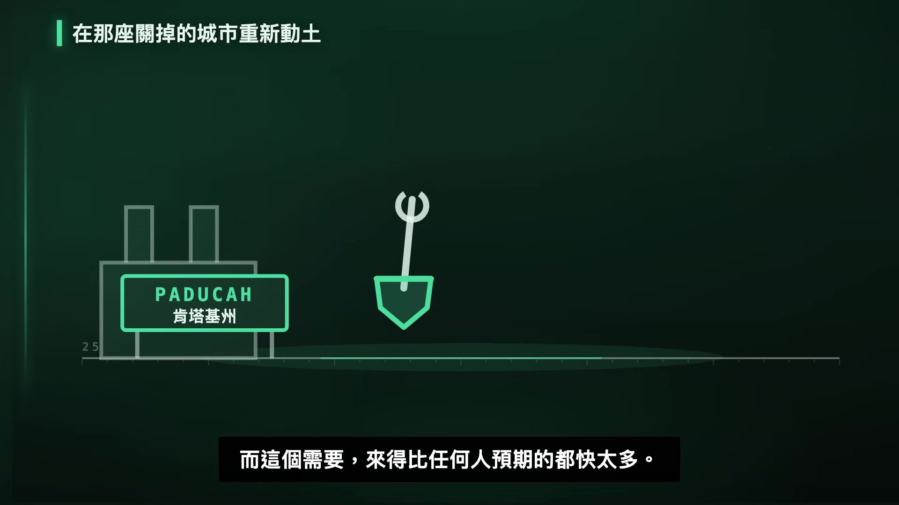

**逐字稿片段：** 2025年8月 美國坑塔基州的帕杜卡 一塊100英畝的土地上辦了凍土儀式 這座城市 就是美國最後那座濃縮場關掉的地方 凍土的是他那家兩年前才成立的公司 而2026年1月

**話題推測：** General Matters在美國帕杜卡重建濃縮廠的凍土儀式

---

## 00:25:12

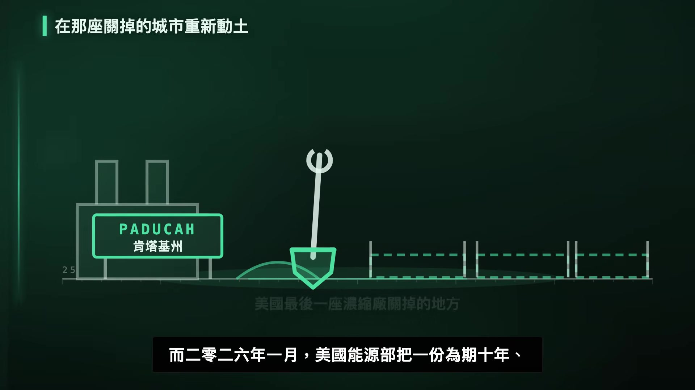

**逐字稿片段：** 美國能源部把一份為期10年 按照進度分批付款的9億美元合約給了他們 把產能蓋回來 這裡也要講清楚結構 那不是政府開一張9億美元的支票給一家新創 那是一份競標拿到的任務訂單 而且同一天能源部一共發了三張9億 總額27億美元

**話題推測：** 美國能源部授予General Matters 9億美元合約

---

## 00:25:29

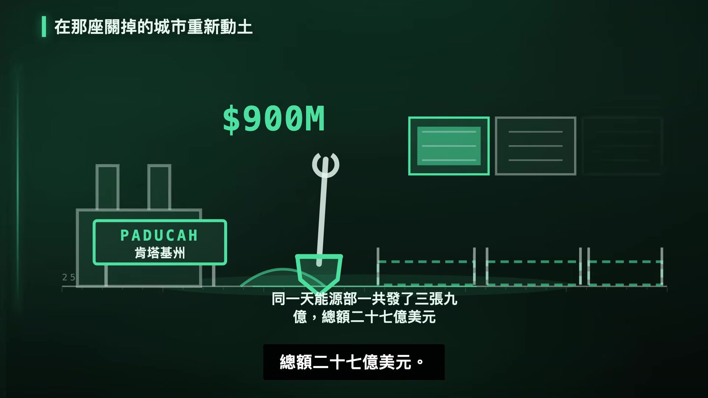

**逐字稿片段：** 加加公司未來幾年會需要大約1000個人 一半在加州做工程 一半在肯塔基做營建 所有人都在講AI會消滅工作 這裡有一條往相反方向長的線 他自己收在一句話上 他說回頭看1950、60年代

**話題推測：** 新廠將創造1000個工作機會，反駁AI消滅工作論

---

## 00:25:45

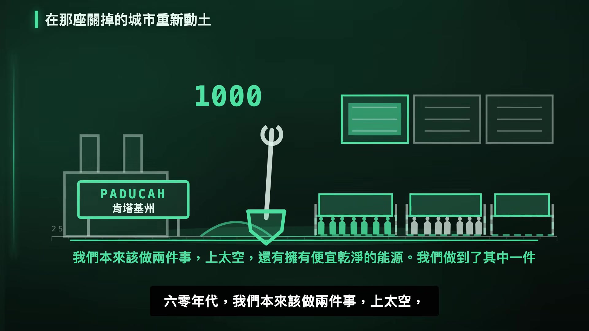

**逐字稿片段：** 我們本來該做兩件事 上太空 還有擁有便宜又乾淨的能源 我們做到了其中一件 而且現在我們終於在做第二件 最後一趟 主持人用一首歌開唱

**話題推測：** Scott Nolan總結：美國正完成第二件歷史大事（便宜乾淨能源）

---

## 00:25:54

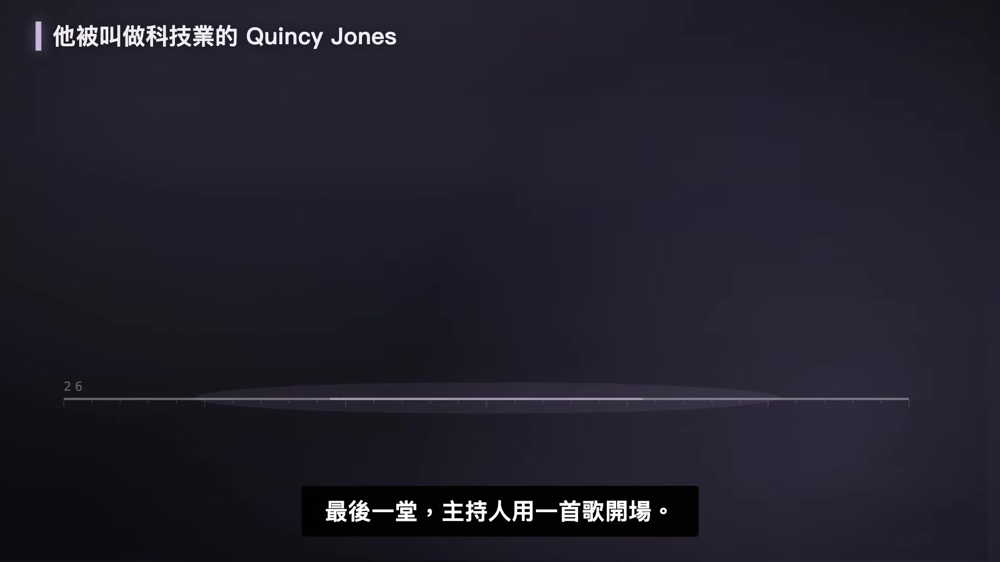

**逐字稿片段：** 他放的是四海一家 那首1985年 威爾伊索比亞集荒路的合唱曲 然後他說 今天這位來賓是科技業的Quincy Jones Quincy Jones這首歌的製作人 主持人給的理由是 他是全世界最會處理一群超有才華 又超難搞的人的那個人 那部紀錄片裡有一幕很好 然後錄影那天晚上 接近午夜 Quincy走進錄音室 指著門上他自己手寫貼上去的一張紙 說念一下那個 紙上寫的是 把你的自尊留在門口 今天坐在臺上的是Ben Horowitz Industry Horowitz的共同創辦人 那是今天全世界最大的科技創業投資機構之一 而他更早的身份是一個創業者

**話題推測：** 介紹第八堂課講者：Ben Horowitz (Andreessen Horowitz共同創辦人)

---

## 00:26:34

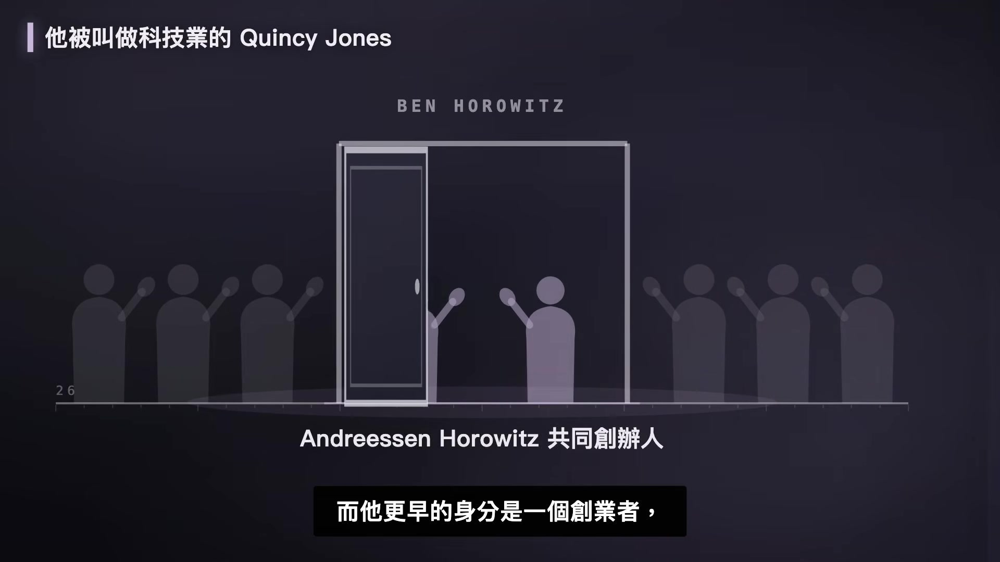

**逐字稿片段：** 跟Mark Andreessen一起做過一家叫Loud Cloud 來改名Osware的公司 2007年賣給了惠普

**話題推測：** Ben Horowitz早年創業Loud Cloud/Opsware的經歷

---

## 00:26:41

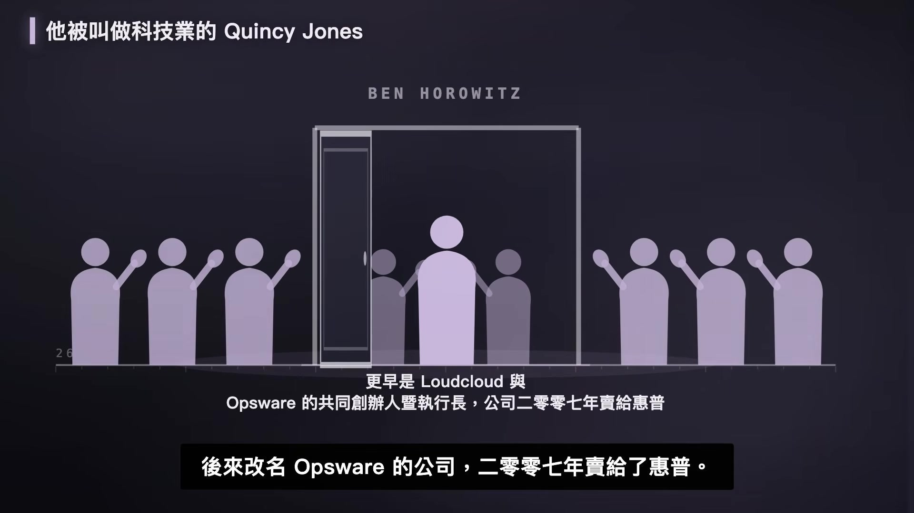

**逐字稿片段：** 這一堂跟前面三堂都不一樣的 前面三堂談的系統是機器 這一堂談的系統是錢和人 他說2009年他們開這家公司的時候 是衝著兩個當時所有人都同意的共識去的 第一個共識是 創業投資這門生意對出資人來說是好產品 回報很不錯 可是對創業者來說是爛產品 因為除了給錢以外幾乎什麼都不做 第二個共識更關鍵

**話題推測：** 本堂課主題：機器系統到錢與人系統

---

## 00:27:02

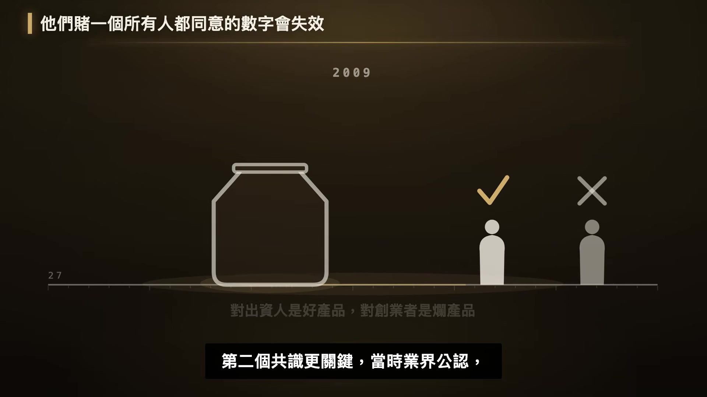

**逐字稿片段：** 當時業界公認每一年 全世界大概只會有15家科技公司 做到1億美元的營收 而這15家貢獻了整個行業將近全部的回報 你想想這句話的意思 如果每年真的只有15家 整個行業的玩法就只有一種 想辦法擠進其中幾家的股東名單

**話題推測：** 當時業界共識：每年僅15家科技公司達1億美元營收

---

## 00:27:19

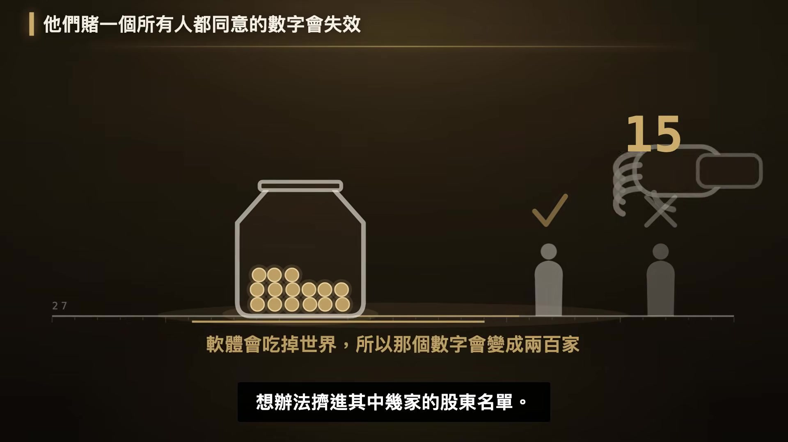

**逐字稿片段：** 他們賭的是這個數字會變 他們相信軟體會吃掉世界 所以每年做到那個規模的公司 會從15家變成200家 這裡要說明一下 那個15家的說法不是他們發明的 是當年整個業界共用的一組數字 他們做的事情是 站在同一組數字前面 賭它會失效

**話題推測：** Andreessen Horowitz的賭注：從15家變200家

---

## 00:27:36

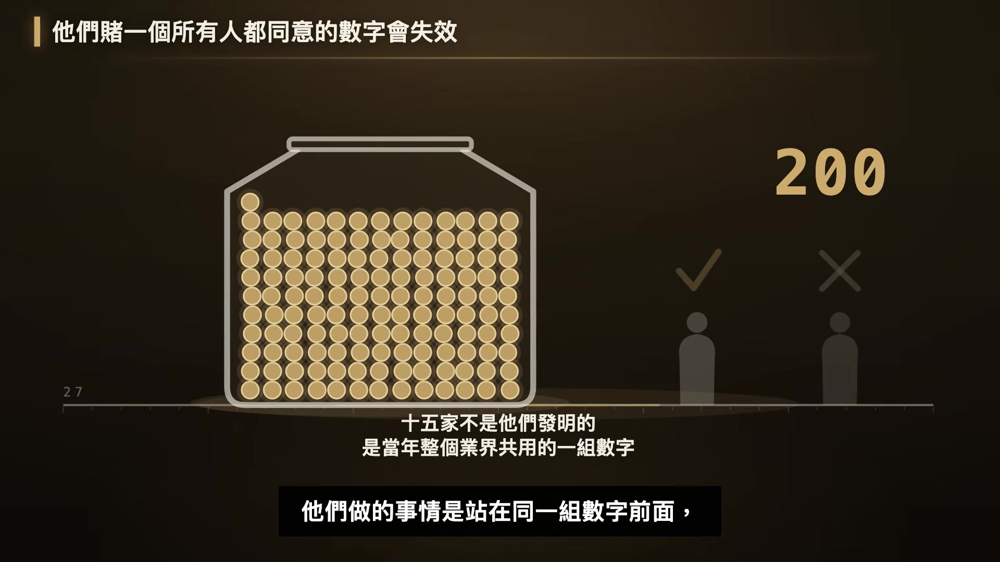

**逐字稿片段：** 他的第一個設計是關於權力怎麼分 傳統的機構是合夥制 幾個合夥人共享收益 也共享控制權 大勢都要所有人同意 他的判斷是 一旦控制權是共享的 這個組織就再也改不動了 他講了一句很誠實的話 任何一次重組 一定有人會恨他 不是因為那些人不好 是因為沒有人喜歡失去權利 所以他們的設計是 收益大家一起分 但是控制權集中 第二個設計更好笑

**話題推測：** Andreessen Horowitz的權力分配設計：收益共享、控制集中

---

## 00:28:03

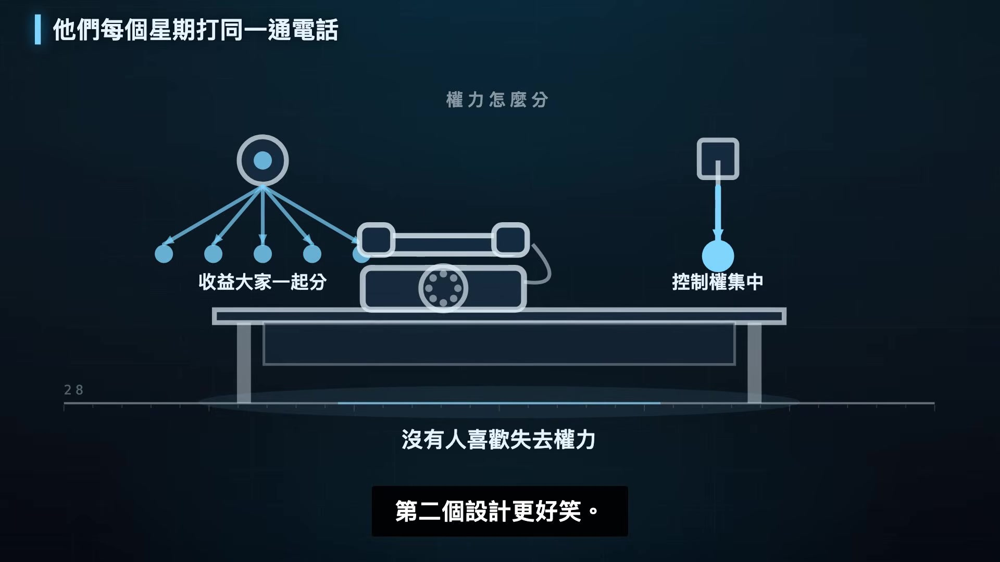

**逐字稿片段：** 新基金最大的問題是 沒有人認識你 而創業者最需要的東西之一 是能不能見到大公司的採購 他們做了兩件事

**話題推測：** Andreessen Horowitz解決新基金缺乏人脈的兩個方法

---

## 00:28:12

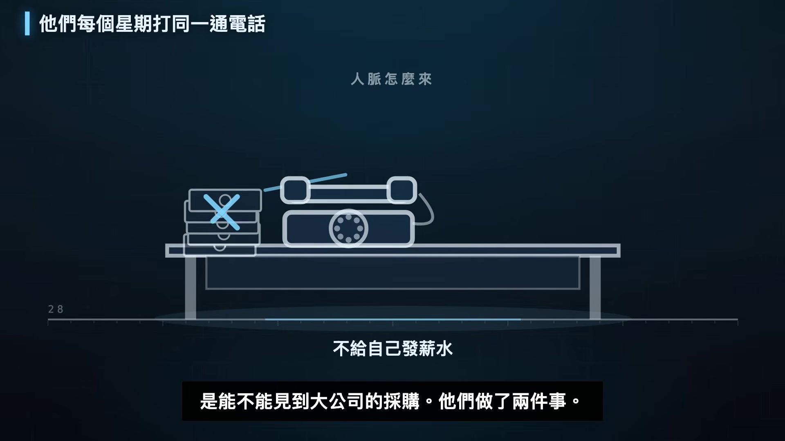

**逐字稿片段：** 第一件是不給自己發薪水 創投通常用管理費付自己很高的薪水 他們想的是 如果我們什麼都不拿 把那些錢拿去蓋一個人脈網路呢 第二件事是那個漏洞 他們前一家公司賣給了惠普 所以認識惠普企業簡報中心裡面的人 那是大企業專門用來接待客戶的地方 他說他們就每個星期打電話過去 問一句話 這禮拜有哪些公司要來 可以給我們電話嗎 把那些公司請到自己這邊來 是看完所有的新創 他說我們準備好甜甜圈 全部搞得一點都不像創投 那些大企業愛死了 這一段只有他自己講過 沒有別的來源可以對照

**話題推測：** Andreessen Horowitz不給自己發薪水，投入建立人脈網路

---

## 00:28:45

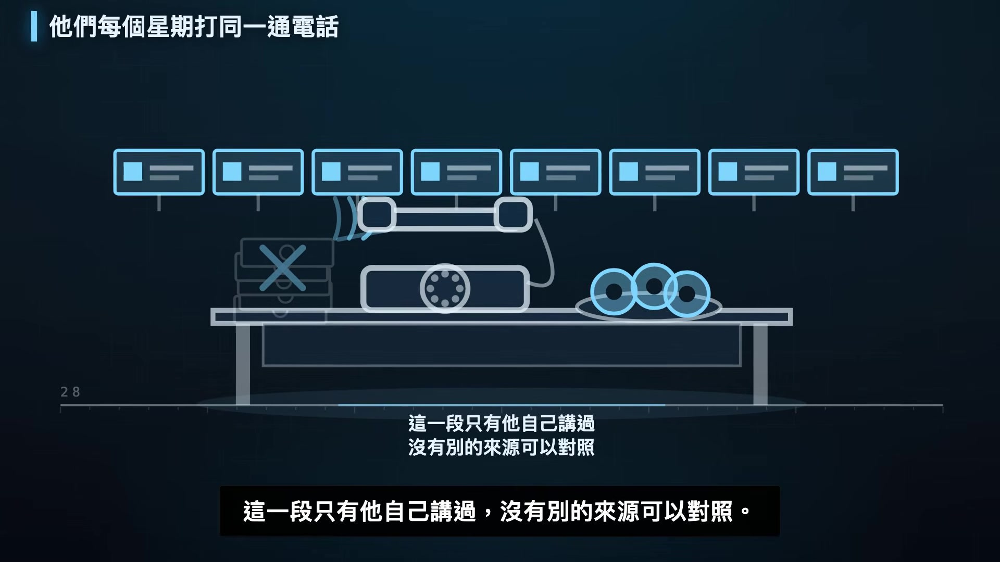

**逐字稿片段：** 而且他們還在業界非常不受歡迎 他說其他創投給他們取了難聽的綽號 然後他自己還火上加油 寫了一篇文章 直接列舉創投做的哪幾件事他很討厭 他說每一次見出之人 對方都跟他講同一件事 我們去見別家創投 他們只想講你們 而且講的都是難聽話 他的反應是 那太棒了 然後他給了一句 我覺得整堂課最反直覺的話

**話題推測：** Andreessen Horowitz在業界不受歡迎的原因

---

## 00:29:07

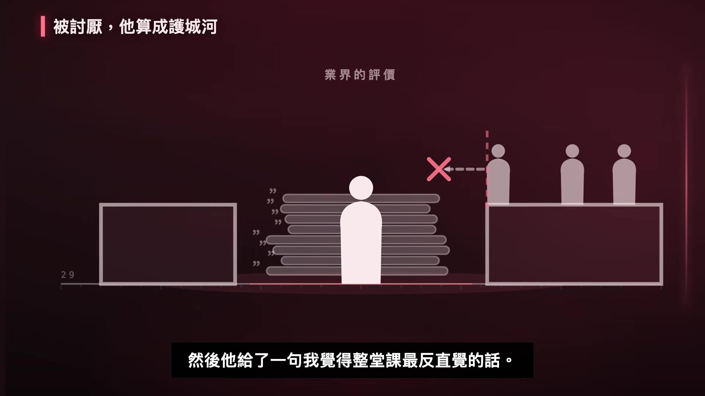

**逐字稿片段：** 他說因為他們太恨我了 所以他們不願意抄 我們正在做而且正在成功的東西 值得停一下 一般人會把被討厭算成成本 他把它算成時間 當你的對手因為情緒上的理由拒絕承認 你做對了 你就多買到好幾年 組成補了一個很妙的旁證 他當時人在對接另一家老牌創投上班 他把Andreason Horowitz的新聞 拿給自家的行銷長看 我們也應該做這個 行銷長看完說 那只是簡報會而已 那只是行銷 他講完創投的歷史之後 丟出了對整個系列最重要的一句話

**話題推測：** Ben Horowitz反直覺觀點：被討厭是競爭優勢

---

## 00:29:38

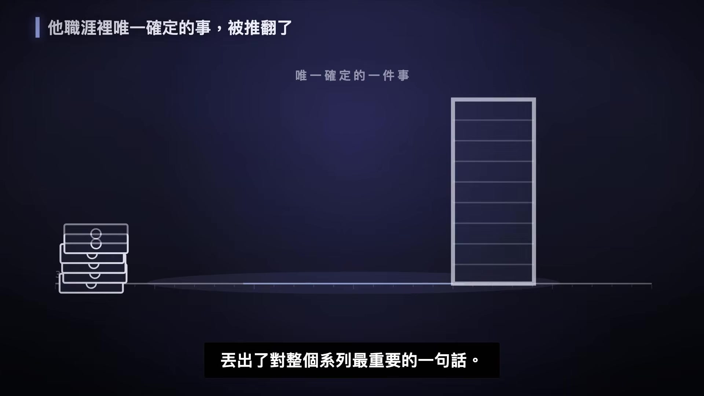

**逐字稿片段：** 他說我整個質押力 關於科技公司 唯一確定的一件事就是 你不能靠砸錢解決問題 如果有人領先你兩年 你沒有辦法僱 一千個工程師追上去 他用的比喻是 九個女人 沒有辦法在一個月裡 生出一個小孩 有些事情就是 不能分開來同時做 而且人一多 光是溝通的成本 就會把時間吃光 然後他把這條鐵律推翻掉

**話題推測：** Ben Horowitz過去深信：砸錢無法解決問題

---

## 00:30:00

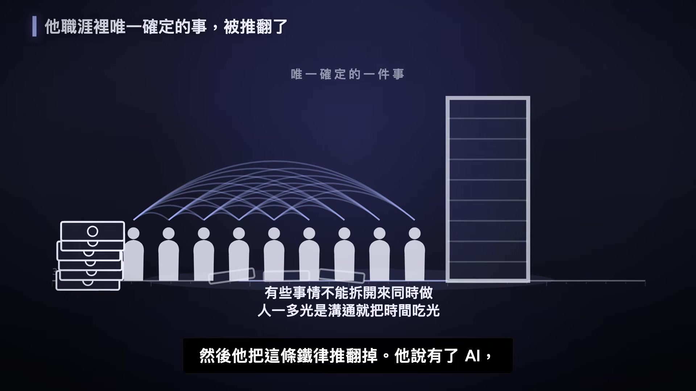

**逐字稿片段：** 他說有了AI 這件事真的變了 你現在可以靠砸錢解決問題 因為只要你有夠多的GPU 和夠多的資料 你基本上什麼問題都能解 這句話的後果很大 他自己接著推下去

**話題推測：** AI時代改變：砸錢可以解決問題

---

## 00:30:12

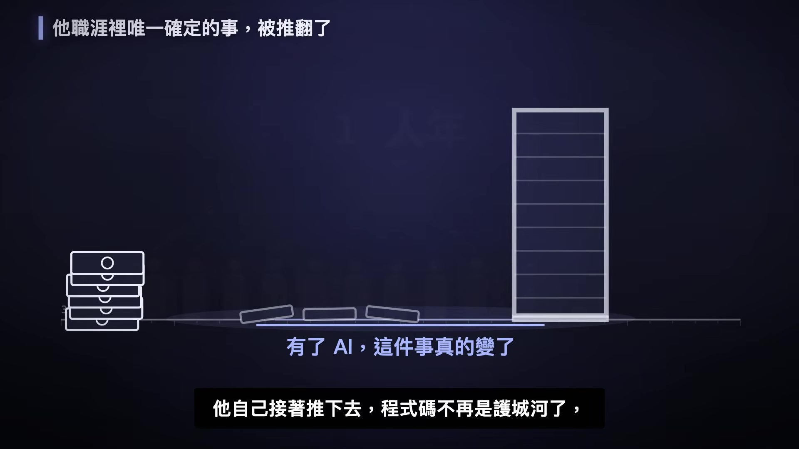

**逐字稿片段：** 程式碼不再是護城河了 使用者的界面也不再是護城河了 那你的進入障礙到底還剩下什麼 他順手回答了一個大家常問的問題 會不會需求撐不住 他說你們很多人太年輕 沒有用過以前的企業軟體 光是部署就要兩年 至少一百萬美元起跳 那當然會限制需求 我們當一個技術好用到現在這種程度 需求就沒有上限 那如果程式碼和界面都不是護城河了 還剩下什麼

**話題推測：** AI時代護城河不再是程式碼和使用者介面

---

## 00:30:37

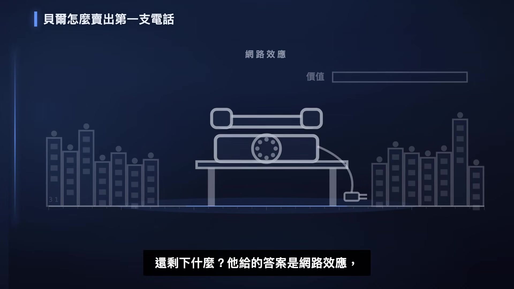

**逐字稿片段：** 他給的答案是網路效應 可是他馬上把這個詞 最難的地方講出來 網路效應的意思是 一個東西用的人愈多 他對每一個人就愈有價值 通訊軟體是最典型的例子 你留在上面不是因為他做得多好 是因為你想找的人都在上面 他說如果一個網路上有10億人 他當然很有價值

**話題推測：** 剩下唯一護城河：網路效應

---

## 00:30:57

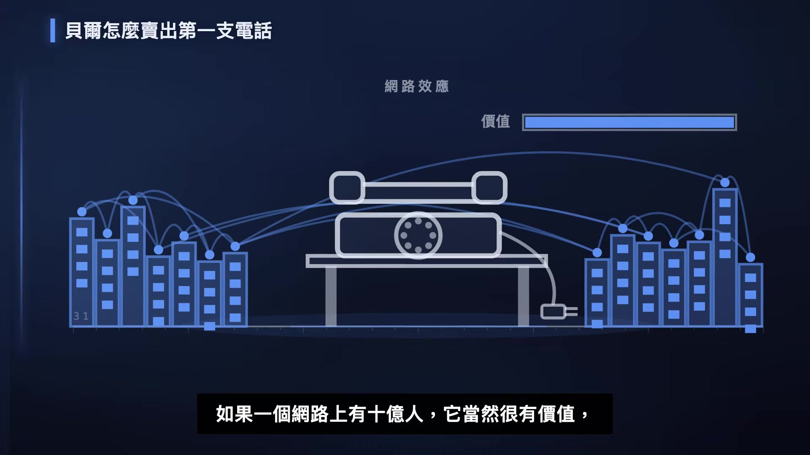

**逐字稿片段：** 這誰都知道 但是貝爾當年怎麼賣出第一支電話 那時候根本沒有人可以講話 系統一個網路 才是真正難的那一部分 這裡他也說了一句 對年輕創業者很不留情 但是很誠實的評論

**話題推測：** 以貝爾電話為例：建立第一個網路最難

---

## 00:31:08

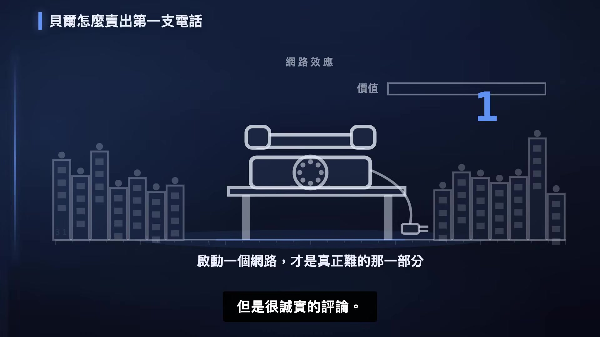

**逐字稿片段：** 他說他認識20歲的Mark Zuckerberg 如果那時候他做的不是一門有網路效應的生意 那根本不可能成功 他當時就是不夠好 正因為那門生意有垂直起飛的性質 他才有時間長成後來的樣子 這句話聽起來刻薄 可是他在講一件對每個人都有用的事 一個好的結構會替你買到飯廚和長大的事

**話題推測：** 馬克·祖克柏的成功得益於網路效應

---

## 00:31:27

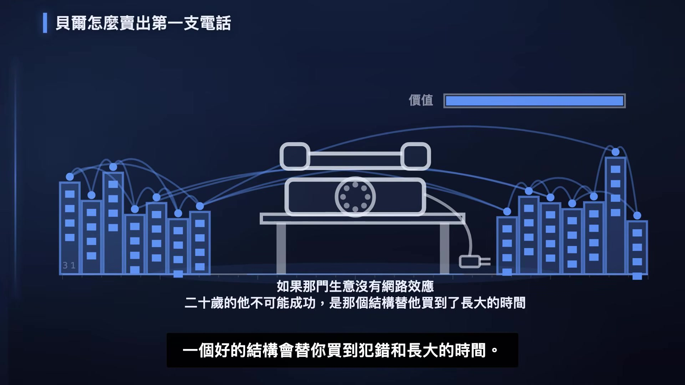

**逐字稿片段：** 他花了不少時間講文化 而他對文化的定義 跟大部分公司牆上貼的那一套完全不一樣 他說文化不是信念是行為 不是我們有誠信我們互相支援那種話 而是我們具體怎麼做事 我們進不進辦公室 5點下班還是待久一點 有人問我一個問題 我是馬上回 還是一個禮拜之後才回 這些才是文化 他的收入我覺得非常實用

**話題推測：** Ben Horowitz對「文化」的定義：不是信念，是行為

---

## 00:31:48

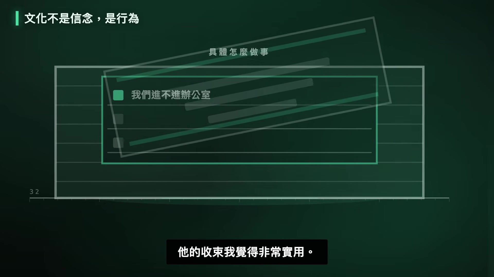

**逐字稿片段：** 他說如果你有一個明確的標準 那有人做不到的時候 處理起來很簡單 可是如果你沒有標準 別人又沒有照你希望的方式做事 你就只會生氣 然後公司就開始內鬥 開始政治化 因為他為什麼可以下班 可是我們從來沒有說過 他要留下來 他也很直白的說

**話題推測：** 有明確標準才能避免公司內鬥和政治化

---

## 00:32:04

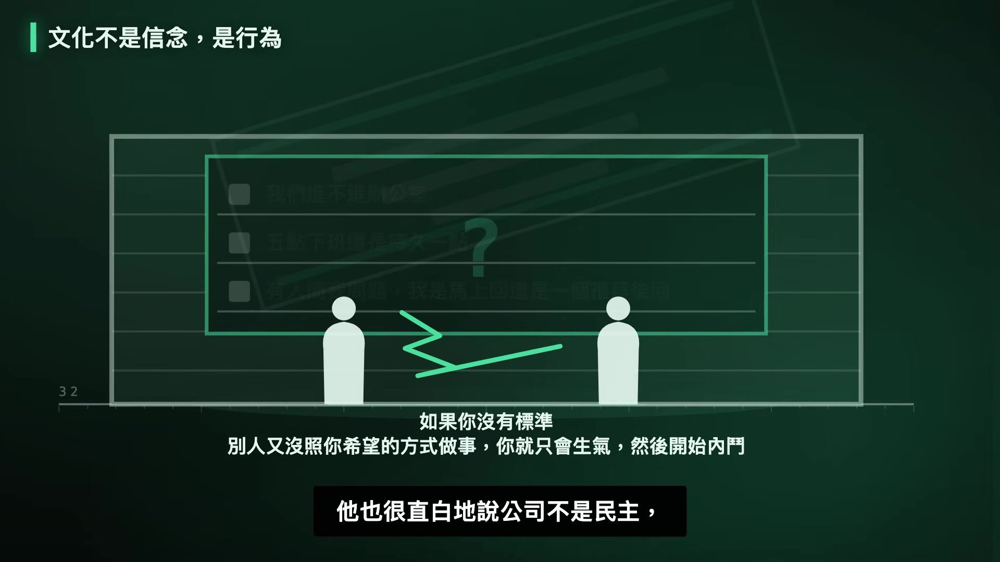

**逐字稿片段：** 公司不是民主 他討厭共同執行長 因為你需要有人來打破僵局 但是他馬上把界限畫清楚 而這條線畫得很好

**話題推測：** 公司不是民主，需要有人打破僵局

---

## 00:32:12

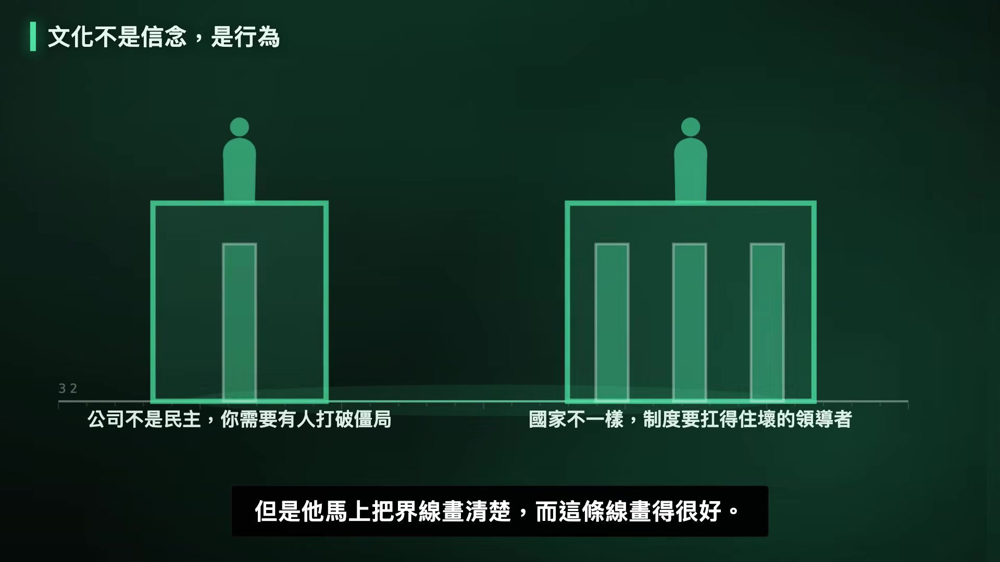

**逐字稿片段：** 他說國家不一樣 公司倒了就倒了 惠普的兩位創辦人走了 後面的領導人不夠好 公司就結束了 沒關係那只是一家公司 國家必須撐得比那更久 所以寧可把權力分散 讓這套制度扛得住一個壞的領導者 他還處理了一個 現在很多人在問的問題 市場上有一種說法是

**話題推測：** 公司與國家治理的差異：權力集中與分散

---

## 00:32:31

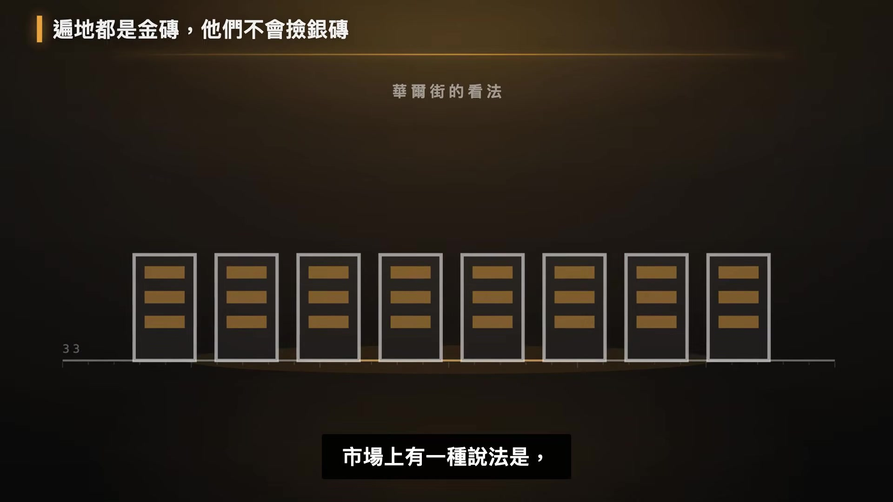

**逐字稿片段：** AI會把所有的軟體公司一次做掉 他的回答很直接 他說這是華爾街的看法 而只要華爾街想的跟硅谷不一樣 那個價差就值很多錢 何況華爾街總是錯的 他舉的例子是一家做商務差旅的公司

**話題推測：** AI會取代所有軟體公司？華爾街看法與硅谷不同

---

## 00:32:43

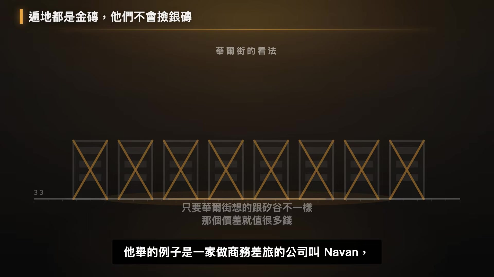

**逐字稿片段：** 叫Navon 他自己是那家公司的董事 要做這門生意 你得跟全世界每一家航空公司 每一家飯店建立供應鏈關係 還得有很舊的系統 最後你還要賣給一個叫差旅經理的人 他問了一句 Anthropic會去建一條通路來賣給差旅經理嗎 他自己的答案是 遍地都是金磚 他們不會彎腰去撿一塊銀磚 他解釋華爾傑的機制那一段也很好懂

**話題推測：** 以Navan差旅公司為例，說明AI不會取代所有利基市場

---

## 00:33:08

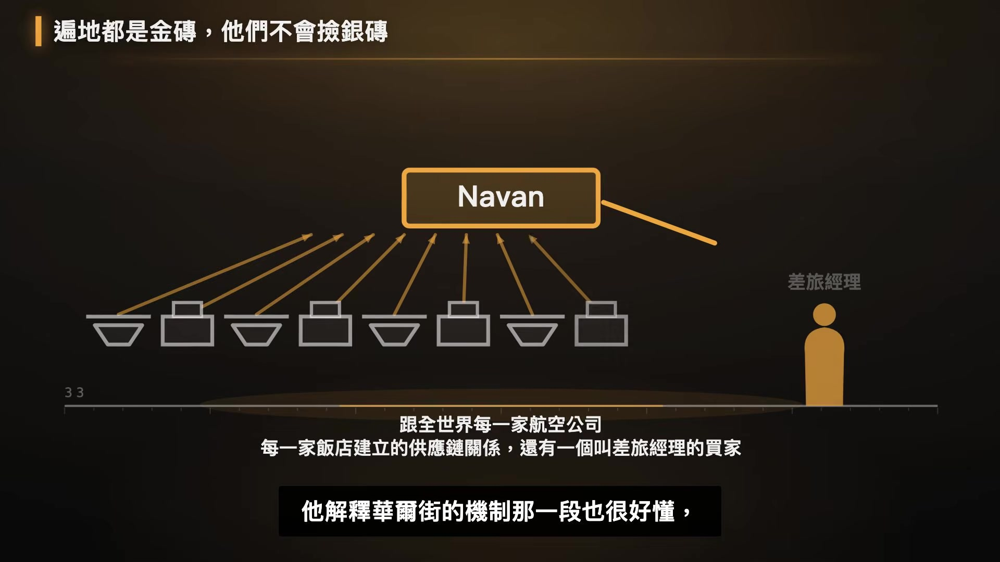

**逐字稿片段：** 但其實是投票機 長期是稱重機 這是巴菲特把格拉汗的想法 濃縮出來的說法 因為華爾街買的是敘事 不是事實 而他形容那種 一起被賣掉的狀況 用了一句很老的行話

**話題推測：** 巴菲特的市場觀點：華爾街短期是投票機，長期是稱重機

---

## 00:33:20

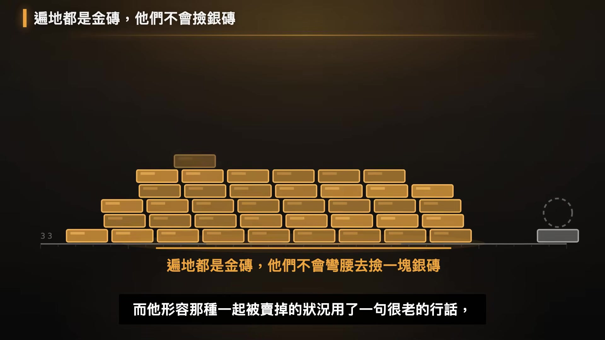

**逐字稿片段：** 球車停到門口的時候 屋裡的人全部都會被抓走 不是隻有真的犯了罪的那集 斯坦克走到這裡 我要把上一集的一句話 拿回來對照 上一集

**話題推測：** 形容市場崩盤的行話：「球車停到門口」

---

## 00:33:30

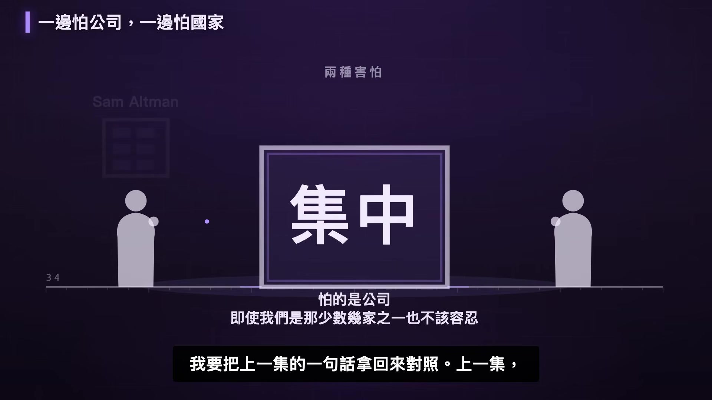

**逐字稿片段：** OpenAI的執行長 講到權力集中的時候說 那是這個時代的吸引子狀態 就是不管你怎麼走 最後都會被拉過去的 那個結局 而他說即使我們會是 那少數極甲之一 這也不是我們該容忍的事 這一集Ben Horowitz用了幾乎一模一樣的詞 而出完全相反的結論

**話題推測：** 對比Sam Altman（OpenAI）對權力集中的看法

---

## 00:33:48

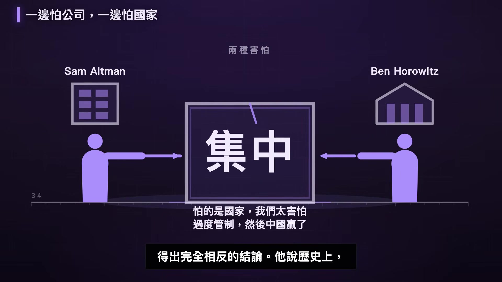

**逐字稿片段：** 他說歷史上權力的集中 一直是對人類最糟的事情 可是他接著說 所以我最害怕的是 我們作為一個國家失敗 我們太害怕 我們過度管制 我們把資料中心叫停 然後中國贏了 他的最後一句是 恐懼本身造成的問題 可能比大家害怕的東西還糟 兩邊都反對集中 只是一邊怕的是公司 另一邊怕的是國家 而兩邊也都沒有回答對方的問題 上一集那些人沒有處理 如果你慢下來 對手不慢怎麼辦 這一集這些人也沒有處理 如果贏的那一方本來就是你自己 那又怎麼辦 我們回到黃仁勳那句還沒講完的話 他被問到那是誰的錯 他說是史丹佛的 然後他解釋了為什麼 他說當你說某件事是誰的錯 你就把解決他的權利給了那個人 說的你的錯 就是在授權你自己去解決它 四位講者站在四個 源泉不同的位置上 可是他們合起來給了同一個答案

**話題推測：** Ben Horowitz對權力集中的看法：歷史上最糟之事

---

## 00:34:38

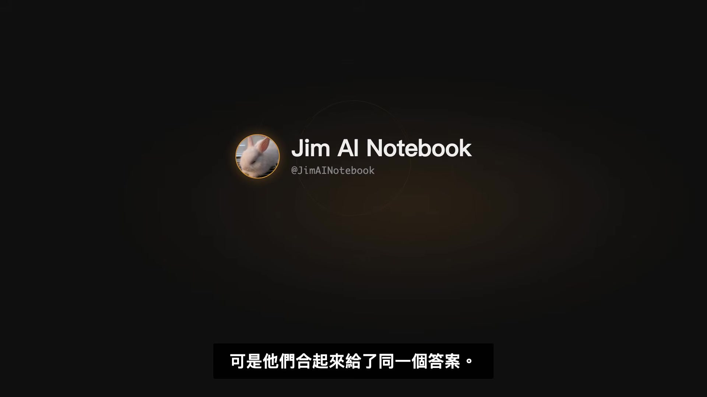

**逐字稿片段：** 這個時代的槓桿是真的變長了 長到一個人可以在五天裡 重做一件當年要十個人做兩年的事 長到一家兩年前才成立的公司 可以補一個國家幾乎歸零的產業 但是每一根槓桿的支點 都在別人手上 而且都要付租金 Ben Horowitz給學生的建議 我覺得是四堂課最好的收尾 他說你把AI想成電 假設你活在通電之前的世界 六點就得回家 因為天要黑了 哪裡都去不了 現在這個全新的世界要來了 去把這個技術搞懂 然後想清楚 你真正在乎世界上的什麼 生物材料火箭都可以 然後把工具帶在身上去做那件事 最後問你一個問題 如果現在有一根長道 可以撬動一個產業的槓桿 放在你手上 而你也知道支點是租來的 你會拿它去撬什麼 留言告訴我 下集我們會看完這門課 剩下的幾堂 我會放在同一個播放清單裡 喜歡的話訂閱AI Notebook 開啟通知 下次見

**話題推測：** 本集總結：AI時代槓桿變長，但支點是租來的

---
