# jimainotebook_z8CE2M6B02Q — 關鍵畫面索引

- 來源逐字稿：[jimainotebook_z8CE2M6B02Q_FIN.srt](jimainotebook_z8CE2M6B02Q_FIN.srt)
- 影片：https://www.youtube.com/watch?v=z8CE2M6B02Q
- 截圖數：110

## 00:00:10

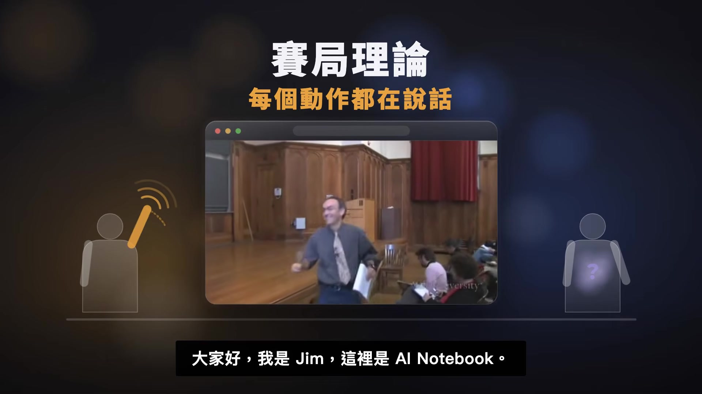

**逐字稿片段：** 這一集是耶魯大學賽局理論公開課的最後一集,

**話題推測：** 介紹耶魯大學賽局理論公開課的最後一集。

---

## 00:00:14

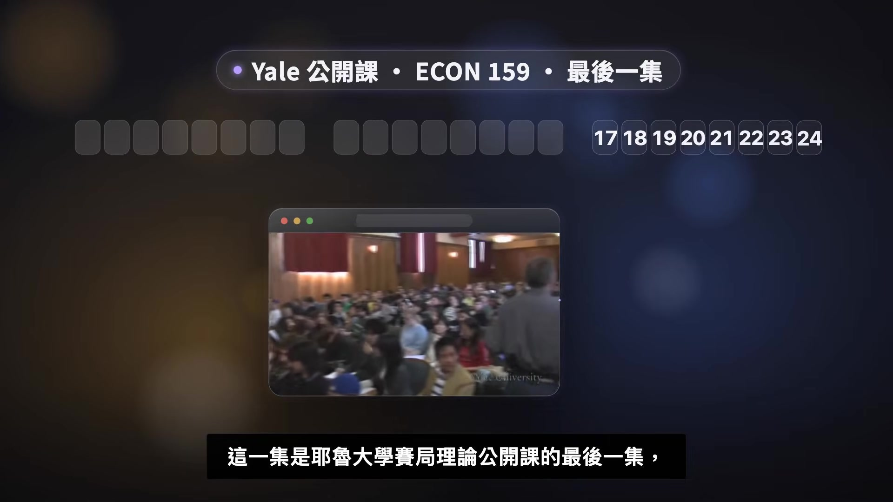

**逐字稿片段：** 課號Econ159, 這次上第十期, 好到第二十四發, 講臺上還是Ben Pollack老師,

**話題推測：** 提及課程號碼Econ159，可能顯示在簡報上。

---

## 00:00:18

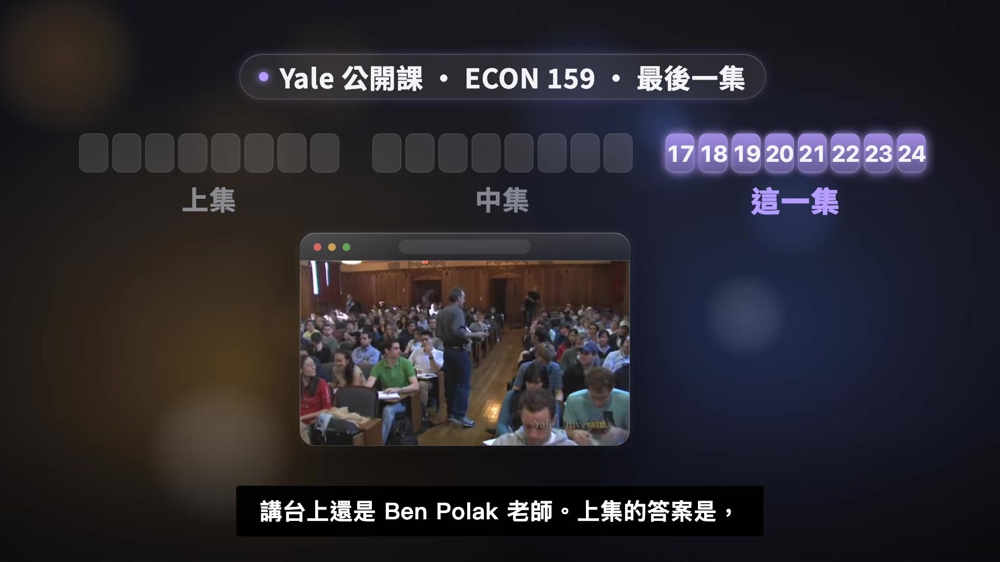

**逐字稿片段：** 上集的答案是, 難的不是算出自己要什麼, 是算出別人會怎麼做, 終極的答案是, 難的不是眼前划算, 是長期划算,

**話題推測：** 開始回顧上集的主要答案或結論。

---

## 00:00:26

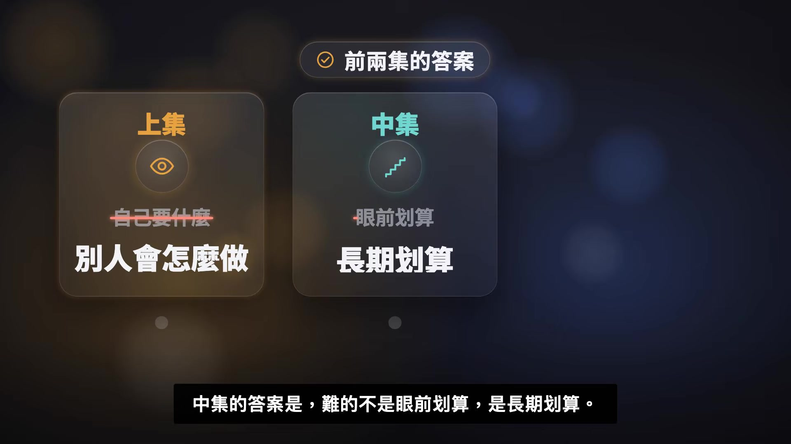

**逐字稿片段：** 終極最後留下一個問題, 當你根本看不到對方心理那件事的時候, 你還能不能算他有多急, 他說的話算不算數, 他到底是哪一種人, 這些都不會寫在他的臉上, 可是他們會寫在他的動作裡, 我先把答案放在前面能算 因為每個動作都在說話 難的不是看穿人心是讀懂動作

**話題推測：** 提出本次課程要探討的終極問題。

---

## 00:00:43

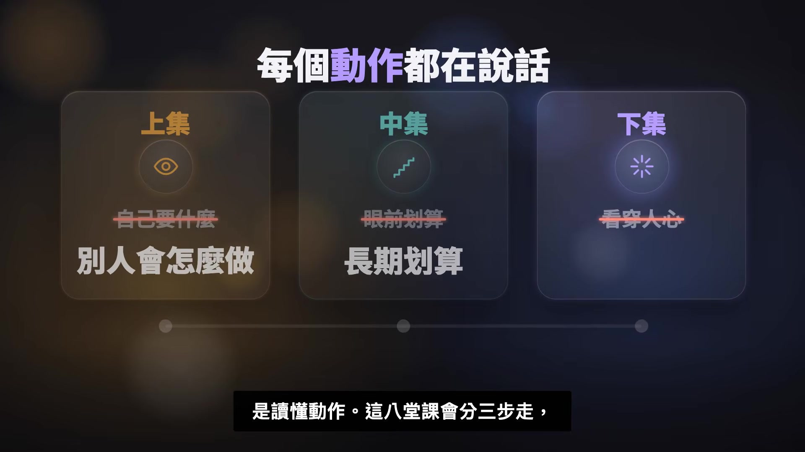

**逐字稿片段：** 這些八堂課會分三步驟 先看看不見的東西怎麼改變算法 再看嘴上說的話什麼時候算數 最後看沒有明天的時候 一個動作憑什麼讓人相信

**話題推測：** 概述本次八堂課將分為三個步驟進行的學習內容。

---

## 00:00:51

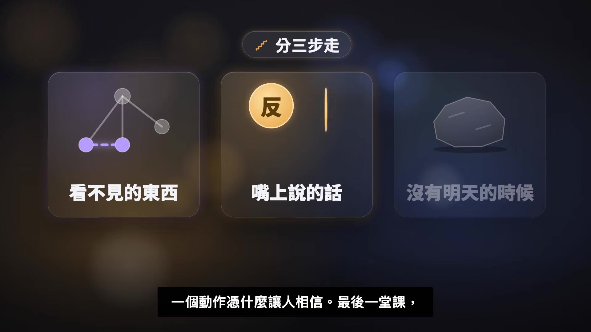

**逐字稿片段：** 最後一堂課 Polak會讓一罐硬幣在教室裡傳 出價最高的那位同學會發現自己贏了 才是壞消息 這一題我們留到最後

**話題推測：** 介紹Polak老師將進行一個關於傳遞硬幣罐的實驗。

---

## 00:00:59

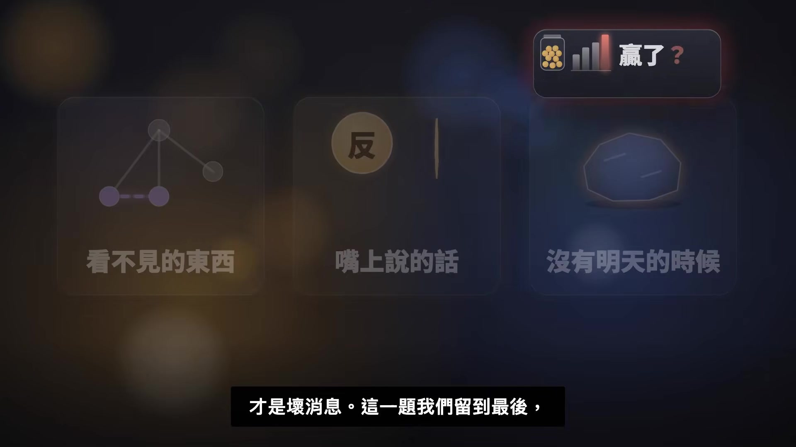

**逐字稿片段：** 先從那塊錢開始 Polak從口袋裡拿出一張真的一塊錢 走下講臺 在一排座位旁邊停下來 找了兩個同學 規則很短 第一個人說一個分法 自己留多少 給對方多少 第二個人只能做一件事 收或者不收 他收下 兩個人就照這個分法拿錢 他不收 兩個人一毛都拿不到

**話題推測：** 開始一個關於一塊錢的實驗，可能是Ultimatum Game的介紹。

---

## 00:01:16

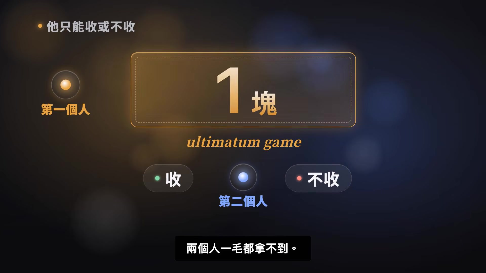

**逐字稿片段：** 這個遊戲叫 Ultimatum Game 中文叫最後通牒賽局 叫它最後通牒 是因為第二個人 沒有還價的機會 只能點頭或搖頭

**話題推測：** 正式介紹遊戲名稱：Ultimatum Game（最後通牒賽局）。

---

## 00:01:23

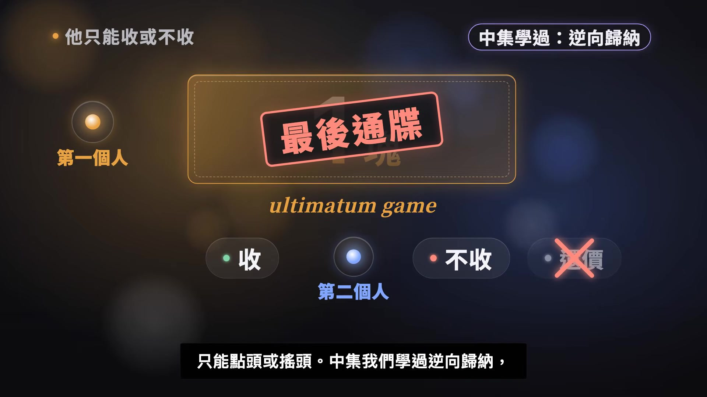

**逐字稿片段：** 終極我們學過 逆向歸納 也就是從最後一步倒著算 這一題倒著算很快 我們先看第二個人 不管拿到多少 只要比零多 收下都比不收好 所以他應該什麼都收 再往前看第一個人 既然對方什麼都收 第一個人只要給一分錢 其他全部留下來就好

**話題推測：** 引用之前學過的逆向歸納理論來分析遊戲。

---

## 00:01:41

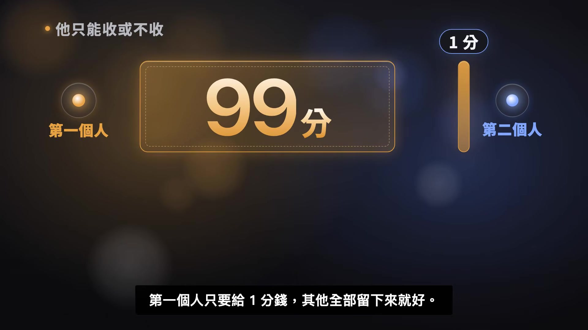

**逐字稿片段：** 這就是理論的答案 一塊錢切成99分跟1分 你先想一下 如果你是第二個人 人家只給你一分錢 你會收嗎 教室裡發生的事 跟理論不一樣

**話題推測：** 呈現Ultimatum Game的理論預測答案：99分與1分。

---

## 00:01:50

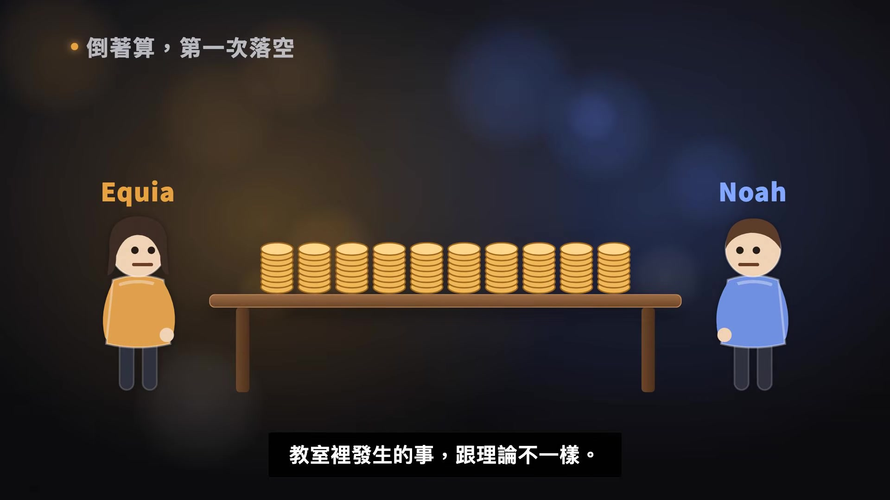

**逐字稿片段：** 第一組是Iquia跟Noah Iquia照著理論做 給Noah一分錢 他的理由很合理 他覺得Noah拿一分錢 總比什麼都沒有好 Noah搖頭 他不收 兩個人都拿了零 Paulak站在走道上說 這樣我一毛錢都沒賠 好像還不錯 全班笑了

**話題推測：** 介紹第一組參與者Iquia與Noah的實驗結果。

---

## 00:02:04

**逐字稿片段：** 第二組換Anish開價 他大方一點 給Gary三十分錢 Gary也搖頭 Polak問他為什麼 Gary只回了一句 純粹是面子

**話題推測：** 介紹第二組參與者Anish與Gary的實驗結果。

---

## 00:02:12

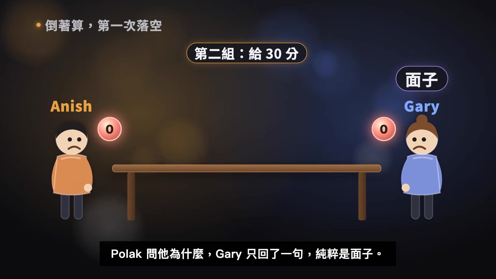

**逐字稿片段：** Polak把獎金加大 換第三組 Courtney開了剛好一半 Danny收了 你注意Danny的理由 他說一半總比什麼都沒有好 可是同一句話 本來也該讓Noah收下那一分錢 Polak特別提醒 這不是耶魯學生比較怪 在實驗室裡 這是非常穩定的結果 太低的出價常常被拒絕 把錢加大也一樣會發生

**話題推測：** 介紹第三組參與者Courtney與Danny的實驗，並提及獎金加大。

---

## 00:02:30

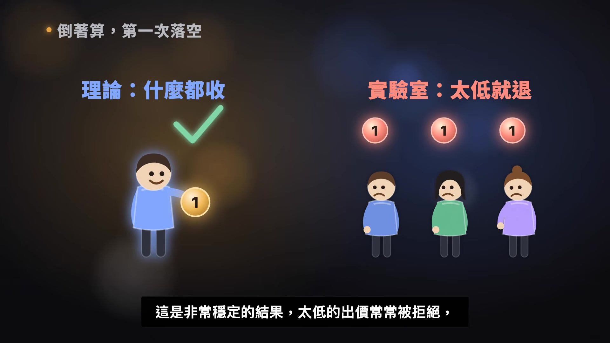

**逐字稿片段：** 理論給的預測很清楚 教室給的答案也很清楚 兩個答案對不上

**話題推測：** 總結理論與教室實驗結果的不符之處。

---

## 00:02:56

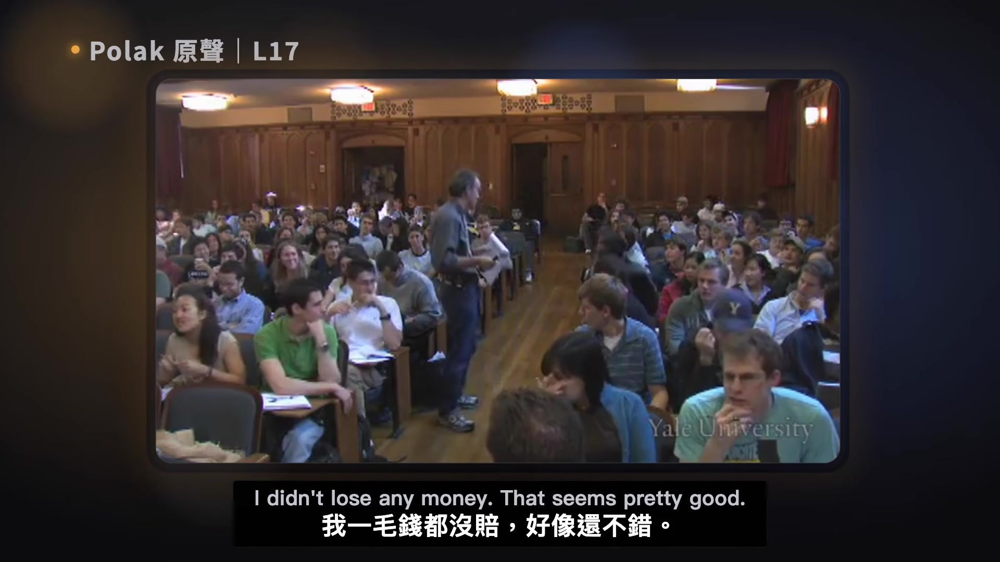

**逐字稿片段：** 所以理論錯在哪 Polak問全班 大概給了好幾個理由 有人說是面子 有人說是在跟對方比 你拿20分 看著對方拿80分 心裡不舒服 有人想給對方上一課 讓他下次多給一點 也有人想到名聲 大家都看了 你想讓人知道你不好欺負 這些理由有一個共同點 他們都不在那張分數表上 理論只算了錢 可是Noah心裡還有別的東西 那是Paulak看不到的 Noah沒有開口解釋 他只做了一個動作 搖頭 這個動作在說 我在乎的不只是錢 一旦大家知道泰迪的出價會被退回 出價靠近一半就很合理了

**話題推測：** 提出問題：理論究竟錯在哪裡，引導學生思考。

---

## 00:03:26

**逐字稿片段：** Paulak還提了一個更簡單的遊戲 叫Dictator Game 中文叫獨裁者賽局 它的規則是 第二個人連拒絕的權利都沒有 可是很多人還是會分不少錢出去 這一集會一直回到這件事 看不到對方心裡的時候 他的動作會說話

**話題推測：** 介紹一個更簡單的遊戲：Dictator Game（獨裁者賽局）。

---

## 00:03:39

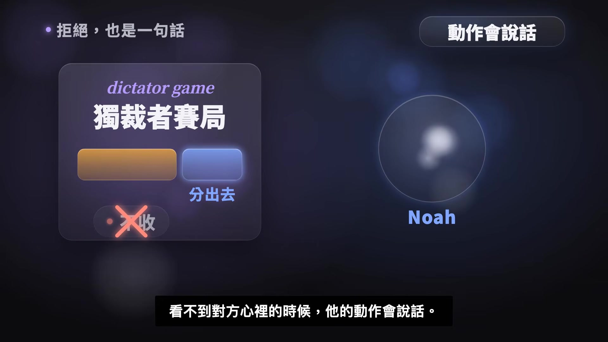

**逐字稿片段：** Polak接著改了一條規則 這一次第二個人如果不收 遊戲不會結束 換他來開架 第一個人決定收不收 不過餅會變小一點 因為時間過去了

**話題推測：** 介紹改變Ultimatum Game規則，讓第二個人有還價機會的設定。

---

## 00:03:48

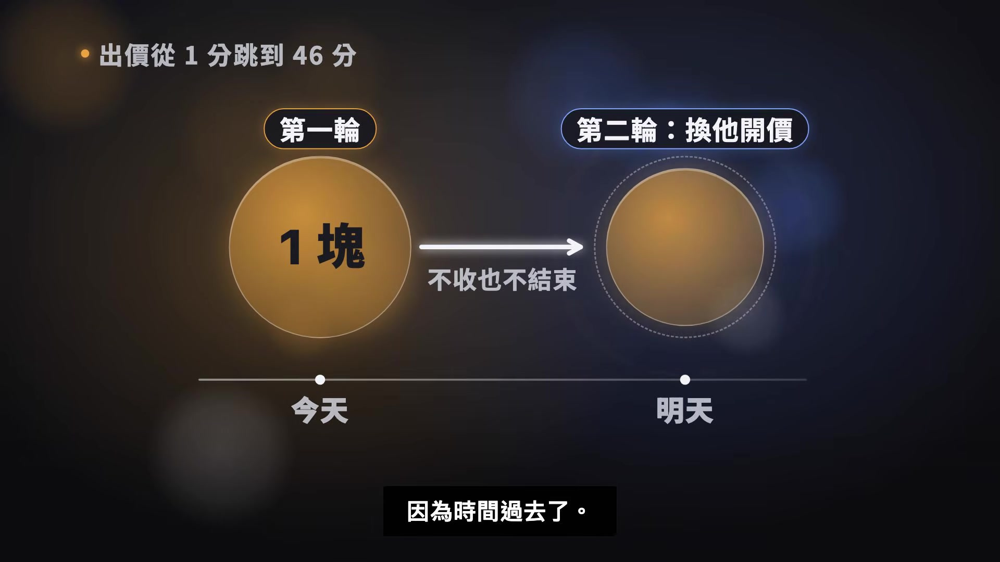

**逐字稿片段：** 這個變小的比例叫discount factor 中文叫折現因子 他的意思是 明天的一塊錢 在你今天眼裡不到一塊 譬如只值九毛 規則一改 同樣的人再玩一次 Iquia這次給Noah四十一分 Noah收了 從一分前跳到四十六分 中間沒有人教他們公式 為什麼跳這麼多 因為第二個人手上多了一樣東西 他可以不收 然後換他開價 第一個人要給的 是剛好讓他覺得不必等的數字 也就是他明天能拿到的東西 換算成今天的價值 Paulak又問Danny 剛才你要是不收 換你開價 你會開多少 Danny說 我會給他45分 Paulak轉頭問Courtney 你會收嗎 Courtney說會 也就是說 Danny要是等一輪 自己能留下的會比30分多 可是他剛才收下的只有30分 Paulak說 你本來可以做得更好

**話題推測：** 引入新的經濟學概念：discount factor（折現因子）。

---

## 00:04:55

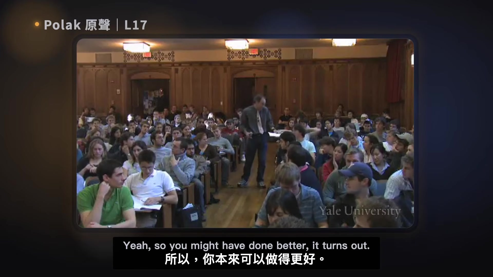

**逐字稿片段：** Polak把輪數一輪一輪往上加 只有一輪的時候先開價的人幾乎拿走全部 兩輪的時候 他要讓出對方明天能拿到的那一塊 三輪四輪每多一輪 就再倒著算一次

**話題推測：** 探討輪數增加到沒有上限時，遊戲結果的變化。

---

## 00:05:06

**逐字稿片段：** 他在黑板上畫出來是一條一來一回的鉅子線 一步一步往中間靠 輪速推到沒有上限 而且兩個人可以很快的來回開價 去半小時就回一次 餅幾乎不會變小 這時候答案是 兩個人各拿一半 一開始那個大到不合理的先手優勢 被一輪又一輪的機會磨平了 可是這個結果裡 藏著一件更怪的事 有個同學看出來了 第一個報價就會被接受 沒有來回喊價 沒有討價還價 Paul Luck說 那些來回全部在我們腦子裡演完了 雙方都倒著算清楚了 第一個人直接開出那個剛剛好的數字 對方就收 你想一下 這跟你在菜市場 或者買二手車的時候看到的樣子 完全不一樣 真實世界裡 大家明明一直在殺價 真實世界為什麼會來回殺價

**話題推測：** 描述Polak在黑板上畫出一條鋸齒線，解釋倒算過程。

---

## 00:05:45

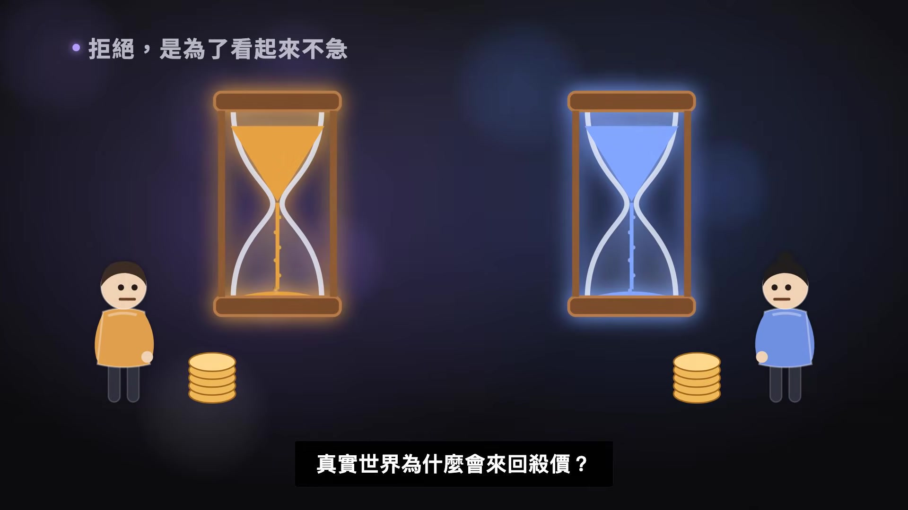

**逐字稿片段：** Paulak先挖出一個 他偷偷塞進去的假設 兩個人一樣有耐心 只要一邊很急 另一邊可以慢慢等 慢慢等的那一邊就會拿得比較多 Paulak舉了兩個例子

**話題推測：** 揭示之前賽局理論中的一個隱藏假設：雙方耐心相同。

---

## 00:05:53

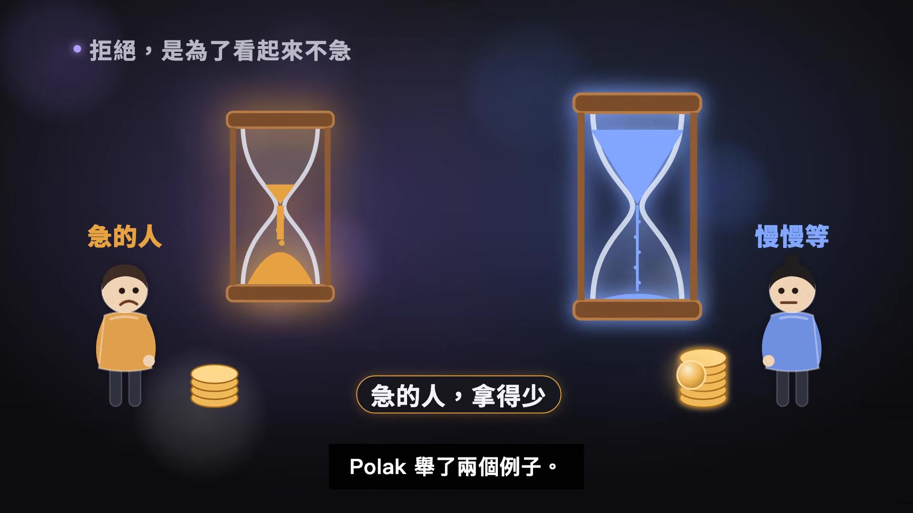

**逐字稿片段：** 一個是研究生找到很遠的工作 下星期就走 車子帶不走 你知道他急 這臺車的價錢就會很不一樣

**話題推測：** 舉例說明研究生急於賣車的情況，解釋耐心差異的影響。

---

## 00:05:59

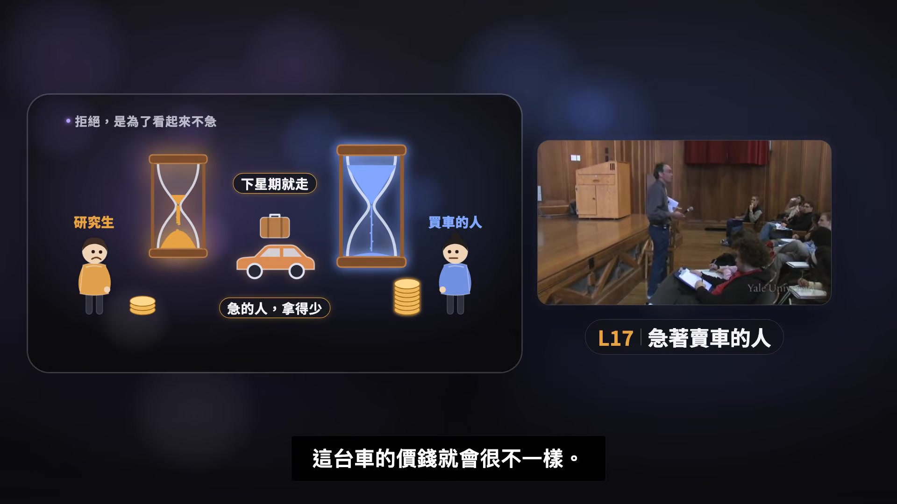

**逐字稿片段：** 另一個是 那一年好萊塢編劇正在罷工 電視臺那邊最急的是深夜節目 他們明天就要David Letterman的稿子 可是編劇那邊要付房租 要養小孩 他們也急 Polak的結論是 錢比較少 而且被對方知道你錢比較少 你就會談到比較差的條件

**話題推測：** 舉例好萊塢編劇罷工事件，說明雙方耐心對談判的影響。

---

## 00:06:13

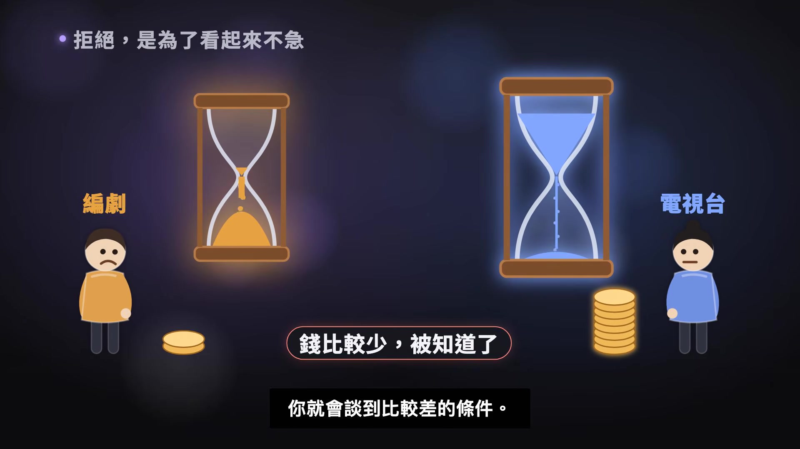

**逐字稿片段：** 接著有同學點出 最關鍵的一件事 真實世界裡 你不知道對方有多急 另一位同學補上 你也不知道那樣東西對他值多少 Polak說 所以你可能會故意拒絕 一個還不錯的報價 好讓自己看起來不急 你拒絕的那個動作 就是在告訴對方我等得起 來回殺架 其實是雙方用動作在互相試探 看不到對方心理 是一種看不見 還有另一種看不見

**話題推測：** 指出真實世界談判中，不知道對方急迫程度是關鍵問題。

---

## 00:06:33

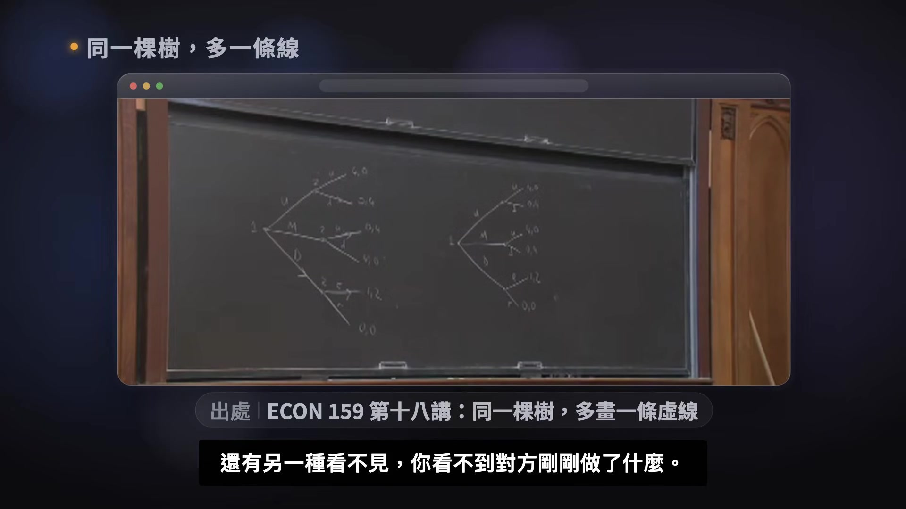

**逐字稿片段：** 你看不到對方剛剛做了什麼 第18個 Polak一上來就說 今天沒時間玩遊戲 要學的東西很多 而且都很正式

**話題推測：** 引導至第18個概念，討論另一種看不見：看不到對方剛剛做了什麼。

---

## 00:06:40

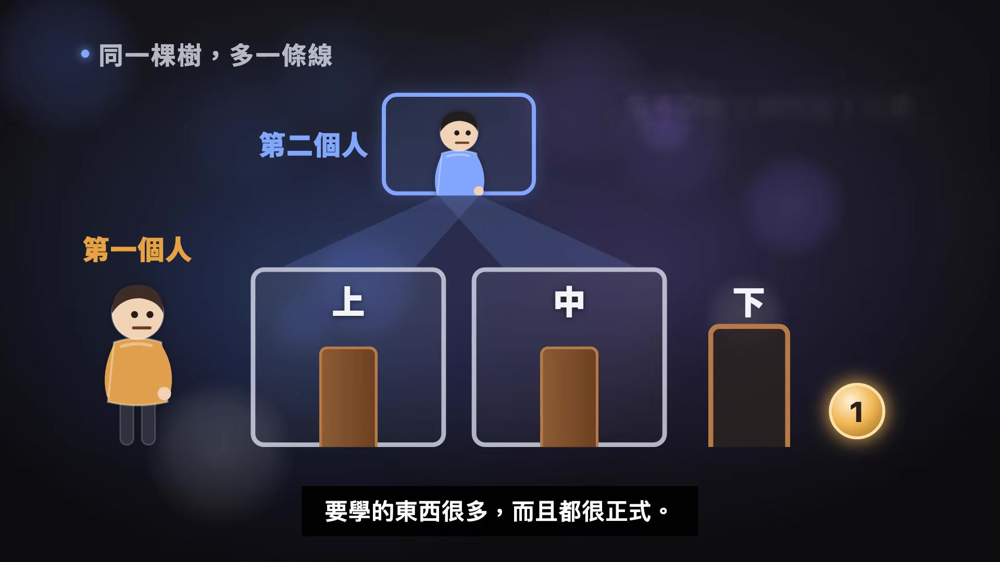

**逐字稿片段：** 他在黑板上畫了一棵樹 第一個人有三條路 上中下 他走完 第二個人才動 分數是這樣排的 如果第一個人走上或走中 第二個人看到了 就有辦法讓他拿0分 自己拿4分 所以第一個人倒著算一輪就知道 上跟中都不能走 他只好走下拿一分 然後Polak把同一棵樹再畫一次 形狀一樣 分數一個都沒改 他只多畫了一條虛線 把第二個人的兩個位置連起來

**話題推測：** 描述Polak在黑板上畫一棵決策樹，解釋行動順序。

---

## 00:07:03

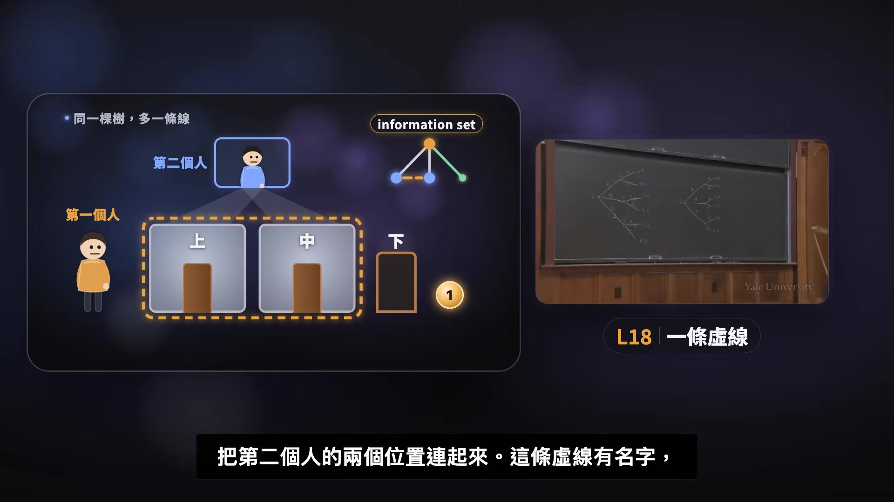

**逐字稿片段：** 這條虛線有名字 叫Information Set 中文叫資訊集 他的意思是 第二個人知道第一個人沒走下 可是分不出他走的是上還是中 站在虛線上的人 知道自己在這幾個點的其中一個 只是分不出是哪一個 虛線一畫 第一個人多了一個原本沒有的選擇 他可以在上跟中之間亂數 一半一半 第二個人分不出他走哪一條 只能猜 一半的機會 第一個人拿四分 一半的機會 拿零分 平均下來是 一分 原本被看得一清二楚的時候 他只能拿一分 分數沒改 數也沒改 只是對方看不見了 他就從一分變成二分

**話題推測：** 解釋虛線的名稱：Information Set（資訊集）。

---

## 00:07:34

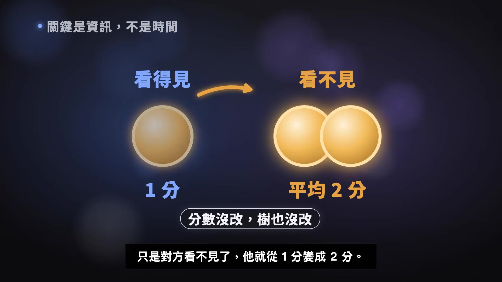

**逐字稿片段：** 這裡有一條規則 聽起來很小 被同一條虛線連起來的點 能選的選項數量必須一樣多 如果一個點有三個選項 另一個點只有兩個 那個人低頭數一數 手上有幾個選項 就知道自己站在哪裡 虛線就白畫了

**話題推測：** 闡述資訊集的一條重要規則，關於選項數量。

---

## 00:07:48

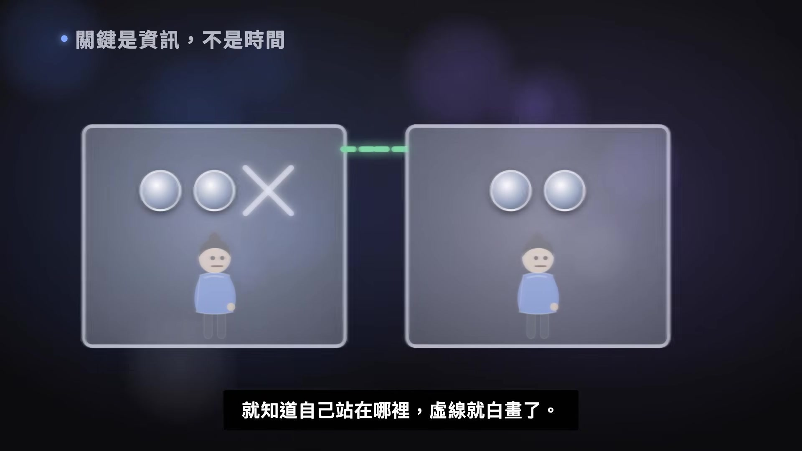

**逐字稿片段：** 接著Paul Larker把求讀困境畫成數 囚徒困境就是 兩個人都顧自己 結果兩個人都變差那個遊戲 他先讓一個人先動 再讓另一個人先動 兩棵樹長得不一樣 攤開成表格卻一模一樣 是同一個賽局 他給這一段下了一句結論 關鍵是資訊 不是時間 他還借了美國水門案 留下來的那句話 這個人知道什麼 他是什麼時候知道的 有了虛線 一棵樹你可以同時 有看得見的地方 也有看不見的地方 這時候要怎麼算

**話題推測：** 將囚徒困境畫成決策樹，展示其在不同資訊集下的表現。

---

## 00:08:11

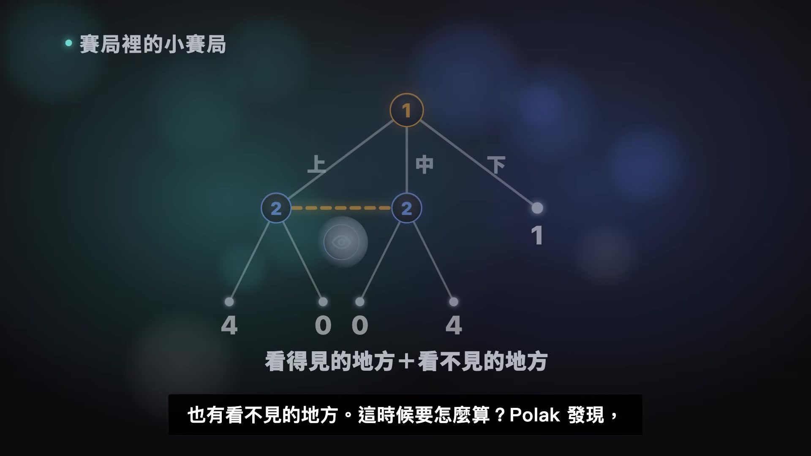

**逐字稿片段：** Paul Locke發現 上甲學院納許均衡 放到這種樹上會出問題 納許均衡的意思是 每個人都已經選了 對自己最好的做法 沒有人想改 可是在這種樹上 他會留下一些 說不過去的答案

**話題推測：** 指出納許均衡在某些決策樹上會出現問題。

---

## 00:08:23

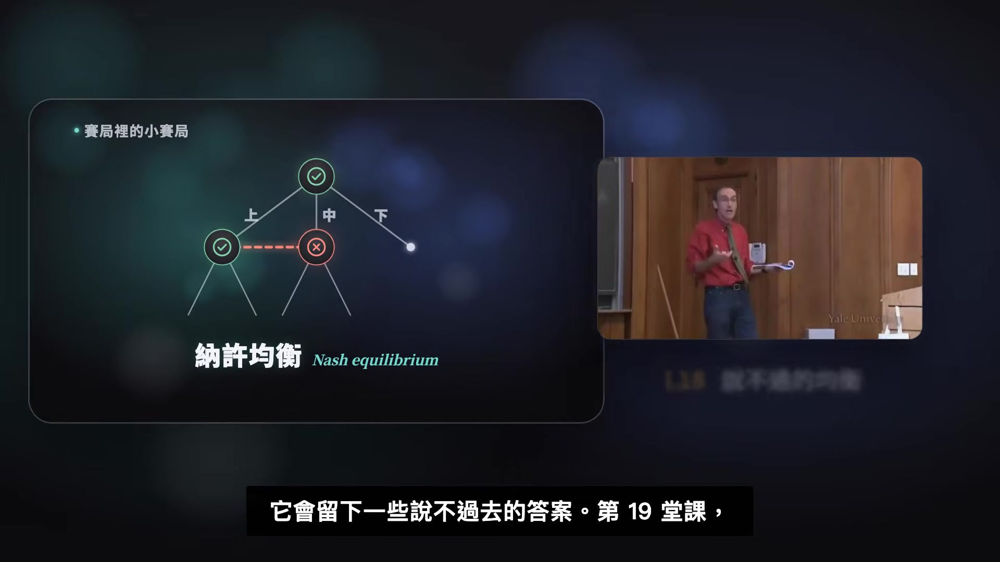

**逐字稿片段：** 第十九 查克 他讓全班分成兩邊 玩一個 他取名叫 別搞砸的小遊戲 第一個人先選往上走 或者直接離開 往上走 第二個人再選 那第一個人 還要再選一次 抖著算 大家都往上走 每個人都拿比較多 大部分同學也這樣走 可是有一些人 一開始就離開了 他們不是不會算 是怕對方搞砸 自己最後吃虧 這種擔心 也能湊出一個 納取均衡 只是他要求某個人在後面做一件事 他真的走到那一步絕對不會做的 所以Polak先給了一個名字

**話題推測：** 引入第19個主題，一個名為「別搞砸」的小遊戲。

---

## 00:08:49

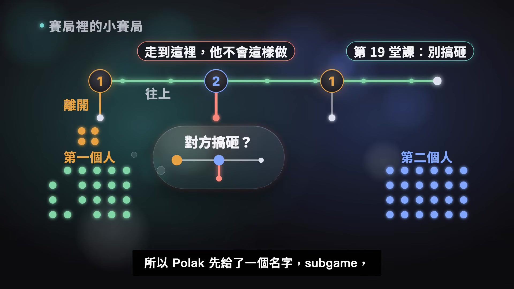

**逐字稿片段：** Sub Game 中文叫紫賽局 指的是樹裡面自己就能成立的一個小局面 再定一個新標準 Sub Game Perfect Equilibrium 中文叫紫賽局完美均衡 他要求在每一個紫賽局裡 大家做的都是那個局面最好的選擇 說穿了 這就是終極那句話的正式版本 說出口的每一步 走到那一刻都還算數

**話題推測：** 介紹賽局理論中的新名詞：Sub Game（子賽局）。

---

## 00:09:09

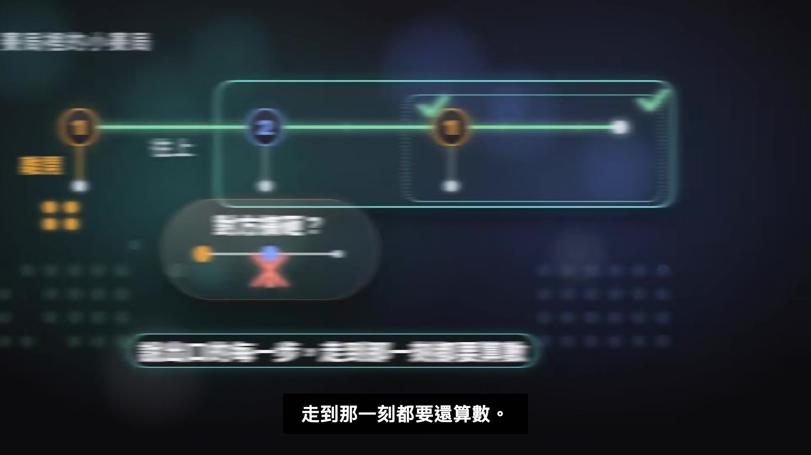

**逐字稿片段：** 紫賽局完美均衡怎麼找 Polak用一對老朋友示範 還記得Nina跟David嗎 上集他們約看電影 宗甲約出去玩 兩次都沒碰到面

**話題推測：** 回顧Nina與David的故事，應用子賽局完美均衡來分析。

---

## 00:09:17

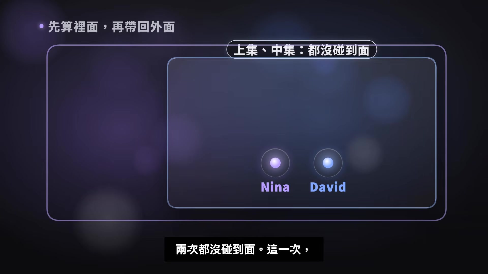

**逐字稿片段：** 這次 Paulak請助教Jack湯美人 Jack可以不管他們 也可以出錢送他們去上同一堂大課 讓他們坐在一起 一堂講冷戰 一堂講中國 可是Jack犯了跟Paulak一樣的錯 沒告訴他們去哪一堂 碰到面 Jack開心沒碰到 Jack白花錢 算法是這樣 先算裡面那一局 也就是兩個人怎麼選課 再把那一局的結果帶回外面 看Jack要不要送 如果Jack相信他們會選同一堂 送他們去就划算 可是裡面那一局還有一種結果 兩個人都用混的 中甲算過 這樣九次理由五次碰不到面 如果Jack相信他們會這樣混 送出去 平均是賠的 他就不該送 那天Jack決定送 David說 我讓步 去上中國 Nina也選了中國 全班鼓掌 他們終於碰到面了

**話題推測：** 助教Jack介入Nina與David的賽局，引入新變數。

---

## 00:10:28

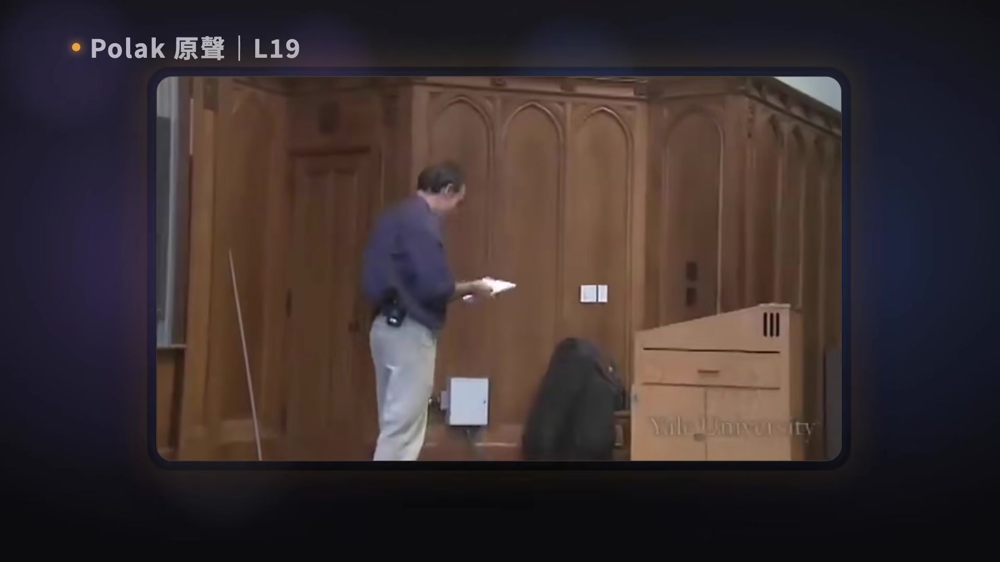

**逐字稿片段：** 先算裡面那一局 再帶回外面 這個算法最有用的地方在商場上 Polak說 這一題你下星期去投資銀行面試 很可能會碰到

**話題推測：** 將子賽局完美均衡的算法應用到商場情境，可能顯示商業案例圖表。

---

## 00:10:37

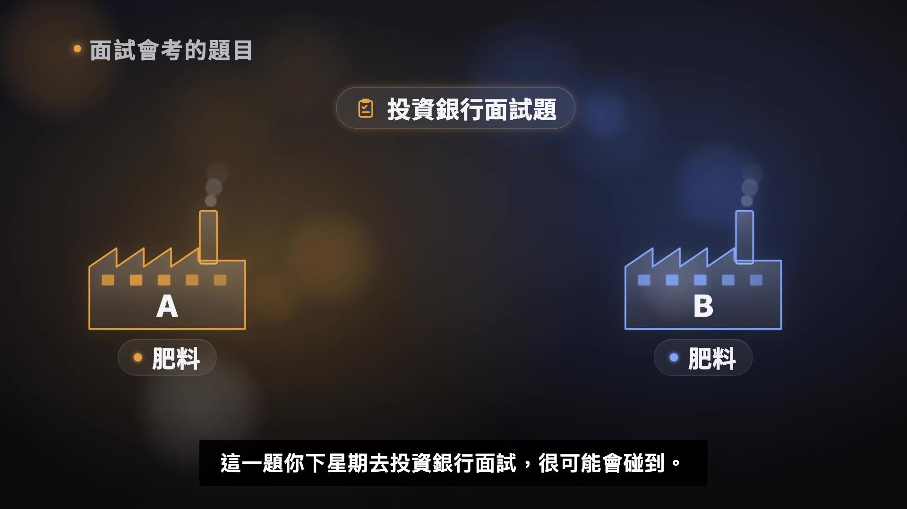

**逐字稿片段：** 有兩家做肥料的公司 A跟B 賣一樣的東西 各自決定要生產多少 現在有人拿著一臺機器來找A 這臺機器只有A能用 B借不到 租金一年70萬 他能讓A每生產一噸的成本 直接砍掉一半

**話題推測：** 介紹一個關於兩家肥料公司A與B的商業案例。

---

## 00:10:50

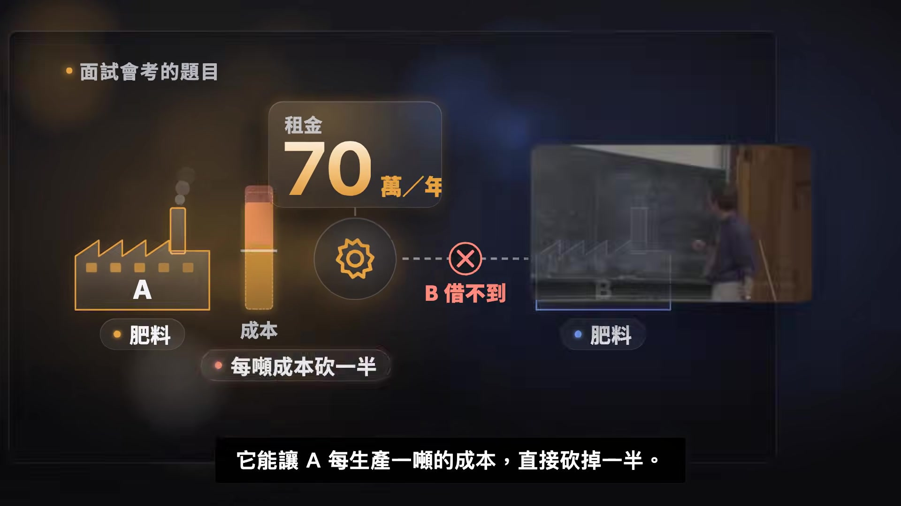

**逐字稿片段：** 問題只有一句 這臺機器該不該租

**話題推測：** 明確提出問題：這台機器該不該租？

---

## 00:10:52

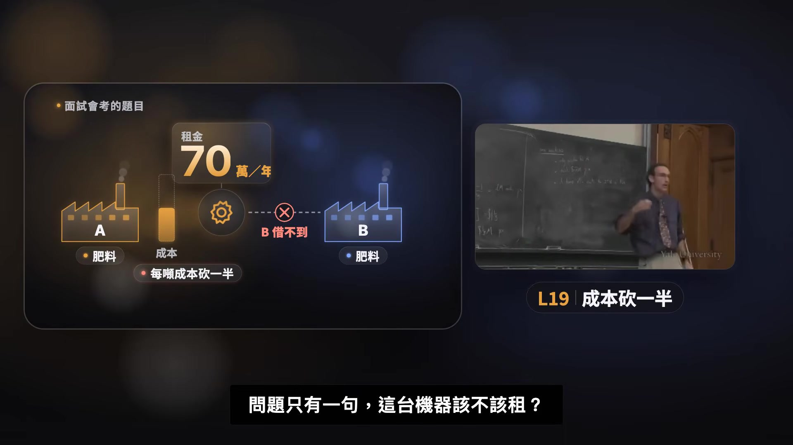

**逐字稿片段：** Polak要全班舉手 他說面試的時候不能棄權 所以這裡也不準棄權 結果全班大概一半一半 住在樓上的幾位企業管理碩士 也就是NBA活生投了租

**話題推測：** 讓全班舉手投票，顯示互動環節。

---

## 00:11:03

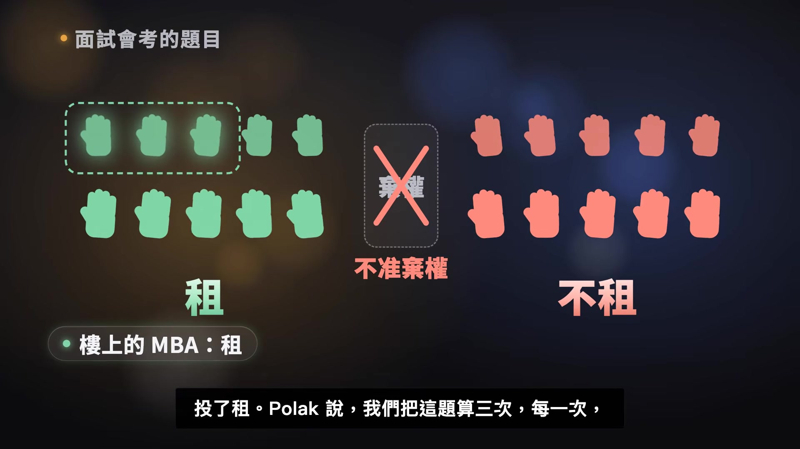

**逐字稿片段：** Polak說 我們把這題算三次 每一次你都注意我哪裡算錯 你也可以先猜猜看 自己會投哪一邊

**話題推測：** 宣布將用三種不同方法計算此問題。

---

## 00:11:09

**逐字稿片段：** 第一次是會計師的算法 照現在的產量 每一噸省下一半的成本 一年省50萬 租金70萬 比省下的多 所以不租 Paulak開會計師的玩笑 他說會計師通常很無聊 也常常算錯 而且無聊的時候 比算錯的時候多 這個算法錯在一個假設 他假設你租了機器以後 產量不變 可是成本降了 多做一噸還是有賺頭 你會多做一點

**話題推測：** 展示第一種計算方法：會計師的算法。

---

## 00:11:30

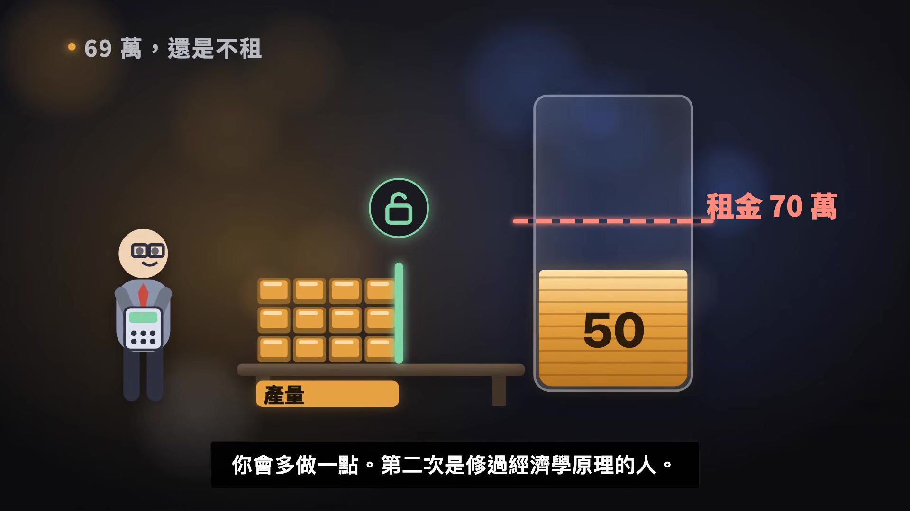

**逐字稿片段：** 第二次是修過經濟學原理的人 他會把多做的那塊利潤補進去 Paulak在黑板上畫出來 會計師算的是一個長方形 漏掉的是旁邊一個三角形 他說會計師比較方正 所以常常漏掉三角形 補上去以後 這臺機器一年值69萬 全班安靜了一下 因為租金是70萬 你已經算得比會計師細很多 連自己會怎麼改都算進去了 答案還是不租 這時候兩種專業 兩種算法都投了不租

**話題推測：** 展示第二種計算方法：經濟學原理的算法。

---

## 00:12:27

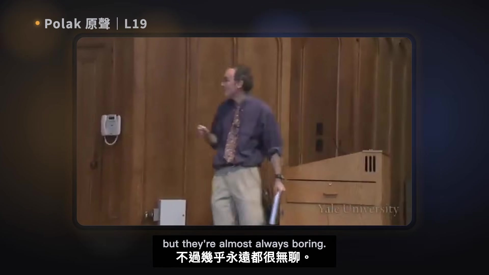

**逐字稿片段：** 第三次是賽局理論的算法 他只多算一件事 對手也會動 前排一位同學說出來了 B也會改變他的產量 租機器這個動作B看得見 B看到A的成本降了 就知道A接下來會多做 B最好的反應 是自己少做一點 市場上的貨變少 價格就沒掉那麼多 這一塊好處進了A的口袋 先算裡面那一局 也就是租了以後兩家怎麼競爭 再把結果帶回外面 加上這一塊 這臺機器一年值100萬 比70萬多 太豬了 那幾位NBA猴生是對的 答案翻過來 靠的不是A自己多做了多少 是B退了一步 Polak說 做策略決定 最常見的錯就是 忘了它是策略 忘了別人會因為你的動作改變做法

**話題推測：** 展示第三種計算方法：賽局理論的算法，可能伴隨新圖表。

---

## 00:13:07

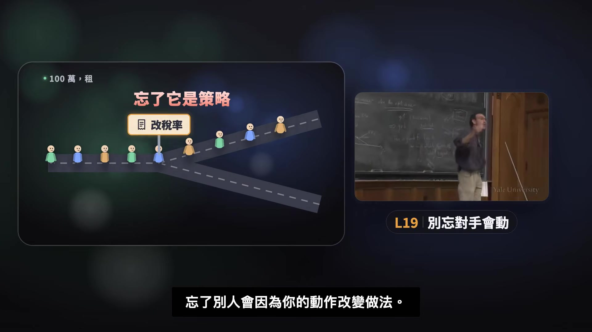

**逐字稿片段：** 他舉了兩個例子 政府改稅率 如果只拿大家現在的行為去算稅收 就會算錯 因為稅改 大家就跟著改

**話題推測：** 舉例政府改稅率的策略決定，說明對手反應的重要性。

---

## 00:13:14

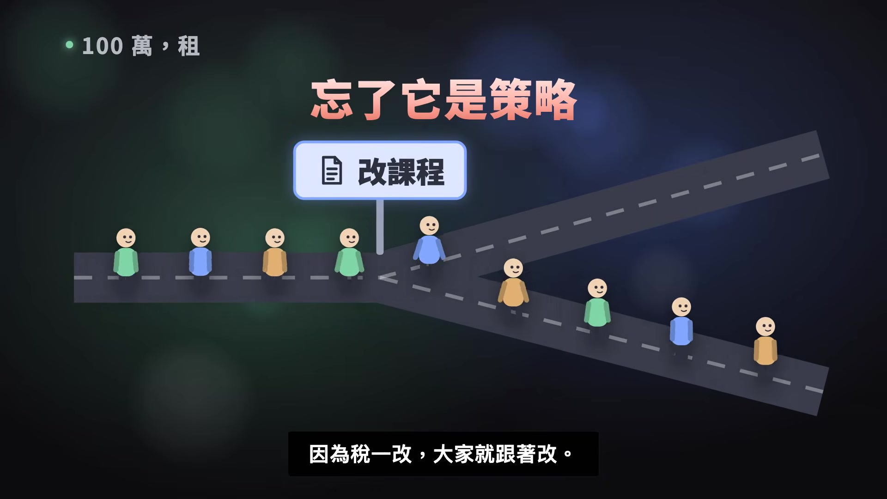

**逐字稿片段：** Hotel改課程規定也一樣 學生也是玩家 規則一改 他們選客的方式就變了 我們先停一下 把第一部分收起來 這一部分的問題是 看不到對方心理的時候 原本那套到底算還能不能用 答案是能用 可是要多算一件事 每個人在那一刻看得見什麼 看到以後會怎麼動 最後通牒裡 Noah心理的面子你看不到 可是她的搖頭 讓你看到了 殺架的時候你看不到對方多急 所以你用拒絕 告訴她你不急 黑板上那條虛線 分數一分沒改 只是看不見了 結果就從一變二 豬雞器那一題 關鍵是B看得見你豬了 如果前面哪一段沒跟上 記住這一句就夠了 重要的不是誰先動 是誰在那一刻看得見什麼 還有一把工具要帶著走 只賽局完美均衡 每一個小局都要算得通

**話題推測：** 舉例Hotel改課程規定的情況，學生作為玩家會改變行為。

---

## 00:13:57

**逐字稿片段：** 下一部分 Polak要用這把工具問一個更難的問題 對方說他會怎麼做

**話題推測：** 引入第二部分要討論的核心問題：對方的承諾是否可信。

---

## 00:14:02

**逐字稿片段：** 你要不要信 第20寶可 Polak拿出現金

**話題推測：** 開始第20個主題，Polak拿出真實現金進行實驗。

---

## 00:14:05

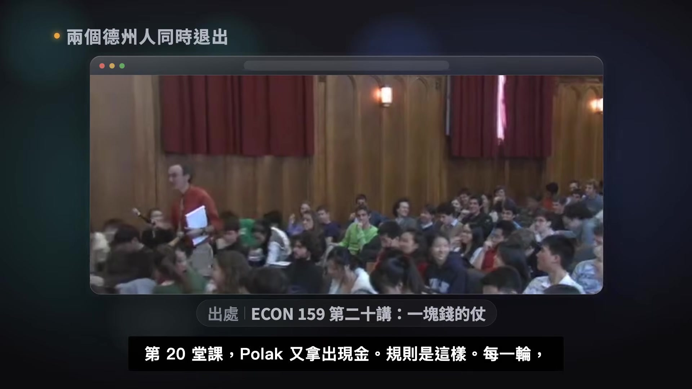

**逐字稿片段：** 規則是這樣 每一輪 兩個人同時寫下一個字 打 或者退 只要有一個人寫退 遊戲就結束 還在打的那個人拿走獎品 獎品是一塊錢 可是隻要兩個人同一輪都寫打 兩個人各付75分 注意是兩個人都負 不是輸的人負 每個人後面還坐著一位同學當裁判

**話題推測：** 解釋新遊戲的規則：同時寫下「打」或「退」。

---

## 00:14:21

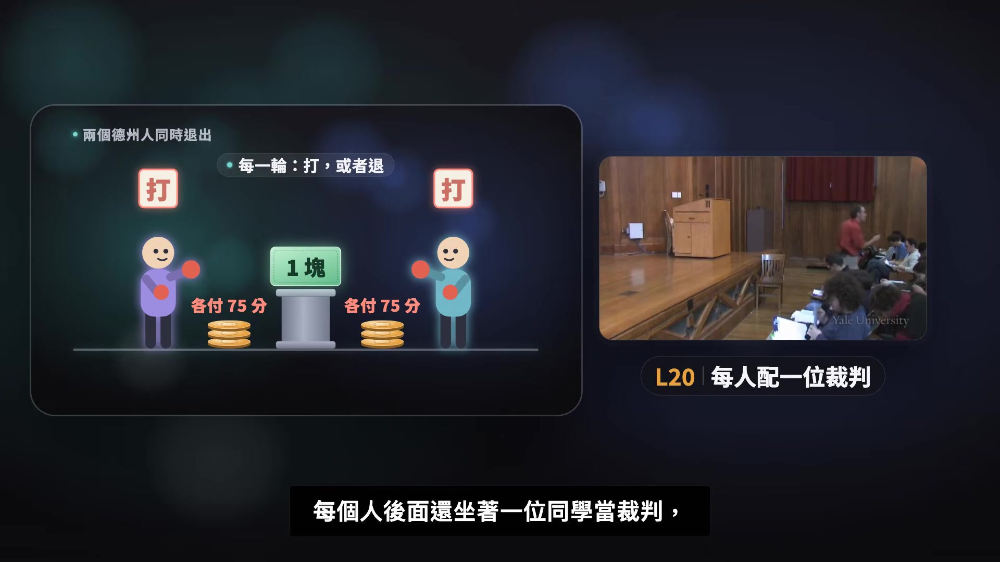

**逐字稿片段：** 確認你真的寫了什麼 第一組 Polak找了兩個德州人 Nick跟Alec 兩張紙條一亮 兩個人都寫退 Polak看著他們說 德州人那股不服輸的精神跑哪去了

**話題推測：** 介紹第一組參賽者Nick和Alec。

---

## 00:14:32

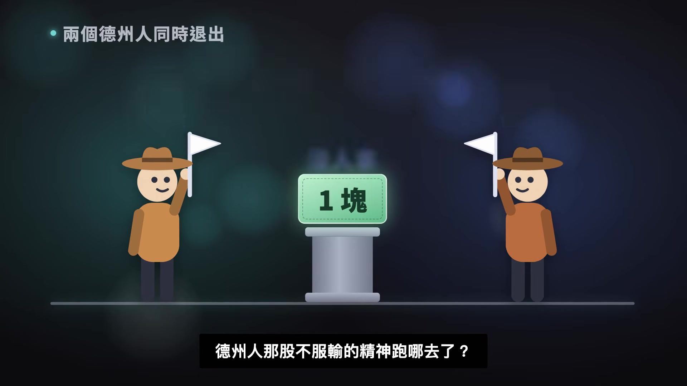

**逐字稿片段：** 第二組是美式足球隊對上棒球隊 足球隊寫打 棒球隊寫退

**話題推測：** 介紹第二組參賽者，美式足球隊對棒球隊。

---

## 00:14:36

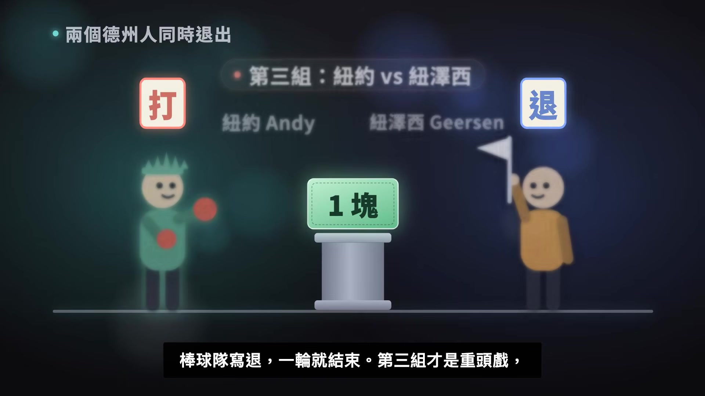

**逐字稿片段：** 一輪就結束 第三組才是重頭戲 Andy來自紐約 Gerson來自紐澤西 兩個人都寫打

**話題推測：** 介紹第三組參賽者Andy和Gerson，強調這是關鍵示範。

---

## 00:15:07

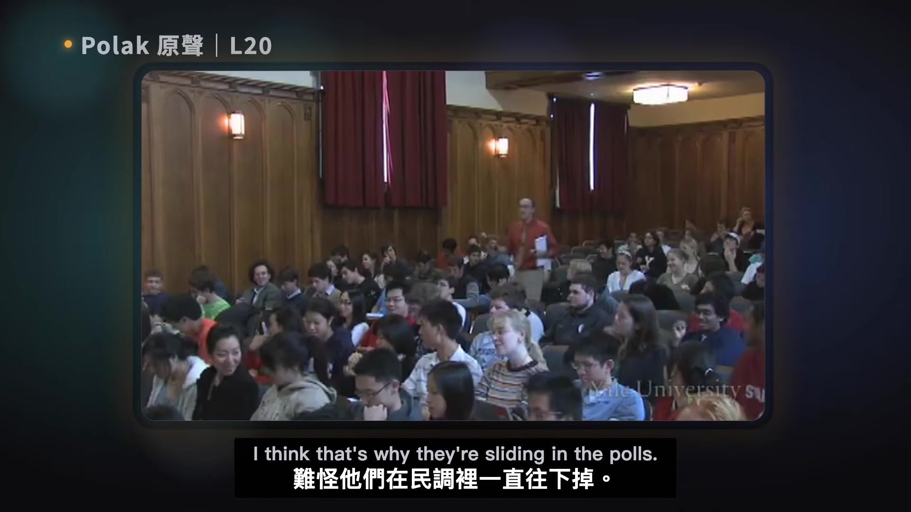

**逐字稿片段：** 第一輪, 兩個人都打, 各付75分, 第一輪還是都打, 到這裡, 每個人付掉的錢已經超過獎品了, 就算對方下一輪投降你把愛快錢整個拿走, 你還是虧的。 第三輪都打 第四輪還是都打

**話題推測：** 敘述第三組多輪遊戲的進行情況，以及累積的成本數字。

---

## 00:15:20

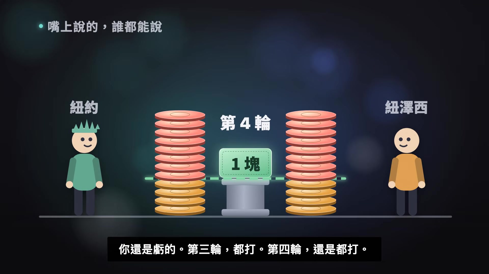

**逐字稿片段：** 這時候Paulak讓他們講話 他說你們可以互相喊話 只是不準拿橋跟隧道互相挖苦 紐約那位說 我不能讓紐澤西贏 這是紐約人的面子 紐澤西那位說 我會一直打下去 所以你最好現在放棄 第五輪 兩張紙條打開 還是都打 Paulak喊停 他說再打下去 我的午餐就有著落了 這一段對話值得停一下 兩個人說的其實是同一句話 我是會打到底的人 你退吧 Paulak說 他們都想讓對方相信自己會打 好逼對方退 可是這種話不用花錢 兩個人都說得出口,所以誰都沒被說服 嘴上說的誰都能說 這一句我們先留著,第三部分會回來

**話題推測：** 允許參與者互相喊話，增加了新的互動環節。

---

## 00:16:27

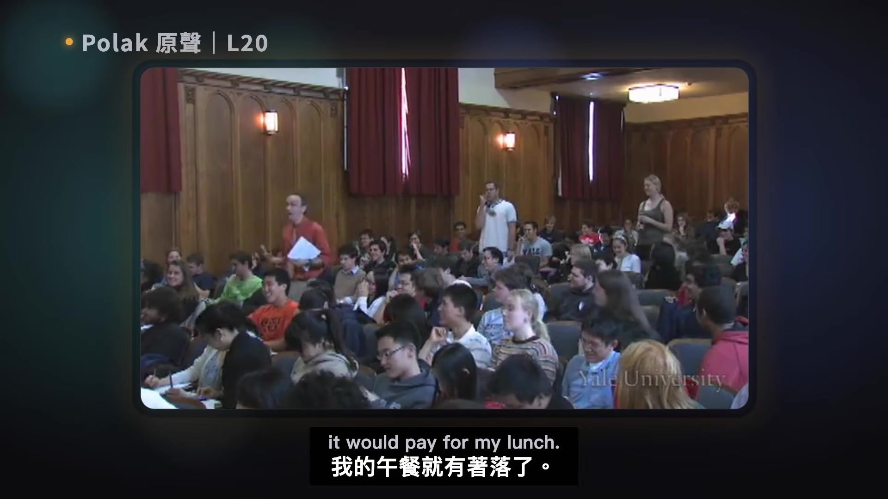

**逐字稿片段：** 打完之後,Paulak問紐約那位 你為什麼一直打 他說,他第二輪還跟我打的時候 我就知道反正要賠錢了 那不如繼續打,打到他退為止 Paulak說,這句話裡有兩件事 要分開看 一件是面子,我就是要贏 另一件完全不一樣

**話題推測：** 遊戲結束後，Polak詢問紐約參與者Andy的決策理由。

---

## 00:16:40

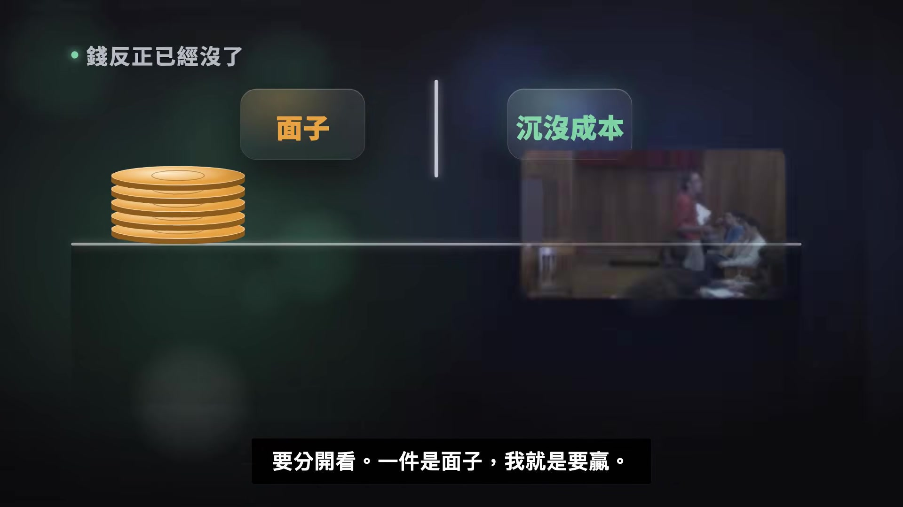

**逐字稿片段：** 那叫Sun Cost 中文叫沉沒成本 他指的是已經付出去 再也拿不回來的錢 Paulak說 這一半的推理完全正確 打了十輪,賠掉十次75分 就是七塊半 這筆錢已經沒了 不會因為你現在退出就回來 所以打到第十輪的時候 眼前的局面 跟第一輪開始的時候一模一樣 一樣是一塊錢的獎品 一樣是下一輪要不要打 過去付的錢 在往前算的時候 一分都不用算進去 這也是為什麼一場仗 可以燒掉比獎品多很多的錢 每一輪單獨看 繼續打都說得過去

**話題推測：** 引入新的經濟學概念：Sunk Cost（沉沒成本）。

---

## 00:17:10

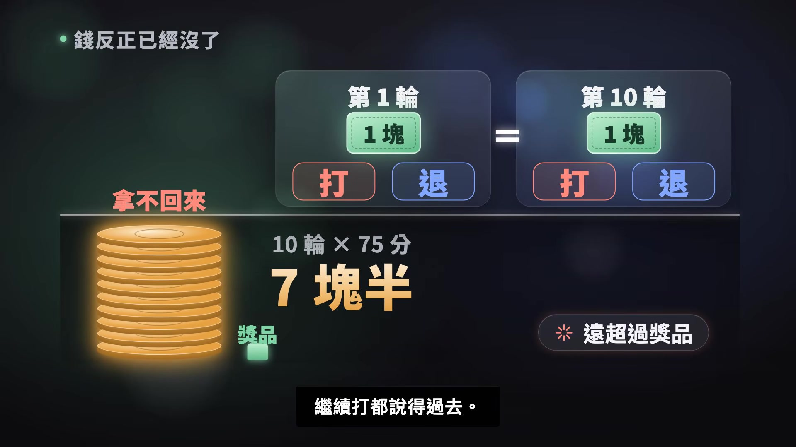

**逐字稿片段：** 紐約隊紐澤西 這種仗有名字叫Wall of Attrition 中文叫消耗戰 他的意思是 兩邊每一輪都在付代價 看誰先放棄 Polak那天真正想證明的是 就算兩個人都很清醒 你不講面子也不管名聲 只看那一塊錢 仗還是可能打很久 他先找固定的做法 答案只有兩種 一個人永遠打 另一個人一開始就退 Polak說 如果我知道明天這場仗我會贏 那我今天就已經贏了 對手知道你會打到底 最好的做法就是馬上退 所以在這種答案裡根本沒有仗

**話題推測：** 為這種遊戲命名：Wall of Attrition（消耗戰）。

---

## 00:17:38

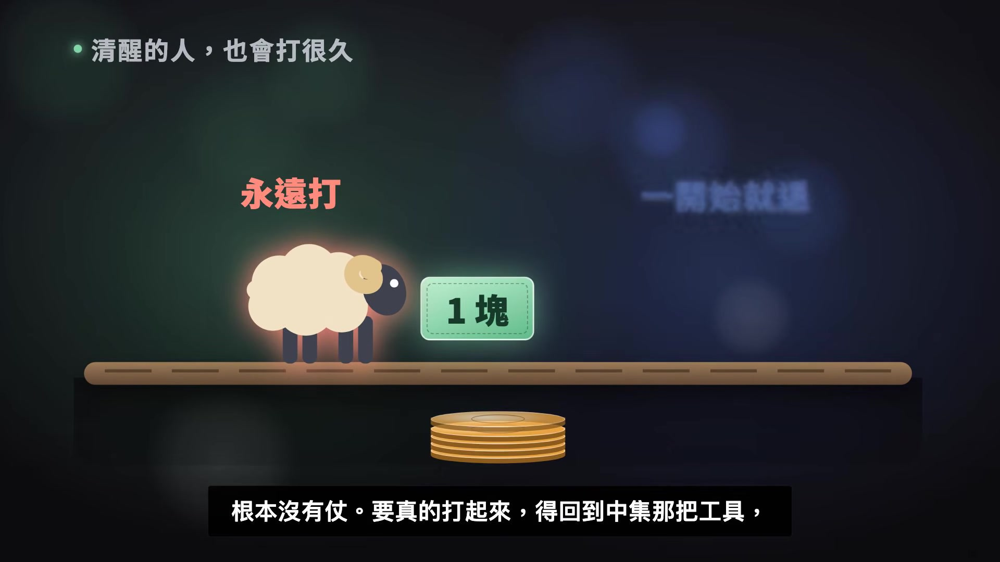

**逐字稿片段：** 要真的打起來 得回到中夾那把工具 混合策略 兩個人各自用一個機率決定今天打不打 這個機率要剛好讓對方覺得打跟退一樣划算 中夾那句話又回來了 混在裡面的分數一樣高 這樣一來 每一輪都有機會 兩個人同時寫打 仗就繼續 獎品越大 打的幾率越高 打一輪越貴 打的幾率越低 這不只是教室裡的遊戲

**話題推測：** 討論「混合策略」作為消耗戰中真實打起來的可能性。

---

## 00:17:58

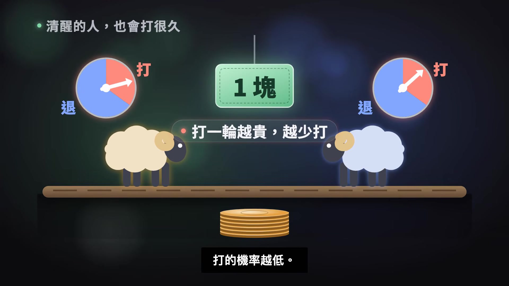

**逐字稿片段：** Polak舉了兩個例子 第一個是 第一次世界大戰的西線 德國那邊 跟英國與法國那邊 為了法國北部 跟比利時的幾小快遞 從1914年 對峙到1918年 那幾快遞本來不值多少 可是人命一直堆上去 Polak說 如果你不信 去看耶魯校園裡的 陣亡紀念碑 上面有多少耶魯人的名字 而美國只參戰了大約一年

**話題推測：** 舉例第一次世界大戰西線的消耗戰。

---

## 00:18:19

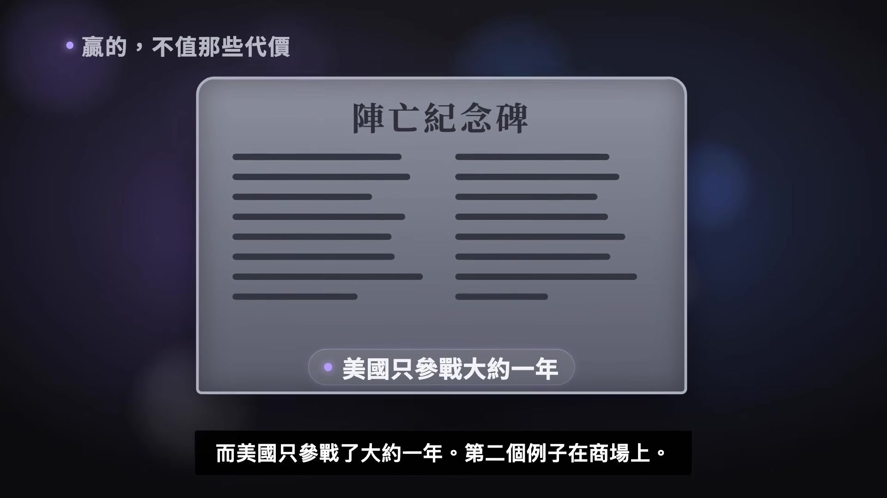

**逐字稿片段：** 第二個例子在商場上 英國的Sky電視 跟另一家衛星電視公司BSB 為了搶衛星電視市場打了好幾年 一邊不收錢 一邊送衛星天線 打到後來把帳算清楚 贏的那一方未來能賺的所有利潤 都賠不回這場帳燒掉的錢 Pollack最後補了一個好消息 在他算出來的答案裡 每一輪都有機會結束 所以拖得越久 還在打的機率就越低 很貴的戰會發生 只是不常發生

**話題推測：** 舉例英國Sky電視與BSB的商業競爭，說明消耗戰在商場的應用。

---

## 00:18:42

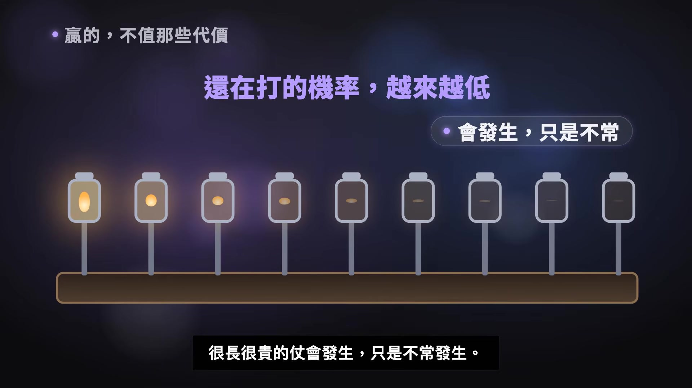

**逐字稿片段：** 回到這部分的問題 紐約跟紐澤西嘴上說的話沒有讓對方退 那什麼樣的話才會讓人相信

**話題推測：** 總結前一階段問題，引出新的探討點：什麼樣的話才可信。

---

## 00:18:49

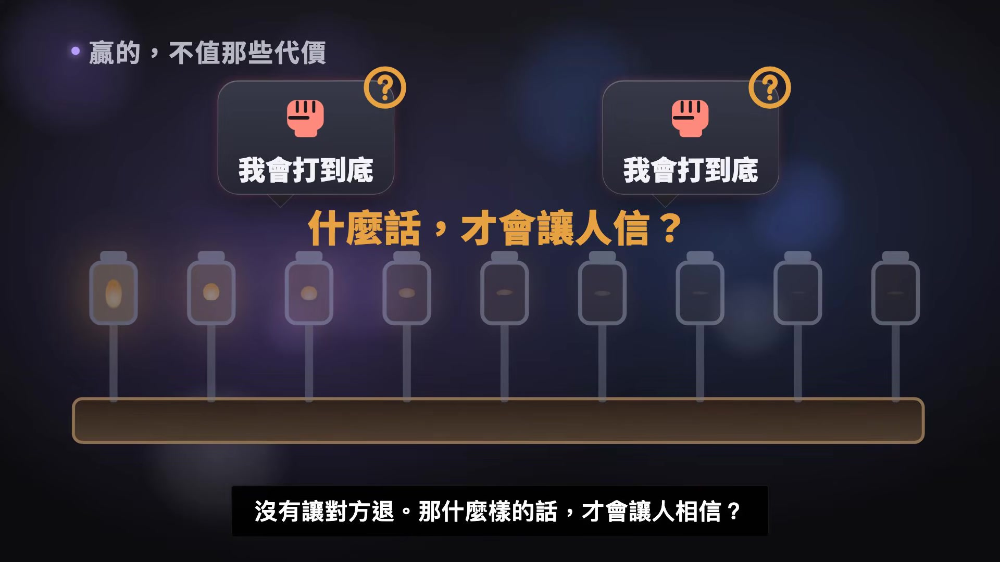

**逐字稿片段：** 第21浩克 Polak要回答的就是這個問題 承諾跟威脅什麼時候算數

**話題推測：** 開始第21個主題，回答承諾與威脅何時算數的問題。

---

## 00:18:53

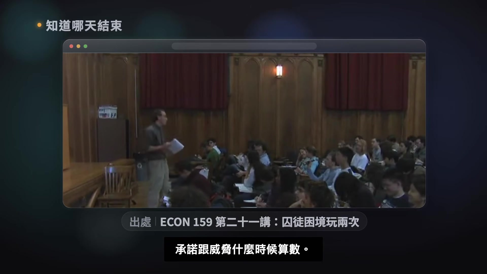

**逐字稿片段：** 他把囚徒困境搬回黑板 這個遊戲我們上集看過 兩個人各自選擇守信或背叛 兩個人都守信 大家都不錯 你守信他背叛他拿最多 你最慘 兩個人都背叛兩個人都沒拿到什麼 只玩一次的時候 不管對方怎麼做 背叛都比較划算 所以兩個人都背叛 大家一直有個直覺 多玩幾次應該就能合作了吧

**話題推測：** 將囚徒困境重新搬上黑板，作為新的分析起點。

---

## 00:19:12

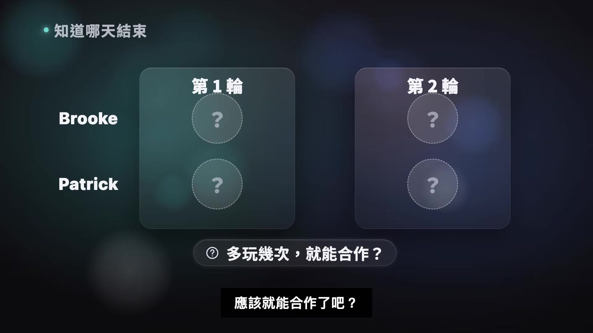

**逐字稿片段：** Polak請Brook跟Patrick上來 玩兩輪 第一輪 Brooke手信 Patrick背叛 第二輪 兩個人都背叛 Brooke說 第一輪我是抱著希望 Patrick的理由才是重點 他說 這個遊戲這麼短 最後一輪背叛一定划算 所以倒數第二輪也一樣 所以第一輪也一樣 這串推理 是學生自己說出來的 Patrick說的那一串 Polak叫他Unraveling 中文可以說成 一路松到底 他用的就是第一部分 那把工具 每一個小局都要算得通 最後一輪自己就是一個小局 沒有明天 背叛最划算 既然最後一輪一定被判 倒數第二輪你手信 也換不到任何東西 所以也被判 然後是倒數第三輪 一路倒回第一輪 Pollack說 就算玩500次也一樣 你可以想成一件毛衣 最後一針的線頭一鬆 往回拉 人間可以一路鬆回開頭 這個結論很不舒服 他說的是 只要雙方都知道哪一天結束 合作連第一天都活不到

**話題推測：** 請Brook與Patrick上場，進行兩輪囚徒困境遊戲。

---

## 00:20:02

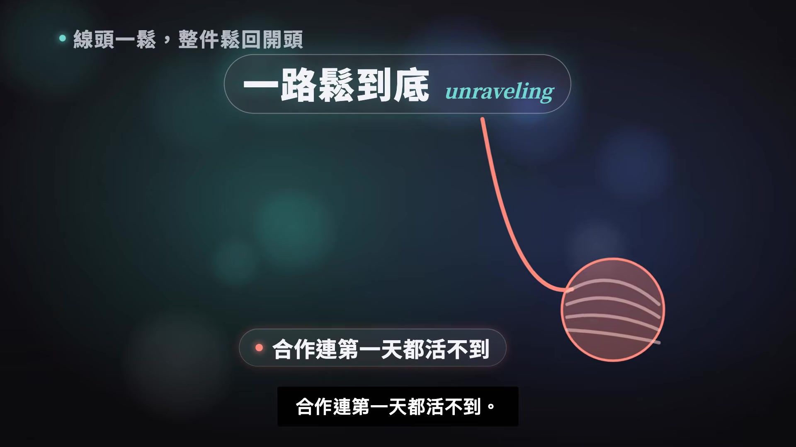

**逐字稿片段：** 現實裡到處都是這種情況 美國人有個說法叫Lame Duck 中文叫跛腳鴨 指的是任期快結束的領導人 大家都知道他快走了 他說的話就開始沒分量 一位4月就要退休的員工 你沒辦法再用以後來要求他 只能把條件白紙黑字寫進盒子 問題出在大家都知道哪一天結束

**話題推測：** 引用「跛腳鴨」（Lame Duck）比喻，說明期限結束對承諾的影響。

---

## 00:20:16

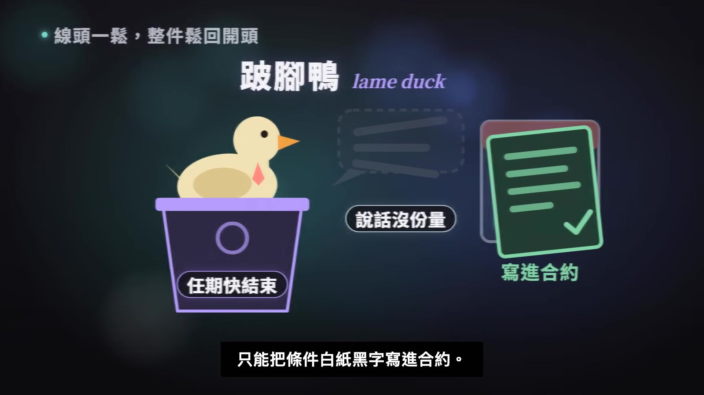

**逐字稿片段：** 所以Polak改了規則 這一次沒有人知道會玩幾輪

**話題推測：** 改變囚徒困境遊戲規則，引入不確定的結束日期（丟硬幣）。

---

## 00:20:20

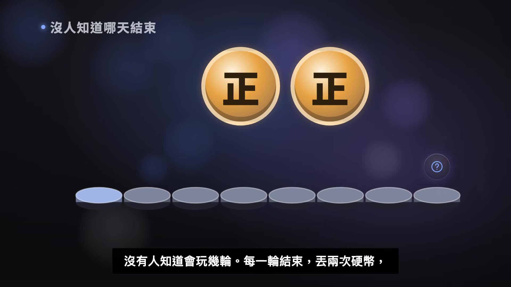

**逐字稿片段：** 每一輪結束丟兩次NB 兩次都是正面就散場 其他情況就繼續玩 兩次都正面的機會是四分之一 所以繼續下去的機會是四分之三 這個數字就是第一部分殺架時 那個折線因子 不過在這裡他不是利息也不是耐心 Polak說得很清楚 在賽局裡明天比今天輕 最主要的理由是明天可能根本不會來

**話題推測：** 解釋新的遊戲結束規則：丟兩次硬幣都是正面則散場。

---

## 00:20:41

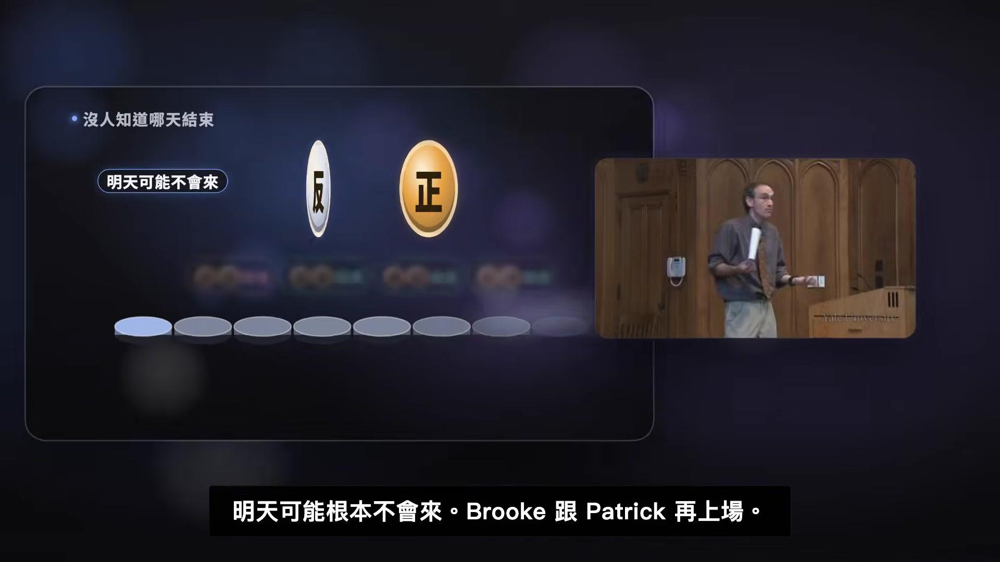

**逐字稿片段：** Brooke跟Patrick在上場 第一輪 布魯克背叛 Patrick手信 然後硬幣丟出兩個正面遊戲當場結束 Paulak說 這也太短了 我們就當作沒丟出來吧 我需要找一個沒那麼誠實的人來丟硬幣 全盤大笑 Patrick為什麼一開始手信 他說每一輪都有四分之三的機會在玩 繼續合作華德萊 線頭沒有最後一針 就鬆不起來 We'll cheat a little bit, okay So we're playing a second time Just with a little bit of cheating

**話題推測：** Brooke與Patrick再次上場進行不確定輪數的遊戲。

---

## 00:21:26

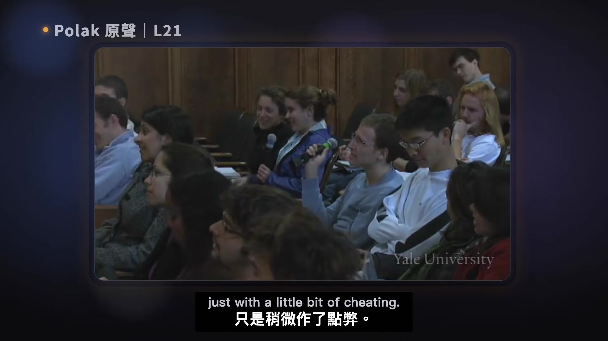

**逐字稿片段：** I need someone less honest 換Edwina跟Ben 這一組完全不一樣 第一輪兩個人都手信 第二輪也是 第三輪還是 唸到第三輪的時候教室裡有聲音了 Polak說 大家的語氣裡帶著一點痛 第四輪Edwina背叛 全班嘆了一口氣 Polak問他為什麼 他說 都已經玩這麼多輪了 硬幣總該丟出兩個正面了吧 Polak接了一句 硬幣也會均值回歸啊 你聽得出這句話的意思 硬幣不會記得自己被丟過幾次 每一輪繼續的機會都一樣 可是Edwina心裡覺得 這段關係快到齊了 他的背叛就是一句話 我不相信還有明天 Ben聽懂了 他說 Edwina一背叛 我就覺得我們要回到互相背叛了 接下來兩個人都背叛

**話題推測：** 換Edwina與Ben進行不確定輪數的囚徒困境遊戲。

---

## 00:22:04

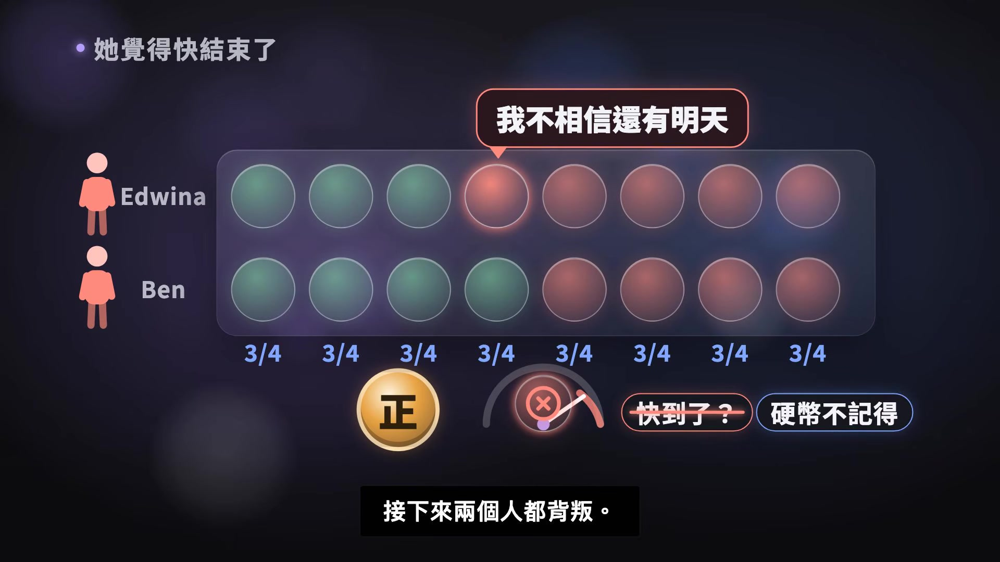

**逐字稿片段：** Paulak把Ben的做法寫成一條規則 這條規則叫Grim Trigger 中文叫冷酷出發 他的意思是 一開始合作 只要沒人背叛就一直合作 只要有人背叛過一次 從此永遠背叛 冷酷出發

**話題推測：** 引入新的策略規則：Grim Trigger（冷酷觸發）。

---

## 00:22:16

**逐字稿片段：** 能不能讓人一直合作 Paulak把這件事寫成一個比較 左邊叫誘惑 多賺的那一點 右邊是明天的差別 手信能拿到的未來 減掉被罰以後的未來 在城上明天會來的機會 左邊比右邊小 合作就站得住 用剛才那個遊戲算 背叛今天多賺一分 手信的話 以後每一輪都拿比較好的分數 背叛的話 以後永遠互相背叛 什麼都沒有 算出來明天會來的機會 只要有三分之一 合作就站得住 這個威脅為什麼可信 因為對方永遠背叛的時候 你也背叛 本來就是你最好的做法 罰者本身 也是每一個小局裡 都算得通的答案 第一部分 那把工具 在這裡又用上了 Paulak也提醒一件事 永遠手信聽起來最好 可是他連均衡都不是 如果你知道Jake 不管怎樣都手信 你當然會一直騙他 一套做法要站得住 自己就得帶著 讓人造作的理由

**話題推測：** 將合作與背叛的選擇寫成一個比較式，分析何時合作可持續。

---

## 00:23:04

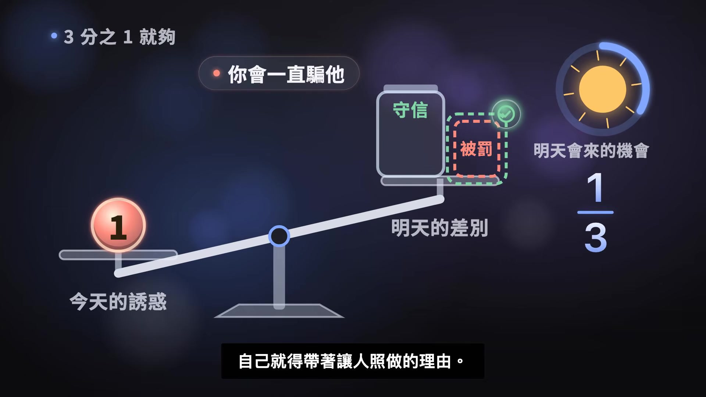

**逐字稿片段：** 可是冷酷觸發 在真實世界不太好用 因為人會出錯

**話題推測：** 討論冷酷觸發在現實世界中因錯誤率而難以應用的情況。

---

## 00:23:07

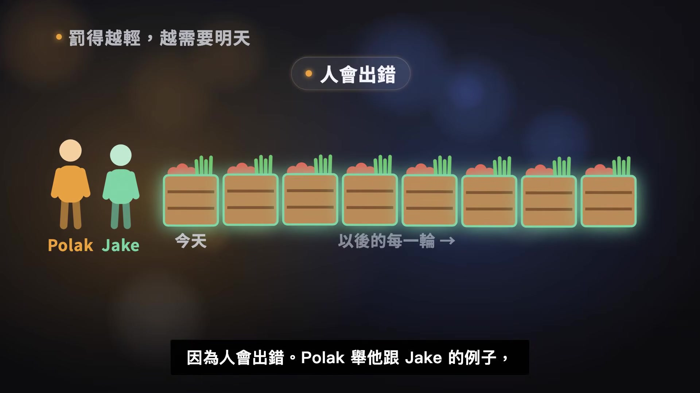

**逐字稿片段：** Paulak舉他跟Jake的例子 他們約好一個供水果 一個供蔬菜 有一天Paulak 沒戴眼鏡在蘋果裡 混進一顆爛的 Jake速如損數到1480 五根的時候數錯 少給了一根 白總是不該讓整段關係結束 Polak說 冷酷出發就是生意上的死刑 我不是要殺了Jack 是要殺掉我跟他的關係

**話題推測：** 舉例Polak與Jake的合作關係，說明人會犯錯導致策略失效。

---

## 00:23:24

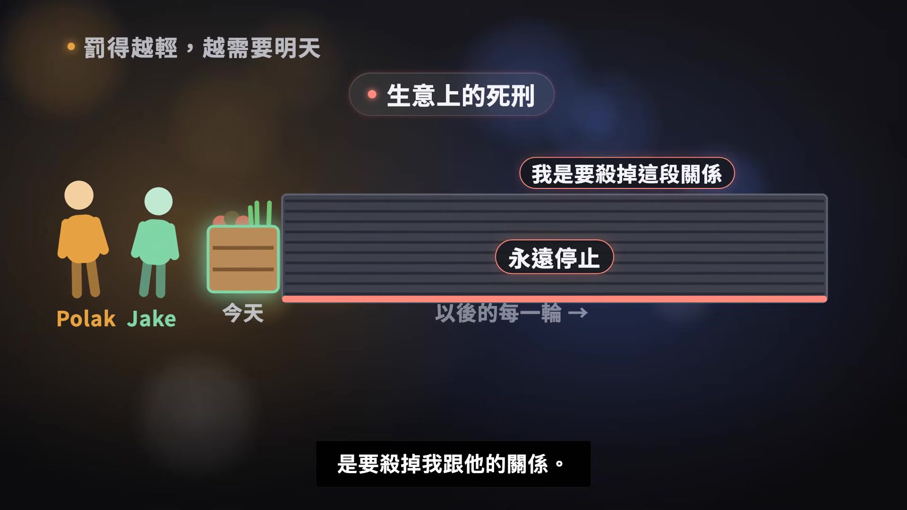

**逐字稿片段：** 所以他換了一種比較輕的罰法 只罰一輪 有人背叛 兩邊就互相背叛一輪 然後回到合作 罰則溫和多了 可是門檻往上跳 明天會來的機會 要有一分之一才行 這是這兩堂課裡 我最喜歡的一句 罰得越輕 越需要明天 道理不難 下一輪的損失變小了 你的更在乎以後 才抵得過今天那一點誘惑

**話題推測：** 提出一種較輕的懲罰方式：只罰一輪，然後回到合作。

---

## 00:24:11

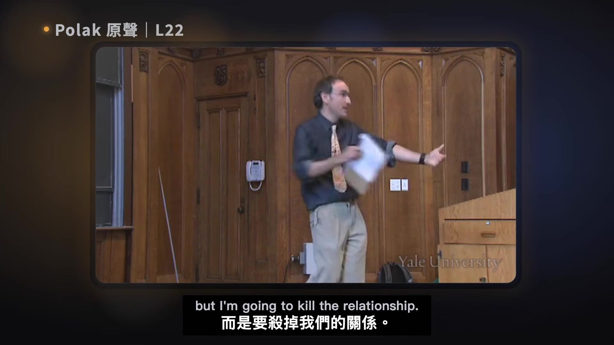

**逐字稿片段：** 這套算法最實用的地方 是在沒有法院幫你的時候

**話題推測：** 將這套算法應用於缺乏法律保障的商業環境。

---

## 00:24:15

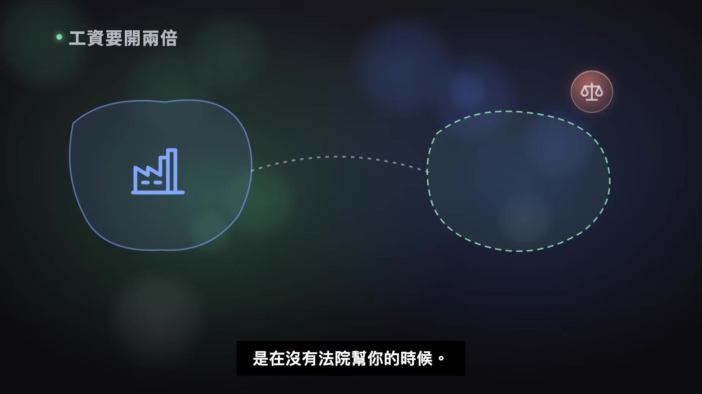

**逐字稿片段：** Paulak虛構了一個國家 叫Freedonia 名字來自一部老喜劇電影 也是一家美國公司 想把生產外包到那裡 因為當地工資便宜 行情是一 缺點是法院不太管用 合約很難執行 你得先把材料送過去 你的員工可以老實做事 理你的工資 也可以把材料賣掉 再回去做原本的工作 兩邊都賺 他真的這麼做 你告不了他 如果只合作一次 你得把工資開到 他才會選擇老實 整整多一倍 Paulak說 你去看歐洲跟美國的公司 在一些新興市場付的工資 真的看得到這麼大的差距 可是隻要加上明天 數字馬上變 老實做 下一次還會僱他 騙你一次就被開除 這段關係如果有一半的機會 工資只要一塊半就夠了 明天越可能來 你越不需要花錢買對方的老師 這一套也管到你我的生活

**話題推測：** 虛構一個國家Freedonia，作為沒有法院幫助的背景。

---

## 00:24:57

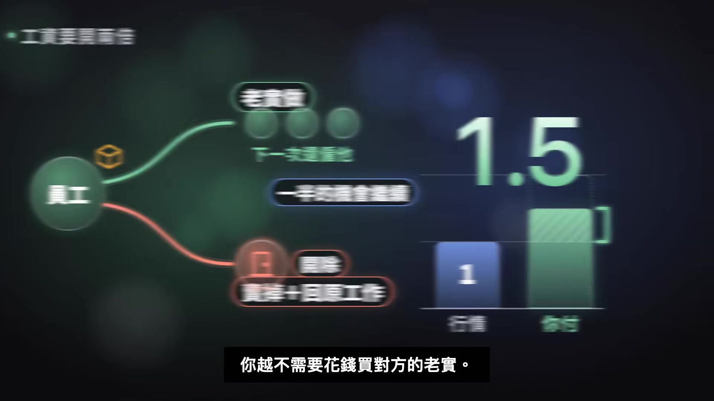

**逐字稿片段：** Paulak說 他在紐哈芬有一位固定的修車師傅 就算只是換機油 去連鎖的快速保養店比較便宜 他也一定回去找這位師傅 他要的回報是 師傅老實告訴他 這臺車是換個機油就好 還是真的要換引擎 可是等到那臺車快報廢 大家都知道他要換新車 新車又得回原廠保養 兩邊就會同時開始騙對方 他開始把車拿去便宜的地方換機油 師傅開始說 你這個離合器該換了

**話題推測：** 將理論應用到日常生活中，以修車師傅為例。

---

## 00:25:22

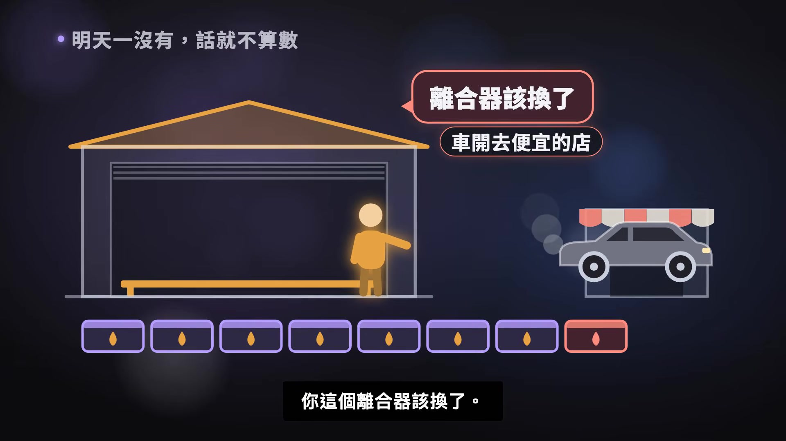

**逐字稿片段：** 接著Paulak請班上大學四年級的學生站起來 再請有男女朋友的留著 他問 明年要跟另一半分隔兩地的舉手 舉手都有好幾個 Paulak說 照這個模型 這幾段關係 這學期要小心 因為繼續下去的機會變小了 大家就比較容易不老實 聽起來像玩笑 到底是同一個一段關係 能不能讓人老實 看的不是今天 是還有沒有明天

**話題推測：** 請大學四年級學生起身，討論戀愛關係中「沒有明天」的影響。

---

## 00:25:43

**逐字稿片段：** 我們把第二部分收起來 這一部分的問題是 對方說他會怎麼做 你要不要信 答案是 光說不算 要看他說的話 有沒有明天壓著 紐約跟紐澤西 都喊自己會打到底 誰都沒被說服 因為這種話誰都說得出口 囚徒困境 只要大家知道哪天結束 線頭就一路送到底 最後一輪的承諾不可信 前面每一輪都跟著不可信 丟NB讓結束的日子 變得不確定 承諾跟威脅才開始算數 明天來的機會越大 越容易合作 罰得越輕 越需要明天 Edwina背叛 Ben讀得懂 他在說這段關係快到齊了 如果前面沒跟上 記住這一句 一句話能不能信 看的是他有沒有明天壓著 可是生活裡很多事沒有明天 面試只有一次 拍賣只有一次 你沒辦法拿以後去壓

**話題推測：** 標示第二部分內容的總結，可能是一個過渡性畫面。

---

## 00:26:23

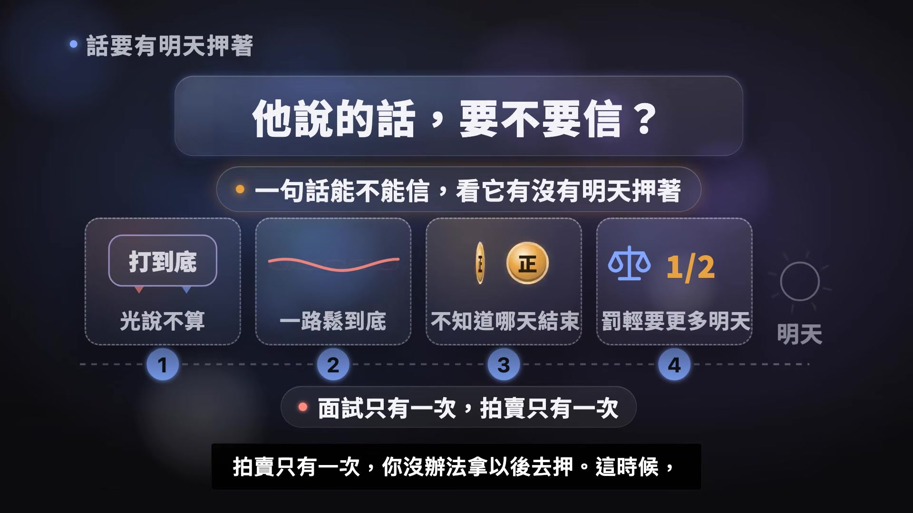

**逐字稿片段：** 這時候 拿什麼讓人相信 第23跑客 Polak從洛杉磯的餐廳說起 Polak先問 你們有多少人是洛杉磯來的 他要講洛杉磯的餐廳 1990年代後期以前 衛生機材員每年會去檢查 每一個餐廳

**話題推測：** 引入第三部分要討論的問題：沒有明天時，如何讓人相信？開始第23個主題，從洛杉磯餐廳說起。

---

## 00:26:37

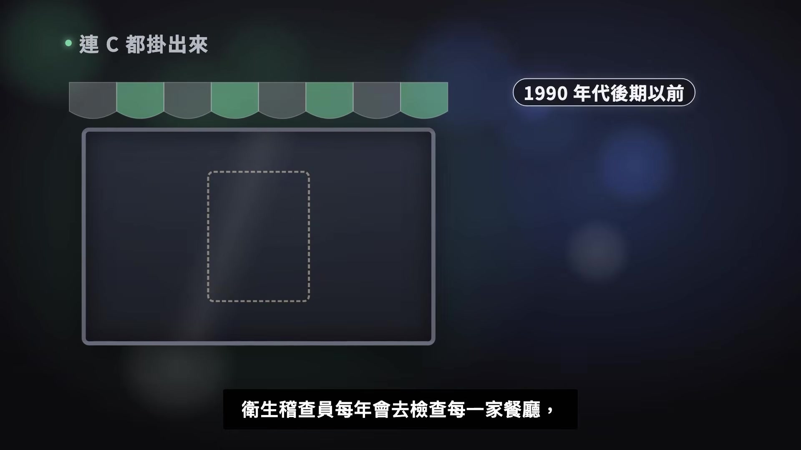

**逐字稿片段：** 檢查完發一張證書 上面是一個很大的字母 AB或者C 重點是 法律沒有規定餐廳一定要掛出來 掛不掛 店家自己決定 你猜會怎麼樣 Polak說 他聽出過那裡的人講 你可以走到最油膩的那家小店 隔著滿是油脂的玻璃 看到蟑螂在上面爬 在蟑螂後面 一張證書掛在牆上 上面寫著C 最差的那一集 店家自己掛出來 你第一次聽 一定覺得哪裡怪怪的 沒有人逼他 為什麼要把自己的缺點貼在門口 這個問題的答案 就是第三部分的第一把鑰匙

**話題推測：** 描述洛杉磯餐廳的衛生檢查評級（A、B或C）與證書制度。

---

## 00:27:28

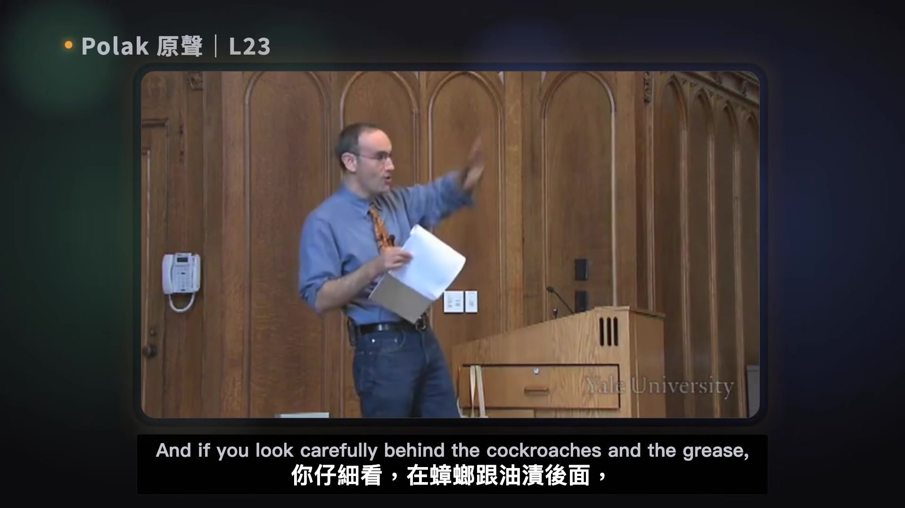

**逐字稿片段：** 你會看到一張C證 到底是這樣一步一步走的 拿到A的電一定會掛 這沒有懸念 拿到B的電會想 隔壁掛A 我這裡牆上空空的 客人會怎麼想 他會以為我是最差的C 所以B也掛 A跟B都掛出來 後面掛的只剩C 不掛就等於承認 所以C也掛 這個過程叫Informational Unraveling

**話題推測：** 解釋即使拿到C級證書的店家也會掛出來的推理過程。

---

## 00:27:46

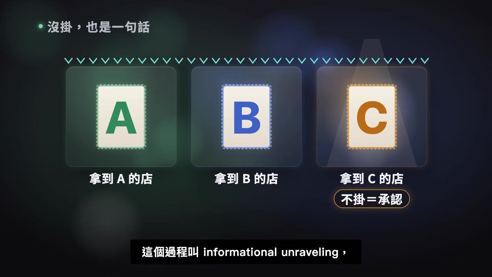

**逐字稿片段：** 中文可以叫資訊一路接到底 又是那件毛衣 只是這次 線頭從最好的那一端開始鬆 它有一個前提 這個資訊要能查證 證書是政府發的 夾不了

**話題推測：** 命名這個過程為Informational Unraveling（資訊一路接到底）。

---

## 00:27:57

**逐字稿片段：** Paulak跟兩家公司也講了一次 一家公司要不要公開自己的成本 同學Hugh說成本低的會公開 Elec接著說中等的也會公開 Bethany補上最後一部成本最高的那家 公不公開都一樣大家已經知道了

**話題推測：** 將資訊一路接到底應用到公司公開成本的決策上。

---

## 00:28:09

**逐字稿片段：** 這也是為什麼美國人的履歷上 連小學三年級當過西洋棋隊隊長都會寫 那一覽空著 看的人不會覺得你謙虛 只是會覺得你什麼都沒做 阿克奧拉說 這裡最容易忘的一件事是 沒有說話也在說話

**話題推測：** 以美國履歷為例，說明「沒有說話也在說話」的原則。

---

## 00:28:20

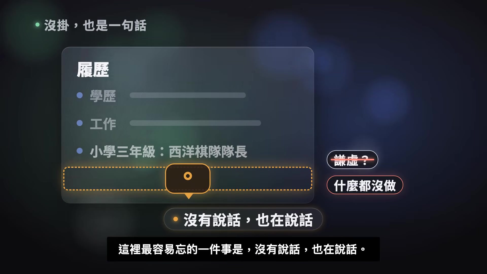

**逐字稿片段：** 這句話有個很好的例外 洛杉磯的觀光區餐廳就不太掛證書 為什麼 剛剛那整串推理有一個前提 看的人要知道本來就有這張證書 本地人知道 所以牆上空著 他讀得出意思 轉頭換一家 從外地來 第一次到迪士尼樂園附近吃飯的觀光客 根本不知道有這個制度 牆上空著 對他來說什麼都不是 Polak說 在那裡 你還是可以讓觀光客吃壞肚子 而且不必先告訴他們 所以沉默要能說話 聽的人得先知道 這裡本來應該有一句話

**話題推測：** 討論洛杉磯觀光區餐廳不掛證書的例外情況，解釋其原因。

---

## 00:28:48

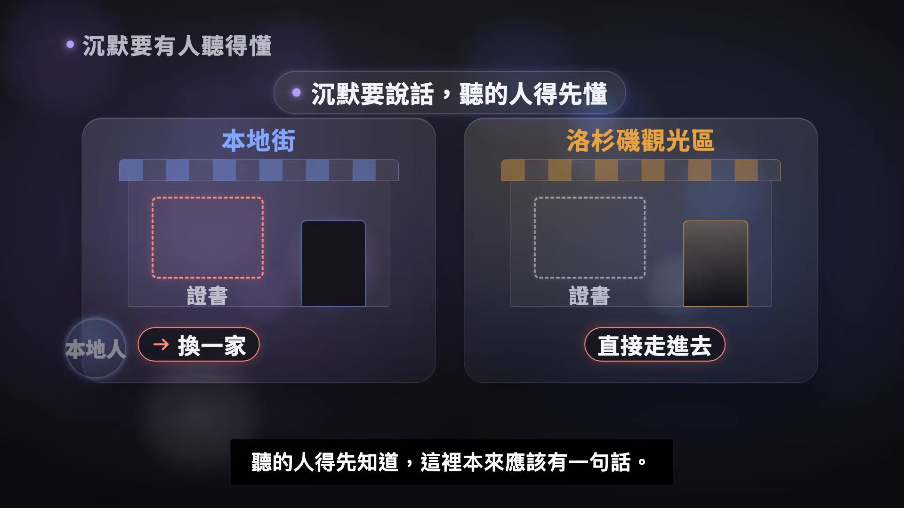

**逐字稿片段：** Polak接著講了福爾摩斯的故事 華森問他怎麼破案 福爾摩斯說 關鍵是那隻狗 華森說可是那隻狗沒有叫 富爾摩斯說 這真的是重點 普洛克說我們很容易變成華生 只看發生的事忘了沒發生的事 在美國 你有保持沉默的權利 英國後來改了規則 法院可以把你的沉默列入考量 這一改 那個權利還剩多少 普洛克留給全班自己想 剛剛那些資訊都能查證 可是生活裡很多話查不了

**話題推測：** 講述福爾摩斯「沒有叫的狗」的故事，強調對「沒發生」的事的觀察。

---

## 00:29:11

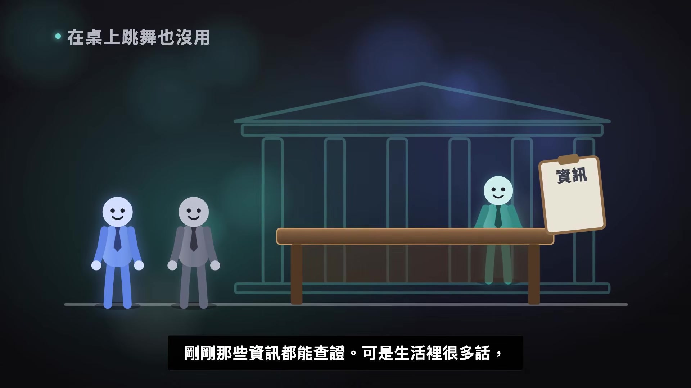

**逐字稿片段：** 普洛克講了一家銀行 他給他取名叫波士頓無聊銀行 面試的時候他們會問你 你真的想來我們這裡上班嗎 你當然回答想 這個回答裡的資訊是零 因為每個人都會這樣回答 這家銀行的招募人員還跟Polak抱怨 耶魯學生被問到這題 會說我不知道 聽起來有點無聊 哈佛學生會帶著一份華爾街日報 剛好翻在介紹這家銀行的那一頁 Polak 再往前退一步 假設你為了證明自己是好員工 在面試的桌子上單腳跳舞 唱一首歌說我是好員工 這很丟臉 對 你有代價 可是公司還是不會相信 班上一位同學說出原因 壞員工也做得到 你丟臉 他也一樣丟臉 所以這個動作分不出誰是誰

**話題推測：** 轉向討論現實生活中無法查證的資訊，引入「波士頓無聊銀行」案例。

---

## 00:29:48

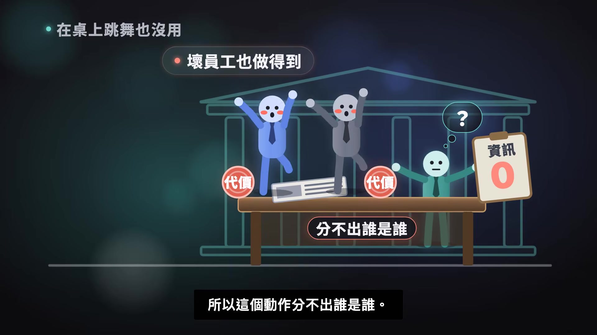

**逐字稿片段：** 這裡要講的東西叫Signaling,中文叫訊號 一個動作要能當訊號 光是有代價還不夠,他要對說謊的人特別貴 還記得紐約跟紐澤西嗎? 嘴上說的,誰都能說 現在多了一句,花一樣的代價,誰都花得起 或是隨便翻頁 在Boring Bank of Boston的網頁上 有時候他們會穿著 一個很不合理的帽子 說我很不合理 那什麼動作 對 說謊的人特別貴

**話題推測：** 引入新的概念：Signaling（訊號）。

---

## 00:30:31

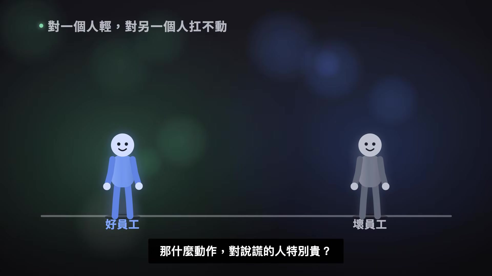

**逐字稿片段：** Polak 用的是Michael Spence的模型 Spence靠這個模型拿到諾貝爾獎 模型裡有兩種員工

**話題推測：** 介紹Michael Spence的訊號模型，此模型曾獲諾貝爾獎。

---

## 00:30:37

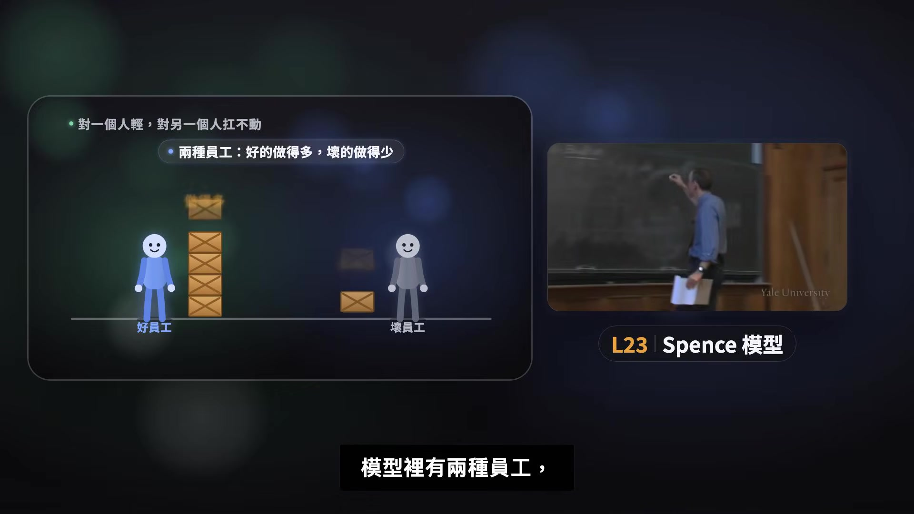

**逐字稿片段：** 員工能替公司做出比較多的東西 壞員工比較少 公司看不出誰是誰 大家搶著僱人 所以認得出是好員工 就付他值得那麼多 認不出來 只好照平均付 平均比壞員工的值高一點 比好員工的值低很多 所以好員工想被認出來 壞員工寧可藏著

**話題推測：** 解釋模型中「好員工」與「壞員工」的設定。

---

## 00:30:53

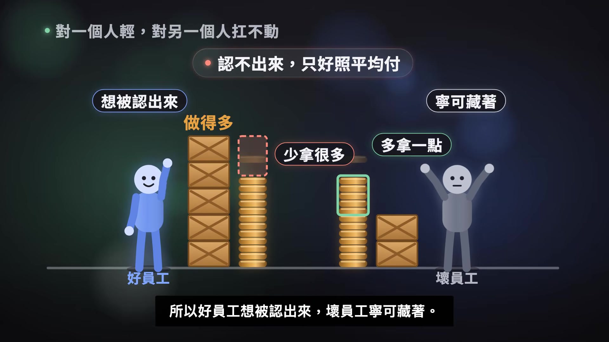

**逐字稿片段：** Spencer的答案是讀書 Polak的例子是讀企業管理碩士 也就是MBA 學費沒用 因為兩種人繳的一樣多 有用的是讀書的痛苦 看得懂Polak的版書 聽得懂他的口音 寫得完他的作業 好 員工讀一年比較輕鬆 壞員工讀一年痛苦得多 你可以把學位想成一顆石頭 同一顆石頭 好 員工搬得動 壞員工扛不動 真正分得出人的 不是石頭有多重 是他對兩種人重得不一樣 石頭要多種才分得開 Polak算了一個例子 學位讀三年 好 員工讀完 拿到好員工的薪水 扣掉三年的痛苦 還是比不讀好 所以他去讀 壞員工如果硬去讀 扣掉三年的痛苦 比不讀還差 所以他不讀 公司看到學位就認定是好員工 看到沒學位就認定是壞員工 而這個認定剛好是對的

**話題推測：** 將Spence模型應用於讀書和MBA學位，作為區分好壞員工的訊號。

---

## 00:31:34

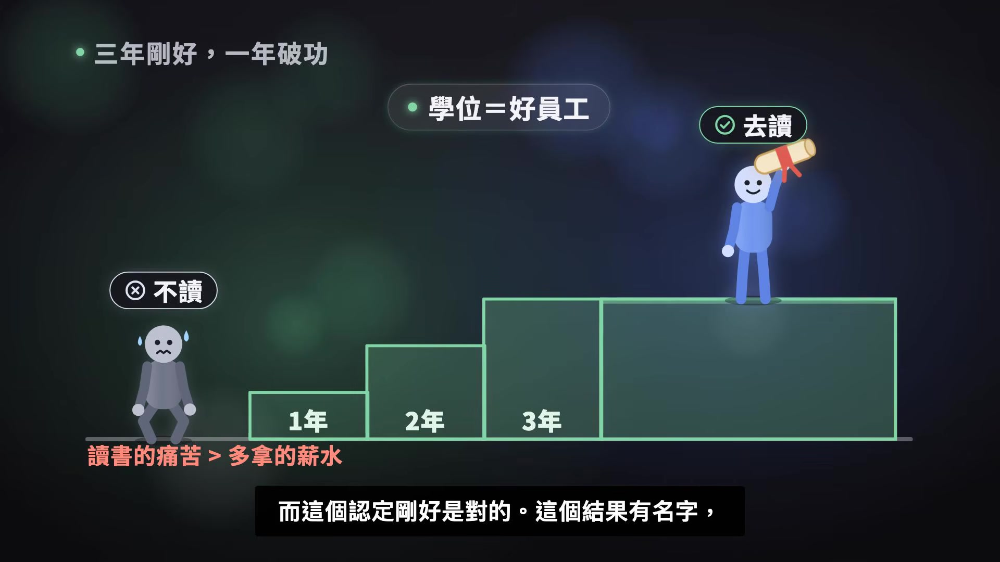

**逐字稿片段：** 這個結果有名字 叫Separating Equilibrium 中文叫分離均衡 意思是每一種人都照自己的算盤走 結果剛好分成兩邊

**話題推測：** 定義模型結果：Separating Equilibrium（分離均衡）。

---

## 00:31:42

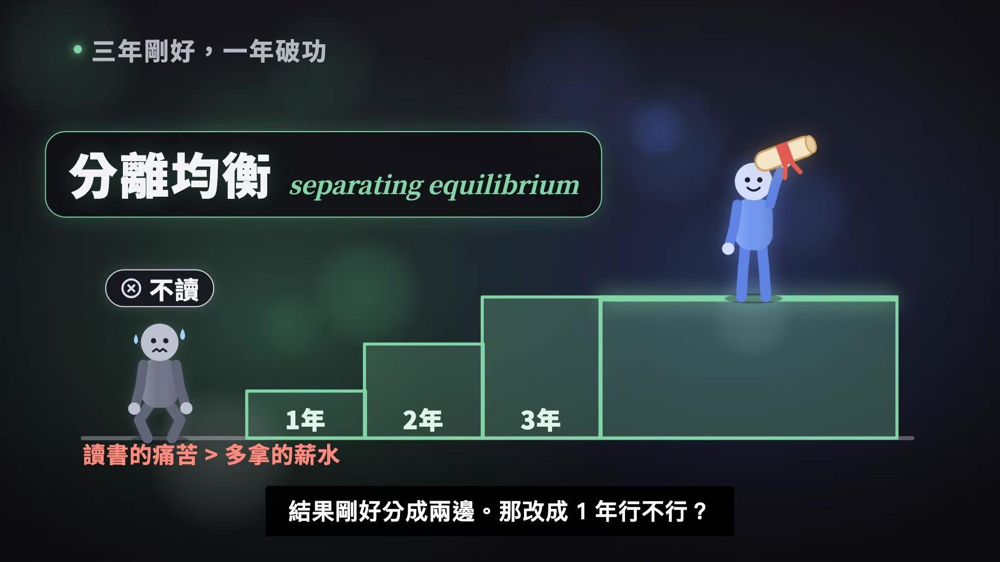

**逐字稿片段：** 那改成一年行不行 一位叫S-man的同學說不行 只讀一年 痛苦太少 壞員工讀完還是賺 他也會去讀 大家都有學位 學位就跟在桌上跳舞一樣分不出誰是誰 Polak說 照這個模型 一年剛好夠 反過來說如果社會把學位變得很容易拿 好員工就得再去拿 第二個學位 第三個學位

**話題推測：** 討論學位年限對分離均衡的影響，例如改成一年是否可行。

---

## 00:32:01

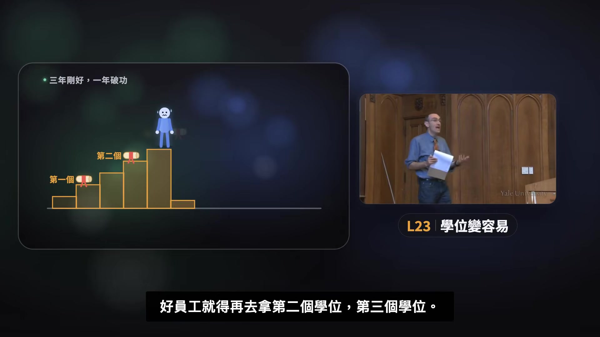

**逐字稿片段：** Polak管這個叫學歷通貨膨脹 到最後 連開砂石車都要大學文憑 Polak 把這個模型最難聽的部分留到最後 第一 這整套流程裡 沒有人學到任何東西 好員工進去是什麼樣子 出來是什麼樣子 壞員工也一樣 中間燒掉的 是好員工好幾年的痛苦 純粹白費 他還開自己玩笑 這些浪費在哪裡 你們坐在這裡就是 我第二件事更難接受 沒有學會這套制度的時候 分不出來 每個人都照平均零三十億 有了這套制度 壞員工被認出來 只能零三十 好員工變好了 壞員工變差了 for luck 說這種制度拉大差距的方法 不是讓有錢的人更有錢 是讓比較窮的人更窮 他還說得很小心 他希望真實的大學裡 大家真的有學到東西 可是隻要教育有一部分 在當訊號 就有這個代價 那一堂課最後一句話是 要讓教育當訊號 要讓兩種人分得開 就必須有一些孩子

**話題推測：** 將學位變得容易拿的現象命名為「學歷通貨膨脹」。

---

## 00:32:48

**逐字稿片段：** 被留在後面 最後一堂課 Polak走進教室的 第一句話是 我那幾罐硬幣跑哪去了 他帶了兩個玻璃罐 裝滿零錢 一大一小 大的那個是青醬罐 罐子一排一排傳下去 每個人可以搖一搖看一看 先在筆記本 寫下自己猜裡面有多少錢

**話題推測：** 開始最後一堂課的內容，Polak拿出兩罐硬幣進行拍賣實驗。

---

## 00:33:02

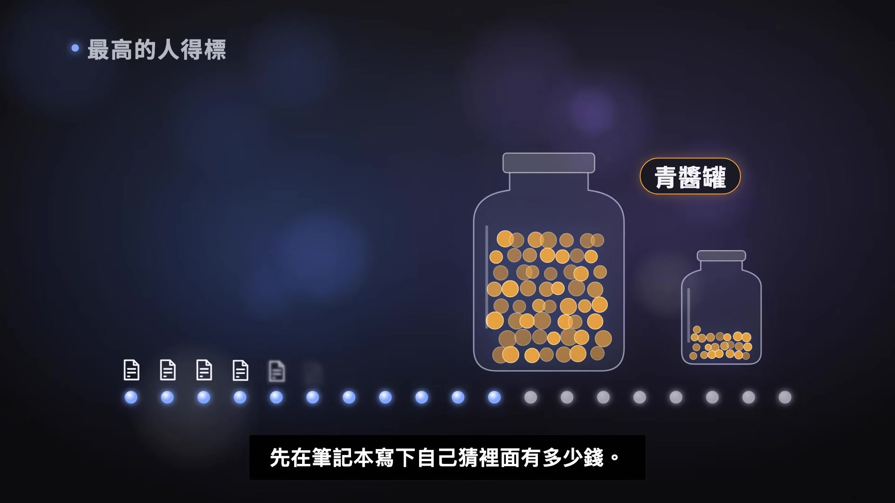

**逐字稿片段：** 這時候他把整門課 都放回一條線上 他說 這學期大部分時間 我們都假設你知道對手是誰 直到他的分數 這個星期不一樣 你不知道對方心裡的數字 拍賣就是這種情況 Polak 說這種東西有個名字 叫Common Value 中文叫共同價值 意思是他對誰都值一樣多 只是每個人估的不一樣

**話題推測：** 總結本學期課程主軸，強調本次實驗與先前假設的不同。

---

## 00:33:21

**逐字稿片段：** 他舉的例子是油田 裡面有多少油是固定的 每家公司試賺以後估出來的都不同 接著前兩排的同學寫下出價

**話題推測：** 舉例油田作為共同價值的例子，解釋不同公司估值差異。

---

## 00:33:27

**逐字稿片段：** 這種玩法叫 First Price Sealed Bid Auction 中文叫第一價格密封投標 規則是出價最高的人得標 拿走罐子裡所有的錢 付出自己寫的數字 Paulak說 這是完整的你得標 就要付我錢 出價一個一個唸出來

**話題推測：** 解釋拍賣形式：First Price Sealed Bid Auction（第一價格密封投標）。

---

## 00:33:41

**逐字稿片段：** 註教Alley全部抄在黑板上 有人寫四塊半 也有人寫不到一塊 唸到一個一分錢的出價 Paulak停下來說 我這個罐子是有什麼問題嗎

**話題推測：** 助教在黑板上抄寫所有出價，展示數據收集過程。

---

## 00:33:50

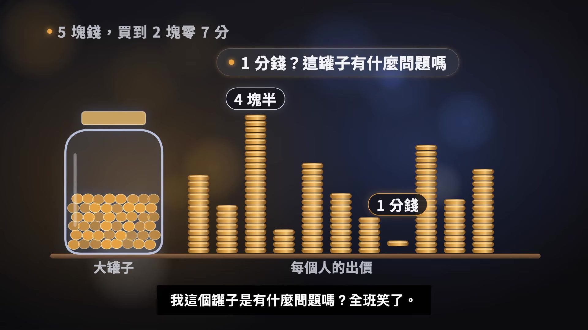

**逐字稿片段：** 全班笑了 最高的出價是五塊錢 得標的是Ashley Paulak請他站起來全班給他掌聲 他說 看起來裡面大概有五塊錢 而且還附送一個罐子 Paulak說罐子我可不一定要送

**話題推測：** 宣布最高出價者Ashley得標，並公開其出價金額。

---

## 00:34:02

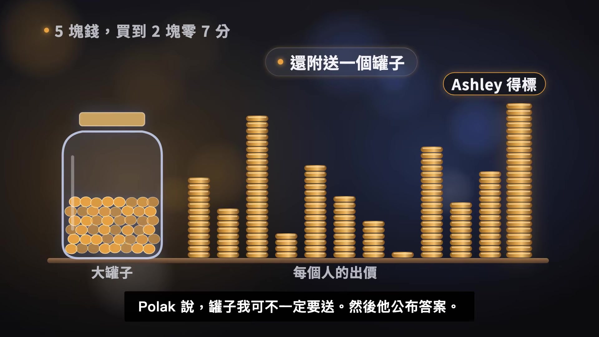

**逐字稿片段：** 然後他公佈答案 大罐子裡 一共是2.07元 Ashley花5元買到2.07元 多付了將近3元

**話題推測：** 公布大罐硬幣的實際金額：2.07元，與Ashley的出價進行比較。

---

## 00:34:11

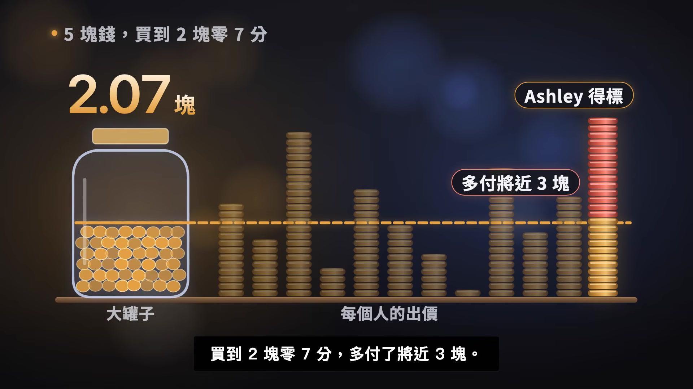

**逐字稿片段：** Pluck再請大家舉手 原本估計超過1.07元的有多少人 大概將近一半 你注意 大部分人的估計不算太離譜 有高有低 散在真正的金額兩邊 出事的是那個贏的人 所以Ashley說她花了大約5塊錢 因為看起來好像有大約5塊錢 而且她拿到瓶子 而且你拿到瓶子 我不是說我拿到瓶子

**話題推測：** 請學生舉手，統計估計值超過實際金額的人數，顯示群體偏差。

---

## 00:34:46

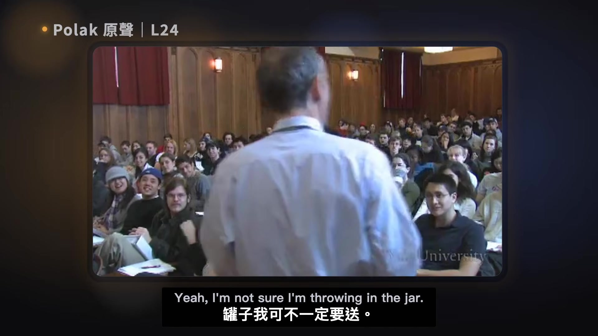

**逐字稿片段：** 為什麼會這樣 Polak在黑板上畫了一條中型的曲線 罐子裡真正的金額只有一個 每個人的估計 是真正的金額加上一點誤差 有人估高有人估低 大致平均地散在兩邊 現在問 誰會得標估得最高的那一個 估得最高也就是誤差最大的那一個 它不是從中間來的 它是從曲線最右邊那條尾巴來的

**話題推測：** Polak在黑板上畫出曲線，解釋得標者估值最高的原因。

---

## 00:35:05

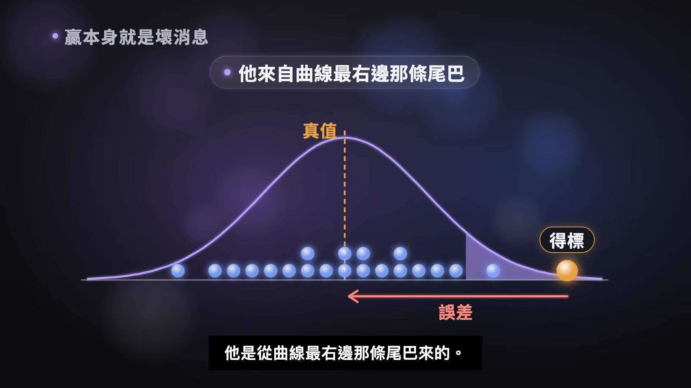

**逐字稿片段：** 這個現象叫Winners Curse 中文叫贏家詛咒 他的意思是 贏這件事本身 就是一個關於你自己判斷的壞消息 Polak用一個想像的例子講 假設你股150個按比 我告訴你旁邊那位股130 你的數字會往下調 我只告訴你他比你低 沒說低多少 你還是會往下調 現在我告訴你 全場每一個人股的都比你低 你的數字會掉很多 而這句話就是你得標那一刻知道的事 第二次世界大戰之後 美國政府把墨西哥灣的油田開採權拿出來拍賣 得標的公司一直賠錢 股票剛上市的時候 價格也常定的太高之後往回掉 所以普拉給的規則只有一句 出價之前 先假設有人告訴你 你贏了 在那個前提下 你覺得罐子有多少錢 再比那個數字少出一點 這樣真的贏了 你也不會後悔 因為你早就把贏這件事算進去了

**話題推測：** 為這種現象命名：Winners Curse（贏家詛咒）。

---

## 00:35:48

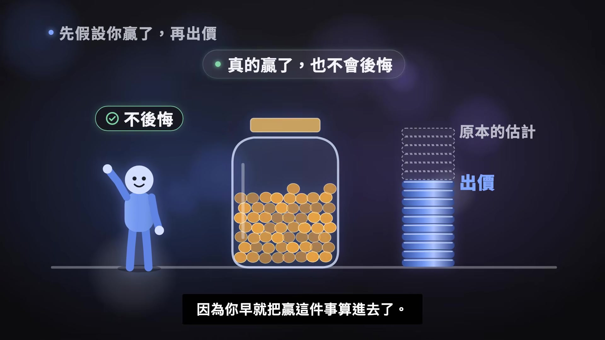

**逐字稿片段：** 這個道理你其實碰過 你去談薪水 開了一個數字 對方一口就答應 那一刻你心裡會涼一下 因為開價一次就被接受 通常代表你開的太低 還記得第一部分嗎 理論說 第一個報價就會成交 到了真實世界 你的報價馬上成交 反而是一句話 他在告訴你 對方願意付的比你想的多 講完這一套

**話題推測：** 以薪水談判為例，解釋贏家詛咒在個人生活中的體現。

---

## 00:36:07

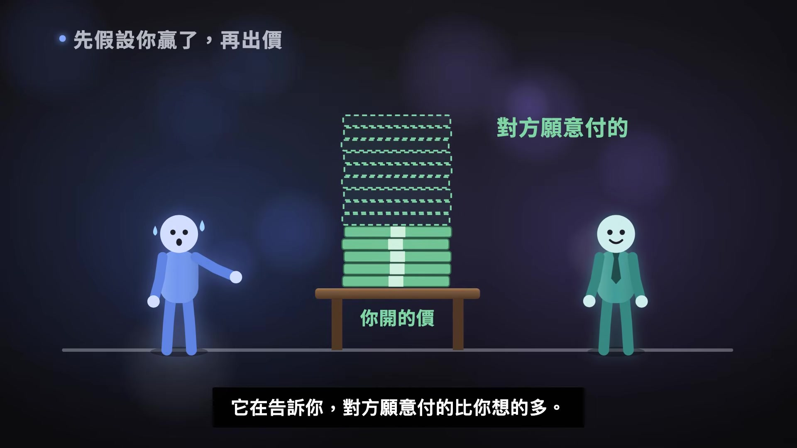

**逐字稿片段：** Paulak 馬上用小罐子再玩一次 得標的是Robert出價一塊六毛 小罐子裡是一塊四毛八分 Paulak問他 你原本估裡面有多少 Robert說一塊六毛 Paulak說我好像教得不太好 不過他再請大家舉手 這一次 大部分人都把出價壓到自己的估計以下了 只是Paulak說壓得還不夠

**話題推測：** Polak使用小罐子再次進行拍賣實驗，應用學到的概念。

---

## 00:36:51

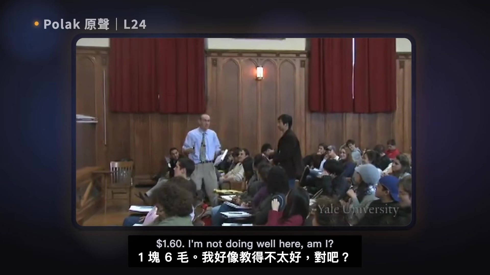

**逐字稿片段：** 我們把第三部分收起來 這一部分的問題是 沒有明天可以壓的時候 一個動作 憑什麼讓人相信 答案有兩層 第一層 能查證的資訊會自己一路接到底 連沒掛證書連沒說話都在說話 第二層 查不了的時候 嘴巴說的沒用 在桌上跳舞也沒用 要做一件對說謊的人特別貴的事 就像那顆石頭 最後那罐硬幣再往前推一步 連你自己贏了 都是一句話他在告訴你 其他人都估得比你低 如果前面沒跟上 記住這一句 一個動作說服得了人 是因為別人假裝不來 也別忘了他的代價 Spence的模型裡 這顆石頭沒讓任何人變得更好 還讓分不出來的那些人領得更少 訊號有用 可是它不是免費的

**話題推測：** 標示第三部分內容的總結，可能是一個過渡性畫面。

---

## 00:37:28

**逐字稿片段：** 我們回到開場那個問題 當你看不到對方心裡那件事的時候 你還能不能算 這八堂課的答案是能

**話題推測：** 回顧整門課開場的問題，引導至總結答案。

---

## 00:37:34

**逐字稿片段：** 而且是分三步算 第一步 算清楚每個人在那一刻看得見什麼 看到以後會怎麼動 第二步 別隻聽他說什麼 要看他的話有沒有明天壓著 第三步 沒有明天的時候 看他願意付什麼代價 連沉默 連你自己的贏都要賭 所以這一集的答案是 男的不是看穿人心 是讀懂動作

**話題推測：** 總結八堂課的三個步驟式答案，可能顯示在簡報上。

---

## 00:37:51

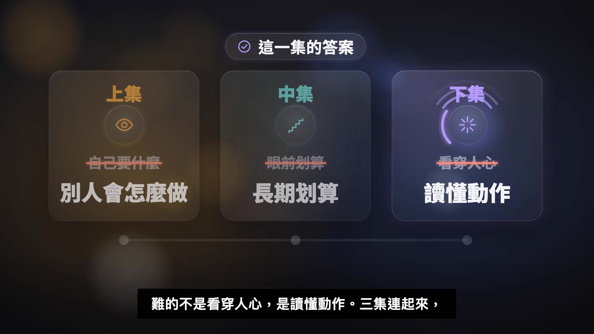

**逐字稿片段：** 三集連起來其實是一條線 上集說 男的不是算出自己要什麼 是算出別人會怎麼做 中集說 男的不是眼前划算 是長期划算 下集說 別人會怎麼做 他心裡在想什麼 都寫在他的動作裡 1121159 那這裡就講完了 一共14朝課 Pollock最後一句話是 我們結束了

**話題推測：** 將三集內容連結起來，呈現整個課程的核心思想。

---

## 00:38:09

**逐字稿片段：** 複習課見 最後問你一個問題 你做過最費力的一件事 只為了讓別人相信你 是什麼 對方後來真的相信了嗎 留言告訴我 喜歡這種把公開課講清楚的內容 也可以訂閱AI Notebook 我是Jim 我們下次見

**話題推測：** 課程結尾，提出一個互動問題給觀眾思考，並進行訂閱呼籲。

---
