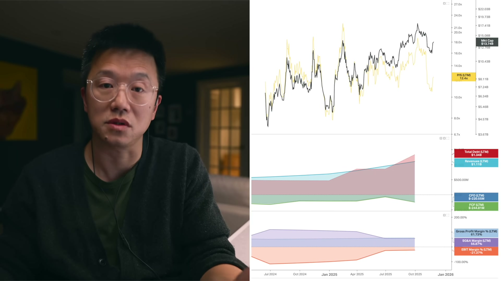
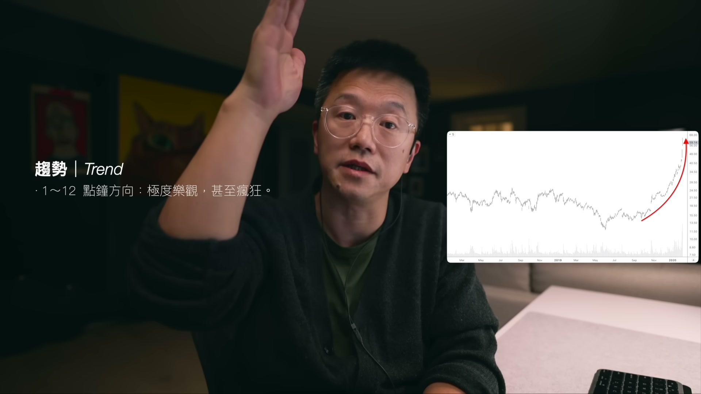
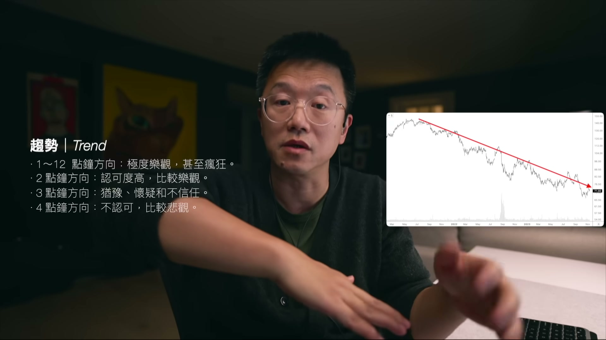
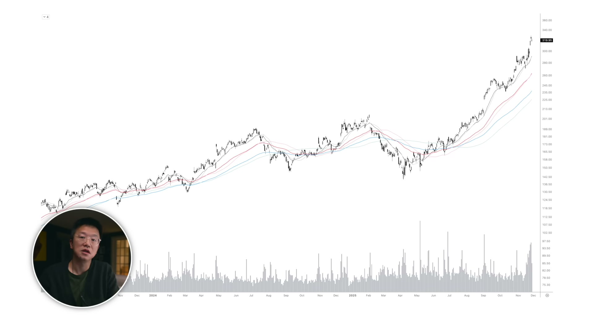

# lei_qbU7LHPZ4Xo — 關鍵畫面索引

- 來源逐字稿：[lei_qbU7LHPZ4Xo_GT.srt](lei_qbU7LHPZ4Xo_GT.srt)
- 影片：https://www.youtube.com/watch?v=qbU7LHPZ4Xo
- 截圖數：18

## 00:00:22

**逐字稿片段：** 簡單來說就是三個方面 商業模式 財務表現 市場定價

**話題推測：** 介紹基本面分析框架的三個主要方面

---

## 00:00:28

**逐字稿片段：** 所謂商業模式就是說 這家公司做什麼生意 賺誰的錢 是2B（面向企業）的生意 還是2C（面向普通消費者）的生意 賺錢的方式是不是有壟斷性 是不是有護城河 能不能夠讓這個業務無限擴大 它的生意有沒有天花板 所以這些都是我們 做投資最基礎的一些底層邏輯 如果說在五分鐘之內 你無法回答這些問題的話 說明你可能對這家公司的生意無法理解 無法理解的生意 我的看法就是 最好不要碰 我認為一家偉大的公司 它的產品應該具備四個基本條件 第一個 無差別的產品 第二 最廣泛的用戶 第三 自由定價 第四 市場壟斷 最典型的例子就是Google 它的產品是無差別的 你使用的Google和我使用的Google 本質上說沒有任何差別 全球80億人和全球絕大多數的企業 都需要Google的服務 都是它的潛在客戶 Google的產品定價 沒有政府或者某個機構來限制它的價格 Google在很多產品很多服務方面 是具有壟斷特性的 比如說Google的搜索是絕對的壟斷者 此外它的Android系統 Chrome瀏覽器 Google Map Google Cloud Gmail 還有就是你現在正在看的YouTube 也是一個絕對性的壟斷產品 所以我認為做投資就要投資這樣的生意 有了這些大概的這種商業認知之後 我們就可以進入第二層 就可以看財務表現 財務表現主要是看三類數據 首先是看收入 包括收入的規模 收入的成長性 然後是看運營利潤率 也就是EBIT margin 它是用來考察企業的核心的盈利能力的 如果說運營利潤是負值 那說明這家企業屬於是結構性的虧損 說明這家企業的商業模式可能存在問題 第三個就是看現金流 現金流包括運營現金流和自由現金流 運營現金流呢 就是說企業在商業運營的過程當中 產生的現金流 自由現金流呢 就是說商業運營過程當中的現金流減去 它的資本支出 那剩下來的部分就是自由現金流 我是比較看重這個自由現金流 因為自由現金流 它才是企業真正賺到的錢 這些多出來的現金流 可以用於擴大它的生產規模 或者說是開發新的產品 或者說是收購其他的企業 或者說用分紅 或者回購股份的方式 來回饋它的股東 這都是可以的 也就是說 具備強大自由現金流的企業 它的生意啊 它的生意的彈性就非常好 可攻可守 我比較喜歡的企業呢 有幾下幾個特徵 你可以記一下 首先第一個就是說 這家企業的收入

**話題推測：** 開始講解商業模式的定義

---

## 00:03:47

**逐字稿片段：** 不應該小於一億美元 年收入一億美元 已經是一個非常大的體量 有這個體量的企業 它就已經進入了 一個叫做什麼呢 實力比較強 身體比較好 同時呢 市場影響力也比較大的一個階段 跨過這個門檻 你不要以為一億美元 一億美元很多企業是跨不過去的 絕大多數企業在 碰到一億美元就再也過不去了 能過去的 它就會進入一個良性的快速的發展階段 這個體量的企業 我們可以 預期 它每年有15%到20%左右的收入增速 這麼大的體量 如果說收入增速低於10% 我認為 它可能存在一些 動力不足的情況 發展可能就碰到了一個瓶頸 太高的增速 比如說40% 50%的這種增速的話 也很難維持 所以說 我認為 一億美元的年收入這種規模的企業 這個 它的成長性在15%到20%是比較理想 是一種可持續的狀態 接下去就是

**話題推測：** 提出企業年收入不應小於一億美元的標準

---

## 00:04:59

**逐字稿片段：** 看它的運營利潤率了 在同行業當中 同一種生意類型的企業當中 運營利潤率 越高越好 對吧 運營利潤率越高 它的這個 抗風險的空間就越大 彈性就越大 當然這個運營利潤率呢 是不可能 不可以跨行業比較的 不同的商業模式 它的利潤率是不同的

**話題推測：** 轉入討論運營利潤率

---

## 00:05:21

**逐字稿片段：** 比如說谷歌可以做到32%的運營利潤率 但是沃爾瑪只有4% 但是你不能說 沃爾瑪的4%就一定比谷歌的32%要差 不是這樣的 因為它的商業模式是不同的 但是呢

**話題推測：** 比較Google (32%) 和Walmart (4%) 的運營利潤率

---

## 00:05:37

**逐字稿片段：** 我們可以用沃爾瑪的4%的運營利潤率 去和Costco的3.7%的運營利潤率做比較 這樣的一種比較 我們也看得出來 沃爾瑪的這個企業的這個運行效率 就要比Costco要高一點點 這種同業比較才有意義然後呢就是看運營現金流 我認為 運營現金流必須是正值 這表達你做生意是可以賺到錢的 運營現金流是負值 就說明你不掙錢 在運營現金流是正值的前提下 自由現金流最好也是正值 前面已經說了 自由現金流是一個企業 可以自由拿來 隨意做一些變動的 一些彈性的商業活動的 這樣的一個可能性 前面說到的這幾個財務數據呢 我們可以用來驗證一家企業 它的商業模式到底靠不靠譜 是不是已經走上了正軌 我這種篩選方式呢 也是刻意排除掉了那些 目前還停留在講故事階段的股票 如果是一個好企業 你的故事真的能夠成真的話 那我相信你終有一天 會跨過這個門檻 進入到我的股票池當中的 之前我有一個網友 他跟我討論一隻股票 這隻股票我看了一下 確實這隻股票 有很多很多的動聽的故事 又是什麼遠程醫療啦 又是這個AI概念啦 又是這個叫什麼 國會山股神佩洛西的持倉 但是呢你打開報表一看 這家公司是屬於結構性虧損的狀態

**話題推測：** 比較Walmart (4%) 和Costco (3.7%) 的運營利潤率

---

## 00:07:16

**逐字稿片段：** EBIT margin是小於零的 債務甚至大於收入 它完全沒有產生現金流的能力 如果像這樣的一家企業 那最近這個股票也走得比較弱 還跑不贏大盤 我不知道這位網友 他在賭什麼 對不對 在我的觀念當中 如果說一隻完全靠故事驅動的股票 一旦弱於大盤就必須要果斷拋棄了 那當然這是一個 另外一種叫做動量投資的策略 這個話題呢 我會找時間來專門做一個影片 來講一講這個動量投資的事情 當我們找到了靠譜的企業之後

**話題推測：** 顯示「故事股」的財務數據問題 (EBIT margin < 0, 債務大於收入)

---

## 00:07:53

**逐字稿片段：** 我們就需要看它的市場定價 市場定價不是股價高低 而是指估值 所謂估值就是

**話題推測：** 轉入基本面分析的第三個方面：市場定價 (估值)

---

## 00:08:00

**逐字稿片段：** 我們常用的估值指標P/S P/E P/B 這些指標其實都在表達同一個意思 就是說這家企業的市場價值 和它的商業價值之間的關係 估值的意義在於 讓我們瞭解市場預期 相類似的企業當中呢 估值較高的企業說明 投資者給予的更高的預期 估值高有高的道理 低有低的道理 我們沒有必要去與它計較 我有一篇文章是專門講這個估值的 有興趣的朋友可以去看一下 總而言之 基本面並不需要 多麼深厚的財務基礎 有一些基本的商業邏輯的常識 你能夠掌握我前面說到的這些 幾個重要的內容就夠了 不是越多越好 基本面分析框架主要解決 一個定性的問題 但是呢 它不能夠解決具體操作的問題 我有一句名言叫做 基本面不可以用來做交易 因為有很多財務數據 看上去非常好的企業 它的股價可以一直跌的 所以說怎樣做交易 怎樣買入賣出這些事情 這就屬於是技術面的範疇 我們講技術面的範疇 或者技術面框架 主要看三個方面 趨勢 位置 和風險管理 我另外還有一個名言 多數時候我們賺的都是趨勢的錢 關於趨勢呢 我這裡有一個影片 做過詳細的講解 簡單的來說呢

**話題推測：** 列舉常用的估值指標 (P/S, P/E, P/B)

---

## 00:09:31

**逐字稿片段：** 我把價格趨勢分成五個時鐘方向來表示 1點鐘到12點鐘方向的趨勢方向 這表明市場對這個企業的生意 是極度看好 甚至有點瘋狂的

**話題推測：** 介紹用「五個時鐘方向」來表示價格趨勢

---

## 00:09:44

**逐字稿片段：** 2點鐘左右的趨勢方向 它表達市場的認可度是比較高的 投資者是比較樂觀的 3點鐘方向 那很顯然就是一種猶豫啊 懷疑啊和不信任的一種態度 4點鐘方向的趨勢 表達市場不認可 比較悲觀

**話題推測：** 描述2點鐘左右的趨勢

---

## 00:10:03

**逐字稿片段：** 5點到6點鐘的這種方向 表達市場極度的 不相信或者不看好企業的商業前景 投資者極度悲觀 這樣的一種狀態 我們研究趨勢 所謂趨勢 趨勢的作用就在於 它是已知信息和未知信息之間的橋樑

**話題推測：** 描述5點到6點鐘方向的趨勢

---

## 00:10:23

**逐字稿片段：** 舉個例子來說 我們看這家企業 它的收入持續增長 很不錯 對不對 經營現金流 自由現金流也很不錯 運營利潤率也保持一個比較高 比較穩定的水平 但是呢股價卻這段時間是 持續的下跌 P/S估值已經跌回到了 歷史最低水平的附近 股價和基本面朝著完全相反的方向運行 這說明有些事情 我們可能不知道 價格趨勢告訴我們 市場不看好這家企業的商業前景 像這樣的股票 我的經驗是 不要去抄底 暫時不要碰 至少要看到這個股價 這個逐漸往上 逐漸這個基本面和股價 能夠配合往上的時候 股價已經形成了一定的上漲趨勢之後 再進入 這樣的話呢 就是相對的安全 我會更傾向於 做這種兩點鐘方向趨勢 這種股票 基本面往這裡走 股價也是往這個方向走 這個基本面和股價相互驗證 同步上漲的股票 這樣的股票 有市場共識 拿得住 也是最容易賺到錢的一種方式 技術框架的第二個層面

**話題推測：** 舉例說明基本面良好但股價下跌的情況

---

## 00:11:41

**逐字稿片段：** 就是位置 我們經常說 這個位置那個位置 所謂位置 就是一些歷史上 投資者關於這隻股票的 公允價格 我們一般的股票圖表上 橫軸是時間 縱軸是價格 成交量表達 此時市場參與者 對這個股票的看法 對不對 成交量 還有另外一種表達方式 就是縱向的

**話題推測：** 轉入技術分析的第二個層面：位置

---

## 00:12:08

**逐字稿片段：** 這個籌碼分佈 它表達的是 在選定的這個時間範圍之內 某一些價格上的 成交量的堆積 某個價格附近出現的 較大的這個成交量堆積 我們叫做籌碼峰 籌碼峰就是 說明這個地方 是有市場共識的 這個價格 有大量的人參與 有市場共識 籌碼峰越大 這個市場共識就越大 籌碼峰 就可以看作是 市場的公允價格 公允價格 通常會有阻力和支撐的作用 在上漲趨勢過程當中 價格回撤到 某一個重要的籌碼峰附近的時候 這裡往往會形成價格的支撐作用 下跌過程當中 當它反彈碰到某一個重要的 籌碼峰的時候呢 這裡可能會起到 一定的阻力的作用 這些重要的位置 其實就是可以用來 幫助我們判斷 這個位置 是可以買入或者賣出的位置 因為這裡有大量的市場共識 這個共識對我們來說 是相對安全的 前面我說 基本面不可以用來做交易 交易怎麼做 結合上面的籌碼 這些價格 我們來說一下

**話題推測：** 介紹股票圖表中的籌碼分佈概念

---

## 00:13:25

**逐字稿片段：** 我的經驗是 第一 找到你喜歡的商業模式 找到一個 你認為靠譜的生意 股價最好是運行在兩點鐘方向 左右的方向 怎麼看 這個時間呢 我這裡有個影片 大家再去看一下 我這裡就不多說了 最重要的是 兩點鐘方向的趨勢 等它的股價回撤 它總是要回撤 對不對 你就耐心等就是了 等股價回撤到 重要的籌碼峰的附近 重要的供應價值的附近 買入 前提是什麼 它的總體的趨勢是往上的 兩點鐘方向 它的總體的 這個商業狀況 這個財務狀況 也是朝著這個方向 這種股票才可以做 當然了 圖形不是萬能的 圖形裡面有各種各樣的 這種錯誤信號 特別是某些小股票 流動性很差的 這個價格也容易被操縱 但是不管怎麼樣 無論如何 不管你是否看好這個企業 或者說是怎麼樣 你記住一句話 任何一筆交易 最重要的是 要有預期 很多人是有預期 沒錯 同時要有底線

**話題推測：** 總結交易策略

---

## 00:14:46

**逐字稿片段：** 所謂底線 就是我們的風險邊界 絕大多數人 在股市上的虧損 都是因為沒有底線導致的 或者說即使有底線 跌破底線也不肯認輸的結果

**話題推測：** 介紹風險管理的底線概念

---

## 00:15:00

**逐字稿片段：** 十幾年前 我也曾經犯過一次 這樣的重大的錯誤 損失慘重 當時我的股票 出現了持續下跌的情況 但是根據我當時的掌握的財務數據 各個方面的信息 以及我對這家股票 我自認為我對這家公司非常的瞭解 所以我堅持認為 我沒有錯 市場錯了 所以我硬扛了很長時間 還逢低加倉了很多 但是最終呢 連續兩個季度的財務數據 證明我看錯了 並且財報當中公佈了 企業管理層出現了嚴重的 或者說是明顯的 這種決策失誤 但是這種事情呢 我是無法從公開信息當中 及時獲得的 總之呢 最後是一個慘敗出局的結果 直到今天 這隻股票還沒有 漲回到我當初 忍痛割肉的位置 但是這件事情呢 對我形成了非常大的影響 它也成為了我投資生涯當中 最重要的一條教訓 就是說 當圖形與我的預期方向不一致的時候 我應該尊重圖形的方向 因為總有一些事情我不知道 然而圖形中 其實已經包含了這些信息了 總之 任何一筆交易 有預期 有底線 有計劃 最重要的是 依計行事

**話題推測：** 講述作者過去的重大投資失誤案例

---
