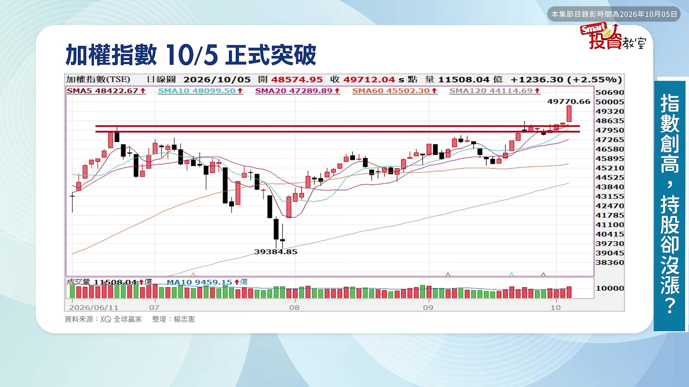
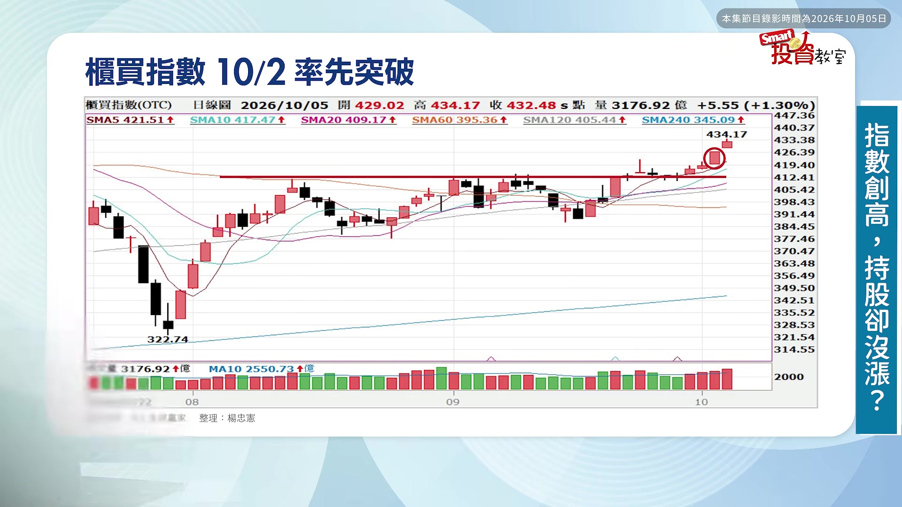
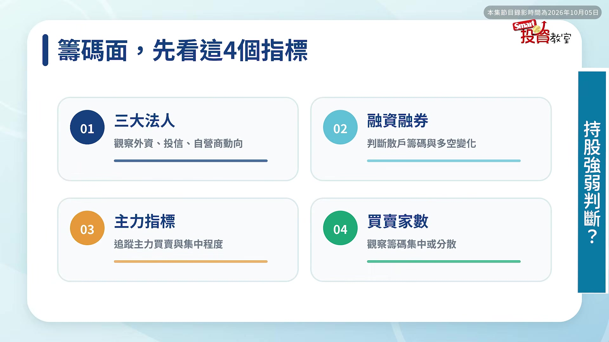
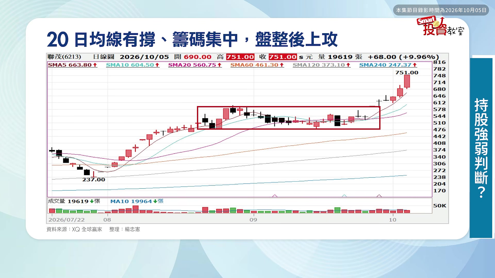

# smartmonthly-bw_AfB6x3Qzftg — 關鍵畫面索引

- 來源逐字稿：[smartmonthly-bw_AfB6x3Qzftg_GT.srt](smartmonthly-bw_AfB6x3Qzftg_GT.srt)
- 影片：https://www.youtube.com/watch?v=AfB6x3Qzftg
- 截圖數：10

## 00:00:07

**逐字稿片段：** 已經快要破5萬點了 可是為什麼 很多人的心聲 跟我一樣 覺得我的股票 沒有漲呢 台股在創新高 可是我的持股 卻在創傷 大盤紅通通 只有我的打開來 是綠油油這樣 到底現在 這波行情 有沒有可能 雨露均霑 大家都漲到呢 那到底我的持股 或是觀眾朋友的持股 是還沒有輪到 還是它可能 已經轉弱了 所以今天呢 我們邀請到 K線捕手 楊忠憲老師 現場幫大家解惑 仲葳好 各位觀眾大家好 台股在創新高 然後也都快要 突破5萬點了 到底我的持股是 怎麼回事 為什麼它沒動 是套牢了 轉弱了 還是我看不懂行情 它還有發動的可能 OK 好 那我們先把這個問題 稍微分切割開了 那我們第一個先看這個 指數的部分 好 那我們說 其實我們在技術分析 有很精確的詞 就是創高跟突破 對創高跟突破 是有點距離的 對就是說 創高只是它過高了 可是突破是它真的 穩定了 它已經要往上走了 對那我們這個 加權指數它其實在 10月5號之前 它沒有有效的突破 它只是創高 對所以到10月5號 之後才正式的突破 對那所以說

**話題推測：** 提出大盤指數已接近5萬點，可能顯示大盤走勢圖。

---

## 00:01:26

**逐字稿片段：** 我們當然我們櫃買指數 在10月2號 那邊就已經開始突破了 所以說 我們上個禮拜的時候 你會感覺到 中小型股開始 慢慢比較活潑了 對但是權值股休息 對所以會有這個 輪動的現象 所以說 那就要看你當時 買的股票是哪一種了 對如果說 這個時候主流輪動 是在中小型股 那你就買中小型股 那當然就跟著動了 我就會跟著喜氣洋洋 可是如果說這個時候 漲的是加權指數 那都是漲權值股 那你的股票就不會動 就是叫做市場窄化 就比如說有100檔股票 假設只有10檔股票在漲 就只有十分之一 所以我們叫做窄化 就是那個市場寬度 比較小 好那如果說 有三成甚至到四成 股票都在漲 就是寬度比較夠 那你會發現我們在 上個禮拜的時候啊 我們這個 上漲的各這個 不管是短期或中期的 多方股票 其實都大概兩成多 三成多 所以還是蠻窄的 是對可是到這個禮拜

**話題推測：** 提及「櫃買指數」已於10月2號突破，可能顯示櫃買指數圖表或與加權指數比較圖。

---

## 00:02:17

**逐字稿片段：** 就感覺不一樣了喔 這個短線的 已經到四成了 那中長期的 已經到三成了 就是很明顯的 漲上來 所以必須這兩個 指數的表現跟 這個結構 都改善了 那這樣子我們 的這個散戶會比較有感 就是說這個行情 真的上來了 沒錯沒錯 那我們來看一下 圖的部分 那我們看到這個 大漲的這一天 漲了1000多點 好所以這個才 這個時候什麼 才叫做有效的 這根才叫做有效突破 就是10月5號那天 對那可是上個禮拜 這個地方叫什麼 這個只是叫做創高 所以你會感覺到說 曇花一現 漲完就熄火了 所以說這一根 你才會覺得 比較有感

**話題推測：** 提及本週短線多方已到四成，中長期到三成，可能顯示統計數字圖表。

---

## 00:02:53

**逐字稿片段：** 好那如果是中小型股呢 你會發現為什麼 上禮拜就開始有感覺 因為你看 連續漲了三四天了 對 從上禮拜大概三四五 這樣就連著漲過來 所以說它會表現得 比較穩健 中小型股先漲 不過目前為止的話 都是屬於健康輪漲的 過程 我覺得是OK

**話題推測：** 話鋒轉向「中小型股」，可能切換到中小型股的走勢圖或相關數據圖表。

---

## 00:03:10

**逐字稿片段：** 好再來就是 我們剛剛提到 這個所謂的這個 均線多空比的概念 就是短線多方個股 你看上個禮拜 多方排列股票才28點多 那這個中長期的才20% 所以說很少 才才兩成三成 可是這禮拜不一樣喔 你看短線多方 已經到40了 對那中長期的 已經到三成 所以說這個結構上 就相對的很強 所以感覺我們現在 整個市場趨勢 應該確實像是 指數會持續創高 往這個方向走上去 所以多頭的股票 也開始慢慢變多了 所以我也不用太著急 說不定我那個綠油油的 馬上就有機會翻紅了 所以接下來我們可以 抱持比較樂觀的心情 真的有可能會遍地開花 雨露均霑嗎 以目前情況看是這樣子 對我們等一下會講到 多頭看支撐這件事 我再跟大家聊 OK 好所以相信很多人 現在最在意 或最煩惱的 一定就是說 大盤漲了 可是我的股票沒漲 像我剛剛提到嘛 我的還綠油油 那我這時候 就要開始想了 我的到底是 短期的被套牢呢 還是還沒輪到我而已 我要續抱 等待它蓄勢待發 旭日東升的那一刻

**話題推測：** 提出「均線多空比」的概念，可能顯示均線多空比的圖表或數據。

---

## 00:04:20

**逐字稿片段：** 那我們在檢視一檔股票 其實要看很多指標啦 不管技術面籌碼面 大概會有十多個 那我們這邊講最簡單 常用的 就是說 第一個就是我們說 會先看籌碼面 那籌碼面基本上

**話題推測：** 開始講解檢視個股的指標，可能顯示相關指標列表或簡報頁面。

---

## 00:04:31

**逐字稿片段：** 我的習慣會看 四個主要指標 就是看三大法人 然後再看融資融券 再看主力指標 跟買賣家數 看這四個 這樣就可以了 簡單的 好那如果說 籌碼還集中 好再來就是你 指數在盤整 可是你的20日線還上揚 只要具備籌碼集中 20日線還在上揚 那這檔股票你 就不用太擔心 整理完之後基本上 會往多方前進 好可是如果反過來 你的股票是籌碼分散 而且20日線已經下彎了 那你要小心說 這個可能隨時會 跌破盤整區間 對所以要看這種情況 甚至已經做頭的 就要更危險

**話題推測：** 提及看籌碼面的「四大主要指標」，可能顯示這四個指標的名稱列表。

---

## 00:05:06

**逐字稿片段：** 好那我們來看一下 這兩個很標準的個案 剛好剛好顛倒 好一樣的 像聯茂 它之前是不是還在盤整 對可是盤整過程中 20日線 20日線 就是這條粉紅色的 對 是不是還在上揚 是 對那這個時候你 就不用太緊張 那加上它籌碼 雖然法人有賣一些些 但是賣不多 所以這種我們都 還可以接受 那所以它後來還有機會 往上走

**話題推測：** 明確表示「我們來看一下這兩個很標準的個案」，預期畫面切換到兩檔股票的走勢圖。

---

## 00:05:28

**逐字稿片段：** 好可是反過來像這一檔 好你看盤整過程中 哇這條粉紅色的20日線 很明顯的是下彎了 已經下彎了 對那隨時你要小心 這個可能會跌破 而且它籌碼非常弱 所以說就是兩個 很典型的不同的 一個多一個空 可是很多人 聽到這裡可能開始 又會想說 既然弱的要處理掉 那我當然希望 那把這個已經轉弱的 賣掉 然後呢 去往新的 比較強的標的去前進 可是有沒有可能說 現在因為股票輪動的 這麼快 我才剛剛準備好 要買的 結果一追 它就開始跌了 或者是我才剛把 我覺得要轉弱的賣掉了 可是誰知道 我一賣掉它就漲起來了 這是散戶常遇到的狀況 有沒有可能就兩頭空 就是我們常講說 書上都教我們要 汰弱留強對不對 結果我把弱的賣掉 弱的就漲上去 我把強的賣掉 把強的追上去 結果它就掛了 對不對 我們說汰弱留強這件事 本質上是沒有錯啦 只是說你應該有一些 更嚴謹的條件 那我們先講第一件事 就是說 這個強勢股 那跟漲多股 其實它通常是 同一件事情 對因為強勢股 一定是漲多了嘛 對不對好 但是問題是 漲多的強勢股 它有幾個現象 出現的時候 你要稍微留意一下

**話題推測：** 舉出另一個反向的個案，顯示另一檔個股走勢圖。

---

## 00:06:41

**逐字稿片段：** 第一個就是 有沒有出現正乖離過大 對就是短線急漲過熱 好二個是什麼呢 上漲過程中有沒有 出現價量背離 對那如果 沒有價量背離 那就OK 就是屬於價漲量增 很穩健的狀態 也不用擔心 好再來第三個就是 我們剛剛講的 上漲過程中籌碼也都是 很健康 法人還是繼續買 好只要具備這三件事情 那強勢股還有機會 持續維持多方續漲的結構 對 所以也不用因為 擔心它已經漲了 好長一段 就不敢再繼續追 其實它還是有空間的 還是有空間的對 好那再來 就是你剛剛提到 說說 有沒有怎麼避免說我們 把這個 剛好顛倒 我們汰弱留強 剛好顛倒 對變成汰強留弱了 對好那這時候就要回到 我們這個在上課 或者我們在 上課訂閱分享會 常講的一些 技術分析的濾網 好像我在個人在做這個 過濾的時候 我大概會有十幾個 技術分析工具 對那其實 這樣子整個跑一輪下來 你就可以幫股票打分數 對那通常股票如果能夠 具備八分以上 那基本上是安全的 對那如果你要去做 加碼的動作 至少要8.5分 甚至九分 這種股票才能夠買 對 所以說不能不是說 你看到一檔股票 或聽到一個消息 或者是看到一個新聞 或者是出一個財報 你就衝進去了 這樣是很危險的 簡單講一下 就是有幾個 主要的工具 第一個就是 我們講說第一個 就是趨勢嘛 就是第一個 你要多頭趨勢 第二個是你不要漲太多 位階不要太高 我們說漲高 漲多就是最大的風險嘛 對不對 好那再來是型態 我們希望是最好是 底部型態剛剛漲

**話題推測：** 開始講解判斷強勢股的三個現象，可能顯示簡報列表。

---
