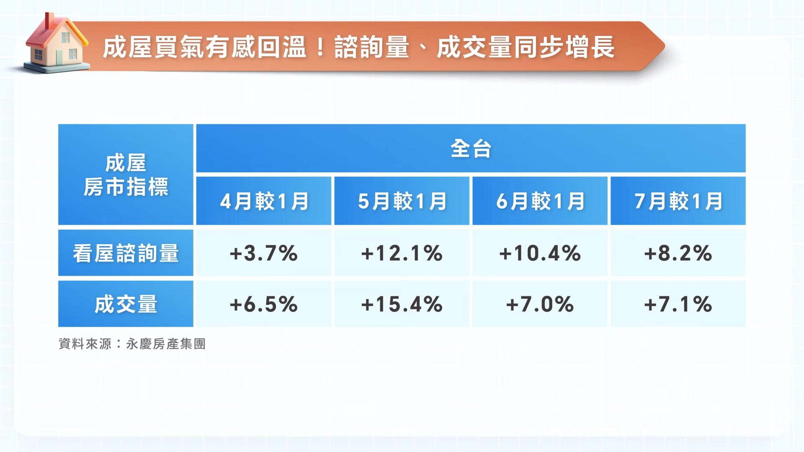
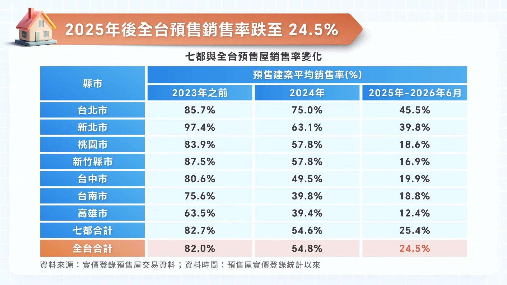
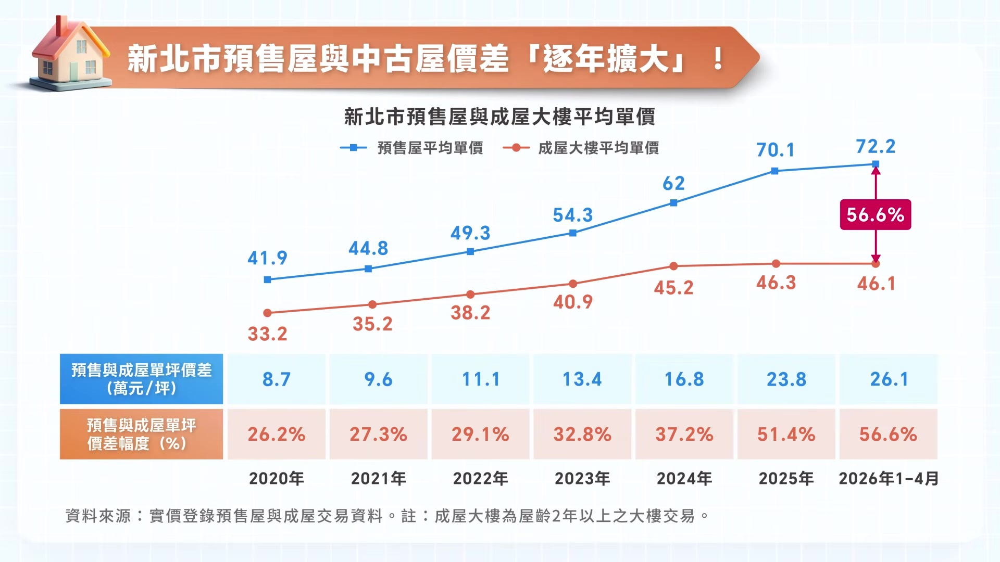

# smartmonthly-bw_HLeipjrNbik — 關鍵畫面索引

- 來源逐字稿：[smartmonthly-bw_HLeipjrNbik_GT.srt](smartmonthly-bw_HLeipjrNbik_GT.srt)
- 影片：https://www.youtube.com/watch?v=HLeipjrNbik
- 截圖數：16

## 00:01:33

**逐字稿片段：** 這個青安3.0的優惠貸款 它主要是要優先支持 就是目前沒有房的 首購族 然後讓這個房屋買賣 能夠回歸到 自住的一個需求 我們可以從最近幾年的

**話題推測：** 提及「青安3.0」優惠貸款

---

## 00:01:44

**逐字稿片段：** 這個建物買賣移轉棟數 來發現市場確實 跟之前比起來 是明顯的降溫了 那六都的都會區 在2025的上半年的 買賣移轉棟數 年減幅達到26% 那2026上半年 也還有在相對微降了 大概3% 所以減這個減幅 已經有大幅的收斂 所以從這一年半看來 整體的房屋市場 應該整體趨於 比較穩定的一個現象 但是協理 我還是想要再請教 因為你剛剛的圖表裡面 我們雖然說看到這個 買賣移轉棟數 是有往下滑 然後你也說到 會趨於穩定 但是我們身邊很多的 朋友都開始在看房子 實際上到這個房市 這樣進去看 沒有感覺穩定

**話題推測：** 提及「建物買賣移轉棟數」

---

## 00:02:28

**逐字稿片段：** 到底這個買賣移轉棟數 它這個組成分是什麼 那其實在整個不動產的 買賣移轉棟數裡面 它裡面包含了幾個成分 第一個是成屋的交易件數 那另外也包含了 預售屋完工後的交屋 所以預售屋也在裡面 那另外還有就是 一般民眾自己 會有些自售 自己買自己賣的 這樣的一個件數 整個都包含在這個裡面 所以你很難直接從 數字的反應就看出 實際現在成屋市場的買氣 那所以也讓 成屋市場的市況 跟現階段的 建物買賣移轉棟數的數字 看起來會有些脫鉤 那我們這邊

**話題推測：** 探討「買賣移轉棟數」的組成成分

---

## 00:03:04

**逐字稿片段：** 用永慶內部的 這個指標數據來看 那其實在今年2026的 第2季的整個房市 已經有出現明顯回溫的 一個現象

**話題推測：** 導入「永慶內部指標數據」

---

## 00:03:13

**逐字稿片段：** 我們來看這張表 我們排除掉 今年農曆年 我們的這個 因為有年假的因素 我們以1月份完整的 整個月來當作基準 我們把1月跟5月 還有6月的 房屋的看屋諮詢量 來做一個比較 其實已經有增加 超過1成以上了 分別是12.1% 跟10.4% 那而且 不只在看屋人變多 我們再看5月跟6月的 實際的成交量 也跟1月比較 分別增加了15.4% 跟7% 這數字都說明了 從整個房屋不只 諮詢量的提升 其實從後端的成交 也明顯有一些增長 也顯示 這幾個月的房屋的買氣 其實已經有明顯的提升 非常感謝協理帶來 市場上這麼即時的 一手的資訊 看來今年的買氣 確實是有在回升 Amy說的沒錯 那我們這邊也準備了

**話題推測：** 講者提示「看這張表」

---

## 00:04:04

**逐字稿片段：** 永慶房產集團內部的 成交數據 來跟觀眾朋友做分享喔 我們看 從今年的第2季開始 那整個交易的量 成長是相對有感 我們把4月的成交年增 是17% 那5月的年增是23% 那6月也維持年增 有16%的表現 所以整體 跟去年比較起來 其實相對是 明顯的成長 那如果接下來的整體的 經濟能夠維持 穩健的成長 而且我們出口一樣維持 現在的這個暢旺 另外是台股繼續維持 在這個高檔 我們推估在2026年的 第3季的房市的交易量 應該還是有小增的機會 所以整體這樣來看的話 我們現在的成屋市場 是有逐漸在回溫了 然後成交量也是彈升了 那預售屋的市場 現在表現又是如何

**話題推測：** 導入「永慶房產集團內部成交數據」

---

## 00:04:52

**逐字稿片段：** 我們就從預售屋的 實價登錄的數據來看 我想整體預售屋 在這2年買氣 確實有變得比較冷清 那我們也分析統計了 今年1到6月的 預售屋的實價登錄 我們看到每個月平均 大概只有3000件左右的成交 這樣子的話 這2年預售屋 它的交易量真的 是會很不樂觀了 對嗎 我想回歸到這次 政策的本質 它就是要降低房地產的 投機炒作 所以第一個就是投機客 已經大幅度的退出 這個預售的市場 第二個 也因為政策的關係 有些自住的買方心態 也會轉為比較觀望 那所以預售屋市場的 這個買氣確實就 因此受到了影響 那也因為整個去化速度變慢 所以整個預售屋 在市場的待售庫存 是持續的增加

**話題推測：** 導入「預售屋實價登錄數據」

---

## 00:05:37

**逐字稿片段：** 那我們準備一張表 跟觀眾朋友也來分享 我們從數據來看 全台在2023年以前 推出的預售屋的 建案銷售率 都有突破8成 我想各都大概都落在 這個地方 那2024年的 第七波信用管制之後 我們看得到買氣 大幅的減少 那預售建案的銷售率 也掉到5成 2025年以後的預售 這個建案的銷售率 更只剩下2成多

**話題推測：** 講者提示「準備一張表」

---

## 00:06:04

**逐字稿片段：** 那我們來細看 七大都會區的銷售狀況 除了雙北市 因為這個自住的需求 相對比較強勁 那加上供給的量 也比較少 所以還勉強維持 有在4成的銷售率 那其他我們看從 桃園以南 這2年的銷售率 平均都不到2成 這個數字 真的非常的驚人 代表說很多的預售屋 建案開出來 可能賣不到2成 這個買氣就凍結了 而且 大家不敢買預售的原因 應該就是價格開了 實在是太高了 已經高不可攀了 而且也聽說就是 這個雙北市場的 這個成屋和預售屋 它的這個價差 已經足足可以快要 買一台國產汽車了 到底為什麼這個價差 會這麼大

**話題推測：** 細看「七大都會區的銷售狀況」

---

## 00:06:48

**逐字稿片段：** 我們這邊也準備了 台北市今年的預售屋平均單價 來跟觀眾朋友分享 我們看到2026年 1到4月的預售屋 平均單價是落在130萬元 那我們看另外一條線 是針對成屋 成屋的大樓 大概只有82萬元 這一來一回單價就差了 48萬元 我想價差幅度 逼近到了6成 如果把它轉換成 購屋的總價 我們用30坪的房屋 來做計算 30坪乘以48萬元 價差就將近1500萬元 我想這樣的價差 對購屋族來講 確實是 不小的一個負擔 這個48萬元是 不知道怎麼來的 真的很驚人

**話題推測：** 導入「台北市預售屋平均單價」數據

---

## 00:07:25

**逐字稿片段：** 那我們再來看一看新北市 我們看一下 這個新北市的價差 它的差距 有沒有比較縮小一點 我們來看

**話題推測：** 轉換分析「新北市」的預售屋與成屋價差

---

## 00:07:33

**逐字稿片段：** 新北市的這一張表 一樣我們在今年1到4月 新北市的預售屋 平均單價 落到72萬元 那成屋的大樓是46萬元 一樣來回價差的 有26萬元 這個幅度 跟台北市比起來 差一點點 但是其實也已經 逼近了6成的價差 那我想我們觀眾 應該有看到 我們剛剛的那兩張的表格 那這個預售屋 跟中古屋的價差 真的是逐年在增加擴大 那協理可以幫我們 來分析一下 到底這兩條線 為什麼會價差 這麼的巨大 沒有問題

**話題推測：** 講者提示「看新北市的這一張表」

---

## 00:08:07

**逐字稿片段：** 那我想 建商它在推預售屋 有幾個考量點 我想第一個 它在訂價的時候 就土地成本 還有營建成本 那再來就是人工成本 當然另外它最重要 它的合理的一個利潤 那現在從土地建材 跟人工成本 是越來越高 那建商要能夠主動讓利 我想這個狀況會比較少 那所以它整個 整體的價格彈性 相對就比較小 所以預售的價格 它不容易往下走 那我們反觀成屋市場 最大的優勢是什麼 因為每個案子 每個房屋出售的 業主都不同 動機也不同 那所以它的價格彈性 比較大 也能夠比較快速反應 現階段市場的一個變化 那回到消費者買房的 角度來看 成屋它能夠買到的坪數 會比預售屋買到的坪數 來得大 因為單價的差異 那所以 這以上這些條件也讓 近期的成屋市場 會比預售屋市場的 這個表現 來得穩定 沒錯 按照現在當前市場 這樣的風向 就是買方的一個需求 換成是我的話 我也會選擇 這種看得到又摸得到 然後價格又相對親民的成屋 我再來還是想要 再來問問看協理 因為畢竟每個人買房 他的需求會不一樣 所以就是

**話題推測：** 分析預售屋與成屋價差巨大的原因

---

## 00:09:18

**逐字稿片段：** 針對像接下來 要買房子的人 他們在看預售屋 然後看成屋 協理 可不可以再給我們一些 買方的建議 然後或者是 是不是可以善用 像青安3.0這樣的政策 OK 我想不管是選預售屋 或中古屋 其實這都沒有好壞 沒有對錯 那主要關鍵在於 消費者在買房之前的 從對資金的準備 還有入住的時間 還有對屋況的接受度 以及未來能不能承擔 在預售屋交屋時候的 一些不確定性 那如果是想要 買成屋或中古屋 目前我們建議消費者 是非常好的 進場看屋的時機 那也是詢價的 一個好時機 那目前整體 中古屋的房價 相對是比較穩定 那甚至有一些部分 供給可能比較大的區域 它價格 有些小幅度的修正 也比較明顯 那價格相對也比較友善 再加上現在 整體市場的供給量 是屬於大的 那對於有 自住首購需求的買方 非常適合這個時候 出來看房子 它也有足夠的時間 能夠看充足的房子 再來做最後的決定 那如果他是 想要買預售屋 那我們建議消費者 就是多看多比較 雖然買預售屋 確實前期的負擔 因為施工期長 負擔比較輕 但是交屋之後 就直接面臨到了付款 跟每個月要還貸款這件事情 那就要精算清楚 避免交屋之後 有資金上面缺口的風險 那看屋前 同時也要慎選 有口碑 以及施工品質好的建商 也避免買到了爛尾樓 沒辦法交屋 或交屋的時候 整個品質不如預期 那尤其在各區 在各建案的銷售情形 決定之前不需要太衝動 還是符合多看多比價 然後再積極的議價 爭取自己合理 以及能負擔的價格 那不過 還是要提醒消費者 那中古屋 是看得到也摸得到 它不需要等 兩三年的這個施工期 然後如果 對於坪數的 需求量比較高 或是重視生活機能的 不妨利用這個時間 優先考慮 中古屋跟成屋 會更能夠符合 自身的一個需求選擇 謝謝協理 真的是非常實用的建議 那我還是要 再請教協理 因為我們現在時序 已經來到了第3季了

**話題推測：** 針對預售屋與成屋買方提供建議

---

## 00:11:30

**逐字稿片段：** 那接下來下半年 我們有沒有 哪一些的關鍵因素 都要持續的來關注 會不會還有什麼 會來影響到我們房市 那目前 有3個關鍵因素 要提醒觀眾朋友 能夠掌握 第一個就是政策 第二個是房貸緊縮 第三個就是通膨 我們要注意 在房市的政策 有沒有維持 或是有新的政策出來 第二個 銀行現在有沒有錢 來做放款的部分 第三個就是通膨 是不是穩定的狀況 那這些都會影響 下半年房市的一個表現 那對一般的民眾來說 其實在央行 選擇性信用管制下 銀行現在是 自主的風險控管 那對於房貸的審核標準 還是相對的嚴格 那貸款的成數 以及利率的條件 也是相對的受限 當然能不能如期的貸款到 你所需要的成數 這個還是要 事先先做查詢 那這也是 目前在買屋的消費者 他優先要去 注意的幾個點 那不過央行 它對於換屋族的貸款成數 有小幅度的鬆綁 那另外財政部 也推出了青安3.0 可以持續的 支持首購族 那預估未來整體的房市 會轉趨穩定而且健康 非常謝謝協理 這麼多的 這個房市的分析

**話題推測：** 討論下半年房市的關鍵影響因素

---

## 00:12:45

**逐字稿片段：** 還有建議 那我們就來總結一下 今天的節目內容 在央行 還沒有鬆綁 這個信用管制之下 買方購物決策 仍然是趨向於保守的 因此相較於變動性高 房價又持續創新高的 預售屋 成屋 反而是看得到又摸得到 價格 又親民(將近6成) 所以買方 在資金有限的情況之下 自然就會轉向 相較於這個市場 比較友善的成屋 那永慶房屋 也預測2026年的第3季 成屋市場也即將呈現 量小增、價平的走勢 未來市場 還會如何的變動 我們就要來緊盯 持續的關注 政策有沒有改變 銀行有沒有錢借 還有通膨會如何的來變化了 Amy說的完全正確 那接下來只要消費者 掌握這三大核心 就能夠精準的對應 接下來的市場變化 非常感謝協理 今天所帶來的 這麼精彩的趨勢分析 還有數據的解讀 想要掌握 最精確最核心的 房市資訊 一定要記得 鎖定《房產關鍵字》 再次謝謝協理來到 我們今天這裡的節目 那我們就下次見 謝謝協理今天的分享

**話題推測：** 節目總結

---
