# smartmonthly-bw_LKAYiw41EZg — 關鍵畫面索引

- 來源逐字稿：[smartmonthly-bw_LKAYiw41EZg_GT.srt](smartmonthly-bw_LKAYiw41EZg_GT.srt)
- 影片：https://www.youtube.com/watch?v=LKAYiw41EZg
- 截圖數：30

## 00:00:00

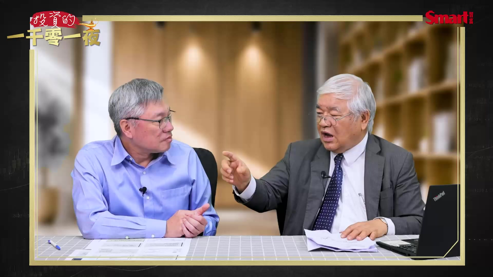

**逐字稿片段：** 2028年的2到5月 我抓8萬點 如果萬一真的到8萬的話 台積電會漲到5000元嘛 各位觀眾朋友 末升段是8萬點 大家好 歡迎再次收看 投資的一千零一夜

**話題推測：** 提出未來市場預測的時間範圍

---

## 00:00:19

**逐字稿片段：** 我是峰哥 最近台股 陷入一點膠著 因為好消息不多 但是負面的消息 倒是滿多的 可是台股也還滿堅強的 就在這裡面的 低量過程中 也不太跌 所以今天 我們就請到了 杜大師來 先跟大家打個招呼 峰哥 各位觀眾大家好 杜大師來 大家都開心了 所以今天又有 很多問題 我們都要幫大家問一下 第一個就是 大家現在最關心 說好美國本來 是說什麼時候要降息 像現在變成 美國快要升息了 那在這個狀況下 大家就擔心 因為升息 就對股市不利嘛 那所以我們之前一直講 台股要看5萬點 那到底是年底 就可以看到5萬點 還是說要等到明年了 你問這個問題的話 前2個禮拜 我一定會說中秋節 很有希望 想不到 從4萬7500多點 差600多點（與前波歷史高點相比） 就差那麼一點點而已 一口氣 到我們錄影的時間已經 高低點差2000點了 就是還是一個箱型 所以我大概 那個規畫的時候 我就一直說 目前我們最低點是 大概4萬點 4萬3382點 那到明年5月份 抓比較寬一點 一定會到5萬點或是 我規畫是5萬3000點 所以回答峰哥的話是說 應該是說 因為我們現在 3Q快要結束了 因為3Q我們 6月份的收盤 跟8月份的收盤是一樣的 先跌6% 漲6% 所以收盤價是一樣 9月份現在 白忙一場 9月份現在好像 本來是漲 後來這幾天又跌下來 搞不好剩下半個月 會不會收一樣 所以整個3Q就是 在橫向盤整 那我認為 大概有兩個點 一個是10月12號 一個是11月28號 六都選舉 那10月12號 因為我們 雙十節放假嘛 補假 所以10月12號 大概會不會一個低點 因為我們早期4年前 8年前 六都選舉的話 都是10月 雙十節附近是低點 所以大概看那邊 會比較明朗化 大概我是估的 那我認為 過不過都沒關係 因為很多人都中秋變盤 我是認為 元旦到1月9號（口誤）是2萬9嘛 那現在我們到 最近差一點點 快要創新高 回檔 那你回不回 或是說中秋完以後 我是認為還是一個箱子 我們現在箱子是

**話題推測：** 開始討論台股的近期走勢和現況

---

## 00:02:54

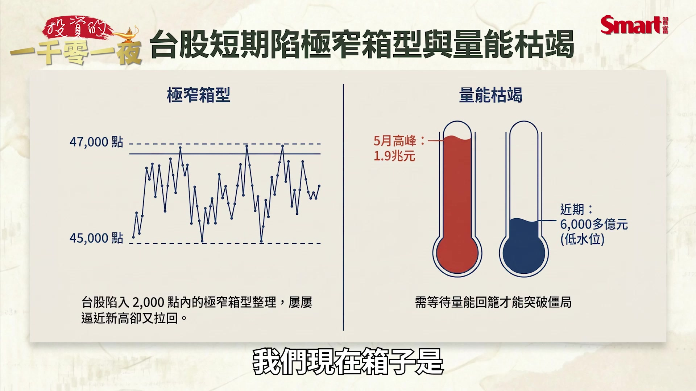

**逐字稿片段：** 最近是4萬5000點到 4萬7000多點 很窄很窄 而且最主要是量縮 我們今天錄影的時間 好像6000億元是 今年的最低量 因為大家錢都去抽（股票申購）

**話題推測：** 說明近期台股的盤整區間

---

## 00:03:07

**逐字稿片段：** 5月的時候有1.9兆元（口誤） 差很多 可能錢去抽 那個漢測 大家都錢去抽 包括我在內 一張要200萬元 大家都很有錢 包括我在內 所以大概17號 錢就會還我們 如果說 17號量還沒有再出來 那就代表說 你在因為 美國是11月3號 那個期中選舉 我們是11月28號 搞不好那個盤整 又再拖一陣子 那老師你現在就用 波浪理論來看的話 你現在的這個主升段 跟末升段這個 看法跟原先一樣 還是會有調整 我這一次調滿多的 調滿多的意思 大概有兩個 一個是 我們到那個2Q財報 公布完以後 獲利很好 那現在有一家 外商 他已經打第一槍

**話題推測：** 提及過去市場大量能的數據作為比較

---

## 00:03:56

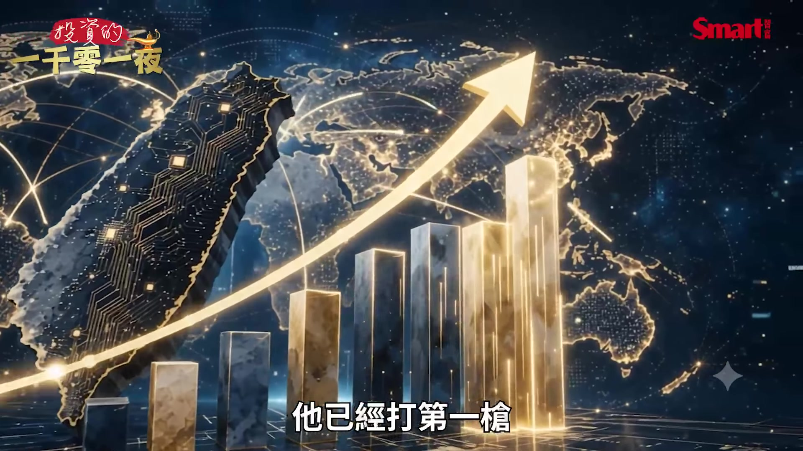

**逐字稿片段：** 說5萬4000點 他說年底 因為我們的字卡5萬3000點 他看峰哥的節目說 5萬3000點不好意思講 5萬3000點 他講5萬4000點 硬就是要 比我們多1000點 對好 另外他有提兩個

**話題推測：** 引用外資對台股指數54000點的預測

---

## 00:04:09

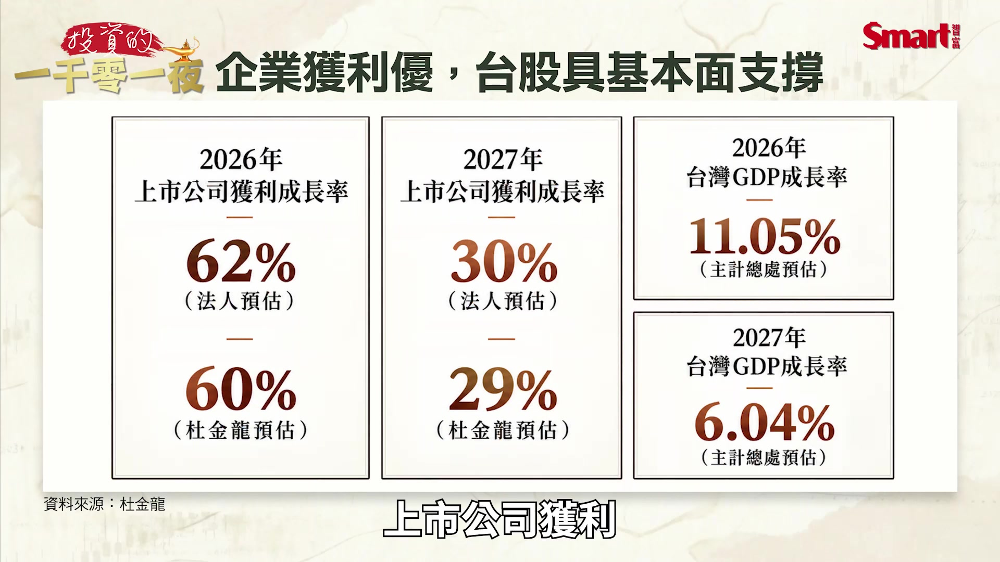

**逐字稿片段：** 上市公司獲利 今年會成長62% 我們在這邊講60% 他也不好意思用62% 明年它（上市公司獲利）成長30% 我們是講29% 那另外GDP大家都一樣 1Q15% 2Q12% 3Q11% 整年度是11%GDP 那明年6% 所以因為這兩個因素 所以我們把 那個波浪理論 上次來的話 我們認為5月份是 5萬3000點 括號6萬點

**話題推測：** 提出上市公司今年獲利成長的百分比預測

---

## 00:04:37

**逐字稿片段：** 你看到我現在新版本 把它弄到 明年5月份是主升段的結束 也是一樣 所以時間往後 那再來就是 到那個5萬3000點 6萬點 完以後 休息5個月 那也大概3萬9384點 再來漲8個月 所以字卡用到

**話題推測：** 明確提到波浪理論的新版本圖表

---

## 00:04:56

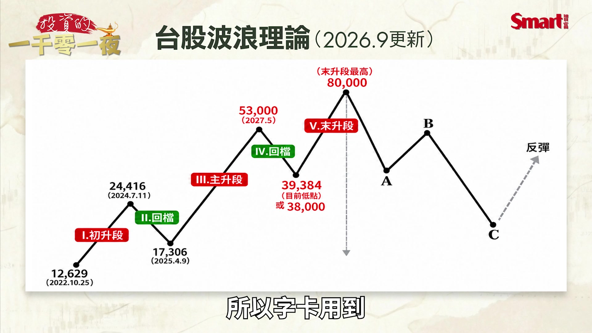

**逐字稿片段：** 2028年的2到5月 選總統 那現在這個版本 從9月大家會做法說會 不是法會 完以後 我抓8萬點 8萬點怎麼抓你知道 因為我們初升段從

**話題推測：** 詳細說明波浪理論預測的2028年時間範圍

---

## 00:05:11

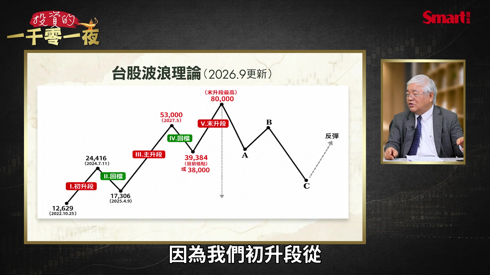

**逐字稿片段：** 1萬2629點漲到 2萬4416點 以前都說 漲1萬1200多點 我們現在用倍數 漲1.9倍 那回了61%回到1萬7306點 本來我們到今年 不是漲到4萬8000點嗎 我們現在的字卡 到明年5月份漲到 5萬3000點就漲到三倍 因為5萬1000點除以1萬7000點 大概三倍 所以我們主升段 就漲三倍到明年5月份 再回25%回到3萬9384點 大家記得4萬點 那初升段是2倍 末升段2倍 所以8萬點 就這樣算出來 8萬點 各位觀眾朋友 末升段是8萬點 拍投影片要這樣 那這裡面的話規畫就是 初升段2倍 主升段3倍 末升段2倍 那主升段的話 那個5萬3000點就是

**話題推測：** 提供波浪理論初升段的歷史點位數據

---

## 00:06:03

**逐字稿片段：** 我們上次講 台積電會漲到3000元 那如果萬一真的到8萬點的話 台積電會漲到5000元嘛 因為老早有一個人 不是說5000元 EPS台積電

**話題推測：** 預測台積電在53000點指數下的目標價

---

## 00:06:13

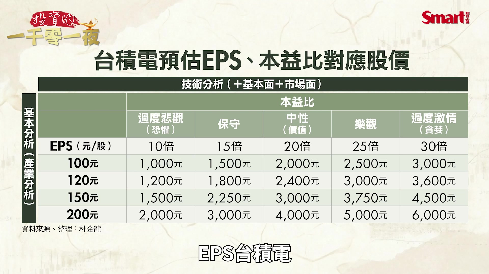

**逐字稿片段：** 200元乘以25倍5000元 台股如果真的要漲到 8萬點的話 台積電一定要到 快5000元才行 即使台積電5000元的話 大盤要漲到8萬9000點 我是比較保守寫8萬點 因為整數關卡 所以我們從今天開始 我們的版本

**話題推測：** 說明台積電5000元目標價的計算依據

---

## 00:06:29

**逐字稿片段：** 你看 這個叫新版的波浪理論 那回答剛才峰哥的問題 就年底會不會5萬點 沒有關係 我們認為 我們這一波就是 現在本來我們認為 今年是主升段的結束 我們現在延到明年5月 延伸了 主升段到5月 因為5月份是一個 很重要的東西 就會費波那契的

**話題推測：** 再次強調波浪理論的『新版』分析

---

## 00:06:47

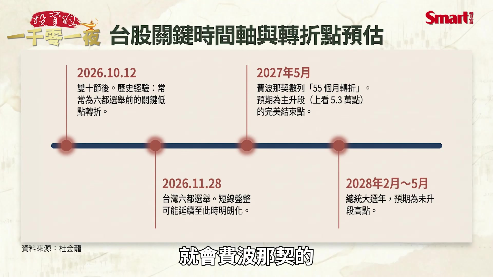

**逐字稿片段：** 55個月的轉折 所以我們還是要尊重它 只是說把那個高點 往後延 那幅度往後 那時間為什麼要抓 2028年2到5月 因為我們台灣 股票的高點 你看峰哥 民國89年 1萬2629也是2月12號嘛 1萬393點也2月多 所以我為什麼擺 那個高點是選完總統的 2到5月份 這是我擺的一個技巧 所以我們現在新的版本 就是這樣 那這個是我們新的版本 希望我們真的能看到 更高 那這裡面的話 主升段的量 剛才峰哥有講 最高1.2兆元

**話題推測：** 引入費波那契55個月轉折的技術分析概念

---

## 00:07:27

**逐字稿片段：** 1.9兆元（口誤） 1.9兆元（口誤）加OTC 兩個大概2兆元 那我們認為末升段 會3兆元 那融資餘額

**話題推測：** 修正並提供主升段的市場量能數據

---

## 00:07:35

**逐字稿片段：** 我們現在不是6300億元嗎 我們的末升段 融資餘額會 大概1兆元 因為現在證券商 因為要兩倍點數 就要兩倍的這個融資 現在證券商不是 辦理現金增資要融資嘛 所以大概有 對啊它們如果不現金增資 會沒有錢可以融給你 對啊都好賺 像今天的抽籤

**話題推測：** 提出目前融資餘額的數據

---

## 00:07:55

**逐字稿片段：** 他們每個人收我們20元（申購處理費） 多好賺 所以我們 這個新版的 那個波浪理論就這樣 那我們目前 大概就是說 我們這一次漲了 那個3萬1000多點 回了18% 我們回到7月30號 真的回得慘兮兮 大盤雖然跌18% 可是很多電子股 有的回6成多 因為它在7 8月 有兩個類股 把電子股的點數吃掉 塑化 塑化1到8月漲多少 漲170幾% 170幾%嚇死人 那金融股最近在漲 所以最近也在漲 那有少數電子股 會回了 我們的三台一發 好像只有 只有台光電創新高 台積電（距離前波高點）差30元 台積電就上上下下 聯發科 差一點點 那我的台達電 真的很可憐 所以我們目前盤勢 就按照我們現在 新的波浪理論這樣規畫 老師那我想請教一下 因為我們剛才講 最近金融股 很強勢嘛 主要也是大家認為 可能美國有機會升息 台灣也有機會升息 所以金融股 就比較強勢一點 可是 因為如果真的升息 萬一美國今年內 真的升息的話 你覺得台股真的會 會不會因此會 回檔的幅度會更大一點 我對於 那個升息的觀念是這樣 因為升息就代表 經濟走強 所以剛開始升息 因為我們在錄影的時間 要升不升 大概都知道 只要它第一槍 我開出去完以後

**話題推測：** 提及證券商在抽籤時收取的費用

---

## 00:09:25

**逐字稿片段：** 那個Fed的升息策略 那個列車就開始啟動 就一次兩次三次 那一般 剛開始升息的時候 股市會回跌 因為尤其那個

**話題推測：** 開始分析聯準會升息策略對股市的影響

---

## 00:09:37

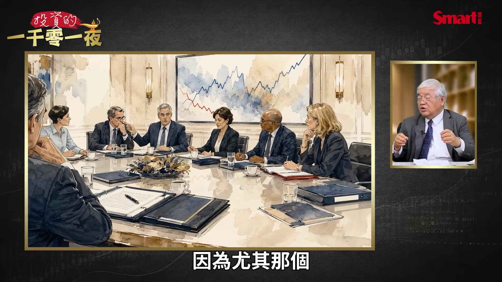

**逐字稿片段：** 費城半導體指數 所以你看到我們 這一次像峰哥講的

**話題推測：** 提及費城半導體指數的表現

---

## 00:09:42

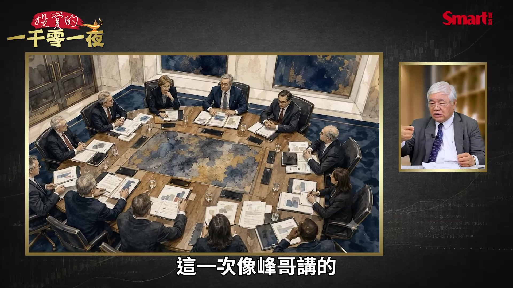

**逐字稿片段：** 只有道瓊創新高 8月5號 標普創新高嘛 那費半 費半比較弱 都是因為它 如果升息對它影響比較大 而且最近不是 幾個大咖說

**話題推測：** 比較道瓊與標普指數的近期走勢

---

## 00:09:53

**逐字稿片段：** 我這個AI 我們要慢一點 最好是講真的 不要叫別人慢一點 自己偷跑 對 還好他沒有說 我要暫停 慢一點是說 本來這個利多 馬上要實現 我拖久一點 所以我把它當作說 因為它們獲利 沒有 稍微有延遲的東西 所以慢一點 讓那個最近的科技股 稍微回一下 剛好符合老師剛才講說 主升段延長了 因為它們要休息一下 所以AI休息一下 再來就是說 利率調高的話 一而再 第一次調 調高 因為你的獲利 比利息來得高 所以回檔 再上去 再來你又沒有上來 而且現在油價漲

**話題推測：** 討論AI產業近期放慢步調的影響

---

## 00:10:35

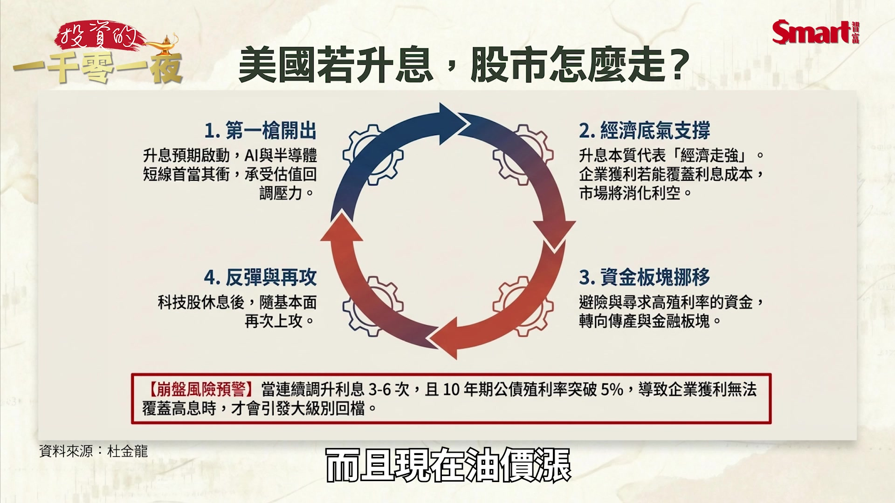

**逐字稿片段：** CPI最近又攻高 PPI（生產者物價指數）也高嘛 完以後 再來 所以我們一般講 一而再再而三 調高在利息的 因為我們現在美國 10年期公債（殖利率）突破5%嘛 一個門檻 完以後 假設有3次到6次 這個以前的調高利息幾次 沒有一個標準 可是降利息的話 曾經有最低降了16次 有夠可憐 調高的話 有時候三次 有時候一次 那完以後 最後一次 股票就要真的會回檔 因為你利息調太高 你賺的錢 沒有 所以我回答剛才 峰哥的話 就有調高 完以後 因為我們現在是 忽多忽空不要

**話題推測：** 提及近期CPI和PPI的走高趨勢

---

## 00:11:16

**逐字稿片段：** 因為川普一直放炮嘛 你不行 你要比 國際的利息來得低 哪有可能 日本是零嘛 全世界利率 現在最高就美國了 對 你怎麼 你欠40兆的錢 你怎麼會最低 講的太誇張了 所以 只要有確定 短線 回檔完以後 大家就 因為股票最怕 不確定因素 所以我們其實 我們錄影的時間 禮拜一是跌 盤中有跌600點 有拉上來 那我們現在錄影的時間 剛好是想要 調高 不調高 可是我個人認為 這個因為股票 已經先回檔 所以上去完以後 短期如果你調高 這個斷一斷 你應該不會馬上再調嘛 所以股票市場會做一個 跌下來反彈 那以後你就會 大家就會籠罩 你調高利息的陰霾裡面 科技股會有影響 所以現在很多 我們從7月8月 你看我們股票市場 除了AI少數有漲的話 跑到金融股 金融股創波段高點 我的富邦金155元了 再來塑化 今年漲最多 因為傳產股 油價漲的關係 大概是這樣 老師接下來是 大家最喜歡的一個環節 就是台積電的實戰操作經驗 老師自己的實戰操作經驗 我們錄影的時間 剛好是在那個 要除息 那我大概每次跌 我就去參加除息 所以我 我這一次 台積電做還不錯 因為7月17號 我本來持股5成 7月17號加到 加聯發科 還有買兩支便當股 那個聯電跟 那個群創 還有買那個 富邦金 都不錯 完以後不是 跌完以後V轉嘛 我是賣得稍微比較早 因為我上去就會 漲4000點就賣一些 後來 我想說漲6000多點 把那個買的全部賣掉 想不到它漲到8000多點 那我台積電是賣在2400元 因為有一天 它不是漲停板2425元嘛 完以後我那時有賣 尾段它漲到2505元 我沒有賺到 可是我底下那一段 因為我買最低是

**話題推測：** 提及川普言論對市場的潛在影響

---

## 00:13:25

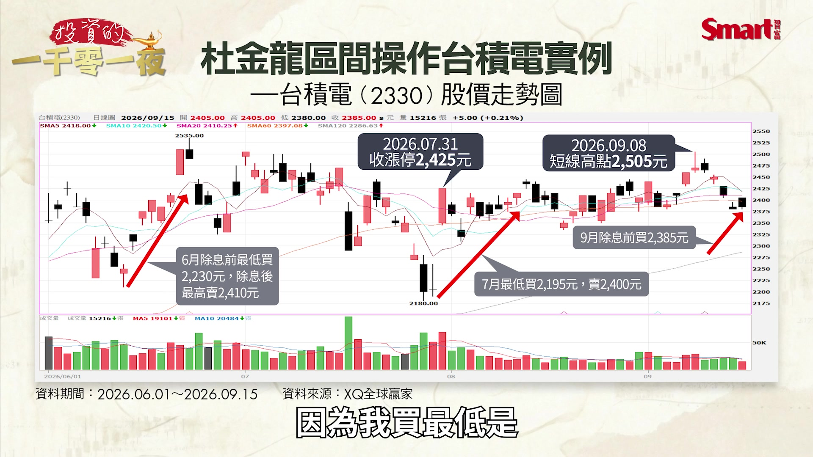

**逐字稿片段：** 我買到2195元 大概這一段有賺到 那完以後 我現在就等它拉回 這一次 拉回比較慢一點 可是台積電相對 抗跌 大盤跌18%

**話題推測：** 分享台積電的買入價格

---

## 00:13:37

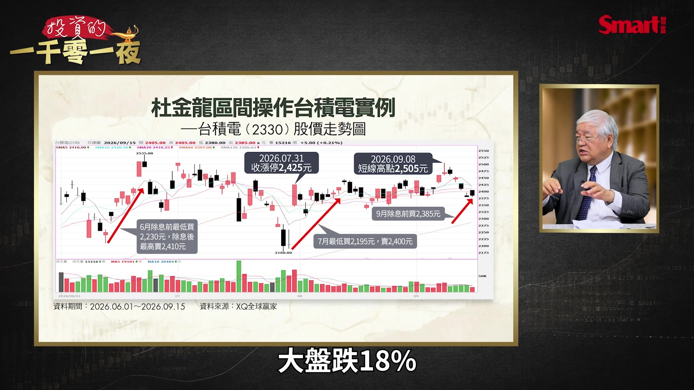

**逐字稿片段：** 它跌14% 漲的話 它也沒有過新高 所以它在一個區間 那最近因為 除息有棄息嘛 我大概像前幾天就買 2385元 去參加除息 因為你台積電秒除息 27秒就填息了 因為填息速度很快 完以後因為它 8月份的營收非常好

**話題推測：** 比較台積電與大盤的回檔幅度

---

## 00:13:59

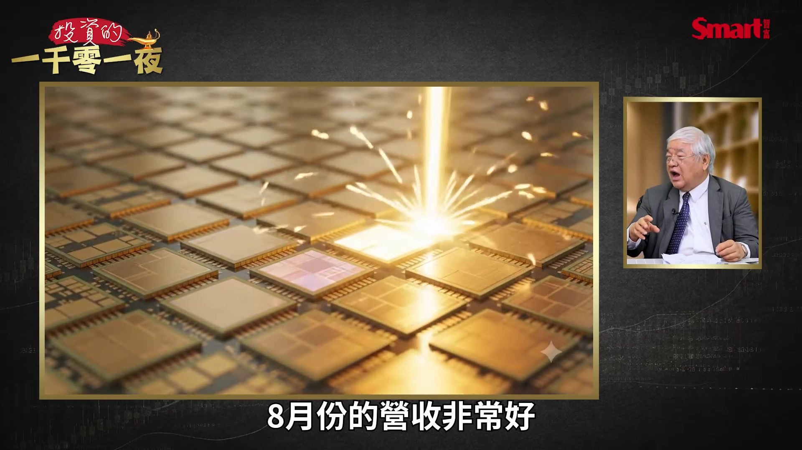

**逐字稿片段：** 那個1到8月份的 營收大概成長39%嘛 已經有人把 這個3Q的EPS 我這邊是27元 有人調到30元 所以外資的目標價 已經有往上調高 那我們剛才講的說 如果明年5萬3000點 它就3000元 那如果說 真的很離譜 漲到8萬點 它就5000元 這是大概 我們對於台積電 所以我最近 台積電做的話很簡單 因為它最近的高點是 以前那個2505元嘛 你扣80元 2400多元我就去買 參加除息 那最近好像因為 它就停在那邊 而且我們最近 你看到 我們為什麼8月份 全世界漲幅第一名

**話題推測：** 提供台積電1到8月份營收成長數據

---

## 00:14:43

**逐字稿片段：** 就靠台積電 把這個大盤撐住 現在台積電 變成一個什麼 政府要拉 那個關卡的時候 台積電出來 那沒有的話 就輪到其他的 那要撐 就看到台積電出來 所以台積電我最近 都很簡單 只要有跌80元我就買 大概 如果漲太多 我就把它賣掉 最近因為它 漲比較多 賣的話是賣 沒有賣到最高 可是還是賺中間的一段 大概是這樣 老師我想要請教一個 你不會覺得說 台積電有點委屈嗎 這麼好的公司 然後其他的什麼聯發科 什麼本益比40 50倍以上 台積電就在這個 23到25倍就很膠著 我太太一直罵我 我說你老是大砲打小鳥 你去買聯發科好不好 還好我有買 後來 這一次如果說 台積電還是這樣 我還是喜歡台積電 因為它漲得比較慢 可是你看到長期來講 它還是慢慢 就慢慢的往上 尤其像現在 你看到連川湖也1萬5000元 那個 那個信驊快要2萬元 有沒有 還有台光電 都很高 委屈了台積電 連那個8月份最離譜的大立光 一口氣就漲到7900元 後來跌停 快要5000元 所以台積電是有一種 我現在到處 在外面的話 有一些人來跟我打招呼 都退休的他退休說 杜老師 台積電好 因為我們退休的人 冒險 心臟比較小顆 變小顆了 我們 賺錢賺少不要緊 不要有風險 你抱著台積電 就穩穩的 台積電是真的賺 如果你再噴出去 像這一次Ｖ轉不是 漲了8000多點 快要創新高 它沒有 有沒有 你看到那個台光電 不是創新高 還有那個ABF 創新高 還有一些嘛

**話題推測：** 分析台積電對8月份市場漲幅的貢獻

---

## 00:16:32

**逐字稿片段：** 南亞科創新高 我的南亞科創新高 有嘛 所以這個 這個也很難這樣講 所以我們大概就是說 我50%還是台積電 那聯發科也有 那像說 那個南亞 南亞科

**話題推測：** 提及南亞科創新高

---

## 00:16:50

**逐字稿片段：** 像現在台塑六寶 真的是很厲害 都在輪漲 那這一次 我還是有去摸到 那個富邦金 富邦金你看 噴到155元嘛 沒什麼回檔 就再往上 創新高 尤其像現在 有很多富邦金 不是金融股在漲嘛

**話題推測：** 討論台塑六寶的輪漲表現

---

## 00:17:08

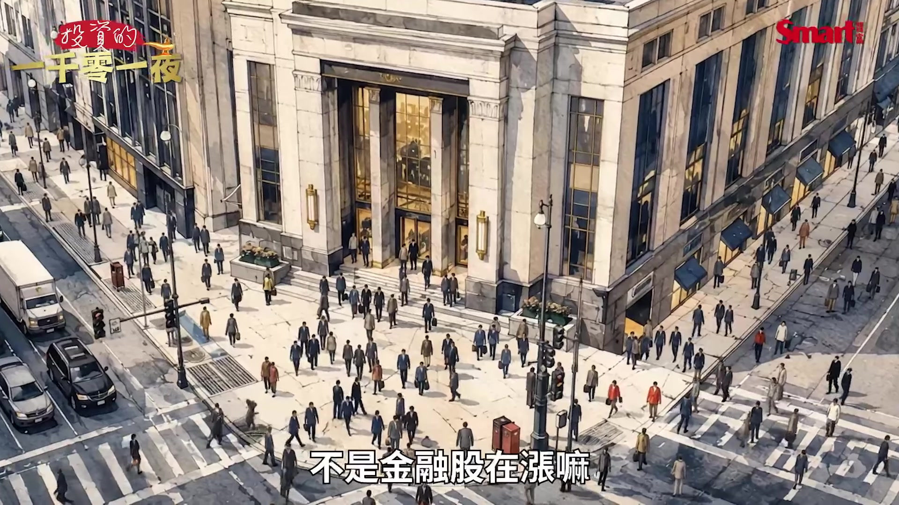

**逐字稿片段：** 所以有一檔那個ETF 它是50%金融股 大盤還沒有創新高 它創新高 這一種 所以台積電我認為 大盤如果 它是區間整理 所以我們為什麼說 大盤是一個區間整理 因為台積電目前 就是高點 就是被台積電拖住了 沒有錯 老師那我接下來請教

**話題推測：** 討論一檔50%持有金融股的ETF

---

## 00:17:30

**逐字稿片段：** 就是發哥 現在輝達投資之後 現在發哥簡直是 比台積電還受到 這種比較積極型的 那個散戶投資人的注意 那你怎麼看一下 這個發哥 該怎麼操作會比較好 很簡單 那一天那個 9月1號 它不是ECB定價嘛 那個4500多元 這個就跟當年 那個南亞科辦理 海外ECB 不是四個有錢人 去買223元嘛 那時候 就是告訴你 223元不能破 那時候破完以後 不是很多人笑他 說有錢人套牢 我那時候就來這邊講 我們跟有錢人 住在一起也不錯 你看到現在500多元 豪宅你住不到 可以跟他一起住套房 500多元了嘛 所以發哥也是一樣 你看它那一天完以後 不是漲停溢價15% 漲上去 完以後拉回 那本土的研究員 大概把目標價 調到6000元 只有那個花旗到1萬元 那最近它又跌下來 因為大家認為 它的績效不是那麼快 所以你看它最近 大概都在4000元 上下 那我們知道 ECB的定義是說 你如果有到4500元 我就可以把 公司債轉換為 普通股去賣 所以它 在如果大盤盤跌的話 這個合理價 就是4500元 所以發哥那一次 不是跌到那個 2990元嘛 那很多人問我說 如果按照這個 線型來講 它就給你一個

**話題推測：** 開始討論聯發科（發哥）的操作策略

---
