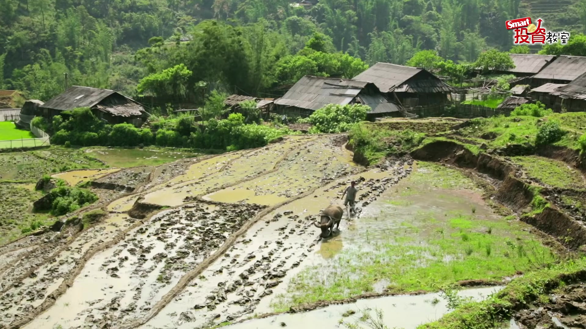
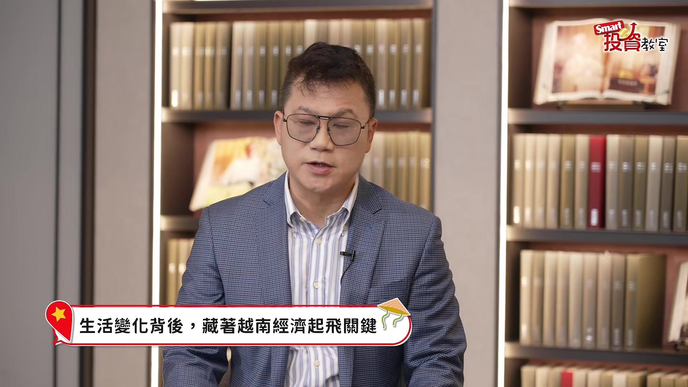
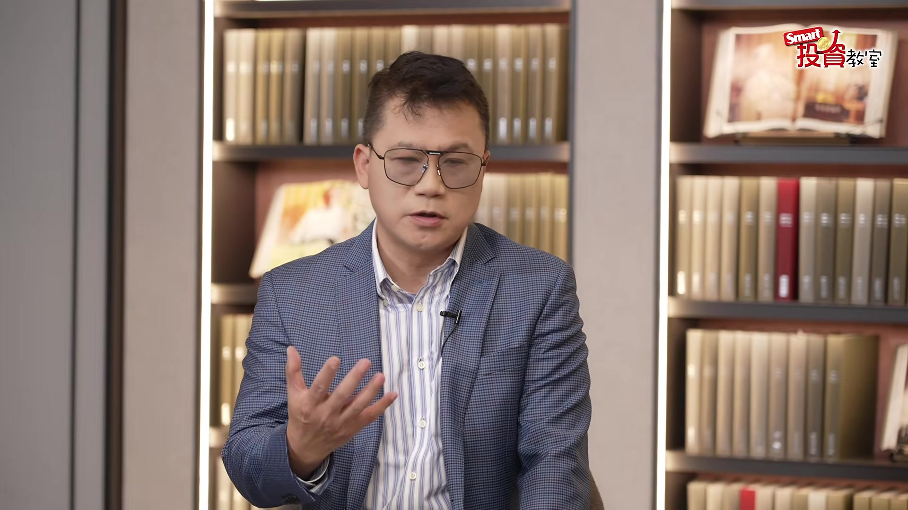
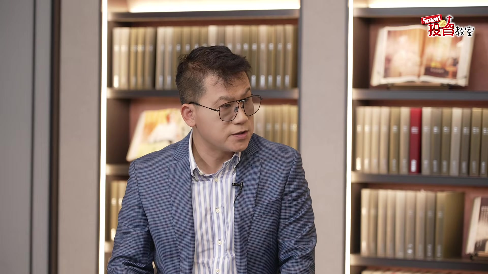
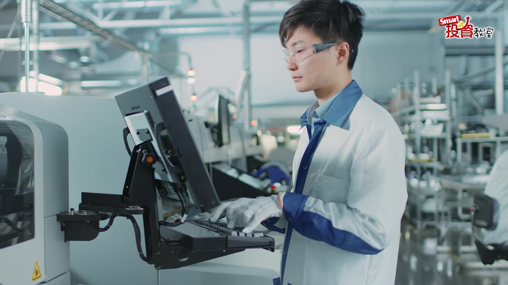
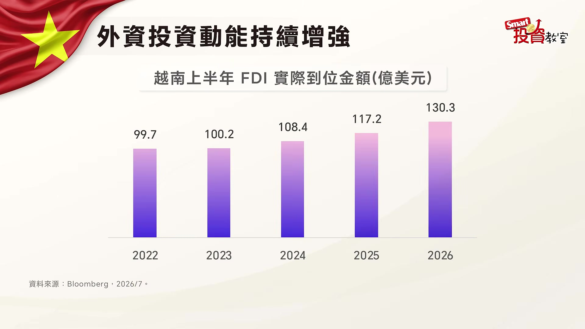
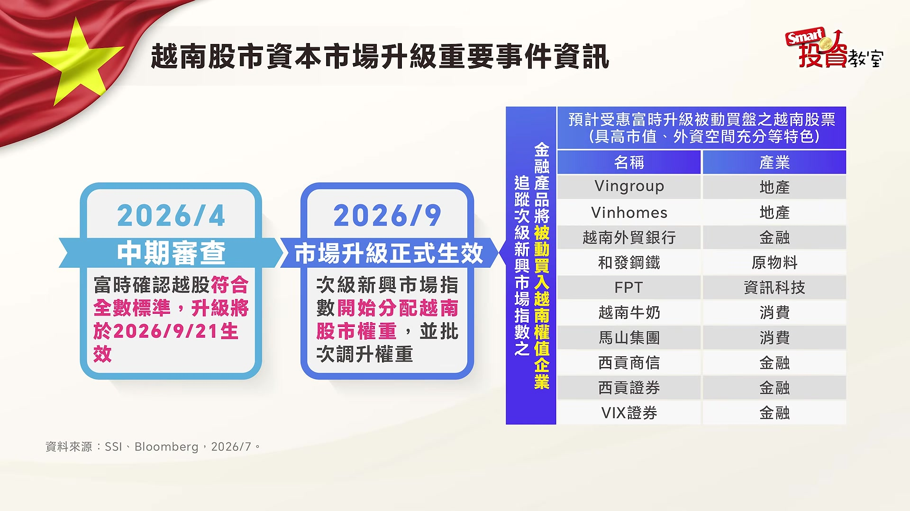
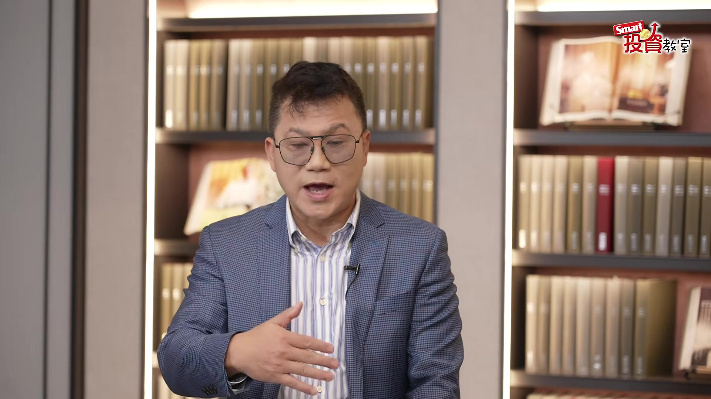
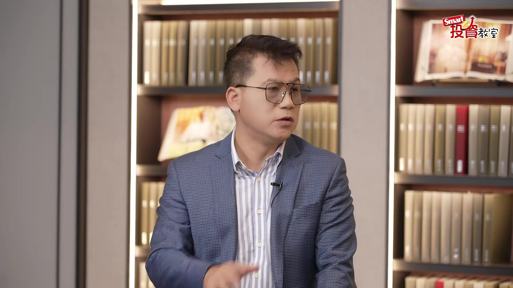

# smartmonthly-bw_NgXyMZaZbfQ — 關鍵畫面索引

- 來源逐字稿：[smartmonthly-bw_NgXyMZaZbfQ_GT.srt](smartmonthly-bw_NgXyMZaZbfQ_GT.srt)
- 影片：https://www.youtube.com/watch?v=NgXyMZaZbfQ
- 截圖數：31

## 00:00:16

**逐字稿片段：** 大家首想到的可能就會是越南了 因為大家很喜歡吃河粉 或是大家喜歡的法國麵包 尤其大家很喜歡說去越南旅遊 當地的這種CP值 讓他感覺 覺得相當的不錯 那甚至 我自己覺得 穿越南的服飾非常漂亮 聽說叫做奧黛 那當然 我對越南認識還不夠這麼深 因為畢竟我們是做財經的 所以我對越南的投資機會 可能比當地日常生活 還要了解更多了 但今天我們要把 日常生活 旅遊商機 還有投資機會 一網打盡 所以今天請到了兩位專家 跟大家好好聊一聊 首先第一個是 全球投資機會都在掌握之中 就連越南都是他的範疇的

**話題推測：** 介紹越南旅遊商機。

---

## 00:00:55

**逐字稿片段：** 股怪教授謝晨彥 大家好 我是東協教父 今天變東協教父 好那另外一位 應該在台灣非常著名 大家也都知道了 是非常著名的越南的新住民 那同時他也是 擁有35萬訂閱的YouTuber 阮秋姮 秋姮你好 璇儀好 教授好 Xin chào tất cả mọi người 大家好 我是阮秋姮 來自越南 所以今天很開心 可以請到秋姮 跟大家聊一聊 她的家鄉 但是其實 我剛說秋姮是新住民 大家都知道 她也是第一屆 我們國慶 唯一的新住民的主持人 所以基本上她也開玩笑說 半個台灣人了 你來台灣多久了 那你多久回越南一次

**話題推測：** 介紹第一位來賓：謝晨彥。

---

## 00:01:37

**逐字稿片段：** 我來台灣已經16年了 現在應該是 每一年都會回去一次或兩次 那可以跟大家分享一下 這個16年的區間 你每一次回去 有感覺到 越南變得很不一樣嗎 有 就是我每一次回去 我都覺得我好像是 就是局外人 局外人 真的是有一點覺得自己家鄉 發展得太快了 像我來台灣之前 我有一段時間是住在河內

**話題推測：** 提出來台居住的年數。

---

## 00:02:08

**逐字稿片段：** 那那時候的主要的交通工具 都是摩托車比較多 但是現在到越南 到處都是汽車 然後地鐵也開通了 然後百貨公司一堆 就非常大的那種規模 所以每次回去都覺得 這是我的家鄉嗎 然後不用說河內 提到我的家鄉就好了 我家鄉是 離河內差不多100公里的地方 我記得我小時候

**話題推測：** 描述越南交通工具的變化（摩托車到汽車/地鐵），城市發展（百貨公司）。

---

## 00:02:38

**逐字稿片段：** 每一家每一戶幾乎都有養牛 然後有牛車這件事情 但是我現在回去 找不到牛車 然後我就跟我老公開玩笑說 現在越南幾乎 好像在鄉下 每一家每一戶都會有汽車 對啊 所以就覺得 我真的不太認識越南了 而且現在不只是你說的牛車 變成家家戶戶是汽車之外 河內現在也有地鐵了 對吧 就是有這個地鐵正在興建 現在有 那未來也會越來越多 我們都說這種公共運輸的改變 或是基礎建設的大起飛 其實就是一個城市 一個國家 升級的模樣

**話題推測：** 描述越南鄉下交通工具的變化（牛車到汽車）。

---

## 00:03:16

**逐字稿片段：** 那來問一下東協教父了 你據說5年6年前 也有去過越南 當時有這種地鐵或是捷運嗎 他剛才講牛車 我就想到 以前我們台灣 也是嫁妝一牛車 有沒有 有一部電影 所以現在當然也是 比較看不到這樣 我那時候去哪裡

**話題推測：** 向謝教授提問其多年前的越南經驗。

---

## 00:03:33

**逐字稿片段：** 我去那個胡志明市 胡志明市 其實那時候我要去越南的時候 心裡面有點緊張 有點害怕 因為第一次總是會怕 但是過了海關以後 我就發現 環境各方面其實很 有一種熟悉感 很像我小時候的台北市 充滿了活力 而且摩托車基本上都沒在停 就這樣橫衝直撞 然後要過馬路 我就看當地人 很像我小時候玩的 那個青蛙過街一樣 就是你要隨時注意兩邊的車子 還滿有意思的 當然我覺得 我看到 我去越南 因為我只有待胡志明市 其他城市還沒有機會去 但是我感覺就是很有活力 比如說

**話題推測：** 提及去過的具體地點：胡志明市。

---

## 00:04:16

**逐字稿片段：** 我們以經濟成長率來看 像美國現在只有1點多% 台灣現在 今年台灣也很誇張 今年10% 11% 以越南來講 它的GDP經濟成長率 可以超過8% 那這是什麼意思 代表 整個經濟的水平 是在蓬勃的發展 其實我那時候去的時候 路上 因為我有一個朋友在越南 我還跟他聯絡 然後他約我去喝星巴克 我很感動 你都不知道 星巴克在越南很貴嗎 算是滿貴的 高檔的就對了 可是以跟台北比是便宜 天啊 然後我就很感動 我想說有星巴克 那就是國際水準 然後重點是路上有很多施工 我說為什麼那麼多施工 他們說要蓋捷運 蓋地鐵 那你看經濟成長 然後再來人口數 1億 超過1億 然後我就看了一下人口結構 發現說 大部分是年輕人 大概我這個年齡 大概34歲 35歲上下 旁邊可能要上一下就是警語這樣 他兒子都已經20幾歲了 投資有風險 是不是 然後 人口很年輕 人口年輕 那你知道年輕人 最大的特色是什麼 就是消費是衝動的 其實就我所知那個摩托車 一台要台幣大概5萬多元 可是 跟台灣差不多 可是問題是他們的 這個1個月的平均收入大概多少 台幣換算

**話題推測：** 提出越南的GDP經濟成長率與美國、台灣比較。

---

## 00:05:44

**逐字稿片段：** 將近1萬元台幣左右 1萬多台幣 600多萬元越南盾 那等於是買一台摩托車 要存半年 半年 而且半年不吃不喝 所以那時候 可是幾乎 我看大家都在騎摩托車 所以代表年輕人的消費力 其實是很強

**話題推測：** 提出當地平均月收入。

---

## 00:05:59

**逐字稿片段：** 那現在人均所得是5000美元 5000美元 大概1萬5000元台幣左右 所以成長的速度很快 重點是什麼 他們直接跳躍到 手機時代 然後電動車時代 所以我感覺到兩個字形容越南 活力 活力 對 秋姮聽得一直在點頭搗蒜 你自己這十年 看下來是這樣的感受對嗎 就是升級 然後你以前可能都要付現金 現在變得都是要用行動支付(口誤) 然後開始很多高樓大廈 基礎建設蓋起來了 其實兩位講的就是代表說 一個城市 一個國家正在蛻變 甚至說其實像這樣的現象 我們可以放眼到 以台灣為核心 其實到亞洲周邊 也都是如此了 包含像 過去我們提到 尤其是受惠

**話題推測：** 提出越南人均所得為5000美元。

---

## 00:06:48

**逐字稿片段：** 叫做China Plus One 中國加一這樣的政策 其實不只是越南 包含像是可能印度 或是其他國家都有這樣受惠 可是我們就要來問一下東協教父 就是我剛提到這些國家 基本上都也是有受惠產業升級 也都是發展中國家 那為什麼你覺得越南 是大家可以特別關注的投資選項 因為基本上 有幾個當然很重要的因素 包括它的地理位置 其實你可以講算是 在整個東南亞當中 位置相對是居中的 所以它有一個輻射的效果 就是它要往哪個地方去 是很方便的 不管你說 他要東西做好以後 要賣到中國 或是要賣到歐洲 或是說往更南邊走 都可以 樞紐的位置 樞紐的位置 那所以早期 各位對越南比較印象 應該是很多的台商 到那邊去設廠

**話題推測：** 提到「中國加一」政策及其受惠國家。

---

## 00:07:42

**逐字稿片段：** 主要像寶成 他們就做鞋類 或是紡織 對它就有成本優勢 所以這是過去 比較像是傳統產業的製造基地 可是這幾年 有一個很重要的關鍵 是什麼 就是產業升級 因為過去本來就有人口紅利 那這個人口紅利 在發展的過程中 隨著 因為我做工廠 我是不是要 開發當地土地 交通 水電 然後還要提供這個工作機會 然後你什麼 每樣東西都要到位 才可以營運 那既然有了這個優勢以後 開始進行所謂的產業升級 因為 現在你剛才講中國加一 所以大家開始去找 中國以外的加工廠 所以不管是三星 其實不止 韓國 日本 還有包括我們台灣 其實科技業 都跑到這個越南去設廠 像現在越南以前輸出 最主要是紡織跟鞋類

**話題推測：** 提及寶成等早期台商在越南設廠的產業。

---

## 00:08:40

**逐字稿片段：** 可是現在他們出口最大宗 竟然是什麼 手機 筆電 還有當然 我覺得未來半導體 應該也會有機會 這是第一個 我們叫做產業升級 那現階段來講 還有一個東西 我覺得在越南比較特別 就是說他們對於外資的態度 是相當開放的 所以美元的流通 在那個地方也相當的流行 那在這個情況下

**話題推測：** 比較越南新舊出口大宗項目（紡織/鞋類到手機/筆電）。

---

## 00:09:05

**逐字稿片段：** 又出現了另外一個叫資本升級 就是說更多的資金 進到越南去做投資 那所以在這兩個前提之下 我覺得越南未來 甚至也有可能 發展成科技業的重鎮 所以有產業升級 加上資本升級 那甚至最新在9月21號 有一個事情發生了

**話題推測：** 提出越南的資本升級現象。

---

## 00:09:25

**逐字稿片段：** 就是說越南被這個富時羅素指數 編進了叫作 新興國家指數當中 那教授你是專家 我們都知道 當這個指數 把它納入邏輯規則改變之後 其實很多的ETF 是不是就是直接受惠了 所以我們知道基本上 你剛提到的 不只外資的資金 開始可能會有更多的國際資金 或者是說有買相關 越南股市 指數這樣的資金 就會進入到市場 那我覺得對於 後面的投資機會來說 基本上有一些好公司 有機會被發掘 我們先這樣講 就是說 目前全球兩個主要的 指數編制公司 一個是富時 那其實富時是比較後後起之秀 它影響的規模還算OK

**話題推測：** 提到越南被納入富時羅素新興國家指數。

---

## 00:10:07

**逐字稿片段：** 但是更大的其實是MSCI 那這兩個指數的編制公司 其實是全球非常多的主動式的 基金 ETF 或被動式的基金 跟ETF 它們追蹤的主要的依據 那過去因為 越南被列為邊境市場 所以它在全球投資的比重當中 比例相對比較低 然後再來 因為邊境市場 大家會覺得說 是不是風險比較大 還有資金的流動性 是不是比較不好 資金的進出各方面 所以法人就比較沒有關注越南 可是因為現階段大家發現 我們剛才前面提到了 不管是人口紅利 不管是基礎建設的推展 或者是他們政府現在 對於整個資本市場的開放 還有包括金融市場制度的一個建立 大家開始去尋找 有沒有潛力 未來可以投資的地方 那各位也知道 早期台灣 其實也沒有被列入新興市場 後來被列入新興市場以後 外資進來我們的投資的產品 越來越越健全的情況下 股市就不得了 對不對 那後來還有一個先例

**話題推測：** 比較富時羅素與MSCI兩大指數編制公司。

---

## 00:11:14

**逐字稿片段：** 就是A股 所以這一次 為什麼大家特別關注越南 是因為如果我們能夠在 這個指數 剛開始開放的時候 這個市場剛開始開放的時候 我們就進去 未來有沒有可能 去迎接財富倍增的機會 就好像 如果你能夠在30幾元買台積電(2330) 所以我們開始去尋找 有哪一個市場 具備 哪一個潛力 它有具備那個潛力 當然我要講說 潛力 就像我剛才講 你要有人口紅利 基礎建設 金融制度健全這些 但重點是 資金要願意進去 所以你看富時 它現在要把越南納進去 第一個 我就講被動式的ETF 只要你是新興市場 你是不是一定要買 被動買盤就來了 那對主動式來講 它就有話題了 經理人也能夠進去裡面 開始挖掘股票 所以這些資金進來 其實滿嚇人的 可是我講 這只是第一步 第一個階段 因為後面還有MSCI MSCI的規模更誇張 那我問你 如果富時把越南納進去 MSCI永遠都不納進去 你覺得有可能嗎 不太可能 因為大家審核評論的一些機制 或一些條件 稍微有一些差異 但是你不可能落差那麼大 所以自然而然 很快的 在這幾年當中 我認為MSCI也會納進去 那當然是階段性 比例式的 所以應該會吸引 非常多的買盤 所以我覺得 滿值得期待的 也就是說 它除了它的基礎條件好之外 我們從資金面向來看 現在有點像是 打開了一個樞紐了 被納入指數規則之後 除了會有被動買盤進來之外 主動基金的經理人 也會有機會去挖掘更多 後續有機會 或是說 極具潛力的越南相關的產業 或是越南相關的股票了 但是投資人這時候 你可能已經開始在翻了 去看一下這個越南的股市 拉開來看 或是翻一下相關標的的報酬率 又要來考問東協教父 晨彥哥 去年越股其實表現也很好

**話題推測：** 提及A股（中國股市）被納入新興市場的例子。

---

## 00:13:19

**逐字稿片段：** 其實它去年就已經漲了4成了 大家就說了 已經漲這麼多了 現在還有機會嗎 基本上 當然我們 用一個比較長線的角度 去看一個有潛力的地方的話 漲多 你當然兩個方式 第一個你等它回檔 但是因為活潑的市場 就是那個過動兒 他什麼時候會靜下來 你不知道 那他靜下來 像我小時候 老師都說我上課 我的腳 我的椅子 都不會四隻腳在地上 那他一講 我就四隻腳在地上 但他一回頭 我又 又開始動來動去 所以 所以你是過動兒的代表 我算是過動兒的代表 所以你不能等到一個市場成熟以後 你才要進入 所以在這個時候 你說你要等它回檔 我又覺得 講可以 你等他回檔 但這樣好像又不負責任 因為它可能一回檔 莫名其妙又開始衝 所以我覺得 你可能用幾個方式 比如說定期定額 或分批佈局的方式 當然這個時候 我們又開始腦補了 那我是在ETF嗎 還是基金好 這時候我們把ETF 就是以被動的角度去思考 但是因為我覺得 指數型的產品 你基本上 應該是要比較成熟的區域 像台灣 我們算是股市比較成熟了 個股會輪番表現 然後在美國 個股輪番表現 對不對 那我覺得採用指數型 我就OK 可是 在越南像這種地方 它其實很多產業 它會很多公司 你要去挖掘的 就是 你你不要買那個 本來就很大的 因為它可能突然之間 它就蹦出來 有沒有 那如果我 基本上我就是買被動的 那我還去找那個 新興市場 或是有潛力的地方幹嘛 對不對 你懂我意思嗎 所以我自己個人像 越南這種新興市場 尤其是被剛納入的地方 我覺得有很多的股票 它是很有潛力的 那在這個情況之下 我覺得我們就需要經理人了 像我也是獨具慧眼 對不對 我過去我當經理人 我在投信我也是 我們都要去拜訪 那所以我們就要仰賴經理人 主動去挖掘 那目前我看了一下 好像市場上 以越南為主的 好像只有中國信託

**話題推測：** 提出去年越南股市上漲4成的數據。

---

## 00:15:47

**逐字稿片段：** 它有一檔越南機會基金 就是經理人 他們會主動的去挖掘這一塊 所以我覺得不妨也可以參考看看 像晨彥哥講得很好 就是說 對於這一種 可能才剛剛覺醒 然後比較活潑 波動或許比較大的市場的話 其實後續我們才講就是 很多叫做潛力黑馬的機會 是比較多的 那這種潛力黑馬 它們可能比較難直接被納入到 被動的ETF 而是要靠經理人去挖掘 然後主動挑選出來 才有辦法掌握它後續的爆發力 那靠著實地去探訪公司 才有機會挖到就是說 誰可能會是下一步的新星 這個確實透過主動基金的機會 是確實比較大的 來賺取超額報酬 尤其是在這種 新興市場 對不對 那同樣剛剛其實也提醒 就是波動會比較大 所以我們還是覺得 定期定額的方式可能會是比較好 比較適合所有的投資人 然後來參與長線的後續的商機 那剛剛秋姮 聽的是津津有味 對不對 除了你自己親身感受到 當地的產業升級 然後其實從消費力道 也感覺得出來 你也認同剛剛晨彥哥說的 就是現在年輕人比較敢消費 變得比較有錢 跟你16年前相比的話 你覺得最大的升級是什麼 他不是也還是年輕人嗎 你有什麼 人家肚子有個小baby的媽媽了 我覺得 現在的越南就是很不一樣 以前大家可能 賺的錢就是拿去存 把它放銀行定存或怎麼樣 不消費 然後比較不會去買東西 但是現在的話 感覺大家也都比較願意花錢 像很多那種國際品牌進來 像教授剛剛有講 那個星巴克 然後麥當勞

**話題推測：** 提及中國信託的越南機會基金。

---

## 00:18:05

**逐字稿片段：** 其實我去點越南麥當勞 我覺得甚至比台灣還貴 真的 所以我就覺得就是 但是你可以到越南看 很多年輕人都會住在這些 那種國際的店 然後願意消費 然後我覺得 以前很多越南人有錢的 大家都會拿現金出國買東西 我朋友之前是帶團 他說每次都有越南的客人來 然後就在台灣去一些那種 就是國際品牌的 買包包什麼的 但現在不用 因為很多都是 已經到越南的百貨公司 都可以直接買了 然後年輕人就是 也是很肯花錢 像去看那種偶像唱歌 那種就是演唱會 演唱會追星 這個是我小時候 是沒辦法想像的東西 我覺得也包含 現在社群媒體的的盛行 或是有一些科技的東西的改變 你自己有感受嗎 以前可能我們都會用現金 但是這幾次我回越南 我就會發現說 整個消費改變很多 就我們如果忘記帶現金的話

**話題推測：** 提到越南麥當勞價格比台灣貴。

---

## 00:19:17

**逐字稿片段：** 我們都可以用電子支付 所以不管是去超市 去買衣服 或者是連搭計程車 我有時候沒有那種小鈔 我就會問他說 可不可以轉帳 就都可以直接轉帳了 所以這真的是我覺得 也包含的 他們現在會有很多的遊客 然後觀光客 那希望帶動整體的消費體驗 然後其實等於也帶動大家 想要去更多去越南消費 這樣的概念 那其實我也想問教授 就是我們剛剛有說到 秋姮分享了 以他的視角來看這樣的改變 那剛剛就說年輕人 願意更去消費了 然後買東西 甚至也不會說只存錢 有沒有可能就越南年輕人 開始也重視到 金融市場的重要性 他們也會想要開始去投資 你覺得這個有沒有關係 因為現在越南

**話題推測：** 提及越南消費習慣轉變為電子支付。

---

## 00:20:03

**逐字稿片段：** 也可以用Grab 對不對 對 我的印象也是 Grab叫車的軟體 然後它也可以做很多 這個消費的支付的整合 東南亞的獨角獸 沒錯 所以其實你看 這個趨勢是這樣 因為年輕人比較願意嘗試新的東西 他願意嘗試新的科技 他願意去做一些 多元化文化的一個接觸 所以在這樣的一個情況之下 它也會引發一個所謂的創業潮 所以現在很多越南的年輕人 就我所知 他們很多的一些創業 都是跟科技有關 所以你看為什麼會突然之間 我們過去講Uber 可是怎麼突然之間 東南亞就有一個Grab就起來 它其實就是順應著年輕人 他願意 比如說線上支付 用各種方式去嘗試一些新的科技 所以對於我們講人口紅利 過去我們在講人口紅利 指的是什麼 很多年輕人 我們可以應用他的勞動力 現在 錯

**話題推測：** 提到越南普遍使用Grab軟體。

---

## 00:21:00

**逐字稿片段：** 現在所謂的人口紅利是什麼 就是他願意消費 他願意消費 他買新衣服 他要買鞋子 他要買包包 他要上餐廳 他要去聽演唱會 像我們這種聽什麼演唱會 周杰倫來 我都站在門口外面 我說這樣也可以聽得到 這也可以聽得到 還花什麼錢 對不對 地下室也可以 那個小巨蛋聽說 地下室也可以 而且他們大家在踏踏踏 我也可以感受到那種震盪 但年輕人要親眼看到 要face to face看到偶像 他願意花錢 買一個演唱會門票 幾千幾萬元 所以我覺得這種年輕人的消費力 確實可以推動一個 不管我講經濟的成長 更重要的是什麼 科技的進步 還有內需市場 內需市場 剛剛提到我們有這個1億人口 這麼多 對不對 所以其實內需也是推升一個國家 推升一個金融市場 很重要的一個消費體驗 那大家聽到這邊 可能就會覺得說 你除了想要投資越南之外 可能也很想去玩 然後一開始璇依有說 我們今天也要把這個去玩 然後必吃必喝的一些日常體驗 要請秋姮跟大家來分享了 我們趕快請秋姮跟大家聊一聊說

**話題推測：** 重新定義人口紅利為年輕人的消費力。

---

## 00:22:08

**逐字稿片段：** 如果真的是想要安排 第一次去越南玩 哪一些是你絕對 覺得絕對不能錯過的 或是必吃的美食 如果大家第一次去越南的話 那因為越南有分北中南

**話題推測：** 轉向分享越南旅遊推薦行程與必吃美食。

---

## 00:22:20

**逐字稿片段：** 而且現在又有什麼峴港 然後胡志明市 富國島 河內 所以如果去北部的話 當然就是到首都河內 然後河內有一個很有歷史悠久的一個 叫三十六古街 那邊也是滿熱鬧的 很多商店 大家可以安排河內下龍灣 然後甚至有人會繞去陸龍灣 然後到中部的話 像剛剛講的 就是峴港 會安 因為峴港有一個很漂亮的美溪沙灘 然後有會安古鎮 晚上會有掛很多燈籠很漂亮 那南部的話 當然就是胡志明市 然後富國島 這幾年都很夯 所以其實就是 去越南玩不要只去一次 而是可以這樣北中南安排 然後每趟旅行去探索不一樣的地方 那我剛剛說我記得 小時候我們喝過那越南咖啡 就是好苦 加煉乳 可是是不是也是到越南必喝 那必吃的除了河粉之外 還有別的嗎 越南的美食真的很多 而且吃不胖 吃不胖因為很比較健康是嗎 就是我們有很多蔬菜 而且我們都是吃原型食物比較多 這很重要 所以像

**話題推測：** 提及越南旅遊目的地（峴港、胡志明市、富國島、河內）。

---

## 00:23:40

**逐字稿片段：** 必須要吃牛肉河粉 雖然在台灣也有 但我覺得那個口味 很不一樣 而且你剛剛說 你家鄉河內附近 是雞肉河粉 還特別好吃 對牛肉河粉 雞肉河粉 因為它都是從北部開始發揚的 然後到其他的地區 所以對我來說 因為我是北部人 我比較習慣河內的 雞肉跟牛肉河粉 但是其他地區 都有它的那個特色口味 大家都可以嘗試看看 那如果沒有講其他地區 只有講河內的話 除了牛肉河粉

**話題推測：** 推薦必吃美食：牛肉河粉。

---

## 00:24:15

**逐字稿片段：** 我很推薦吃Bún chả Bun Cha就是烤肉米線 它是用豬肉串烤 然後有碳燒的香味 然後搭配米線 就是之前那個 美國的前總統歐巴馬 去越南的時候他也有吃 所以大家也可以嘗試看看 他吃完就說Oh my god 歐巴馬說Oh my god 光聽都覺得流口水了 那咖啡是不是說 還有是那種蛋黃打

**話題推測：** 推薦必吃美食：烤肉米線 (Bún chả)。

---

## 00:24:46

**逐字稿片段：** 河內很有名的蛋咖啡 還有鹽巴咖啡 就每一年都有新的創新 我不知道 但是 我覺得那兩個還滿經典的 那像蛋咖啡的話 他是用雞蛋去打成 類似那種奶蓋 奶泡那一種 然後上面 你喝了之後 就會有一點 好像喝了一層提拉米蘇 就很綿密的 心動了是不是 很特別 我好像沒有 我那時候去越南就沒有 我那時候 還沒有這幾年才發展起來 因為這種都是打卡店 這叫做因為社群的關係 就打卡名店 那個是河內比較著名 後來才就是傳到其他地區 那如果我們觀光客去 像剛剛提到 現在很多地方 是可以電子支付的 可是是不是也要提醒大家 就是說 是不是好像也是 帶一點現金會比較保險 還是說觀光客也可以 直接去使用電子支付嗎 越南我覺得其實是 滿靈活的一個市場 像我們幾乎在國內的人的話 我們使用電子支付的比例很高 但是外國人畢竟是 沒有越南的銀行帳號 所以基本上你們是扣這個 越南的帳戶裡面的錢 Credit card信用卡嗎 不是 那個我們的 手機號碼 手機號碼 所以就是外國人去

**話題推測：** 推薦必喝飲品：河內蛋咖啡。

---

## 00:26:05

**逐字稿片段：** 我覺得建議還是帶 外幣去 台幣也可以 因為像很多大家現在都去 做那個越式洗頭 我認識很多店家 他們都可以直接用台幣 可以收台幣 好貼心 所以大家還是 或者是你可以在機場 或者在銀行直接先換越南盾 只是如果你換越南盾的話 比較要注意的地方就是 越南盾有很多個零 我們都是好幾萬 好幾百萬 在越南花錢 在越南花錢就覺得 我就是富翁 大富翁 那美金可以嗎 美金可以 但是畢竟還是 外幣 我就是花了 你如果台幣的話 可以直接建議換成越南盾 但我們使用的時候 付費的時候 需要注意一下 因為越南盾有一些 那個面額顏色看起來很像 顏色 所以還是要注意一下 然後像老師剛剛有講 我們如果搭車的話 可以叫Grab 或者越南也有四五個 不同的叫車平台 大家都可以使用 那它上面價格還滿透明的 就不會說你語言不通 然後在那邊跟司機 在那邊講來講去 然後到時候那個 這個出國還滿重要的 那可以用LINE Pay嗎 越南沒有用LINE

**話題推測：** 給予觀光客在越南支付方式的建議，提到可使用台幣。

---

## 00:27:24

**逐字稿片段：** 我們有自己的一個叫Zalo Zalo是越南人在使用 跟LINE一樣 像韓國的KakaoTalk那一種 就是當地的人自己在用的 我這樣聽起來 很多人可能就開始想要去 規畫這個自己的 自助旅行了 而且甚至我覺得 我覺得有時候我們想要去投資 或是了解一個當地市場 其實先去玩 真的是最重要的 那其實我覺得 我也再跟大家 可以稍微複習一下現在的

**話題推測：** 提及越南使用的通訊軟體Zalo。

---

## 00:27:52

**逐字稿片段：** 這個很多種的投資工具 既然你剛剛聽我們教授講這麼多 現在越南有很多的機會 產業升級 然後資本升級 還有人口紅利 龐大的內需市場 回想一下 它其實就像是我們 大概是我覺得以前會說 30年前的台灣 但現在越南已經很進步 大概可以說到可能是 10年前的台灣 那後續還有很多機會 正在起飛 然後正在蓋 那如果想要來參與這樣市場 當然第一個就是提到的 剛剛說主動基金的機會 我覺得是比較有辦法 有超額報酬的 就是中信有一個越南機會基金 而且據說 他們為了想要透徹的研究越南市場 每一年都會去深耕越南當地 有點開玩笑就是 為了想要喝牛奶 就養了一頭牛 類似這種感受 然後如果是ETF的話 其實也是有相關的ETF 可以去選擇一個 富邦越南的ETF 那ETF就是被動追蹤指數 那主動基金是經理人去 挖掘市場 那甚至秋姮 很特別 因為中信很深耕越南 還出了一本書 然後秋姮也有帶這個 他們的採訪團隊去當地 參觀工廠 對不對 電動車的工廠 這就是剛剛教授講到的產業升級了 現在在做的是高科技的東西 以前做傳產的東西 現在做電動車 做手機 所以真的是越南開始 慢慢變得不太一樣 但是璇依也溫馨提醒 新興市場的特色就是像 晨彥哥講的過動兒 也是波動會稍微比較大一些 那最好的方式其實就是還是 定期定額 絕對不要All in

**話題推測：** 總結越南投資機會及相關投資工具。

---
