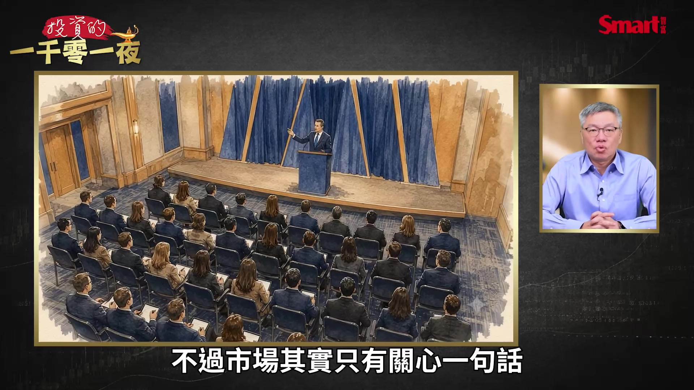
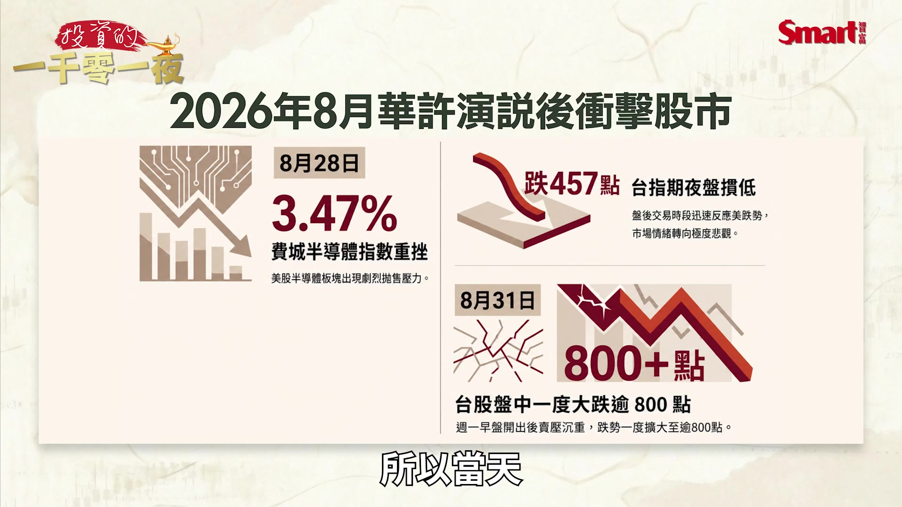
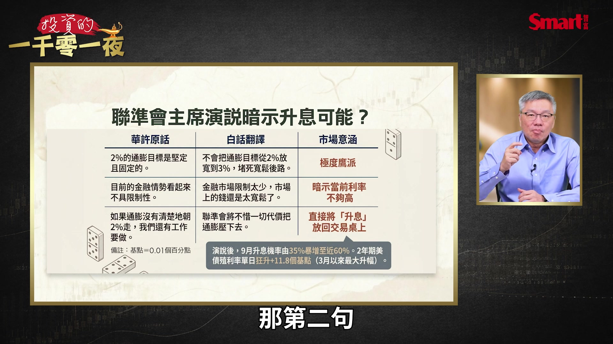
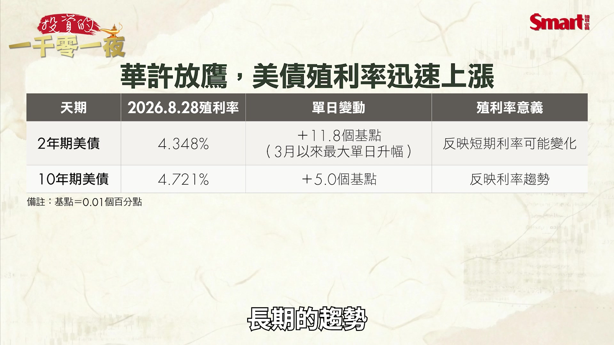
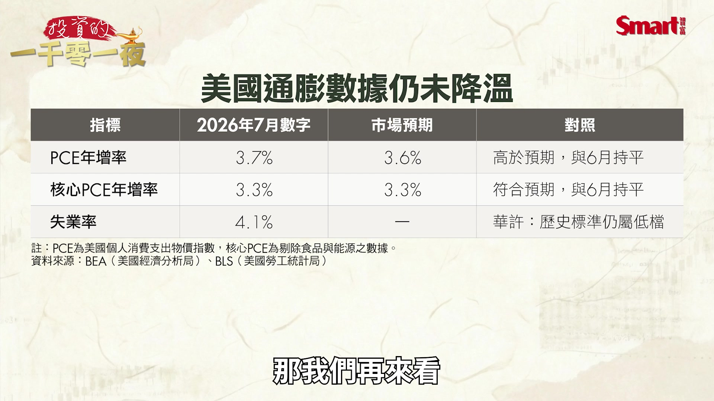
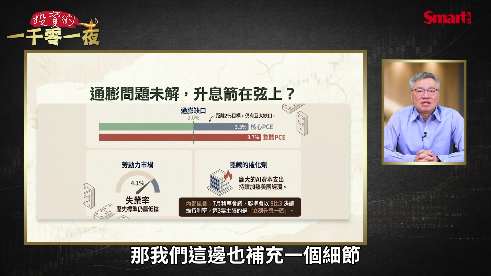

# smartmonthly-bw_OunGyJJy9x8 — 關鍵畫面索引

- 來源逐字稿：[smartmonthly-bw_OunGyJJy9x8_GT.srt](smartmonthly-bw_OunGyJJy9x8_GT.srt)
- 影片：https://www.youtube.com/watch?v=OunGyJJy9x8
- 截圖數：15

## 00:00:22

**逐字稿片段：** 升息 強勢美元 AI股融資 這三件事可能會成為 推倒台股的 三大骨牌 那為什麼我來跟大家 推導一下 那大家如果最近 都有在關心輝達財報或是 欣興電子被調查的事件 確實是會影響最近的市場行情 不過我覺得還有一件事是 對台股最近的影響 會更大的 那就是聯準會主席華許 突然把升息這兩個字 重新放回市場的 交易桌上 那注意 我剛才講的並不是 降息延後 我們之前講的一直都是 降息是不是會延後到什麼時候 但是現在市場認真討論的是 聯準會有沒有可能在 9月就直接升息 那關鍵是來自於這件事 就是8月28號 在美國的懷俄明州的 傑克森洞 Jackson Hole 這個地方舉行了 全球央行年會 本來這是一個每年都有的 例行央行年會也不是什麼 特別的事 但今年特別在於 聯準會的新任主席華許 是他上任以來第一場的 正式政策演說 那他有16頁的講稿 講了很多東西 包括AI 包括央行溝通 還有其他很多宏大的議題 不過市場其實只有關心一句話

**話題推測：** 介紹本集三大主題：升息、強勢美元、AI股融資。

---

## 00:01:42

**逐字稿片段：** 就是他說 如果通膨 沒有明確的 而且能夠 夠快地朝2%回落 那麼聯準會還有 工作要做 這句話其實說的 看起來已經很含蓄 但是從聯準會主席的 嘴裡講出來 影響還是非常大的 那演說之前

**話題推測：** 顯示聯準會主席華許的關鍵發言內容。

---

## 00:02:04

**逐字稿片段：** 市場是押注9月的升息機率 大概就35% 也就是說 三分之一的機率 基本上就是覺得 不太會升息了 但演說結束之後 機率整個快速跳到 將近60% 就6成的這個機率 所以當天

**話題推測：** 比較演說前後9月升息機率的變化（35% vs 60%）。

---

## 00:02:20

**逐字稿片段：** 費城半導體指數 就因為這件事重挫了3.47% 那台指期在夜盤 也就直接摜低了457點 那週一台股早盤 快速的反應下這件事情 早盤一度就下跌了800點 那為什麼會發生 這樣的事 是因為股市現在最大的風險 是因為股市現在最大的風險 並不是AI股的財報有多好 而是利率的方向 有可能反過來了

**話題推測：** 呈現費城半導體指數、台指期和台股早盤的跌幅數據。

---

## 00:02:50

**逐字稿片段：** 那過去這三年 台股從2萬多點 一路走到最高4萬8000點 靠的是兩具引擎 第一具是AI帶來的企業獲利 第二具是降息預期帶來的 估值擴張 第一具引擎到現在 還在正常的周轉 甚至還愈轉愈快 可是第二具引擎 不只熄火了 現在市場甚至開始討論 它會不會倒著轉 那華許到底說了什麼 造成市場反應這麼大 我把整個重點整理成三句白話 第一句

**話題推測：** 解釋台股過去三年上漲的兩大引擎（AI獲利、降息預期）。

---

## 00:03:22

**逐字稿片段：** 2%的通膨目標是 堅定而且固定的 所以他希望市場 不要有任何誤解 原因是他要回應 市場之前的猜測 之前經濟學家在傳 華許會不會上任之後 把通膨目標由2% 放寬到3% 因為其實在過去的觀念裡面 2%只是一個大家期待的標準 並不是一個 硬性的標準 那這一次他是把話 講得比較死 它是一個固定的 固定的一個標準 那第二句

**話題推測：** 第一點：2%通膨目標是堅定固定的。

---

## 00:03:57

**逐字稿片段：** 目前的金融情勢 看起來不具限制性 這句話就真的有點難懂 那我簡單幫他做一個 白話的翻譯 就是金融市場目前的限制太少 錢還是太寬鬆了 那就是在暗示 利率有可能不夠高 那第三句是 如果通膨沒有清楚的往2%走 我們還有工作要做 這就是整個演講 被認為最具鷹派立場的 一句話 就是央行總要找到方法 把通膨給壓下去 所以市場的反應就非常直接

**話題推測：** 第二點：目前金融情勢不具限制性。

---

## 00:04:33

**逐字稿片段：** 我們先來看債市 2年期的美債 在8月28號那天 就上漲到4.348% 這是上漲了11.8個基點 是3月以來最大的單日升幅 那10年期的美債 來到4.721% 是加了5個基點 一個基點就是0.01個百分點 那這邊跟大家說明一下 它的意義 2年期的短債 它最能反映短期利率的 目前的快速變化 那10年期的國債 就最能反映利率的 長期的趨勢

**話題推測：** 轉向討論市場反應，首先是債市。

---

## 00:05:08

**逐字稿片段：** 所以我們這張圖可以看到 其實今年以來 特別是在3月之後 整個利率的趨勢 10年期的利率趨勢 就一直呈現往上走 回檔一下之後再創新高 再往上走 所以本來在這一次的 華許談話之前 市場就有點擔心 利率趨勢會持續往上 那華許這次的談話之後 就更加強化了大家對 這個升息的憂慮 所以除了9月要開會的 這一次會議

**話題推測：** 顯示10年期美債殖利率的長期趨勢圖。

---

## 00:05:38

**逐字稿片段：** 市場現在還進一步的押注 到明年 到2027年3月為止 可能總共會升息2次 所以為什麼會走到 討論升息這一步 我們現在來看通膨的數字 就在演說的前兩天 8月26號 美國公布了7月的PCE物價指數 這是聯準會最看重的通膨指標 我們來看

**話題推測：** 提及市場押注到2027年3月可能總共升息2次。

---

## 00:06:02

**逐字稿片段：** PCE的年增率 在7月的數字是3.7% 那市場預期是3.6% 所以是稍微高出了預期 但是也跟6月是持平的 那核心PCE是3.3% 跟市場預期是差不多的 那我們再來看

**話題推測：** 顯示7月PCE物價指數（3.7%）和核心PCE（3.3%）數據。

---

## 00:06:18

**逐字稿片段：** 失業率是4.1% 那這從歷史標準來看 還是屬於一個相當不錯的 低的失業率的水準 那我們來看通膨目標這件事 我們前面講了 聯準會的目標 長期以來就是2% 那現在的PCE是3.7% 所以距離目標 還有非常大一段的工作要做 那我們這邊也補充一個細節

**話題推測：** 顯示失業率數據（4.1%）。

---

## 00:06:41

**逐字稿片段：** 就是7月那一次的利率會議 聯準會是以9票比3票 決議維持利率不變 那關鍵是那3票是什麼 如果那3票是要求降息 那可能大家還不那麼擔心 可是事實上那3票 卻主張的是立刻升息1碼 所以升息這件事 並不是沒有討論的 事實上在聯準會內部 今年一直都在討論的範圍內 所以華許這麼鷹派 原因其實很簡單 就是美國經濟到目前為止 並沒有出現明顯的降溫 而且勞動市場相當的穩定 失業率從歷史的角度來看 仍然是偏低的水準 企業獲利也還在成長 更重要的是現在美國

**話題推測：** 補充7月利率會議以9票比3票維持利率不變的細節。

---

## 00:07:26

**逐字稿片段：** 正在進行非常龐大的 AI資本支出 從興建資料中心 買GPU 買伺服器 搭建電力的基礎建設 這些都需要花大錢 當物價高 經濟熱 如果Fed沒有其他的顧慮 那升息幾乎就是現在 可以做的最直接手段 如果趨勢是偏向升息

**話題推測：** 強調美國正在進行龐大的AI資本支出。

---

## 00:07:50

**逐字稿片段：** 第一個受挑戰的 就是成長股的估值 因為我們知道 當利率往上 成長股的估值就會被下修 特別是本益比愈高的公司 下修的壓力就會愈大 而現在市場本益比高的公司 大多集中在AI股 這個板塊 如果在升息的趨勢下 就會首當其衝 所以我們看 華許談話之後 美國道瓊工業指數 當天幾乎是維持平盤 沒有什麼變動 可是費城半導體指數 卻是下跌了3.47% 而台股 這一波的大漲 也主要是集中在AI股 特別是半導體股 所以如果美股的 科技股 半導體股下修 那這個估值下修的壓力 也會傳遞回來台股 造成台股有比較大的回檔壓力 接下來升息的預期 也會帶動美元走強 貨幣升息的同時 帶動匯率的上升 這幾乎是一個非常明確的原則 那近期美元兌新台幣 其實在這之前 在華許談話之前 本來是貶值的 可是我們來看這張圖 在8月28號之後 就明顯美元重新轉為升值 可以明顯看出這個趨勢 那假如美元這個升值的 趨勢不是短暫 而是持續的 接下來會有兩個狀況 你要非常的小心 第一個 我們講最直接的 就是外資之前在 美元兌台幣貶值的

**話題推測：** 討論升息對成長股估值的挑戰。

---
