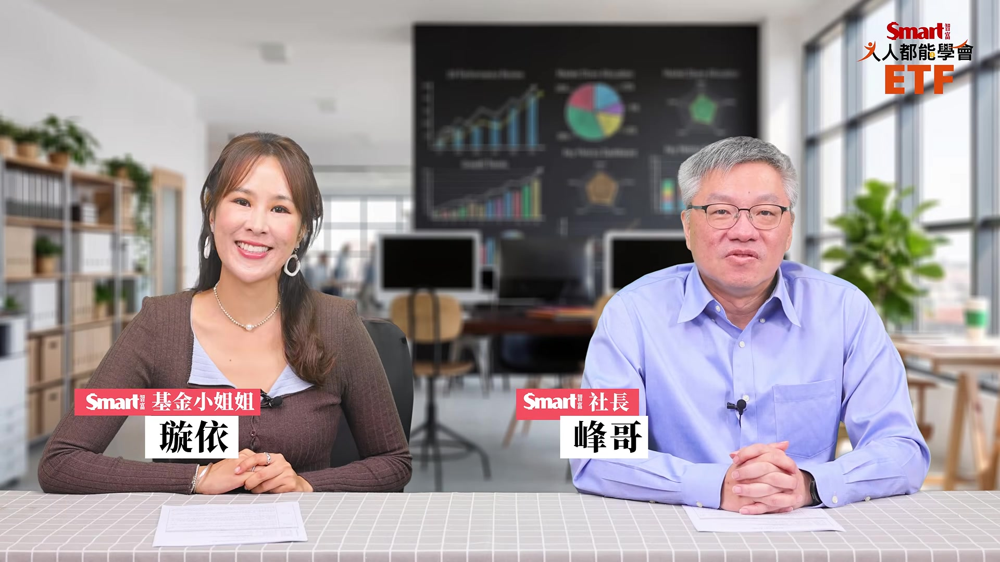
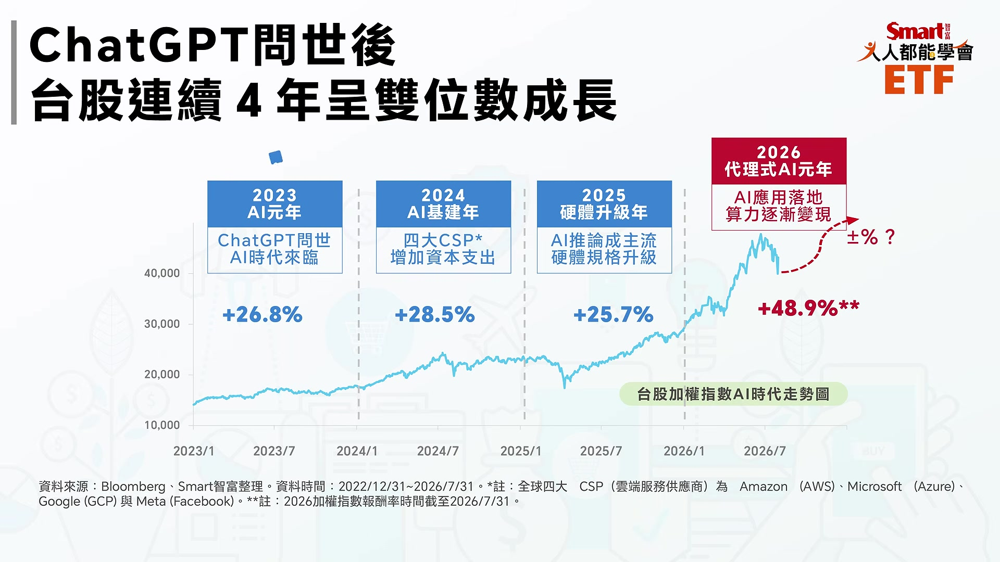
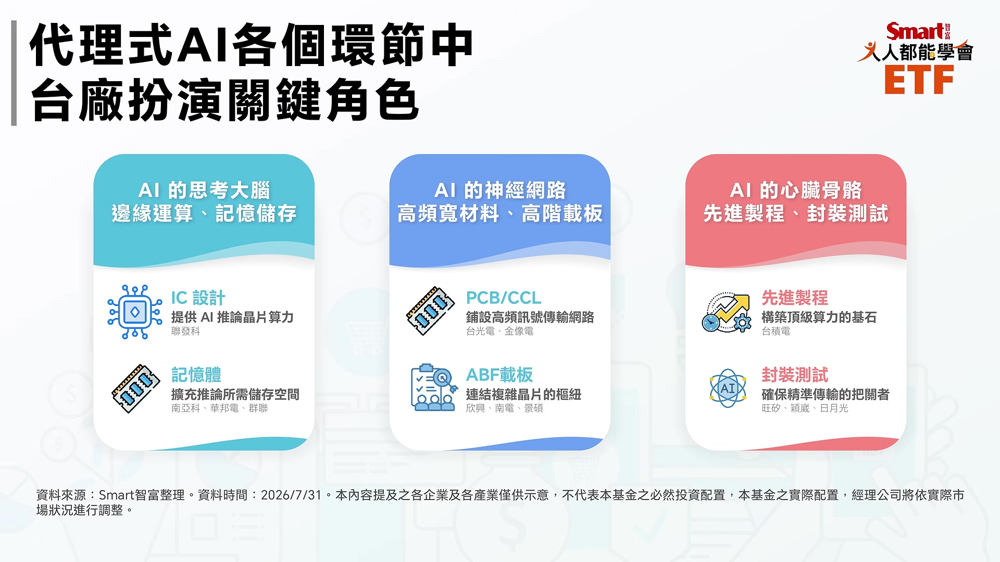
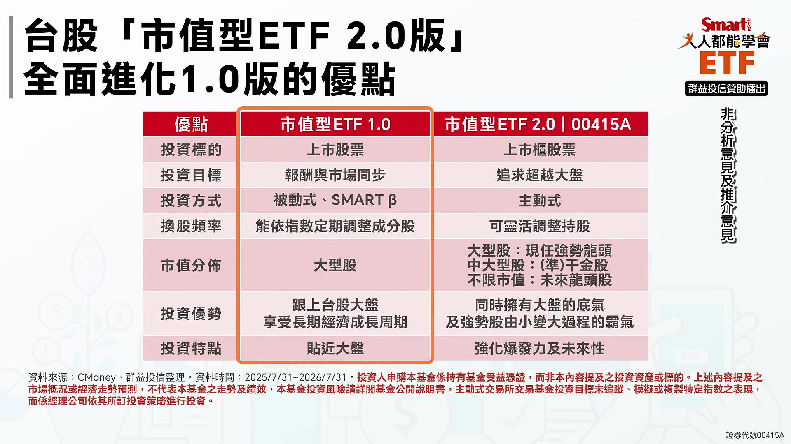
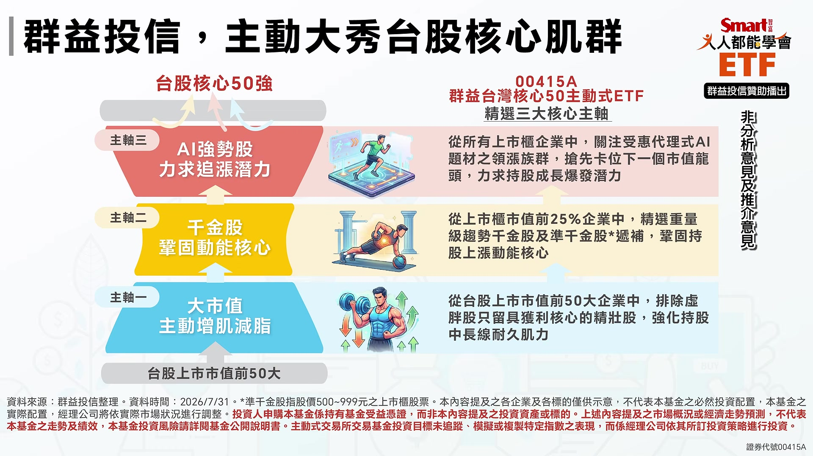
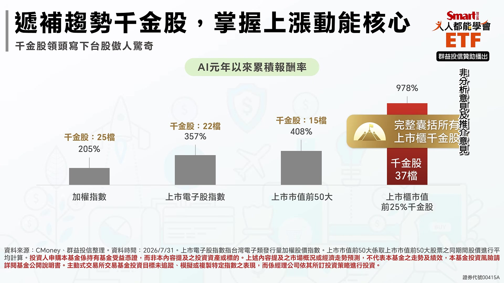
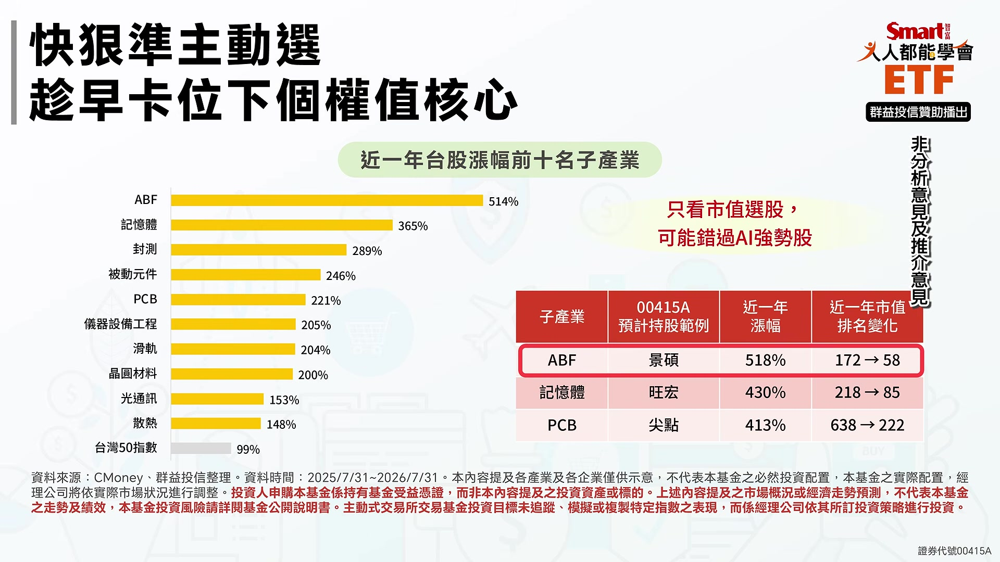

# smartmonthly-bw_Q6T7rLcSbds — 關鍵畫面索引

- 來源逐字稿：[smartmonthly-bw_Q6T7rLcSbds_GT.srt](smartmonthly-bw_Q6T7rLcSbds_GT.srt)
- 影片：https://www.youtube.com/watch?v=Q6T7rLcSbds
- 截圖數：14

## 00:00:05

**逐字稿片段：** 黃仁勳說代理式AI呢 將是未來十年最重要的運算革命 那隨著代理式AI的應用逐漸落地 台股的AI商機也是多點開花 所以你要怎麼樣同時抓住 現任跟下一任的成長核心 今天我們來解答 不是前任 現任跟下任 沒錯啦 對對對 現任跟下任 也就是抓現在強的跟未來強的 而且 為什麼會講到前任 因為最近跟前任有關的事情 好像滿多的 不是講我們啦 那峰哥也是投資專家 我知道你一定都是看未來對不對 所以說你發現啊 你最近好像也是有點AI狂熱欸 你什麼都 我們走在時代的軌道上 像你用AI做過些什麼啊 其實滿多的啦 我其實會用AI訓練一些文章模組 也會做一些 像你常常看到我做一些橘貓啊 然後搭配一些圖表 然後之前更 有一段時間在做動畫 那現在其實在做一些 用AI搭配來做一些剪輯 我其實生活各方面都有啦 我現在的狀況是這樣 以前呢 我的工作是每天都Google Google Google 現在是每天AI AI AI 而且還不只是用一種模型 像我GPT Claude Gemini 還有一些我剛才前面講的 就是有一些是 它的強項是在動畫跟語音上的模型 我會依不同的場景需求呢 會輪著用 而且你看 為了這個很多自己花 花錢去訂閱 花不少錢喔 其實我覺得聽起來很強大 好像很多個 這個峰哥分身 然後因為峰哥本身又很有能力 所以你的AI也可以被你訓練的 可以幫你解決很多工作上的問題 確實是這樣啊 所以也就是說用到久了之後就 你看我每天都要用這麼多 就是越用越回不去 那所以這一波的 AI浪潮就真的我說就是 不同凡響 像我現在最常在家裡的狀況下 我在家裡就開兩台電腦 然後呢 右邊這台電腦最常就是 我把任務派給AI 工作了 然後我在左邊這邊看大谷翔平的球賽 欸看看是不是 揮出有全壘打 欸全壘打這邊看完了 欸AI你做好了沒 所以真的很多事就真的不用自己動手 下指令 我覺得這不只是 峰哥的現狀 可能是很多人以後的未來 因為黃仁勳有一個觀念是AI agent 以後我們每個人都可以養自己的 AI代理人了 這件事情就是非常的重要 所以也正是因為如此 投資機會 其實不只是 我覺得啦 很多人很喜歡講AI泡沫 我覺得才剛萌芽 而且可能連這個芽 還超級無敵小了 我先講喔 這個是一個AI的長期的 大產業革命 所以 要撐起這一波的AI浪潮 你看就是 你需要很多的電力嘛 很多的算力 基礎設施做好 對 然後很多的伺服器 就說到這個 晶片到硬體呢 你都要跟著升級 那所以整個 供應鏈的這個環節 我覺得最棒的一點就是呢 很多的這些關鍵廠商 都是在台灣廠商手裡 所以呢你真的投資AI啊 現在其實連很多的外國投資人 都在看台股 更何況我們自己 對啊我們來看這張圖嘛 你看 2022年底是ChatGPT問世的時候 當時可能大部分人都覺得 啊又是一個好像新的軟體服務上市喔 結果沒想到隔年 整個用戶就快速的普及 就大量增加 所以 2023年我們現在回頭看就說 那是AI元年 當時我們都 不曉得那叫AI元年 現在是回頭看覺得那是AI元年 因為呢 這一年因為AI的大爆發 台股就漲了26.8%

**話題推測：** 引用黃仁勳談代理式AI，可能展示黃仁勳照片或相關新聞畫面。

---

## 00:03:42

**逐字稿片段：** 接下來2024年呢 各大雲端業者就開始燒錢啊 因為要 不能落後 所以就變成AI的基建年 那台股這一年呢又漲了28.5% 那到了2025年 這時候AI的推論成為主流 因為前面都訓練嘛 現在推理、推論這些就是後面的服務 我幫你解答問題啊 幫你執行工作啊 所以現在硬體的規格又要升級 那所以再漲了 25.7% 所以一直到今年2026年 我本來想說 台股連漲三年已經很可怕 結果呢 繼續漲 因為生成式AI 現在進化到代理式AI 又需要更多電力更多算力 更多晶片 所以光上半年 台股就大漲了快60% 連續4年雙位數報酬 真的驚人喔 所以 台股現在就是全球AI浪潮的領頭羊啊 其實剛剛峰哥已經用報酬率 讓我們很明顯的看到 台灣真的是這一波扎扎實實 受惠AI的浪潮 甚至我們從位階來看也是

**話題推測：** 談論2024年台股表現及AI基建主題。

---

## 00:04:41

**逐字稿片段：** 過去兩萬多點 轉眼之間已經四萬多點 甚至有機會問鼎五萬～六萬點了 我覺得還是有很多投資人喔 其實說真的這一波 他其實可能沒上車 甚至還一直覺得說 我還在想欸 太高了 他覺得太貴了 哇 那峰哥你要不要勸勸這些人 他錯過了上一波 他不可以再錯過下任啊 現在其實就是最常碰到問題 就我相信很多人心中都覺得 台股的AI的實力是真的啦 對 因為他每天都用GPT去問 每天都看到 然後他自己也在 也是可能是一個輕度或中度的用戶 不像我們已經到重度用戶 可是很多投資人 就想要問說 啊到底什麼時候可以上車 啊我可不可以現在上車 啊我如果現在上車 會不會套牢 就是一種靈魂拷問 先講一下我自己的結論啊 就這一波的AI行情 我認為還沒走完 所以也不要過度的憂慮 那台股我認為也還是在 一個上升的大的上升階段中 可是我們還是要面對現實 就是說指數在快速上漲一段時間之後呢 開始出現回檔 或是有一段時間在盤整的整理 上上下下... 就磨得讓你覺得很心煩 心浮氣躁 說真的這不是什麼壞事喔 反而是呢 這個時候呢 尤其在磨來磨去的時候呢 就是越是沒有耐心的投資人 越是想做短線投機的人呢 這時候呢籌碼換手 換到一些比較穩定的 長期持有者的手中 然後讓整個市場過於亢奮的 情緒降溫喔 這時候呢 反而是那些前面你落後 沒買到 或漲太快買不下手呢 這個時候讓你有一個 重新布局的機會 其實就好像是爬山一樣嘛 在你一直往上的過程當中 一定要稍微休息一下 甚至偶爾可能也會遇到 欸你以為是高峰 中間還會再下來一下 再繼續這樣連峰的爬過去 但是剛剛峰哥你有講 你覺得是重新布局的好機會 是有什麼根據嗎 我們用數據說話

**話題推測：** 提及台股指數從兩萬點到四萬點，可能展示台股大盤走勢圖。

---

## 00:06:38

**逐字稿片段：** 看這張圖喔 那我們根據彭博的資料來做出比較 那今年上半年 就到7月底的為止 台灣的台股的加權指數呢 上漲大概是49% 企業獲利來看呢 EPS成長了大概50% 也就是說 指數上漲跟企業獲利上漲 目前是在同步狀態喔 並沒有到一個 就是過度的虛浮的階段 也就是說呢 大家覺得看起來 好像我們從線圖來看 覺得乖離率拉得很高 你覺得股價漲得很快 但是事實上 獲利的速度基本上跟股價的 這樣的漲幅是可以相匹配的 因為有獲利實際在支撐 所以就是說這一波想要告訴大家的是 現在的上漲是 從財報看起來 上市櫃企業獲利看起來 整個台灣企業真的賺很多錢 不是憑空喊價 真的老實說 有時候我看到這些AI公司 在公佈獲利財報的時候 我也覺得 哇怎麼可以這麼賺錢 所以你看這個輝達的最新財報 那成長幅度 就前一年成長幅度已經這麼高了 基期已經這麼高了 欸怎麼今年還可以成長 然後他還預告明年 還到明年 所以真的是很嚇人 那你看這個美國的領頭羊 就是說這些前 比較前沿的公司都已經有這麼大的預測 那台灣幫他生產 這些產品呢當然就不用講了 所以我們就用 我們的神山台積電來看 現在2026年他這個預估獲利 根據這個FactSet 他針對分析師的整個的調查 中位數居然 EPS今年可能會到107.74元 哇 那算一下 現在大概的本益比來看 最近的股價來看 欸居然才只在23倍 喔這種世界級領先的公司 超級賺錢的公司 本益比只在23倍左右 所以你要說台股很貴 指數是看起來比以前漲很多 可是好像看 用本益比來算的話 好像也沒有太離譜喔 所以也就是因為台灣這個AI股的潛力 普遍都被看好 所以你看輝達最近居然要拿了 將近千億台幣來認購 聯發科的可轉債 這個老黃這個大手筆前所未見 我說真的當天我也是被嚇一跳 而且其實大家說這個動作 某部分也是對一種AI發展的宣示 代表他非常的看好後面 所以也讓AI續勢的故事 有機會可以持續的走 甚至剛剛峰哥意思就是說呢 現在可以真的看起來 在AI的趨勢發展當中 我們台灣的獲利是真金白銀的 才可以推升這樣子股價的上漲 基本面支撐相當扎實 對 訂單是真的 獲利是真的 大家都看到嘛 然後 現在公布今年的預估的GDP成長 會超過11% 本來坐九望十 現在已經不好意思 十叫做基本 超過 現在可能會超過11% 這也是真的喔 所以說 不過啦 我們還是要講 雖然這些數字都很漂亮 但是也不要全部都只看好的 因為 我們前面有大概講一下 就是說連續上漲之後呢 大家總是會比較心浮氣躁一點 賺太多也會害怕 所以 如果指數連續4年雙位數的成長 來到這個位置喔 那特別我們要講一下 因為美國今年 現在一直在吵說 哎呀這個好像市場有點熱 然後這個通膨降不下來 然後Fed一直動不動暗示說 今年有可能會升息喔(Fed9/17凌晨宣布升息1碼) 這樣對不對 所以現在投資重點不是無腦亂追 我們就要講 前幾年你大概就是死抱 大概就沒問題 所以現在不要無腦亂追 不要隨意的開槓桿 要有紀律的投資 同時選對標的 那不無腦亂追 那剛剛其實峰哥已經點到 我們台灣有護國神山囉 那我買護國神山可以吧 不會錯吧 你買應該不會錯啦 但我是這樣覺得啦就是 台積電當然是一定要有的嘛 這神山嘛對不對 你買零股也好 但如果你看股價的爆發力 現在台股的這個 AI的供應鏈是多點開花 所以在整片的花園之中 台積電不是獨美 是當然是很美的一朵花啦 但是旁邊也有很多 哇爭奇鬥豔 哦所以其實峰哥除了我們當然講了 護國神山它固然重要 但它不是獨美 那其他的爭奇鬥豔多點開花呢 是哪些族群 我們節目一開始就有提到嘛 因為AI是從生成式 走向代理式 那甚至到下一階段還會進入實體AI 就是所謂機器人時代 這個黃仁勳也說過很多次 那所以未來每一個人呢 你可能會有一個AI代理人 甚至一支AI代理小隊來幫你做事 所以你就會需要到 更多的電力供應嘛 更大的算力晶片 那更有效率的傳輸的零組件 那這些呢我們可以說 台灣有完整的AI供應鏈

**話題推測：** 明確提及「看這張圖」，預期畫面切換到數據圖表。

---

## 00:11:09

**逐字稿片段：** 你看從矽晶圓最上游 IC設計 然後先進製程代工到先進封裝 到記憶體 再到這個ABF載板 然後後面又進入了散熱 伺服器組裝機櫃 連機櫃用的滑軌現在都是先進工藝 看川湖光專注做滑軌 已經做成萬金股了 你看多驚人 所以台廠在這條的供應鏈上 很多都是世界級 有具有舉足輕重的地位 其實剛剛從峰哥唸的這些族群啊 我覺得就算你沒有實際的買AI 你一定也聽過 這些就是台灣非常熱門的題材面 那其實這些通通都是在AI供應鏈當中呢 必須要的 那既然我覺得小孩才做選擇嘛 剛剛聽到的題材我都想要 那市值型ETF峰哥這OK吧 其實市值型ETF其實我們之前討論過很多次 這是你的核心的部位 因為我們基本原則就是這樣嘛 先求拿到市場的平均報酬 有讓我們有一個安定的這個報酬的基石 那接下來我們就可以布局 積極進攻的標的 就挑出台股成長比較動能強的那些標的 像我們剛才講的那個川湖 做滑軌的川湖 欸它在幾年前還是三四百塊的股票 現在是超過萬元以上

**話題推測：** 列舉台灣完整的AI供應鏈環節及相關公司（如川湖），可能展示供應鏈示意圖或各公司Logo。

---

## 00:12:24

**逐字稿片段：** 那再說台光電好了 現在大家說台股有四大支柱嘛 就是三台一發 台積電、台達電、台光電跟聯發科 欸我們來回溯前面一下 如果在2022年底 它的市值排名才台股裡面 才排第120名 連前50都擠不上 現在都在前10名 那這些說明就說搭上這一波浪潮的這些公司 這些台灣的公司 成長的潛力真的非常驚人 其實剛剛峰哥用這個市值排名 已經完全點出來了 也就是說呢現在非常有發展性的 而且甚至已經排到市值很前面的 那如果你是在以前買的話 你可能就會錯過這些機會 也就是說我覺得光純市值這件事情 可能會讓我們錯過很多的黑馬 完全正確我們看這張圖就知道嘛 這段期間呢上市市值前50大股票 平均的漲幅是408% 就大概是4倍 這其實已經很棒很棒的報酬 可是如果你比起那些 旺矽、台光電、川湖 這些是AI時代的超級成長股 他們的漲幅動輒10倍以上 甚至你看旺矽 它的漲幅是45倍 就這幾年幾年真的非常驚人 所以說光靠可能過去我們認為的 好像是市值大買它就沒問題 這樣的市值排序的傳統方法選股 有點在AI時代可能沒辦法幫我們選到 我們講的希望有爆發力有潛力的對不對 你講到重點就是說因為我們現在要 挑一些有爆發力有潛力的成長型標的嘛 那這些通常就是比較偏 目前可能是中小型 所以市值型ETF因為它指數規則 就是它要找出貼近大盤表現 那投資方式也是跟著這個 被動的這個原則 要跟著指數來調整 所以譬如說你前50大 你要你要進0050 你要前50大你才能被選進去嘛 所以你可以看到這些大部分的這些被動呢 持股就是以上市的龍頭股是為主啦 那像其他像上櫃股票啦 這些準千金股啦 所以還沒有長大的這個動能成長的強勢股呢 它很可惜是因為指數規則的關係 就暫時還不會被納入 所以如果這些非龍頭股它出現 缺貨題材、漲價題材或其他題材的時候呢 因為市值型ETF呢 沒辦法 還沒有辦法納入這些這些標的 所以呢當他們在展現爆發力的時候呢 這些市值型ETF也就沒有拿到這些漲幅 所以如果你是希望能夠及時掌握這些 快速成長的AI紅利 或者是找到下一任的核心成長標的的投資人呢 那你就會覺得啊很扼腕 就是說我明明知道它很有機會 但是因為它不在這個 被動式的大型的標的裡面 所以就是想要來解決投資人這樣扼腕的問題 甚至也希望大家不要錯過這一波AI的長線紅利 過去呢以這種市值排序為主的市值ETF呢 我們可以把它叫做上一代叫做1.0

**話題推測：** 介紹台股四大支柱（三台一發）及台光電的市值排名變化。

---

## 00:15:19

**逐字稿片段：** 現在已經有所謂的2.0版本了 目標可以瞄準下任的核心 其實它的投資方法有個不一樣 就是主動式了 透過主動選股 我覺得最大的差別就是它會變得更靈活啦 就可以很靈活的來調整持股 那也就是不只設限於大型股 包含像是中大型股 其實這類就叫做所謂的準千金股 未來也有機會成為萬金股 那還有不限市值了 把這個門檻呢先拿掉 那它就有機會可以找到未來的超級成長股 那這樣的投資優勢基本上就幫你 大中小全包了 它可以強化爆發力 但是也不會錯失 現在本來在台灣就已經夠強的 前面的權值股 簡單說2.0版的市值型ETF呢 就選股不限市值 中小型股、上櫃股票呢 都可以放在這個選股池裡面 就讓經理人呢主動選股 及時掌握有未來性的這個契機 成長契機或未來成長題材 擔任下一任的核心 那目前有什麼樣的產品是2.0 璇依來幫大家開箱一下

**話題推測：** 引入市值型ETF 2.0版本的新概念。

---

## 00:16:17

**逐字稿片段：** 既然剛剛峰哥講到叫做經理人主動選股 大家就知道 現在又是有檔新的主動式ETF問世啦 這是群益投信的主動群益核心50 (00415A) 那大家聽到這邊都知道 其實它的核心還是我們希望是傳統的市值 但是我們叫做2.0版本 它主打的就是呢 我們有這個大秀台股的核心肌群 我們把它想像成一個 專業的健身教練 峰哥有健身嗎 峰哥跑步有健身有跑步對不對 所以說呢我們把一塊一塊的核心肌群 先扎扎實實的練到位 這樣的肌肉在需要的時候 就可以展現強大的爆發力 主動篩選股票呢確實是有它的價值 因為呢台股是前50大公司呢 不見得都表現得很好 因為有些就真的只因為它產業規模的比較大 或是它過去就已經成長上來了 所以排名前面的跟排名後段班呢 如果你真的要去看它這幾年股價漲幅 其實是相差非常懸殊 我們就實際以數據帶給大家看看哦 前50大市值當中呢 如果以表現最好的前10檔 平均的漲幅是有來到了156% 但是表現最差的10檔卻只有 4%呢 大概是股息的程度 差距非常非常的大 所以呢基本上用市值打底 只是第一步 但是主動的汰弱留強 才是這檔主動選股 主動核心的關鍵 再來第二個峰哥我們剛說 增肌減脂對不對 我們剛剛把虛胖的剔除掉了 我們留下是有實質獲利核心的 獲利能力的這一些 那我們的基底好了之後

**話題推測：** 介紹新產品「群益核心50 (00415A)」，可能展示產品資訊或Logo。

---

## 00:17:47

**逐字稿片段：** 疊加實力要來鞏固 動能核心 動能核心這件事情 我們剛剛不斷強調 我們要找後面有潛力的 所以呢它的選股邏輯 還會再從上市櫃的市值前25%的企業當中 選出千金股 它們的定義是股價在 500元到999元之間的準千金股 那麼就會在遞補名單當中 為什麼納入千金股啊 其實我們都知道 最近的千金股呢 通常具備叫做題材護城河 也是這幾年支撐台股 創新高的主力部隊 那說到千金股呢 其實帶大家來看一個統計了

**話題推測：** 轉向討論「鞏固動能核心」的選股策略。

---

## 00:18:21

**逐字稿片段：** 如果從AI元年以來呢 全部37檔千金股的累積報酬呢 是高達了978% 這個數字超過了加權指數的205% 也超過了上市市值前50大的408% 所以呢把千金股納進來 就等於是把 股價上漲的動能核心 給鞏固住了 再來第三

**話題推測：** 提供AI元年以來千金股累積報酬的統計數據。

---

## 00:18:43

**逐字稿片段：** 我們增肌減脂然後鞏固核心之後呢 後面要去找潛力吧 我們剛剛說到呢 我們希望可以去找追漲的潛力 而且峰哥一開始就提到了 以後每個人的 工作環境就是代理人的AI小隊了 代理式的AI是未來的機會 所以呢像是ABF啊 被動元件、記憶體這些族群呢 非常值得在這個時候 卡位來追求爆發力 但是呢 舉例來說 通常這些族群呢 它的市值可能過去是比較小的 所以呢他們就用題材面去想

**話題推測：** 轉向討論「追漲潛力」的選股策略。

---

## 00:19:12

**逐字稿片段：** 像是ABF的景碩 它這一年的市值排名 從172哇直接衝到了58名 股價的漲幅高達了518% 這種快速長大的 下任龍頭下任核心 就是可以用來呢 醞釀爆發力的標的

**話題推測：** 提及ABF族群中的景碩及其市值排名與股價漲幅變化。

---

## 00:19:29

**逐字稿片段：** 我們這邊幫大家解釋一下ABF是什麼 科普一下ABF 對對對其實可能股市投資人 知道比較多 但是如果新手的話了解比較少 其實呢這是一家日本的 味精公司它在研究過程中 欸不小心 發現一種高分子的 絕緣樹脂材料 (味之素積層膜) 那用這種材料呢 來做成IC載板呢 也就是我們現在常聽到ABF載板 它夾在半導體跟 印刷電路板的中間喔 那作為一個連接跟傳輸的夾心層 那這個零組件呢 在AI時代來臨之前呢 還經歷過一段 很嚴峻的這個去庫存的黑暗 去庫存的黑暗期 但現在就是大缺貨供不應求 那麼除了是有 現在供不應求大缺貨題材的 ABF族群之外呢

**話題推測：** 解釋ABF的背景和材料用途，可能展示相關製程圖。

---

## 00:20:15

**逐字稿片段：** 00415A目前呢 打算會配置的產業 包含了記憶體、封測 晶圓材料、PCB 儀器設備、光通訊這些強勢的子產業 半導體再加上 電子零組件合計佔比的大約是8成啦 其實也就是把所謂的這個 AI給它緊緊的抓起來 所以我聽你講完大概整個AI的科技供應鏈 應該通通都打包進去 已經整個產業的輪動應該都有了 其實一開始我們說什麼 我們要找現任跟下任嘛對不對 所以你聽起來基本上就是現任的核心 跟下任有機會的核心都納進來 這就是群益這一檔00415A的特色 那其實呢群益投信在 中小型股的研究上是有實績的喔 例如群益旗下的店頭市場基金 他們在去年7月的時候 就已經把旺矽列為前十大持股 哇當時旺矽的市值排名 其實還在104而已 不過到今年7月底 旺矽的股價累積上漲幅度是462% 市值排名已經從104 跑到了38名了 那麼在這段時間呢 櫃買指數喔只漲了50% 這顯示什麼 欸顯示主動式操作的價值 就是要在市場還沒有完全反應之前 提前觀察到企業的基本面跟產業的趨勢 並且超前布局 謝謝璇依幫我們開箱00415A 我們現在幫大家 快速複習一下今天節目的重點 第一台股現在正處在 基本面良好的上升階段 就算短線出現回檔 我們也不要太過自己嚇自己了

**話題推測：** 列舉00415A目前打算配置的產業類別。

---
