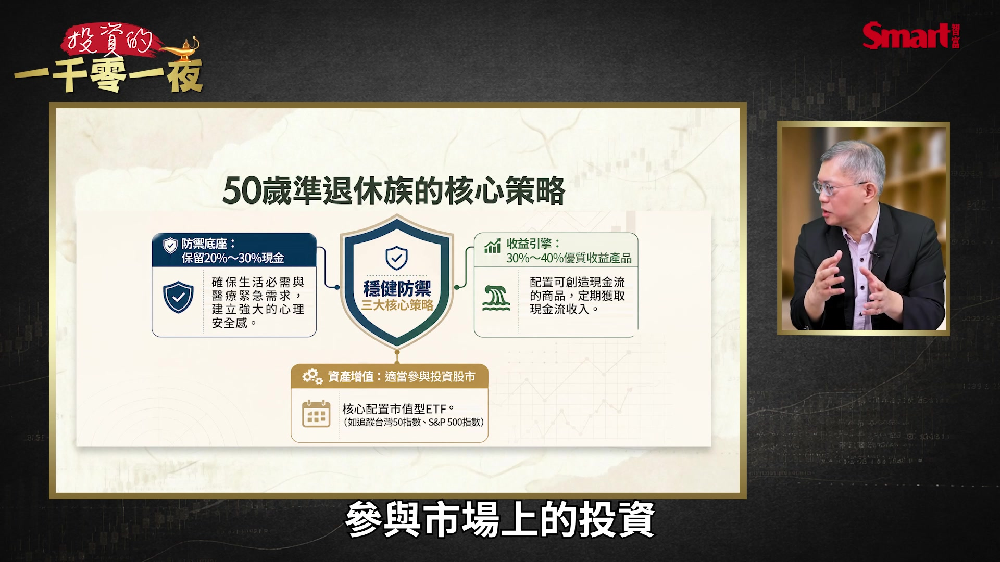
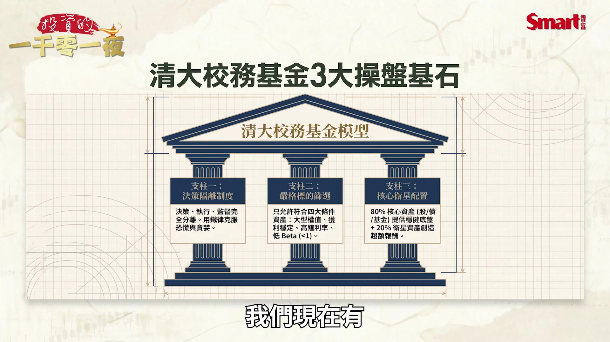

# smartmonthly-bw_TrzuopEcNDE — 關鍵畫面索引

- 來源逐字稿：[smartmonthly-bw_TrzuopEcNDE_FIN.srt](smartmonthly-bw_TrzuopEcNDE_FIN.srt)
- 影片：https://www.youtube.com/watch?v=TrzuopEcNDE
- 截圖數：6

## 00:00:27

**逐字稿片段：** 不過今天我們請到的是一位在這方面的專家 林哲群教授,先跟大家打個招呼 各位來賓大家好 林教授如果大家有看過教授以前一些書 或是一些訪談應該知道 他是清大的校務基金的操盤人 那他的專長就是 計量金融跟資產配置 同時大家的豐功偉業一定要跟大家講一下 就是他帶領這個清大的校務基金 2014年成立的時候只有5000萬的規模 但到今天 已經到了50億這個規模 所以這個過程我覺得 也是非常值得大家參考 就是說怎麼樣能夠透過一個長期紀律配置的方式呢 讓這個資產規模持續的增長 那也是我們今天邀請他來跟大家一起分享 那第一個問題我想請教教授 就是你常常強調就是資產配置比預測市場重要 因為投資人常常喜歡 就猜一下這個猜一下那個 但你強調資產配置是非常重要 那我想幫大家問一下 如果是50歲 他現在即將退休的這樣的人 或者說可能已經退休了 可是手上就有幾百萬現金呢 那就有點煩惱說如果要退休要怎麼辦 那這樣的人喔 這樣的準退休組 你給他的第一步的資產配置建議會是什麼 其實是這樣子喔 因為剛剛豐哥有提到比較少投資嘛 所以我基本上是想建議 一個大概50多歲的 還是進入到一個長期投資的一個思維 先不要是想說 我到底要選哪一個標的來賺錢 應該是想說基本上來講 你現在跟年輕來比的話 其實你已經比較沒有那麼長的時間 可以去承擔比較大的這個損失 所以一個配置來講 就相對是比較是重要性的 對不對 因為你的距離 你應該去建立一個資產組合 能夠陪你走完未來的二三十年或三四十年 現在人後面的歲月也還蠻長的 我覺得這是比較好 所以我個人會建議就是一開始可能 你要想一下如果說你有這幾百萬 那你到底有沒有一個生活的一個必需 或是醫療的緊急需求 我覺得如果有的話 我倒是蠻建議你還是要有一點準備 大概說 百分之二十或二十幾 二或三十都可以 那剩下的你就要去看喔

**話題推測：** 介紹來賓林哲群教授，可能伴隨教授姓名及職稱的畫面。

---

## 00:02:42

**逐字稿片段：** 你當然有一些可以比如說30到40 你可以去參與一些 比如說像債券啊 或是債券型的ETF 或是比較有收益型的產品 為什麼 因為50多歲 你要接近退休 將來你需要的應該就是Cash 就是現金 那這些可以定期的給你一點 現金流的一個比較穩定性 但是五十幾歲坦白講 你說距離人生的一個未來還有一段時間 那我是覺得我們可能也會想說 參與市場上的投資

**話題推測：** 建議配置30-40%於債券、債券ETF或收益型產品。

---

## 00:03:13

**逐字稿片段：** 所以我個人建議也是要有一部分的比例 可以來參與市場上的這個經濟的成長 比如說你可以去參與像 如果跟市值型相關的ETF 用指數 臺灣就是0050這種等等 或00608 美國就是S&P500 那或者是你如果對一些主題型有興趣的 但是風險性也沒那麼大的 你也是可以參與 那我覺得用這樣子的配置 並不是要讓你在短時間之內啊 要賺很多的錢 是要讓你在未來如果說你有 如果市場下跌的時候 你還是依舊能夠存活在這個市場 然後陪你過完未來的人生的歲月 這才是最主要的

**話題推測：** 建議配置部分比例參與市場經濟成長，例如投資0050、00608或S&P500等市值型ETF。

---

## 00:03:54

**逐字稿片段：** 教授我想要請教一個問題 這個問題可能過去沒那麼常被提到 但是這兩年因為股市漲太快 所以大家有一種FOMO就是怕買不到 他們就會想說我現在幾百萬現金我是不是趕快這一刻 立刻趕快就一次壓進去了 免得我如果再晚兩年 最近常常會提到我再晚一年可能指數從兩萬點變三萬點 再晚一年可能三萬點變四萬點 那你自己的想法是 其實這個問題 不會太困難啦基本上就是分批進場 因為 你分批進場有兩個好處第一個是 避免你買到你認為的相對高點 對對對 第二個就是說 因為你過去如果比較少投資的話 你一定要讓自己去習慣市場 那市場的市場投資一定有波動 你要習慣這個樣子的一個波動 所以我認為你分批進場 這樣就可以避免掉剛剛主持人講的這個困擾 然後之後也許每一季 或者是每半年你要再重新來review 重新來檢視你的投資組合 這樣才是對的 對對對 那有沒有什麼在其他方面就是 就是我們剛才講的就是分批進場 以及這個選擇一些成長型的標的 然後一些收益型的組合 我們剛才講的這個幾個項目之外 還沒有什麼其他在50歲做投資 應該要注意的事項 有像最近我在看這個事情是這樣 因為最近那個因為去美元化 這個確實是最近大家很擔心 因為這麼多年來我們都習慣就是 美元就是最安全的 是那現在因為這樣的緣故 那又地緣政治的影響 過去那個低利率的環境 坦白講已經過去了 那如果說真的要做一個比較長遠性的投資的話 我倒是也蠻建議說 如果你要配置在債券市場的話 應該是有一些以短債為主是比較好 因為如果說以長債的話 因為你的 那個殖地率如果上漲的話嘛 價格就會下降 對你長遠來看是不好 但是短債的話 它時間短 它的本金的話 比較容易在短時間之內就回收 所以我覺得這裡要跟大家說提醒一下 這個跟過往可能有一點不太一樣 所以那教授你看 就是說短債來看 因為有一些短債當然也有是國債這種 那也有一些是屬於投資等級債 或是特別是非投資等級債短債蠻多 那你自己會覺得比較偏好哪一種 或是說你覺得其實綜合條件來看都可以 如果是50多歲的話 我當然是建議要比較保守一點 對啊 如果是年輕的話 當然我會建議你可以take一些風險 所以剛剛但是我們這個談的是 50歲的50歲 當然這一塊要相對保守 這一塊主要是要讓你提供你 穩定的現金 降低你的整個資產組合的這個 風險這樣子 所以 如果是50歲的還是建議是比較偏向國債的這種短債為主 當然未來啦 那沒關係接下來我們就剛才討論到說 可以承擔一些風險那當然就是年輕人 所以討論完50歲的這個準退休族之後我們就來討論一下 當初社會的年輕人 如果每個月可以存一萬塊 那要怎麼樣來做起步的資產配置 這風格不簡單 照顧了我們銀髮族要照顧年輕人 我們現在那個觀眾很多元 我們一定都要照顧到 是是是 其實年輕人喔 你說每個月一萬塊 其實很多年輕人是聽不進去 我自己的感覺 那也有可能說 我如果給你一萬塊啊 比如二十年三十年 那您報酬率多少 那你未來有多少 這個其實還是有一點虛 他們會相信嗎 說真的我不知道 如果說實際上來講 你算出來當然就是這個數字 因為算出來可以得到 也用過去的回報來看 因為過去回報很好 但是以人的心理層面跟他的數字來看 他是不一定會去相信你要這樣子做的 所以我倒是蠻建議年輕人 應該要建立這個長期投資的習慣 因為你所謂的長期投資就是 第一個你要紀律性的投入 你要有紀律 紀律是說你一定要強迫自己 一段時間你要有投入 存下來還要投資進去 還要長期要持有它 然後你再學會怎麼樣面對市場的波動 我覺得這是非常重要的 為什麼 因為你如果說你這樣長期投入的進去對不對 那市場一定會有波動 那如果你今天遇到波動的話你就恐懼 你就恐懼的話你就要出場 那你就放棄了過去你這麼多時間以來累積的這些規模 所以我覺得要養成這個長期投資的這個習慣 而且要有紀律性的去投資 另外一個要給年輕人一個想法 剛剛主持人提的是說你每一個月有一萬 可是各位年輕人你要去思考 時間是站在你這邊的 而且你現在是年輕你一定會有工作 所以你除了你說你有 除了你這個穩定的一萬塊 收入對穩定的收入 其實你的收入是會隨著你的生意增長 對薪資會增長 所以你不是說每個月只有一萬 你可能到一個階段 你可能變成一萬五或兩萬 但是你養成我剛剛建議大家的就是一個 長期持有 然後把那個波動當成是你的好朋友 那之後時間的負力就會站在你這邊 這個是我覺得對年輕人 建立這個長期投資的習慣是比較好 你比跟他去講說 你每個月一萬塊兩萬塊 你存二十年存三十年 然後你就會得到一個多少錢 那個我覺得太虛幻了 他不會聽你 因為現在大部分的人都想賺快錢 但是如果你給他一個概念說 你建立長期投資的這個portfolio 那你時間是站在你這邊 為什麼 因為你年輕嘛 而且你又不斷的有收入 所以到那個階段的話 相信你的成果應該會非常美好 我覺得也是這樣 就是說剛才教授講一個很重要的 就是年輕是 最重要不是說你未來獲利多少錢 用去推算的 而是說你建立了這個長期投資的情況 我自己個人的這個看 因為我做財經雜誌做那麼多 我看了很多的讀者 我有個感覺是這樣 就一旦你建立長期的投資習慣之後 投資是一件會上癮的事 就特別是你有正向回饋的時候 你剛開始可能想投資一萬塊 後來你講把你身邊所有剩下錢 可能只剩下兩萬五千塊 你就全部都投入了 就滾動成一個長期往上爭執的一個 財富累積的一個巨輪 我覺得這個是我過去看到一些 包括我自己的同事 也是這樣一個很好的經驗 那我再補充一點 因為年輕的話 時間站在你這邊嘛 所以你的投資你的資產的配置啊 實際上可以比較 大的權重啊在 在那個股票型的資產 比如說單個股也可以或是ETF等等 我是建議大概60到80都可以 然後你要有一個概念是 因為你時間比較長 所以基本上你是 藉由這樣的一個投資的行為去 享受這個長期經濟的成長 還有 或者是企業的一個 一個未來的一個發展 那接下來想請教授再跟我們講一下 那對這樣想學習投資的社會的新鮮人 有什麼樣的迷思一定要避免 或什麼樣錯誤 地雷一定要躲開的 迷思的話就是說 不要去想要賺那個快錢 所以說就是我剛剛 因為現在當沖很流行 當沖也是因為現在市場比較好 對不對 那你就像說 像當沖市場好的話 那當然有些人會在這個過程中得到一些很好的成果 可是市場也不見得像 現在這種情況 所以建立長期投資的習慣就是說 你長期來看的話 你那個波動就會去弱化 那你就是參與這個企業的成長 跟長期市場上經濟的一個趨勢 那民視就是不要去想著 短時間內要賺快錢 把投資當成是一種事業的投資 好 那接下來我想 我想請教一個就是 特別是最近也開始 散戶投資人開始承受到這些壓力了 因為前一段時間 過去一年因為漲太快了 包括臺股今年上半年呢 就漲了五、六十趴 大家都覺得反正股票 只要你有錢趕快買 趕快買你就會賺大錢 但最近突然 這一次的大回檔呢 開始受到挑戰 然後就一口氣就跌了二十趴 有一些個股甚至跌了五十趴 就有一些這些比較明星的產業 最後這段時間漲得很快 瞬間突然跌五十趴 把大家這個心理壓抑就很大 那我想清大、夏威夷基金 過去應該也碰過這樣類似大迴盪 或是甚至更嚴重的股災這樣的狀況 那靠什麼樣的制度呢 可以避免在投資在最恐慌的時候做錯決定 這個我們坦白講 這麼多年來我們歷經過大概蠻多次 起碼四、五次 不過為什麼清華這個模式值得大家參考 其實並不是因為我們操作的技巧有多棒 不是這樣子喔 是第一個我們有一個原則就是 第一個制度優先 再來就是說我們篩選 我們 資產組合裡面的標的 最後就是一個資產配置 那回到制度 制度面就是說我們的 決策 跟執行跟監督 事實上是分開的 那這個制度最好的一個精神就是說 我們告訴我們自己負責的同仁 包括我當時是我 就是說當市場上 最壞的時候 你一定要先 停下來 就是英文就講Pending 人寧願什麼都不做 對 因為什麼都不做也是一種作為 那為什麼要這樣子 因為你要先去了解為什麼市場上現在會是這個情況 到底是發生了什麼事情 如果是屬於系統性的風險的話 那不影響你當時持有這些標的的一個初衷 那基本上我覺得這個應該是你蠻好的一個時機怎麼樣 可以用比較 便宜的折扣的價格買那個優質標的 所以這個唯有制度才有辦法控制我們 因為法人跟個人最大的差別就是 情緒會受到幹擾 你覺得抄別人的錢比較會受到幹擾 還是抄自己的錢比較會受到幹擾 我覺得抄別人的錢比較不會受到幹擾 抄自己的會 這是人性啦 所以說法人那一塊你一定要用制度來規範 但是話又講回來 你說你停 那什麼樣的心理素質可以讓我們這樣子做 那就回到篩選的標的 我們的標的都是屬於要大型的權值股 然後獲利能力要穩定 然後要有高殖利率 再來就是Beta 當時個別的話要小於1 雖然我們最後有改 就是整個投資組合Beta小於1就可以 但是最起碼我們要這樣的標的 才能夠進到我們的組合來 那再來就是我們在還沒有開始經營的時候 我們就給自己一個準備 就是我們每賺100塊錢會留10塊 也就是說把10%先留著 留著就是當一個cushion cushion就是說萬一我真的不好的時候 其實讓我有現金在手上 這個是讓我的心理的安全機制 自己就已經先比較穩定 所以常常在跌很深的時候 實際上來講我們是有現金在手上 這個會比較OK 那之後就進到資產配置 那資產配置 你一個這麼大的Portfolio 你當然是有一些要 要參與市場上的成長 那有一些要跟市場上聯動 那有一些要防禦型的 那就是按照這樣來做 我們現在有

**話題推測：** 提出新問題：面對股市快速上漲，投資人是否應一次性投入所有資金（FOMO）。

---

## 00:15:17

**逐字稿片段：** 大概有核心資產 衛星資產 我們的核心資產的部分 大概佔80% 包括ETF ETF當然包括股票的跟債券 還有個股 還有共同基金 那剩下百分之二十是衛星資產 這樣子 那你們會說 譬如說我這邊看到的資料說

**話題推測：** 說明基金的資產配置結構：80%核心資產（ETF、個股、共同基金）與20%衛星資產。

---

## 00:15:35

**逐字稿片段：** 你還會做一些動態再平衡 那方法是什麼 動態再平衡就是 因為你整個portfolio 你原本持有都有一個權重 那萬一市場上一直很好的話 一定裡面有一些會一直往上漲 往上漲的話 也許要超過你之前原本期待的這個 的預期的風險可以承擔的 那你就適度的要做減 然後獲利出來 那獲利出來的話 我們就把它有部分把它定存 或是有一部分把它轉為這個貨幣型基金 當成是一個流動性的準備 那如果之後有機會往下走的時候 這些Cash就是當成我們可以再用 那個天然的柴火 然後用比較便宜的價格去取得油脂的資產 大概是這樣來做 教授問一個比較挑戰性的問題 因為現在市場非常好 所以你這樣的做法是這樣非常穩健跟策略性 就是整個佈局非常的均衡 然後又穩健 但也會有人說 我如果這麼 就是我如果獲利了 我就趕快把它賣掉一部分 這樣不是會 延緩我整個的資產 快速增值的動力嗎 那你怎麼看這個問題 其實是不會 為什麼 因為你如果一漲上去全部賣掉 你就失去了 整個動力就沒有了 那我們是適度的解碼是說 第一個控制整個的風險 第二個我適度解碼 我現金有流出來 我適度的獲利 適度的獲利 那我這個Cash還可以做一些其他的佈局 或做一些未來流動性的準備

**話題推測：** 詢問基金如何執行動態再平衡。

---
