# smartmonthly-bw_V35DrgT3U7w — 關鍵畫面索引

- 來源逐字稿：[smartmonthly-bw_V35DrgT3U7w_GT.srt](smartmonthly-bw_V35DrgT3U7w_GT.srt)
- 影片：https://www.youtube.com/watch?v=V35DrgT3U7w
- 截圖數：35

## 00:00:07

**逐字稿片段：** 改寫新高點 甚至就挑戰5萬點

**話題推測：** 股市改寫新高點，預期顯示台股走勢圖。

---

## 00:00:15

**逐字稿片段：** 大家好 歡迎再次收看 投資的一千零一夜 我是峰哥

**話題推測：** 主持人開場問候。

---

## 00:00:18

**逐字稿片段：** 升息循環開始了 但最後會升到哪裡 這是現在大家最關心的事 而且對台股的影響 又是什麼 我們今天來討論一下 那我們先從 上週的關鍵場景說起 上週三就9月16號的那一天 聯準會以12比0全票通過 升息1碼 就0.25個百分點 那聯邦基金利率 代表短期利率的水準 就來到3.75%到 4%這個區間 那這個利率水準是 2023年7月以來 整整3年多 第一次升息到這個水準 所以市場在升息前 其實已經 嚇了一跳 因為本來是預期 不升息的 但後來就開始 慢慢對市場 升息的機率愈來愈高

**話題推測：** 介紹影片主旨：升息循環議題。

---

## 00:01:06

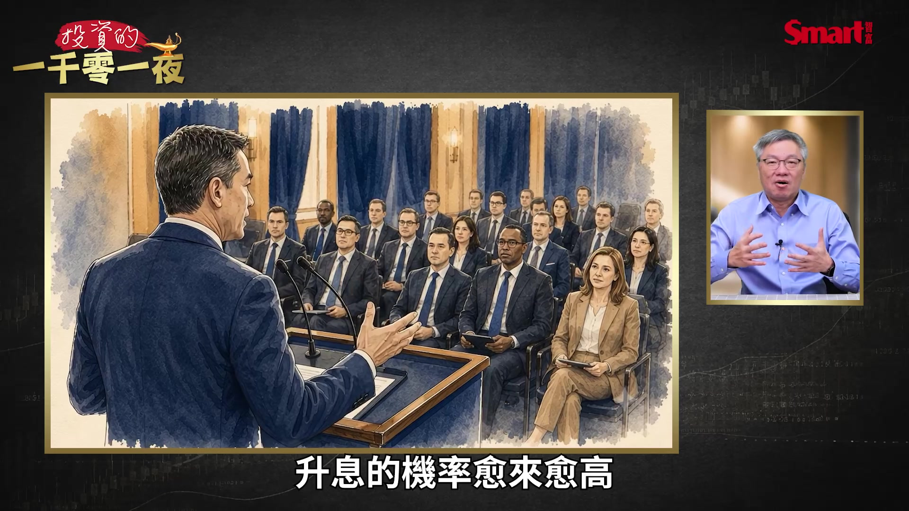

**逐字稿片段：** 本來是6成 後來到8成 甚至最後到了9成 所以市場在這個 預期升高的情況下

**話題推測：** 市場預期升息機率從6成、8成到9成的變化圖。

---

## 00:01:12

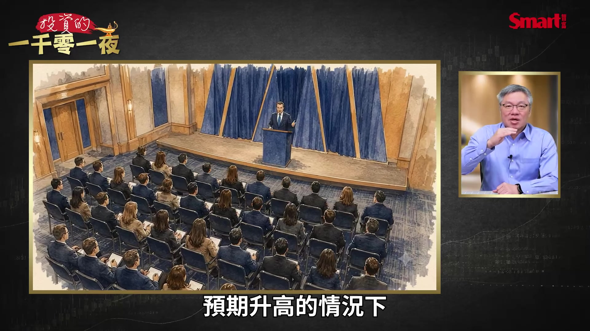

**逐字稿片段：** 十年期美債的殖利率 也是一路就往上衝 先衝到了5% 後來又到了5.04% 這是19年來的新高

**話題推測：** 十年期美債殖利率走勢圖及其衝高數字。

---

## 00:01:22

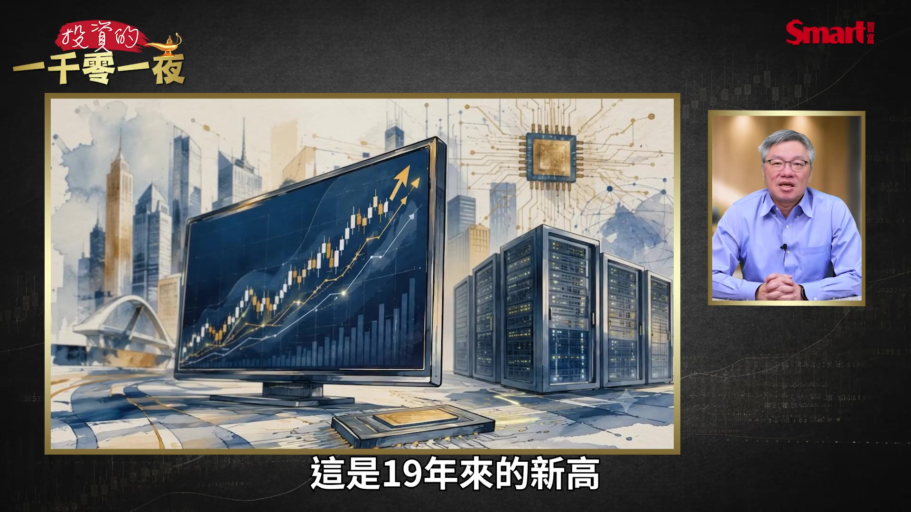

**逐字稿片段：** 台灣的央行的理監事會議 也做了 這個利率決策會議 但是他們的決定是不跟

**話題推測：** 轉向討論台灣央行的利率決策。

---

## 00:01:29

**逐字稿片段：** 重貼現率就維持在2%不變 那我們來看一下台股 在這個事件後 是怎麼樣 台股在9月18號

**話題推測：** 台灣央行重貼現率維持2%不變的公告。

---

## 00:01:38

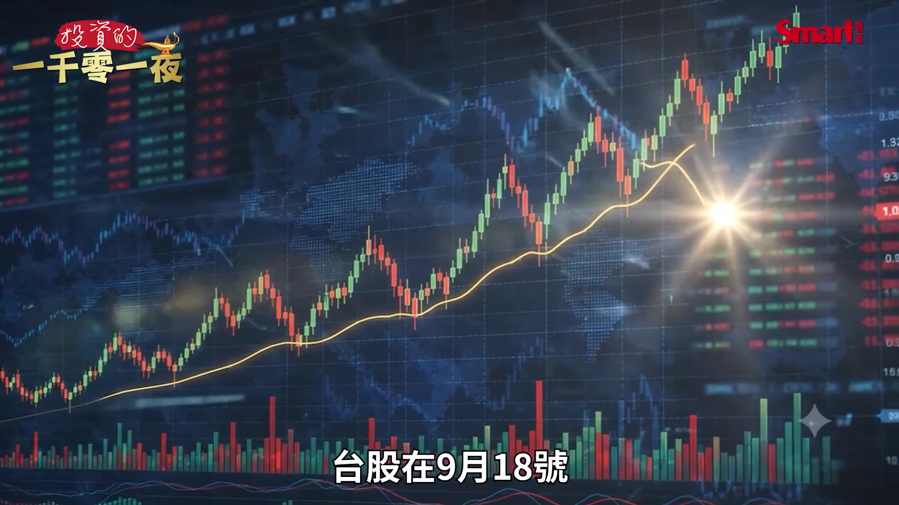

**逐字稿片段：** 當天大漲了892點 收在4萬7180點

**話題推測：** 台股大漲892點的具體數據與收盤點位。

---

## 00:01:44

**逐字稿片段：** 那外資單日買超近870億元 可以說是最近以來 非常大的一次買超 所以大家的解讀是 利空出盡 但是真的利空出盡了嗎 還是它只是一個 短期的興奮

**話題推測：** 外資單日買超870億元的數據圖表。

---

## 00:01:59

**逐字稿片段：** 所以我們今天要回答 三個問題 美國利率這一波 會升到哪裡 那轉折點 也就是說 高原期之後的轉折 向下的時間點 會大概在什麼時候 另外這一波的升息 對股市跟債市 會有什麼影響 最後 我們還 加上一點大家 很多人就忽略掉的變數 就是這一次葉門 胡塞武裝的攻擊 是不是會產生 一些意外的結果 首先我們來看 利率的未來趨勢 那麼利率會升到哪裡 我們要先看點陣圖 這是我們來看美國利率 最重要的一個參考數據 聯準會這次公布新的點陣圖 就是每位參與決策的官員 對未來利率的預測 那我整理如下 我們先來看 目前 在Fed的點陣圖的中位數 大概是在3.875% 那對應到利率的 實際的這個 政策指導區間 就是3.75%到 4%這個區間 就是現在 Fed設定的利率水準

**話題推測：** 列出本次影片將回答的三個核心問題。

---

## 00:03:03

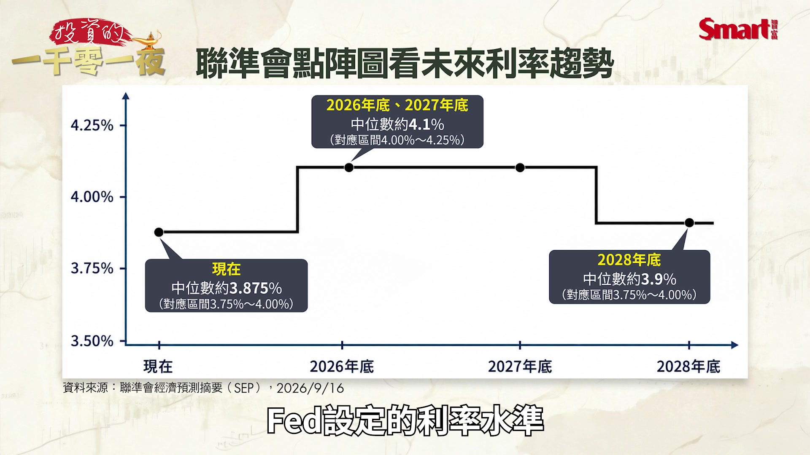

**逐字稿片段：** 那預計到2026年底 中位數會來到4.1% 也就是對應4%到 4.25%這個區間 那麼2027年底 也是4.1% 所以同樣是 4%到4.25%這個區間 值得注意的是2028年底的 這個中位數 是來到了3.9% 對應3.75%到 4%這個區間 也就是 從2027年底 到2028年底 這一個一年的時間裡面 利率是看向下的 那我們可以看前面 是從 這個3.75%到4% 在這個區間 甚至是不是有可能再往上 再升1碼都有機會的 可是到了2027年底 接到2028年之後 反而是又走向降息的趨勢 那4.1%代表什麼 代表到年底前 還要再升1碼 就是升到4%到 4.25%

**話題推測：** 2026年底利率中位數預測（4.1%）的數據點。

---

## 00:04:05

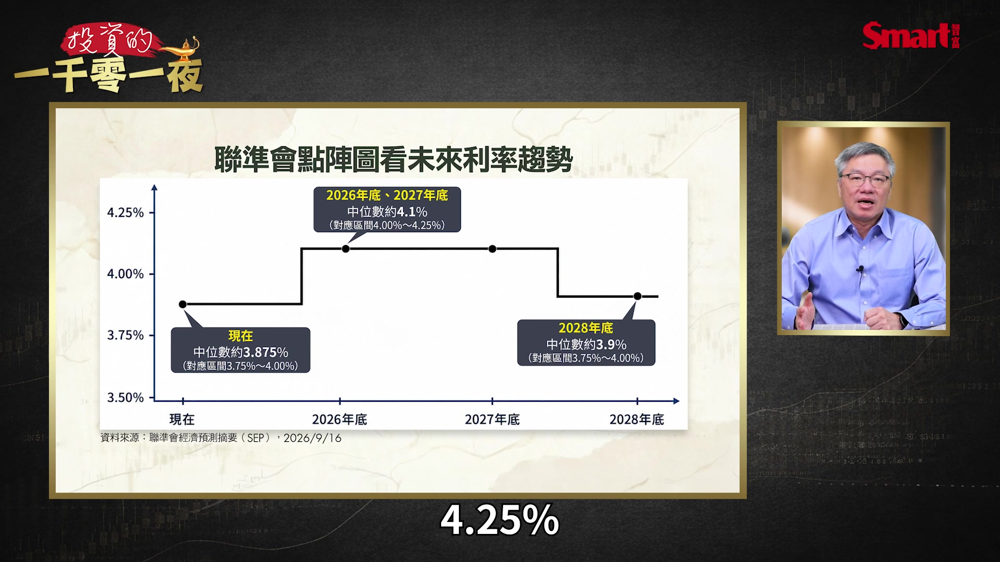

**逐字稿片段：** 那18位官員 有16位認為今年會升 因為今年 剩下2次的會議 其中4位甚至可能 認為會升2次 不過這是比較激進的主張

**話題推測：** 聯準會18位官員中16位認為今年會升息的統計。

---

## 00:04:17

**逐字稿片段：** 那主席怎麼看 就主席華許自己本身 沒有交點陣圖 因為不要讓大家知道 他心裡的自己的想法 不過他在記者會上 有把這次的升息形容成

**話題推測：** 討論聯準會主席對升息的看法。

---

## 00:04:29

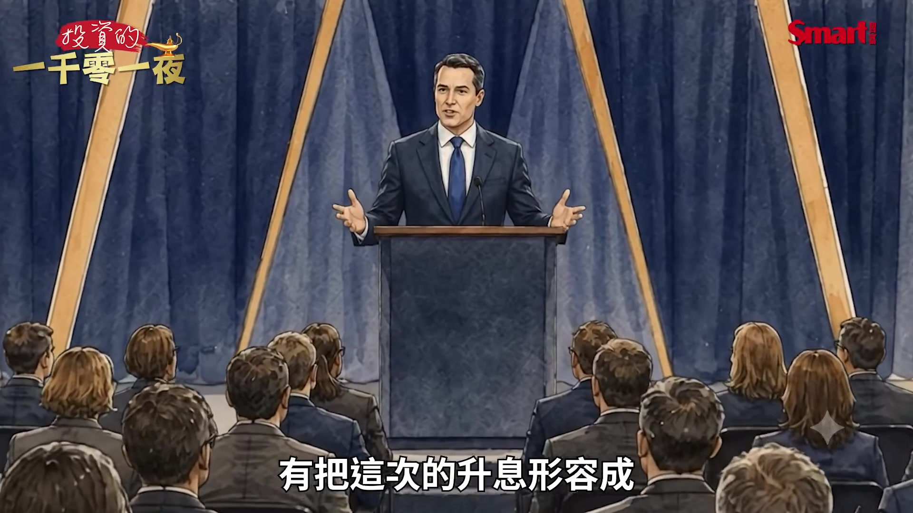

**逐字稿片段：** 我們移除了一部分 貨幣政策的寬鬆 這個說法就是很巧妙 因為他說的是 移除了寬鬆 所以他不覺得 現在的利率已經很緊 他只是移除了 一部分寬鬆 所以這代表 後面還有一些空間

**話題推測：** 引用主席對升息的關鍵形容詞句。

---

## 00:04:47

**逐字稿片段：** 那市場怎麼看 目前期貨市場的預估 就10月28號的那一次 再升1碼的機率 現在大概是5成多 那到12月的會議 之前的這個升息 就是9成 就是因為有2次會議嘛 就是這2次會議裡面 如果要再升1碼的機率 就大概9成 不過大家不要一聽到升息循環 開始很緊張 因為為什麼 我們上一次的升息循環 是2022年那一次 那一次 大家都形容是暴力升息

**話題推測：** 轉向分析期貨市場對升息的預估。

---

## 00:05:16

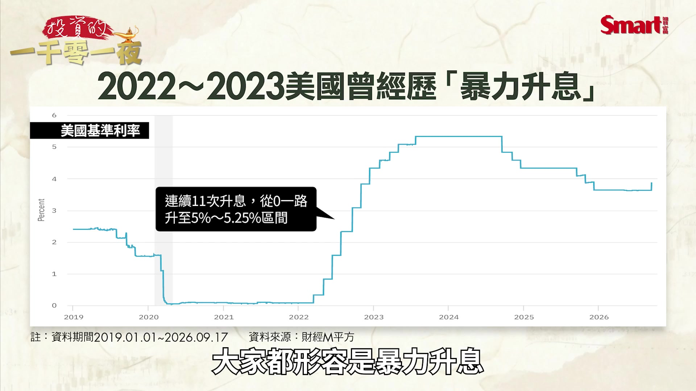

**逐字稿片段：** 因為從2022年到 2023年 一共升息了11次 累積的幅度真的很嚇人 達到525個基點 就是5.25個百分點 把利率從0% 一口氣 就升到了5.25%到 5.50%這個區間 所以那一次造成嚴重的 股債雙殺 如果 從那段時間就開始投資的人 應該印象很深刻 因為債市就尤其是慘烈 不過這一次我們來

**話題推測：** 2022-2023年升息11次、累積幅度達525個基點的數據。

---

## 00:05:46

**逐字稿片段：** 根據目前點陣圖判斷 整個升息應該就是2次 最多最多就3次 那每次只會升1碼 所以升息的高點 應該不會超過 4.25%到4.50% 可是會在高點 停留滿長一段時間 升的不多 但等它要降下來的時間 會等很久 就升的不多降得很慢 這是這一次主要的劇本 那我們再看一下 那為什麼聯準會要升息 因為我們大家都知道 川普很不想要你升息 一直叫你不升息 還叫你降息 那為什麼聯準會你 還是要升息 真正的兇手是油價 我們來看8月的CPI 整體的CPI的年增是 3.4% 看起來是很高的 這也是聯準會 緊張的部分 不過你真的去扣掉 食物跟能源的核心CPI 其實只有2.4% 是2021年3月以來的最低 關鍵在這裡 很明顯嘛 就跟能源有關

**話題推測：** 根據點陣圖判斷本次升息幅度預期。

---

## 00:06:44

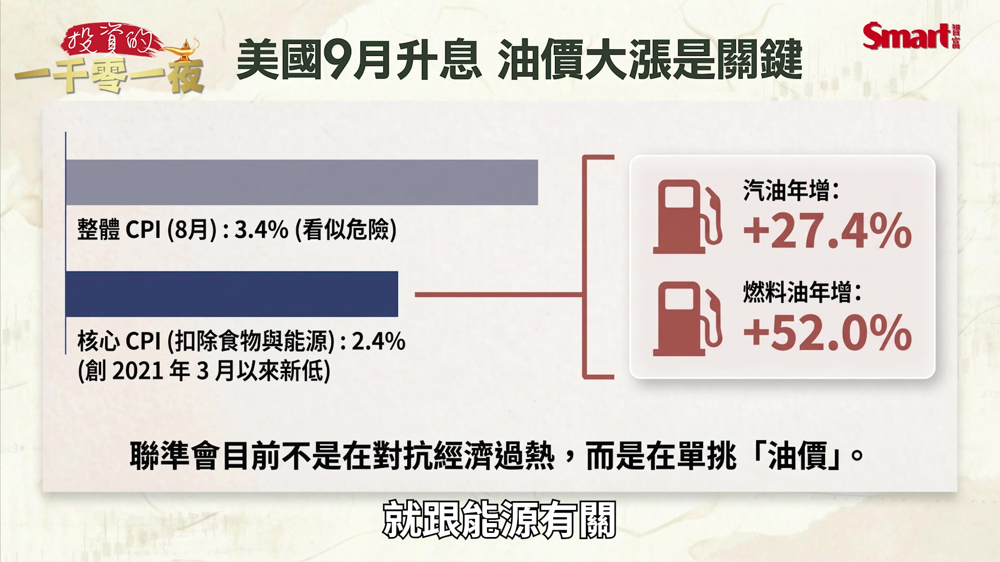

**逐字稿片段：** 汽油年漲了27.4% 那燃料油 就年漲了52% 為什麼油這麼貴 因為今年 這個大家知道

**話題推測：** 汽油年漲27.4%和燃料油年漲52%的具體數字。

---

## 00:06:54

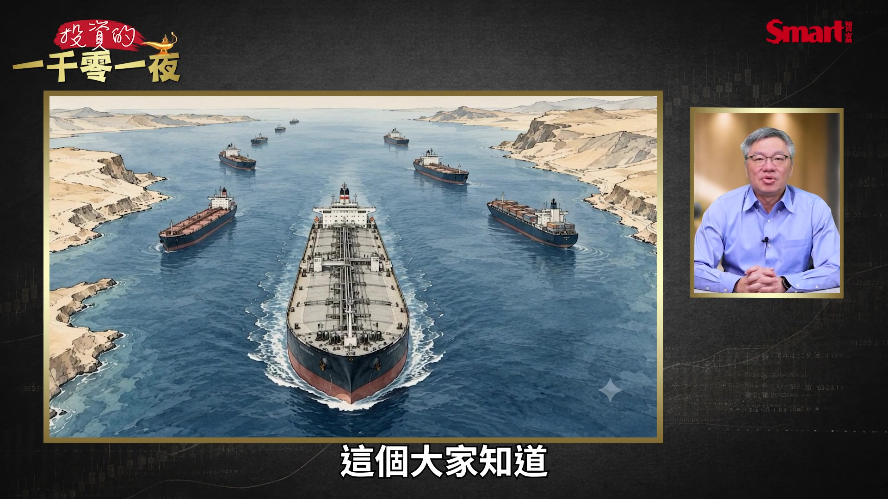

**逐字稿片段：** 今年2月28號 美國跟以色列對伊朗 開戰以來 這個荷莫茲海峽的航運 就嚴重受阻 戰前大概全球有 五分之一的石油 要經過這條海峽

**話題推測：** 2月28號美國與以色列對伊朗開戰的新聞畫面或地圖。

---

## 00:07:06

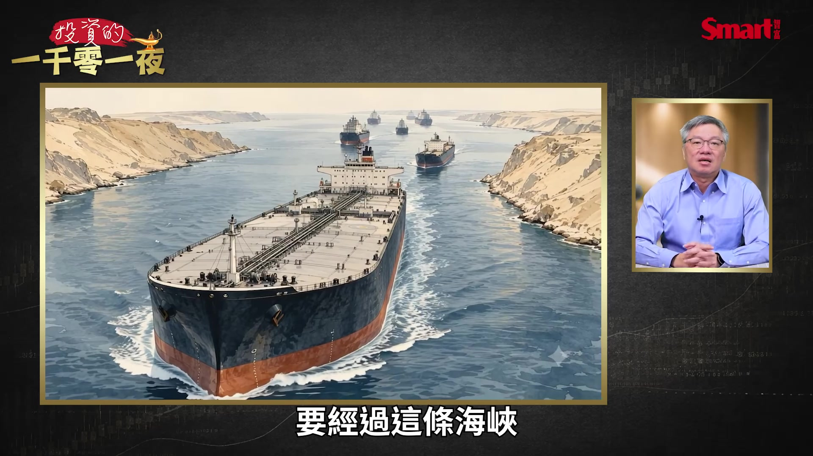

**逐字稿片段：** 那布蘭特原油 在戰前 大概在70美元上下浮動 結果今年9月中 一度逼近要到了 110美元 那最近就在100到 105美元之間震盪 那核心通膨只有2.4% 已經我們說的是相對 這一段期間以來 比較低的 聯準會為什麼 還是一次要 一定要升

**話題推測：** 布蘭特原油從70美元漲到逼近110美元的走勢圖。

---

## 00:07:29

**逐字稿片段：** 關鍵就是在2021年的教訓 因為當年聯準會說 通膨是暫時性的 就是解封之後的一個 短暫需求嘛 結果沒想到 那個所謂的暫時性 通膨居然衝到了 40年的新高 讓聯準會 不得不慌了手腳 開始動手 而且還瘋狂的 我們前面講的就一個暴力升息 那大家後面 就一直罵到現在 覺得你可以早點升 為什麼不緩緩的升 要搞到後來很集中的升 升到 讓那一次的升息 那麼痛苦 所以這一次 聯準會就怕到了 就是說 聯準會這次怕到就是說 油價 把大家對通膨的預期 拉上去 那就會本來預期通膨 變成是真正的通膨 所以一旦預期 跟現實脫錨 你很難把它控制回來 所以寧願先動手 先把它壓制住 那講到油 我們就一定要提到 本來只有荷莫茲海峽的問題 現在又多了胡塞武裝的問題 因為本來 沙烏地阿拉伯的策略 就是 荷莫茲海峽 走不通 它就靠

**話題推測：** 2021年通膨被誤判為『暫時性』的歷史教訓回顧。

---

## 00:08:31

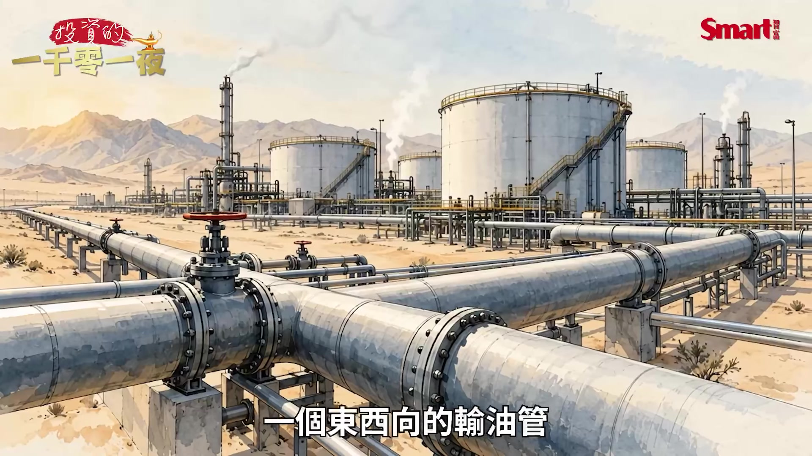

**逐字稿片段：** 一個東西向的輸油管 把這個原油 本來要從東邊 出口的這個石油 輸到沙烏地的西邊 透過紅海這邊的延布港 去出口 這樣就不用 走荷莫茲海峽 那這條管線 設計容量

**話題推測：** 地圖上顯示沙烏地阿拉伯的東西向輸油管線。

---

## 00:08:46

**逐字稿片段：** 每天大概是700萬桶 可是到9月開始 情況突然急轉直下 那有幾個狀況 第一個就是胡塞武裝 居然南下搶地盤 因為本來胡塞武裝 控制葉門的部分 就是離這個 曼德海峽 這個出口這邊 還稍微遠一點 那胡塞武裝 南下搶地盤 就搶下了這個 紅海港口的這個摩卡 那就曼德海峽附近的 這個多座島嶼 也被它們控制下來了 那這個曼德海峽 在過去和平時期 大概承載

**話題推測：** 輸油管線每天700萬桶設計容量的數據。

---

## 00:09:18

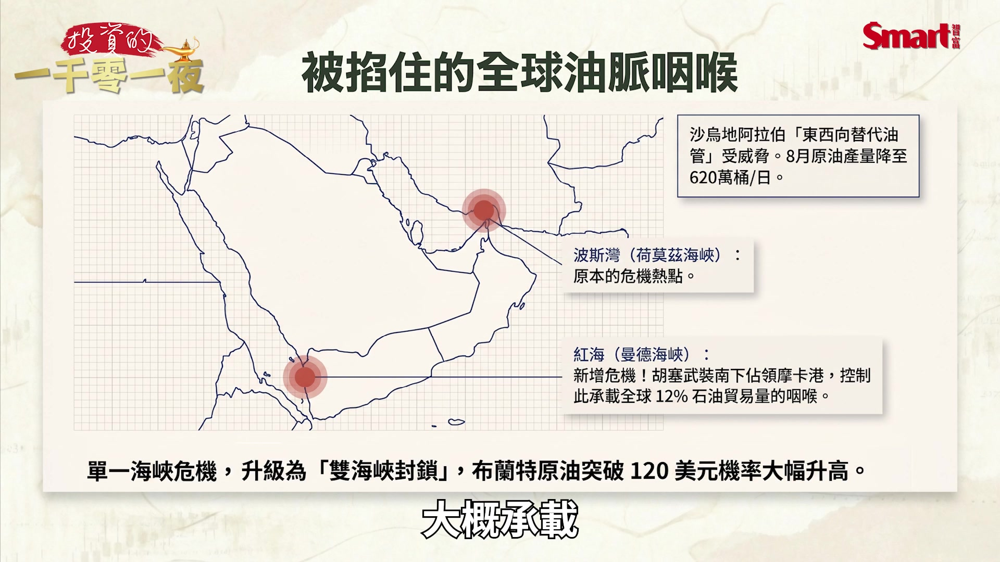

**逐字稿片段：** 全球大約12%的貿易量 那第二個是胡塞武裝 現在對曼德海峽控制力 提高之後 對沙烏地的油輪 經過這邊的影響 就會更大了 所以 接下來就造成了 沙烏地的實際的供給 就減少了 那沙烏地

**話題推測：** 曼德海峽承載全球12%貿易量的數據。

---

## 00:09:34

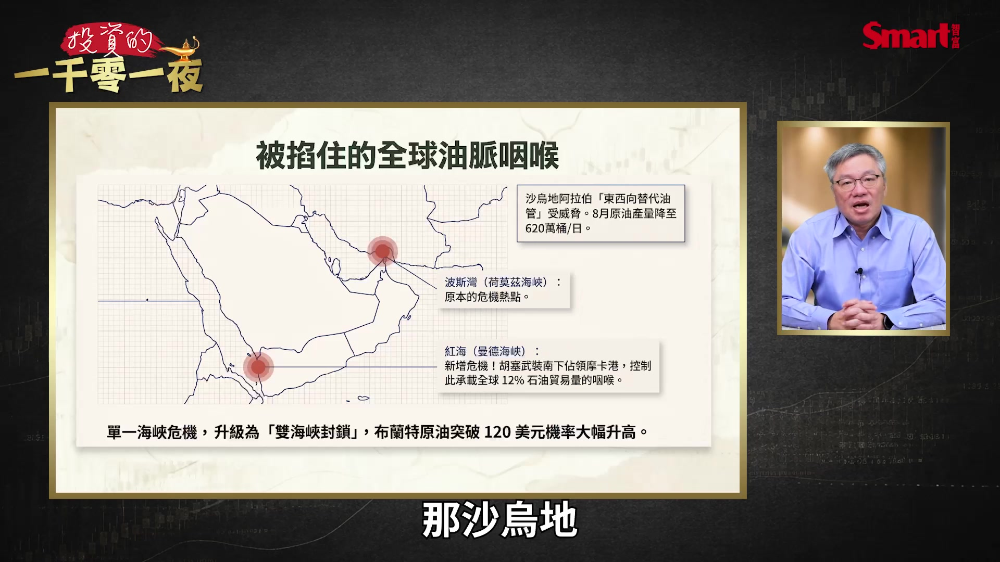

**逐字稿片段：** 8月的原油產量 目前已經降到了 每天620萬桶 這是今年的新低 那沙烏地阿美這家 國營的石油公司 甚至通知了部分的 歐洲客戶說 下個月可能 沒有原油可以交貨了 所以高盛就評估 布蘭特原油漲破120美元的機率 已經升高 那也有分析師警告 就是如果管線 繼續停擺個好幾週 油價甚至可能 往130美元走 那胡塞武裝的出現 它本來 把一個海峽的問題

**話題推測：** 沙烏地阿拉伯8月原油產量降至620萬桶新低的圖表。

---

## 00:10:07

**逐字稿片段：** 變成是兩個海峽的問題 就是整個 在中東這塊地方 兩個重要出口石油的海峽 全部被控制住了 那對通膨 對利率來說 就是一個 很大的尾部風險 我們所謂的尾部風險 是什麼 就是本來在 尾部通常就是機率 發生機率很低 可是如果一旦發生 對現實的衝擊會很大 就是最好不要發生 但發生的話就很難處理 所以我用三個情境 來推估這個狀況 就比較樂觀的情境是 如果管線在8週內修復 那荷莫茲海峽 出現了臨時航道 那布蘭特原油 可能就保持在 80到90美元這個區間 這就是大家現在 稍微可以安心的區間 當然更好 更好一點 是可以回到70美元 那在這種情境下 聯準會的利率趨勢 大概在4%到4.25% 這個區間 應該就會停了 甚至到了2027年下半年 有機會討論要不要降息

**話題推測：** 地圖同時顯示荷莫茲海峽和曼德海峽兩大油運咽喉受阻。

---

## 00:11:02

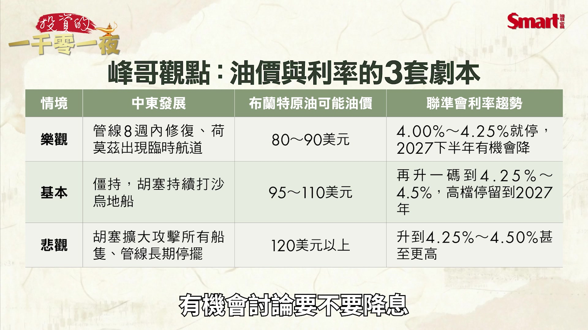

**逐字稿片段：** 持平一點的預測 就是現在這種 兩個海峽的狀況 就僵持住 沒有更壞也沒有更好 那胡塞武裝會持續的打 沙烏地阿拉伯船 那油價就會維持在 95到110美元這個區間 那利率有可能會因為 兩邊海峽的這個衝突 不降溫 就從我們剛才講就是說 本來高機率是會停在 4%到4.25% 就可能再升1碼到 4.25%到4.5%這個區間 然後這個高檔 會一直停留到 2027年的年底 那悲觀一點 就是胡塞 真的攻擊了所有的船隻 讓大家都一起死 那油價就會衝高到 120美元以上 利率 我覺得這裡就很難估了 就是它應該可能會上升到 4.25%到4.5%以上更高了 那到底會高到哪裡 就要看這個油價 最後衝高到哪裡 這個是屬於很難控制的部分

**話題推測：** 持平情境下油價（95-110美元）及利率（4.25%-4.5%）預測。

---

## 00:11:58

**逐字稿片段：** 轉折點什麼時候來 你盯三個訊號 那因為根據點陣圖 那官員預測2027年底 這個PCE的通膨 就是個人消費支出 這個通膨 會回到2.3%附近 那2028年 利率才會降到大概3.9% 這個中位數的水準 也就是說 聯準會自己也認為 真正的降息 要到2027年的很後面 甚至2028年的上半年了 那我自己的判斷是這樣 就是說升息的高點 大約是落在 年底的12月那一次 或是明年初的第一次會議 但是 停止升息到 開始向降息 中間應該會滿長的 也就是說 大概至少要經過 2個季度 甚至是3個季度 是最有可能的 那股價會怎麼樣 其實這波升息前 對股價的反應的修正 已經完成了 所以這一波在 升息的時候 緩緩升息的時候 反而股價 不會受到影響 但是 當市場如果開始 大量討論降息的時候 反而是股市大回檔的 風險會提高 因為如果市場 大量討論降息 就代表 這個降息的急迫性 是很高的 也代表了這個時候的經濟 已經不存在過熱 反而是不是經濟 有降溫的風險 所以這時候反而需要 趕快用寬鬆貨幣 來加持這個市場跟經濟 至於這種情境 什麼時候來 投資人注意

**話題推測：** 影片新章節：升息轉折點的觀察訊號。

---

## 00:13:36

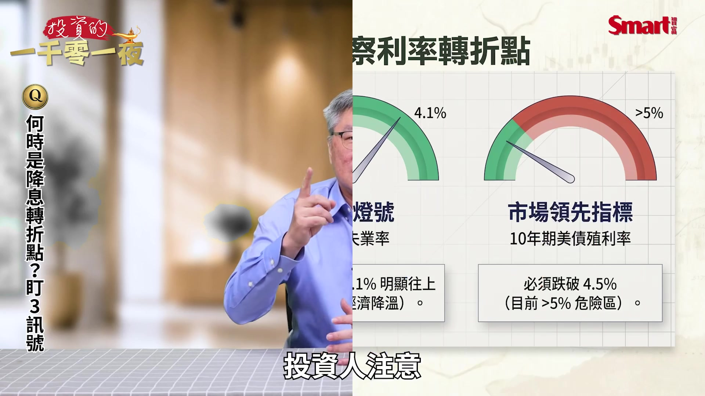

**逐字稿片段：** 訊號一就是 第一個當然油價 就是布蘭特原油 跌回90美元以下 而且要站穩 就是很重要

**話題推測：** 第一個訊號：布蘭特原油跌回90美元以下的走勢圖。

---

## 00:13:43

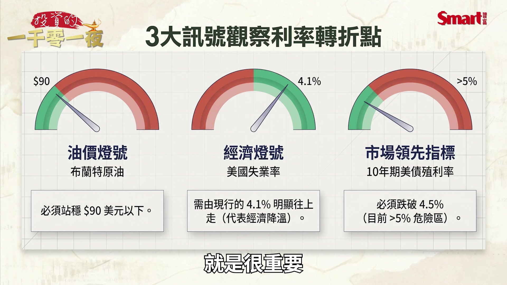

**逐字稿片段：** 那第二個就是勞動市場 這是聯準會最重要的指標 就是它升息 也主要是因為覺得失業率很低 現在預估只有4.1% 就業還很強 所以如果失業率 往上走 就代表經濟轉弱了 聯準會對這個 緊縮貨幣就會煞車 那第三個當然就是市場的指標 就是10年期的美債 10年期美債（殖利率） 如果往下去 跌破4.5% 因為10年期美債 有個領先性 它往下去 現在是5%以上 如果往下跌破4.5% 代表利率趨勢 開始轉變 那這個時候 就可能代表 聯準會的這個 利率趨勢也會轉變 那我們來看

**話題推測：** 第二個訊號：勞動市場失業率上升的圖表。

---

## 00:14:24

**逐字稿片段：** 那對債市的影響是什麼 長債你就先別急 那短債可以先收息 目前10年期美債殖利率 大概是5% 其實看利率是滿高的 那30年期是在5.3% 那我們先講長天期的 殖利率會這麼高 除了因為升息的影響之外 還有一個重要因素 就是美國因為財政赤字大 發債多 所以投資人 信心會比較弱一點 就要求更高的期限溢酬 也就是說 我要把錢借給你 這麼長時間 你當然要多給我 一點利息 多拿一點 補償 那我們這邊還要解釋 一個觀念就是債券存續期間 你可以把它想像 想像成是 債券價格對利率的 敏感度 比如說有一檔

**話題推測：** 影片新章節：升息對債市的影響。

---

## 00:15:08

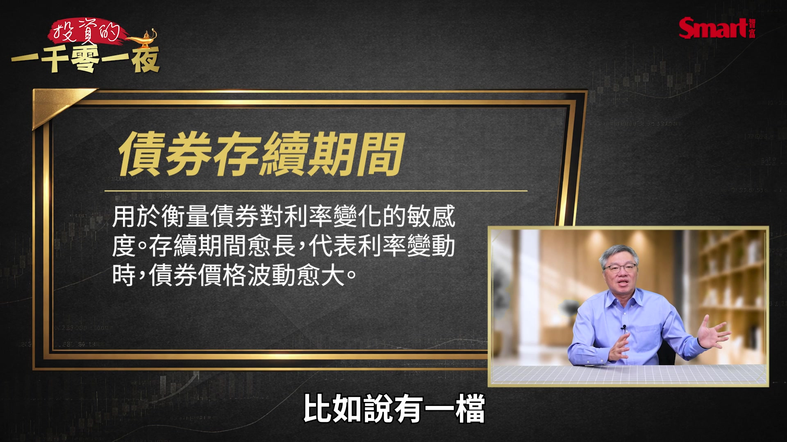

**逐字稿片段：** 長天期美債的ETF 它現在計算出來的 平均存續期間 大概是17年 那簡單來看 它的意思就是 你用殖利率每上升 1個百分點 那價格大約會跌17% 就是這個 1個百分點跟 17年這樣的比較 所以存續期愈長 它的價格波動 就會愈大 那至於我們在債市上面 要怎麼反應

**話題推測：** 以長天期美債ETF為例，說明其17年存續期間及其價格敏感度。

---

## 00:15:33

**逐字稿片段：** 第一個當然就短債 就先收息 短天期的美債 或短天期美債ETF 它的殖利率是 跟著這個升息走高 那價格會波動比較小 所以適合當現金短期的停泊區 那長債我覺得原則上是 先不要加碼 因為雖然10年債 5%以上 利率看起來很有吸引力 不過在這個 利率轉折訊號 出現之前 加碼的話 你有時候可能會碰到一種情況 因為市場 如果悲觀預期說 殖利率會維持這麼高 或還甚至往上衝的話 那代表債券的價格 會存在下跌的壓力 因為利率跟債券價格 是反向的 最後我們來談到對股市的影響 台股這一次對升息的反應 當然是很有意思的 就是升息一開始 股市反而開始上漲 因為我們說短期 最大利空出盡了 所以我們有機會看到 台股在這段期間 一直到年底 拉出這一波 主升段的 最後一波延伸行情 也就是在年底前 有機會再次 改寫新高點 甚至就挑戰5萬點 這是有機會的 不過行情應該會用比較 波折的方式 就是比較小碎步的方式前進 畢竟現在市場的量能 是比較小的 那資金的槓桿也受到 比較多的管制 不再像是 大概前半年是 無限狂奔的資金行情 不過也有一件好事 當然就是這一次 台灣央行 維持利率不變 就幫市場留下了 這個資金的火種 讓這個市場的資金 不會過度的緊縮 但現實上我們還是要 理解一件事 儘管資金面還可以 市場的信心也還不錯 但是台股的估值 已經不便宜了 這一點 是一定要認識的 基本上是過去基本面不錯 可以漲的 或者是有後續 想像題材可以漲的 這些股票 大概至少都漲過一輪 甚至漲過好幾輪的都有 所以你接下來選股 真的會愈來愈難 那如果真的不擅長 選股的人

**話題推測：** 債市投資策略建議：短債收息與長債不加碼的說明。

---

## 00:17:30

**逐字稿片段：** 你用ETF或基金 來參與後面的行情 會更安穩一點 以免漲了指數 你自己手上的股票 沒漲還下跌 這種情形 到第四季一定會更明顯 也就是說真正的 會漲的股票可能 數量是愈來愈少的 而不是那種全面性的大漲

**話題推測：** 建議投資人可透過ETF或基金參與後續行情。

---

## 00:17:47

**逐字稿片段：** 最後總結 總結來看 這一次美國升息 是被油價逼出來 一個防禦性的升息 所以終點我們前面剛才講 最多大概就是 4.25%到4.5% 升的不多 但降的可能會很慢 所以對股市的兩個最大提醒 大家留意 胡塞武裝是最大的不確定性 僵持住可能還好 但是如果升高 衝突升高就很危險 第二個是當市場開始大量討論 降息的時候 反而會是這一次股市 最大的轉折風險的開始 以上就是今天的分享 喜歡我們的節目 歡迎幫我們按讚訂閱分享 以及開啟小鈴鐺 謝謝大家

**話題推測：** 影片結論總結。

---
