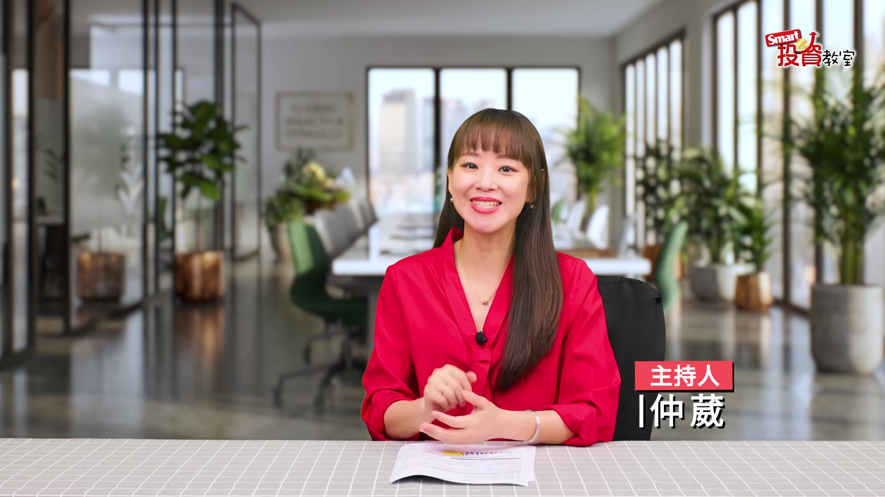
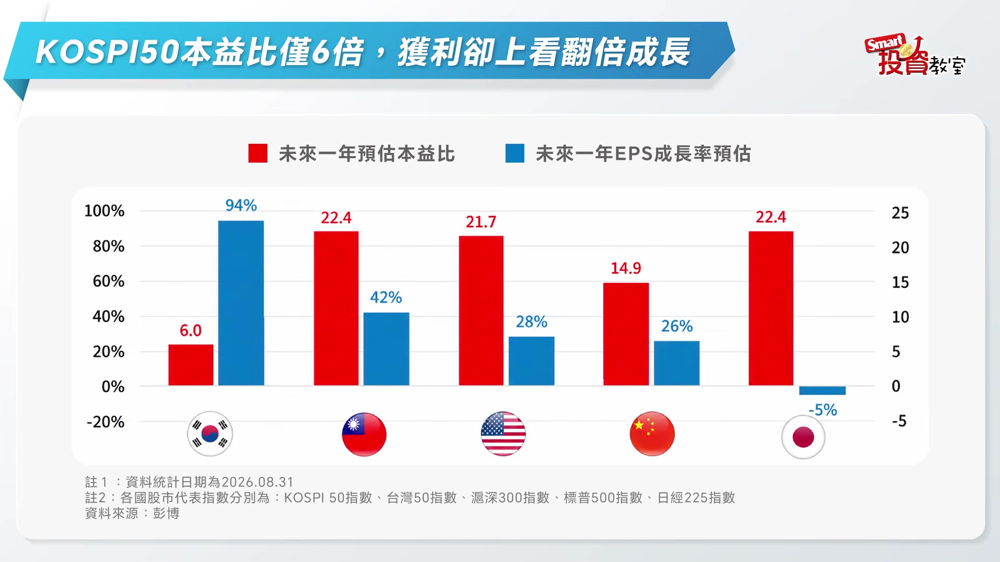
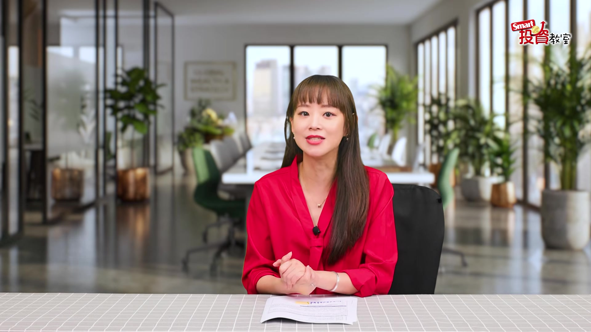
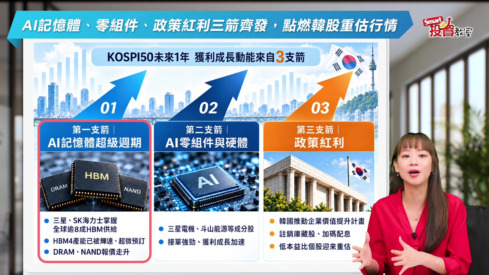
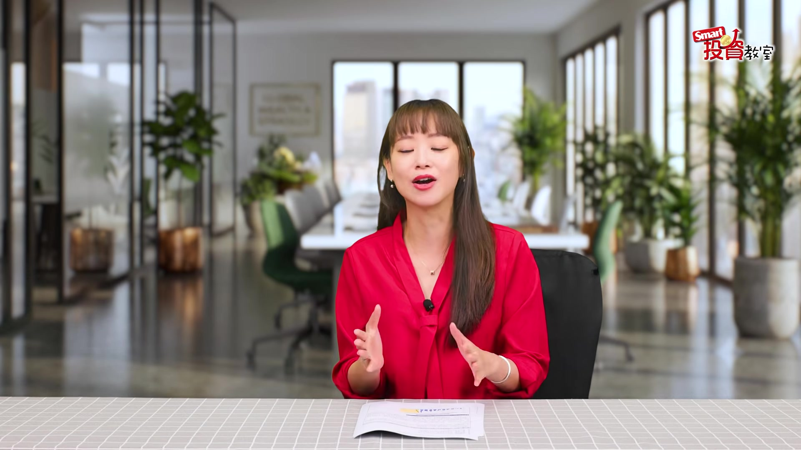

# smartmonthly-bw_WXZqPbEusDA — 關鍵畫面索引

- 來源逐字稿：[smartmonthly-bw_WXZqPbEusDA_GT.srt](smartmonthly-bw_WXZqPbEusDA_GT.srt)
- 影片：https://www.youtube.com/watch?v=WXZqPbEusDA
- 截圖數：6

## 00:00:06

**逐字稿片段：** 今天我們要跟大家來聊一下韓股 韓國KOSPI指數 從今年6月下旬開始喔 一路溜滑梯 短短一個多月裡面 跌幅一度逼近了四成 把全球的投資人嚇到臉都綠了 那現在呢韓股還好嗎 答案是差不多沒事囉 而且啊投資圈已經在談 韓股的反攻號角 可能正要吹響 話說韓股之前慘摔 問題其實不是出在基本面 而是出在籌碼面 講白話一點就是之前呢 借錢玩股票的人太多了 一有風吹草動 就一個接一個被斷頭出場 但是啊壞事有時候 反而是好事喔 我們來看一下這張圖喔 它整理的呢是韓國交易所裡面 所有SK海力士槓桿型ETF的 每日成交量 韓國今年5月27號 開放了單一個股的槓桿ETF 等於是發給散戶一個 用小錢來押大注的新玩具 像是SK海力士喔 這種權值型的槓桿型ETF 不過呢到了8月以後啊 這一塊黃色的區域呢 成交量就像是溜滑梯一樣 直接崩下來 只剩下高峰時的兩成不到 那這代表什麼呢 代表韓股當中槓桿部位 該跑的其實差不多都跑光了 那當這個盤面的浮額 洗得乾乾淨淨 股價它自然就會回歸到基本面 這個時候進場 晚上才可以睡得比較好 那另外一個好事呢 就是摔了這一跤啊 韓股它變便宜了 給大家一個對照組喔 截至8月底 台灣50指數的本益比 是22.4倍 那韓國KOSPI 50呢 只剩下大約6倍 創下了近10年的新低 但是大家不要急著說 便宜沒好貨喔

**話題推測：** 介紹今天的主題：韓股

---

## 00:02:00

**逐字稿片段：** 根據估算啊KOSPI 50 未來一年的預估獲利成長率 可以高達94% 簡單來說獲利差不多要翻一倍啦 你想想看喔 獲利準備要翻倍 但是股價呢卻還趴在10年低點 那不就等於是用骨折價 可以抱回一個 正在高速成長的股票嗎 好那問題來了 KOSPI 50它未來一年 憑什麼可以繳出 這麼猛的獲利成長

**話題推測：** 提出KOSPI 50未來一年的預估獲利成長率數據

---

## 00:02:27

**逐字稿片段：** 靠的是三支箭 第一支AI記憶體的 超級週期正式啟動 三星跟SK海力士這兩家韓企啊 手上握著全球超過八成的HBM 高頻寬記憶體的供給 而最新的HBM4產能 已經被輝達還有超微包下 DRAM NAND的報價 也跟著一路往上飆

**話題推測：** 解釋KOSPI 50未來獲利成長的「三支箭」

---

## 00:02:53

**逐字稿片段：** 那第二支箭呢 AI零組件和硬體供應鏈 接單接到手軟 像是三星電機 斗山能源 這些成分股獲利直接噴出來 而第三支是政策紅利 韓國政府大力的推動 企業價值提升計畫 那也逼著金融龍頭 還有現代汽車 大手筆的註銷庫藏股 加碼配息 把這些便宜的低本益比股 一路往合理的價碼抬上去 三箭一起射出來 這就是韓股反攻的號角 或許有人擔心 韓股產業太集中風險太高 但其實想想喔

**話題推測：** 第二支箭：AI零組件和硬體供應鏈接單暢旺

---

## 00:03:31

**逐字稿片段：** 它跟台股還蠻像的 KOSPI 50是由三星 海力士挑大樑 就跟台股靠著台積電扛旗 是一樣的道理 集中度是高 但是也代表它押中了AI 這條最核心的主賽道

**話題推測：** 將韓股產業集中度與台股進行比較

---

## 00:03:44

**逐字稿片段：** 最後幫大家整理一下喔 這一集呢我們講的是 韓股去槓桿結束 估值超低利多又接力上場 說穿了就是CP值現在非常高 韓股對台灣人來說 或許還有點陌生 但是啊衝著這幾個理由 現在真的值得你 多多了解韓股的投資機會 Smart投資教室 我們下次再見 投資一定有風險 基金投資有賺有賠 申購前應詳閱公開說明書

**話題推測：** 總結韓股投資機會的關鍵點

---
